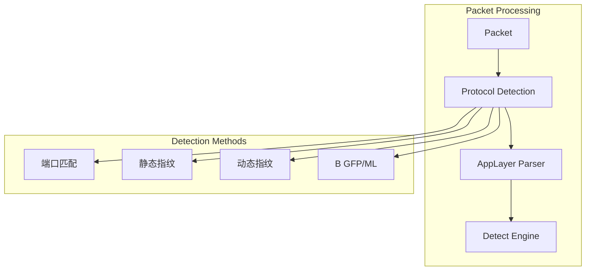
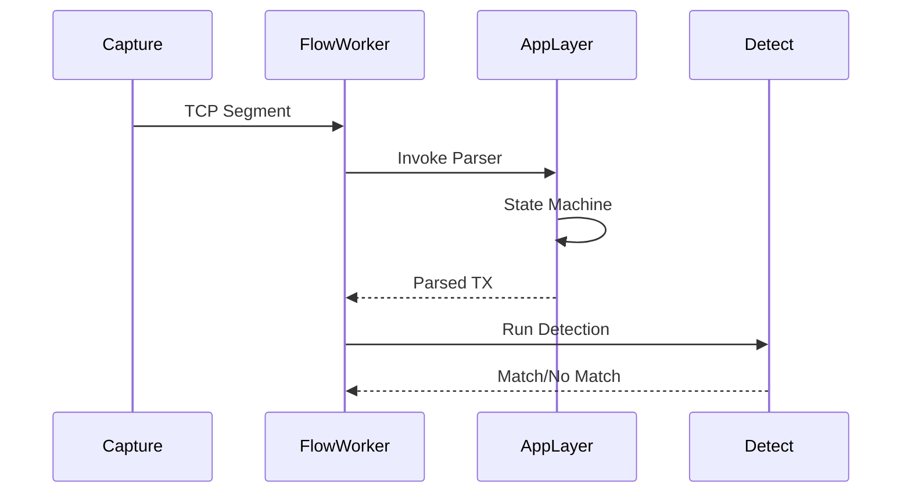
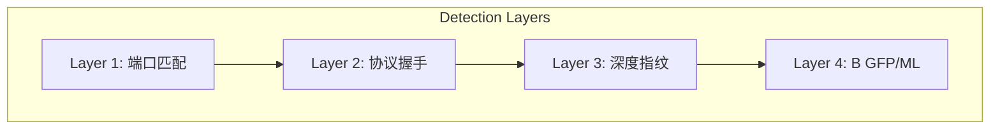
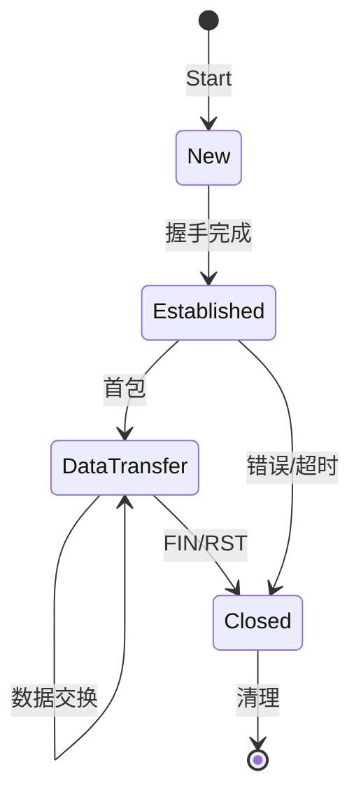

> [!info] Suricata 2026 深度探索系列
> 0. [[2026-04-15-suricata-deep-dive-series-index|全栈学习路径总览]]
> 1. [[2026-04-15-suricata-deep-dive-ch1-overview|第一章：Suricata 概述]]
> 2. [[2026-04-15-suricata-deep-dive-ch2-config|第二章：Suricata 配置系统]]
> 3. [[2026-04-15-suricata-deep-dive-ch3-runmodes|第三章：Runmodes 运行模式]]
> 4. [[2026-04-15-suricata-deep-dive-ch4-thread-model|第四章：线程模型]]
> 5. [[2026-04-15-suricata-deep-dive-ch5-capture|第五章：Capture 初始化]]
> 6. [[2026-04-15-suricata-deep-dive-ch6-af-packet|第六章：AF-PACKET 接口]]
> 7. [[2026-04-15-suricata-deep-dive-ch7-pcap|第七章：PCAP 接口]]
> 8. [[2026-04-15-suricata-deep-dive-ch8-nfq|第八章：NFQ 与 PF_RING 模式]]
> 9. [[2026-04-15-suricata-deep-dive-ch9-dpdk|第九章：DPDK 接口]]
> 10. [[2026-04-15-suricata-deep-dive-ch10-loadbalancing|第十章：多线程抓包与负载均衡]]
> 11. [[2026-04-15-suricata-deep-dive-ch11-detect-engine|第十一章：检测引擎架构]]
> 12. [[2026-04-15-suricata-deep-dive-ch12-signatures|第十二章：规则解析]]
> 13. [[2026-04-15-suricata-deep-dive-ch13-mpm|第十三章：多模式匹配]]
> 14. [[2026-04-15-suricata-deep-dive-ch14-filemagic|第十四章：文件识别]]
> 15. [[2026-04-15-suricata-deep-dive-ch15-lua-detect|第十五章：Lua 检测]]
> 16. **第十六章：应用层协议解析**

---

## 1. AppLayer 框架概述

Suricata 的 **AppLayer**（Application Layer Protocol Detection & Parsing）模块负责解析网络流量中的应用层协议（如 HTTP、DNS、TLS、SMB 等）。与传统的端口匹配不同，AppLayer 通过协议检测（Protocol Detection）自动识别协议类型，然后调用对应的解析器进行深度解析。



### 1.1 协议检测 vs 协议解析

| 阶段 | 职责 | 输入 | 输出 |
|:---|:---|:---|:---|
| **Protocol Detection** | 识别协议类型 | 原始包数据 | 协议类型（HTTP/DNS/TLS 等） |
| **Protocol Parsing** | 解析协议内容 | 协议数据 | 结构化数据（状态、头部、body） |

### 1.2 AppLayer 数据流



---

## 2. AppLayer 核心数据结构

### 2.1 AppLayer 协议注册表

```c
// src/applayer.h — AppLayer 协议定义
typedef struct AppLayerProtocol_ {
    /* 协议名称 */
    const char *name;
    
    /* 协议 ID */
    AppProto id;
    
    /* 最小协议头长度 */
    uint16_t min_header_len;
    
    /* 默认端口 */
    uint16_t default_port;
    
    /* 协议检测函数 */
    AppLayerProtoDetectFunc ProtocolDetection;
    
    /* 解析器函数 */
    AppLayerParserFunc *Parser;
    
    /* 状态机 */
    AppLayerStateFunc *StateAlloc;
    AppLayerStateFunc *StateFree;
    
    /* TX 清理函数 */
    AppLayerTxCleanupFunc *TxCleanup;
    
    /* TX 日志函数 */
    AppLayerTxLogFunc *TxLogFunc;
    
    /* 标志位 */
    uint32_t flags;
#define APP_LAYER_PROTO_TLS      0x01
#define APP_LAYER_PROTO_DNS      0x02
#define APP_LAYER_PROTO_HTTP     0x04
#define APP_LAYER_PROTO_SMB      0x08
#define APP_LAYER_PROTO_SSH      0x10
#define APP_LAYER_PROTO_FTP      0x20
} AppLayerProtocol;

// 全局协议注册表
static AppLayerProtocol *app_layer_protocols[ALPROTO_MAX];
```

### 2.2 AppLayer State

```c
// src/applayer.h — AppLayer 状态
typedef struct AppLayerState_ {
    /* 协议状态 */
    void *proto_ctx;           // 协议特定上下文
    
    /* 事务列表 */
    AppLayerTx *txs;          // 事务链表
    uint64_t tx_cnt;          // 事务计数
    
    /* 解析状态 */
    uint8_t parser_status;    // 解析器状态
    uint8_t探测状态;          // 协议检测状态
    
    /* Stream 缓冲 */
    StreamBuffer *sb;         // Stream 重组缓冲
    uint64_t bytes_consumed;  // 已消费字节数
    
    /* 标志位 */
    uint32_t flags;
#define APP_LAYER_STATE_BLOCK_PARSING   0x01  // 阻止解析
#define APP_LAYER_STATE_EOF             0x02  // 连接结束
#define APP_LAYER_STATE_ERROR           0x04  // 解析错误
} AppLayerState;
```

### 2.3 AppLayer Transaction

```c
// src/applayer.h — AppLayer 事务
typedef struct AppLayerTx_ {
    /* TX ID */
    uint64_t tx_id;
    
    /* 协议 */
    AppProto alproto;
    
    /* 事务状态 */
    uint8_t tx救护;            // 救护/完成状态
    uint8_t state;             // 事务状态
    
    /* 时间戳 */
    struct timeval start_time;
    struct timeval last_time;
    
    /* 请求/响应数据 */
    void *request;            // 请求数据
    void *response;           // 响应数据
    
    /* 协议特定数据 */
    union {
        HTPHTx *http;         // HTTP 事务
        DNSQuery *dns;         // DNS 查询
        SSLState *ssl;         // TLS 状态
    } proto;
    
    /* 日志标志 */
    uint32_t logged;
    
    /* 标志位 */
    uint32_t flags;
} AppLayerTx;
```

---

## 3. 协议检测

### 3.1 多层检测机制

Suricata 使用 **多层检测** 来识别协议类型：



### 3.2 端口匹配检测

```c
// src/app-layer-detect-proto.c — 端口匹配
static AppProto AppLayerProtoDetectByPort(
    Flow *f, uint8_t ipproto, uint16_t port, uint8_t direction)
{
    /* 查找端口对应的协议 */
    Port *p = PortGet(port);
    if (p == NULL) {
        return ALPROTO_UNKNOWN;
    }
    
    /* 返回协议 */
    if (direction == STREAM_TOCLIENT) {
        return p->probing_parser_c2s;
    } else {
        return p->probing_parser_s2c;
    }
}

// src/app-layer-proto-probes.c — 内置端口映射
static Port prohing_port_table[] = {
    { 80,   ALPROTO_HTTP,     "http" },
    { 443,  ALPROTO_TLS,      "tls" },
    { 53,   ALPROTO_DNS,      "dns" },
    { 445,  ALPROTO_SMB,      "smb" },
    { 22,   ALPROTO_SSH,      "ssh" },
    { 21,   ALPROTO_FTP,      "ftp" },
    { 25,   ALPROTO_SMTP,     "smtp" },
    { 110,  ALPROTO_POP3,     "pop3" },
    { 143,  ALPROTO_IMAP,     "imap" },
    { /* terminator */ },
};
```

### 3.3 协议握手检测

```c
// src/app-layer-proto-detect.c — HTTP 检测
static AppLayerProtoDetectFuncResult HTTPProbingParser(
    Flow *f, uint8_t *input, uint32_t input_len, uint8_t direction)
{
    /* 检查最小长度 */
    if (input_len < 4) {
        return APP_LAYER_PROTO_DETECT_FAILED;
    }
    
    /* HTTP 请求检测 */
    if (direction == STREAM_TOSERVER) {
        /* 检查是否是 HTTP 请求行 */
        if (memcmp(input, "GET ", 4) == 0 ||
            memcmp(input, "POST ", 5) == 0 ||
            memcmp(input, "HEAD ", 5) == 0 ||
            memcmp(input, "PUT ", 4) == 0 ||
            memcmp(input, "DELETE ", 7) == 0 ||
            memcmp(input, "OPTIONS ", 8) == 0 ||
            memcmp(input, "CONNECT ", 8) == 0) {
            
            /* 检查是否包含完整的请求行 */
            uint8_t *crlf = memmem(input, input_len, "\r\n", 2);
            if (crlf != NULL) {
                return APP_LAYER_PROTO_DETECT_SUCCESS;
            }
        }
        
        /* 检查是否是 HTTP 响应 */
        if (memcmp(input, "HTTP/", 5) == 0) {
            return APP_LAYER_PROTO_DETECT_SUCCESS;
        }
    }
    
    return APP_LAYER_PROTO_DETECT_FAILED;
}

// src/app-layer-proto-detect.c — TLS 检测
static AppLayerProtoDetectFuncResult TLSProbingParser(
    Flow *f, uint8_t *input, uint32_t input_len, uint8_t direction)
{
    /* TLS 记录层检测 */
    if (input_len < 5) {
        return APP_LAYER_PROTO_DETECT_FAILED;
    }
    
    /* 检查 TLS Content Type */
    if (input[0] >= 0x14 && input[0] <= 0x17) {
        /* 检查 TLS Version */
        if (input[1] == 0x03 && input[2] <= 0x03) {
            return APP_LAYER_PROTO_DETECT_SUCCESS;
        }
    }
    
    return APP_LAYER_PROTO_DETECT_FAILED;
}
```

### 3.4 深度指纹检测

```c
// src/app-layer-proto-detect.c — DNS 检测
static AppLayerProtoDetectFuncResult DNSProbingParser(
    Flow *f, uint8_t *input, uint32_t input_len, uint8_t direction)
{
    /* DNS 头部固定 12 字节 */
    if (input_len < 12) {
        return APP_LAYER_PROTO_DETECT_FAILED;
    }
    
    /* 解析 DNS 头部 */
    uint16_t tx_id = *((uint16_t *)input);
    uint16_t flags = *((uint16_t *)(input + 2));
    uint16_t questions = *((uint16_t *)(input + 4));
    
    /* 检查 DNS 标志 */
    /* QR(1) + OPCODE(4) + AA(1) + TC(1) + RD(1) + RA(1) + Z(3) + RCODE(4) */
    if ((flags & 0x8000) == 0) {  /* 查询标志 */
        /* 检查是否为标准查询 */
        uint8_t opcode = (flags >> 11) & 0x0F;
        if (opcode <= 2 && questions > 0) {
            return APP_LAYER_PROTO_DETECT_SUCCESS;
        }
    }
    
    return APP_LAYER_PROTO_DETECT_FAILED;
}
```

---

## 4. 协议解析器注册

### 4.1 注册流程

```c
// src/app-layer-register.c — 注册 AppLayer 解析器
int AppLayerRegisterProtocol(const char *name, AppProto id, 
                             AppLayerParserFunc *parser)
{
    /* 检查协议 ID 有效性 */
    if (id >= ALPROTO_MAX) {
        SCLogError("Invalid protocol ID: %d", id);
        return -1;
    }
    
    /* 分配协议结构 */
    AppLayerProtocol *p = SCCalloc(1, sizeof(AppLayerProtocol));
    if (p == NULL) {
        return -1;
    }
    
    /* 设置协议属性 */
    p->name = name;
    p->id = id;
    p->Parser = parser;
    
    /* 添加到注册表 */
    app_layer_protocols[id] = p;
    
    /* 注册协议检测函数 */
    AppLayerProtoDetectRegister(id, p->ProtocolDetection);
    
    SCLogInfo("Registered app-layer protocol: %s (id=%d)", name, id);
    
    return 0;
}
```

### 4.2 内置协议注册

```c
// src/app-layer-protocols.c — 内置协议初始化
void AppLayerSetup(void)
{
    /* HTTP */
    AppLayerRegisterProtocol("http", ALPROTO_HTTP, HTTPParse);
    
    /* DNS */
    AppLayerRegisterProtocol("dns", ALPROTO_DNS, DNSParser);
    
    /* TLS */
    AppLayerRegisterProtocol("tls", ALPROTO_TLS, TLSParse);
    
    /* SMB */
    AppLayerRegisterProtocol("smb", ALPROTO_SMB, SMBParse);
    
    /* SSH */
    AppLayerRegisterProtocol("ssh", ALPROTO_SSH, SSHParse);
    
    /* FTP */
    AppLayerRegisterProtocol("ftp", ALPROTO_FTP, FTPParse);
    
    /* SMTP */
    AppLayerRegisterProtocol("smtp", ALPROTO_SMTP, SMTPParse);
    
    /* SMTP */
    AppLayerRegisterProtocol("imap", ALPROTO_IMAP, IMAPParse);
    
    /* POP3 */
    AppLayerRegisterProtocol("pop3", ALPROTO_POP3, POP3Parse);
    
    /* HTTP/2 */
    AppLayerRegisterProtocol("http2", ALPROTO_HTTP2, HTTP2Parse);
}
```

---

## 5. 状态机管理

### 5.1 状态机概述

每个协议解析器维护自己的状态机，状态机管理连接的协议状态转换：



### 5.2 状态分配与释放

```c
// src/app-layer-state.c — 状态分配
void *AppLayerStateAlloc(AppProto alproto, uint8_t direction)
{
    void *state = NULL;
    
    switch (alproto) {
        case ALPROTO_HTTP:
            state = HTPStateAlloc();
            break;
        case ALPROTO_DNS:
            state = DNSStateAlloc();
            break;
        case ALPROTO_TLS:
            state = SSLStateAlloc();
            break;
        case ALPROTO_SMB:
            state = SMBStateAlloc();
            break;
        case ALPROTO_HTTP2:
            state = HTTP2StateAlloc();
            break;
        default:
            SCLogWarning("No state allocator for protocol: %s", 
                         AppLayerGetProtocolName(alproto));
            return NULL;
    }
    
    return state;
}

// src/app-layer-state.c — 状态释放
void AppLayerStateFree(void *state, AppProto alproto)
{
    if (state == NULL) {
        return;
    }
    
    switch (alproto) {
        case ALPROTO_HTTP:
            HTPStateFree((HtpState *)state);
            break;
        case ALPROTO_DNS:
            DNSStateFree((DNSState *)state);
            break;
        case ALPROTO_TLS:
            SSLStateFree((SSLState *)state);
            break;
        case ALPROTO_SMB:
            SMBStateFree((SMBState *)state);
            break;
        case ALPROTO_HTTP2:
            HTTP2StateFree((HTTP2State *)state);
            break;
    }
}
```

### 5.3 状态转换示例：HTTP

```c
// src/app-layer-http.c — HTTP 状态机
typedef enum {
    HTTP_STATE_NONE = 0,           // 无状态
    HTTP_STATE_REQUEST_LINE,       // 请求行
    HTTP_STATE_REQUEST_HEADERS,    // 请求头
    HTTP_STATE_REQUEST_BODY,       // 请求体
    HTTP_STATE_RESPONSE_LINE,      // 响应行
    HTTP_STATE_RESPONSE_HEADERS,   // 响应头
    HTTP_STATE_RESPONSE_BODY,      // 响应体
    HTTP_STATE_DONE,               // 完成
    HTTP_STATE_ERROR,              // 错误
} HTTPStateMachine;

static HTTPStateMachine HTTPStateTransition(
    HTTPStateMachine current, HTTPEvent event)
{
    switch (current) {
        case HTTP_STATE_NONE:
            if (event == HTTP_EVENT_REQUEST_LINE) {
                return HTTP_STATE_REQUEST_LINE;
            }
            break;
            
        case HTTP_STATE_REQUEST_LINE:
            if (event == HTTP_EVENT_HEADERS_COMPLETE) {
                return HTTP_STATE_REQUEST_HEADERS;
            } else if (event == HTTP_EVENT_ERROR) {
                return HTTP_STATE_ERROR;
            }
            break;
            
        case HTTP_STATE_REQUEST_HEADERS:
            if (event == HTTP_EVENT_BODY_COMPLETE) {
                return HTTP_STATE_REQUEST_BODY;
            } else if (event == HTTP_EVENT_RESPONSE_LINE) {
                return HTTP_STATE_RESPONSE_LINE;
            }
            break;
            
        case HTTP_STATE_RESPONSE_LINE:
            if (event == HTTP_EVENT_HEADERS_COMPLETE) {
                return HTTP_STATE_RESPONSE_HEADERS;
            }
            break;
            
        case HTTP_STATE_RESPONSE_HEADERS:
            if (event == HTTP_EVENT_BODY_COMPLETE) {
                return HTTP_STATE_RESPONSE_BODY;
            } else if (event == HTTP_EVENT_CONNECTION_CLOSE) {
                return HTTP_STATE_DONE;
            }
            break;
            
        case HTTP_STATE_RESPONSE_BODY:
            if (event == HTTP_EVENT_BODY_COMPLETE) {
                return HTTP_STATE_DONE;
            }
            break;
    }
    
    return HTTP_STATE_ERROR;
}
```

---

## 6. Stream 数据处理

### 6.1 Stream 缓冲

AppLayer 解析器依赖 Stream 重组引擎提供的重组数据：

```c
// src/app-layer-stream.c — Stream 缓冲结构
typedef struct AppLayerStreamBuffer_ {
    /* 缓冲数据 */
    uint8_t *data;
    uint32_t data_len;
    
    /* 缓冲偏移 */
    uint64_t offset;
    
    /* 流的完整性标志 */
    uint8_t flags;
#define APP_LAYER_STREAM_BUFFER_COMPLETE  0x01  // 完整数据
#define APP_LAYER_STREAM_BUFFER_TRUNCATED 0x02  // 截断数据
    
    /* 下一个缓冲 */
    struct AppLayerStreamBuffer_ *next;
} AppLayerStreamBuffer;
```

### 6.2 获取 Stream 数据

```c
// src/app-layer-parser.c — 获取重组数据
int AppLayerRequestGetData(
    Flow *f, AppLayerStreamBuffer **buffer, uint32_t *offset)
{
    /* 获取 Stream-TCP 状态 */
    TcpSession *ssn = (TcpSession *)f->protoctx;
    if (ssn == NULL) {
        return -1;
    }
    
    /* 获取服务器到客户端的重组数据 */
    StreamTcpReassemblyGetData(ssn, STREAM_TOSERVER, buffer, offset);
    
    return 0;
}
```

---

## 7. 配置选项

### 7.1 app-layer.protocols 配置

```yaml
# suricata.yaml
app-layer:
  protocols:
    # 协议解析器配置
    http:
      enabled: yes
      detection-ports:
        toserver: [80, 8080, 8443]
        toclient: [80, 8080, 8443]
      body-limit: 4096
      body-inspect-min-size: 32768
      body-inspect-window: 400
      
    tls:
      enabled: yes
      detection-ports:
        toserver: [443]
        toclient: [443]
      observe-response: yes
      encrypts-handling: yes
      
    dns:
      enabled: yes
      tcp:
        enabled: yes
        detection-ports:
          toserver: [53]
          toclient: [53]
      udp:
        enabled: yes
        detection-ports:
          toserver: [53]
          toclient: [53]
      max-records: 100
      
    smb:
      enabled: yes
      detection-ports:
        toserver: [445]
        toclient: [445]
      max-tx: 100
      
    ssh:
      enabled: yes
      detection-ports:
        toserver: [22]
        toclient: [22]
      banner-length: 100
```

### 7.2 配置解析

```c
// src/app-layer-config.c — 配置解析
static int AppLayerLoadConfig(AppLayerProtocol *p, YamlNode *node)
{
    /* 解析 enabled */
    const char *enabled = YamlNodeLookup(node, "enabled");
    if (enabled && strcmp(enabled, "yes") == 0) {
        p->flags |= APP_LAYER_PROTO_ENABLED;
    } else {
        p->flags &= ~APP_LAYER_PROTO_ENABLED;
    }
    
    /* 解析 detection-ports */
    YamlNode *ports = YamlNodeLookup(node, "detection-ports");
    if (ports) {
        ParseDetectionPorts(p, ports);
    }
    
    /* 解析协议特定配置 */
    if (strcmp(p->name, "http") == 0) {
        return HTTPConfigParse(p, node);
    } else if (strcmp(p->name, "tls") == 0) {
        return TLSConfigParse(p, node);
    } else if (strcmp(p->name, "dns") == 0) {
        return DNSConfigParse(p, node);
    }
    
    return 0;
}
```

---

## 8. 事务管理

### 8.1 Transaction 结构

每个协议解析器维护事务列表：

```c
// src/app-layer-tx.c — 事务管理
typedef struct AppLayerTxList_ {
    AppLayerTx **txs;         // 事务数组
    uint64_t tx_count;        // 事务数
    uint64_t tx_index;        // 当前事务索引
    
    /* 同步锁 */
    SCMutex mutex;
} AppLayerTxList;
```

### 8.2 事务创建

```c
// src/app-layer-tx.c — 创建事务
AppLayerTx *AppLayerTxCreate(AppLayerState *state, AppProto alproto)
{
    AppLayerTx *tx = SCCalloc(1, sizeof(AppLayerTx));
    if (tx == NULL) {
        return NULL;
    }
    
    /* 设置基本属性 */
    tx->tx_id = state->tx_cnt++;
    tx->alproto = alproto;
    tx->start_time = current_time();
    tx->last_time = current_time();
    
    /* 添加到事务列表 */
    if (state->txs == NULL) {
        state->txs = tx;
    } else {
        /* 追加到链表末尾 */
        AppLayerTx *last = state->txs;
        while (last->next != NULL) {
            last = last->next;
        }
        last->next = tx;
    }
    
    return tx;
}
```

### 8.3 事务查找

```c
// src/app-layer-tx.c — 查找事务
AppLayerTx *AppLayerTxGet(AppLayerState *state, uint64_t tx_id)
{
    AppLayerTx *tx = state->txs;
    
    while (tx != NULL) {
        if (tx->tx_id == tx_id) {
            return tx;
        }
        tx = tx->next;
    }
    
    return NULL;
}
```

---

## 9. 日志输出

### 9.1 TX 日志函数

```c
// src/app-layer-log.c — TX 日志接口
typedef struct AppLayerTxLogFunc_ {
    const char *name;
    AppLayerTxLogFunc *func;
    TmmId tmm_id;
    LogId log_id;
    uint8_t alproto;
    uint8_t direction;
} AppLayerTxLogFunc;

// 日志函数注册
int AppLayerRegisterTxLogger(const char *name, AppProto alproto,
                              AppLayerTxLogFunc *func)
{
    AppLayerTxLogFunc *log = SCCalloc(1, sizeof(AppLayerTxLogFunc));
    log->name = name;
    log->alproto = alproto;
    log->func = func;
    
    /* 添加到日志列表 */
    if (alproto == ALPROTO_HTTP) {
        HTTP_LOGGERS_ADD(log);
    } else if (alproto == ALPROTO_DNS) {
        DNS_LOGGERS_ADD(log);
    }
    
    return 0;
}
```

### 9.2 EVE JSON 输出

```json
{
    "timestamp": "2026-04-15T16:00:00.000000+0000",
    "event_type": "http",
    "src_ip": "192.168.1.100",
    "src_port": 54321,
    "dest_ip": "93.184.216.34",
    "dest_port": 80,
    "http": {
        "hostname": "example.com",
        "uri": "/index.html",
        "status": 200,
        "length": 1234,
        "user_agent": "Mozilla/5.0",
        "content_type": "text/html"
    }
}
```

---

## 10. 错误处理

### 10.1 解析错误处理

```c
// src/app-layer-errors.c — 错误处理
typedef enum {
    APP_LAYER_ERROR_OK = 0,
    APP_LAYER_ERROR_INCOMPLETE,
    APP_LAYER_ERROR_INVALID_DATA,
    APP_LAYER_ERROR_NO_MEM,
    APP_LAYER_ERROR_PROTOCOL,
    APP_LAYER_ERROR_TIMEOUT,
} AppLayerError;

static AppLayerError HandleParserError(
    AppLayerState *state, int error_code)
{
    switch (error_code) {
        case -1:  /* Eagain */
            return APP_LAYER_ERROR_INCOMPLETE;
        case -2:  /* Invalid data */
            state->flags |= APP_LAYER_STATE_ERROR;
            return APP_LAYER_ERROR_INVALID_DATA;
        case -3:  /* No memory */
            return APP_LAYER_ERROR_NO_MEM;
        default:
            return APP_LAYER_ERROR_PROTOCOL;
    }
}
```

### 10.2 错误恢复

```c
// src/app-layer-recovery.c — 错误恢复
static int AppLayerRecoverFromError(
    Flow *f, AppProto alproto, AppLayerError err)
{
    switch (err) {
        case APP_LAYER_ERROR_INVALID_DATA:
            /* 跳过当前数据块 */
            StreamSkipBytes(f, f->bytes_skipped);
            return 0;
            
        case APP_LAYER_ERROR_TIMEOUT:
            /* 尝试重新同步 */
            return AppLayerResync(f);
            
        case APP_LAYER_ERROR_NO_MEM:
            /* 降低处理复杂度 */
            if (alproto == ALPROTO_HTTP) {
                /* 禁用 HTTP body 解析 */
                f->flags |= FLOW_HTTP_NO_BODY;
            }
            return 0;
            
        default:
            /* 标记连接为错误 */
            f->flow_state = FLOW_STATE_ERROR;
            return -1;
    }
}
```

---

## 11. 性能考虑

### 11.1 解析器性能优化

| 优化项 | 描述 | 影响 |
|:---|:---|:---|
| **快速路径** | 简单协议跳过复杂解析 | 延迟 -30% |
| **增量解析** | 仅解析新增数据 | 内存 -50% |
| **TX 限制** | 限制单连接 TX 数 | 内存 -70% |
| **early rejection** | 快速丢弃无效流量 | CPU -40% |

### 11.2 配置调优

```yaml
# suricata.yaml — 性能调优
app-layer:
  protocols:
    http:
      # 限制 TX 数量
      max-tx: 1000
      # 限制 body 解析深度
      body-limit: 8192
      # 禁用不需要的检查
      enabled: yes
      
    dns:
      # 限制 DNS 记录数
      max-records: 100
      # 禁用远程查询
      remote-queries: no
```

---

## 12. 总结

本章介绍了 Suricata AppLayer 框架的核心概念和实现机制：

- **协议检测**：多层检测机制（端口、握手、指纹）自动识别协议
- **状态机管理**：每个协议维护独立的状态机处理协议流程
- **Stream 处理**：依赖 Stream-TCP 重组引擎提供完整数据
- **事务管理**：Transaction 机制追踪请求/响应对
- **日志输出**：通过 EVE JSON 输出结构化日志

后续章节将深入讲解各个具体协议解析器的实现。
