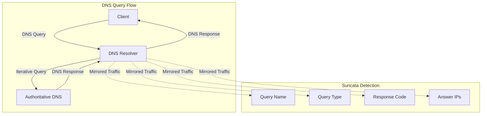
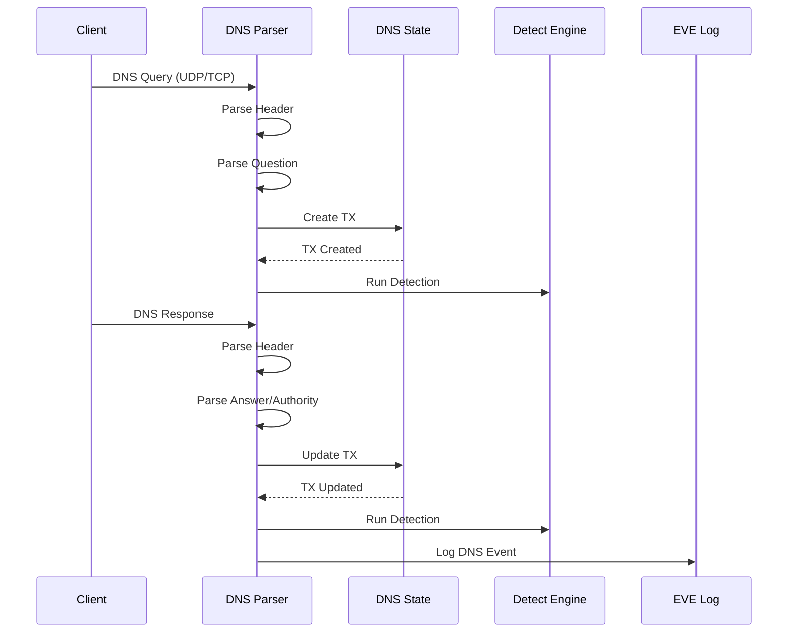

> [!info] Suricata 2026 深度探索系列
> 0. [[2026-04-15-suricata-deep-dive-series-index|全栈学习路径总览]]
> 1. [[2026-04-15-suricata-deep-dive-ch1-overview|第一章：Suricata 概述]]
> 2. [[2026-04-15-suricata-deep-dive-ch2-config|第二章：Suricata 配置系统]]
> 3. [[2026-04-15-suricata-deep-dive-ch3-runmodes|第三章：Runmodes 运行模式]]
> 4. [[2026-04-15-suricata-deep-dive-ch4-thread-model|第四章：线程模型]]
> 5. [[2026-04-15-suricata-deep-dive-ch5-capture|第五章：Capture 初始化]]
> 6. [[2026-04-15-suricata-deep-dive-ch6-af-packet|第六章：AF-PACKET 接口]]
> 7. [[2026-04-15-suricata-deep-dive-ch7-pcap|第七章：PCAP 接口]]
> 8. [[2026-04-15-suricata-deep-dive-ch8-nfq|第八章：NFQ 与 PF_RING 模式]]
> 9. [[2026-04-15-suricata-deep-dive-ch9-dpdk|第九章：DPDK 接口]]
> 10. [[2026-04-15-suricata-deep-dive-ch10-loadbalancing|第十章：多线程抓包与负载均衡]]
> 11. [[2026-04-15-suricata-deep-dive-ch11-detect-engine|第十一章：检测引擎架构]]
> 12. [[2026-04-15-suricata-deep-dive-ch12-signatures|第十二章：规则解析]]
> 13. [[2026-04-15-suricata-deep-dive-ch13-mpm|第十三章：多模式匹配]]
> 14. [[2026-04-15-suricata-deep-dive-ch14-filemagic|第十四章：文件识别]]
> 15. [[2026-04-15-suricata-deep-dive-ch15-lua-detect|第十五章：Lua 检测]]
> 16. [[2026-04-15-suricata-deep-dive-ch16-app-layer|第十六章：应用层协议解析]]
> 17. [[2026-04-15-suricata-deep-dive-ch17-http|第十七章：HTTP 协议解析]]
> 18. **第十八章：DNS 协议解析**

---

## 1. DNS 解析概述

DNS（Domain Name System）是互联网的核心服务之一，用于将域名解析为 IP 地址。Suricata 的 DNS 解析模块支持 DNS 查询和响应的完整解析，能够检测 DNS隧道、DNS 放大攻击、恶意域名等安全威胁。



### 1.1 DNS 协议特性

| 特性 | 描述 |
|:---|:---|
| **传输协议** | UDP/TCP（RFC 1035） |
| **端口** | 53（UDP/TCP） |
| **查询类型** | A, AAAA, CNAME, MX, TXT, NS, SOA, PTR, DS, DNSKEY 等 |
| **响应大小** | UDP 超过 512 字节时使用 TCP |
| **EDNS** | 扩展 DNS（RFC 6891） |

### 1.2 DNS 处理流程



---

## 2. DNS 数据结构

### 2.1 DNS Header

```c
// src/app-layer-dns.h — DNS 头部
typedef struct DNSHeader_ {
    /* 事务 ID */
    uint16_t tx_id;
    
    /* 标志 */
    uint16_t flags;
#define DNS_FLAG_RESPONSE        0x8000  // 响应标志
#define DNS_FLAG_OPCODE_MASK     0x7800  // 操作码
#define DNS_FLAG_AUTHORITATIVE   0x0400  // 权威应答
#define DNS_FLAG_TRUNCATED       0x0200  // 截断标志
#define DNS_FLAG_RECURSION_DES   0x0100  // 期望递归
#define DNS_FLAG_RECURSION_AVAIL 0x0080  // 递归可用
#define DNS_FLAG_Z                0x0040  // 保留位
#define DNS_FLAG_AUTHENTICATED    0x0020  // 已认证
#define DNS_FLAG_CHECKDISABLED    0x0010  // 检查禁用
#define DNS_FLAG_RCODE_MASK       0x000F  // 响应码
    
    /* 数量 */
    uint16_t questions;       // 问题数
    uint16_t answers;         // 回答数
    uint16_t authority;       // 权威数
    uint16_t additional;     // 附加数
    
} DNSHeader;
```

### 2.2 DNS Question

```c
// src/app-layer-dns.h — DNS 查询
typedef struct DNSQuery_ {
    /* 查询名称 */
    char *name;
    uint16_t name_len;
    
    /* 查询类型 */
    uint16_t type;
#define DNS_QUERY_TYPE_A       1    // IPv4 地址
#define DNS_QUERY_TYPE_NS     2    // 域名服务器
#define DNS_QUERY_TYPE_CNAME   5    // 规范名称
#define DNS_QUERY_TYPE_SOA     6    // 起始授权
#define DNS_QUERY_TYPE_PTR     12   // 指针记录
#define DNS_QUERY_TYPE_MX      15   // 邮件交换
#define DNS_QUERY_TYPE_TXT     16   // 文本记录
#define DNS_QUERY_TYPE_AAAA    28   // IPv6 地址
#define DNS_QUERY_TYPE_SRV     33   // 服务定位
#define DNS_QUERY_TYPE_DS      43   // delegation signer
#define DNS_QUERY_TYPE_DNSKEY  48   // DNS 密钥
#define DNS_QUERY_TYPE_TLSA    52   // TLSA 记录
#define DNS_QUERY_TYPE_SPF     99   // SPF 记录
#define DNS_QUERY_TYPE_ANY     255  // 任意类型
    
    /* 查询类 */
    uint16_t qclass;
#define DNS_QUERY_CLASS_IN     1    // 互联网类
    
    /* TX 指针 */
    struct DNSTx_ *tx;
    
    /* 链表 */
    struct DNSQuery_ *next;
} DNSQuery;
```

### 2.3 DNS Answer

```c
// src/app-layer-dns.h — DNS 答案
typedef struct DNSAnswer_ {
    /* 名称 */
    char *name;
    uint16_t name_len;
    
    /* 类型和类 */
    uint16_t type;
    uint16_t qclass;
    
    /* TTL */
    uint32_t ttl;
    
    /* 数据长度 */
    uint16_t rdlen;
    
    /* 资源数据 */
    union {
        /* A 记录 */
        struct {
            uint8_t ip[4];
        } a;
        
        /* AAAA 记录 */
        struct {
            uint8_t ip[16];
        } aaaa;
        
        /* CNAME/PTR 记录 */
        struct {
            char *cname;
            uint16_t cname_len;
        } cname;
        
        /* MX 记录 */
        struct {
            uint16_t preference;
            char *exchange;
            uint16_t exchange_len;
        } mx;
        
        /* TXT 记录 */
        struct {
            char *txt;
            uint16_t txt_len;
        } txt;
        
        /* SOA 记录 */
        struct {
            char *mname;
            uint16_t mname_len;
            char *rname;
            uint16_t rname_len;
        } soa;
        
        /* 原始数据 */
        uint8_t *raw;
    } rdata;
    
    /* 链表 */
    struct DNSAnswer_ *next;
} DNSAnswer;
```

### 2.4 DNS State

```c
// src/app-layer-dns.h — DNS 状态
typedef struct DNSState_ {
    /* DNS 事务列表 */
    DNSTx *txs;
    uint64_t tx_cnt;
    
    /* 当前事务 */
    DNSTx *curr_tx;
    
    /* 连接信息 */
    uint16_t port;
    uint8_t ipproto;
    
    /* 标志位 */
    uint32_t flags;
#define DNS_STATE_PARSER_ERROR    0x01
#define DNS_STATE_CONNECTION_CLOSE 0x02
    
    /* 查询计数 */
    uint32_t query_count;
    uint32_t answer_count;
    
    /* 链表头 */
    DNSQuery *queries;
    DNSAnswer *answers;
} DNSState;

// src/app-layer-dns.h — DNS 事务
typedef struct DNSTx_ {
    /* TX ID */
    uint64_t tx_id;
    
    /* 协议类型 */
    uint8_t ipproto;
    
    /* 请求信息 */
    DNSQuery *query;
    uint16_t tx_id;           // DNS 事务 ID
    uint8_t opcode;           // 操作码
    
    /* 响应信息 */
    uint8_t flags;
    uint8_t rcode;            // 响应码
    uint16_t answer_count;
    
    /* 答案列表 */
    DNSAnswer *answers;
    DNSAnswer *authority;
    DNSAnswer *additional;
    
    /* 时间戳 */
    struct timeval ts;
    
    /* 状态 */
    uint8_t state;
#define DNS_STATE_SEND_REQ    0
#define DNS_STATE_WAIT_ANSWER 1
#define DNS_STATE_GOT_ANSWER  2
#define DNS_STATE_ERROR       3
    
    /* TX 链表 */
    struct DNSTx_ *next;
} DNSTx;
```

---

## 3. DNS 协议检测

### 3.1 检测端口

```c
// src/app-layer-dns.c — DNS 端口配置
static int DNSPortConfig(void)
{
    /* UDP 端口 53 */
    AppLayerProtoDetectPRegister(ALPROTO_DNS,
                                 IPPROTO_UDP,
                                 "53",
                                 0,
                                 DNSUDPHeaderParser);
    
    /* TCP 端口 53 */
    AppLayerProtoDetectPRegister(ALPROTO_DNS,
                                 IPPROTO_TCP,
                                 "53",
                                 2,  /* 需要至少 2 字节 */
                                 DNSTCPHeaderParser);
    
    return 0;
}
```

### 3.2 UDP 检测

```c
// src/app-layer-dns.c — UDP DNS 检测
static AppLayerProtoDetectResult DNSUDPHeaderParser(
    Flow *f, uint8_t *input, uint32_t input_len, uint8_t direction)
{
    /* DNS Header 最小 12 字节 */
    if (input_len < 12) {
        return APP_LAYER_PROTO_DETECT_FAILED;
    }
    
    /* 解析 DNS Header */
    uint16_t tx_id = *((uint16_t *)input);
    uint16_t flags = *((uint16_t *)(input + 2));
    uint16_t questions = *((uint16_t *)(input + 4));
    
    /* 检查 DNS 标志 */
    /* QR(1) + OPCODE(4) + AA(1) + TC(1) + RD(1) + RA(1) + Z(3) + RCODE(4) */
    uint8_t qr = (flags >> 15) & 0x01;
    uint8_t opcode = (flags >> 11) & 0x0F;
    
    /* 验证操作码 */
    if (opcode > 2) {
        return APP_LAYER_PROTO_DETECT_FAILED;
    }
    
    /* 验证查询/响应 */
    if (qr == 0) {
        /* 查询：需要有问题部分 */
        if (questions == 0) {
            return APP_LAYER_PROTO_DETECT_FAILED;
        }
    } else {
        /* 响应：至少有问题数 */
        if (questions > 0) {
            return APP_LAYER_PROTO_DETECT_FAILED;
        }
    }
    
    /* 验证事务 ID 非零 */
    if (tx_id == 0) {
        return APP_LAYER_PROTO_DETECT_FAILED;
    }
    
    return APP_LAYER_PROTO_DETECT_SUCCESS;
}
```

### 3.3 TCP 检测

```c
// src/app-layer-dns.c — TCP DNS 检测
static AppLayerProtoDetectResult DNSTCPHeaderParser(
    Flow *f, uint8_t *input, uint32_t input_len, uint8_t direction)
{
    /* TCP DNS 使用 2 字节长度前缀 */
    if (input_len < 2) {
        return APP_LAYER_PROTO_DETECT_FAILED;
    }
    
    /* 读取长度字段 */
    uint16_t length = *((uint16_t *)input);
    length = ntohs(length);
    
    /* 检查长度是否合理 */
    if (length < 12 || length > 65535) {
        return APP_LAYER_PROTO_DETECT_FAILED;
    }
    
    /* 检查是否有完整数据 */
    if (input_len < (uint32_t)(2 + length)) {
        return APP_LAYER_PROTO_DETECT_INCOMPLETE;
    }
    
    /* 检查 DNS 内容 */
    uint16_t tx_id = *((uint16_t *)(input + 2));
    uint16_t flags = *((uint16_t *)(input + 4));
    
    /* 验证 DNS 头部 */
    uint8_t qr = (flags >> 15) & 0x01;
    uint8_t opcode = (flags >> 11) & 0x0F;
    
    if (opcode > 2 || tx_id == 0) {
        return APP_LAYER_PROTO_DETECT_FAILED;
    }
    
    return APP_LAYER_PROTO_DETECT_SUCCESS;
}
```

---

## 4. DNS 解析

### 4.1 UDP 解析

```c
// src/app-layer-dns.c — UDP DNS 解析器
static int DNSUDPParser(Flow *f, uint8_t *input, uint32_t input_len,
                        uint8_t direction)
{
    DNSState *state = (DNSState *)FlowGetAppState(f);
    if (state == NULL) {
        state = DNSStateAlloc();
        FlowSetAppState(f, state);
    }
    
    /* 解析 DNS Header */
    DNSHeader header;
    header.tx_id = *((uint16_t *)input);
    header.flags = *((uint16_t *)(input + 2));
    header.questions = *((uint16_t *)(input + 4));
    header.answers = *((uint16_t *)(input + 6));
    header.authority = *((uint16_t *)(input + 8));
    header.additional = *((uint16_t *)(input + 10));
    
    /* 字节序转换 */
    header.tx_id = ntohs(header.tx_id);
    header.flags = ntohs(header.flags);
    header.questions = ntohs(header.questions);
    header.answers = ntohs(header.answers);
    header.authority = ntohs(header.authority);
    header.additional = ntohs(header.additional);
    
    /* 检查是查询还是响应 */
    uint8_t qr = (header.flags >> 15) & 0x01;
    
    if (qr == 0) {
        /* 查询解析 */
        return DNSParseQuery(state, input + 12, input_len - 12, &header);
    } else {
        /* 响应解析 */
        return DNSParseResponse(state, input + 12, input_len - 12, &header);
    }
}
```

### 4.2 域名解析

```c
// src/app-layer-dns.c — 解析域名
static int DNSParseName(uint8_t *input, uint32_t input_len,
                        uint8_t **out_name, uint32_t *out_name_len,
                        uint32_t *out_consumed)
{
    uint8_t *ptr = input;
    uint8_t *name = NULL;
    uint32_t name_len = 0;
    uint32_t consumed = 0;
    uint8_t label_count = 0;
    
    /* 域名最大 255 字节 */
    uint8_t name_buf[256];
    uint8_t name_buf_len = 0;
    
    while (ptr < input + input_len) {
        uint8_t len = *ptr;
        
        /* 压缩指针 */
        if ((len & 0xC0) == 0xC0) {
            /* 压缩指针：2 字节 */
            if (ptr + 2 > input + input_len) {
                return -1;
            }
            
            uint16_t offset = *((uint16_t *)ptr);
            offset = ntohs(offset);
            offset &= 0x3FFF;
            
            /* 跟随指针 */
            uint8_t *follow_ptr = input + offset;
            /* 递归解析 */
            uint32_t follow_consumed = 0;
            DNSParseName(follow_ptr, input_len - offset, NULL, NULL, 
                         &follow_consumed);
            
            consumed += 2;
            ptr += 2;
            break;
        }
        
        /* 普通标签 */
        if (len == 0) {
            /* 根标签结束 */
            ptr++;
            consumed++;
            break;
        }
        
        /* 检查长度 */
        if (len > 63) {
            return -1;
        }
        
        if (ptr + 1 + len > input + input_len) {
            return -1;
        }
        
        /* 添加点分隔符（如果不是第一个标签） */
        if (name_buf_len > 0) {
            name_buf[name_buf_len++] = '.';
        }
        
        /* 复制标签 */
        memcpy(name_buf + name_buf_len, ptr + 1, len);
        name_buf_len += len;
        
        ptr += 1 + len;
        consumed += 1 + len;
        label_count++;
        
        /* 标签数限制 */
        if (label_count > 127) {
            return -1;
        }
    }
    
    /* 设置输出 */
    if (out_name != NULL) {
        *out_name = SCMalloc(name_buf_len + 1);
        memcpy(*out_name, name_buf, name_buf_len);
        (*out_name)[name_buf_len] = '\0';
    }
    
    if (out_name_len != NULL) {
        *out_name_len = name_buf_len;
    }
    
    if (out_consumed != NULL) {
        *out_consumed = consumed;
    }
    
    return 0;
}
```

### 4.3 查询解析

```c
// src/app-layer-dns.c — 解析 DNS 查询
static int DNSParseQuery(DNSState *state, uint8_t *input, 
                         uint32_t input_len, DNSHeader *header)
{
    uint8_t *ptr = input;
    uint32_t consumed = 0;
    
    /* 创建新事务 */
    DNSTx *tx = DNSTxCreate(state);
    tx->tx_id = header->tx_id;
    tx->opcode = (header->flags >> 11) & 0x0F;
    state->curr_tx = tx;
    
    /* 解析查询名称 */
    DNSQuery *query = SCCalloc(1, sizeof(DNSQuery));
    if (DNSParseName(ptr, input_len, (uint8_t **)&query->name,
                    &query->name_len, &consumed) < 0) {
        SCLogDebug("Failed to parse DNS query name");
        return -1;
    }
    
    ptr += consumed;
    
    /* 解析查询类型 */
    if (ptr + 4 > input + input_len) {
        return -1;
    }
    
    query->type = *((uint16_t *)ptr);
    query->type = ntohs(query->type);
    ptr += 2;
    
    query->qclass = *((uint16_t *)ptr);
    query->qclass = ntohs(query->qclass);
    ptr += 2;
    
    /* 添加查询到事务 */
    tx->query = query;
    query->tx = tx;
    
    /* 添加到状态列表 */
    DNSStateAddQuery(state, query);
    
    return 0;
}
```

### 4.4 响应解析

```c
// src/app-layer-dns.c — 解析 DNS 响应
static int DNSParseResponse(DNSState *state, uint8_t *input,
                            uint32_t input_len, DNSHeader *header)
{
    uint8_t *ptr = input;
    uint32_t consumed = 0;
    
    /* 查找对应的事务 */
    DNSTx *tx = DNSStateFindTx(state, header->tx_id);
    if (tx == NULL) {
        /* 未找到对应查询，可能已超时 */
        tx = DNSTxCreate(state);
        tx->tx_id = header->tx_id;
        tx->state = DNS_STATE_GOT_ANSWER;
    }
    
    /* 更新 TX 状态 */
    tx->rcode = header->flags & 0x0F;
    tx->answer_count = header->answers;
    tx->state = DNS_STATE_GOT_ANSWER;
    
    /* 跳过查询部分 */
    DNSQuery *query = tx->query;
    if (query != NULL) {
        ptr += strlen(query->name) + 2 + 4;
    }
    
    /* 解析答案 */
    for (uint16_t i = 0; i < header->answers; i++) {
        DNSAnswer *answer = DNSParseAnswer(ptr, input_len - (ptr - input));
        if (answer == NULL) {
            break;
        }
        ptr += answer->rdlen + 12 + consumed;
        
        /* 添加到答案列表 */
        DNSStateAddAnswer(state, answer);
        tx->answers = answer;
    }
    
    /* 解析权威答案 */
    for (uint16_t i = 0; i < header->authority; i++) {
        DNSAnswer *auth = DNSParseAnswer(ptr, input_len - (ptr - input));
        if (auth == NULL) {
            break;
        }
        tx->authority = auth;
    }
    
    /* 解析附加答案 */
    for (uint16_t i = 0; i < header->additional; i++) {
        DNSAnswer *add = DNSParseAnswer(ptr, input_len - (ptr - input));
        if (add == NULL) {
            break;
        }
        tx->additional = add;
    }
    
    return 0;
}
```

---

## 5. 配置选项

### 5.1 dns 配置

```yaml
# suricata.yaml
app-layer:
  protocols:
    dns:
      # 是否启用 DNS 解析
      enabled: yes
      
      # TCP 配置
      tcp:
        enabled: yes
        detection-ports:
          toserver: [53]
          toclient: [53]
      
      # UDP 配置
      udp:
        enabled: yes
        detection-ports:
          toserver: [53]
          toclient: [53]
      
      # DNS 隧道检测
      detect-tunnel: yes
      
      # 记录限制
      max-records: 100
      max-record-length: 256
      
      # 响应码检测
      rcode-errors:
        - notaused
        - formerr
        - servfail
        - nxdomain
```

### 5.2 配置解析

```c
// src/app-layer-dns.c — DNS 配置解析
static int DNSLoadConfig(DNSConfig *cfg, YamlNode *node)
{
    /* 解析 enabled */
    const char *enabled = YamlNodeLookup(node, "enabled");
    if (enabled && strcmp(enabled, "yes") != 0) {
        cfg->enabled = 0;
        return 0;
    }
    
    /* 解析 UDP 配置 */
    YamlNode *udp = YamlNodeLookup(node, "udp");
    if (udp) {
        cfg->udp_enabled = ParseEnabled(udp);
        
        YamlNode *udp_ports = YamlNodeLookup(udp, "detection-ports");
        if (udp_ports) {
            cfg->udp_ports_toserver = ParsePorts(
                YamlNodeLookup(udp_ports, "toserver"));
            cfg->udp_ports_toclient = ParsePorts(
                YamlNodeLookup(udp_ports, "toclient"));
        }
    }
    
    /* 解析 TCP 配置 */
    YamlNode *tcp = YamlNodeLookup(node, "tcp");
    if (tcp) {
        cfg->tcp_enabled = ParseEnabled(tcp);
        
        YamlNode *tcp_ports = YamlNodeLookup(tcp, "detection-ports");
        if (tcp_ports) {
            cfg->tcp_ports_toserver = ParsePorts(
                YamlNodeLookup(tcp_ports, "toserver"));
            cfg->tcp_ports_toclient = ParsePorts(
                YamlNodeLookup(tcp_ports, "toclient"));
        }
    }
    
    /* 解析 max-records */
    const char *max_records = YamlNodeLookup(node, "max-records");
    if (max_records) {
        cfg->max_records = atoi(max_records);
    }
    
    return 0;
}
```

---

## 6. DNS 检测关键字

### 6.1 dns 检测关键字列表

| 关键字 | 描述 | 匹配位置 |
|:---|:---|:---|
| `dns.query.name` | 查询域名 | 查询 |
| `dns.query.type` | 查询类型 | 查询 |
| `dns.query.class` | 查询类 | 查询 |
| `dns.response.name` | 响应名称 | 响应 |
| `dns.response.type` | 响应类型 | 响应 |
| `dns.response.ttl` | TTL 值 | 响应 |
| `dns.response.code` | 响应码 | 响应 |
| `dns.answers` | 答案列表 | 响应 |
| `dns.flags` | DNS 标志 | 头部 |

### 6.2 dns.query.name 检测实现

```c
// src/detect-dns-name.c — dns.query.name 关键字
typedef struct DetectDnsNameData_ {
    /* 域名模式 */
    char *name;
    size_t name_len;
    
    /* 匹配选项 */
    uint8_t flags;
#define DNS_NAME_MPM      0x01
#define DNS_NAME_NEGATE   0x02
#define DNS_NAME_RAW      0x04  // 不转小写
    
    /* MPM 上下文 */
    MpmCtx *mpm_ctx;
} DetectDnsNameData;

static int DetectDnsQueryNameMatch(DetectEngineThreadCtx *det_ctx,
                                   Signature *s, Flow *f, Packet *p)
{
    DNSState *dns_state = (DNSState *)FlowGetAppState(f);
    if (dns_state == NULL) {
        return 0;
    }
    
    /* 获取当前查询 */
    DNSTx *tx = dns_state->curr_tx;
    if (tx == NULL || tx->query == NULL) {
        return 0;
    }
    
    DNSQuery *query = tx->query;
    
    /* 匹配域名 */
    DetectDnsNameData *data = (DetectDnsNameData *)s->dns_query_name;
    
    /* 比较域名（默认不区分大小写） */
    int match_len = query->name_len;
    const char *match_str = query->name;
    
    if (!(data->flags & DNS_NAME_RAW)) {
        /* 转小写进行比较 */
        match_len = strlen(query->name);
        /* 使用小写版本进行匹配 */
    }
    
    return DetectContentMatch(match_str, match_len, data);
}
```

### 6.3 dns.query.type 检测实现

```c
// src/detect-dns-type.c — dns.query.type 关键字
typedef struct DetectDnsTypeData_ {
    /* 查询类型 */
    uint16_t type;
    
    /* 匹配选项 */
    uint8_t negate;
} DetectDnsTypeData;

static int DetectDnsQueryTypeMatch(DetectEngineThreadCtx *det_ctx,
                                   Signature *s, Flow *f, Packet *p)
{
    DNSState *dns_state = (DNSState *)FlowGetAppState(f);
    if (dns_state == NULL) {
        return 0;
    }
    
    DNSTx *tx = dns_state->curr_tx;
    if (tx == NULL || tx->query == NULL) {
        return 0;
    }
    
    DetectDnsTypeData *data = (DetectDnsTypeData *)s->dns_query_type;
    
    /* 比较查询类型 */
    int result = (tx->query->type == data->type);
    
    if (data->negate) {
        return !result;
    }
    return result;
}
```

### 6.4 dns.response.code 检测实现

```c
// src/detect-dns-rcode.c — dns.response.code 关键字
typedef struct DetectDnsRCodeData_ {
    /* 响应码 */
    uint8_t rcode;
    
    /* 响应码名称 */
    char *rcode_name;
    
    /* 匹配选项 */
    uint8_t negate;
} DetectDnsRCodeData;

#define DNS_RCODE_OK           0
#define DNS_RCODE_FORMATERR    1
#define DNS_RCODE_SERVFAIL     2
#define DNS_RCODE_NXDOMAIN     3
#define DNS_RCODE_NOTIMP       4
#define DNS_RCODE_REFUSED      5

static int DetectDnsRCodeMatch(DetectEngineThreadCtx *det_ctx,
                                Signature *s, Flow *f, Packet *p)
{
    DNSState *dns_state = (DNSState *)FlowGetAppState(f);
    if (dns_state == NULL) {
        return 0;
    }
    
    DNSTx *tx = dns_state->curr_tx;
    if (tx == NULL) {
        return 0;
    }
    
    DetectDnsRCodeData *data = (DetectDnsRCodeData *)s->dns_rcode;
    
    /* 比较响应码 */
    int result = (tx->rcode == data->rcode);
    
    if (data->negate) {
        return !result;
    }
    return result;
}
```

---

## 7. EVE JSON 日志

### 7.1 DNS 日志格式

```json
{
    "timestamp": "2026-04-15T16:00:00.000000+0000",
    "event_type": "dns",
    "src_ip": "192.168.1.100",
    "src_port": 54321,
    "dest_ip": "8.8.8.8",
    "dest_port": 53,
    "proto": "UDP",
    "dns": {
        "id": 12345,
        "type": "query",
        "opcode": 0,
        "flags": ["RD"],
        "question": {
            "name": "example.com",
            "type": "A"
        },
        "answers": [
            {
                "name": "example.com",
                "type": "A",
                "ttl": 3600,
                "ip": "93.184.216.34"
            }
        ],
        "rcode": "NOERROR",
        "rcode_id": 0
    }
}
```

### 7.2 DNS 响应日志

```json
{
    "timestamp": "2026-04-15T16:00:00.000000+0000",
    "event_type": "dns",
    "src_ip": "8.8.8.8",
    "src_port": 53,
    "dest_ip": "192.168.1.100",
    "dest_port": 54321,
    "proto": "UDP",
    "dns": {
        "id": 12345,
        "type": "response",
        "opcode": 0,
        "flags": ["RD", "RA"],
        "question": {
            "name": "example.com",
            "type": "A"
        },
        "answers": [
            {
                "name": "example.com",
                "type": "A",
                "ttl": 3600,
                "ip": "93.184.216.34"
            }
        ],
        "authorities": [
            {
                "name": "example.com",
                "type": "NS",
                "ttl": 3600,
                "domain": "a.iana-servers.net"
            }
        ],
        "rcode": "NOERROR",
        "rcode_id": 0
    }
}
```

### 7.3 DNS 日志输出

```c
// src/output-json-dns.c — DNS 日志输出
static int JsonDnsLogger(ThreadVars *tv, void *thread_data,
                         const Packet *p, Flow *f, void *state, void *tx)
{
    DNSState *dns_state = (DNSState *)state;
    DNSTx *dns_tx = (DNSTx *)tx;
    
    /* 创建 JSON 对象 */
    json_t *js = json_object();
    
    /* 基本信息 */
    json_object_set_new(js, "id", json_integer(dns_tx->tx_id));
    
    /* 类型 */
    uint8_t qr = (dns_tx->flags >> 15) & 0x01;
    if (qr == 0) {
        json_object_set_new(js, "type", json_string("query"));
    } else {
        json_object_set_new(js, "type", json_string("response"));
    }
    
    /* 操作码 */
    json_object_set_new(js, "opcode", json_integer(dns_tx->opcode));
    
    /* 标志 */
    json_t *flags = json_array();
    if (dns_tx->flags & DNS_FLAG_RD) {
        json_array_append_new(flags, json_string("RD"));
    }
    if (dns_tx->flags & DNS_FLAG_RA) {
        json_array_append_new(flags, json_string("RA"));
    }
    if (dns_tx->flags & DNS_FLAG_AA) {
        json_array_append_new(flags, json_string("AA"));
    }
    if (dns_tx->flags & DNS_FLAG_TC) {
        json_array_append_new(flags, json_string("TC"));
    }
    json_object_set_new(js, "flags", flags);
    
    /* 查询 */
    if (dns_tx->query != NULL) {
        json_t *question = json_object();
        json_object_set_new(question, "name", 
            json_string(dns_tx->query->name));
        json_object_set_new(question, "type", 
            json_string(DnsTypeToString(dns_tx->query->type)));
        json_object_set_new(js, "question", question);
    }
    
    /* 答案 */
    if (dns_tx->answers != NULL) {
        json_t *answers = json_array();
        DNSAnswer *ans = dns_tx->answers;
        while (ans != NULL) {
            json_t *answer = json_object();
            json_object_set_new(answer, "name", 
                json_string(ans->name));
            json_object_set_new(answer, "type", 
                json_string(DnsTypeToString(ans->type)));
            json_object_set_new(answer, "ttl", 
                json_integer(ans->ttl));
            
            /* 根据类型添加值 */
            switch (ans->type) {
                case DNS_QUERY_TYPE_A:
                    json_object_set_new(answer, "ip",
                        json_string(DnsARecordToString(ans->rdata.a.ip)));
                    break;
                case DNS_QUERY_TYPE_AAAA:
                    json_object_set_new(answer, "ipv6",
                        json_string(DnsAAAARecordToString(ans->rdata.aaaa.ip)));
                    break;
                case DNS_QUERY_TYPE_CNAME:
                case DNS_QUERY_TYPE_PTR:
                    json_object_set_new(answer, "cname",
                        json_string(ans->rdata.cname.cname));
                    break;
            }
            
            json_array_append_new(answers, answer);
            ans = ans->next;
        }
        json_object_set_new(js, "answers", answers);
    }
    
    /* 响应码 */
    json_object_set_new(js, "rcode", 
        json_string(DnsRCodeToString(dns_tx->rcode)));
    json_object_set_new(js, "rcode_id", json_integer(dns_tx->rcode));
    
    /* 输出 JSON */
    OutputJsonBuffer(js, thread_data);
    
    json_decref(js);
    return 0;
}
```

---

## 8. DNS 隧道检测

### 8.1 DNS 隧道特征

DNS 隧道是一种通过 DNS 协议传输非 DNS 流量的技术，常被恶意软件用于命令控制（C2）：

| 特征 | 描述 |
|:---|:---|
| **长域名** | DNS 查询名超过正常长度（>50 字节） |
| **高频率** | 短时间内大量 DNS 查询 |
| **异常类型** | 使用 TXT、NULL 等非常见类型 |
| **编码数据** | Base16/Base32/Base64 编码的子域名 |

### 8.2 DNS 隧道检测配置

```yaml
# suricata.yaml
app-layer:
  protocols:
    dns:
      # DNS 隧道检测
      detect-tunnel: yes
      
      # 查询长度阈值
      query-length-threshold: 50
      
      # 响应长度阈值
      response-length-threshold: 100
      
      # 查询频率阈值
      queries-per-second: 100
```

### 8.3 DNS 隧道检测规则

```snort
# 检测长域名 DNS 隧道
alert dns any any -> any any (
    msg:"DNS Tunneling - Long Domain Name";
    dns.query.name; content:"."; depth:1;
    byte_test:4, >, 50, 0, relative;
    sid:3000001;
    rev:1;
)

# 检测 Base64 编码的 DNS 查询
alert dns any any -> any any (
    msg:"DNS Tunneling - Base64 Encoded Query";
    dns.query.name; content:"=="; 
    sid:3000002;
    rev:1;
)

# 检测 DNS TXT 隧道
alert dns any any -> any any (
    msg:"DNS Tunneling - TXT Query";
    dns.query.type; eq TXT;
    sid:3000003;
    rev:1;
)
```

---

## 9. 常见问题

### 9.1 DNS 解析失败

**问题**：DNS 流量未被解析

**排查步骤**：
1. 检查 `app-layer.protocols.dns.enabled` 是否为 `yes`
2. 检查 detection-ports 是否包含目标端口
3. 确认 UDP/TCP 协议都已启用

### 9.2 TX 未匹配

**问题**：查询和响应未关联

**排查步骤**：
1. 检查事务 ID 是否匹配
2. 查看超时配置
3. 确认 DNS 状态清理未过早执行

### 9.3 检测不匹配

**问题**：dns.query.name 规则不匹配

**排查步骤**：
1. 确认域名格式（大小写）
2. 检查是否需要使用 raw 标志
3. 查看 EVE 日志中的实际查询名称

---

## 10. 总结

本章介绍了 Suricata DNS 解析系统的实现：

- **DNS 数据结构**：Header、Query、Answer、State 结构
- **协议检测**：UDP/TCP DNS 协议的检测机制
- **解析流程**：域名、查询、响应的解析过程
- **检测关键字**：dns.query.* 和 dns.response.* 关键字
- **EVE 日志**：JSON 格式的 DNS 日志输出
- **DNS 隧道**：DNS 隧道检测机制

后续章节将继续介绍 TLS、SMB 等其他应用层协议的解析。
