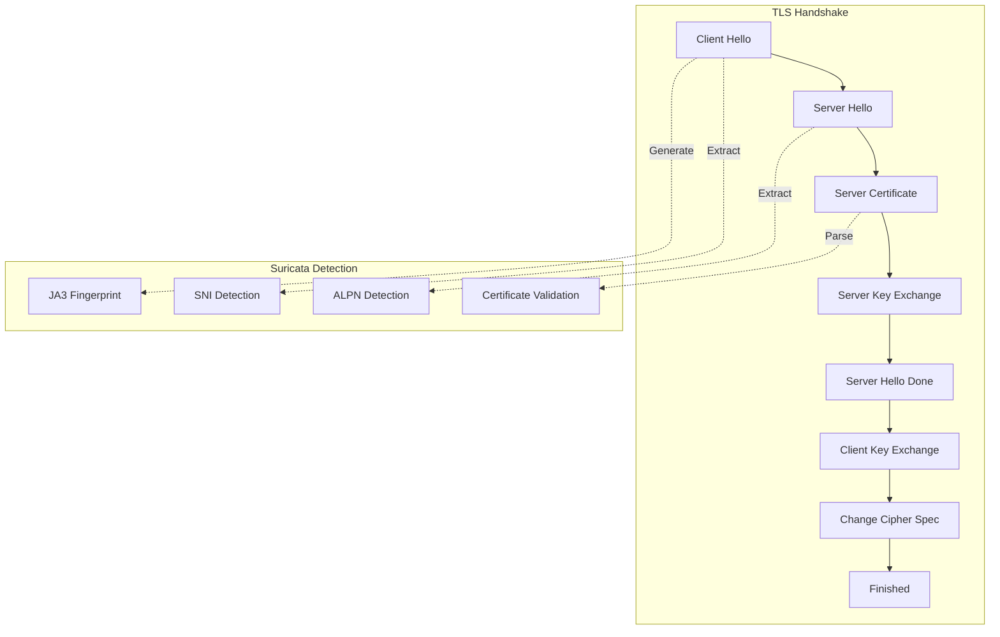
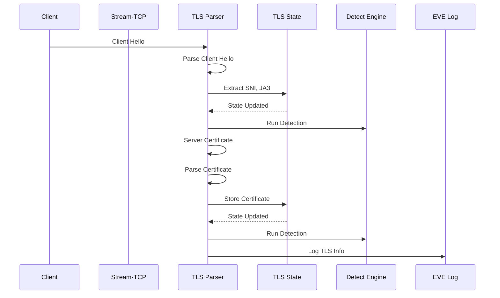

> [!info] Suricata 2026 深度探索系列 0. [[2026-04-15-suricata-deep-dive-series-index|全栈学习路径总览]]
>
> 1. [[2026-04-15-suricata-deep-dive-ch1-overview|第一章：Suricata 概述]]
> 2. [[2026-04-15-suricata-deep-dive-ch2-config|第二章：Suricata 配置系统]]
> 3. [[2026-04-15-suricata-deep-dive-ch3-runmodes|第三章：Runmodes 运行模式]]
> 4. [[2026-04-15-suricata-deep-dive-ch4-thread-model|第四章：线程模型]]
> 5. [[2026-04-15-suricata-deep-dive-ch5-capture|第五章：Capture 初始化]]
> 6. [[2026-04-15-suricata-deep-dive-ch6-af-packet|第六章：AF-PACKET 接口]]
> 7. [[2026-04-15-suricata-deep-dive-ch7-pcap|第七章：PCAP 接口]]
> 8. [[2026-04-15-suricata-deep-dive-ch8-nfq|第八章：NFQ 与 PF_RING 模式]]
> 9. [[2026-04-15-suricata-deep-dive-ch9-dpdk|第九章：DPDK 接口]]
> 10. [[2026-04-15-suricata-deep-dive-ch10-loadbalancing|第十章：多线程抓包与负载均衡]]
> 11. [[2026-04-15-suricata-deep-dive-ch11-detect-engine|第十一章：检测引擎架构]]
> 12. [[2026-04-15-suricata-deep-dive-ch12-signatures|第十二章：规则解析]]
> 13. [[2026-04-15-suricata-deep-dive-ch13-mpm|第十三章：多模式匹配]]
> 14. [[2026-04-15-suricata-deep-dive-ch14-filemagic|第十四章：文件识别]]
> 15. [[2026-04-15-suricata-deep-dive-ch15-lua-detect|第十五章：Lua 检测]]
> 16. [[2026-04-15-suricata-deep-dive-ch16-app-layer|第十六章：应用层协议解析]]
> 17. [[2026-04-15-suricata-deep-dive-ch17-http|第十七章：HTTP 协议解析]]
> 18. [[2026-04-15-suricata-deep-dive-ch18-dns|第十八章：DNS 协议解析]]
> 19. **第十九章：TLS 协议解析**

---

## 1. TLS 解析概述

TLS（Transport Layer Security）是用于加密网络通信的安全协议。Suricata 的 TLS 解析模块能够解析 TLS 握手过程、提取证书信息、记录 SNI（Server Name Indication）和 ALPN（Application-Layer Protocol Negotiation）等关键信息。



### 1.1 TLS 协议特性

| 特性         | 描述                                               |
| :----------- | :------------------------------------------------- |
| **传输协议** | TCP                                                |
| **端口**     | 443 (HTTPS), 465 (SMTPS), 993 (IMAPS), 995 (POP3S) |
| **版本**     | TLS 1.0, 1.1, 1.2, 1.3                             |
| **握手类型** | RSA, DHE, ECDHE                                    |
| **证书格式** | X.509 DER/PEM                                      |

### 1.2 TLS 处理流程



---

## 2. TLS 数据结构

### 2.1 TLS Record Layer

```c
// src/app-layer-ssl.h — TLS 记录层
typedef struct SSLRecord_ {
    /* TLS Content Type */
    uint8_t content_type;
#define SSL_CONTENT_TYPE_CHANGE_CIPHER_SPEC 20
#define SSL_CONTENT_TYPE_ALERT              21
#define SSL_CONTENT_TYPE_HANDSHAKE          22
#define SSL_CONTENT_TYPE_APPLICATION_DATA    23
#define SSL_CONTENT_TYPE_HEARTBEAT          24

    /* TLS Version */
    uint8_t version_major;
    uint8_t version_minor;
#define SSL_VERSION_3_0   0x0300
#define SSL_VERSION_TLS1_0 0x0301
#define SSL_VERSION_TLS1_1 0x0302
#define SSL_VERSION_TLS1_2 0x0303
#define SSL_VERSION_TLS1_3 0x0304

    /* 长度 */
    uint16_t length;

    /* 数据 */
    uint8_t *data;
    uint32_t data_len;

    /* 链表 */
    struct SSLRecord_ *next;
} SSLRecord;
```

### 2.2 TLS Handshake

```c
// src/app-layer-ssl.h — TLS 握手
typedef struct SSLHandshake_ {
    /* 握手类型 */
    uint8_t type;
#define SSL_HANDSHAKE_TYPE_CLIENT_HELLO    1
#define SSL_HANDSHAKE_TYPE_SERVER_HELLO    2
#define SSL_HANDSHAKE_TYPE_CERTIFICATE     11
#define SSL_HANDSHAKE_TYPE_SERVER_KEY_EX   12
#define SSL_HANDSHAKE_TYPE_CERT_REQ        13
#define SSL_HANDSHAKE_TYPE_HELLO_DONE      14
#define SSL_HANDSHAKE_TYPE_CERT_VERIFY      15
#define SSL_HANDSHAKE_TYPE_CLIENT_KEY_EX   16
#define SSL_HANDSHAKE_TYPE_FINISHED        20

    /* 握手长度 */
    uint32_t length;

    /* 数据 */
    uint8_t *data;
    uint32_t data_len;

    /* 握手消息 */
    union {
        SSLClientHello *client_hello;
        SSLServerHello *server_hello;
        SSLCertificate *certificate;
    } msg;
} SSLHandshake;
```

### 2.3 Client Hello

```c
// src/app-layer-ssl.h — Client Hello
typedef struct SSLClientHello_ {
    /* 版本 */
    uint16_t version;

    /* Random */
    uint8_t random[32];

    /* Session ID */
    uint8_t *session_id;
    uint8_t session_id_len;

    /* Cipher Suites */
    uint16_t *cipher_suites;
    uint16_t cipher_suites_len;

    /* Compression Methods */
    uint8_t *compression_methods;
    uint8_t compression_methods_len;

    /* Extensions */
    SSLExtension *extensions;
    uint16_t extensions_len;

    /* SNI (Server Name Indication) */
    char *sni;
    uint16_t sni_len;
    uint8_t sni_type;

    /* Supported Versions (TLS 1.3) */
    uint16_t *supported_versions;
    uint8_t supported_versions_len;

    /* Supported Groups (TLS 1.3) */
    uint16_t *supported_groups;
    uint16_t supported_groups_len;

    /* Signature Algorithms (TLS 1.3) */
    uint16_t *sig_algs;
    uint16_t sig_algs_len;

    /* ALPN */
    char **alpn;
    uint8_t alpn_len;

    /* JA3 */
    char *ja3_str;
    char ja3_hash[33];

} SSLClientHello;
```

### 2.4 Certificate

```c
// src/app-layer-ssl.h — X.509 证书
typedef struct SSLCertificate_ {
    /* 证书长度 */
    uint32_t cert_length;

    /* 证书数据 */
    uint8_t *cert_data;
    uint32_t cert_data_len;

    /* 解析后的证书信息 */
    char *subject;
    char *issuer;
    char *serial_number;

    /* 有效期 */
    time_t not_before;
    time_t not_after;

    /* 主体信息 */
    char *subject_common;
    char *subject_org;
    char **subject_alt_names;
    uint16_t subject_alt_names_len;

    /* 公钥信息 */
    uint8_t *public_key;
    uint32_t public_key_len;
    char *public_key_algorithm;

    /* 指纹 */
    char *fingerprint_md5;
    char *fingerprint_sha1;
    char *fingerprint_sha256;

    /* 链表 */
    struct SSLCertificate_ *next;
} SSLCertificate;

// src/app-layer-ssl.h — TLS State
typedef struct SSLState_ {
    /* 连接状态 */
    uint8_t state;
#define TLS_STATE_INIT                 0
#define TLS_STATE_CLIENT_HELLO         1
#define TLS_STATE_SERVER_HELLO         2
#define TLS_STATE_CERTIFICATE          3
#define TLS_STATE_SERVER_KEY_EXCHANGE  4
#define TLS_STATE_CERTIFICATE_REQUEST  5
#define TLS_STATE_SERVER_HELLO_DONE    6
#define TLS_STATE_CERTIFICATE_VERIFY    7
#define TLS_STATE_CLIENT_KEY_EXCHANGE  8
#define TLS_STATE_CHANGE_CIPHER_SPEC   9
#define TLS_STATE_FINISHED             10
#define TLS_STATE_ESTABLISHED          11
#define TLS_STATE_ERROR                12

    /* 当前版本 */
    uint16_t version;

    /* Client Hello 信息 */
    SSLClientHello *client_hello;

    /* Server Hello 信息 */
    SSLServerHello *server_hello;

    /* 证书链 */
    SSLCertificate *server_cert;
    SSLCertificate *client_cert;

    /* JA3 指纹 */
    char *ja3_str;
    char ja3_hash[33];

    /* Session Info */
    uint8_t *session_id;
    uint8_t session_id_len;
    uint8_t *session_id_client;
    uint8_t session_id_client_len;

    /* 加密参数 */
    uint8_t *client_random;
    uint8_t *server_random;
    uint8_t *master_secret;

    /* 标志位 */
    uint32_t flags;
#define TLS_FLAG_CLIENT_HELLO_EOF      0x01
#define TLS_FLAG_SERVER_HELLO_EOF      0x02
#define TLS_FLAG_CERT_EOF              0x04
#define TLS_FLAG_SNI_DETECTED         0x08
#define TLS_FLAG_SSLV3                 0x10
#define TLS_FLAG_TLS1_3                0x20
#define TLS_FLAG_PSK                   0x40

    /* 链表 */
    SSLRecord *record;
    SSLHandshake *handshake;

} SSLState;
```

---

## 3. TLS 协议检测

### 3.1 检测端口

```c
// src/app-layer-ssl.c — TLS 端口配置
static int SSLPortConfig(void)
{
    /* 注册默认端口 */
    AppLayerProtoDetectPRegister(ALPROTO_TLS,
                                IPPROTO_TCP,
                                "443",
                                3,  /* 最小检测长度 */
                                SSLProbingParser);

    /* 其他 TLS 端口 */
    AppLayerProtoDetectPRegister(ALPROTO_TLS, IPPROTO_TCP, "465", 3, SSLProbingParser);
    AppLayerProtoDetectPRegister(ALPROTO_TLS, IPPROTO_TCP, "993", 3, SSLProbingParser);
    AppLayerProtoDetectPRegister(ALPROTO_TLS, IPPROTO_TCP, "995", 3, SSLProbingParser);
    AppLayerProtoDetectPRegister(ALPROTO_TLS, IPPROTO_TCP, "8443", 3, SSLProbingParser);

    return 0;
}
```

### 3.2 TLS 检测

```c
// src/app-layer-ssl.c — TLS 检测函数
static AppLayerProtoDetectResult SSLProbingParser(
    Flow *f, uint8_t *input, uint32_t input_len, uint8_t direction)
{
    /* TLS Record 最小长度 */
    if (input_len < 5) {
        return APP_LAYER_PROTO_DETECT_FAILED;
    }

    /* 检查 Content Type */
    uint8_t content_type = input[0];
    if (content_type < SSL_CONTENT_TYPE_CHANGE_CIPHER_SPEC ||
        content_type > SSL_CONTENT_TYPE_HEARTBEAT) {
        return APP_LAYER_PROTO_DETECT_FAILED;
    }

    /* 检查 TLS Version */
    /* TLS 1.0: 03 01
       TLS 1.1: 03 02
       TLS 1.2: 03 03
       TLS 1.3: 03 03 (with extensions)
       SSL 3.0: 03 00 */
    if (input[1] != 0x03) {
        return APP_LAYER_PROTO_DETECT_FAILED;
    }

    if (input[2] > 0x03) {
        return APP_LAYER_PROTO_DETECT_FAILED;
    }

    /* 检查长度 */
    uint16_t length = *((uint16_t *)(input + 3));
    length = ntohs(length);

    if (length > 18433) {  /* 2^14 + 2^8 最大记录长度 */
        return APP_LAYER_PROTO_DETECT_FAILED;
    }

    /* 对于 Client Hello，检查是否有足够的数据 */
    if (content_type == SSL_CONTENT_TYPE_HANDSHAKE) {
        if (input_len < 6) {
            return APP_LAYER_PROTO_DETECT_INCOMPLETE;
        }

        /* 检查握手类型 */
        uint8_t handshake_type = input[5];
        if (handshake_type == SSL_HANDSHAKE_TYPE_CLIENT_HELLO) {
            return APP_LAYER_PROTO_DETECT_SUCCESS;
        }
    }

    return APP_LAYER_PROTO_DETECT_SUCCESS;
}
```

---

## 4. TLS 解析

### 4.1 TLS 记录解析

```c
// src/app-layer-ssl.c — 解析 TLS 记录
static int SSLParseRecord(SSLState *state, uint8_t *input,
                          uint32_t input_len, uint8_t direction)
{
    /* 解析 TLS 记录头 */
    SSLRecord *record = SCCalloc(1, sizeof(SSLRecord));
    if (record == NULL) {
        return -1;
    }

    /* Content Type */
    record->content_type = input[0];

    /* Version */
    record->version_major = input[1];
    record->version_minor = input[2];
    record->version = (input[1] << 8) | input[2];

    /* Length */
    record->length = *((uint16_t *)(input + 3));
    record->length = ntohs(record->length);

    /* 检查数据长度 */
    if (record->length > input_len - 5) {
        SCLogDebug("TLS record length mismatch");
        SCFree(record);
        return -1;
    }

    /* 复制数据 */
    record->data = SCMalloc(record->length);
    memcpy(record->data, input + 5, record->length);
    record->data_len = record->length;

    /* 添加到记录链表 */
    if (state->record == NULL) {
        state->record = record;
    } else {
        SSLRecord *last = state->record;
        while (last->next != NULL) {
            last = last->next;
        }
        last->next = record;
    }

    /* 更新状态 */
    state->flags |= TLS_FLAG_SSLV3;

    /* 根据 Content Type 处理 */
    switch (record->content_type) {
        case SSL_CONTENT_TYPE_HANDSHAKE:
            return SSLParseHandshake(state, record->data, record->data_len);
        case SSL_CONTENT_TYPE_CHANGE_CIPHER_SPEC:
            return SSLParseChangeCipherSpec(state, record->data, record->data_len);
        case SSL_CONTENT_TYPE_ALERT:
            return SSLParseAlert(state, record->data, record->data_len);
        case SSL_CONTENT_TYPE_APPLICATION_DATA:
            return SSLParseAppData(state, record->data, record->data_len);
        case SSL_CONTENT_TYPE_HEARTBEAT:
            return SSLParseHeartbeat(state, record->data, record->data_len);
    }

    return 0;
}
```

### 4.2 握手解析

```c
// src/app-layer-ssl.c — 解析握手消息
static int SSLParseHandshake(SSLState *state, uint8_t *input,
                             uint32_t input_len)
{
    uint8_t *ptr = input;
    uint32_t remaining = input_len;

    while (remaining > 4) {
        /* 解析握手头 */
        SSLHandshake hs;
        hs.type = ptr[0];

        /* 握手长度 (3 字节) */
        hs.length = (ptr[1] << 16) | (ptr[2] << 8) | ptr[3];

        if (hs.length > remaining - 4) {
            /* 握手消息不完整 */
            return -1;
        }

        hs.data = ptr + 4;
        hs.data_len = hs.length;

        /* 根据类型解析 */
        switch (hs.type) {
            case SSL_HANDSHAKE_TYPE_CLIENT_HELLO:
                SSLParseClientHello(state, hs.data, hs.data_len);
                state->state = TLS_STATE_CLIENT_HELLO;
                break;

            case SSL_HANDSHAKE_TYPE_SERVER_HELLO:
                SSLParseServerHello(state, hs.data, hs.data_len);
                state->state = TLS_STATE_SERVER_HELLO;
                break;

            case SSL_HANDSHAKE_TYPE_CERTIFICATE:
                SSLParseCertificate(state, hs.data, hs.data_len);
                state->state = TLS_STATE_CERTIFICATE;
                break;

            case SSL_HANDSHAKE_TYPE_SERVER_KEY_EXCHANGE:
                state->state = TLS_STATE_SERVER_KEY_EXCHANGE;
                break;

            case SSL_HANDSHAKE_TYPE_SERVER_HELLO_DONE:
                state->state = TLS_STATE_SERVER_HELLO_DONE;
                break;

            case SSL_HANDSHAKE_TYPE_CLIENT_KEY_EXCHANGE:
                state->state = TLS_STATE_CLIENT_KEY_EXCHANGE;
                break;

            case SSL_HANDSHAKE_TYPE_FINISHED:
                state->state = TLS_STATE_FINISHED;
                break;
        }

        ptr += 4 + hs.length;
        remaining -= 4 + hs.length;
    }

    return 0;
}
```

### 4.3 Client Hello 解析

```c
// src/app-layer-ssl.c — 解析 Client Hello
static int SSLParseClientHello(SSLState *state, uint8_t *input,
                               uint32_t input_len)
{
    SSLClientHello *ch = SCCalloc(1, sizeof(SSLClientHello));
    if (ch == NULL) {
        return -1;
    }

    uint8_t *ptr = input;
    uint32_t offset = 0;

    /* 解析版本 */
    if (offset + 2 > input_len) {
        SCFree(ch);
        return -1;
    }
    ch->version = *((uint16_t *)(input + offset));
    ch->version = ntohs(ch->version);
    offset += 2;

    /* 解析 Random (32 字节) */
    if (offset + 32 > input_len) {
        SCFree(ch);
        return -1;
    }
    memcpy(ch->random, input + offset, 32);
    state->client_random = ch->random;
    offset += 32;

    /* 解析 Session ID */
    if (offset + 1 > input_len) {
        SCFree(ch);
        return -1;
    }
    ch->session_id_len = input[offset];
    offset += 1;

    if (ch->session_id_len > 0) {
        if (offset + ch->session_id_len > input_len) {
            SCFree(ch);
            return -1;
        }
        ch->session_id = SCMalloc(ch->session_id_len);
        memcpy(ch->session_id, input + offset, ch->session_id_len);
        offset += ch->session_id_len;
    }

    /* 解析 Cipher Suites */
    if (offset + 2 > input_len) {
        SCFree(ch);
        return -1;
    }
    ch->cipher_suites_len = *((uint16_t *)(input + offset));
    ch->cipher_suites_len = ntohs(ch->cipher_suites_len);
    offset += 2;

    if (offset + ch->cipher_suites_len > input_len) {
        SCFree(ch);
        return -1;
    }
    ch->cipher_suites = SCMalloc(ch->cipher_suites_len);
    memcpy(ch->cipher_suites, input + offset, ch->cipher_suites_len);
    offset += ch->cipher_suites_len;

    /* 解析 Compression Methods */
    if (offset + 1 > input_len) {
        SCFree(ch);
        return -1;
    }
    ch->compression_methods_len = input[offset];
    offset += 1;

    if (offset + ch->compression_methods_len > input_len) {
        SCFree(ch);
        return -1;
    }
    ch->compression_methods = SCMalloc(ch->compression_methods_len);
    memcpy(ch->compression_methods, input + offset, ch->compression_methods_len);
    offset += ch->compression_methods_len;

    /* 解析 Extensions */
    if (offset + 2 > input_len) {
        state->client_hello = ch;
        return 0;  /* 没有扩展是正常的 */
    }

    uint16_t extensions_len = *((uint16_t *)(input + offset));
    extensions_len = ntohs(extensions_len);
    offset += 2;

    if (offset + extensions_len > input_len) {
        SCFree(ch);
        return -1;
    }

    /* 解析扩展 */
    SSLParseClientHelloExtensions(ch, input + offset, extensions_len);

    /* 生成 JA3 指纹 */
    SSLGenerateJA3(state, ch);

    state->client_hello = ch;
    state->flags |= TLS_FLAG_CLIENT_HELLO_EOF;

    return 0;
}
```

### 4.4 扩展解析

```c
// src/app-layer-ssl.c — 解析 Client Hello 扩展
static int SSLParseClientHelloExtensions(SSLClientHello *ch,
                                          uint8_t *input, uint32_t input_len)
{
    uint8_t *ptr = input;
    uint32_t offset = 0;

    while (offset + 4 < input_len) {
        /* 扩展类型 */
        uint16_t ext_type = *((uint16_t *)ptr);
        ext_type = ntohs(ext_type);
        ptr += 2;

        /* 扩展长度 */
        uint16_t ext_len = *((uint16_t *)ptr);
        ext_len = ntohs(ext_len);
        ptr += 2;

        if (offset + 4 + ext_len > input_len) {
            break;
        }

        switch (ext_type) {
            case 0x0000:  /* SNI */
                SSLParseSNIExtension(ch, ptr, ext_len);
                break;

            case 0x0010:  /* Application Layer Protocol Negotiation */
                SSLParseALPNExtension(ch, ptr, ext_len);
                break;

            case 0x002B:  /* Supported Versions (TLS 1.3) */
                SSLParseSupportedVersionsExtension(ch, ptr, ext_len);
                break;

            case 0x000D:  /* Signature Algorithms */
                SSLParseSigAlgsExtension(ch, ptr, ext_len);
                break;

            case 0x000A:  /* Supported Groups */
                SSLParseSupportedGroupsExtension(ch, ptr, ext_len);
                break;
        }

        ptr += ext_len;
        offset += 4 + ext_len;
    }

    return 0;
}

// src/app-layer-ssl.c — 解析 SNI 扩展
static int SSLParseSNIExtension(SSLClientHello *ch, uint8_t *input,
                                uint16_t input_len)
{
    if (input_len < 2) {
        return -1;
    }

    /* SNI 列表长度 */
    uint16_t sni_list_len = *((uint16_t *)input);
    sni_list_len = ntohs(sni_list_len);

    if (input_len < 2 + sni_list_len) {
        return -1;
    }

    uint8_t *ptr = input + 2;
    uint16_t offset = 0;

    while (offset + 3 < sni_list_len) {
        /* SNI 类型 */
        uint8_t sni_type = ptr[0];
        /* SNI 长度 */
        uint16_t sni_len = *((uint16_t *)(ptr + 1));
        sni_len = ntohs(sni_len);

        if (sni_type == 0) {  /* hostname */
            ch->sni = SCMalloc(sni_len + 1);
            memcpy(ch->sni, ptr + 3, sni_len);
            ch->sni[sni_len] = '\0';
            ch->sni_len = sni_len;
            ch->sni_type = sni_type;
            break;
        }

        ptr += 3 + sni_len;
        offset += 3 + sni_len;
    }

    return 0;
}
```

### 4.5 证书解析

```c
// src/app-layer-ssl.c — 解析证书
static int SSLParseCertificate(SSLState *state, uint8_t *input,
                                uint32_t input_len)
{
    /* 证书链长度 */
    if (input_len < 3) {
        return -1;
    }

    uint32_t cert_chain_len = (input[0] << 16) | (input[1] << 8) | input[2];
    uint8_t *ptr = input + 3;
    uint32_t offset = 3;

    /* 解析每个证书 */
    SSLCertificate *prev_cert = NULL;

    while (offset < 3 + cert_chain_len && offset + 3 < input_len) {
        /* 证书长度 */
        uint32_t cert_len = (ptr[0] << 16) | (ptr[1] << 8) | ptr[2];
        ptr += 3;
        offset += 3;

        if (cert_len > input_len - offset) {
            break;
        }

        /* 分配证书结构 */
        SSLCertificate *cert = SCCalloc(1, sizeof(SSLCertificate));
        if (cert == NULL) {
            return -1;
        }

        cert->cert_data = SCMalloc(cert_len);
        memcpy(cert->cert_data, ptr, cert_len);
        cert->cert_data_len = cert_len;
        cert->cert_length = cert_len;

        /* 解析证书内容 */
        SSLCertificateParse(cert, cert->cert_data, cert->cert_data_len);

        /* 添加到链表 */
        if (prev_cert == NULL) {
            state->server_cert = cert;
        } else {
            prev_cert->next = cert;
        }
        prev_cert = cert;

        ptr += cert_len;
        offset += cert_len;
    }

    state->flags |= TLS_FLAG_CERT_EOF;

    return 0;
}

// src/app-layer-ssl.c — 解析 X.509 证书
static int SSLCertificateParse(SSLCertificate *cert, uint8_t *input,
                               uint32_t input_len)
{
    /* 解析 ASN.1 DER 格式的 X.509 证书 */
    /* 简化版解析 - 实际实现更复杂 */

    /* 计算指纹 */
    cert->fingerprint_md5 = SCMalloc(33);
    certificatemd5(input, input_len, cert->fingerprint_md5);

    cert->fingerprint_sha1 = SCMalloc(41);
    certificatesha1(input, input_len, cert->fingerprint_sha1);

    cert->fingerprint_sha256 = SCMalloc(65);
    certificatesha256(input, input_len, cert->fingerprint_sha256);

    /* 解析基本信息 */
    /* 实际需要 ASN.1 解码，这里是简化版本 */
    ParseX509BasicFields(cert, input, input_len);

    return 0;
}
```

---

## 5. JA3 指纹

### 5.1 JA3 概述

JA3（JA3 Fingerprint）是一种用于 TLS Client Hello 的指纹生成方法：

```c
// src/app-layer-ssl.c — 生成 JA3 字符串
static void SSLGenerateJA3(SSLState *state, SSLClientHello *ch)
{
    /* JA3 字符串格式:
       TLS版本,Cipher Suites,Extensions,Elliptic Curves,Elliptic Curve Formats */

    char ja3_str[1024];
    int ja3_len = 0;

    /* TLS 版本 */
    ja3_len += snprintf(ja3_str + ja3_len, sizeof(ja3_str) - ja3_len,
                        "%u,", ch->version);

    /* Cipher Suites */
    ja3_len += snprintf(ja3_str + ja3_len, sizeof(ja3_str) - ja3_len,
                        "%u", ch->cipher_suites_len / 2);
    for (uint16_t i = 0; i < ch->cipher_suites_len; i += 2) {
        uint16_t cipher = (ch->cipher_suites[i] << 8) | ch->cipher_suites[i + 1];
        ja3_len += snprintf(ja3_str + ja3_len, sizeof(ja3_str) - ja3_len,
                            "-%u", cipher);
    }
    ja3_len += snprintf(ja3_str + ja3_len, sizeof(ja3_str) - ja3_len, ",");

    /* Extensions */
    ja3_len += snprintf(ja3_str + ja3_len, sizeof(ja3_str) - ja3_len,
                        "%u", ch->extensions_len / 4);
    for (uint16_t i = 0; i < ch->extensions_len; i += 4) {
        /* 简化 - 实际需要遍历扩展 */
        ja3_len += snprintf(ja3_str + ja3_len, sizeof(ja3_str) - ja3_len,
                            "-%u", 0);
    }
    ja3_len += snprintf(ja3_str + ja3_len, sizeof(ja3_str) - ja3_len, ",");

    /* 存储 JA3 字符串 */
    state->ja3_str = SCStrdup(ja3_str);

    /* 计算 MD5 哈希 */
    certificatemd5((uint8_t *)ja3_str, strlen(ja3_str), state->ja3_hash);
    state->ja3_hash[32] = '\0';
}
```

---

## 6. 配置选项

### 6.1 tls 配置

```yaml
# suricata.yaml
app-layer:
  protocols:
    tls:
      # 是否启用 TLS 解析
      enabled: yes

      # 检测端口
      detection-ports:
        toserver: [443]
        toclient: [443]

      # 是否记录证书信息
      extended: yes
      log-certificate-subjects: yes
      log-certificate-fingerprint: yes

      # JA3 指纹
      ja3-fingerprints: yes

      # 检测加密流量
      encrypthandling: yes
```

### 6.2 配置解析

```c
// src/app-layer-ssl.c — TLS 配置解析
static int TLSLoadConfig(TLSConfig *cfg, YamlNode *node)
{
    /* 解析 enabled */
    const char *enabled = YamlNodeLookup(node, "enabled");
    if (enabled && strcmp(enabled, "yes") != 0) {
        cfg->enabled = 0;
        return 0;
    }

    /* 解析 extended */
    const char *extended = YamlNodeLookup(node, "extended");
    if (extended && strcmp(extended, "yes") == 0) {
        cfg->flags |= TLS_CFG_EXTENDED;
    }

    /* 解析 JA3 */
    const char *ja3 = YamlNodeLookup(node, "ja3-fingerprints");
    if (ja3 && strcmp(ja3, "yes") == 0) {
        cfg->flags |= TLS_CFG_JA3;
    }

    /* 解析检测端口 */
    YamlNode *ports = YamlNodeLookup(node, "detection-ports");
    if (ports) {
        cfg->ports_toserver = ParsePorts(
            YamlNodeLookup(ports, "toserver"));
        cfg->ports_toclient = ParsePorts(
            YamlNodeLookup(ports, "toclient"));
    }

    return 0;
}
```

---

## 7. TLS 检测关键字

### 7.1 tls 检测关键字列表

| 关键字             | 描述                   | 匹配位置            |
| :----------------- | :--------------------- | :------------------ |
| `tls.sni`          | Server Name Indication | Client Hello        |
| `tls.subject`      | 证书主题               | 证书                |
| `tls.issuer`       | 证书颁发者             | 证书                |
| `tls.fingerprint`  | 证书指纹               | 证书                |
| `tls.serial`       | 证书序列号             | 证书                |
| `tls.version`      | TLS 版本               | 握手                |
| `tls.ja3_hash`     | JA3 指纹               | Client Hello        |
| `tls.ja3_str`      | JA3 字符串             | Client Hello        |
| `tls.cert_subject` | 证书主题               | 证书                |
| `tls.cert_issuer`  | 证书颁发者             | 证书                |
| `tls.alpn`         | ALPN 协议              | Client/Server Hello |

### 7.2 tls.sni 检测实现

```c
// src/detect-tls-sni.c — tls.sni 关键字
typedef struct DetectTlsSNIData_ {
    /* SNI 模式 */
    char *sni;
    size_t sni_len;

    /* 匹配选项 */
    uint8_t flags;
#define TLS_SNI_MPM      0x01
#define TLS_SNI_NEGATE   0x02

    /* MPM 上下文 */
    MpmCtx *mpm_ctx;
} DetectTlsSNIData;

static int DetectTlsSNIMatch(DetectEngineThreadCtx *det_ctx,
                             Signature *s, Flow *f, Packet *p)
{
    SSLState *ssl_state = (SSLState *)FlowGetAppState(f);
    if (ssl_state == NULL) {
        return 0;
    }

    SSLClientHello *ch = ssl_state->client_hello;
    if (ch == NULL || ch->sni == NULL) {
        return 0;
    }

    DetectTlsSNIData *data = (DetectTlsSNIData *)s->tls_sni;

    /* 比较 SNI */
    int cmp_len = (ch->sni_len < data->sni_len) ? ch->sni_len : data->sni_len;
    int result = memcmp(ch->sni, data->sni, cmp_len);

    if (data->flags & TLS_SNI_NEGATE) {
        return !result;
    }
    return result == 0;
}
```

### 7.3 tls.fingerprint 检测实现

```c
// src/detect-tls-fingerprint.c — tls.fingerprint 关键字
typedef struct DetectTlsFingerprintData_ {
    /* 指纹类型 */
    uint8_t fingerprint_type;
#define TLS_FINGERPRINT_MD5   0
#define TLS_FINGERPRINT_SHA1  1
#define TLS_FINGERPRINT_SHA256 2

    /* 指纹值 */
    char *fingerprint;
    size_t fingerprint_len;

    /* 匹配选项 */
    uint8_t negate;
} DetectTlsFingerprintData;

static int DetectTlsFingerprintMatch(DetectEngineThreadCtx *det_ctx,
                                    Signature *s, Flow *f, Packet *p)
{
    SSLState *ssl_state = (SSLState *)FlowGetAppState(f);
    if (ssl_state == NULL) {
        return 0;
    }

    SSLCertificate *cert = ssl_state->server_cert;
    if (cert == NULL) {
        return 0;
    }

    DetectTlsFingerprintData *data =
        (DetectTlsFingerprintData *)s->tls_fingerprint;

    /* 获取指纹 */
    const char *cert_fingerprint = NULL;
    switch (data->fingerprint_type) {
        case TLS_FINGERPRINT_MD5:
            cert_fingerprint = cert->fingerprint_md5;
            break;
        case TLS_FINGERPRINT_SHA1:
            cert_fingerprint = cert->fingerprint_sha1;
            break;
        case TLS_FINGERPRINT_SHA256:
            cert_fingerprint = cert->fingerprint_sha256;
            break;
    }

    if (cert_fingerprint == NULL) {
        return 0;
    }

    /* 比较指纹 */
    int result = strcmp(cert_fingerprint, data->fingerprint);

    if (data->negate) {
        return !result;
    }
    return result == 0;
}
```

### 7.4 tls.version 检测实现

```c
// src/detect-tls-version.c — tls.version 关键字
typedef struct DetectTlsVersionData_ {
    /* TLS 版本 */
    uint16_t version;

    /* 版本名称 */
    char *version_str;

    /* 匹配选项 */
    uint8_t negate;
} DetectTlsVersionData;

static int DetectTlsVersionMatch(DetectEngineThreadCtx *det_ctx,
                                 Signature *s, Flow *f, Packet *p)
{
    SSLState *ssl_state = (SSLState *)FlowGetAppState(f);
    if (ssl_state == NULL) {
        return 0;
    }

    DetectTlsVersionData *data = (DetectTlsVersionData *)s->tls_version;

    /* 比较版本 */
    int result = (ssl_state->version == data->version);

    if (data->negate) {
        return !result;
    }
    return result;
}
```

---

## 8. EVE JSON 日志

### 8.1 TLS 日志格式

```json
{
  "timestamp": "2026-04-15T16:00:00.000000+0000",
  "event_type": "tls",
  "src_ip": "192.168.1.100",
  "src_port": 54321,
  "dest_ip": "93.184.216.34",
  "dest_port": 443,
  "tls": {
    "version": "TLS 1.2",
    "老大": "0x0303",
    "subject": "CN=example.com,O=Example Corp,L=San Francisco,ST=California,C=US",
    "issuer": "CN=DigiCert SHA2 Extended Validation Server CA,O=DigiCert Inc,C=US",
    "serial": "04:AB:CD:EF:12:34:56:78:90:AB:CD:EF:12:34:56:78",
    "fingerprint": {
      "sha256": "A1:B2:C3:D4:E5:F6:A7:B8:C9:D0:E1:F2:A3:B4:C5:D6:E7:F8:A9:B0"
    },
    "sni": "example.com",
    "ja3": {
      "hash": "e7ee88310dc0d9df4b4c1b2bb2f7b1c8",
      "string": "769,47-53-5-10-49161-49196-49171-49199-156-157-47-53-5-10-49161-49196-49171-49199-156-157-49171-49199-47-53-5-10-49161-49196-49171-49199-156-157-47-53-5-10-49161-49196-49171-49199-156-157-49171-49199,0-23-13-10-35-16-22-45,23-43"
    },
    "ALPN": ["h2", "http/1.1"]
  }
}
```

### 8.2 TLS 日志输出

```c
// src/output-json-tls.c — TLS 日志输出
static int JsonTlsLogger(ThreadVars *tv, void *thread_data,
                         const Packet *p, Flow *f, void *state, void *tx)
{
    SSLState *ssl_state = (SSLState *)state;

    /* 创建 JSON 对象 */
    json_t *js = json_object();

    /* 版本信息 */
    const char *version_str = SSLVersionToString(ssl_state->version);
    json_object_set_new(js, "version", json_string(version_str));
    json_object_set_new(js, "老大", json_integer(ssl_state->version));

    /* SNI */
    if (ssl_state->client_hello && ssl_state->client_hello->sni) {
        json_object_set_new(js, "sni",
            json_string(ssl_state->client_hello->sni));
    }

    /* JA3 */
    if (ssl_state->ja3_hash) {
        json_t *ja3 = json_object();
        json_object_set_new(ja3, "hash", json_string(ssl_state->ja3_hash));
        if (ssl_state->ja3_str) {
            json_object_set_new(ja3, "string", json_string(ssl_state->ja3_str));
        }
        json_object_set_new(js, "ja3", ja3);
    }

    /* 证书信息 */
    if (ssl_state->server_cert) {
        SSLCertificate *cert = ssl_state->server_cert;

        if (cert->subject) {
            json_object_set_new(js, "subject", json_string(cert->subject));
        }
        if (cert->issuer) {
            json_object_set_new(js, "issuer", json_string(cert->issuer));
        }
        if (cert->serial_number) {
            json_object_set_new(js, "serial", json_string(cert->serial_number));
        }

        /* 指纹 */
        if (cert->fingerprint_sha256) {
            json_t *fingerprint = json_object();
            json_object_set_new(fingerprint, "sha256",
                json_string(cert->fingerprint_sha256));
            json_object_set_new(js, "fingerprint", fingerprint);
        }
    }

    /* ALPN */
    if (ssl_state->client_hello && ssl_state->client_hello->alpn) {
        json_t *alpn = json_array();
        for (int i = 0; i < ssl_state->client_hello->alpn_len; i++) {
            json_array_append_new(alpn,
                json_string(ssl_state->client_hello->alpn[i]));
        }
        json_object_set_new(js, "ALPN", alpn);
    }

    /* 输出 JSON */
    OutputJsonBuffer(js, thread_data);

    json_decref(js);
    return 0;
}
```

---

## 9. 常见问题

### 9.1 TLS 解析失败

**问题**：TLS 流量未被解析

**排查步骤**：

1. 检查 `app-layer.protocols.tls.enabled` 是否为 `yes`
2. 检查 detection-ports 是否包含目标端口
3. 查看 Suricata 日志中的 SSL 错误

### 9.2 证书信息缺失

**问题**：证书主题/颁发者未记录

**排查步骤**：

1. 检查 `app-layer.protocols.tls.extended` 是否为 `yes`
2. 确认证书可以完整解析
3. 检查证书格式是否为有效的 DER/PEM

### 9.3 JA3 未生成

**问题**：JA3 指纹未生成

**排查步骤**：

1. 检查 `app-layer.protocols.tls.ja3-fingerprints` 是否为 `yes`
2. 确认 Client Hello 可以完整解析
3. 检查是否为加密流量（会话恢复场景）

---

## 10. 总结

本章介绍了 Suricata TLS 解析系统的实现：

- **TLS 数据结构**：Record、Handshake、ClientHello、Certificate 结构
- **协议检测**：TLS 记录的检测机制
- **握手解析**：Client Hello、Server Hello、证书解析
- **扩展解析**：SNI、ALPN、Supported Versions 扩展
- **JA3 指纹**：TLS Client Hello 指纹生成
- **EVE 日志**：JSON 格式的 TLS 日志输出

后续章节将继续介绍 SMB 和 HTTP/2 等其他应用层协议的解析。
