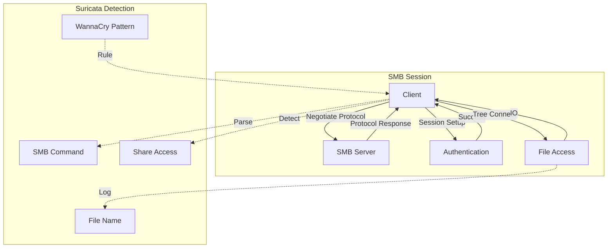
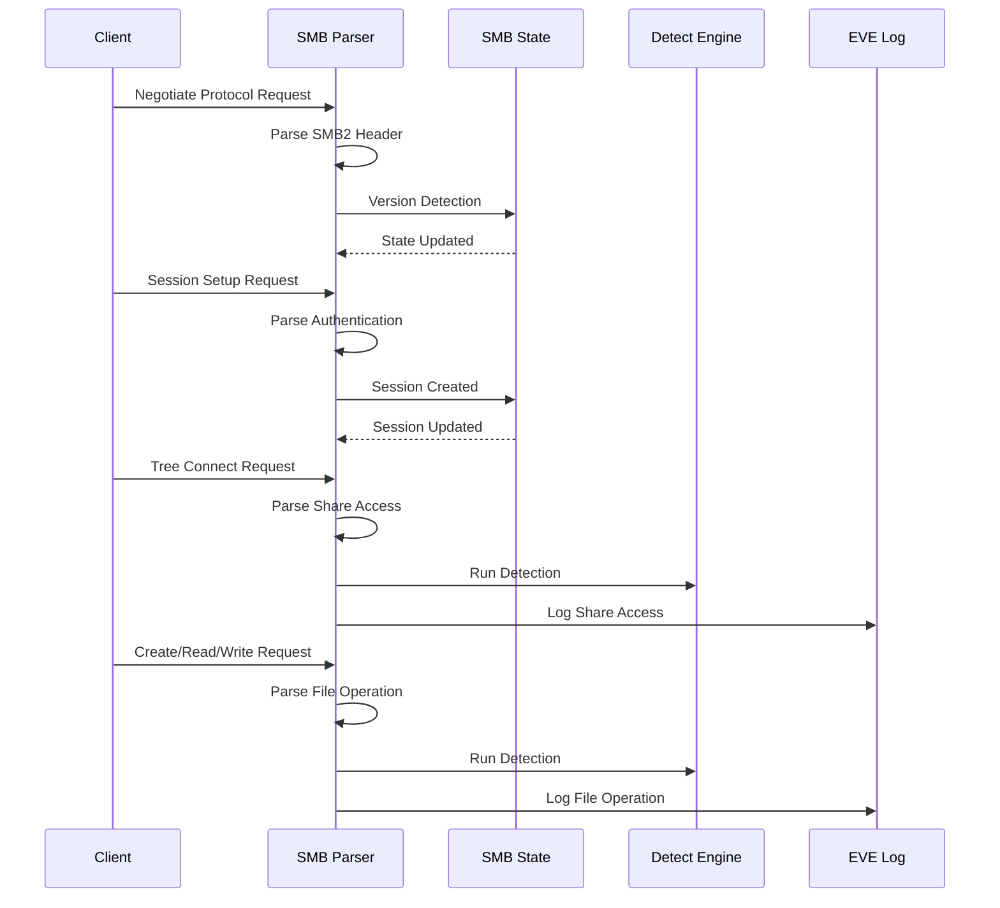

> [!info] Suricata 2026 深度探索系列 0. [[2026-04-15-suricata-deep-dive-series-index|全栈学习路径总览]]
>
> 1. [[2026-04-15-suricata-deep-dive-ch1-overview|第一章：Suricata 概述]]
> 2. [[2026-04-15-suricata-deep-dive-ch2-config|第二章：Suricata 配置系统]]
> 3. [[2026-04-15-suricata-deep-dive-ch3-runmodes|第三章：Runmodes 运行模式]]
> 4. [[2026-04-15-suricata-deep-dive-ch4-thread-model|第四章：线程模型]]
> 5. [[2026-04-15-suricata-deep-dive-ch5-capture|第五章：Capture 初始化]]
> 6. [[2026-04-15-suricata-deep-dive-ch6-af-packet|第六章：AF-PACKET 接口]]
> 7. [[2026-04-15-suricata-deep-dive-ch7-pcap|第七章：PCAP 接口]]
> 8. [[2026-04-15-suricata-deep-dive-ch8-nfq|第八章：NFQ 与 PF_RING 模式]]
> 9. [[2026-04-15-suricata-deep-dive-ch9-dpdk|第九章：DPDK 接口]]
> 10. [[2026-04-15-suricata-deep-dive-ch10-loadbalancing|第十章：多线程抓包与负载均衡]]
> 11. [[2026-04-15-suricata-deep-dive-ch11-detect-engine|第十一章：检测引擎架构]]
> 12. [[2026-04-15-suricata-deep-dive-ch12-signatures|第十二章：规则解析]]
> 13. [[2026-04-15-suricata-deep-dive-ch13-mpm|第十三章：多模式匹配]]
> 14. [[2026-04-15-suricata-deep-dive-ch14-filemagic|第十四章：文件识别]]
> 15. [[2026-04-15-suricata-deep-dive-ch15-lua-detect|第十五章：Lua 检测]]
> 16. [[2026-04-15-suricata-deep-dive-ch16-app-layer|第十六章：应用层协议解析]]
> 17. [[2026-04-15-suricata-deep-dive-ch17-http|第十七章：HTTP 协议解析]]
> 18. [[2026-04-15-suricata-deep-dive-ch18-dns|第十八章：DNS 协议解析]]
> 19. [[2026-04-15-suricata-deep-dive-ch19-tls|第十九章：TLS 协议解析]]
> 20. **第二十章：SMB 协议解析**

---

## 1. SMB 解析概述

SMB（Server Message Block）是 Windows 网络文件共享的核心协议。Suricata 的 SMB 解析模块支持 SMB1、SMB2 和 SMB3 协议，能够检测文件共享活动、横向移动、勒索软件攻击等安全威胁。



### 1.1 SMB 版本

| 版本     | 描述                  | 年份 |
| :------- | :-------------------- | :--- |
| SMB1     | 原始协议，CIFS        | 1983 |
| SMB2     | 重构协议，性能提升    | 2006 |
| SMB2.1   | opportunistic locking | 2010 |
| SMB3.0   | 透明故障转移，RDMA    | 2012 |
| SMB3.1.1 | AES-128-GCM 加密      | 2015 |

### 1.2 SMB 处理流程



---

## 2. SMB 数据结构

### 2.1 SMB2 Header

```c
// src/app-layer-smb.h — SMB2 Header
typedef struct SMB2Header_ {
    /* SMB2 协议 ID (固定 0xFE SMB) */
    uint8_t protocol_id[4];

    /* Header 长度 */
    uint16_t header_length;

    /* SMB2 Credit Charge */
    uint16_t credit_charge;

    /* 状态 */
    uint32_t status;

    /* 命令 */
    uint16_t command;
#define SMB2_COMMAND_NEGOTIATE         0
#define SMB2_COMMAND_SESSION_SETUP     1
#define SMB2_COMMAND_LOGOFF            2
#define SMB2_COMMAND_TREE_CONNECT      3
#define SMB2_COMMAND_TREE_DISCONNECT   4
#define SMB2_COMMAND_CREATE            5
#define SMB2_COMMAND_CLOSE             6
#define SMB2_COMMAND_READ              7
#define SMB2_COMMAND_WRITE             8
#define SMB2_COMMAND_RENAME            11
#define SMB2_COMMAND_QUERY_DIRECTORY   12
#define SMB2_COMMAND_CHANGE_NOTIFY     14
#define SMB2_COMMAND_IOCTL            15
#define SMB2_COMMAND_QUERY_INFO        16
#define SMB2_COMMAND_SET_INFO          17
#define SMB2_COMMAND_BATCH_OPLOCK      18
#define SMB2_COMMAND_INVALIDATE        19
#define SMB2_COMMAND_ECHO              20
#define SMB2_COMMAND_QUERY_SCM_RIGHTS  21
#define SMB2_COMMAND_BIND              22

    /* Credit Request/Response */
    uint16_t credit_request;

    /* Flags */
    uint32_t flags;
#define SMB2_FLAGS_SERVER_TO_REDIR     0x00000001
#define SMB2_FLAGS_ASYNC_COMMAND       0x00000002
#define SMB2_FLAGS_DFS_OPERATIONS      0x10000000
#define SMB2_FLAGS_ERROR                0x80000000

    /* 链式操作 */
    uint16_t chain_offset;

    /* Message ID */
    uint64_t message_id;

    /* 异步 ID (如果设置了 ASYNC_COMMAND) */
    uint64_t async_id;

    /* Session ID */
    uint64_t session_id;

    /* Tree ID */
    uint32_t tree_id;

    /* 签名 (如果有) */
    uint8_t signature[16];

} SMB2Header;
```

### 2.2 SMB1 Header

```c
// src/app-layer-smb.h — SMB1 Header
typedef struct SMB1Header_ {
    /* 协议 ID */
    uint8_t protocol[4];  /* 0xFF 'SMB' */

    /* 命令 */
    uint8_t command;
#define SMB1_COMMAND_CREATE_DIRECTORY   0x00
#define SMB1_COMMAND_DELETE_DIRECTORY   0x01
#define SMB1_COMMAND_OPEN              0x02
#define SMB1_COMMAND_CREATE            0x03
#define SMB1_COMMAND_CLOSE             0x04
#define SMB1_COMMAND_FLUSH             0x05
#define SMB1_COMMAND_DELETE            0x06
#define SMB1_COMMAND_RENAME            0x07
#define SMB1_COMMAND_QUERY_INFORMATION  0x08
#define SMB1_COMMAND_SET_INFORMATION   0x09
#define SMB1_COMMAND_READ              0x0A
#define SMB1_COMMAND_WRITE             0x0B
#define SMB1_COMMAND_LOCK              0x0C
#define SMB1_COMMAND_LOCKING_ANDX      0x24
#define SMB1_COMMAND_TRANSACTION       0x25
#define SMB1_COMMAND_TRANSACTION2     0x26
#define SMB1_COMMAND_ECHO             0x2B
#define SMB1_COMMAND_WRITE_AND_CLOSE   0x2C

    /* 错误类 */
    uint8_t error_class;

    /* 错误码 */
    uint8_t error_code;

    /* Flags */
    uint8_t flags;
#define SMB1_FLAGS_CASE_SENSITIVE     0x08
#define SMB1_FLAGS_CANONICAL_PATHS    0x10
#define SMB1_FLAGS_OPLOCK             0x20
#define SMB1_FLAGS_OPLOCK_NOTIFY      0x40
#define SMB1_FLAGS_REPLY              0x80

    /* Flags2 */
    uint16_t flags2;
#define SMB1_FLAGS2_LONG_NAMES        0x0001
#define SMB1_FLAGS2_EXTENDED_SECURITY 0x0800
#define SMB1_FLAGS2_UNICODE           0x8000

    /* Process ID 高位 */
    uint16_t pid_high;

    /* Security Blob */
    uint8_t *security_blob;
    uint16_t security_blob_length;

    /* Tree ID */
    uint16_t tree_id;

    /* User ID */
    uint16_t user_id;

    /* 多协议复用 ID */
    uint16_t multiplex_id;

    /* Process ID */
    uint16_t pid;

    /* 数据缓冲区 */
    uint8_t *data;
    uint32_t data_length;

} SMB1Header;
```

### 2.3 SMB State

```c
// src/app-layer-smb.h — SMB State
typedef struct SMBState_ {
    /* SMB 版本 */
    uint8_t version;
#define SMB_VERSION_1    1
#define SMB_VERSION_2_0  2
#define SMB_VERSION_2_1  3
#define SMB_VERSION_3_0  4
#define SMB_VERSION_3_1_1 5

    /* 连接状态 */
    uint8_t state;
#define SMB_STATE_NONE              0
#define SMB_STATE_NEGOTIATE         1
#define SMB_STATE_AUTHENTICATED      2
#define SMB_STATE_TREE_CONNECTED     3
#define SMB_STATE_SESSION_ACTIVE     4

    /* Session 信息 */
    uint64_t session_id;
    uint8_t *session_key;
    uint32_t session_key_len;

    /* Tree 信息 */
    uint32_t tree_id;
    char *share_name;
    uint8_t share_type;

    /* Dialect 信息 */
    uint16_t dialect;
    uint16_t dialect_count;
    uint16_t *dialects;

    /* 安全模式 */
    uint16_t security_mode;
    uint8_t *security_blob;
    uint32_t security_blob_len;

    /* GSS-API */
    uint8_t *gss_token;
    uint32_t gss_token_len;

    /* 文件操作 */
    SMBFile *files;
    uint32_t file_count;

    /* 命令计数 */
    uint32_t command_count;

    /* TX 列表 */
    SMBTransaction *txs;
    uint64_t tx_cnt;
    uint64_t max_tx;

    /* 标志位 */
    uint32_t flags;
#define SMB_FLAG_SMB2                0x01
#define SMB_FLAG_ENCRYPT_DATA         0x02
#define SMB_FLAG_GUEST_ACCOUNT        0x04
#define SMB_FLAG_ANONYMOUS_ACCOUNT     0x08
#define SMB_FLAG_DFS                  0x10
#define SMB_FLAG_COMPRESSED_DATA      0x20

} SMBState;

// src/app-layer-smb.h — SMB Transaction
typedef struct SMBTransaction_ {
    /* TX ID */
    uint64_t tx_id;

    /* 命令 */
    uint16_t command;

    /* Message ID */
    uint64_t message_id;

    /* Session/Tree ID */
    uint64_t session_id;
    uint32_t tree_id;

    /* 文件信息 */
    char *filename;
    uint64_t file_id;

    /* 操作类型 */
    uint8_t type;
#define SMB_TRANSACTION_TYPE_CREATE   1
#define SMB_TRANSACTION_TYPE_READ     2
#define SMB_TRANSACTION_TYPE_WRITE    3
#define SMB_TRANSACTION_TYPE_QUERY    4
#define SMB_TRANSACTION_TYPE_SET      5

    /* 状态 */
    uint8_t status;

    /* 时间戳 */
    struct timeval ts;

    /* 数据 */
    uint8_t *request;
    uint32_t request_len;
    uint8_t *response;
    uint32_t response_len;

    /* 链表 */
    struct SMBTransaction_ *next;
} SMBTransaction;

// src/app-layer-smb.h — SMB File
typedef struct SMBFile_ {
    /* 文件 ID */
    uint64_t file_id;

    /* 文件名 */
    char *filename;
    uint32_t filename_len;

    /* 文件属性 */
    uint32_t attributes;

    /* 访问模式 */
    uint32_t access_mask;

    /* 共享模式 */
    uint32_t share_mode;

    /* 创建选项 */
    uint32_t create_options;

    /* 创建分发 */
    uint32_t create_disposition;

    /* 时间戳 */
    time_t created;
    time_t accessed;
    time_t modified;
    time_t changed;

    /* 文件大小 */
    uint64_t size;

    /* 标志位 */
    uint32_t flags;
#define SMB_FILE_FLAG_DELETED         0x01
#define SMB_FILE_FLAG_ENCRYPTED       0x02
#define SMB_FILE_FLAG_DIRECTORY       0x04

    /* 链表 */
    struct SMBFile_ *next;
} SMBFile;
```

---

## 3. SMB 协议检测

### 3.1 SMB1 检测

```c
// src/app-layer-smb.c — SMB1 检测
static AppLayerProtoDetectResult SMB1ProbingParser(
    Flow *f, uint8_t *input, uint32_t input_len, uint8_t direction)
{
    /* SMB1 协议签名: 0xFF 'SMB' */
    if (input_len < 4) {
        return APP_LAYER_PROTO_DETECT_FAILED;
    }

    if (input[0] == 0xFF && input[1] == 'S' &&
        input[2] == 'M' && input[3] == 'B') {

        /* 检查命令是否有效 */
        if (input_len >= 5) {
            uint8_t command = input[4];

            /* 检查是否为有效命令 */
            if (command <= 0x2C || command == 0x72 || command == 0x73) {
                return APP_LAYER_PROTO_DETECT_SUCCESS;
            }
        }

        return APP_LAYER_PROTO_DETECT_SUCCESS;
    }

    return APP_LAYER_PROTO_DETECT_FAILED;
}
```

### 3.2 SMB2 检测

```c
// src/app-layer-smb.c — SMB2 检测
static AppLayerProtoDetectResult SMB2ProbingParser(
    Flow *f, uint8_t *input, uint32_t input_len, uint8_t direction)
{
    /* SMB2 协议签名: 0xFE SMB */
    if (input_len < 4) {
        return APP_LAYER_PROTO_DETECT_FAILED;
    }

    if (input[0] == 0xFE && input[1] == 'S' &&
        input[2] == 'M' && input[3] == 'B') {

        /* 检查 Header 长度 */
        if (input_len >= 4) {
            /* SMB2 Header 固定 64 字节 */
            return APP_LAYER_PROTO_DETECT_SUCCESS;
        }

        return APP_LAYER_PROTO_DETECT_INCOMPLETE;
    }

    return APP_LAYER_PROTO_DETECT_FAILED;
}
```

### 3.3 SMB Direct 检测

```c
// src/app-layer-smb.c — SMB Direct (RDMA) 检测
static AppLayerProtoDetectResult SMBDirectProbingParser(
    Flow *f, uint8_t *input, uint32_t input_len, uint8_t direction)
{
    /* SMB Direct 使用 445 端口的替代端口
       或通过 SMB2 over TCP 直接传输 */

    if (input_len < 4) {
        return APP_LAYER_PROTO_DETECT_FAILED;
    }

    /* 尝试 SMB2 检测 */
    if (SMB2ProbingParser(f, input, input_len, direction) ==
        APP_LAYER_PROTO_DETECT_SUCCESS) {
        return APP_LAYER_PROTO_DETECT_SUCCESS;
    }

    /* 尝试 SMB1 检测 */
    if (SMB1ProbingParser(f, input, input_len, direction) ==
        APP_LAYER_PROTO_DETECT_SUCCESS) {
        return APP_LAYER_PROTO_DETECT_SUCCESS;
    }

    return APP_LAYER_PROTO_DETECT_FAILED;
}
```

---

## 4. SMB 解析

### 4.1 SMB2 解析

```c
// src/app-layer-smb.c — 解析 SMB2
static int SMB2Parse(Flow *f, uint8_t *input, uint32_t input_len,
                     uint8_t direction)
{
    SMBState *state = (SMBState *)FlowGetAppState(f);
    if (state == NULL) {
        state = SMBStateAlloc();
        FlowSetAppState(f, state);
    }

    /* 解析 SMB2 Header */
    SMB2Header header;
    if (SMB2ParseHeader(input, input_len, &header) < 0) {
        return -1;
    }

    /* 检查方向 */
    if (direction == STREAM_TOSERVER) {
        /* 客户端请求 */
        return SMB2ParseRequest(state, &header, input + 64,
                                 input_len - 64);
    } else {
        /* 服务器响应 */
        return SMB2ParseResponse(state, &header, input + 64,
                                input_len - 64);
    }
}

// src/app-layer-smb.c — 解析 SMB2 Header
static int SMB2ParseHeader(uint8_t *input, uint32_t input_len,
                          SMB2Header *header)
{
    if (input_len < 64) {
        return -1;
    }

    /* 协议 ID */
    memcpy(header->protocol_id, input, 4);

    /* Header 长度 */
    header->header_length = *((uint16_t *)(input + 4));
    header->header_length = ntohs(header->header_length);

    /* Credit Charge */
    header->credit_charge = *((uint16_t *)(input + 6));
    header->credit_charge = ntohs(header->credit_charge);

    /* 状态 */
    header->status = *((uint32_t *)(input + 8));
    header->status = ntohl(header->status);

    /* 命令 */
    header->command = *((uint16_t *)(input + 12));
    header->command = ntohs(header->command);

    /* Credit Request/Response */
    header->credit_request = *((uint16_t *)(input + 14));
    header->credit_request = ntohs(header->credit_request);

    /* Flags */
    header->flags = *((uint32_t *)(input + 16));
    header->flags = ntohl(header->flags);

    /* Chain Offset */
    header->chain_offset = *((uint16_t *)(input + 20));
    header->chain_offset = ntohs(header->chain_offset);

    /* Message ID */
    header->message_id = *((uint64_t *)(input + 24));
    header->message_id = ntoh64(header->message_id);

    /* Session ID */
    header->session_id = *((uint64_t *)(input + 40));
    header->session_id = ntoh64(header->session_id);

    /* Tree ID */
    header->tree_id = *((uint32_t *)(input + 48));
    header->tree_id = ntohl(header->tree_id);

    /* 更新状态 */
    if (header->flags & SMB2_FLAGS_ASYNC_COMMAND) {
        /* 异步命令 */
        header->async_id = *((uint64_t *)(input + 32));
        header->async_id = ntoh64(header->async_id);
    }

    return 0;
}
```

### 4.2 Negotiate Protocol

```c
// src/app-layer-smb.c — 解析 Negotiate Protocol
static int SMB2ParseNegotiateProtocol(SMBState *state, uint8_t *input,
                                       uint32_t input_len)
{
    uint8_t *ptr = input;
    uint32_t offset = 0;

    /* 结构大小 (2 字节) */
    uint16_t structure_size = *((uint16_t *)ptr);
    structure_size = ntohs(structure_size);
    ptr += 2;
    offset += 2;

    /* Dialect Count */
    uint16_t dialect_count = *((uint16_t *)ptr);
    dialect_count = ntohs(dialect_count);
    ptr += 2;
    offset += 2;

    /* 安全模式 */
    uint16_t security_mode = *((uint16_t *)ptr);
    security_mode = ntohs(security_mode);
    ptr += 2;
    offset += 2;

    /* 客户端 GUID */
    uint8_t client_guid[16];
    memcpy(client_guid, ptr, 16);
    ptr += 16;
    offset += 16;

    /* 缓存能力 */
    uint32_t capabilities = *((uint32_t *)ptr);
    capabilities = ntohl(capabilities);
    ptr += 4;
    offset += 4;

    /* 客户端角色 */
    uint32_t client_startup_time = *((uint32_t *)ptr);
    ptr += 4;
    offset += 4;

    /* 解析 Dialects */
    state->dialect_count = dialect_count;
    state->dialects = SCCalloc(dialect_count, sizeof(uint16_t));

    for (int i = 0; i < dialect_count; i++) {
        state->dialects[i] = *((uint16_t *)ptr);
        state->dialects[i] = ntohs(state->dialects[i]);
        ptr += 2;
        offset += 2;
    }

    /* 解析安全 blob */
    uint16_t security_blob_offset = *((uint16_t *)ptr);
    security_blob_offset = ntohs(security_blob_offset);
    ptr += 2;
    offset += 2;

    uint16_t security_blob_len = *((uint16_t *)ptr);
    security_blob_len = ntohs(security_blob_len);
    ptr += 2;
    offset += 2;

    if (security_blob_len > 0 && offset + security_blob_len <= input_len) {
        state->security_blob = SCMalloc(security_blob_len);
        memcpy(state->security_blob, ptr, security_blob_len);
        state->security_blob_len = security_blob_len;
    }

    /* 更新状态 */
    state->state = SMB_STATE_NEGOTIATE;

    return 0;
}
```

### 4.3 Session Setup

```c
// src/app-layer-smb.c — 解析 Session Setup
static int SMB2ParseSessionSetup(SMBState *state, uint8_t *input,
                                 uint32_t input_len, uint8_t direction)
{
    uint8_t *ptr = input;
    uint32_t offset = 0;

    /* 结构大小 */
    uint16_t structure_size = *((uint16_t *)ptr);
    structure_size = ntohs(structure_size);
    ptr += 2;
    offset += 2;

    /* Flags */
    uint8_t flags = *ptr;
    ptr += 1;
    offset += 1;

    /* Security Mode */
    uint8_t security_mode = *ptr;
    ptr += 1;
    offset += 1;

    /* 解析 Session ID */
    state->session_id = *((uint64_t *)ptr);
    state->session_id = ntoh64(state->session_id);
    ptr += 8;
    offset += 8;

    /* 解析 GSS-API Token */
    uint32_t session_properties_offset = *((uint32_t *)ptr);
    session_properties_offset = ntohl(session_properties_offset);
    ptr += 4;
    offset += 4;

    uint16_t session_properties_len = *((uint16_t *)ptr);
    session_properties_len = ntohs(session_properties_len);
    ptr += 2;
    offset += 2;

    if (session_properties_len > 0 && offset + session_properties_len <= input_len) {
        state->gss_token = SCMalloc(session_properties_len);
        memcpy(state->gss_token, ptr, session_properties_len);
        state->gss_token_len = session_properties_len;
    }

    /* 检查是否成功 */
    if (direction == STREAM_TOCLIENT) {
        /* 解析响应状态 */
        if (state->status == 0) {
            state->state = SMB_STATE_AUTHENTICATED;

            /* 检查是否匿名 */
            if (flags & SMB2_SESSION_FLAG_IS_ANONYMOUS) {
                state->flags |= SMB_FLAG_ANONYMOUS_ACCOUNT;
            }

            /* 检查是否来宾 */
            if (flags & SMB2_SESSION_FLAG_IS_GUEST) {
                state->flags |= SMB_FLAG_GUEST_ACCOUNT;
            }
        }
    }

    return 0;
}
```

### 4.4 Tree Connect

```c
// src/app-layer-smb.c — 解析 Tree Connect
static int SMB2ParseTreeConnect(SMBState *state, uint8_t *input,
                                uint32_t input_len, uint8_t direction)
{
    if (direction == STREAM_TOSERVER) {
        /* 解析请求 */
        uint8_t *ptr = input;
        uint32_t offset = 0;

        /* 结构大小 */
        uint16_t structure_size = *((uint16_t *)ptr);
        structure_size = ntohs(structure_size);
        ptr += 2;
        offset += 2;

        /* 标志 */
        uint16_t flags = *((uint16_t *)ptr);
        flags = ntohs(flags);
        ptr += 2;
        offset += 2;

        /* 路径偏移和长度 */
        uint16_t path_offset = *((uint16_t *)ptr);
        path_offset = ntohs(path_offset);
        ptr += 2;
        offset += 2;

        uint16_t path_length = *((uint16_t *)ptr);
        path_length = ntohs(path_length);
        ptr += 2;
        offset += 2;

        /* 提取共享名 */
        if (path_length > 0 && offset + path_length <= input_len) {
            /* 解析路径 (UNC 格式) */
            char *path = (char *)ptr;

            /* 检测是否为 IPC$ 共享 */
            if (strncmp(path, "\\\\", 2) == 0) {
                char *share = strchr(path + 2, '\\');
                if (share != NULL) {
                    size_t share_len = share - path - 2;
                    state->share_name = SCMalloc(share_len + 1);
                    memcpy(state->share_name, path + 2, share_len);
                    state->share_name[share_len] = '\0';
                }
            }
        }

    } else {
        /* 解析响应 */
        uint8_t *ptr = input;

        /* 结构大小 */
        uint16_t structure_size = *((uint16_t *)ptr);
        structure_size = ntohs(structure_size);
        ptr += 2;

        /* Share 类型 */
        uint8_t share_type = *ptr;
        state->share_type = share_type;
        ptr += 1;

        /* 标志 */
        uint8_t flags = *ptr;
        ptr += 1;

        /* 更新状态 */
        if (state->status == 0) {
            state->state = SMB_STATE_TREE_CONNECTED;
        }
    }

    return 0;
}
```

### 4.5 File Operations

```c
// src/app-layer-smb.c — 解析 Create Request
static int SMB2ParseCreate(SMBState *state, uint8_t *input,
                           uint32_t input_len, uint8_t direction)
{
    if (direction != STREAM_TOSERVER) {
        return 0;
    }

    SMBTransaction *tx = SMBTransactionCreate(state);
    tx->command = SMB2_COMMAND_CREATE;
    tx->type = SMB_TRANSACTION_TYPE_CREATE;

    uint8_t *ptr = input;
    uint32_t offset = 0;

    /* 结构大小 (固定 57) */
    ptr += 2;
    offset += 2;

    /* 原子操作码 */
    uint8_t oplock_level = *ptr;
    ptr += 1;
    offset += 1;

    /* 标志 */
    uint32_t impersonation = *((uint32_t *)ptr);
    impersonation = ntohl(impersonation);
    ptr += 4;
    offset += 4;

    /* 创建标志 */
    uint64_t create_flags = *((uint64_t *)ptr);
    create_flags = nto64(create_flags);
    ptr += 8;
    offset += 8;

    /* 响应 */
    uint64_t create_response = *((uint64_t *)ptr);
    create_response = nto64(create_response);
    ptr += 8;
    offset += 8;

    /* 文件属性 */
    uint32_t file_attributes = *((uint32_t *)ptr);
    file_attributes = ntohl(file_attributes);
    ptr += 4;
    offset += 4;

    /* 共享访问 */
    uint32_t share_access = *((uint32_t *)ptr);
    share_access = ntohl(share_access);
    ptr += 4;
    offset += 4;

    /* 创建分发 */
    uint32_t create_disposition = *((uint32_t *)ptr);
    create_disposition = ntohl(create_disposition);
    ptr += 4;
    offset += 4;

    /* 创建选项 */
    uint32_t create_options = *((uint32_t *)ptr);
    create_options = ntohl(create_options);
    ptr += 4;
    offset += 4;

    /* 文件名 */
    uint16_t name_offset = *((uint16_t *)ptr);
    name_offset = ntohs(name_offset);
    ptr += 2;
    offset += 2;

    uint16_t name_length = *((uint16_t *)ptr);
    name_length = ntohs(name_length);
    ptr += 2;
    offset += 2;

    if (name_length > 0 && offset + name_length <= input_len) {
        /* 分配文件结构 */
        SMBFile *file = SCCalloc(1, sizeof(SMBFile));
        file->filename = SCMalloc(name_length + 1);
        memcpy(file->filename, ptr, name_length);
        file->filename[name_length] = '\0';
        file->filename_len = name_length;
        file->attributes = file_attributes;
        file->access_mask = 0;
        file->share_mode = share_access;
        file->create_options = create_options;
        file->create_disposition = create_disposition;

        /* 添加到文件列表 */
        if (state->files == NULL) {
            state->files = file;
        } else {
            SMBFile *last = state->files;
            while (last->next != NULL) {
                last = last->next;
            }
            last->next = file;
        }

        state->file_count++;

        /* 更新 TX */
        tx->filename = SCStrdup(file->filename);
    }

    return 0;
}
```

---

## 5. 配置选项

### 5.1 smb 配置

```yaml
# suricata.yaml
app-layer:
  protocols:
    smb:
      # 是否启用 SMB 解析
      enabled: yes

      # 检测端口
      detection-ports:
        toserver: [445]
        toclient: [445]

      # 最大 TX 数
      max-tx: 100

      # SMB1 支持
      smb1-enabled: yes

      # 证书记录
      log-certificate-subjects: yes

      # 加密检测
      detect-encryption: yes
```

### 5.2 配置解析

```c
// src/app-layer-smb.c — SMB 配置解析
static int SMBLoadConfig(SMBConfig *cfg, YamlNode *node)
{
    /* 解析 enabled */
    const char *enabled = YamlNodeLookup(node, "enabled");
    if (enabled && strcmp(enabled, "yes") != 0) {
        cfg->enabled = 0;
        return 0;
    }

    /* 解析 SMB1 */
    const char *smb1 = YamlNodeLookup(node, "smb1-enabled");
    if (smb1 && strcmp(smb1, "no") == 0) {
        cfg->flags |= SMB_CFG_DISABLE_SMB1;
    }

    /* 解析 max-tx */
    const char *max_tx = YamlNodeLookup(node, "max-tx");
    if (max_tx) {
        cfg->max_tx = atoi(max_tx);
    }

    /* 解析检测端口 */
    YamlNode *ports = YamlNodeLookup(node, "detection-ports");
    if (ports) {
        cfg->ports_toserver = ParsePorts(
            YamlNodeLookup(ports, "toserver"));
        cfg->ports_toclient = ParsePorts(
            YamlNodeLookup(ports, "toclient"));
    }

    return 0;
}
```

---

## 6. SMB 检测关键字

### 6.1 smb 检测关键字列表

| 关键字           | 描述       | 匹配位置     |
| :--------------- | :--------- | :----------- |
| `smb.command`    | SMB 命令   | Header       |
| `smb.share`      | 共享名称   | Tree Connect |
| `smb.filename`   | 文件名     | Create       |
| `smb.filesize`   | 文件大小   | Create       |
| `smb.accessed`   | 访问时间   | Query Info   |
| `smb.modified`   | 修改时间   | Query Info   |
| `smb.changed`    | 改变时间   | Query Info   |
| `smb.dialect`    | SMB 版本   | Negotiate    |
| `smb.session_id` | Session ID | Header       |
| `smb.tree_id`    | Tree ID    | Header       |

### 6.2 smb.command 检测实现

```c
// src/detect-smb-command.c — smb.command 关键字
typedef struct DetectSmbCommandData_ {
    /* SMB 命令 */
    uint16_t command;

    /* SMB 版本 */
    uint8_t version;

    /* 匹配选项 */
    uint8_t negate;
} DetectSmbCommandData;

static int DetectSmbCommandMatch(DetectEngineThreadCtx *det_ctx,
                                 Signature *s, Flow *f, Packet *p)
{
    SMBState *smb_state = (SMBState *)FlowGetAppState(f);
    if (smb_state == NULL) {
        return 0;
    }

    DetectSmbCommandData *data = (DetectSmbCommandData *)s->smb_command;

    /* 比较版本 */
    if (data->version != 0 && data->version != smb_state->version) {
        return 0;
    }

    /* 比较命令 - 需要获取当前命令 */
    /* 这需要跟踪当前解析的命令 */
    SMBTransaction *tx = smb_state->txs;
    if (tx == NULL) {
        return 0;
    }

    int result = (tx->command == data->command);

    if (data->negate) {
        return !result;
    }
    return result;
}
```

### 6.3 smb.share 检测实现

```c
// src/detect-smb-share.c — smb.share 关键字
typedef struct DetectSmbShareData_ {
    /* 共享名称 */
    char *share;
    size_t share_len;

    /* 匹配选项 */
    uint8_t flags;
#define SMB_SHARE_NEGATE   0x01
#define SMB_SHARE_CASE_INS 0x02  // 不区分大小写

} DetectSmbShareData;

static int DetectSmbShareMatch(DetectEngineThreadCtx *det_ctx,
                               Signature *s, Flow *f, Packet *p)
{
    SMBState *smb_state = (SMBState *)FlowGetAppState(f);
    if (smb_state == NULL || smb_state->share_name == NULL) {
        return 0;
    }

    DetectSmbShareData *data = (DetectSmbShareData *)s->smb_share;

    /* 比较共享名称 */
    int cmp_len = smb_state->share_name_len;
    if (cmp_len != data->share_len) {
        if (data->flags & SMB_SHARE_NEGATE) {
            return 1;
        }
        return 0;
    }

    int result = memcmp(smb_state->share_name, data->share, cmp_len);

    if (data->flags & SMB_SHARE_NEGATE) {
        return !result;
    }
    return result == 0;
}
```

### 6.4 smb.filename 检测实现

```c
// src/detect-smb-filename.c — smb.filename 关键字
typedef struct DetectSmbFilenameData_ {
    /* 文件名 */
    char *filename;
    size_t filename_len;

    /* 匹配选项 */
    uint8_t flags;
#define SMB_FILENAME_NEGATE   0x01

} DetectSmbFilenameData;

static int DetectSmbFilenameMatch(DetectEngineThreadCtx *det_ctx,
                                  Signature *s, Flow *f, Packet *p)
{
    SMBState *smb_state = (SMBState *)FlowGetAppState(f);
    if (smb_state == NULL) {
        return 0;
    }

    DetectSmbFilenameData *data = (DetectSmbFilenameData *)s->smb_filename;

    /* 遍历文件列表 */
    SMBFile *file = smb_state->files;
    while (file != NULL) {
        if (file->filename != NULL) {
            int result = DetectContentMatch(file->filename,
                                          strlen(file->filename),
                                          data->filename,
                                          data->filename_len);

            if (result) {
                if (data->flags & SMB_FILENAME_NEGATE) {
                    return 0;
                }
                return 1;
            }
        }
        file = file->next;
    }

    if (data->flags & SMB_FILENAME_NEGATE) {
        return 1;
    }
    return 0;
}
```

---

## 7. EVE JSON 日志

### 7.1 SMB 日志格式

```json
{
  "timestamp": "2026-04-15T16:00:00.000000+0000",
  "event_type": "smb",
  "src_ip": "192.168.1.100",
  "src_port": 49789,
  "dest_ip": "192.168.1.50",
  "dest_port": 445,
  "smb": {
    "version": "SMB3.1.1",
    "dialect": "0x0311",
    "command": "CREATE",
    "session_id": "0x1234567890ABCDEF",
    "tree_id": "0x12345678",
    "share": "C$",
    "filename": "\\Windows\\System32\\config\\sam",
    "filesize": 0,
    "status": "SUCCESS",
    "access": ["READ", "WRITE"]
  }
}
```

### 7.2 SMB 日志输出

```c
// src/output-json-smb.c — SMB 日志输出
static int JsonSmbLogger(ThreadVars *tv, void *thread_data,
                         const Packet *p, Flow *f, void *state, void *tx)
{
    SMBState *smb_state = (SMBState *)state;
    SMBTransaction *smb_tx = (SMBTransaction *)tx;

    /* 创建 JSON 对象 */
    json_t *js = json_object();

    /* 版本信息 */
    const char *version_str = SMBVersionToString(smb_state->version);
    json_object_set_new(js, "version", json_string(version_str));

    if (smb_state->dialect_count > 0) {
        json_object_set_new(js, "dialect",
            json_string_fmt("0x%04X", smb_state->dialects[0]));
    }

    /* 命令 */
    const char *command_str = SMBCommandToString(smb_tx->command);
    json_object_set_new(js, "command", json_string(command_str));

    /* Session ID */
    json_object_set_new(js, "session_id",
        json_string_fmt("0x%016" PRIX64, smb_state->session_id));

    /* Tree ID */
    json_object_set_new(js, "tree_id",
        json_string_fmt("0x%08X", smb_state->tree_id));

    /* 共享名称 */
    if (smb_state->share_name) {
        json_object_set_new(js, "share",
            json_string(smb_state->share_name));
    }

    /* 文件名 */
    if (smb_tx->filename) {
        json_object_set_new(js, "filename",
            json_string(smb_tx->filename));
    }

    /* 状态 */
    const char *status_str = SMBStatusToString(smb_tx->status);
    json_object_set_new(js, "status", json_string(status_str));

    /* 输出 JSON */
    OutputJsonBuffer(js, thread_data);

    json_decref(js);
    return 0;
}
```

---

## 8. 安全检测

### 8.1 WannaCry 检测

```snort
# 检测 WannaCry 勒索软件特征
alert smb any any -> any any (
    msg:"WannaCry - Suspicious File Create";
    smb.command; eq CREATE;
    smb.filename; content:"WNCRY";
    sid:4000001;
    rev:1;
)

# 检测 SMB 横向移动
alert smb any any -> any any (
    msg:"SMB Lateral Movement - Suspicious Share Access";
    smb.share; content:"C$";
    smb.filename; content:"\\ Windows\\ System32\\";
    sid:4000002;
    rev:1;
)

# 检测 SMB 枚举
alert smb any any -> any any (
    msg:"SMB Enumeration - Tree Connect to IPC$";
    smb.command; eq TREE_CONNECT;
    smb.share; content:"IPC$";
    sid:4000003;
    rev:1;
)
```

### 8.2 检测规则示例

```snort
# 检测 SMB 文件读取敏感文件
alert smb any any -> any any (
    msg:"SMB - Sensitive File Access";
    smb.command; eq READ;
    smb.filename; content:"\\ Windows\\ System32\\ sam";
    sid:4000010;
    rev:1;
)

# 检测 SMB 版本降级尝试
alert smb any any -> any any (
    msg:"SMB - SMB1 Dialect Request";
    smb.dialect; content:"0x0202";
    sid:4000011;
    rev:1;
)
```

---

## 9. 常见问题

### 9.1 SMB 解析失败

**问题**：SMB 流量未被解析

**排查步骤**：

1. 检查 `app-layer.protocols.smb.enabled` 是否为 `yes`
2. 检查 detection-ports 是否包含 445 端口
3. 查看 Suricata 日志中的 SMB 错误

### 9.2 SMB1 未检测

**问题**：SMB1 流量未检测

**排查步骤**：

1. 检查 `app-layer.protocols.smb.smb1-enabled` 是否为 `yes`
2. 确认网络使用的是 SMB1 协议

### 9.3 文件名未记录

**问题**：SMB 文件操作未记录文件名

**排查步骤**：

1. 检查是否启用了 SMB 解析
2. 确认 TX 数量未超限
3. 查看 EVE 日志中的实际文件名

---

## 10. 总结

本章介绍了 Suricata SMB 解析系统的实现：

- **SMB 版本**：SMB1、SMB2、SMB2.1、SMB3、SMB3.1.1
- **数据结构**：SMB2 Header、SMB1 Header、State、Transaction、File 结构
- **协议检测**：SMB1 和 SMB2 协议的检测机制
- **解析流程**：Negotiate、Session Setup、Tree Connect、File Operations
- **检测关键字**：smb.command、smb.share、smb.filename 等
- **EVE 日志**：JSON 格式的 SMB 日志输出

后续章节将继续介绍 HTTP/2 协议的解析。
