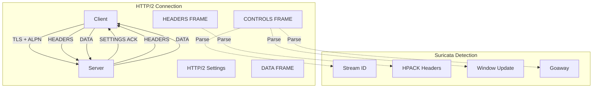
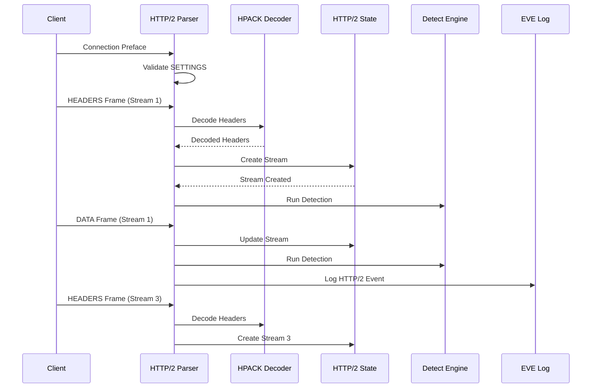
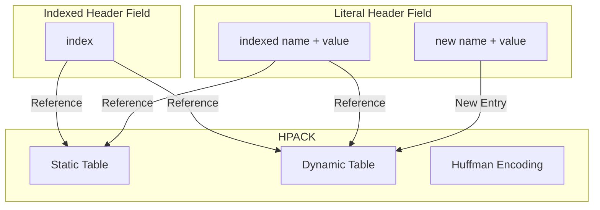

> [!info] Suricata 2026 深度探索系列 0. [[2026-04-15-suricata-deep-dive-series-index|全栈学习路径总览]]
>
> 1. [[2026-04-15-suricata-deep-dive-ch1-overview|第一章：Suricata 概述]]
> 2. [[2026-04-15-suricata-deep-dive-ch2-config|第二章：Suricata 配置系统]]
> 3. [[2026-04-15-suricata-deep-dive-ch3-runmodes|第三章：Runmodes 运行模式]]
> 4. [[2026-04-15-suricata-deep-dive-ch4-thread-model|第四章：线程模型]]
> 5. [[2026-04-15-suricata-deep-dive-ch5-capture|第五章：Capture 初始化]]
> 6. [[2026-04-15-suricata-deep-dive-ch6-af-packet|第六章：AF-PACKET 接口]]
> 7. [[2026-04-15-suricata-deep-dive-ch7-pcap|第七章：PCAP 接口]]
> 8. [[2026-04-15-suricata-deep-dive-ch8-nfq|第八章：NFQ 与 PF_RING 模式]]
> 9. [[2026-04-15-suricata-deep-dive-ch9-dpdk|第九章：DPDK 接口]]
> 10. [[2026-04-15-suricata-deep-dive-ch10-loadbalancing|第十章：多线程抓包与负载均衡]]
> 11. [[2026-04-15-suricata-deep-dive-ch11-detect-engine|第十一章：检测引擎架构]]
> 12. [[2026-04-15-suricata-deep-dive-ch12-signatures|第十二章：规则解析]]
> 13. [[2026-04-15-suricata-deep-dive-ch13-mpm|第十三章：多模式匹配]]
> 14. [[2026-04-15-suricata-deep-dive-ch14-filemagic|第十四章：文件识别]]
> 15. [[2026-04-15-suricata-deep-dive-ch15-lua-detect|第十五章：Lua 检测]]
> 16. [[2026-04-15-suricata-deep-dive-ch16-app-layer|第十六章：应用层协议解析]]
> 17. [[2026-04-15-suricata-deep-dive-ch17-http|第十七章：HTTP 协议解析]]
> 18. [[2026-04-15-suricata-deep-dive-ch18-dns|第十八章：DNS 协议解析]]
> 19. [[2026-04-15-suricata-deep-dive-ch19-tls|第十九章：TLS 协议解析]]
> 20. [[2026-04-15-suricata-deep-dive-ch20-smb|第二十章：SMB 协议解析]]
> 21. **第二十一章：HTTP/2 协议解析**

---

## 1. HTTP/2 解析概述

HTTP/2（RFC 7540）是 HTTP 协议的重大升级，引入了二进制分帧、多路复用、头部压缩等特性。Suricata 的 HTTP/2 解析模块能够解析 HTTP/2 流量，提取请求和响应信息，支持基于 HTTP/2 的威胁检测。



### 1.1 HTTP/2 vs HTTP/1.1

| 特性           | HTTP/1.1 | HTTP/2     |
| :------------- | :------- | :--------- |
| **传输格式**   | 文本     | 二进制分帧 |
| **多路复用**   | 顺序阻塞 | 多路复用   |
| **头部压缩**   | 无       | HPACK      |
| **服务器推送** | 无       | 支持       |
| **流量控制**   | 无       | 流级别     |
| **依赖关系**   | 无       | 流的依赖   |

### 1.2 HTTP/2 处理流程



---

## 2. HTTP/2 数据结构

### 2.1 HTTP/2 Frame

```c
// src/app-layer-http2.h — HTTP/2 帧
typedef struct HTTP2Frame_ {
    /* 长度 (3 字节) */
    uint32_t length;

    /* 类型 (1 字节) */
    uint8_t type;
#define HTTP2_FRAME_TYPE_DATA           0x00
#define HTTP2_FRAME_TYPE_HEADERS        0x01
#define HTTP2_FRAME_TYPE_PRIORITY       0x02
#define HTTP2_FRAME_TYPE_RST_STREAM      0x03
#define HTTP2_FRAME_TYPE_SETTINGS       0x04
#define HTTP2_FRAME_TYPE_PING           0x06
#define HTTP2_FRAME_TYPE_GOAWAY        0x07
#define HTTP2_FRAME_TYPE_WINDOW_UPDATE  0x08
#define HTTP2_FRAME_TYPE_CONTINUATION   0x09

    /* 标志 (1 字节) */
    uint8_t flags;
#define HTTP2_FLAG_DATA_END_STREAM      0x01
#define HTTP2_FLAG_DATA_PADDED          0x08
#define HTTP2_FLAG_HEADERS_END_STREAM   0x01
#define HTTP2_FLAG_HEADERS_END_HEADERS  0x04
#define HTTP2_FLAG_HEADERS_PADDED       0x08
#define HTTP2_FLAG_HEADERS_PRIORITY      0x20
#define HTTP2_FLAG_SETTINGS_ACK        0x01
#define HTTP2_FLAG_PING_ACK             0x01
#define HTTP2_FLAG_WINDOW_UPDATE_INCREMENT  0x01

    /* 流 ID (1 字节) */
    uint32_t stream_id;

    /* 帧数据 */
    uint8_t *data;
    uint32_t data_len;

    /* Pad 长度 (如果有) */
    uint8_t pad_length;

    /* 链表 */
    struct HTTP2Frame_ *next;
} HTTP2Frame;
```

### 2.2 HTTP/2 Stream

```c
// src/app-layer-http2.h — HTTP/2 流
typedef struct HTTP2Stream_ {
    /* 流 ID */
    uint32_t stream_id;

    /* 流状态 */
    uint8_t state;
#define HTTP2_STREAM_STATE_IDLE         0
#define HTTP2_STREAM_STATE_OPEN         1
#define HTTP2_STREAM_STATE_HALF_CLOSED_LOCAL   2
#define HTTP2_STREAM_STATE_HALF_CLOSED_REMOTE  3
#define HTTP2_STREAM_STATE_CLOSED       4
#define HTTP2_STREAM_STATE_RESERVED_LOCAL  5
#define HTTP2_STREAM_STATE_RESERVED_REMOTE 6

    /* 请求信息 */
    HTTP2Headers *request_headers;
    uint8_t *request_body;
    uint32_t request_body_len;

    /* 响应信息 */
    HTTP2Headers *response_headers;
    uint8_t *response_body;
    uint32_t response_body_len;

    /* 权重 */
    uint8_t weight;
    uint8_t dependency;

    /* 字节计数 */
    uint64_t request_bytes;
    uint64_t response_bytes;

    /* 时间戳 */
    struct timeval start_time;
    struct timeval end_time;

    /* TX */
    struct HTTP2Transaction_ *tx;

    /* 链表 */
    struct HTTP2Stream_ *next;
} HTTP2Stream;

// src/app-layer-http2.h — HTTP/2 Transaction
typedef struct HTTP2Transaction_ {
    /* TX ID */
    uint64_t tx_id;

    /* 流 ID */
    uint32_t stream_id;

    /* HTTP 方法和路径 */
    char *method;
    char *path;
    char *host;

    /* 协议版本 */
    char *version;

    /* 状态码 */
    uint32_t status_code;
    char *status_message;

    /* Content-Type */
    char *content_type;

    /* HPACK 上下文 */
    HTTP2HPACKContext *hpack;

    /* 时间戳 */
    struct timeval ts;

    /* 标志位 */
    uint32_t flags;
#define HTTP2_TX_FLAG_REQUEST_SEEN      0x01
#define HTTP2_TX_FLAG_RESPONSE_SEEN     0x02
#define HTTP2_TX_FLAG_TERMINATED        0x04
#define HTTP2_TX_FLAG_ERROR              0x08

    /* 链表 */
    struct HTTP2Transaction_ *next;
} HTTP2Transaction;

// src/app-layer-http2.h — HTTP/2 State
typedef struct HTTP2State_ {
    /* 连接状态 */
    uint8_t state;
#define HTTP2_STATE_CONNECTION_PRELUDE   0
#define HTTP2_STATE_SETTINGS_SENT       1
#define HTTP2_STATE_OPEN                2
#define HTTP2_STATE_CLOSED              3

    /* 帧解析状态 */
    HTTP2FrameParserState parser_state;

    /* Settings */
    HTTP2Settings *settings;
    uint32_t settings_flags;

    /* Window 大小 */
    uint32_t local_window_size;
    uint32_t remote_window_size;

    /* 流列表 */
    HTTP2Stream *streams;
    uint32_t stream_count;
    uint32_t max_streams;

    /* TX 列表 */
    HTTP2Transaction *txs;
    uint64_t tx_cnt;

    /* 错误状态 */
    uint32_t last_stream_id;
    uint32_t error_code;

    /* HPACK 上下文 */
    HTTP2HPACKContext *hpack_dec;
    HTTP2HPACKContext *hpack_enc;

    /* 链表 */
    struct HTTP2State_ *next;
} HTTP2State;

// src/app-layer-http2.h — HPACK Context
typedef struct HTTP2HPACKContext_ {
    /* 动态表 */
    HTTP2HPACKEntry *dynamic_table;
    uint32_t dynamic_table_size;
    uint32_t max_dynamic_table_size;

    /* 静态表 */
    HTTP2HPACKEntry *static_table;

    /* 引用计数 */
    uint32_t ref_count;

} HTTP2HPACKContext;

// src/app-layer-http2.h — HPACK Entry
typedef struct HTTP2HPACKEntry_ {
    /* 名称 */
    char *name;
    uint32_t name_len;

    /* 值 */
    char *value;
    uint32_t value_len;

    /* 索引 */
    uint32_t index;

    /* 链表 */
    struct HTTP2HPACKEntry_ *next;
    struct HTTP2HPACKEntry_ *prev;
} HTTP2HPACKEntry;
```

### 2.3 HTTP/2 Settings

```c
// src/app-layer-http2.h — HTTP/2 Settings
typedef struct HTTP2Settings_ {
    /* SETTINGS 参数 */
    uint32_t header_table_size;      // 默认 4096
    uint32_t enable_push;             // 默认 1
    uint32_t max_concurrent_streams; // 默认无限制
    uint32_t initial_window_size;     // 默认 65535
    uint32_t max_frame_size;          // 默认 16384
    uint32_t max_header_list_size;   // 默认无限制

    /* 已确认的设置 */
    uint32_t ack_header_table_size;
    uint32_t ack_enable_push;
    uint32_t ack_max_concurrent_streams;
    uint32_t ack_initial_window_size;
    uint32_t ack_max_frame_size;
    uint32_t ack_max_header_list_size;

} HTTP2Settings;
```

---

## 3. HTTP/2 协议检测

### 3.1 检测机制

```c
// src/app-layer-http2.c — HTTP/2 检测
static AppLayerProtoDetectResult HTTP2ProbingParser(
    Flow *f, uint8_t *input, uint32_t input_len, uint8_t direction)
{
    /* HTTP/2 协议通过 TLS ALPN 协商
       客户端发送 "h2" 或 "h2c" ALPN 标识
       服务器响应确认协商结果 */

    /* 检查是否是 HTTP/2 连接 preface */
    if (input_len < 24) {
        return APP_LAYER_PROTO_DETECT_INCOMPLETE;
    }

    /* HTTP/2 连接 preface: "PRI * HTTP/2.0\r\n\r\nSM\r\n\r\n" */
    if (memcmp(input, "PRI * HTTP/2.0\r\n\r\nSM\r\n\r\n", 24) == 0) {
        return APP_LAYER_PROTO_DETECT_SUCCESS;
    }

    /* 尝试解析 SETTINGS 帧 */
    /* SETTINGS 帧类型为 0x04 */
    if (input_len >= 9) {
        uint32_t length = (input[0] << 16) | (input[1] << 8) | input[2];
        uint8_t type = input[3];
        uint8_t flags = input[4];
        uint32_t stream_id = (input[5] << 24) | (input[6] << 16) |
                            (input[7] << 8) | input[8];

        /* 检查是否是 SETTINGS 帧 (流 ID 必须为 0) */
        if (type == HTTP2_FRAME_TYPE_SETTINGS && stream_id == 0) {
            /* SETTINGS 帧的第一个设置必须是 SETTINGS_HEADER_TABLE_SIZE (0x01) */
            if (length >= 6) {
                uint16_t setting_id = (input[9] << 8) | input[10];
                if (setting_id == 0x01 || setting_id == 0x03 ||
                    setting_id == 0x04) {
                    return APP_LAYER_PROTO_DETECT_SUCCESS;
                }
            }
        }
    }

    return APP_LAYER_PROTO_DETECT_FAILED;
}
```

### 3.2 ALPN 检测

```c
// src/app-layer-http2.c — ALPN 检测
static int HTTP2ALPNCheck(Flow *f)
{
    /* HTTP/2 通常通过 TLS ALPN 协商 */
    SSLState *ssl_state = (SSLState *)FlowGetAppState(f);
    if (ssl_state == NULL || ssl_state->client_hello == NULL) {
        return 0;
    }

    /* 检查 ALPN 协议 */
    SSLClientHello *ch = ssl_state->client_hello;
    for (int i = 0; i < ch->alpn_len; i++) {
        if (strcmp(ch->alpn[i], "h2") == 0) {
            /* HTTP/2 over TLS */
            f->alproto = ALPROTO_HTTP2;
            return 1;
        }
    }

    return 0;
}
```

---

## 4. HTTP/2 解析

### 4.1 帧解析

```c
// src/app-layer-http2.c — 解析 HTTP/2 帧
static int HTTP2ParseFrame(HTTP2State *state, uint8_t *input,
                           uint32_t input_len, uint8_t direction)
{
    /* 帧头部长度: 9 字节 */
    if (input_len < 9) {
        return APP_LAYER_PROTO_DETECT_INCOMPLETE;
    }

    /* 解析帧头 */
    HTTP2Frame frame;
    frame.length = (input[0] << 16) | (input[1] << 8) | input[2];
    frame.type = input[3];
    frame.flags = input[4];
    frame.stream_id = (input[5] << 24) | (input[6] << 16) |
                     (input[7] << 8) | input[8];

    /* 检查流 ID 保留位 (必须为 0) */
    if (frame.stream_id & 0x80000000) {
        return -1;
    }

    /* 检查长度 */
    if (frame.length > state->settings->max_frame_size) {
        return -1;
    }

    if (input_len < (uint32_t)(9 + frame.length + frame.pad_length)) {
        return APP_LAYER_PROTO_DETECT_INCOMPLETE;
    }

    /* 解析帧数据 */
    uint8_t *data = input + 9;
    frame.data = data;
    frame.data_len = frame.length;

    /* 根据类型处理 */
    switch (frame.type) {
        case HTTP2_FRAME_TYPE_SETTINGS:
            return HTTP2ParseSettings(state, &frame, direction);

        case HTTP2_FRAME_TYPE_HEADERS:
            return HTTP2ParseHeaders(state, &frame, direction);

        case HTTP2_FRAME_TYPE_DATA:
            return HTTP2ParseData(state, &frame, direction);

        case HTTP2_FRAME_TYPE_PRIORITY:
            return HTTP2ParsePriority(state, &frame, direction);

        case HTTP2_FRAME_TYPE_RST_STREAM:
            return HTTP2ParseRstStream(state, &frame, direction);

        case HTTP2_FRAME_TYPE_PING:
            return HTTP2ParsePing(state, &frame, direction);

        case HTTP2_FRAME_TYPE_GOAWAY:
            return HTTP2ParseGoaway(state, &frame, direction);

        case HTTP2_FRAME_TYPE_WINDOW_UPDATE:
            return HTTP2ParseWindowUpdate(state, &frame, direction);

        case HTTP2_FRAME_TYPE_CONTINUATION:
            return HTTP2ParseContinuation(state, &frame, direction);
    }

    return 0;
}
```

### 4.2 SETTINGS 帧解析

```c
// src/app-layer-http2.c — 解析 SETTINGS 帧
static int HTTP2ParseSettings(HTTP2State *state, HTTP2Frame *frame,
                            uint8_t direction)
{
    if (frame->stream_id != 0) {
        /* SETTINGS 帧必须在流 0 上发送 */
        return -1;
    }

    /* 检查 ACK 标志 */
    if (frame->flags & HTTP2_FLAG_SETTINGS_ACK) {
        /* 确认 SETTINGS */
        /* 更新已确认的设置 */
        return 0;
    }

    /* 解析 SETTINGS 参数 */
    uint8_t *ptr = frame->data;
    uint32_t remaining = frame->data_len;

    while (remaining >= 6) {
        uint16_t identifier = (ptr[0] << 8) | ptr[1];
        uint32_t value = (ptr[2] << 24) | (ptr[3] << 16) |
                        (ptr[4] << 8) | ptr[5];

        switch (identifier) {
            case HTTP2_SETTINGS_HEADER_TABLE_SIZE:
                state->settings->header_table_size = value;
                break;

            case HTTP2_SETTINGS_ENABLE_PUSH:
                state->settings->enable_push = value;
                break;

            case HTTP2_SETTINGS_MAX_CONCURRENT_STREAMS:
                state->settings->max_concurrent_streams = value;
                break;

            case HTTP2_SETTINGS_INITIAL_WINDOW_SIZE:
                state->settings->initial_window_size = value;
                /* 更新所有流的窗口大小 */
                HTTP2UpdateWindowSize(state, value);
                break;

            case HTTP2_SETTINGS_MAX_FRAME_SIZE:
                state->settings->max_frame_size = value;
                break;

            case HTTP2_SETTINGS_MAX_HEADER_LIST_SIZE:
                state->settings->max_header_list_size = value;
                break;
        }

        ptr += 6;
        remaining -= 6;
    }

    /* 响应 SETTINGS ACK */
    if (direction == STREAM_TOSERVER) {
        /* 需要发送 SETTINGS ACK */
        state->settings_flags |= HTTP2_SETTINGS_FLAG_ACK_PENDING;
    }

    return 0;
}
```

### 4.3 HEADERS 帧解析

```c
// src/app-layer-http2.c — 解析 HEADERS 帧
static int HTTP2ParseHeaders(HTTP2State *state, HTTP2Frame *frame,
                            uint8_t direction)
{
    /* HEADERS 帧只能在特定流状态发送 */
    if (frame->stream_id == 0) {
        return -1;
    }

    /* 获取或创建流 */
    HTTP2Stream *stream = HTTP2GetOrCreateStream(state, frame->stream_id);
    if (stream == NULL) {
        return -1;
    }

    /* 检查流状态 */
    if (stream->state != HTTP2_STREAM_STATE_OPEN &&
        stream->state != HTTP2_STREAM_STATE_HALF_CLOSED_LOCAL) {
        if (direction == STREAM_TOSERVER) {
            if (stream->state != HTTP2_STREAM_STATE_IDLE) {
                return -1;
            }
        } else {
            if (stream->state != HTTP2_STREAM_STATE_OPEN &&
                stream->state != HTTP2_STREAM_STATE_HALF_CLOSED_REMOTE) {
                return -1;
            }
        }
    }

    uint8_t *ptr = frame->data;
    uint32_t offset = 0;
    uint32_t remaining = frame->data_len;

    /* 处理 Pad */
    if (frame->flags & HTTP2_FLAG_HEADERS_PADDED) {
        if (remaining == 0) {
            return -1;
        }
        stream->stream_id = ptr[0];
        ptr += 1;
        remaining -= 1;
        stream->stream_id = frame->data_len - stream->stream_id - 1;
    }

    /* 处理 Priority */
    if (frame->flags & HTTP2_FLAG_HEADERS_PRIORITY) {
        if (remaining < 5) {
            return -1;
        }
        stream->dependency = (ptr[0] << 24) | (ptr[1] << 16) |
                            (ptr[2] << 8) | ptr[3];
        stream->weight = ptr[4] + 1;
        ptr += 5;
        remaining -= 5;
    }

    /* 解码 HPACK 头部 */
    HTTP2Headers *headers = HTTP2HPACKDecode(state->hpack_dec,
                                             ptr, remaining);
    if (headers == NULL) {
        return -1;
    }

    /* 存储头部 */
    if (direction == STREAM_TOSERVER) {
        stream->request_headers = headers;
        stream->tx->flags |= HTTP2_TX_FLAG_REQUEST_SEEN;

        /* 提取关键信息 */
        HTTP2ExtractRequestInfo(stream->tx, headers);
    } else {
        stream->response_headers = headers;
        stream->tx->flags |= HTTP2_TX_FLAG_RESPONSE_SEEN;

        /* 提取关键信息 */
        HTTP2ExtractResponseInfo(stream->tx, headers);
    }

    /* 更新流状态 */
    if (frame->flags & HTTP2_FLAG_HEADERS_END_STREAM) {
        if (direction == STREAM_TOSERVER) {
            stream->state = HTTP2_STREAM_STATE_HALF_CLOSED_LOCAL;
        } else {
            stream->state = HTTP2_STREAM_STATE_HALF_CLOSED_REMOTE;
        }
    }

    if (frame->flags & HTTP2_FLAG_HEADERS_END_HEADERS) {
        /* 头部完整，可以处理 */
    }

    return 0;
}
```

### 4.4 DATA 帧解析

```c
// src/app-layer-http2.c — 解析 DATA 帧
static int HTTP2ParseData(HTTP2State *state, HTTP2Frame *frame,
                         uint8_t direction)
{
    if (frame->stream_id == 0) {
        return -1;
    }

    /* 获取流 */
    HTTP2Stream *stream = HTTP2GetStream(state, frame->stream_id);
    if (stream == NULL) {
        return -1;
    }

    uint8_t *ptr = frame->data;
    uint32_t remaining = frame->data_len;

    /* 处理 Pad */
    if (frame->flags & HTTP2_FLAG_DATA_PADDED) {
        if (remaining == 0) {
            return -1;
        }
        uint8_t pad_len = ptr[remaining - 1];
        if (pad_len >= frame->data_len) {
            return -1;
        }
        remaining -= pad_len;
    }

    /* 存储 body 数据 */
    if (direction == STREAM_TOSERVER) {
        if (stream->request_body == NULL) {
            stream->request_body = SCMalloc(remaining);
            memcpy(stream->request_body, ptr, remaining);
            stream->request_body_len = remaining;
        } else {
            /* 追加数据 */
            stream->request_body = SCRealloc(stream->request_body,
                                            stream->request_body_len + remaining);
            memcpy(stream->request_body + stream->request_body_len,
                  ptr, remaining);
            stream->request_body_len += remaining;
        }
        stream->request_bytes += remaining;
    } else {
        if (stream->response_body == NULL) {
            stream->response_body = SCMalloc(remaining);
            memcpy(stream->response_body, ptr, remaining);
            stream->response_body_len = remaining;
        } else {
            stream->response_body = SCRealloc(stream->response_body,
                                             stream->response_body_len + remaining);
            memcpy(stream->response_body + stream->response_body_len,
                  ptr, remaining);
            stream->response_body_len += remaining;
        }
        stream->response_bytes += remaining;
    }

    /* 检查 END_STREAM */
    if (frame->flags & HTTP2_FLAG_DATA_END_STREAM) {
        if (direction == STREAM_TOSERVER) {
            stream->state = HTTP2_STREAM_STATE_HALF_CLOSED_LOCAL;
        } else {
            stream->state = HTTP2_STREAM_STATE_HALF_CLOSED_REMOTE;
        }
    }

    /* 发送 WINDOW_UPDATE 如果需要 */
    HTTP2CheckWindowUpdate(state, stream, direction);

    return 0;
}
```

---

## 5. HPACK 头部压缩

### 5.1 HPACK 概述

HPACK 是 HTTP/2 的头部压缩机制，使用静态表、动态表和哈夫曼编码：



### 5.2 HPACK 解码

```c
// src/app-layer-http2.c — HPACK 解码
static HTTP2Headers *HTTP2HPACKDecode(HTTP2HPACKContext *ctx,
                                      uint8_t *input, uint32_t input_len)
{
    HTTP2Headers *headers = SCCalloc(1, sizeof(HTTP2Headers));
    if (headers == NULL) {
        return NULL;
    }

    uint8_t *ptr = input;
    uint32_t remaining = input_len;

    while (remaining > 0) {
        uint8_t byte = *ptr;

        /* 检查 Indexed Header Field (bit 7 = 1) */
        if ((byte & 0x80) == 0x80) {
            /* 解析索引 */
            uint32_t index = HTTP2HPACKDecodeInteger(&ptr, &remaining, 7);

            /* 查找表 */
            HTTP2HPACKEntry *entry = HTTP2HPACKLookup(ctx, index);
            if (entry) {
                HTTP2HeadersAdd(headers, entry->name, entry->name_len,
                              entry->value, entry->value_len);
            }
        }
        /* 检查 Literal Header Field with Incremental Indexing (bit 6 = 1) */
        else if ((byte & 0x40) == 0x40) {
            /* 解析索引 */
            uint32_t index = HTTP2HPACKDecodeInteger(&ptr, &remaining, 6);

            /* 解析值 */
            char *value = NULL;
            uint32_t value_len = 0;
            HTTP2HPACKDecodeString(&ptr, &remaining, &value, &value_len);

            /* 添加到动态表 */
            if (index > 0) {
                HTTP2HPACKEntry *entry = HTTP2HPACKLookup(ctx, index);
                if (entry) {
                    HTTP2HPACKAddDynamic(ctx, entry->name, entry->name_len,
                                        value, value_len);
                    HTTP2HeadersAdd(headers, entry->name, entry->name_len,
                                  value, value_len);
                }
            } else {
                /* 解析名称 */
                char *name = NULL;
                uint32_t name_len = 0;
                HTTP2HPACKDecodeString(&ptr, &remaining, &name, &name_len);

                HTTP2HPACKAddDynamic(ctx, name, name_len, value, value_len);
                HTTP2HeadersAdd(headers, name, name_len, value, value_len);

                SCFree(name);
            }

            SCFree(value);
        }
        /* Literal Header Field without Indexing (bit 5 = 0) */
        else if ((byte & 0x20) == 0x00) {
            /* 不添加到动态表 */
            uint32_t index = HTTP2HPACKDecodeInteger(&ptr, &remaining, 5);

            char *name = NULL;
            uint32_t name_len = 0;
            char *value = NULL;
            uint32_t value_len = 0;

            if (index > 0) {
                HTTP2HPACKEntry *entry = HTTP2HPACKLookup(ctx, index);
                if (entry) {
                    name = entry->name;
                    name_len = entry->name_len;
                }
            } else {
                HTTP2HPACKDecodeString(&ptr, &remaining, &name, &name_len);
            }

            HTTP2HPACKDecodeString(&ptr, &remaining, &value, &value_len);

            HTTP2HeadersAdd(headers, name, name_len, value, value_len);

            if (index == 0) {
                SCFree(name);
            }
            SCFree(value);
        }
        /* Context Update (bit 4-0) */
        else {
            /* 动态表大小更新 */
            /* ... */
        }
    }

    return headers;
}

// src/app-layer-http2.c — 解码整数
static uint32_t HTTP2HPACKDecodeInteger(uint8_t **ptr, uint32_t *remaining,
                                        uint8_t prefix_bits)
{
    uint32_t index = 0;
    uint8_t shift = 0;
    uint8_t max_prefix = (1 << prefix_bits) - 1;

    /* 解码前缀 */
    if (*remaining == 0) {
        return 0;
    }
    index = (**ptr) & max_prefix;
    *ptr += 1;
    *remaining -= 1;

    if (index == max_prefix) {
        /* 需要读取额外字节 */
        uint8_t byte;
        do {
            if (*remaining == 0) {
                break;
            }
            byte = **ptr;
            *ptr += 1;
            *remaining -= 1;

            index += (byte & 0x7F) << shift;
            shift += 7;
        } while ((byte & 0x80) != 0);
    }

    return index;
}
```

---

## 6. 配置选项

### 6.1 http2 配置

```yaml
# suricata.yaml
app-layer:
  protocols:
    http2:
      # 是否启用 HTTP/2 解析
      enabled: yes

      # 最大流数
      max-streams: 100

      # 最大并发流
      max-concurrent-streams: 100

      # 动态表大小
      dynamic-table-size: 4096

      # 初始窗口大小
      initial-window-size: 65535

      # 最大帧大小
      max-frame-size: 16384
```

### 6.2 配置解析

```c
// src/app-layer-http2.c — HTTP/2 配置解析
static int HTTP2LoadConfig(HTTP2Config *cfg, YamlNode *node)
{
    /* 解析 enabled */
    const char *enabled = YamlNodeLookup(node, "enabled");
    if (enabled && strcmp(enabled, "yes") != 0) {
        cfg->enabled = 0;
        return 0;
    }

    /* 解析 max-streams */
    const char *max_streams = YamlNodeLookup(node, "max-streams");
    if (max_streams) {
        cfg->max_streams = atoi(max_streams);
    }

    /* 解析 initial-window-size */
    const char *window_size = YamlNodeLookup(node, "initial-window-size");
    if (window_size) {
        cfg->initial_window_size = atoi(window_size);
    }

    /* 解析 max-frame-size */
    const char *max_frame_size = YamlNodeLookup(node, "max-frame-size");
    if (max_frame_size) {
        cfg->max_frame_size = atoi(max_frame_size);
    }

    return 0;
}
```

---

## 7. HTTP/2 检测关键字

### 7.1 http2 检测关键字列表

| 关键字                | 描述             | 匹配位置         |
| :-------------------- | :--------------- | :--------------- |
| `http2.header`        | 任意 HTTP/2 头部 | HEADERS 帧       |
| `http2.method`        | HTTP 方法        | 请求头部         |
| `http2.path`          | 请求路径         | 请求头部         |
| `http2.host`          | Host 头部        | 请求头部         |
| `http2.status_code`   | 状态码           | 响应头部         |
| `http2.stream_id`     | 流 ID            | HEADERS 帧       |
| `http2.window_update` | 窗口更新         | WINDOW_UPDATE 帧 |
| `http2.settings`      | SETTINGS 参数    | SETTINGS 帧      |

### 7.2 http2.header 检测实现

```c
// src/detect-http2-header.c — http2.header 关键字
typedef struct DetectHTTP2HeaderData_ {
    /* 头部名称 */
    char *name;
    size_t name_len;

    /* 头部值 */
    char *value;
    size_t value_len;

    /* 匹配选项 */
    uint8_t flags;
#define HTTP2_HEADER_NEGATE   0x01
#define HTTP2_HEADER_RAW      0x02

} DetectHTTP2HeaderData;

static int DetectHTTP2HeaderMatch(DetectEngineThreadCtx *det_ctx,
                                  Signature *s, Flow *f, Packet *p)
{
    HTTP2State *h2_state = (HTTP2State *)FlowGetAppState(f);
    if (h2_state == NULL) {
        return 0;
    }

    DetectHTTP2HeaderData *data = (DetectHTTP2HeaderData *)s->http2_header;

    /* 获取当前 TX */
    HTTP2Transaction *tx = HTTP2StateGetLatestTx(h2_state);
    if (tx == NULL) {
        return 0;
    }

    /* 获取请求或响应头部 */
    HTTP2Headers *headers = NULL;
    if (tx->flags & HTTP2_TX_FLAG_REQUEST_SEEN) {
        HTTP2Stream *stream = HTTP2GetStream(h2_state, tx->stream_id);
        if (stream) {
            headers = stream->request_headers;
        }
    }

    if (headers == NULL && (tx->flags & HTTP2_TX_FLAG_RESPONSE_SEEN)) {
        HTTP2Stream *stream = HTTP2GetStream(h2_state, tx->stream_id);
        if (stream) {
            headers = stream->response_headers;
        }
    }

    if (headers == NULL) {
        return 0;
    }

    /* 查找头部 */
    HTTP2Header *h = HTTP2HeadersFind(headers, data->name, data->name_len);
    if (h == NULL) {
        return (data->flags & HTTP2_HEADER_NEGATE) ? 1 : 0;
    }

    /* 比较值 */
    int result = HTTP2HeaderMatch(h->value, h->value_len,
                                 data->value, data->value_len,
                                 data->flags & HTTP2_HEADER_RAW);

    if (data->flags & HTTP2_HEADER_NEGATE) {
        return !result;
    }
    return result;
}
```

### 7.3 http2.method 检测实现

```c
// src/detect-http2-method.c — http2.method 关键字
typedef struct DetectHTTP2MethodData_ {
    /* HTTP 方法 */
    char *method;
    size_t method_len;

    /* 方法类型 */
    uint8_t type;
#define HTTP2_METHOD_GET     1
#define HTTP2_METHOD_POST    2
#define HTTP2_METHOD_PUT     3
#define HTTP2_METHOD_DELETE  4
#define HTTP2_METHOD_HEAD   5
#define HTTP2_METHOD_OPTIONS 6
#define HTTP2_METHOD_PATCH  7
#define HTTP2_METHOD_ANY    255

    /* 匹配选项 */
    uint8_t negate;
} DetectHTTP2MethodData;

static int DetectHTTP2MethodMatch(DetectEngineThreadCtx *det_ctx,
                                  Signature *s, Flow *f, Packet *p)
{
    HTTP2State *h2_state = (HTTP2State *)FlowGetAppState(f);
    if (h2_state == NULL) {
        return 0;
    }

    DetectHTTP2MethodData *data = (DetectHTTP2MethodData *)s->http2_method;

    /* 获取当前请求的 TX */
    HTTP2Transaction *tx = HTTP2StateGetLatestTx(h2_state);
    if (tx == NULL || tx->method == NULL) {
        return 0;
    }

    /* 比较方法 */
    int result = 0;

    if (data->type == HTTP2_METHOD_ANY) {
        result = 1;
    } else if (data->type == HTTP2_METHOD_GET && strcmp(tx->method, "GET") == 0) {
        result = 1;
    } else if (data->type == HTTP2_METHOD_POST && strcmp(tx->method, "POST") == 0) {
        result = 1;
    }
    /* ... 其他方法 ... */

    if (data->negate) {
        return !result;
    }
    return result;
}
```

---

## 8. EVE JSON 日志

### 8.1 HTTP/2 日志格式

```json
{
  "timestamp": "2026-04-15T16:00:00.000000+0000",
  "event_type": "http",
  "src_ip": "192.168.1.100",
  "src_port": 54321,
  "dest_ip": "93.184.216.34",
  "dest_port": 443,
  "proto": "HTTP/2",
  "http": {
    "http_method": "POST",
    "http_uri": "/api/v1/users",
    "http_version": "2.0",
    "status_code": 200,
    "status_message": "OK",
    "hostname": "api.example.com",
    "content_type": "application/json",
    "content_length": 256,
    "request_body": "{\"username\":\"test\"}",
    "response_body": "{\"success\":true,\"id\":123}"
  },
  "http2": {
    "stream_id": 15,
    "settings": {
      "header_table_size": 4096,
      "max_concurrent_streams": 100,
      "initial_window_size": 65535
    }
  }
}
```

### 8.2 HTTP/2 日志输出

```c
// src/output-json-http2.c — HTTP/2 日志输出
static int JsonHttp2Logger(ThreadVars *tv, void *thread_data,
                          const Packet *p, Flow *f, void *state, void *tx)
{
    HTTP2State *h2_state = (HTTP2State *)state;
    HTTP2Transaction *h2_tx = (HTTP2Transaction *)tx;

    /* 创建 JSON 对象 */
    json_t *js = json_object();

    /* 基本 HTTP 信息 */
    if (h2_tx->method) {
        json_object_set_new(js, "http_method", json_string(h2_tx->method));
    }

    if (h2_tx->path) {
        json_object_set_new(js, "http_uri", json_string(h2_tx->path));
    }

    if (h2_tx->host) {
        json_object_set_new(js, "hostname", json_string(h2_tx->host));
    }

    json_object_set_new(js, "http_version", json_string("2.0"));

    if (h2_tx->status_code > 0) {
        json_object_set_new(js, "status_code",
            json_integer(h2_tx->status_code));
        if (h2_tx->status_message) {
            json_object_set_new(js, "status_message",
                json_string(h2_tx->status_message));
        }
    }

    if (h2_tx->content_type) {
        json_object_set_new(js, "content_type",
            json_string(h2_tx->content_type));
    }

    /* HTTP/2 特定信息 */
    json_t *h2 = json_object();
    json_object_set_new(h2, "stream_id",
        json_integer(h2_tx->stream_id));

    /* Settings */
    if (h2_state->settings) {
        json_t *settings = json_object();
        json_object_set_new(settings, "header_table_size",
            json_integer(h2_state->settings->header_table_size));
        json_object_set_new(settings, "max_concurrent_streams",
            json_integer(h2_state->settings->max_concurrent_streams));
        json_object_set_new(settings, "initial_window_size",
            json_integer(h2_state->settings->initial_window_size));
        json_object_set_new(h2, "settings", settings);
    }

    json_object_set_new(js, "http2", h2);

    /* 输出 JSON */
    OutputJsonBuffer(js, thread_data);

    json_decref(js);
    return 0;
}
```

---

## 9. 安全检测

### 9.1 HTTP/2 攻击检测

```snort
# 检测 HTTP/2 头部 smuggling
alert http2 any any -> any any (
    msg:"HTTP/2 Header Smuggling - Invalid Header Name";
    http2.header; content:"_";
    sid:5000001;
    rev:1;
)

# 检测 HTTP/2 慢速攻击
alert http2 any any -> any any (
    msg:"HTTP/2 Slow Attack - SETTINGS Flood";
    http2.settings; ;
    flowbits:set,http2.slow;
    sid:5000002;
    rev:1;
)

# 检测 HTTP/2 窗口溢出
alert http2 any any -> any any (
    msg:"HTTP/2 Window Overflow";
    http2.window_update; ;
    byte_test:4,>,2147483647;
    sid:5000003;
    rev:1;
)

# 检测可疑 HTTP/2 路径
alert http2 any any -> any any (
    msg:"HTTP/2 Suspicious Path Access";
    http2.path; content:"/.env";
    sid:5000004;
    rev:1;
)
```

### 9.2 检测规则示例

```snort
# 检测 HTTP/2 文件访问
alert http2 any any -> any any (
    msg:"HTTP/2 Admin Access";
    http2.path; content:"/admin";
    http2.header; content:"authorization";
    sid:5000010;
    rev:1;
)

# 检测 HTTP/2 SQL 注入
alert http2 any any -> any any (
    msg:"HTTP/2 SQL Injection Attempt";
    http2.path; pcre:"/\\.(sql|php|asp)/";
    http2.header; content:"x-forwarded-for";
    sid:5000011;
    rev:1;
)
```

---

## 10. 常见问题

### 10.1 HTTP/2 解析失败

**问题**：HTTP/2 流量未被解析

**排查步骤**：

1. 检查 `app-layer.protocols.http2.enabled` 是否为 `yes`
2. 确认 TLS ALPN 协商了 "h2"
3. 查看 Suricata 日志中的 HTTP/2 错误

### 10.2 头部解码失败

**问题**：HPACK 头部解码错误

**排查步骤**：

1. 检查 HPACK 动态表大小
2. 确认没有收到恶意的动态表更新
3. 查看 EVE 日志中的解码错误

### 10.3 流数超限

**问题**：流被拒绝

**排查步骤**：

1. 检查 `app-layer.protocols.http2.max-streams` 配置
2. 查看 SETTINGS 中的 max_concurrent_streams
3. 确认没有受到 DoS 攻击

---

## 11. 总结

本章介绍了 Suricata HTTP/2 解析系统的实现：

- **HTTP/2 帧结构**：DATA、HEADERS、SETTINGS、WINDOW_UPDATE 等帧类型
- **流管理**：流状态机、流 ID 管理、并发流控制
- **HPACK 压缩**：静态表、动态表、哈夫曼编码
- **协议检测**：通过 TLS ALPN 和帧特征检测
- **检测关键字**：http2.header、http2.method、http2.path 等
- **EVE 日志**：JSON 格式的 HTTP/2 日志输出

Part IV (应用层协议解析) 至此完成，覆盖了 AppLayer 框架、HTTP、DNS、TLS、SMB、HTTP/2 等主要协议解析器的实现。
