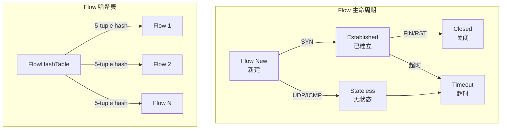

> [!info] Suricata 2026 深度探索系列 0. [[2026-04-15-suricata-deep-dive-series-index|全栈学习路径总览]]
>
> 1. [[2026-04-15-suricata-deep-dive-ch1-overview|第一章：Suricata 概述]]
> 2. [[2026-04-15-suricata-deep-dive-ch2-config|第二章：Suricata 配置系统]]
> 3. [[2026-04-15-suricata-deep-dive-ch3-runmodes|第三章：Runmodes 运行模式]]
> 4. [[2026-04-15-suricata-deep-dive-ch4-thread-model|第四章：线程模型]]
> 5. [[2026-04-15-suricata-deep-dive-ch5-capture|第五章：Capture 初始化]]
> 6. [[2026-04-15-suricata-deep-dive-ch6-af-packet|第六章：AF-PACKET 接口]]
> 7. [[2026-04-15-suricata-deep-dive-ch7-pcap|第七章：PCAP 接口]]
> 8. [[2026-04-15-suricata-deep-dive-ch8-nfq|第八章：NFQ 与 PF_RING 模式]]
> 9. [[2026-04-15-suricata-deep-dive-ch9-dpdk|第九章：DPDK 接口]]
> 10. [[2026-04-15-suricata-deep-dive-ch10-loadbalancing|第十章：多线程抓包与负载均衡]]
> 11. [[2026-04-15-suricata-deep-dive-ch11-detect-engine|第十一章：检测引擎架构]]
> 12. [[2026-04-15-suricata-deep-dive-ch12-signatures|第十二章：规则解析]]
> 13. [[2026-04-15-suricata-deep-dive-ch13-mpm|第十三章：多模式匹配]]
> 14. [[2026-04-15-suricata-deep-dive-ch14-filemagic|第十四章：文件识别]]
> 15. [[2026-04-15-suricata-deep-dive-ch15-lua-detect|第十五章：Lua 检测]]
> 16. [[2026-04-15-suricata-deep-dive-ch16-app-layer|第十六章：应用层协议解析]]
> 17. [[2026-04-15-suricata-deep-dive-ch17-http|第十七章：HTTP 协议解析]]
> 18. [[2026-04-15-suricata-deep-dive-ch18-dns|第十八章：DNS 协议解析]]
> 19. [[2026-04-15-suricata-deep-dive-ch19-tls|第十九章：TLS 协议解析]]
> 20. [[2026-04-15-suricata-deep-dive-ch20-smb|第二十章：SMB 协议解析]]
> 21. [[2026-04-15-suricata-deep-dive-ch21-http2|第二十一章：HTTP/2 协议解析]]
> 22. **第二十二章：Flow 管理**

---

## 1. Flow 引擎概述

Flow 是 Suricata 进行状态追踪的核心数据结构。每个 Flow 代表一个双向网络会话（TCP/UDP/ICMP），Suricata 通过 Flow 哈希表快速查找和复用 Flow 对象，实现高效的状态追踪和会话管理。



### 1.1 Flow vs Connection

| 特性         | Flow               | Connection (Snort) |
| :----------- | :----------------- | :----------------- |
| **语义**     | 单向或双向会话     | 双向连接           |
| **协议支持** | TCP/UDP/ICMP/SCTP  | TCP 为主           |
| **状态追踪** | 完整状态机         | 简化状态           |
| **内存管理** | Flow 池 + 引用计数 | 动态分配           |
| **超时机制** | 协议级别超时       | 固定超时           |

### 1.2 Flow 配置

```yaml
# suricata.yaml
flow:
  # Flow 哈希表大小
  hash_size: 65536

  # Flow 内存池大小
  memcap: 128mb

  # 预分配 Flow 数量
  prealloc: 10000

  # 每线程紧急储备
  emergency_recovery: 30

  # 淘汰时间（秒）
  prune_timeout: 5

  # 超时策略
  timeout:
    default: 30
    tcp: 300
    tcp_syn: 10
    tcp_established: 3600
    udp: 30
    icmp: 30
```

---

## 2. Flow 数据结构

### 2.1 Flow 主结构

```c
// src/flow.h — Flow 主结构
typedef struct Flow_ {
    /* 引用计数（原子操作） */
    uint16_t use_cnt;

    /* Flow ID（用于日志关联） */
    uint64_t flow_id;

    /* 5-tuple 键值 */
    Address src_ip;
    Address dst_ip;
    Port src_port;
    Port dst_port;
    uint8_t proto;           // IPPROTO_TCP/UDP/ICMP/SCTP
    uint8_t ipproto;         // 实际协议（可能封装在隧道中）

    /* VLAN ID */
    uint16_t vlan_id[2];

    /* 隧道信息 */
    uint8_t tunnel_ref:1;    // 隧道引用
    uint8_t tunnel_depth:3; // 隧道嵌套深度

    /* Flow 标志位 */
    uint16_t flags;

    /* 状态 */
    uint8_t state;           // TCP 状态机的简化版
    uint8_t old_state;        // 上一个状态

    /* AppLayer 协议 */
    AppProto alproto;         // 应用层协议（HTTP/DNS/TLS 等）
    AppProto alproto_ts;     // ToServer 方向协议
    AppProto alproto_tc;     // ToClient 方向协议

    /* 流方向标志 */
    uint8_t sum;

    /* 时间戳 */
    struct timeval ts;       // 最后包时间
    struct timeval startts;  // Flow 创建时间

    /* 字节计数 */
    uint64_t todstbytes;     // ToServer 字节数
    uint64_t tosrcbytes;     // ToClient 字节数
    uint64_t todstpktcnt;    // ToServer 包数
    uint64_t tosrcpktcnt;    // ToClient 包数

    /* TCP 序列号（可选，用于乱序包处理） */
    uint32_t clientTcpSeq;
    uint32_t serverTcpSeq;

    /* TCP 窗口（可选） */
    uint16_t client_window;
    uint16_t server_window;

    /* TCP 状态（完整 TCP 状态机） */
    TcpState tcp_state;

    /* Flow 锁（多线程访问保护） */
    SCMutex m;

    /* 关联的 TcpSession */
    TcpSession *tcp_ssn;

    /* AppLayer 状态 */
    void *alstate;           // 应用层状态
    AppLayerParserState *alparser;  // 应用层解析器状态

    /* Flow 管理 */
    struct Flow_ *next;      // 哈希表链表
    struct Flow_ *hprev;

    /* Flow Timeout 链表 */
    struct Flow_ *tnext;
    struct Flow_ *tprev;
    uint32_t timeout_at;

    /* 内存池 */
    struct Flow_ *flow_ptr;  // 指向原始池内存

    /* 配置标志 */
    uint16_t config_ip_only:1;
    uint16_t config_ignore_direction:2;

    /* 探测标志 */
    uint16_t proto_detect_detected:1;

    /* 统计 */
    FlowStats stats;

    /* 引用 */
    struct Flow_ *parent;     // 父 Flow（隧道情况）

    /* File 容器 */
    FileContainer *files_ts;  // ToServer 文件
    FileContainer *files_tc;  // ToClient 文件

    /* Flow 存储 */
    FlowStorage *flow_storage;

    /* ESNI 信息 */
    uint8_t *espi_key;
    uint8_t espi_key_len;

} Flow;
```

### 2.2 Flow 标志位

```c
// src/flow.h — Flow 标志位定义
#define FLOW_NOPAYLOAD_INSPECTION        0x0001  // 不检查 payload
#define FLOW_NOPCAP_INSPECTION           0x0002  // 不检查 PCAP
#define FLOW_NO_APPLAYER_INSPECTION       0x0004  // 不检查应用层
#define FLOW_NO_TLSAUNPAWN_INSPECTION    0x0008  // 不检查 TLS
#define FLOW_APP_LAYER_UPDATED           0x0010  // 应用层已更新
#define FLOW_NAT                         0x0020  // NAT 环境
#define FLOW_SYN_MET                      0x0040  // SYN 已看到
#define FLOW_SYN_ACK_MET                 0x0080  // SYN-ACK 已看到
#define FLOW_ACK_MET                     0x0100  // ACK 已看到
#define FLOW_CWR                         0x0200  // CWR 标志
#define FLOW_ECN                         0x0400  // ECN 启用
#define FLOW_TCP_FIN_SEEN                0x0800  // FIN 已看到
#define FLOW_TCP_RST_SEEN                0x1000  // RST 已看到
#define FLOW_DROP_REASON                 0x2000  // 丢弃原因
#define FLOW_TIMEOUT_REASSEMBLY          0x4000  // 超时重组
#define FLOW_APPPROTO_DETECTED           0x8000  // 应用层协议已检测

// Flow 方向标志
#define FLOW_DIR_ORIGINAL                0x01    // 原始方向 ToServer
#define FLOW_DIR_REVERSED                0x02    // 反向 ToClient
```

### 2.3 FlowHashTable 哈希表

```c
// src/flow.h — Flow 哈希表
typedef struct FlowHashTable_ {
    /* 哈希桶数组 */
    Flow **buckets;
    uint32_t hash_size;      // 桶数量（通常是 2^n）

    /* 链表头尾指针 */
    Flow *list_head;
    Flow *list_tail;

    /* 统计 */
    uint32_t flow_count;     // 当前 Flow 数量
    uint32_t max_flow_count; // 最大 Flow 数量

    /* 锁（分片锁） */
    STMtx *tbl_m;

} FlowHashTable;

// src/flow.h — Flow 桶锁（分片锁）
typedef struct FlowBucket_ {
    Flow *head;
    Flow *tail;
    STMtx m;                 // 桶级别锁
    uint32_t count;          // 桶内 Flow 数量

} FlowBucket;
```

---

## 3. Flow 哈希计算

### 3.1 5-tuple 哈希

```c
// src/flow.c — Flow 哈希计算
static inline uint32_t FlowGetHash(Flow *f)
{
    uint32_t hash;

    /* 地址和端口的组合哈希 */
    /* 使用混合哈希算法平衡速度和分布 */

    /* IPv6 地址哈希 */
    if (f->src_ip.family == AF_INET6) {
        hash = f->src_ip.addrData32[0] ^
               (f->src_ip.addrData32[1] << 8) ^
               (f->src_ip.addrData32[2] << 16) ^
               (f->src_ip.addrData32[3] << 24);

        hash ^= f->dst_ip.addrData32[0] ^
                (f->dst_ip.addrData32[1] << 8) ^
                (f->dst_ip.addrData32[2] << 16) ^
                (f->dst_ip.addrData32[3] << 24);
    } else {
        /* IPv4 地址哈希 */
        hash = f->src_ip.addrData32[0] ^ (f->dst_ip.addrData32[0] << 16);
    }

    /* 端口和协议哈希 */
    hash ^= f->src_port ^ (f->dst_port << 16) ^ (f->proto << 24);

    /* VLAN 哈希（如果存在） */
    if (f->vlan_id[0] != 0) {
        hash ^= f->vlan_id[0] << 16;
    }
    if (f->vlan_id[1] != 0) {
        hash ^= f->vlan_id[1] << 20;
    }

    /* 最终混合 */
    hash = hash ^ (hash >> 16);
    hash = hash * 0x85ebca6b;
    hash = hash ^ (hash >> 13);

    return hash % flow_config.hash_size;
}

// src/flow.c — Flow 哈希查找
static inline Flow *FlowHashLookup(FlowHashTable *ht, Flow *f, uint32_t hash)
{
    Flow *entry = ht->buckets[hash];

    /* 遍历链表 */
    while (entry != NULL) {
        /* 快速检查 */
        if (FlowCompare(entry, f) == 0) {
            /* 引用计数 +1 */
            (void)SC_ATOMIC_ADD(entry->use_cnt, 1);
            return entry;
        }
        entry = entry->hnext;
    }

    return NULL;
}

// src/flow.c — Flow 键值比较
static inline int FlowCompare(Flow *a, Flow *b)
{
    /* 比较 5-tuple + VLAN */

    if (a->proto != b->proto) return 1;
    if (a->src_port != b->src_port) return 1;
    if (a->dst_port != b->dst_port) return 1;

    if (a->src_ip.family != b->src_ip.family) return 1;

    if (a->src_ip.family == AF_INET) {
        if (a->src_ip.addrData32[0] != b->src_ip.addrData32[0]) return 1;
        if (a->dst_ip.addrData32[0] != b->dst_ip.addrData32[0]) return 1;
    } else if (a->src_ip.family == AF_INET6) {
        if (memcmp(a->src_ip.addrData8, b->src_ip.addrData8, 16) != 0) return 1;
        if (memcmp(a->dst_ip.addrData8, b->dst_ip.addrData8, 16) != 0) return 1;
    }

    if (a->vlan_id[0] != b->vlan_id[0]) return 1;
    if (a->vlan_id[1] != b->vlan_id[1]) return 1;

    return 0;
}
```

### 3.2 Flow 查找流程

```c
// src/flow.c — Flow 查找主函数
Flow *FlowGetFromHash(Flow *f)
{
    uint32_t hash;
    Flow *entry;

    /* 计算哈希 */
    hash = FlowGetHash(f);

    /* 获取桶锁 */
    FlowBucket *b = &flow_hash.buckets[hash];
    STMtxLock(&b->m);

    /* 哈希查找 */
    entry = FlowHashLookup(&flow_hash, f, hash);
    if (entry != NULL) {
        STMtxUnlock(&b->m);
        return entry;
    }

    /* 分配新 Flow */
    entry = FlowAlloc();
    if (entry == NULL) {
        /* 内存不足，尝试淘汰 */
        FlowPruneHash();
        entry = FlowAlloc();
        if (entry == NULL) {
            STMtxUnlock(&b->m);
            return NULL;
        }
    }

    /* 初始化 Flow */
    FlowInit(entry, f);

    /* 加入哈希表 */
    FlowAddToHash(entry, hash);

    STMtxUnlock(&b->m);

    return entry;
}

// src/flow.c — Flow 加入哈希表
static inline void FlowAddToHash(Flow *f, uint32_t hash)
{
    FlowBucket *b = &flow_hash.buckets[hash];

    /* 链表头插入 */
    f->hnext = b->head;
    f->hprev = NULL;

    if (b->head != NULL) {
        b->head->hprev = f;
    }
    b->head = f;

    if (b->tail == NULL) {
        b->tail = f;
    }

    b->count++;
    flow_config.flow_count++;
}
```

---

## 4. Flow 生命周期

### 4.1 Flow 创建

```c
// src/flow.c — Flow 内存分配
Flow *FlowAlloc(void)
{
    Flow *f;

    /* 从内存池分配 */
    f = (Flow *)SCCalloc(1, sizeof(Flow));
    if (f == NULL) {
        /* 尝试紧急清理 */
        FlowCutMemcap(sizeof(Flow));
        f = (Flow *)SCCalloc(1, sizeof(Flow));
        if (f == NULL) {
            return NULL;
        }
    }

    /* 初始化锁 */
    SCMutexInit(&f->m, NULL);

    /* 初始化引用计数 */
    SC_ATOMIC_INIT(f->use_cnt);
    SC_ATOMIC_ADD(f->use_cnt, 1);

    /* 生成 Flow ID */
    f->flow_id = GenerateFlowId();

    return f;
}

// src/flow.c — Flow 初始化
static inline void FlowInit(Flow *f, Flow *src)
{
    /* 复制 5-tuple */
    f->src_ip = src->src_ip;
    f->dst_ip = src->dst_ip;
    f->src_port = src->src_port;
    f->dst_port = src->dst_port;
    f->proto = src->proto;
    f->ipproto = src->ipproto;

    /* VLAN */
    f->vlan_id[0] = src->vlan_id[0];
    f->vlan_id[1] = src->vlan_id[1];

    /* 时间戳 */
    f->startts = src->ts;
    f->ts = src->ts;

    /* 初始状态 */
    f->state = TCP_STATE_NONE;
    f->old_state = TCP_STATE_NONE;

    /* 协议未检测 */
    f->alproto = ALPROTO_UNKNOWN;
    f->alproto_ts = ALPROTO_UNKNOWN;
    f->alproto_tc = ALPROTO_UNKNOWN;

    /* 初始化计数器 */
    f->todstbytes = 0;
    f->tosrcbytes = 0;
    f->todstpktcnt = 0;
    f->tosrcpktcnt = 0;

    /* 清空链表指针 */
    f->next = f->hprev = NULL;
    f->tnext = f->tprev = NULL;
}
```

### 4.2 Flow 引用计数

```c
// src/flow.c — Flow 引用操作
static inline void FlowAddReference(Flow *f)
{
    (void)SC_ATOMIC_ADD(f->use_cnt, 1);
}

static inline uint16_t FlowGetReferenceCount(Flow *f)
{
    return SC_ATOMIC_LOAD(f->use_cnt);
}

static inline int FlowDecReference(Flow *f)
{
    uint16_t cnt = SC_ATOMIC_SUB(f->use_cnt, 1);

    if (cnt == 0) {
        /* 可以释放 */
        FlowFree(f);
        return 1;
    }
    return 0;
}

// src/flow.c — Flow 释放
void FlowFree(Flow *f)
{
    /* 清理 AppLayer 状态 */
    if (f->alstate != NULL) {
        AppLayerParserStateFree(f->alstate);
        f->alstate = NULL;
    }

    /* 清理 TCP 会话 */
    if (f->tcp_ssn != NULL) {
        TcpSessionFree(f->tcp_ssn);
        f->tcp_ssn = NULL;
    }

    /* 清理文件容器 */
    if (f->files_ts != NULL) {
        AppLayerDecoderEventsFreeEvents(&f->files_ts->head);
        f->files_ts = NULL;
    }
    if (f->files_tc != NULL) {
        AppLayerDecoderEventsFreeEvents(&f->files_tc->head);
        f->files_tc = NULL;
    }

    /* 清理 Flow 存储 */
    if (f->flow_storage != NULL) {
        FlowStorageFree(f->flow_storage);
        f->flow_storage = NULL;
    }

    /* 销毁锁 */
    SCMutexDestroy(&f->m);

    /* 释放回内存池 */
    SCFree(f);
}
```

### 4.3 Flow 淘汰策略

```c
// src/flow.c — Flow 淘汰（当 memcap 不足时）
void FlowCutMemcap(uint32_t size)
{
    Flow *f;

    /* 获取最老的 Flow */
    f = flow_hash.list_tail;

    while (f != NULL && SC_ATOMIC_LOAD(flow_config.memcap) > flow_config.memcap) {
        Flow *prev = f->hprev;

        /* 检查是否可以淘汰 */
        if (SC_ATOMIC_LOAD(f->use_cnt) == 0) {
            /* 从哈希表移除 */
            FlowRemoveFromHash(f);

            /* 释放 */
            FlowFree(f);

            flow_config.flow_count--;
            SC_ATOMIC_SUB(flow_config.memcap, sizeof(Flow));
        }

        f = prev;
    }
}

// src/flow.c — Flow 超时淘汰
void FlowPruneHash(void)
{
    struct timeval ts;
    gettimeofday(&ts, NULL);

    Flow *f = flow_hash.list_tail;

    while (f != NULL) {
        Flow *prev = f->hprev;

        /* 检查超时 */
        if (FlowIsTimedOut(f, &ts)) {
            /* 从哈希表移除 */
            FlowRemoveFromHash(f);

            /* 如果引用计数为 0，释放 */
            if (SC_ATOMIC_LOAD(f->use_cnt) == 0) {
                FlowFree(f);
                flow_config.flow_count--;
            } else {
                /* 标记为待释放 */
                f->flow_ptr = NULL;
            }
        }

        f = prev;
    }
}
```

---

## 5. Flow 配置解析

### 5.1 flow 配置加载

```c
// src/flow.c — Flow 配置初始化
int FlowInitConfig(char quiet)
{
    /* 加载 yaml 配置 */
    const char *conf_val;

    /* hash_size */
    if (SCConfGetInt("flow.hash_size", &conf_val) == 1) {
        flow_config.hash_size = atoi(conf_val);
    } else {
        flow_config.hash_size = 65536;
    }

    /* memcap */
    if (SCConfGet("flow.memcap", &conf_val) == 1) {
        flow_config.memcap = SCMemcapValue(conf_val);
    } else {
        flow_config.memcap = 128 * 1024 * 1024;  // 128MB
    }

    /* prealloc */
    if (SCConfGetInt("flow.prealloc", &conf_val) == 1) {
        flow_config.prealloc = atoi(conf_val);
    } else {
        flow_config.prealloc = 10000;
    }

    /* emergency_recovery */
    if (SCConfGetInt("flow.emergency_recovery", &conf_val) == 1) {
        flow_config.emergency_recovery = atoi(conf_val);
    } else {
        flow_config.emergency_recovery = 30;
    }

    /* prune_timeout */
    if (SCConfGetInt("flow.prune_timeout", &conf_val) == 1) {
        flow_config.prune_timeout = atoi(conf_val);
    } else {
        flow_config.prune_timeout = 5;
    }

    /* 初始化哈希表 */
    FlowHashInit(flow_config.hash_size);

    /* 预分配 Flow */
    FlowPrealloc(flow_config.prealloc);

    /* 初始化超时队列 */
    FlowTimeoutInit();

    return 0;
}
```

---

## 6. 多线程 Flow 管理

### 6.1 线程局部 Flow

```c
// src/flow-worker.h — Flow Worker 线程数据
typedef struct FlowWorker_ {
    /* 线程本地 Flow 缓存 */
    Flow *flow;

    /* AppLayer 解析器 */
    AppLayerParserThreads *alp_t;

    /* 本地计数器 */
    uint64_t counter_flows_checked;
    uint64_t counter_flows_not_inspected;
    uint64_t counter_flows_timeout;

} FlowWorker;

// src/flow-worker.c — 获取 Flow
Flow *FlowWorkerGetFlow(FlowWorker *fw, Packet *p)
{
    Flow *f = p->flow;

    /* 快速路径：检查是否是当前缓存的 Flow */
    if (fw->flow != NULL && fw->flow == f) {
        return f;
    }

    /* 慢速路径：查找或创建 Flow */
    if (f == NULL) {
        /* 从哈希表查找 */
        f = FlowGetFromHash(&p->flow_hash);
        if (f == NULL) {
            return NULL;
        }

        /* 设置包的 Flow 指针 */
        p->flow = f;
    }

    /* 更新缓存 */
    fw->flow = f;

    return f;
}
```

### 6.2 Flow 锁策略

```c
// src/flow.h — Flow 锁操作
#define FLOWLOCK_WRLOCK(f)   SCMutexLock(&(f)->m)
#define FLOWLOCK_RDLOCK(f)    SCMutexLock(&(f)->m)
#define FLOWLOCK_UNLOCK(f)    SCMutexUnlock(&(f)->m)

// src/flow.c — 多线程安全更新
int FlowUpdate(Flow *f, Packet *p)
{
    /* 获取写锁 */
    FLOWLOCK_WRLOCK(f);

    /* 更新时间戳 */
    f->ts = p->ts;

    /* 更新字节计数 */
    if (p->flowflags & FLOW_PKT_TOSERVER) {
        f->todstbytes += p->payload_len;
        f->todstpktcnt++;
    } else {
        f->tosrcbytes += p->payload_len;
        f->tosrcpktcnt++;
    }

    /* 更新 TCP 序列号 */
    if (p->proto == IPPROTO_TCP) {
        if (p->flowflags & FLOW_PKT_TOSERVER) {
            f->clientTcpSeq = TCP_GET_SEQ(p);
            f->client_window = TCP_GET_WINDOW(p);
        } else {
            f->serverTcpSeq = TCP_GET_SEQ(p);
            f->server_window = TCP_GET_WINDOW(p);
        }
    }

    FLOWLOCK_UNLOCK(f);

    return 0;
}
```

---

## 7. Flow 统计

### 7.1 Flow 计数器

```c
// src/flow.c — Flow 统计结构
typedef struct FlowStats_ {
    uint64_t toxic;           // 污染 Flow 数
    uint64_t timeout;         // 超时 Flow 数
    uint64_t est_timeout;     //  establishment 超时
    uint64_t clf;             // 关闭 Flow 数
    uint64_t new;             // 新建 Flow 数
    uint64_t reuse;           // 复用 Flow 数
    uint64_t internal;        // 内部原因跳过
    uint64_t not_handled;     // 未处理
} FlowStats;

// src/flow.c — 获取 Flow 统计
void FlowGetStats(FlowStats *fstats)
{
    memset(fstats, 0, sizeof(FlowStats));

    fstats->new = SC_ATOMIC_LOAD(flow_config.flow_stats.new);
    fstats->reuse = SC_ATOMIC_LOAD(flow_config.flow_stats.reuse);
    fstats->timeout = SC_ATOMIC_LOAD(flow_config.flow_stats.timeout);
    fstats->est_timeout = SC_ATOMIC_LOAD(flow_config.flow_stats.est_timeout);
    fstats->clf = SC_ATOMIC_LOAD(flow_config.flow_stats.clf);
}
```

---

## 8. 总结

Flow 管理是 Suricata 状态追踪的核心：

1. **Flow 哈希表**：通过 5-tuple（src_ip, dst_ip, src_port, dst_port, proto）计算哈希，实现 O(1) 查找
2. **Flow 生命周期**：创建 → 使用（引用计数） → 超时淘汰 → 释放
3. **Flow 内存管理**：通过 memcap 限制内存使用，超限时触发淘汰策略
4. **多线程安全**：通过桶级别锁和 Flow 锁实现并发访问控制
5. **协议无关设计**：Flow 结构支持 TCP/UDP/ICMP/SCTP 等多种协议

理解 Flow 管理对于调优 Suricata 性能至关重要，合理配置 `flow.hash_size`、`flow.memcap` 和 `flow.prealloc` 可以显著提升高吞吐量场景下的处理能力。
