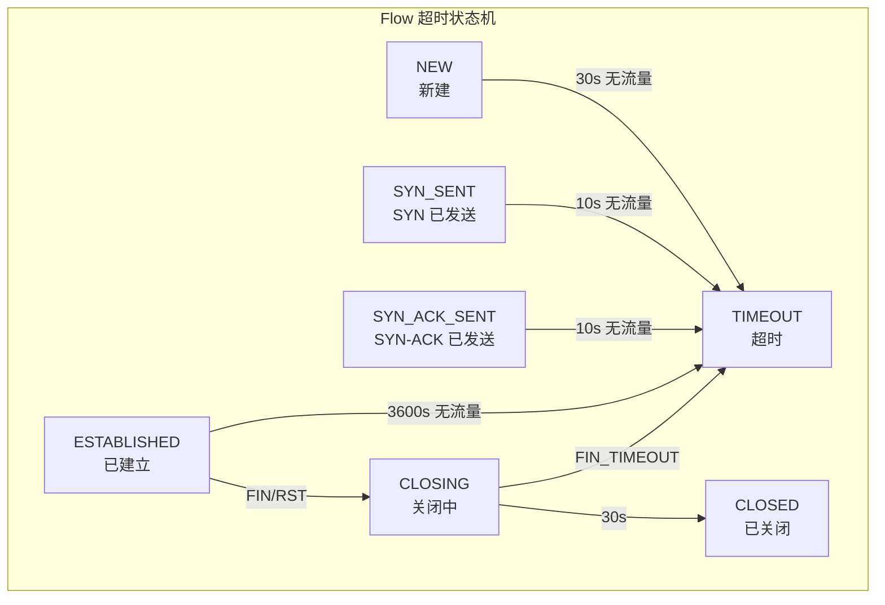

> [!info] Suricata 2026 深度探索系列
> 0. [[2026-04-15-suricata-deep-dive-series-index|全栈学习路径总览]]
> 1. [[2026-04-15-suricata-deep-dive-ch1-overview|第一章：Suricata 概述]]
> 2. [[2026-04-15-suricata-deep-dive-ch2-config|第二章：Suricata 配置系统]]
> 3. [[2026-04-15-suricata-deep-dive-ch3-runmodes|第三章：Runmodes 运行模式]]
> 4. [[2026-04-15-suricata-deep-dive-ch4-thread-model|第四章：线程模型]]
> 5. [[2026-04-15-suricata-deep-dive-ch5-capture|第五章：Capture 初始化]]
> 6. [[2026-04-15-suricata-deep-dive-ch6-af-packet|第六章：AF-PACKET 接口]]
> 7. [[2026-04-15-suricata-deep-dive-ch7-pcap|第七章：PCAP 接口]]
> 8. [[2026-04-15-suricata-deep-dive-ch8-nfq|第八章：NFQ 与 PF_RING 模式]]
> 9. [[2026-04-15-suricata-deep-dive-ch9-dpdk|第九章：DPDK 接口]]
> 10. [[2026-04-15-suricata-deep-dive-ch10-loadbalancing|第十章：多线程抓包与负载均衡]]
> 11. [[2026-04-15-suricata-deep-dive-ch11-detect-engine|第十一章：检测引擎架构]]
> 12. [[2026-04-15-suricata-deep-dive-ch12-signatures|第十二章：规则解析]]
> 13. [[2026-04-15-suricata-deep-dive-ch13-mpm|第十三章：多模式匹配]]
> 14. [[2026-04-15-suricata-deep-dive-ch14-filemagic|第十四章：文件识别]]
> 15. [[2026-04-15-suricata-deep-dive-ch15-lua-detect|第十五章：Lua 检测]]
> 16. [[2026-04-15-suricata-deep-dive-ch16-app-layer|第十六章：应用层协议解析]]
> 17. [[2026-04-15-suricata-deep-dive-ch17-http|第十七章：HTTP 协议解析]]
> 18. [[2026-04-15-suricata-deep-dive-ch18-dns|第十八章：DNS 协议解析]]
> 19. [[2026-04-15-suricata-deep-dive-ch19-tls|第十九章：TLS 协议解析]]
> 20. [[2026-04-15-suricata-deep-dive-ch20-smb|第二十章：SMB 协议解析]]
> 21. [[2026-04-15-suricata-deep-dive-ch21-http2|第二十一章：HTTP/2 协议解析]]
> 22. [[2026-04-15-suricata-deep-dive-ch22-flow|第二十二章：Flow 管理]]
> 23. **第二十三章：Flow 超时**

---

## 1. Flow 超时概述

Flow 超时机制是 Suricata 资源管理的重要组成部分。每个 Flow 在创建时会被分配一个超时时间，当 Flow 在规定时间内没有流量活动时，系统会自动清理该 Flow，释放内存资源。



### 1.1 超时配置

```yaml
# suricata.yaml
flow:
  timeout:
    # 默认超时（所有协议）
    default: 30
    
    # TCP 分阶段超时
    tcp: 300           # TCP 通用超时
    tcp_syn: 10         # SYN 已发送，等待 SYN-ACK
    tcp_syn_ack: 10     # SYN-ACK 已发送，等待 ACK
    tcp_established: 3600  # TCP 已建立连接
    tcp_fin_wait: 30    # FIN_WAIT 状态
    tcp_close_wait: 30  # CLOSE_WAIT 状态
    tcp_last_ack: 30    # LAST_ACK 状态
    
    # UDP 超时
    udp: 30
    
    # ICMP 超时
    icmp: 30
    
    # SCTP 超时
    sctp: 30
```

### 1.2 超时 vs Snort

| 超时策略 | Suricata | Snort |
|:---|:---|:---|
| **TCP 状态机** | 完整状态跟踪 | 简化 |
| **超时粒度** | 协议 + 状态级别 | 固定值 |
| **应用层超时** | AppLayer 独立超时 | 无 |
| **自适应超时** | 支持 | 无 |

---

## 2. 超时数据结构

### 2.1 超时配置结构

```c
// src/flow.h — Flow 超时配置
typedef struct FlowTimeoutCounters_ {
    uint32_t tcp;
    uint32_t udp;
    uint32_t icmp;
    uint32_t sctp;
    uint32_t esp;
    uint32_t gre;
    uint32_t ipv4_len;
    uint32_t ipv6_opt;
    uint32_t esp;
    uint32_t user_timeout;
    uint32_t default_timeout;
    
} FlowTimeoutCounters;

// src/flow-timeout.h — Flow 超时上下文
typedef struct FlowTimeoutContext_ {
    /* 超时链表（按超时时间排序） */
    Flow *list_head;
    Flow *list_tail;
    
    /* 当前时间 */
    struct timeval current_time;
    
    /* 超时计数 */
    FlowTimeoutCounters timeouts;
    
    /* 淘汰计数 */
    FlowTimeoutCounters prune_count;
    
    /* 锁 */
    STMtx m;
    
} FlowTimeoutContext;
```

### 2.2 TCP 状态定义

```c
// src/flow.h — TCP 状态
#define TCP_STATE_NONE          0  // 初始状态
#define TCP_STATE_SYN_SENT      1  // SYN 已发送
#define TCP_STATE_SYN_RECV      2  // SYN 已接收
#define TCP_STATE_ESTABLISHED   3  // 已建立
#define TCP_STATE_SYN_SENT_ACK  4  // SYN-ACK 已发送
#define TCP_STATE_FIN_WAIT      5  // FIN_WAIT
#define TCP_STATE_CLOSE_WAIT    6  // CLOSE_WAIT
#define TCP_STATE_LAST_ACK      7  // LAST_ACK
#define TCP_STATE_TIME_WAIT     8  // TIME_WAIT
#define TCP_STATE_CLOSED        9  // 已关闭
#define TCP_STATE_CLOSE         10 // 正在关闭

// src/flow.h — Flow 超时值数组索引
#define FLOW_PROTO_TCP          0
#define FLOW_PROTO_UDP          1
#define FLOW_PROTO_ICMP         2
#define FLOW_PROTO_SCTP         3
#define FLOW_PROTO_ESP          4
#define FLOW_PROTO_GRE          5
#define FLOW_PROTO_IPV4         6
#define FLOW_PROTO_IPV6         7
#define FLOW_PROTO_USER         8
#define FLOW_PROTO_DEFAULT      9
```

---

## 3. 超时时间计算

### 3.1 超时值计算

```c
// src/flow-timeout.c — 计算 Flow 超时时间
static inline uint32_t FlowGetTimeout(Flow *f)
{
    /* 根据协议和状态计算超时时间 */
    
    switch (f->proto) {
        case IPPROTO_TCP:
            return FlowGetTcpTimeout(f);
        case IPPROTO_UDP:
            return flow_timeouts[FLOW_PROTO_UDP];
        case IPPROTO_ICMP:
            return flow_timeouts[FLOW_PROTO_ICMP];
        case IPPROTO_SCTP:
            return flow_timeouts[FLOW_PROTO_SCTP];
        case IPPROTO_ESP:
            return flow_timeouts[FLOW_PROTO_ESP];
        case IPPROTO_GRE:
            return flow_timeouts[FLOW_PROTO_GRE];
        default:
            return flow_timeouts[FLOW_PROTO_DEFAULT];
    }
}

// src/flow-timeout.c — TCP 分状态超时
static inline uint32_t FlowGetTcpTimeout(Flow *f)
{
    switch (f->tcp_state) {
        case TCP_STATE_SYN_SENT:
            return flow_timeouts[FLOW_TCP_SYN];
            
        case TCP_STATE_SYN_RECV:
            return flow_timeouts[FLOW_TCP_SYN_ACK];
            
        case TCP_STATE_ESTABLISHED:
            /* 检查是否有一段时间无活动 */
            if (f->lastts != 0) {
                uint32_t idle = (current_time - f->lastts);
                if (idle > flow_timeouts[FLOW_TCP_ESTABLISHED_IDLE]) {
                    return flow_timeouts[FLOW_TCP_ESTABLISHED_IDLE];
                }
            }
            return flow_timeouts[FLOW_TCP_ESTABLISHED];
            
        case TCP_STATE_FIN_WAIT:
            return flow_timeouts[FLOW_TCP_FIN_WAIT];
            
        case TCP_STATE_CLOSE_WAIT:
            return flow_timeouts[FLOW_TCP_CLOSE_WAIT];
            
        case TCP_STATE_LAST_ACK:
            return flow_timeouts[FLOW_TCP_LAST_ACK];
            
        case TCP_STATE_TIME_WAIT:
            return flow_timeouts[FLOW_TCP_TIME_WAIT];
            
        case TCP_STATE_CLOSED:
            return flow_timeouts[FLOW_TCP_CLOSED];
            
        default:
            return flow_timeouts[FLOW_TCP_GENERAL];
    }
}

// src/flow-timeout.c — Flow 超时检查
static inline int FlowIsTimedOut(Flow *f, struct timeval *ts)
{
    uint32_t timeout = FlowGetTimeout(f);
    
    /* 计算自最后活动以来的时间 */
    uint32_t elapsed = (ts->tv_sec - f->ts.tv_sec);
    
    return (elapsed >= timeout);
}
```

### 3.2 超时队列

```c
// src/flow-timeout.c — 超时队列节点
typedef struct FlowTimeoutNode_ {
    Flow *flow;
    uint32_t expire_at;      // 超时时间戳
    struct FlowTimeoutNode_ *next;
    struct FlowTimeoutNode_ *prev;
    
} FlowTimeoutNode;

// src/flow-timeout.c — 插入超时队列
static inline void FlowTimeoutInsert(FlowTimeoutContext *ctx, Flow *f)
{
    uint32_t expire_at = f->ts.tv_sec + FlowGetTimeout(f);
    f->timeout_at = expire_at;
    
    /* 链表按 expire_at 排序 */
    Flow *prev = NULL;
    Flow *curr = ctx->list_head;
    
    while (curr != NULL && curr->timeout_at < expire_at) {
        prev = curr;
        curr = curr->tnext;
    }
    
    /* 插入节点 */
    f->tnext = curr;
    f->tprev = prev;
    
    if (prev != NULL) {
        prev->tnext = f;
    } else {
        ctx->list_head = f;
    }
    
    if (curr != NULL) {
        curr->tprev = f;
    } else {
        ctx->list_tail = f;
    }
}
```

---

## 4. 超时处理流程

### 4.1 超时淘汰主循环

```c
// src/flow-timeout.c — Flow 超时处理
int FlowHandleTimeout(FlowTimeoutContext *ctx)
{
    struct timeval ts;
    gettimeofday(&ts, NULL);
    ctx->current_time = ts;
    
    Flow *f = ctx->list_head;
    uint32_t now = ts.tv_sec;
    
    while (f != NULL) {
        Flow *next = f->tnext;
        
        /* 检查是否超时 */
        if (f->timeout_at <= now) {
            /* 从超时队列移除 */
            if (f->tprev != NULL) {
                f->tprev->tnext = f->tnext;
            } else {
                ctx->list_head = f->tnext;
            }
            
            if (f->tnext != NULL) {
                f->tnext->tprev = f->tprev;
            } else {
                ctx->list_tail = f->tprev;
            }
            
            /* 记录统计 */
            ctx->timeouts.default_timeout++;
            
            /* 处理超时 Flow */
            FlowTimeout(f, ctx);
            
        } else {
            /* 链表已排序，后续都不会超时 */
            break;
        }
        
        f = next;
    }
    
    return 0;
}

// src/flow-timeout.c — 单个 Flow 超时处理
static int FlowTimeout(Flow *f, FlowTimeoutContext *ctx)
{
    /* 获取 Flow 锁 */
    FLOWLOCK_WRLOCK(f);
    
    /* 再次检查（可能已被其他线程处理） */
    if (SC_ATOMIC_LOAD(f->use_cnt) == 0) {
        /* 可以直接释放 */
        FlowRemoveFromHash(f);
        FlowFree(f);
        ctx->prune_count.default_timeout++;
    } else {
        /* 标记为超时状态 */
        f->flow_end_flags |= FLOW_END_FLAG_TIMEOUT;
        
        /* 如果是 TCP，尝试完成关闭 */
        if (f->proto == IPPROTO_TCP) {
            FlowTcpClose(f);
        }
        
        /* 如果引用计数为 0，释放 */
        if (SC_ATOMIC_LOAD(f->use_cnt) == 0) {
            FlowRemoveFromHash(f);
            FlowFree(f);
            ctx->prune_count.default_timeout++;
        }
    }
    
    FLOWLOCK_UNLOCK(f);
    
    return 0;
}
```

### 4.2 TCP 状态超时

```c
// src/flow-timeout.c — TCP 状态超时处理
static int FlowTcpTimeout(Flow *f, FlowTimeoutContext *ctx)
{
    switch (f->tcp_state) {
        case TCP_STATE_SYN_SENT:
            /* SYN 未收到响应 */
            ctx->timeouts.tcp_syn++;
            break;
            
        case TCP_STATE_SYN_RECV:
            /* 三次握手未完成 */
            ctx->timeouts.tcp_syn_ack++;
            break;
            
        case TCP_STATE_ESTABLISHED:
            /* 连接空闲超时 */
            ctx->timeouts.tcp_established++;
            break;
            
        case TCP_STATE_FIN_WAIT:
            /* 对方未响应 FIN */
            ctx->timeouts.tcp_fin_wait++;
            break;
            
        case TCP_STATE_CLOSE_WAIT:
            /* 本地未发送 FIN */
            ctx->timeouts.tcp_close_wait++;
            break;
            
        case TCP_STATE_LAST_ACK:
            /* 最后 ACK 未确认 */
            ctx->timeouts.tcp_last_ack++;
            break;
            
        default:
            break;
    }
    
    return FlowTimeout(f, ctx);
}
```

---

## 5. 应用层超时

### 5.1 AppLayer 超时

```c
// src/app-layer.h — AppLayer 超时配置
typedef struct AppLayerTimeouts_ {
    uint32_t tcp;
    uint32_t udp;
    uint32_t icmp;
    
    /* 协议特定超时 */
    uint32_t http_timeout;
    uint32_t dns_timeout;
    uint32_t smb_timeout;
    uint32_t ssh_timeout;
    uint32_t tls_timeout;
    
} AppLayerTimeouts;

// src/app-layer-parser.h — AppLayer 注册超时回调
typedef int (*AppLayerRegisterTimeoutFunc)(
    void *alstate,
    struct timeval *ts,
    uint32_t timeout,
    void *userdata
);

typedef struct AppLayerParserState_ {
    /* 协议状态 */
    uint8_t state;
    
    /* 探测状态 */
    uint8_t探测:1;
    uint8_t相:1;
    uint8_t complete:1;
    
    /* 事务计数 */
    uint64_t tx_cnt;
    
    /* 当前 TX ID */
    uint64_t curr_tx_id;
    
    /* 超时回调 */
    AppLayerRegisterTimeoutFunc timeout_func;
    void *timeout_userdata;
    
    /* 日志回调 */
    AppLayerRegisterTxLogFunc log_func;
    void *log_userdata;
    
} AppLayerParserState;
```

### 5.2 DNS 超时示例

```c
// src/app-layer-dns.c — DNS 状态超时
static int DNSTimeout(Flow *f, struct timeval *ts)
{
    DNSState *dns_state = (DNSState *)f->alstate;
    if (dns_state == NULL) {
        return 0;
    }
    
    /* DNS 请求超时（通常是 5-10 秒） */
    DNSTransaction *tx = dns_state->pending_first;
    
    while (tx != NULL) {
        DNSTransaction *next = tx->next;
        
        uint32_t elapsed = ts->tv_sec - tx->ts.tv_sec;
        
        if (elapsed > DNS_REQUEST_TIMEOUT) {
            /* DNS 请求超时 */
            dns_state->stats.timeouts++;
            
            /* 清理事务 */
            DNSTransactionFree(tx);
        }
        
        tx = next;
    }
    
    return 0;
}
```

---

## 6. 超时配置解析

### 6.1 超时配置加载

```c
// src/flow-timeout.c — 超时配置初始化
int FlowTimeoutInit(void)
{
    const char *conf_val;
    
    /* 加载各协议超时配置 */
    
    /* TCP 超时 */
    if (SCConfGetInt("flow.timeout.tcp", &conf_val) == 1) {
        flow_timeouts[FLOW_TCP_GENERAL] = atoi(conf_val);
    } else {
        flow_timeouts[FLOW_TCP_GENERAL] = 300;
    }
    
    if (SCConfGetInt("flow.timeout.tcp_syn", &conf_val) == 1) {
        flow_timeouts[FLOW_TCP_SYN] = atoi(conf_val);
    } else {
        flow_timeouts[FLOW_TCP_SYN] = 10;
    }
    
    if (SCConfGetInt("flow.timeout.tcp_syn_ack", &conf_val) == 1) {
        flow_timeouts[FLOW_TCP_SYN_ACK] = atoi(conf_val);
    } else {
        flow_timeouts[FLOW_TCP_SYN_ACK] = 10;
    }
    
    if (SCConfGetInt("flow.timeout.tcp_established", &conf_val) == 1) {
        flow_timeouts[FLOW_TCP_ESTABLISHED] = atoi(conf_val);
    } else {
        flow_timeouts[FLOW_TCP_ESTABLISHED] = 3600;
    }
    
    if (SCConfGetInt("flow.timeout.tcp_fin_wait", &conf_val) == 1) {
        flow_timeouts[FLOW_TCP_FIN_WAIT] = atoi(conf_val);
    } else {
        flow_timeouts[FLOW_TCP_FIN_WAIT] = 30;
    }
    
    /* UDP 超时 */
    if (SCConfGetInt("flow.timeout.udp", &conf_val) == 1) {
        flow_timeouts[FLOW_PROTO_UDP] = atoi(conf_val);
    } else {
        flow_timeouts[FLOW_PROTO_UDP] = 30;
    }
    
    /* ICMP 超时 */
    if (SCConfGetInt("flow.timeout.icmp", &conf_val) == 1) {
        flow_timeouts[FLOW_PROTO_ICMP] = atoi(conf_val);
    } else {
        flow_timeouts[FLOW_PROTO_ICMP] = 30;
    }
    
    /* 默认超时 */
    if (SCConfGetInt("flow.timeout.default", &conf_val) == 1) {
        flow_timeouts[FLOW_PROTO_DEFAULT] = atoi(conf_val);
    } else {
        flow_timeouts[FLOW_PROTO_DEFAULT] = 30;
    }
    
    return 0;
}
```

---

## 7. 主动超时淘汰

### 7.1 内存压力淘汰

```c
// src/flow-timeout.c — 内存压力淘汰
void FlowPruneForHash(void)
{
    struct timeval ts;
    gettimeofday(&ts, NULL);
    
    Flow *f = flow_hash.list_tail;
    
    while (f != NULL && SC_ATOMIC_LOAD(flow_config.memcap) > flow_config.memcap) {
        Flow *prev = f->hprev;
        
        /* 优先淘汰超时 Flow */
        if (FlowIsTimedOut(f, &ts)) {
            FlowRemoveFromHash(f);
            
            if (SC_ATOMIC_LOAD(f->use_cnt) == 0) {
                FlowFree(f);
                flow_config.flow_count--;
                SC_ATOMIC_SUB(flow_config.memcap, sizeof(Flow));
            }
        }
        
        f = prev;
    }
}

// src/flow-timeout.c — 紧急模式淘汰
void FlowPruneEmergency(void)
{
    struct timeval ts;
    gettimeofday(&ts, NULL);
    
    /* 紧急模式下，使用更短的超时时间 */
    uint32_t emergency_timeout = flow_config.prune_timeout;
    
    Flow *f = flow_hash.list_head;  // 最老的先淘汰
    Flow *prev = NULL;
    
    while (f != NULL) {
        Flow *next = f->hnext;
        
        uint32_t elapsed = ts.tv_sec - f->ts.tv_sec;
        
        if (elapsed >= emergency_timeout) {
            /* 从哈希表移除 */
            if (f->hprev != NULL) {
                f->hprev->hnext = f->hnext;
            } else {
                flow_hash.buckets[FlowGetHash(f)] = f->hnext;
            }
            
            if (f->hnext != NULL) {
                f->hnext->hprev = f->hprev;
            }
            
            /* 释放 */
            if (SC_ATOMIC_LOAD(f->use_cnt) == 0) {
                FlowFree(f);
                flow_config.flow_count--;
            }
        }
        
        prev = f;
        f = next;
    }
}
```

---

## 8. 总结

Flow 超时机制的核心要点：

1. **协议分级超时**：TCP/UDP/ICMP 等不同协议有不同的超时策略
2. **TCP 状态机超时**：TCP 连接根据不同状态（SYN_SENT/ESTABLISHED/FIN_WAIT 等）设置不同超时
3. **超时链表**：Suricata 使用按超时时间排序的链表高效管理超时 Flow
4. **内存压力淘汰**：当内存不足时，主动淘汰超时 Flow
5. **AppLayer 超时**：应用层协议（如 DNS）可以注册自己的超时处理

合理配置超时参数对系统性能和资源利用至关重要：高吞吐量环境可能需要更长的 TCP_ESTABLISHED 超时，而安全敏感环境可能需要更短的超时以快速清理可疑会话。
