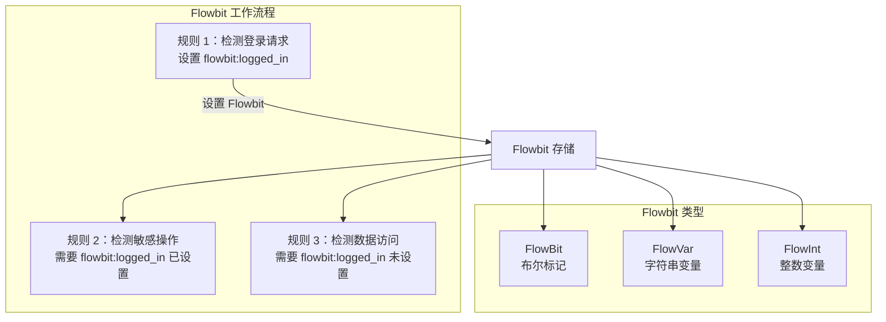

> [!info] Suricata 2026 深度探索系列
> 0. [[2026-04-15-suricata-deep-dive-series-index|全栈学习路径总览]]
> 1. [[2026-04-15-suricata-deep-dive-ch1-overview|第一章：Suricata 概述]]
> 2. [[2026-04-15-suricata-deep-dive-ch2-config|第二章：Suricata 配置系统]]
> 3. [[2026-04-15-suricata-deep-dive-ch3-runmodes|第三章：Runmodes 运行模式]]
> 4. [[2026-04-15-suricata-deep-dive-ch4-thread-model|第四章：线程模型]]
> 5. [[2026-04-15-suricata-deep-dive-ch5-capture|第五章：Capture 初始化]]
> 6. [[2026-04-15-suricata-deep-dive-ch6-af-packet|第六章：AF-PACKET 接口]]
> 7. [[2026-04-15-suricata-deep-dive-ch7-pcap|第七章：PCAP 接口]]
> 8. [[2026-04-15-suricata-deep-dive-ch8-nfq|第八章：NFQ 与 PF_RING 模式]]
> 9. [[2026-04-15-suricata-deep-dive-ch9-dpdk|第九章：DPDK 接口]]
> 10. [[2026-04-15-suricata-deep-dive-ch10-loadbalancing|第十章：多线程抓包与负载均衡]]
> 11. [[2026-04-15-suricata-deep-dive-ch11-detect-engine|第十一章：检测引擎架构]]
> 12. [[2026-04-15-suricata-deep-dive-ch12-signatures|第十二章：规则解析]]
> 13. [[2026-04-15-suricata-deep-dive-ch13-mpm|第十三章：多模式匹配]]
> 14. [[2026-04-15-suricata-deep-dive-ch14-filemagic|第十四章：文件识别]]
> 15. [[2026-04-15-suricata-deep-dive-ch15-lua-detect|第十五章：Lua 检测]]
> 16. [[2026-04-15-suricata-deep-dive-ch16-app-layer|第十六章：应用层协议解析]]
> 17. [[2026-04-15-suricata-deep-dive-ch17-http|第十七章：HTTP 协议解析]]
> 18. [[2026-04-15-suricata-deep-dive-ch18-dns|第十八章：DNS 协议解析]]
> 19. [[2026-04-15-suricata-deep-dive-ch19-tls|第十九章：TLS 协议解析]]
> 20. [[2026-04-15-suricata-deep-dive-ch20-smb|第二十章：SMB 协议解析]]
> 21. [[2026-04-15-suricata-deep-dive-ch21-http2|第二十一章：HTTP/2 协议解析]]
> 22. [[2026-04-15-suricata-deep-dive-ch22-flow|第二十二章：Flow 管理]]
> 23. [[2026-04-15-suricata-deep-dive-ch23-flow-timeout|第二十三章：Flow 超时]]
> 24. **第二十四章：Flowbit 与 Flow 变量**

---

## 1. Flowbit 概述

Flowbit 是 Suricata 实现Flow级别状态追踪的关键机制。它允许规则之间共享状态，使规则能够基于Flow中之前发生的 событий触发后续检测。



### 1.1 Flowbit vs Snort

| 特性 | Suricata Flowbit | Snort |
|:---|:---|:---|
| **类型** | FlowBit/FlowVar/FlowInt | session 件 |
| **作用域** | Flow 级别 | Session 级别 |
| **数据类型** | 布尔/整数/字符串 | 整数 |
| **持久化** | Flow 生命周期 | Stream 生命周期 |
| **规则引用** | flowbit:set/match/unset | session |

### 1.2 Flowbit 配置

```yaml
# suricata.yaml
# Flowbit 通常无需配置，关键字直接在规则中使用
# 但可以通过规则加载配置

# 规则分类（方便 flowbit 规则组织）
rule-files:
  - /path/to/flowbit.rules
  - /path/to/flow.rules
```

---

## 2. Flowbit 数据结构

### 2.1 Flowbit 存储

```c
// src/detect-flowbits.h — Flowbit 类型
typedef enum {
    FLOWBIT_TYPE_NONE = 0,
    FLOWBIT_TYPE_SET,         // 设置标记
    FLOWBIT_TYPE_UNSET,       // 清除标记
    FLOWBIT_TYPE_ISSET,      // 检查标记
    FLOWBIT_TYPE_ISNOTSET,    // 检查标记未设置
    FLOWBIT_TYPE_TOGGLE,      // 翻转标记
    FLOWBIT_TYPE_NOALERT,     // 不产生告警
} FlowbitType;

// src/detect-flowbits.h — Flowbit 描述
typedef struct FlowbitRef_ {
    char *name;               // flowbit 名称
    uint16_t idx;             // 名称哈希索引
    struct FlowbitRef_ *next;
} FlowbitRef;

// src/detect-flowbits.h — Flowbit 描述符
typedef struct DetectFlowbitsDesc_ {
    /* 类型 */
    FlowbitType type;
    
    /* 名称 */
    char *name;
    
    /* 索引 */
    uint16_t idx;
    
    /* 标志 */
    uint8_t in_set;           // 是否在集合中
    
} DetectFlowbitsDesc;
```

### 2.2 Flow 变量存储

```c
// src/detect-flowvar.h — FlowVar 类型
typedef enum {
    FLOWVAR_TYPE_NONE = 0,
    FLOWVAR_TYPE_INT,         // 整数
    FLOWVAR_TYPE_STRING,      // 字符串
    FLOWVAR_TYPE_EXT_DATA,    // 扩展数据
} FlowVarType;

// src/detect-flowvar.h — FlowVar 抽象
typedef struct FlowVar_ {
    uint16_t idx;             // 变量索引
    FlowVarType type;         // 类型
    void *data;               // 数据指针
    
    /* 链表 */
    struct FlowVar_ *next;
    
} FlowVar;

// src/detect-flowvar.h — FlowVar 字符串
typedef struct FlowVarString_ {
    uint8_t *data;
    uint16_t len;
} FlowVarString;

// src/detect-flowvar.h — FlowVar 整数
typedef struct FlowVarInt_ {
    uint64_t value;
} FlowVarInt;
```

### 2.3 Flowbit 集合

```c
// src/detect-flowbits.h — Flowbit 集合
typedef struct FlowBits_ {
    /* 位图存储 */
    uint8_t *bits;
    uint32_t size;           // 位图大小（字节）
    
    /* 已设置的位计数 */
    uint32_t count;
    
    /* 最大位数（用于日志） */
    uint32_t max_idx;
    
} FlowBits;

// src/flow.h — Flow 中的 Flowbit 存储
typedef struct FlowFlowVarData_ {
    /* 变量列表 */
    FlowVar *flowvar;
    
    /* Flowbit 位图 */
    FlowBits flowbits;
    
} FlowFlowVarData;
```

---

## 3. Flowbit 关键字

### 3.1 flowbit:set

```c
// src/detect-flowbits.c — flowbit:set 实现
static int DetectFlowbitSet(
    DetectEngineThreadCtx *det_ctx,
    Packet *p,
    Flow *f,
    uint8_t flags,
    DetectFlowbitsDesc *fd)
{
    if (fd->type != FLOWBIT_TYPE_SET) {
        return 0;
    }
    
    /* 获取 Flow 存储 */
    FlowFlowVarData *fv = FlowGetStorageById(f, FlowGetFlowVarFlowId());
    if (fv == NULL) {
        /* 分配新的存储 */
        fv = SCCalloc(1, sizeof(FlowFlowVarData));
        if (fv == NULL) {
            return 0;
        }
        FlowSetStorageById(f, FlowGetFlowVarFlowId(), fv);
    }
    
    /* 确保位图足够大 */
    uint32_t bit_idx = fd->idx;
    uint32_t byte_idx = bit_idx / 8;
    uint32_t bit_offset = bit_idx % 8;
    
    if (byte_idx >= fv->flowbits.size) {
        /* 扩展位图 */
        uint32_t new_size = byte_idx + 1;
        uint8_t *new_bits = SCRealloc(fv->flowbits.bits, new_size);
        if (new_bits == NULL) {
            return 0;
        }
        memset(new_bits + fv->flowbits.size, 0, new_size - fv->flowbits.size);
        fv->flowbits.bits = new_bits;
        fv->flowbits.size = new_size;
    }
    
    /* 设置位 */
    fv->flowbits.bits[byte_idx] |= (1 << bit_offset);
    fv->flowbits.count++;
    
    if (bit_idx > fv->flowbits.max_idx) {
        fv->flowbits.max_idx = bit_idx;
    }
    
    return 1;
}
```

### 3.2 flowbit:isset / isnotset

```c
// src/detect-flowbits.c — flowbit:isset 实现
static int DetectFlowbitIsset(
    DetectEngineThreadCtx *det_ctx,
    Packet *p,
    Flow *f,
    uint8_t flags,
    DetectFlowbitsDesc *fd)
{
    if (fd->type != FLOWBIT_TYPE_ISSET && 
        fd->type != FLOWBIT_TYPE_ISNOTSET) {
        return 0;
    }
    
    /* 获取 Flow 存储 */
    FlowFlowVarData *fv = FlowGetStorageById(f, FlowGetFlowVarFlowId());
    if (fv == NULL || fv->flowbits.bits == NULL) {
        /* 没有设置任何 flowbit */
        return (fd->type == FLOWBIT_TYPE_ISNOTSET) ? 1 : 0;
    }
    
    /* 检查指定位 */
    uint32_t bit_idx = fd->idx;
    uint32_t byte_idx = bit_idx / 8;
    uint32_t bit_offset = bit_idx % 8;
    
    if (byte_idx >= fv->flowbits.size) {
        return (fd->type == FLOWBIT_TYPE_ISNOTSET) ? 1 : 0;
    }
    
    int is_set = (fv->flowbits.bits[byte_idx] & (1 << bit_offset)) != 0;
    
    if (fd->type == FLOWBIT_TYPE_ISSET) {
        return is_set ? 1 : 0;
    } else {
        return is_set ? 0 : 1;
    }
}
```

### 3.3 flowbit:unset

```c
// src/detect-flowbits.c — flowbit:unset 实现
static int DetectFlowbitUnset(
    DetectEngineThreadCtx *det_ctx,
    Packet *p,
    Flow *f,
    uint8_t flags,
    DetectFlowbitsDesc *fd)
{
    if (fd->type != FLOWBIT_TYPE_UNSET) {
        return 0;
    }
    
    /* 获取 Flow 存储 */
    FlowFlowVarData *fv = FlowGetStorageById(f, FlowGetFlowVarFlowId());
    if (fv == NULL || fv->flowbits.bits == NULL) {
        return 0;
    }
    
    /* 清除指定位 */
    uint32_t bit_idx = fd->idx;
    uint32_t byte_idx = bit_idx / 8;
    uint32_t bit_offset = bit_idx % 8;
    
    if (byte_idx < fv->flowbits.size) {
        fv->flowbits.bits[byte_idx] &= ~(1 << bit_offset);
        fv->flowbits.count--;
    }
    
    return 1;
}
```

---

## 4. FlowVar 字符串变量

### 4.1 flowvar

```c
// src/detect-flowvar.c — flowvar 设置
static int DetectFlowvarMatch(
    DetectEngineThreadCtx *det_ctx,
    Packet *p,
    Flow *f,
    uint8_t flags,
    DetectFlowvarData *fv)
{
    if (fv->type != FLOWVAR_TYPE_INT && 
        fv->type != FLOWVAR_TYPE_STRING) {
        return 0;
    }
    
    /* 获取 Flow 存储 */
    FlowFlowVarData *fd = FlowGetStorageById(f, FlowGetFlowVarFlowId());
    if (fd == NULL) {
        return 0;
    }
    
    /* 查找变量 */
    FlowVar *v = fd->flowvar;
    while (v != NULL) {
        if (v->idx == fv->idx) {
            break;
        }
        v = v->next;
    }
    
    if (v == NULL) {
        return 0;
    }
    
    /* 比较 */
    if (fv->type == FLOWVAR_TYPE_INT) {
        FlowVarInt *vi = (FlowVarInt *)v->data;
        return (vi->value == fv->value) ? 1 : 0;
    } else {
        FlowVarString *vs = (FlowVarString *)v->data;
        return (memcmp(vs->data, fv->value, vs->len) == 0) ? 1 : 0;
    }
}

// src/detect-flowvar.c — flowvar 列表操作
static FlowVar *FlowVarAdd(Flow *f, uint16_t idx, void *data, FlowVarType type)
{
    FlowFlowVarData *fd = FlowGetStorageById(f, FlowGetFlowVarFlowId());
    if (fd == NULL) {
        fd = SCCalloc(1, sizeof(FlowFlowVarData));
        if (fd == NULL) {
            return NULL;
        }
        FlowSetStorageById(f, FlowGetFlowVarFlowId(), fd);
    }
    
    /* 分配新变量 */
    FlowVar *v = SCCalloc(1, sizeof(FlowVar));
    if (v == NULL) {
        return NULL;
    }
    
    v->idx = idx;
    v->type = type;
    v->data = data;
    
    /* 链表头插入 */
    v->next = fd->flowvar;
    fd->flowvar = v;
    
    return v;
}
```

### 4.2 flowvar 规则示例

```bash
# 设置 flowvar
alert tcp any any -> any any (msg:"保存用户名"; content:"USER"; content:"anonymous"; flowvar:add(username, "anonymous"); sid:1001;)

# 匹配 flowvar
alert tcp any any -> any any (msg:"检测特定用户"; flowvar:isset(username); flowvar:match("anonymous"); sid:1002;)
```

---

## 5. FlowInt 整数变量

### 5.1 flowint 实现

```c
// src/detect-flowint.c — FlowInt 数据
typedef struct DetectFlowintData_ {
    /* 操作类型 */
    uint8_t type;
#define FLOWINT_TYPE_SET      1
#define FLOWINT_TYPE_ADD      2
#define FLOWINT_TYPE_SUB      3
#define FLOWINT_TYPE_CMP      4
    
    /* 变量名 */
    char *name;
    uint16_t idx;
    
    /* 值 */
    int64_t value;
    
} DetectFlowintData;

// src/detect-flowint.c — FlowInt 操作
static int DetectFlowintMatch(
    DetectEngineThreadCtx *det_ctx,
    Packet *p,
    Flow *f,
    uint8_t flags,
    DetectFlowintData *fd)
{
    /* 获取 Flow 存储 */
    FlowFlowVarData *fv = FlowGetStorageById(f, FlowGetFlowVarFlowId());
    
    FlowVarInt vi;
    vi.value = 0;
    
    if (fv != NULL) {
        /* 查找现有值 */
        FlowVar *v = fv->flowvar;
        while (v != NULL) {
            if (v->idx == fd->idx && v->type == FLOWVAR_TYPE_INT) {
                vi.value = ((FlowVarInt *)v->data)->value;
                break;
            }
            v = v->next;
        }
    }
    
    switch (fd->type) {
        case FLOWINT_TYPE_SET:
            vi.value = fd->value;
            FlowVarAddInt(f, fd->idx, vi.value);
            return 1;
            
        case FLOWINT_TYPE_ADD:
            vi.value += fd->value;
            FlowVarAddInt(f, fd->idx, vi.value);
            return 1;
            
        case FLOWINT_TYPE_SUB:
            vi.value -= fd->value;
            FlowVarAddInt(f, fd->idx, vi.value);
            return 1;
            
        case FLOWINT_TYPE_CMP:
            return (vi.value == fd->value) ? 1 : 0;
    }
    
    return 0;
}
```

### 5.2 flowint 规则示例

```bash
# 设置计数器
alert tcp any any -> any any (msg:"计数 HTTP 请求"; flowint:var:set(request_count, 0); sid:2001;)

# 增加计数
alert tcp any any -> any any (msg:"增加计数"; flowint:var:add(request_count, 1); sid:2002;)

# 比较计数
alert tcp any any -> any any (msg:"检测异常请求数"; flowint:var:cmp(request_count, >100); sid:2003;)
```

---

## 6. 规则解析

### 6.1 flowbit 关键字解析

```c
// src/detect-flowbits.c — 解析 flowbit
static int DetectFlowbitParse(
    const char *rawstr,
    DetectFlowbitsDesc *fd)
{
    /* 格式: flowbit:set,name 或 flowbit:isset,name */
    
    char *str = SCStrdup(rawstr);
    if (str == NULL) {
        return -1;
    }
    
    char *colon = strchr(str, ':');
    if (colon == NULL) {
        SCFree(str);
        return -1;
    }
    
    *colon = '\0';
    char *type_str = str;
    char *name = colon + 1;
    
    /* 解析类型 */
    if (strcmp(type_str, "set") == 0) {
        fd->type = FLOWBIT_TYPE_SET;
    } else if (strcmp(type_str, "isset") == 0) {
        fd->type = FLOWBIT_TYPE_ISSET;
    } else if (strcmp(type_str, "isnotset") == 0) {
        fd->type = FLOWBIT_TYPE_ISNOTSET;
    } else if (strcmp(type_str, "unset") == 0) {
        fd->type = FLOWBIT_TYPE_UNSET;
    } else if (strcmp(type_str, "toggle") == 0) {
        fd->type = FLOWBIT_TYPE_TOGGLE;
    } else if (strcmp(type_str, "noalert") == 0) {
        fd->type = FLOWBIT_TYPE_NOALERT;
    } else {
        SCFree(str);
        return -1;
    }
    
    /* 复制名称 */
    fd->name = SCStrdup(name);
    if (fd->name == NULL) {
        SCFree(str);
        return -1;
    }
    
    /* 计算哈希索引 */
    fd->idx = FlowbitNameHash(fd->name);
    
    SCFree(str);
    return 0;
}

// src/detect-flowbits.c — flowbit 名称哈希
static uint16_t FlowbitNameHash(const char *name)
{
    /* 使用 DJB2 哈希 */
    uint32_t hash = 5381;
    int c;
    
    while ((c = *name++) != '\0') {
        hash = ((hash << 5) + hash) + c;
    }
    
    return (uint16_t)(hash % FLOWBIT_MAX);
}
```

---

## 7. Flowbit 日志输出

### 7.1 EVE 中的 Flowbit

```json
{
  "event_type": "flow",
  "flow": {
    "flow_id": 1234567890,
    "source": {
      "ip": "192.168.1.100",
      "port": 54321
    },
    "dest": {
      "ip": "10.0.0.1",
      "port": 80
    },
    "proto": "TCP",
    "flowbits": ["logged_in", "authenticated", "admin_access"],
    "flowvars": {
      "username": "admin",
      "request_count": 42
    }
  }
}
```

### 7.2 Flowbit 日志逻辑

```c
// src/output-json-flow.c — Flowbit 日志
static void JsonFlowFlowbits(JsonBuilder *jb, Flow *f)
{
    FlowFlowVarData *fv = FlowGetStorageById(f, FlowGetFlowVarFlowId());
    if (fv == NULL || fv->flowbits.bits == NULL) {
        return;
    }
    
    /* 遍历所有位 */
    jb_start_array(jb, "flowbits");
    
    for (uint32_t i = 0; i <= fv->flowbits.max_idx; i++) {
        uint32_t byte_idx = i / 8;
        uint32_t bit_offset = i % 8;
        
        if (byte_idx < fv->flowbits.size &&
            (fv->flowbits.bits[byte_idx] & (1 << bit_offset))) {
            
            /* 获取名称 */
            const char *name = FlowbitGetNameByIdx(i);
            if (name != NULL) {
                jb_append_string(jb, name);
            }
        }
    }
    
    jb_close(jb);
}
```

---

## 8. 总结

Flowbit 是 Suricata 实现Flow级别状态追踪的核心机制：

1. **FlowBit**：布尔标记，用于简单的开关状态
2. **FlowVar**：字符串变量，存储任意字符串数据
3. **FlowInt**：整数变量，支持计数和数值比较
4. **工作原理**：通过 Flow 存储在Flow生命周期内保持状态
5. **规则链**：可以用多个规则构建复杂的状态机

典型应用场景：
- 攻击分阶段检测（先检测入侵，再检测数据窃取）
- 认证状态追踪（登录后允许访问敏感资源）
- 请求计数和频率限制
- 协议状态机实现

Flowbit 的高效实现依赖于 Flow 存储机制，每个 Flow 独立维护自己的状态，实现了规则间的轻量级状态共享。
