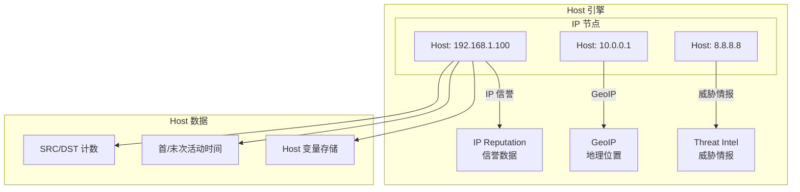

> [!info] Suricata 2026 深度探索系列 0. [[2026-04-15-suricata-deep-dive-series-index|全栈学习路径总览]]
>
> 1. [[2026-04-15-suricata-deep-dive-ch1-overview|第一章：Suricata 概述]]
> 2. [[2026-04-15-suricata-deep-dive-ch2-config|第二章：Suricata 配置系统]]
> 3. [[2026-04-15-suricata-deep-dive-ch3-runmodes|第三章：Runmodes 运行模式]]
> 4. [[2026-04-15-suricata-deep-dive-ch4-thread-model|第四章：线程模型]]
> 5. [[2026-04-15-suricata-deep-dive-ch5-capture|第五章：Capture 初始化]]
> 6. [[2026-04-15-suricata-deep-dive-ch6-af-packet|第六章：AF-PACKET 接口]]
> 7. [[2026-04-15-suricata-deep-dive-ch7-pcap|第七章：PCAP 接口]]
> 8. [[2026-04-15-suricata-deep-dive-ch8-nfq|第八章：NFQ 与 PF_RING 模式]]
> 9. [[2026-04-15-suricata-deep-dive-ch9-dpdk|第九章：DPDK 接口]]
> 10. [[2026-04-15-suricata-deep-dive-ch10-loadbalancing|第十章：多线程抓包与负载均衡]]
> 11. [[2026-04-15-suricata-deep-dive-ch11-detect-engine|第十一章：检测引擎架构]]
> 12. [[2026-04-15-suricata-deep-dive-ch12-signatures|第十二章：规则解析]]
> 13. [[2026-04-15-suricata-deep-dive-ch13-mpm|第十三章：多模式匹配]]
> 14. [[2026-04-15-suricata-deep-dive-ch14-filemagic|第十四章：文件识别]]
> 15. [[2026-04-15-suricata-deep-dive-ch15-lua-detect|第十五章：Lua 检测]]
> 16. [[2026-04-15-suricata-deep-dive-ch16-app-layer|第十六章：应用层协议解析]]
> 17. [[2026-04-15-suricata-deep-dive-ch17-http|第十七章：HTTP 协议解析]]
> 18. [[2026-04-15-suricata-deep-dive-ch18-dns|第十八章：DNS 协议解析]]
> 19. [[2026-04-15-suricata-deep-dive-ch19-tls|第十九章：TLS 协议解析]]
> 20. [[2026-04-15-suricata-deep-dive-ch20-smb|第二十章：SMB 协议解析]]
> 21. [[2026-04-15-suricata-deep-dive-ch21-http2|第二十一章：HTTP/2 协议解析]]
> 22. [[2026-04-15-suricata-deep-dive-ch22-flow|第二十二章：Flow 管理]]
> 23. [[2026-04-15-suricata-deep-dive-ch23-flow-timeout|第二十三章：Flow 超时]]
> 24. [[2026-04-15-suricata-deep-dive-ch24-flowbit|第二十四章：Flowbit 与 Flow 变量]]
> 25. **第二十五章：Host 管理**

---

## 1. Host 引擎概述

Host 引擎是 Suricata 用于追踪 IP 地址级别信息的基础组件。与 Flow 追踪会话不同，Host 引擎关注的是单个 IP 地址的元数据，包括 IP 信誉、国家归属、历史活动等。



### 1.1 Host vs Flow

| 特性         | Host           | Flow                |
| :----------- | :------------- | :------------------ |
| **粒度**     | 单个 IP 地址   | 双向会话（5-tuple） |
| **作用域**   | 全局共享       | Per-Flow            |
| **生命周期** | 可配置超时     | 会话结束时结束      |
| **典型用途** | IP 信誉、GeoIP | 会话追踪            |
| **内存占用** | 较低           | 较高                |

### 1.2 Host 配置

```yaml
# suricata.yaml
host:
  # Host 哈希表大小
  hash_size: 16384

  # Host 内存上限
  memcap: 32mb

  # 预分配数量
  prealloc: 256

  # 检测超时（无流量后多久认为主机离线）
  detection: 300

  # 是否记录未分类的威胁情报
  log_only_app_events: no
```

---

## 2. Host 数据结构

### 2.1 Host 主结构

```c
// src/host.h — Host 主结构
typedef struct Host_ {
    /* 地址（支持 IPv4/IPv6） */
    Address ip_addr;

    /* 引用计数 */
    uint16_t use_cnt;

    /* Host ID（用于日志关联） */
    uint64_t host_id;

    /* 时间戳 */
    struct timeval ts;        // 最后活动
    struct timeval firstts;   // 首次活动

    /* 标志位 */
    uint32_t flags;

    /* 字节/Packet 计数 */
    uint64_t src_bytes;
    uint64_t dst_bytes;
    uint64_t src_pktcnt;
    uint64_t dst_pktcnt;

    /* 应用层事件计数 */
    uint32_t app_event_cnt;

    /* TCP 标志计数 */
    uint32_t tcp_syn_cnt;
    uint32_t tcp_fin_cnt;
    uint32_t tcp_rst_cnt;

    /* Host 锁 */
    SCMutex m;

    /* IP 信誉数据 */
    HostIPReputation *ip_rep;

    /* GeoIP 数据 */
    void *geoip;

    /* 关联的 Flow 列表（仅统计） */
    uint32_t flow_count;

    /* Host 变量存储 */
    HostStorage *host_storage;

    /* 链表指针 */
    struct Host_ *hnext;
    struct Host_ *hprev;

    /* 淘汰链表 */
    struct Host_ *tnext;
    struct Host_ *tprev;
    uint32_t timeout_at;

} Host;
```

### 2.2 Host 哈希表

```c
// src/host.h — Host 哈希表
typedef struct HostHashTable_ {
    /* 哈希桶数组 */
    Host **buckets;
    uint32_t hash_size;

    /* 链表头尾 */
    Host *list_head;
    Host *list_tail;

    /* 统计 */
    uint32_t host_count;
    uint32_t max_host_count;

    /* 锁（分片锁） */
    STMtx *tbl_m;

} HostHashTable;

// src/host.h — Host 桶
typedef struct HostBucket_ {
    Host *head;
    Host *tail;
    STMtx m;
    uint32_t count;

} HostBucket;
```

---

## 3. Host 哈希计算

### 3.1 地址哈希

```c
// src/host.c — Host 哈希计算
static inline uint32_t HostGetHash(Host *h)
{
    uint32_t hash;

    if (h->ip_addr.family == AF_INET) {
        /* IPv4 简单哈希 */
        hash = h->ip_addr.addrData32[0];
        hash ^= (hash >> 16);
        hash *= 0x85ebca6b;
        hash ^= (hash >> 13);
    } else {
        /* IPv6 哈希 */
        hash = h->ip_addr.addrData32[0] ^
               h->ip_addr.addrData32[1] ^
               h->ip_addr.addrData32[2] ^
               h->ip_addr.addrData32[3];

        hash ^= (hash >> 16);
        hash = hash * 0x85ebca6b;
        hash ^= (hash >> 13);
    }

    return hash % host_config.hash_size;
}

// src/host.c — Host 键值比较
static inline int HostCompare(Host *a, Host *b)
{
    if (a->ip_addr.family != b->ip_addr.family) {
        return 1;
    }

    if (a->ip_addr.family == AF_INET) {
        return (a->ip_addr.addrData32[0] != b->ip_addr.addrData32[0]);
    } else if (a->ip_addr.family == AF_INET6) {
        return memcmp(a->ip_addr.addrData8, b->ip_addr.addrData8, 16);
    }

    return 0;
}

// src/host.c — Host 查找
static inline Host *HostHashLookup(HostHashTable *ht, Address *ip)
{
    uint32_t hash = HostGetHashFromIP(ip);

    HostBucket *b = &ht->buckets[hash];
    STMtxLock(&b->m);

    Host *h = b->head;
    while (h != NULL) {
        if (HostCompare(h, ip) == 0) {
            (void)SC_ATOMIC_ADD(h->use_cnt, 1);
            STMtxUnlock(&b->m);
            return h;
        }
        h = h->hnext;
    }

    STMtxUnlock(&b->m);
    return NULL;
}
```

---

## 4. Host 生命周期

### 4.1 Host 创建和释放

```c
// src/host.c — Host 分配
Host *HostAlloc(void)
{
    Host *h;

    if (host_config.memcap + sizeof(Host) > host_config.memcap) {
        /* 检查内存 */
        if (SC_ATOMIC_LOAD(host_config.memcap) > host_config.memcap) {
            HostCutMemcap(sizeof(Host));
        }
    }

    h = (Host *)SCCalloc(1, sizeof(Host));
    if (h == NULL) {
        return NULL;
    }

    /* 初始化锁 */
    SCMutexInit(&h->m, NULL);

    /* 初始化引用计数 */
    SC_ATOMIC_INIT(h->use_cnt);
    SC_ATOMIC_ADD(h->use_cnt, 1);

    /* 生成 Host ID */
    h->host_id = GenerateHostId();

    return h;
}

// src/host.c — Host 初始化
static inline int HostInit(Host *h, Address *ip)
{
    h->ip_addr = *ip;

    struct timeval ts;
    gettimeofday(&ts, NULL);
    h->firstts = ts;
    h->ts = ts;

    h->flags = 0;
    h->use_cnt = 1;

    h->src_bytes = 0;
    h->dst_bytes = 0;
    h->src_pktcnt = 0;
    h->dst_pktcnt = 0;

    h->ip_rep = NULL;
    h->geoip = NULL;
    h->host_storage = NULL;

    h->flow_count = 0;

    return 0;
}

// src/host.c — Host 释放
void HostFree(Host *h)
{
    /* 清理 IP 信誉 */
    if (h->ip_rep != NULL) {
        SCFree(h->ip_rep);
        h->ip_rep = NULL;
    }

    /* 清理 GeoIP */
    if (h->geoip != NULL) {
        GeoIPFree(h->geoip);
        h->geoip = NULL;
    }

    /* 清理存储 */
    if (h->host_storage != NULL) {
        HostStorageFree(h->host_storage);
        h->host_storage = NULL;
    }

    /* 销毁锁 */
    SCMutexDestroy(&h->m);

    /* 释放 */
    SCFree(h);
}
```

### 4.2 Host 查找和创建

```c
// src/host.c — 获取或创建 Host
Host *HostGetHostFromHash(Address *ip)
{
    uint32_t hash = HostGetHashFromIP(ip);

    HostBucket *b = &host_hash.buckets[hash];
    STMtxLock(&b->m);

    /* 查找 */
    Host *h = HostHashLookup(&host_hash, ip);
    if (h != NULL) {
        STMtxUnlock(&b->m);
        return h;
    }

    /* 分配新 Host */
    h = HostAlloc();
    if (h == NULL) {
        /* 尝试淘汰 */
        HostPruneHash();
        h = HostAlloc();
        if (h == NULL) {
            STMtxUnlock(&b->m);
            return NULL;
        }
    }

    /* 初始化 */
    HostInit(h, ip);

    /* 加入哈希表 */
    HostAddToHash(h, hash);

    host_config.host_count++;

    STMtxUnlock(&b->m);

    return h;
}

// src/host.c — Host 加入哈希表
static inline void HostAddToHash(Host *h, uint32_t hash)
{
    HostBucket *b = &host_hash.buckets[hash];

    h->hnext = b->head;
    h->hprev = NULL;

    if (b->head != NULL) {
        b->head->hprev = h;
    }
    b->head = h;

    if (b->tail == NULL) {
        b->tail = h;
    }

    b->count++;
}
```

---

## 5. IP 信誉系统

### 5.1 IP 信誉数据结构

```c
// src/host.h — IP 信誉
typedef struct HostIPReputation_ {
    /* 信誉级别（0-255，255 最危险） */
    uint8_t reputation;

    /* 类别掩码（多个类别） */
    uint32_t categories;

    /* 置信度（0-100） */
    uint8_t confidence;

    /* 首次/最后见到时间 */
    struct timeval first_seen;
    struct timeval last_seen;

    /* 关联的威胁情报源 */
    char *source;

} HostIPReputation;

// src/host-reputation.h — 预定义类别
#define IP_REP_CATEGORY_SPAM       0x0001
#define IP_REP_CATEGORY_SCANNER    0x0002
#define IP_REP_CATEGORY_MALWARE    0x0004
#define IP_REP_CATEGORY_BOT        0x0008
#define IP_REP_CATEGORY_EXPLOIT    0x0010
#define IP_REP_CATEGORY_TOR        0x0020
#define IP_REP_CATEGORY_VPN        0x0040
#define IP_REP_CATEGORY_PROXY       0x0080
#define IP_REP_CATEGORY_ABUSE       0x0100
```

### 5.2 IP 信誉加载

```c
// src/host-reputation.c — 加载 IP 信誉
static int HostLoadIPReputation(Host *h)
{
    /* 从 IP 信誉数据库查询 */
    SCIP *scip = SCIPFindIP(h->ip_addr);
    if (scip == NULL) {
        return 0;
    }

    /* 分配信誉数据 */
    h->ip_rep = SCCalloc(1, sizeof(HostIPReputation));
    if (h->ip_rep == NULL) {
        return -1;
    }

    /* 填充信誉信息 */
    h->ip_rep->reputation = scip->reputation;
    h->ip_rep->categories = scip->categories;
    h->ip_rep->confidence = scip->confidence;
    h->ip_rep->source = SCStrdup(scip->source);

    gettimeofday(&h->ip_rep->last_seen, NULL);

    return 0;
}

// src/host-reputation.c — IP 信誉查询
static int HostIPReputationCheck(
    Host *h,
    uint8_t min_rep,
    uint32_t category)
{
    if (h->ip_rep == NULL) {
        /* 尝试加载 */
        HostLoadIPReputation(h);
        if (h->ip_rep == NULL) {
            return 0;
        }
    }

    /* 检查信誉级别 */
    if (h->ip_rep->reputation < min_rep) {
        return 0;
    }

    /* 检查类别 */
    if (category != 0 &&
        (h->ip_rep->categories & category) == 0) {
        return 0;
    }

    return 1;
}
```

---

## 6. GeoIP 集成

### 6.1 GeoIP 数据结构

```c
// src/host-geoip.h — GeoIP 数据
typedef struct HostGeoip_ {
    /* 国家代码（ISO 3166-1 alpha-2） */
    char country_code[3];

    /* 国家名称 */
    char *country_name;

    /* 地区代码 */
    char region[4];

    /* 城市名称 */
    char *city;

    /* 经纬度 */
    double latitude;
    double longitude;

    /* 时区 */
    char *timezone;

    /* ASN 信息 */
    uint32_t asn;
    char *asn_name;

} HostGeoip;
```

### 6.2 GeoIP 查询

```c
// src/host-geoip.c — GeoIP 查询
static HostGeoip *HostGeoipGet(Host *h)
{
    if (h->geoip != NULL) {
        return (HostGeoip *)h->geoip;
    }

    /* 从 GeoIP 数据库查询 */
    h->geoip = GeoIPLookup(h->ip_addr);
    if (h->geoip == NULL) {
        return NULL;
    }

    return (HostGeoip *)h->geoip;
}

// src/host-geoip.c — GeoIP 国家代码
const char *HostGeoipCountryCode(Host *h)
{
    HostGeoip *geo = HostGeoipGet(h);
    if (geo == NULL) {
        return NULL;
    }

    return geo->country_code;
}

// src/host-geoip.c — GeoIP ASN
uint32_t HostGeoipASN(Host *h)
{
    HostGeoip *geo = HostGeoipGet(h);
    if (geo == NULL) {
        return 0;
    }

    return geo->asn;
}
```

---

## 7. Host 检测关键字

### 7.1 hostbits

```c
// src/detect-hostbits.c — hostbits 检测
typedef enum {
    HOSTBITS_TYPE_SET,
    HOSTBITS_TYPE_UNSET,
    HOSTBITS_TYPE_ISSET,
    HOSTBITS_TYPE_ISNOTSET,
} HostbitsType;

typedef struct DetectHostbitsData_ {
    HostbitsType type;
    char *name;
    uint16_t idx;

} DetectHostbitsData;

static int DetectHostbitsMatch(
    DetectEngineThreadCtx *det_ctx,
    Packet *p,
    Host *h,
    DetectHostbitsData *hd)
{
    HostBits *bits = HostGetHostBits(h);

    switch (hd->type) {
        case HOSTBITS_TYPE_SET:
            HostBitSet(h, hd->idx);
            return 1;

        case HOSTBITS_TYPE_UNSET:
            HostBitUnset(h, hd->idx);
            return 1;

        case HOSTBITS_TYPE_ISSET:
            return HostBitIsset(h, hd->idx) ? 1 : 0;

        case HOSTBITS_TYPE_ISNOTSET:
            return HostBitIsnotset(h, hd->idx) ? 1 : 0;
    }

    return 0;
}
```

### 7.2 IP 信誉检测

```c
// src/detect-iprep.c — IP 信誉检测
typedef struct DetectIPRepData_ {
    uint8_t side;           // SRC/DST/BOTH
    uint8_t category;
    uint8_t min_rep;

} DetectIPRepData;

static int DetectIPRepMatch(
    DetectEngineThreadCtx *det_ctx,
    Packet *p,
    Flow *f,
    DetectIPRepData *rd)
{
    Host *h = NULL;

    switch (rd->side) {
        case DETECT_IPREP_SIDE_SRC:
            h = HostGetHostFromHash(&p->src);
            break;

        case DETECT_IPREP_SIDE_DST:
            h = HostGetHostFromHash(&p->dst);
            break;

        case DETECT_IPREP_SIDE_BOTH:
            /* 任一匹配即可 */
            if (HostIPReputationCheck(
                    HostGetHostFromHash(&p->src),
                    rd->min_rep, rd->category)) {
                return 1;
            }
            if (HostIPReputationCheck(
                    HostGetHostFromHash(&p->dst),
                    rd->min_rep, rd->category)) {
                return 1;
            }
            return 0;
    }

    if (h == NULL) {
        return 0;
    }

    return HostIPReputationCheck(h, rd->min_rep, rd->category);
}
```

---

## 8. Host 日志

### 8.1 EVE Host 日志

```json
{
  "event_type": "host",
  "host": {
    "ip": "192.168.1.100",
    "first_seen": "2026-04-15T10:00:00",
    "last_seen": "2026-04-15T12:30:00",
    "src_bytes": 1024000,
    "dst_bytes": 2048000,
    "src_pktcnt": 5432,
    "dst_pktcnt": 6789,
    "geoip": {
      "country_code": "US",
      "country_name": "United States",
      "city": "San Francisco",
      "asn": 15169,
      "asn_name": "Google LLC"
    },
    "ip_rep": {
      "reputation": 180,
      "category": "spam",
      "confidence": 85
    },
    "hostbits": ["known_bad", "scanner_detected"]
  }
}
```

### 8.2 Host 日志输出

```c
// src/output-json-host.c — JSON Host 日志
static void JsonHostLog(json_t *js, Host *h)
{
    json_object_set_new(js, "ip", json_string(AddressToString(&h->ip_addr)));

    /* 时间戳 */
    json_object_set_new(js, "first_seen", json_string(TimeAsISO(h->firstts)));
    json_object_set_new(js, "last_seen", json_string(TimeAsISO(h->ts)));

    /* 流量统计 */
    json_object_set_new(js, "src_bytes", json_integer(h->src_bytes));
    json_object_set_new(js, "dst_bytes", json_integer(h->dst_bytes));
    json_object_set_new(js, "src_pktcnt", json_integer(h->src_pktcnt));
    json_object_set_new(js, "dst_pktcnt", json_integer(h->dst_pktcnt));

    /* GeoIP */
    HostGeoip *geo = HostGeoipGet(h);
    if (geo != NULL) {
        json_t *geo_obj = json_object();
        json_object_set_new(geo_obj, "country_code",
                           json_string(geo->country_code));
        json_object_set_new(geo_obj, "country_name",
                           json_string(geo->country_name));
        if (geo->city != NULL) {
            json_object_set_new(geo_obj, "city", json_string(geo->city));
        }
        json_object_set_new(geo_obj, "asn", json_integer(geo->asn));
        json_object_set_new(geo_obj, "asn_name", json_string(geo->asn_name));
        json_object_set_new(js, "geoip", geo_obj);
    }

    /* IP 信誉 */
    if (h->ip_rep != NULL) {
        json_t *rep_obj = json_object();
        json_object_set_new(rep_obj, "reputation",
                           json_integer(h->ip_rep->reputation));
        json_object_set_new(rep_obj, "category",
                           json_integer(h->ip_rep->categories));
        json_object_set_new(rep_obj, "confidence",
                           json_integer(h->ip_rep->confidence));
        json_object_set_new(js, "ip_rep", rep_obj);
    }
}
```

---

## 9. 总结

Host 引擎是 Suricata IP 级别资源管理的核心：

1. **Host 哈希表**：通过 IP 地址快速查找和复用 Host 对象
2. **生命周期管理**：引用计数 + 超时淘汰
3. **IP 信誉集成**：支持威胁情报查询和分类
4. **GeoIP 支持**：地理位置和 ASN 信息查询
5. **Hostbits**：类似 Flowbit 的 Host 级别标记机制
6. **EVE 日志**：完整的 Host 活动记录

典型应用场景：

- 恶意 IP 检测（结合 IP 信誉数据库）
- 地理位置审计（合规性要求）
- APT 追踪（长期监控特定 IP）
- 威胁情报联动（与外部情报源集成）

Host 引擎与 Flow 引擎互补，Flow 追踪会话级别活动，Host 追踪地址级别活动，共同构成完整的网络可视化能力。
