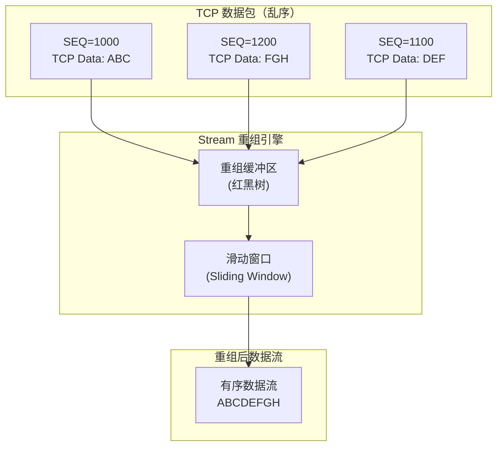
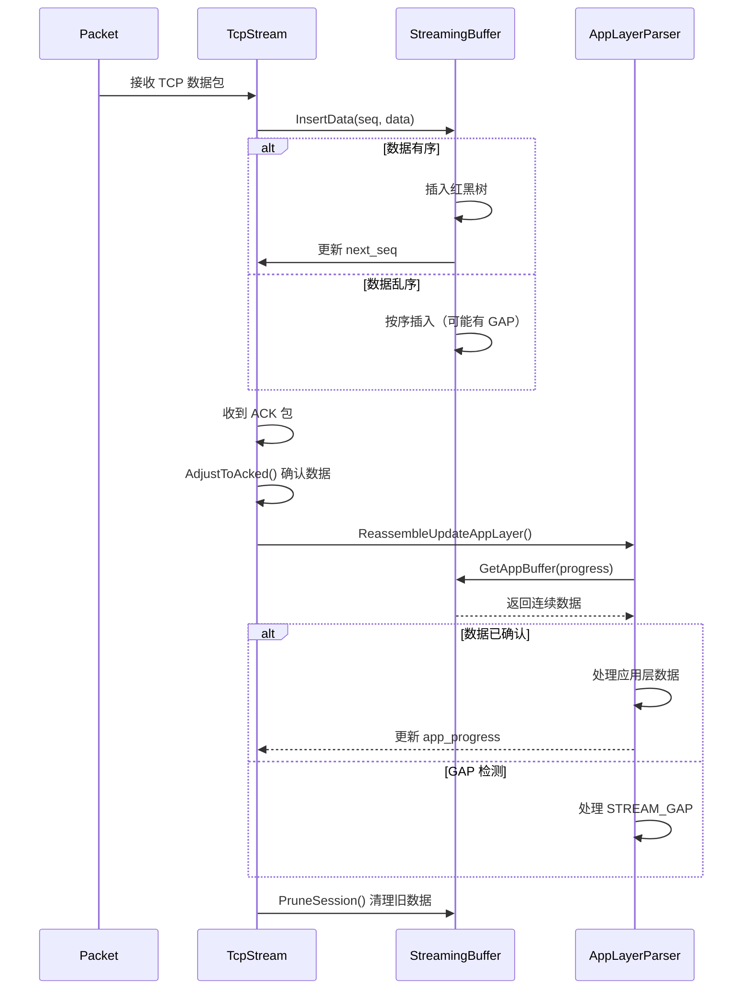

> [!info] Suricata 2026 深度探索系列 0. [[2026-04-15-suricata-deep-dive-series-index|全栈学习路径总览]]
>
> 1. [[2026-04-15-suricata-deep-dive-ch1-overview|第一章：Suricata 概述]]
> 2. [[2026-04-15-suricata-deep-dive-ch2-config|第二章：Suricata 配置系统]]
> 3. [[2026-04-15-suricata-deep-dive-ch3-runmodes|第三章：Runmodes 运行模式]]
> 4. [[2026-04-15-suricata-deep-dive-ch4-thread-model|第四章：线程模型]]
> 5. [[2026-04-15-suricata-deep-dive-ch5-capture|第五章：Capture 初始化]]
> 6. [[2026-04-15-suricata-deep-dive-ch6-af-packet|第六章：AF-PACKET 接口]]
> 7. [[2026-04-15-suricata-deep-dive-ch7-pcap|第七章：PCAP 接口]]
> 8. [[2026-04-15-suricata-deep-dive-ch8-nfq|第八章：NFQ 与 PF_RING 模式]]
> 9. [[2026-04-15-suricata-deep-dive-ch9-dpdk|第九章：DPDK 接口]]
> 10. [[2026-04-15-suricata-deep-dive-ch10-loadbalancing|第十章：多线程抓包与负载均衡]]
> 11. [[2026-04-15-suricata-deep-dive-ch11-detect-engine|第十一章：检测引擎架构]]
> 12. [[2026-04-15-suricata-deep-dive-ch12-signatures|第十二章：规则解析]]
> 13. [[2026-04-15-suricata-deep-dive-ch13-mpm|第十三章：多模式匹配]]
> 14. [[2026-04-15-suricata-deep-dive-ch14-filemagic|第十四章：文件识别]]
> 15. [[2026-04-15-suricata-deep-dive-ch15-lua-detect|第十五章：Lua 检测]]
> 16. [[2026-04-15-suricata-deep-dive-ch16-app-layer|第十六章：应用层协议解析]]
> 17. [[2026-04-15-suricata-deep-dive-ch17-http|第十七章：HTTP 协议解析]]
> 18. [[2026-04-15-suricata-deep-dive-ch18-dns|第十八章：DNS 协议解析]]
> 19. [[2026-04-15-suricata-deep-dive-ch19-tls|第十九章：TLS 协议解析]]
> 20. [[2026-04-15-suricata-deep-dive-ch20-smb|第二十章：SMB 协议解析]]
> 21. [[2026-04-15-suricata-deep-dive-ch21-http2|第二十一章：HTTP/2 协议解析]]
> 22. [[2026-04-15-suricata-deep-dive-ch22-flow|第二十二章：Flow 管理]]
> 23. [[2026-04-15-suricata-deep-dive-ch23-flow-timeout|第二十三章：Flow 超时]]
> 24. [[2026-04-15-suricata-deep-dive-ch24-flowbit|第二十四章：Flowbit 与 Flow 变量]]
> 25. [[2026-04-15-suricata-deep-dive-ch25-host|第二十五章：Host 管理]]
> 26. **第二十六章：Stream 重组引擎**

---

## 1. Stream 重组概述

Stream 重组引擎是 Suricata 实现 TCP 状态追踪和深度检测的核心模块。与传统 IDS 仅分析单个数据包不同，Suricata 通过 Stream 重组将混乱的 TCP 数据包还原为有序的字节流，为应用层协议解析器提供完整的会话视图。



### 1.1 为什么需要 Stream 重组

| 问题         | 说明                       | 重组引擎如何解决         |
| :----------- | :------------------------- | :----------------------- |
| **乱序到达** | TCP 包可能不按发送顺序到达 | 按 SEQ 排序后输出        |
| **丢包**     | 网络丢包导致数据缺失       | GAP 检测，通知应用层     |
| **重传**     | 同一数据多次到达           | 去重，只处理一次         |
| **分片**     | IP 分片、TCP 分片          | 重组为完整数据           |
| **滑动窗口** | 发送方窗口变化             | 跟踪 ACK，确认已接收数据 |

### 1.2 Stream 配置

```yaml
# suricata.yaml
stream:
  # Stream 内存上限
  memcap: 64mb

  # 最大追踪会话数
  max-sessions: 262144

  # 会话预分配
  prealloc-sessions: 16384

  # 检测超时
  detection: 300

  # 异步流（单向模式）
  async-oneside: no

  # 重组队列大小
  reassembly:
    # 重组内存上限
    memcap: 256mb

    # 重组队列深度（包数）
    depth: 1048576

    # 片段检查
    check-overlap-dictions: true

    # 队列初始大小
    initial-queuelen: 256
```

---

## 2. Stream 数据结构

### 2.1 TcpStream 主结构

```c
// src/stream-tcp.h — TCP Stream 主结构
typedef struct TcpStream_ {
    /* 滑动窗口基准偏移
     * 随数据清理（Pruning）单调递增
     * 用于计算绝对序列号 */
    uint64_t base_offset;

    /* 相对进度（窗口内偏移）
     * 随数据消费和清理动态变化 */
    uint32_t app_progress_rel;
    uint32_t raw_progress_rel;

    /* 最后记录的 ACK（接收方确认号） */
    uint32_t last_ack;

    /* 下一个期望序列号（发送方下一个字节） */
    uint32_t next_seq;

    /* 最后看到的序列号 */
    uint32_t last_seq;

    /* 重组缓冲区（红黑树） */
    StreamingBuffer *sb;

    /* 当前数据包队列（未处理） */
    TcpDataQueue data_queue;

    /* 流的标志位 */
    uint16_t flags;

    /* NSSD（Next Sequence Not Seen）标记 */
    uint32_t nssdsn;
    uint8_t nssdsn_valid;

} TcpStream;
```

### 2.2 TcpSession 主结构

```c
// src/stream-tcp.h — TCP Session
typedef struct TcpSession_ {
    /* 双向 Stream */
    TcpStream to_server;    // 客户端 → 服务器
    TcpStream to_client;    // 服务器 → 客户端

    /* TCP 状态机状态 */
    TcpState state;

    /* 标志位 */
    uint32_t flags;

    /* 引用计数 */
    uint16_t use_cnt;

    /* 所属 Flow */
    struct Flow_ *flow;

    /* 服务器/客户端 IP 和端口 */
    Address server_ip;
    Address client_ip;
    Port server_port;
    Port client_port;

    /* 隧道信息 */
    uint8_t tunnel_depth;

    /* 锁（保护多线程访问） */
    SCMutex m;

} TcpSession;
```

### 2.3 StreamingBuffer 结构

```c
// src/stream.h — 流式缓冲区
typedef struct StreamingBuffer_ {
    /* 内存区域管理 */
    struct StreamingBufferRegion_ *region;

    /* 红黑树根节点（数据块索引） */
    RBTree *tree;

    /* 当前总数据长度 */
    uint64_t buf_len;

    /* 基准偏移（与 TcpStream.base_offset 同步） */
    uint64_t offset;

} StreamingBuffer;

// src/stream.h — 数据块节点（红黑树）
typedef struct StreamingBufferBlock_ {
    rbnode_t rbnode;          // 红黑树节点

    uint64_t offset;          // 绝对序列号偏移
    uint32_t len;             // 数据长度

} StreamingBufferBlock;
```

---

## 3. 滑动窗口机制

### 3.1 进度计算

Stream 的进度通过双值设计实现滑动窗口：

```c
// src/stream-tcp.h — 进度计算宏

// 应用层进度 = 基准偏移 + 相对进度
#define STREAM_APP_PROGRESS(stream)  \
    ((stream)->base_offset + (stream)->app_progress_rel)

// 原始层进度 = 基准偏移 + 相对进度
#define STREAM_RAW_PROGRESS(stream) \
    ((stream)->base_offset + (stream)->raw_progress_rel)

// 基准偏移
#define STREAM_BASE_OFFSET(stream)   ((stream)->base_offset)

// ACK 窗口
#define STREAM_LAST_ACK(stream)      ((stream)->last_ack)
```

### 3.2 进度更新流程



---

## 4. ReassembleUpdateAppLayer 核心函数

### 4.1 函数概述

`ReassembleUpdateAppLayer` 是连接 TCP 重组层和应用层解析器的核心网关：

```c
// src/stream-tcp.c — 重组更新应用层
int ReassembleUpdateAppLayer(TcpSession *ssn, TcpStream *stream,
                              TcpStream *opposing_stream,
                              enum StreamUpdateDir dir)
```

**核心职责**：

1. 从重组缓冲区获取连续数据
2. 处理 GAP（丢包）情况
3. 将数据投递到应用层解析器

### 4.2 核心逻辑

```c
// src/stream-tcp.c — ReassembleUpdateAppLayer 核心流程
int ReassembleUpdateAppLayer(TcpSession *ssn, TcpStream *stream,
                              TcpStream *opposing_stream,
                              enum StreamUpdateDir dir)
{
    /* 1. 获取当前应用层进度 */
    uint64_t app_progress = STREAM_APP_PROGRESS(stream);
    uint64_t opposing_ack = STREAM_LAST_ACK(opposing_stream);

    while (1) {
        /* 2. 从重组缓冲区获取数据 */
        uint8_t *mydata = NULL;
        uint32_t data_len = 0;
        int GAP = 0;

        GetAppBuffer(stream, opposing_ack, &mydata, &data_len, &GAP);

        /* 3. 检查是否有数据需要处理 */
        if (mydata == NULL && data_len == 0 && !GAP) {
            /* 无数据也无 GAP，退出循环 */
            break;
        }

        /* 4. 处理 GAP 情况 */
        if (GAP) {
            /* 计算 GAP 位置和长度 */
            uint64_t gap_offset = app_progress;
            uint32_t gap_len = CalculateGap(stream, app_progress, opposing_ack);

            /* 通知应用层有 GAP */
            AppLayerHandleTCPData(ssn, stream, dir,
                                  NULL, gap_len, STREAM_GAP);

            /* 强制推进进度跳过 GAP */
            app_progress += gap_len;
            UpdateAppProgress(stream, app_progress);

            continue;
        }

        /* 5. 投递数据到应用层 */
        AppLayerHandleTCPData(ssn, stream, dir,
                             mydata, data_len, STREAM_CONTINUE);

        /* 6. 更新进度 */
        app_progress += data_len;
        UpdateAppProgress(stream, app_progress);
    }

    return 0;
}
```

### 4.3 GetAppBuffer 实现

```c
// src/stream-tcp.c — 从重组缓冲区获取连续数据
static void GetAppBuffer(TcpStream *stream, uint64_t ack,
                         uint8_t **data, uint32_t *data_len, int *has_gap)
{
    uint64_t app_progress = STREAM_APP_PROGRESS(stream);
    *has_gap = 0;

    /* 计算需要确认的位置 */
    uint64_t ack_limit = (ack > stream->next_seq) ? stream->next_seq : ack;

    /* 从红黑树查找连续数据块 */
    StreamingBufferBlock *blk = RBTreeFindLessEqual(stream->sb->tree, app_progress);

    if (blk == NULL) {
        /* 缓冲区中没有数据 */
        if (stream->next_seq > app_progress) {
            /* 有数据但还没收到（丢包） */
            *has_gap = 1;
            *data_len = (uint32_t)(stream->next_seq - app_progress);
        }
        return;
    }

    /* 检查数据是否在 GAP 之后 */
    if (blk->offset > app_progress) {
        /* 发现 GAP */
        *has_gap = 1;
        *data_len = (uint32_t)(blk->offset - app_progress);
        return;
    }

    /* 获取数据 */
    uint32_t len = StreamingBufferRead(stream->sb, app_progress,
                                        data, *data_len);
    if (len == 0 && stream->next_seq > app_progress) {
        *has_gap = 1;
        *data_len = (uint32_t)(stream->next_seq - app_progress);
    }
}
```

---

## 5. ACK 处理与数据确认

### 5.1 AdjustToAcked — 确认已接收数据

```c
// src/stream-tcp.c — 根据 ACK 确认数据
static int AdjustToAcked(TcpStream *stream, TcpStream *opposing)
{
    /* 如果对端 ACK 越过了我们已发送的数据，
     * 说明发生了抓包丢失 */
    if (SEQ_GT(opposing->last_ack, stream->next_seq)) {
        /* 记录丢失计数 */
        StreamTcpSetEvent(ssn, STREAM_TCP_ACK_UNSEEN_DATA);
        return -1;
    }

    /* 更新 last_ack */
    if (SEQ_GT(opposing->last_ack, stream->last_ack)) {
        stream->last_ack = opposing->last_ack;
    }

    return 0;
}
```

### 5.2 ACK 超越检测

```c
// src/stream-tcp.c — 检测异常的 ACK
if (SEQ_LEQ(stream->last_ack, stream->next_seq) &&
    SEQ_GT(ack, stream->next_seq))
{
    /*
     * 情况：last_ack <= next_seq <= ack
     * 含义：接收方确认了 Suricata 还没看到的数据
     * 结论：Suricata 发生了抓包丢失
     */
    StreamTcpSetEvent(ssn, STREAM_TCP_ACK_UNSEEN_DATA);
    StatsIncr(ssn->tcpsb->cnt_ack_unseen_data);
}
```

---

## 6. 内存管理与 Pruning

### 6.1 清理时机

当数据被应用层成功消费后，需要清理已确认的旧数据：

```c
// src/stream-tcp.c — 清理会话数据
void StreamTcpPruneSession(TcpSession *ssn)
{
    /* 计算安全边界
     * SafeEdge = MIN(AppProgress, RawProgress, LastAck) */
    uint64_t safe_edge = CalculateSafeEdge(&ssn->to_server, &ssn->to_client);

    /* 滑动缓冲区到安全边界 */
    StreamingBufferSlideToOffset(ssn->to_server.sb, safe_edge);
    StreamingBufferSlideToOffset(ssn->to_client.sb, safe_edge);

    /* 更新基准偏移 */
    UpdateBaseOffset(&ssn->to_server, safe_edge);
    UpdateBaseOffset(&ssn->to_client, safe_edge);
}
```

### 6.2 清理计算

```c
// src/stream-tcp.c — 计算安全边界
static uint64_t CalculateSafeEdge(TcpStream *stream, TcpStream *opposing)
{
    uint64_t app_progress = STREAM_APP_PROGRESS(stream);
    uint64_t raw_progress = STREAM_RAW_PROGRESS(stream);
    uint64_t last_ack = STREAM_LAST_ACK(opposing);

    /* 取三者最小值 */
    uint64_t safe = MIN(app_progress, raw_progress);
    safe = MIN(safe, last_ack);

    return safe;
}
```

---

## 7. 关键标志位

### 7.1 TcpStream 标志位

```c
// src/stream-tcp.h — Stream 标志位
#define STREAMTCP_STREAM_FLAG_ASYNC             0x0001  // 异步流
#define STREAMTCP_STREAM_FLAG_NBSS              0x0002  // Next Byte Seen
#define STREAMTCP_STREAM_FLAG_TRIGGER_RAW      0x0004  // 触发原始检测
#define STREAMTCP_STREAM_FLAG_TIMESTAMP_LAST   0x0008  // 最后时间戳
#define STREAMTCP_STREAM_FLAG_MIDSTREAM        0x0010  // 中途开始
#define STREAMTCP_STREAM_FLAG_RAW_FILTER        0x0020  // 原始层过滤
```

### 7.2 Packet 标志位

```c
// src/stream-tcp.h — Packet 重组标志
#define STREAM_PKT_FLAG_BROKEN_ACK              0x01   // 异常 ACK
#define STREAM_PKT_FLAG_TCPOPT_TIMESTAMP       0x02   // 有时间戳选项
#define STREAM_PKT_FLAG_TCPOPT_SACK             0x04   // 有 SACK 选项
#define STREAM_PKT_FLAG_TCPOPT_WS               0x08   // 窗口缩放
#define STREAM_PKT_FLAG_DUP_ACK                 0x10   // 重复 ACK
#define STREAM_PKT_FLAG_RETRANSMISSION          0x20   // 重传包
#define STREAM_PKT_FLAG_KEEPALIVE               0x40   // Keep-Alive 包
```

---

## 8. 配置与调优

### 8.1 stream.reassembly 配置

```yaml
stream:
  memcap: 64mb

  reassembly:
    # 重组内存上限
    memcap: 256mb

    # 重组队列深度（每个方向）
    depth: 1048576

    # 是否检查重复片段
    check-overlap-dictions: true

    # 初始队列长度
    initial-queuelen: 256

    # 清理策略
    prune-window: 512
    max-prune-index: 10000

    # 崩溃恢复
    emergency-reset: yes
```

### 8.2 性能计数器

| 计数器                               | 说明                   |
| :----------------------------------- | :--------------------- |
| `stream.tcp.ssn_memcap_enter`        | 因内存限制进入紧急模式 |
| `stream.tcp.pkt_memcap_enter`        | 数据包内存超限         |
| `stream.tcp.reassembly_memcap_enter` | 重组内存超限           |
| `stream.tcp.overlap_memcap_enter`    | 重叠数据内存超限       |
| `stream.tcp.ack_unseen_data`         | ACK 了未发送的数据     |

---

## 9. 小结

本章深入分析了 Suricata Stream TCP 重组引擎的核心组件：

1. **TcpStream 数据结构**：通过基准偏移 + 相对进度的双值设计实现滑动窗口
2. **StreamingBuffer**：基于红黑树的重组缓冲区，支持 O(log N) 的乱序插入
3. **ReassembleUpdateAppLayer**：TCP 层与应用层交互的核心网关函数
4. **ACK 处理**：确保只有真正被接收方确认的数据才投递到应用层
5. **Pruning 机制**：通过安全边界计算清理已确认的旧数据，释放内存

理解 Stream 重组引擎对于调优 Suricata 的检测性能和准确性至关重要。下一章我们将讨论重组策略配置（BSD/Linux/Windows 行为差异）。
