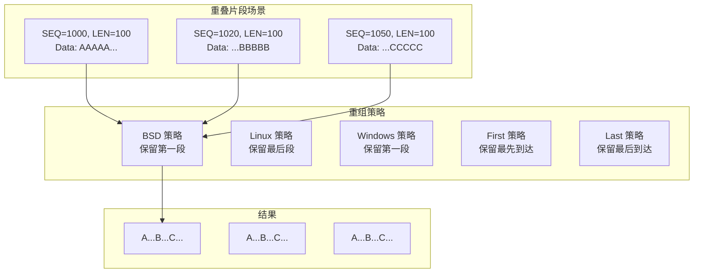
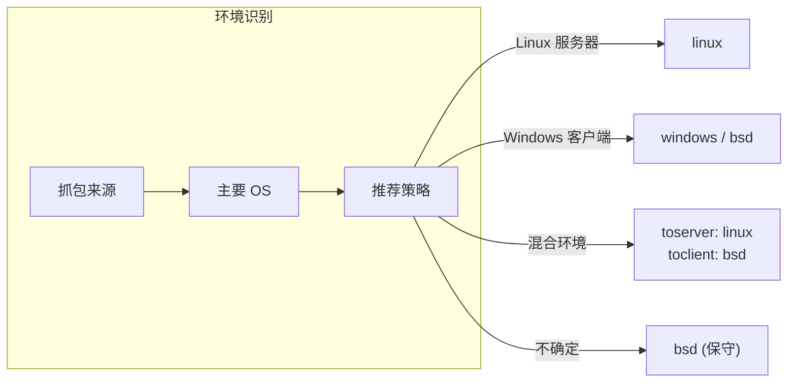

> [!info] Suricata 2026 深度探索系列
> 0. [[2026-04-15-suricata-deep-dive-series-index|全栈学习路径总览]]
> 1. [[2026-04-15-suricata-deep-dive-ch1-overview|第一章：Suricata 概述]]
> 2. [[2026-04-15-suricata-deep-dive-ch2-config|第二章：Suricata 配置系统]]
> 3. [[2026-04-15-suricata-deep-dive-ch3-runmodes|第三章：Runmodes 运行模式]]
> 4. [[2026-04-15-suricata-deep-dive-ch4-thread-model|第四章：线程模型]]
> 5. [[2026-04-15-suricata-deep-dive-ch5-capture|第五章：Capture 初始化]]
> 6. [[2026-04-15-suricata-deep-dive-ch6-af-packet|第六章：AF-PACKET 接口]]
> 7. [[2026-04-15-suricata-deep-dive-ch7-pcap|第七章：PCAP 接口]]
> 8. [[2026-04-15-suricata-deep-dive-ch8-nfq|第八章：NFQ 与 PF_RING 模式]]
> 9. [[2026-04-15-suricata-deep-dive-ch9-dpdk|第九章：DPDK 接口]]
> 10. [[2026-04-15-suricata-deep-dive-ch10-loadbalancing|第十章：多线程抓包与负载均衡]]
> 11. [[2026-04-15-suricata-deep-dive-ch11-detect-engine|第十一章：检测引擎架构]]
> 12. [[2026-04-15-suricata-deep-dive-ch12-signatures|第十二章：规则解析]]
> 13. [[2026-04-15-suricata-deep-dive-ch13-mpm|第十三章：多模式匹配]]
> 14. [[2026-04-15-suricata-deep-dive-ch14-filemagic|第十四章：文件识别]]
> 15. [[2026-04-15-suricata-deep-dive-ch15-lua-detect|第十五章：Lua 检测]]
> 16. [[2026-04-15-suricata-deep-dive-ch16-app-layer|第十六章：应用层协议解析]]
> 17. [[2026-04-15-suricata-deep-dive-ch17-http|第十七章：HTTP 协议解析]]
> 18. [[2026-04-15-suricata-deep-dive-ch18-dns|第十八章：DNS 协议解析]]
> 19. [[2026-04-15-suricata-deep-dive-ch19-tls|第十九章：TLS 协议解析]]
> 20. [[2026-04-15-suricata-deep-dive-ch20-smb|第二十章：SMB 协议解析]]
> 21. [[2026-04-15-suricata-deep-dive-ch21-http2|第二十一章：HTTP/2 协议解析]]
> 22. [[2026-04-15-suricata-deep-dive-ch22-flow|第二十二章：Flow 管理]]
> 23. [[2026-04-15-suricata-deep-dive-ch23-flow-timeout|第二十三章：Flow 超时]]
> 24. [[2026-04-15-suricata-deep-dive-ch24-flowbit|第二十四章：Flowbit 与 Flow 变量]]
> 25. [[2026-04-15-suricata-deep-dive-ch25-host|第二十五章：Host 管理]]
> 26. [[2026-04-15-suricata-deep-dive-ch26-stream|第二十六章：Stream 重组引擎]]
> 27. **第二十七章：TCP 重组策略**

---

## 1. 重组策略概述

TCP 重组策略（Reassembly Policy）决定了当同一序列号范围内出现多个重叠数据片段时，Suricata 如何选择保留哪一段数据。不同操作系统的 TCP 栈对重叠片段的处理方式不同，选择合适的重组策略对于准确还原数据流至关重要。



### 1.1 为什么需要多种策略

不同操作系统对 TCP 重传和重叠片段的处理方式不同：

| OS | 处理方式 | 场景 |
|:---|:-------|:-----|
| **BSD** | 保留先到达的片段 | 传统 BSD 系统、Solaris |
| **Linux** | 保留后到达的片段（后发优先） | 大多数 Linux 服务器 |
| **Windows** | 保留先到达的片段 | Windows 系统 |
| **First** | 强制保留最先到达 | 高可靠性场景 |
| **Last** | 强制保留最后到达 | 高可靠性场景 |

### 1.2 策略配置

```yaml
# suricata.yaml
stream:
  reassembly:
    # 重组策略
    # 可选: bsd, linux, windows, first, last
    policy: linux
    
    # 针对特定方向的策略
    toserver-policy: linux
    toclient-policy: linux
```

---

## 2. 重组策略数据结构

### 2.1 策略枚举

```c
// src/stream-tcp.h — 重组策略枚举
typedef enum {
    STREAM_REASSEMBLY_POLICY_BSD = 0,     // BSD：保留先到达
    STREAM_REASSEMBLY_POLICY_LINUX = 1,   // Linux：保留后到达
    STREAM_REASSEMBLY_POLICY_WINDOWS = 2, // Windows：保留先到达
    STREAM_REASSEMBLY_POLICY_FIRST = 3,  // First：强制保留先到达
    STREAM_REASSEMBLY_POLICY_LAST = 4,   // Last：强制保留后到达
    STREAM_REASSEMBLY_POLICY_MAX = 5,
} TcpReassemblyPolicy;
```

### 2.2 策略配置结构

```c
// src/stream-tcp.h — 重组策略配置
typedef struct TcpReassemblyConfig_ {
    /* 全局策略 */
    TcpReassemblyPolicy policy;
    
    /* 分方向策略 */
    TcpReassemblyPolicy toserver_policy;
    TcpReassemblyPolicy toclient_policy;
    
    /* 深度配置 */
    uint32_t depth;
    uint32_t toserver_depth;
    uint32_t toclient_depth;
    
} TcpReassemblyConfig;
```

---

## 3. BSD 策略（保留先到达）

### 3.1 行为描述

BSD 策略保留先到达的数据片段。当新到达的片段与已有片段重叠时：

- **完全重叠**：新片段被丢弃
- **部分重叠**：保留旧数据，新数据被截断或丢弃

```
时间线：
T1: 数据包 A [SEQ=1000, LEN=100] 到达 → 缓冲区 = "AAAA..."
T2: 数据包 B [SEQ=1050, LEN=100] 到达 → 缓冲区 = "AAAA...BBBB..."
T3: 数据包 C [SEQ=1020, LEN=100] 到达 → 缓冲区 = "AAAA...BBBB..."
                                          (C 的部分被丢弃)
```

### 3.2 源码实现

```c
// src/stream-tcp.c — BSD 策略处理
static int StreamReassemblyInsertSegmentBSD(TcpStream *stream,
                                             TcpSegment *seg)
{
    /* 遍历已有片段，检查重叠 */
    TcpSegment *prev = NULL;
    TcpSegment *cur = TAILQ_FIRST(&stream->seg_queue);
    
    while (cur != NULL) {
        /* 计算重叠范围 */
        uint32_t seg_start = seg->seq;
        uint32_t seg_end = seg->seq + seg->len;
        uint32_t cur_start = cur->seq;
        uint32_t cur_end = cur->seq + cur->len;
        
        if (SEQ_LEQ(seg_start, cur_end) && SEQ_GT(seg_end, cur_start)) {
            /* 存在重叠 */
            
            if (SEQ_LEQ(seg_start, cur_start)) {
                /* 新片段在前，保留新片段的前半部分 */
                uint32_t new_end = cur_start;
                if (new_end > seg_start) {
                    seg->len = new_end - seg_start;
                    /* 继续处理后续 */
                } else {
                    /* 完全被包含，丢弃新片段 */
                    return 0;
                }
            } else {
                /* 新片段在后，保留新片段的后半部分 */
                uint32_t new_start = cur_end;
                if (new_start < seg_end) {
                    seg->seq = new_start;
                    seg->len = seg_end - new_start;
                } else {
                    /* 完全被包含，丢弃 */
                    return 0;
                }
            }
        }
        
        prev = cur;
        cur = TAILQ_NEXT(cur, next);
    }
    
    /* 插入片段到队列 */
    if (prev == NULL) {
        TAILQ_INSERT_HEAD(&stream->seg_queue, seg, next);
    } else {
        TAILQ_INSERT_AFTER(&stream->seg_queue, prev, seg, next);
    }
    
    return 1;
}
```

---

## 4. Linux 策略（保留后到达）

### 4.1 行为描述

Linux 策略保留后到达的数据片段（后发优先）。这是大多数 Linux 内核的行为：

```
时间线：
T1: 数据包 A [SEQ=1000, LEN=100] 到达 → 缓冲区 = "AAAA..."
T2: 数据包 B [SEQ=1050, LEN=100] 到达 → 缓冲区 = "AAAA...BBBB..."
T3: 数据包 C [SEQ=1020, LEN=100] 到达 → 缓冲区 = "AAAA...CCCC...BBBB..."
                                          (C 覆盖 A 的后半部分)
```

### 4.2 源码实现

```c
// src/stream-tcp.c — Linux 策略处理
static int StreamReassemblyInsertSegmentLinux(TcpStream *stream,
                                               TcpSegment *seg)
{
    TcpSegment *prev = NULL;
    TcpSegment *cur = TAILQ_FIRST(&stream->seg_queue);
    
    while (cur != NULL) {
        uint32_t seg_start = seg->seq;
        uint32_t seg_end = seg->seq + seg->len;
        uint32_t cur_start = cur->seq;
        uint32_t cur_end = cur->seq + cur->len;
        
        if (SEQ_LEQ(seg_start, cur_end) && SEQ_GT(seg_end, cur_start)) {
            /* 存在重叠 - Linux 策略：后发优先 */
            
            if (SEQ_GT(seg_start, cur_start)) {
                /* 新片段起始位置更靠后
                 * 保留新片段的前半部分，覆盖旧数据 */
                uint32_t overlap_start = seg_start;
                uint32_t overlap_end = MIN(seg_end, cur_end);
                
                /* 覆盖旧数据 */
                ReplaceStreamData(stream, overlap_start, 
                                 overlap_end - overlap_start,
                                 seg->data + (overlap_start - seg_start));
                
                /* 调整新片段，移除已处理部分 */
                if (seg_end > cur_end) {
                    seg->seq = cur_end;
                    seg->len = seg_end - cur_end;
                    /* 继续处理后续 */
                } else {
                    /* 完全被覆盖，丢弃 */
                    return 0;
                }
            } else {
                /* 新片段在前，保留新片段，覆盖旧数据 */
                uint32_t overlap_start = cur_start;
                uint32_t overlap_end = MIN(seg_end, cur_end);
                
                ReplaceStreamData(stream, overlap_start,
                                 overlap_end - overlap_start,
                                 seg->data);
                
                if (seg_end > cur_end) {
                    /* 保留新片段超出部分 */
                    seg->len = seg_end - cur_end;
                } else {
                    return 0;
                }
            }
        }
        
        prev = cur;
        cur = TAILQ_NEXT(cur, next);
    }
    
    /* 插入剩余片段 */
    if (prev == NULL) {
        TAILQ_INSERT_HEAD(&stream->seg_queue, seg, next);
    } else {
        TAILQ_INSERT_AFTER(&stream->seg_queue, prev, seg, next);
    }
    
    return 1;
}
```

---

## 5. Windows 策略

### 5.1 行为描述

Windows 策略与 BSD 类似，保留先到达的数据片段。但在某些边界情况下有细微差异：

- **接收窗口内重叠**：保留先到达
- **快速重传场景**：可能保留后到达

### 5.2 与 BSD 的区别

```c
// src/stream-tcp.c — Windows 策略
static int StreamReassemblyInsertSegmentWindows(TcpStream *stream,
                                                 TcpSegment *seg)
{
    /* Windows 策略与 BSD 类似，但在以下情况有差异：
     * 1. 当 seg.seq == cur.seq 时，Windows 保留新数据
     * 2. SACK 启用时的行为差异 */
    
    TcpSegment *prev = NULL;
    TcpSegment *cur = TAILQ_FIRST(&stream->seg_queue);
    
    while (cur != NULL) {
        if (seg->seq == cur->seq) {
            /* 相同起始位置 - Windows 保留新数据 */
            /* 删除旧片段 */
            TAILQ_REMOVE(&stream->seg_queue, cur, next);
            TcpSegmentFree(cur);
            /* 继续插入新片段 */
            break;
        }
        
        if (SEQ_LT(seg->seq, cur->seq)) {
            /* 找到插入位置 */
            break;
        }
        
        prev = cur;
        cur = TAILQ_NEXT(cur, next);
    }
    
    /* 插入（复用 BSD 类似逻辑处理重叠） */
    return StreamReassemblyInsertSegmentBSD_WithWindowsEdge(stream, seg);
}
```

---

## 6. First 和 Last 策略

### 6.1 First 策略

强制保留最先到达的数据，不考虑后续的重传：

```c
// src/stream-tcp.c — First 策略
static int StreamReassemblyInsertSegmentFirst(TcpStream *stream,
                                                TcpSegment *seg)
{
    /* First 策略：完全忽略重叠，只保留最先到达的数据 */
    
    TcpSegment *cur = TAILQ_FIRST(&stream->seg_queue);
    
    while (cur != NULL) {
        /* 检查是否完全被已有片段覆盖 */
        if (SEQ_GEQ(seg->seq, cur->seq) &&
            SEQ_LEQ(seg->seq + seg->len, cur->seq + cur->len)) {
            /* 新片段完全被已有片段覆盖，丢弃 */
            return 0;
        }
        
        cur = TAILQ_NEXT(cur, next);
    }
    
    /* 检查是否有部分重叠 */
    cur = TAILQ_FIRST(&stream->seg_queue);
    while (cur != NULL) {
        if (SEQ_LEQ(seg->seq, cur->seq + cur->len) &&
            SEQ_GT(seg->seq + seg->len, cur->seq)) {
            /* 存在重叠 - 截断新片段，移除重叠部分 */
            if (SEQ_LT(seg->seq, cur->seq)) {
                /* 保留新片段前半部分 */
                uint32_t new_len = cur->seq - seg->seq;
                seg->len = new_len;
            } else {
                /* 新片段完全在已有片段之后但有重叠 */
                /* 不可能发生，因为上面已检查 */
            }
        }
        
        cur = TAILQ_NEXT(cur, next);
    }
    
    /* 插入 */
    TcpSegment *prev = NULL;
    cur = TAILQ_FIRST(&stream->seg_queue);
    while (cur != NULL && SEQ_LT(cur->seq, seg->seq)) {
        prev = cur;
        cur = TAILQ_NEXT(cur, next);
    }
    
    if (prev == NULL) {
        TAILQ_INSERT_HEAD(&stream->seg_queue, seg, next);
    } else {
        TAILQ_INSERT_AFTER(&stream->seg_queue, prev, seg, next);
    }
    
    return 1;
}
```

### 6.2 Last 策略

强制保留最后到达的数据：

```c
// src/stream-tcp.c — Last 策略
static int StreamReassemblyInsertSegmentLast(TcpStream *stream,
                                              TcpSegment *seg)
{
    /* Last 策略：移除与新片段重叠的旧数据，保留新数据 */
    
    TcpSegment *cur = TAILQ_FIRST(&stream->seg_queue);
    TcpSegment *next = NULL;
    
    while (cur != NULL) {
        next = TAILQ_NEXT(cur, next);
        
        if (SEQ_LEQ(seg->seq, cur->seq + cur->len) &&
            SEQ_GT(seg->seq + seg->len, cur->seq)) {
            /* 存在重叠 - 删除旧片段 */
            TAILQ_REMOVE(&stream->seg_queue, cur, next);
            TcpSegmentFree(cur);
        }
        
        cur = next;
    }
    
    /* 插入新片段 */
    cur = TAILQ_FIRST(&stream->seg_queue);
    TcpSegment *prev = NULL;
    
    while (cur != NULL && SEQ_LT(cur->seq, seg->seq)) {
        prev = cur;
        cur = TAILQ_NEXT(cur, next);
    }
    
    if (prev == NULL) {
        TAILQ_INSERT_HEAD(&stream->seg_queue, seg, next);
    } else {
        TAILQ_INSERT_AFTER(&stream->seg_queue, prev, seg, next);
    }
    
    return 1;
}
```

---

## 7. 策略选择指南

### 7.1 策略对比表

| 策略 | 保留 | 适用场景 | 优点 | 缺点 |
|:----|:----|:---------|:-----|:-----|
| **BSD** | 先到达 | 传统网络 | 兼容性好 | 可能漏检后发重传 |
| **Linux** | 后到达 | Linux 服务器环境 | 符合大多数服务器 | 可能漏检先发数据 |
| **Windows** | 先到达 | Windows 客户端 | 兼容 Windows | 与 BSD 类似 |
| **First** | 强制先到 | 高可靠检测 | 简单明确 | 不够灵活 |
| **Last** | 强制后到 | 高可靠检测 | 优先最新数据 | 可能丢失原数据 |

### 7.2 选择建议

```yaml
# suricata.yaml — 根据网络环境选择策略
stream:
  reassembly:
    # 大多数 Linux 服务器环境
    policy: linux
    
    # 混合环境：分别设置方向
    toserver-policy: linux   # 客户端 → 服务器
    toclient-policy: linux   # 服务器 → 客户端
    
    # Windows 客户端为主的环境
    # policy: windows
    # policy: bsd
    
    # 特殊场景：强制保留最新
    # policy: last
```

### 7.3 生产环境建议



---

## 8. 分方向策略配置

### 8.1 为什么需要分方向配置

在某些非对称网络环境中，不同方向的流量可能来自不同的操作系统：

```yaml
stream:
  reassembly:
    # 客户端通常是 Windows
    toserver-policy: bsd
    
    # 服务器通常是 Linux
    toclient-policy: linux
    
    # 或者根据实际抓包分析调整
```

### 8.2 深度也可分方向配置

```yaml
stream:
  reassembly:
    # 全局深度
    depth: 1048576
    
    # 分方向深度
    toserver-depth: 1048576
    toclient-depth: 1048576
    
    # 也可以设置不同值
    # toserver-depth: 1048576    # 客户端请求通常更长
    # toclient-depth: 262144     # 服务器响应通常更短
```

---

## 9. 异常处理

### 9.1 重叠数据事件

当检测到重叠片段时，Suricata 会记录事件：

```c
// src/stream-tcp.h — 重组相关事件
#define STREAM_TCP_REASSEMBLY_OVERLAP_DIFFERENT_DATA   0x01
#define STREAM_TCP_REASSEMBLY_BIG_GAP                  0x02
#define STREAM_TCP_REASSEMBLY_NO_SEQ                   0x03
#define STREAM_TCP_REASSEMBLY_ERR_TCPOLEN_INVALID      0x04
```

### 9.2 配置重叠检测

```yaml
stream:
  reassembly:
    # 检查重复片段
    check-overlap-dictions: true
    
    # 检测到重叠时的行为
    overlap-limit: 0      # 0 = 无限制
```

---

## 10. 小结

本章详细分析了 Suricata 的五种 TCP 重组策略：

1. **BSD 策略**：保留先到达的数据，兼容传统系统
2. **Linux 策略**：保留后到达的数据，符合 Linux 内核行为
3. **Windows 策略**：保留先到达的数据，与 BSD 类似但有细微差异
4. **First 策略**：强制保留最先到达，忽略所有重叠
5. **Last 策略**：强制保留最后到达，移除所有重叠

选择合适的重组策略需要考虑：
- 网络中主要操作系统的类型
- 是否有非对称路由
- 检测的可靠性要求

下一章我们将讨论深度配置（Depth），了解如何控制重组的数据范围。
