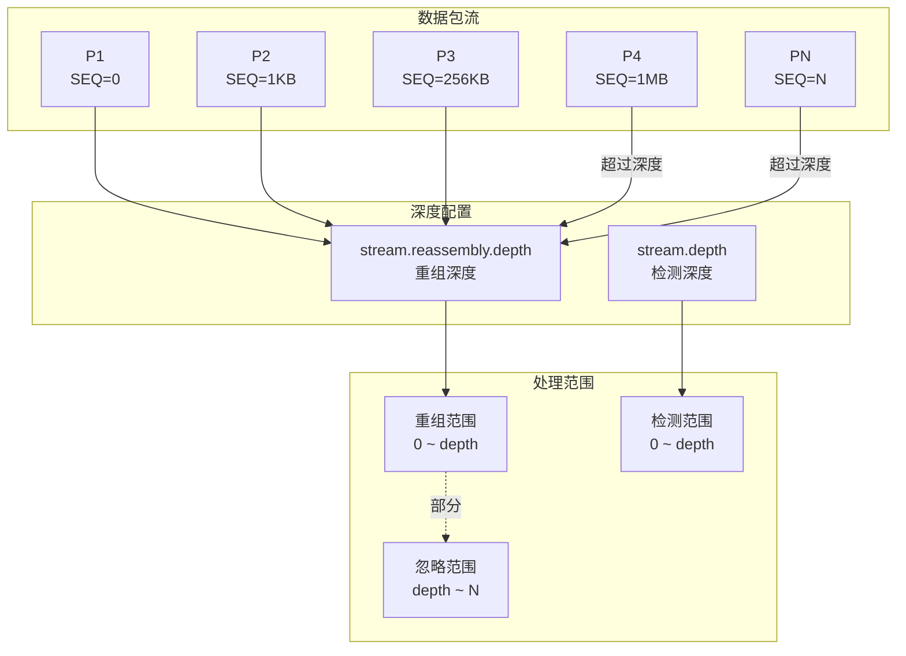
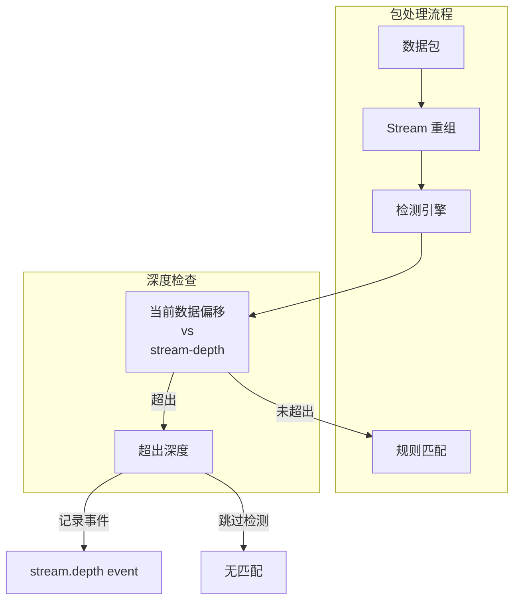
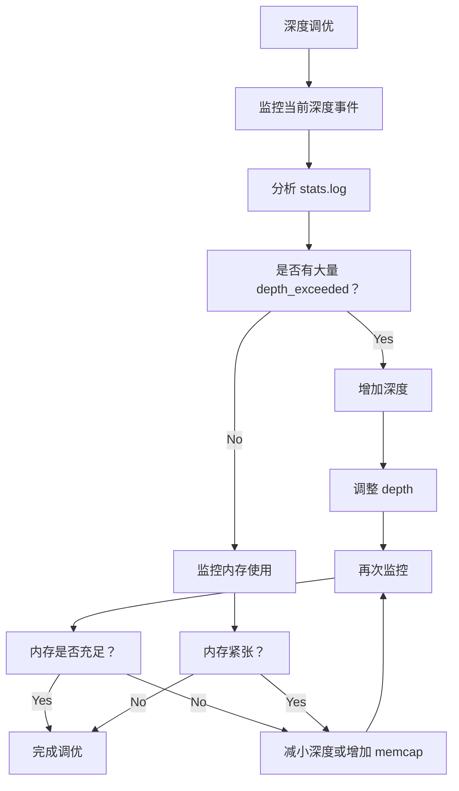

> [!info] Suricata 2026 深度探索系列 0. [[2026-04-15-suricata-deep-dive-series-index|全栈学习路径总览]]
>
> 1. [[2026-04-15-suricata-deep-dive-ch1-overview|第一章：Suricata 概述]]
> 2. [[2026-04-15-suricata-deep-dive-ch2-config|第二章：Suricata 配置系统]]
> 3. [[2026-04-15-suricata-deep-dive-ch3-runmodes|第三章：Runmodes 运行模式]]
> 4. [[2026-04-15-suricata-deep-dive-ch4-thread-model|第四章：线程模型]]
> 5. [[2026-04-15-suricata-deep-dive-ch5-capture|第五章：Capture 初始化]]
> 6. [[2026-04-15-suricata-deep-dive-ch6-af-packet|第六章：AF-PACKET 接口]]
> 7. [[2026-04-15-suricata-deep-dive-ch7-pcap|第七章：PCAP 接口]]
> 8. [[2026-04-15-suricata-deep-dive-ch8-nfq|第八章：NFQ 与 PF_RING 模式]]
> 9. [[2026-04-15-suricata-deep-dive-ch9-dpdk|第九章：DPDK 接口]]
> 10. [[2026-04-15-suricata-deep-dive-ch10-loadbalancing|第十章：多线程抓包与负载均衡]]
> 11. [[2026-04-15-suricata-deep-dive-ch11-detect-engine|第十一章：检测引擎架构]]
> 12. [[2026-04-15-suricata-deep-dive-ch12-signatures|第十二章：规则解析]]
> 13. [[2026-04-15-suricata-deep-dive-ch13-mpm|第十三章：多模式匹配]]
> 14. [[2026-04-15-suricata-deep-dive-ch14-filemagic|第十四章：文件识别]]
> 15. [[2026-04-15-suricata-deep-dive-ch15-lua-detect|第十五章：Lua 检测]]
> 16. [[2026-04-15-suricata-deep-dive-ch16-app-layer|第十六章：应用层协议解析]]
> 17. [[2026-04-15-suricata-deep-dive-ch17-http|第十七章：HTTP 协议解析]]
> 18. [[2026-04-15-suricata-deep-dive-ch18-dns|第十八章：DNS 协议解析]]
> 19. [[2026-04-15-suricata-deep-dive-ch19-tls|第十九章：TLS 协议解析]]
> 20. [[2026-04-15-suricata-deep-dive-ch20-smb|第二十章：SMB 协议解析]]
> 21. [[2026-04-15-suricata-deep-dive-ch21-http2|第二十一章：HTTP/2 协议解析]]
> 22. [[2026-04-15-suricata-deep-dive-ch22-flow|第二十二章：Flow 管理]]
> 23. [[2026-04-15-suricata-deep-dive-ch23-flow-timeout|第二十三章：Flow 超时]]
> 24. [[2026-04-15-suricata-deep-dive-ch24-flowbit|第二十四章：Flowbit 与 Flow 变量]]
> 25. [[2026-04-15-suricata-deep-dive-ch25-host|第二十五章：Host 管理]]
> 26. [[2026-04-15-suricata-deep-dive-ch26-stream|第二十六章：Stream 重组引擎]]
> 27. [[2026-04-15-suricata-deep-dive-ch27-stream-policy|第二十七章：TCP 重组策略]]
> 28. **第二十八章：Stream 深度配置**

---

## 1. 深度配置概述

Stream 深度配置（Depth Configuration）控制 Suricata 重组和检测 TCP 流的范围。合理的深度配置可以在有限的内存和 CPU 资源下最大化检测覆盖率。



### 1.1 两种深度的区别

| 配置项                    | 作用域   | 影响                       | 默认值        |
| :------------------------ | :------- | :------------------------- | :------------ |
| `stream.reassembly.depth` | 重组引擎 | 控制 Stream 缓冲区的数据量 | 1048576 (1MB) |
| `stream.depth`            | 检测引擎 | 控制应用层检测的深度       | 1048576 (1MB) |

### 1.2 为什么需要深度限制

```
原因 1：内存限制
├── 每个 Flow 的重组缓冲区消耗内存
├── 无限制的流可能导致内存耗尽
└── memcap 防止系统 OOM

原因 2：性能考虑
├── 超长流（如大文件下载）处理成本高
├── 检测引擎不需要完整文件内容
└── 早期检测到威胁即可

原因 3：实际需求
├── 大多数恶意流量在前几 KB
├── HTTP 请求/响应头通常 < 32KB
└── 深度配置覆盖关键区域
```

---

## 2. stream.reassembly.depth 配置

### 2.1 配置项详解

```yaml
# suricata.yaml
stream:
  reassembly:
    # 重组深度（字节数）
    # 控制每个方向的最大重组数据量
    depth: 1048576 # 1MB

    # 分方向深度（可选）
    toserver-depth: 1048576
    toclient-depth: 1048576

    # 内存限制
    memcap: 256mb

    # 队列初始长度
    initial-queuelen: 256
```

### 2.2 深度处理逻辑

```c
// src/stream-tcp.c — 深度检查
static int StreamReassemblyCheckDepth(TcpStream *stream, uint32_t seq)
{
    uint64_t abs_seq = STREAM_BASE_OFFSET(stream) + seq;
    uint64_t depth_limit = STREAM_REASSEMBLY_DEPTH(stream);

    /* 检查是否超过深度限制 */
    if (abs_seq > depth_limit) {
        /* 超过深度，丢弃或截断 */
        return -1;
    }

    return 0;
}

// src/stream-tcp.c — 插入数据时的深度处理
static int StreamReassemblyInsertData(TcpStream *stream,
                                       TcpSegment *seg,
                                       uint8_t *data,
                                       uint32_t data_len)
{
    uint64_t seg_end = (uint64_t)seg->seq + data_len;
    uint64_t depth = STREAM_REASSEMBLY_DEPTH(stream);

    if (seg_end > depth) {
        /* 超过深度，截断 */
        if (seg->seq >= depth) {
            /* 完全超出，丢弃 */
            return 0;
        }

        /* 部分超出，截断数据 */
        uint32_t allowed_len = (uint32_t)(depth - seg->seq);
        data_len = allowed_len;
    }

    /* 继续插入逻辑 */
    return StreamReassemblyInsertSegment(stream, seg, data, data_len);
}
```

---

## 3. stream.depth 配置

### 3.1 配置项详解

```yaml
# suricata.yaml
stream:
  # 检测深度
  # 控制应用层检测引擎处理的数据量
  depth: 1048576 # 1MB


  # 也可以在规则中使用
  # flow:established; stream-depth: 1024;
```

### 3.2 检测深度处理

```c
// src/detect-engine-stream.c — 检测深度处理
int DetectEngineInspectStream(ThreadVars *thv,
                              DetectEngineCtx *de_ctx,
                              DetectEngineThreadCtx *det_ctx,
                              Flow *f, TcpSession *ssn,
                              uint8_t *data, uint32_t data_len)
{
    /* 检查是否超过检测深度 */
    uint64_t current_offset = STREAM_APP_PROGRESS(&ssn->to_server);
    uint64_t depth = StreamDepthGetSize();

    if (current_offset + data_len > depth) {
        /* 超过深度，只检测到深度位置 */
        uint32_t allowed_len = (uint32_t)(depth - current_offset);

        if (allowed_len == 0) {
            /* 完全超过，跳过检测 */
            return 0;
        }

        data_len = allowed_len;
    }

    /* 执行检测 */
    return DetectEngineRunInspect(det_ctx, f, data, data_len);
}
```

---

## 4. 深度与内存管理

### 4.1 深度与 memcap 的关系

```
stream.reassembly.memcap = 256mb
stream.reassembly.depth = 1048576 (1MB)

最大同时追踪会话数 ≈ memcap / depth
                        ≈ 256mb / 1mb
                        ≈ 256 个并发大流
```

```c
// src/stream-tcp.h — 深度配置结构
typedef struct StreamReassemblyConfig_ {
    /* 内存上限 */
    uint64_t memcap;

    /* 重组深度 */
    uint32_t depth;
    uint32_t toserver_depth;
    uint32_t toclient_depth;

    /* 紧急模式阈值 */
    uint32_t emergency_memcap;

    /* 清理窗口 */
    uint32_t prune_window;

} StreamReassemblyConfig;
```

### 4.2 深度动态调整

```c
// src/stream-tcp.c — 紧急模式深度调整
static void StreamReassemblyEmergencyResize(void)
{
    if (stream_config.reassembly_memcap_emerg >= stream_config.reassembly_memcap) {
        return;
    }

    /* 紧急模式：缩小深度限制 */
    uint32_t new_depth = stream_config.reassembly_depth / 2;

    if (new_depth < 65536) {
        new_depth = 65536;  /* 最小 64KB */
    }

    stream_config.reassembly_depth = new_depth;

    SCLogWarning("Stream reassembly depth reduced to %u in emergency mode",
                  new_depth);
}
```

---

## 5. 深度配置场景分析

### 5.1 场景一：高带宽文件传输

```yaml
# suricata.yaml
# 适用于文件传输活跃的环境
stream:
  reassembly:
    depth: 2097152 # 2MB - 覆盖大多数文件传输
    memcap: 512mb

    # 分方向配置
    toserver-depth: 262144 # 256KB - 请求通常较小
    toclient-depth: 2097152 # 2MB - 响应可能很大
```

### 5.2 场景二：Web 服务检测

```yaml
# suricata.yaml
# 适用于 HTTP/HTTPS 检测为主的环境
stream:
  reassembly:
    depth: 32768 # 32KB - 覆盖大多数 HTTP 请求/响应头
    memcap: 256mb

    toserver-depth: 16384 # 16KB - HTTP 请求头
    toclient-depth: 32768 # 32KB - HTTP 响应头 + 部分 body
```

### 5.3 场景三：DNS 检测

```yaml
# suricata.yaml
# 适用于 DNS 服务器监控
stream:
  reassembly:
    depth: 4096 # 4KB - DNS 查询/响应通常很小
    memcap: 128mb

    # DNS 使用 UDP，但可能触发流重组（TCP DNS）
    toserver-depth: 4096
    toclient-depth: 4096
```

### 5.4 场景四：低内存环境

```yaml
# suricata.yaml
# 适用于资源受限环境
stream:
  reassembly:
    depth: 262144 # 256KB
    memcap: 128mb

    # 紧急模式进一步缩小
    emergency-depth: 65536 # 64KB
```

---

## 6. 深度配置与规则匹配

### 6.1 stream-depth 关键字

在规则中使用 `stream-depth` 关键字设置特定规则的检测深度：

```yaml
# suricata.yaml
# 规则示例
alert http any any -> any any (msg:"Large HTTP POST"; \
http.request_body; stream-depth:1024; pcre:"/^.{1000,}$/"; \
sid:1000001; rev:1;)
```

### 6.2 深度与规则匹配流程



---

## 7. 深度相关事件与统计

### 7.1 计数器

| 计数器                                 | 说明                 |
| :------------------------------------- | :------------------- |
| `stream.tcp.reassembly_depth_greater`  | 超过重组深度的数据包 |
| `stream.tcp.reassembly_depth_exceeded` | 完全超出深度的数据包 |
| `stream.tcp.reassembly_memcap_enter`   | 进入内存紧急模式     |

### 7.2 事件类型

```c
// src/stream-tcp.h — 深度相关事件
#define STREAM_TCP_REASSEMBLY_DEPTH_EXCEEDED      0x01
#define STREAM_TCP_REASSEMBLY_DEPTH_GREATER       0x02
#define STREAM_TCP_REASSEMBLY_MEMCAP_EXCEEDED     0x03
```

### 7.3 查看统计

```bash
# 查看 Stream 重组统计
suricata -c /etc/suricata/suricata.yaml --stats | grep -i stream

# 输出示例
stream.tcp.ssn_memcap_enter            | 0
stream.tcp.pkt_memcap_enter            | 0
stream.tcp.reassembly_memcap_enter     | 0
stream.tcp.reassembly_depth_exceeded   | 12
```

---

## 8. 深度调优最佳实践

### 8.1 保守配置（高安全性）

```yaml
stream:
  reassembly:
    depth: 10485760 # 10MB - 覆盖绝大多数场景
    memcap: 512mb
    emergency-depth: 1048576 # 1MB
```

### 8.2 平衡配置（推荐）

```yaml
stream:
  reassembly:
    depth: 1048576 # 1MB - 平衡覆盖和性能
    memcap: 256mb
    emergency-depth: 262144 # 256KB
```

### 8.3 激进配置（高性能）

```yaml
stream:
  reassembly:
    depth: 262144 # 256KB - 关注早期威胁
    memcap: 128mb
    emergency-depth: 65536 # 64KB
```

### 8.4 调优步骤



---

## 9. 常见问题

### 9.1 深度太小导致漏检

**症状**：某些攻击未被检测到

**原因**：攻击载荷在流的后半部分

**解决**：

```yaml
# 增加重组深度
stream:
  reassembly:
    depth: 2097152 # 2MB
```

### 9.2 深度太大导致内存耗尽

**症状**：Suricata OOM 或被 killed

**原因**：同时处理大量大流

**解决**：

```yaml
# 减小深度并增加 memcap
stream:
  reassembly:
    depth: 262144 # 256KB
    memcap: 512mb # 更大内存限制
```

### 9.3 深度与 memcap 不匹配

**症状**：频繁进入紧急模式

**原因**：深度太大或 memcap 太小

**解决**：

```
建议比例：memcap / depth >= 100
示例：256mb / 1mb = 256 个并发流
```

---

## 10. 小结

本章深入分析了 Suricata 的 Stream 深度配置：

1. **stream.reassembly.depth**：控制重组缓冲区的数据量上限
2. **stream.depth**：控制检测引擎处理的数据量上限
3. **深度与内存关系**：合理的深度/memcap 比例确保系统稳定性
4. **分方向配置**：可根据流量特征分别设置 toserver/toclient 深度
5. **紧急模式**：内存不足时自动调整深度，保证系统存活

深度配置是 Suricata 性能调优的重要环节，需要根据实际网络环境、检测需求和硬件资源进行权衡。
