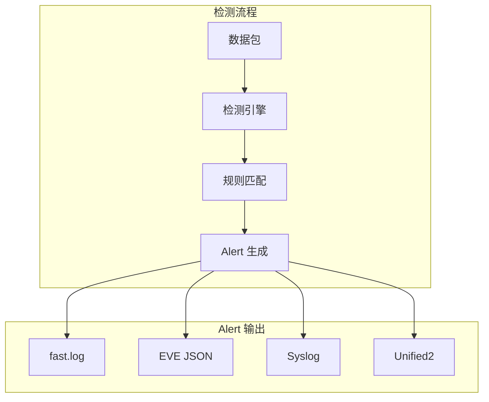

> [!info] Suricata 2026 深度探索系列
> 0. [[2026-04-15-suricata-deep-dive-series-index|全栈学习路径总览]]
> 1. [[2026-04-15-suricata-deep-dive-ch1-overview|第一章：Suricata 概述]]
> 2. [[2026-04-15-suricata-deep-dive-ch2-config|第二章：Suricata 配置系统]]
> 3. [[2026-04-15-suricata-deep-dive-ch3-runmodes|第三章：Runmodes 运行模式]]
> 4. [[2026-04-15-suricata-deep-dive-ch4-thread-model|第四章：线程模型]]
> 5. [[2026-04-15-suricata-deep-dive-ch5-capture|第五章：Capture 初始化]]
> 6. [[2026-04-15-suricata-deep-dive-ch6-af-packet|第六章：AF-PACKET 接口]]
> 7. [[2026-04-15-suricata-deep-dive-ch7-pcap|第七章：PCAP 接口]]
> 8. [[2026-04-15-suricata-deep-dive-ch8-nfq|第八章：NFQ 与 PF_RING 模式]]
> 9. [[2026-04-15-suricata-deep-dive-ch9-dpdk|第九章：DPDK 接口]]
> 10. [[2026-04-15-suricata-deep-dive-ch10-loadbalancing|第十章：多线程抓包与负载均衡]]
> 11. [[2026-04-15-suricata-deep-dive-ch11-detect-engine|第十一章：检测引擎架构]]
> 12. [[2026-04-15-suricata-deep-dive-ch12-signatures|第十二章：规则解析]]
> 13. [[2026-04-15-suricata-deep-dive-ch13-mpm|第十三章：多模式匹配]]
> 14. [[2026-04-15-suricata-deep-dive-ch14-filemagic|第十四章：文件识别]]
> 15. [[2026-04-15-suricata-deep-dive-ch15-lua-detect|第十五章：Lua 检测]]
> 16. [[2026-04-15-suricata-deep-dive-ch16-app-layer|第十六章：应用层协议解析]]
> 17. [[2026-04-15-suricata-deep-dive-ch17-http|第十七章：HTTP 协议解析]]
> 18. [[2026-04-15-suricata-deep-dive-ch18-dns|第十八章：DNS 协议解析]]
> 19. [[2026-04-15-suricata-deep-dive-ch19-tls|第十九章：TLS 协议解析]]
> 20. [[2026-04-15-suricata-deep-dive-ch20-smb|第二十章：SMB 协议解析]]
> 21. [[2026-04-15-suricata-deep-dive-ch21-http2|第二十一章：HTTP/2 协议解析]]
> 22. [[2026-04-15-suricata-deep-dive-ch22-flow|第二十二章：Flow 管理]]
> 23. [[2026-04-15-suricata-deep-dive-ch23-flow-timeout|第二十三章：Flow 超时]]
> 24. [[2026-04-15-suricata-deep-dive-ch24-flowbit|第二十四章：Flowbit 与 Flow 变量]]
> 25. [[2026-04-15-suricata-deep-dive-ch25-host|第二十五章：Host 管理]]
> 26. [[2026-04-15-suricata-deep-dive-ch26-stream|第二十六章：Stream 重组引擎]]
> 27. [[2026-04-15-suricata-deep-dive-ch27-stream-policy|第二十七章：TCP 重组策略]]
> 28. [[2026-04-15-suricata-deep-dive-ch28-stream-depth|第二十八章：Stream 深度配置]]
> 29. [[2026-04-15-suricata-deep-dive-ch29-eve|第二十九章：EVE JSON 输出]]
> 30. **第三十章：Alerts 输出**
> 31. [[2026-04-15-suricata-deep-dive-ch31-stats|第三十一章：Stats 统计]]
> 32. [[2026-04-15-suricata-deep-dive-ch32-file-log|第三十二章：File Log]]
> 33. [[2026-04-15-suricata-deep-dive-ch33-unified2|第三十三章：Unified2]]

---

## 1. Alert 系统概述

Alert 是 Suricata 检测引擎发现威胁后产生的事件。Alert 输出系统负责将这些事件以不同格式发送到不同目的地。



### 1.1 Alert 输出类型

```
Alert 输出类型
├── fast.log      # 简单文本格式，快速日志
├── EVE JSON      # JSON 格式，包含完整信息
├── Syslog        # 系统日志协议
├── Unified2      # 二进制格式，兼容 Snort
└── File          # 普通文件
```

---

## 2. Alert 配置详解

### 2.1 基础配置

```yaml
# suricata.yaml
outputs:
  - alert-fast:
      enabled: yes
      filename: fast.log
      
  - alert-syslog:
      enabled: yes
      facility: local3
      level: notice
      
  - unified2:
      enabled: yes
      filename: unified2.log
```

### 2.2 Alert-fast 详细配置

```yaml
# suricata.yaml
outputs:
  - alert-fast:
      enabled: yes
      
      # 输出文件名
      filename: fast.log
      
      # 是否包含数据包内容
      include-packet-data: no
      
      # 扩展格式（包含标签）
      xff:
        enabled: yes
        mode: extra-data
        header-name: X-Forwarded-For
        
      # 触发 alert 后打印的包数
      packets: 1
```

### 2.3 Alert-syslog 配置

```yaml
# suricata.yaml
outputs:
  - alert-syslog:
      enabled: yes
      
      # Syslog 设施
      facility: local3
      
      # 日志级别
      level: info
      
      # 包含 metadata
      metadata: yes
      
      # 格式
      format: "[%i] %s:%d %s [%d:%s] %s"
```

---

## 3. Alert 生成机制

### 3.1 Alert 结构体

```c
// src/detect.h — Alert 结构体
typedef struct Alert_ {
    uint32_t signature_id;     // 规则 ID
    uint32_t rev;              // 规则版本
    uint32_t gid;              // 规则组 ID
    
    char *signature;           // 规则内容
    char *category;            // 规则分类
    uint8_t severity;          // 严重级别
    
    /* 匹配信息 */
    uint8_t action;            // alert/pass/drop/log
    
    /* 源和目标信息 */
    Address src;               // 源地址
    Port sp;                   // 源端口
    Address dst;               // 目标地址
    Port dp;                   // 目标端口
    
    /* 协议信息 */
    uint8_t proto;             // 协议
    
    /* Packet 数据 */
    uint8_t *pkt_data;         // 数据包原始数据
    uint32_t pkt_len;           // 数据包长度
    
} Alert;
```

### 3.2 Alert 产生流程

```c
// src/detect-engine.c — Alert 产生
int DetectRun(ThreadVars *tv, DetectEngineCtx *de_ctx,
              DetectEngineThreadCtx *det_ctx, Packet *p)
{
    /* 规则匹配 */
    int match = DetectEngineInspectPacket(de_ctx, det_ctx, p);
    
    if (match > 0) {
        /* 找到匹配的规则 */
        Signature *s = de_ctx->sig_arr[match];
        
        /* 创建 Alert */
        Alert *alert = SCCalloc(1, sizeof(Alert));
        if (alert == NULL) {
            return -1;
        }
        
        /* 填充 Alert 信息 */
        alert->signature_id = s->id;
        alert->rev = s->rev;
        alert->gid = s->gid;
        alert->signature = SCStrdup(s->sig_str);
        alert->category = SCStrdup(s->class_msg);
        alert->severity = s->prio;
        alert->action = s->action;
        
        /* 复制地址信息 */
        COPY_ADDRESS(&p->src, &alert->src);
        alert->sp = p->sp;
        COPY_ADDRESS(&p->dst, &alert->dst);
        alert->dp = p->dp;
        alert->proto = IP_GET_IPPROTO(p);
        
        /* 添加到 Packet 的 Alert 列表 */
        PacketAddAlert(p, alert);
        
        /* 触发输出 */
        OutputAlert(tv, p, alert);
    }
    
    return 0;
}
```

### 3.3 Alert 阈值过滤

```c
// src/detect-threshold.c — 阈值检测
int DetectThresholdCheck(Packet *p, Signature *s,
                         DetectThresholdData *td)
{
    /* 获取 Flow */
    Flow *f = p->flow;
    
    /* 查找已有的检测记录 */
    thresholds *th = FlowGetThreshold(f, s->id);
    
    if (th == NULL) {
        /* 首次匹配，创建新阈值记录 */
        th = CreateThreshold(s->id, td->count, td->seconds);
        FlowSetThreshold(f, s->id, th);
        
        /* 检查是否需要 alert */
        if (td->count == 1) {
            return 1;  /* 立即 alert */
        }
        return 0;
    }
    
    /* 更新时间戳 */
    uint64_t now = p->ts.tv_sec;
    
    /* 检查时间窗口 */
    if (now - th->first_ts > td->seconds) {
        /* 窗口过期，重置 */
        th->cnt = 1;
        th->first_ts = now;
        return 1;
    }
    
    /* 增加计数 */
    th->cnt++;
    
    /* 检查是否达到阈值 */
    if (th->cnt >= td->count) {
        /* 达到阈值，reset 并 alert */
        th->cnt = 0;
        return 1;
    }
    
    return 0;
}
```

---

## 4. fast.log 输出

### 4.1 fast.log 格式

```
04/15/2026-10:23:45.123456 192.168.1.100:54321 -> 93.184.216.34:443 TCP AET SURICATA TCPv4 TCP SYN
04/15/2026-10:23:46.123456 192.168.1.100:54322 -> 93.184.216.34:443 TCP AET SURICATA TCPv4 TCP SYN
```

### 4.2 fast.log 源码实现

```c
// src/output-alert-fast.c — fast.log 输出
static int AlertFastWrite(ThreadVars *tv, void *data, Packet *p)
{
    OutputLogContext *ctx = (OutputLogContext *)data;
    
    /* 遍历所有 Alert */
    for (int i = 0; i < p->alerts.alert_cnt; i++) {
        Alert *alert = &p->alerts.alerts[i];
        
        /* 格式化输出 */
        char timestamp[64];
        CreateUtcIsoTimeStamp(p->ts, timestamp, sizeof(timestamp));
        
        char srcip[46], dstip[46];
        PrintInet(AF_INET, &alert->src, srcip, sizeof(srcip));
        PrintInet(AF_INET, &alert->dst, dstip, sizeof(dstip));
        
        /* 写入 fast.log */
        fprintf(ctx->fp,
            "%s %s:%d -> %s:%d %s %s [%d:%s] %s\n",
            timestamp,
            srcip, alert->sp,
            dstip, alert->dp,
            "TCP",
            "SURICATA",
            alert->signature_id,
            alert->signature,
            alert->category);
        
        /* 写入原始数据包（可选） */
        if (ctx->include_packet_data && p->pkt) {
            WritePacketData(ctx->fp, p);
        }
    }
    
    /* 刷新缓冲区 */
    fflush(ctx->fp);
    
    return 0;
}
```

---

## 5. Syslog Alert 输出

### 5.1 Syslog 格式

```
Apr 15 10:23:45 hostname suricata[1234]: [1:1000001:1] ET EXPLOIT Kali Linux HTTP Request {TCP} 192.168.1.100:54321 -> 93.184.216.34:443
```

### 5.2 Syslog 源码实现

```c
// src/output-alert-syslog.c — Syslog 输出
static int AlertSyslogWrite(ThreadVars *tv, void *data, Packet *p)
{
    OutputSyslogContext *ctx = (OutputSyslogContext *)data;
    
    /* 遍历所有 Alert */
    for (int i = 0; i < p->alerts.alert_cnt; i++) {
        Alert *alert = &p->alerts.alerts[i];
        
        /* 格式化消息 */
        char msg[2048];
        snprintf(msg, sizeof(msg),
            "[%d:%u:%u] %s {%s} %s:%d -> %s:%d",
            alert->gid,
            alert->signature_id,
            alert->rev,
            alert->signature,
            "TCP",
            inet_ntoa(alert->src),
            alert->sp,
            inet_ntoa(alert->dst),
            alert->dp);
        
        /* 发送到 Syslog */
        if (ctx->facility == LOG_FAC_LOCAL3) {
            openlog("suricata", LOG_PID, LOG_LOCAL3);
        }
        
        syslog(LOG_INFO, "%s", msg);
        
        if (ctx->facility == LOG_FAC_LOCAL3) {
            closelog();
        }
    }
    
    return 0;
}
```

---

## 6. Alert 与 Verdict

### 6.1 Verdict 类型

```c
// src/declare.h — Verdict 定义
enum {
    VERDICT_PASS,      // 放行
    VERDICT_DROP,      // 丢弃（需要 IPS 模式）
    VERDICT_REJECT,    // 拒绝（发送 RST/ICMP）
    VERDICT_REJECT_DST,
    VERDICT_REJECT_SRC,
    VERDICT_ALERT,     // 告警（仅记录）
};
```

### 6.2 Verdict 设置流程

```c
// src/reputation.c — Verdict 决策
int VerdictSet(Packet *p, int verdict)
{
    /* 在 NFQ/IPS 模式下设置 verdict */
    if (EngineModeIsIPS()) {
        p->nfq_verdict = verdict;
        
        /* 记录 verdict 统计 */
        StatsIncr(cnt_verdict[verdict]);
    }
    
    /* 设置 Packet 的 verdict 标记 */
    p->verdict = verdict;
    
    return 0;
}
```

---

## 7. Alert 过滤与分级

### 7.1 全局 Alert 配置

```yaml
# suricata.yaml
outputs:
  - alert-fast:
      enabled: yes
      
      # 每秒最大 alert 数
      alerts-limit: 1000
      
      # 重复 alert 合并
      duplicate-alerts: yes
      
  - alert-syslog:
      enabled: yes
      
      # 按级别过滤
      severity-filter:
        min: 1
        max: 10
```

### 7.2 Alert 分级显示

```yaml
# suricata.yaml
outputs:
  - alert-fast:
      enabled: yes
      
      # 级别标签
      alert:
        - critical:
            prefix: "[CRITICAL] "
            color: red
        - major:
            prefix: "[MAJOR] "
            color: yellow
        - minor:
            prefix: "[MINOR] "
            color: blue
```

---

## 8. Alert 性能考虑

### 8.1 Alert 限流

```yaml
# suricata.yaml
outputs:
  - alert-fast:
      enabled: yes
      
      # 全局限流
      rate:
        max-alerts-per-second: 1000
        max-debug-alerts: 100
```

### 8.2 Alert 统计计数器

```c
// src/output.h — Alert 统计
typedef struct OutputAlertStats_ {
    uint64_t alerts_total;        // 总 Alert 数
    uint64_t alerts_suppressed;   // 被抑制的 Alert
    uint64_t alerts_filtered;     // 被过滤的 Alert
    uint64_t alerts_rate_limited; // 被限流的 Alert
} OutputAlertStats;
```

### 8.3 查看 Alert 统计

```bash
# 查看 Alert 统计
suricata -c /etc/suricata/suricata.yaml --stats | grep -i alert

# 输出示例
alert                           | 1523
alert-fast                      | 1523
alert-json                       | 0
alert-syslog                     | 0
```

---

## 9. Alert 输出集成

### 9.1 与 OSSEC 集成

```yaml
# suricata.yaml
outputs:
  - alert-syslog:
      enabled: yes
      facility: local3
      level: notice
```

### 9.2 与 Splunk 集成

```yaml
# suricata.yaml
outputs:
  - alert-syslog:
      enabled: yes
      facility: local3
      level: info
```

### 9.3 与 Elastic SIEM 集成

```yaml
# suricata.yaml
outputs:
  - eve-log:
      enabled: yes
      filetype: file
      filename: eve.json
      
  - alert-fast:
      enabled: yes
      filename: /var/log/suricata/alerts.fast
```

---

## 10. 常见问题

### 10.1 Alert 丢失

**检查**：
- 确认 alert 输出已启用
- 检查磁盘空间是否充足
- 查看是否有 rate limit 触发

### 10.2 fast.log 为空

**解决**：
```yaml
outputs:
  - alert-fast:
      enabled: yes
      filename: /var/log/suricata/fast.log
```

### 10.3 Alert 重复

**解决**：
```yaml
outputs:
  - alert-fast:
      enabled: yes
      duplicate-alerts: no
```
