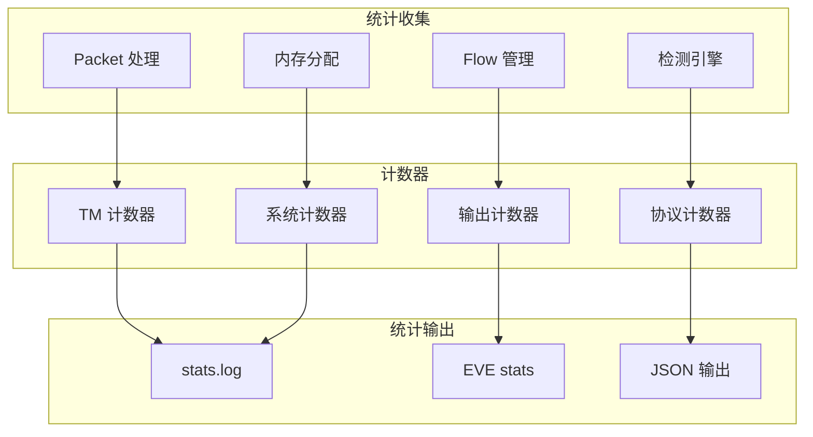

> [!info] Suricata 2026 深度探索系列 0. [[2026-04-15-suricata-deep-dive-series-index|全栈学习路径总览]]
>
> 1. [[2026-04-15-suricata-deep-dive-ch1-overview|第一章：Suricata 概述]]
> 2. [[2026-04-15-suricata-deep-dive-ch2-config|第二章：Suricata 配置系统]]
> 3. [[2026-04-15-suricata-deep-dive-ch3-runmodes|第三章：Runmodes 运行模式]]
> 4. [[2026-04-15-suricata-deep-dive-ch4-thread-model|第四章：线程模型]]
> 5. [[2026-04-15-suricata-deep-dive-ch5-capture|第五章：Capture 初始化]]
> 6. [[2026-04-15-suricata-deep-dive-ch6-af-packet|第六章：AF-PACKET 接口]]
> 7. [[2026-04-15-suricata-deep-dive-ch7-pcap|第七章：PCAP 接口]]
> 8. [[2026-04-15-suricata-deep-dive-ch8-nfq|第八章：NFQ 与 PF_RING 模式]]
> 9. [[2026-04-15-suricata-deep-dive-ch9-dpdk|第九章：DPDK 接口]]
> 10. [[2026-04-15-suricata-deep-dive-ch10-loadbalancing|第十章：多线程抓包与负载均衡]]
> 11. [[2026-04-15-suricata-deep-dive-ch11-detect-engine|第十一章：检测引擎架构]]
> 12. [[2026-04-15-suricata-deep-dive-ch12-signatures|第十二章：规则解析]]
> 13. [[2026-04-15-suricata-deep-dive-ch13-mpm|第十三章：多模式匹配]]
> 14. [[2026-04-15-suricata-deep-dive-ch14-filemagic|第十四章：文件识别]]
> 15. [[2026-04-15-suricata-deep-dive-ch15-lua-detect|第十五章：Lua 检测]]
> 16. [[2026-04-15-suricata-deep-dive-ch16-app-layer|第十六章：应用层协议解析]]
> 17. [[2026-04-15-suricata-deep-dive-ch17-http|第十七章：HTTP 协议解析]]
> 18. [[2026-04-15-suricata-deep-dive-ch18-dns|第十八章：DNS 协议解析]]
> 19. [[2026-04-15-suricata-deep-dive-ch19-tls|第十九章：TLS 协议解析]]
> 20. [[2026-04-15-suricata-deep-dive-ch20-smb|第二十章：SMB 协议解析]]
> 21. [[2026-04-15-suricata-deep-dive-ch21-http2|第二十一章：HTTP/2 协议解析]]
> 22. [[2026-04-15-suricata-deep-dive-ch22-flow|第二十二章：Flow 管理]]
> 23. [[2026-04-15-suricata-deep-dive-ch23-flow-timeout|第二十三章：Flow 超时]]
> 24. [[2026-04-15-suricata-deep-dive-ch24-flowbit|第二十四章：Flowbit 与 Flow 变量]]
> 25. [[2026-04-15-suricata-deep-dive-ch25-host|第二十五章：Host 管理]]
> 26. [[2026-04-15-suricata-deep-dive-ch26-stream|第二十六章：Stream 重组引擎]]
> 27. [[2026-04-15-suricata-deep-dive-ch27-stream-policy|第二十七章：TCP 重组策略]]
> 28. [[2026-04-15-suricata-deep-dive-ch28-stream-depth|第二十八章：Stream 深度配置]]
> 29. [[2026-04-15-suricata-deep-dive-ch29-eve|第二十九章：EVE JSON 输出]]
> 30. [[2026-04-15-suricata-deep-dive-ch30-alerts|第三十章：Alerts 输出]]
> 31. **第三十一章：Stats 统计**
> 32. [[2026-04-15-suricata-deep-dive-ch32-file-log|第三十二章：File Log]]
> 33. [[2026-04-15-suricata-deep-dive-ch33-unified2|第三十三章：Unified2]]

---

## 1. Stats 系统概述

Suricata 的 Stats 系统收集和输出各种运行时统计数据，包括包处理、流量统计、检测结果、内存使用等。



---

## 2. Stats 配置详解

### 2.1 基础配置

```yaml
# suricata.yaml
outputs:
  - stats:
      enabled: yes

      # 输出文件
      filename: stats.log

      # 输出间隔（秒）
      interval: 8

      # 是否包含所有计数器的起始值
      start-offset: no

      # 格式
      format: regular # regular/json/csv
```

### 2.2 详细配置

```yaml
# suricata.yaml
outputs:
  - stats:
      enabled: yes

      # 输出间隔
      interval: 8

      # 格式配置
      format:
        regular:
          # 是否显示线程统计
          threads: yes

          # 是否显示.null 统计
          null-logs: no

        json:
          # JSON 格式配置
          pretty: no

        csv:
          # CSV 分隔符
          delimiter: ","
```

### 2.3 EVE 中的 Stats

```yaml
# suricata.yaml
outputs:
  - eve-log:
      enabled: yes

      types:
        - stats:
            # stats 输出的间隔
            interval: 8

            # 包含的统计
            threads: yes
            engine: yes
```

---

## 3. stats.log 格式

### 3.1 regular 格式

```
-------------------------------------------------------------------
Date: 4/15/2026 -- 10:23:45
-------------------------------------------------------------------
Counter                       | TM Name       | Value
-------------------------------------------------------------------
capture.kernel_packets        | RP01          | 12345678
capture.kernel_drops          | RP01          | 1234
capture.kernel_ifdrops        | RP01          | 0
flow.tcp                      | FlowManager01 | 5678
flow.udp                      | FlowManager01 | 1234
tcp.pkt_on_syn                | Detect01      | 100
tcp.pkt_on_syn_ack            | Detect01      | 50
decode.tcp                    | Decode01      | 10000000
decode.udp                    | Decode01      | 5000000
detect.alert                  | Detect01      | 1523
-------------------------------------------------------------------
```

### 3.2 JSON 格式

```json
{
  "timestamp": "2026-04-15T10:23:45.123456Z",
  "event_type": "stats",
  "stats": {
    "capture": {
      "kernel_packets": 12345678,
      "kernel_drops": 1234,
      "kernel_ifdrops": 0
    },
    "flow": {
      "tcp": 5678,
      "udp": 1234,
      "icmp": 100
    },
    "detect": {
      "alert": 1523,
      "match": 1523
    },
    "tcp": {
      "pkt_on_syn": 100,
      "pkt_on_syn_ack": 50
    },
    "decoder": {
      "tcp": 10000000,
      "udp": 5000000
    }
  }
}
```

---

## 4. 统计计数器架构

### 4.1 计数器结构

```c
// src/tm-threads.h — 计数器结构
typedef struct StatsCounter_ {
    /* 计数器名称 */
    const char *name;

    /* 所属线程 */
    ThreadId tid;

    /* 计数器类型 */
    uint8_t type;  // STATS_TYPE_UINT64, STATS_TYPE_DOUBLE

    /* 当前值 */
    union {
        uint64_t uint64;
        double double;
    } value;

    /* 全局 ID */
    uint16_t id;

    /* 下一个计数器 */
    struct StatsCounter_ *next;
} StatsCounter;

/* 线程级统计上下文 */
typedef struct StatsThreadContext_ {
    /* 线程本地计数器 */
    StatsCounter *counters;

    /* 计数器数量 */
    uint16_t counter_cnt;

    /* 上次输出的值（用于差值计算） */
    uint64_t *prev_values;
} StatsThreadContext;
```

### 4.2 全局统计结构

```c
// src/runmodes.h — 全局统计
typedef struct StatsGlobalContext_ {
    /* 全局计数器表 */
    StatsCounter **counter_table;

    /* 计数器数量 */
    uint32_t counter_cnt;

    /* 锁 */
    SCMutex lock;

    /* 统计输出状态 */
    time_t last_output;

    /* 初始化标志 */
    int initialized;
} StatsGlobalContext;
```

### 4.3 计数器注册

```c
// src/util-thresh-config.c — 注册计数器
StatsCounter *StatsRegisterCounter(const char *name,
                                    ThreadVars *tv)
{
    /* 创建计数器 */
    StatsCounter *counter = SCCalloc(1, sizeof(StatsCounter));
    if (counter == NULL) {
        return NULL;
    }

    counter->name = SCStrdup(name);
    counter->tid = tv->tid;
    counter->type = STATS_TYPE_UINT64;
    counter->value.uint64 = 0;
    counter->id = tv->nc_counters++;

    /* 添加到线程上下文 */
    counter->next = tv->ctx->counters;
    tv->ctx->counters = counter;

    /* 添加到全局表 */
    SCMutexLock(&stats_ctx.lock);
    counter_table[counter->id] = counter;
    SCMutexUnlock(&stats_ctx.lock);

    return counter;
}

/* 宏定义方便使用 */
#define StatsIncr(counter) do { \
    (counter)->value.uint64++; \
} while(0)

#define StatsAdd(counter, val) do { \
    (counter)->value.uint64 += (val); \
} while(0)
```

---

## 5. 统计收集流程

### 5.1 初始化

```c
// src/tm-threads.c — 统计系统初始化
int StatsInit(void)
{
    /* 初始化全局上下文 */
    stats_ctx.counter_table = SCCalloc(65536, sizeof(StatsCounter *));
    if (stats_ctx.counter_table == NULL) {
        return -1;
    }

    SCMutexInit(&stats_ctx.lock, NULL);
    stats_ctx.initialized = 1;

    /* 注册全局计数器 */
    RegisterGlobalCounters();

    return 0;
}
```

### 5.2 收集流程

```c
// src/output-stats.c — 统计收集
static int StatsCollect(ThreadVars *tv, void *data)
{
    OutputStatsContext *ctx = (OutputStatsContext *)data;

    /* 创建 JSON 对象 */
    Json派roto *js = Json派rotoNew();

    /* 获取当前时间戳 */
    char timestamp[64];
    CreateUtcIsoTimeStamp(ctx->timestamp, timestamp, sizeof(timestamp));
    Json派rotoSetString(js, "timestamp", timestamp);
    Json派rotoSetString(js, "event_type", "stats");

    /* 收集各模块统计 */
    Json派roto *stats = Json派rotoNew();

    /* 收集 Capture 统计 */
    CaptureStatsCapture(stats);

    /* 收集 Decode 统计 */
    DecodeStatsCollect(stats);

    /* 收集 Detect 统计 */
    DetectStatsCollect(stats);

    /* 收集 Flow 统计 */
    FlowStatsCollect(stats);

    /* 收集 Stream 统计 */
    StreamStatsCollect(stats);

    Json派rotoSetObject(js, "stats", stats);

    /* 输出 */
    OutputStatsWrite(ctx, js);

    Json派rotoFree(js);
    return 0;
}
```

### 5.3 定时输出

```c
// src/output-stats.c — 定时输出
static TmEcode StatsOutputLoop(ThreadVars *tv, void *data)
{
    OutputStatsContext *ctx = (OutputStatsContext *)data;

    while (!EngineStopping()) {
        /* 等待下一个输出周期 */
        StatsCondWait(ctx->cond, ctx->interval);

        /* 收集并输出统计 */
        StatsCollect(tv, ctx);
    }

    return TM_ECODE_OK;
}
```

---

## 6. 关键统计计数器

### 6.1 Capture 统计

|                          | 计数器         | 说明         |
| :----------------------- | :------------- | :----------- |
| `capture.kernel_packets` | 网卡接收的包数 | 反映流量速率 |
| `capture.kernel_drops`   | 内核丢包数     | 反映捕获性能 |
| `capture.kernel_ifdrops` | 网卡驱动丢包   | 反映网卡性能 |
| `capture.errors`         | 捕获错误数     | 检查配置问题 |

### 6.2 Decode 统计

|                  | 计数器       | 说明          |
| :--------------- | :----------- | :------------ |
| `decoder.tcp`    | TCP 包数     | TCP 流量占比  |
| `decoder.udp`    | UDP 包数     | UDP 流量占比  |
| `decoder.icmpv4` | ICMPv4 包数  | 网络诊断      |
| `decoder.icmpv6` | ICMPv6 包数  | IPv6 网络诊断 |
| `decoder.raw`    | Raw IP 包数  | 分片包        |
| `decoder.null`   | Null 协议包  | 异常包        |
| `decoder.sll`    | Linux Cooked | 伪头部        |

### 6.3 Detect 统计

|                          | 计数器          | 说明       |
| :----------------------- | :-------------- | :--------- |
| `detect.alert`           | 产生的 Alert 数 | 检测有效性 |
| `detect.match`           | 匹配的规则数    | 规则命中率 |
| `detect.no_match`        | 未匹配的检测    | 检测覆盖率 |
| `detect.engine_avg_tick` | 平均检测时间    | 性能指标   |
| `detect.engine_load`     | 检测引擎负载    | 资源使用   |

### 6.4 Flow 统计

|                           | 计数器         | 说明     |
| :------------------------ | :------------- | :------- |
| `flow.tcp`                | TCP Flow 数    | 连接状态 |
| `flow.udp`                | UDP Flow 数    | 会话状态 |
| `flow.icmpv4`             | ICMPv4 Flow 数 | 网络诊断 |
| `flow.emerg_mode_entered` | 进入紧急模式   | 内存压力 |
| `flow.memcap_enter`       | memcap 触发    | 内存配置 |

### 6.5 Stream 统计

|                                        | 计数器       | 说明        |
| :------------------------------------- | :----------- | :---------- |
| `stream.tcp.ssn_memcap_enter`          | 会话内存上限 | Stream 内存 |
| `stream.tcp.reassembly_memcap_enter`   | 重组内存上限 | 重组内存    |
| `stream.tcp.reassembly_depth_exceeded` | 超过重组深度 | 深度配置    |
| `stream.tcp.pkt_resent`                | 重传的包     | 网络质量    |
| `stream.tcp.pkt_ooo`                   | 乱序包       | 网络质量    |

### 6.6 AppLayer 统计

|                        | 计数器        | 说明       |
| :--------------------- | :------------ | :--------- |
| `app_layer.flow.http`  | HTTP Flow 数  | HTTP 流量  |
| `app_layer.flow.tls`   | TLS Flow 数   | HTTPS 流量 |
| `app_layer.flow.dns`   | DNS Flow 数   | DNS 流量   |
| `app_layer.flow.smb`   | SMB Flow 数   | 文件共享   |
| `app_layer.error.http` | HTTP 解析错误 | 协议问题   |
| `app_layer.error.tls`  | TLS 解析错误  | 证书问题   |

---

## 7. 线程级统计

### 7.1 线程统计格式

```
-------------------------------------------------------------------
Date: 4/15/2026 -- 10:23:45
-------------------------------------------------------------------
Thread Name           | Status     | Avg Time   | Max Time   | Srtt
-------------------------------------------------------------------
RX01-eth0             | online     | 0.000023   | 0.000123   | 0.000002
RX02-eth0             | online     | 0.000021   | 0.000098   | 0.000002
Detect01              | online     | 0.000015   | 0.000200   | -
FlowManager01         | online     | 0.000100   | 0.001000   | -
Stats01               | online     | 0.000001   | 0.000010   | -
-------------------------------------------------------------------
```

### 7.2 线程统计结构

```c
// src/tm-threads.h — 线程统计
typedef struct ThreadStats_ {
    /* 线程名称 */
    char *name;

    /* 线程状态 */
    uint8_t status;  // TM_RUNNING, TM_PAUSED, TM_STOPPED

    /* 时间统计 */
    double avg_process_time;    // 平均处理时间
    double max_process_time;     // 最大处理时间
    double srtt;                 // 平滑往返时间

    /* 计数器 */
    uint64_t pkts;              // 处理包数
    uint64_t bytes;              // 处理字节数
    uint64_t errors;            // 错误数

} ThreadStats;
```

---

## 8. 统计输出配置

### 8.1 stats.log 配置

```yaml
# suricata.yaml
outputs:
  - stats:
      enabled: yes

      filename: /var/log/suricata/stats.log
      interval: 8

      # 格式
      format: regular

      # 线程统计
      threads: yes

      # 计数器细化
      counters:
        - capture
        - decode
        - detect
        - flow
        - stream
        - app_layer
```

### 8.2 EVE stats 配置

```yaml
# suricata.yaml
outputs:
  - eve-log:
      enabled: yes

      types:
        - stats:
            interval: 8
            threads: yes
            engine: yes
```

---

## 9. 性能监控

### 9.1 监控命令

```bash
# 实时查看统计
suricata -c /etc/suricata/suricata.yaml --stats

# 每秒更新
watch -n 1 "suricata -c /etc/suricata/suricata.yaml --stats"

# 查看特定计数器
suricata -c /etc/suricata/suricata.yaml --stats | grep -i drop

# 输出 JSON 格式
suricata -c /etc/suricata/suricata.yaml --stats --output-module json
```

### 9.2 性能指标计算

```bash
# 计算包处理速率
PKT_RATE=$(suricata -c /etc/suricata/suricata.yaml --stats | grep "capture.kernel_packets" | awk '{print $2}')
echo "Packet Rate: $PKT_RATE pkts"

# 计算丢包率
DROPS=$(suricata -c /etc/suricata/suricata.yaml --stats | grep "capture.kernel_drops" | awk '{print $2}')
TOTAL=$(suricata -c /etc/suricata/suricata.yaml --stats | grep "capture.kernel_packets" | awk '{print $2}')
echo "Drop Rate: $(echo "scale=4; $DROPS / $TOTAL * 100" | bc)%"

# 检测引擎负载
suricata -c /etc/suricata/suricata.yaml --stats | grep "detect.engine_load"
```

---

## 10. 常见问题

### 10.1 丢包过多

**症状**：`capture.kernel_drops` 持续增长

**解决**：

```yaml
# 增加 ring-buffer 大小
af-packet:
  - interface: eth0
    buffer-size: 32768

# 增加 Suricata 线程数
threading:
  set-cpu-affinity: yes
  cpu-affinity:
    - management-cpu-set:
        cpu: [0]
    - worker-cpu-set:
        cpu: [1, 2, 3, 4, 5, 6, 7]
```

### 10.2 stats.log 过大

**解决**：

```yaml
outputs:
  - stats:
      enabled: yes

      filename: /var/log/suricata/stats.log

      # 增大输出间隔
      interval: 60
```

### 10.3 统计不准确

**检查**：

- 确认统计计数器正确注册
- 检查线程是否正确更新计数器
- 查看是否有计数器溢出（64 位足够）
