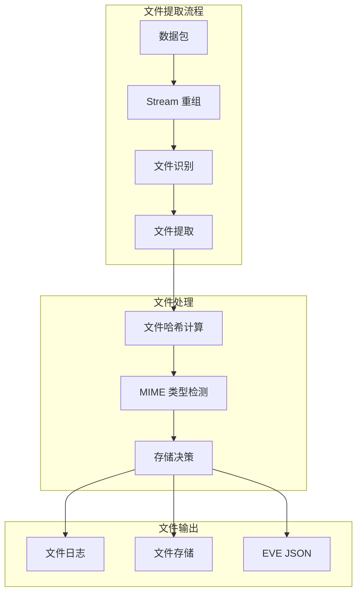

> [!info] Suricata 2026 深度探索系列
> 0. [[2026-04-15-suricata-deep-dive-series-index|全栈学习路径总览]]
> 1. [[2026-04-15-suricata-deep-dive-ch1-overview|第一章：Suricata 概述]]
> 2. [[2026-04-15-suricata-deep-dive-ch2-config|第二章：Suricata 配置系统]]
> 3. [[2026-04-15-suricata-deep-dive-ch3-runmodes|第三章：Runmodes 运行模式]]
> 4. [[2026-04-15-suricata-deep-dive-ch4-thread-model|第四章：线程模型]]
> 5. [[2026-04-15-suricata-deep-dive-ch5-capture|第五章：Capture 初始化]]
> 6. [[2026-04-15-suricata-deep-dive-ch6-af-packet|第六章：AF-PACKET 接口]]
> 7. [[2026-04-15-suricata-deep-dive-ch7-pcap|第七章：PCAP 接口]]
> 8. [[2026-04-15-suricata-deep-dive-ch8-nfq|第八章：NFQ 与 PF_RING 模式]]
> 9. [[2026-04-15-suricata-deep-dive-ch9-dpdk|第九章：DPDK 接口]]
> 10. [[2026-04-15-suricata-deep-dive-ch10-loadbalancing|第十章：多线程抓包与负载均衡]]
> 11. [[2026-04-15-suricata-deep-dive-ch11-detect-engine|第十一章：检测引擎架构]]
> 12. [[2026-04-15-suricata-deep-dive-ch12-signatures|第十二章：规则解析]]
> 13. [[2026-04-15-suricata-deep-dive-ch13-mpm|第十三章：多模式匹配]]
> 14. [[2026-04-15-suricata-deep-dive-ch14-filemagic|第十四章：文件识别]]
> 15. [[2026-04-15-suricata-deep-dive-ch15-lua-detect|第十五章：Lua 检测]]
> 16. [[2026-04-15-suricata-deep-dive-ch16-app-layer|第十六章：应用层协议解析]]
> 17. [[2026-04-15-suricata-deep-dive-ch17-http|第十七章：HTTP 协议解析]]
> 18. [[2026-04-15-suricata-deep-dive-ch18-dns|第十八章：DNS 协议解析]]
> 19. [[2026-04-15-suricata-deep-dive-ch19-tls|第十九章：TLS 协议解析]]
> 20. [[2026-04-15-suricata-deep-dive-ch20-smb|第二十章：SMB 协议解析]]
> 21. [[2026-04-15-suricata-deep-dive-ch21-http2|第二十一章：HTTP/2 协议解析]]
> 22. [[2026-04-15-suricata-deep-dive-ch22-flow|第二十二章：Flow 管理]]
> 23. [[2026-04-15-suricata-deep-dive-ch23-flow-timeout|第二十三章：Flow 超时]]
> 24. [[2026-04-15-suricata-deep-dive-ch24-flowbit|第二十四章：Flowbit 与 Flow 变量]]
> 25. [[2026-04-15-suricata-deep-dive-ch25-host|第二十五章：Host 管理]]
> 26. [[2026-04-15-suricata-deep-dive-ch26-stream|第二十六章：Stream 重组引擎]]
> 27. [[2026-04-15-suricata-deep-dive-ch27-stream-policy|第二十七章：TCP 重组策略]]
> 28. [[2026-04-15-suricata-deep-dive-ch28-stream-depth|第二十八章：Stream 深度配置]]
> 29. [[2026-04-15-suricata-deep-dive-ch29-eve|第二十九章：EVE JSON 输出]]
> 30. [[2026-04-15-suricata-deep-dive-ch30-alerts|第三十章：Alerts 输出]]
> 31. [[2026-04-15-suricata-deep-dive-ch31-stats|第三十一章：Stats 统计]]
> 32. **第三十二章：File Log**
> 33. [[2026-04-15-suricata-deep-dive-ch33-unified2|第三十三章：Unified2]]

---

## 1. 文件日志概述

Suricata 的文件日志系统负责提取、记录和输出传输中的文件，支持文件完整性校验（MD5/SHA1/SHA256）、文件类型识别、以及文件内容存储。



---

## 2. 文件配置详解

### 2.1 基础配置

```yaml
# suricata.yaml
outputs:
  - files-json:
      enabled: yes
      
      # 输出文件
      filename: files-json.log
      
      # 是否记录所有文件（不仅是告警）
      log-all: no
      
      # 文件存储目录
      store-dir: /var/log/suricata/files
      
      # 保留文件时间（秒）
      max-filesize: 10MB
```

### 2.2 文件提取配置

```yaml
# suricata.yaml
file-extraction:
  # 是否启用文件提取
  enabled: yes
  
  # 存储目录
  store-dir: /var/log/suricata/files
  
  # 最大文件大小
  max-file-size: 10MB
  
  # 文件完整性校验
  hashes:
    - md5
    - sha1
    - sha256
    
  # 协议配置
  protocols:
    http:
      enabled: yes
      # 文件类型过滤
      whitelist:
        - application/octet-stream
        - application/pdf
        - application/x-executable
        - image/jpeg
        - image/png
        - video/mp4
        
    smb:
      enabled: yes
      
    ftp:
      enabled: yes
      
    smtp:
      enabled: yes
```

### 2.3 文件类型检测

```yaml
# suricata.yaml
file-config:
  # 启用 magic 检测
  magic-check: yes
  
  # 文件类型白名单
  type-whitelist:
    - application/pdf
    - application/msword
    - application/vnd.ms-excel
    - application/x-msdownload
    - image/jpeg
    - image/png
    - video/x-msvideo
    
  # 黑名单
  type-blacklist:
    - text/plain
```

---

## 3. 文件日志格式

### 3.1 files-json.log 格式

```json
{
  "timestamp": "2026-04-15T10:23:45.123456Z",
  "event_type": "fileinfo",
  
  "fileinfo": {
    "filename": "/downloads/malware.exe",
    "gaps": "no",
    "stored": false,
    "size": 1048576,
    "tx_id": 3,
    "type": "application/octet-stream",
    "md5": "d41d8cd98f00b204e9800998ecf8427e",
    "sha1": "da39a3ee5e6b4b0d3255bfef95601890afd80709",
    "sha256": "e3b0c44298fc1c149afbf4c8996fb92427ae41e4649b934ca495991b7852b855",
    "magic": "PE32 executable"
  },
  
  "src_ip": "192.168.1.100",
  "src_port": 54321,
  "dest_ip": "93.184.216.34",
  "dest_port": 80,
  "proto": "TCP",
  "app_proto": "http"
}
```

### 3.2 文件信息字段

|| 字段 | 说明 |
|:-----|:-----|:-----|
| `filename` | 文件名 | 提取自协议（如 HTTP URL） |
| `size` | 文件大小 | 字节数 |
| `type` | MIME 类型 | 协议识别或 magic 检测 |
| `md5` | MD5 哈希 | 文件完整性校验 |
| `sha1` | SHA1 哈希 | 更强的完整性校验 |
| `sha256` | SHA256 哈希 | 强完整性校验 |
| `magic` | Magic 描述 | libmagic 识别结果 |
| `gaps` | 是否有缺失 | 流重组是否有间隙 |
| `stored` | 是否存储 | 文件是否保存到磁盘 |

---

## 4. 文件哈希计算

### 4.1 哈希结构

```c
// src/util-file.h — 文件哈希结构
typedef struct FileHashes_ {
    /* MD5 哈希 */
    uint8_t md5[16];
    char md5_str[33];  // 32 + 1
    
    /* SHA1 哈希 */
    uint8_t sha1[20];
    char sha1_str[41];  // 40 + 1
    
    /* SHA256 哈希 */
    uint8_t sha256[32];
    char sha256_str[65];  // 64 + 1
    
    /* 文件大小 */
    uint64_t size;
    
    /* 创建时间 */
    struct timeval tv;
    
} FileHashes;
```

### 4.2 哈希计算流程

```c
// src/util-file.c — 文件哈希计算
static void FileHashCompute(File *file, uint8_t *data, uint32_t data_len)
{
    /* 更新 MD5 */
    if (file->hash_flags & FILE_HASH_MD5) {
        MD5_Update(&file->md5_ctx, data, data_len);
    }
    
    /* 更新 SHA1 */
    if (file->hash_flags & FILE_HASH_SHA1) {
        SHA1_Update(&file->sha1_ctx, data, data_len);
    }
    
    /* 更新 SHA256 */
    if (file->hash_flags & FILE_HASH_SHA256) {
        SHA256_Update(&file->sha256_ctx, data, data_len);
    }
    
    /* 更新文件大小 */
    file->size += data_len;
}

/* 文件关闭时完成哈希计算 */
static void FileHashFinalize(File *file)
{
    /* 完成 MD5 */
    if (file->hash_flags & FILE_HASH_MD5) {
        MD5_Final(file->md5, &file->md5_ctx);
        PrintHexString(file->md5_str, 33, file->md5, 16);
    }
    
    /* 完成 SHA1 */
    if (file->hash_flags & FILE_HASH_SHA1) {
        SHA1_Final(file->sha1, &file->sha1_ctx);
        PrintHexString(file->sha1_str, 41, file->sha1, 20);
    }
    
    /* 完成 SHA256 */
    if (file->hash_flags & FILE_HASH_SHA256) {
        SHA256_Final(file->sha256, &file->sha256_ctx);
        PrintHexString(file->sha256_str, 65, file->sha256, 32);
    }
}
```

### 4.3 文件存储

```c
// src/util-file.c — 文件存储
static int FileStore(File *file)
{
    char filepath[512];
    snprintf(filepath, sizeof(filepath),
        "%s/%s-%s",
        file->store_dir,
        file->sha256_str,
        file->filename);
    
    /* 创建目录 */
    CreateDirectoryTree(file->store_dir);
    
    /* 写入文件 */
    FILE *fp = fopen(filepath, "wb");
    if (fp == NULL) {
        return -1;
    }
    
    /* 写入存储的文件数据 */
    for (uint32_t i = 0; i < file->content_data_cnt; i++) {
        fwrite(file->content_data[i]->data,
               1,
               file->content_data[i]->len,
               fp);
    }
    
    fclose(fp);
    
    /* 标记为已存储 */
    file->flags |= FILE_STORED;
    
    return 0;
}
```

---

## 5. 文件提取协议支持

### 5.1 HTTP 文件提取

```yaml
# suricata.yaml
file-extraction:
  protocols:
    http:
      enabled: yes
      
      # 提取请求体中的文件
      extract-request-body: yes
      
      # 提取响应体中的文件
      extract-response-body: yes
      
      # 文件大小限制
      max-file-size: 50MB
      
      # 文件类型白名单
      type-whitelist:
        - application/octet-stream
        - application/pdf
```

### 5.2 SMTP 文件提取

```yaml
# suricata.yaml
file-extraction:
  protocols:
    smtp:
      enabled: yes
      
      # 提取附件
      extract-attachments: yes
      
      # 附件存储目录
      attachment-dir: /var/log/suricata/attachments
      
      # 文件类型白名单
      type-whitelist:
        - application/pdf
        - application/msword
        - application/vnd.ms-excel
```

### 5.3 SMB 文件提取

```yaml
# suricata.yaml
file-extraction:
  protocols:
    smb:
      enabled: yes
      
      # SMB 文件传输
      stream-depth: 1MB
      
      # 文件大小限制
      max-file-size: 100MB
```

---

## 6. 文件日志源码实现

### 6.1 文件日志初始化

```c
// src/output-filedata.c — 文件日志初始化
static OutputInitResult OutputFiledataLogInit(ConfNode *conf)
{
    OutputFiledataLogContext *ctx = SCCalloc(1,
        sizeof(OutputFiledataLogContext));
    if (ctx == NULL) {
        return ResultInitFail;
    }
    
    /* 解析配置 */
    const char *filename = ConfNodeLookupChildValue(conf, "filename");
    if (filename != NULL) {
        ctx->filename = SCStrdup(filename);
    }
    
    /* 存储目录 */
    const char *store_dir = ConfNodeLookupChildValue(conf, "store-dir");
    if (store_dir != NULL) {
        ctx->store_dir = SCStrdup(store_dir);
    }
    
    /* 哈希配置 */
    const char *hash_str = ConfNodeLookupChildValue(conf, "hash");
    if (hash_str != NULL) {
        if (strstr(hash_str, "md5")) {
            ctx->hash_flags |= FILE_HASH_MD5;
        }
        if (strstr(hash_str, "sha1")) {
            ctx->hash_flags |= FILE_HASH_SHA1;
        }
        if (strstr(hash_str, "sha256")) {
            ctx->hash_flags |= FILE_HASH_SHA256;
        }
    }
    
    /* 注册输出 */
    OutputRegisterFiledataLogger(&ctx->module, ctx);
    
    return ResultOk;
}
```

### 6.2 文件日志写入

```c
// src/output-filedata.c — 文件日志写入
static int OutputFiledataLog(ThreadVars *tv, void *data, File *file)
{
    OutputFiledataLogContext *ctx = (OutputFiledataLogContext *)data;
    
    /* 创建 JSON 对象 */
    Json派roto *js = Json派rotoNew();
    
    /* 添加时间戳 */
    char timestamp[64];
    CreateUtcIsoTimeStamp(file->created, timestamp, sizeof(timestamp));
    Json派rotoSetString(js, "timestamp", timestamp);
    Json派rotoSetString(js, "event_type", "fileinfo");
    
    /* 添加文件信息 */
    Json派rotoSetString(js, "filename", file->name);
    Json派rotoSetUint(js, "size", file->size);
    Json派rotoSetString(js, "type", file->magic);
    
    /* 添加哈希 */
    if (ctx->hash_flags & FILE_HASH_MD5) {
        Json派rotoSetString(js, "md5", file->md5_str);
    }
    if (ctx->hash_flags & FILE_HASH_SHA1) {
        Json派rotoSetString(js, "sha1", file->sha1_str);
    }
    if (ctx->hash_flags & FILE_HASH_SHA256) {
        Json派rotoSetString(js, "sha256", file->sha256_str);
    }
    
    /* 添加 Flow 信息 */
    char srcip[46], dstip[46];
    Flow *f = file->flow;
    
    if (f != NULL) {
        PrintInet(AF_INET, &f->src, srcip, sizeof(srcip));
        PrintInet(AF_INET, &f->dst, dstip, sizeof(dstip));
        
        Json派rotoSetString(js, "src_ip", srcip);
        Json派rotoSetUint(js, "src_port", f->sp);
        Json派toSetString(js, "dest_ip", dstip);
        Json派rotoSetUint(js, "dest_port", f->dp);
        Json派rotoSetString(js, "proto", "TCP");
    }
    
    /* 写入文件 */
    FILE *fp = fopen(ctx->filename, "a");
    if (fp != NULL) {
        char *json_str = Json派rotoToString(js);
        fprintf(fp, "%s\n", json_str);
        fclose(fp);
        SCFree(json_str);
    }
    
    Json派rotoFree(js);
    return 0;
}
```

---

## 7. 文件存储管理

### 7.1 文件存储配置

```yaml
# suricata.yaml
file-extraction:
  # 全局启用
  enabled: yes
  
  # 存储目录
  store-dir: /var/log/suricata/files
  
  # 自动清理
  auto-flushing: yes
  
  # 目录配额（文件数）
  quota: 100000
  
  # 目录配额（字节）
  size-quota: 10GB
```

### 7.2 文件 Rotation

```yaml
# suricata.yaml
file-extraction:
  store-dir: /var/log/suricata/files
  
  # Rotation 配置
  rotation:
    enabled: yes
    
    # 时间基础
    time-reap: 3600  # 1 小时
    
    # 大小基础
    size-reap: 1GB
```

---

## 8. 文件日志与威胁情报

### 8.1 文件哈希匹配

```yaml
# suricata.yaml
outputs:
  - eve-log:
      enabled: yes
      
      types:
        - files:
            # 包含哈希字段
            hashes: md5,sha1,sha256
            
---

# suricata.rules
# 使用文件哈希检测恶意软件
alert http any any -> $EXTERNAL_NET any (
    msg:"MALWARE Downloaded - Known Bad MD5";
    file-data; md5:d41d8cd98f00b204e9800998ecf8427e;
    sid:2000001; rev:1;
)

alert http any any -> $EXTERNAL_NET any (
    msg:"MALWARE Downloaded - Known Bad SHA256";
    file-data; sha256:e3b0c44298fc1c149afbf4c8996fb92427ae41e4649b934ca495991b7852b855;
    sid:2000002; rev:1;
)
```

### 8.2 文件名匹配

```yaml
# suricata.rules
# 检测可疑文件名
alert http any any -> $EXTERNAL_NET any (
    msg:"SUSPICIOUS Download - Double Extension";
    file-data; filename:"*.pdf.exe";
    sid:2000010; rev:1;
)

alert http any any -> $EXTERNAL_NET any (
    msg:"SUSPICIOUS Download - System File";
    file-data; filename:"*.scr";
    sid:2000011; rev:1;
)
```

---

## 9. 文件日志性能优化

### 9.1 大文件处理

```yaml
# suricata.yaml
file-extraction:
  # 大文件不存储内容
  large-file-size: 50MB
  
  # 只记录元数据
  log-metadata-only: yes
```

### 9.2 存储优化

```yaml
# suricata.yaml
file-extraction:
  # 使用单独的磁盘
  store-dir: /mnt/storage/suricata/files
  
  # 使用 SSD
  device: /dev/ssd1
```

---

## 10. 常见问题

### 10.1 文件提取失败

**检查**：
- 确认 `file-extraction.enabled: yes`
- 检查协议配置（如 `http.enabled: yes`）
- 查看 `stream.reassembly.depth` 是否足够

### 10.2 哈希不一致

**原因**：
- 流有间隙（`gaps: yes`）
- 文件被截断

**解决**：
```yaml
stream:
  reassembly:
    depth: 0  # 不限制重组深度
```

### 10.3 存储目录满

**解决**：
```yaml
file-extraction:
  auto-flushing: yes
  size-quota: 100GB
  
  # 定期清理
  cleanup:
    enabled: yes
    interval: 86400  # 每天
    older-than: 604800  # 7 天
```
