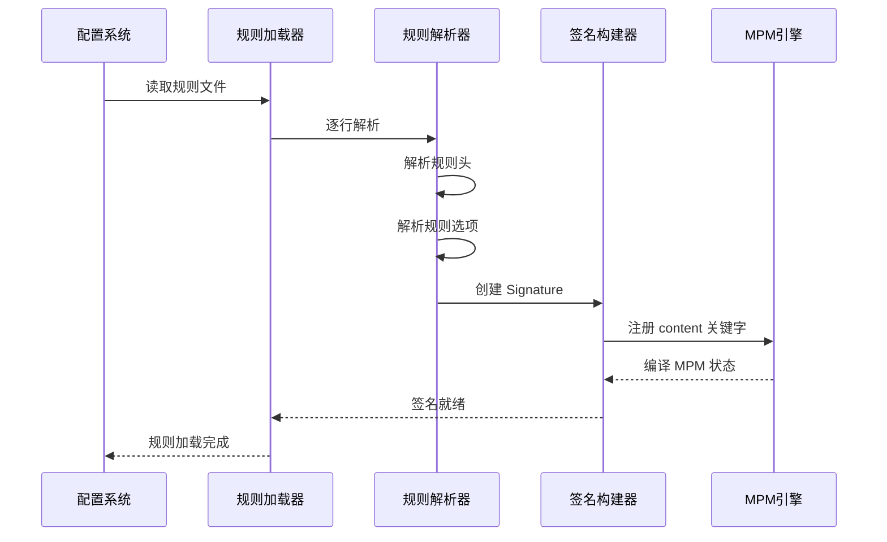

> [!info] Suricata 2026 深度探索系列
> 0. [[2026-04-15-suricata-deep-dive-series-index|全栈学习路径总览]]
> 1. [[2026-04-15-suricata-deep-dive-ch1-overview|第一章：Suricata 概述]]
> ...
> 11. [[2026-04-15-suricata-deep-dive-ch11-detect-engine|第十一章：检测引擎架构]]
> 12. [[2026-04-15-suricata-deep-dive-ch12-signatures|第十二章：规则解析]]
> ...
> 33. [[2026-04-15-suricata-deep-dive-ch33-unified2|第三十三章：Unified2]]
> **34. 当前章节：规则语法**

---

## 1. 规则格式概述

Suricata 规则采用与 Snort 兼容的语法，由**规则头**和**规则选项**两部分组成：

```
action protocol src dst sp dp (options)
```

```snort
# 完整规则示例
alert tcp $HOME_NET any -> $EXTERNAL_NET $HTTP_PORTS (
    msg:"ET TROJAN Possible Trickbot HTTP GET";
    flow:to_server,established;
    content:"/path/to/malware.exe";
    http.uri;
    pcre:"/\\/download[0-9]*\\.exe$/U";
    sid:2020493;
    rev:2;
)
```

### 1.1 规则结构分解

```
┌─────────────────────────────────────────────────────────────────────────────┐
│                           规 则 头 (Rule Header)                            │
├─────────────────────────────────────────────────────────────────────────────┤
│ action   │  protocol  │   src      │   dst      │  sp    │  dp             │
│ alert    │  tcp       │  $HOME_NET │  $EXTERNAL_NET │  any   │  $HTTP_PORTS   │
├─────────────────────────────────────────────────────────────────────────────┤
│                           规则选项 (Rule Options)                            │
├─────────────────────────────────────────────────────────────────────────────┤
│ (msg:"..."; flow:...; content:"..."; http.uri; pcre:"..."; sid:...; rev:...;)│
└─────────────────────────────────────────────────────────────────────────────┘
```

### 1.2 方向符号

| 符号 | 名称 | 说明 |
|:---:|:---:|:---|
| `->` | 单向 | 从 src 到 dst |
| `<>` | 双向 | 双向流量 |

---

## 2. 规则头解析

### 2.1 动作类型

| 动作 | IPS 模式行为 | IDS 模式行为 |
|:---:|:---|:---|
| `alert` | 记录后放行 | 记录 |
| `pass` | 放行（跳过检测） | 跳过 |
| `drop` | 丢弃 + 告警 | 触发 Alert |
| `reject` | 发送 RST/ICMP + 丢弃 | 触发 Alert |
| `rejectsrc` | 仅向源发送拒绝 | 触发 Alert |
| `rejectdst` | 仅向目标发送拒绝 | 触发 Alert |
| `rejectboth` | 向两端发送拒绝 | 触发 Alert |
| `log` | 仅记录 | 记录 |

```c
// src/detect.h — 动作枚举
typedef enum {
    ACTION_NONE = 0,
    ACTION_ALERT,
    ACTION_LOG,
    ACTION_PASS,
    ACTION_DROP,
    ACTION_REJECT,
    ACTION_REJECT_SRC,
    ACTION_REJECT_DST,
    ACTION_REJECT_BOTH,
    ACTION_QUEUE,
} ActionFlag;

// src/detect-engine-build.c — 动作解析
static int ParseAction(const char *action)
{
    if (strcmp(action, "alert") == 0) return ACTION_ALERT;
    if (strcmp(action, "pass") == 0) return ACTION_PASS;
    if (strcmp(action, "drop") == 0) return ACTION_DROP;
    if (strcmp(action, "reject") == 0) return ACTION_REJECT;
    if (strcmp(action, "log") == 0) return ACTION_LOG;
    // ...
    return ACTION_ALERT;  // 默认
}
```

### 2.2 协议解析

```c
// src/detect.h — 协议类型
typedef enum {
    PROTOCOL_UNKNOWN = 0,
    PROTOCOL_IP,
    PROTOCOL_ICMP,
    PROTOCOL_TCP,
    PROTOCOL_UDP,
    PROTOCOL_RAW,
    PROTOCOL_APP_LAYER,  // DNS/HTTP/TLS 等
} Proto;

// src/detect-engine.c — 协议解析
static Proto ParseProtocol(const char *proto_str)
{
    if (strcmp(proto_str, "tcp") == 0) return PROTOCOL_TCP;
    if (strcmp(proto_str, "udp") == 0) return PROTOCOL_UDP;
    if (strcmp(proto_str, "icmp") == 0) return PROTOCOL_ICMP;
    if (strcmp(proto_str, "ip") == 0) return PROTOCOL_IP;
    if (strcmp(proto_str, "http") == 0) return PROTOCOL_HTTP;
    if (strcmp(proto_str, "dns") == 0) return PROTOCOL_DNS;
    if (strcmp(proto_str, "tls") == 0) return PROTOCOL_TLS;
    // ...
    return PROTOCOL_UNKNOWN;
}
```

### 2.3 地址解析

```c
// src/detect.h — 地址匹配结构
typedef struct DetectAddress_ {
    uint8_t ip[16];                  // IPv6 地址
    uint8_t ip2[16];                 // 范围结束地址
    uint16_t family;                 // AF_INET / AF_INET6
    uint8_t netmask;                 // CIDR 掩码
    bool negated;                    // 否定标志
    struct DetectAddress_ *next;
} DetectAddress;

// src/detect-engine.c — 地址解析
static DetectAddress *ParseAddress(const char *addr)
{
    DetectAddress *da = SCCalloc(1, sizeof(DetectAddress));
    
    /* 检查否定 */
    if (addr[0] == '!') {
        da->negated = true;
        addr++;
    }
    
    /* 检查变量 ($HOME_NET 等) */
    if (addr[0] == '$') {
        const char *value = VarNameResolve(addr + 1);
        addr = value;
    }
    
    /* 解析 CIDR/范围/单IP */
    if (strchr(addr, '/') != NULL) {
        ParseCIDR(addr, da);
    } else if (strchr(addr, '-') != NULL) {
        ParseRange(addr, da);
    } else {
        ParseIP(addr, da);
    }
    
    return da;
}
```

### 2.4 端口解析

```c
// src/detect-engine.c — 端口解析
static uint16_t ParsePort(const char *port_str)
{
    if (port_str[0] == '$') {
        const char *value = VarNameResolve(port_str + 1);
        return PortVarResolve(value);
    }
    
    if (strcmp(port_str, "any") == 0) {
        return 0;  // 任意端口
    }
    
    if (strchr(port_str, ':') != NULL) {
        /* 范围端口: 80:85 */
        return ParsePortRange(port_str);
    }
    
    return (uint16_t)atoi(port_str);
}
```

---

## 3. 关键字注册系统

### 3.1 关键字注册表

```c
// src/detect.h — 关键字注册结构
typedef struct DetectKeyword_ {
    const char *name;                // 关键字名称
    int id;                          // 关键字 ID
    const char *desc;                // 描述
    void (*Register)(void);          // 注册函数
    
    /* flags */
    uint16_t flags;
#define SIGMATCH_NO_SUB    0x01      // 不支持子选项
#define SIGMATCH_QUOTES    0x02       // 需要引号
#define SIGMATCH_DEONLY    0x04       // 仅检测阶段
    
} DetectKeyword;

// src/detect.c — 内置关键字注册
static DetectKeyword sigmatch_table[] = {
    { "msg",        DETECT_MSG,        "告警信息",          RegisterMsg },
    { "content",    DETECT_CONTENT,    "内容匹配",          RegisterContent },
    { "nocase",     DETECT_NOCASE,     "不区分大小写",      RegisterNoCase },
    { "depth",      DETECT_DEPTH,      "匹配深度",          RegisterDepth },
    { "offset",     DETECT_OFFSET,     "匹配偏移",          RegisterOffset },
    { "pcre",       DETECT_PCRE,       "正则匹配",          RegisterPcre },
    { "uricontent", DETECT_URICONTENT, "URI 内容匹配",      RegisterUricontent },
    { "http_uri",   DETECT_HTTP_URI,   "HTTP URI",          RegisterHttpUri },
    { "http_header",DETECT_HTTP_HEADER,"HTTP 头",           RegisterHttpHeader },
    { "flow",       DETECT_FLOW,       "流属性",            RegisterFlow },
    { "flowbits",   DETECT_FLOWBITS,   "流状态",            RegisterFlowbits },
    { "dsize",      DETECT_DSIZE,      "Payload 大小",      RegisterDsize },
    { "sid",        DETECT_SID,        "签名 ID",           RegisterSid },
    { "rev",        DETECT_REV,        "修订版本",          RegisterRev },
    { "classtype",  DETECT_CLASSTYPE,  "分类",              RegisterClasstype },
    { "priority",   DETECT_PRIORITY,   "优先级",            RegisterPriority },
    { "threshold",  DETECT_THRESHOLD,  "阈值",              RegisterThreshold },
    { "reference",  DETECT_REFERENCE,  "参考链接",          RegisterReference },
    { "gid",        DETECT_GID,        "组 ID",             RegisterGid },
    { "tag",        DETECT_TAG,        "标签",              RegisterTag },
    { "metadata",   DETECT_METADATA,   "元数据",            RegisterMetadata },
    // ... HTTP/DNS/TLS 等协议关键字
    { NULL, 0, NULL, NULL }
};
```

### 3.2 关键字注册流程

```c
// src/detect.c — 关键字注册初始化
void SigTableInit(void)
{
    /* 注册内置关键字 */
    for (int i = 0; sigmatch_table[i].name != NULL; i++) {
        sigmatch_table[i].id = i;
        sigmatch_table[i].Register();
    }
    
    /* 调用各模块的注册函数 */
    HTTPRegister();      // http.*
    DNSRegister();       // dns.*
    TLSRegister();       // tls.*
    SSHRegister();        // ssh.*
    SMBRegister();        // smb.*
}

// src/detect-engine.c — 注册示例
void RegisterContent(void)
{
    sigmatch_table[DETECT_CONTENT].name = "content";
    sigmatch_table[DETECT_CONTENT].desc = "content match";
    sigmatch_table[DETECT_CONTENT].Match = DetectContentMatch;
    sigmatch_table[DETECT_CONTENT].Setup = DetectContentSetup;
    sigmatch_table[DETECT_CONTENT].Free = DetectContentFree;
    
    /* 注册修饰符 */
    DetectContentSetup();
}
```

---

## 4. 规则解析流程

### 4.1 解析主循环

```c
// src/detect-engine.c — 规则解析主函数
Signature *SigParse(const char *rule)
{
    Signature *sig = SCCalloc(1, sizeof(Signature));
    
    /* 跳过注释和空行 */
    if (rule[0] == '#' || rule[0] == '\0') {
        goto end;
    }
    
    /* 解析规则头 */
    const char *p = rule;
    
    /* 1. 解析动作 */
    const char *space = strchr(p, ' ');
    char action[32];
    strncpy(action, p, space - p);
    sig->action = ParseAction(action);
    p = space + 1;
    
    /* 2. 解析协议 */
    space = strchr(p, ' ');
    char proto[16];
    strncpy(proto, p, space - p);
    sig->proto = ParseProtocol(proto);
    p = space + 1;
    
    /* 3. 解析源地址 */
    space = strchr(p, ' ');
    char src_addr[256];
    strncpy(src_addr, p, space - p);
    sig->src = ParseAddress(src_addr);
    p = space + 1;
    
    /* 4. 解析源端口 */
    space = strchr(p, ' ');
    char src_port[32];
    strncpy(src_port, p, space - p);
    sig->sp = ParsePort(src_port);
    p = space + 1;
    
    /* 5. 解析方向 */
    if (strncmp(p, "->", 2) == 0) {
        sig->direction = SIG_FLAG_DIR_TO_DST;
        p += 2;
    } else if (strncmp(p, "<>", 2) == 0) {
        sig->direction = SIG_FLAG_DIR_BOTH;
        p += 2;
    }
    
    /* 6. 解析目的地址 */
    space = strchr(p, ' ');
    char dst_addr[256];
    strncpy(dst_addr, p, space - p);
    sig->dst = ParseAddress(dst_addr);
    p = space + 1;
    
    /* 7. 解析目的端口 */
    const char *paren = strchr(p, '(');
    char dst_port[32];
    strncpy(dst_port, p, paren - p);
    sig->dp = ParsePort(dst_port);
    p = paren + 1;
    
    /* 8. 解析规则选项 */
    while (*p != ')' && *p != '\0') {
        /* 提取关键字 */
        const char *semicolon = strchr(p, ';');
        char option[512];
        strncpy(option, p, semicolon - p);
        
        /* 解析关键字 */
        char *colon = strchr(option, ':');
        if (colon) {
            char keyname[64];
            strncpy(keyname, option, colon - option);
            char *value = colon + 1;
            
            DetectKeyword *kw = FindKeyword(keyname);
            if (kw && kw->Setup) {
                kw->Setup(value, sig);
            }
        }
        
        p = semicolon + 1;
    }
    
end:
    return sig;
}
```

### 4.2 关键字查找

```c
// src/detect-engine.c — 关键字查找
static DetectKeyword *FindKeyword(const char *name)
{
    for (int i = 0; sigmatch_table[i].name != NULL; i++) {
        if (strcmp(sigmatch_table[i].name, name) == 0) {
            return &sigmatch_table[i];
        }
    }
    return NULL;
}
```

---

## 5. 规则验证工具

### 5.1 suricata -T 测试模式

```bash
# 测试规则文件
suricata -T -c /etc/suricata/suricata.yaml -r /path/to/rules/test.rules

# 输出示例
Running suricata check test.
Loading rule file: /path/to/rules/test.rules
[14045] (thread_id 0) <Info> - rules count: 1500, invalid: 5, total alerts: 1495
[14045] (thread_id 0) <Info> - Successfully loaded rules
```

### 5.2 常见错误信息

| 错误 | 原因 | 修复方法 |
|:---|:---|:---|
| `invalid application layer protocol` | 协议关键字位置错误 | `http.uri` 必须在 `alert tcp` 之后 |
| `duplicate sid` | SID 重复 | 使用唯一的 SID 值 |
| `content length is 0` | content 为空 | content 不能为空 |
| `unknown keyword` | 关键字不存在 | 检查拼写或加载对应模块 |

---

## 6. 规则加载流程



### 6.1 规则文件配置

```yaml
# suricata.yaml
outputs:
  - console:
      enabled: yes

# 规则文件配置
rule-files:
  - /etc/suricata/rules/app-layer-events.rules
  - /etc/suricata/rules/decoder-events.rules
  - /etc/suricata/rules/dns-events.rules
  - /etc/suricata/rules/http-events.rules
  - /etc/suricata/rules/tls-events.rules
  # - /path/to/custom/rules.rules
```

---

## 7. 规则优化建议

### 7.1 规则编写最佳实践

1. **使用 `fast_pattern`**：在多个 content 中指定快速模式
   ```snort
   alert tcp $HOME_NET any -> $EXTERNAL_NET any (
       content:"malware";
       content:"payload";
       fast_pattern:only;
       ...)
   ```

2. **避免过宽的规则**：
   ```snort
   # 差: 匹配过多流量
   alert tcp any any -> any any (content:"login";)
   
   # 好: 限定范围
   alert tcp $HOME_NET 80 -> $EXTERNAL_NET any (content:"login";)
   ```

3. **使用协议修饰符**：
   ```snort
   # 差: 在整个 payload 中搜索
   alert tcp $HOME_NET any -> $EXTERNAL_NET any (content:"/admin";)
   
   # 好: 仅搜索 HTTP URI
   alert tcp $HOME_NET any -> $EXTERNAL_NET $HTTP_PORTS (
       content:"/admin";
       http.uri;
   )
   ```

### 7.2 规则性能影响

| 规则类型 | 性能影响 | 原因 |
|:---|:---|:---|
| `content:"/admin"` + `http.uri` | 低 | MPM + 协议解析 |
| `pcre:"/regex/"` | 中 | 正则引擎回溯 |
| `pcre:"/.*regex.*/"` | 高 | 正则回溯爆炸 |
| 无 `fast_pattern` 多 content | 中 | 模糊匹配 |

---

## 8. 总结

Suricata 规则系统建立在 Snort 兼容语法之上，通过**规则头**定义匹配范围（动作/协议/地址/端口/方向），通过**规则选项**定义具体检测逻辑。关键字注册表提供灵活的扩展机制，各协议模块（HTTP/DNS/TLS）通过注册函数将自己特有的检测关键字注入系统。规则解析完成后，经过签名构建器处理，最终与 MPM 引擎集成实现高效匹配。
