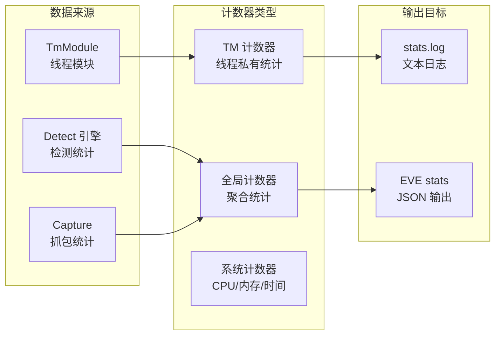

> [!info] Suricata 2026 深度探索系列 0. [[2026-04-15-suricata-deep-dive-series-index|全栈学习路径总览]]
>
> 1. [[2026-04-15-suricata-deep-dive-ch1-overview|第一章：Suricata 概述]]
> 2. [[2026-04-15-suricata-deep-dive-ch2-config|第二章：Suricata 配置系统]]
> 3. [[2026-04-15-suricata-deep-dive-ch3-runmodes|第三章：Runmodes 运行模式]]
> 4. [[2026-04-15-suricata-deep-dive-ch4-thread-model|第四章：线程模型]]
> 5. [[2026-04-15-suricata-deep-dive-ch5-capture|第五章：Capture 初始化]]
> 6. [[2026-04-15-suricata-deep-dive-ch6-af-packet|第六章：AF-PACKET 接口]]
> 7. [[2026-04-15-suricata-deep-dive-ch7-pcap|第七章：PCAP 接口]]
> 8. [[2026-04-15-suricata-deep-dive-ch8-nfq|第八章：NFQ 与 PF_RING 模式]]
> 9. [[2026-04-15-suricata-deep-dive-ch9-dpdk|第九章：DPDK 接口]]
> 10. [[2026-04-15-suricata-deep-dive-ch10-loadbalancing|第十章：多线程抓包与负载均衡]]
> 11. [[2026-04-15-suricata-deep-dive-ch11-detect-engine|第十一章：检测引擎架构]]
> 12. [[2026-04-15-suricata-deep-dive-ch12-signatures|第十二章：规则解析]]
> 13. [[2026-04-15-suricata-deep-dive-ch13-mpm|第十三章：多模式匹配]]
> 14. [[2026-04-15-suricata-deep-dive-ch14-filemagic|第十四章：文件识别]]
> 15. [[2026-04-15-suricata-deep-dive-ch15-lua-detect|第十五章：Lua 检测]]
> 16. [[2026-04-15-suricata-deep-dive-ch16-app-layer|第十六章：应用层协议解析]]
> 17. [[2026-04-15-suricata-deep-dive-ch17-http|第十七章：HTTP 协议解析]]
> 18. [[2026-04-15-suricata-deep-dive-ch18-dns|第十八章：DNS 协议解析]]
> 19. [[2026-04-15-suricata-deep-dive-ch19-tls|第十九章：TLS 协议解析]]
> 20. [[2026-04-15-suricata-deep-dive-ch20-smb|第二十章：SMB 协议解析]]
> 21. [[2026-04-15-suricata-deep-dive-ch21-http2|第二十一章：HTTP/2 协议解析]]
> 22. [[2026-04-15-suricata-deep-dive-ch22-flow|第二十二章：Flow 管理]]
> 23. [[2026-04-15-suricata-deep-dive-ch23-flow-timeout|第二十三章：Flow 超时]]
> 24. [[2026-04-15-suricata-deep-dive-ch24-flowbit|第二十四章：Flowbit 与 Flow 变量]]
> 25. [[2026-04-15-suricata-deep-dive-ch25-host|第二十五章：Host 管理]]
> 26. [[2026-04-15-suricata-deep-dive-ch26-stream|第二十六章：Stream 重组引擎]]
> 27. [[2026-04-15-suricata-deep-dive-ch27-stream-policy|第二十七章：TCP 重组策略]]
> 28. [[2026-04-15-suricata-deep-dive-ch28-stream-depth|第二十八章：Stream 深度配置]]
> 29. [[2026-04-15-suricata-deep-dive-ch29-eve|第二十九章：EVE JSON 输出]]
> 30. [[2026-04-15-suricata-deep-dive-ch30-alerts|第三十章：Alerts 输出]]
> 31. [[2026-04-15-suricata-deep-dive-ch31-stats|第三十一章：Stats 统计]]
> 32. [[2026-04-15-suricata-deep-dive-ch32-file-log|第三十二章：File Log]]
> 33. [[2026-04-15-suricata-deep-dive-ch33-unified2|第三十三章：Unified2]]
> 34. [[2026-04-15-suricata-deep-dive-ch34-rules|第三十四章：规则语法]]
> 35. [[2026-04-15-suricata-deep-dive-ch35-http-sids|第三十五章：HTTP 规则]]
> 36. [[2026-04-15-suricata-deep-dive-ch36-dns-sids|第三十六章：DNS 规则]]
> 37. [[2026-04-15-suricata-deep-dive-ch37-tls-sids|第三十七章：TLS 规则]]
> 38. **第三十八章：性能计数器**
> 39. [[2026-04-15-suricata-deep-dive-ch39-memory|第三十九章：内存管理]]
> 40. [[2026-04-15-suricata-deep-dive-ch40-hyperscan|第四十章：Hyperscan MPM]]

---

## 1. 性能计数器概述

Suricata 的性能计数器系统（Counter System）负责收集和输出各种运行时指标，帮助运维人员监控 IDS/IPS 的运行状态、及时发现瓶颈、进行性能调优。



### 1.1 计数器分类

| 类型           | 范围     | 更新频率       | 用途           |
| :------------- | :------- | :------------- | :------------- |
| **TM 计数器**  | 线程私有 | 每包/每事件    | 单线程性能监控 |
| **全局计数器** | 全局聚合 | 定时批量同步   | 系统整体性能   |
| **协议计数器** | 应用层   | 协议解析时     | 流量分析       |
| **检测计数器** | 检测引擎 | MPM/规则匹配时 | 告警统计       |

---

## 2. Stats 配置详解

### 2.1 基础配置

```yaml
# suricata.yaml
outputs:
  - stats:
      enabled: yes # 启用统计输出
      level: 4 # 详细级别 (0-8)
      totals: yes # 显示总计
      threads: yes # 显示每线程统计
      null-flags: no # 跳过零值计数器
      intervals: 10 # 输出间隔（秒）
```

### 2.2 计数器配置文件

```yaml
# suricata.yaml
counters:
  interval: 10 # 收集间隔（秒）
  add-defaults: yes # 添加默认计数器
  max-ticks: 100000 # 最大 tick 数
```

### 2.3 Perf 计数器配置

```yaml
# suricata.yaml
engine-analysis:
  stats-every: 30sec # 分析统计输出间隔
```

---

## 3. 计数器数据结构

### 3.1 StatsHeader

```c
// src/output.h — 统计输出头
typedef struct StatsGlobalHeader_ {
    uint16_t version;                  // 版本
    uint16_t sigcount;                  // 规则数
    uint32_t uptime;                    // 运行时间
    struct timeval date;                // 当前时间
    uint64_t rules_loaded;              // 已加载规则数
} StatsGlobalHeader;
```

### 3.2 StatsRecord 计数器记录

```c
// src/output.h — 单个计数器
typedef struct StatsRecord_ {
    const char *name;                   // 计数器名称
    const char *tm_name;                // 线程名称
    uint64_t value;                     // 计数器值
    uint64_t max;                       // 历史最大值
    uint64_t min;                       // 历史最小值
    uint64_t tot;                       // 总计（用于计算平均）
    uint64_t巧]                         // 样本数
} StatsRecord;
```

### 3.3 Counter 链表

```c
// src/output.c — 全局计数器链表
typedef struct StatsTable_ {
    SCMutex lock;                       // 计数器锁
    uint32_t nelems;                    // 元素数量
    StatsCounter *head;                // 链表头
    StatsCounter *tail;                // 链表尾
} StatsTable;

typedef struct StatsCounter_ {
    char name[128];                    // 计数器名
    char tm_name[64];                   // 所属线程名
    uint64_t *value;                   // 指向线程局部值
    uint64_t *max;
    uint64_t *min;
    uint64_t *tot;
    uint32_t *cnt;
    uint8_t type;                      // 计数器类型
    struct StatsCounter_ *next;
} StatsCounter;
```

---

## 4. 计数器注册与更新

### 4.1 注册计数器

```c
// src/output.c — 注册全局计数器
StatsCounter *SCStatsRegisterCounter(const char *name,
                                      enum StatsTy type,
                                      const char *tm_name)
{
    StatsCounter *counter = SCCalloc(1, sizeof(StatsCounter));

    /* 设置名称 */
    strlcpy(counter->name, name, sizeof(counter->name));
    if (tm_name != NULL) {
        strlcpy(counter->tm_name, tm_name, sizeof(counter->tm_name));
    }

    /* 分配线程局部值存储 */
    counter->value = SCPerfAllocateCounter(name, type);
    counter->max = SCPerfAllocateCounter(name "_max", type);
    counter->min = SCPerfAllocateCounter(name "_min", type);
    counter->tot = SCPerfCounterCreate("tot", type);
    counter->cnt = SCPerfCounterCreate("cnt", type);

    /* 添加到全局链表 */
    SCMutexLock(&stats_table.lock);
    counter->next = stats_table.head;
    stats_table.head = counter;
    stats_table.nelems++;
    SCMutexUnlock(&stats_table.lock);

    return counter;
}
```

### 4.2 更新计数器

```c
// src/output.c — 更新计数器值
#define StatsIncr(counter_id) \
    do { \
        if (tvc->perf_plugin_ctx && (counter_id) < tv->perf_public_ctx.counter_array_size) { \
            PerfIncrement(&tv->perf_public_ctx.counter_array[(counter_id)]); \
        } \
    } while(0)

#define StatsAdd(counter_id, val) \
    do { \
        if (tvc->perf_plugin_ctx) { \
            PerfAdd(&tv->perf_public_ctx.counter_array[(counter_id)], (val)); \
        } \
    } while(0)
```

### 4.3 定时更新（PerfTick）

```c
// src/perf.h — 性能计数结构
typedef struct PerfPattern_ {
    const char *name;                   // 计数器名
    enum SCPerfRegisterResult result;   // 注册结果
    uint64_t *ptr;                      // 指针
} PerfPattern;

typedef struct PerfPublic_ {
    uint64_t *counter_array;           // 计数器数组
    uint32_t counter_array_size;       // 数组大小
    uint64_t ticks;                    // 总 tick 数
    uint64_t total_ms;                 // 总毫秒
} PerfPublic;

typedef struct PerfThreadVars_ {
    PerfPublic perf_public_ctx;        // 公有上下文
    PerfPrivate perf_private_ctx;     // 私有上下文
    uint64_t checkpoint_time;          // 检查点时间
    struct timeval last_processed;     // 上次处理时间
} PerfThreadVars;

// src/perf.c — PerfTick 每秒更新
uint64_t PerfTick(struct PerfThreadVars *ptv)
{
    struct timeval now;
    gettimeofday(&now, NULL);

    uint64_t elapsed = (now.tv_sec - ptv->checkpoint_time) * 1000 +
                       (now.tv_usec - ptv->last_processed.tv_usec) / 1000;

    /* 更新所有计数器 */
    for (uint32_t i = 0; i < ptv->perf_public_ctx.counter_array_size; i++) {
        PerfCounter *pc = &ptv->perf_public_ctx.counter_array[i];

        /* 计算每秒速率 */
        if (elapsed > 0) {
            pc->rate = (double)pc->value / (elapsed / 1000.0);
        }

        /* 更新 min/max */
        if (pc->value < pc->min) pc->min = pc->value;
        if (pc->value > pc->max) pc->max = pc->value;
    }

    ptv->checkpoint_time = now.tv_sec;
    ptv->last_processed = now;

    return elapsed;
}
```

---

## 5. TM 模块统计

### 5.1 TmSlot 统计注册

```c
// src/tm-modules.h — TM 模块统计
typedef struct TmModuleStats_ {
    const char *name;                   // 模块名
    uint16_t id;                        // 模块 ID
    uint64_t counter_pkts;              // 处理包数
    uint64_t counter_bytes;             // 处理字节数
    uint64_t counter_avg;               // 平均处理时间
    uint64_t counter_max;               // 最大处理时间
} TmModuleStats;
```

### 5.2 TmThread 统计收集

```c
// src/tm-threads.c — 线程统计收集
void *TmThreadStats_1min(ThreadVars *tv)
{
    /* 输出该线程的 1 分钟统计 */
    TmSlot *s = tv->slots;

    while (s != NULL) {
        TmModule *tm = s->tm;

        /* 调用模块的统计回调 */
        if (tm->Stats != NULL) {
            TmModuleStats stats;
            memset(&stats, 0, sizeof(stats));
            stats.name = tm->name;
            stats.id = tm->id;

            tm->Stats(tv, s->slot_data, &stats);

            /* 输出到 stats.log */
            SCPerfLog(tv, &stats);
        }

        s = s->slot_next;
    }

    return NULL;
}
```

### 5.3 Capture 统计

```c
// src/source-pcap-file.c — PCAP 文件源统计
typedef struct PcapFileStats_ {
    uint64_t pkts;                      // 总包数
    uint64_t bytes;                     // 总字节数
    uint64_t errors;                    // 错误数
    struct timeval read_time;           // 读取时间
    double avg_delay;                   // 平均延迟
} PcapFileStats;

// 注册 pcap 计数器
void PcapFileRegisterPerfCounters(ThreadVars *tv, void *data)
{
    /* 注册读取速度计数器 */
    tv->perf_counter_id[PERF_COUNT_PKTS] =
        SCPerfRegisterCounter(tv, "pcap.pkts",
                              SC_PERF_TYPE_UINT64, "pcap Reads");

    tv->perf_counter_id[PERF_COUNT_BYTES] =
        SCPerfRegisterCounter(tv, "pcap.bytes",
                              SC_PERF_TYPE_UINT64, "pcap Bytes");

    tv->perf_counter_id[PERF_COUNT_ERRORS] =
        SCPerfRegisterCounter(tv, "pcap.errors",
                              SC_PERF_TYPE_UINT64, "pcap Errors");
}
```

### 5.4 Detect 统计

```c
// src/detect-engine.c — 检测引擎统计
typedef struct DetectEngineStats_ {
    uint64_t mpm_hits;                  // MPM 命中数
    uint64_t mpm_misses;                // MPM 未命中数
    uint64_t total_excl_sync;           // 排除同步数
    uint64_t avg_mpm_time;              // MPM 平均时间
    uint64_t max_mpm_time;              // MPM 最大时间
    uint64_t avg_nonmpm_time;           // 非 MPM 平均时间
    uint64_t max_nonmpm_time;           // 非 MPM 最大时间
} DetectEngineStats;

void DetectEngineRegisterPerfCounters(DetectEngineCtx *de_ctx)
{
    /* 注册 MPM 性能计数器 */
    de_ctx->counter_mpm_hits =
        SCPerfRegisterCounter(de_ctx->de_ctx, "detect.mpm_hits",
                              SC_PERF_TYPE_UINT64, "MPM Hits");

    de_ctx->counter_mpm_avg_time =
        SCPerfRegisterCounter(de_ctx->de_ctx, "detect.mpm_avg",
                              SC_PERF_TYPE_DOUBLE, "MPM Avg Time (ms)");

    de_ctx->counter_detect_time =
        SCPerfRegisterCounter(de_ctx->de_ctx, "detect.time",
                              SC_PERF_TYPE_UINT64, "Total Detection Time");
}
```

---

## 6. stats.log 输出

### 6.1 stats.log 格式

```
-------------------------------------------------------------------\
Timestamp: 2024-01-15-10-30-00
-------------------------------------------------------------------
Date: 2024/01/15
Time: 10:30:00
Up: 3600s
Counter                                   | TM Name  | Value
-------------------------------------------|----------|------------------
capture.pkts                             | W#01-eth0| 1000000
capture.pkts_per_sec                     | W#01-eth0| 50000
capture.bytes                             | W#01-eth0| 1234567890
capture.errors                            | W#01-eth0| 0
decode.pkts                               | W#01-eth0| 1000000
decode.ipv4                              | W#01-eth0| 950000
decode.ipv6                               | W#01-eth0| 50000
detect.alert                              | W#01-eth0| 1500
detect.engine_stats                       | W#01-eth0| 12000
flow.wrk.work_queue_avg                   | W#01-eth0| 0.5
flow.wrk.work_queue_max                   | W#01-eth0| 10
stream.memuse                            | W#01-eth0| 52428800
stream.rst_cache_misses                  | W#01-eth0| 100
tcp.members                              | W#01-eth0| 5000
-------------------------------------------------------------------
```

### 6.2 stats.log 源码解析

```c
// src/output-stats.c — stats.log 输出
int StatsOutputFTW(struct OutputLoggerThreadData *td,
                   struct timeval *ts)
{
    /* 输出分隔线 */
    OutputFileWrite(td->ctx->fp, "-------------------------------------------------------------------\n");

    /* 输出时间戳 */
    char time_buf[64];
    CreateTimeString(ts, time_buf, sizeof(time_buf));
    OutputFileWrite(td->ctx->fp, "Timestamp: %s\n", time_buf);
    OutputFileWrite(td->ctx->fp, "-------------------------------------------------------------------\n");

    /* 输出日期和时间 */
    struct tm *tm = localtime(&ts->tv_sec);
    OutputFileWrite(td->ctx->fp, "Date: %04d/%02d/%02d\n",
                    tm->tm_year + 1900, tm->tm_mon + 1, tm->tm_mday);
    OutputFileWrite(td->ctx->fp, "Time: %02d:%02d:%02d\n",
                    tm->tm_hour, tm->tm_min, tm->tm_sec);

    /* 输出运行时间 */
    uint32_t uptime = (uint32_t)(ts->tv_sec - engine_start_time);
    OutputFileWrite(td->ctx->fp, "Up: %us\n", uptime);

    /* 输出表头 */
    OutputFileWrite(td->ctx->fp,
        "Counter                                   | TM Name  | Value\n");
    OutputFileWrite(td->ctx->fp,
        "-------------------------------------------|----------|------------------\n");

    /* 遍历计数器链表 */
    StatsCounter *counter = stats_table.head;
    while (counter != NULL) {
        /* 获取当前值 */
        uint64_t value = *counter->value;

        /* 检查是否为零值（null-flags） */
        if (value == 0 && td->null_flags) {
            counter = counter->next;
            continue;
        }

        /* 格式化输出 */
        OutputFileWrite(td->ctx->fp, "%-45s| %-8s | %20"PRIu64"\n",
                        counter->name, counter->tm_name, value);

        counter = counter->next;
    }

    OutputFileWrite(td->ctx->fp, "-------------------------------------------------------------------\n");

    return 0;
}
```

### 6.3 定时输出

```c
// src/output-stats.c — 定时输出线程
static void *StatsLogThread(void *arg)
{
    ThreadVars *tv = (ThreadVars *)arg;
    struct timeval ts;

    while (1) {
        /* 等待下一个输出间隔 */
        sleep(output_stats_interval);

        gettimeofday(&ts, NULL);

        /* 调用所有注册的日志输出 */
        OutputLogger *logger = output_loggers;
        while (logger != NULL) {
            logger->Log(tlogger, &ts);
            logger = logger->next;
        }
    }

    return NULL;
}
```

---

## 7. EVE Stats 输出

### 7.1 EVE stats 格式

```json
{
  "timestamp": "2024-01-15T10:30:00.000000+0000",
  "event_type": "stats",
  "stats": {
    "uptime": 3600,
    "capture": {
      "pkts": 1000000,
      "bytes": 1234567890,
      "errors": 0,
      "pkts_per_sec": 50000
    },
    "decode": {
      "ipv4": 950000,
      "ipv6": 50000,
      "tot": 1000000
    },
    "detect": {
      "alert": 1500,
      "mpm_hits": 500000,
      "mpm_misses": 10000,
      "mpm_avg_time": 0.015,
      "mpm_max_time": 0.5
    },
    "flow": {
      "wrk": {
        "work_queue_avg": 0.5,
        "work_queue_max": 10
      },
      "memuse": 52428800,
      "tcp": 5000
    },
    "thread": {
      "W#01-eth0": {
        "pkts": 500000,
        "bytes": 617283945,
        "drops": 10,
        "invalid": 0
      },
      "W#02-eth0": {
        "pkts": 500000,
        "bytes": 617283945,
        "drops": 5,
        "invalid": 0
      }
    }
  }
}
```

### 7.2 EVE stats 源码

```c
// src/output-json-stats.c — JSON stats 输出
typedef struct JsonStatsLogThread_ {
    LogJsonFileCtx *ctx;
    uint32_t count;
} JsonStatsLogThread;

static int JsonStatsLogger(ThreadVars *tv, void *thread_data,
                           const StatsTable *st)
{
    JsonStatsLogThread *aft = (JsonStatsLogThread *)thread_data;

    /* 创建 JSON 对象 */
    json_t *js = json_create_object();

    /* 添加 timestamp */
    char time_buf[64];
    CreateIsoTimeString(&st->ts, time_buf, sizeof(time_buf));
    json_set_string(js, "timestamp", time_buf);

    /* 添加 event_type */
    json_set_string(js, "event_type", "stats");

    /* 添加 stats 对象 */
    json_t *stats_obj = json_create_object();

    /* capture 统计 */
    json_t *capture_obj = json_create_object();
    StatsCounter *counter = st->head;
    while (counter != NULL) {
        if (strncmp(counter->name, "capture.", 8) == 0) {
            json_set_uint64(capture_obj, counter->name + 8,
                           *counter->value);
        }
        counter = counter->next;
    }
    json_set_object(js, "capture", capture_obj);

    /* detect 统计 */
    json_t *detect_obj = json_create_object();
    counter = st->head;
    while (counter != NULL) {
        if (strncmp(counter->name, "detect.", 7) == 0) {
            json_set_uint64(detect_obj, counter->name + 7,
                           *counter->value);
        }
        counter = counter->next;
    }
    json_set_object(js, "detect", detect_obj);

    /* 输出 JSON */
    OutputJsonBuilder(tv, aft->ctx, js);

    return 0;
}
```

---

## 8. 性能分析配置

### 8.1 engine-analysis

```yaml
# suricata.yaml
engine-analysis:
  stats-every: 30sec # 分析统计输出间隔
  rules-fast-pattern: yes # 分析快速模式规则
  rules: yes # 规则分析
```

### 8.2 规则快速模式分析

```c
// src/detect-engine-build.c — 规则快速模式分析
void EngineAnalysisRulesFastPattern(const DetectEngineCtx *de_ctx)
{
    /* 输出所有被选为快速模式的规则 */
    for (uint32_t i = 0; i < de_ctx->sig_array_len; i++) {
        Signature *s = de_ctx->sig_array[i];
        if (s == NULL) continue;

        /* 检查是否有 fast pattern */
        if (s->flags & SIG_FLAG_FASTPATTERN) {
            SCLogNotice("Rule %u: selected for fast pattern: '%s'",
                       s->id, s->msg);
        }
    }
}
```

---

## 9. 计数器监控实战

### 9.1 关键性能指标

| 指标            | 正常范围   | 告警阈值 | 可能原因            |
| :-------------- | :--------- | :------- | :------------------ |
| `capture.drops` | < 1%       | > 5%     | 抓包瓶颈/CPU 负载高 |
| `detect.alert`  | 取决于规则 | 突然增加 | 攻击/扫描活动       |
| `flow.memuse`   | < 70% 配置 | > 90%    | 内存泄漏/配置不足   |
| `stream.memuse` | < 50% 配置 | > 80%    | 重组策略问题        |
| `tcp.members`   | 动态       | 接近限制 | 正常/攻击           |

### 9.2 监控脚本

```bash
#!/bin/bash
# stats_monitor.sh — 监控 stats 输出

STATS_LOG="/var/log/suricata/stats.log"
ALERT_THRESHOLD=10000
DROP_THRESHOLD=5

while true; do
    # 获取最新统计
    LATEST=$(tail -n 20 "$STATS_LOG" | grep "detect.alert" | tail -n 1)
    ALERTS=$(echo "$LATEST" | awk '{print $NF}')

    LATEST_DROP=$(tail -n 20 "$STATS_LOG" | grep "capture.drops" | tail -n 1)
    DROPS=$(echo "$LATEST_DROP" | awk '{print $NF}')

    # 检查告警
    if [ "$ALERTS" -gt "$ALERT_THRESHOLD" ]; then
        echo "[ALERT] High alert rate: $ALERTS"
    fi

    # 检查丢包
    if echo "$DROPS" | grep -q "%"; then
        DROP_PCT=$(echo "$DROPS" | tr -d '%')
        if [ "$DROP_PCT" -gt "$DROP_THRESHOLD" ]; then
            echo "[CRITICAL] High drop rate: $DROPS"
        fi
    fi

    sleep 10
done
```

### 9.3 prometheus 导出器

```python
#!/usr/bin/env python3
# stats_exporter.py — stats.log → Prometheus

import re
import time
from prometheus_client import start_http_server, Gauge

# 定义 Prometheus 指标
pkts_total = Gauge('suricata_pkts_total', 'Total packets', ['thread'])
drops_total = Gauge('suricata_drops_total', 'Total drops', ['thread'])
alerts_total = Gauge('suricata_alerts_total', 'Total alerts', ['thread'])
memuse = Gauge('suricata_memuse_bytes', 'Memory usage', ['module'])

def parse_stats_log(filepath):
    with open(filepath, 'r') as f:
        content = f.read()

    # 解析计数器
    pattern = r'(\S+)\s+\|\s+(\S+)\s+\|\s+(\d+)'
    for match in re.finditer(pattern, content):
        name, tm, value = match.groups()

        if name.startswith('capture.pkts'):
            pkts_total.labels(thread=tm).set(value)
        elif 'drops' in name:
            drops_total.labels(thread=tm).set(value)
        elif name.startswith('detect.alert'):
            alerts_total.labels(thread=tm).set(value)
        elif 'memuse' in name:
            memuse.labels(module=tm).set(value)

if __name__ == '__main__':
    start_http_server(9090)
    while True:
        parse_stats_log('/var/log/suricata/stats.log')
        time.sleep(15)
```

---

## 10. 小结

本章深入解析了 Suricata 的性能计数器系统：

1. **计数器架构**：TM 计数器（线程私有）、全局计数器（聚合）、协议计数器、检测计数器
2. **数据结构**：StatsTable 全局表、StatsCounter 链表、PerfPublic/PerfPrivate 上下文
3. **注册与更新**：SCStatsRegisterCounter 注册、StatsIncr/StatsAdd 更新、PerfTick 定时计算
4. **TM 模块统计**：TmSlot 统计回调、Capture/Detect/Stream 各类模块统计
5. **输出方式**：stats.log 文本格式、EVE JSON 格式、Prometheus 导出
6. **实战监控**：关键指标监控脚本、Prometheus 集成
