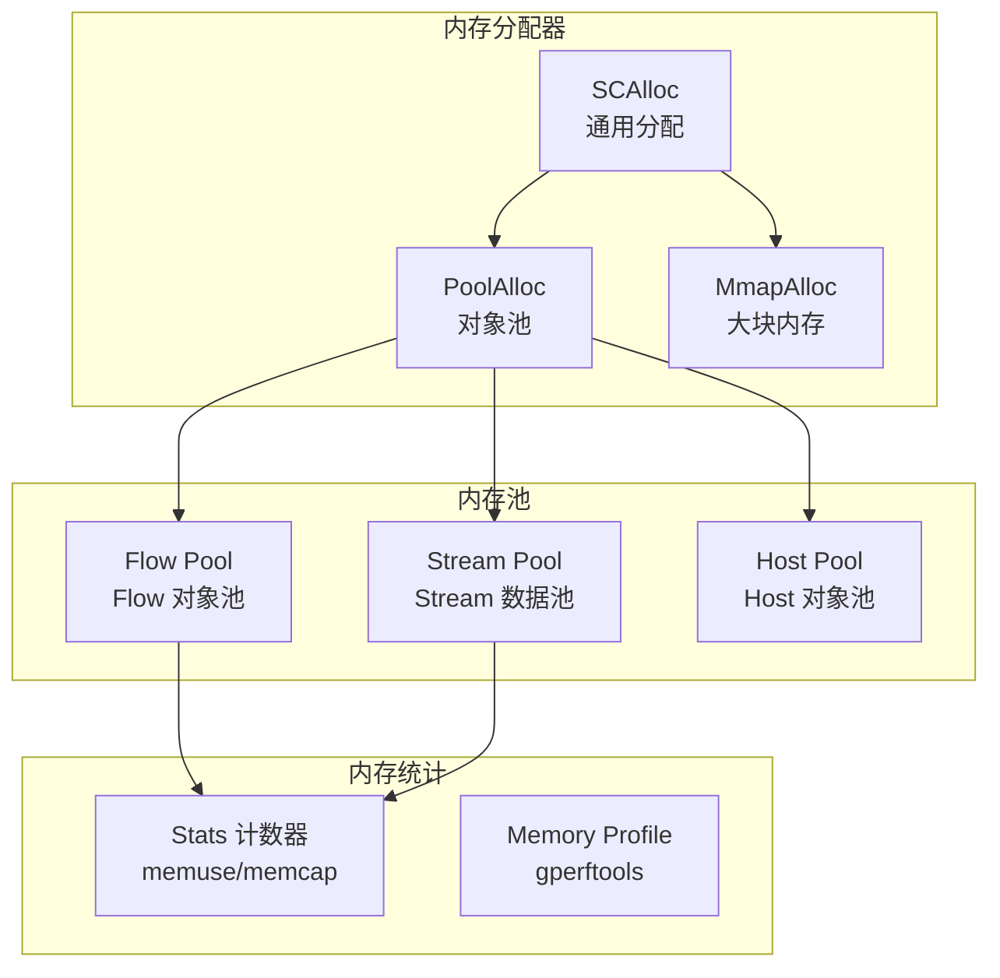
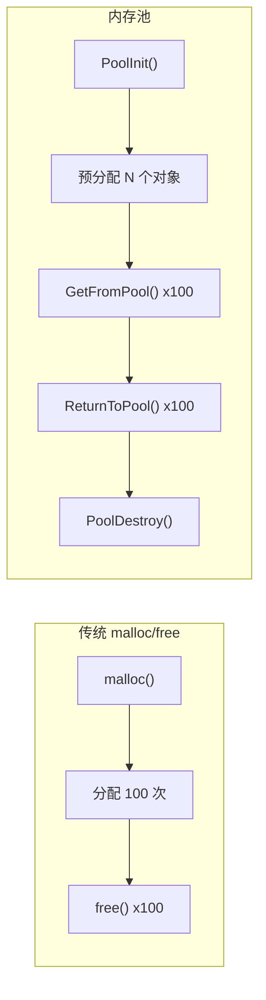

> [!info] Suricata 2026 深度探索系列 0. [[2026-04-15-suricata-deep-dive-series-index|全栈学习路径总览]]
>
> 1. [[2026-04-15-suricata-deep-dive-ch1-overview|第一章：Suricata 概述]]
> 2. [[2026-04-15-suricata-deep-dive-ch2-config|第二章：Suricata 配置系统]]
> 3. [[2026-04-15-suricata-deep-dive-ch3-runmodes|第三章：Runmodes 运行模式]]
> 4. [[2026-04-15-suricata-deep-dive-ch4-thread-model|第四章：线程模型]]
> 5. [[2026-04-15-suricata-deep-dive-ch5-capture|第五章：Capture 初始化]]
> 6. [[2026-04-15-suricata-deep-dive-ch6-af-packet|第六章：AF-PACKET 接口]]
> 7. [[2026-04-15-suricata-deep-dive-ch7-pcap|第七章：PCAP 接口]]
> 8. [[2026-04-15-suricata-deep-dive-ch8-nfq|第八章：NFQ 与 PF_RING 模式]]
> 9. [[2026-04-15-suricata-deep-dive-ch9-dpdk|第九章：DPDK 接口]]
> 10. [[2026-04-15-suricata-deep-dive-ch10-loadbalancing|第十章：多线程抓包与负载均衡]]
> 11. [[2026-04-15-suricata-deep-dive-ch11-detect-engine|第十一章：检测引擎架构]]
> 12. [[2026-04-15-suricata-deep-dive-ch12-signatures|第十二章：规则解析]]
> 13. [[2026-04-15-suricata-deep-dive-ch13-mpm|第十三章：多模式匹配]]
> 14. [[2026-04-15-suricata-deep-dive-ch14-filemagic|第十四章：文件识别]]
> 15. [[2026-04-15-suricata-deep-dive-ch15-lua-detect|第十五章：Lua 检测]]
> 16. [[2026-04-15-suricata-deep-dive-ch16-app-layer|第十六章：应用层协议解析]]
> 17. [[2026-04-15-suricata-deep-dive-ch17-http|第十七章：HTTP 协议解析]]
> 18. [[2026-04-15-suricata-deep-dive-ch18-dns|第十八章：DNS 协议解析]]
> 19. [[2026-04-15-suricata-deep-dive-ch19-tls|第十九章：TLS 协议解析]]
> 20. [[2026-04-15-suricata-deep-dive-ch20-smb|第二十章：SMB 协议解析]]
> 21. [[2026-04-15-suricata-deep-dive-ch21-http2|第二十一章：HTTP/2 协议解析]]
> 22. [[2026-04-15-suricata-deep-dive-ch22-flow|第二十二章：Flow 管理]]
> 23. [[2026-04-15-suricata-deep-dive-ch23-flow-timeout|第二十三章：Flow 超时]]
> 24. [[2026-04-15-suricata-deep-dive-ch24-flowbit|第二十四章：Flowbit 与 Flow 变量]]
> 25. [[2026-04-15-suricata-deep-dive-ch25-host|第二十五章：Host 管理]]
> 26. [[2026-04-15-suricata-deep-dive-ch26-stream|第二十六章：Stream 重组引擎]]
> 27. [[2026-04-15-suricata-deep-dive-ch27-stream-policy|第二十七章：TCP 重组策略]]
> 28. [[2026-04-15-suricata-deep-dive-ch28-stream-depth|第二十八章：Stream 深度配置]]
> 29. [[2026-04-15-suricata-deep-dive-ch29-eve|第二十九章：EVE JSON 输出]]
> 30. [[2026-04-15-suricata-deep-dive-ch30-alerts|第三十章：Alerts 输出]]
> 31. [[2026-04-15-suricata-deep-dive-ch31-stats|第三十一章：Stats 统计]]
> 32. [[2026-04-15-suricata-deep-dive-ch32-file-log|第三十二章：File Log]]
> 33. [[2026-04-15-suricata-deep-dive-ch33-unified2|第三十三章：Unified2]]
> 34. [[2026-04-15-suricata-deep-dive-ch34-rules|第三十四章：规则语法]]
> 35. [[2026-04-15-suricata-deep-dive-ch35-http-sids|第三十五章：HTTP 规则]]
> 36. [[2026-04-15-suricata-deep-dive-ch36-dns-sids|第三十六章：DNS 规则]]
> 37. [[2026-04-15-suricata-deep-dive-ch37-tls-sids|第三十七章：TLS 规则]]
> 38. [[2026-04-15-suricata-deep-dive-ch38-counters|第三十八章：性能计数器]]
> 39. **第三十九章：内存管理**
> 40. [[2026-04-15-suricata-deep-dive-ch40-hyperscan|第四十章：Hyperscan MPM]]

---

## 1. 内存管理概述

Suricata 的内存管理系统负责高效地分配和释放各种数据结构，包括 Flow、Packet、Stream、检测上下文等。系统采用**内存池（Pool）**与**区域分配（Zone Allocator）**相结合的策略，兼顾分配速度和内存利用率。



### 1.1 内存配置重要性

| 场景         | 默认值 | 问题     | 优化方向               |
| :----------- | :----- | :------- | :--------------------- |
| 高流量 IDS   | 1GB    | 丢包     | 增大 flow.memcap       |
| 大规模规则集 | 256MB  | MPM 慢   | 增大 mpm/ac 内存       |
| 长连接监控   | 512MB  | 流超时   | 增大 stream.memcap     |
| 文件提取     | 512MB  | 文件截断 | 增大 file-store.memcap |

---

## 2. Memory 配置详解

### 2.1 全局内存配置

```yaml
# suricata.yaml
memory:
  # 全局内存容量限制
  max-memcap: 2048 # 最大内存使用 (MB)

  # 超出限制时的行为
  memblock-limit: 16384 # 单块分配上限 (KB)

  # 内存统计
  print-summary: yes # 启动时打印内存摘要
```

### 2.2 Flow 内存配置

```yaml
# suricata.yaml
flow:
  # Flow 内存容量
  memcap: 256mb                         # Flow 表最大内存

  # Flow 哈希表大小
  hash-size: 65536                      # Flow 哈希桶数

  # Flow 预分配
  prealloc: 512                         # 预分配的 Flow 数

  # Emergency 模式
  emergency回收: yes                     # 启用紧急回收
 memcap: 64mb                          # Emergency 模式内存上限
```

### 2.3 Stream 内存配置

```yaml
# suricata.yaml
stream:
  # Stream 重组内存
  memcap: 256mb # Stream 内存上限

  # 每个 Flow 的 Stream 内存
  max-midstream: 16mb # 中间流最大内存
  max-syndata: 16kb # SYN 数据缓冲

  # 重组队列
  reassembly:
    memcap: 256mb # 重组内存上限
    depth: 1mb # 重组深度
    toserver-chunk-size: 2560 # 服务端分块大小
    toclient-chunk-size: 2560 # 客户端分块大小
```

### 2.4 Host 内存配置

```yaml
# suricata.yaml
host:
  memcap: 256mb # Host 表内存上限
  hash-size: 4096 # Host 哈希桶数
  prealloc: 256 # 预分配数
```

---

## 3. 核心内存分配器

### 3.1 SCAlloc 通用分配

```c
// src/util-mem.h — 内存分配接口
#define SCAlloc(size, type) ((type *)ScrubbedAlloc((size) * sizeof(type)))
#define SCCalloc(nmemb, size, type) ((type *)ScrubbedCalloc((nmemb) * sizeof(type)))
#define SCRealloc(ptr, size, type) ((type *)ScrubbedRealloc((ptr), (size) * sizeof(type)))
#define SCFree(ptr) do { void **_ptr = (void **)(ptr); if (*_ptr) { \
    SCActualFree(*_ptr); *_ptr = NULL; } } while(0)
```

### 3.2 分配实现

```c
// src/util-mem.c — 实际内存分配
static void *ScrubbedAlloc(size_t size)
{
    /* 检查内存限制 */
    if (!SCMemcapCheck(size)) {
        /* 记录内存不足事件 */
        SCLogError("Memory cap exceeded, cannot allocate %zu bytes", size);
        return NULL;
    }

    /* 更新统计 */
    SCMemuseUpdate(size);

    /* 分配内存 */
    void *ptr = malloc(size);
    if (ptr == NULL) {
        SCLogError("malloc failed for %zu bytes", size);
        return NULL;
    }

    /* 清零（安全） */
    memset(ptr, 0, size);

    return ptr;
}

static void *ScrubbedCalloc(size_t nmemb, size_t size)
{
    /* 内存限制检查 */
    size_t total = nmemb * size;
    if (!SCMemcapCheck(total)) {
        return NULL;
    }

    /* 更新统计 */
    SCMemuseUpdate(total);

    /* calloc 分配并清零 */
    void *ptr = calloc(nmemb, size);
    if (ptr == NULL) {
        SCLogError("calloc failed for %zu bytes", total);
        return NULL;
    }

    return ptr;
}
```

### 3.3 内存限制检查

```c
// src/util-mem.c — 内存限制检查
static uint64_t global_memcap = 2048 * 1024 * 1024;  // 2GB 默认
static uint64_t global_memuse = 0;
static SCMutex mem_mutex = SCMUTEX_INITIALIZER;

bool SCMemcapCheck(uint64_t size)
{
    bool ret = false;

    SCMutexLock(&mem_mutex);

    /* 检查是否超过全局限制 */
    if (global_memuse + size <= global_memcap) {
        ret = true;
    } else {
        /* 触发内存压力处理 */
        ret = SCMemHandleEmergency(size);
    }

    SCMutexUnlock(&mem_mutex);
    return ret;
}

void SCMemuseUpdate(uint64_t size)
{
    SCMutexLock(&mem_mutex);
    global_memuse += size;
    SCMutexUnlock(&mem_mutex);
}
```

---

## 4. 内存池 (Memory Pool)

### 4.1 内存池概述

内存池是一种预分配固定大小对象的分配策略，避免频繁的 malloc/free 调用，减少内存碎片。



### 4.2 MPool 结构

```c
// src/util-pool.h — 内存池结构
typedef struct MPool_ {
    /* 池名称 */
    char *name;

    /* 对象大小 */
    uint32_t object_size;

    /* 预分配数量 */
    uint32_t prealloc;

    /* 最大对象数 */
    uint32_t max;

    /* 可用对象栈 */
    void **free_stack;
    uint32_t free_count;
    uint32_t free_cap;

    /* 已分配对象计数 */
    uint32_t alloc_count;
    uint32_t peak_count;

    /* 内存分配器 */
    void *(*Alloc)(uint32_t);
    void (*Free)(void *);

    /* 统计数据 */
    uint64_t memuse;
    uint64_t memcap;

    /* 锁 */
    SCMutex mutex;

    /* 下一个池 */
    struct MPool_ *next;
} MPool;
```

### 4.3 内存池初始化

```c
// src/util-pool.c — 创建内存池
MPool *MPoolInit(char *name, uint32_t object_size,
                 uint32_t prealloc, uint32_t max)
{
    MPool *pool = SCCalloc(1, sizeof(MPool));

    /* 设置池参数 */
    pool->name = SCStrdup(name);
    pool->object_size = object_size;
    pool->prealloc = prealloc;
    pool->max = max;

    /* 初始化空闲栈 */
    pool->free_cap = prealloc + 64;  // 预留空间
    pool->free_stack = SCCalloc(pool->free_cap, sizeof(void *));

    /* 预分配对象 */
    for (uint32_t i = 0; i < prealloc; i++) {
        void *obj = malloc(object_size);
        if (obj == NULL) {
            SCLogWarning("Failed to prealloc %u objects for pool %s",
                        prealloc, name);
            break;
        }
        pool->free_stack[i] = obj;
        pool->free_count++;
        pool->memuse += object_size;
    }

    pool->alloc_count = 0;

    return pool;
}
```

### 4.4 从池获取对象

```c
// src/util-pool.c — 从池中获取对象
void *MPoolGet(MPool *pool)
{
    void *obj = NULL;

    SCMutexLock(&pool->mutex);

    /* 检查是否有可用对象 */
    if (pool->free_count > 0) {
        /* 从栈顶获取 */
        obj = pool->free_stack[--pool->free_count];
        pool->free_stack[pool->free_count] = NULL;
    } else {
        /* 检查是否达到上限 */
        if (pool->alloc_count < pool->max) {
            /* 分配新对象 */
            obj = malloc(pool->object_size);
            if (obj != NULL) {
                pool->alloc_count++;
                pool->memuse += pool->object_size;
            }
        } else {
            /* 池已满，记录统计 */
            SCPoolIncrUsecnt(pool);
        }
    }

    SCMutexUnlock(&pool->mutex);

    /* 清零对象 */
    if (obj != NULL) {
        memset(obj, 0, pool->object_size);
    }

    return obj;
}
```

### 4.5 归还对象到池

```c
// src/util-pool.c — 归还对象到池
void MPoolReturn(MPool *pool, void *obj)
{
    if (obj == NULL) return;

    SCMutexLock(&pool->mutex);

    /* 检查栈是否有空间 */
    if (pool->free_count < pool->free_cap) {
        /* 放回栈中 */
        pool->free_stack[pool->free_count++] = obj;
    } else {
        /* 扩容栈 */
        pool->free_cap *= 2;
        void **new_stack = SCRealloc(pool->free_stack,
                                     pool->free_cap * sizeof(void *));
        if (new_stack != NULL) {
            pool->free_stack = new_stack;
            pool->free_stack[pool->free_count++] = obj;
        } else {
            /* 扩容失败，直接释放 */
            free(obj);
            pool->memuse -= pool->object_size;
        }
    }

    SCMutexUnlock(&pool->mutex);
}
```

---

## 5. Flow 内存池

### 5.1 FlowPool

```c
// src/tm-flow.h — Flow 内存池
typedef struct FlowQueue_ {
    /* Flow 队列 */
    Flow *head;
    Flow *tail;
    uint32_t len;

    /* 队列锁 */
    SCSpinlock lock;
} FlowQueue;

typedef struct FlowPool_ {
    /* 内存池 */
    MPool *pool;

    /* 紧急模式队列 */
    FlowQueue emergency_queue;

    /* 统计 */
    uint64_t alloc_cnt;
    uint64_t free_cnt;
    uint64_t reuse_cnt;
} FlowPool;

extern FlowPool *flow_pool;

// src/tm-flow.c — Flow 池初始化
FlowPool *FlowPoolInit(void)
{
    FlowPool *fp = SCCalloc(1, sizeof(FlowPool));

    /* 创建 Flow 内存池 */
    fp->pool = MPoolInit("flow", sizeof(Flow),
                         de_ctx->flow_prealloc,   // 预分配数
                         de_ctx->flow_hash_size); // 最大数

    /* 初始化紧急队列 */
    fp->emergency_queue.head = NULL;
    fp->emergency_queue.tail = NULL;
    fp->emergency_queue.len = 0;

    return fp;
}
```

### 5.2 Flow 分配

```c
// src/tm-flow.c — 分配 Flow
Flow *FlowAlloc(void)
{
    Flow *f = (Flow *)MPoolGet(flow_pool->pool);
    if (f != NULL) {
        flow_pool->alloc_cnt++;

        /* 初始化 Flow 关键字段 */
        f->protomap = 0;
        f->flow_state = FLOW_STATE_NEW;
        f->last_timeout_update = 0;

        /* 初始化引用计数 */
        f->use_cnt = 1;
        f->proto = 0;
    }
    return f;
}

// 释放 Flow
void FlowFree(Flow *f)
{
    if (f == NULL) return;

    /* 清理 Flow 内容 */
    FlowClear(f);

    /* 归还到池 */
    MPoolReturn(flow_pool->pool, f);
    flow_pool->free_cnt++;
}
```

---

## 6. Stream 内存管理

### 6.1 Stream Memory Config

```c
// src/stream-tcp.h — Stream 内存配置
typedef struct StreamTcpState_ {
    /* Stream 重组内存 */
    uint64_t reassembly_memuse;         // 当前使用
    uint64_t reassembly_memcap;         // 上限

    /* 发送端 Stream */
    TcpStream to_server;                // 服务端 → 客户端
    TcpStream to_client;                // 客户端 → 服务端

    /* 重组队列 */
    TcpSegmentQueue *seg_queue;         // 待重组段队列
} StreamTcpState;

typedef struct TcpStream_ {
    /* 缓冲区 */
    uint8_t *buf;                      // 数据缓冲区
    uint32_t buf_len;                  // 缓冲区长度
    uint32_t data_len;                 // 实际数据长度

    /* 滑动窗口 */
    uint64_t window_base;              // 窗口基准
    uint64_t last_ack;                 // 最后确认号

    /* 内存统计 */
    uint32_t ssn_memuse;               // 会话内存使用
} TcpStream;
```

### 6.2 Stream 内存限制

```c
// src/stream-tcp-reassemble.c — Stream 重组内存管理
bool StreamReassemblyCheckMemuse(uint32_t need)
{
    /* 全局重组内存检查 */
    if (stream_config.reassembly_memuse + need >
        stream_config.reassembly_memcap) {

        /* 触发 Emergency 清理 */
        StreamReassemblyEmergencyCleanup();

        if (stream_config.reassembly_memuse + need >
            stream_config.reassembly_memcap) {
            return false;
        }
    }
    return true;
}

static void StreamReassemblyEmergencyCleanup(void)
{
    /* 按最近活跃时间排序 Flow */
    /* 清理最不活跃的 Flow 的重组数据 */

    SCLogDebug("Emergency cleanup: memuse=%lu, memcap=%lu",
               stream_config.reassembly_memuse,
               stream_config.reassembly_memcap);
}
```

### 6.3 分块大小配置

```yaml
# suricata.yaml
stream:
  reassembly:
    toserver-chunk-size: 2560 # 服务端分块（MTU 范围内）
    toclient-chunk-size: 2560 # 客户端分块
    segment-prealloc: 100 # 预分配段数
    depth: 1mb # 重组深度限制
```

---

## 7. Packet 内存池

### 7.1 PacketPool

```c
// src/packet.h — Packet 池
typedef struct PacketPool_ {
    /* per-thread 本地池 */
    PacketQueue *local_queue;
    uint32_t local_len;

    /* 全局共享池 */
    PacketQueue *global_queue;
    SCSpinlock global_lock;

    /* 统计 */
    uint64_t alloc_cnt;
    uint64_t free_cnt;
} PacketPool;

extern PacketPool packet_pool;

// src/packet.c — 初始化 Packet 池
void PacketPoolInit(PacketPool *pp)
{
    /* 分配本地队列 */
    pp->local_queue = SCCalloc(1, sizeof(PacketQueue));
    pp->local_queue->head = NULL;
    pp->local_queue->tail = NULL;
    pp->local_queue->len = 0;

    /* 分配全局队列 */
    pp->global_queue = SCCalloc(1, sizeof(PacketQueue));

    /* 预分配 Packets */
    for (int i = 0; i < 64; i++) {
        Packet *p = PacketAlloc();
        if (p != NULL) {
            PacketEnqueue(pp->local_queue, p);
        }
    }
}
```

### 7.2 Packet 分配

```c
// src/packet.c — 从池获取 Packet
Packet *PacketGetFromQueueOrAlloc(void)
{
    ThreadVars *tv = (ThreadVars *)pthread_getspecific(thread_key);
    PacketPool *pp = &packet_pool;

    /* 先尝试本地池 */
    if (pp->local_queue->len > 0) {
        Packet *p = PacketDequeue(pp->local_queue);
        if (p != NULL) {
            PACKET_REINIT(p);
            return p;
        }
    }

    /* 本地池空，尝试全局池 */
    SCSpinlockLock(&pp->global_lock);
    if (pp->global_queue->len > 0) {
        Packet *p = PacketDequeue(pp->global_queue);
        SCSpinlockUnlock(&pp->global_lock);
        if (p != NULL) {
            PACKET_REINIT(p);
            return p;
        }
    }
    SCSpinlockUnlock(&pp->global_lock);

    /* 池都空，直接分配 */
    return PacketAlloc();
}
```

---

## 8. 内存统计与监控

### 8.1 内存统计计数器

```c
// src/util-mem.c — 内存统计
static uint64_t mem_stats[CMEM_ALIVE];
static const char *mem_names[CMEM_ALIVE] = {
    "Packet",
    "Flow",
    "FlowTimeout",
    "Stream",
    "Detect",
    "TcpSession",
    "Host",
    "Pool"
};

typedef enum {
    CMEM_PKT = 0,
    CMEM_FLOW,
    CMEM_FLOW_TIMEOUT,
    CMEM_STREAM,
    CMEM_DETECT,
    CMEM_TCPSESSION,
    CMEM_HOST,
    CMEM_POOL,
    CMEM_ALIVE
} CSMemType;

void SCMemPrintStats(void)
{
    printf("\n=== Memory usage summary ===\n");
    printf("%-20s | %12s | %12s\n", "Type", "Current", "Peak");
    printf("---------------------|-------------|-------------\n");

    for (int i = 0; i < CMEM_ALIVE; i++) {
        printf("%-20s | %12lu | %12lu\n",
               mem_names[i],
               mem_stats[i],
               peak_stats[i]);
    }

    printf("\nTotal: %lu bytes (%.2f MB)\n",
           total_memuse, total_memuse / 1024.0 / 1024.0);
}
```

### 8.2 /proc 内存监控

```bash
# 查看 Suricata 进程内存
cat /proc/$(pidof suricata)/status | grep -E "VmRSS|VmSize|VmPeak"

# 连续监控
watch -n 1 'cat /proc/$(pidof suricata)/status | grep -E "Vm"'
```

### 8.3 perf 工具分析

```bash
# 使用 perf 记录内存分配
perf record -g -p $(pidof suricata) -e kmem:* -- sleep 30

# 查看热点分配
perf report --stdio --symbol-filter='*Alloc*'
```

---

## 9. Emergency 模式

### 9.1 Emergency 触发

```c
// src/util-mem.c — Emergency 模式处理
static bool EmergencyActive = false;

bool SCMemHandleEmergency(uint64_t need)
{
    if (EmergencyActive) {
        /* 已经在 Emergency 模式，等待清理 */
        return false;
    }

    /* 激活 Emergency 模式 */
    EmergencyActive = true;
    SCLogWarning("Memory emergency mode activated");

    /* 触发各组件清理 */
    FlowEmergencyWakeup();
    StreamEmergencyCleanup();
    HostEmergencyCleanup();

    /* 重新检查 */
    if (global_memuse + need <= global_memcap) {
        EmergencyActive = false;
        return true;
    }

    return false;
}
```

### 9.2 Flow Emergency

```c
// src/tm-flow.c — Flow Emergency 处理
void FlowEmergencyWakeup(void)
{
    SCLogDebug("Flow emergency: starting cleanup");

    /* 强制超时最老的 Flows */
    struct timeval ts;
    gettimeofday(&ts, NULL);

    /* 获取所有超时 Flow 并释放 */
    Flow *f = NULL;
    while ((f = FlowQueueExtractTimed(&flow_timeout_queue, &ts)) != NULL) {
        FlowFree(f);
    }

    /* 如果还不足，强制关闭低优先级 Flow */
    if (global_memuse > global_memcap * 9 / 10) {
        FlowForceReassembly();
    }
}
```

---

## 10. 内存配置调优实战

### 10.1 低内存环境 (4GB)

```yaml
# suricata.yaml — 低内存配置
memory:
  max-memcap: 1536 # 使用 1.5GB

flow:
  memcap: 128mb
  hash-size: 32768
  prealloc: 256
  emergency回收: yes

stream:
  memcap: 128mb
  reassembly:
    memcap: 128mb
    depth: 512kb # 减小重组深度

host:
  memcap: 64mb
```

### 10.2 高性能环境 (16GB+)

```yaml
# suricata.yaml — 高性能配置
memory:
  max-memcap: 8192 # 使用 8GB

flow:
  memcap: 1024mb
  hash-size: 262144
  prealloc: 2048

stream:
  memcap: 512mb
  reassembly:
    memcap: 512mb
    depth: 4mb # 完整重组
    toserver-chunk-size: 32768 # 大分块
    toclient-chunk-size: 32768

host:
  memcap: 512mb
```

### 10.3 内存调试

```bash
# 启用内存调试
valgrind --leak-check=full --show-leak-kinds=all \
    --log-file=valgrind.log suricata -c suricata.yaml -i eth0

# 启用 gperftools
LD_PRELOAD=/usr/lib/libprofiler.so CPUPROFILE=suricata.prof \
    suricata -c suricata.yaml -i eth0

# 分析结果
google-pprof --text suricata suricata.prof
```

---

## 11. 小结

本章深入解析了 Suricata 的内存管理系统：

1. **内存配置**：memory.memcap、flow.memcap、stream.memcap 等全局和组件级别限制
2. **通用分配器**：SCAlloc/SCCalloc/SCFree 封装，检查 memcap、统计 memuse
3. **内存池**：MPool 预分配策略，FlowPool、PacketPool 等专用池
4. **Flow 内存**：Flow 预分配、FlowQueue 紧急回收机制
5. **Stream 内存**：重组内存限制、segment 分块管理
6. **Packet 内存**：per-thread 本地池 + 全局池，减少锁竞争
7. **Emergency 模式**：内存不足时触发各组件紧急清理
8. **调优实战**：低内存和高性能环境配置示例
