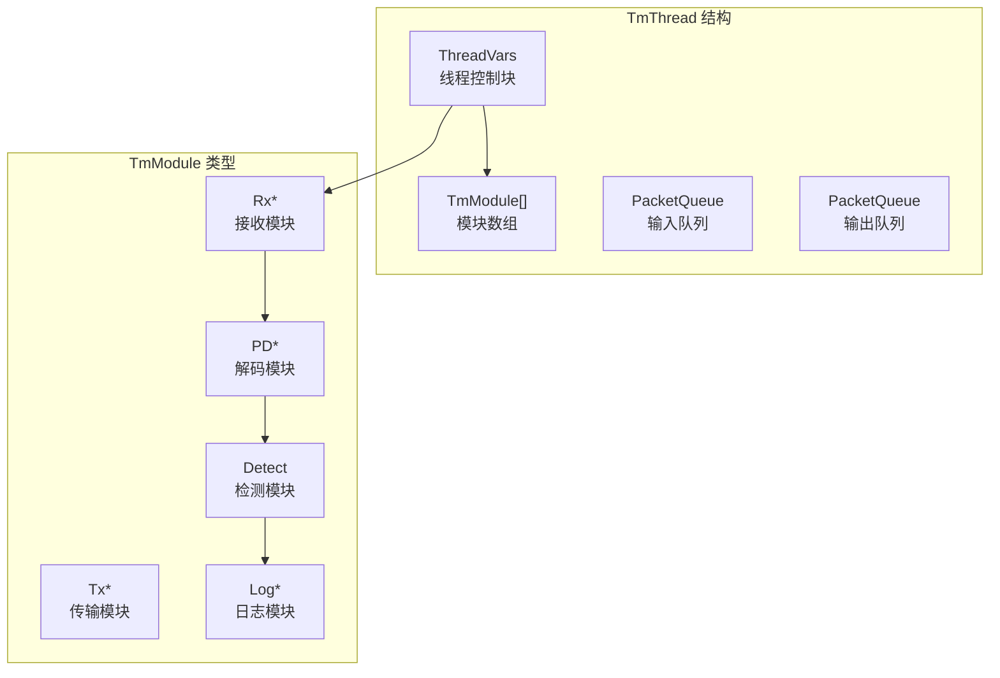

> [!info] Suricata 2026 深度探索系列 0. [[2026-04-15-suricata-deep-dive-series-index|全栈学习路径总览]]
>
> 1. [[2026-04-15-suricata-deep-dive-ch1-overview|第一章：Suricata 概述]]
> 2. [[2026-04-15-suricata-deep-dive-ch2-config|第二章：Suricata 配置系统]]
> 3. [[2026-04-15-suricata-deep-dive-ch3-runmodes|第三章：Runmodes 运行模式]]
> 4. **第四章：线程模型**
> 5. [[2026-04-15-suricata-deep-dive-ch5-capture|第五章：Capture 初始化]]

---

## 1. 线程模型概述

Suricata 采用 **TM (Thread Module)** 架构，将功能拆分为独立的 **TmModule**（线程模块），通过 **TmThread**（线程变量）组合成处理流水线。



---

## 2. 核心数据结构

### 2.1 ThreadVars 线程控制块

```c
// src/tm-threads.h — 线程变量
typedef struct ThreadVars_ {
    /* 线程标识 */
    const char *name;           // 线程名称，如 "RxPkt#1"
    const char *thread_setup_name;
    int id;                      // 线程 ID (0-N)
    int thread_priority;         // 调度优先级

    /* 线程句柄 */
    pthread_t t;                 // POSIX 线程句柄
    ThreadInitFunc ThreadInit;   // 初始化回调
    ThreadDeinitFunc ThreadDeinit; // 清理回调
    void *initdata;             // 初始化数据
    void *running;               // 运行状态标志
    struct ThreadVars_ *next;   // 链表链接

    /* 模块管道 */
    TmSlot *tmr;                // 接收槽位
    TmSlot *tmd;                // 解码槽位
    TmSlot *tmm;                // 主处理槽位

    /* 队列连接 */
    PacketQueue *inq;            // 输入队列
    PacketQueue *outq;           // 输出队列
    PacketQueue *trans_q;       // 传输队列

    /* TM 标志位 */
    uint8_t type;                // 线程类型
    uint8_t status;             // 线程状态
    bool quit;                  // 退出标志
    bool capsule_state;         // 线程状态

    /* 统计 */
    uint16_t tm_id;             // TmModule ID
    uint64_t pkts;              // 处理包数
} ThreadVars;
```

### 2.2 TmModule 线程模块

```c
// src/tm-modules.h — 线程模块定义
typedef struct TmModule_ {
    int id;                      // 模块 ID
    const char *name;            // 模块名称

    /* 模块能力标志 */
    uint8_t flags;              // TM_FLAG_* 组合
#define TM_FLAG_RECEIVE_TM      0x01   // 接收模块
#define TM_FLAG_decode_TM        0x02   // 解码模块
#define TM_FLAG_DETECT_TM        0x04   // 检测模块
#define TM_FLAG_LOG_TM           0x08   // 日志模块
#define TM_FLAG_CAPONE_TM        0x10   // 独占 CPU

    /* 核心接口 */
    TmEcode (*ThreadInit)(ThreadVars *, const void *, void **);
    TmEcode (*ThreadDeinit)(ThreadVars *, void *);
    TmEcode (*Management)(ThreadVars *);  // 管理函数
    TmEcode (*Func)(ThreadVars *, Packet *);  // 包处理函数

    /* 下一模块 */
    struct TmModule_ *next;
} TmModule;
```

### 2.3 TmSlot 槽位

```c
// src/tm-slot.h — 槽位（模块包装）
typedef struct TmSlot_ {
    /* 槽位 ID */
    int slot_id;

    /* 指向的 TmModule */
    TmModule *tm;

    /* 槽位数据 */
    void *slot_data;             // 模块私有数据

    /* 下一槽位 */
    struct TmSlot_ *slot_next;

    /* 槽位配置 */
    struct {
        int threads;             // 槽位线程数
        int n来分配;              // numa 节点
    } slot_thread;
} TmSlot;
```

---

## 3. 内置 TM 模块一览

### 3.1 模块注册表

```c
// src/tm-modules.c — 模块注册表
TmModule TmModules[] = {
    /* 接收模块 (Rx) */
    { TM_MODULE_RECEIVE, "ReceiveAFPacket", TM_FLAG_RECEIVE_TM, ... },
    { TM_MODULE_RECEIVE, "ReceivePcap", TM_FLAG_RECEIVE_TM, ... },
    { TM_MODULE_RECEIVE, "ReceiveNFQ", TM_FLAG_RECEIVE_TM, ... },
    { TM_MODULE_RECEIVE, "ReceiveDPDK", TM_FLAG_RECEIVE_TM, ... },

    /* 解码模块 (Decode) */
    { TM_MODULE_DECODE, "DecodeEthernet", TM_FLAG_DECODE_TM, ... },
    { TM_MODULE_DECODE, "DecodeIP", TM_FLAG_DECODE_TM, ... },
    { TM_MODULE_DECODE, "DecodeTCP", TM_FLAG_DECODE_TM, ... },
    { TM_MODULE_DECODE, "DecodeUDP", TM_FLAG_DECODE_TM, ... },

    /* 检测模块 (Detect) */
    { TM_MODULE_DETECT, "Detect", TM_FLAG_DETECT_TM, ... },

    /* 日志模块 (Log) */
    { TM_MODULE_LOG, "LogFile", TM_FLAG_LOG_TM, ... },
    { TM_MODULE_LOG, "LogEve", TM_FLAG_LOG_TM, ... },
    { TM_MODULE_LOG, "LogAlert", TM_FLAG_LOG_TM, ... },

    /* Verdict 模块 */
    { TM_VERDICT, "VerdictNFQ", TM_FLAG_VERDICT_TM, ... },
    { TM_VERDICT, "VerdictIPFW", TM_FLAG_VERDICT_TM, ... },

    { {0}, NULL, 0, NULL }
};
```

---

## 4. 线程创建流程

### 4.1 TmThreadCreate

```c
// src/tm-threads.c — 创建线程
ThreadVars *TmThreadCreatePacketHandler(
    const char *name,          // "Worker#1"
    const char *inq_name,      // "packetpool" 输入队列
    const char *outq_name,     // "packetpool" 输出队列
    const char *management,    // 管理函数名
    const char *management_name)
{
    ThreadVars *tv = SCCalloc(1, sizeof(ThreadVars));

    /* 设置线程名称 */
    tv->name = name;

    /* 创建输入队列 */
    if (strcmp(inq_name, "packetpool") == 0) {
        tv->inq = &packet_pool;
    } else {
        tv->inq = CreateQueue(inq_name);
    }

    /* 分配槽位数组 */
    tv->tmr = SCCalloc(1, sizeof(TmSlot));

    return tv;
}
```

### 4.2 TmThreadSpawn

```c
// src/tm-threads.c — 启动线程
TmEcode TmThreadSpawn(ThreadVars *tv)
{
    /* 设置线程属性 */
    pthread_attr_t attr;
    pthread_attr_init(&attr);

    /* 设置 CPU 亲和（如果配置了）*/
    if (tv->thread_priority > 0) {
        cpu_set_t cpuset;
        CPU_ZERO(&cpuset);
        CPU_SET(tv->id % GetCPUCount(), &cpuset);  // 简单亲和策略
        pthread_attr_setaffinity_np(&attr, sizeof(cpu_set_t), &cpuset);
    }

    /* 创建线程 */
    if (pthread_create(&tv->t, &attr, ThreadWrapper, tv) != 0) {
        return TM_ECODE_FAILED;
    }

    return TM_ECODE_OK;
}

static void *ThreadWrapper(void *arg)
{
    ThreadVars *tv = (ThreadVars *)arg;

    /* 初始化模块 */
    if (tv->ThreadInit) {
        void *init_data = NULL;
        tv->ThreadInit(tv, tv->initdata, &init_data);
        tv->slot_data = init_data;
    }

    /* 执行主循环 */
    while (!tv->quit) {
        TmThreadsSlotVarRun(tv, NULL);
    }

    /* 清理 */
    if (tv->ThreadDeinit) {
        tv->ThreadDeinit(tv, tv->slot_data);
    }

    pthread_exit(NULL);
}
```

---

## 5. Packet 处理流水线

### 5.1 TmThreadsSlotVarRun

```c
// src/tm-threads.c — 槽位调度
TmEcode TmThreadsSlotVarRun(ThreadVars *tv, Packet *p)
{
    TmSlot *s = tv->slots;

    while (s != NULL) {
        TmModule *tm = s->tm;

        /* 执行槽位处理函数 */
        if (tm->Func) {
            /* 从输入队列取包（如果是接收槽位，p=NULL）*/
            if (tm->flags & TM_FLAG_RECEIVE_TM) {
                /* 接收模块：从网卡/队列取包 */
                while ((p = PacketGetFromQueueOrAlloc()) != NULL) {
                    TmEcode r = tm->Func(tv, p);
                    if (r != TM_ECODE_OK) {
                        break;
                    }
                }
            } else {
                /* 非接收模块：处理传入的包 */
                TmEcode r = tm->Func(tv, p);
                if (r != TM_ECODE_OK) {
                    return r;
                }
            }
        }

        s = s->slot_next;
    }

    return TM_ECODE_OK;
}
```

### 5.2 典型 Worker 线程流水线

```c
// src/runmode-af-packet.c — Worker 模式流水线
static int CreateWorkerThread(int i)
{
    ThreadVars *tv_worker = TmThreadCreatePacketHandler(
        "Worker#i", "packetpool", "packetpool", NULL, NULL);

    /* 设置模块槽位 */
    TmSlot *slot_decode = TmSlotAdd(tv_worker, "DecodeEthernet",
                                    TM_FLAG_DECODE_TM, NULL);
    TmSlotLink(slot_decode, "DecodeIP");
    TmSlotLink(slot_decode, "DecodeTCP");
    TmSlotLink(slot_decode, "DecodeUDP");

    TmSlot *slot_detect = TmSlotAdd(tv_worker, "Detect",
                                    TM_FLAG_DETECT_TM, NULL);

    TmSlot *slot_log = TmSlotAdd(tv_worker, "LogEve",
                                  TM_FLAG_LOG_TM, NULL);

    TmThreadSpawn(tv_worker);
}
```

---

## 6. CPU 亲和配置

### 6.1 配置

```yaml
# suricata.yaml
threading:
  cpu-affinity:
    - cpu: [0, 1, 2, 3] # 管理线程
      mode: "exclusive"
      threads: 1
    - cpu: [4, 5, 6, 7] # Worker 线程
      mode: "exclusive"
      threads: 4
    - cpu: [8, 9] # 流管理线程
      mode: "exclusive"
      threads: 2
```

### 6.2 CPU 亲和源码

```c
// src/threadvars.h — CPU 亲和定义
typedef struct CPUAffinity_ {
    int mode;                     // EXCLUSIVE, SHARED, ANY
    int cpu[CPU_SET_MAX];         // CPU 集合
    int cpu_max;                  // 最大 CPU 数
    int thread_count;             // 该集合的线程数
} CPUAffinity;

static CPUAffinity cpu_affinity[MAX_CPU_SET];

// src/tm-threads.c — 亲和设置
int TmThreadSetCPU(ThreadVars *tv, CPUAffinity *ca)
{
    cpu_set_t cpuset;
    CPU_ZERO(&cpuset);

    if (ca->mode == EXCLUSIVE) {
        /* 独占模式：每个线程绑定一个 CPU */
        int cpu_id = tv->id % ca->cpu_max;
        CPU_SET(ca->cpu[cpu_id], &cpuset);
    } else if (ca->mode == SHARED) {
        /* 共享模式：一组 CPU 绑定多个线程 */
        for (int i = 0; i < ca->cpu_max; i++) {
            CPU_SET(ca->cpu[i], &cpuset);
        }
    }

    pthread_setaffinity_np(tv->t, sizeof(cpu_set_t), &cpuset);
    return 0;
}
```

---

## 7. 队列与包池

### 7.1 PacketQueue

```c
// src/tm-queue.h — 队列结构
typedef struct PacketQueue_ {
    /* 队列锁 */
    SCSpinlock lock;

    /* 队列头尾 */
    Packet *head;
    Packet *tail;

    /* 计数 */
    uint32_t len;                // 当前长度
    uint32_t max_len;            // 最大长度

    /* 等待条件 */
    SCCtrlCondT cond;
    SCCtrlMutexT mtx;
} PacketQueue;
```

### 7.2 包池

```c
// src/packet.h — 包池管理
typedef struct PacketPool_ {
    PacketQueue *queues;         // per-thread 队列
    uint32_t queue_count;        // 队列数量
    int32_t max_pending_packets; // 配置项
} PacketPool;

extern PacketPool packet_pool;

/* 从池中获取包 */
Packet *PacketGetFromQueueOrAlloc(void)
{
    /* 先尝试从本地池取 */
    Packet *p = PacketDequeue(&tv->pq->local);
    if (p != NULL) return p;

    /* 本地池空，尝试全局池 */
    p = PacketDequeue(&packet_pool.global);
    if (p != NULL) return p;

    /* 池也空，分配新包 */
    return PacketAlloc();
}
```

---

## 8. 线程间协调

### 8.1 TVL (Thread Variable Local)

Suricata 使用 **Thread-Local Storage (TLS)** 存储线程私有数据：

```c
// src/threadvars.h — TLS 声明
/* 每个线程独立的 FlowHash */
extern __thread FlowHashTable *t_parsed_ht;

/* 每个线程独立的统计 */
extern __thread ThreadStats t_stats;

/* 每个线程独立的 stream 重组状态 */
extern __thread StreamReassembly *t_stream_reasm;
```

### 8.2 跨线程通信

```c
// src/tm-threads.c — 管理线程
static void *ThreadManagement(void *arg)
{
    ThreadVars *tv = (ThreadVars *)arg;

    /* 流管理循环 */
    while (!tv->quit) {
        /* 处理超时 Flow */
        FlowManagerTimeoutHandler();

        /* 处理超时 Stream */
        StreamReassemblyTimeoutHandler();

        /* 休眠 */
        sleep(1);
    }
}
```

---

## 9. 小结

本章解析了 Suricata 的线程模型：

1. **TmThread**：线程控制块，包含模块管道、队列、状态
2. **TmModule**：功能模块（Rx/Decode/Detect/Log）
3. **TmSlot**：模块槽位，串联成处理流水线
4. **PacketQueue**：线程间队列，使用无锁算法
5. **CPU Affinity**：支持独占/共享 CPU 集合配置

下一章我们将深入 **Capture 初始化**，从 `suricata.yaml` 的 `max-pending-packets`、`buffer-size` 等配置项追踪到 `source-*.c` 的源码实现。
