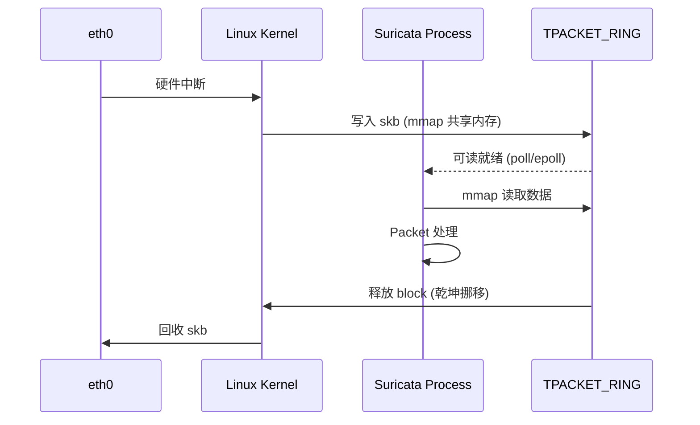

> [!info] Suricata 2026 深度探索系列 0. [[2026-04-15-suricata-deep-dive-series-index|全栈学习路径总览]]
>
> 1. [[2026-04-15-suricata-deep-dive-ch1-overview|第一章：Suricata 概述]]
> 2. [[2026-04-15-suricata-deep-dive-ch2-config|第二章：Suricata 配置系统]]
> 3. [[2026-04-15-suricata-deep-dive-ch3-runmodes|第三章：Runmodes 运行模式]]
> 4. [[2026-04-15-suricata-deep-dive-ch4-thread-model|第四章：线程模型]]
> 5. [[2026-04-15-suricata-deep-dive-ch5-capture|第五章：Capture 初始化]]
> 6. **第六章：AF-PACKET 接口**

---

## 1. AF-PACKET 概述

AF-PACKET 是 Linux 内核提供的原始套接字抓包接口，绕过 TCP/IP 协议栈，直接接收网卡上的原始帧。



### 1.1 TPACKET 版本演进

| 版本       | 特性                         | 内核要求 |
| :--------- | :--------------------------- | :------- |
| TPACKET_V1 | 基础环形缓冲区               | 2.6.27+  |
| TPACKET_V2 | 扩展元数据 (VLAN, timestamp) | 2.6.27+  |
| TPACKET_V3 | 灵活帧大小，支持 RX-Ring     | 3.2+     |

---

## 2. 配置详解

### 2.1 最小配置

```yaml
# suricata.yaml
af-packet:
  - interface: eth0
```

最简配置使用系统默认值：自动选择线程数、4KB 缓冲区、 promisc 模式。

### 2.2 完整配置项

```yaml
# suricata.yaml
af-packet:
  - interface: eth0
    # 线程相关
    threads: 8 # 抓包线程数 (auto=自动)
    use-per-node-hash: yes # 按 NUMA 节点分布线程

    # 缓冲区相关
    buffer-size: 4096 # 每个包缓冲大小 (KB)
    ring-size: 4096 # 环形缓冲区帧数

    # 混杂模式
    promisc: yes # 是否启用混杂模式
    snaplen: 0 # 截断长度 (0=完整)

    # TPACKET 选项
    tpacket-v3: yes # 使用 TPACKET_V3 (需要内核 3.2+)
    use-memory-mmap: yes # 使用 mmap 而非 posix_memalign

    # 镜像模式 (IDS旁路)
    copy-mode: none # none/ipc/router/send
    copy-iface: eth1 # 镜像目标接口

    # 高级选项
    xdp-mode: none # none/driver/generic
    xdp-filter-url: none # XDP 过滤程序路径
    checksum-checks: 1 # 校验和校验 (0=关闭, 1=内核, 2=用户态)
    bypass: yes # 启用 hardware bypass (需要 NIC 支持)

    # RSS (Receive Side Scaling)
    rss-aware: yes # 启用 RSS
    Defrag: yes # IP 分片重组
```

---

## 3. 源码解析

### 3.1 模块注册

```c
// src/source-af-packet.c — AF-PACKET 模块注册
void TmModuleReceiveAFPPacketRegister(void)
{
    tmm_modules[TMM_RECEIVEAFPACKET].name = "ReceiveAFPPacket";
    tmm_modules[TMM_RECEIVEAFPACKET].ThreadInit = AFPPacketThreadInit;
    tmm_modules[TMM_RECEIVEAFPACKET].Func = AFPPacketLoop;
    tmm_modules[TMM_RECEIVEAFPACKET].ThreadDeinit = AFPPacketThreadDeinit;
    tmm_modules[TMM_RECEIVEAFPACKET].flags = TM_FLAG_RECEIVE_TM;

    /* 注册输出模块 */
    TmModuleDumpAFPacketRegister();
}
```

### 3.2 配置读取

```c
// src/source-af-packet.c — 配置结构体
typedef struct AFPCaptureThreadConfig_ {
    int threads;                   // 抓包线程数
    int if_index;                  // 网卡索引
    int ring_size;                 // 环形缓冲区大小
    int buffer_size;               // 每个包缓冲区大小
    int snaplen;                   // 截断长度
    int promisc;                   // 混杂模式
    int xdp_mode;                  // XDP 模式
    int tpacket_v3;                // TPACKET 版本
    int use_mmap;                  // 使用 mmap
    int checksum_checks;           // 校验和检查
    int copy_mode;                 // 镜像模式
    char *copy_iface;               // 镜像目标接口
    int rss_aware;                 // RSS 支持
    int defrag;                    // 分片重组
} AFPCaptureThreadConfig;

// 配置读取函数
static int AFPCaptureConfig(AFPCaptureThreadConfig **config)
{
    /* 读取 buffer-size */
    const char *bs_str;
    if (ConfGet("af-packet.buffer-size", &bs_str) == 1) {
        (*config)->buffer_size = atoi(bs_str);
    } else {
        (*config)->buffer_size = 4096;  // 默认 4KB
    }

    /* 读取 ring-size */
    const char *rs_str;
    if (ConfGet("af-packet.ring-size", &rs_str) == 1) {
        (*config)->ring_size = atoi(rs_str);
    } else {
        (*config)->ring_size = 2048;  // 默认 2048 帧
    }

    /* 读取 tpacket-v3 */
    int tpacket_v3 = 0;
    (void)ConfGetBool("af-packet.tpacket-v3", &tpacket_v3);
    (*config)->tpacket_v3 = tpacket_v3;

    /* 读取 xdp-mode */
    const char *xdp_str;
    if (ConfGet("af-packet.xdp-mode", &xdp_str) == 1) {
        if (strcmp(xdp_str, "driver") == 0) {
            (*config)->xdp_mode = XDP_MODE_DRV;
        } else if (strcmp(xdp_str, "generic") == 0) {
            (*config)->xdp_mode = XDP_MODE_XDP;
        } else {
            (*config)->xdp_mode = XDP_MODE_NONE;
        }
    }
}
```

### 3.3 Socket 创建与绑定

```c
// src/source-af-packet.c — Socket 创建
static int AFPSocketOpen(const char *iface, int proto)
{
    /* 创建 AF_PACKET 原始套接字 */
    int fd = socket(AF_PACKET, SOCK_RAW, htons(proto));
    if (fd < 0) {
        SCLogError("AF_PACKET socket create failed: %s", strerror(errno));
        return -1;
    }

    /* 获取接口索引 */
    struct ifreq ifr;
    memset(&ifr, 0, sizeof(ifr));
    strlcpy(ifr.ifr_name, iface, IFNAMSIZ);

    if (ioctl(fd, SIOCGIFINDEX, &ifr) < 0) {
        close(fd);
        return -1;
    }

    /* 绑定到指定接口 */
    struct sockaddr_ll addr;
    memset(&addr, 0, sizeof(addr));
    addr.sll_family = AF_PACKET;
    addr.sll_ifindex = ifr.ifr_ifindex;
    addr.sll_protocol = htons(proto);

    if (bind(fd, (struct sockaddr *)&addr, sizeof(addr)) < 0) {
        close(fd);
        return -1;
    }

    return fd;
}
```

### 3.4 TPACKET_V3 环形缓冲区设置

```c
// src/source-af-packet.c — TPACKET_V3 内存映射
static int AFPSetupRingV3(int fd, int ring_size, int buffer_size)
{
    struct tpacket_req3 req;

    /* 块大小：必须是页面大小的整数倍 */
    req.tp_block_size = getpagesize() << 2;  // 16KB (4 * PAGE_SIZE)

    /* 块数量 */
    req.tp_block_nr = ring_size / (req.tp_block_size / getpagesize());

    /* 帧大小：必须是 tp_block_size 的约数 */
    req.tp_frame_size = buffer_size * 1024;  // 4KB

    /* 帧数量 */
    req.tp_frame_nr = (req.tp_block_size * req.tp_block_nr) / req.tp_frame_size;

    /* TPACKET_V3 特有选项 */
    req.tp_retire_blk_tov = 60;       // Block 超时 (ms)
    req.tp_feature_req_word = TP_FT_REQ_FILL_RXHASH;  // 请求 RX 哈希

    /* 设置环形缓冲区 */
    if (setsockopt(fd, SOL_PACKET, PACKET_RX_RING, &req, sizeof(req)) < 0) {
        SCLogWarning("PACKET_RX_RING failed: %s", strerror(errno));
        return -1;
    }

    /* mmap 映射环形缓冲区到用户态 */
    void *mmap_base = mmap(0, req.tp_block_size * req.tp_block_nr,
                           PROT_READ | PROT_WRITE, MAP_SHARED, fd, 0);
    if (mmap_base == MAP_FAILED) {
        return -1;
    }

    return 0;
}
```

### 3.5 XDP 集成

```c
// src/source-af-packet.c — XDP 模式设置
static int AFPSetupXDP(int fd, int xdp_mode, const char *filter_url)
{
    #ifdef HAVE_AF_XDP
    struct sockaddr_xdp addr;

    /* 设置 XDP socket 地址 */
    memset(&addr, 0, sizeof(addr));
    addr.sxdp_family = AF_XDP;
    addr.sxdp_flags = XDP_USE_NEED_WAKEUP;  // 启用 wakeup 机制

    if (xdp_mode == XDP_MODE_DRV) {
        addr.sxdp_flags |= XDP_FLAGS_DRV_MODE;
    } else if (xdp_mode == XDP_MODE_XDP) {
        addr.sxdp_flags |= XDP_FLAGS_HW_MODE;
    }

    /* 绑定 XDP socket */
    if (bind(fd, (struct sockaddr *)&addr, sizeof(addr)) < 0) {
        SCLogWarning("XDP bind failed: %s", strerror(errno));
        return -1;
    }

    /* 加载 XDP 过滤程序 (可选) */
    if (filter_url) {
        struct bpf_object *obj = bpf_object__open(filter_url);
        struct bpf_program *prog = bpf_object__find_program_by_title(obj, "xdp_filter");
        bpf_prog_load_xattr(attr, &obj, &prog_fd);

        setsockopt(fd, SOL_XDP, XDP_ATTACH_PROG, &prog_fd, sizeof(prog_fd));
    }

    return 0;
    #else
    return -1;
    #endif
}
```

### 3.6 抓包循环

```c
// src/source-af-packet.c — AF-PACKET 主循环
static TmEcode AFPPacketLoop(ThreadVars *tv, void *data)
{
    AFPPacketThreadVars *ptv = (AFPPacketThreadVars *)data;
    struct pollfd *fds = ptv->fds;
    int fd_count = ptv->fd_count;

    while (1) {
        /* 等待数据包就绪 */
        int ret = poll(fds, fd_count, 1000);  // 1s 超时
        if (ret < 0) {
            if (errno == EINTR) continue;
            break;
        }

        /* 处理就绪的文件描述符 */
        for (int i = 0; i < fd_count; i++) {
            if (!(fds[i].revents & POLLIN)) continue;

            /* 处理 TPACKET_V3 块 */
            if (ptv->tpacket_v3) {
                AFPPacketProcessBlockV3(ptv, i);
            } else {
                AFPPacketProcessBlockV2(ptv, i);
            }
        }

        /* 检查线程退出信号 */
        if (SignalHandlerIsFlagSet(SURIANSIG_TERM)) {
            break;
        }
    }

    return TM_ECODE_OK;
}

// TPACKET_V3 块处理
static void AFPPacketProcessBlockV3(AFPPacketThreadVars *ptv, int ring_idx)
{
    struct tpacket_block_desc *block = GetBlockDesc(ptv, ring_idx);

    /* 检查块状态 */
    if ((block->hdr.bh1.block_status & TP_STATUS_USER) == 0) {
        return;  // 块仍在内核态
    }

    /* 遍历块中的所有帧 */
    int num_frames = block->hdr.bh1.num_pkts;
    struct tpacket3_hdr *ppd = (struct tpacket3_hdr *)((uint8_t *)block +
                          block->hdr.bh1.offset_to_first_pkt);

    for (int i = 0; i < num_frames; i++) {
        /* 获取 Packet */
        Packet *p = PacketGetFromQueueOrAlloc();
        if (p == NULL) break;

        /* 复制数据 */
        uint32_t len = ppd->tp_snaplen;
        uint8_t *data = (uint8_t *)ppd + ppd->tp_mac;

        /* 设置 Packet 元数据 */
        p->datalen = len;
        p->ts.tv_sec = ppd->tp_sec;
        p->ts.tv_usec = ppd->tp_nsec / 1000;

        /* 解析以太网头 */
        EthernetHdr *eh = (EthernetHdr *)data;
        p->ethh = eh;

        /* 设置网络层指针 */
        if (ntohs(eh->eth_type) == ETHERTYPE_VLAN) {
            VLANHdr *vh = (VLANHdr *)(data + ETHERNET_HEADER_LEN);
            p->vlanh = vh;
            p->level4comp = (uint8_t *)(data + ETHERNET_HEADER_LEN + VLAN_HEADER_LEN);
        }

        /* 分发到处理管道 */
        if (TmThreadsSlotVar(tv, p) != TM_ECODE_OK) {
            PacketReturnToPool(p);
        }

        ppd = (struct tpacket3_hdr *)((uint8_t *)ppd + ppd->tp_next_offset);
    }

    /* 释放块回内核 */
    block->hdr.bh1.block_status = TP_STATUS_KERNEL;
}
```

---

## 4. RSS 与多队列

### 4.1 RSS 配置

现代网卡支持多队列 RSS (Receive Side Scaling)，每个队列对应一个 CPU 核心：

```yaml
# suricata.yaml
af-packet:
  - interface: eth0
    threads: 8 # 与网卡队列数匹配
    rss-aware: yes # 启用 RSS
    use-per-node-hash: yes # 按 NUMA 节点分布
```

### 4.2 RSS Hash 解析

```c
// src/source-af-packet.c — RSS Hash 提取
static void AFPExtractRSSHash(AFPPacketThreadVars *ptv, struct tpacket3_hdr *ppd, Packet *p)
{
    #ifdef TP_STATUS_VLAN_VALID
    if (ppd->hv1.tp_status & TP_STATUS_VLAN_VALID) {
        p->vlan_id = ppd->hv1.tp_vlan_tci;
    }
    #endif

    /* 提取 RX 哈希 */
    if (ppd->hv1.tp_status & TP_STATUS_HASH) {
        p->af_packet_v3_hash = ppd->hv1.tp_rxhash;

        /* 解析哈希类型 */
        switch (ppd->hv1.tp_hash) {
            case PACKET_HASH_ODD:
                p->l3.vlan_id = p->af_packet_v3_hash;
                break;
            case PACKET_HASH_2TUPLE:
                p->af_packet_v3_hash_type = AF_PACKET_V3_HASH_2TUPLE;
                break;
            case PACKET_HASH_4TUPLE:
                p->af_packet_v3_hash_type = AF_PACKET_V3_HASH_4TUPLE;
                break;
            case PACKET_HASH_5TUPLE:
                p->af_packet_v3_hash_type = AF_PACKET_V3_HASH_5TUPLE;
                break;
        }
    }
}
```

---

## 5. Bypass 机制

### 5.1 Hardware Bypass

支持 NIC 的 flow director 或 RSS，可以让特定流量绕过 Suricata：

```yaml
# suricata.yaml
af-packet:
  - interface: eth0
    bypass: yes # 启用 hardware bypass
```

### 5.1 源码实现

```c
// src/source-af-packet.c — Bypass 设置
static int AFPSetupBypass(int fd, const char *iface)
{
    #ifdef HAVE_PACKET_EBPF
    /* 加载 eBPF bypass 程序 */
    struct bpf_object *obj;
    struct bpf_program *prog;

    /* 打开 eBPF 对象文件 */
    if (bpf_object__open("suricata-bypass.o", &obj) < 0) {
        return -1;
    }

    /* 加载到内核 */
    if (bpf_object__load(obj) < 0) {
        bpf_object__close(obj);
        return -1;
    }

    /* 获取程序 */
    prog = bpf_object__find_program_by_title(obj, "bypass_filter");
    int prog_fd = bpf_program__fd(prog);

    /* 附加到网卡 */
    struct bpf_tc_opts opts = {
        .handle = 1,
        .priority = 1,
        .prog_fd = prog_fd,
    };

    bpf_tc_attach(&opts);

    return 0;
    #endif
    return -1;
}
```

---

## 6. 配置 → 源码映射表

| YAML 配置                     | C 变量                              | 源文件               | 说明            |
| :---------------------------- | :---------------------------------- | :------------------- | :-------------- |
| `af-packet[].interface`       | `ifr.ifr_name`                      | `source-af-packet.c` | 网卡名称        |
| `af-packet[].threads`         | `AFPCaptureThreadConfig.threads`    | `source-af-packet.c` | 抓包线程数      |
| `af-packet[].buffer-size`     | `tpacket_req3.tp_frame_size`        | `source-af-packet.c` | 帧大小          |
| `af-packet[].ring-size`       | `tpacket_req3.tp_block_nr`          | `source-af-packet.c` | 块数量          |
| `af-packet[].promisc`         | `IFF_PROMISC`                       | `source-af-packet.c` | 混杂模式        |
| `af-packet[].tpacket-v3`      | `AFPCaptureThreadConfig.tpacket_v3` | `source-af-packet.c` | TPACKET 版本    |
| `af-packet[].xdp-mode`        | `sockaddr_xdp.sxdp_flags`           | `source-af-packet.c` | XDP 模式        |
| `af-packet[].bypass`          | `bpf_object`                        | `source-af-packet.c` | Hardware bypass |
| `af-packet[].checksum-checks` | `soctype`                           | `source-af-packet.c` | 校验和检查      |
| `af-packet[].rss-aware`       | `PACKET_FANOUT`                     | `source-af-packet.c` | RSS 支持        |
| `af-packet[].copy-mode`       | `tpacket_req3.tp_copy_thresh`       | `source-af-packet.c` | 镜像模式        |

---

## 7. 性能调优

### 7.1 高吞吐量配置

```yaml
# suricata.yaml — 100Gbps 高性能配置
af-packet:
  - interface: eth0
    threads: 16 # 与 CPU 核心数匹配
    buffer-size: 8192 # 8KB 帧
    ring-size: 8192 # 大型环形缓冲区
    tpacket-v3: yes # TPACKET_V3
    xdp-mode: driver # XDP 驱动模式
    use-memory-mmap: yes
    checksum-checks: 0 # 关闭校验和检查 (NIC 已校验)
    rss-aware: yes
    use-per-node-hash: yes
```

### 7.2 内核参数调优

```bash
# /etc/sysctl.conf
# 增大最大文件描述符
fs.file-max = 2097152

# 增大 socket 缓冲区 (128MB)
net.core.rmem_max = 134217728
net.core.wmem_max = 134217728
net.core.rmem_default = 16777216

# 增大 packet 队列
net.core.netdev_max_backlog = 65535
net.core.netdev_budget = 65535

# 启用 CONFIG_BPF_SYSCALL
# 增大 BPF 映射
fs.bpf.max_entries = 65536
```

### 7.3 CPU 亲和性

```bash
# 将 Suricata 线程绑定到特定 CPU
taskset -c 0-15 suricata -c /etc/suricata/suricata.yaml

# 查看网卡队列分布
ethtool -l eth0
# Expected output:
# Channel parameters for eth0:
# Pre-set maximums:
# RX: 0-15
# TX: 0-15
# Current hardware settings:
# RX: 16
# TX: 16
```

---

## 8. 故障排除

### 8.1 常见错误

| 错误信息                    | 原因           | 解决方案                                 |
| :-------------------------- | :------------- | :--------------------------------------- |
| `AF_PACKET: No such device` | 接口名错误     | `ip link show` 确认接口名                |
| `Permission denied`         | 权限不足       | `setcap cap_net_raw+ep suricata`         |
| `PACKET_RX_RING failed`     | 内存不足       | 减小 ring-size 或增大 `vm.max_map_count` |
| `XDP attach failed`         | 内核不支持 XDP | 检查内核版本 (需 4.8+) 或关闭 XDP        |

### 8.2 调试方法

```bash
# 查看 AF-PACKET 统计
cat /proc/net/packet

# 查看 mmap 映射
pmap -x $(pidof suricata) | grep packet

# 使用 perf 采样
perf record -e skb:kfree_skb -a -g -- sleep 30
perf report
```

---

## 9. 小结

本章深入解析了 AF-PACKET 接口的完整实现：

1. **TPACKET 版本**：从 V1 到 V3 的演进，特别是 V3 的灵活帧大小和 RX-Ring 支持
2. **内存映射**：mmap 实现用户态与内核态的零拷贝数据共享
3. **XDP 集成**：AF-XDP 实现更高性能的数据包处理
4. **RSS 与 Bypass**：多队列分布和硬件加速支持

下一章我们将解析 **PCAP 接口**，了解传统 libpcap 抓包模式的配置与源码实现。

---

## 相关章节

- [[2026-04-15-suricata-deep-dive-ch5-capture|第五章：Capture 初始化]]
- [[2026-04-15-suricata-deep-dive-ch7-pcap|第七章：PCAP 接口]]
- [[2026-04-15-suricata-deep-dive-ch8-nfq|第八章：NFQ 模式]]
