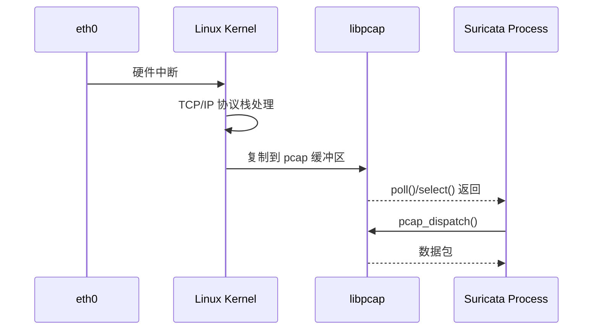
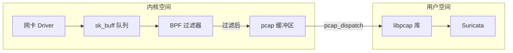

> [!info] Suricata 2026 深度探索系列 0. [[2026-04-15-suricata-deep-dive-series-index|全栈学习路径总览]]
>
> 1. [[2026-04-15-suricata-deep-dive-ch1-overview|第一章：Suricata 概述]]
> 2. [[2026-04-15-suricata-deep-dive-ch2-config|第二章：Suricata 配置系统]]
> 3. [[2026-04-15-suricata-deep-dive-ch3-runmodes|第三章：Runmodes 运行模式]]
> 4. [[2026-04-15-suricata-deep-dive-ch4-thread-model|第四章：线程模型]]
> 5. [[2026-04-15-suricata-deep-dive-ch5-capture|第五章：Capture 初始化]]
> 6. [[2026-04-15-suricata-deep-dive-ch6-af-packet|第六章：AF-PACKET 接口]]
> 7. **第七章：PCAP 接口**

---

## 1. PCAP 概述

PCAP (Packet Capture) 是基于 libpcap 库的传统抓包接口。虽然性能低于 AF-PACKET，但它是最广泛支持的抓包方式，跨平台兼容性好。



### 1.1 与 AF-PACKET 对比

| 特性             | PCAP                    | AF-PACKET       |
| :--------------- | :---------------------- | :-------------- |
| **性能**         | 低                      | 高              |
| **内存拷贝**     | 2次 (NIC→Kernel→User)   | 0次 (mmap 共享) |
| **跨平台**       | Linux/BSD/macOS/Windows | Linux only      |
| **内核版本依赖** | 无                      | 需要 2.6.27+    |
| **RSS 支持**     | 有限                    | 完整            |
| **XDP 支持**     | 无                      | 支持            |

---

## 2. 配置详解

### 2.1 基础配置

```yaml
# suricata.yaml
pcap:
  - interface: eth0 # 监听接口
    # 或
  - interface: any # 监听所有接口
```

### 2.2 完整配置项

```yaml
# suricata.yaml
pcap:
  - interface: eth0
    # 缓冲区大小
    buffer-size: 16777216 # 16MB (libpcap 缓冲区)

    # 快照长度
    snaplen: 65535 # 最大抓包长度

    # 混杂模式
    promisc: yes # 是否启用混杂模式

    # 监控方向
    monitor: yes # Monitor 模式 (802.11 需要)

    # 校验和
    checksum-checks: 1 # 0=关闭, 1=开启

    # BPF 过滤器 (编译后生效)
    bpf-filter: "tcp and port 80"

    # 混杂超时
    immediate-mode: no # 立即模式 (关闭缓冲)

    # 混合模式 (同时监听多个接口)
    mixed: yes # 混合模式
    # 或使用 groups
    groups:
      - eth0
      - eth1
```

### 2.3 BPF 过滤器

```yaml
# suricata.yaml — 使用 BPF 过滤器
pcap:
  - interface: eth0
    bpf-filter: "not port 22 and not port 53"
```

BPF 过滤器在内核空间执行，减少传送到用户态的无用数据包。

---

## 3. 源码解析

### 3.1 模块注册

```c
// src/source-pcap.c — PCAP 模块注册
void TmModuleReceivePcapRegister(void)
{
    tmm_modules[TMM_RECEIVEPcap].name = "ReceivePcap";
    tmm_modules[TMM_RECEIVEPcap].ThreadInit = PcapThreadInit;
    tmm_modules[TMM_RECEIVEPcap].Func = PcapLoop;
    tmm_modules[TMM_RECEIVEPcap].ThreadDeinit = PcapThreadDeinit;
    tmm_modules[TMM_RECEIVEPcap].flags = TM_FLAG_RECEIVE_TM;
}
```

### 3.2 配置读取

```c
// src/source-pcap.c — 配置结构体
typedef struct PcapCaptureContext_ {
    pcap_t *pcap_hdl;             // libpcap 句柄
    char iface[PCAP_IFACE_NAME_LEN];  // 接口名
    int snaplen;                  // 快照长度
    int buffer_size;              // 缓冲区大小
    int promisc;                  // 混杂模式
    int monitor;                  // Monitor 模式
    int bpf_filter_len;           // BPF 过滤代码长度
    struct bpf_program bpf_prog;   // 编译后的 BPF 程序
    int pcap_activateflags;       // pcap_activate 标志
} PcapCaptureContext;

// 配置读取函数
static int PcapLoadConfig(PcapCaptureContext **pctx)
{
    *pctx = SCCalloc(1, sizeof(PcapCaptureContext));

    /* 读取 interface */
    const char *iface;
    if (ConfGet("pcap.interface", &iface) != 1) {
        SCLogError("pcap.interface not configured");
        return -1;
    }
    strlcpy((*pctx)->iface, iface, PCAP_IFACE_NAME_LEN);

    /* 读取 buffer-size (默认 16MB) */
    const char *bs_str;
    if (ConfGet("pcap.buffer-size", &bs_str) == 1) {
        (*pctx)->buffer_size = atoi(bs_str);
    } else {
        (*pctx)->buffer_size = 16777216;  // 16MB
    }

    /* 读取 snaplen (默认 65535) */
    const char *sl_str;
    if (ConfGet("pcap.snaplen", &sl_str) == 1) {
        (*pctx)->snaplen = atoi(sl_str);
    } else {
        (*pctx)->snaplen = 65535;
    }

    /* 读取 promisc */
    int promisc = 1;
    (void)ConfGetBool("pcap.promisc", &promisc);
    (*pctx)->promisc = promisc;

    /* 读取 bpf-filter */
    const char *bpf_str;
    if (ConfGet("pcap.bpf-filter", &bpf_str) == 1) {
        (*pctx)->bpf_prog_str = bpf_str;  // 待编译
    }

    /* 读取 monitor 模式 */
    int monitor = 0;
    (void)ConfGetBool("pcap.monitor", &monitor);
    (*pctx)->monitor = monitor;
}
```

### 3.3 PcapHandle 创建

```c
// src/source-pcap.c — pcap 初始化
static int PcapOpen(PcapCaptureContext *ctx)
{
    char errbuf[PCAP_ERRBUF_SIZE];

    /* 创建 pcap 句柄 */
    ctx->pcap_hdl = pcap_create(ctx->iface, errbuf);
    if (ctx->pcap_hdl == NULL) {
        SCLogError("pcap_create failed: %s", errbuf);
        return -1;
    }

    /* 设置快照长度 */
    if (pcap_set_snaplen(ctx->pcap_hdl, ctx->snaplen) != 0) {
        SCLogWarning("pcap_set_snaplen failed: %s", pcap_geterr(ctx->pcap_hdl));
    }

    /* 设置缓冲区大小 */
    if (pcap_set_buffer_size(ctx->pcap_hdl, ctx->buffer_size) != 0) {
        SCLogWarning("pcap_set_buffer_size failed: %s", pcap_geterr(ctx->pcap_hdl));
    }

    /* 设置混杂模式 */
    if (pcap_set_promisc(ctx->pcap_hdl, ctx->promisc) != 0) {
        SCLogWarning("pcap_set_promisc failed: %s", pcap_geterr(ctx->pcap_hdl));
    }

    /* 设置 Monitor 模式 (802.11) */
    #ifdef PCAP_SET_TSTAMP_PRECISION
    if (ctx->monitor) {
        pcap_set_tstamp_type(ctx->pcap_hdl, PCAP_TSTAMP_ADAPTER_TIMESTAMP);
    }
    #endif

    /* 设置立即模式 (最小化延迟) */
    #ifdef PCAP_IMMEDIATE_MODE
    int immediate = 0;
    (void)ConfGetBool("pcap.immediate-mode", &immediate);
    if (immediate) {
        int mode = 1;
        pcap_set_immediate_mode(ctx->pcap_hdl, mode);
    }
    #endif

    /* 激活句柄 */
    if (pcap_activate(ctx->pcap_hdl) != 0) {
        SCLogError("pcap_activate failed: %s", pcap_geterr(ctx->pcap_hdl));
        pcap_close(ctx->pcap_hdl);
        return -1;
    }

    /* 编译 BPF 过滤器 */
    if (ctx->bpf_prog_str) {
        if (pcap_compile(ctx->pcap_hdl, &ctx->bpf_prog, ctx->bpf_prog_str, 1, 0) != 0) {
            SCLogError("pcap_compile failed: %s", pcap_geterr(ctx->pcap_hdl));
            return -1;
        }

        if (pcap_setfilter(ctx->pcap_hdl, &ctx->bpf_prog) != 0) {
            SCLogError("pcap_setfilter failed: %s", pcap_geterr(ctx->pcap_hdl));
            return -1;
        }
    }

    return 0;
}
```

### 3.4 主循环

```c
// src/source-pcap.c — PCAP 主循环
static TmEcode PcapLoop(ThreadVars *tv, void *data)
{
    PcapCaptureContext *ctx = (PcapCaptureContext *)data;

    /* 获取文件描述符用于 poll */
    int fd = pcap_get_selectable_fd(ctx->pcap_hdl);
    if (fd < 0) {
        SCLogError("pcap_get_selectable_fd failed");
        return TM_ECODE_FAILED;
    }

    struct pollfd pfd = { .fd = fd, .events = POLLIN };

    while (1) {
        /* 等待数据包 */
        int ret = poll(&pfd, 1, 1000);  // 1s 超时
        if (ret < 0) {
            if (errno == EINTR) continue;
            break;
        }

        if (ret == 0) {
            /* 超时：处理统计和清理 */
            PcapStatsUpdate(ctx);
            continue;
        }

        /* 读取数据包 (非阻塞) */
        int pkts = pcap_dispatch(ctx->pcap_hdl, -1, PcapCallback, (u_char *)tv);
        if (pkts < 0) {
            SCLogError("pcap_dispatch failed: %s", pcap_geterr(ctx->pcap_hdl));
            break;
        }

        /* 检查退出信号 */
        if (SignalHandlerIsFlagSet(SURIANSIG_TERM)) {
            break;
        }
    }

    return TM_ECODE_OK;
}

// 数据包回调
static void PcapCallback(u_char *tv, const struct pcap_pkthdr *h, const u_char *pkt)
{
    ThreadVars *thv = (ThreadVars *)tv;

    /* 获取 Packet */
    Packet *p = PacketGetFromQueueOrAlloc();
    if (p == NULL) return;

    /* 复制数据 */
    memcpy(p->ext_buffer, pkt, h->caplen);
    p->datalen = h->caplen;
    p->pktlen = h->len;

    /* 设置时间戳 */
    p->ts.tv_sec = h->ts.tv_sec;
    p->ts.tv_usec = h->ts.tv_usec;

    /* 设置数据包指针 */
    p->ext_pkt = (uint8_t *)p->ext_buffer;

    /* 设置链路层类型 */
    p->datalink = DLT_EN10MB;  // Ethernet

    /* 分发到处理管道 */
    if (TmThreadsSlotVar(thv, p) != TM_ECODE_OK) {
        PacketReturnToPool(p);
    }
}
```

### 3.5 统计信息

```c
// src/source-pcap.c — 统计更新
static void PcapStatsUpdate(PcapCaptureContext *ctx)
{
    struct pcap_stat ps;

    if (pcap_stats(ctx->pcap_hdl, &ps) == 0) {
        /* 更新计数器 */
        StatsAddUI64(ctx->tv, STATS_ID_PCAP_BACKLOG, ps.ps_recv);
        StatsAddUI64(ctx->tv, STATS_ID_PCAP_DROPS, ps.ps_drop);
        #ifdef ps_netdrop
        StatsAddUI64(ctx->tv, STATS_ID_PCAP_NETDROPS, ps.ps_netdrop);
        #endif
    }
}
```

---

## 4. libpcap 内部原理

### 4.1 数据路径



### 4.2 缓冲区机制

libpcap 使用两层缓冲：

1. **socket 缓冲区** (`SO_RCVBUF`)：内核态，控制可接收的总数据量
2. **pcap 缓冲区**：用户态，`pcap_set_buffer_size()` 设置

```c
// libpcap 内部流程
pcap_set_buffer_size(pcap_hdl, 16MB);

// 内部实现：
// 1. setsockopt(sock, SOL_SOCKET, SO_RCVBUF, 16MB)
// 2. 创建用户态 mmap 缓冲区
// 3. recvfrom() 接收数据到用户态缓冲区
```

### 4.3 BPF 过滤器

BPF (Berkeley Packet Filter) 在内核空间执行，减少传送到用户态的数据量：

```c
// libpcap BPF 执行流程
pcap_compile(pcap_hdl, &prog, "tcp port 80", ...);
// ↓ 生成 BPF 字节码
// ↓ 加载到内核
// ↓ 内核每个包执行 BPF 指令
// ↓ 只传递匹配的数据包
```

---

## 5. 配置 → 源码映射表

| YAML 配置               | C 变量                              | 源文件          | 说明           |
| :---------------------- | :---------------------------------- | :-------------- | :------------- |
| `pcap[].interface`      | `pcap_lookupdev()`                  | `source-pcap.c` | 网卡名         |
| `pcap[].buffer-size`    | `pcap_set_buffer_size()`            | `source-pcap.c` | libpcap 缓冲区 |
| `pcap[].snaplen`        | `pcap_set_snaplen()`                | `source-pcap.c` | 快照长度       |
| `pcap[].promisc`        | `pcap_set_promisc()`                | `source-pcap.c` | 混杂模式       |
| `pcap[].bpf-filter`     | `pcap_compile()`/`pcap_setfilter()` | `source-pcap.c` | BPF 过滤器     |
| `pcap[].monitor`        | `pcap_set_tstamp_type()`            | `source-pcap.c` | Monitor 模式   |
| `pcap[].immediate-mode` | `pcap_set_immediate_mode()`         | `source-pcap.c` | 立即模式       |

---

## 6. 性能调优

### 6.1 缓冲区优化

```yaml
# suricata.yaml — PCAP 性能优化
pcap:
  - interface: eth0
    buffer-size: 33554432 # 32MB (增大)
    snaplen: 65535
    immediate-mode: yes # 最小化延迟
    checksum-checks: 0 # NIC 已校验
```

### 6.2 BPF 过滤器优化

```yaml
# 只抓取感兴趣的流量
pcap:
  - interface: eth0
    bpf-filter: "(
      tcp port 80 or
      tcp port 443 or
      tcp port 22 or
      udp port 53
    ) and not (
      host 10.0.0.1 or
      host 10.0.0.2
    )"
```

### 6.3 内核参数

```bash
# /etc/sysctl.conf
# 增大 socket 缓冲区
net.core.rmem_max = 33554432
net.core.rmem_default = 16777216
```

---

## 7. 故障排除

### 7.1 常见错误

| 错误信息                                   | 原因            | 解决方案                  |
| :----------------------------------------- | :-------------- | :------------------------ |
| `pcap_create: eth0: That device is not up` | 接口未启用      | `ip link set eth0 up`     |
| `pcap_open_live: no VLAN support`          | 内核不支持 VLAN | 升级内核或使用 `any` 接口 |
| `pcap_setfilter: no VLAN support`          | BPF 不支持 VLAN | 修改过滤规则              |
| `pcap_dispatch: truncated`                 | snaplen 太小    | 增大 snaplen              |

### 7.2 调试方法

```bash
# 使用 tcpdump 测试接口
tcpdump -i eth0 -n -c 10

# 查看 pcap 统计
suricata -c suricata.yaml --pcap-stat

# 使用 tshark 调试
tshark -i eth0 -f "tcp port 80" -x
```

---

## 8. PCAP 文件模式

Suricata 也支持离线分析 PCAP 文件：

```yaml
# suricata.yaml — PCAP 文件模式
pcap:
  - interface: /path/to/capture.pcap
```

```bash
# 命令行直接指定
suricata -r /path/to/capture.pcap -c suricata.yaml
```

### 8.1 源码实现

```c
// src/source-pcap-file.c — PCAP 文件模式
static int PcapFileOpen(PcapCaptureContext *ctx, const char *filename)
{
    char errbuf[PCAP_ERRBUF_SIZE];

    /* 打开 PCAP 文件 */
    ctx->pcap_hdl = pcap_open_offline(filename, errbuf);
    if (ctx->pcap_hdl == NULL) {
        SCLogError("pcap_open_offline failed: %s", errbuf);
        return -1;
    }

    /* 获取链路层类型 */
    ctx->datalink = pcap_datalink(ctx->pcap_hdl);

    return 0;
}
```

---

## 9. 小结

本章解析了 PCAP 接口的实现：

1. **libpcap 基础**：基于 socket 的传统抓包方式，跨平台兼容
2. **配置读取**：buffer-size、snaplen、promisc、BPF 过滤器
3. **pcap_dispatch 循环**：poll + 回调机制
4. **性能限制**：多次内存拷贝，不支持 RSS，缓冲区效率低

PCAP 适合调试、取证分析或低流量环境。对于高性能生产环境，请使用 AF-PACKET (第六章)。

下一章我们将解析 **NFQ (Netfilter Queue) 模式**，了解 Suricata 的 IPS Inline 检测实现。

---

## 相关章节

- [[2026-04-15-suricata-deep-dive-ch6-af-packet|第六章：AF-PACKET 接口]]
- [[2026-04-15-suricata-deep-dive-ch8-nfq|第八章：NFQ 模式]]
- [[2026-04-15-suricata-deep-dive-ch9-dpdk|第九章：DPDK 接口]]
