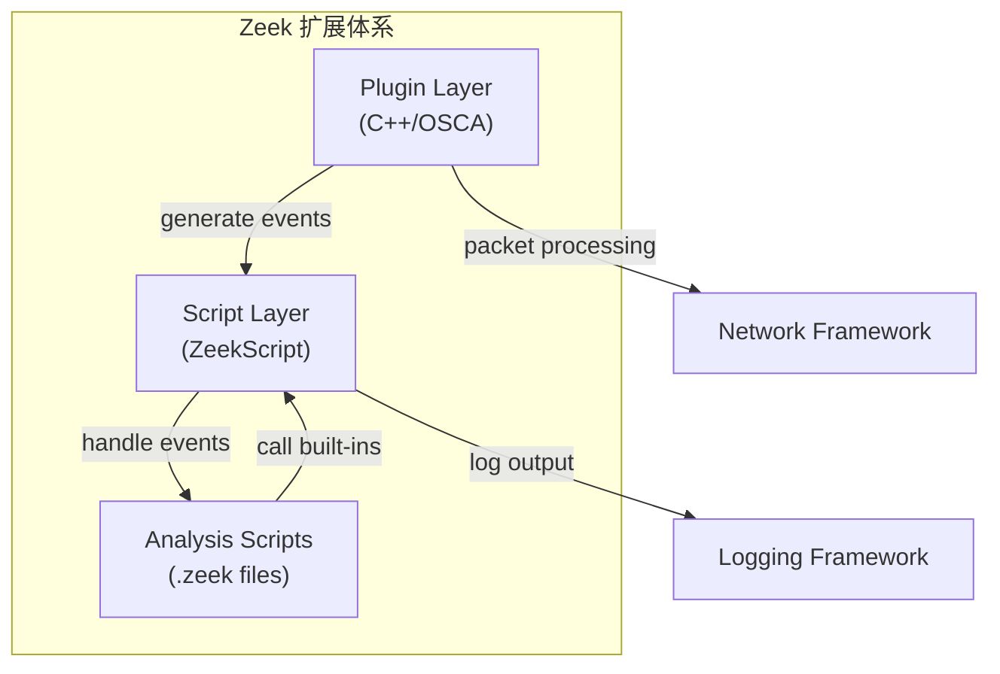

> [!info] Zeek 2026 深度探索系列
> 0. [[zeek-deep-dive-overview|全栈学习路径总览]]
> ...
> 29. [[zeek-deep-dive-ch29-logging-frameworks|第二十九章：日志框架与输出机制]]
> 30. **第三十章：第三方插件与脚本扩展体系**
> 31. [[zeek-deep-dive-ch31-custom-protocol-parsers|第三十一章：自定义协议解析器开发]]
> 32. [[zeek-deep-dive-ch32-event-engine-customization|第三十二章：事件引擎与日志定制]]
> 33. [[zeek-deep-dive-ch33-performance-tuning|第三十三章：性能调优与高级配置]]

---

## 1. 概述：Zeek 的扩展架构

Zeek 的生命力在于其**高度可扩展性**。无论是编写自定义协议解析器、开发插件、还是编写事件驱动脚本，Zeek 都提供了完整的接口。本章聚焦于**第三方插件机制**和**脚本扩展**两大扩展路径，帮助你构建满足特定需求的 Zeek 部署。



---

## 2. Zeek Plugin 架构详解

### 2.1 Plugin 是什么？

Zeek Plugin 是一种**动态加载机制**，允许在不修改 Zeek 核心代码的情况下添加：

- 新的协议解析器（Packet Analyzer）
- 新的日志 writers
- 新的数据类型
- 新的内置函数（Built-in Functions）
- 新的事件（Events）

### 2.2 Plugin 目录结构

```
zeek-plugin-example/
├── CMakeLists.txt           # 构建配置
├── __load__.zeek            # 插件加载时自动执行
├── scripts/
│   └── main.zeek           # 插件脚本
├── src/
│   ├── Plugin.cc            # 插件主类
│   ├── MyAnalyzer.cc       # 自定义分析器
│   └── MyLogger.cc         # 自定义日志输出
└── testing/
    └── baseline/
        └── mytest.dat      # 测试基线
```

### 2.3 插件主类实现

```cpp
// src/Plugin.cc
#include <plugin/Plugin.h>
#include <analyzer/Analyzer.h>

namespace zeek::example {

class ExamplePlugin : public zeek::plugin::Plugin {
public:
    // 插件唯一标识
    zeek::plugin::Configuration Configure() override {
        // 向 Zeek 声明本插件提供的功能
        AddComponent(new zeek::analyzer::Analyzer("example", "example", "Example Protocol"));
        return zeek::plugin::Configuration("Example Plugin", "0.1.0", 
            "An example Zeek plugin demonstrating plugin architecture");
    }
    
    // 初始化完成时被调用
    void InitPostScriptLoading() override {
        // 注册自定义事件类型、初始化状态等
    }
};

} // namespace zeek::example

// 注册插件（Zeek 加载时会自动发现）
zeek::plugin::Plugin* ZeekPlugin() {
    return new zeek::example::ExamplePlugin();
}
```

### 2.4 注册协议分析器

```cpp
// src/MyAnalyzer.cc
#include "Plugin.h"
#include <analyzer/protocol/tcp/TCP.h>

namespace zeek::example {

class ExampleAnalyzer : public zeek::analyzer::tcp::TCP_ApplicationAnalyzer {
public:
    explicit ExampleAnalyzer(zeek::Connection* c)
        : zeek::analyzer::tcp::TCP_ApplicationAnalyzer("example", c)
    {
        // 构造函数
    }
    
    // 数据到达时的处理
    void DeliverStream(int len, const u_char* data, bool is_orig) override {
        // 处理应用层数据
        // is_orig: true=客户端到服务器，false=服务器到客户端
        
        // 将数据传递给脚本层
        ProtocolConfirmation();
        
        // 生成脚本层事件（供 .zeek 脚本处理）
        zeek::eventMgr.Enqueue(
            "example_data",
            zeek::Analyzers::Ref(count_conn),
            zeek::make_intrusive<zeek::StringVal>(zeek::String(data, len)),
            is_orig ? zeek::val_mgr->True() : zeek::val_mgr->False()
        );
        
        // 继续传递给下一个分析器
        TCP_ApplicationAnalyzer::DeliverStream(len, data, is_orig);
    }
    
    // TCP 连接结束时
    void EndOfData(bool is_orig) override {
        // 清理状态
        TCP_ApplicationAnalyzer::EndOfData(is_orig);
    }
};

// 分析器工厂类
class ExampleAnalyzerRegistrar : public zeek::analyzer::tcp::TCP_ApplicationAnalyzer::Registrar {
public:
    ExampleAnalyzerRegistrar() : Registrar("example") {}
    
    zeek::analyzer::Analyzer* Instantiate(zeek::Connection* c) override {
        return new ExampleAnalyzer(c);
    }
} registrar;
```

---

## 3. 脚本层扩展（ZeekScript）

### 3.1 自定义事件与函数

ZeekScript 允许在 `.zeek` 文件中定义新的事件处理函数和内置函数：

```zeek
# scripts/example.zeek

# 定义新的事件类型
# 事件由 C++ 层通过 eventMgr.Enqueue() 触发
event example_data(c: connection, data: string, is_orig: bool) {
    # 记录日志
    Log::write(Example::LOG, [$ts=network_time(), $c=c, $data=data, $dir=is_orig?"ORIG":"RESP"]);
    
    # 提取关键信息
    if ( /magic-pattern/ in data ) {
        # 触发告警
        Reporter::info(c$id, "Found magic pattern in traffic");
    }
}

# 连接初始化时的事件
event connection_established(c: connection) {
    # 检查是否为感兴趣的目标
    if ( c$id$resp_h in Site::local_nets ) {
        # 标记连接以便后续跟踪
        c$example_state = [$first_seen=network_time()];
    }
}

# 连接结束时的事件
event connection_state_remove(c: connection) {
    if ( c?$example_state ) {
        local duration = network_time() - c$example_state$first_seen;
        if ( duration > 10min ) {
            # 长时间连接，生成统计信息
            Log::write(Example::CONN_STATS, 
                [$id=c$id, $duration=duration, $orig_bytes=c?$orig?$size?$num_bytes:0]);
        }
    }
}
```

### 3.2 自定义日志类型

```zeek
# 定义日志字段
module Example;

export {
    redef enum Log::ID += { LOG, CONN_STATS };
    
    type Info: record {
        ts: time          &log;
        uid: string       &log;
        id: conn_id       &log;
        data: string      &log &optional;
        dir: string       &log &optional;
    };
    
    type ConnStats: record {
        ts: time           &log;
        id: conn_id        &log;
        duration: interval &log;
        orig_bytes: count  &log &default=0;
    };
}

# 初始化日志 writer
event zeek_init() {
    Log::create_stream(LOG, [$columns=Info, $path="example"]);
    Log::create_stream(CONN_STATS, [$columns=ConnStats, $path="example-stats"]);
}
```

### 3.3 内联 C++ 函数（Inline C++）

通过 `zeek_dev` 工具可以检查脚本中函数调用的类型签名：

```bash
# 生成类型绑定代码
zeek_dev -g example.zeek
```

这会输出供 C++ 插件使用的类型信息，确保脚本层和 C++ 层的类型匹配。

---

## 4. 常用第三方插件生态

### 4.1 主流插件仓库

| 插件名称 | 功能描述 | 链接 |
| :--- | :--- | :--- |
| **zeek-agent** | 主机端点可见性集成 | github.com/zeek/zeek-agent |
| **brolysis** | 增强协议解析 | github.com/zeek/brolysis |
| **zeek-spicy** | Spicy 协议生成器 | github.com/zeek/spicy |
| **zeek-pkts** | Packet-level 访问 | github.com/RootNamed/zeek-pkts |
| **zeek-http2** | HTTP/2 分析 | github.com/zeek/zeek-http2 |

### 4.2 Spicy 插件：自动化协议解析器生成

Spicy 是 Zeek 官方推出的**协议解析器自动生成工具**：

```spicy
# example-protocol.spicy
module Example;

type Hdr = unit {
    magic: bytes &size=4;
    length: uint16;
    payload: bytes &size=self.length;
} &oneline;
```

```bash
# 编译 Spicy 协议描述为 Zeek 插件
spicyz -o example-protocol.so example-protocol.spicy
```

生成的 `.so` 文件可直接作为 Zeek 插件加载：

```bash
zeek -N -A example-protocol.so
```

---

## 5. 插件加载与管理

### 5.1 插件发现机制

Zeek 在启动时通过以下顺序搜索插件：

1. `ZEEKP_PLUGIN_PATH` 环境变量指定的目录
2. `<zeek-prefix>/lib/zeek/plugins/`（系统插件）
3. `<home>/.zeek/lib/plugins/`（用户插件）
4. 当前工作目录下的 `plugins/` 子目录

```bash
# 设置插件搜索路径
export ZEEKP_PLUGIN_PATH=/opt/zeek-plugins:/home/analyst/my-plugins

# 列出所有已加载插件
zeek -N
```

### 5.2 插件依赖管理

```bash
# 插件依赖声明（CMakeLists.txt）
zeek_plugin_find_dependencies(Brolysis)  # 声明依赖 Brolysis
zeek_plugin_find_dependencies(Zeek::Spicy)  # 依赖 Spicy 运行时
```

### 5.3 调试插件

```bash
# 启用插件调试输出
zeek -B plugin,analyzer,example debug.log

# 检查插件是否正确加载
zeek -N 2>&1 | grep -i example
```

---

## 6. 实战：编写一个协议检测插件

### 6.1 需求分析

目标：检测自定义二进制协议（Magic: `0xDEADBEEF`），提取会话元数据。

### 6.2 完整实现

**Step 1: 创建项目结构**

```bash
mkdir -p custom-proto/{src,scripts,testing/baseline}
cd custom-proto
```

**Step 2: 编写 CMakeLists.txt**

```cmake
zeek_plugin_begin(CustomProto)
    # 添加 C++ 源文件
    add_zeek_plugin(CustomProto 
        src/Plugin.cc
        src/ProtoAnalyzer.cc
    )
    # 安装脚本文件
    install_zeek_script(scripts/__load__.zeek)
    install_zeek_script(scripts/main.zeek)
zeek_plugin_end()
```

**Step 3: 编写协议分析器**

```cpp
// src/ProtoAnalyzer.cc
#pragma once

#include "Plugin.h"
#include <analyzer/protocol/tcp/TCP_ApplicationAnalyzer.h>

namespace zeek::customproto {

constexpr const char* PROTOCOL_NAME = "custom-proto";
constexpr uint32_t MAGIC = 0xDEADBEEF;

class CustomProtoAnalyzer : public zeek::analyzer::tcp::TCP_ApplicationAnalyzer {
public:
    explicit CustomProtoAnalyzer(zeek::Connection* c)
        : TCP_ApplicationAnalyzer(PROTOCOL_NAME, c),
          validated_(false),
          header_len_(0)
    {
    }

    void DeliverStream(int len, const u_char* data, bool is_orig) override {
        // 协议确认前，先检查 magic number
        if ( !validated_ && len >= 4 ) {
            uint32_t magic = ntohl(*(uint32_t*)data);
            if ( magic == MAGIC ) {
                validated_ = true;
                ProtocolConfirmation();  // 通知 Zeek 协议已确认
                
                // 解析 header
                if ( len >= 8 ) {
                    header_len_ = ntohs(*(uint16_t*)(data + 4));
                    // 生成脚本层事件
                    EnqueueEvent("custom_proto::header",
                        c_, 
                        zeek::val_mgr->Bool(is_orig),
                        zeek::make_intrusive<zeek::Val>(header_len_, zeek::TYPE_COUNT)
                    );
                }
            }
        }
        
        if ( validated_ ) {
            // 协议已确认，传递数据
            ForwardStream(len, data, is_orig);
        }
    }

private:
    bool validated_;
    uint16_t header_len_;
};

// Factory
class CustomProtoAnalyzerRegistrar 
    : public TCP_ApplicationAnalyzer::Registrar {
public:
    CustomProtoAnalyzerRegistrar() : Registrar(PROTOCOL_NAME) {}
    Analyzer* Instantiate(Connection* c) override {
        return new CustomProtoAnalyzer(c);
    }
} registrar;
}
```

**Step 4: 编写 Zeek 脚本**

```zeek
# scripts/main.zeek
module CustomProto;

export {
    redef enum Log::ID += { LOG };
    
    type Info: record {
        ts: time      &log;
        uid: string   &log;
        id: conn_id   &log;
        orig: bool    &log;
        hdr_len: count &log;
    };
}

event custom_proto::header(c: connection, is_orig: bool, hdr_len: count) {
    Log::write(LOG, [
        $ts=network_time(),
        $uid=c$uid,
        $id=c$id,
        $orig=is_orig,
        $hdr_len=hdr_len
    ]);
}

event zeek_init() {
    Log::create_stream(LOG, [$columns=Info, $path="custom-proto"]);
}
```

**Step 5: 编译并测试**

```bash
# 编译
mkdir build && cd build
cmake ..
make

# 安装到用户插件目录
make install

# 验证加载
zeek -N | grep CustomProto
```

---

## 7. 总结

本章介绍了 Zeek 的两大扩展机制：

| 扩展方式 | 适用场景 | 复杂度 |
| :--- | :--- | :--- |
| **Plugin (C++)** | 高性能需求、新协议解析、修改核心行为 | 高 |
| **ZeekScript (.zeek)** | 事件处理、日志定制、业务逻辑 | 中 |

**关键要点**：

1. **Plugin 通过 Component 系统声明功能**：Analyzer、Logger、Event 等都是 Component
2. **事件是脚本层和 C++ 层的桥梁**：C++ 层通过 `eventMgr.Enqueue()` 触发脚本事件
3. **Spicy 简化协议解析器开发**：声明式协议描述，自动生成插件代码
4. **插件发现基于目录约定**：熟悉 `ZEEKP_PLUGIN_PATH` 的加载顺序

下一章我们将学习**自定义协议解析器的开发**，深入探讨如何解析私有协议并提取语义信息。
