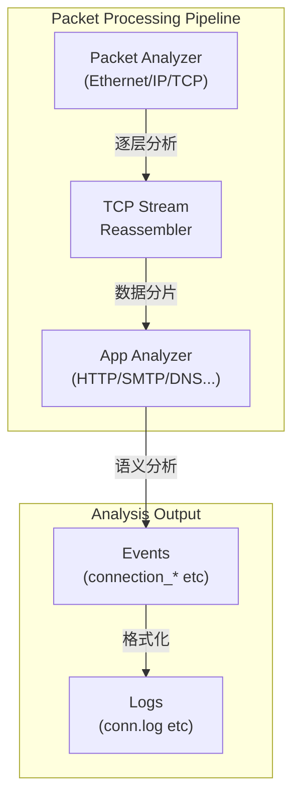
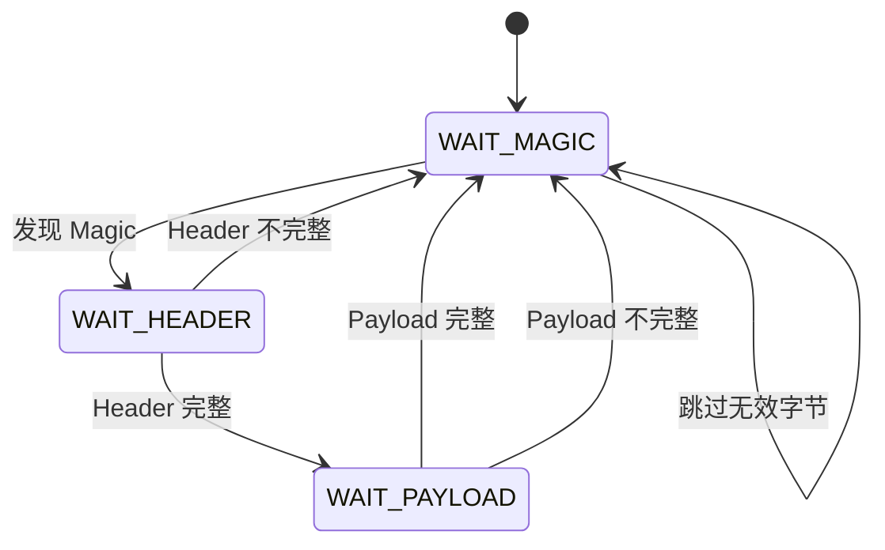

> [!info] Zeek 2026 深度探索系列 0. [[zeek-deep-dive-overview|全栈学习路径总览]]
> ... 29. [[zeek-deep-dive-ch29-logging-frameworks|第二十九章：日志框架与输出机制]] 30. [[zeek-deep-dive-ch30-plugin-scripting|第三十章：第三方插件与脚本扩展体系]] 31. **第三十一章：自定义协议解析器开发** 32. [[zeek-deep-dive-ch32-event-engine-customization|第三十二章：事件引擎与日志定制]] 33. [[zeek-deep-dive-ch33-performance-tuning|第三十三章：性能调优与高级配置]]

---

## 1. 概述：Zeek 协议分析架构

Zeek 的核心价值在于其**协议无关的被动分析能力**。理解其协议分析架构，是开发自定义解析器的前提。



---

## 2. Zeek 分析器层次结构

### 2.1 分析器类型体系

|                     | 类型                 | 作用                       | 示例 |
| :------------------ | :------------------- | :------------------------- | :--- |
| **Packet Analyzer** | 链路/网络层包解析    | Ethernet, IPv4, IPv6, VLAN |
| **TCP Analyzer**    | TCP 流重组与顺序处理 | TCP, TCP_FASTOPEN          |
| **App Analyzer**    | 应用层协议解析       | HTTP, DNS, SMTP, MySQL     |

### 2.2 分析器基类

```cpp
// analyzer/Analyzer.h (简化)
class Analyzer {
    friend class Manager;

public:
    // 唯一名称
    const char* GetName() const { return name; }

    // 是否启用
    bool IsEnabled() const { return enabled; }

    // 父连接
    Connection* Conn() const { return conn; }

protected:
    // 确认协议（生成 protocol_confirmation 事件）
    void ProtocolConfirmation();

    // 拒绝协议（生成 protocol_violation 事件）
    void ProtocolViolation(const char* reason, ...);

    // 向上转发数据
    void ForwardStream(int len, const u_char* data, bool is_orig);
    void ForwardPacket(int len, const u_char* data, bool is_orig);

    const char* name;
    Connection* conn;
    bool enabled;
    AnalyzerRole role;  // ORIG or RESP
};
```

### 2.3 TCP 分析器进阶

```cpp
// analyzer/protocol/tcp/TCP_ApplicationAnalyzer.h
class TCP_ApplicationAnalyzer : public analyzer::Analyzer {
public:
    // 处理重组后的应用层数据流
    virtual void DeliverStream(int len, const u_char* data, bool is_orig);

    // 处理 TCP 状态变更（FIN/RST）
    virtual void EndOfData(bool is_orig);

    // 处理单个 TCP Segment（未重组）
    virtual void DeliverPacket(int len, const u_char* data, bool is_orig,
                                uint64_t seq, bool nopush, bool ack);

    // 检测到协议升级（如 TLS 隧道）
    virtual void StartTLS();
};
```

---

## 3. 开发自定义协议解析器

### 3.1 需求场景

假设我们需要解析一个简单的**自定义二进制协议**：

```
+--------+--------+--------+--------+--------+--------+--------+--------+
|  MAGIC (4B)     |  VERSION (1B)  |  TYPE (1B)  |  LENGTH (2B)       |
+--------+--------+--------+--------+--------+--------+--------+--------+
|  PAYLOAD (variable)                                           |
+--------+--------+--------+--------+--------+--------+--------+--------+
```

- Magic: `0x424C4945` ("BLIE")
- Version: 1
- Type: 1=Request, 2=Response
- Length: Payload 长度（字节）

### 3.2 实现步骤

#### Step 1: 定义协议头结构

```cpp
// CustomProto.h
#pragma once

#include <analyzer/protocol/tcp/TCP_ApplicationAnalyzer.h>

namespace zeek::customproto {

// 协议常量
constexpr uint32_t CUSTOM_PROTO_MAGIC = 0x424C4945;
constexpr uint8_t  CUSTOM_PROTO_VERSION = 1;

// 消息类型
enum MsgType : uint8_t {
    TYPE_REQUEST = 1,
    TYPE_RESPONSE = 2,
    TYPE_KEEPALIVE = 3
};

// 协议头（定长 8 字节）
struct ProtoHeader {
    uint32_t magic;      // 0x424C4945
    uint8_t  version;    // 版本号
    uint8_t  type;       // 消息类型
    uint16_t length;     // Payload 长度 (big-endian)
};

// 解析状态机
enum ParserState {
    STATE_WAIT_MAGIC,
    STATE_WAIT_HEADER,
    STATE_WAIT_PAYLOAD
};

class CustomProtoAnalyzer : public zeek::analyzer::tcp::TCP_ApplicationAnalyzer {
public:
    explicit CustomProtoAnalyzer(zeek::Connection* c);

    // 流数据处理
    void DeliverStream(int len, const u_char* data, bool is_orig) override;

    // 连接结束处理
    void EndOfData(bool is_orig) override;

    // 心跳超时
    void ExpireTimer(double t) override;

private:
    // 解析器状态机
    bool ParseBuffer(bool is_orig);

    // 处理完整消息
    void HandleMessage(uint8_t type, const u_char* payload, uint16_t length, bool is_orig);

    // 检查 Magic
    bool CheckMagic(const u_char* data);

    // 缓冲区管理
    void AppendToBuffer(bool is_orig, const u_char* data, int len);
    void ClearBuffer(bool is_orig);

    // 状态
    ParserState state_;
    uint8_t  version_;
    uint16_t payload_len_;

    // 双工缓冲（客户端/服务器方向独立）
    std::vector<u_char> orig_buffer_;
    std::vector<u_char> resp_buffer_;
};

} // namespace zeek::customproto
```

#### Step 2: 实现状态机解析

```cpp
// CustomProto.cc
#include "CustomProto.h"
#include <analyzer/AnalyzerManager.h>
#include <util/util.h>

namespace zeek::customproto {

CustomProtoAnalyzer::CustomProtoAnalyzer(zeek::Connection* c)
    : TCP_ApplicationAnalyzer("custom-proto", c),
      state_(STATE_WAIT_MAGIC),
      version_(0),
      payload_len_(0)
{
}

bool CustomProtoAnalyzer::CheckMagic(const u_char* data) {
    uint32_t magic = ntohl(*(uint32_t*)data);
    return magic == CUSTOM_PROTO_MAGIC;
}

void CustomProtoAnalyzer::AppendToBuffer(bool is_orig, const u_char* data, int len) {
    auto& buf = is_orig ? orig_buffer_ : resp_buffer_;
    buf.insert(buf.end(), data, data + len);
}

void CustomProtoAnalyzer::ClearBuffer(bool is_orig) {
    if ( is_orig )
        orig_buffer_.clear();
    else
        resp_buffer_.clear();
}

bool CustomProtoAnalyzer::ParseBuffer(bool is_orig) {
    auto& buf = is_orig ? orig_buffer_ : resp_buffer_;

    while ( buf.size() >= 4 ) {  // 最少需要 4 字节检测 magic
        switch ( state_ ) {
        case STATE_WAIT_MAGIC:
            if ( CheckMagic(buf.data()) ) {
                state_ = STATE_WAIT_HEADER;
            } else {
                // 跳过无效字节
                buf.erase(buf.begin());
            }
            break;

        case STATE_WAIT_HEADER:
            if ( buf.size() >= sizeof(ProtoHeader) ) {
                ProtoHeader* hdr = (ProtoHeader*)buf.data();

                // 验证版本
                if ( hdr->version != CUSTOM_PROTO_VERSION ) {
                    ProtocolViolation("Unsupported protocol version: %d", hdr->version);
                    return false;
                }

                version_ = hdr->version;
                payload_len_ = ntohs(hdr->length);

                // 生成协议确认事件
                ProtocolConfirmation();

                // 生成头信息事件
                zeek::eventMgr.Enqueue(
                    "custom_proto::header",
                    ConnectionRef(conn),
                    zeek::val_mgr->Bool(is_orig),
                    zeek::make_intrusive<zeek::Val>(hdr->type, zeek::TYPE_COUNT),
                    zeek::make_intrusive<zeek::Val>(payload_len_, zeek::TYPE_COUNT)
                );

                // 移除已消费的 header
                buf.erase(buf.begin(), buf.begin() + sizeof(ProtoHeader));
                state_ = STATE_WAIT_PAYLOAD;
            } else {
                return true;  // 等待更多数据
            }
            break;

        case STATE_WAIT_PAYLOAD:
            if ( buf.size() >= payload_len_ ) {
                // 提取 payload
                std::vector<u_char> payload(buf.begin(), buf.begin() + payload_len_);

                // 处理消息
                HandleMessage(version_, payload.data(), payload_len_, is_orig);

                // 移除已消费的数据
                buf.erase(buf.begin(), buf.begin() + payload_len_);

                // 重置状态机
                state_ = STATE_WAIT_MAGIC;
            } else {
                return true;  // 等待更多数据
            }
            break;
        }
    }

    return true;
}

void CustomProtoAnalyzer::HandleMessage(uint8_t type, const u_char* payload,
                                         uint16_t length, bool is_orig) {
    // 生成消息事件
    zeek::eventMgr.Enqueue(
        "custom_proto::message",
        ConnectionRef(conn),
        zeek::val_mgr->Bool(is_orig),
        zeek::make_intrusive<zeek::Val>(type, zeek::TYPE_COUNT),
        zeek::make_intrusive<zeek::StringVal>(std::string((char*)payload, length))
    );

    // 根据消息类型生成日志
    switch ( type ) {
    case TYPE_REQUEST:
        // 记录请求
        if ( conn->is_orig ) {
            // 更新连接元数据
        }
        break;
    case TYPE_RESPONSE:
        // 记录响应
        break;
    case TYPE_KEEPALIVE:
        // 忽略
        break;
    }
}

void CustomProtoAnalyzer::DeliverStream(int len, const u_char* data, bool is_orig) {
    // 先调用基类（TLS 等会在这里升级）
    TCP_ApplicationAnalyzer::DeliverStream(len, data, is_orig);

    // 追加到缓冲区
    AppendToBuffer(is_orig, data, len);

    // 运行状态机
    if ( !ParseBuffer(is_orig) ) {
        // 解析失败，停止分析
        SetEnabled(false);
    }
}

void CustomProtoAnalyzer::EndOfData(bool is_orig) {
    // 解析剩余缓冲区
    ParseBuffer(is_orig);
    ClearBuffer(is_orig);
    TCP_ApplicationAnalyzer::EndOfData(is_orig);
}

// 注册器（参考前一章）
class CustomProtoAnalyzerRegistrar
    : public TCP_ApplicationAnalyzer::Registrar {
public:
    CustomProtoAnalyzerRegistrar() : Registrar("custom-proto") {}
    Analyzer* Instantiate(Connection* c) override {
        return new CustomProtoAnalyzer(c);
    }
} registrar;

} // namespace zeek::customproto
```

#### Step 3: 编写 Zeek 脚本接口

```zeek
# custom-proto.zeek

module CustomProto;

export {
    # 定义事件类型（由 C++ 层触发）
    global header: event(c: connection, is_orig: bool, msg_type: count, length: count);
    global message: event(c: connection, is_orig: bool, msg_type: count, payload: string);

    # 日志记录
    redef enum Log::ID += { LOG };

    type Info: record {
        ts: time        &log;
        uid: string     &log;
        id: conn_id     &log;
        is_orig: bool   &log;
        msg_type: count &log;
        payload_len: count &log;
        payload_preview: string &log &optional;
    };
}

event custom_proto::header(c: connection, is_orig: bool, msg_type: count, length: count) &priority=10 {
    # 高优先级处理：提取关键指标
    if ( is_orig ) {
        c$custom_proto = [$first_seen=network_time(), $total_requests=0, $total_responses=0];
    }
}

event custom_proto::message(c: connection, is_orig: bool, msg_type: count, payload: string) &priority=5 {
    # 记录到日志
    Log::write(LOG, [
        $ts=network_time(),
        $uid=c$uid,
        $id=c$id,
        $is_orig=is_orig,
        $msg_type=msg_type,
        $payload_len=|payload|,
        $payload_preview=|payload| > 16 ? payload[0:16] + "..." : payload
    ]);

    # 更新统计
    if ( c?$custom_proto ) {
        if ( is_orig )
            ++c$custom_proto$total_requests;
        else
            ++c$custom_proto$total_responses;
    }
}

event zeek_init() {
    Log::create_stream(LOG, [$columns=Info, $path="custom-proto"]);
}
```

---

## 4. 协议解析的常见模式

### 4.1 状态机解析

大多数二进制协议都适合用状态机解析：



### 4.2 长度前缀协议

对于 TLS、HTTP/2 等长度前缀协议：

```cpp
// 长度前缀协议的通用模板
class LengthPrefixAnalyzer : public TCP_ApplicationAnalyzer {
    bool ParseLengthPrefix(bool is_orig) {
        auto& buf = is_orig ? orig_buf_ : resp_buf_;

        // 至少需要 4 字节才能解析长度
        if ( buf.size() < 4 ) return true;

        // 解析长度字段（假设前 4 字节是 big-endian 长度）
        uint32_t msg_len = ntohl(*(uint32_t*)buf.data());

        // 检查是否有完整消息
        if ( buf.size() >= 4 + msg_len ) {
            // 处理完整消息
            ProcessMessage(buf.data() + 4, msg_len, is_orig);

            // 移除已处理数据
            buf.erase(buf.begin(), buf.begin() + 4 + msg_len);
            return true;  // 继续解析下一条
        }

        return true;  // 等待更多数据
    }
};
```

### 4.3 分隔符协议

对于基于分隔符的协议（如 Redis、SMTP）：

```cpp
// 分隔符协议的通用模板
class DelimiterAnalyzer : public TCP_ApplicationAnalyzer {
    static const char DELIMITER = '\n';

    bool ParseDelimited(bool is_orig) {
        auto& buf = is_orig ? orig_buf_ : resp_buf_;

        while ( true ) {
            auto it = std::find(buf.begin(), buf.end(), DELIMITER);
            if ( it == buf.end() ) break;  // 没有完整行

            std::string line(buf.begin(), it);
            buf.erase(buf.begin(), it + 1);  // 移除这行

            ProcessLine(line, is_orig);
        }
        return true;
    }
};
```

---

## 5. 脚本层协议解析辅助

### 5.1 `raw_bytes` 处理

ZeekScript 提供了基础的字节处理能力：

```zeek
# 从原始连接中提取字节
event connection_state_remove(c: connection) {
    if ( c?$orig$raw_bytes && c$orig$raw_bytes > 0 ) {
        # 获取原始字节数据
        local data = c$orig$raw_bytes;

        # 解析自定义字段（假设前 4 字节是 magic）
        if ( |data| >= 4 ) {
            local magic = get_bytes(data, 0, 4);
            if ( magic == 0x424C4945 ) {
                print "Found custom protocol!";
            }
        }
    }
}
```

### 5.2 二进制数据解析

```zeek
# 使用 bytestring_to_hex() 转换十六进制
# 使用 sub_bytes() 提取子串
# 使用 byte_len() 计算长度

function parse_custom_header(data: string) : CustomHeader {
    if ( |data| < 8 ) {
        return NULL;
    }

    local magic = get_bytes(data, 0, 4);
    local version = data[4];
    local msg_type = data[5];
    local length = get_bytes(data, 6, 2);

    return [$magic=magic, $version=version, $type=msg_type, $length=length];
}
```

---

## 6. 调试与测试

### 6.1 使用 `btest` 进行回归测试

```bash
# testing/baseline/custom-proto.single/conn.log
# 确保 baseline 文件记录预期输出
```

```bash
# testing/test.py
import ZeekTest

class CustomProtoTest(ZeekTest.ZeekTest):
    def __init__(self):
        ZeekTest.ZeekTest.__init__(self,
            scripts=["test.zeek"],
            files=["traffic/custom-proto.pcap"],
            expected=[
                "test.log"
            ])

    def Test(self):
        # 验证输出
        self.CheckLogs()
```

### 6.2 PCAP 离线测试

```bash
# 使用已知流量的 PCAP 测试
zeek -r custom-proto-traffic.pcap -C 1 scripts/custom-proto.zeek

# 查看输出日志
cat custom-proto.log
```

### 6.3 常见错误处理

| 错误                 | 原因               | 解决方案                           |
| :------------------- | :----------------- | :--------------------------------- |
| `Protocol violation` | 数据不符合协议格式 | 检查字节序、长度字段               |
| 事件未触发           | C++ 层未 Enqueue   | 添加日志调试 `eventMgr.Dispatch()` |
| 状态机死锁           | Buffer 清理不彻底  | 确保 `EndOfData` 中清理状态        |

---

## 7. 总结

本章深入讲解了 Zeek 自定义协议解析器的开发：

**核心概念**：

1. **分析器层次**：Packet → TCP → Application，每层负责不同抽象
2. **状态机解析**：适用于所有结构化二进制协议
3. **C++/ZeekScript 交互**：通过 `eventMgr.Enqueue()` 桥接两层

**最佳实践**：

1. **总是检查字节序**：网络协议通常用 Big-Endian
2. **处理不完整数据**：TCP 流可能被分割，多次 `DeliverStream` 调用
3. **边界检查**：验证长度字段不超出缓冲区
4. **协议确认**：调用 `ProtocolConfirmation()` 让 Zeek 知道协议已识别

下一章我们将学习**事件引擎与日志定制**，了解 Zeek 的核心事件驱动机制以及如何深度定制日志输出。
