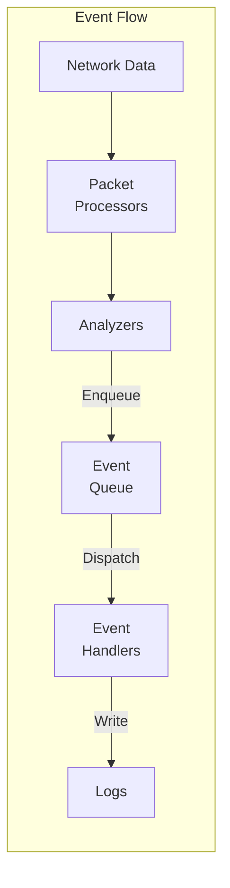
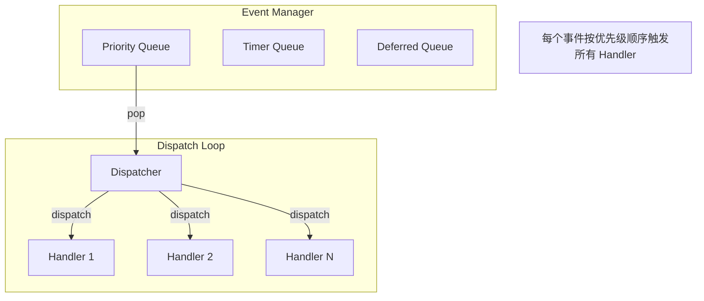
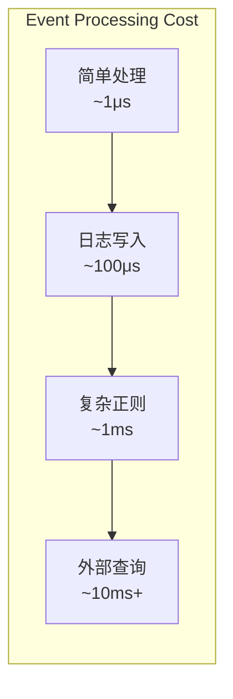
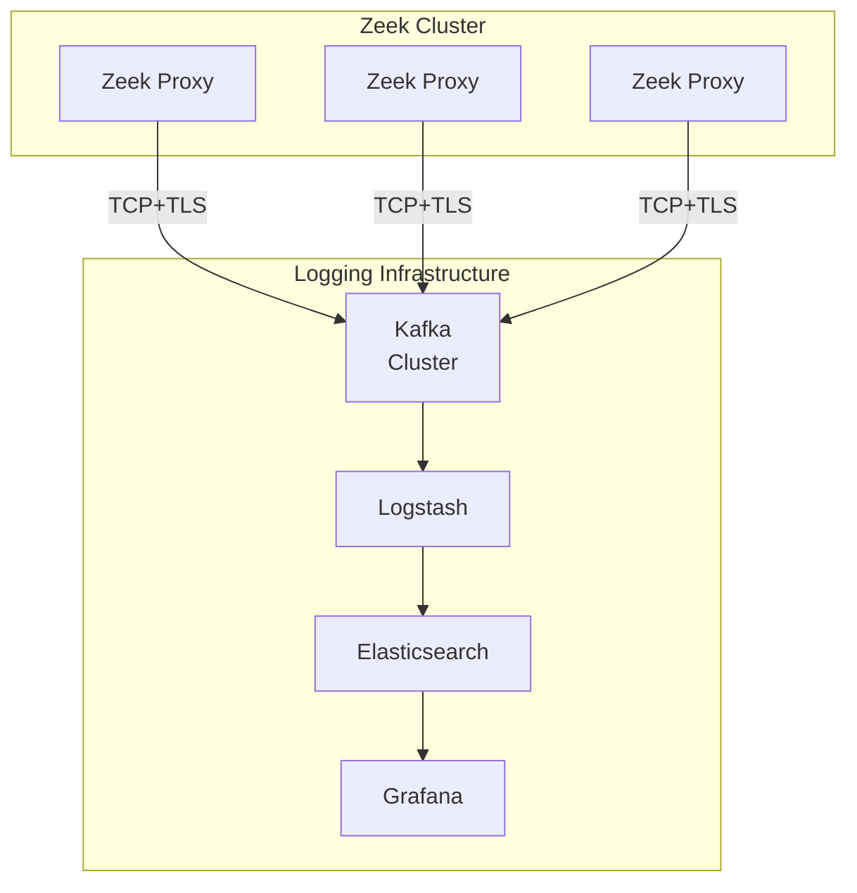

> [!info] Zeek 2026 深度探索系列
> 0. [[zeek-deep-dive-overview|全栈学习路径总览]]
> ...
> 29. [[zeek-deep-dive-ch29-logging-frameworks|第二十九章：日志框架与输出机制]]
> 30. [[zeek-deep-dive-ch30-plugin-scripting|第三十章：第三方插件与脚本扩展体系]]
> 31. [[zeek-deep-dive-ch31-custom-protocol-parsers|第三十一章：自定义协议解析器开发]]
> 32. **第三十二章：事件引擎与日志定制**
> 33. [[zeek-deep-dive-ch33-performance-tuning|第三十三章：性能调优与高级配置]]

---

## 1. Zeek 事件驱动架构

Zeek 是一个**事件驱动的网络安全监控系统**。理解其事件引擎是深度定制 Zeek 的关键。



---

## 2. 事件引擎详解

### 2.1 事件队列机制



### 2.2 事件优先级

Zeek 事件有**3 个优先级**：

| 优先级 | 值 | 触发时机 | 用途 |
| :--- | :--- | :--- | :--- |
| **HIGH** | 0 | 立即处理 | 关键状态更新、阻止后续处理 |
| **NORMAL** | 1 | 普通顺序 | 大部分事件处理 |
| **LOW** | 2 | 最后处理 | 统计、最终状态记录 |

```zeek
# 优先级示例
event connection_established(c: connection) &priority=10 {
    # 高优先级：最先执行，用于初始化状态
    print "HIGH: Connection started";
}

event connection_established(c: connection) &priority=0 {
    # 普通优先级（默认）
    print "NORMAL: Connection established";
}

event connection_established(c: connection) &priority=-5 {
    # 低优先级：最后执行，用于统计
    print "LOW: Final processing";
}
```

### 2.3 事件队列管理

```cpp
// EventManager 核心接口
class EventManager {
public:
    // 入队事件（从 C++ 层调用）
    void Enqueue(const Event* e, double time = 0);
    
    // 立即分发（同步处理）
    void Dispatch(Event* e);
    
    // 注册事件类型
    void Register(const char* name, 
                  const std::type_info& argsig,
                  EventHandler* handler);
    
    // 禁用/启用事件
    void Disable(const char* name);
    void Enable(const char* name);
};
```

### 2.4 脚本层事件控制

```zeek
# 禁用特定事件处理
event http_request(c: connection, method: string, original_uri: string, version: string) {
    # 禁用 HTTP 日志记录
    Log::disable_stream(HTTP::LOG);
}

# 延迟事件处理
event connection_state_remove(c: connection) &priority=-100 {
    # 在所有其他处理完成后执行
    # 适合做最终统计
}

# 条件事件触发
event dns_query(c: connection, query: string, qtype: count) {
    if ( /suspicious\.evil\.com/ in query ) {
        # 生成告警
        Reporter::error(c$id, "Suspicious DNS query detected");
    }
}
```

---

## 3. 事件类型体系

### 3.1 连接生命周期事件

```zeek
# 连接建立
event connection_established(c: connection)
    # c$id: conn_id - 连接的 4-tuple
    # c$orig: endpoint - 发起方
    # c$resp: endpoint - 响应方

# 连接结束
event connection_state_remove(c: connection)
    # c$duration: interval - 连接持续时间
    # c$orig$size: count - 发起方字节数
    # c$resp$size: count - 响应方字节数

# 连接超时
event connection_timeout(c: connection)
```

### 3.2 协议事件

```zeek
# HTTP 事件
event http_request(c: connection, method: string, uri: string, version: string)
event http_reply(c: connection, version: string, code: count, reason: string)

# DNS 事件
event dns_query(c: connection, query: string, qtype: count)
event dns_reply(c: connection, query: string, qtype: count, answer: string)

# SMTP 事件
event smtp_request(c: connection, cmd: string, arg: string)
event smtp_reply(c: connection, code: count, message: string, is_orig: bool)
```

### 3.3 文件事件

```zeek
# 文件检测
event file_new(f: fa_file)
    # f$id: string - 文件唯一 ID
    # f$source: string - 文件来源 (HTTP, SMTP, etc)
    # f$mime_type: string - MIME 类型
    # f$size: count - 文件大小

# 文件完成
event file_over(f: fa_file, args: fa_args)
    # f$missing_bytes: count - 缺失的字节数
    # f$total_bytes: count - 总大小
```

### 3.4 自定义事件

```zeek
# 定义自定义事件类型
event custom_event(c: connection, data: string, flags: count)

# 从 C++ 层触发（在 Analyzer 中）
zeek::eventMgr.Enqueue(
    "custom_event",
    zeek::ConnectionRef(c),
    zeek::make_intrusive<zeek::StringVal>(data),
    zeek::make_intrusive<zeek::Val>(flags, zeek::TYPE_COUNT)
);
```

---

## 4. 日志系统深度定制

### 4.1 日志流管理

```zeek
# 创建新的日志流
module MyModule;

export {
    redef enum Log::ID += { MY_LOG };
    
    type Info: record {
        ts: time       &log;
        uid: string    &log;
        id: conn_id    &log;
        action: string &log;
        detail: string &log &optional;
    };
}

# 初始化日志流
event zeek_init() {
    Log::create_stream(MY_LOG, [
        $columns=Info,
        $path="my-log",
        $dest=Log::WRITER_EMAIL,  # 通过 email 发送
        $conf=Log::default_filter
    ]);
}

# 写日志
event some_event(c: connection) {
    Log::write(MY_LOG, [
        $ts=network_time(),
        $uid=c$uid,
        $id=c$id,
        $action="detected",
        $detail=|c$orig$raw_bytes| > 1000 ? "large transfer" : ""
    ]);
}
```

### 4.2 日志 Writers

| Writer | 输出格式 | 配置方式 |
| :--- | :--- | :--- |
| **ASCII** | 键值对 (key=value) | 默认 |
| **JSON** | JSON Lines | `$writer=Log::WRITER_JSON` |
| **CSV** | 逗号分隔 | `$writer=Log::WRITER_CSV` |
| **Elasticsearch** | HTTP POST | `$writer=Log::WRITER_ASCII, $dest=...` |
| **Syslog** | RFC 5424 | `$writer=Log::WRITER_SYSLOG` |

### 4.3 多目标日志输出

```zeek
# 同时输出到多个目标
event zeek_init() {
    # 创建过滤器支持多输出
    Log::add_filter(HTTP::LOG, [
        $name="http-to-es",
        $path="http",
        $writer=Log::WRITER_ASCII,
        $dest=Log::WRITER_ASCII,  # 需要在 zeekctl 中配置
        $config=table(["host"] = "elasticsearch.example.com")
    ]);
    
    # 同时写到本地文件和远程
    Log::add_filter(HTTP::LOG, [
        $name="http-remote",
        $path="http-remote",
        $writer=Log::WRITER_ASCII,
        $dest=Log::WRITER_ASCII  # Remote logging
    ]);
}
```

### 4.4 动态日志过滤

```zeek
# 基于条件的日志过滤
event connection_state_remove(c: connection) {
    # 只记录高风险连接
    if ( c$orig$size + c$resp$size > 10MB || c$duration > 1hr ) {
        Log::write(HIGH_VOLUME_LOG, [
            $ts=c$start_time,
            $uid=c$uid,
            $id=c$id,
            $bytes=c$orig$size + c$resp$size,
            $duration=c$duration
        ]);
    }
}

# 运行时禁用日志
event suspicious_activity(c: connection) {
    # 动态禁用后续 HTTP 日志
    Log::disable_stream(HTTP::LOG);
    
    # 但保留我们自己的日志
    Log::write(MY_LOG, [$ts=network_time(), $c=c, $reason="Suspicious HTTP activity"]);
}
```

---

## 5. 高级日志定制

### 5.1 日志轮转与压缩

```zeek
# 在 local.zeek 中配置
 redef Log::default_rotation_interval = 1 day;
 redef Log::default_rotation_size = 250 MB;
 redef Log::default_rotation_postrotate_cmd = "gzip %D";
```

```bash
# zeekctl.cfg 配置
log_rotation_interval = 1 day
log_rotation_size = 250MB
log_compression = gzip
```

### 5.2 自定义日志路径

```zeek
# 按日期组织日志
event zeek_init() {
    local timestamp = strftime("%Y%m%d", network_time());
    
    Log::create_stream(MY_LOG, [
        $columns=Info,
        $path=fmt("my-log-%s", timestamp)  # 动态路径
    ]);
}
```

### 5.3 日志字段扩展

```zeek
# 扩展现有日志（使用 redef）
redef record HTTP::Info += {
    custom_field: string &log &optional;
};

event http_request(c: connection, method: string, uri: string, version: string) {
    # 设置自定义字段
    c$http$custom_field = extract_custom_data(uri);
}
```

### 5.4 条件日志过滤

```zeek
# 使用过滤器实现条件日志
event zeek_init() {
    Log::add_filter(CONNECTION_LOG, [
        $name="internal-only",
        $path="conn-internal",
        $include=function(id: Log::ID, filter: Log::Filter, info: Conn::Info): bool {
            # 只记录内部网络流量
            return Site::is_internal_addr(info$id$orig_h);
        }
    ]);
    
    Log::add_filter(CONNECTION_LOG, [
        $name="external-only",
        $path="conn-external",
        $include=function(id: Log::ID, filter: Log::Filter, info: Conn::Info): bool {
            return !Site::is_internal_addr(info$id$orig_h);
        }
    ]);
}
```

---

## 6. 告警与报告系统

### 6.1 Reporter 接口

```zeek
# 使用 Reporter 进行告警
event suspicious_activity(c: connection, reason: string) {
    # 告警级别
    Reporter::error(c$id, fmt("Critical: %s", reason));
    Reporter::warning(c$id, fmt("Warning: %s", reason));
    Reporter::info(c$id, fmt("Info: %s", reason));
}

# 告警输出到 notice.log
event suspicious_activity(c: connection, reason: string) {
    Log::write(NOTICE, [
        $ts=network_time(),
        $uid=c$uid,
        $id=c$id,
        $msg=fmt("Suspicious activity detected: %s", reason),
        $sub=reason,
        $actions=set(Notice::ACTION_LOG)
    ]);
}
```

### 6.2 Notice 系统

```zeek
# 定义 Notice 类型
redef enum Notice::Type += {
    SuspiciousProtocol::GROUND
};

# 处理 Notice
event notice(n: Notice::Info) {
    # 发送邮件
    if ( n$ty == SuspiciousProtocol::GROUND ) {
        print fmt("ALERT: %s from %s", n$msg, n$id$orig_h);
    }
}
```

---

## 7. 性能与调优

### 7.1 事件处理开销



### 7.2 减少事件处理开销

```zeek
# 避免在热路径中做字符串操作
event packet_in(c: connection, p: pkt_hdr) {
    # 差：频繁字符串格式化
    local msg = fmt("Packet: %s -> %s", p$ip$src, p$ip$dst);
    
    # 好：只在需要时格式化
    when ( need_detailed_log ) {
        local msg = fmt("Packet: %s -> %s", p$ip$src, p$ip$dst);
        Log::write(PKT_LOG, [$msg=msg]);
    }
}

# 使用 &group 高效处理相关事件
event http_request(c: connection, method: string, uri: string, version: string) &group="http-per-connection" {
    # 同连接的事件会被批量处理，减少调度开销
}
```

### 7.3 日志 I/O 优化

```zeek
# 批量日志写入
module BufferedLogger;

export {
    global flush: event();
}

# 内存缓冲
global buffer: vector of Info;

event http_request(c: connection, method: string, uri: string, version: string) {
    # 添加到缓冲区
    buffer += [$ts=network_time(), $c=c, $method=method];
    
    # 达到阈值时刷新
    if ( |buffer| >= 1000 ) {
        event flush();
    }
}

event BufferedLogger::flush() {
    if ( |buffer| == 0 ) return;
    
    # 批量写入
    for ( i in buffer ) {
        Log::write(MY_LOG, buffer[i]);
    }
    
    buffer = vector();
}
```

---

## 8. 实战：构建集中式日志管道

### 8.1 架构设计



### 8.2 实现

```zeek
# zeek-cluster-logging.zeek

module ClusterLogger;

export {
    redef enum Log::ID += { CLUSTER_LOG };
    
    type Info: record {
        ts: time      &log;
        source_node: string &log;
        stream: string &log;
        uid: string   &log;
        id: conn_id   &log;
        data: string  &log;
    };
}

# 配置远程输出
event zeek_init() {
    Log::create_stream(CLUSTER_LOG, [
        $columns=Info,
        $path="cluster-log",
        $writer=Log::WRITER_ASCII,
        $config=table([
            "dest_host" = "kafka-gateway.example.com",
            "dest_port" = "9093",
            "topic" = "zeek-logs"
        ])
    ]);
}

# 添加源节点标识
event Log::write(id: Log::ID, path: string, rec: any) {
    if ( id == HTTP::LOG || id == DNS::LOG || id == CONNECTION_LOG ) {
        # 添加集群节点标识
        local info = rec as Info;
        info$source_node = Cluster::node;
    }
}
```

### 8.3 过滤器配置

```zeek
# zeek-local.tfvars (Terraform 风格伪代码)
variable "zeek_cluster_nodes" {
  default = ["zeek-proxy-1", "zeek-proxy-2", "zeek-proxy-3"]
}

# 每个节点配置相同的日志输出到 Kafka
```

---

## 9. 总结

本章深入探讨了 Zeek 的事件引擎与日志定制系统：

**事件引擎核心**：

1. **优先级队列**：HIGH → NORMAL → LOW，控制处理顺序
2. **事件分发**：同步分发所有 Handler，支持跨语言调用
3. **脚本层控制**：禁用、延迟、过滤事件处理

**日志系统核心**：

1. **Log::write()**：原子日志写入
2. **Filter 机制**：多目标、条件过滤
3. **Writers**：支持 ASCII/JSON/CSV/Syslog 等格式

**性能考虑**：

1. 避免热路径中的字符串操作
2. 使用批量日志减少 I/O 开销
3. 合理设置日志轮转策略

下一章我们将学习**性能调优与高级配置**，掌握 Zeek 生产部署的核心优化技巧。
