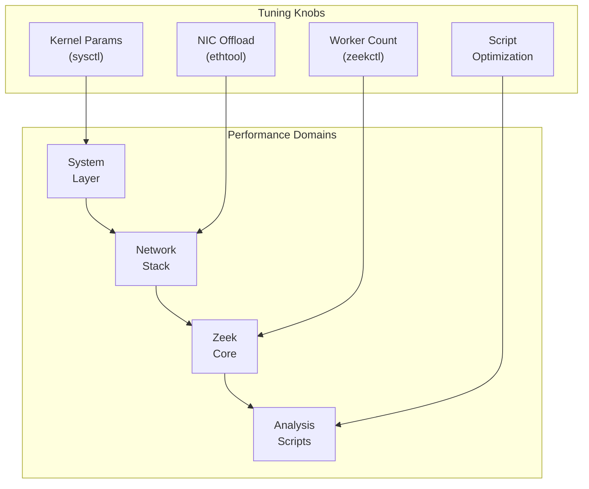
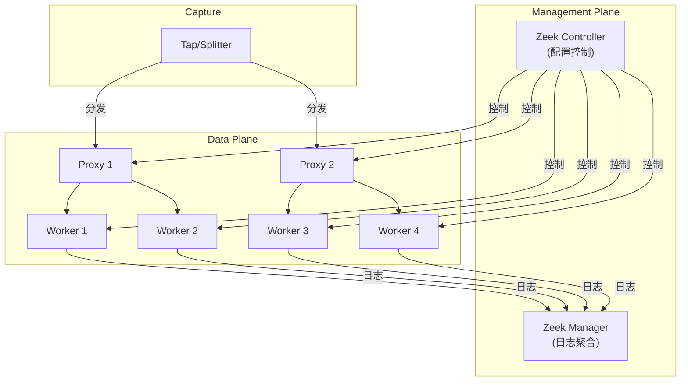

> [!info] Zeek 2026 深度探索系列 0. [[zeek-deep-dive-overview|全栈学习路径总览]]
> ... 29. [[zeek-deep-dive-ch29-logging-frameworks|第二十九章：日志框架与输出机制]] 30. [[zeek-deep-dive-ch30-plugin-scripting|第三十章：第三方插件与脚本扩展体系]] 31. [[zeek-deep-dive-ch31-custom-protocol-parsers|第三十一章：自定义协议解析器开发]] 32. [[zeek-deep-dive-ch32-event-engine-customization|第三十二章：事件引擎与日志定制]]

---

## 1. 概述：Zeek 性能优化全景

Zeek 在生产环境中处理高吞吐量网络时，性能调优至关重要。本章涵盖：

- **系统级优化**：内核参数、CPU 亲和性
- **Zeek 配置优化**：worker 数量、内存管理
- **脚本级优化**：事件处理效率
- **集群部署**：横向扩展架构



---

## 2. 系统级优化

### 2.1 内核参数调优

```bash
# /etc/sysctl.conf 或 /etc/sysctl.d/99-zeek.conf

# 网络内存管理 - 关键！
net.core.rmem_max = 16777216
net.core.rmem_default = 16777216
net.core.wmem_max = 16777216
net.core.wmem_default = 16777216
net.core.netdev_max_backlog = 5000
net.core.somaxconn = 1024

# TCP 参数优化
net.ipv4.tcp_rmem = 4096 87380 16777216
net.ipv4.tcp_wmem = 4096 65536 16777216
net.ipv4.tcp_timestamps = 0
net.ipv4.tcp_sack = 1
net.ipv4.tcp_window_scaling = 1

# 文件描述符限制
fs.file-max = 655360
fs.nr_open = 655360

# 虚拟内存
vm.swappiness = 10
vm.dirty_ratio = 60
vm.dirty_background_ratio = 10

# 应用后重新加载
sudo sysctl -p /etc/sysctl.d/99-zeek.conf
```

### 2.2 用户限制配置

```bash
# /etc/security/limits.conf 或 /etc/limits.d/zeek.conf

zeek        soft    nofile      655360
zeek        hard    nofile      655360
zeek        soft    nproc       65536
zeek        hard    nproc       65536
zeek        soft    memlock     unlimited
zeek        hard    memlock     unlimited
```

```bash
# 验证
ulimit -n    # 应显示 655360
ulimit -u    # 应显示 65536
```

### 2.3 CPU 亲和性

```bash
# 将 Zeek worker 绑定到特定 CPU 核心
# 使用 taskset

# 假设我们有 8 核，4 个 worker
taskset -c 0-1 zeek -i eth0 ...
taskset -c 2-3 zeek -i eth0 ...
taskset -c 4-5 zeek -i eth0 ...
taskset -c 6-7 zeek -i eth0 ...

# 或使用 cset shield（更精细控制）
cset shield -c 0-7 -k on
cset shield -e -- zeek --worker ...
```

### 2.4 NIC 优化

```bash
# 禁用不必要的 offload 功能
# 这些会在 Zeek 内部处理，kernel offload 会干扰

ethtool -K eth0 rxvlan off
ethtool -K eth0 txvlan off
ethtool -K eth0 rx-checksum-ipv4 off
ethtool -K eth0 tx-checksum-ipv4 off
ethtool -K eth0 scatter-gather off
ethtool -K eth0 tso off
ethtool -K eth0 ufo off
ethtool -K eth0 gso off

# 设置 ring buffer 大小
ethtool -G eth0 rx 4096 tx 4096

# 查看当前设置
ethtool -k eth0   # 显示当前 offload 状态
ethtool -g eth0   # 显示 ring buffer 大小
```

---

## 3. Zeek 配置优化

### 3.1 基础 worker 配置

```bash
# zeekctl.cfg

# Worker 进程数量（建议: CPU 核心数 - 1）
[worker]
host = worker-node-1
interface = eth0
lb_procs = 4
pin = true
```

### 3.2 高级 worker 配置

```bash
# advanced.config

# 为不同类型的工作负载配置专用 worker

[worker-parse]
lb_procs = 2
main_mode = false
env_vars = ZEEK_DEBUG_STATS=1

[worker-analyze]
lb_procs = 2
env_vars = ZEEK_PLUGIN_IGNORE=performance-heavy-plugin

# 内存限制（每 worker）
worker_max_memory = 8GB
worker_max_stack_size = 8MB
```

### 3.3 内存管理

```bash
# 控制 Zeek 内存使用

# 限制每个连接的状态表大小
redef set_record_packet_batch_size = 1000;
redef max_connection_state = 100000;

# 调整 DNS 缓存大小
redef dns_cache_size = 10000;
redef dns_ttl_uid_cache_size = 10000;

# 调整协议分析器内存限制
redef analyzer_max_depth = 5;  # 限制嵌套协议层数
```

### 3.4 脚本级优化

```zeek
# 避免在热路径中使用正则表达式
event packet_in(c: connection, p: pkt_hdr) {
    # 差：每次包都执行正则
    if ( /suspicious-pattern/ in p$tcp$payload ) { ... }

    # 好：使用连接状态缓存正则结果
    if ( !c?$pattern_checked ) {
        c$pattern_checked = T;
        c$pattern_match = /suspicious-pattern/ in p$tcp$payload;
    }
    if ( c$pattern_match ) { ... }
}

# 批量事件处理
event http_message_done(c: connection, is_orig: bool, stat: http_message_stat) {
    # 避免重复的字符串操作
    # 好：一次性提取所需数据
    local uri = c$http$uri;
    local host = c$http$host;

    # 而不是多次访问
    # local uri_len = strlen(c$http$uri);  # 差！
}
```

---

## 4. 流量分发负载均衡

### 4.1 PF_RING 负载均衡

```bash
# 配置 PF_RING 集群
# zeekctl.cfg

lb_procs = 4
lb_method = pf_ring
lb_procs Interfaces=eth0
lb_procs Interface=eth0
```

```bash
# pf_ring.conf
# /proc/sys/net/pf_ring/rss_queues 配置
echo 4 > /proc/sys/net/pf_ring/rss_queues
```

### 4.2 采样与过滤

```bash
# 采样配置（处理超高流量时）
# sampling.zeek

# 随机采样：只处理 1/100 的流量
redef sampling_probability = 0.01;

# 基于流量大小的采样（优先采样大流）
redef sample_larger_flows = T;
redef large_flow_threshold = 10MB;

# 条件采样
redef sampling_filter = "not (ip[9] = 6 and tcp[((tcp[12:1] & 0xf0) >> 2):2] = 80)";
```

### 4.3 动态采样调整

```zeek
# adaptive-sampling.zeek

module AdaptiveSampling;

export {
    global target_pkt_rate: count = 100000;  # 目标包率
    global current_sampling: count = 1;
}

event zeek_init() {
    # 初始化采样率
    update_sampling_rate();
}

event packet_in(c: connection, p: pkt_hdr) {
    # 动态调整采样
    when ( local pkt_rate = get_current_pkt_rate() ) {
        if ( pkt_rate > target_pkt_rate * 1.2 && current_sampling < 100 ) {
            current_sampling *= 2;
            apply_sampling(current_sampling);
        } else if ( pkt_rate < target_pkt_rate * 0.8 && current_sampling > 1 ) {
            current_sampling /= 2;
            apply_sampling(current_sampling);
        }
    }
}
```

---

## 5. 集群部署

### 5.1 集群架构



### 5.2 节点配置

```bash
# zeekctl 集群配置
# cluster-layout.zeek

@load tuning/load-balancing

redef Cluster::nodes = {
    ["manager"] = [$node_type=Cluster::MANAGER, $ip=127.0.0.1],

    ["proxy-1"] = [$node_type=Cluster::PROXY, $ip=127.0.0.1,
                   $manager="manager"],

    ["worker-1"] = [$node_type=Cluster::WORKER, $ip=127.0.0.1,
                    $interface="eth0", $lb_procs=4,
                    $pin_cpus={0,1}, $proxy="proxy-1"],

    ["worker-2"] = [$node_type=Cluster::WORKER, $ip=127.0.0.1,
                    $interface="eth0", $lb_procs=4,
                    $pin_cpus={2,3}, $proxy="proxy-1"],
};
```

### 5.3 高可用配置

```bash
# 高可用 Zeek 集群
# 使用 Keepalived 做故障转移

# keepalived.conf (Manager 高可用)
vrrp_instance VI_ZEEK {
    state BACKUP
    interface eth0
    virtual_router_id 51
    priority 100
    advert_int 1
    virtual_ipaddress {
        192.168.1.100
    }
    track_script {
        check_zeek
    }
}

# 健康检查脚本
#!/bin/bash
# check_zeek.sh
zeek-cleanup status > /dev/null 2>&1
exit $?
```

---

## 6. 性能监控与诊断

### 6.1 内置统计

```zeek
# 启用 Zeek 统计输出
# local.zeek

@load tuning/stats

# 定期输出统计
redef stats_update_interval = 60 secs;

# 内存状态
event zeek_stat() {
    print "Memory:", zeek_args()$mem, "MB";
    print " Packets:", zeek_args()$pkts_proc, "processed";
    print " Events:", zeek_args()$events, "dispatched";
}
```

### 6.2 外部监控集成

```bash
# Prometheus 导出器
# prometheus-exporter.zeek

@load policy/misc/perfstats

export {
    global metrics_port: port = 9091/tcp;
}

event zeek_init() {
    Log::create_stream(PERF_LOG, [...]);

    # 启动 HTTP 服务器
    Broker::listen("127.0.0.1", metrics_port);
}

# 输出 Prometheus 格式
event perf_stats_update(s: perfstats) {
    print fmt("# HELP zeek_mem_bytes Memory usage");
    print fmt("# TYPE zeek_mem_bytes gauge");
    print fmt("zeek_mem_bytes %d", s$mem);

    print fmt("# HELP zeek_events_total Total events");
    print fmt("# TYPE zeek_events_total counter");
    print fmt("zeek_events_total %d", s$events);
}
```

### 6.3 性能分析工具

```bash
# 使用 gperftools 分析 CPU
zeek -D PROFILE,HEAP /path/to/scripts

# 生成 profiling 数据
# 1. 启用 heap profiling
env HEAPPROFILE=/tmp/zeek-heap zeek scripts

# 2. 启用 CPU profiling
env CPUPROFILE=/tmp/zeek-cpu zeek scripts

# 3. 分析结果
google-pprof --text zeek /tmp/zeek-heap.0001.heap
google-pprof --text zeek /tmp/zeek-cpu.0001.prof
```

### 6.4 常见性能问题与解决方案

|                  | 问题         | 症状                        | 解决方案 |
| :--------------- | :----------- | :-------------------------- | :------- |
| **内存泄漏**     | RSS 持续增长 | 减少 DNS 缓存、检查脚本泄漏 |
| **CPU 瓶颈**     | 处理延迟增加 | 增加 worker、降低日志级别   |
| **I/O 瓶颈**     | 包处理落后   | 使用 SSD、日志异步写入      |
| **连接表满**     | 新连接被忽略 | 增加 max_connection_state   |
| **事件队列积压** | 事件处理延迟 | 优化脚本、减少事件处理      |

---

## 7. 调优检查清单

### 7.1 系统级

```bash
# 验证内核参数
sysctl net.core.rmem_max
sysctl net.core.wmem_max
sysctl fs.file-max

# 验证资源限制
ulimit -n
ulimit -u

# 验证 CPU
lscpu | grep -E "^CPU\(s\)|^Thread|^Core"
cat /proc/cpuinfo | grep processor | wc -l

# 验证 NIC
ethtool -k eth0 | grep -E "rx-checksum|tx-checksum|tso|gso"
```

### 7.2 Zeek 级

```bash
# 验证 Zeek 配置
zeek --version
zeek -N    # 列出已加载插件

# 检查 Zeekctl 状态
zeekctl status
zeekctl top

# 验证日志输出
ls -la /var/log/zeek/
```

### 7.3 性能基准测试

```bash
# 使用 tcpreplay 回放流量测试
# 准备测试流量
tcpdump -i eth0 -w baseline.pcap duration 60 seconds

# 回放测试（1Gbps 链路 × 4 workers）
tcpreplay -i eth0 -M 1000 baseline.pcap

# 验证处理能力
zeekctl scripts/load  # 检查错误
cat stats.log | grep pkts_processed
```

---

## 8. 高级配置技巧

### 8.1 协议解析优化

```zeek
# 限制分析深度
redef max_depth_per_connection = 10;

# 跳过某些协议分析（提升性能）
@if ( Cluster::node == Cluster::WORKER && /worker-parse/ in Cluster::node )
    # 禁用重量级分析
    disable_analyzer(Analyzer::ANALYZER_SSL);
    disable_analyzer(Analyzer::ANALYZER_SMTP);
@endif

# DNS 缓存优化
redef dns_cache_size = 50000;      # 缓存更多 DNS 解析结果
redef dns_max_cache_size = 100000; # 最大 DNS 缓存条目
redef dns_cache_timeout = 1 day;    # 延长缓存时间
```

### 8.2 日志 I/O 优化

```zeek
# 异步日志写入
redef Log::default_writer_tls = Log::WRITER_ASCII;
redef Log::write_buffer_size = 65536;  # 更大的写缓冲

# 合并小文件写入
redef Log::rotation_interval = 1 day;
redef Log::rotation_size = 1 GB;  # 更大的日志文件
```

### 8.3 连接跟踪优化

```zeek
# 连接状态表大小
redef max_connection_state = 1000000;

# TCP 状态超时
redef tcp_connection_request_delay = 10secs;
redef tcp_connection_LastTransmitter = 5 secs;
redef tcp_inactivity_timeout = 6 hrs;

# UDP 超时
redef udp_inactivity_timeout = 60 secs;
```

---

## 9. 总结

本章全面介绍了 Zeek 的性能调优与高级配置：

**系统级优化**：

1. 内核网络参数调优（rmem/wmem）
2. 文件描述符和进程限制
3. CPU 亲和性绑定
4. NIC offload 禁用

**Zeek 配置优化**：

1. Worker 数量与 CPU 绑定
2. 内存管理与缓存配置
3. 连接表大小与超时设置

**集群部署**：

1. Proxy-Worker 架构
2. 日志聚合与状态共享
3. 高可用故障转移

**监控与诊断**：

1. 内置统计与外部 Prometheus 集成
2. gperftools CPU/Heap 分析
3. 常见问题诊断与解决

**调优检查清单**：

1. 系统参数验证
2. Zeek 配置验证
3. 性能基准测试

通过系统性的调优，Zeek 可以在 10Gbps+ 链路上稳定运行，实现线速包处理和实时分析。

---

## 系列总结

**Part VI: Customization** 涵盖了 Zeek 深度定制三大方向：

| 章节 | 主题                 | 核心能力                        |
| :--- | :------------------- | :------------------------------ |
| Ch30 | 第三方插件与脚本扩展 | 插件开发、Spicy 集成            |
| Ch31 | 自定义协议解析器开发 | 状态机解析、C++/ZeekScript 交互 |
| Ch32 | 事件引擎与日志定制   | 事件优先级、日志过滤、多输出    |
| Ch33 | 性能调优与高级配置   | 系统优化、集群部署、性能监控    |

通过本系列的学习，你已掌握 Zeek 从**基础使用**到**高级定制**的完整知识体系。Zeek 的设计哲学——**协议无关、事件驱动、脚本可编程**——使其成为网络安全监控领域的瑞士军刀。

**下一步建议**：

1. 在生产环境小规模试点 Zeek 集群
2. 开发针对你网络的自定义协议解析器
3. 集成 Zeek 到你的 SIEM/威胁情报平台
4. 参与 Zeek 社区贡献插件和分析脚本
