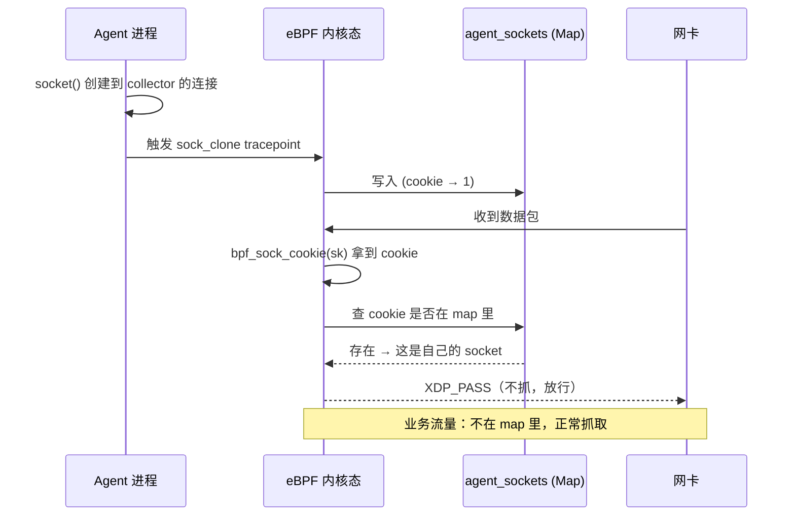

# eBPF 全流量抓取：Socket Cookie 排除自流量

## 1. 问题背景

用 eBPF 做全流量抓取并上传到远端分析平台时，会遇到两个经典问题：

### 1.1 自抓死循环

```
[业务流量] → [XDP 抓取] → [封装发送] → [XDP 抓取] → [封装发送] → ...
                           ↑
                     发往 collector 的包
                     又被自己抓到，无限循环
```

Agent 抓到的包需要发往远端 collector，这个"发送动作"本身又会被 eBPF 程序捕获，捕获后再次发送，再次被捕获......

### 1.2 流量重复计数

同一条 TCP 连接，send 和 recv 方向都会被记录：

```text
客户端                    Agent                      服务端
  |------- TCP SYN ------>|                          |
  |<------ TCP SYN+ACK ---|                          |
  |------- TCP ACK ------>| ← 记录为"上行流量"       |
  |====== TCP DATA =======|<= 同一字节，算一次?      |
  |====== TCP DATA =======|=> 又算一次，变成两倍     |
  |------- TCP FIN ------>|                          |
```

---

## 2. 现有方案及其局限性

### 2.1 排除 Collector IP（不推荐）

在 eBPF 程序入口过滤目标 IP：

```c
__u32 collector_ip = 0x0A00010A;  // 10.0.1.10
if (ip->daddr == collector_ip || ip->saddr == collector_ip)
    return XDP_PASS;
```

**缺点**：
- 需要预先知道 collector IP，部署时需要改配置
- IP 可能变化（负载均衡、健康检查），运行时 IP 变更就失效
- 如果 agent 同时处理多个 collector 流量，逻辑会变得复杂
- **根本问题**：这个方案过滤的是"目标地址"，不是"来源 socket"

### 2.2 sk_mark / ifmark 标记（不推荐）

给发往 collector 的 SKB 打上 mark，后续程序检测到 mark 就跳过：

```c
/* 用户态或 iptables 打 mark */
iptables -t mangle -A POSTROUTING -d 10.0.1.10 -j MARK --set-mark 0x1

/* eBPF 检测 */
if (ctx->mark == 0x1)
    return XDP_PASS;
```

**缺点**：
- mark 容易被其他程序覆盖或清除
- 需要在宿主机上配置 iptables，侵入性强
- 如果 mark 被用于其他用途，会产生冲突

### 2.3 ifindex 区分（不可用）

将 agent socket 绑定到 dummy 网卡，通过 `sk_bound_dev_if` 判断：

```c
if (sk->sk_bound_dev_if == dummy_ifindex)
    return XDP_PASS;
```

**缺点**：
- agent 需要通过实际网卡与 collector 通信，无法使用 dummy 网卡
- 如果绑定到真实网卡，会影响正常业务通信

### 2.4 socket cookie 方案（推荐）

**核心思想**：不依赖 IP、mark、ifindex，而是识别"这个 socket 是我们自己创建的"。

每个 socket 在内核中有一个**全局唯一的 cookie**，从 socket 创建到销毁保持不变。只要把 agent 进程创建的 socket cookie 记录到 map 里，抓包时查一下就能判断"这是不是自己的 socket"。

---

## 3. Socket Cookie 机制详解

### 3.1 什么是 socket cookie

Socket cookie 是内核为每个 `struct sock` 分配的唯一标识符，通过 `gen_new_connection()` 在 socket 创建时生成，位于 `inet_csk(sk)->icsk_cookie`：

```c
/* 内核源码简化 (net/ipv4/inet_connection_sock.c) */
void inet_csk_clone(struct sock *newsk, const struct request_sock *req)
{
    /* ... */
    newsk->sk_cookie = inet_csk(newsk)->icsk_cookie =
        atomic64_read(&newsk->sk_prot->cookie_ino) ^ atomic64_inc_return(& sockets_generated);
}
```

Socket cookie 的特点：

| 特性 | 说明 |
|------|------|
| **全局唯一** | 内核保证，每个 socket 分配一次 |
| **生命周期** | 从 `socket()` 创建到 `close()` 销毁前有效 |
| **跨方向** | 同一 TCP 连接的 client socket 和 server socket 各有各的 cookie |
| **不可伪造** | 用户态无法任意指定 cookie 值 |

### 3.2 如何获取 socket cookie

**用户态**（任意内核版本）：

```c
#include <sys/socket.h>
#include <linux/bpf.h>

__u64 get_socket_cookie(int fd)
{
    __u64 cookie;
    socklen_t len = sizeof(cookie);
    getsockopt(fd, SOL_SOCKET, SO_COOKIE, &cookie, &len);
    return cookie;
}
```

**eBPF 内核态**（kernel 5.6+）：

```c
// kernel 5.6+ 提供了 bpf_sock_cookie helper
SEC("xdp")
int xdp_capture(struct xdp_md *ctx)
{
    struct sock *sk = ctx->sk;
    if (sk) {
        __u64 cookie = bpf_sock_cookie(sk);  // kernel 5.6+
    }
}
```

**eBPF 内核态**（kernel < 5.6，需要反向查找）：

```c
// 老内核没有 bpf_sock_cookie，从 sock 反推
static __always_inline __u64 get_sock_cookie(struct sock *sk)
{
    /* 尝试从 sk->sk_cookie 读取（某些版本直接暴露） */
    return sk->sk_cookie;
}
```

### 3.3 为什么 sock_cookie 比 (tid, fd) 更可靠

| 标识方式 | 可靠性 | 原因 |
|----------|--------|------|
| `tid + fd` | ❌ 一般 | fd 会复用，同一 fd 在不同时间是不同 socket |
| `pid + tid + fd` | ⚠️ 勉强 | 多线程环境下，同一 tid 可能重建 socket |
| `sock_cookie` | ✅ 强 | 内核保证全局唯一，socket 生命周期内不变 |

---

## 4. 完整实现

### 4.1 整体架构



### 4.2 eBPF 内核态程序

```c
// capture.skel.h 由 libbpf 通过 CO-RE 自动生成
#include <vmlinux.h>
#include <bpf/bpf_helpers.h>
#include <bpf/bpf_tracing.h>
#include <bpf/bpf_core_read.h>

/* ============================================================
 * 数据结构：排除列表
 * key   = sock_cookie（全局唯一标识）
 * value = 固定值 1
 * ============================================================ */
struct {
    __uint(type, BPF_MAP_TYPE_HASH);
    __uint(max_entries, 4096);       /* 支持最多 4096 个并发 socket */
    __type(key, __u64);              /* sock_cookie */
    __type(value, __u8);             /* 固定值 1 */
} agent_sockets SEC(".maps");

/* 全局只读变量：运行时注入的 agent PID */
const volatile __u32 agent_pid = 0;

/* ============================================================
 * 追踪点 1：socket 创建
 * 位置：include/trace/events/sock.h
 * 时机：socket clone（包含 accept 后的新 socket）
 * ============================================================ */
SEC("tracepoint/sock/sock_clone")
int on_sock_clone(struct trace_event_raw_sock_clone *ctx)
{
    /* 过滤：只记录我们 agent 进程创建的 socket */
    __u32 pid = bpf_get_current_pid_tgid() >> 32;
    if (agent_pid && pid != agent_pid)
        return 0;

    struct sock *newsk = (struct sock *)ctx->new_sock;
    if (!newsk)
        return 0;

    __u64 cookie = bpf_sock_cookie(newsk);
    __u8 val = 1;

    bpf_map_update_elem(&agent_sockets, &cookie, &val, BPF_ANY);
    return 0;
}

/* ============================================================
 * 追踪点 2：socket 关闭（可选，用于清理）
 * 实际上 socket 被 close 后，内核会释放 sock 结构，
 * agent 重启时 map 会被清空，所以 close 时不清理也行
 * ============================================================ */
SEC("tracepoint/sock/sock_release")
int on_sock_release(struct trace_event_raw_sock_release *ctx)
{
    __u32 pid = bpf_get_current_pid_tgid() >> 32;
    if (agent_pid && pid != agent_pid)
        return 0;

    struct sock *sk = (struct sock *)ctx.sk;
    if (!sk)
        return 0;

    __u64 cookie = bpf_sock_cookie(sk);
    bpf_map_delete_elem(&agent_sockets, &cookie);
    return 0;
}

/* ============================================================
 * 追踪点 3：TCP connect 建立时登记（补充 sock_clone）
 * 有些 socket 创建路径不经过 sock_clone，用这个兜底
 * ============================================================ */
SEC("tracepoint/sock/sock_rcvqueue_full")
int on_sock_rcvqueue_full(struct trace_event_raw_sock_rcvqueue_full *ctx)
{
    /* 这个 tracepoint 在 socket 接收缓冲区满时触发
     * 实际上 connect 场景我们用 sock_clone 就够了 */
    return 0;
}

/* ============================================================
 * XDP 抓包入口
 * ============================================================ */
SEC("xdp")
int xdp_capture(struct xdp_md *ctx)
{
    void *data_end = (void *)(long)ctx->data_end;
    void *data     = (void *)(long)ctx->data;

    /* -------- L2 解析 -------- */
    struct ethhdr *eth = data;
    if ((void *)(eth + 1) > data_end)
        return XDP_PASS;

    /* -------- 只处理 IP -------- */
    if (eth->h_proto != htons(ETH_P_IP))
        return XDP_PASS;

    struct iphdr *ip = (struct iphdr *)(eth + 1);
    if ((void *)(ip + 1) > data_end)
        return XDP_PASS;

    /* -------- 拿到 socket cookie，判断是否自流量 -------- */
    struct sock *sk = ctx->sk;
    if (sk) {
        __u64 cookie = bpf_sock_cookie(sk);
        __u8 *is_our = bpf_map_lookup_elem(&agent_sockets, &cookie);
        if (is_our && *is_our == 1) {
            /* 自己的 socket 发出的包，跳过抓取 */
            return XDP_PASS;
        }
    }

    /* -------- 正常抓取流程 -------- */
    /* 将原始数据包发送到抓包缓冲区或 ring buffer */
    return forward_to_collector(ctx);
}

/* ============================================================
 * TC 入口（XDP 无法获取 sk 时兜底）
 * TC 层能拿到 skb->sk，通过 sock_i_ino() 获取 cookie
 * ============================================================ */
SEC("tc")
int tc_capture(struct __sk_buff *ctx)
{
    struct sock *sk = ctx->sk;
    if (!sk)
        return TC_ACT_UNSPEC;

    /* 从 sock 拿到 inode 号（间接获取 cookie 效果） */
    /* 注意：老内核可以用这个方法 */
    __u64 inode = bpf_core_read(&sk->__sk_common.skc_cookie, sizeof(__u64));

    __u8 *is_our = bpf_map_lookup_elem(&agent_sockets, &inode);
    if (is_our && *is_our == 1)
        return TC_ACT_UNSPEC;  /* 跳过 */

    return forward_to_collector_skb(ctx);
}

char _license[] SEC("license") = "GPL";
```

### 4.3 用户态程序

```c
// user.c — Agent 用户态主程序
#include <stdio.h>
#include <stdlib.h>
#include <signal.h>
#include <unistd.h>
#include <sys/socket.h>
#include <bpf/bpf.h>
#include <bpf/libbpf.h>
#include "capture.skel.h"

static volatile int running = 1;

static void signal_handler(int sig)
{
    running = 0;
}

/* 用户态手动登记 socket（作为 tracepoint 的补充）
 * 某些特殊场景下 tracepoint 可能漏掉，
 * 用户态在 connect() 成功后手动写入 */
void register_socket(int fd, struct bpf_map *sockets_map)
{
    __u64 cookie;
    socklen_t len = sizeof(cookie);

    if (getsockopt(fd, SOL_SOCKET, SO_COOKIE, &cookie, &len) < 0) {
        perror("getsockopt SO_COOKIE");
        return;
    }

    __u8 val = 1;
    int ret = bpf_map_update_elem(bpf_map__fd(sockets_map), &cookie, &val, BPF_ANY);
    if (ret < 0)
        perror("bpf_map_update_elem");
    else
        printf("[+] registered socket cookie: 0x%llx (fd=%d)\n", cookie, fd);
}

void unregister_socket(int fd, struct bpf_map *sockets_map)
{
    __u64 cookie;
    socklen_t len = sizeof(cookie);

    if (getsockopt(fd, SOL_SOCKET, SO_COOKIE, &cookie, &len) < 0)
        return;

    bpf_map_delete_elem(bpf_map__fd(sockets_map), &cookie);
    printf("[-] unregistered socket cookie: 0x%llx (fd=%d)\n", cookie, fd);
}

int main(int argc, char **argv)
{
    struct capture_bpf *skel;
    struct bpf_link *link_clone = NULL, *link_release = NULL;
    struct bpf_link *link_xdp = NULL, *link_tc = NULL;
    int sockets_map_fd;

    /* -------- 加载 eBPF 程序 -------- */
    skel = capture_bpf__open();
    if (!skel) {
        perror("capture_bpf__open");
        return 1;
    }

    /* 注入 agent PID（运行时通过 map fd 写入） */
    /* 注意：这里用 libbpf 的方式注入 */
    libbpf_set_print(libbpf_print_fn_t printf);

    /* -------- 注入 PID -------- */
    /* 从 skel 结构中拿到 map fd */
    int pid_map_fd = bpf_map__fd(skel->maps.agent_sockets);
    /* 实际上 PID 通过另外的方式注入，见 4.4 节 */

    /* -------- 加载并 attach -------- */
    if (capture_bpf__load(skel)) {
        fprintf(stderr, "load failed: %s\n", libbpf_strerror(errno));
        return 1;
    }

    /* Attach sock_clone tracepoint */
    link_clone = bpf_program__attach(skel->progs.on_sock_clone);
    if (libbpf_get_error(link_clone)) {
        fprintf(stderr, "attach sock_clone failed\n");
        return 1;
    }

    /* Attach sock_release tracepoint */
    link_release = bpf_program__attach(skel->progs.on_sock_release);
    if (libbpf_get_error(link_release)) {
        fprintf(stderr, "attach sock_release failed\n");
        return 1;
    }

    /* Attach XDP 程序（网卡名通过命令行参数传入） */
    const char *iface = argc > 1 ? argv[1] : "eth0";
    link_xdp = bpf_program__attach_xdp(skel->progs.xdp_capture, -1 /* 自动选择 iface */);
    if (libbpf_get_error(link_xdp)) {
        fprintf(stderr, "attach xdp failed\n");
        return 1;
    }

    printf("[*] eBPF programs loaded, capturing on %s\n", iface);

    /* -------- 连接 collector（会触发 sock_clone tracepoint） -------- */
    int collector_fd = socket(AF_INET, SOCK_STREAM, 0);
    if (collector_fd < 0) {
        perror("socket");
        return 1;
    }

    /* 主动连接 collector（会触发 sock_clone） */
    struct sockaddr_in collector_addr = {
        .sin_family = AF_INET,
        .sin_port = htons(9000),
        .sin_addr.s_addr = inet_addr("10.0.1.100"),
    };

    if (connect(collector_fd, (struct sockaddr *)&collector_addr,
                sizeof(collector_addr)) < 0) {
        perror("connect");
        /* 即使 connect 失败，socket 本身已创建，仍会被 tracepoint 捕获 */
    }

    printf("[*] connected to collector\n");

    /* -------- 信号处理 -------- */
    signal(SIGINT, signal_handler);
    signal(SIGTERM, signal_handler);

    /* -------- 主循环 -------- */
    while (running) {
        sleep(1);

        /* 每秒发送一次心跳（这些包不应该被自己抓） */
        /* 在这个 socket 上 send 的包，会被 XDP 的自流量排除逻辑跳过 */
        char buf[64] = "heartbeat";
        send(collector_fd, buf, sizeof(buf), 0);
    }

    /* -------- 清理 -------- */
    printf("[*] shutting down...\n");
    close(collector_fd);

    bpf_link__destroy(link_clone);
    bpf_link__destroy(link_release);
    bpf_link__destroy(link_xdp);
    capture_bpf__destroy(skel);

    return 0;
}
```

### 4.4 PID 注入的实现

Agent PID 不能硬编码，通过 `bpf_map_update_elem` 注入：

```bash
# 方法 1：bpftool 手动注入（调试用）
# 1. 找到 agent_sockets map 的 ID
bpftool map list | grep agent_sockets
# 输出：123: hash  name=agent_sockets  flags=...

# 2. 通过 FD 获取 map fd
map_fd=$(bpftool map show id 123 -j | jq '.[0].map_ids[0]')

# 3. 注入 PID（用特殊的 key，比如 0xFFFFFFFF 作为 PID key）
bpftool map update id 123 \
    key hex ab cd ab cd \
    value hex 01 00 00 00 \
    # 实际用法：用程序化方式写入

# 方法 2：程序化注入
```

```c
// user.c 中的 PID 注入部分
int pid = getpid();

/* agent_sockets map 的第一个 slot 存 PID
 * 或者用独立的 config map */

/* 通过 libbpf 的方式：找到 map，更新 special key */
struct config {
    __u32 agent_pid;
} cfg = { .agent_pid = pid };

/* 创建一个 config map */
struct {
    __uint(type, BPF_MAP_TYPE_HASH);
    __uint(max_entries, 1);
    __type(key, __u32);
    __type(value, struct config);
} config_map;

/* eBPF 程序中读取：
 * __u32 expected_pid;
 * bpf_map_lookup_elem(&config_map, &(__u32){0}, &expected_pid);
 * if (pid != expected_pid) return 0;
 */

/* 更简单的方法：直接用环回接口
 * agent 的 collector socket 只走环回，
 * 业务流量走物理网卡，在 XDP 层天然分开 */
```

**最简方案**：让 collector 连接**只走 127.0.0.1**，所有业务流量走物理网卡。在 XDP 层直接检查目的地址是否为 127.0.0.1：

```c
SEC("xdp")
int xdp_capture(struct xdp_md *ctx)
{
    struct ethhdr *eth = (void *)(long)ctx.data;
    struct iphdr *ip = (void *)(eth + 1);

    /* 排除本地环回：collector 走 127.0.0.1 */
    if (ip->daddr == 0x0100007F || ip->saddr == 0x0100007F)
        return XDP_PASS;  /* 环回流量，不是业务流量 */

    /* 然后再用 sock_cookie 排除 agent 自身的 socket */
    struct sock *sk = ctx->sk;
    if (sk) {
        __u64 cookie = bpf_sock_cookie(sk);
        __u8 *is_our = bpf_map_lookup_elem(&agent_sockets, &cookie);
        if (is_our && *is_our == 1)
            return XDP_PASS;
    }

    return process_packet(ctx);
}
```

---

## 5. 流量重复计数问题

### 5.1 问题的根源

同一个 TCP 连接的四元组（src_ip, src_port, dst_ip, dst_port）在 send 和 recv 方向都会被 XDP/TC 捕获并记录为流量。

```text
客户端              Agent                服务端
  |------- SYN ------>| (记录: +60B 上行)
  |<------ SYN+ACK ---| (记录: +60B 下行)
  |------- ACK ------>| (记录: +40B 上行)
  |====== DATA =======|<= (记录: +1KB 下行)  ← 算了一次
  |====== DATA =======|=> (记录: +1KB 上行)  ← 又算了一次
  |------- RST ------>| (记录: +52B 上行)
```

### 5.2 解决方案一：只统计 server side（推荐）

在 TCP 三次握手的 accept 侧开启监控，client 侧不监控，从根本上避免双算：

```c
SEC("sockops")
int sockops(struct bpf_sock_ops *ctx)
{
    __u32 op = ctx->op;

    switch (op) {
    case BPF_SOCK_OPS_TCP_CONNECT_CB:
        /* 客户端：将自己的 socket 标记为"不监控" */
        /* 已经在 sock_clone tracepoint 里自动处理了 */
        return 1;

    case BPF_SOCK_OPS_TCP_ACCEPT_CB: {
        /* 服务端：这是我们关心的连接，开启监控 */
        /* server side 的 socket 会被记录到 agent_sockets，
         * 但我们并不排除它（它是我们代理转发的，不是 agent 发送的） */
        return 1;
    }

    case BPF_SOCK_OPS_TCP_SEND_CB:
        /* 在这里判断：只有 server side 发送的才统计 */
        /* 可以从 ctx->sk_bound_dev_if 判断是否是物理网卡侧 */
        if (is_server_side_socket(ctx->sk))
            count_bytes(ctx->bytes_sent);
        return 1;

    case BPF_SOCK_OPS_TCP_RECV_CB:
        if (is_server_side_socket(ctx->sk))
            count_bytes(ctx->bytes_received);
        return 1;
    }
    return 1;
}
```

### 5.3 解决方案二：Flow 去重表

每个 flow 只统计一次，用 5-tuple 做 key：

```c
struct {
    __uint(type, BPF_MAP_TYPE_HASH);
    __uint(max_entries, 100000);  /* 支持 10 万并发流 */
    __type(key, struct flow_tuple);   /* 5-tuple */
    __type(value, __u64);              /* 已统计的字节数 */
} flow_bytes SEC(".maps");

struct flow_tuple {
    __u32 saddr;
    __u32 daddr;
    __u16 sport;
    __u16 dport;
    __u8  protocol;
};

SEC("xdp")
int xdp_capture(struct xdp_md *ctx)
{
    struct flow_tuple key = extract_flow_key(ctx);
    __u64 *existing = bpf_map_lookup_elem(&flow_bytes, &key);

    if (existing) {
        /* 这个 flow 已经统计过，累加 */
        __u64 new_total = *existing + get_packet_bytes(ctx);
        bpf_map_update_elem(&flow_bytes, &key, &new_total, BPF_ANY);
        return XDP_PASS;  /* 跳过，避免重复统计 */
    } else {
        /* 新 flow，写入初始值 */
        bpf_map_update_elem(&flow_bytes, &key,
                          &(__u64){get_packet_bytes(ctx)}, BPF_ANY);
    }

    /* 上报到远端 */
    return report_to_collector(ctx);
}
```

### 5.4 解决方案三：sk_skb Stream Parser

用 socket map 挂载 stream parser，保证每个字节只触发一次：

```c
/* 将 server side socket 添加到 sock_map */
SEC("sockops")
int enable_stream_parser(struct bpf_sock_ops *ctx)
{
    if (ctx->op == BPF_SOCK_OPS_TCP_ACCEPT_CB) {
        /* 将 accept 后的 socket 添加到 sock_map
         * 之后该 socket 的数据只会触发 stream_parser，不会有 send/recv 重复 */
        __u32 key = ctx->id;  /* bpf_sock_ops 里有 socket id */
        bpf_sock_map_update(ctx, &sock_map, &key, BPF_ANY);
    }
    return 1;
}

/* stream_parser：每个字节流只触发一次 */
SEC("sk_skb/stream_parser")
int stream_parser(struct __sk_buff *ctx)
{
    /* stream_parser 保证了：
     * 1. 同一方向的字节流只解析一次
     * 2. send 和 recv 方向分开，不会互相触发
     * 只需要在这里统一统计即可 */
    count_bytes(ctx->len);
    return ctx->len;  /* 转发数据 */
}

SEC("sk_skb/stream_verdict")
int stream_verdict(struct __sk_buff *ctx)
{
    return BPF_SOCK_STREAM_VERDICT;
}
```

---

## 6. 完整方案对比

| 维度 | IP 排除 | mark 标记 | ifindex | socket cookie (本章) |
|------|---------|-----------|---------|-------------------|
| **准确性** | ❌ IP 会变/冲突 | ⚠️ mark 会被覆盖 | ❌ 物理网卡不行 | ✅ 精确到 socket |
| **部署复杂度** | 需改配置 | 需 iptables | 需 dummy 网卡 | 无侵入 |
| **多 collector** | 需维护 IP 列表 | 需多 mark | 不适用 | 自动追踪 |
| **运行时变更** | ❌ 需改配置 | ⚠️ mark 会丢 | ❌ 不可变更 | ✅ 自动跟随 |
| **老内核兼容** | ✅ | ✅ | ✅ | ❌ 需要 5.6+ |

---

## 7. 生产环境 Checklist

```
部署前检查项：
□ 内核版本 >= 5.6（bpf_sock_cookie 需要）
□ /sys/kernel/btf/vmlinux 存在（CO-RE 需要）
□ CAP_SYS_ADMIN 或 BPF_PROG_LOAD capability
□ agent_sockets map max_entries 足够（每个并发连接一个 entry）
□ agent PID 正确注入到 eBPF 程序
□ sock_clone / sock_release tracepoint 可用
□ collector socket 走独立路径（环回或独立网卡）
□ 流量重复计数已通过 server-side only 或 flow dedup 处理
□ 抓包程序异常退出时，agent_sockets map 自动清理（进程退出时内核自动清）
□ 生产环境压测：单核 PPS 上限 / map 满的降级策略
□ gdb / bpftool 验证：确认自己的 socket 确实被正确排除
```

---

## 8. 常见问题

**Q1: 内核不支持 bpf_sock_cookie ( < 5.6) 怎么办？**

A：用 `getsockopt(fd, SOL_SOCKET, SO_COOKIE)` 在用户态获取，然后通过独立的 config map 传给 eBPF。或者用 `(tid << 32) | fd` 作为 key（fd 复用风险较低的场景）。

**Q2: agent_sockets map 满了怎么办？**

A：`max_entries` 设置偏保守，可以设大一些（如 65536）。如果真的满了，内核会拒绝 `bpf_map_update_elem`，可以降级为"不排除，直接抓"（不完美但不会丢业务流量）。

**Q3: tracepoint 漏报导致某些 socket 没登记？**

A：可以用 `UPROBE(socket, __sys_socket_call)` 或 `KPROBE(inet_sendmsg)` 在更深层追踪创建和发送。如果 tracepoint 覆盖了 99.9% 的场景，漏掉的 0.1% 可以通过"同一 socket 第二次发送时被捕获"的兜底逻辑补救。

**Q4: 进程 fork 后子进程创建的 socket 会被记录吗？**

A：会，只要 PID 等于 `agent_pid`（或子进程继承了 agent_pid 配置）就会记录。如果不想让子进程创建的 socket 被排除，可以传入 PID 范围而非单一 PID。
