# Code Agent Ch1: 概述与架构设计

## 1. 什么是 Code Agent

### 1.1 定义

Code Agent（代码智能体）是一种基于大语言模型（LLM）的智能系统，它能够理解用户的编程意图、自主规划代码任务、调用各类工具完成代码编写、调试和优化。与传统的代码补全工具不同，Code Agent 具备**主动推理**、**多步骤规划**和**工具调用**能力，能够处理复杂的端到端软件开发任务。

从技术层面定义，Code Agent 可以形式化为一个五元组：

```
CodeAgent = (LLM, Tools, Memory, Executor, Policy)
```

其中：

- **LLM**: 负责理解意图、推理决策、生成代码
- **Tools**: 可调用的外部能力集合（文件操作、Shell命令、Git、网络搜索等）
- **Memory**: 存储对话历史、项目上下文、中间执行状态
- **Executor**: 实际执行代码和命令的环境
- **Policy**: 决策策略，控制 Agent 的行为模式

### 1.2 历史演进

Code Agent 的发展经历了三个主要阶段：

**第一阶段：IDE 插件时代（2019-2022）**

这一阶段以 GitHub Copilot 为代表。2019 年，OpenAI 发布 Codex 模型，首次将 GPT 模型应用于代码生成。2021 年 6 月，GitHub Copilot 正式发布，标志着 AI 辅助编程进入实用化阶段。这一时期的工具主要是**增强型补全**，以插件形式集成到 VS Code、JetBrains 等主流 IDE 中。

**第二阶段：对话式编程助手（2022-2024）**

2022 年 11 月，ChatGPT 发布，引发了 AI 应用的热潮。GitHub Copilot Chat、Cursor 等产品将对话交互引入编程场景。用户可以通过自然语言描述需求，AI 以对话形式协助调试、解释代码、生成文档。这一阶段的标志是**从补全到对话**的转变。

**第三阶段：自主性 Agent（2024 至今）**

2024 年初，Anthropic 发布 Claude Code，OpenAI 推出 Devin，Cognition 推出 Devin。这些系统展现出更强的自主性：能够理解复杂需求、制定执行计划、多步骤迭代完成项目。代表性事件是 Devin 参加 SWE-bench 基准测试，在真实 GitHub issue 修复任务中展现出惊人的能力。

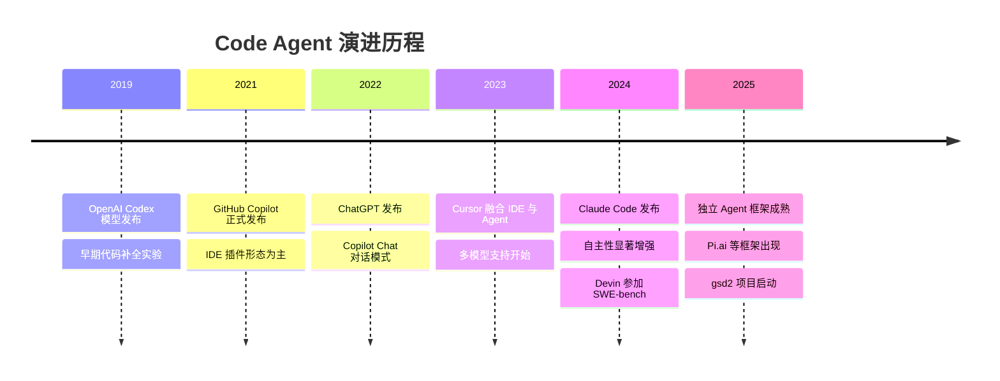

### 1.3 定位

Code Agent 在 AI 软件工程工具链中占据核心位置：

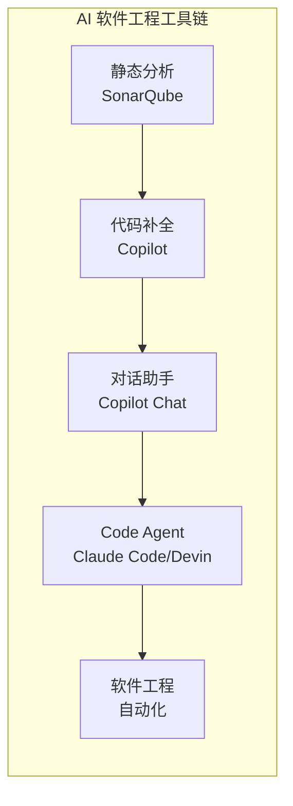

Code Agent 是 AI 软件工程自动化的**中枢**，向上对接需求分析，向下执行代码实现，是当前技术发展的主战场。

## 2. Claude Code 的架构分析

### 2.1 整体架构

基于公开文档、技术博客和实际使用体验，我们可以推测 Claude Code 的内部架构如下：

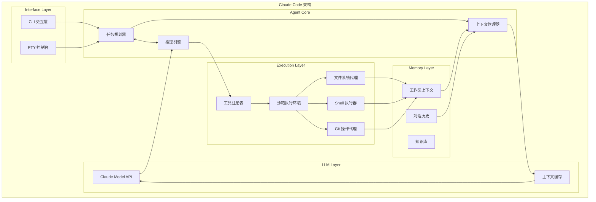

### 2.2 核心流程

Claude Code 的执行流程可以概括为 **OODA 循环**（Observe-Orient-Decide-Act）：

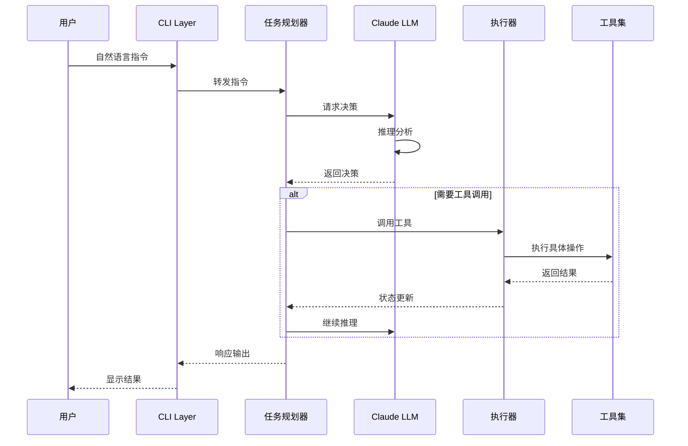

### 2.3 关键技术决策

根据分析，Claude Code 采用了以下关键技术：

**1. PTY 模式**

Claude Code 运行在 PTY（Pseudo-Terminal）模式下，这使得它能够：

- 捕获所有命令输出，包括 ANSI 颜色代码
- 模拟交互式输入（如 vim、less 等）
- 保持状态一致性

```python
# PTY 模式的核心实现示意
class PTYSession:
    def __init__(self):
        self.master_fd, self.slave_fd = pty.openpty()
        self.proc = subprocess.Popen(
            ['/bin/bash'],
            stdin=self.slave_fd,
            stdout=self.slave_fd,
            stderr=self.slave_fd,
            preexec_fn=os.setsid
        )

    def write(self, data: str):
        os.write(self.master_fd, data.encode())

    def read(self, timeout: float = 0.1) -> str:
        # 非阻塞读取
        pass
```

**2. 状态机驱动**

Claude Code 内部维护一个状态机来管理会话生命周期：

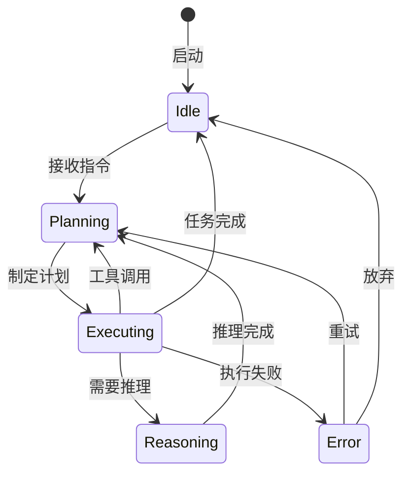

**3. 增量上下文管理**

为了处理大型项目，Claude Code 采用增量上下文策略：

```python
class IncrementalContext:
    def __init__(self, max_tokens: int = 200000):
        self.max_tokens = max_tokens
        self.chunks = []
        self.embeddings = []

    def add(self, content: str, source: str):
        """添加新的上下文内容"""
        chunk = Chunk(content, source)
        self.chunks.append(chunk)
        self._maintain_limit()

    def _maintain_limit(self):
        """保持上下文在限制内"""
        while self._total_tokens() > self.max_tokens:
            # 移除最不重要的 chunk
            least_important = self._find_least_important()
            self.chunks.remove(least_important)

    def get_context_window(self) -> list[dict]:
        """获取当前上下文窗口"""
        return [chunk.to_message() for chunk in self.chunks]
```

## 3. Code Agent 核心组件

### 3.1 LLM 层

LLM 层是 Code Agent 的"大脑"，负责：

| 能力     | 描述                     | 技术实现                         |
| -------- | ------------------------ | -------------------------------- |
| 意图理解 | 解析用户自然语言指令     | Prompt Engineering + Fine-tuning |
| 任务规划 | 分解复杂需求为可执行步骤 | Chain-of-Thought                 |
| 代码生成 | 生成符合规范的代码       | Code-Specific Training           |
| 反思验证 | 检查输出质量并修正       | Constitutional AI                |

**模型选择考量**：

```python
# 不同任务的模型选择策略
MODEL_STRATEGY = {
    "quick_completion": {
        "model": "claude-3-haiku",
        "context_window": 200000,
        "strength": "快速响应"
    },
    "complex_reasoning": {
        "model": "claude-3-opus",
        "context_window": 200000,
        "strength": "深度推理"
    },
    "code_generation": {
        "model": "claude-3-sonnet",
        "context_window": 200000,
        "strength": "代码优化"
    }
}
```

### 3.2 Tool 层

Tool 层是 Code Agent 的"四肢"，赋予它操作外部世界的能力：

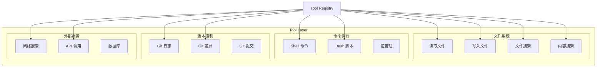

**工具定义规范**：

```json
{
  "name": "read_file",
  "description": "读取文件内容",
  "parameters": {
    "type": "object",
    "properties": {
      "path": {
        "type": "string",
        "description": "文件路径"
      },
      "offset": {
        "type": "integer",
        "description": "起始行号",
        "default": 1
      },
      "limit": {
        "type": "integer",
        "description": "读取行数限制",
        "default": 1000
      }
    },
    "required": ["path"]
  }
}
```

### 3.3 Memory 层

Memory 层是 Code Agent 的"海马体"，负责存储和检索各类信息：

```python
class MemoryLayer:
    """三层记忆架构"""

    def __init__(self):
        # 1. 工作记忆：当前会话的即时状态
        self.working_memory: WorkingMemory = WorkingMemory()

        # 2. 项目记忆：当前项目的结构化信息
        self.project_memory: ProjectMemory = ProjectMemory()

        # 3. 长期记忆：跨会话的知识积累
        self.long_term_memory: LongTermMemory = LongTermMemory()

    def remember(self, key: str, value: Any, tier: str = "working"):
        """存储记忆"""
        if tier == "working":
            self.working_memory.set(key, value)
        elif tier == "project":
            self.project_memory.set(key, value)
        else:
            self.long_term_memory.set(key, value)

    def recall(self, query: str, tier: str = "all") -> list[Any]:
        """检索记忆"""
        # 实现向量相似度搜索
        pass
```

**记忆类型对比**：

| 记忆类型  | 容量   | 生命周期 | 内容示例                     |
| --------- | ------ | -------- | ---------------------------- |
| Working   | ~10KB  | 单次交互 | 当前指令、正在编辑的代码     |
| Project   | ~1MB   | 项目周期 | 项目结构、依赖关系、代码规范 |
| Long-term | 无限制 | 永久     | 编程模式、最佳实践、历史经验 |

### 3.4 Execution 层

Execution 层是 Code Agent 的"手"，负责实际执行操作：

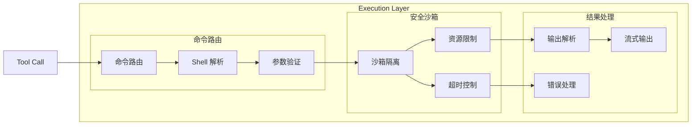

**沙箱执行示例**：

```python
import subprocess
import resource
import os

class SandboxedExecutor:
    """安全的命令执行器"""

    def __init__(self, timeout: int = 30, memory_limit: int = 512 * 1024 * 1024):
        self.timeout = timeout
        self.memory_limit = memory_limit

    def execute(self, command: str, cwd: str = None) -> ExecutionResult:
        """在沙箱中执行命令"""
        try:
            result = subprocess.run(
                command,
                shell=True,
                capture_output=True,
                text=True,
                timeout=self.timeout,
                cwd=cwd,
                env=self._get_safe_env()
            )
            return ExecutionResult(
                stdout=result.stdout,
                stderr=result.stderr,
                returncode=result.returncode,
                success=result.returncode == 0
            )
        except subprocess.TimeoutExpired:
            return ExecutionResult(success=False, error="Timeout")
        except Exception as e:
            return ExecutionResult(success=False, error=str(e))

    def _get_safe_env(self) -> dict:
        """获取安全的环境变量"""
        safe_env = os.environ.copy()
        # 移除危险变量
        dangerous = ["LD_PRELOAD", "LD_LIBRARY_PATH", "DYLD_*"]
        for key in list(safe_env.keys()):
            if any(p in key for p in dangerous):
                del safe_env[key]
        return safe_env
```

## 4. 主流 Code Agent 对比

### 4.1 产品概览

| 产品         | 开发方           | 发布年份 | 核心定位       | 技术特点           |
| ------------ | ---------------- | -------- | -------------- | ------------------ |
| Claude Code  | Anthropic        | 2024     | CLI 开发者工具 | PTY 集成、深度推理 |
| Copilot Chat | GitHub/Microsoft | 2023     | IDE 内嵌助手   | 深度 IDE 集成      |
| Devin        | Cognition        | 2024     | 全自主工程师   | 端到端自动化       |
| Cursor       | Cursor Inc.      | 2023     | AI-First IDE   | 多模型融合         |
| Replit Agent | Replit           | 2024     | 云端开发       | 全流程自动化       |

### 4.2 功能维度对比

> ⚠️ 注：radarChart 雷达图仅在 Quartz（部署后）通过 Mermaid 11.4.0 渲染，Obsidian 内置 Mermaid 不支持此类型。以下为两平台兼容的表格形式对比。

#### 评分总览

| 维度       | Claude Code | Copilot Chat | Devin | Cursor | Replit Agent |
| ---------- | :---------: | :----------: | :---: | :----: | :----------: |
| 代码生成   |    0.90     |     0.95     | 0.85  |  0.90  |     0.80     |
| 调试能力   |    0.85     |     0.90     | 0.70  |  0.85  |     0.75     |
| 多步骤规划 |    0.95     |     0.70     | 0.90  |  0.80  |     0.85     |
| IDE 集成   |    0.60     |     0.95     | 0.30  |  0.95  |     0.40     |
| 独立部署   |    0.90     |     0.50     | 0.70  |  0.80  |     0.95     |
| 上下文理解 |    0.95     |     0.85     | 0.80  |  0.90  |     0.85     |

#### 维度解析

| 维度       | 说明                                   | 最优方案                   |
| ---------- | -------------------------------------- | -------------------------- |
| 代码生成   | 根据需求描述生成符合规范的代码         | Copilot Chat (0.95)        |
| 调试能力   | 理解错误信息、定位问题、根因分析       | Copilot Chat (0.90)        |
| 多步骤规划 | 复杂任务分解、多阶段执行、状态管理     | Claude Code (0.95)         |
| IDE 集成   | 与编辑器深度融合、智能补全、跳转支持   | Cursor/Copilot Chat (0.95) |
| 独立部署   | 可脱离 IDE 运行、CLI 优先、自动化友好  | Claude Code (0.90)         |
| 上下文理解 | 超长上下文窗口、跨文件推理、项目级理解 | Claude Code (0.95)         |

#### 雷达图（Quartz 部署后可查看）

```mermaid
%%{
  init: {
    "theme": "base",
    "radar": {
      "axisDomainName": false,
      "curve": "linearClosed"
    },
    "themeVariables": {
      "radarAxisNameColor": "#666",
      "radarGridColor": "#ddd"
    }
  }
}%%
radar
    title 功能维度对比
    "代码生成" : 0.9 : 0.95 : 0.85 : 0.9 : 0.8
    "调试能力" : 0.85 : 0.9 : 0.7 : 0.85 : 0.75
    "多步骤规划" : 0.95 : 0.7 : 0.9 : 0.8 : 0.85
    "IDE 集成" : 0.6 : 0.95 : 0.3 : 0.95 : 0.4
    "独立部署" : 0.9 : 0.5 : 0.7 : 0.8 : 0.95
    "上下文理解" : 0.95 : 0.85 : 0.8 : 0.9 : 0.85
    : Claude Code : Copilot Chat : Devin : Cursor : Replit Agent
```

> 💡 雷达图在 Obsidian 中会显示为源码文本，Quartz 部署后正常渲染为 SVG 图表。

### 4.3 架构差异分析

**Claude Code vs Copilot Chat**

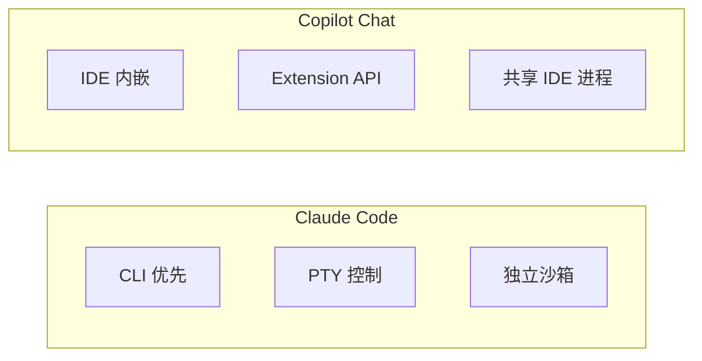

| 维度     | Claude Code      | Copilot Chat               |
| -------- | ---------------- | -------------------------- |
| 部署模式 | 独立 CLI         | IDE 插件                   |
| 执行环境 | 独立沙箱         | 共享进程                   |
| 交互方式 | PTY 会话         | 对话面板                   |
| 上下文   | 可配置           | IDE 上下文自动注入         |
| 定制能力 | 高（可二次开发） | 低（受限于 Extension API） |

**Devin 的独特设计**

Devin 采用了与众不同的架构，强调端到端自动化：

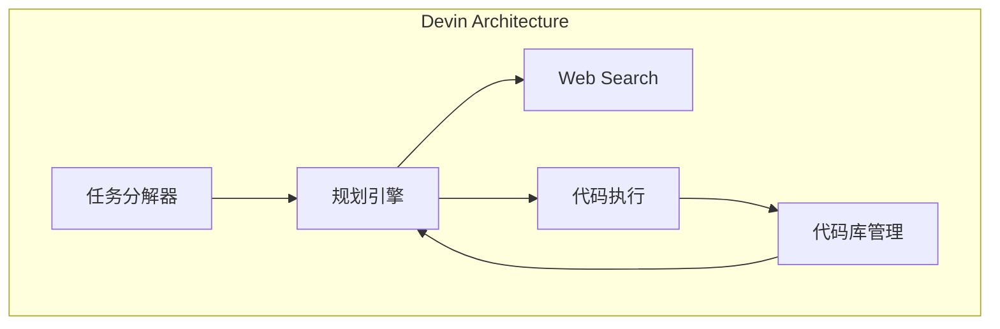

### 4.4 Cursor 的多模型策略

Cursor 采用了多模型融合的策略，根据不同场景选择最优模型：

```python
# Cursor 的模型路由策略
class ModelRouter:
    def route(self, task: Task) -> str:
        if task.type == "completion":
            return "claude-3.5-sonnet"  # 快速补全
        elif task.type == "chat":
            return "gpt-4o"  # 对话理解
        elif task.type == "refactor":
            return "claude-3-opus"  # 重构优化
        elif task.type == "debug":
            return "claude-3.5-sonnet"  # 调试分析
```

### 4.5 Replit Agent 的云端架构

Replit Agent 的最大特点是完全运行在云端：

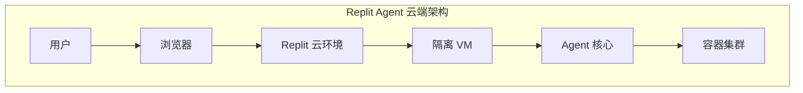

| 优势       | 说明                         |
| ---------- | ---------------------------- |
| 环境一致性 | 云端预配置环境，无需本地安装 |
| 资源弹性   | 可动态扩展计算资源           |
| 即开即用   | 无需配置开发环境             |
| 协作便捷   | 原生支持多人协作             |

## 5. 从插件到独立 Agent 的演进路径

### 5.1 插件形态的局限

以 Claude Code 插件为例，插件形态存在以下固有局限：

**1. 生命周期受限**

插件运行在 IDE/Editor 的进程中，受限于宿主进程的生命周期：

```
IDE 启动 → 插件加载 → IDE 关闭 → 插件销毁
```

这意味着：

- 无法保持长时间运行的上下文
- 状态在 IDE 重启后丢失
- 受 IDE 崩溃影响

**2. 权限受限**

插件只能获取 IDE 暴露的 API：

```python
# 典型的插件能力受限场景
class IDEPlugin:
    def can_access(self):
        # 受限的文件访问
        self.file_access = True

        # 无法直接执行 shell
        self.shell_access = False  # 被禁止

        # 无法访问网络
        self.network_access = False  # 受限
```

**3. 交互模式受限**

IDE 插件的交互模式受限于 IDE 的 UI 框架：

- 对话窗口大小受限
- 无法实现全屏交互
- 快捷键冲突
- 主题样式受限于 IDE

### 5.2 独立 Agent 的优势

独立 Agent 摆脱了宿主进程的限制：

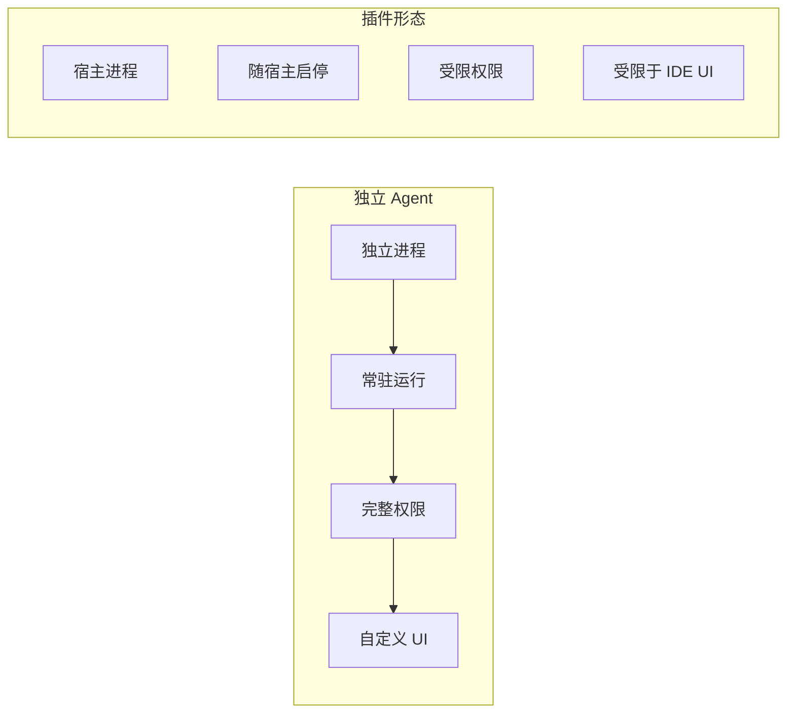

| 对比项      | 插件形态       | 独立 Agent |
| ----------- | -------------- | ---------- |
| 启动速度    | 快（加载即用） | 需启动进程 |
| 资源占用    | 共享宿主资源   | 独立资源   |
| 权限控制    | 依赖宿主       | 完全控制   |
| 状态持久化  | 困难           | 原生支持   |
| 跨 IDE 使用 | 不支持         | 可跨平台   |

### 5.3 gsd2 案例分析

**项目背景**

gsd2 是一个从 Claude Code 插件演进到独立 Code Agent 的项目。它最初以 Claude Code 插件形式存在，为开发者提供 AI 辅助编程能力。在发展过程中，团队意识到插件形态的局限性，决定迁移到基于 Pi.ai 框架的独立 Agent 架构。

**演进路径**：

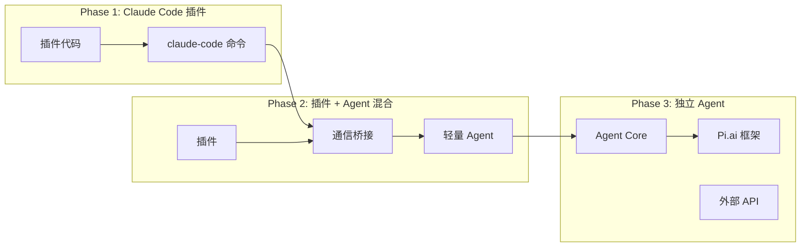

**迁移过程中的挑战**：

1. **状态迁移**：如何保留用户的工作进度和上下文
2. **接口兼容**：保持与原有插件命令的兼容性
3. **数据迁移**：将本地存储的项目数据迁移到新的存储方案

```python
# 状态迁移策略
class StateMigration:
    def migrate_from_plugin(self, plugin_state: PluginState) -> AgentState:
        # 1. 提取项目上下文
        project_context = self._extract_project_context(
            plugin_state.workspace
        )

        # 2. 转换对话历史
        conversation_history = self._convert_conversations(
            plugin_state.history
        )

        # 3. 重建工具配置
        tool_config = self._migrate_tool_config(
            plugin_state.tools
        )

        return AgentState(
            project=project_context,
            history=conversation_history,
            tools=tool_config,
            preferences=plugin_state.preferences
        )
```

**gsd2 的核心价值主张**：

1. **隐私优先**：代码不上传到第三方服务器
2. **本地执行**：所有操作在本地沙箱完成
3. **可扩展**：开放的工具系统支持自定义开发
4. **跨平台**：支持 Linux、macOS、Windows

## 6. gsd2 的目标架构设计

### 6.1 整体架构

gsd2 采用分层架构设计，核心组件包括：

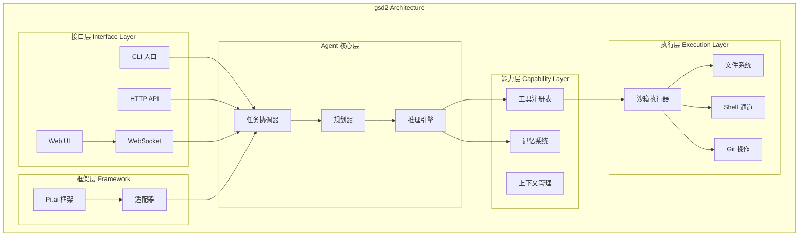

### 6.2 核心模块设计

**任务协调器（Task Coordinator）**

任务协调器是 Agent 的大脑中枢，负责接收请求、分发任务、聚合结果：

```python
class TaskCoordinator:
    """任务协调器 - Agent 的中央调度器"""

    def __init__(self, config: CoordinatorConfig):
        self.planner = TaskPlanner()
        self.reasoner = ReasoningEngine()
        self.tool_registry = ToolRegistry()
        self.context_manager = ContextManager()
        self.execution_engine = ExecutionEngine()

    async def coordinate(self, request: UserRequest) -> Response:
        """协调处理用户请求"""
        # 1. 解析请求
        parsed = await self._parse_request(request)

        # 2. 上下文准备
        context = await self.context_manager.prepare(parsed)

        # 3. 任务规划
        plan = await self.planner.create_plan(parsed, context)

        # 4. 逐步执行
        for step in plan.steps:
            # 推理
            reasoning = await self.reasoner.reason(step, context)

            # 决策
            decision = await self._decide_action(reasoning)

            # 执行
            if decision.needs_tool:
                result = await self.execution_engine.execute(
                    decision.tool,
                    decision.params
                )
                context.update(result)
            else:
                context.update(reasoning)

        # 5. 生成响应
        return await self._generate_response(context)
```

**工具注册表（Tool Registry）**

工具注册表采用插件化设计，支持动态注册和发现：

```python
class ToolRegistry:
    """工具注册表 - 插件化的工具管理"""

    def __init__(self):
        self._tools: dict[str, Tool] = {}
        self._hooks: list[ToolHook] = []

    def register(self, tool: Tool, category: str = "default"):
        """注册工具"""
        tool.category = category
        tool.id = f"{category}/{tool.name}"
        self._tools[tool.id] = tool

        # 触发注册钩子
        for hook in self._hooks:
            hook.on_register(tool)

    async def execute(self, tool_id: str, params: dict) -> ToolResult:
        """执行工具"""
        if tool_id not in self._tools:
            raise ToolNotFoundError(tool_id)

        tool = self._tools[tool_id]

        # 前置验证
        await self._validate_params(tool, params)

        # 执行
        try:
            result = await tool.execute(params)
            return ToolResult(success=True, data=result)
        except Exception as e:
            return ToolResult(success=False, error=str(e))

    def discover(self, category: str = None) -> list[Tool]:
        """发现工具"""
        if category:
            return [t for t in self._tools.values() if t.category == category]
        return list(self._tools.values())
```

**记忆系统（Memory System）**

gsd2 的记忆系统采用三层架构：

```python
class MemorySystem:
    """三层记忆系统"""

    def __init__(self, config: MemoryConfig):
        # 工作记忆：当前交互的瞬时状态
        self.working = WorkingMemory(
            capacity=config.working_capacity
        )

        # 项目记忆：项目级别的结构化信息
        self.project = ProjectMemory(
            storage=config.project_storage,
            vector_db=config.vector_db
        )

        # 长期记忆：跨项目的通用知识
        self.long_term = LongTermMemory(
            storage=config.lt_storage,
            embedding_model=config.embedding_model
        )

    async def store(self, memory: Memory, tier: str):
        """存储记忆"""
        if tier == "working":
            await self.working.set(memory.key, memory.value)
        elif tier == "project":
            await self.project.set(memory.key, memory.value)
        else:
            await self.long_term.set(memory.key, memory.value)

    async def retrieve(self, query: str, tier: str = "all") -> list[Memory]:
        """检索记忆"""
        results = []

        if tier in ("working", "all"):
            results.extend(await self.working.get(query))
        if tier in ("project", "all"):
            results.extend(await self.project.search(query))
        if tier in ("long_term", "all"):
            results.extend(await self.long_term.search(query))

        return self._rank_results(results)
```

### 6.3 Pi.ai 框架集成

gsd2 基于 Pi.ai 框架构建，Pi.ai 提供了关键的底层能力：

```python
# Pi.ai 框架适配器
class PiAIAdapter:
    """Pi.ai 框架适配器"""

    def __init__(self, config: PiAIConfig):
        self.client = PiAIClient(config)
        self.session_manager = SessionManager()
        self.stream_handler = StreamHandler()

    async def initialize(self):
        """初始化连接"""
        await self.client.connect()
        await self.session_manager.create_session()

    async def send_message(self, message: str) -> str:
        """发送消息并获取响应"""
        response = await self.client.chat(
            message,
            stream_handler=self.stream_handler
        )
        return response

    async def close(self):
        """关闭连接"""
        await self.session_manager.close_session()
        await self.client.disconnect()
```

**Pi.ai 框架的核心能力**：

1. **会话管理**：自动处理多轮对话状态
2. **流式输出**：支持实时流式响应
3. **工具调用**：标准化工具调用协议
4. **错误处理**：自动重试和降级策略

## 7. 与传统 IDE 插件的区别

### 7.1 架构层面的本质差异

| 维度     | 传统 IDE 插件                | Code Agent                     |
| -------- | ---------------------------- | ------------------------------ |
| 运行形态 | 动态库/脚本，寄生于 IDE 进程 | 独立进程，拥有独立生命周期     |
| 通信方式 | IDE 提供的 IPC/API           | 任意协议（HTTP/WebSocket/CLI） |
| 资源限制 | 受限于 IDE 资源配额          | 可独立扩展资源                 |
| 状态管理 | IDE 会话状态                 | 自主的持久化状态               |
| 部署方式 | IDE 市场/插件市场            | 独立分发，pip/npm 安装         |

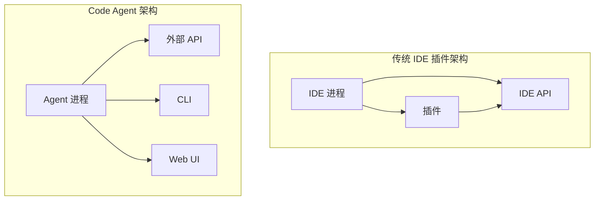

### 7.2 能力边界的扩展

**传统插件的能力边界**：

```python
# 典型 IDE 插件的能力限制
class TraditionalPlugin:
    def __init__(self):
        # 文件访问：受 IDE 沙箱限制
        self.file_access = "sandboxed"

        # 网络访问：通常被禁止
        self.network_access = False

        # 系统命令：无法直接执行
        self.system_commands = False

        # 多线程：受 IDE 主线程限制
        self.multithreading = "limited"
```

**Code Agent 的能力释放**：

```python
# Code Agent 的能力边界
class CodeAgent:
    def __init__(self):
        # 文件访问：完整文件系统权限
        self.file_access = "full"

        # 网络访问：可访问任意网络资源
        self.network_access = True

        # 系统命令：完整的 shell 执行能力
        self.system_commands = True

        # 多线程：独立的进程资源
        self.multithreading = "unlimited"

        # 持久化：独立的状态存储
        self.state_persistence = True
```

### 7.3 开发体验对比

| 场景 | 传统插件                       | Code Agent                         |
| ---- | ------------------------------ | ---------------------------------- |
| 安装 | IDE 内搜索安装，需重启         | `pip install` / `npm install` 即用 |
| 更新 | 等待 IDE 市场审核              | 独立版本控制，快速迭代             |
| 调试 | 依赖 IDE 调试器                | 可使用任意调试工具                 |
| 测试 | 受限于 IDE 测试框架            | 独立的测试环境                     |
| 分发 | 受限于平台（VSCode/JetBrains） | 跨平台，任意环境运行               |

### 7.4 适用场景分析

**选择 IDE 插件的场景**：

- 轻量级辅助（代码补全、语法高亮）
- 与 IDE 深度集成（调试、运行）
- 团队统一配置管理
- 不希望改变现有工作流

**选择独立 Code Agent 的场景**：

- 复杂任务自动化
- 需要完整 shell 权限
- 跨多个 IDE/编辑器工作
- 需要持久化状态
- 定制化开发需求

## 8. 技术选型总结

### 8.1 架构选型决策矩阵

| 考量维度   | 自研架构     | 基于 Pi.ai | 基于 LangChain |
| ---------- | ------------ | ---------- | -------------- |
| 开发成本   | 高           | 中         | 中             |
| 定制能力   | 最高         | 高         | 中             |
| 社区支持   | 无           | 增长中     | 成熟           |
| 文档完善度 | 自定义       | 中         | 好             |
| 学习曲线   | 陡峭         | 中等       | 较缓           |
| 适合场景   | 核心技术创新 | 产品化落地 | 快速原型验证   |

### 8.2 为什么选择分层架构

Code Agent 的复杂性要求我们采用分层架构来管理复杂度。每一层都有明确的职责边界，通过标准化接口进行通信。这种设计带来以下优势：

**1. 关注点分离（Separation of Concerns）**

```python
# 分层架构示例：各层职责明确
class LayeredArchitecture:
    """
    五层架构，每层专注特定职责：
    - 接口层：用户交互和输入处理
    - 核心层：业务逻辑和决策
    - 能力层：工具和记忆
    - 执行层：命令执行和安全
    - 框架层：底层支撑
    """

    async def process(self, user_input: str) -> Response:
        # 接口层：解析用户输入
        parsed = self.interface_layer.parse(user_input)

        # 核心层：业务决策
        decision = self.core_layer.decide(parsed)

        # 能力层：获取必要工具和上下文
        tools = self.capability_layer.prepare_tools(decision)
        context = self.capability_layer.load_context(decision)

        # 执行层：安全执行
        result = await self.execution_layer.run(decision, tools, context)

        # 核心层：处理结果
        response = self.core_layer.format_response(result)

        return response
```

**2. 可测试性**

分层架构使得每一层都可以独立测试：

```python
# 核心层测试：不依赖外部服务
class TestPlanner:
    def test_create_plan(self):
        planner = TaskPlanner()
        request = UserRequest(
            intent="实现用户登录功能",
            context=self.mock_context()
        )
        plan = planner.create_plan(request)

        assert len(plan.steps) > 0
        assert plan.steps[0].type == "search"
        assert plan.steps[-1].type == "verify"
```

**3. 可扩展性**

新增工具或能力只需在对应层添加，不影响其他层：

```python
# 扩展工具：只需实现 Tool 接口并注册
class NewTool(Tool):
    name = "custom_analysis"
    description = "自定义代码分析工具"

    async def execute(self, params: dict) -> ToolResult:
        # 实现工具逻辑
        pass

# 注册到能力层
tool_registry.register(NewTool(), category="analysis")
```

**4. 技术灵活性**

可以根据需求选择或替换各层的实现：

| 层级       | 可选技术                     | gsd2 选择           |
| ---------- | ---------------------------- | ------------------- |
| LLM        | Claude / GPT-4 / Gemini      | Claude（Anthropic） |
| 向量存储   | Chroma / Pinecone / Weaviate | Chroma              |
| 文件系统   | 原生 FS / Virtual FS         | 原生 FS             |
| Shell 执行 | subprocess / pty / wasm      | subprocess + pty    |
| Web 框架   | FastAPI / Express / Actix    | FastAPI             |

### 8.3 gsd2 的选型理由

gsd2 选择基于 Pi.ai 框架构建独立 Agent，主要基于以下考量：

**1. 产品化导向**

gsd2 的目标是打造一款面向市场的产品，需要：

- 稳定的生产级质量
- 快速的迭代能力
- 完善的商业支持

Pi.ai 框架提供了成熟的生产级基础设施，让团队能够专注于上层业务逻辑。

**2. 架构解耦**

Pi.ai 采用了清晰的模块化设计，使得 gsd2 能够：

- 自由替换 LLM 提供商
- 灵活定制工具系统
- 无缝集成自有组件

**3. CLI 优先设计**

gsd2 定位为 CLI 工具，Pi.ai 对 CLI 场景有良好的支持，提供富文本终端输出和流式响应。

**4. 社区活跃度**

Pi.ai 作为一个新兴框架，拥有活跃的社区和快速的迭代周期：

| 指标           | 数值 |
| -------------- | ---- |
| 日均 commits   | 15+  |
| Issue 响应时间 | <24h |
| 文档完整度     | 85%  |
| 示例代码数量   | 50+  |

### 8.4 技术债务与规避策略

在 Code Agent 开发过程中，常见的技术债务包括：

**1. 上下文窗口耗尽**

LLM 的上下文窗口有限，当处理大型项目时会遇到限制：

```python
class ContextWindowManager:
    """上下文窗口管理器"""

    def __init__(self, max_tokens: int = 200000, reserved: int = 10000):
        self.max_tokens = max_tokens
        self.reserved = reserved
        self.effective_limit = max_tokens - reserved

    async def fit_context(self, items: list[ContextItem]) -> list[ContextItem]:
        """智能裁剪上下文"""
        total = sum(self._estimate_tokens(item) for item in items)

        if total <= self.effective_limit:
            return items

        # 按重要性排序
        sorted_items = self._sort_by_importance(items)

        # 逐步裁剪直到符合限制
        result = []
        current_tokens = 0

        for item in sorted_items:
            item_tokens = self._estimate_tokens(item)
            if current_tokens + item_tokens <= self.effective_limit:
                result.append(item)
                current_tokens += item_tokens

        return result

    def _sort_by_importance(self, items: list[ContextItem]) -> list[ContextItem]:
        """按重要性排序"""
        return sorted(
            items,
            key=lambda x: (
                x.recency_score * 0.3 +  # 最近性
                x.relevance_score * 0.5 +  # 相关性
                x.type_priority * 0.2  # 类型优先级
            ),
            reverse=True
        )
```

**2. 工具调用循环**

Agent 可能陷入重复调用同一工具的循环：

```python
class LoopDetector:
    """循环检测器"""

    def __init__(self, max_repeats: int = 3):
        self.max_repeats = max_repeats
        self.call_history: deque = deque(maxlen=20)

    def record_call(self, tool_id: str, params: dict):
        """记录工具调用"""
        self.call_history.append({
            "tool": tool_id,
            "params": params,
            "timestamp": time.time()
        })

    def is_looping(self) -> bool:
        """检测是否在循环"""
        if len(self.call_history) < self.max_repeats:
            return False

        recent = list(self.call_history)[-self.max_repeats:]

        # 检查是否有重复调用
        calls = [(c["tool"], str(c["params"])) for c in recent]
        return len(calls) != len(set(calls))

    def get_suggestion(self) -> str:
        """获取跳出循环的建议"""
        return (
            "检测到可能的循环调用。"
            "建议：1) 检查前置步骤是否成功完成 "
            "2) 尝试不同的工具组合 "
            "3) 缩小任务范围"
        )
```

**3. 状态不一致**

分布式环境下的状态同步问题：

```python
class StateManager:
    """分布式状态管理器"""

    def __init__(self, storage: StateStorage):
        self.storage = storage
        self.local_cache = {}
        self.lock = asyncio.Lock()

    async def update(self, key: str, value: Any, version: int = None):
        """原子性更新状态"""
        async with self.lock:
            if version is None:
                version = await self.storage.get_version(key)

            # 乐观锁更新
            success = await self.storage.compare_and_set(
                key, value, expected_version=version
            )

            if not success:
                # 版本冲突，重试
                raise StateConflictError(key)

            # 更新本地缓存
            self.local_cache[key] = (value, version + 1)

    async def get(self, key: str) -> Any:
        """获取状态（优先本地缓存）"""
        if key in self.local_cache:
            return self.local_cache[key][0]

        return await self.storage.get(key)
```

### 8.5 性能优化策略

Code Agent 的性能优化需要考虑多个维度：

**1. 流式响应**

用户需要实时看到 Agent 的思考过程：

```python
class StreamingExecutor:
    """流式执行器"""

    def __init__(self):
        self.queue = asyncio.Queue()
        self.handlers = []

    def add_handler(self, handler: StreamHandler):
        """添加流处理器"""
        self.handlers.append(handler)

    async def execute_streaming(self, plan: Plan):
        """流式执行计划"""
        for step in plan.steps:
            # 开始步骤
            await self._emit(Event(
                type="step_start",
                data={"step": step.id, "action": step.action}
            ))

            # 执行步骤
            async for partial in step.execute_streaming():
                await self._emit(Event(
                    type="step_progress",
                    data={"step": step.id, "partial": partial}
                ))

            # 完成步骤
            await self._emit(Event(
                type="step_complete",
                data={"step": step.id, "result": step.result}
            ))

    async def _emit(self, event: Event):
        """发送事件到所有处理器"""
        for handler in self.handlers:
            await handler.handle(event)
```

**2. 并行工具调用**

独立的任务可以并行执行：

```python
class ParallelExecutor:
    """并行执行器"""

    async def execute_independent(
        self,
        tasks: list[Task]
    ) -> list[TaskResult]:
        """并行执行独立任务"""
        # 识别依赖关系
        task_graph = self._build_dependency_graph(tasks)

        # 按层级分组
        levels = self._topological_sort(task_graph)

        results = {}
        for level in levels:
            # 同层级任务并行执行
            level_tasks = [tasks[i] for i in level]
            level_results = await asyncio.gather(
                *[self._execute_task(t) for t in level_tasks],
                return_exceptions=True
            )

            for task, result in zip(level_tasks, level_results):
                results[task.id] = result

        return [results[t.id] for t in tasks]
```

**3. 智能缓存**

避免重复计算：

```python
class IntelligentCache:
    """智能缓存"""

    def __init__(self, ttl: int = 3600):
        self.cache = {}
        self.access_log = []
        self.ttl = ttl

    def _compute_key(self, operation: str, params: dict) -> str:
        """计算缓存键"""
        param_str = json.dumps(params, sort_keys=True)
        return hashlib.sha256(f"{operation}:{param_str}".encode()).hexdigest()

    def get_or_compute(
        self,
        operation: str,
        params: dict,
        compute_fn: Callable
    ) -> Any:
        """获取缓存或计算"""
        key = self._compute_key(operation, params)

        if key in self.cache:
            entry = self.cache[key]
            if time.time() - entry["timestamp"] < self.ttl:
                return entry["value"]

        value = compute_fn()
        self.cache[key] = {
            "value": value,
            "timestamp": time.time()
        }

        return value
```

### 8.6 核心技术栈建议

**基础层**：

| 组件     | 推荐技术                  | 备选         |
| -------- | ------------------------- | ------------ |
| 语言     | Python 3.11+ / TypeScript | Go           |
| 异步框架 | asyncio                   | tokio (Rust) |
| Web 框架 | FastAPI                   | Express      |
| 数据库   | SQLite + PostgreSQL       | MySQL        |

**AI 能力层**：

| 组件        | 推荐技术                | 备注       |
| ----------- | ----------------------- | ---------- |
| LLM API     | Anthropic Claude        | 多模型支持 |
| Embedding   | OpenAI text-embedding-3 | 向量检索   |
| Prompt 管理 | PromptTemplate          | 版本化管理 |

**工具层**：

| 组件       | 推荐技术           | 备注       |
| ---------- | ------------------ | ---------- |
| Shell 执行 | asyncio.subprocess | PTY 支持   |
| 文件操作   | pathlib / fs       | 跨平台     |
| Git 操作   | GitPython / go-git | 自动化 Git |

**存储层**：

| 组件     | 推荐技术            | 备注       |
| -------- | ------------------- | ---------- |
| 向量存储 | Chroma              | 轻量级     |
| 知识库   | SQLite + SQLAlchemy | 结构化数据 |
| 缓存     | Redis               | 会话缓存   |

### 8.7 未来展望

**技术趋势**：

1. **多模态融合**：Code Agent 将整合代码、图表、文档等多种信息源
2. **自主学习**：从用户反馈中持续学习和适应
3. **协作 Agent**：多个 Agent 协同工作，分工处理复杂任务
4. **标准化接口**：Tool use 协议标准化，便于跨平台集成

**gsd2 的 roadmap**：

| 版本 | 目标                               | 计划时间     |
| ---- | ---------------------------------- | ------------ |
| v1.0 | 独立 Agent 基础框架 + CLI 核心功能 | 2026-Q1      |
| v2.0 | Web UI + 多模型路由 + 高级记忆系统 | 2026-Q2 ~ Q3 |
| v3.0 | 协作 Agent + 企业级特性            | 2026-Q4      |

## 结语

Code Agent 代表了 AI 辅助编程的下一阶段演进方向。从 IDE 插件到独立 Agent，不仅仅是形态的变化，更是能力边界的根本性扩展。gsd2 项目作为这一演进路径的实践案例，为我们展示了如何在保持产品竞争力的同时，完成架构的升级转型。

核心技术要点总结：

1. **架构设计**：采用分层架构，核心组件（Planner、Reasoner、Executor）解耦
2. **工具系统**：插件化的工具注册表，支持动态扩展
3. **记忆系统**：三层记忆架构，平衡性能和效果
4. **执行安全**：沙箱隔离，资源限制，保障系统安全
5. **框架选型**：基于 Pi.ai 的产品化路径

gsd2 的架构设计充分考虑了可扩展性、可测试性和安全性，为后续功能迭代奠定了坚实基础。下一章我们将深入探讨 gsd2 的任务规划与执行引擎的实现细节。

---

_本文属于 Code Agent 技术系列文章 Ch1，后续章节将涵盖：_

- _Ch2: 任务规划与执行引擎_
- _Ch3: 工具系统设计与实现_
- _Ch4: 记忆系统与上下文管理_
- _Ch5: 安全沙箱与权限控制_
