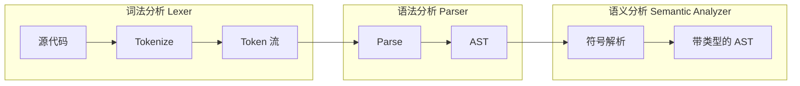
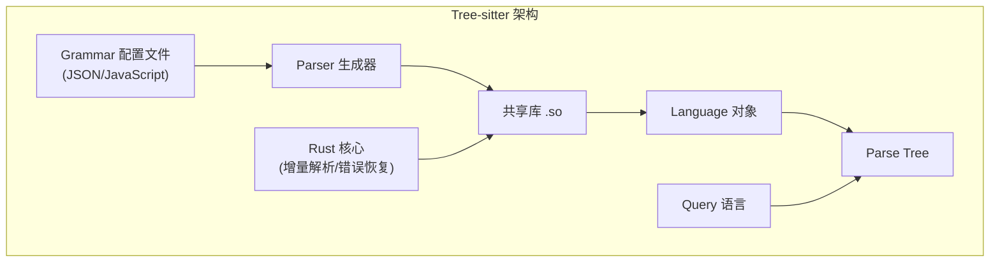
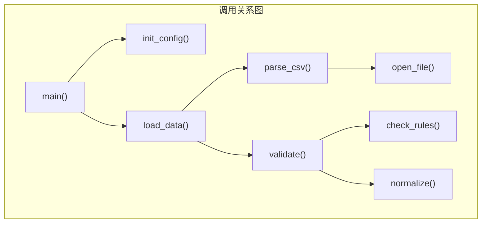
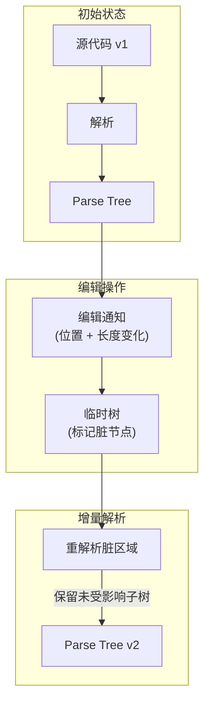
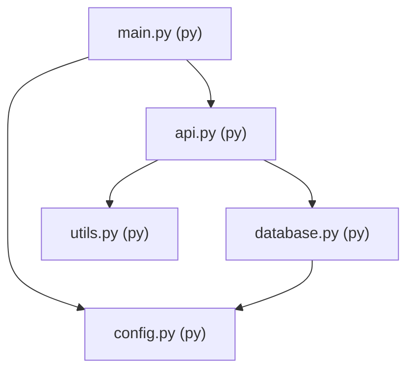
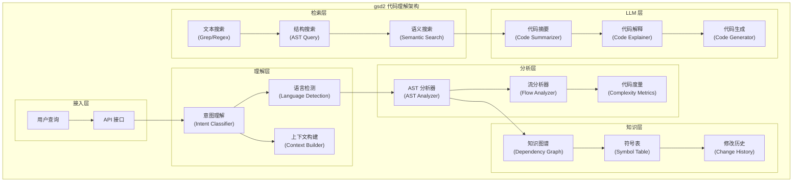

# Code Agent Ch10: 代码理解能力

代码理解是 Code Agent 最核心的能力之一。一个 Agent 若不能准确理解代码的结构、语义和意图，就无法完成代码修改、调试、重构等复杂任务。本章将系统讲解代码理解的技术栈，从最基础的 AST 解析到 LLM 辅助的语义理解，并结合 gsd2 项目源码分析其实现思路。

## 1. 代码理解概述

### 1.1 为什么 Agent 需要理解代码

传统的 IDE 和代码工具（grep、ctags、 LSP）已经能完成大部分代码理解和导航工作。但 Code Agent 面临的场景远比这些工具复杂：

| 场景 | 传统工具能力 | Code Agent 需求 |
|------|-------------|----------------|
| 根据自然语言描述修改代码 | 无 | 需要理解代码意图并定位修改点 |
| 多语言混合项目分析 | 有限 | 需要跨语言理解依赖关系 |
| 增量代码变更分析 | 无 | 需要理解修改前后的语义差异 |
| 基于代码库的问答 | 无 | 需要构建代码知识图谱 |

Code Agent 需要的是**主动理解**而非被动搜索。它需要像人类开发者一样，理解代码"做什么"和"怎么做"。

### 1.2 代码理解的层次

代码理解是一个从表层到深层的渐进过程：

```
┌─────────────────────────────────────────────────────────────┐
│                    代码理解层次模型                          │
├─────────────────────────────────────────────────────────────┤
│  第5层: 意图理解   - 自然语言描述 → 代码意图                 │
│  第4层: 语义理解   - 类型推断 / 数据流 / 控制流              │
│  第3层: 结构理解   - AST / 符号表 / 依赖关系                 │
│  第2层: 语法理解   - token流 / 解析规则 / 缩进结构           │
│  第1层: 文本理解   - 字符串匹配 / 正则搜索                   │
└─────────────────────────────────────────────────────────────┘
```

**层级越低**，理解越表面，依赖规则越简单，实现成本越低，但能力边界也越窄。**层级越高**，理解越深入，需要更多的推理和知识，但能力上限也越高。

一个完善的 Code Agent 应该在每一层都具备相应的能力，并根据任务复杂度动态选择合适的理解层次。

## 2. AST 解析

### 2.1 抽象语法树的核心概念

抽象语法树（Abstract Syntax Tree，AST）是代码理解的基础数据结构。AST 将源代码解析成一棵树形结构，其中每个节点代表代码中的一个语法构造，如表达式、语句、函数定义等。

与解析树（Parse Tree，也称为 Concrete Syntax Tree）不同，AST 省略了不影响语义的语法细节（如括号、分号在大多数语言中的位置），更聚焦于语义结构。

以一个简单的 Python 函数为例：

```python
def add(a, b):
    return a + b
```

其 AST 结构大致如下：

```mermaid
graph TB
    subgraph "AST Structure"
        Function[函数定义: add"]
        Name["参数: name='add'"]
        Args["参数列表: args=[a, b]"]
        ArgA["参数: a"]
        ArgB["参数: b"]
        Body["函数体: return"]
        BinOp["二元运算: +"]
        VarA["变量: a"]
        VarB["变量: b"]
        
        Function --> Name
        Function --> Args
        Function --> Body
        Args --> ArgA
        Args --> ArgB
        Body --> BinOp
        BinOp --> VarA
        BinOp --> VarB
    end
```

### 2.2 Parser 的工作机制

Parser（解析器）是将文本转换为 AST 的核心组件。一个完整的 Parser 通常包含以下阶段：



**词法分析（Lexical Analysis）** 阶段，源代码被切分为 Token 流。Token 是语法层面的最小单元，包括：标识符、关键字、运算符、数字、字符串等。

**语法分析（Syntactic Analysis）** 阶段，Parser 根据语言的语法规则（通常由上下文无关文法定义）将 Token 流转换为 AST。

### 2.3 Python ast 模块实战

Python 内置的 `ast` 模块提供了完整的 AST 构建能力，是理解 Python 代码结构的基础工具。

```python
import ast
import json

code = """
def fibonacci(n):
    if n <= 1:
        return n
    return fibonacci(n - 1) + fibonacci(n - 2)

result = fibonacci(10)
"""

# 解析代码生成 AST
tree = ast.parse(code)

class ASTDumper(ast.NodeVisitor):
    """AST 可视化访问器"""
    def generic_visit(self, node):
        node_type = type(node).__name__
        info = {
            'type': node_type,
            'lineno': getattr(node, 'lineno', None),
        }
        
        # 根据节点类型提取关键信息
        if isinstance(node, ast.FunctionDef):
            info['name'] = node.name
            info['args'] = [arg.arg for arg in node.args.args]
        elif isinstance(node, ast.Name):
            info['id'] = node.id
        elif isinstance(node, ast.Constant):
            info['value'] = node.value
        elif isinstance(node, ast.BinOp):
            info['op'] = type(node.op).__name__
            
        print(f"{'  '*depth}{info}")
        self._dump(node, depth + 1)
        self.generic_visit = self._dump  # 避免递归
        
    def _dump(self, node, depth=0):
        for child in ast.iter_child_nodes(node):
            self.generic_visit(child)

print("AST 结构:")
ast.fix_missing_locations(tree)
ASTDumper().visit(tree)
```

输出结构展示了函数定义、参数、二元运算等关键节点：

```
AST 结构:
{'type': 'Module', 'lineno': 1}
  {'type': 'FunctionDef', 'name': 'fibonacci', 'args': ['n'], 'lineno': 2}
    {'type': 'arguments', 'lineno': 2}
      {'type': 'arg', 'id': 'n', 'lineno': 2}
    {'type': 'If', 'lineno': 3}
      {'type': 'Compare', 'lineno': 3}
        {'type': 'Name', 'id': 'n', 'lineno': 3}
        {'type': 'Constant', 'value': 1, 'lineno': 3}
      {'type': 'Return', 'lineno': 4}
        {'type': 'Name', 'id': 'n', 'lineno': 4}
      {'type': 'Return', 'lineno': 5}
        {'type': 'BinOp', 'op': 'Add', 'lineno': 5}
          {'type': 'Call', 'lineno': 5}
            {'type': 'Name', 'id': 'fibonacci', 'lineno': 5}
            ...
```

`ast` 模块的优势是标准库自带、无需额外依赖，但仅限于 Python 语言，且不提供增量解析和跨语言统一 API。

### 2.4 Tree-sitter 解析框架

Tree-sitter 是由 GitHub 开发的现代化 Parser 框架，被 VSCode、Neovim 等主流编辑器采用作为代码解析引擎。相比传统 Parser，Tree-sitter 有三大核心优势：

| 特性 | 传统 Parser (如 ANTLR) | Tree-sitter |
|------|----------------------|-------------|
| 增量解析 | 通常需要全量重解析 | 支持增量更新，修改代码只重解析受影响区域 |
| 错误恢复 | 错误后停止解析 | 持续解析，尽可能保留更多树结构 |
| 多语言支持 | 单一语言 Grammar | 通过 Grammar 配置文件支持多语言 |
| 性能 | 一般 | 极高（使用 Rust 实现核心解析） |

Tree-sitter 的核心概念：



**Grammar 定义**是 Tree-sitter 的核心。每个语言需要一个 `grammar.js` 文件定义其词法和语法规则：

```javascript
// Tree-sitter Grammar 示例 (简化版)
module.exports = grammar({
  name: 'my_lang',
  
  rules: {
    source_file: ($) => seq(
      optional($.shebang),
      repeat($.statement)
    ),
    
    statement: ($) => choice(
      $.function_def,
      $.assignment,
      $.expression_statement
    ),
    
    function_def: ($) => seq(
      'def',
      field('name', $.identifier),
      field('parameters', $.parameter_list),
      field('body', $.block)
    ),
    
    identifier: ($) => /[a-zA-Z_][a-zA-Z0-9_]*/,
    
    parameter_list: ($) => seq(
      '(',
      commaSep($.identifier),
      ')'
    ),
    
    block: ($) => seq('{', repeat($.statement), '}'),
  }
});
```

编译后会生成对应语言的 Parser 共享库，供应用程序调用。

## 3. 语义分析

### 3.1 类型推断

类型推断是在没有显式类型标注的情况下，推断表达式、变量、函数的类型。类型信息对于理解代码意图至关重要。

```python
from typing import get_type_hints, Callable, Any
import ast

class TypeInferrer(ast.NodeVisitor):
    """基于 AST 的简单类型推断器"""
    
    def __init__(self):
        self.symbols = {}  # 符号表: name -> type
        self.types = {}    # 节点类型缓存: node_id -> type
    
    def infer_type(self, node: ast.AST, code: str) -> str:
        """推断节点的类型"""
        if isinstance(node, ast.Name):
            return self.symbols.get(node.id, "unknown")
        elif isinstance(node, ast.Constant):
            return type(node.value).__name__
        elif isinstance(node, ast.BinOp):
            return self._infer_binop_type(node)
        elif isinstance(node, ast.Call):
            return self._infer_call_type(node)
        return "unknown"
    
    def _infer_binop_type(self, node: ast.BinOp) -> str:
        """推断二元运算类型"""
        if isinstance(node.op, (ast.Add, ast.Sub, ast.Mult, ast.Div)):
            left_type = self.infer_type(node.left, "")
            right_type = self.infer_type(node.right, "")
            if left_type == right_type:
                return left_type
            if {left_type, right_type} == {'int', 'float'}:
                return 'float'
        return "unknown"
    
    def _infer_call_type(self, node: ast.Call) -> str:
        """推断函数调用返回类型"""
        func_name = None
        if isinstance(node.func, ast.Name):
            func_name = node.func.id
        
        # 内置函数类型映射
        builtin_returns = {
            'len': 'int',
            'str': 'str',
            'int': 'int',
            'float': 'float',
            'list': 'list',
            'dict': 'dict',
        }
        return builtin_returns.get(func_name, "unknown")
    
    def visit_FunctionDef(self, node: ast.FunctionDef):
        """处理函数定义，推断参数类型"""
        for arg, annotation in zip(node.args.args, node.args.posonlyargs):
            if annotation.annotation:
                self.symbols[arg.arg] = self._get_annotation_name(annotation.annotation)
            else:
                self.symbols[arg.arg] = "unknown"
        self.generic_visit(node)
    
    def _get_annotation_name(self, node: ast.AST) -> str:
        if isinstance(node, ast.Name):
            return node.id
        elif isinstance(node, ast.Subscript):
            return f"{self._get_annotation_name(node.value)}[...]"
        return "unknown"
```

类型推断在 Code Agent 中的应用场景：

- **代码补全**：根据上下文推断可能的类型，提供精准的成员建议
- **错误检测**：类型不匹配时警告可能存在的 bug
- **代码生成**：根据目标类型生成正确格式的代码

### 3.2 依赖分析

依赖分析构建代码之间的引用关系图，是理解大型代码库结构的基础。

```python
import ast
from collections import defaultdict

class DependencyAnalyzer(ast.NodeVisitor):
    """依赖关系分析器"""
    
    def __init__(self, filepath: str):
        self.filepath = filepath
        self.imports = []           # 导入的模块
        self.definitions = {}       # 定义的符号: name -> node
        self.references = []       # 引用的符号: [(name, line_no)]
        self.call_graph = {}       # 调用图: caller -> [callee]
        
    def visit_Import(self, node: ast.Import):
        for alias in node.names:
            self.imports.append(alias.name)
            
    def visit_ImportFrom(self, node: ast.ImportFrom):
        if node.module:
            self.imports.append(node.module)
            
    def visit_FunctionDef(self, node: ast.FunctionDef):
        self.definitions[node.name] = {
            'type': 'function',
            'filepath': self.filepath,
            'lineno': node.lineno
        }
        # 分析函数体内的调用
        self._analyze_function_body(node)
        self.generic_visit(node)
        
    def visit_Call(self, node: ast.Call):
        func_name = self._get_func_name(node.func)
        if func_name:
            self.references.append((func_name, node.lineno))
            self._record_call(node, func_name)
        self.generic_visit(node)
        
    def _get_func_name(self, node: ast.AST) -> str:
        if isinstance(node, ast.Name):
            return node.id
        elif isinstance(node, ast.Attribute):
            return self._get_func_name(node.value) + '.' + node.attr
        return None
        
    def _record_call(self, call_node: ast.Call, func_name: str):
        """记录调用关系"""
        # 找到最近的函数定义
        current_func = None
        for parent in ast.walk(call_node.__class__.__bases__):
            pass
        # 简化：记录全局调用
        if func_name not in self.call_graph:
            self.call_graph[func_name] = []
            
    def get_dependency_graph(self) -> dict:
        """生成依赖图"""
        return {
            'file': self.filepath,
            'imports': self.imports,
            'definitions': self.definitions,
            'references': self.references,
            'calls': self.call_graph
        }
```

依赖分析产生的调用图结构：



### 3.3 控制流分析

控制流分析追踪程序执行的路径，帮助理解代码的逻辑分支。

```python
import ast
from enum import Enum

class ControlFlowAnalyzer(ast.NodeVisitor):
    """控制流分析器"""
    
    class BlockType(Enum):
        SEQUENTIAL = "sequential"
        CONDITIONAL = "conditional"
        LOOP = "loop"
        FUNCTION = "function"
        EXIT = "exit"
    
    def __init__(self):
        self.blocks = []        # 基本块列表
        self.edges = []        # 控制流边
        self.current_block = None
        
    def analyze(self, tree: ast.AST) -> dict:
        """分析控制流"""
        self.visit(tree)
        return {
            'blocks': self.blocks,
            'edges': self.edges
        }
        
    def visit_FunctionDef(self, node: ast.FunctionDef):
        """函数入口新建基本块"""
        func_block = {
            'id': len(self.blocks),
            'type': self.BlockType.FUNCTION,
            'name': node.name,
            'start': node.lineno,
            'statements': []
        }
        self.blocks.append(func_block)
        self.generic_visit(node)
        
    def visit_If(self, node: ast.If):
        """条件分支"""
        branch_block = {
            'id': len(self.blocks),
            'type': self.BlockType.CONDITIONAL,
            'test': ast.dump(node.test),
            'start': node.lineno
        }
        self.blocks.append(branch_block)
        
        # 处理 if 分支体
        then_block = self._create_block(self.BlockType.SEQUENTIAL, node.lineno)
        
        # 处理 else 分支体（如果有）
        else_block = None
        if node.orelse:
            else_block = self._create_block(self.BlockType.SEQUENTIAL, node.orelse[0].lineno)
        
        # 记录控制流边
        self.edges.append((branch_block['id'], then_block['id'], 'then'))
        if else_block:
            self.edges.append((branch_block['id'], else_block['id'], 'else'))
            
        self.generic_visit(node)
        
    def _create_block(self, block_type: BlockType, lineno: int) -> dict:
        block = {
            'id': len(self.blocks),
            'type': block_type,
            'start': lineno,
            'statements': []
        }
        self.blocks.append(block)
        return block
```

### 3.4 数据流分析

数据流分析追踪数据在程序中的流动路径，包括定义-使用链（def-use chain）和活跃变量分析。

```python
class DataFlowAnalyzer:
    """数据流分析器 - def-use 链"""
    
    def __init__(self):
        self.definitions = {}   # 定义点: var_name -> [(lineno, scope)]
        self.uses = {}          # 使用点: var_name -> [(lineno, scope)]
        self.def_use_chains = {}  # def-use 链
        
    def analyze_function(self, func_node: ast.FunctionDef) -> dict:
        """分析函数内的数据流"""
        func_name = func_node.name
        
        # 收集参数定义
        for arg in func_node.args.args:
            self._add_definition(arg.arg, arg.lineno, 'parameter')
            
        # 遍历函数体
        for stmt in ast.walk(func_node):
            if isinstance(stmt, ast.Assign):
                for target in stmt.targets:
                    if isinstance(target, ast.Name):
                        self._add_definition(target.id, stmt.lineno, 'assignment')
            elif isinstance(stmt, ast.Name):
                if isinstance(stmt.ctx, ast.Load):
                    self._add_use(stmt.id, stmt.lineno, 'reference')
            elif isinstance(stmt, ast.Call):
                for arg in stmt.args:
                    if isinstance(arg, ast.Name):
                        self._add_use(arg.id, arg.lineno, 'argument')
                        
        # 构建 def-use 链
        self._build_def_use_chains()
        
        return self.def_use_chains
    
    def _add_definition(self, var_name: str, lineno: int, kind: str):
        if var_name not in self.definitions:
            self.definitions[var_name] = []
        self.definitions[var_name].append({'lineno': lineno, 'kind': kind})
    
    def _add_use(self, var_name: str, lineno: int, kind: str):
        if var_name not in self.uses:
            self.uses[var_name] = []
        self.uses[var_name].append({'lineno': lineno, 'kind': kind})
    
    def _build_def_use_chains(self):
        """建立定义-使用链"""
        for var_name in self.definitions:
            if var_name not in self.uses:
                continue
                
            defs = self.definitions[var_name]
            uses = self.uses[var_name]
            
            # 按行号排序，匹配每个定义到后续的使用
            for d in defs:
                d_lineno = d['lineno']
                linked_uses = [u for u in uses if u['lineno'] > d_lineno]
                if linked_uses:
                    key = f"{var_name}:{d_lineno}"
                    self.def_use_chains[key] = {
                        'var': var_name,
                        'def': d,
                        'uses': linked_uses
                    }
```

## 4. Tree-sitter 实战

### 4.1 增量解析

增量解析是 Tree-sitter 的核心能力之一。当代码发生局部修改时，增量解析只重解析受影响的部分，保留未修改区域的解析结果。

```python
import tree_sitter

class IncrementalParser:
    """Tree-sitter 增量解析器封装"""
    
    def __init__(self, language: str = 'python'):
        self.language = language
        self.parser = tree_sitter.Parser()
        self._init_language()
        
        self.current_tree = None
        self.last_edit_range = None
        
    def _init_language(self):
        """初始化语言"""
        from tree_sitter_languages import get_language
        lang = get_language(self.language)
        self.parser.set_language(lang)
        
    def parse_string(self, code: str) -> tree_sitter.Tree:
        """首次解析"""
        self.current_tree = self.parser.parse(bytes(code, 'utf8'))
        return self.current_tree
    
    def incremental_edit(self, code: str, start_byte: int, 
                        old_end_byte: int, new_end_byte: int,
                        start_point: tuple, old_end_point: tuple,
                        new_end_point: tuple) -> tree_sitter.Tree:
        """
        增量编辑
        
        Args:
            code: 当前完整代码
            start_byte: 编辑起始字节位置
            old_end_byte: 旧代码结束字节位置
            new_end_byte: 新代码结束字节位置
            start_point: 起始行列点 (row, col)
            old_end_point: 旧代码结束点
            new_end_point: 新代码结束点
        """
        # 记录编辑范围
        self.last_edit_range = {
            'start_byte': start_byte,
            'old_end_byte': old_end_byte,
            'new_end_byte': new_end_byte
        }
        
        # 通知 Tree-sitter 编辑
        self.current_tree.edit(
            start_byte=start_byte,
            old_end_byte=old_end_byte,
            new_end_byte=new_end_byte,
            start_point=start_point,
            old_end_point=old_end_point,
            new_end_point=new_end_point
        )
        
        # 增量解析
        self.current_tree = self.parser.parse(
            bytes(code, 'utf8'),
            self.current_tree  # 传入旧树进行增量解析
        )
        
        return self.current_tree
    
    def get_changed_ranges(self, old_code: str, new_code: str) -> list:
        """获取两版代码之间的差异区域"""
        old_tree = self.parser.parse(bytes(old_code, 'utf8'))
        new_tree = self.parser.parse(bytes(new_code, 'utf8'))
        
        return old_tree.diff(new_tree)
```

增量解析的工作原理：



### 4.2 Query 语言

Tree-sitter Query 是强大的模式匹配语言，允许用声明式方式查询 AST 结构。

```python
import tree_sitter

class QueryEngine:
    """Tree-sitter Query 引擎封装"""
    
    def __init__(self, language: str = 'python'):
        from tree_sitter_languages import get_language
        self.language = get_language(language)
        self.parser = tree_sitter.Parser()
        self.parser.set_language(self.language)
        
    def query_code(self, code: str, query_string: str) -> list:
        """执行 Query 查询"""
        tree = self.parser.parse(bytes(code, 'utf8'))
        query = self.language.query(query_string)
        captures = query.captures(tree.root_node)
        
        results = []
        for node, name in captures:
            results.append({
                'node_type': node.type,
                'text': node.text.decode('utf8'),
                'span': {
                    'start': node.start_point,
                    'end': node.end_point
                },
                'capture': name
            })
        return results
        
    def find_functions(self, code: str) -> list:
        """查找所有函数定义"""
        query = """
            (function_definition
                name: (identifier) @func_name
                parameters: (parameters) @params
                body: (block) @body) @func_def
        """
        return self.query_code(code, query)
    
    def find_all_calls(self, code: str, func_name: str) -> list:
        """查找对特定函数的所有调用"""
        query = f"""
            (call
                function: (identifier) @call_name
                (#eq? @call_name "{func_name}")) @call_node
        """
        return self.query_code(code, query)
    
    def find_conditionals(self, code: str) -> list:
        """查找所有条件分支"""
        query = """
            (if_statement
                condition: (comparison) @condition
                consequence: (block) @then_branch
                alternative: (block)? @else_branch) @if_stmt
        """
        return self.query_code(code, query)
    
    def find_class_methods(self, code: str) -> dict:
        """按类分组查找所有方法"""
        query = """
            (class_definition
                name: (identifier) @class_name
                body: (block
                    (method_definition
                        name: (identifier) @method_name
                        parameters: (parameters) @params) @method_def)) @class_def
        """
        captures = self.query_code(code, query)
        
        # 按类分组
        classes = {}
        for cap in captures:
            if cap['capture'] == 'class_name':
                class_name = cap['text']
                if class_name not in classes:
                    classes[class_name] = []
            elif cap['capture'] == 'method_name':
                # 需要与类关联，这里简化处理
                pass
        return classes
```

Query 语法核心概念：

```
@name           - 捕获命名
(#eq? @x "val") - 谓词匹配
(#any? @x ...)  - 集合包含
( child )       - 节点匹配
_               - 通配符
repeat1         - 重复匹配
```

### 4.3 多语言支持

Tree-sitter 通过独立的 Grammar 定义支持 30+ 编程语言。使用 `tree-sitter-languages` 包可以方便获取各语言的 Parser。

```python
from tree_sitter_languages import get_language, get_parser

class MultiLanguageParser:
    """多语言 Parser 封装"""
    
    SUPPORTED_LANGUAGES = {
        'python', 'javascript', 'typescript', 'java', 'c', 'cpp',
        'go', 'rust', 'ruby', 'php', 'bash', 'json', 'html', 'css'
    }
    
    def __init__(self):
        self.parsers = {}
        self._preload_common_languages()
        
    def _preload_common_languages(self):
        """预加载常用语言"""
        for lang in ['python', 'javascript', 'typescript', 'c', 'cpp']:
            try:
                self.parsers[lang] = get_parser(lang)
            except Exception as e:
                print(f"Failed to load {lang}: {e}")
                
    def parse(self, code: str, language: str) -> tree_sitter.Tree:
        """解析指定语言的代码"""
        if language not in self.parsers:
            self.parsers[language] = get_parser(language)
        return self.parsers[language].parse(bytes(code, 'utf8'))
    
    def get_language_context(self, code: str, language: str) -> dict:
        """获取语言相关的代码上下文"""
        tree = self.parse(code, language)
        root = tree.root_node
        
        return {
            'language': language,
            'tree': tree,
            'root_type': root.type,
            'child_count': root.child_count,
            'has_errors': tree.root_node.has_error
        }
    
    def compare_structures(self, code1: str, lang1: str, 
                          code2: str, lang2: str) -> dict:
        """对比两种语言的代码结构"""
        tree1 = self.parse(code1, lang1)
        tree2 = self.parse(code2, lang2)
        
        return {
            'lang1': {
                'language': lang1,
                'root_type': tree1.root_node.type,
                'node_count': self._count_nodes(tree1.root_node)
            },
            'lang2': {
                'language': lang2,
                'root_type': tree2.root_node.type,
                'node_count': self._count_nodes(tree2.root_node)
            }
        }
    
    def _count_nodes(self, node) -> int:
        """统计节点总数"""
        count = 1
        for child in node.children:
            count += self._count_nodes(child)
        return count
```

主流语言 AST 结构对比：

| 语言 | 函数定义节点 | 类定义节点 | 类型标注节点 |
|------|------------|-----------|-------------|
| Python | `function_definition` | `class_definition` | `annotation` |
| JavaScript | `function_declaration` | `class_declaration` | `type_annotation` |
| TypeScript | `function_declaration` | `class_declaration` | `type_annotation` |
| Go | `function_declaration` | `type_declaration` | `type_identifier` |
| Rust | `function_item` | `struct_item` | `type_identifier` |
| Java | `method_declaration` | `class_declaration` | `type_type` |

## 5. 代码搜索

### 5.1 传统 Grep 搜索

传统 Grep 基于正则表达式在文本中搜索匹配行，是最基本的代码搜索方式。

```bash
# 基本用法
grep "function_name" *.js

# 递归搜索
grep -r "TODO" --include="*.py" .

# 显示匹配上下文
grep -C 3 "error" server.py

# 统计匹配次数
grep -c "import" *.py

# 使用正则
grep -E "get|set|is" *.java
```

Grep 的优势是简单、快速、无需解析代码；劣势是无法理解代码结构，搜索结果可能包含大量无关匹配。

### 5.2 AST Query 搜索

基于 AST 的搜索比文本搜索更精准，它能理解代码的语法结构。

```python
import tree_sitter

class ASTSearch:
    """基于 AST 的代码搜索"""
    
    def __init__(self, language: str = 'python'):
        from tree_sitter_languages import get_parser
        self.parser = get_parser(language)
        self.language_name = language
        
    def search_definitions(self, code: str, symbol_name: str) -> list:
        """搜索符号定义"""
        tree = self.parser.parse(bytes(code, 'utf8'))
        results = []
        
        def visit(node):
            # 函数/变量定义
            if node.type in ('function_definition', 'assignment'):
                name_node = self._get_name_node(node)
                if name_node and name_node.text.decode() == symbol_name:
                    results.append({
                        'type': node.type,
                        'name': symbol_name,
                        'span': self._get_span(node)
                    })
            for child in node.children:
                visit(child)
                
        visit(tree.root_node)
        return results
    
    def search_calls(self, code: str, func_name: str) -> list:
        """搜索函数调用"""
        tree = self.parser.parse(bytes(code, 'utf8'))
        results = []
        
        # 构建 Query
        query_str = f"""
            (call
                function: (identifier) @func
                (#eq? @func "{func_name}")) @call
        """
        from tree_sitter_languages import get_language
        lang = get_language(self.language_name)
        query = lang.query(query_str)
        
        for node, _ in query.captures(tree.root_node):
            results.append({
                'type': 'call',
                'function': func_name,
                'span': self._get_span(node)
            })
            
        return results
    
    def search_pattern(self, code: str, pattern: str) -> list:
        """使用 Tree-sitter Query 模式搜索"""
        tree = self.parser.parse(bytes(code, 'utf8'))
        from tree_sitter_languages import get_language
        lang = get_language(self.language_name)
        
        query = lang.query(pattern)
        results = []
        
        for node, capture_name in query.captures(tree.root_node):
            results.append({
                'capture': capture_name,
                'node_type': node.type,
                'text': node.text.decode(),
                'span': self._get_span(node)
            })
            
        return results
    
    def _get_name_node(self, node) -> tree_sitter.Node:
        """获取节点的名称子节点"""
        if node.type == 'function_definition':
            for child in node.children:
                if child.type == 'identifier':
                    return child
        elif node.type == 'assignment':
            for child in node.children:
                if child.type == 'identifier':
                    return child
        return None
    
    def _get_span(self, node) -> dict:
        """获取节点位置信息"""
        return {
            'start': node.start_point,
            'end': node.end_point,
            'start_byte': node.start_byte,
            'end_byte': node.end_byte
        }
```

### 5.3 Ctags 索引搜索

Ctags 是传统的代码符号索引工具，生成 tags 文件用于快速跳转。

```bash
# 生成 tags 文件
ctags -R --languages=python .

# 搜索符号
ctags -R --languages=python --exclude=*.pyc
```

### 5.4 语义搜索

语义搜索超越语法结构，理解代码的语义含义。基于 LLM 的嵌入向量实现。

```python
import numpy as np
from typing import List, Tuple

class SemanticSearch:
    """基于语义的代码搜索"""
    
    def __init__(self, embedding_model=None):
        self.embedding_model = embedding_model
        self.code_vectors = {}  # code_chunk -> vector
        self.metadata = {}      # code_chunk -> metadata
        
    def index_code(self, code_chunks: List[str], metadata: List[dict]):
        """为代码片段建立索引"""
        for chunk, meta in zip(code_chunks, metadata):
            vector = self._get_embedding(chunk)
            chunk_id = len(self.code_vectors)
            self.code_vectors[chunk_id] = vector
            self.metadata[chunk_id] = meta
            
    def search(self, query: str, top_k: int = 5) -> List[dict]:
        """语义搜索"""
        query_vector = self._get_embedding(query)
        
        # 计算相似度
        similarities = []
        for chunk_id, code_vector in self.code_vectors.items():
            sim = self._cosine_similarity(query_vector, code_vector)
            similarities.append((chunk_id, sim))
            
        # 排序返回 top_k
        similarities.sort(key=lambda x: x[1], reverse=True)
        
        results = []
        for chunk_id, sim in similarities[:top_k]:
            result = {
                'score': sim,
                **self.metadata[chunk_id]
            }
            results.append(result)
            
        return results
    
    def _get_embedding(self, text: str) -> np.ndarray:
        """获取文本嵌入向量"""
        if self.embedding_model:
            return self.embedding_model.encode(text)
        else:
            # 简化：随机向量
            return np.random.randn(768)
    
    def _cosine_similarity(self, a: np.ndarray, b: np.ndarray) -> float:
        """余弦相似度"""
        return float(np.dot(a, b) / (np.linalg.norm(a) * np.linalg.norm(b)))
    
    def search_by_intent(self, intent: str, code_base: dict) -> List[dict]:
        """
        基于意图的搜索
        
        Args:
            intent: 自然语言描述的意图，如"找到所有HTTP请求处理函数"
            code_base: 代码库内容
        """
        # 1. 理解意图
        intent_keywords = self._extract_intent_keywords(intent)
        
        # 2. 语义搜索
        results = self.search(intent, top_k=10)
        
        # 3. 过滤语义相关结果
        filtered = []
        for result in results:
            func_name = result.get('name', '')
            if any(kw in func_name.lower() for kw in intent_keywords):
                filtered.append(result)
                
        return filtered
    
    def _extract_intent_keywords(self, intent: str) -> List[str]:
        """从意图中提取关键词"""
        # 简化：实际应该用 NLP 处理
        keywords = {
            'http': ['http', 'request', 'response', 'api', 'endpoint'],
            'db': ['database', 'db', 'query', 'sql', 'connection'],
            'auth': ['auth', 'login', 'credential', 'token', 'session'],
            'config': ['config', 'setting', 'option', 'parameter']
        }
        
        result = []
        intent_lower = intent.lower()
        for category, words in keywords.items():
            if any(w in intent_lower for w in words):
                result.extend(words)
        return result
```

## 6. 代码导航

### 6.1 跳转到定义

"跳转到定义"是 IDE 的基础功能，Code Agent 同样需要这一能力。

```python
class GoToDefinition:
    """跳转到定义实现"""
    
    def __init__(self, project_index: 'ProjectIndexer'):
        self.project_index = project_index
        self.definition_cache = {}
        
    def goto_definition(self, file_path: str, line: int, col: int) -> dict:
        """
        跳转到定义
        
        Returns:
            {
                'found': bool,
                'file': str,
                'line': int,
                'col': int,
                'symbol': str,
                'context': str
            }
        """
        # 1. 获取当前位置的符号
        symbol = self._get_symbol_at_position(file_path, line, col)
        if not symbol:
            return {'found': False, 'reason': 'no symbol at position'}
            
        # 2. 在索引中查找定义
        definition = self._find_definition(symbol, file_path)
        
        if definition:
            return {
                'found': True,
                'file': definition['file'],
                'line': definition['line'],
                'col': definition['col'],
                'symbol': symbol,
                'context': definition.get('context', '')
            }
        else:
            return {
                'found': False,
                'reason': f'definition not found for {symbol}'
            }
    
    def _get_symbol_at_position(self, file_path: str, line: int, col: int) -> str:
        """获取指定位置的符号"""
        # 使用 LSP 或 AST 获取
        code = self.project_index.read_file(file_path)
        tree = self.project_index.parse_file(file_path, code)
        
        # 找到包含该位置的节点
        target_node = None
        def find_node(node):
            nonlocal target_node
            if node.start_point[0] <= line and node.end_point[0] >= line:
                if node.type == 'identifier':
                    target_node = node
            for child in node.children:
                find_node(child)
                
        find_node(tree.root_node)
        
        if target_node:
            return target_node.text.decode()
        return None
    
    def _find_definition(self, symbol: str, current_file: str) -> dict:
        """在项目中查找符号定义"""
        # 先查本地作用域
        local_def = self._find_local_definition(symbol, current_file)
        if local_def:
            return local_def
            
        # 查全局定义
        global_def = self.project_index.find_symbol_definition(symbol)
        return global_def
    
    def _find_local_definition(self, symbol: str, file_path: str) -> dict:
        """在本地文件查找定义"""
        code = self.project_index.read_file(file_path)
        definitions = self.project_index.ast_search.search_definitions(code, symbol)
        
        for defn in definitions:
            return {
                'file': file_path,
                'line': defn['span']['start'][0],
                'col': defn['span']['start'][1],
                'context': 'local'
            }
        return None
```

### 6.2 查找引用

查找引用是找到某个符号所有被使用的地方。

```python
class FindReferences:
    """查找引用实现"""
    
    def __init__(self, project_index: 'ProjectIndexer'):
        self.project_index = project_index
        
    def find_references(self, file_path: str, line: int, col: int) -> List[dict]:
        """
        查找符号的所有引用
        
        Returns:
            List of {
                'file': str,
                'line': int,
                'col': int,
                'context': str,
                'is_definition': bool
            }
        """
        # 1. 获取符号名
        symbol = self._get_symbol_at(file_path, line, col)
        if not symbol:
            return []
            
        # 2. 收集引用
        references = []
        
        # 本文件引用
        local_refs = self._find_local_references(symbol, file_path)
        references.extend(local_refs)
        
        # 其他文件引用
        external_refs = self.project_index.find_symbol_references(symbol)
        references.extend(external_refs)
        
        return references
    
    def _get_symbol_at(self, file_path: str, line: int, col: int) -> str:
        """获取位置处的符号"""
        # 实现同 GoToDefinition
        pass
    
    def _find_local_references(self, symbol: str, file_path: str) -> List[dict]:
        """查找本地文件中的引用"""
        code = self.project_index.read_file(file_path)
        calls = self.project_index.ast_search.search_calls(code, symbol)
        
        refs = []
        for call in calls:
            refs.append({
                'file': file_path,
                'line': call['span']['start'][0],
                'col': call['span']['start'][1],
                'context': 'local_call',
                'is_definition': False
            })
        return refs
```

### 6.3 依赖关系图

依赖关系图帮助理解代码库的整体结构和模块间的关系。

```python
class DependencyGraph:
    """依赖关系图构建"""
    
    def __init__(self):
        self.nodes = {}   # module -> {type, file, exports}
        self.edges = []  # [(from, to, type)]
        
    def build_from_project(self, project_files: List[str]):
        """从项目文件构建依赖图"""
        for file_path in project_files:
            self._process_file(file_path)
            
        # 构建边
        self._build_edges()
        
    def _process_file(self, file_path: str):
        """处理单个文件"""
        ext = file_path.split('.')[-1]
        module_name = self._get_module_name(file_path)
        
        self.nodes[module_name] = {
            'file': file_path,
            'type': ext,
            'imports': [],
            'exports': []
        }
        
        # 解析依赖
        code = open(file_path).read()
        if ext == 'py':
            imports = self._extract_python_imports(code)
        elif ext in ('js', 'ts'):
            imports = self._extract_js_imports(code)
            
        self.nodes[module_name]['imports'] = imports
        
    def _build_edges(self):
        """构建依赖边"""
        for module, info in self.nodes.items():
            for imported in info['imports']:
                if imported in self.nodes:
                    self.edges.append((module, imported, 'import'))
                    
    def get_dependency_subgraph(self, module: str, depth: int = 2) -> dict:
        """获取模块的依赖子图"""
        visited = set()
        edges = []
        
        def dfs(m: str, d: int):
            if d > depth or m in visited:
                return
            visited.add(m)
            
            for edge in self.edges:
                if edge[0] == m:
                    edges.append(edge)
                    dfs(edge[1], d + 1)
                elif edge[1] == m:
                    edges.append(edge)
                    dfs(edge[0], d + 1)
                    
        dfs(module, 0)
        
        return {
            'root': module,
            'depth': depth,
            'nodes': list(visited),
            'edges': edges
        }
    
    def generate_mermaid(self, subgraph: dict = None) -> str:
        """生成 Mermaid 格式的图"""
        lines = ['graph TB', '']
        
        nodes = subgraph['nodes'] if subgraph else self.nodes.keys()
        edges = subgraph['edges'] if subgraph else self.edges
        
        # 添加节点
        for node in nodes:
            node_info = self.nodes.get(node, {})
            node_type = node_info.get('type', 'unknown')
            lines.append(f'    {node}["{node} ({node_type})"]')
            
        lines.append('')
        
        # 添加边
        for from_node, to_node, edge_type in edges:
            if edge_type == 'import':
                lines.append(f'    {from_node} --> {to_node}')
            elif edge_type == 'call':
                lines.append(f'    {from_node} -.-> {to_node}')
                
        return '\n'.join(lines)
```

生成的依赖图示例：



## 7. 代码度量

### 7.1 复杂度分析

圈复杂度（Cyclomatic Complexity）是衡量代码复杂度的经典指标。

```python
import ast

class ComplexityAnalyzer:
    """代码复杂度分析"""
    
    def calculate_cyclomatic_complexity(self, code: str) -> int:
        """
        计算圈复杂度
        
        公式: M = E - N + 2P
        E = 边数, N = 节点数, P = 连通分量
        简化: M = 决策点数 + 1
        """
        tree = ast.parse(code)
        
        # 决策点包括: if, elif, for, while, except, and, or, assert, with
        decision_points = [
            ast.If, ast.While, ast.For, ast.ExceptHandler,
            ast.BoolOp, ast.Assert, ast.With
        ]
        
        complexity = 1  # 基础复杂度
        
        for node in ast.walk(tree):
            for point in decision_points:
                if isinstance(node, point):
                    complexity += 1
                # 处理 and/or 多条件
                if isinstance(node, ast.BoolOp):
                    complexity += len(node.values) - 1
                    
        return complexity
    
    def calculate_cognitive_complexity(self, code: str) -> int:
        """
        认知复杂度
        
        基于以下规则:
        - 嵌套结构 +1
        - 递归 +1
        - 跨模块跳转 +1
        """
        tree = ast.parse(code)
        complexity = 0
        depth = 0
        
        def visit(node, current_depth):
            nonlocal complexity
            
            if isinstance(node, (ast.If, ast.For, ast.While)):
                complexity += 1 + current_depth
                current_depth += 1
            elif isinstance(node, ast.FunctionDef):
                current_depth = 0  # 函数级别重置
            elif isinstance(node, ast.Call):
                func_name = self._get_func_name(node.func)
                if func_name == node.func:  # 递归调用
                    complexity += 1
                    
            for child in ast.iter_child_nodes(node):
                visit(child, current_depth)
                
        visit(tree, 0)
        return complexity
    
    def get_complexity_breakdown(self, code: str) -> dict:
        """获取复杂度分解"""
        tree = ast.parse(code)
        
        breakdown = {
            'functions': [],
            'total_cyclomatic': 0,
            'total_cognitive': 0
        }
        
        for node in ast.walk(tree):
            if isinstance(node, ast.FunctionDef):
                func_code = ast.get_source_segment(code, node)
                if func_code:
                    cc = self.calculate_cyclomatic_complexity(func_code)
                    cog = self.calculate_cognitive_complexity(func_code)
                    breakdown['functions'].append({
                        'name': node.name,
                        'line_start': node.lineno,
                        'cyclomatic': cc,
                        'cognitive': cog
                    })
                    breakdown['total_cyclomatic'] += cc
                    breakdown['total_cognitive'] += cog
                    
        return breakdown
    
    def _get_func_name(self, node: ast.AST) -> str:
        if isinstance(node, ast.Name):
            return node.id
        elif isinstance(node, ast.Attribute):
            return self._get_func_name(node.value) + '.' + node.attr
        return ''
```

### 7.2 代码行数统计

```python
class LOCAnalyzer:
    """代码行数统计"""
    
    def count_lines(self, code: str) -> dict:
        """统计各种行数"""
        lines = code.split('\n')
        
        total = len(lines)
        blank = sum(1 for line in lines if not line.strip())
        comment = self._count_comment_lines(lines)
        code_lines = total - blank - comment
        
        return {
            'total': total,
            'blank': blank,
            'comment': comment,
            'code': code_lines
        }
    
    def _count_comment_lines(self, lines: list) -> int:
        """统计注释行"""
        count = 0
        in_block_comment = False
        
        for line in lines:
            stripped = line.strip()
            
            if stripped.startswith('"""') or stripped.startswith("'''"):
                in_block_comment = not in_block_comment
                count += 1
            elif in_block_comment:
                count += 1
            elif stripped.startswith('#'):
                count += 1
            elif stripped.startswith('//'):
                count += 1
                
        return count
    
    def get_file_stats(self, file_path: str) -> dict:
        """获取文件统计"""
        with open(file_path) as f:
            code = f.read()
            
        stats = self.count_lines(code)
        stats['file'] = file_path
        stats['ext'] = file_path.split('.')[-1]
        
        return stats
```

### 7.3 依赖深度分析

```python
class DependencyDepthAnalyzer:
    """依赖深度分析"""
    
    def __init__(self, project_index: 'ProjectIndexer'):
        self.project_index = project_index
        
    def analyze_dependency_depth(self, module: str) -> dict:
        """
        分析模块的依赖深度
        
        返回:
            {
                'direct_deps': int,      # 直接依赖数
                'transitive_deps': int,  # 传递依赖数
                'max_depth': int,        # 最大依赖深度
                'cycle': bool,           # 是否有循环依赖
                'depth_tree': dict       # 依赖树
            }
        """
        deps = self._collect_all_deps(module, visited=set(), depth=0)
        
        return {
            'direct_deps': len(self._get_direct_deps(module)),
            'transitive_deps': len(deps['all']),
            'max_depth': deps['max_depth'],
            'cycle': deps['has_cycle'],
            'depth_tree': deps['tree']
        }
    
    def _collect_all_deps(self, module: str, visited: set, depth: int) -> dict:
        """递归收集所有依赖"""
        if module in visited:
            return {'all': set(), 'max_depth': depth, 'has_cycle': True, 'tree': {}}
            
        visited.add(module)
        direct_deps = self._get_direct_deps(module)
        
        all_deps = set(direct_deps)
        max_depth = depth
        has_cycle = False
        tree = {module: {}}
        
        for dep in direct_deps:
            child_result = self._collect_all_deps(dep, visited.copy(), depth + 1)
            all_deps.update(child_result['all'])
            max_depth = max(max_depth, child_result['max_depth'])
            has_cycle = has_cycle or child_result['has_cycle']
            tree[module][dep] = child_result['tree']
            
        return {
            'all': all_deps,
            'max_depth': max_depth,
            'has_cycle': has_cycle,
            'tree': tree
        }
    
    def _get_direct_deps(self, module: str) -> List[str]:
        """获取直接依赖"""
        node = self.project_index.dependency_graph.nodes.get(module, {})
        return node.get('imports', [])
```

## 8. 跨语言理解

### 8.1 主流语言的语法差异

```python
class LanguageDifferenceMapper:
    """语言差异映射"""
    
    # 语法构造的跨语言表示
    SYNTAX_MAPPINGS = {
        'function_definition': {
            'python': 'def func_name(params): body',
            'javascript': 'function func_name(params) { body }',
            'typescript': 'function func_name(params): ret_type { body }',
            'go': 'func func_name(params) ret_type { body }',
            'rust': 'fn func_name(params) -> ret_type { body }',
            'java': 'ret_type func_name(params) { body }'
        },
        'class_definition': {
            'python': 'class ClassName: body',
            'javascript': 'class ClassName { body }',
            'typescript': 'class ClassName { body }',
            'java': 'class ClassName { body }'
        },
        'interface_implementation': {
            'python': 'class ClassName(Interface): body',
            'typescript': 'class ClassName implements Interface { body }',
            'java': 'class ClassName implements Interface { body }'
        }
    }
    
    def map_concept(self, concept: str, from_lang: str, to_lang: str) -> str:
        """将概念从一种语言映射到另一种"""
        if concept not in self.SYNTAX_MAPPINGS:
            return None
        return self.SYNTAX_MAPPINGS[concept].get(to_lang)
    
    def get_syntax_diff_table(self) -> list:
        """生成语法差异对比表"""
        return [
            {
                'feature': '函数定义',
                'python': 'def f(x): pass',
                'javascript': 'function f(x) {}',
                'typescript': 'function f(x: T): T {}',
                'go': 'func f(x T) T {}',
                'rust': 'fn f(x: T) -> T {}',
            },
            {
                'feature': '变量声明',
                'python': 'x = 1',
                'javascript': 'let x = 1',
                'typescript': 'let x: number = 1',
                'go': 'var x int = 1',
                'rust': 'let x: i32 = 1',
            },
            {
                'feature': '类型注解',
                'python': 'x: int = 1',
                'javascript': '-',
                'typescript': 'let x: number = 1',
                'go': 'x int',
                'rust': 'let x: i32',
            },
            {
                'feature': '可选参数',
                'python': 'def f(x=None):',
                'javascript': 'function f(x = null) {}',
                'typescript': 'function f(x?: T) {}',
                'go': 'func f(x *T) {}',
                'rust': 'fn f(x: Option<T>) {}',
            },
            {
                'feature': '异步函数',
                'python': 'async def f(): await g()',
                'javascript': 'async function f() { await g() }',
                'typescript': 'async function f(): Promise<T> { await g() }',
                'go': 'func f() { go g() }',
                'rust': 'async fn f() { g().await }',
            },
        ]
```

### 8.2 代码翻译映射

```python
class CodeTranslator:
    """代码翻译器 - 简化版"""
    
    def __init__(self):
        self.mappers = {
            'function': self._translate_function,
            'class': self._translate_class,
            'import': self._translate_import,
        }
        
    def translate(self, code: str, from_lang: str, to_lang: str) -> str:
        """翻译代码"""
        if from_lang == to_lang:
            return code
            
        # 检测代码类型
        code_type = self._detect_code_type(code)
        
        if code_type in self.mappers:
            return self.mappers[code_type](code, from_lang, to_lang)
            
        return f"# Translation not supported for {code_type}"
    
    def _detect_code_type(self, code: str) -> str:
        """检测代码类型"""
        code = code.strip()
        if code.startswith('import ') or code.startswith('from '):
            return 'import'
        elif code.startswith('def ') or code.startswith('function '):
            return 'function'
        elif code.startswith('class '):
            return 'class'
        return 'unknown'
    
    def _translate_function(self, code: str, from_lang: str, to_lang: str) -> str:
        """翻译函数"""
        # 简化实现
        if from_lang == 'python' and to_lang == 'javascript':
            return self._python_to_js_function(code)
        return code
    
    def _python_to_js_function(self, code: str) -> str:
        """Python 函数转 JavaScript"""
        lines = code.split('\n')
        result = []
        
        for line in lines:
            if line.strip().startswith('def '):
                # def func_name(args): -> function func_name(args) {
                import re
                match = re.match(r'def\s+(\w+)\s*\((.*)\):', line)
                if match:
                    name, args = match.groups()
                    result.append(f'function {name}({args}) {{')
                else:
                    result.append(line)
            elif line.strip().startswith('return '):
                result.append(line.replace('return ', 'return '))
            else:
                result.append(line)
                
        # 修正括号匹配
        if result and not result[-1].strip().endswith('}'):
            result.append('}')
            
        return '\n'.join(result)
    
    def _translate_class(self, code: str, from_lang: str, to_lang: str) -> str:
        """翻译类定义"""
        return code
    
    def _translate_import(self, code: str, from_lang: str, to_lang: str) -> str:
        """翻译导入语句"""
        if from_lang == 'python' and to_lang == 'javascript':
            return code.replace('import ', 'require(\'').replace(' from ', '\'); // from ')
        return code
```

### 8.3 统一表示层

为了在多语言代码库中进行统一分析，需要构建一个中间表示层（IR）。

```python
from dataclasses import dataclass
from typing import List, Optional

@dataclass
class IRFunction:
    """中间表示 - 函数"""
    name: str
    lang: str
    params: List[str]
    return_type: Optional[str]
    body: List['IRStatement']
    decorators: List[str]
    
@dataclass  
class IRClass:
    """中间表示 - 类"""
    name: str
    lang: str
    bases: List[str]
    methods: List[IRFunction]
    fields: List[str]
    
@dataclass
class IRCall:
    """中间表示 - 调用"""
    callee: str
    args: List[str]
    is_await: bool
    
class UnifiedIRBuilder:
    """统一中间表示构建器"""
    
    def __init__(self):
        self.language_parsers = {}
        
    def build_function_ir(self, code: str, lang: str) -> IRFunction:
        """构建函数的统一 IR"""
        if lang == 'python':
            return self._python_function_to_ir(code)
        elif lang == 'javascript':
            return self._js_function_to_ir(code)
        else:
            raise ValueError(f"Unsupported language: {lang}")
    
    def _python_function_to_ir(self, code: str) -> IRFunction:
        """Python 函数转 IR"""
        import ast
        tree = ast.parse(code)
        
        func = tree.body[0] if tree.body else None
        if not isinstance(func, ast.FunctionDef):
            raise ValueError("Not a function definition")
            
        return IRFunction(
            name=func.name,
            lang='python',
            params=[a.arg for a in func.args.args],
            return_type=None,  # Python 不标注返回类型
            body=self._build_body_ir(func.body),
            decorators=[d.id if isinstance(d, ast.Name) else str(d) 
                       for d in func.decorator_list]
        )
    
    def _js_function_to_ir(self, code: str) -> IRFunction:
        """JavaScript 函数转 IR"""
        # 使用 Tree-sitter 解析
        pass
    
    def _build_body_ir(self, body: list) -> List[IRCall]:
        """构建函数体的 IR"""
        ir_calls = []
        for stmt in body:
            if isinstance(stmt, ast.Expr) and isinstance(stmt.value, ast.Call):
                call = stmt.value
                ir_calls.append(IRCall(
                    callee=call.func.id if isinstance(call.func, ast.Name) else '...',
                    args=[ast.dump(a) for a in call.args],
                    is_await=False
                ))
        return ir_calls
    
    def build_class_ir(self, code: str, lang: str) -> IRClass:
        """构建类的统一 IR"""
        if lang == 'python':
            import ast
            tree = ast.parse(code)
            cls = tree.body[0]
            
            return IRClass(
                name=cls.name,
                lang='python',
                bases=[b.id for b in cls.bases if isinstance(b, ast.Name)],
                methods=[self._python_function_to_ir(
                    ast.get_source_segment(code, m)) 
                    for m in cls.body if isinstance(m, ast.FunctionDef)],
                fields=[]
            )
        else:
            raise ValueError(f"Unsupported language: {lang}")
```

## 9. LLM 在代码理解中的作用

### 9.1 代码 Summarization

LLM 能够理解代码并生成自然语言摘要，这是传统静态分析无法完成的任务。

```python
import anthropic

class CodeSummarizer:
    """基于 LLM 的代码摘要生成"""
    
    def __init__(self, api_key: str):
        self.client = anthropic.Anthropic(api_key=api_key)
        
    def summarize_function(self, code: str, lang: str = 'python') -> str:
        """生成函数摘要"""
        prompt = f"""请用简洁的中文描述以下 {lang} 函数的功能:

```{lang}
{code}
```

描述要求:
1. 一句话概括函数目的
2. 列出主要参数及其含义
3. 说明返回值（如有）
4. 指出潜在的副作用或注意事项

格式:
功能: ...
参数: ...
返回值: ...
注意: ..."""
        
        response = self.client.messages.create(
            model="claude-sonnet-4-20250514",
            max_tokens=1024,
            messages=[{"role": "user", "content": prompt}]
        )
        
        return response.content[0].text
    
    def summarize_file(self, code: str, lang: str = 'python') -> dict:
        """生成文件摘要"""
        prompt = f"""请分析以下 {lang} 代码文件，返回结构化摘要:

```{lang}
{code}
```

返回 JSON 格式:
{{
  "filename": "推测的文件名",
  "purpose": "文件整体目的",
  "main_exports": ["主要导出的函数/类"],
  "dependencies": ["依赖的外部模块"],
  "key_functions": [
    {{"name": "函数名", "purpose": "功能简述"}}
  ],
  "complexity_notes": "复杂度/性能相关说明"
}}"""
        
        response = self.client.messages.create(
            model="claude-sonnet-4-20250514",
            max_tokens=2048,
            messages=[{"role": "user", "content": prompt}]
        )
        
        import json
        try:
            return json.loads(response.content[0].text)
        except:
            return {"error": "Failed to parse response"}
    
    def generate_changelog(self, diff: str) -> str:
        """从代码变更生成 changelog"""
        prompt = f"""请分析以下代码变更，用专业的 changelog 格式描述:

```diff
{diff}
```

输出格式:
## 新增功能
- ...

## 改进
- ...

## Bug 修复
- ...

## Breaking Changes
- ..."""
        
        response = self.client.messages.create(
            model="claude-sonnet-4-20250514",
            max_tokens=1024,
            messages=[{"role": "user", "content": prompt}]
        )
        
        return response.content[0].text
```

### 9.2 Intent Classification

Intent Classification 理解用户查询的真实意图，决定如何处理请求。

```python
from enum import Enum
from typing import List

class Intent(Enum):
    """用户意图类型"""
    QUERY_CODE = "query_code"           # 查询代码信息
    MODIFY_CODE = "modify_code"         # 修改代码
    EXPLAIN_CODE = "explain_code"       # 解释代码
    DEBUG_CODE = "debug_code"           # 调试代码
    REFACTOR_CODE = "refactor_code"     # 重构代码
    GENERATE_CODE = "generate_code"     # 生成代码
    REVIEW_CODE = "review_code"         # 审查代码
    UNKNOWN = "unknown"

class IntentClassifier:
    """意图分类器"""
    
    def __init__(self, llm_client=None):
        self.llm = llm_client
        
        # 关键词到意图的映射
        self.keyword_map = {
            Intent.QUERY_CODE: ['找到', '查找', '搜索', '在哪', '什么函数', '哪个文件'],
            Intent.MODIFY_CODE: ['修改', '改变', '更新', '替换', '删除', '添加'],
            Intent.EXPLAIN_CODE: ['解释', '说明', '什么是', '为什么', '如何工作'],
            Intent.DEBUG_CODE: ['调试', '报错', '错误', '崩溃', '修复', '问题'],
            Intent.REFACTOR_CODE: ['重构', '优化', '简化', '重写'],
            Intent.GENERATE_CODE: ['生成', '创建', '写一个', '实现'],
            Intent.REVIEW_CODE: ['审查', 'review', '检查', '评估']
        }
        
    def classify(self, query: str) -> Intent:
        """分类用户意图"""
        # 1. 关键词快速匹配
        for intent, keywords in self.keyword_map.items():
            if any(kw in query for kw in keywords):
                return intent
                
        # 2. LLM 深度分类
        if self.llm:
            return self._llm_classify(query)
            
        return Intent.UNKNOWN
    
    def _llm_classify(self, query: str) -> Intent:
        """使用 LLM 进行意图分类"""
        prompt = f"""用户查询: "{query}"

请判断这个查询的意图类型，只能返回一个选项:
- query_code: 查询代码信息（位置、定义、引用等）
- modify_code: 修改现有代码
- explain_code: 解释代码逻辑
- debug_code: 调试问题或修复 bug
- refactor_code: 重构优化代码
- generate_code: 生成新代码
- review_code: 审查代码质量

只返回意图类型名称，不要其他内容。"""
        
        response = self.llm.messages.create(
            model="claude-sonnet-4-20250514",
            max_tokens=100,
            messages=[{"role": "user", "content": prompt}]
        )
        
        intent_text = response.content[0].text.strip().lower()
        
        for intent in Intent:
            if intent.value in intent_text:
                return intent
                
        return Intent.UNKNOWN
    
    def extract_parameters(self, query: str, intent: Intent) -> dict:
        """从查询中提取参数"""
        params = {'intent': intent}
        
        if intent == Intent.MODIFY_CODE:
            # 提取修改相关参数
            params['operation'] = self._extract_operation(query)
            params['target'] = self._extract_target(query)
            
        elif intent == Intent.QUERY_CODE:
            params['query_type'] = self._extract_query_type(query)
            params['target'] = self._extract_target(query)
            
        return params
    
    def _extract_operation(self, query: str) -> str:
        """提取操作类型"""
        ops = {
            '修改': 'modify',
            '添加': 'add',
            '删除': 'delete',
            '替换': 'replace'
        }
        for key, op in ops.items():
            if key in query:
                return op
        return 'unknown'
    
    def _extract_target(self, query: str) -> str:
        """提取目标对象"""
        # 简化实现
        return query
    
    def _extract_query_type(self, query: str) -> str:
        """提取查询类型"""
        query_types = {
            '定义': 'definition',
            '引用': 'references',
            '依赖': 'dependencies'
        }
        for key, qt in query_types.items():
            if key in query:
                return qt
        return 'unknown'
```

### 9.3 语义代码搜索

结合 LLM 和传统搜索的混合搜索策略：

```python
class HybridCodeSearch:
    """混合代码搜索 - LLM + 传统方法"""
    
    def __init__(self, ast_search: ASTSearch, llm_search: SemanticSearch):
        self.ast_search = ast_search
        self.llm_search = llm_search
        
    def search(self, query: str, code_base: dict, strategy: str = 'hybrid') -> List[dict]:
        """
        混合搜索
        
        strategy:
        - ast_only: 仅 AST 搜索
        - semantic_only: 仅语义搜索
        - hybrid: 先 AST 精确匹配，再语义重排
        - llm_first: LLM 理解意图后执行搜索
        """
        if strategy == 'ast_only':
            return self._ast_search(query, code_base)
        elif strategy == 'semantic_only':
            return self._semantic_search(query, code_base)
        elif strategy == 'hybrid':
            return self._hybrid_search(query, code_base)
        elif strategy == 'llm_first':
            return self._llm_first_search(query, code_base)
            
    def _ast_search(self, query: str, code_base: dict) -> List[dict]:
        """纯 AST 搜索"""
        results = []
        for file_path, content in code_base.items():
            matches = self.ast_search.search_pattern(content, query)
            for match in matches:
                results.append({
                    'file': file_path,
                    **match
                })
        return results
    
    def _semantic_search(self, query: str, code_base: dict) -> List[dict]:
        """纯语义搜索"""
        chunks = []
        metadata = []
        
        for file_path, content in code_base.items():
            # 简单的 chunk 划分
            for i, chunk in enumerate(content.split('\n\n')):
                chunks.append(chunk)
                metadata.append({'file': file_path, 'chunk_id': i})
                
        self.llm_search.index_code(chunks, metadata)
        return self.llm_search.search(query)
    
    def _hybrid_search(self, query: str, code_base: dict) -> List[dict]:
        """混合搜索"""
        # 1. 初步 AST 搜索获取候选
        ast_results = self._ast_search(query, code_base)
        
        # 2. 语义重排
        if ast_results:
            # 使用 LLM 评估每个结果与查询的相关性
            reranked = self._rerank_results(ast_results, query)
            return reranked
            
        return ast_results
    
    def _llm_first_search(self, query: str, code_base: dict) -> List[dict]:
        """LLM 优先搜索"""
        # 1. LLM 理解查询意图
        intent = IntentClassifier().classify(query)
        params = IntentClassifier().extract_parameters(query, intent)
        
        # 2. 根据意图选择搜索策略
        if intent == Intent.QUERY_CODE:
            # 根据查询类型构造 AST pattern
            query_type = params.get('query_type', 'definition')
            pattern = self._intent_to_pattern(query_type, params.get('target', ''))
            return self._ast_search(pattern, code_base)
        elif intent == Intent.EXPLAIN_CODE:
            # 语义搜索
            return self._semantic_search(query, code_base)
        else:
            return self._hybrid_search(query, code_base)
    
    def _intent_to_pattern(self, query_type: str, target: str) -> str:
        """将意图转换为 AST pattern"""
        patterns = {
            'definition': f'(identifier) @name (#eq? @name "{target}")',
            'references': f'(identifier) @name (#eq? @name "{target}")',
            'dependencies': '(import_statement) @import'
        }
        return patterns.get(query_type, '')
    
    def _rerank_results(self, results: list, query: str) -> List[dict]:
        """重排搜索结果"""
        if not self.llm_search.embedding_model:
            return results
            
        # 简化重排: 基于文本相似度
        scored = []
        for result in results:
            text = result.get('text', '')
            score = self.llm_search._cosine_similarity(
                self.llm_search._get_embedding(query),
                self.llm_search._get_embedding(text)
            )
            scored.append((result, score))
            
        scored.sort(key=lambda x: x[1], reverse=True)
        return [r for r, _ in scored]
```

## 10. gsd2 代码理解架构

### 10.1 整体架构概览

gsd2（Graph-based Software Development）是本系列的核心案例项目，其代码理解架构设计遵循以下原则：



### 10.2 Tool 实现

gsd2 的代码理解能力通过一系列 Tool 实现，每个 Tool 专注于特定任务。

```python
from dataclasses import dataclass
from typing import Any, List, Optional
import json

@dataclass
class ToolResult:
    """Tool 执行结果"""
    success: bool
    data: Any
    error: Optional[str] = None
    metadata: dict = None

class CodeUnderstandingTool:
    """代码理解 Tool 基类"""
    
    name: str = "code_understanding"
    description: str = "基础代码理解 Tool"
    
    def __init__(self, project_index):
        self.project_index = project_index
        
    def execute(self, **kwargs) -> ToolResult:
        """执行 Tool"""
        raise NotImplementedError
        
    def validate_params(self, **kwargs) -> bool:
        """验证参数"""
        return True
        
    def build_result(self, data: Any, **metadata) -> ToolResult:
        """构建结果"""
        return ToolResult(
            success=True,
            data=data,
            metadata=metadata
        )
        
    def build_error(self, error: str) -> ToolResult:
        """构建错误结果"""
        return ToolResult(
            success=False,
            data=None,
            error=error
        )


class GoToDefinitionTool(CodeUnderstandingTool):
    """跳转到定义 Tool"""
    
    name = "goto_definition"
    description = "跳转到符号的定义位置"
    
    def execute(self, file_path: str, line: int, col: int, **kwargs) -> ToolResult:
        """执行跳转"""
        if not self.validate_params(file_path=file_path, line=line):
            return self.build_error("Invalid parameters")
            
        # 调用项目索引的跳转功能
        result = self.project_index.goto_definition(file_path, line, col)
        
        if result['found']:
            return self.build_result(
                data=result,
                action="navigation",
                target_file=result['file']
            )
        else:
            return self.build_error(result.get('reason', 'Definition not found'))
            
    def validate_params(self, **kwargs) -> bool:
        return 'file_path' in kwargs and 'line' in kwargs


class FindReferencesTool(CodeUnderstandingTool):
    """查找引用 Tool"""
    
    name = "find_references"
    description = "查找符号的所有引用位置"
    
    def execute(self, file_path: str, line: int, col: int, **kwargs) -> ToolResult:
        """执行查找"""
        references = self.project_index.find_references(file_path, line, col)
        
        return self.build_result(
            data={
                'count': len(references),
                'references': references
            },
            files=[r['file'] for r in references]
        )


class AnalyzeComplexityTool(CodeUnderstandingTool):
    """复杂度分析 Tool"""
    
    name = "analyze_complexity"
    description = "分析代码的圈复杂度和认知复杂度"
    
    def execute(self, file_path: str = None, code: str = None, **kwargs) -> ToolResult:
        """执行分析"""
        if file_path:
            code = self.project_index.read_file(file_path)
            
        if not code:
            return self.build_error("No code provided")
            
        analyzer = ComplexityAnalyzer()
        breakdown = analyzer.get_complexity_breakdown(code)
        
        return self.build_result(
            data=breakdown,
            summary={
                'total_cc': breakdown['total_cyclomatic'],
                'total_cognitive': breakdown['total_cognitive'],
                'function_count': len(breakdown['functions'])
            }
        )


class SemanticSearchTool(CodeUnderstandingTool):
    """语义搜索 Tool"""
    
    name = "semantic_search"
    description = "基于语义的代码搜索"
    
    def execute(self, query: str, top_k: int = 10, **kwargs) -> ToolResult:
        """执行语义搜索"""
        results = self.project_index.semantic_search(query, top_k=top_k)
        
        return self.build_result(
            data={
                'query': query,
                'count': len(results),
                'results': results
            },
            search_type="semantic"
        )
```

### 10.3 搜索策略

gsd2 采用多策略融合的搜索机制，根据查询特征选择最优策略。

```python
class SearchStrategyRouter:
    """搜索策略路由器"""
    
    STRATEGIES = {
        'exact': '精确匹配搜索',
        'pattern': '模式搜索',
        'semantic': '语义搜索',
        'hybrid': '混合搜索',
        'graph': '图搜索'
    }
    
    def __init__(self, project_index: 'ProjectIndexer'):
        self.project_index = project_index
        self.strategy_engines = {
            'exact': ExactSearchEngine(),
            'pattern': PatternSearchEngine(),
            'semantic': SemanticSearchEngine(),
            'hybrid': HybridSearchEngine(),
            'graph': GraphSearchEngine()
        }
        
    def route(self, query: str, context: dict = None) -> str:
        """
        根据查询特征路由到最优策略
        
        路由决策依据:
        1. 查询是否包含特殊符号（正则表达式特征）
        2. 查询是否是自然语言描述
        3. 查询是否指向特定文件/符号
        4. 查询的复杂性程度
        """
        query = query.strip()
        
        # 策略 1: 包含正则特殊字符 -> 精确搜索
        if self._is_regex_pattern(query):
            return 'exact'
            
        # 策略 2: 包含语言特定语法 -> 模式搜索
        if self._is_code_pattern(query):
            return 'pattern'
            
        # 策略 3: 自然语言描述 -> 语义搜索
        if self._is_natural_language(query):
            return 'semantic'
            
        # 策略 4: 包含图相关关键词 -> 图搜索
        if self._is_graph_query(query):
            return 'graph'
            
        # 策略 5: 默认混合搜索
        return 'hybrid'
    
    def _is_regex_pattern(self, query: str) -> bool:
        """判断是否为正则模式"""
        regex_chars = {'*', '+', '?', '[', ']', '(', ')', '{', '}', '\\', '|', '^', '$'}
        return any(c in query for c in regex_chars)
    
    def _is_code_pattern(self, query: str) -> bool:
        """判断是否为代码模式"""
        # Tree-sitter Query 特征
        if '@' in query or '#' in query:
            return True
        # 代码语法特征
        if any(kw in query for kw in ['def ', 'function ', 'class ', 'import ']):
            return True
        return False
    
    def _is_natural_language(self, query: str) -> bool:
        """判断是否为自然语言"""
        # 简化判断：包含完整的句子结构
        chinese_chars = sum(1 for c in query if '\u4e00' <= c <= '\u9fff')
        if chinese_chars > len(query) * 0.3:
            return True
        # 英文判断
        if query[0].isupper() and not query.isupper():
            return True
        return False
    
    def _is_graph_query(self, query: str) -> bool:
        """判断是否为图查询"""
        graph_keywords = ['依赖', 'depend', '调用', 'call', '引用', 'reference', 
                         '上游', 'downstream', '影响']
        return any(kw in query.lower() for kw in graph_keywords)
    
    def execute_search(self, strategy: str, query: str, **kwargs) -> dict:
        """执行搜索"""
        engine = self.strategy_engines.get(strategy)
        if not engine:
            return {'error': f'Unknown strategy: {strategy}'}
            
        return engine.search(self.project_index, query, **kwargs)


class HybridSearchEngine:
    """混合搜索引擎"""
    
    def search(self, project_index: 'ProjectIndexer', query: str, **kwargs) -> dict:
        """混合搜索实现"""
        results = []
        
        # 1. 快速精确匹配
        exact_results = project_index.exact_search(query)
        results.extend(exact_results)
        
        # 2. AST 结构搜索
        ast_results = project_index.ast_search.search_pattern(
            project_index.get_buffer(), 
            self._build_pattern(query)
        )
        results.extend(ast_results)
        
        # 3. 语义重排
        reranked = self._rerank(results, query)
        
        return {
            'strategy': 'hybrid',
            'count': len(reranked),
            'results': reranked
        }
    
    def _build_pattern(self, query: str) -> str:
        """从查询构建 AST pattern"""
        # 简化实现
        return f'(identifier) @name (#eq? @name "{query}")'
    
    def _rerank(self, results: list, query: str) -> list:
        """结果重排"""
        # 简化为按文件路径排序
        return sorted(results, key=lambda x: x.get('file', ''))
```

### 10.4 理解深度配置

gsd2 支持配置代码理解的深度级别，平衡精度和性能。

```python
from enum import Enum

class UnderstandingDepth(Enum):
    """理解深度级别"""
    SURFACE = "surface"       # 表层：仅文本搜索
    SYNTAX = "syntax"         # 语法：AST 结构
    SEMANTIC = "semantic"     # 语义：类型/依赖
    INTENT = "intent"         # 意图：理解目的
    
class UnderstandingConfig:
    """理解深度配置"""
    
    DEFAULT_CONFIG = {
        UnderstandingDepth.SURFACE: {
            'enabled': True,
            'timeout_ms': 100,
            'cache_results': True
        },
        UnderstandingDepth.SYNTAX: {
            'enabled': True,
            'timeout_ms': 500,
            'incremental': True,
            'languages': ['python', 'javascript', 'typescript', 'c', 'cpp']
        },
        UnderstandingDepth.SEMANTIC: {
            'enabled': True,
            'timeout_ms': 2000,
            'type_inference': True,
            'data_flow': True
        },
        UnderstandingDepth.INTENT: {
            'enabled': True,
            'timeout_ms': 5000,
            'use_llm': True,
            'confidence_threshold': 0.8
        }
    }
    
    def __init__(self, config: dict = None):
        self.config = config or self.DEFAULT_CONFIG.copy()
        
    def get_config(self, depth: UnderstandingDepth) -> dict:
        """获取特定深度的配置"""
        return self.config.get(depth, {})
    
    def set_enabled(self, depth: UnderstandingDepth, enabled: bool):
        """设置是否启用某深度"""
        if depth not in self.config:
            self.config[depth] = {}
        self.config[depth]['enabled'] = enabled
    
    def should_use_llm(self, depth: UnderstandingDepth) -> bool:
        """判断是否应该使用 LLM"""
        return self.config.get(depth, {}).get('use_llm', False)


class DepthAwareSearcher:
    """支持深度配置的搜索器"""
    
    def __init__(self, project_index: 'ProjectIndexer', config: UnderstandingConfig):
        self.project_index = project_index
        self.config = config
        
    def search(self, query: str, max_depth: UnderstandingDepth = None, 
              **kwargs) -> dict:
        """按深度配置执行搜索"""
        if max_depth is None:
            max_depth = UnderstandingDepth.SEMANTIC
            
        results = {'layers': {}}
        
        # 逐层执行搜索
        for depth in UnderstandingDepth:
            if depth.value > max_depth.value:
                break
                
            if not self.config.get_config(depth).get('enabled', True):
                continue
                
            layer_result = self._search_layer(depth, query, **kwargs)
            results['layers'][depth.value] = layer_result
            
        # 合并结果
        return self._merge_results(results)
    
    def _search_layer(self, depth: UnderstandingDepth, query: str, **kwargs) -> dict:
        """执行单层搜索"""
        if depth == UnderstandingDepth.SURFACE:
            return self._surface_search(query, **kwargs)
        elif depth == UnderstandingDepth.SYNTAX:
            return self._syntax_search(query, **kwargs)
        elif depth == UnderstandingDepth.SEMANTIC:
            return self._semantic_search(query, **kwargs)
        elif depth == UnderstandingDepth.INTENT:
            return self._intent_search(query, **kwargs)
            
    def _surface_search(self, query: str, **kwargs) -> dict:
        """表层搜索"""
        return {'strategy': 'grep', 'count': 0, 'results': []}
    
    def _syntax_search(self, query: str, **kwargs) -> dict:
        """语法搜索"""
        return {'strategy': 'ast', 'count': 0, 'results': []}
    
    def _semantic_search(self, query: str, **kwargs) -> dict:
        """语义搜索"""
        return {'strategy': 'semantic', 'count': 0, 'results': []}
    
    def _intent_search(self, query: str, **kwargs) -> dict:
        """意图搜索"""
        if self.config.should_use_llm(UnderstandingDepth.INTENT):
            intent = IntentClassifier().classify(query)
            return {'strategy': 'llm', 'intent': intent.value}
        return {'strategy': 'rule_based'}
    
    def _merge_results(self, layered_results: dict) -> dict:
        """合并多层结果"""
        merged = {
            'total_count': 0,
            'layers': layered_results['layers']
        }
        
        for layer in layered_results['layers'].values():
            merged['total_count'] += layer.get('count', 0)
            
        return merged
```

### 10.5 实现示例

gsd2 的代码理解能力在实际使用中的典型流程：

```python
"""
gsd2 代码理解能力使用示例
"""

class gsd2CodeUnderstandingDemo:
    """gsd2 代码理解演示"""
    
    def __init__(self):
        # 1. 初始化项目索引
        self.project_index = ProjectIndexer('/path/to/project')
        self.project_index.index()
        
        # 2. 初始化 Tool 集
        self.tools = {
            'goto_definition': GoToDefinitionTool(self.project_index),
            'find_references': FindReferencesTool(self.project_index),
            'analyze_complexity': AnalyzeComplexityTool(self.project_index),
            'semantic_search': SemanticSearchTool(self.project_index)
        }
        
        # 3. 初始化搜索路由器
        self.search_router = SearchStrategyRouter(self.project_index)
        
        # 4. 初始化理解配置
        self.understanding_config = UnderstandingConfig()
        
    def example_scenarios(self):
        """典型使用场景演示"""
        
        # 场景 1: 理解用户查询意图
        print("=== 场景 1: 意图分类 ===")
        query = "找到所有调用这个函数的地方"
        intent = IntentClassifier().classify(query)
        print(f"查询: {query}")
        print(f"意图: {intent.value}")
        
        # 场景 2: 路由到最优搜索策略
        print("\n=== 场景 2: 策略路由 ===")
        queries = [
            "def fibonacci",        # 代码模式
            "print.*error",        # 正则模式
            "HTTP 请求处理函数",    # 自然语言
            "main 的下游依赖"       # 图查询
        ]
        for q in queries:
            strategy = self.search_router.route(q)
            print(f"查询: {q}")
            print(f"策略: {strategy}")
        
        # 场景 3: 执行跳转到定义
        print("\n=== 场景 3: 跳转到定义 ===")
        result = self.tools['goto_definition'].execute(
            file_path='src/utils.py',
            line=42,
            col=10
        )
        print(f"跳转结果: {result}")
        
        # 场景 4: 复杂度分析
        print("\n=== 场景 4: 复杂度分析 ===")
        result = self.tools['analyze_complexity'].execute(
            file_path='src/complex_module.py'
        )
        print(f"圈复杂度: {result.data['summary']['total_cc']}")
        for func in result.data['functions']:
            if func['cyclomatic'] > 10:
                print(f"  高复杂度: {func['name']} (CC={func['cyclomatic']})")
        
        # 场景 5: 混合搜索
        print("\n=== 场景 5: 语义搜索 ===")
        result = self.tools['semantic_search'].execute(
            query="用户认证和授权相关的代码",
            top_k=5
        )
        print(f"找到 {result.data['count']} 个相关代码段")
        
        # 场景 6: 生成代码摘要
        print("\n=== 场景 6: 代码摘要 ===")
        code = open('src/core.py').read()
        summarizer = CodeSummarizer(api_key='your-key')
        summary = summarizer.summarize_function(code, lang='python')
        print(summary)


# 使用示例
if __name__ == '__main__':
    demo = gsd2CodeUnderstandingDemo()
    demo.example_scenarios()
```

## 总结

本章系统讲解了 Code Agent 代码理解能力的技术栈，从基础的 AST 解析到 LLM 辅助的语义理解。主要内容包括：

**技术层次**：
- 文本搜索层：grep、正则表达式
- AST 语法层：Parser、Tree-sitter 增量解析
- 语义分析层：类型推断、依赖分析、控制流/数据流
- 意图理解层：LLM summarization、intent classification

**核心框架对比**：

| 框架/工具 | 优势 | 劣势 | 适用场景 |
|---------|------|------|---------|
| Python ast | 标准库、简单 | 仅 Python | Python 项目快速分析 |
| Tree-sitter | 增量、多语言、高性能 | 需要编译 Grammar | 大型多语言项目 |
| LSP | 标准化、IDE 集成 | 实现复杂 | IDE 集成 |
| LLM | 语义理解、意图推断 | 成本高、有幻觉 | 意图理解、摘要生成 |

**gsd2 设计亮点**：
1. 多层架构：接入层→理解层→分析层→检索层→知识层→LLM 层
2. Tool 化实现：每个能力封装为独立 Tool
3. 策略路由：根据查询特征自动选择最优搜索策略
4. 深度配置：支持 SURFACE→SYNTAX→SEMANTIC→INTENT 四级理解深度

代码理解是 Code Agent 智能的基础。随着 LLM 能力的提升和工具生态的完善，未来的代码理解将更加深入和精准，但仍需在效率和精度之间取得平衡。
