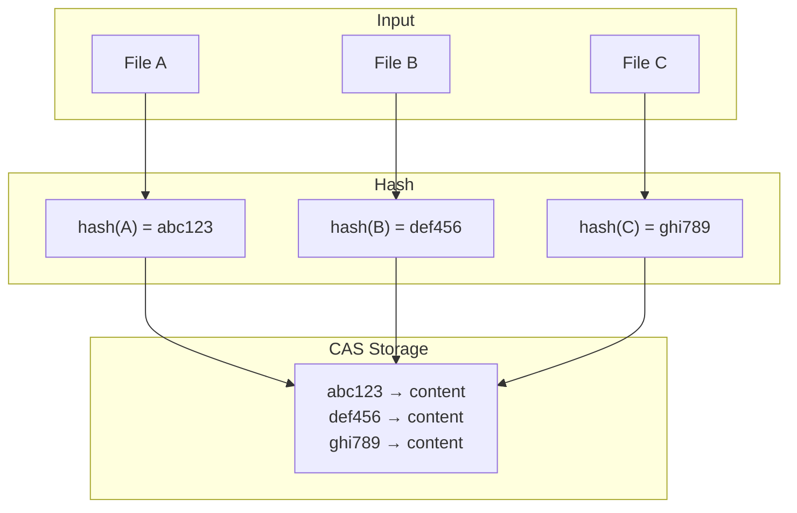
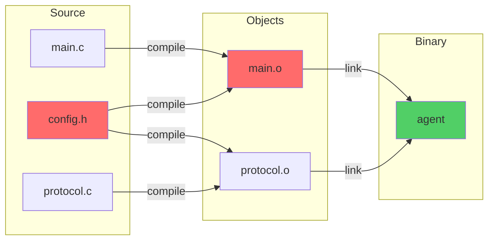
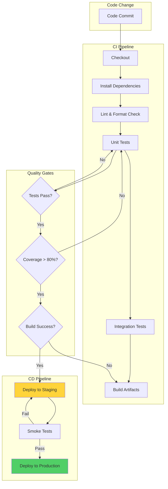
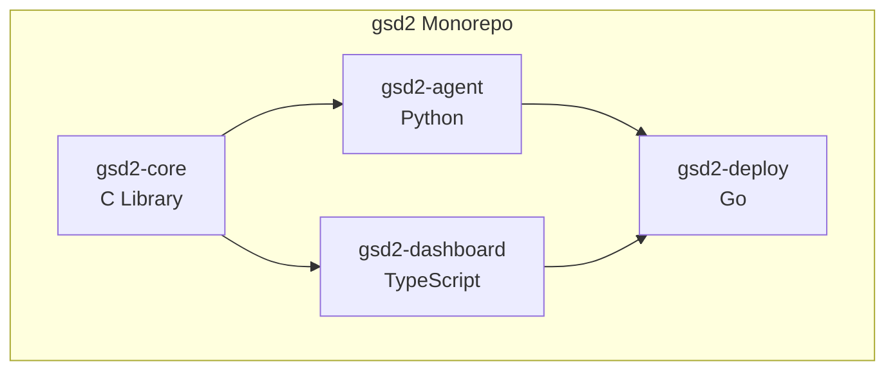
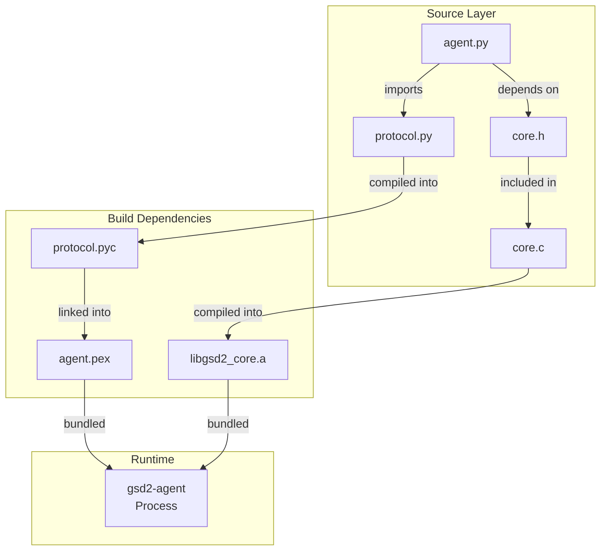
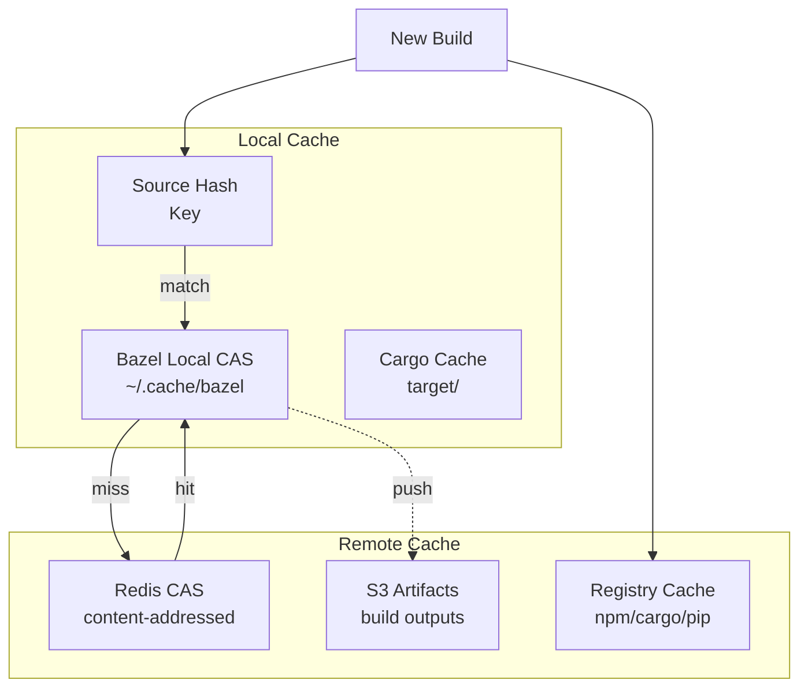
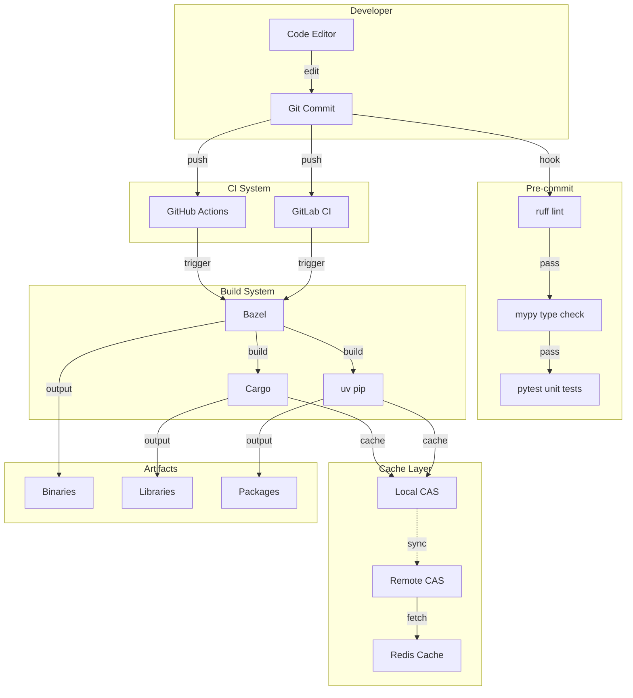

# Code Agent Ch11: 构建与测试系统

构建与测试系统是 Code Agent 基础设施的核心组成部分，直接影响开发效率、代码质量和部署可靠性。本章以 gsd2 项目为案例，全面解析从源码到可执行 artifact 的完整构建流程，以及如何建立高效的测试体系。

## 1. 构建系统概述

构建系统的核心目标是将源代码转换为可执行程序或可部署的 artifact，并管理它们之间的依赖关系。现代项目通常涉及多语言、多平台的复杂依赖图，需要构建系统具备声明式配置、并行执行、增量构建等能力。

### 1.1 传统构建工具

**Make** 是最经典的构建工具，1977 年由 Stuart Feldman 开发，至今仍广泛应用于 C/C++ 项目。Makefile 通过声明目标、依赖和规则来描述构建过程。

```makefile
# Makefile 示例
CC = gcc
CFLAGS = -Wall -O2 -I./include
SRCS = $(wildcard src/*.c)
OBJS = $(SRCS:.c=.o)
TARGET = myapp

$(TARGET): $(OBJS)
    $(CC) $(CFLAGS) -o $@ $^

%.o: %.c
    $(CC) $(CFLAGS) -c -o $@ $<

clean:
    rm -f $(OBJS) $(TARGET)

.PHONY: clean test
```

Make 的局限性在于：

- 依赖规则需要手动维护
- 并行构建支持有限
- 跨平台支持需要额外处理
- 缺乏依赖的显式声明机制

**CMake** 是 Make 的现代化替代品，通过 `CMakeLists.txt` 生成平台原生的构建文件（Makefile 或 Ninja）。

```cmake
# CMakeLists.txt 示例
cmake_minimum_required(VERSION 3.20)
project(gsd2 VERSION 1.0.0 LANGUAGES C CXX)

set(CMAKE_C_STANDARD 11)
set(CMAKE_CXX_STANDARD 17)
set(CMAKE_EXPORT_COMPILE_COMMANDS ON)

include_directories(include)
enable_language(C ASM)

add_library(gsd2_core STATIC
    src/core/buffer.c
    src/core/config.c
    src/core/log.c
)

add_executable(gsd2_agent
    src/agent/main.c
    src/agent/protocol.c
)

target_link_libraries(gsd2_agent PRIVATE gsd2_core)

install(TARGETS gsd2_agent gsd2_core
    ARCHIVE DESTINATION lib
    RUNTIME DESTINATION bin
)
```

### 1.2 高级构建系统

**Bazel** 是 Google 开发的分布式构建系统，以其严格的依赖分析和可重现构建著称。Bazel 使用 Starlark（Python 子集）作为构建语言，每个包由 `BUILD` 文件定义。

```python
# BUILD 文件
load("@rules_cc//cc:defs.bzl", "cc_binary", "cc_library", "cc_test")

cc_library(
    name = "core",
    srcs = ["src/core/buffer.c", "src/core/config.c"],
    hdrs = ["include/gsd2/core.h"],
    visibility = ["//visibility:public"],
)

cc_binary(
    name = "agent",
    srcs = ["src/agent/main.c"],
    deps = [":core"],
)

cc_test(
    name = "core_test",
    srcs = ["tests/core_test.cc"],
    deps = [":core"],
    size = "small",
)
```

Bazel 的核心特性：

- **可重现构建**：相同的输入产生相同的输出
- **远程缓存**：支持分布式构建缓存
- **沙盒执行**：保证构建隔离性
- **增量构建**：仅重新构建受影响的部分

**Turborepo** 是 Vercel 开发的 JavaScript/TypeScript 构建系统，专为 Monorepo 设计。

```json
// turbo.json
{
  "$schema": "https://turbo.build/schema.json",
  "pipeline": {
    "build": {
      "dependsOn": ["^build"],
      "outputs": ["dist/**", ".next/**"]
    },
    "test": {
      "dependsOn": ["build"],
      "outputs": ["coverage/**"]
    },
    "lint": {
      "outputs": []
    }
  }
}
```

### 1.3 构建系统对比

| 特性         | Make         | CMake        | Bazel        | Turborepo   |
| ------------ | ------------ | ------------ | ------------ | ----------- |
| **语言**     | DSL          | DSL          | Starlark     | JSON        |
| **依赖分析** | 手动         | 半自动       | 自动         | 自动        |
| **远程缓存** | 不支持       | 需配置       | 原生支持     | 需配置      |
| **跨平台**   | 需适配       | 好           | 优秀         | 仅 JS       |
| **学习曲线** | 低           | 中           | 高           | 低          |
| **适用场景** | C/C++/嵌入式 | C/C++ 跨平台 | 多语言大规模 | JS Monorepo |

## 2. 多语言构建支持

gsd2 项目采用多语言架构：核心逻辑使用 C（性能关键），Agent 使用 Python（快速迭代），基础设施脚本使用 Go（部署便捷）。构建系统需要统一管理这些语言的不同构建工具。

### 2.1 Python 构建生态

Python 有多个相互竞争的打包工具，理解它们的分工至关重要。

**setuptools** 是历史最悠久的打包工具，`setup.py` 定义包的元数据和构建规则：

```python
# setup.py
from setuptools import setup, find_packages

setup(
    name="gsd2-agent",
    version="1.0.0",
    packages=find_packages(where="src"),
    package_dir={"": "src"},
    install_requires=[
        "click>=8.0",
        "pyyaml>=6.0",
        "protobuf>=4.0",
    ],
    extras_require={
        "dev": ["pytest>=7.0", "black", "ruff"],
    },
    python_requires=">=3.9",
    entry_points={
        "console_scripts": [
            "gsd2-agent=agent.cli:main",
        ],
    },
)
```

**Poetry** 提供统一的依赖管理和打包体验：

```toml
# pyproject.toml (Poetry 格式)
[tool.poetry]
name = "gsd2-agent"
version = "1.0.0"
description = "gsd2 Agent implementation"
authors = ["gsd2 Team"]

[tool.poetry.dependencies]
python = "^3.9"
click = "^8.0"
pyyaml = "^6.0"
protobuf = "^4.0"

[tool.poetry.group.dev.dependencies]
pytest = "^7.0"
black = "^23.0"
ruff = "^0.1"

[tool.poetry.scripts]
gsd2-agent = "agent.cli:main"

[build-system]
requires = ["poetry-core"]
build-backend = "poetry.core.masonry.api"
```

**uv** 是 Astral 公司开发的高性能工具，兼容 pip/poetry 生态：

```bash
# 使用 uv 管理依赖
uv venv .venv
source .venv/bin/activate
uv pip install -r requirements.txt
uv sync  # 替代 poetry install

# 构建分发包
uv build
uv publish
```

### 2.2 JavaScript 构建生态

**npm** 是 Node.js 官方包管理器，package.json 定义项目配置：

```json
{
  "name": "@gsd2/dashboard",
  "version": "1.0.0",
  "type": "module",
  "scripts": {
    "dev": "vite",
    "build": "tsc && vite build",
    "preview": "vite preview",
    "test": "vitest",
    "lint": "eslint src --ext .ts,.tsx"
  },
  "dependencies": {
    "react": "^18.2.0",
    "react-dom": "^18.2.0"
  },
  "devDependencies": {
    "@types/react": "^18.2.0",
    "typescript": "^5.0.0",
    "vite": "^5.0.0",
    "vitest": "^1.0.0"
  }
}
```

**pnpm** 以高效存储著称，使用硬链接避免重复安装：

```bash
# pnpm 配置
pnpm install
pnpm add -D eslint
pnpm --filter @gsd2/dashboard build
```

**yarn** 和 **bun** 也是常用选择。Bun 内置打包功能，号称 10 倍速度提升：

```bash
# Bun 构建
bun install
bun run build
bun test
```

### 2.3 Go 构建生态

Go 使用 go.mod 管理依赖，构建产物是单一可执行文件：

```go
// go.mod
module github.com/gsd2/deployer

go 1.21

require (
    github.com/spf13/cobra v1.8.0
    github.com/stretchr/testify v1.8.4
)

require (
    github.com/inconshreveable/mousetrap v1.1.0 // indirect
    github.com/spf13/pflag v1.0.5 // indirect
    github.com/stretchr/objx v0.5.0 // indirect
)
```

```bash
# Go 构建命令
go mod tidy
go build -o gsd2-deploy ./cmd/deploy
go install ./cmd/deploy
```

### 2.4 Rust 构建生态

**Cargo** 是 Rust 的包管理器和构建系统，Cargo.toml 定义项目：

```toml
# Cargo.toml
[package]
name = "gsd2-probe"
version = "1.0.0"
edition = "2021"

[dependencies]
tokio = { version = "1.0", features = ["full"] }
clap = { version = "4.0", features = ["derive"] }
tracing = "0.1"

[profile.release]
lto = true
codegen-units = 1
panic = "abort"
```

```bash
# Cargo 构建
cargo build --release
cargo test
cargo clippy -- -D warnings
```

### 2.5 统一构建入口

gsd2 项目采用 **Bazel** 作为统一构建入口，通过 rules 实现多语言支持：

```python
# WORKSPACE
load("@bazel_tools//tools/build_defs/repo:http.bzl", "http_archive")

# Python rules
load("@rules_python//python:pip.bzl", "pip_parse")
pip_parse(
    name = "python_deps",
    requirements_lock = "//:requirements.txt",
)
load("@python_deps//:defs.bzl", "pip_install")
pip_install()

# Go rules
load("@gazelle//:def.bzl", "gazelle")
gazelle(name = "gazelle")
```

## 3. 测试框架集成

测试是代码质量的守护者。gsd2 项目建立了多层次测试体系：单元测试、集成测试、端到端测试，覆盖所有语言栈。

### 3.1 Python 测试框架

**pytest** 是 Python 最流行的测试框架，支持丰富的插件生态：

```python
# tests/test_core.py
import pytest
from gsd2.core import Buffer, Config

class TestBuffer:
    @pytest.fixture
    def buffer(self):
        return Buffer(1024)

    def test_allocate(self, buffer):
        ptr = buffer.allocate(256)
        assert ptr is not None
        assert buffer.used() == 256

    def test_allocate_overflow(self, buffer):
        with pytest.raises(MemoryError):
            buffer.allocate(2048)

    @pytest.mark.parametrize("size", [1, 64, 256, 1024])
    def test_various_sizes(self, buffer, size):
        ptr = buffer.allocate(size)
        assert ptr is not None


class TestConfig:
    def test_load_yaml(self, tmp_path):
        config_file = tmp_path / "config.yaml"
        config_file.write_text("""
server:
  host: 0.0.0.0
  port: 8080
""")
        config = Config.load(str(config_file))
        assert config["server"]["port"] == 8080
```

```bash
# pytest 运行
pytest tests/ -v --tb=short
pytest tests/ -k "test_allocate"  # 选择性运行
pytest --cov=gsd2 --cov-report=html  # 覆盖率报告
```

### 3.2 JavaScript 测试框架

**Jest** 是 React 生态的主流测试框架，**Vitest** 是其 Vite 原生替代品：

```typescript
// src/__tests__/protocol.test.ts
import { describe, it, expect, beforeEach } from "vitest"
import { ProtocolHandler } from "../protocol"
import type { Message } from "../types"

describe("ProtocolHandler", () => {
  let handler: ProtocolHandler

  beforeEach(() => {
    handler = new ProtocolHandler()
  })

  it("should encode message correctly", () => {
    const msg: Message = {
      type: "request",
      id: "req-001",
      payload: { action: "ping" },
    }
    const encoded = handler.encode(msg)
    expect(encoded).toBeInstanceOf(Uint8Array)
  })

  it("should decode valid message", () => {
    const data = new Uint8Array([0x01, 0x00, 0x04, ...new TextEncoder().encode("ping")])
    const msg = handler.decode(data)
    expect(msg.type).toBe("request")
  })

  it("should handle invalid data", () => {
    expect(() => handler.decode(new Uint8Array([0xff]))).toThrow("Invalid message")
  })
})
```

```typescript
// vitest.config.ts
import { defineConfig } from "vitest/config"

export default defineConfig({
  test: {
    globals: true,
    environment: "node",
    coverage: {
      provider: "v8",
      reporter: ["text", "html"],
    },
  },
})
```

### 3.3 Go 测试框架

Go 内置 testing 包，配合 go test 命令使用：

```go
// core/buffer_test.go
package core

import (
    "testing"
)

func TestBuffer_Allocate(t *testing.T) {
    buf := NewBuffer(1024)

    ptr, err := buf.Allocate(256)
    if err != nil {
        t.Fatalf("Allocate failed: %v", err)
    }
    if ptr == nil {
        t.Fatal("Allocate returned nil pointer")
    }
    if buf.Used() != 256 {
        t.Errorf("Expected used=256, got %d", buf.Used())
    }
}

func TestBuffer_AllocateOverflow(t *testing.T) {
    buf := NewBuffer(1024)
    _, err := buf.Allocate(2048)
    if err == nil {
        t.Fatal("Expected overflow error")
    }
}

func BenchmarkBuffer_Allocate(b *testing.B) {
    buf := NewBuffer(65536)
    for i := 0; i < b.N; i++ {
        buf.Allocate(64)
        buf.Reset()
    }
}
```

```bash
# Go 测试命令
go test -v ./...
go test -race -coverprofile=coverage.out ./...
go tool cover -html=coverage.out -o coverage.html
```

### 3.4 Rust 测试框架

Rust 测试体系包含单元测试、集成测试和文档测试：

```rust
// src/core/buffer.rs
pub struct Buffer {
    data: Vec<u8>,
    used: usize,
}

impl Buffer {
    pub fn new(capacity: usize) -> Self {
        Buffer {
            data: vec![0u8; capacity],
            used: 0,
        }
    }

    pub fn allocate(&mut self, size: usize) -> Result<&mut [u8], BufferError> {
        if self.used + size > self.data.len() {
            return Err(BufferError::OutOfMemory);
        }
        let ptr = &mut self.data[self.used..self.used + size];
        self.used += size;
        Ok(ptr)
    }

    #[cfg(test)]
    mod tests {
        use super::*;

        #[test]
        fn test_allocate_success() {
            let mut buf = Buffer::new(1024);
            assert!(buf.allocate(256).is_ok());
            assert_eq!(buf.used(), 256);
        }

        #[test]
        fn test_allocate_overflow() {
            let mut buf = Buffer::new(1024);
            assert!(matches!(buf.allocate(2048), Err(BufferError::OutOfMemory)));
        }
    }
}
```

```bash
# Cargo 测试
cargo test
cargo test --lib -- --nocapture  # 只测试 lib
cargo test --test integration    # 运行集成测试
cargo bench                      # 运行基准测试
```

### 3.5 测试框架对比

| 框架       | 语言       | 断言风格       | Fixture         | 并行           | 覆盖率           |
| ---------- | ---------- | -------------- | --------------- | -------------- | ---------------- |
| pytest     | Python     | assert         | 内置            | pytest-xdist   | pytest-cov       |
| Jest       | JavaScript | expect         | @nestjs/testing | --maxWorkers   | --coverage       |
| Vitest     | TypeScript | expect         | 内置            | threads        | @vitest/coverage |
| go test    | Go         | t.Error/assert | Table-driven    | -test.p        | go tool cover    |
| cargo test | Rust       | assert!/panic! | 内置            | --test-threads | cargo-tarpaulin  |

## 4. Lint 与代码检查

代码检查工具在构建前发现潜在问题，统一代码风格，提升代码质量。

### 4.1 Python Lint 工具

**ruff** 是 Rust 编写的高速 Python Linter，替代 flake8、isort、pyupgrade 等工具：

```toml
# pyproject.toml
[tool.ruff]
line-length = 100
target-version = "py39"

[tool.ruff.lint]
select = [
    "E",   # pycodestyle errors
    "W",   # pycodestyle warnings
    "F",   # pyflakes
    "I",   # isort
    "N",   # pep8-naming
    "UP",  # pyupgrade
    "B",   # flake8-bugbear
    "C4",  # flake8-comprehensions
]
ignore = [
    "E501",  # line too long (handled by formatter)
]

[tool.ruff.lint.per-file-ignores]
"__init__.py" = ["F401"]
```

```bash
# ruff 命令
ruff check src/
ruff check --fix src/    # 自动修复
ruff format src/          # 格式化
```

**mypy** 提供可选的静态类型检查：

```python
# src/agent/protocol.py
from typing import Protocol, Any
import numpy as np

class MessageHandler(Protocol):
    def handle(self, msg: dict[str, Any]) -> None: ...

def process_message(handler: MessageHandler, data: bytes) -> None:
    msg = decode(data)
    handler.handle(msg)

# mypy 检查
# mypy src/agent/protocol.py
```

### 4.2 JavaScript Lint 工具

**ESLint** 是 JavaScript 的可扩展 Linter：

```javascript
// .eslintrc.js
module.exports = {
  parser: "@typescript-eslint/parser",
  parserOptions: {
    ecmaVersion: 2022,
    sourceType: "module",
  },
  plugins: ["@typescript-eslint"],
  extends: ["eslint:recommended", "plugin:@typescript-eslint/recommended"],
  rules: {
    "@typescript-eslint/no-unused-vars": ["error", { argsIgnorePattern: "^_" }],
    "@typescript-eslint/explicit-function-return-type": "off",
  },
}
```

```bash
# ESLint 命令
npx eslint src/ --ext .ts,.tsx
npx eslint --fix src/
```

### 4.3 Go Lint 工具

**golangci-lint** 聚合多个 Go Linter：

```yaml
# .golangci.yml
run:
  timeout: 5m
  modules-download-mode: readonly

linters:
  enable:
    - gofmt
    - golint
    - staticcheck
    - unused
    - errcheck
    - structcheck
    - varcheck
    - jsoncheck
    - revive

linters-settings:
  revive:
    rules:
      - name: var-naming
        severity: warning
```

```bash
# golangci-lint
golangci-lint run ./...
golangci-lint run --new-from-rev=HEAD~1 ./...  # 只检查新代码
```

### 4.4 Rust Lint 工具

**rustfmt** 格式化代码，**clippy** 提供额外的 lint 检查：

```toml
# rustfmt.toml
edition = "2021"
max_width = 100
tab_spaces = 4
newline_style = "Auto"
```

```bash
# Rust Lint
rustfmt --check src/**/*.rs
cargo clippy -- -D warnings
cargo clippy -- -W clippy::all  # 启用所有 clippy 警告
```

### 4.5 Lint 工具对比

| 工具          | 语言   | 速度           | 格式化          | 类型检查    |
| ------------- | ------ | -------------- | --------------- | ----------- |
| ruff          | Python | 10-100x faster | ruff format     | mypy (独立) |
| ESLint        | JS/TS  | 中等           | Prettier (独立) | TypeScript  |
| golangci-lint | Go     | 快             | gofmt/gofumpt   | 集成        |
| clippy        | Rust   | 中等           | rustfmt         | Rustc 集成  |

## 5. 增量构建与缓存

增量构建和缓存是构建系统性能的核心。合理的缓存策略可以将构建时间从分钟级缩短到秒级。

### 5.1 本地构建缓存

**Bazel** 的本地缓存基于 action graph，每个 action 的输入计算 hash，输出存储在 CAS (Content Addressable Store) 中：

```bash
# Bazel 缓存查看
bazel query --output=graph //...
bazel clean --expunge  # 清除缓存

# 查看缓存大小
du -sh ~/.cache/bazel
```

**Cargo** 的增量编译存储在 `target/` 目录：

```toml
# Cargo.toml
[profile.dev]
incremental = true
opt-level = 0

[profile.release]
incremental = false
lto = true
```

```bash
# Cargo 缓存
cargo clean
cargo build -v  # 查看详细编译命令
```

### 5.2 远程构建缓存

Bazel 的远程缓存允许多个开发者共享构建结果：

```bazelrc
# .bazelrc
build --remote_cache=grpcs://cache.googleapis.com/gsd2-bazel
build --remote_upload_local_results=true
build --spawn_strategy=remote
```

```python
# rules_python 示例
pip_parse(
    name = "python_deps",
    requirements_lock = "//:requirements.txt",
    enable_imports_support = True,
)
```

**Turborepo** 的远程缓存：

```bash
# 登录 Vercel 或自建 Turborepo Remote Cache
npx turbo login
npx turbo remote --api-url=https://turbo.gsd2.internal

# 本地绕过缓存
npx turbo build --force
```

### 5.3 内容寻址存储 (CAS)

CAS 是高效缓存的基础，数据根据内容 hash 寻址，相同内容永不重复存储：



```python
# gsd2 CAS 实现示例
import hashlib
import os
from pathlib import Path

class ContentAddressableStore:
    def __init__(self, root: Path):
        self.root = root
        self.objects_dir = root / "objects"
        self.objects_dir.mkdir(parents=True, exist_ok=True)
        self.metadata_dir = root / "metadata"
        self.metadata_dir.mkdir(parents=True, exist_ok=True)

    def _hash_file(self, path: Path) -> str:
        hasher = hashlib.sha256()
        with open(path, "rb") as f:
            for chunk in iter(lambda: f.read(8192), b""):
                hasher.update(chunk)
        return hasher.hexdigest()

    def store(self, path: Path) -> str:
        digest = self._hash_file(path)
        obj_path = self.objects_dir / digest[:2] / digest[2:]

        if not obj_path.exists():
            obj_path.parent.mkdir(parents=True, exist_ok=True)
            os.link(path, obj_path)  # 硬链接节省空间

        return digest

    def retrieve(self, digest: str, dest: Path) -> bool:
        obj_path = self.objects_dir / digest[:2] / digest[2:]
        if not obj_path.exists():
            return False
        os.link(obj_path, dest)
        return True

    def exists(self, digest: str) -> bool:
        obj_path = self.objects_dir / digest[:2] / digest[2:]
        return obj_path.exists()
```

### 5.4 增量构建策略

合理的增量构建需要正确声明依赖关系：



gsd2 的增量构建配置：

```python
# Bazel BUILD
cc_library(
    name = "core",
    srcs = ["src/core/buffer.c", "src/core/config.c"],
    hdrs = ["include/gsd2/core.h"],
    visibility = ["//visibility:public"],
)

# config.h 改变时，只重新编译依赖它的 targets
# Bazel 自动分析 header 依赖
```

## 6. CI/CD 集成

CI/CD 将代码检查、测试、构建流程自动化，确保每次提交都经过验证。

### 6.1 GitHub Actions

```yaml
# .github/workflows/ci.yml
name: CI

on:
  push:
    branches: [main, develop]
  pull_request:
    branches: [main]

jobs:
  lint:
    runs-on: ubuntu-latest
    steps:
      - uses: actions/checkout@v4

      - name: Set up Python
        uses: actions/setup-python@v5
        with:
          python-version: "3.11"

      - name: Install uv
        uses: astral-sh/setup-uv@v3

      - name: Lint with ruff
        run: uvx ruff check src/

      - name: Type check with mypy
        run: uvx mypy src/

  test:
    runs-on: ubuntu-latest
    strategy:
      matrix:
        python-version: ["3.9", "3.10", "3.11", "3.12"]
    steps:
      - uses: actions/checkout@v4

      - name: Set up Python ${{ matrix.python-version }}
        uses: actions/setup-python@v5
        with:
          python-version: ${{ matrix.python-version }}

      - name: Install uv
        uses: astral-sh/setup-uv@v3

      - name: Run tests
        run: |
          uv sync --all-extras
          uv run pytest tests/ -v --cov=gsd2

  build:
    needs: [lint, test]
    runs-on: ubuntu-latest
    steps:
      - uses: actions/checkout@v4

      - name: Build with Bazel
        uses: bazel-contrib/setup-bazel@latest
        with:
          bazelisk-version: latest

      - name: Build release
        run: bazel build --config=release //...

      - name: Upload artifacts
        uses: actions/upload-artifact@v4
        with:
          name: bazel-bin
          path: bazel-bin/**
```

### 6.2 GitLab CI

```yaml
# .gitlab-ci.yml
stages:
  - lint
  - test
  - build
  - deploy

variables:
  BAZEL_VERSION: "7.0"

lint:
  stage: lint
  image: python:3.11
  before_script:
    - pip install ruff mypy
  script:
    - ruff check src/
    - mypy src/
  rules:
    - if: '$CI_PIPELINE_SOURCE == "merge_request_event"'
    - if: '$CI_COMMIT_BRANCH == "main"'

test:
  stage: test
  image: python:3.11
  parallel:
    matrix:
      - TEST_SUITE: ["unit", "integration"]
  before_script:
    - pip install -e ".[dev]"
  script:
    - pytest tests/$TEST_SUITE -v --cov=gsd2
  coverage: '/TOTAL.*\s+(\d+%)$/'
  artifacts:
    reports:
      coverage_report: coverage.xml

build:
  stage: build
  image: bazel/bazelisk:7.0
  script:
    - bazel build //... --config=release
  artifacts:
    paths:
      - bazel-bin/**
    expire_in: 1 week

deploy:
  stage: deploy
  image: alpine:latest
  script:
    - apk add --no-cache curl
    - curl -X POST https://deploy.gsd2.internal/build
  environment:
    name: production
  rules:
    - if: '$CI_COMMIT_BRANCH == "main"'
  dependencies:
    - build
```

### 6.3 本地预检

开发阶段在本地运行完整的检查流程，减少 CI 循环时间：

```bash
#!/bin/bash
# scripts/pre-commit.sh

set -e

echo "=== Running local pre-commit checks ==="

# Lint
echo "[1/5] Linting..."
ruff check src/
echo "Lint passed"

# Type check
echo "[2/5] Type checking..."
mypy src/
echo "Type check passed"

# Test
echo "[3/5] Running tests..."
pytest tests/ -v --tb=short
echo "Tests passed"

# Format check
echo "[4/5] Checking formatting..."
ruff format --check src/
echo "Format check passed"

# Build
echo "[5/5] Building..."
bazel build //... --config=release
echo "Build passed"

echo "=== All pre-commit checks passed ==="
```

```makefile
# Makefile 集成
.PHONY: pre-commit lint test build

pre-commit: lint type-check test build
	@echo "All checks passed"

lint:
	ruff check src/

type-check:
	mypy src/

test:
	pytest tests/ -v

build:
	bazel build //...
```

### 6.4 CI/CD 流程图



## 7. 构建结果验证

构建产物的验证确保交付质量，防止错误配置或损坏的 artifact 进入部署流程。

### 7.1 Artifact 检查

gsd2 的 artifact 验证包括：

```python
# scripts/verify_artifact.py
import hashlib
import os
import struct
from pathlib import Path

class ArtifactVerifier:
    def __init__(self, artifact_path: Path):
        self.artifact_path = artifact_path
        self.checksums = {
            "sha256": "artifact.sha256",
            "sha512": "artifact.sha512",
        }

    def verify_checksums(self) -> bool:
        """验证文件完整性"""
        for algo, checksum_file in self.checksums.items():
            expected = self._read_checksum(checksum_file)
            actual = self._compute_checksum(algo)
            if expected != actual:
                print(f"Checksum mismatch: {algo}")
                print(f"  Expected: {expected}")
                print(f"  Actual:   {actual}")
                return False
        return True

    def verify_format(self, expected_magic: bytes) -> bool:
        """验证文件格式魔数"""
        with open(self.artifact_path, "rb") as f:
            magic = f.read(len(expected_magic))
            return magic == expected_magic

    def verify_architecture(self) -> str | None:
        """验证 ELF 架构"""
        if not self.artifact_path.suffix in [".so", ""]:
            return None

        with open(self.artifact_path, "rb") as f:
            # ELF magic
            magic = f.read(4)
            if magic != b"\x7fELF":
                return None

            # Class (32/64 bit)
            elf_class = f.read(1)[0]
            # Endianness
            endian = f.read(1)[0]

            return "x86_64" if elf_class == 2 else "i386"

    def _read_checksum(self, path: str) -> str:
        checksum_path = self.artifact_path.parent / path
        with open(checksum_path) as f:
            return f.read().split()[0]

    def _compute_checksum(self, algo: str) -> str:
        hasher = hashlib.new(algo)
        with open(self.artifact_path, "rb") as f:
            for chunk in iter(lambda: f.read(8192), b""):
                hasher.update(chunk)
        return hasher.hexdigest()


if __name__ == "__main__":
    import sys
    verifier = ArtifactVerifier(Path(sys.argv[1]))

    if verifier.verify_checksums():
        print("Checksum verification passed")
    else:
        print("Checksum verification FAILED")
        sys.exit(1)
```

### 7.2 回归对比

构建回归检测确保新构建与历史构建在功能上一致：

```python
# scripts/regression_test.py
import subprocess
import json
import sys
from pathlib import Path

def run_regression_test(
    old_artifact: Path,
    new_artifact: Path,
    test_cases: list[dict]
) -> bool:
    """对比新旧 artifact 的行为"""
    all_passed = True

    for case in test_cases:
        old_result = execute_artifact(old_artifact, case["input"])
        new_result = execute_artifact(new_artifact, case["input"])

        if old_result != new_result:
            print(f"Regression: {case['name']}")
            print(f"  Old: {old_result}")
            print(f"  New: {new_result}")
            all_passed = False
        else:
            print(f"OK: {case['name']}")

    return all_passed

def execute_artifact(artifact: Path, input_data: bytes) -> bytes:
    result = subprocess.run(
        [str(artifact)],
        input=input_data,
        capture_output=True,
        timeout=5
    )
    return result.stdout
```

```bash
# 构建回归检测
./scripts/regression_test.py \
    bazel-bin/agent_old \
    bazel-bin/agent_new \
    --test-cases test_cases.json
```

### 7.3 构建产物元数据

```json
{
  "artifact": {
    "name": "gsd2-agent",
    "version": "1.2.0",
    "commit": "a1b2c3d4",
    "build_timestamp": "2026-05-12T10:30:00Z",
    "builder": "bazel 7.0"
  },
  "targets": [
    {
      "name": "//src/agent:agent",
      "architecture": "x86_64",
      "os": "linux",
      "size_bytes": 1048576
    }
  ],
  "dependencies": ["gsd2-core@1.0.0", "protobuf@4.0.0"],
  "signatures": {
    "sha256": "abc123...",
    "gpg": "signature_base64"
  }
}
```

## 8. Monorepo 支持

Monorepo 将多个相关项目存储在单一代码仓库中，共享工具链和依赖，提升协作效率。

### 8.1 Monorepo 架构

gsd2 Monorepo 结构：

```
gsd2/
├── WORKSPACE
├── MODULE.bazel
├── package.json
├── pyproject.toml
├── Cargo.toml
├── src/
│   ├── core/           # C 核心库
│   ├── agent/          # Python Agent
│   └── dashboard/      # TypeScript Dashboard
├── third_party/
│   ├── protobuf/
│   └── gRPC/
└── tools/
    ├── bazel/          # Bazel 规则
    └── scripts/        # 构建脚本
```

### 8.2 Nx

Nx 是 Angular 团队开发的 Monorepo 工具，支持增量计算和依赖图分析：

```json
// nx.json
{
  "npmScope": "gsd2",
  "targetDefaults": {
    "build": {
      "dependsOn": ["^build"],
      "cache": true
    },
    "test": {
      "dependsOn": ["build"],
      "cache": true
    }
  },
  "affected": {
    "defaultBase": "main"
  }
}
```



### 8.3 Turborepo

```json
// turbo.json
{
  "$schema": "https://turbo.build/schema.json",
  "globalDependencies": ["**/.env.*local"],
  "pipeline": {
    "build": {
      "dependsOn": ["^build"],
      "outputs": ["dist/**", ".next/**", "!.next/cache/**"],
      "cache": true
    },
    "test": {
      "dependsOn": ["build"],
      "outputs": ["coverage/**"],
      "cache": true
    },
    "lint": {
      "cache": true
    },
    "dev": {
      "cache": false,
      "persistent": true
    }
  }
}
```

### 8.4 Bazel Monorepo

Bazel 天然支持 Monorepo，通过 `WORKSPACE` 和 `MODULE.bazel` 统一管理：

```python
# WORKSPACE
workspace(name = "gsd2")

load("@bazel_tools//tools/build_defs/repo:http.bzl", "http_archive")

# 依赖定义
http_archive(
    name = "rules_python",
    urls = ["https://github.com/bazelbuild/rules_python/releases/download/0.28.0/rules_python-0.28.0.tar.gz"],
)

load("@rules_python//python:pip.bzl", "pip_parse")
pip_parse(
    name = "python_deps",
    requirements_lock = "//:requirements.txt",
)

# Go 依赖
load("@gazelle//:def.bzl", "gazelle")
gazelle(name = "gazelle")
gazelle(name = "rules_go")
```

### 8.5 依赖图分析

```bash
# Bazel 查询依赖
bazel query "deps(//src/agent:agent)" --output=graph
bazel query "allpaths(//src/agent:agent, //third_party/protobuf:protobuf)" --output=graph

# Nx 依赖图
npx nx graph
npx nx affected:dep-graph
```



### 8.6 Monorepo 工具对比

| 特性           | Nx       | Turborepo | Bazel  | Lerna  |
| -------------- | -------- | --------- | ------ | ------ |
| **语言支持**   | 多语言   | JS/TS     | 多语言 | JS/TS  |
| **增量构建**   | 原生     | 原生      | 原生   | 需配置 |
| **远程缓存**   | Nx Cloud | Vercel    | 任意   | 需配置 |
| **任务编排**   | 强大     | 简单      | 强大   | 简单   |
| **学习曲线**   | 中高     | 低        | 高     | 低     |
| **大规模项目** | 优秀     | 良好      | 优秀   | 一般   |

## 9. gsd2 构建测试集成

本节介绍 gsd2 项目中构建测试系统的具体实现，包括 Tool 设计、工作流编排和缓存策略。

### 9.1 Tool 设计

gsd2 构建系统封装为独立的 Tool，提供统一的 CLI 接口：

```python
# tools/build_tool/__init__.py
"""gsd2 Build Tool - 统一构建入口"""

import argparse
import sys
from pathlib import Path
from typing import Optional

class BuildTool:
    def __init__(self, workspace_root: Path):
        self.workspace_root = workspace_root
        self.bazel_bin = workspace_root / "bazel-bin"

    def build(self, target: str, config: str = "release") -> int:
        """构建指定目标"""
        import subprocess
        cmd = ["bazel", "build", target]
        if config == "release":
            cmd.append("--config=release")
        cmd.append(f"--workspace_status={self.workspace_root}")

        result = subprocess.run(cmd, cwd=self.workspace_root)
        return result.returncode

    def test(self, target: str, verbose: bool = False) -> int:
        """运行测试"""
        import subprocess
        cmd = ["bazel", "test", target]
        if verbose:
            cmd.append("--test_output=all")

        result = subprocess.run(cmd, cwd=self.workspace_root)
        return result.returncode

    def clean(self) -> int:
        """清理构建产物"""
        import subprocess
        result = subprocess.run(
            ["bazel", "clean", "--expunge"],
            cwd=self.workspace_root
        )
        return result.returncode


def main():
    parser = argparse.ArgumentParser(description="gsd2 Build Tool")
    subparsers = parser.add_subparsers(dest="command")

    # build 命令
    build_parser = subparsers.add_parser("build", help="构建目标")
    build_parser.add_argument("target", help="Bazel 目标")
    build_parser.add_argument("--config", default="release", choices=["debug", "release"])

    # test 命令
    test_parser = subparsers.add_parser("test", help="运行测试")
    test_parser.add_argument("target", nargs="?", default="//...")
    test_parser.add_argument("-v", "--verbose", action="store_true")

    # clean 命令
    subparsers.add_parser("clean", help="清理构建")

    args = parser.parse_args()

    tool = BuildTool(Path.cwd())

    if args.command == "build":
        sys.exit(tool.build(args.target, args.config))
    elif args.command == "test":
        sys.exit(tool.test(args.target, args.verbose))
    elif args.command == "clean":
        sys.exit(tool.clean())
    else:
        parser.print_help()
        sys.exit(1)


if __name__ == "__main__":
    main()
```

### 9.2 工作流编排

gsd2 的工作流基于 Bazel + 自定义脚本：

```yaml
# .github/workflows/gsd2-workflow.yml
name: gsd2 Build Workflow

on:
  workflow_dispatch:
    inputs:
      mode:
        description: "Build mode"
        required: true
        default: "release"
        type: choice
        options:
          - release
          - debug
          - coverage

jobs:
  setup:
    runs-on: ubuntu-latest
    outputs:
      cache_key: ${{ steps.cache-key.outputs.key }}
    steps:
      - uses: actions/checkout@v4
      - id: cache-key
        run: echo "key=${{ hashFiles('**/BUILD', '**/WORKSPACE') }}" >> $GITHUB_OUTPUT
    cache:
      path: ~/.cache/bazel

  build:
    needs: setup
    runs-on: ubuntu-latest
    steps:
      - uses: actions/checkout@v4

      - name: Setup Bazel
        uses: bazel-contrib/setup-bazel@latest
        with:
          bazelisk-version: 7.0

      - name: Build all targets
        run: |
          bazel build //... --config=${{ inputs.mode || 'release' }}

  test:
    needs: build
    runs-on: ubuntu-latest
    strategy:
      matrix:
        suite: [unit, integration, e2e]
    steps:
      - uses: actions/checkout@v4

      - name: Setup Bazel
        uses: bazel-contrib/setup-bazel@latest

      - name: Run ${{ matrix.suite }} tests
        run: |
          bazel test //tests:${{ matrix.suite }} \
            --test_output=errors \
            --test_summary=detailed

  package:
    needs: [build, test]
    runs-on: ubuntu-latest
    steps:
      - uses: actions/checkout@v4

      - name: Build release artifacts
        run: |
          bazel build //:release_package

      - name: Upload artifacts
        uses: actions/upload-artifact@v4
        with:
          name: gsd2-release
          path: bazel-bin/release_package.tar.gz

  deploy:
    needs: package
    environment: production
    runs-on: ubuntu-latest
    steps:
      - name: Download artifacts
        uses: actions/download-artifact@v4

      - name: Deploy to production
        run: |
          ./scripts/deploy.sh production bazel-bin/release_package.tar.gz
```

### 9.3 缓存策略

gsd2 采用多层缓存策略：



```python
# tools/cache_strategy.py
"""gsd2 多层缓存策略"""

import hashlib
import shutil
from pathlib import Path
from typing import Optional, Protocol
import redis

class CacheBackend(Protocol):
    """缓存后端协议"""
    def get(self, key: str) -> Optional[bytes]: ...
    def put(self, key: str, value: bytes) -> None: ...
    def exists(self, key: str) -> bool: ...

class LocalCache:
    """本地文件系统缓存"""
    def __init__(self, root: Path):
        self.root = root
        self.root.mkdir(parents=True, exist_ok=True)

    def _key_to_path(self, key: str) -> Path:
        return self.root / key[:2] / key[2:]

    def get(self, key: str) -> Optional[bytes]:
        path = self._key_to_path(key)
        if path.exists():
            return path.read_bytes()
        return None

    def put(self, key: str, value: bytes) -> None:
        path = self._key_to_path(key)
        path.parent.mkdir(parents=True, exist_ok=True)
        path.write_bytes(value)

    def exists(self, key: str) -> bool:
        return self._key_to_path(key).exists()

class RemoteCache:
    """远程 Redis 缓存"""
    def __init__(self, redis_url: str, namespace: str = "gsd2:"):
        self.redis = redis.from_url(redis_url)
        self.namespace = namespace

    def _key(self, key: str) -> str:
        return f"{self.namespace}{key}"

    def get(self, key: str) -> Optional[bytes]:
        return self.redis.get(self._key(key))

    def put(self, key: str, value: bytes) -> None:
        self.redis.set(self._key(key), value)

    def exists(self, key: str) -> bool:
        return self.redis.exists(self._key(key)) > 0

class LayeredCache:
    """分层缓存：本地优先，远程次之"""
    def __init__(self, local: LocalCache, remote: Optional[RemoteCache] = None):
        self.local = local
        self.remote = remote

    def get(self, key: str) -> Optional[bytes]:
        # 先查本地
        value = self.local.get(key)
        if value is not None:
            return value

        # 本地未命中，查远程
        if self.remote:
            value = self.remote.get(key)
            if value:
                # 回填本地
                self.local.put(key, value)
                return value

        return None

    def put(self, key: str, value: bytes) -> None:
        self.local.put(key, value)
        if self.remote:
            self.remote.put(key, value)

    def exists(self, key: str) -> bool:
        return self.local.exists(key) or (self.remote and self.remote.exists(key))
```

### 9.4 Bazel 缓存配置

```bazelrc
# .bazelrc
# 构建配置
build:release --config=release
build:release --jobs=16
build:release --compile_one_dependency
build:release --output_groups=default

# 测试配置
test:coverage --collect_code_coverage
test:coverage --test_output=errors

# 远程缓存
build:remote --remote_cache=grpcs://bazel-cache.gsd2.internal
build:remote --remote_upload_local_results=true
build:remote --strategy=RemoteSpawner=linux

# 缓存大小限制
build --local_ram_resources=HOST_RAM*.5
build --disk_cache=1GB
```

### 9.5 完整构建示例

```bash
#!/bin/bash
# scripts/full_build.sh - gsd2 完整构建流程

set -euo pipefail

WORKSPACE_ROOT="$(cd "$(dirname "${BASH_SOURCE[0]}")/.." && pwd)"
cd "$WORKSPACE_ROOT"

export BAZEL_LOG="bazel-build.log"
export CACHE_DIR="${HOME}/.cache/gsd2"

echo "=========================================="
echo "gsd2 Full Build Pipeline"
echo "=========================================="

# 1. 环境检查
echo "[1/7] Checking environment..."
command -v bazel >/dev/null || { echo "Bazel not found"; exit 1; }
command -v ruff >/dev/null || { echo "ruff not found"; exit 1; }

# 2. 清理（如需要）
if [[ "${CLEAN_BUILD:-false}" == "true" ]]; then
    echo "[2/7] Cleaning..."
    bazel clean --expunge
fi

# 3. Lint
echo "[3/7] Running linters..."
ruff check src/ || { echo "Lint failed"; exit 1; }

# 4. 测试
echo "[4/7] Running tests..."
bazel test //... --test_output=errors || { echo "Tests failed"; exit 1; }

# 5. 构建
echo "[5/7] Building..."
bazel build //... --config=release || { echo "Build failed"; exit 1; }

# 6. 验证
echo "[6/7] Verifying artifacts..."
./scripts/verify_artifacts.sh bazel-bin/

# 7. 打包
echo "[7/7] Creating release package..."
bazel build //:release_package
tar -czf "gsd2-release-$(date +%Y%m%d).tar.gz" -C bazel-bin .

echo "=========================================="
echo "Build completed successfully"
echo "=========================================="
```

### 9.6 构建系统架构总览



## 总结

构建与测试系统是 Code Agent 基础设施的核心，决定了开发效率和代码质量。本章系统介绍了：

1. **构建系统演进**：从 Make 的手动规则到 Bazel 的声明式依赖分析
2. **多语言支持**：Python (uv/poetry)、JavaScript (npm/pnpm)、Go (go mod)、Rust (Cargo) 的统一管理
3. **测试框架集成**：pytest、Jest、go test、cargo test 的最佳实践
4. **Lint 与代码检查**：ruff、ESLint、golangci-lint、clippy 的配置和使用
5. **增量构建与缓存**：本地 CAS、远程缓存、多层缓存策略
6. **CI/CD 集成**：GitHub Actions、GitLab CI、本地预检的完整流程
7. **构建结果验证**：Checksum、格式验证、回归对比
8. **Monorepo 支持**：Nx、Turborepo、Bazel 的架构与选择
9. **gsd2 实践**：Tool 设计、工作流编排、缓存策略的具体实现

gsd2 项目通过 Bazel 作为统一构建入口，结合多语言 rules 和远程缓存，实现了高效、可重现的构建流程。合理的测试层次设计、Lint 配置和 CI/CD 流程确保了代码质量，而多层缓存策略显著提升了构建速度。

---

_延伸阅读：_

- [Bazel 官方文档](https://bazel.build/external/lockfile#best-practices)
- [Bazel Remote Caching](https://bazel.build/external/cache)
- [Modern Python Packaging](https://packaging.python.org/)
- [Nx Documentation](https://nx.dev/)
