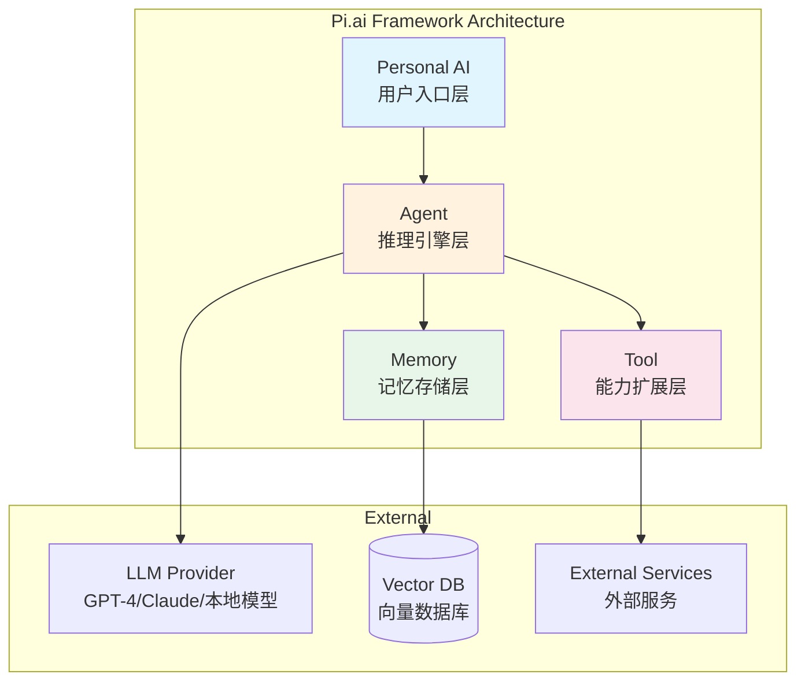
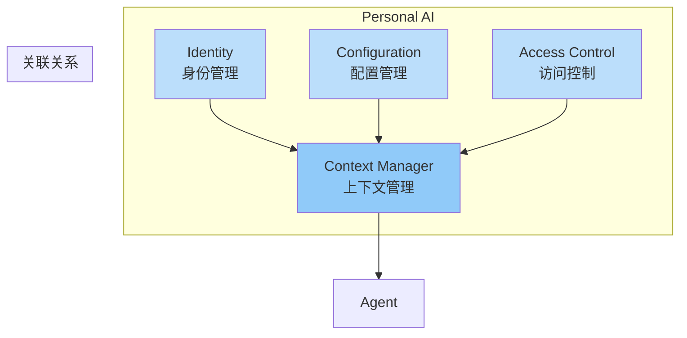
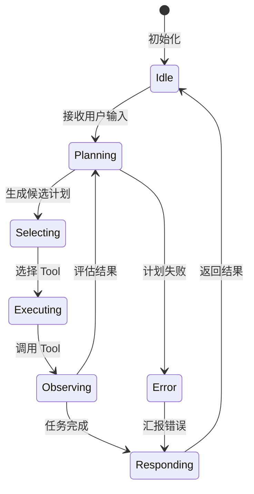
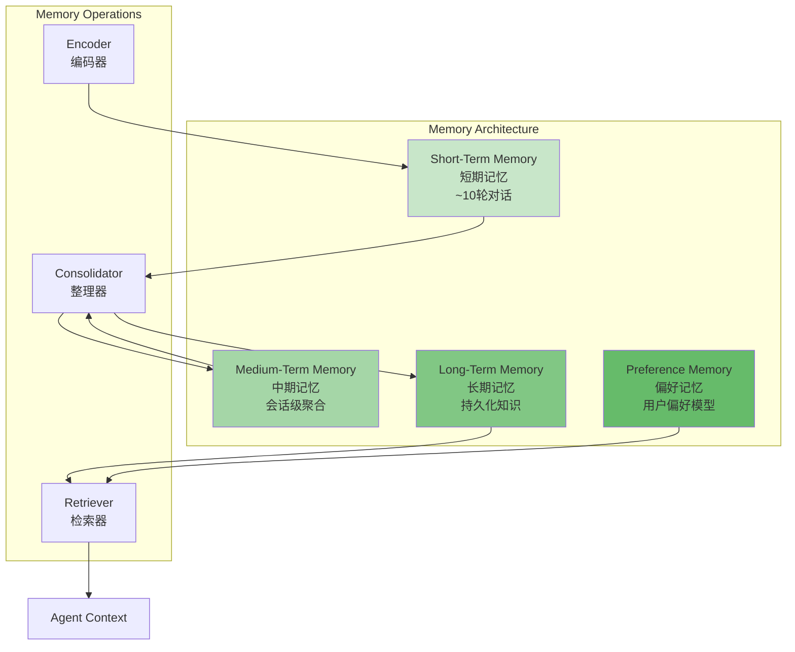
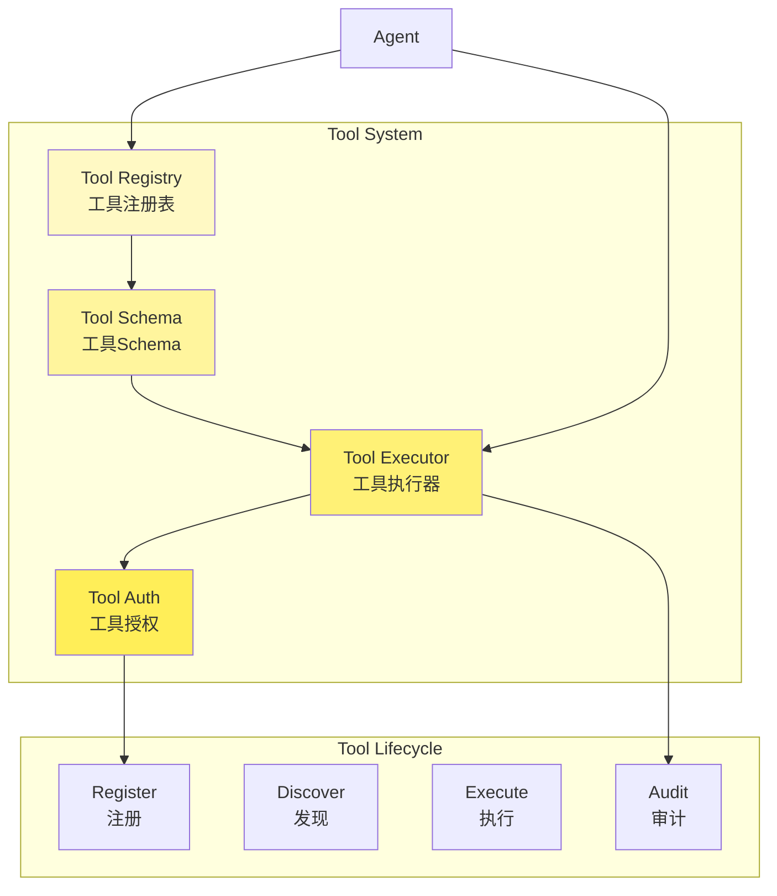
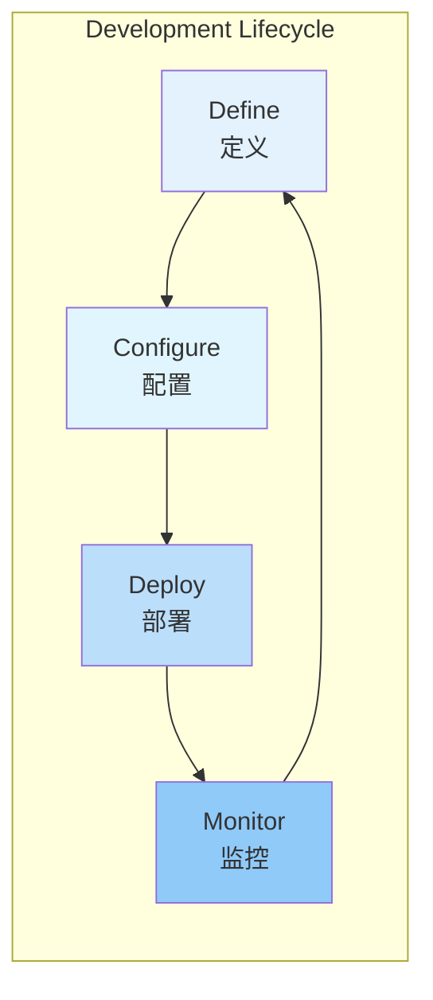
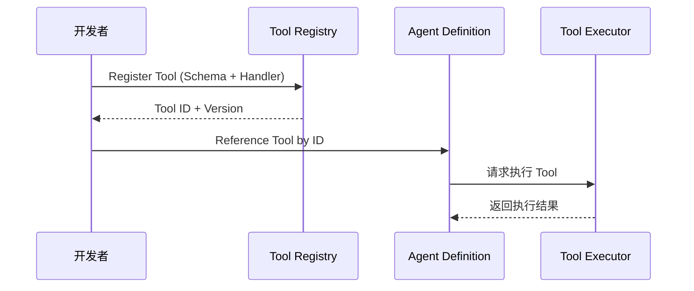
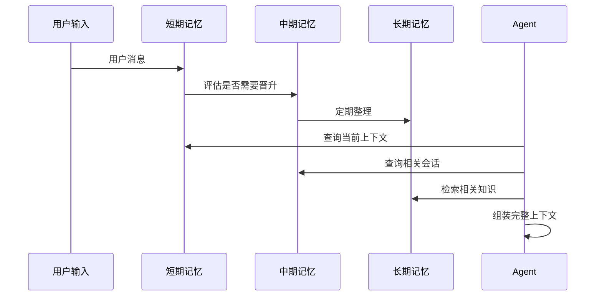
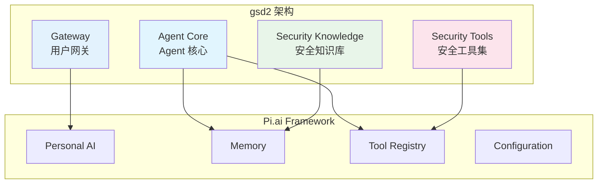

# Code Agent Ch13: Pi.ai Framework 集成

## 1. Pi.ai Framework 概述

### 1.1 定位与核心价值

Pi.ai Framework 是专为构建 **Personal AI（个人人工智能）** 场景设计的 Agent 开发框架。与通用大语言模型 API 调用不同，Pi.ai 强调 AI 与用户的长期陪伴关系——理解用户偏好、记住对话历史、在多轮交互中积累上下文。gsd2 项目正是基于 Pi.ai Framework 构建的自研安全 Agent 系统，服务于网络/安全/内核工程师的日常工作场景。

Pi.ai 的核心定位可以归纳为三个关键词：**私人化**、**记忆化**、**工具化**。

- **私人化**：每个用户拥有独立的 AI 实例，数据隔离，偏好独享
- **记忆化**：短中期对话记忆与长期知识沉淀结合，形成用户认知模型
- **工具化**：通过标准化的 Tool 接口扩展 AI 能力边界，接入真实世界服务

### 1.2 设计哲学

Pi.ai Framework 的设计哲学源于一个核心观察：**AI 的价值不在于单次回答的质量，而在于对用户意图的持续理解和积累**。传统的 ChatGPT 类应用本质上是无状态的——每次对话相互独立，AI 无法记住用户是谁、偏好什么、做过什么。Pi.ai 从架构层面解决了这个问题。

Pi.ai 遵循以下设计原则：

```
┌─────────────────────────────────────────────────────────────┐
│                     Pi.ai Design Principles                  │
├─────────────────────────────────────────────────────────────┤
│  1. Memory-First        记忆优先，每次交互都在积累上下文    │
│  2. Tool-Extensible     工具可插拔，能力边界由开发者定义    │
│  3. User-Centric        以用户为中心，AI 适应人而非人适应 AI │
│  4. Gradual Identity    身份认知渐进式建立，无需初始全量信息│
│  5. Privacy-By-Design  隐私内嵌架构，数据主权归用户        │
└─────────────────────────────────────────────────────────────┘
```

**Memory-First** 是 Pi.ai 与其他框架最本质的区别。大多数 Agent 框架将 Memory 作为"可选组件"，而 Pi.ai 将其作为一等公民——Agent 的每一次推理都发生在记忆上下文中，而不是在真空里调用 LLM。

### 1.3 与 LangChain 对比

作为目前最流行的 Agent 开发框架，LangChain 提供了强大的chains和agents能力，但两者在设计目标和使用场景上有显著差异。以下对比表整理了关键维度：

| 维度 | Pi.ai Framework | LangChain |
|------|-----------------|-----------|
| **设计目标** | Personal AI / 私人陪伴式 Agent | 通用 LLM 应用开发框架 |
| **核心抽象** | Personal AI / Agent / Memory / Tool | Chain / Agent / Tool / Memory |
| **记忆机制** | 内置分级记忆（短期/长期/偏好） | 可选组件（ConversationBufferMemory 等） |
| **Tool 生态** | 标准化 Tool Registry，内置审批流 | 丰富的 Tool 接口，但偏重 LangChain 生态 |
| **部署形态** | 面向终端用户（个人/企业） | 面向开发者（库/SDK） |
| **多租户支持** | 原生多租户，数据隔离 | 需自行实现 |
| **审计日志** | 内置完整操作审计 | 需自行集成 |
| **学习曲线** | 较平缓，专注场景 | 陡峭，概念众多 |
| **适用场景** | 个人助手、企业客服、私人顾问 | RAG 系统、自动化工作流、通用 AI 应用 |

LangChain 的优势在于灵活性和社区生态——你可以用 LangChain 构建几乎任何 LLM 应用。但代价是大量底层设计需要开发者自己完成（记忆管理、多租户隔离、审计日志等）。Pi.ai 则在框架层面替你做好了这些"苦活累活"，代价是框架约束更强、定制化空间更小。

对于 gsd2 这类面向特定用户群体（网络/安全工程师）的垂直场景，Pi.ai 的 Memory-First 设计和内置多租户支持显著降低了开发成本——我们不需要从零实现"如何区分不同用户的记忆"这类基础设施问题。

## 2. Framework 架构

### 2.1 核心组件全景

Pi.ai Framework 的架构由四个核心组件构成：**Personal AI**、**Agent**、**Memory**、**Tool**。这四者的关系构成了整个框架的骨架。



**Personal AI** 是用户与框架交互的入口点，代表一个完整的 AI 实例。每个 Personal AI 实例绑定到一个用户（或用户组），包含该用户的身份信息、配置、记忆和工具集合。当用户发起请求时，请求首先到达 Personal AI 层，由该层进行用户认证、上下文预加载和请求路由。

**Agent** 是推理引擎，负责理解用户意图、规划行动步骤、调用工具、生成回复。Agent 的核心是一个状态机——接收输入、决策、行动、评估结果、输出响应。Agent 本身不直接调用 LLM，而是通过配置的 LLM Provider 进行推理，这种解耦设计使得切换底层模型变得简单。

**Memory** 是 Pi.ai 最具特色的组件，它管理着 Agent 的全部"经历"。Memory 采用分层设计，分为短期记忆（对话级）、中期记忆（会话级）和长期记忆（持久化知识）。Memory 还包含**偏好记忆**——用户显式或隐式表达的偏好会被持久化存储，用于个性化后续交互。

**Tool** 是 Agent 能力的延伸。任何外部能力（API 调用、数据查询、代码执行）都通过标准化的 Tool 接口接入 Pi.ai。Tool Registry 维护着可用工具的元数据，Agent 在运行时根据任务需求选择合适的工具。

### 2.2 Personal AI 组件

Personal AI（简称 PA）是 Pi.ai 框架中最顶层的抽象，它代表了一个完整的、私人化的 AI 实例。从架构角度看，PA 不是一个单纯的类或对象，而是一个包含多个子系统的子系统集合。



**Identity（身份管理）** 维护用户的基本信息、认证凭证和权限。每个 Personal AI 实例都有一个唯一的 Identity ID，用于跨会话识别用户。身份信息支持渐进式完善——初始只需邮箱或手机号，随着交互深入逐步补充更多个人信息。

**Configuration（配置管理）** 存储用户对 AI 的定制化设置。这些设置包括但不限于：LLM Provider 选择、每日预算上限、交互风格偏好、信任级别配置等。配置通过统一的 API 管理，支持运行时修改。

**Context Manager（上下文管理）** 是 PA 与 Agent 之间的桥梁。它负责在每次请求时准备好相关上下文——加载用户记忆、注入系统提示、组装对话历史。Context Manager 还负责决定上下文的"保序"策略：哪些记忆应该被优先注入、上下文超长时如何截断。

**Access Control（访问控制）** 实现细粒度的权限控制。不同的 Tool 可以配置不同的权限要求——有些 Tool 需要用户显式授权，有些可以信任执行。ACL 还实现了数据访问控制，确保用户数据只能被授权的组件访问。

### 2.3 Agent 组件

Agent 是 Pi.ai 的推理中枢。如果把 Personal AI 看作"大脑皮层"（负责整体运作），Agent 就是"前额叶"（负责具体思考和决策）。

Agent 的内部状态机设计遵循 **React 模式**（不是 React.js，而是 Think-Act-Observe 的循环）：



Agent 的核心执行流程分为以下阶段：

1. **意图理解**：解析用户输入，提取关键实体和意图
2. **上下文组装**：从 Memory 获取相关记忆，组装推理上下文
3. **计划生成**：基于 LLM 推理能力生成多步行动计划
4. **工具选择**：根据计划选择最合适的 Tool（可能需要多轮选择）
5. **工具执行**：调用选定 Tool，获取执行结果
6. **结果评估**：判断任务是否完成，否则返回第 3 步继续规划
7. **响应生成**：将结果组织为自然语言返回给用户

值得注意的是，**工具选择**阶段并非一次性完成。对于复杂任务，Agent 可能需要多次调用 Tool，每次调用后评估中间结果再决定下一步。这就是 Agent 的"自反射"能力——能够动态调整执行计划。

### 2.4 Memory 组件

Memory 是 Pi.ai 区别于其他框架的核心竞争力。它不仅仅是一个存储系统，而是一个智能的记忆管理层——知道记忆什么、什么时候记住、如何检索。



**短期记忆（Short-Term Memory）** 维护当前对话窗口内的消息序列。它本质上是一个有限长度的 FIFO 队列，新消息append，旧消息在达到容量上限时被挤出。短期记忆的容量通常配置为 10-20 轮对话，取决于上下文长度限制和成本策略。

**中期记忆（Medium-Term Memory）** 聚合多个会话中的有价值信息。当一个会话结束后，中期记忆会评估哪些信息值得晋升为中期记忆——通常是通过"重要性评分"算法筛选。重要性评分基于以下因素：实体新颖度、信息密度、用户关注度、时效性等。

**长期记忆（Long-Term Memory）** 是持久化存储的知识，通常存储在向量数据库中。长期记忆的内容来自两个途径：一是用户显式导入的知识（如文档、笔记）；二是从中期记忆整理而来的"精华"。长期记忆的检索采用语义向量相似度搜索，检索结果与当前上下文的相关度决定注入权重。

**偏好记忆（Preference Memory）** 是一种特殊的长期记忆，专门存储用户的偏好信息。偏好记忆的来源包括：用户显式声明的偏好（如"我喜欢简洁的回复"）、用户行为推断的偏好（如频繁使用某个 Tool 说明依赖该功能）、对话风格分析。偏好记忆会直接影响 Agent 的响应风格和 Tool 推荐排序。

Memory 的三个核心操作：

- **编码（Encode）**：将原始对话/知识转换为可存储的格式。对于文本，使用 embedding 模型；对于结构化数据，使用 schema mapper。
- **检索（Retrieve）**：根据当前上下文从各层记忆获取相关内容。检索算法综合考虑时间衰减、相关度排序、多样性约束等因素。
- **整理（Consolidate）**：定期将短期记忆整理为中期记忆，将中期记忆整理为长期记忆。整理过程包含去重、压缩、抽象化等步骤。

### 2.5 Tool 组件

Tool 是 Agent 连接外部世界的桥梁。在 Pi.ai 架构中，Tool 不仅仅是"可以调用的函数"，而是一等公民——有完整的生命周期管理、权限控制、版本控制和执行审计。



**Tool Registry** 是所有可用 Tool 的元数据存储，维护着 Tool 的名称、描述、参数Schema、版本、状态等信息。Agent 在运行时查询 Registry 获取可用 Tool 列表，并基于任务需求进行匹配。

**Tool Schema** 是 Tool 的接口定义，使用 JSON Schema 格式描述参数类型、必填性、默认值等。Schema 有两个作用：一是用于 Agent 的工具选择（LLM 理解 Schema 后决定是否调用）；二是用于参数验证（执行前检查参数合法性）。

**Tool Executor** 负责实际执行 Tool 逻辑。Executor 支持同步和异步两种执行模式，支持超时控制和重试策略。Executor 还负责执行环境的管理——某些 Tool 可能需要独立的执行容器或凭据管理。

**Tool Auth** 实现 Tool 级别的访问控制。不同的 Tool 可以配置不同的授权级别：
- **Auto-Trusted**：信任执行，无需用户确认
- **Confirm-Once**：首次执行需要用户确认，确认后记住所选
- **Confirm-Always**：每次执行都需要用户确认
- **Denied**：完全禁用

## 3. Agent 开发模式

### 3.1 开发流程总览

Pi.ai Framework 的 Agent 开发遵循标准的 **Define-Configure-Deploy-Monitor** 四阶段流程。



**Define 阶段**：定义 Agent 的身份、职责、能力边界。这包括 Agent 的"人设"描述、可用 Tool 列表、记忆配置等。

**Configure 阶段**：配置 Agent 的运行参数，包括 LLM Provider 选择、温度/top_p 等推理参数、Tool 执行策略、预算限制等。

**Deploy 阶段**：将配置好的 Agent 部署到目标环境。Pi.ai 支持多种部署方式，详见第 7 节。

**Monitor 阶段**：监控 Agent 的运行状态、统计使用数据、分析性能指标，为下一轮 Define 提供数据支撑。

### 3.2 Define：定义 Agent

Define 阶段的核心产物是 **Agent Definition**，一个声明式的配置对象，描述了 Agent 的全部静态属性。

```python
# Agent Definition 示例 (Python SDK)
from pi.sdk import AgentDefinition, ToolReference, MemoryConfig

# 定义一个 gsd2 安全分析 Agent
security_agent = AgentDefinition(
    name="gsd2-security-agent",
    description="网络安全工程师的专属 AI 助手，专注于 eBPF/DPDK/内核安全分析",
    persona="""
    你是一名经验丰富的网络安全工程师，熟悉 eBPF 技术、DPDK 高性能网络、
    Linux 内核安全机制。你善于用简洁专业的语言回答技术问题，
    会在必要时展示关键代码片段和架构图。
    """,
    tools=[
        ToolReference(name="ebpf_tracer", version=">=1.0.0"),
        ToolReference(name="dpdk_analyzer", version=">=1.0.0"),
        ToolReference(name="kernel_symbol_resolver", version=">=1.0.0"),
        ToolReference(name="packet_capture", version=">=1.0.0"),
    ],
    memory_config=MemoryConfig(
        short_term_capacity=20,
        medium_term_retention_days=30,
        long_term_embedding_model="text-embedding-3-small",
        preference_tracking=True,
    ),
    max_conversation_turns=50,
    output_language="zh-CN",
)
```

**persona** 字段定义了 Agent 的"人设"，这是一个关键的提示工程（Prompt Engineering）组件。persona 不应仅描述 Agent 的技能，还应描述 Agent 的交流风格、专业倾向、边界意识。一个好的 persona 定义应该：

1. 明确专业领域和深度
2. 描述交流风格（简洁/详细、技术导向/业务导向）
3. 定义边界（什么该做，什么不该做）
4. 包含常见场景的回复策略

### 3.3 Configure：配置 Agent

Define 阶段定义了"是什么"，Configure 阶段则定义了"怎么跑"。

```python
from pi.sdk import AgentConfig, LLMProvider, ExecutionPolicy, BudgetLimit

# 配置 gsd2 Agent 的运行参数
security_config = AgentConfig(
    llm_provider=LLMProvider(
        provider="openai",
        model="gpt-4o",
        temperature=0.7,
        top_p=0.9,
        max_tokens=4096,
        api_base="https://api.openai.com/v1",
    ),
    execution_policy=ExecutionPolicy(
        tool_timeout_seconds=30,
        tool_max_retries=2,
        parallel_tool_execution=False,
        confirmation_mode="confirm_once",
    ),
    budget_limit=BudgetLimit(
        daily_token_limit=100000,
        monthly_token_limit=2000000,
        alert_threshold=0.8,
    ),
    fallback_strategy={
        "primary_model_down": "claude-3-5-sonnet",
        "rate_limit": "queue_with_backoff",
        "high_cost": "reduce_max_tokens",
    },
)
```

配置中有几个值得注意的参数：

**execution_policy** 控制 Tool 执行行为。`parallel_tool_execution=False` 意味着 Agent 一次只执行一个 Tool，这对于需要严格按顺序执行的操作（如抓包→分析→告警）很重要。`confirmation_mode` 控制需要用户确认的频率。

**budget_limit** 实现成本控制。Pi.ai 会在接近阈值时触发告警，超过阈值时触发降级策略（降低 max_tokens、使用更便宜的模型）。对于企业场景，成本控制是运营的关键。

**fallback_strategy** 定义了降级策略。Pi.ai 的 LLM Provider 是可插拔的，当主模型不可用时自动切换到备选模型。降级策略的配置需要根据业务容错要求仔细设计。

### 3.4 Deploy：部署 Agent

Define 和 Configure 的产物是两个配置文件。Deploy 阶段将配置"实例化"为可运行的 Agent 实例。

```python
from pi.sdk import Deployer, DeploymentTarget

# 部署配置
deployer = Deployer(
    project="gsd2",
    environment="production",
)

# 部署到生产环境
deployment = deployer.deploy(
    definition=security_agent,
    config=security_config,
    target=DeploymentTarget(
        platform="kubernetes",
        replicas=3,
        resources={
            "cpu": "2",
            "memory": "4Gi",
        },
        autoscaling={
            "enabled": True,
            "min_replicas": 2,
            "max_replicas": 10,
            "target_cpu_utilization": 70,
        },
    ),
)

print(f"Agent deployed: {deployment.agent_id}")
print(f"Endpoint: {deployment.endpoint}")
```

Pi.ai 支持多种部署目标：

| 部署目标 | 适用场景 | 特点 |
|---------|---------|------|
| **Kubernetes** | 企业级生产部署 | 高可用、自动扩缩、细粒度资源控制 |
| **Lambda** | 边缘计算、低频场景 | 按调用计费、冷启动延迟 |
| **On-Premise** | 数据主权敏感场景 | 完全控制、数据不离场 |
| **Hybrid** | 混合云架构 | 敏感数据本地处理、通用推理云端 |

### 3.5 Monitor：监控 Agent

Deploy 后，监控阶段的任务是收集运行时数据、分析性能指标、发现异常行为。

```python
from pi.sdk import Monitor, MetricQuery, AlertRule

monitor = Monitor(agent_id="gsd2-security-agent")

# 定义监控指标查询
metrics = monitor.query(
    MetricQuery(
        metrics=["token_usage", "tool_calls", "latency_ms", "error_rate"],
        dimensions=["hour", "tool_name", "user_id"],
        time_range="7d",
    )
)

# 定义告警规则
monitor.add_alert_rule(
    AlertRule(
        name="high_token_usage",
        condition="token_usage > 80000 AND hourly_change > 0.5",
        action="notify_slack",
        severity="warning",
    )
)

# 查看 Agent 健康状态
health = monitor.health_check()
print(f"Status: {health.status}")
print(f"Avg latency: {health.avg_latency_ms}ms")
print(f"Error rate: {health.error_rate}%")
```

## 4. Tool 集成到 Pi

### 4.1 Tool 注册机制

在 Pi.ai 中，Tool 的注册发生在 Framework 层面，而不是 Agent 层面。这意味着同一个 Tool 可以被多个 Agent 复用，只需在 Agent Definition 中引用即可。



注册一个 Tool 需要提供两个核心组件：

**Schema**：Tool 的接口定义，使用 JSON Schema Draft-07 格式。

```python
from pi.sdk.tool import Tool, Schema, Parameter

class EBPFTracerTool(Tool):
    name = "ebpf_tracer"
    description = "在运行中的 Linux 系统上跟踪 eBPF 程序事件"
    version = "1.0.0"
    
    parameters = [
        Parameter(
            name="program_name",
            type="string",
            description="eBPF 程序名称，支持 glob 模式匹配",
            required=True,
        ),
        Parameter(
            name="event_types",
            type="array",
            items={"type": "string", "enum": ["kprobe", "kretprobe", "tracepoint", "raw_tracepoint"]},
            description="要跟踪的事件类型列表",
            required=False,
            default=["kprobe", "kretprobe"],
        ),
        Parameter(
            name="duration_seconds",
            type="integer",
            description="跟踪持续时间（秒）",
            required=False,
            default=10,
            minimum=1,
            maximum=300,
        ),
        Parameter(
            name="output_format",
            type="string",
            enum=["json", "text", "csv"],
            description="输出格式",
            required=False,
            default="json",
        ),
    ]
    
    auth_config = {
        "level": "auto_trusted",  # eBPF 操作需要 root 权限
        "requires": ["sudo_capability"],
    }
    
    def execute(self, **params):
        # Tool 实现逻辑
        program_name = params["program_name"]
        duration = params.get("duration_seconds", 10)
        output_format = params.get("output_format", "json")
        
        result = run_bpftrace(
            program=program_name,
            duration=duration,
            output=output_format,
        )
        
        return {
            "success": True,
            "events": result.events,
            "summary": result.summary,
        }
```

注册到全局 Registry：

```python
from pi.sdk.tool import ToolRegistry

registry = ToolRegistry()

# 注册 eBPF Tracer Tool
ebpf_tool_id = registry.register(EBPFTracerTool)

print(f"Tool registered with ID: {ebpf_tool_id}")
# Output: Tool registered with ID: ebpf_tracer@v1.0.0
```

### 4.2 Schema 定义规范

Schema 是 Tool 的接口契约，良好的 Schema 定义能显著提升 Agent 调用 Tool 的准确性。Schema 需要清晰、准确、完整。

```typescript
// TypeScript SDK 中的 Schema 定义示例
import { Tool, Schema, Parameter } from '@pi/sdk';

export class PacketCaptureTool implements Tool {
  name = 'packet_capture';
  description = 'Captures network packets from specified interface with optional BPF filtering';
  version = '1.2.0';
  category = 'network-analysis';

  parameters: Schema = {
    type: 'object',
    properties: {
      interface: {
        type: 'string',
        description: 'Network interface name (e.g., eth0, any)',
        enum: ['eth0', 'eth1', 'any', 'lo'],
      },
      filter_expression: {
        type: 'string',
        description: 'BPF filter expression (e.g., tcp port 80)',
      },
      snaplen: {
        type: 'integer',
        description: 'Maximum number of bytes to capture per packet',
        default: 65535,
        minimum: 68,
        maximum: 65535,
      },
      count: {
        type: 'integer',
        description: 'Number of packets to capture (0 = unlimited)',
        default: 0,
      },
      timeout_seconds: {
        type: 'integer',
        description: 'Capture timeout in seconds',
        default: 30,
        minimum: 1,
        maximum: 300,
      },
      output_path: {
        type: 'string',
        description: 'Output file path (pcap format)',
      },
    },
    required: ['interface'],
  };

  authConfig = {
    level: 'confirm_once',
    requiresCapabilities: ['packet_socket_cap'],
  };

  async execute(params: Record<string, any>): Promise<ToolResult> {
    const { interface: iface, filter_expression, snaplen, count, timeout_seconds, output_path } = params;

    // 权限检查
    await this.checkCapabilities(['packet_socket_cap']);

    // 执行抓包
    const captureResult = await this.runCapture({
      iface,
      filter: filter_expression,
      snaplen: snaplen || 65535,
      count: count || 0,
      timeout: timeout_seconds || 30,
      output: output_path,
    });

    return {
      success: true,
      data: {
        packet_count: captureResult.count,
        duration_ms: captureResult.duration,
        output_file: captureResult.output_path,
        size_bytes: captureResult.size,
      },
    };
  }
}
```

Schema 定义的best practices：

1. **描述要具体**：`description` 字段不是重复参数名，而是解释业务语义。例如 `interface` 应该说明"eth0 表示第一块网卡，any 表示所有接口"。
2. **枚举值要全**：如果参数有固定可选值，使用 `enum` 而非自由文本，这能帮助 LLM 准确理解参数范围。
3. **默认值要合理**：设置合理的默认值可以减少 Agent 调用时的工作量，但默认值不能是业务敏感的。
4. **required 要谨慎**：只有真正影响 Tool 执行成功与否的参数才能设为必填。

### 4.3 权限配置

Tool 的权限配置决定了 Tool 能否被执行、以何种方式执行。Pi.ai 实现了多层次的权限控制：

```python
from pi.sdk.tool import AuthLevel, Capability

# 基础权限级别
auth_config = {
    "level": AuthLevel.CONFIRM_ONCE,  # 首次调用需确认，之后自动执行
    "grace_period_hours": 24,  # 确认后 24 小时内无需再次确认
}

# 高级权限配置（需要Capability检查）
auth_config_advanced = {
    "level": AuthLevel.CONFIRM_ONCE,
    "requires_capabilities": [
        Capability("packet_socket_cap", description="需要 PACKET_SOCKET capability"),
        Capability("network_admin", description="需要 NET_ADMIN capability"),
    ],
    "fallback_user_notification": True,  # 能力不足时通知用户
}

# 极高危操作权限配置
auth_config_critical = {
    "level": AuthLevel.CONFIRM_ALWAYS,  # 每次执行都需要确认
    "audit_logging": True,  # 记录完整审计日志
    "execution_timeout": 60,  # 60秒超时限制
    "max_execution_per_day": 10,  # 每天最多执行 10 次
}
```

权限级别定义：

| 级别 | 值 | 行为 |
|-----|-----|------|
| **Auto-Trusted** | `AUTH_LEVEL_AUTO` | 无需确认，直接执行 |
| **Confirm-Once** | `AUTH_LEVEL_CONFIRM_ONCE` | 首次执行需确认，之后自动执行 |
| **Confirm-Always** | `AUTH_LEVEL_CONFIRM_ALWAYS` | 每次执行都需要确认 |
| **Denied** | `AUTH_LEVEL_DENIED` | 完全禁用 |

对于 gsd2 这类安全场景，`CONFIRM_ALWAYS` 是大多数网络操作工具的推荐设置——毕竟 "ip link set eth0 down" 这类操作是不可逆的。

## 5. Memory 集成

### 5.1 短期对话记忆

短期记忆管理当前对话窗口内的上下文。对于 gsd2 这类技术场景，短期记忆的合理配置直接影响 Agent 对复杂技术问题的推理连贯性。

```python
from pi.sdk.memory import ShortTermMemory, ConversationWindow

# 配置短期记忆
short_term = ShortTermMemory(
    capacity=ConversationWindow(
        max_turns=20,           # 保留最近 20 轮对话
        max_tokens=8000,        # 或最多 8000 tokens（优先满足更严格的约束）
        strategy="sliding",     # sliding window 策略
    ),
    importance_threshold=0.7,  # 只保留重要性 > 0.7 的消息
    preserve_last_n=3,         # 无论如何保留最后 3 轮（确保对话连贯）
)

# 对话过程中的短期记忆操作
conversation = [
    {"role": "user", "content": "帮我分析一下这个 eBPF 程序的性能问题"},
    {"role": "assistant", "content": "好的，请提供 eBPF 程序的源码或 trace 数据"},
    {"role": "user", "content": "这是一个 kprobe 程序， attached to __netif_receive_skb_core"},
]

# 注入对话到短期记忆
for msg in conversation:
    short_term.add(
        message=msg,
        importance=calculate_importance(msg),  # 重要性评估
    )

# 查询当前上下文
context = short_term.get_context(query="性能分析")
print(f"Retrieved {len(context.messages)} messages")
```

短期记忆的**重要性评估**是一个关键机制。不是所有对话消息都同等重要——用户说"帮我分析"是高度重要的，而"稍等我去倒杯水"就不重要。Pi.ai 内置了一个基于规则的评估器，也支持自定义评估模型。

```python
def calculate_importance(message: dict) -> float:
    """
    评估单条消息的重要性，返回 [0, 1] 之间的分数
    """
    content = message["content"].lower()
    
    # 高重要性指示词
    high_importance_keywords = [
        "分析", "诊断", "问题", "错误", "异常", "性能",
        "帮我", "请", "需要", "重要", "紧急",
    ]
    
    # 低重要性指示词
    low_importance_keywords = [
        "好的", "收到", "了解", "嗯", "哈哈", "好吧",
    ]
    
    score = 0.5  # 默认分数
    
    for kw in high_importance_keywords:
        if kw in content:
            score += 0.1
    
    for kw in low_importance_keywords:
        if kw in content:
            score -= 0.1
    
    return max(0.0, min(1.0, score))
```

### 5.2 长期知识存储

长期记忆用于存储持久化知识。在 gsd2 场景中，长期记忆可能包含：内核参数手册、eBPF 程序示例、过往问题诊断记录、DPDK 最佳实践等。

```python
from pi.sdk.memory import LongTermMemory, KnowledgeSource, EmbeddingConfig

# 配置长期记忆
long_term = LongTermMemory(
    embedding_config=EmbeddingConfig(
        model="text-embedding-3-small",
        dimension=1536,
        normalize=True,
    ),
    vector_store="pinecone",  # 使用 Pinecone 作为向量存储
    top_k=10,                 # 检索时返回 top-10 相关结果
    similarity_threshold=0.75,  # 相似度低于 0.75 的结果被过滤
)

# 导入知识文档
knowledge_sources = [
    KnowledgeSource(
        type="document",
        path="/data/gsd2/knowledge/ebpf_manual.pdf",
        metadata={
            "category": "ebpf",
            "tags": ["eBPF", "kernel", "tracing"],
            "source": "Linux内核文档",
        },
    ),
    KnowledgeSource(
        type="structured",
        connection="postgresql://gsd2/knowledge",
        query="SELECT * FROM kernel_parameters WHERE category = 'network'",
        metadata={
            "category": "kernel",
            "tags": ["kernel", "network", "sysctl"],
        },
    ),
]

# 批量导入知识
long_term.ingest(knowledge_sources, parallel=True, batch_size=100)

# 查询长期记忆
results = long_term.retrieve(
    query="eBPF 程序跟踪网络数据包丢失",
    filters={"category": "ebpf"},
    top_k=5,
)

for result in results:
    print(f"[{result.score:.3f}] {result.content[:100]}...")
```

**知识来源类型**支持多种格式：

| 类型 | 说明 | 适用场景 |
|-----|------|---------|
| **document** | PDF、Markdown、HTML 等文档 | 技术手册、架构文档 |
| **structured** | 数据库表或查询结果 | 配置库、知识库 |
| **web** | 网页内容（实时抓取） | 最新技术博客、官方文档 |
| **api** | API 返回的结构化数据 | 第三方服务数据 |

### 5.3 用户偏好记忆

偏好记忆是一种特殊的长期记忆，专门记录用户的个人偏好。这些偏好会在后续交互中自动影响 Agent 的行为，无需用户重复声明。

```python
from pi.sdk.memory import PreferenceMemory, PreferenceType, PreferenceSignal

# 配置偏好记忆
preference_memory = PreferenceMemory(
    tracking_enabled=True,
    learning_rate=0.1,           # 学习率，控制偏好收敛速度
    decay_factor=0.95,          # 衰减因子，旧偏好随时间衰减
    explicit_confirmation=True,  # 对推断的偏好进行显式确认
)

# 偏好类型定义
class UserPreference:
    def __init__(self):
        self.preferences: dict[PreferenceType, any] = {}
    
    # 响应风格偏好
    def track_response_style(self, signal: PreferenceSignal):
        """追踪用户偏好的响应风格"""
        style = signal.infer_style()
        self.preferences[PreferenceType.RESPONSE_STYLE] = {
            "verbosity": style.verbosity,      # 简洁 / 详细
            "technical_level": style.tech_level,  # 入门 / 专业
            "include_code": style.include_code,   # 是否包含代码
            "include_diagrams": style.include_diagrams,
        }
    
    # Tool 使用偏好
    def track_tool_preference(self, tool_name: str, usage_count: int, feedback: float):
        """追踪用户对特定 Tool 的偏好"""
        # 如果一个 Tool 被频繁使用且反馈为正，说明用户依赖它
        if usage_count > 10 and feedback > 0.8:
            self.preferences[PreferenceType.TOOL_DEPENDENCY] = tool_name
    
    # 时间偏好
    def track_time_preference(self, active_hours: list[int], timezone: str):
        """追踪用户活跃时间偏好"""
        self.preferences[PreferenceType.TIMING] = {
            "active_hours": active_hours,
            "timezone": timezone,
        }

# 显式记录偏好
preference_memory.record(
    PreferenceSignal(
        type=PreferenceType.RESPONSE_STYLE,
        value={"verbosity": "concise", "include_diagrams": True},
        source="explicit",  # 用户显式声明
    )
)

# 隐式推断偏好
preference_memory.record(
    PreferenceSignal(
        type=PreferenceType.TOOL_DEPENDENCY,
        value="ebpf_tracer",
        source="inferred",
        confidence=0.85,  # 推断置信度
    )
)
```

偏好记忆的**信号来源**分为两种：

1. **显式信号（Explicit）**：用户明确表达的偏好，如"我更喜欢简洁的回答"
2. **隐式信号（Inferred）**：从用户行为中推断的偏好，如频繁使用某 Tool、长时间阅读技术细节等

隐式推断需要特别小心——错误的推断会严重影响用户体验。Pi.ai 建议对隐式推断的偏好使用较低的置信度，并在累计足够多信号后才将偏好应用到实际行为中。

### 5.4 记忆层级协作

三层记忆（短期/中期/长期）并非孤立运作，而是通过**协作机制**形成统一的记忆系统。



**检索时的层级协作**：

```python
from pi.sdk.memory import MemoryManager, RetrievalConfig

memory_manager = MemoryManager()

# 统一的记忆检索接口
def retrieve_all_context(query: str, user_id: str) -> Context:
    """
    从所有记忆层级检索相关内容并组装上下文
    """
    config = RetrievalConfig(
        stm_weight=0.4,   # 短期记忆权重（当前对话相关）
        mtm_weight=0.3,    # 中期记忆权重（相关会话经验）
        ltm_weight=0.2,   # 长期记忆权重（背景知识）
        pref_weight=0.1,  # 偏好记忆权重（个性化适配）
    )
    
    # 并行检索各层记忆
    results = memory_manager.retrieve(
        query=query,
        user_id=user_id,
        config=config,
    )
    
    # 智能组装：去重、排序、截断
    context = memory_manager.assemble(results)
    
    return context

# 结果示例
context = retrieve_all_context(
    query="eBPF 程序丢包分析",
    user_id="engineer_wang"
)

print(f"Context size: {context.token_count} tokens")
print(f"Sources: {[r.source for r in context.messages]}")
# Output: Context size: 6200 tokens
# Sources: ['stm:recent', 'stm:important', 'mtm:session_20260415', 'ltm:ebpf_troubleshooting']
```

## 6. Pi SDK 使用

### 6.1 Python SDK

Python SDK 是 Pi.ai 的主力 SDK，适合后端服务和数据处理场景。

**安装与初始化**：

```bash
pip install pi-sdk>=2.0.0
```

```python
import os
from pi.sdk import PiClient, PersonalAI

# 初始化客户端
client = PiClient(
    api_key=os.environ["PI_API_KEY"],
    api_base="https://api.pi.ai/v2",
    timeout=30,
    max_retries=3,
)

# 获取或创建 Personal AI 实例
pai = client.get_personal_ai(user_id="engineer_wang")
```

**对话交互**：

```python
# 同步对话
response = pai.chat(
    message="帮我分析一下这个 eBPF 程序的 CPU 占用问题",
    context={
        "code": open("bpf_program.c").read(),
        "trace_data": "/tmp/trace.json",
    },
)

print(f"Response: {response.message}")
print(f"Tools used: {response.tools_used}")
print(f"Token usage: {response.usage}")

# 异步对话（适合流式响应）
async def stream_chat():
    async for chunk in pai.chat_stream(
        message="解释一下 eBPF map 的工作原理",
        system_prompt="你是一名 eBPF 专家",
    ):
        print(chunk.content, end="", flush=True)
```

**Tool 调用管理**：

```python
# 注册自定义 Tool
@pai.tool(name="kernel_symbol_resolver", description="解析内核符号地址")
def resolve_kernel_symbol(symbol_name: str, kernel_version: str = "current") -> dict:
    """解析内核符号对应的内存地址"""
    result = subprocess.run(
        ["sudo", "bpftrace", "-e", f'kprobe:{symbol_name} { "{ printf("\\n"); }"'],
        capture_output=True,
        text=True,
    )
    return {
        "symbol": symbol_name,
        "address": parse_address(result.stdout),
        "kernel_version": kernel_version,
    }

# 列出所有可用 Tool
tools = pai.list_tools()
for tool in tools:
    print(f"{tool.name} (v{tool.version})")

# 手动调用 Tool
result = pai.execute_tool(
    tool_name="kernel_symbol_resolver",
    params={"symbol_name": "tcp_sendmsg"},
)
```

### 6.2 TypeScript SDK

TypeScript SDK 面向前端和 Node.js 环境，提供类型安全的 API。

**安装**：

```bash
npm install @pi/sdk@^2.0.0
```

**初始化与认证**：

```typescript
import { PiClient, PersonalAI } from '@pi/sdk';

// 初始化客户端
const client = new PiClient({
  apiKey: process.env.PI_API_KEY,
  apiBase: 'https://api.pi.ai/v2',
  timeout: 30000,
  retries: 3,
});

// 获取 Personal AI 实例
const pai: PersonalAI = await client.getPersonalAI({
  userId: 'engineer_wang',
});
```

**对话 API**：

```typescript
// 同步对话
const response = await pai.chat({
  message: '帮我分析一下这个 eBPF 程序的性能瓶颈',
  context: {
    code: fs.readFileSync('bpf_program.c', 'utf-8'),
    traceData: '/tmp/trace.json',
  },
});

console.log(`Response: ${response.message}`);
console.log(`Tools used: ${response.toolsUsed}`);
console.log(`Token usage: ${response.usage}`);

// 流式对话
async function streamChat() {
  const stream = pai.chatStream({
    message: 'eBPF map 的类型有哪些？各适用什么场景？',
    systemPrompt: '你是一名 eBPF 专家，用简洁专业的语言回答',
  });

  for await (const chunk of stream) {
    process.stdout.write(chunk.content);
  }
  console.log('\n');
}
```

**Tool 定义（TypeScript）**：

```typescript
import { Tool, ToolResult } from '@pi/sdk';

export class DPDKAnalyzerTool implements Tool {
  name = 'dpdk_analyzer';
  description = 'Analyze DPDK packet processing performance';
  version = '1.1.0';
  category = 'network-analysis';

  parameters = {
    type: 'object',
    properties: {
      pcapFile: {
        type: 'string',
        description: 'Path to pcap file for analysis',
      },
      analysisType: {
        type: 'string',
        enum: ['latency', 'throughput', 'packet_loss', 'flow_distribution'],
        description: 'Type of analysis to perform',
      },
      filterExpression: {
        type: 'string',
        description: 'BPF filter expression (optional)',
      },
    },
    required: ['pcapFile', 'analysisType'],
  };

  authConfig = {
    level: 'confirm_once',
    requiresCapabilities: ['dpdk_capability'],
  };

  async execute(params: Record<string, unknown>): Promise<ToolResult> {
    const { pcapFile, analysisType, filterExpression } = params;

    try {
      const result = await this.run DPDKAnalysis({
        pcap: pcapFile,
        type: analysisType,
        filter: filterExpression,
      });

      return {
        success: true,
        data: result,
      };
    } catch (error) {
      return {
        success: false,
        error: {
          code: 'ANALYSIS_FAILED',
          message: error instanceof Error ? error.message : 'Unknown error',
        },
      };
    }
  }

  private async run DPDKAnalysis(config: DPDKAnalysisConfig): Promise<DPDKAnalysisResult> {
    // Tool 实现逻辑
    const proc = spawn('dpdk-analyzer', [
      '--input', config.pcap,
      '--analysis', config.type,
      '--filter', config.filter || '',
    ]);

    return new Promise((resolve, reject) => {
      let stdout = '';
      let stderr = '';

      proc.stdout.on('data', (data) => { stdout += data.toString(); });
      proc.stderr.on('data', (data) => { stderr += data.toString(); });
      proc.on('close', (code) => {
        if (code === 0) {
          resolve(JSON.parse(stdout));
        } else {
          reject(new Error(stderr));
        }
      });
    });
  }
}
```

### 6.3 核心 API 概览

以下是 Python SDK 和 TypeScript SDK 的核心 API 对照：

| 功能 | Python SDK | TypeScript SDK |
|------|-----------|---------------|
| 初始化客户端 | `PiClient(api_key, api_base)` | `new PiClient({apiKey, apiBase})` |
| 获取 PAI 实例 | `client.get_personal_ai(user_id)` | `client.getPersonalAI({userId})` |
| 同步对话 | `pai.chat(message, context)` | `pai.chat({message, context})` |
| 流式对话 | `pai.chat_stream(message)` | `pai.chatStream({message})` |
| 注册 Tool | `@pai.tool(name, description)` | `class MyTool implements Tool` |
| 执行 Tool | `pai.execute_tool(name, params)` | `pai.executeTool({name, params})` |
| 列出 Tools | `pai.list_tools()` | `pai.listTools()` |
| 查询记忆 | `pai.retrieve_memory(query)` | `pai.retrieveMemory({query})` |
| 导入知识 | `pai.ingest_knowledge(sources)` | `pai.ingestKnowledge({sources})` |
| 监控指标 | `pai.get_metrics(time_range)` | `pai.getMetrics({timeRange})` |

## 7. 企业级功能

### 7.1 多租户支持

Pi.ai 从架构层面支持多租户，每个租户的数据完全隔离。对于 gsd2 这类面向企业内部多个团队的场景，多租户是刚需。

```python
from pi.sdk.enterprise import Tenant, TenantManager, IsolationPolicy

# 创建租户
tenant_manager = TenantManager()

gsd2_tenant = tenant_manager.create_tenant(
    Tenant(
        name="gsd2-security-team",
        display_name="安全分析团队",
        settings=TenantSettings(
            isolation_policy=IsolationPolicy.STRICT,  # 严格隔离
            shared_knowledge_base=False,  # 不共享知识库
            cross_tenant_search=False,   # 不允许跨租户搜索
        ),
        quotas=QuotaLimit(
            monthly_token_limit=5_000_000,
            max_users=50,
            max_agents=10,
        ),
    )
)

print(f"Tenant created: {gsd2_tenant.id}")
```

**隔离策略**：

| 策略 | 说明 | 适用场景 |
|-----|------|---------|
| **STRICT** | 完全隔离，租户间无任何数据共享 | 金融、医疗等敏感数据 |
| **SHARED_KB** | 隔离用户数据，但共享知识库 | 跨团队知识共享场景 |
| **COLLABORATIVE** | 允许指定范围内的数据共享 | 紧密协作的团队 |

### 7.2 审计日志

企业环境需要对所有操作进行完整审计。Pi.ai 提供了全面的审计日志功能。

```python
from pi.sdk.enterprise import AuditLogger, AuditEvent, AuditQuery

audit = AuditLogger(tenant_id="gsd2-security-team")

# 记录审计事件（自动记录也可手动触发）
audit.log(
    AuditEvent(
        event_type="tool_execution",
        actor="engineer_wang",
        resource="ebpf_tracer@v1.0.0",
        params={"program_name": "tcp_sendmsg"},
        result="success",
        metadata={
            "ip_address": "10.0.1.100",
            "user_agent": "gsd2-cli/1.0",
        },
    )
)

# 查询审计日志
query = AuditQuery(
    event_types=["tool_execution", "memory_access", "user_login"],
    actors=["engineer_wang", "engineer_li"],
    time_range={"start": "2026-04-01", "end": "2026-04-30"},
    include_params=True,
)

events = audit.query(query)

for event in events:
    print(f"[{event.timestamp}] {event.actor} -> {event.event_type}: {event.result}")
```

**审计事件类型**：

| 事件类型 | 说明 | 记录内容 |
|---------|------|---------|
| **user_login** | 用户登录 | 用户ID、IP、认证方式 |
| **tool_execution** | Tool 执行 | 工具名、参数、执行结果 |
| **memory_access** | 记忆访问 | 访问的记忆ID、操作类型 |
| **knowledge_ingest** | 知识导入 | 知识源、数据量、操作者 |
| **config_change** | 配置变更 | 变更的配置项、旧值→新值 |
| **budget_exceeded** | 预算超限 | 预算类型、当前用量、限制值 |

### 7.3 合规功能

对于需要满足行业合规要求的场景，Pi.ai 提供了内置的合规支持。

```python
from pi.sdk.enterprise import ComplianceConfig, DataRetention, PIIProtection

# 配置合规策略
compliance = ComplianceConfig(
    data_retention=DataRetention(
        log_retention_days=365,        # 日志保留 1 年
        memory_retention_days=90,      # 记忆保留 90 天
        knowledge_retention_days=730,  # 知识永久保留直到删除
        auto_delete=True,              # 超期自动删除
    ),
    pii_protection=PIIProtection(
        enabled=True,
        detection_rules=[
            {"type": "email", "action": "mask"},
            {"type": "phone", "action": "mask"},
            {"type": "ip_address", "action": "anonymize"},
            {"type": "credit_card", "action": "reject"},
        ],
    ),
    export_formats=["JSON", "CSV", "PDF"],
    audit_export_interval_days=30,
)

# 数据主体请求（GDPR/个人信息保护法）
from pi.sdk.enterprise import DataSubjectRequest

dsr = DataSubjectRequest(tenant_id="gsd2-security-team")
dsr.submit(
    request_type="export",  # 数据导出
    user_id="engineer_wang",
    data_categories=["conversation_history", "preferences", "personal_info"],
)

# 检查请求状态
status = dsr.check_status(request_id="DSR-2026-00123")
print(f"Status: {status.state}, ETA: {status.estimated_completion}")
```

### 7.4 部署方式

Pi.ai 支持多种部署方式以满足不同的企业需求。

```python
from pi.sdk.enterprise import DeploymentConfig, KubernetesDeployment, OnPremiseDeployment

# Kubernetes 部署（推荐生产环境）
k8s_config = KubernetesDeployment(
    cluster="gsd2-prod-cluster",
    namespace="pi-ai",
    ingress=IngressConfig(
        host="ai.gsd2.internal",
        tls_enabled=True,
        tls_secret="gsd2-tls-cert",
    ),
    resources=ResourceRequirements(
        agent_pod={
            "cpu": "2",
            "memory": "4Gi",
            "ephemeral_storage": "2Gi",
        },
        memory_pod={
            "cpu": "1",
            "memory": "8Gi",
        },
    ),
    autoscaling=AutoscalingConfig(
        enabled=True,
        min_pods=2,
        max_pods=20,
        target_cpu_utilization=70,
    ),
    high_availability=True,
)

# On-Premise 部署（数据主权敏感场景）
on_premise_config = OnPremiseDeployment(
    servers=[
        {"host": "10.0.1.10", "role": "api"},
        {"host": "10.0.1.11", "role": "memory"},
        {"host": "10.0.1.12", "role": "vector-store"},
    ],
    network=NetworkConfig(
        isolation_mode="air-gapped",  # 完全物理隔离
        allowed_outbound=["api.pi.ai"],  # 只允许访问 Pi.ai API
    ),
    storage=StorageConfig(
        vector_db="qdrant-on-prem",
        audit_log="local-file",
    ),
)
```

| 部署方式 | 适用场景 | 优势 | 劣势 |
|---------|---------|------|------|
| **Managed Cloud** | 快速启动、无运维能力 | 零运维、自动扩缩 | 数据在第三方 |
| **Kubernetes** | 中大型企业、有 K8s 能力 | 高可用、可控资源 | 需要运维 K8s |
| **On-Premise** | 金融/政务、数据主权 | 完全可控 | 运维成本高 |
| **Hybrid** | 混合需求 | 灵活分配工作负载 | 架构复杂 |

## 8. Pi 与 gsd2 集成

### 8.1 架构对齐

gsd2 项目是基于 Pi.ai Framework 构建的安全分析 Agent 系统。两者的架构对齐是集成的基础。



**对齐策略**：

1. **Personal AI 层级**：gsd2 的每个用户对应一个 Personal AI 实例。Personal AI 的 identity 管理对接到 gsd2 的用户系统。
2. **Agent 层级**：gsd2 的安全分析逻辑作为 Agent 的核心能力，通过 Pi.ai 的 Agent 定义接口接入。
3. **Memory 层级**：gsd2 的安全知识库（规则库、漏洞库、协议库）作为长期记忆接入 Pi.ai。
4. **Tool 层级**：gsd2 的安全工具（eBPF tracer、DPDK analyzer 等）作为 Tool 注册到 Pi.ai 的 Registry。

### 8.2 迁移路径

如果已有系统需要迁移到 Pi.ai Framework，遵循以下迁移路径：

```
┌─────────────────────────────────────────────────────────────────┐
│                    Migration Roadmap                             │
├─────────────────────────────────────────────────────────────────┤
│  Phase 1: Pilot        将新 Agent 基于 Pi.ai 构建，保留原有系统  │
│  Phase 2: Bridge       通过 Bridge 组件连接新旧系统，双向同步    │
│  Phase 3: Migrate       逐步将用户迁移到 Pi.ai Agent             │
│  Phase 4: Consolidate  旧系统下线，统一入口到 Pi.ai             │
└─────────────────────────────────────────────────────────────────┘
```

**Phase 1: Pilot** 是从零构建一个基于 Pi.ai 的最小可行产品（MVP）。这个阶段不需要迁移任何现有系统，只需验证 Pi.ai Framework 能否满足核心需求。

```python
# Phase 1: Pilot - 在 Pi.ai 上构建 gsd2 安全 Agent
from pi.sdk import AgentDefinition, ToolReference

gsd2_pilot_agent = AgentDefinition(
    name="gsd2-pilot",
    description="安全分析 Pilot Agent",
    persona="你是一名网络安全工程师...",
    tools=[
        ToolReference(name="ebpf_tracer"),
        ToolReference(name="packet_analyzer"),
    ],
)

# 部署并测试
deployment = deployer.deploy(gsd2_pilot_agent)
print(f"Pilot endpoint: {deployment.endpoint}")
```

**Phase 2: Bridge** 阶段，通过 Bridge 组件实现新旧系统之间的数据同步。

```python
# Phase 2: Bridge - 旧系统与 Pi.ai 之间的桥接
from pi.sdk.bridge import BridgeComponent, SyncDirection

bridge = BridgeComponent(
    source="legacy-gsd2",
    target="pi-ai",
    sync_direction=SyncDirection.BIDIRECTIONAL,
)

# 同步用户数据
bridge.sync_entities(
    entity_type="user",
    mapping={
        "legacy_id": "pi_user_id",
        "profile": "identity",
        "preferences": "preference_memory",
    },
)

# 同步知识库
bridge.sync_entities(
    entity_type="knowledge",
    mapping={
        "rule_id": "knowledge_id",
        "content": "long_term_memory",
    },
)
```

**Phase 3: Migrate** 阶段，将用户逐步迁移到新系统。可以按用户群分组迁移（如先迁移内部测试用户，再迁移外部用户）。

```python
# Phase 3: Migrate - 按批次迁移用户
from pi.sdk.migration import MigrationBatch, UserFilter

migration = MigrationBatch(
    source="legacy-gsd2",
    target="pi-ai",
    batch_size=100,
    filters=[
        UserFilter(role="internal_tester"),    # 先迁移内部测试用户
        UserFilter(role="beta_user"),          # 再迁移 beta 用户
        UserFilter(role="production_user"),    # 最后迁移生产用户
    ],
    health_check_interval=3600,  # 迁移后 1 小时健康检查
    rollback_on_error=True,      # 错误时回滚
)

migration.execute()
```

### 8.3 集成点

gsd2 与 Pi.ai 的集成涉及多个关键集成点：

**集成点 1: 用户认证**

```python
# gsd2 用户认证对接到 Pi.ai Personal AI
from pi.sdk.auth import AuthProvider, TokenPayload

class GSD2AuthProvider(AuthProvider):
    def authenticate(self, token: str) -> TokenPayload:
        # 复用 gsd2 的 JWT 验证逻辑
        payload = gsd2_jwt.verify(token)
        return TokenPayload(
            user_id=payload["sub"],
            email=payload["email"],
            roles=payload["roles"],
            exp=payload["exp"],
        )
    
    def refresh_token(self, refresh_token: str) -> str:
        # 调用 gsd2 的 token refresh 端点
        return gsd2_auth.refresh(refresh_token)

# 注册到 Pi.ai
client = PiClient(auth_provider=GSD2AuthProvider())
```

**集成点 2: Tool 集成**

```python
# gsd2 安全工具注册到 Pi.ai Tool Registry
from pi.sdk.tool import ToolRegistry

registry = ToolRegistry()

# 注册 gsd2 的 eBPF Tracer
registry.register(GSD2EBPFTracer())

# 注册 gsd2 的 DPDK Analyzer
registry.register(GSD2DPDKAnalyzer())

# 注册 gsd2 的内核符号解析器
registry.register(GSD2KernelSymbolResolver())

# 配置 Tool 的 gsd2 特定元数据
registry.update_metadata(
    tool_name="gsd2_ebpf_tracer",
    metadata={
        "gsd2_category": "network-tracing",
        "gsd2_capability": "ebpf_tracing",
        "requires_kernel_access": True,
        "privilege_level": "sudo",
    },
)
```

**集成点 3: 知识库同步**

```python
# gsd2 安全知识库同步到 Pi.ai Memory
from pi.sdk.memory import KnowledgeSync

sync = KnowledgeSync(
    source_type="postgresql",
    source_connection="postgresql://gsd2/knowledge",
    target_memory="long_term",
)

# 同步漏洞库
sync.add_source(
    query="SELECT id, cve_id, description, affected_versions, severity FROM vulnerabilities WHERE status = 'active'",
    chunk_size=500,
    metadata_extractor=lambda row: {
        "type": "vulnerability",
        "cve": row["cve_id"],
        "severity": row["severity"],
    },
)

# 同步规则库
sync.add_source(
    query="SELECT id, rule_name, detection_logic, mitigation FROM detection_rules",
    chunk_size=200,
    metadata_extractor=lambda row: {
        "type": "detection_rule",
        "name": row["rule_name"],
    },
)

# 执行同步
sync.execute(full_sync=False)  # False = 增量同步
```

**集成点 4: 监控集成**

```python
# gsd2 监控数据对接到 Pi.ai 监控体系
from pi.sdk.monitoring import MetricsExporter, PrometheusPushGateway

exporter = MetricsExporter(
    target=PrometheusPushGateway(
        gateway="http://prometheus.pushgateway:9091",
        job="gsd2-pi-agent",
    ),
)

# 导出 gsd2 特有指标
exporter.export_metrics([
    "gsd2_threat_detections_total",
    "gsd2_false_positive_rate",
    "gsd2_rule_match_count",
    "gsd2_scan_coverage",
])

# 导入 Pi.ai 指标到 gsd2 Dashboard
from gsd2.monitoring import Dashboard

dashboard = Dashboard()
dashboard.import_pi_metrics(
    metrics=["token_usage", "tool_execution_time", "agent_errors"],
    time_range="24h",
)
```

## 9. 扩展 Pi 能力

### 9.1 自定义 Tool

在 Pi.ai 的标准 Tool 接口之上，gsd2 可以开发自定义 Tool 来扩展 Agent 能力。

```python
from pi.sdk.tool import Tool, ToolResult
import subprocess
import json

class KernelSymbolResolverTool(Tool):
    """
    内核符号解析 Tool
    通过 bpftrace 解析内核符号对应的内存地址
    """
    
    name = "kernel_symbol_resolver"
    description = "Resolve kernel symbol to memory address using bpftrace"
    version = "1.0.0"
    
    parameters_schema = {
        "type": "object",
        "properties": {
            "symbol_name": {
                "type": "string",
                "description": "Kernel symbol name to resolve (e.g., tcp_sendmsg)",
            },
            "kernel_version": {
                "type": "string",
                "description": "Target kernel version (default: running kernel)",
                "default": "current",
            },
        },
        "required": ["symbol_name"],
    }
    
    auth_config = {
        "level": "confirm_once",
        "requires_capabilities": ["bpftrace_cap"],
    }
    
    def execute(self, params: dict) -> ToolResult:
        symbol = params["symbol_name"]
        kernel_version = params.get("kernel_version", "current")
        
        try:
            # 调用 bpftrace 解析符号
            result = subprocess.run(
                ["sudo", "bpftrace", "-e", f'kprobe:{symbol} {{ @[sym("{symbol}")] = count(); }}'],
                capture_output=True,
                text=True,
                timeout=10,
            )
            
            if result.returncode == 0:
                return ToolResult(
                    success=True,
                    data={
                        "symbol": symbol,
                        "resolved": True,
                        "raw_output": result.stdout,
                    },
                )
            else:
                return ToolResult(
                    success=False,
                    error={
                        "code": "RESOLUTION_FAILED",
                        "message": result.stderr or "Unable to resolve symbol",
                    },
                )
                
        except subprocess.TimeoutExpired:
            return ToolResult(
                success=False,
                error={
                    "code": "TIMEOUT",
                    "message": "Symbol resolution timed out after 10 seconds",
                },
            )
        except Exception as e:
            return ToolResult(
                success=False,
                error={
                    "code": "INTERNAL_ERROR",
                    "message": str(e),
                },
            )

# 注册 Tool
registry = ToolRegistry()
registry.register(KernelSymbolResolverTool())
```

### 9.2 外部服务集成

Pi.ai 的 Tool 接口支持与外部服务集成，扩展 Agent 的能力边界。

```python
import aiohttp
from pi.sdk.tool import AsyncTool, ToolResult

class ExternalThreatIntelTool(AsyncTool):
    """
    集成外部威胁情报服务
    """
    
    name = "threat_intel_lookup"
    description = "Look up IP/domain reputation from external threat intelligence"
    version = "1.0.0"
    
    parameters_schema = {
        "type": "object",
        "properties": {
            "indicator": {
                "type": "string",
                "description": "IP address or domain to look up",
            },
            "indicator_type": {
                "type": "string",
                "enum": ["ip", "domain", "hash"],
                "description": "Type of indicator",
            },
            "providers": {
                "type": "array",
                "items": {"type": "string"},
                "description": "Threat intel providers to query",
                "default": ["virustotal", "abuseipdb"],
            },
        },
        "required": ["indicator", "indicator_type"],
    }
    
    async def execute(self, params: dict) -> ToolResult:
        indicator = params["indicator"]
        indicator_type = params["indicator_type"]
        providers = params.get("providers", ["virustotal", "abuseipdb"])
        
        results = {}
        
        async with aiohttp.ClientSession() as session:
            # 并行查询多个威胁情报源
            tasks = []
            for provider in providers:
                if provider == "virustotal":
                    tasks.append(self.query_virustotal(session, indicator, indicator_type))
                elif provider == "abuseipdb":
                    tasks.append(self.query_abuseipdb(session, indicator))
            
            provider_results = await asyncio.gather(*tasks, return_exceptions=True)
            
            for provider, result in zip(providers, provider_results):
                if isinstance(result, Exception):
                    results[provider] = {"error": str(result)}
                else:
                    results[provider] = result
        
        return ToolResult(success=True, data=results)
    
    async def query_virustotal(self, session: aiohttp.ClientSession, indicator: str, itype: str) -> dict:
        url = f"https://www.virustotal.com/api/v3/{itype}s/{indicator}"
        headers = {"x-apikey": self.config["virustotal_api_key"]}
        
        async with session.get(url, headers=headers) as resp:
            if resp.status == 200:
                data = await resp.json()
                return {
                    "reputation": data["data"]["attributes"]["last_analysis_stats"],
                    "categories": data["data"]["attributes"]["categories"],
                }
            else:
                return {"error": f"API returned {resp.status}"}
    
    async def query_abuseipdb(self, session: aiohttp.ClientSession, ip: str) -> dict:
        url = "https://api.abuseipdb.com/api/v2/check"
        headers = {"Key": self.config["abuseipdb_api_key"], "Accept": "application/json"}
        params = {"ipAddress": ip, "maxAgeInDays": 90}
        
        async with session.get(url, headers=headers, params=params) as resp:
            if resp.status == 200:
                data = await resp.json()
                return {
                    "score": data["data"]["abuseConfidenceScore"],
                    "reported_count": data["data"]["totalReports"],
                    "last_reported": data["data"]["lastReportedAt"],
                }
            else:
                return {"error": f"API returned {resp.status}"}
```

### 9.3 Webhook 扩展

Webhook 机制允许 Pi.ai 与外部系统进行事件驱动的集成。

```python
from pi.sdk.webhook import WebhookTrigger, WebhookHandler, EventType

# 定义 Webhook Trigger
webhook_trigger = WebhookTrigger(
    name="security_alert_webhook",
    description="当检测到安全威胁时触发 webhook",
    event_types=[
        EventType.TOOL_EXECUTED,
        EventType.MEMORY_UPDATED,
        EventType.CONVERSATION_COMPLETED,
    ],
    filter=lambda event: event.data.get("severity") == "high",
)

# 定义 Webhook Handler
class SecurityAlertHandler(WebhookHandler):
    def handle(self, event: WebhookEvent) -> WebhookResponse:
        if event.event_type == EventType.TOOL_EXECUTED:
            # 处理安全告警
            alert = self.format_alert(event)
            self.send_to_siem(alert)
            return WebhookResponse(status="acknowledged", action_taken="alert_sent_to_siem")
        
        elif event.event_type == EventType.CONVERSATION_COMPLETED:
            # 生成会话摘要
            summary = self.generate_summary(event)
            self.log_to_audit(summary)
            return WebhookResponse(status="logged", action_taken="summary_logged")
    
    def format_alert(self, event: WebhookEvent) -> dict:
        return {
            "alert_id": event.id,
            "timestamp": event.timestamp.isoformat(),
            "severity": event.data.get("severity"),
            "tool_name": event.data.get("tool_name"),
            "user_id": event.data.get("user_id"),
            "summary": event.data.get("summary"),
        }
    
    def send_to_siem(self, alert: dict):
        # 发送到 SIEM 系统（如 Splunk、ElasticSearch）
        es_client = self.config["elasticsearch_client"]
        es_client.index(index="gsd2-alerts", document=alert)
    
    def generate_summary(self, event: WebhookEvent) -> dict:
        return {
            "session_id": event.data.get("session_id"),
            "user_id": event.data.get("user_id"),
            "duration_seconds": event.data.get("duration"),
            "tools_used": event.data.get("tools_used"),
            "token_usage": event.data.get("token_usage"),
        }
    
    def log_to_audit(self, summary: dict):
        audit_logger = self.config["audit_logger"]
        audit_logger.log(event_type="conversation_summary", data=summary)

# 注册 Webhook
webhook_manager = WebhookManager()
webhook_manager.register(
    trigger=webhook_trigger,
    handler=SecurityAlertHandler(),
    endpoint="/webhooks/security-alerts",
)
```

## 10. 监控与运维

### 10.1 使用统计

Pi.ai 提供了全面的使用统计功能，帮助运营团队了解 Agent 的实际使用情况。

```python
from pi.sdk.monitoring import UsageStats, StatsQuery, GroupBy

stats = UsageStats(agent_id="gsd2-security-agent")

# 查询日使用统计
daily_stats = stats.query(
    StatsQuery(
        metrics=["active_users", "conversations", "messages", "tokens_used"],
        granularity="daily",
        time_range={"start": "2026-04-01", "end": "2026-04-30"},
        group_by=[GroupBy.DATE, GroupBy.USER_TYPE],
    )
)

print("Daily Usage Summary:")
for row in daily_stats:
    print(f"  {row.date}: {row.active_users} users, {row.conversations} convs, {row.tokens_used} tokens")

# 查询用户层级统计
user_stats = stats.query_user_level(
    time_range="30d",
    top_n=20,
    sort_by="token_usage",
)

print("\nTop 20 Users by Token Usage:")
for user in user_stats:
    print(f"  {user.user_id}: {user.tokens_used} tokens, {user.conversations} convs")
```

### 10.2 成本追踪

成本追踪是企业级运营的核心需求。Pi.ai 提供了多维度的成本分析能力。

```python
from pi.sdk.monitoring import CostTracker, CostBreakdown, BudgetAlert

tracker = CostTracker(tenant_id="gsd2-security-team")

# 查询成本明细
cost_breakdown = tracker.get_breakdown(
    breakdown=CostBreakdown.BY_MODEL,  # 按模型分组
    time_range={"start": "2026-04-01", "end": "2026-04-30"},
)

print("Cost Breakdown by Model:")
for item in cost_breakdown:
    print(f"  {item.model}: ${item.cost:.2f} ({item.tokens} tokens)")

# 按 Tool 分组
cost_by_tool = tracker.get_breakdown(
    breakdown=CostBreakdown.BY_TOOL,
    time_range="30d",
)

print("\nCost Breakdown by Tool:")
for item in cost_by_tool:
    print(f"  {item.tool_name}: ${item.cost:.2f} (executions: {item.executions})")

# 配置预算告警
tracker.add_budget_alert(
    BudgetAlert(
        name="monthly_budget_warning",
        threshold_type="monthly_tokens",
        threshold_value=2_000_000,
        notification_channels=["slack", "email"],
        severity="warning",
    )
)

# 预估成本（用于容量规划）
projection = tracker.project_cost(
    growth_rate=1.15,  # 假设月增长率 15%
    projection_months=6,
)

print("\nCost Projection:")
for month in projection:
    print(f"  {month.month}: ${month.projected_cost:.2f} (${month.budget:.2f} budget)")
```

### 10.3 性能监控

性能监控帮助发现和诊断 Agent 的性能问题。

```python
from pi.sdk.monitoring import PerformanceMonitor, HealthCheck, LatencyBreakdown

monitor = PerformanceMonitor(agent_id="gsd2-security-agent")

# 健康检查
health = monitor.health_check()
print(f"Agent Health: {health.status}")
print(f"  Uptime: {health.uptime_hours:.1f} hours")
print(f"  Avg latency: {health.avg_latency_ms:.0f}ms")
print(f"  P99 latency: {health.p99_latency_ms:.0f}ms")
print(f"  Error rate: {health.error_rate:.2%}")
print(f"  Success rate: {health.success_rate:.2%}")

# 延迟分解
latency = monitor.get_latency_breakdown(
    time_range="24h",
    breakdown=LatencyBreakdown.BY_COMPONENT,
)

print("\nLatency Breakdown:")
print(f"  LLM inference: {latency.llm_ms:.0f}ms ({latency.llm_pct:.1f}%)")
print(f"  Memory retrieval: {latency.memory_ms:.0f}ms ({latency.memory_pct:.1f}%)")
print(f"  Tool execution: {latency.tool_ms:.0f}ms ({latency.tool_pct:.1f}%)")
print(f"  Network overhead: {latency.network_ms:.0f}ms ({latency.network_pct:.1f}%)")

# Tool 性能分析
tool_performance = monitor.get_tool_performance(
    time_range="7d",
    top_n=10,
)

print("\nTop 10 Slowest Tools:")
for tool in tool_performance:
    print(f"  {tool.tool_name}: avg={tool.avg_ms:.0f}ms, p99={tool.p99_ms:.0f}ms, errors={tool.error_count}")

# 设置性能告警
monitor.add_performance_alert(
    alert_name="high_latency",
    condition="p99_latency_ms > 5000",
    window_minutes=15,
    severity="critical",
    notification_channels=["pagerduty"],
)
```

### 10.4 运维操作

日常运维中常用的操作命令：

```python
from pi.sdk.operations import OpsManager, RollbackPolicy

ops = OpsManager(agent_id="gsd2-security-agent")

# 查看当前 Agent 版本
version = ops.get_version()
print(f"Current version: {version.version}")
print(f"Deployed at: {version.deployed_at}")
print(f"Config checksum: {version.config_checksum}")

# 配置变更
config_change = ops.update_config(
    changes={
        "llm_provider.temperature": 0.8,
        "budget_limit.daily_token_limit": 150000,
    },
    reason="Increase creativity for beta testing",
    rollback_policy=RollbackPolicy.AUTO_ROLLBACK_ON_ERROR,
)

print(f"Config update {config_change.id} initiated")
print(f"Apply at: {config_change.apply_at}")

# 手动回滚
rollback = ops.rollback(
    target_version="v1.2.3",
    reason="Critical bug in token calculation",
)
print(f"Rollback {rollback.id}: {rollback.status}")

# 紧急关闭 Tool
ops.disable_tool(
    tool_name="ebpf_tracer",
    reason="Kernel panic reported on some systems",
    graceful=False,  # 立即关闭
)

# 刷新内存（清除脏数据）
ops.refresh_memory(
    memory_type="medium_term",
    user_filter=["engineer_wang"],
    reason="Memory corruption detected and fixed",
)
```

## 总结

本文深入解析了 Pi.ai Framework 的核心架构与企业级能力，涵盖了从框架概述到监控运维的完整技术栈。核心要点总结如下：

**架构优势**：
- Memory-First 设计使 Agent 具备真正的"记忆"能力，而非每次交互都是独立上下文
- 分层记忆（短/中/长期 + 偏好）实现了智能的记忆管理和个性化服务
- 标准化的 Tool 接口和完整的生命周期管理，使能力扩展变得规范可控

**与 gsd2 的集成价值**：
- 多租户内置支持，使 gsd2 可以服务多个独立团队而无需额外开发
- 企业级审计和合规功能，满足安全行业的监管要求
- 灵活的部署方式，支持从托管云到纯内网的多种场景

**扩展方向**：
- 自定义 Tool 可接入 gsd2 的 eBPF/DPDK 安全分析能力
- Webhook 机制支持与 SIEM、SOC 系统的事件驱动集成
- Memory 层面可接入 gsd2 的漏洞库、规则库，形成垂直领域的知识增强

Pi.ai Framework 不是一个通用的 LLM 应用框架，而是为"AI 陪伴用户成长"这一场景而生的基础设施。对于 gsd2 这类需要长期理解用户、积累上下文、扩展专业能力的场景，Pi.ai 提供了开箱即用的解决方案——开发者可以专注于业务逻辑本身，而非一遍遍重复实现"记忆管理"和"多租户隔离"这类基础设施问题。

---

*本文属于 Code Agent 系列，以 gsd2 项目为案例探讨 AI Agent 的工程实践。相关代码示例基于 Pi.ai Framework v2.0 API。如有疑问或需要深入讨论某个主题，欢迎在项目 Issue 中交流。*
