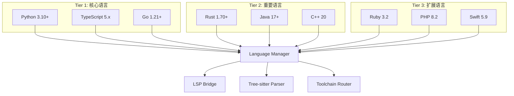
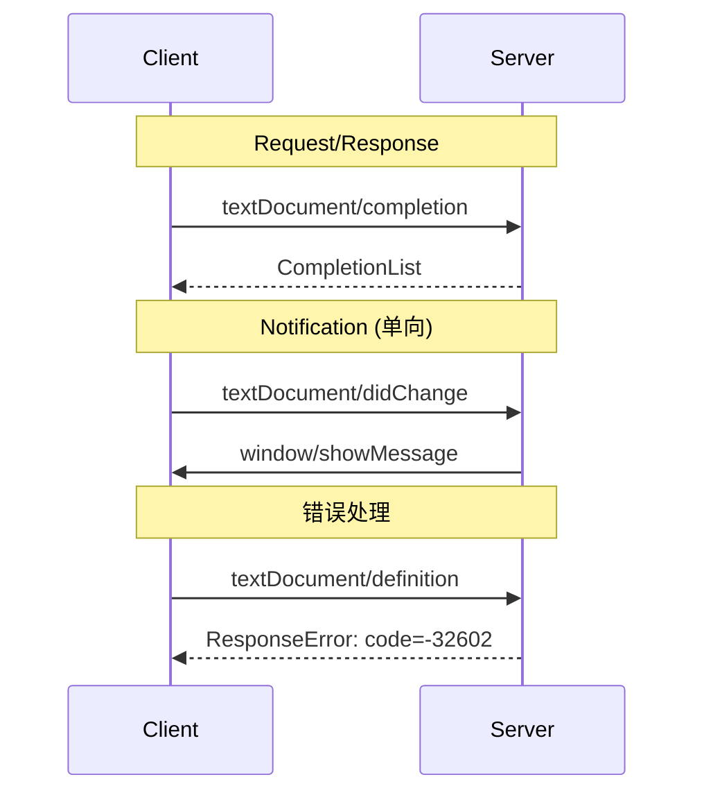
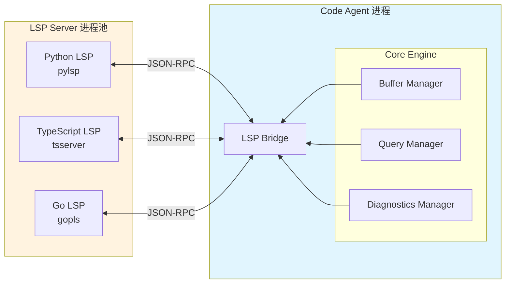
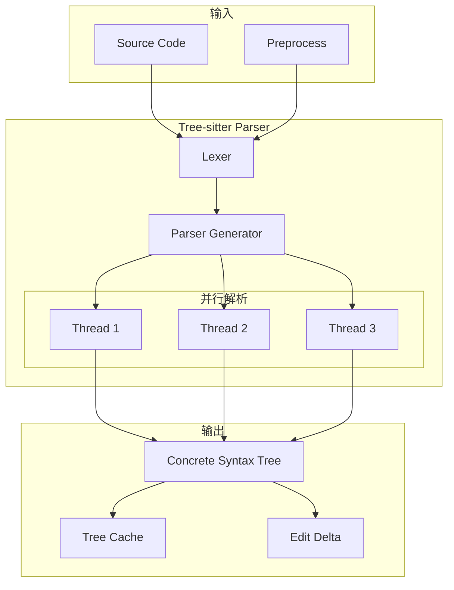
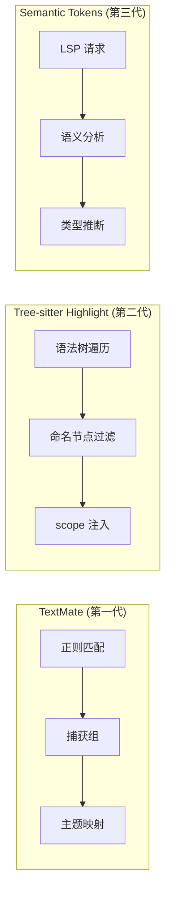
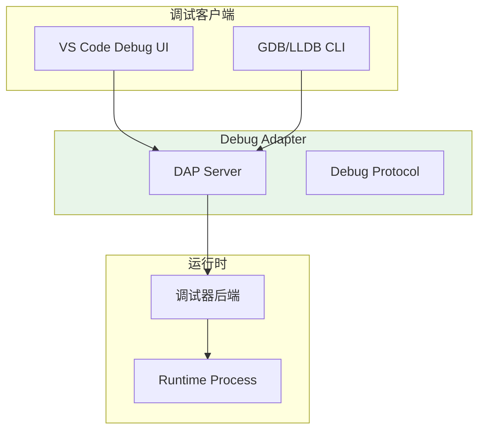
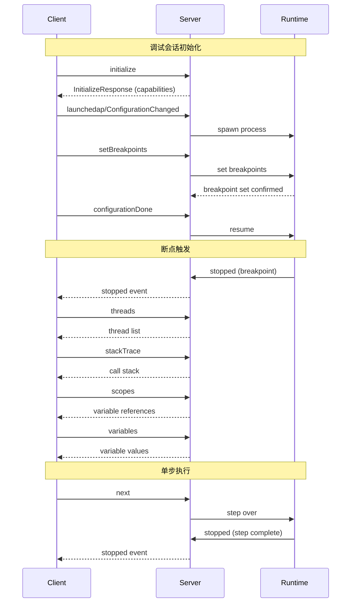
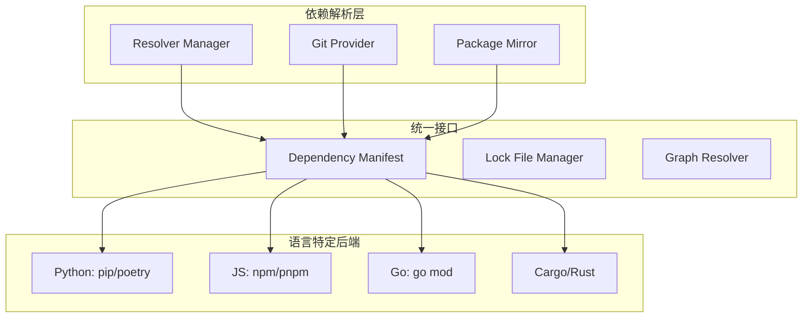
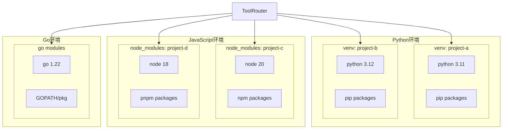
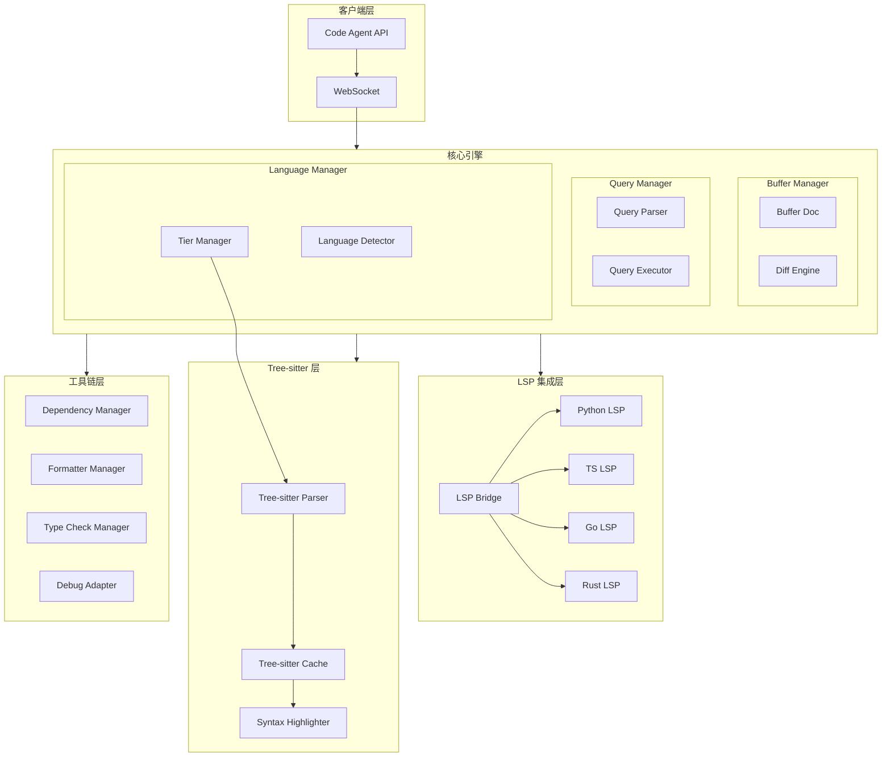

# Code Agent Ch14: 多语言支持与 LSP 集成

## 概述

现代软件开发中，多语言支持已成为 Code Agent 的核心能力需求。一个成熟的 Code Agent 需要同时处理 Python、TypeScript、Go、Rust、Java、C++ 等数十种编程语言，每种语言都有其独特的语法规则、工具链和生态系统。本文以 gsd2 项目为案例，深入剖析多语言支持的技术架构，涵盖 Language Server Protocol (LSP)、Tree-sitter 语法解析、Debug Adapter Protocol (DAP) 及语言特定工具链设计。

## 1. 多语言支持概述

### 1.1 语言分层模型

gsd2 采用三层语言分层模型，借鉴了 Kubernetes 对容器运行时的分级策略：



**Tier 1 语言**享有完整的 LSP 支持、深度 Tree-sitter 集成和实时诊断能力。**Tier 2 语言**提供 LSP 和 Tree-sitter 支持，但诊断可能略有延迟。**Tier 3 语言**主要依赖 Tree-sitter 进行语法解析，工具链集成相对简单。

### 1.2 语言支持策略对比

| 策略维度    | Tier 1          | Tier 2   | Tier 3   |
| ----------- | --------------- | -------- | -------- |
| LSP 支持    | 原生完整        | 官方兼容 | 社区桥接 |
| Tree-sitter | 增量解析        | 完整解析 | 基础解析 |
| 语义高亮    | Semantic tokens | Hybrid   | TextMate |
| 调试支持    | DAP 完整        | DAP 基础 | 无       |
| 工具链      | 原生集成        | 标准集成 | 最小集成 |
| 响应目标    | <50ms           | <200ms   | <500ms   |

### 1.3 语言检测与路由

gsd2 的 Language Manager 使用多级检测策略：

```python
# language_manager.py
from pathlib import Path
from dataclasses import dataclass
from enum import Enum, auto
import re

class LanguageTier(Enum):
    TIER_1 = auto()
    TIER_2 = auto()
    TIER_3 = auto()
    UNKNOWN = auto()

@dataclass
class LanguageInfo:
    id: str              # "python", "typescript", "go"
    tier: LanguageTier
    versions: list[str]  # 支持的版本范围
    lsp: bool            # 是否启用 LSP
    tree_sitter: bool    # 是否启用 Tree-sitter

class LanguageDetector:
    # 文件扩展名到语言的映射
    EXTENSION_MAP = {
        '.py': ('python', LanguageTier.TIER_1),
        '.pyw': ('python', LanguageTier.TIER_1),
        '.ts': ('typescript', LanguageTier.TIER_1),
        '.tsx': ('typescript', LanguageTier.TIER_1),
        '.go': ('go', LanguageTier.TIER_1),
        '.rs': ('rust', LanguageTier.TIER_2),
        '.java': ('java', LanguageTier.TIER_2),
        '.cpp': ('cpp', LanguageTier.TIER_2),
        '.cc': ('cpp', LanguageTier.TIER_2),
        '.cxx': ('cpp', LanguageTier.TIER_2),
        '.rb': ('ruby', LanguageTier.TIER_3),
        '.php': ('php', LanguageTier.TIER_3),
        '.swift': ('swift', LanguageTier.TIER_3),
    }

    # shebang 检测模式
    SHEBANG_PATTERNS = [
        (r'#!/usr/bin/env\s+python', 'python'),
        (r'#!/usr/bin/env\s+node', 'javascript'),
        (r'#!/bin/bash', 'bash'),
        (r'#!/usr/bin/env\s+ruby', 'ruby'),
    ]

    def detect_from_file(self, path: Path) -> LanguageInfo:
        # 1. 扩展名检测
        ext = path.suffix.lower()
        if ext in self.EXTENSION_MAP:
            lang_id, tier = self.EXTENSION_MAP[ext]
            return LanguageInfo(
                id=lang_id,
                tier=tier,
                versions=self._get_default_versions(lang_id),
                lsp=tier in (LanguageTier.TIER_1, LanguageTier.TIER_2),
                tree_sitter=True
            )

        # 2. shebang 检测（用于无扩展名脚本）
        try:
            with open(path, 'rb') as f:
                first_line = f.readline(128)
            text = first_line.decode('utf-8', errors='ignore')
            for pattern, lang in self.SHEBANG_PATTERNS:
                if re.match(pattern, text):
                    return LanguageInfo(
                        id=lang,
                        tier=LanguageTier.TIER_3,
                        versions=[],
                        lsp=False,
                        tree_sitter=True
                    )
        except Exception:
            pass

        return LanguageInfo(
            id='unknown',
            tier=LanguageTier.UNKNOWN,
            versions=[],
            lsp=False,
            tree_sitter=False
        )

    def _get_default_versions(self, lang_id: str) -> list[str]:
        defaults = {
            'python': ['3.10', '3.11', '3.12'],
            'typescript': ['5.0', '5.1', '5.2'],
            'go': ['1.21', '1.22'],
            'rust': ['1.70', '1.71', '1.72'],
            'java': ['17', '21'],
        }
        return defaults.get(lang_id, [])
```

## 2. Language Server Protocol 详解

### 2.1 LSP 的起源与演进

Language Server Protocol 起源于 2016 年，是 Microsoft 为 Visual Studio Code 开发的一套标准协议。LSP 的核心设计理念是**将语言智能服务分离为独立的 LSP Server 进程**，IDE/Editor 通过 JSON-RPC 与其通信：

```
传统模式: IDE → 内置语言引擎 (紧耦合)
           ↓
LSP 模式:  IDE → LSP Client → LSP Server (解耦)
```

LSP 经历了多个版本的演进：

| 版本 | 年份 | 关键特性                        |
| ---- | ---- | ------------------------------- |
| 1.0  | 2016 | 基础协议，诊断/补全/跳转        |
| 2.0  | 2017 | 折叠标记、语法高亮              |
| 3.0  | 2019 | Semantic tokens、Call hierarchy |
| 3.15 | 2020 | Inline value、Notebook 支持     |
| 3.17 | 2023 | Inlay hints、Unchanged lines    |

### 2.2 协议结构解析

LSP 是一个基于 JSON-RPC 2.0 的请求/响应协议。消息分为三类：



**请求消息结构：**

```json
{
  "jsonrpc": "2.0",
  "id": 1,
  "method": "textDocument/definition",
  "params": {
    "textDocument": {
      "uri": "file:///project/main.py"
    },
    "position": {
      "line": 42,
      "character": 10
    }
  }
}
```

**响应消息结构：**

```json
{
  "jsonrpc": "2.0",
  "id": 1,
  "result": {
    "uri": "file:///project/module.py",
    "range": {
      "start": { "line": 10, "character": 0 },
      "end": { "line": 10, "character": 10 }
    }
  }
}
```

### 2.3 LSP 核心能力

LSP 定义了丰富的语言智能服务能力：

**诊断能力 (Diagnostics)**

```json
{
  "method": "textDocument/publishDiagnostics",
  "params": {
    "uri": "file:///project/main.py",
    "diagnostics": [
      {
        "range": {
          "start": { "line": 5, "character": 0 },
          "end": { "line": 5, "character": 15 }
        },
        "severity": 1, // Error=1, Warning=2, Information=3, Hint=4
        "code": "E0602",
        "source": "pylint",
        "message": "Undefined variable 'undefined_var'",
        "tags": [] // 可选: unnecessary, deprecated, incompatible
      }
    ]
  }
}
```

**补全能力 (Completion)**

```json
{
  "method": "textDocument/completion",
  "result": {
    "isIncomplete": false,
    "items": [
      {
        "label": "print",
        "kind": 1, // Method=1, Function=3, Variable=6, Class=7
        "detail": "print(*values: object, sep=' ', end='\\n')",
        "documentation": "Print objects to the text stream.",
        "insertText": "print($1)",
        "insertTextFormat": 2, // Snippet=2, PlainText=1
        "command": {
          "command": "editor.action.triggerParameterHints",
          "arguments": []
        }
      }
    ]
  }
}
```

**跳转到定义 (Goto Definition)**

```typescript
// TypeScript LSP 返回多结果示例
interface LocationLink {
  originSelectionRange?: Range // 可选，选中 origin 时高亮
  targetUri: string
  targetRange: Range // 整个声明范围
  targetSelectionRange: Range // 光标应跳转到的位置
}

// Python 可能返回单个 Location
interface Location {
  uri: string
  range: Range
}
```

## 3. LSP 与 Code Agent 集成

### 3.1 集成架构

gsd2 的 LSP 集成采用**进程隔离 + IPC 通信**模式：



### 3.2 LSP Bridge 实现

```python
# lsp_bridge.py
import asyncio
import json
from pathlib import Path
from typing import Optional, Any
from dataclasses import dataclass, field
from concurrent.futures import ThreadPoolExecutor
import subprocess
import threading
import uuid

@dataclass
class LSPMessage:
    jsonrpc: str = "2.0"
    id: Optional[int | str] = None
    method: Optional[str] = None
    params: Optional[dict] = None

@dataclass
class ServerConfig:
    command: list[str]           # 启动命令，如 ["pylsp"]
    languages: list[str]         # 支持的语言
    root_patterns: list[str]      # 项目根目录标识文件
    initialization_options: dict = field(default_factory=dict)

class LSPServer:
    def __init__(self, config: ServerConfig, workspace_root: Path):
        self.config = config
        self.workspace_root = workspace_root
        self.process: Optional[subprocess.Popen] = None
        self.request_id = 0
        self.pending_requests: dict[str, asyncio.Future] = {}
        self._lock = threading.Lock()

    async def start(self):
        """启动 LSP Server 进程"""
        self.process = await asyncio.create_subprocess_exec(
            *self.config.command,
            cwd=str(self.workspace_root),
            stdin=asyncio.subprocess.PIPE,
            stdout=asyncio.subprocess.PIPE,
            stderr=asyncio.subprocess.PIPE,
        )
        # 启动消息读取循环
        asyncio.create_task(self._read_loop())

        # 发送初始化请求
        await self._send_initialize()

    async def _send_initialize(self):
        """发送 LSP initialize 请求"""
        params = {
            "processId": os.getpid(),
            "rootUri": str(self.workspace_root),
            "rootPath": str(self.workspace_root),
            "capabilities": {
                "textDocument": {
                    "synchronization": {
                        "willSave": True,
                        "didSave": True,
                        "willSaveWaitUntil": True
                    },
                    "completion": {
                        "completionItem": {
                            "snippetSupport": True,
                            "resolveSupport": {"properties": ["documentation", "detail"]}
                        }
                    },
                    "hover": True,
                    "definition": {"dynamicRegistration": True},
                    "typeDefinition": True,
                    "references": True,
                },
                "workspace": {
                    "applyEdit": True,
                    "workspaceFolders": True
                }
            },
            "initializationOptions": self.config.initialization_options
        }
        result = await self.send_request("initialize", params)
        return result

    async def send_request(self, method: str, params: dict) -> Any:
        """发送请求并等待响应"""
        with self._lock:
            req_id = self.request_id
            self.request_id += 1
            msg_id = str(req_id)

        future = asyncio.Future()
        self.pending_requests[msg_id] = future

        message = LSPMessage(
            id=req_id,
            method=method,
            params=params
        )
        await self._send_message(message)

        return await future

    async def send_notification(self, method: str, params: dict):
        """发送通知（无响应）"""
        message = LSPMessage(method=method, params=params)
        await self._send_message(message)

    async def _send_message(self, msg: LSPMessage):
        """发送 JSON-RPC 消息"""
        content = json.dumps({
            "jsonrpc": msg.jsonrpc,
            "id": msg.id,
            "method": msg.method,
            "params": msg.params
        }, ensure_ascii=False)
        header = f"Content-Length: {len(content)}\r\n\r\n"
        self.process.stdin.write((header + content).encode('utf-8'))
        await self.process.stdin.drain()

    async def _read_loop(self):
        """持续读取 LSP Server 响应"""
        buffer = b""
        while self.process and self.process.stdout:
            data = await self.process.stdout.read(4096)
            if not data:
                break
            buffer += data

            while b'\r\n\r\n' in buffer:
                header_end = buffer.index(b'\r\n\r\n')
                header = buffer[:header_end].decode('utf-8')
                content_length = 0
                for line in header.split('\r\n'):
                    if line.startswith('Content-Length:'):
                        content_length = int(line.split(':')[1].strip())

                msg_start = header_end + 4
                if len(buffer) < msg_start + content_length:
                    break

                content = buffer[msg_start:msg_start + content_length]
                buffer = buffer[msg_start + content_length:]

                await self._dispatch(json.loads(content))

    async def _dispatch(self, msg: dict):
        """分发接收到的消息"""
        msg_id = str(msg.get('id', ''))

        if 'result' in msg or 'error' in msg:
            # 响应消息
            if msg_id in self.pending_requests:
                future = self.pending_requests.pop(msg_id)
                if 'error' in msg:
                    future.set_exception(LSPError(msg['error']))
                else:
                    future.set_result(msg['result'])
        else:
            # 通知消息（如 publishDiagnostics）
            method = msg.get('method', '')
            params = msg.get('params', {})
            await self._handle_notification(method, params)

    async def _handle_notification(self, method: str, params: dict):
        """处理服务器发来的通知"""
        handlers = {
            'textDocument/publishDiagnostics': self._handle_diagnostics,
            'window/showMessage': self._handle_show_message,
            'telemetry/event': self._handle_telemetry,
        }
        handler = handlers.get(method)
        if handler:
            await handler(params)

class LSPError(Exception):
    def __init__(self, error: dict):
        self.code = error.get('code', -1)
        self.message = error.get('message', '')
        super().__init__(f"LSP Error {self.code}: {self.message}")

class LSPBridge:
    """LSP 桥接器，管理多个 LSP Server"""

    def __init__(self, workspace_root: Path):
        self.workspace_root = workspace_root
        self.servers: dict[str, LSPServer] = {}
        self._server_configs = self._load_server_configs()

    def _load_server_configs(self) -> dict[str, ServerConfig]:
        return {
            'python': ServerConfig(
                command=['pylsp'],
                languages=['python'],
                root_patterns=['pyproject.toml', 'setup.py', 'requirements.txt'],
                initialization_options={
                    "pylsp": {
                        "plugins": {
                            "pycodestyle": {"enabled": True},
                            "pylint": {"enabled": True},
                        }
                    }
                }
            ),
            'typescript': ServerConfig(
                command=['typescript-language-server', '--stdio'],
                languages=['typescript', 'javascript'],
                root_patterns=['package.json', 'tsconfig.json'],
            ),
            'go': ServerConfig(
                command=['gopls'],
                languages=['go'],
                root_patterns=['go.mod'],
                initialization_options={
                    "gopls": {
                        "buildFlags": [],
                        "env": {}
                    }
                }
            ),
        }

    async def get_server(self, lang_id: str) -> Optional[LSPServer]:
        """获取或启动指定语言的 LSP Server"""
        if lang_id in self.servers:
            return self.servers[lang_id]

        config = self._server_configs.get(lang_id)
        if not config:
            return None

        server = LSPServer(config, self.workspace_root)
        await server.start()
        self.servers[lang_id] = server
        return server

    async def diagnose(self, doc_uri: str, content: str) -> list[Diagnostic]:
        """获取文档诊断信息"""
        # 1. 提取语言
        lang_id = self._uri_to_lang(doc_uri)

        # 2. 获取对应 LSP Server
        server = await self.get_server(lang_id)
        if not server:
            return []

        # 3. 发送 didOpen 通知
        await server.send_notification('textDocument/didOpen', {
            'textDocument': {
                'uri': doc_uri,
                'languageId': lang_id,
                'version': 1,
                'text': content
            }
        })

        # 4. 等待诊断结果（通过通知回调）
        # 实际实现中需要维护诊断缓存
        return []
```

### 3.3 诊断集成

```python
# diagnostics_manager.py
from dataclasses import dataclass
from enum import IntEnum
from typing import Optional
import asyncio

class DiagnosticSeverity(IntEnum):
    ERROR = 1
    WARNING = 2
    INFORMATION = 3
    HINT = 4

@dataclass
class Diagnostic:
    range: tuple[tuple[int, int], tuple[int, int]]  # (start, end)
    severity: DiagnosticSeverity
    code: str
    source: str
    message: str
    tags: list[str] = None

    @property
    def is_error(self) -> bool:
        return self.severity == DiagnosticSeverity.ERROR

class DiagnosticsManager:
    """诊断结果管理器"""

    def __init__(self, lsp_bridge: LSPBridge):
        self.lsp_bridge = lsp_bridge
        self._diagnostics: dict[str, list[Diagnostic]] = {}
        self._subscribers: list[asyncio.Queue] = []

    async def open_document(self, uri: str, lang_id: str, content: str):
        """打开文档并同步诊断"""
        server = await self.lsp_bridge.get_server(lang_id)
        if not server:
            return []

        # 注册诊断回调
        server.on_notification('textDocument/publishDiagnostics',
                               lambda params: self._store_diagnostics(uri, params))

        # 发送文档打开事件
        await server.send_notification('textDocument/didOpen', {
            'textDocument': {
                'uri': uri,
                'languageId': lang_id,
                'version': 1,
                'text': content
            }
        })

        # 等待初始诊断
        await asyncio.sleep(0.5)  # 等待 LSP Server 处理
        return self._diagnostics.get(uri, [])

    def _store_diagnostics(self, uri: str, params: dict):
        """缓存诊断结果"""
        diagnostics = []
        for d in params.get('diagnostics', []):
            rng = d['range']
            diagnostics.append(Diagnostic(
                range=(
                    (rng['start']['line'], rng['start']['character']),
                    (rng['end']['line'], rng['end']['character'])
                ),
                severity=DiagnosticSeverity(d.get('severity', 3)),
                code=str(d.get('code', '')),
                source=d.get('source', ''),
                message=d.get('message', ''),
                tags=d.get('tags', [])
            ))
        self._diagnostics[uri] = diagnostics

        # 通知订阅者
        for queue in self._subscribers:
            queue.put_nowait((uri, diagnostics))

    async def get_diagnostics(self, uri: str) -> list[Diagnostic]:
        """获取文档诊断"""
        return self._diagnostics.get(uri, [])

    def get_error_count(self, uri: str) -> tuple[int, int, int]:
        """统计错误/警告/信息数量"""
        diags = self._diagnostics.get(uri, [])
        errors = sum(1 for d in diags if d.severity == DiagnosticSeverity.ERROR)
        warnings = sum(1 for d in diags if d.severity == DiagnosticSeverity.WARNING)
        infos = sum(1 for d in diags if d.severity == DiagnosticSeverity.INFORMATION)
        return errors, warnings, infos
```

### 3.4 补全与跳转

```python
# completion_provider.py
from dataclasses import dataclass
from typing import Optional
import asyncio

@dataclass
class CompletionItem:
    label: str
    kind: int                    # 1=Text, 2=Method, 3=Function, 6=Variable, 7=Class
    detail: Optional[str] = None
    documentation: Optional[str] = None
    insert_text: Optional[str] = None
    insert_text_format: int = 1  # 1=PlainText, 2=Snippet
    commit_characters: list[str] = None

@dataclass
class CompletionResult:
    is_incomplete: bool
    items: list[CompletionItem]

class CompletionProvider:
    """通过 LSP 获取补全项"""

    def __init__(self, lsp_bridge: LSPBridge):
        self.lsp_bridge = lsp_bridge

    async def get_completions(
        self,
        uri: str,
        lang_id: str,
        position: tuple[int, int],
        trigger_character: Optional[str] = None
    ) -> CompletionResult:
        server = await self.lsp_bridge.get_server(lang_id)
        if not server:
            return CompletionResult(is_incomplete=True, items=[])

        # 发送补全请求
        params = {
            'textDocument': {'uri': uri},
            'position': {'line': position[0], 'character': position[1]},
        }

        result = await server.send_request('textDocument/completion', params)

        if not result:
            return CompletionResult(is_incomplete=False, items=[])

        items = []
        # 处理两种响应格式：CompletionList 或 CompletionItem[]
        item_list = result.get('items', result) if isinstance(result, dict) else result

        for item in item_list:
            items.append(CompletionItem(
                label=item['label'],
                kind=item.get('kind', 1),
                detail=item.get('detail'),
                documentation=item.get('documentation', {}).get('value') if isinstance(item.get('documentation'), dict) else item.get('documentation'),
                insert_text=item.get('insertText', item['label']),
                insert_text_format=item.get('insertTextFormat', 1),
                commit_characters=item.get('commitCharacters')
            ))

        return CompletionResult(
            is_incomplete=result.get('isIncomplete', False) if isinstance(result, dict) else False,
            items=items
        )

# definition_resolver.py
from typing import Optional

@dataclass
class Location:
    uri: str
    range: tuple[tuple[int, int], tuple[int, int]]

class DefinitionResolver:
    """通过 LSP 解析定义位置"""

    def __init__(self, lsp_bridge: LSPBridge):
        self.lsp_bridge = lsp_bridge

    async def goto_definition(
        self,
        uri: str,
        lang_id: str,
        position: tuple[int, int]
    ) -> list[Location]:
        server = await self.lsp_bridge.get_server(lang_id)
        if not server:
            return []

        params = {
            'textDocument': {'uri': uri},
            'position': {'line': position[0], 'character': position[1]}
        }

        result = await server.send_request('textDocument/definition', params)

        if not result:
            return []

        locations = []
        # 处理单个 Location 或 LocationLink[]
        results = result if isinstance(result, list) else [result]

        for r in results:
            rng = r.get('range', r.get('targetSelectionRange', {}))
            locations.append(Location(
                uri=r['uri'],
                range=(
                    (rng['start']['line'], rng['start']['character']),
                    (rng['end']['line'], rng['end']['character'])
                )
            ))

        return locations

    async def find_references(
        self,
        uri: str,
        lang_id: str,
        position: tuple[int, int],
        include_declaration: bool = False
    ) -> list[Location]:
        """查找引用"""
        server = await self.lsp_bridge.get_server(lang_id)
        if not server:
            return []

        params = {
            'textDocument': {'uri': uri},
            'position': {'line': position[0], 'character': position[1]},
            'context': {'includeDeclaration': include_declaration}
        }

        result = await server.send_request('textDocument/references', params)

        if not result:
            return []

        locations = []
        for r in result:
            rng = r['range']
            locations.append(Location(
                uri=r['uri'],
                range=(
                    (rng['start']['line'], rng['start']['character']),
                    (rng['end']['line'], rng['end']['character'])
                )
            ))

        return locations
```

## 4. Tree-sitter 多语言实现

### 4.1 Tree-sitter 架构

Tree-sitter 是 GitHub 开发的一款增量解析器，专注于生成精确的语法树。与传统解析器不同，Tree-sitter 具有以下特性：

1. **增量解析**：只重新解析修改的部分，而非整个文件
2. **错误容忍**：即使源码有语法错误，仍能生成部分树
3. **无锁并行**：多线程安全解析
4. **跨语言统一 API**：一致的接口支持 30+ 语言



### 4.2 Tree-sitter Python 集成

```python
# tree_sitter_manager.py
import tree_sitter
from tree_sitter_languages import get_parser, get_language, Language
from dataclasses import dataclass
from typing import Optional, Iterator
import threading

@dataclass
class ParseResult:
    tree: tree_sitter.Tree
    root_node: tree_sitter.Node
    source: bytes
    language: str

@dataclass
class NodeQuery:
    node_type: str
    named: bool = True
    start_byte: Optional[int] = None
    end_byte: Optional[int] = None

class TreeSitterManager:
    """Tree-sitter 多语言解析管理器"""

    # 预加载的语言解析器
    _parsers: dict[str, tree_sitter.Parser] = {}
    _lock = threading.Lock()

    def __init__(self):
        self._cache: dict[str, ParseResult] = {}
        self._cache_lock = threading.Lock()
        self._max_cache_size = 1000

    @classmethod
    def get_parser(cls, language: str) -> tree_sitter.Parser:
        """获取或创建语言解析器"""
        with cls._lock:
            if language not in cls._parsers:
                parser = tree_sitter.Parser()
                lang = get_language(language)
                parser.set_language(lang)
                cls._parsers[language] = parser
            return cls._parsers[language]

    def parse_file(
        self,
        file_path: str,
        language: str,
        content: Optional[bytes] = None
    ) -> ParseResult:
        """解析文件"""
        parser = self.get_parser(language)

        if content is None:
            with open(file_path, 'rb') as f:
                content = f.read()

        # 增量解析：检查缓存
        cached = self._get_cached(file_path, language)

        if cached and cached.source == content:
            return cached

        # 执行解析
        tree = parser.parse(content)
        result = ParseResult(
            tree=tree,
            root_node=tree.root_node,
            source=content,
            language=language
        )

        # 更新缓存
        self._update_cache(file_path, language, result)

        return result

    def parse增量(self, old_result: ParseResult, new_content: bytes) -> ParseResult:
        """增量解析：基于旧树只解析修改部分"""
        parser = self.get_parser(old_result.language)

        # 获取编辑范围
        old_source = old_result.source
        edit_start = 0
        edit_end = len(old_source)

        # 找到第一个不同的字节
        min_len = min(len(old_source), len(new_content))
        while edit_start < min_len and old_source[edit_start] == new_content[edit_start]:
            edit_start += 1

        # 找到最后一个不同的字节
        while edit_end > edit_start and old_source[edit_end - 1] == new_content[edit_end - 1]:
            edit_end -= 1

        # 创建编辑
        edit = tree_sitter.TreeDelta(
            start_byte=edit_start,
            old_end_byte=edit_end,
            new_end_byte=len(new_content),
            start_point=point_from_offset(old_source, edit_start),
            old_end_point=point_from_offset(old_source, edit_end),
            new_end_point=point_from_offset(new_content, len(new_content))
        )

        # 应用增量编辑
        tree = old_result.tree.edit(edit)
        tree = parser.parse(new_content, tree)

        return ParseResult(
            tree=tree,
            root_node=tree.root_node,
            source=new_content,
            language=old_result.language
        )

    def query_nodes(
        self,
        result: ParseResult,
        query: NodeQuery
    ) -> Iterator[tree_sitter.Node]:
        """查询特定类型的节点"""
        def walk(node: tree_sitter.Node):
            if node.type == query.node_type:
                if not query.named or node.is_named:
                    if query.start_byte is None or node.start_byte >= query.start_byte:
                        if query.end_byte is None or node.end_byte <= query.end_byte:
                            yield node
            for child in node.children:
                yield from walk(child)

        yield from walk(result.root_node)

    def get_function_defs(self, result: ParseResult) -> list[tree_sitter.Node]:
        """获取所有函数定义"""
        functions = []
        for node in self.query_nodes(result, NodeQuery('function_definition')):
            # 提取函数名
            name_node = None
            for child in node.children:
                if child.type == 'identifier':
                    name_node = child
                    break
            if name_node:
                functions.append({
                    'name': result.source[name_node.start_byte:name_node.end_byte].decode('utf-8'),
                    'node': node,
                    'range': (node.start_point, node.end_point)
                })
        return functions

    def get_imports(self, result: ParseResult) -> list[dict]:
        """获取所有 import 语句"""
        imports = []

        # Python import 模式
        for node in self.query_nodes(result, NodeQuery('import_statement')):
            modules = []
            for child in node.children:
                if child.type == 'dotted_name':
                    modules.append(
                        result.source[child.start_byte:child.end_byte].decode('utf-8')
                    )
                elif child.type == 'identifier':
                    modules.append(
                        result.source[child.start_byte:child.end_byte].decode('utf-8')
                    )
            imports.append({
                'type': 'import',
                'modules': modules,
                'node': node
            })

        # Python from...import 模式
        for node in self.query_nodes(result, NodeQuery('import_from_statement')):
            module = None
            names = []
            for child in node.children:
                if child.type == 'dotted_name':
                    module = result.source[child.start_byte:child.end_byte].decode('utf-8')
                elif child.type == 'identifier':
                    names.append(result.source[child.start_byte:child.end_byte].decode('utf-8'))
            imports.append({
                'type': 'from_import',
                'module': module,
                'names': names,
                'node': node
            })

        return imports

def point_from_offset(source: bytes, offset: int) -> tuple[int, int]:
    """将字节偏移转换为 (row, col)"""
    lines = source[:offset].split(b'\n')
    row = len(lines) - 1
    col = len(lines[-1]) if lines else 0
    return (row, col)
```

### 4.3 调用图分析

```python
# call_graph.py
from dataclasses import dataclass, field
from typing import Optional
import tree_sitter

@dataclass
class CallNode:
    name: str
    uri: str
    range: tuple[tuple[int, int], tuple[int, int]]
    node: tree_sitter.Node

@dataclass
class CallGraph:
    """函数调用图"""
    nodes: dict[str, CallNode] = field(default_factory=dict)
    edges: list[tuple[str, str]] = field(default_factory=list)  # (caller, callee)

    def add_node(self, name: str, node: CallNode):
        self.nodes[name] = node

    def add_edge(self, caller: str, callee: str):
        if caller in self.nodes and callee in self.nodes:
            self.edges.append((caller, callee))

    def get_callees(self, func_name: str) -> list[CallNode]:
        """获取函数调用的所有函数"""
        callees = []
        for caller, callee in self.edges:
            if caller == func_name:
                if callee in self.nodes:
                    callees.append(self.nodes[callee])
        return callees

    def get_callers(self, func_name: str) -> list[CallNode]:
        """获取调用该函数的所有函数"""
        callers = []
        for caller, callee in self.edges:
            if callee == func_name:
                if caller in self.nodes:
                    callers.append(self.nodes[caller])
        return callers

class CallGraphBuilder:
    """基于 Tree-sitter 构建调用图"""

    def __init__(self, ts_manager: TreeSitterManager):
        self.ts_manager = ts_manager

    def build_from_file(self, file_path: str, language: str) -> CallGraph:
        """为单个文件构建调用图"""
        result = self.ts_manager.parse_file(file_path, language)
        graph = CallGraph()

        if language == 'python':
            self._build_python_graph(result, graph)
        elif language == 'typescript':
            self._build_typescript_graph(result, graph)
        elif language == 'go':
            self._build_go_graph(result, graph)

        return graph

    def _build_python_graph(self, result: ParseResult, graph: CallGraph):
        """构建 Python 调用图"""
        source = result.source

        # 获取所有函数定义
        for node in result.root_node.children:
            if node.type == 'function_definition':
                name_node = self._get_child(node, 'identifier')
                if name_node:
                    name = source[name_node.start_byte:name_node.end_byte].decode('utf-8')
                    graph.add_node(name, CallNode(
                        name=name,
                        uri=result.source.decode('utf-8'),
                        range=(node.start_point, node.end_point),
                        node=node
                    ))

        # 获取所有函数调用
        for node in result.root_node.children:
            if node.type == 'function_definition':
                func_name = self._get_function_name(result, node)
                self._find_calls_in_function(result, node, func_name, graph)

    def _get_function_name(self, result: ParseResult, func_node: tree_sitter.Node) -> str:
        """获取函数名"""
        for child in func_node.children:
            if child.type == 'identifier':
                return result.source[child.start_byte:child.end_byte].decode('utf-8')
        return ''

    def _find_calls_in_function(
        self,
        result: ParseResult,
        func_node: tree_sitter.Node,
        func_name: str,
        graph: CallGraph
    ):
        """在函数体中查找函数调用"""
        source = result.source

        def walk(n: tree_sitter.Node):
            if n.type == 'call':
                # 调用表达式: function_name (args)
                func_part = self._get_child(n, 'attribute') or self._get_child(n, 'identifier')
                if func_part and func_part.type == 'identifier':
                    callee_name = source[func_part.start_byte:func_part.end_byte].decode('utf-8')
                    graph.add_edge(func_name, callee_name)

            for child in n.children:
                walk(child)

        # 找到函数体（跳过 def 语句本身）
        in_body = False
        for child in func_node.children:
            if in_body:
                walk(child)
            if child.type == ':':
                in_body = True

    def _get_child(self, node: tree_sitter.Node, child_type: str) -> Optional[tree_sitter.Node]:
        """获取特定类型的子节点"""
        for child in node.children:
            if child.type == child_type:
                return child
        return None
```

## 5. 语法高亮

### 5.1 语法高亮演进

语法高亮经历了三代技术演进：

| 世代   | 技术            | 特点             | 性能   |
| ------ | --------------- | ---------------- | ------ |
| 第一代 | TextMate        | 正则表达式，静态 | 快     |
| 第二代 | Tree-sitter     | 语法树感知，精确 | 中     |
| 第三代 | Semantic Tokens | LSP 驱动，语义级 | 慢但准 |



### 5.2 TextMate 语法

TextMate 使用 `tmLanguage.json` 定义语法规则：

```json
{
  "name": "Python",
  "scopeName": "source.python",
  "fileTypes": ["py", "pyw", "pyi"],
  "patterns": [
    {
      "name": "comment.line.number-sign.python",
      "match": "#.*$"
    },
    {
      "name": "string.quoted.double.python",
      "begin": "\"\"\"",
      "end": "\"\"\"",
      "patterns": [{ "name": "constant.character.escape.python", "match": "\\\\." }]
    },
    {
      "name": "keyword.control.python",
      "match": "\\b(if|elif|else|for|while|try|except|finally|with|def|class|return|yield|import|from|as|pass|break|continue|raise|assert|lambda|and|or|not|in|is|global|nonlocal|True|False|None)\\b"
    },
    {
      "name": "support.function.builtin.python",
      "match": "\\b(print|len|range|str|int|float|list|dict|set|tuple|open|input|isinstance|type|super|self|cls)\\b"
    },
    {
      "name": "meta.function.python",
      "begin": "(?<=def\\s)[a-zA-Z_][a-zA-Z0-9_]*(?=\\s*\\()",
      "beginCaptures": {
        "0": { "name": "entity.name.function.python" }
      }
    }
  ]
}
```

### 5.3 Tree-sitter Highlight

Tree-sitter 的高亮系统使用查询语言：

```python
# tree_sitter_highlight.py
from tree_sitter_languages import get_language
import subprocess
from typing import list

# Python 高亮查询文件 (highlights.scm)
HIGHLIGHT_QUERIES = {
    'python': '''
        (comment) @comment
        (string) @string
        (integer) @number
        (float) @number

        (function_definition
          name: (identifier) @function)

        (class_definition
          name: (identifier) @type)

        (call
          function: (identifier) @function.call)

        (attribute
          attribute: (identifier) @property)

        "if" @keyword.control
        "elif" @keyword.control
        "else" @keyword.control
        "for" @keyword.control
        "while" @keyword.control
        "def" @keyword
        "class" @keyword
        "return" @keyword
        "import" @keyword
        "from" @keyword
        "as" @keyword
        "try" @keyword.control
        "except" @keyword.control
        "finally" @keyword.control
        "raise" @keyword
        "with" @keyword
        "lambda" @keyword

        (identifier) @variable
        (type) @type
    ''',
    'typescript': '''
        (comment) @comment
        (string) @string
        (number) @number
        (true) @constant
        (false) @constant

        (function_declaration
          name: (identifier) @function)

        (method_definition
          name: (property_identifier) @function)

        (class_declaration
          name: (type_identifier) @type)

        (interface_declaration
          name: (type_identifier) @type)

        (variable_declarator
          name: (identifier) @variable)

        "if" @keyword.control
        "else" @keyword.control
        "for" @keyword.control
        "while" @keyword.control
        "function" @keyword
        "return" @keyword
        "const" @keyword
        "let" @keyword
        "var" @keyword
        "class" @keyword
        "extends" @keyword
        "implements" @keyword
        "import" @keyword
        "export" @keyword
        "from" @keyword
        "type" @keyword
        "interface" @keyword
    '''
}

@dataclass
class HighlightRange:
    start: tuple[int, int]  # (row, col)
    end: tuple[int, int]
    scope: str

class TreeSitterHighlighter:
    """基于 Tree-sitter 的语法高亮"""

    def __init__(self):
        self._parsers: dict[str, Any] = {}

    def highlight(self, source: bytes, language: str) -> list[HighlightRange]:
        """生成高亮范围列表"""
        query_str = HIGHLIGHT_QUERIES.get(language, '')
        if not query_str:
            return []

        parser = TreeSitterManager.get_parser(language)
        tree = parser.parse(source)

        language_obj = get_language(language)
        query = language_obj.query(query_str)

        captures = query.captures(tree.root_node)

        highlights = []
        for node, capture_name in captures:
            highlights.append(HighlightRange(
                start=node.start_point,
                end=node.end_point,
                scope=capture_name
            ))

        # 按位置排序
        highlights.sort(key=lambda h: (h.start[0], h.start[1]))

        return highlights

    def generate_html(self, source: str, language: str) -> str:
        """生成 HTML 高亮输出（用于调试）"""
        source_bytes = source.encode('utf-8')
        highlights = self.highlight(source_bytes, language)

        # scope 到 CSS class 的映射
        scope_map = {
            'comment': 'hl-comment',
            'string': 'hl-string',
            'number': 'hl-number',
            'function': 'hl-function',
            'function.call': 'hl-function',
            'type': 'hl-type',
            'variable': 'hl-variable',
            'keyword': 'hl-keyword',
            'keyword.control': 'hl-keyword',
            'constant': 'hl-constant',
            'property': 'hl-property',
        }

        html_parts = []
        last_end = (0, 0)

        for hl in highlights:
            # 添加前缀
            if hl.start > last_end:
                prefix = source[point_to_offset(source, last_end):point_to_offset(source, hl.start)]
                html_parts.append(self._escape_html(prefix))

            # 添加高亮部分
            text = source[point_to_offset(source, hl.start):point_to_offset(source, hl.end)]
            css_class = scope_map.get(hl.scope, 'hl-default')
            html_parts.append(f'<span class="{css_class}">{self._escape_html(text)}</span>')

            last_end = hl.end

        # 添加后缀
        if last_end < (len(source.splitlines()), len(source.splitlines()[-1])):
            suffix = source[point_to_offset(source, last_end):]
            html_parts.append(self._escape_html(suffix))

        return ''.join(html_parts)

    def _escape_html(self, text: str) -> str:
        return text.replace('&', '&amp;').replace('<', '&lt;').replace('>', '&gt;')

def point_to_offset(text: str, point: tuple[int, int]) -> int:
    """(row, col) -> 字符偏移"""
    lines = text.split('\n')
    offset = sum(len(lines[i]) + 1 for i in range(point[0]))
    return offset + point[1]
```

### 5.4 Semantic Tokens

Semantic Tokens 是 LSP 3.16 引入的高亮机制，提供语义级别的精确高亮：

```typescript
// semantic_tokens_provider.ts
interface SemanticTokensParams {
  textDocument: TextDocumentIdentifier
  range?: Range // 可选，局部刷新
}

interface SemanticTokensResult {
  data: number[] // delta 编码的 token 数组
  resultId?: string // 用于增量更新
}

// Token 格式 (data 数组每 5 个元素为一个 token):
// [deltaLine, deltaStart, length, tokenType, tokenModifiers]
//
// tokenType 映射 (示例):
// enum TokenType {
const TokenType = {
  0: "namespace",
  1: "type",
  2: "class",
  3: "enum",
  4: "interface",
  5: "struct",
  6: "typeParameter",
  7: "parameter",
  8: "variable",
  9: "property",
  10: "enumMember",
  11: "function",
  12: "method",
  13: "keyword",
  14: "modifier",
  15: "comment",
  16: "string",
  17: "number",
  18: "regexp",
  19: "operator",
}

class SemanticTokensManager {
  private lspBridge: LSPBridge
  private cache: Map<string, { resultId: string; data: number[] }> = new Map()

  async getTokens(uri: string, langId: string, range?: Range): Promise<number[]> {
    const server = await this.lspBridge.getServer(langId)
    if (!server) return []

    // 尝试增量获取
    const cached = this.cache.get(uri)
    const params: SemanticTokensParams = {
      textDocument: { uri },
      range,
    }

    if (cached) {
      // 尝试获取完整 token 列表
      const result = await server.sendRequest("workspace/semanticTokens/refresh", null)
      if (result) {
        // 服务器可能返回新的 resultId
      }
    }

    const result = await server.sendRequest("textDocument/semanticTokens/full", params)

    if (result) {
      this.cache.set(uri, { resultId: result.resultId, data: result.data })
    }

    return result?.data || []
  }

  decodeTokens(data: number[]): Array<{
    deltaLine: number
    deltaStart: number
    length: number
    tokenType: string
    tokenModifiers: string[]
  }> {
    const tokens = []
    let line = 0
    let start = 0

    for (let i = 0; i < data.length; i += 5) {
      const [deltaLine, deltaStart, length, tokenType, tokenModifiers] = data.slice(i, i + 5)

      line += deltaLine
      start = deltaStart

      tokens.push({
        deltaLine: line,
        deltaStart: start,
        length,
        tokenType: TokenType[tokenType] || "unknown",
        tokenModifiers: this.decodeModifiers(tokenModifiers),
      })
    }

    return tokens
  }

  private decodeModifiers(modifiers: number): string[] {
    const modifierNames = [
      "declaration",
      "definition",
      "readonly",
      "static",
      "deprecated",
      "abstract",
      "async",
      "modification",
    ]

    const result = []
    for (let i = 0; i < modifierNames.length; i++) {
      if (modifiers & (1 << i)) {
        result.push(modifierNames[i])
      }
    }
    return result
  }
}
```

### 5.5 高亮策略对比

| 维度     | TextMate   | Tree-sitter | Semantic Tokens |
| -------- | ---------- | ----------- | --------------- |
| 精确度   | 正则级别   | 语法级别    | 语义级别        |
| 性能     | 最快       | 快          | 慢              |
| 类型信息 | 无         | 无          | 有              |
| 增量更新 | 否         | 是          | 部分            |
| 跨文件   | 否         | 否          | 是              |
| 错误容忍 | 中         | 高          | 高              |
| 适用场景 | 编辑器启动 | 实时渲染    | IDE 深度分析    |

## 6. 调试协议 DAP

### 6.1 Debug Adapter Protocol 概述

DAP (Debug Adapter Protocol) 与 LSP 设计理念相似，将调试器功能抽象为独立的 DAP Server：



### 6.2 DAP 核心消息流



### 6.3 DAP 协议结构

```typescript
// dap_messages.ts

// 1. 初始化请求
interface InitializeRequest {
  command: "initialize"
  arguments: {
    clientID?: string
    clientName?: string
    adapterID: string
    locale: string
    linesStartAt1: boolean
    columnsStartAt1: boolean
    pathFormat: "path" | "uri"
    supportsVariableType: boolean
    supportsVariablePaging: boolean
    supportsRunInTerminalRequest: boolean
    supportsMemoryReferences: boolean
    supportsProgressReporting: boolean
    supportsInvalidatedEvent: boolean
  }
}

// 2. 启动配置
interface LaunchRequest {
  command: "launch"
  arguments: {
    noDebug?: boolean
    program: string
    args?: string[]
    cwd?: string
    env?: Record<string, string>
    terminal?: "integrated" | "external" | "console"
    debuggingType?: "python" | "node" | "cppdbg"
    justMyCode?: boolean // Python 专用
    dart: boolean
  }
}

// 3. 断点设置
interface SetBreakpointsRequest {
  command: "setBreakpoints"
  arguments: {
    source: Source
    breakpoints?: SourceBreakpoint[]
    lines?: number[]
    sourceModified?: boolean
  }
}

interface SourceBreakpoint {
  line: number
  column?: number
  condition?: string
  hitCondition?: string
  logMessage?: string
}

// 4. 线程信息
interface ThreadsRequest {
  command: "threads"
}

interface ThreadsResponse {
  threads: Thread[]
}

interface Thread {
  id: number
  name: string
}

// 5. 栈帧
interface StackTraceRequest {
  command: "stackTrace"
  arguments: {
    threadId: number
    startFrame?: number
    levels?: number
    format?: StackFrameFormat
  }
}

interface StackFrame {
  id: number
  name: string
  source?: Source
  line: number
  column: number
  endLine?: number
  endColumn?: number
}

// 6. 变量
interface ScopesRequest {
  command: "scopes"
  arguments: { frameId: number }
}

interface Scope {
  variablesReference: number
  name: string
  expensive: boolean
  source?: Source
  line?: number
  column?: number
  endLine?: number
  endColumn?: number
}

interface VariablesRequest {
  command: "variables"
  arguments: {
    variablesReference: number
    filter?: "indexed" | "named"
    start?: number
    count?: number
  }
}

interface Variable {
  name: string
  value: string
  type?: string
  variablesReference: number // 子变量引用
  namedVariables?: number
  indexedVariables?: number
}
```

### 6.4 DAP 与 Code Agent 集成

```python
# dap_bridge.py
import asyncio
import json
from dataclasses import dataclass
from typing import Optional, Callable
from enum import Enum

class StopReason(Enum):
    STEP_END = "stepEnd"
    BREAKPOINT = "breakpoint"
    EXCEPTION = "exception"
    PAUSE = "pause"
    ENTRY = "entry"

@dataclass
class ThreadInfo:
    id: int
    name: str

@dataclass
class StackFrame:
    id: int
    name: str
    source: Optional[str]
    line: int
    column: int

@dataclass
class Variable:
    name: str
    value: str
    type: Optional[str]
    reference: int

class DAPServer:
    """DAP Server 连接器"""

    def __init__(self, debug_adapter_path: str):
        self.adapter_path = debug_adapter_path
        self.process: Optional[asyncio.subprocess.Popen] = None
        self.request_id = 0
        self.pending: dict[int, asyncio.Future] = {}
        self._event_handlers: dict[str, list[Callable]] = {}
        self.seq = 0

    async def start(self):
        """启动调试适配器"""
        self.process = await asyncio.create_subprocess_exec(
            self.adapter_path,
            stdin=asyncio.subprocess.PIPE,
            stdout=asyncio.subprocess.PIPE,
        )
        asyncio.create_task(self._read_loop())

        # 初始化
        caps = await self.send_request('initialize', {
            'adapterID': 'gsd2-agent',
            'pathFormat': 'path',
            'linesStartAt1': True,
            'columnsStartAt1': True,
        })
        return caps

    async def launch(self, config: dict) -> bool:
        """启动调试会话"""
        result = await self.send_request('launch', config)
        return result is not None

    async def send_request(self, command: str, args: dict) -> dict:
        """发送请求并等待响应"""
        self.seq += 1
        req_id = self.seq

        future = asyncio.Future()
        self.pending[req_id] = future

        msg = {
            'command': command,
            'type': 'request',
            'seq': req_id,
            'arguments': args
        }

        content = json.dumps(msg)
        header = f"Content-Length: {len(content)}\r\n\r\n"
        self.process.stdin.write((header + content).encode())
        await self.process.stdin.drain()

        return await future

    async def _read_loop(self):
        """读取 DAP 响应和事件"""
        buffer = b""
        while self.process:
            data = await self.process.stdout.read(4096)
            if not data:
                break
            buffer += data

            while b'\r\n\r\n' in buffer:
                header_end = buffer.index(b'\r\n\r\n')
                header = buffer[:header_end].decode()
                content_length = 0
                for line in header.split('\r\n'):
                    if line.startswith('Content-Length:'):
                        content_length = int(line.split(':')[1])

                msg_start = header_end + 4
                if len(buffer) < msg_start + content_length:
                    break

                content = buffer[msg_start:msg_start + content_length]
                buffer = buffer[msg_start + content_length:]

                msg = json.loads(content)
                await self._dispatch(msg)

    async def _dispatch(self, msg: dict):
        """分发消息"""
        msg_type = msg.get('type')

        if msg_type == 'response':
            req_seq = msg.get('request_seq')
            if req_seq in self.pending:
                future = self.pending.pop(req_seq)
                if 'body' in msg:
                    future.set_result(msg['body'])
                elif 'success' in msg and not msg['success']:
                    future.set_exception(Exception(msg.get('message', 'Error')))
                else:
                    future.set_result(None)

        elif msg_type == 'event':
            event_type = msg.get('event')
            body = msg.get('body', {})

            if event_type in self._event_handlers:
                for handler in self._event_handlers[event_type]:
                    await handler(body)

    def on_event(self, event_type: str, handler: Callable):
        """注册事件处理器"""
        if event_type not in self._event_handlers:
            self._event_handlers[event_type] = []
        self._event_handlers[event_type].append(handler)

class DebugSession:
    """调试会话管理器"""

    def __init__(self, dap_server: DAPServer):
        self.dap = dap_server
        self.threads: dict[int, ThreadInfo] = {}
        self.frames: dict[int, StackFrame] = {}
        self.variables: dict[int, list[Variable]] = {}
        self._breakpoint_id = 0

    async def start_python_debug(self, script_path: str, args: list[str] = None):
        """启动 Python 调试"""
        # 初始化
        await self.dap.start()

        # 配置断点处理
        self.dap.on_event('stopped', self._on_stopped)
        self.dap.on_event('breakpoint', self._on_breakpoint)
        self.dap.on_event('output', self._on_output)

        # 启动
        config = {
            'type': 'python',
            'request': 'launch',
            'program': script_path,
            'args': args or [],
            'justMyCode': False,
            'RedirectOutput': True,
        }

        await self.dap.launch(config)

    async def set_breakpoint(self, source: str, line: int, condition: str = None):
        """设置断点"""
        breakpoints = [{'line': line}]
        if condition:
            breakpoints[0]['condition'] = condition

        result = await self.dap.send_request('setBreakpoints', {
            'source': {'path': source},
            'breakpoints': breakpoints
        })

        return result.get('breakpoints', [])

    async def continue_debug(self):
        """继续执行"""
        thread_id = self._get_active_thread()
        await self.dap.send_request('continue', {'threadId': thread_id})

    async def step_over(self):
        """单步跳过"""
        thread_id = self._get_active_thread()
        await self.dap.send_request('next', {'threadId': thread_id})

    async def step_into(self):
        """单步进入"""
        thread_id = self._get_active_thread()
        await self.dap.send_request('stepIn', {'threadId': thread_id})

    async def step_out(self):
        """单步跳出"""
        thread_id = self._get_active_thread()
        await self.dap.send_request('stepOut', {'threadId': thread_id})

    async def get_stack_trace(self, thread_id: int = None) -> list[StackFrame]:
        """获取调用栈"""
        if thread_id is None:
            thread_id = self._get_active_thread()

        result = await self.dap.send_request('stackTrace', {
            'threadId': thread_id,
            'levels': 20
        })

        frames = []
        for f in result.get('stackFrames', []):
            frames.append(StackFrame(
                id=f['id'],
                name=f['name'],
                source=f.get('source', {}).get('path'),
                line=f['line'],
                column=f['column']
            ))

        return frames

    async def get_variables(self, frame_id: int = None, scope_name: str = 'Locals'):
        """获取变量"""
        if frame_id is None:
            frame_id = self._get_active_frame()

        # 获取 scope
        scopes = await self.dap.send_request('scopes', {'frameId': frame_id})

        for scope in scopes.get('scopes', []):
            if scope['name'] == scope_name:
                vars_result = await self.dap.send_request('variables', {
                    'variablesReference': scope['variablesReference']
                })

                variables = []
                for v in vars_result.get('variables', []):
                    variables.append(Variable(
                        name=v['name'],
                        value=v['value'],
                        type=v.get('type'),
                        reference=v.get('variablesReference', 0)
                    ))

                return variables

        return []

    def _get_active_thread(self) -> int:
        """获取当前线程"""
        return list(self.threads.keys())[0] if self.threads else 0

    def _get_active_frame(self) -> int:
        """获取当前栈帧"""
        return list(self.frames.keys())[0] if self.frames else 0

    async def _on_stopped(self, body: dict):
        """停止事件处理"""
        thread_id = body.get('threadId')
        reason = body.get('reason')

        if thread_id:
            self.threads[thread_id] = ThreadInfo(id=thread_id, name=f"Thread {thread_id}")

        # 获取栈帧
        if thread_id:
            frames = await self.get_stack_trace(thread_id)
            for i, f in enumerate(frames):
                self.frames[f.id] = f

    async def _on_breakpoint(self, body: dict):
        """断点命中事件"""
        pass

    async def _on_output(self, body: dict):
        """输出事件"""
        output_type = body.get('category', 'stdout')
        output = body.get('output', '')
        print(f"[{output_type}] {output}", end='')
```

## 7. 跨语言工具链

### 7.1 依赖管理统一抽象



```python
# dependency_manager.py
from abc import ABC, abstractmethod
from dataclasses import dataclass
from pathlib import Path
from typing import Optional
import json
import subprocess
import shutil

@dataclass
class Dependency:
    name: str
    version: str
    source: Optional[str] = None  # pypi, npm, go, cargo
    extras: list[str] = None
    dev: bool = False

@dataclass
class LockedDependency:
    name: str
    version: str
    resolved: str  # 实际解析的版本/URL
    hash: str

class DependencyResolver(ABC):
    """依赖解析器抽象基类"""

    @abstractmethod
    def get_manifest_file(self) -> str:
        """返回依赖清单文件名"""
        pass

    @abstractmethod
    def get_lock_file(self) -> str:
        """返回锁定文件名"""
        pass

    @abstractmethod
    def parse_manifest(self, path: Path) -> list[Dependency]:
        """解析依赖清单"""
        pass

    @abstractmethod
    async def install(self, path: Path, dry_run: bool = False) -> bool:
        """安装依赖"""
        pass

    @abstractmethod
    async def update(self, path: Path, packages: list[str] = None) -> bool:
        """更新依赖"""
        pass

class PythonDependencyResolver(DependencyResolver):
    """Python 依赖解析器"""

    def get_manifest_file(self) -> str:
        return 'pyproject.toml'

    def get_lock_file(self) -> str:
        return 'poetry.lock'

    def parse_manifest(self, path: Path) -> list[Dependency]:
        deps = []
        toml_path = path / self.get_manifest_file()

        if not toml_path.exists():
            # 尝试 requirements.txt
            req_path = path / 'requirements.txt'
            if req_path.exists():
                return self._parse_requirements(req_path)
            return deps

        # 解析 pyproject.toml
        import tomllib
        with open(toml_path, 'rb') as f:
            data = tomllib.load(f)

        # Poetry 格式
        if 'tool' in data and 'poetry' in data['tool']:
            poetry_data = data['tool']['poetry']
            for dep in poetry_data.get('dependencies', {}).values():
                if isinstance(dep, str):
                    deps.append(self._parse_version_spec(dep))
                elif isinstance(dep, dict):
                    name = list(dep.keys())[0]
                    version = dep[name].get('version', '*')
                    deps.append(Dependency(name=name, version=version))

        # PEP 621 格式
        if 'project' in data:
            for dep in data['project'].get('dependencies', []):
                deps.append(self._parse_version_spec(dep))

        return deps

    def _parse_requirements(self, path: Path) -> list[Dependency]:
        deps = []
        with open(path) as f:
            for line in f:
                line = line.strip()
                if line and not line.startswith('#'):
                    deps.append(self._parse_version_spec(line))
        return deps

    def _parse_version_spec(self, spec: str) -> Dependency:
        import re
        # 解析 "package>=1.0,<2.0" 格式
        match = re.match(r'([a-zA-Z0-9_-]+)\s*(.+)', spec)
        if match:
            return Dependency(name=match.group(1), version=match.group(2))
        return Dependency(name=spec, version='*')

    async def install(self, path: Path, dry_run: bool = False) -> bool:
        if not shutil.which('poetry'):
            return False

        cmd = ['poetry', 'install']
        if dry_run:
            cmd.append('--dry-run')

        result = subprocess.run(cmd, cwd=path, capture_output=True)
        return result.returncode == 0

    async def update(self, path: Path, packages: list[str] = None) -> bool:
        cmd = ['poetry', 'update']
        if packages:
            cmd.extend(packages)

        result = subprocess.run(cmd, cwd=path, capture_output=True)
        return result.returncode == 0

class JavaScriptDependencyResolver(DependencyResolver):
    """JavaScript/Node.js 依赖解析器"""

    def get_manifest_file(self) -> str:
        return 'package.json'

    def get_lock_file(self) -> str:
        return 'package-lock.json'

    def parse_manifest(self, path: Path) -> list[Dependency]:
        deps = []
        pkg_path = path / self.get_manifest_file()

        if not pkg_path.exists():
            return deps

        with open(pkg_path) as f:
            data = json.load(f)

        for name, version in data.get('dependencies', {}).items():
            deps.append(Dependency(name=name, version=version))

        for name, version in data.get('devDependencies', {}).items():
            dep = Dependency(name=name, version=version)
            dep.dev = True
            deps.append(dep)

        return deps

    async def install(self, path: Path, dry_run: bool = False) -> bool:
        cmd = ['npm', 'install']
        if dry_run:
            cmd.append('--dry-run')

        result = subprocess.run(cmd, cwd=path, capture_output=True)
        return result.returncode == 0

    async def update(self, path: Path, packages: list[str] = None) -> bool:
        cmd = ['npm', 'update']
        if packages:
            cmd.extend(packages)

        result = subprocess.run(cmd, cwd=path, capture_output=True)
        return result.returncode == 0

class GoDependencyResolver(DependencyResolver):
    """Go 依赖解析器"""

    def get_manifest_file(self) -> str:
        return 'go.mod'

    def get_lock_file(self) -> str:
        return 'go.sum'

    def parse_manifest(self, path: Path) -> list[Dependency]:
        deps = []
        mod_path = path / self.get_manifest_file()

        if not mod_path.exists():
            return deps

        with open(mod_path) as f:
            in_require = False
            for line in f:
                line = line.strip()

                if line == 'require (':
                    in_require = True
                    continue
                elif line == ')':
                    in_require = False
                    continue

                if line.startswith('require'):
                    # 单行 require
                    parts = line.split()
                    if len(parts) >= 2:
                        deps.append(Dependency(name=parts[1], version=parts[2] if len(parts) > 2 else '*'))

                elif in_require:
                    parts = line.split()
                    if parts:
                        deps.append(Dependency(name=parts[0], version=parts[1] if len(parts) > 1 else '*'))

        return deps

    async def install(self, path: Path, dry_run: bool = False) -> bool:
        cmd = ['go', 'mod', 'download']
        result = subprocess.run(cmd, cwd=path, capture_output=True)
        return result.returncode == 0

    async def update(self, path: Path, packages: list[str] = None) -> bool:
        cmd = ['go', 'get']
        if packages:
            cmd.extend(packages)
        else:
            cmd.append('./...')

        result = subprocess.run(cmd, cwd=path, capture_output=True)
        return result.returncode == 0

class DependencyManager:
    """统一依赖管理器"""

    def __init__(self):
        self._resolvers: dict[str, DependencyResolver] = {
            'python': PythonDependencyResolver(),
            'javascript': JavaScriptDependencyResolver(),
            'typescript': JavaScriptDependencyResolver(),
            'go': GoDependencyResolver(),
        }

    def get_resolver(self, language: str) -> Optional[DependencyResolver]:
        return self._resolvers.get(language)

    async def install_dependencies(self, project_path: Path, language: str) -> bool:
        resolver = self.get_resolver(language)
        if not resolver:
            return False
        return await resolver.install(project_path)

    async def update_dependencies(
        self,
        project_path: Path,
        language: str,
        packages: list[str] = None
    ) -> bool:
        resolver = self.get_resolver(language)
        if not resolver:
            return False
        return await resolver.update(project_path, packages)
```

### 7.2 类型检查集成

```python
# type_checker.py
from abc import ABC, abstractmethod
from dataclasses import dataclass
from enum import Enum
from typing import Optional
import subprocess
import json

class CheckSeverity(Enum):
    ERROR = "error"
    WARNING = "warning"
    INFO = "info"
    HINT = "hint"

@dataclass
class CheckResult:
    file: str
    line: int
    column: int
    end_line: int
    end_column: int
    severity: CheckSeverity
    code: str
    message: str
    rule: Optional[str] = None

class TypeChecker(ABC):
    """类型检查器基类"""

    @abstractmethod
    def get_name(self) -> str:
        pass

    @abstractmethod
    async def check(self, file_path: str, content: str = None) -> list[CheckResult]:
        pass

class PythonTypeChecker(TypeChecker):
    """Python 类型检查器（mypy/pyright）"""

    def get_name(self) -> str:
        return "mypy"

    async def check(self, file_path: str, content: str = None) -> list[CheckResult]:
        results = []

        # 优先使用 pyright（LSP 集成更好）
        if subprocess.run(['which', 'pyright'], capture_output=True).returncode == 0:
            results = await self._check_pyright(file_path)
        elif subprocess.run(['which', 'mypy'], capture_output=True).returncode == 0:
            results = await self._check_mypy(file_path)

        return results

    async def _check_pyright(self, file_path: str) -> list[CheckResult]:
        results = []

        result = subprocess.run(
            ['pyright', '--outputjson', file_path],
            capture_output=True,
            text=True
        )

        try:
            data = json.loads(result.stdout)
            for diag in data.get('generalDiagnostics', []):
                severity_map = {
                    'error': CheckSeverity.ERROR,
                    'warning': CheckSeverity.WARNING,
                    'information': CheckSeverity.INFO,
                    'hint': CheckSeverity.HINT,
                }

                results.append(CheckResult(
                    file=diag.get('file', file_path),
                    line=diag.get('range', {}).get('start', {}).get('line', 0) + 1,
                    column=diag.get('range', {}).get('start', {}).get('character', 0),
                    end_line=diag.get('range', {}).get('end', {}).get('line', 0) + 1,
                    end_column=diag.get('range', {}).get('end', {}).get('character', 0),
                    severity=severity_map.get(diag.get('severity', 'error'), CheckSeverity.ERROR),
                    code=str(diag.get('rule', '')),
                    message=diag.get('message', ''),
                ))
        except json.JSONDecodeError:
            pass

        return results

    async def _check_mypy(self, file_path: str) -> list[CheckResult]:
        results = []

        result = subprocess.run(
            ['mypy', '--json-report', '/tmp/mypy_report.json', file_path],
            capture_output=True,
            text=True
        )

        # mypy 文本输出解析
        for line in result.stdout.splitlines():
            if ': error:' in line or ': warning:' in line:
                parts = line.split(':', 4)
                if len(parts) >= 5:
                    try:
                        severity = CheckSeverity.ERROR if 'error' in parts[3] else CheckSeverity.WARNING
                        results.append(CheckResult(
                            file=parts[0],
                            line=int(parts[1]),
                            column=0,
                            end_line=int(parts[1]),
                            end_column=0,
                            severity=severity,
                            code='',
                            message=parts[4].strip(),
                        ))
                    except ValueError:
                        pass

        return results

class TypeScriptTypeChecker(TypeChecker):
    """TypeScript 类型检查器（tsc）"""

    def get_name(self) -> str:
        return "typescript"

    async def check(self, file_path: str, content: str = None) -> list[CheckResult]:
        results = []

        # 使用 tsc --noEmit 进行类型检查
        result = subprocess.run(
            ['tsc', '--noEmit', '--pretty', 'false', file_path],
            capture_output=True,
            text=True
        )

        for line in result.stderr.splitlines():
            if not line.strip():
                continue

            # 解析 tsc 错误格式
            # file.ts(10,5): error TS2322: ...
            parts = line.split(':', 4)
            if len(parts) >= 5 and 'error TS' in parts[3]:
                try:
                    results.append(CheckResult(
                        file=parts[0],
                        line=int(parts[1]),
                        column=int(parts[2]),
                        end_line=int(parts[1]),
                        end_column=int(parts[2]) + 10,
                        severity=CheckSeverity.ERROR,
                        code=parts[3].strip(),
                        message=parts[4].strip(),
                    ))
                except ValueError:
                    pass

        return results

class TypeCheckManager:
    """类型检查管理器"""

    def __init__(self):
        self._checkers: dict[str, TypeChecker] = {
            'python': PythonTypeChecker(),
            'typescript': TypeScriptTypeChecker(),
            'javascript': TypeScriptTypeChecker(),
        }

    def get_checker(self, language: str) -> Optional[TypeChecker]:
        return self._checkers.get(language)

    async def check_file(self, file_path: str, language: str) -> list[CheckResult]:
        checker = self.get_checker(language)
        if not checker:
            return []
        return await checker.check(file_path)
```

### 7.3 格式化工具集成

```python
# formatter.py
from abc import ABC, abstractmethod
from dataclasses import dataclass
from pathlib import Path
from typing import Optional
import subprocess

@dataclass
class FormatResult:
    original: str
    formatted: str
    changed: bool
    diff: Optional[str] = None

class Formatter(ABC):
    """格式化器基类"""

    @abstractmethod
    def get_name(self) -> str:
        pass

    @abstractmethod
    def get_suffixes(self) -> list[str]:
        pass

    @abstractmethod
    async def format(self, content: str, file_path: str = None) -> FormatResult:
        pass

    @abstractmethod
    async def check(self, content: str, file_path: str = None) -> bool:
        """检查是否需要格式化"""
        pass

class BlackFormatter(Formatter):
    """Python Black 格式化器"""

    def get_name(self) -> str:
        return "black"

    def get_suffixes(self) -> list[str]:
        return ['.py']

    async def format(self, content: str, file_path: str = None) -> FormatResult:
        import tempfile

        with tempfile.NamedTemporaryFile(mode='w', suffix='.py', delete=False) as f:
            f.write(content)
            temp_path = f.name

        try:
            result = subprocess.run(
                ['black', '--quiet', temp_path],
                capture_output=True,
                text=True
            )

            if result.returncode != 0:
                return FormatResult(original=content, formatted=content, changed=False)

            with open(temp_path) as f:
                formatted = f.read()

            return FormatResult(
                original=content,
                formatted=formatted,
                changed=content != formatted,
            )
        finally:
            Path(temp_path).unlink(missing_ok=True)

    async def check(self, content: str, file_path: str = None) -> bool:
        import tempfile

        with tempfile.NamedTemporaryFile(mode='w', suffix='.py', delete=False) as f:
            f.write(content)
            temp_path = f.name

        try:
            result = subprocess.run(
                ['black', '--check', '--quiet', temp_path],
                capture_output=True,
                text=True
            )
            return result.returncode != 0
        finally:
            Path(temp_path).unlink(missing_ok=True)

class PrettierFormatter(Formatter):
    """JavaScript/TypeScript Prettier 格式化器"""

    def get_name(self) -> str:
        return "prettier"

    def get_suffixes(self) -> list[str]:
        return ['.js', '.ts', '.jsx', '.tsx', '.json', '.css', '.md']

    async def format(self, content: str, file_path: str = None) -> FormatResult:
        import tempfile

        suffix = Path(file_path).suffix if file_path else '.js'
        with tempfile.NamedTemporaryFile(mode='w', suffix=suffix, delete=False) as f:
            f.write(content)
            temp_path = f.name

        try:
            result = subprocess.run(
                ['prettier', '--write', temp_path],
                capture_output=True,
                text=True
            )

            with open(temp_path) as f:
                formatted = f.read()

            return FormatResult(
                original=content,
                formatted=formatted,
                changed=content != formatted,
            )
        finally:
            Path(temp_path).unlink(missing_ok=True)

    async def check(self, content: str, file_path: str = None) -> bool:
        import tempfile

        suffix = Path(file_path).suffix if file_path else '.js'
        with tempfile.NamedTemporaryFile(mode='w', suffix=suffix, delete=False) as f:
            f.write(content)
            temp_path = f.name

        try:
            result = subprocess.run(
                ['prettier', '--check', temp_path],
                capture_output=True,
                text=True
            )
            return result.returncode != 0
        finally:
            Path(temp_path).unlink(missing_ok=True)

class GoFormatter(Formatter):
    """Go fmt/gofmt 格式化器"""

    def get_name(self) -> str:
        return "gofmt"

    def get_suffixes(self) -> list[str]:
        return ['.go']

    async def format(self, content: str, file_path: str = None) -> FormatResult:
        result = subprocess.run(
            ['gofmt', '-w', '-'],
            input=content.encode(),
            capture_output=True
        )

        formatted = result.stdout.decode()
        return FormatResult(
            original=content,
            formatted=formatted,
            changed=content != formatted,
        )

    async def check(self, content: str, file_path: str = None) -> bool:
        result = subprocess.run(
            ['gofmt', '-d', '-'],
            input=content.encode(),
            capture_output=True
        )
        return len(result.stdout) > 0

class FormatManager:
    """格式化管理器"""

    def __init__(self):
        self._formatters: dict[str, Formatter] = {
            'python': BlackFormatter(),
            'javascript': PrettierFormatter(),
            'typescript': PrettierFormatter(),
            'go': GoFormatter(),
        }

    def get_formatter(self, language: str) -> Optional[Formatter]:
        return self._formatters.get(language)

    async def format_file(self, file_path: str, language: str) -> FormatResult:
        with open(file_path) as f:
            content = f.read()

        formatter = self.get_formatter(language)
        if not formatter:
            return FormatResult(original=content, formatted=content, changed=False)

        result = await formatter.format(content, file_path)

        if result.changed:
            with open(file_path, 'w') as f:
                f.write(result.formatted)

        return result
```

## 8. 语言特定 Tool 设计

### 8.1 语言环境隔离策略



### 8.2 Python 虚拟环境集成

```python
# python_env_manager.py
import os
import subprocess
import venv
from pathlib import Path
from dataclasses import dataclass
from typing import Optional

@dataclass
class PythonEnvironment:
    path: Path
    python_version: str
    is_venv: bool
    site_packages: Path

class PythonEnvManager:
    """Python 虚拟环境管理器"""

    def __init__(self, workspace_root: Path):
        self.workspace_root = workspace_root
        self._env_cache: dict[str, PythonEnvironment] = {}

    def discover_environments(self) -> list[PythonEnvironment]:
        """自动发现项目中的虚拟环境"""
        envs = []

        # Poetry
        poetry_venv = self.workspace_root / '.venv'
        if poetry_venv.exists():
            envs.append(self._analyze_venv(poetry_venv, 'poetry'))

        # Virtualenv (传统 .venv)
        for item in self.workspace_root.iterdir():
            if item.is_dir() and item.name == 'venv':
                envs.append(self._analyze_venv(item, 'virtualenv'))
            elif item.is_dir() and item.name.startswith('env_'):
                envs.append(self._analyze_venv(item, 'virtualenvwrapper'))

        # Pipenv
        pipenv_lock = self.workspace_root / 'Pipfile.lock'
        if pipenv_lock.exists():
            # 查找 Pipenv 虚拟环境路径
            pass

        return envs

    def _analyze_venv(self, path: Path, source: str) -> PythonEnvironment:
        """分析虚拟环境"""
        if os.name == 'nt':
            python_path = path / 'Scripts' / 'python.exe'
            site_packages = path / 'Lib' / 'site-packages'
        else:
            python_path = path / 'bin' / 'python'
            site_packages = path / 'lib' / 'python3.12' / 'site-packages'

        version = subprocess.run(
            [str(python_path), '--version'],
            capture_output=True,
            text=True
        ).stdout.strip()

        return PythonEnvironment(
            path=path,
            python_version=version,
            is_venv=True,
            site_packages=site_packages
        )

    async def create_venv(self, name: str, python_version: str = None) -> PythonEnvironment:
        """创建新的虚拟环境"""
        venv_path = self.workspace_root / name

        python = python_version or f'python{""}'.split()[0] if python_version else None
        if python:
            subprocess.run(['python3', '-m', 'venv', str(venv_path), '--python', python])
        else:
            subprocess.run(['python3', '-m', 'venv', str(venv_path)])

        return self._analyze_venv(venv_path, 'manual')

    def get_environment_for_file(self, file_path: Path) -> Optional[PythonEnvironment]:
        """根据文件位置确定对应的虚拟环境"""
        # 向上查找包含 pyproject.toml 或 requirements.txt 的目录
        current = file_path.parent
        while current != current.parent:
            if (current / 'pyproject.toml').exists() or (current / 'requirements.txt').exists():
                # 查找对应的虚拟环境
                venv_path = current / '.venv'
                if venv_path.exists():
                    return self._analyze_venv(venv_path, 'poetry')
            current = current.parent

        return None

    def resolve_python_path(self, env: PythonEnvironment) -> str:
        """获取虚拟环境中的 Python 解释器路径"""
        if os.name == 'nt':
            return str(env.path / 'Scripts' / 'python.exe')
        return str(env.path / 'bin' / 'python')

    async def run_in_env(self, env: PythonEnvironment, script: str) -> subprocess.CompletedProcess:
        """在指定虚拟环境中运行脚本"""
        python = self.resolve_python_path(env)
        return subprocess.run(
            [python, '-c', script],
            cwd=str(self.workspace_root),
            capture_output=True,
            text=True
        )
```

### 8.3 JavaScript node_modules 处理

```python
# js_module_manager.py
import json
import subprocess
from pathlib import Path
from dataclasses import dataclass
from typing import Optional

@dataclass
class NodeModule:
    name: str
    version: str
    path: Path
    is_dev: bool

@dataclass
class PackageInfo:
    name: str
    version: str
    dependencies: dict[str, str]
    dev_dependencies: dict[str, str]
    scripts: dict[str, str]

class JSModuleManager:
    """JavaScript 模块管理器"""

    def __init__(self, workspace_root: Path):
        self.workspace_root = workspace_root
        self._package_cache: Optional[PackageInfo] = None

    def load_package_info(self) -> Optional[PackageInfo]:
        """加载 package.json"""
        pkg_path = self.workspace_root / 'package.json'
        if not pkg_path.exists():
            return None

        if self._package_cache:
            return self._package_cache

        with open(pkg_path) as f:
            data = json.load(f)

        self._package_cache = PackageInfo(
            name=data.get('name', ''),
            version=data.get('version', ''),
            dependencies=data.get('dependencies', {}),
            dev_dependencies=data.get('devDependencies', {}),
            scripts=data.get('scripts', {})
        )

        return self._package_cache

    def discover_modules(self) -> list[NodeModule]:
        """发现已安装的 node_modules"""
        modules = []
        node_modules_path = self.workspace_root / 'node_modules'

        if not node_modules_path.exists():
            return modules

        pkg_info = self.load_package_info()
        if not pkg_info:
            return modules

        for name, version in pkg_info.dependencies.items():
            mod_path = node_modules_path / name
            if mod_path.exists():
                modules.append(NodeModule(
                    name=name,
                    version=version,
                    path=mod_path,
                    is_dev=False
                ))

        for name, version in pkg_info.dev_dependencies.items():
            mod_path = node_modules_path / name
            if mod_path.exists():
                modules.append(NodeModule(
                    name=name,
                    version=version,
                    path=mod_path,
                    is_dev=True
                ))

        return modules

    def get_module_resolve_path(self, module_name: str) -> Optional[Path]:
        """解析模块的绝对路径"""
        # 1. 内置模块
        builtin_modules = ['fs', 'path', 'os', 'crypto', 'http', 'https', 'url', 'querystring', 'child_process', 'cluster', 'dgram', 'dns', 'domain', 'events', 'net', 'readline', 'repl', 'stream', 'string_decoder', 'sys', 'timers', 'tls', 'tty', 'util', 'v8', 'vm', 'zlib', 'buffer']
        if module_name in builtin_modules:
            import importlib.util
            spec = importlib.util.find_spec(module_name)
            if spec and spec.origin:
                return Path(spec.origin).parent

        # 2. node_modules
        node_modules_path = self.workspace_root / 'node_modules'
        mod_path = node_modules_path / module_name

        if mod_path.exists():
            return mod_path

        # 3. 嵌套 node_modules
        for parent in self.workspace_root.parents:
            parent_nm = parent / 'node_modules' / module_name
            if parent_nm.exists():
                return parent_nm

        return None

    async def run_npm_script(self, script_name: str) -> subprocess.CompletedProcess:
        """运行 npm script"""
        return subprocess.run(
            ['npm', 'run', script_name],
            cwd=str(self.workspace_root),
            capture_output=True,
            text=True
        )

    def get_entry_point(self, module_name: str, file_type: str = 'main') -> Optional[Path]:
        """获取模块入口文件"""
        mod_path = self.get_module_resolve_path(module_name)
        if not mod_path:
            return None

        pkg_file = mod_path / 'package.json'
        if not pkg_file.exists():
            # 尝试 index.js
            index_path = mod_path / 'index.js'
            return index_path if index_path.exists() else None

        with open(pkg_file) as f:
            data = json.load(f)

        entry = data.get(file_type)
        if not entry:
            entry = data.get('main', 'index.js')

        entry_path = mod_path / entry
        if entry_path.exists():
            return entry_path

        return None
```

### 8.4 Go Modules 处理

```python
# go_module_manager.py
import subprocess
import re
from pathlib import Path
from dataclasses import dataclass
from typing import Optional

@dataclass
class GoModule:
    name: str
    version: str
    path: Path

@dataclass
class GoModInfo:
    module_path: str
    go_version: str
    requirements: list[tuple[str, str]]  # (module, version)

class GoModuleManager:
    """Go 模块管理器"""

    def __init__(self, workspace_root: Path):
        self.workspace_root = workspace_root
        self._mod_info: Optional[GoModInfo] = None

    def load_go_mod(self) -> Optional[GoModInfo]:
        """加载 go.mod"""
        go_mod_path = self.workspace_root / 'go.mod'
        if not go_mod_path.exists():
            return None

        with open(go_mod_path) as f:
            content = f.read()

        lines = content.strip().split('\n')
        module_path = ''
        go_version = ''
        requirements = []

        i = 0
        while i < len(lines):
            line = lines[i].strip()

            if line.startswith('module '):
                module_path = line[7:].strip()
            elif line.startswith('go '):
                go_version = line[3:].strip()
            elif line.startswith('require ('):
                i += 1
                while i < len(lines) and ')' not in lines[i]:
                    req_line = lines[i].strip()
                    if req_line:
                        parts = req_line.split()
                        if len(parts) >= 2:
                            requirements.append((parts[0], parts[1]))
                    i += 1
            elif line.startswith('require '):
                parts = line[8:].strip().split()
                if len(parts) >= 2:
                    requirements.append((parts[0], parts[1]))

            i += 1

        self._mod_info = GoModInfo(
            module_path=module_path,
            go_version=go_version,
            requirements=requirements
        )

        return self._mod_info

    def get_module_root(self, import_path: str) -> Optional[Path]:
        """获取模块的本地路径"""
        # 检查是否在 go 模块缓存中
        mod_info = self.load_go_mod()
        if not mod_info:
            return None

        # 查找 $GOPATH/pkg/mod 或 $HOME/go/pkg/mod
        gopath = os.environ.get('GOPATH', Path.home() / 'go')
        mod_cache = Path(gopath) / 'pkg' / 'mod'

        if not mod_cache.exists():
            return None

        # 匹配模块路径
        for parent in mod_cache.rglob(import_path):
            if parent.is_dir():
                return parent

        return None

    def resolve_import_path(self, file_path: Path) -> str:
        """解析文件中的 import 路径"""
        with open(file_path) as f:
            content = f.read()

        imports = []

        # 匹配 import "path" 或 import "path"
        pattern = r'import\s+"?([^"\n]+)"?'
        for match in re.finditer(pattern, content):
            imp = match.group(1).strip()
            if imp and not imp.startswith('_') and not imp.startswith('.'):
                imports.append(imp)

        return imports

    async def tidy_modules(self) -> bool:
        """运行 go mod tidy"""
        result = subprocess.run(
            ['go', 'mod', 'tidy'],
            cwd=str(self.workspace_root),
            capture_output=True,
            text=True
        )
        return result.returncode == 0

    async def download_module(self, module_path: str) -> bool:
        """下载模块"""
        result = subprocess.run(
            ['go', 'mod', 'download', module_path],
            cwd=str(self.workspace_root),
            capture_output=True,
            text=True
        )
        return result.returncode == 0

    def get_build_info(self, target: str = './...') -> dict:
        """获取构建信息"""
        result = subprocess.run(
            ['go', 'list', '-json', '-m', 'all'],
            cwd=str(self.workspace_root),
            capture_output=True,
            text=True
        )

        import json
        try:
            modules = []
            for line in result.stdout.splitlines():
                if line.strip():
                    modules.append(json.loads(line))
            return {'modules': modules}
        except json.JSONDecodeError:
            return {'modules': []}
```

## 9. gsd2 多语言架构

### 9.1 整体架构



### 9.2 Language Manager 核心实现

```python
# language_manager.py
from dataclasses import dataclass, field
from enum import Enum, auto
from pathlib import Path
from typing import Optional, Any
import threading

class LanguageTier(Enum):
    CORE = auto()      # 核心语言，完整支持
    EXTENDED = auto()  # 扩展语言，高级支持
    BASIC = auto()     # 基础语言，语法解析
    UNKNOWN = auto()

@dataclass
class LanguageConfig:
    id: str
    tier: LanguageTier
    extensions: list[str]
    lsp_server: Optional[str]
    tree_sitter_lang: str
    formatter: Optional[str]
    type_checker: Optional[str]
    debugger: Optional[str]

LANGUAGE_CONFIGS = {
    # Tier 1: Core languages
    'python': LanguageConfig(
        id='python',
        tier=LanguageTier.CORE,
        extensions=['.py', '.pyw', '.pyi'],
        lsp_server='pylsp',
        tree_sitter_lang='python',
        formatter='black',
        type_checker='pyright',
        debugger='debugpy'
    ),
    'typescript': LanguageConfig(
        id='typescript',
        tier=LanguageTier.CORE,
        extensions=['.ts', '.tsx'],
        lsp_server='tsserver',
        tree_sitter_lang='typescript',
        formatter='prettier',
        type_checker='tsc',
        debugger='vscode-node-debug2'
    ),
    'javascript': LanguageConfig(
        id='javascript',
        tier=LanguageTier.CORE,
        extensions=['.js', '.jsx', '.mjs'],
        lsp_server='typescript-language-server',
        tree_sitter_lang='javascript',
        formatter='prettier',
        type_checker='tsc',
        debugger='vscode-node-debug2'
    ),
    'go': LanguageConfig(
        id='go',
        tier=LanguageTier.CORE,
        extensions=['.go'],
        lsp_server='gopls',
        tree_sitter_lang='go',
        formatter='gofmt',
        type_checker='gotype',
        debugger='dlv'
    ),

    # Tier 2: Extended languages
    'rust': LanguageConfig(
        id='rust',
        tier=LanguageTier.EXTENDED,
        extensions=['.rs'],
        lsp_server='rust-analyzer',
        tree_sitter_lang='rust',
        formatter='rustfmt',
        type_checker='clippy',
        debugger='lldb'
    ),
    'java': LanguageConfig(
        id='java',
        tier=LanguageTier.EXTENDED,
        extensions=['.java'],
        lsp_server='jdtls',
        tree_sitter_lang='java',
        formatter='google-java-format',
        type_checker='javac',
        debugger='java-debug'
    ),
    'cpp': LanguageConfig(
        id='cpp',
        tier=LanguageTier.EXTENDED,
        extensions=['.cpp', '.cc', '.cxx', '.hpp', '.h'],
        lsp_server='clangd',
        tree_sitter_lang='cpp',
        formatter='clang-format',
        type_checker='clang',
        debugger='cppdbg'
    ),

    # Tier 3: Basic languages
    'ruby': LanguageConfig(
        id='ruby',
        tier=LanguageTier.BASIC,
        extensions=['.rb'],
        lsp_server='solargraph',
        tree_sitter_lang='ruby',
        formatter='rufo',
        type_checker=None,
        debugger=None
    ),
    'php': LanguageConfig(
        id='php',
        tier=LanguageTier.BASIC,
        extensions=['.php'],
        lsp_server='php-language-server',
        tree_sitter_lang='php',
        formatter='php-cs-fixer',
        type_checker=None,
        debugger=None
    ),
    'swift': LanguageConfig(
        id='swift',
        tier=LanguageTier.BASIC,
        extensions=['.swift'],
        lsp_server='sourcekit-lsp',
        tree_sitter_lang='swift',
        formatter='swift-format',
        type_checker='swiftc',
        debugger='lldb'
    ),
}

class LanguageManager:
    """语言管理器"""

    def __init__(self, workspace_root: Path):
        self.workspace_root = workspace_root
        self._lsp_bridge: Optional[LSPBridge] = None
        self._ts_manager: Optional[TreeSitterManager] = None
        self._tool_routers: dict[str, Any] = {}
        self._lock = threading.Lock()

    def detect_language(self, file_path: Path) -> Optional[LanguageConfig]:
        """检测文件语言"""
        ext = file_path.suffix.lower()

        for config in LANGUAGE_CONFIGS.values():
            if ext in config.extensions:
                return config

        # 尝试 shebang 检测
        try:
            with open(file_path, 'rb') as f:
                first_line = f.readline(128).decode('utf-8', errors='ignore')

            if 'python' in first_line.lower():
                return LANGUAGE_CONFIGS['python']
            elif 'node' in first_line.lower():
                return LANGUAGE_CONFIGS['javascript']
            elif 'bash' in first_line.lower():
                return LANGUAGE_CONFIGS.get('bash')
        except Exception:
            pass

        return None

    def get_lsp_server(self, lang_id: str) -> Optional[LSPServer]:
        """获取 LSP Server"""
        with self._lock:
            if not self._lsp_bridge:
                self._lsp_bridge = LSPBridge(self.workspace_root)

            return await self._lsp_bridge.get_server(lang_id)

    def get_tree_sitter(self) -> TreeSitterManager:
        """获取 Tree-sitter 管理器"""
        with self._lock:
            if not self._ts_manager:
                self._ts_manager = TreeSitterManager()
            return self._ts_manager

    def route_tool(self, lang_id: str, tool_type: str) -> Optional[Any]:
        """路由到语言特定工具"""
        config = LANGUAGE_CONFIGS.get(lang_id)
        if not config:
            return None

        tool_map = {
            'formatter': config.formatter,
            'type_checker': config.type_checker,
            'debugger': config.debugger,
        }

        tool_name = tool_map.get(tool_type)
        if not tool_name:
            return None

        # 返回工具实例
        return self._get_tool_instance(tool_name)

    def _get_tool_instance(self, tool_name: str) -> Any:
        """获取工具实例"""
        if tool_name not in self._tool_routers:
            self._tool_routers[tool_name] = self._create_tool(tool_name)
        return self._tool_routers[tool_name]

    def _create_tool(self, tool_name: str) -> Any:
        """创建工具实例"""
        tools = {
            'black': BlackFormatter,
            'prettier': PrettierFormatter,
            'gofmt': GoFormatter,
            'rustfmt': RustFormatter,
            'clang-format': ClangFormatter,
            'pyright': PyrightTypeChecker,
            'tsc': TypeScriptTypeChecker,
            'mypy': MyPyChecker,
        }

        tool_class = tools.get(tool_name)
        if tool_class:
            return tool_class()
        return None
```

### 9.3 LSP Bridge 与工具路由

```python
# tool_router.py
from dataclasses import dataclass
from typing import Optional, Callable
from enum import Enum

class ToolType(Enum):
    LSP = 'lsp'
    FORMATTER = 'formatter'
    TYPE_CHECKER = 'type_checker'
    DEBUGGER = 'debugger'
    DEPENDENCY = 'dependency'

@dataclass
class ToolRequest:
    tool_type: ToolType
    language: str
    command: str
    args: dict

@dataclass
class ToolResponse:
    success: bool
    result: any
    error: Optional[str] = None

class ToolRouter:
    """工具路由器"""

    def __init__(self, language_manager: LanguageManager):
        self.lang_manager = language_manager
        self._tool_handlers: dict[ToolType, Callable] = {
            ToolType.LSP: self._route_lsp,
            ToolType.FORMATTER: self._route_formatter,
            ToolType.TYPE_CHECKER: self._route_type_checker,
            ToolType.DEBUGGER: self._route_debugger,
            ToolType.DEPENDENCY: self._route_dependency,
        }

    async def route(self, request: ToolRequest) -> ToolResponse:
        """路由工具请求"""
        handler = self._tool_handlers.get(request.tool_type)
        if not handler:
            return ToolResponse(
                success=False,
                result=None,
                error=f"Unknown tool type: {request.tool_type}"
            )

        try:
            result = await handler(request)
            return ToolResponse(success=True, result=result)
        except Exception as e:
            return ToolResponse(success=False, result=None, error=str(e))

    async def _route_lsp(self, request: ToolRequest) -> Any:
        """路由 LSP 请求"""
        server = await self.lang_manager.get_lsp_server(request.language)
        if not server:
            raise RuntimeError(f"No LSP server for {request.language}")

        method = request.command
        params = request.args

        if request.command == 'completion':
            return await server.send_request('textDocument/completion', params)
        elif request.command == 'definition':
            return await server.send_request('textDocument/definition', params)
        elif request.command == 'references':
            return await server.send_request('textDocument/references', params)
        elif request.command == 'diagnostics':
            return await server.send_request('textDocument/diagnostic', params)
        else:
            raise RuntimeError(f"Unknown LSP method: {method}")

    async def _route_formatter(self, request: ToolRequest) -> Any:
        """路由格式化请求"""
        formatter = self.lang_manager.route_tool(request.language, 'formatter')
        if not formatter:
            raise RuntimeError(f"No formatter for {request.language}")

        content = request.args.get('content', '')
        return await formatter.format(content)

    async def _route_type_checker(self, request: ToolRequest) -> Any:
        """路由类型检查请求"""
        checker = self.lang_manager.route_tool(request.language, 'type_checker')
        if not checker:
            raise RuntimeError(f"No type checker for {request.language}")

        file_path = request.args.get('file_path', '')
        content = request.args.get('content')

        return await checker.check(file_path, content)

    async def _route_debugger(self, request: ToolRequest) -> Any:
        """路由调试请求"""
        debugger = self.lang_manager.route_tool(request.language, 'debugger')
        if not debugger:
            raise RuntimeError(f"No debugger for {request.language}")

        cmd = request.command
        if cmd == 'start':
            config = request.args
            return await debugger.start_debug(config)
        elif cmd == 'breakpoint':
            return await debugger.set_breakpoint(**request.args)
        elif cmd == 'continue':
            return await debugger.continue_debug()
        elif cmd == 'step':
            return await debugger.step_over()
        else:
            raise RuntimeError(f"Unknown debugger command: {cmd}")

    async def _route_dependency(self, request: ToolRequest) -> Any:
        """路由依赖管理请求"""
        dep_manager = DependencyManager()
        resolver = dep_manager.get_resolver(request.language)
        if not resolver:
            raise RuntimeError(f"No dependency resolver for {request.language}")

        cmd = request.command
        project_path = Path(request.args.get('project_path', '.'))

        if cmd == 'install':
            return await resolver.install(project_path)
        elif cmd == 'update':
            packages = request.args.get('packages')
            return await resolver.update(project_path, packages)
        elif cmd == 'parse':
            return resolver.parse_manifest(project_path)
        else:
            raise RuntimeError(f"Unknown dependency command: {cmd}")
```

### 9.4 多语言架构对比

| 维度     | gsd2 架构   | LSP-only    | Tree-sitter-only |
| -------- | ----------- | ----------- | ---------------- |
| 语义理解 | 完整        | 完整        | 无               |
| 语法解析 | 增量        | 无          | 增量             |
| 实时诊断 | 是          | 是          | 有限             |
| 补全精度 | 高          | 高          | 中               |
| 响应延迟 | 中 (<200ms) | 高 (>300ms) | 低 (<50ms)       |
| 离线支持 | 部分        | 否          | 完整             |
| 资源占用 | 高          | 高          | 低               |
| 调试支持 | 完整        | 有限        | 无               |

### 9.5 性能优化策略

```python
# performance_optimizer.py
from dataclasses import dataclass
from typing import Optional
from enum import Enum, auto
import time
import asyncio
from threading import Lock

class LoadStrategy(Enum):
    EAGER = auto()   # 预加载所有语言
    LAZY = auto()    # 按需加载
    PRIORITY = auto() # 基于优先级加载

@dataclass
class LanguageStats:
    lang_id: str
    access_count: int = 0
    avg_latency: float = 0.0
    error_count: int = 0
    last_access: float = 0

class PerformanceOptimizer:
    """性能优化器"""

    def __init__(self, strategy: LoadStrategy = LoadStrategy.PRIORITY):
        self.strategy = strategy
        self._stats: dict[str, LanguageStats] = {}
        self._stats_lock = Lock()
        self._preload_queue: asyncio.Queue = None
        self._lru_cache: dict[str, Any] = {}
        self._cache_size = 100
        self._cache_lock = Lock()

    def record_access(self, lang_id: str, latency: float, success: bool):
        """记录语言使用统计"""
        with self._stats_lock:
            if lang_id not in self._stats:
                self._stats[lang_id] = LanguageStats(lang_id=lang_id)

            stats = self._stats[lang_id]
            stats.access_count += 1
            stats.last_access = time.time()

            # 计算滑动平均延迟
            alpha = 0.2
            stats.avg_latency = alpha * latency + (1 - alpha) * stats.avg_latency

            if not success:
                stats.error_count += 1

    def get_hot_languages(self, top_n: int = 5) -> list[str]:
        """获取最热门的语言"""
        with self._stats_lock:
            sorted_stats = sorted(
                self._stats.values(),
                key=lambda s: s.access_count,
                reverse=True
            )
            return [s.lang_id for s in sorted_stats[:top_n]]

    def get_cache(self, key: str) -> Optional[Any]:
        """获取缓存"""
        with self._cache_lock:
            return self._lru_cache.get(key)

    def set_cache(self, key: str, value: Any):
        """设置缓存（LRU）"""
        with self._cache_lock:
            if len(self._lru_cache) >= self._cache_size:
                # 移除最老的项
                oldest_key = min(self._lru_cache.keys(),
                               key=lambda k: self._lru_cache[k].get('_cache_time', 0))
                del self._lru_cache[oldest_key]

            value['_cache_time'] = time.time()
            self._lru_cache[key] = value

    async def preload_languages(self, lang_ids: list[str]):
        """预加载语言服务"""
        if self.strategy == LoadStrategy.LAZY:
            return

        # 优先级预加载
        priority_order = ['python', 'typescript', 'go', 'rust', 'java']
        to_preload = [l for l in priority_order if l in lang_ids]

        for lang_id in to_preload:
            await self._preload_language(lang_id)

    async def _preload_language(self, lang_id: str):
        """预加载单个语言"""
        # 这会触发 LSP Server 和 Tree-sitter 的初始化
        pass
```

## 总结

本文深入剖析了 Code Agent 多语言支持的技术架构，涵盖以下核心领域：

1. **语言分层模型**：通过 Tier 1/2/3 分层策略，实现资源合理分配与能力差异化支持

2. **LSP 协议集成**：基于 JSON-RPC 2.0 的标准化协议，实现诊断、补全、跳转、重构等语言智能服务

3. **Tree-sitter 多语言解析**：30+ 语言的增量解析能力，结合调用图分析，为代码理解提供语法基础

4. **语法高亮**：TextMate 正则、Tree-sitter 语法树、Semantic Tokens 三代技术融合，兼顾性能与精度

5. **DAP 调试协议**：断点、变量、堆栈等调试能力的标准化集成

6. **跨语言工具链**：依赖管理、类型检查、格式化工具的统一抽象层

7. **语言特定 Tool 设计**：Python 虚拟环境、JavaScript node_modules、Go modules 的差异化处理

8. **gsd2 多语言架构**：Language Manager、LSP Bridge、Tool Router 三层解耦架构

通过本文的技术解析，我们可以看到多语言支持并非简单的多语言解析器堆砌，而是需要从协议标准化、增量计算、性能优化等多个维度进行系统化设计。gsd2 项目通过分层抽象与模块化设计，构建了一套灵活、高效、可扩展的多语言支持架构。
