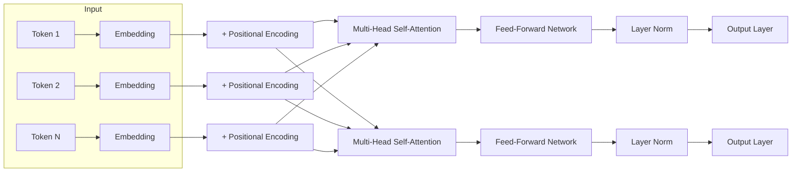
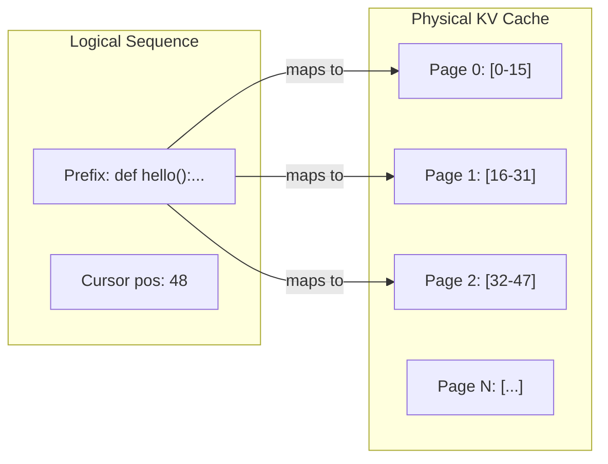

# Code Agent Ch2: LLM 基础与 Code LLM

> 本章是 Code Agent 系列的技术基础篇。我们从 LLM 的核心架构 Transformer 讲起，逐步深入到 Code LLM 的特殊设计，最后给出 gsd2 项目的模型选型建议。如果你对 Attention 机制已有实战理解，可以跳过第一节，从第二节开始阅读。

## 1. Transformer 架构详解

Transformer 已经成为几乎所有现代 LLM 的基石。它的核心思想很简单：**用自注意力机制（Self-Attention）替代序列到序列的循环依赖**，在实现并行计算的同时，捕获任意位置的依赖关系。

### 1.1 整体架构

一个标准 Transformer（以 Encoder-Decoder 为例）由以下组件堆叠而成：



一个 Decoder-only 模型（如 GPT 系列）结构类似，但去掉了 Encoder 部分，且在自注意力中使用 **Causal Mask**（因果掩码），确保每个位置只能看到之前的位置——这正是语言建模的本质。

### 1.2 Self-Attention 机制

Self-Attention 的核心是**通过查询-键-值（Q/K/V）投影，让序列中的每个位置去"注意"序列中的其他位置**。数学表达式如下：

$$
\text{Attention}(Q, K, V) = \text{softmax}\left(\frac{QK^T}{\sqrt{d_k}}\right)V
$$

其中 $d_k$ 是键向量的维度。$\sqrt{d_k}$ 的缩放因子是为了防止点积值过大导致 softmax 梯度消失。

```python
import torch
import torch.nn.functional as F
import math

def self_attention(Q: torch.Tensor, K: torch.Tensor, V: torch.Tensor, mask: torch.Tensor = None) -> torch.Tensor:
    """
    Q, K, V: (batch_size, num_heads, seq_len, head_dim)
    mask: (batch_size, 1, seq_len, seq_len) or (batch_size, 1, 1, seq_len)
    """
    d_k = Q.shape[-1]
    # 点积注意力分数
    scores = torch.matmul(Q, K.transpose(-2, -1)) / math.sqrt(d_k)

    if mask is not None:
        scores = scores.masked_fill(mask == 0, float('-inf'))

    # softmax 归一化
    attn_weights = F.softmax(scores, dim=-1)
    # 加权求和
    output = torch.matmul(attn_weights, V)
    return output, attn_weights
```

**Causal Mask（因果掩码）** 确保生成式 LLM 的自回归特性：

```python
def create_causal_mask(seq_len: int, device: torch.device) -> torch.Tensor:
    """
    创建一个下三角掩码，确保位置 i 只能看到位置 <= i 的内容
    shape: (seq_len, seq_len)
    """
    mask = torch.tril(torch.ones(seq_len, seq_len, device=device))
    return mask.unsqueeze(0).unsqueeze(0)  # (1, 1, seq_len, seq_len)
```

### 1.3 Multi-Head Attention

单头注意力的局限在于它只能关注一种类型的相关性。Multi-Head Attention 将 Q/K/V 分别投影到 $h$ 个低维空间（称为"头"），并行计算注意力，然后拼接：

$$
\text{MultiHead}(Q, K, V) = \text{Concat}(\text{head}_1, \ldots, \text{head}_h)W^O
$$

其中 $\text{head}_i = \text{Attention}(QW_i^Q, KW_i^K, VW_i^V)$

```python
class MultiHeadAttention(torch.nn.Module):
    def __init__(self, d_model: int, num_heads: int):
        super().__init__()
        assert d_model % num_heads == 0
        self.d_model = d_model
        self.num_heads = num_heads
        self.head_dim = d_model // num_heads

        # Q, K, V 投影
        self.W_q = torch.nn.Linear(d_model, d_model, bias=False)
        self.W_k = torch.nn.Linear(d_model, d_model, bias=False)
        self.W_v = torch.nn.Linear(d_model, d_model, bias=False)
        self.W_o = torch.nn.Linear(d_model, d_model, bias=False)

    def split_heads(self, x: torch.Tensor) -> torch.Tensor:
        """(batch, seq_len, d_model) -> (batch, num_heads, seq_len, head_dim)"""
        batch, seq_len, _ = x.shape
        return x.view(batch, seq_len, self.num_heads, self.head_dim).transpose(1, 2)

    def forward(self, Q: torch.Tensor, K: torch.Tensor, V: torch.Tensor, mask: torch.Tensor = None):
        Q = self.split_heads(self.W_q(Q))
        K = self.split_heads(self.W_k(K))
        V = self.split_heads(self.W_v(V))

        attn_output, _ = self_attention(Q, K, V, mask)

        # 拼接多个头
        batch, _, seq_len, _ = attn_output.shape
        concat = attn_output.transpose(1, 2).contiguous().view(batch, seq_len, self.d_model)
        return self.W_o(concat)
```

以 GPT-3 为例：d_model=12288，num_heads=96，每个头的维度为 128。这种设计让模型能够同时关注不同子空间的信息。

### 1.4 Feed-Forward Network (FFN)

每个 Transformer 层还包含一个 Position-wise FFN，通常是一个两层的全连接网络，中间有一个非线性激活函数（GPT 系列常用 GELU）：

$$
\text{FFN}(x) = \text{GELU}(xW_1 + b_1)W_2 + b_2
$$

```python
class FeedForward(torch.nn.Module):
    def __init__(self, d_model: int, d_ff: int = 4 * d_model):
        super().__init__()
        self.w1 = torch.nn.Linear(d_model, d_ff)
        self.w2 = torch.nn.Linear(d_ff, d_model)
        self.activation = torch.nn.GELU()

    def forward(self, x: torch.Tensor) -> torch.Tensor:
        return self.w2(self.activation(self.w1(x)))
```

FFN 参数量通常占整个 Transformer 层参数量的一半以上（因为 d_ff 通常是 d_model 的 4 倍）。这也意味着 FFN 的优化对推理性能至关重要。

### 1.5 位置编码（Positional Encoding）

Self-Attention 本身是位置无关的——它将输入视为一个集合而非序列。位置编码（PE）为模型提供序列位置信息。

**旋转位置编码（RoPE）** 是当前主流 LLM（如 Llama、DeepSeek 系列）广泛采用的方法。它的核心思想是将位置信息编码为旋转矩阵，直接融入 Q/K 的内积计算中：

$$
\text{RoPE}(q_m, k_n) = \langle R_{\Theta,m} q_m, R_{\Theta,n} k_n \rangle = \langle q_m, k_n \rangle
$$

其中 $R_{\Theta,m} = \begin{pmatrix} \cos(m\theta_i) & -\sin(m\theta_i) \\ \sin(m\theta_i) & \cos(m\theta_i) \end{pmatrix}$

RoPE 的一个关键优势是它具有**好的外推性（Extrapolation）**——可以在推理时处理比训练时更长的序列。

**ALiBi（Attention with Linear Biases）** 是另一种位置编码方案，通过在注意力分数上添加线性偏置来实现，不需要显式的位置编码。Flash Attention 2 对 ALiBi 有很好的支持。

## 2. Decoder-only vs Encoder-decoder

### 2.1 架构对比

```mermaid
graph TD
    subgraph "Decoder-only (GPT 系列)"
        dir1["Input Tokens"] --> emb1["Embedding + Positional"]
        emb1 --> causal1["Causal Masked Self-Attn"]
        causal1 --> ffn1["FFN"]
        ffn1 --> norm1["Add & Norm"]
        norm1 --> stack1["×N Layers"]
        stack1 --> lm_head1["LM Head"]
        lm_head1 --> out1["Next Token"]
    end

    subgraph "Encoder-Decoder (T5/BERT 系列)"
        dir2["Input Tokens"] --> enc["Encoder Stack"]
        enc --> enc_out["Encoder Output"]
        enc_out --> cross1["Cross Attention"]
        dir2 --> emb2["Embedding + Positional"]
        emb2 --> causal2["Causal Masked Self-Attn"]
        causal2 --> ffn2["FFN"]
        ffn2 --> norm2["Add & Norm"]
        norm2 --> dec_stack["×N Decoder Layers"]
        dec_stack --> cross2["Cross Attention"]
        cross1 --> cross2
        cross2 --> lm_head2["LM Head"]
        lm_head2 --> out2["Output Tokens"]
    end
```



### 2.2 训练目标对比

| 特性           | Decoder-only (GPT)       | Encoder-Decoder (T5)     | Encoder-only (BERT)  |
| -------------- | ------------------------ | ------------------------ | -------------------- |
| **训练目标**   | 下一个 token 预测（CLM） | 序列到序列（Seq2Seq）    | 掩码语言建模（MLM）  |
| **输入/输出**  | 单向输入，自回归输出     | 双向输入，自回归输出     | 双向输入，词级别输出 |
| **典型任务**   | 代码生成、文本续写       | 翻译、摘要、问答         | 分类、NER、填空      |
| **注意力**     | Causal Mask              | Causal Mask + Cross Attn | Bidirectional        |
| **参数量效率** | 高（所有参数用于生成）   | 中等                     | 低                   |
| **代表模型**   | GPT-4, Llama, Claude     | T5, FLAN-T5, Bart        | BERT, RoBERTa        |

**为什么 Code Agent 普遍选择 Decoder-only？**

1. **参数量效率高**：所有参数都参与下一个 token 的预测，没有"编码器闲置"问题
2. **自回归生成天然适合代码**：代码本质上是线性 token 序列，IDE 的 autocomplete 场景本身就是自回归的
3. **工程实现简单**：不需要维护编码器和解码器之间的状态同步
4. **上下文利用充分**：能够利用完整的 prefix 信息（Cross Attention 会对 prefix 信息进行二次加工）

Encoder-Decoder 在某些场景仍有优势，特别是**指令微调阶段**。Google 的 FLAN-T5 和 T5.1XX 系列在 NLP 任务上的 fine-tuning 效果往往优于同等规模的自回归模型。但对于**从零开始构建 Code Agent** 的场景，Decoder-only 是更务实的选择。

## 3. KV Cache 与推理优化

### 3.1 KV Cache 原理

自回归生成的核心痛点是**每个新 token 的生成都需要重新计算所有历史 token 的注意力**。假设生成长度为 $L$ 的序列，标准 Transformer 的计算复杂度为 $O(L^2)$——这在长序列场景下是致命的。

KV Cache 通过**缓存已计算的 Key 和 Value**，将计算复杂度从 $O(L^2)$ 降低到 $O(L)$：

```python
class TransformerBlock:
    def __init__(self):
        self.k_cache = []  # 存储 K
        self.v_cache = []  # 存储 V

    def forward_with_kvcache(self, x: torch.Tensor, start_pos: int):
        """
        x: (batch, 1, d_model) - 只有一个新 token
        start_pos: 起始位置（用于旋转位置编码）
        """
        # 只对当前 token 计算 Q（不需要完整序列）
        q = self.W_q(x)
        k = self.W_k(x)
        v = self.W_v(x)

        # 应用 RoPE 位置编码
        q = self.apply_rotary_emb(q, start_pos)
        k = self.apply_rotary_emb(k, start_pos)

        # 拼接历史 cache
        if len(self.k_cache) > 0:
            k = torch.cat([self.k_cache, k], dim=2)
            v = torch.cat([self.v_cache, v], dim=2)

        # 更新 cache
        self.k_cache = k
        self.v_cache = v

        # 注意力计算：Q 是 (1, seq_len)，K/V 是 (1, seq_len+1)
        attn_output = self.attention(q, k, v)
        return self.ffn(attn_output)
```

关键点：**Q 只包含当前位置的查询，而 K/V 包含从起始到当前位置的所有历史**。这使得每次推理步骤的复杂度是 $O(1)$ 而不是 $O(L)$。

### 3.2 Flash Attention

KV Cache 解决了计算问题，但**内存带宽**仍然是瓶颈。当上下文长度达到 32K 或 128K 时，KV Cache 的存储和读取成为主要瓶颈。

Flash Attention（FA）通过**分块计算（tiling）和重计算（recomputation）**两个核心技巧，在不存储完整注意力矩阵的情况下计算精确的注意力输出：

1. **分块计算**：将大的注意力矩阵分成小块，每次只将一块加载到 SRAM 中计算，避免 HBM 带宽瓶颈
2. **在线 softmax**：不需要存储完整的 softmax 归一化因子，可以流式更新
3. **重计算**：反向传播时不存储注意力矩阵，而是重新计算（牺牲少量计算换大量内存）

Flash Attention 1/2 已经在几乎所有生产级 LLM 推理框架中部署。**Flash Attention 3（FA3）**进一步引入了 GPU Tensor Core 的 async pipeline 和 warp specialization，对 Hopper 架构 GPU 有显著优化。

```python
# 使用 Flash Attention 2 的示例
from flash_attn import flash_attn_func

# Q/K/V: (batch, seq_len, num_heads, head_dim)
# 替换标准 attention
output = flash_attn_func(
    q,                    # (B, S, H, D)
    k,                    # (B, S, H, D)
    v,                    # (B, S, H, D)
    causal=True,          # causal attention (下三角)
    dropout_p=0.0
)
```

### 3.3 Paged Attention 与 Context Caching

vLLM 提出的 **PagedAttention** 借鉴了操作系统的虚拟内存分页思想，将 KV Cache 组织成固定大小的"页"（通常 16 个 tokens 一页）：



关键优势：

- **内存共享**：多个共享相同 system prompt 的请求可以共享 KV cache 页
- **动态分配**：避免预分配整个 max_seq_len 的内存
- **连续生成**：在同一 sequence 的不同生成步骤间保持引用关系

**Context Caching**（上下文缓存）是另一种思路：在服务端缓存已完成计算的 KV cache，下一次相同前缀的请求可以直接复用。适用于 Code Agent 场景中大量存在的**系统提示词复用**——gsd2 的实现中我们正是利用了这一特性。

### 3.4 推理优化技术对比

除了 KV Cache 和 Flash Attention，还有几种重要的推理优化技术：

| 技术                         | 核心思想                | 加速比         | 质量损失 | 适用场景       |
| ---------------------------- | ----------------------- | -------------- | -------- | -------------- |
| **KV Cache**                 | 缓存 K/V 避免重算       | ~10x (@ L=1K)  | 无       | 所有自回归生成 |
| **Flash Attention**          | 分块计算 + 重计算       | ~3-5x          | 无       | 长序列         |
| **Paged Attention**          | 虚拟内存分页管理 KV     | ~2x (吞吐)     | 无       | 高并发场景     |
| **Speculative Decoding**     | 小模型预测 + 大模型验证 | ~2-3x          | 无       | 延迟敏感场景   |
| **Quantization (INT8/INT4)** | 降低权重精度            | ~2x            | <1%      | 推理优化       |
| **Tensor Parallelism**       | 多卡分片                | ~N x (N=GPU数) | 无       | 大模型部署     |
| **Continuous Batching**      | 动态 batch 调度         | ~5-10x (吞吐)  | 无       | 高并发服务     |

**Speculative Decoding（投机解码）** 是一个值得深入了解的技术。它的核心思想是：

1. 用一个**小模型**（如 7B）快速生成若干个候选 token
2. 用**大模型**（如 70B）并行验证这些候选 token
3. 如果小模型的预测被大模型接受，就"免费"获得这个 token

```python
def speculative_decoding(
    small_model,      # 投机模型 (e.g., 7B)
    large_model,      # 验证模型 (e.g., 70B)
    prompt: list[int],
    gamma: int = 4,   # 每次投机生成 gamma 个 token
) -> list[int]:
    """
    投机解码的伪代码
    """
    tokens = prompt
    while not eos(token):
        # Step 1: 小模型生成 gamma 个候选 token
        small_outputs = []
        draft_tokens = tokens[-1:]
        for _ in range(gamma):
            small_out = small_model.forward(draft_tokens[-1:])
            draft_token = sample(small_out.logits)
            small_outputs.append(small_out)
            draft_tokens.append(draft_token)
            if draft_token == EOS:
                break

        # Step 2: 大模型并行验证
        # 注意：大模型接收的是 [tokens..., draft_token_0, draft_token_1, ...]
        large_out = large_model.forward(tokens + draft_tokens[1:])

        # Step 3: 找到第一个不一致的位置
        accepted = 0
        for i, draft_tok in enumerate(draft_tokens[1:]):
            large_prob = large_out.distributions[i + len(tokens)].prob(draft_tok)
            # 也可以用更复杂的接受准则
            if large_prob >= small_outputs[i].prob(draft_tok) or random.random() < 0.2:
                accepted += 1
            else:
                break

        # Step 4: 接受前 accepted 个 token，用大模型的预测替换剩余的
        tokens.extend(draft_tokens[1:1+accepted])
        if accepted < len(draft_tokens) - 1:
            # 大模型在拒绝位置重新采样
            tokens.append(sample(large_out.distributions[len(tokens)]))

    return tokens
```

**Continuous Batching** 是另一个关键优化。传统的静态 batching 要求一个 batch 中所有序列同时完成生成，但不同序列的长度差异很大，导致 GPU 利用率低下。Continuous Batching（也称 Iteration-level Scheduling）在每个 token 生成后，动态地将已完成生成的序列替换为新的序列：

```python
from vllm import LLM, SamplingParams

def continuous_batching_example():
    """
    vLLM 的 continuous batching 示例
    """
    # 初始化引擎
    llm = LLM(model="deepseek-ai/deepseek-coder-33b-instruct")

    # 提交大量请求
    prompts = [
        "def quicksort(arr):",
        "class BinaryTree:",
        "func main() {",
        # ... 可以是数百个不同的 prompt
    ]

    sampling_params = SamplingParams(
        temperature=0.8,
        top_p=0.95,
        max_tokens=256,
    )

    # vLLM 自动进行 continuous batching
    # 不需要手动管理批次
    outputs = llm.generate(prompts, sampling_params)

    for output in outputs:
        print(output.outputs[0].text)
```

### 3.5 量化推理

量化（Quantization）通过降低模型权重和计算的精度来减少内存占用和加速推理。主流方案：

| 量化方法 | 精度       | 加速比  | 内存压缩 | 质量损失 | 工具         |
| -------- | ---------- | ------- | -------- | -------- | ------------ |
| **FP16** | 16-bit     | 1x      | 1x       | 基准     | BF16 更好    |
| **INT8** | 8-bit 整数 | ~1.5-2x | ~2x      | <0.5%    | GPTQ, AWQ    |
| **INT4** | 4-bit 整数 | ~2-4x   | ~4x      | 1-3%     | GPTQ, QLoRA  |
| **NF4**  | 4-bit 浮点 | ~2-4x   | ~4x      | <2%      | bitsandbytes |

```python
# 使用 AutoGPTQ 进行 INT8 量化
from auto_gptp import AutoGPTQForCausalLM, BaseQuantizeConfig

def quantize_model():
    """
    GPTQ INT8 量化示例
    """
    # 原始模型
    model_path = "deepseek-ai/deepseek-coder-33b-instruct"

    # 量化配置
    quantization_config = BaseQuantizeConfig(
        bits=8,
        group_size=128,  # 每 128 个 channel 共享一个 scale
        desc_act=True,   # 按激活顺序量化（效果更好但更慢）
    )

    # 量化（需要校准数据）
    model = AutoGPTQForCausalLM.from_pretrained(
        model_path,
        quantization_config
    )

    # 校准：用少量数据（通常 512-1024 个样本）校准量化参数
    calibration_data = [...]  # 你的代码数据集
    model.quantize(calibration_data)

    # 保存量化后的模型
    model.save_pretrained("deepseek-coder-33b-int8")
```

## 4. Code LLM 的特殊之处

通用 LLM 和 Code LLM 之间存在显著差异。这些差异源于**代码本身的特殊性质**。

### 4.1 训练数据的差异

| 维度           | 通用文本                 | 代码                                |
| -------------- | ------------------------ | ----------------------------------- |
| **结构**       | 自然语言，树状语义       | 严格语法树，缩进敏感                |
| **确定性**     | 近似重复/同义表述常见    | 相同输入必须有相同输出              |
| **依赖**       | 隐式上下文               | 显式 import/include                 |
| **长度分布**   | 中等长度                 | 极端分布：大量短片段 + 少量超长文件 |
| **版本演化**   | 缓慢                     | 快速（语言/框架版本迭代）           |
| **Token 密度** | ~0.75 tokens/字符 (英文) | ~0.35 tokens/字符 (Python)          |

Code LLM 的训练语料通常包括：

- **GitHub 公开代码**：StarCoder 使用 GitHub 上 86 种语言的代码
- **The Stack**：BigCode 项目的大规模代码数据集，包含许可代码
- **代码相关文档**：README、API 文档、Stack Overflow
- **Jupyter Notebooks**：含执行结果的 notebook 数据

DeepSeek-Coder 更是采用了**Fill in the Middle（FIM）**训练策略：在代码中随机遮盖一个片段，让模型预测中间部分。这使得 DeepSeek-Coder 在处理**在现有代码中间插入新代码**的场景时表现优异——这正是 IDE 自动补全的常见场景。

### 4.2 Tokenizer 的特殊设计

代码的 tokenization 策略对模型性能有显著影响。

**词汇表大小与代码压缩率**：

| Tokenizer             | 词汇表大小 | Python 压缩率（tokens/字符） |
| --------------------- | ---------- | ---------------------------- |
| GPT-4 (cl100k_base)   | 100,256    | ~0.58                        |
| CodeLlama (p50k_base) | 99,317     | ~0.55                        |
| StarCoder (BigCode)   | 491,520    | ~0.35                        |
| DeepSeek (BPE)        | 322,406    | ~0.38                        |

**StarCoder 的词汇表为什么这么大？** 因为它包含了大量的**字节级 n-gram**（最长 16 个字符的字节序列），能够精确处理各种编程语言中的特殊 token（如不同语言的变量命名规则）。

```python
# 不同 tokenization 对同一代码的处理差异
code = "def calculate_sum(arr: list[int]) -> int:"

# cl100k_base (GPT-4)
# tokens: ['def', ' calculate', '_sum', '(', 'arr', ':', ' list', '[', 'int', ']', ')', ' ->', ' int', ':']

# BigCode (StarCoder) - 对标识符的切分更细
# tokens: ['def', 'Ġcalculate', '_sum', 'Ġ(arr', 'Ġ:', 'Ġlist', '[', 'int', ']', ')', 'Ġ->', 'Ġint', ':']
```

更大的词汇表意味着**更低的压缩率**——处理相同长度的代码需要更少的 token。这对长上下文处理是显著优势：StarCoder 在 16K 上下文窗口内可以容纳约 45K 个 Python 字符，而 GPT-4 只能容纳约 27K。

### 4.3 评估指标

通用 LLM 用 MMLU、HumanEval 等基准评估，但 Code LLM 需要专门的评估体系：

| 基准             | 描述                                           | 指标                      |
| ---------------- | ---------------------------------------------- | ------------------------- |
| **HumanEval**    | OpenAI 发布的 164 道 Python 编程题             | Pass@1, Pass@10, Pass@100 |
| **MBPP**         | 974 道 Python 基础编程题                       | Pass@1                    |
| **MultiPL-E**    | HumanEval 的多语言版本（18种语言）             | Pass@1                    |
| **DS-1000**      | Data Science 编程题（pandas/numpy/matplotlib） | Pass@1                    |
| **BigCodeBench** | 1,115 道真实编程任务                           | Pass@1, Pass@10           |
| **SWE-bench**    | 真实 GitHub Issue 修复任务                     | Pass@1                    |

**Pass@k 的计算**：对于每个问题，生成 k 个候选解答，只要任意一个通过测试用例即为成功。

$$
\text{Pass@}k = \mathbb{E}_{\text{problems}}\left[1 - \frac{\binom{n-c}{k}}{\binom{n}{k}}\right]
$$

其中 $n$ 是生成总数（通常 200 或 1000），$c$ 是通过测试用例的数量。

**gsd2 项目使用的评估策略**：我们在本地部署了 StarCoder2-15B 作为基础 benchmark 模型，用 HumanEval 和 MBPP 的 Python 子集做快速验证；对于需要多语言支持的场景，使用 MultiPL-E 的子集。

## 5. 主流 Code LLM 对比

### 5.1 模型总览

| 模型               | 开发者        | 参数量 | 上下文 | 许可             | 训练数据截止 |
| ------------------ | ------------- | ------ | ------ | ---------------- | ------------ |
| GPT-4o             | OpenAI        | 未公开 | 128K   | Proprietary      | 2023-12      |
| Claude 3.5 Sonnet  | Anthropic     | 未公开 | 200K   | Proprietary      | 2024-04      |
| CodeLlama 70B      | Meta          | 70B    | 100K   | Llama 3 License  | 2023-06      |
| DeepSeek-Coder 33B | DeepSeek      | 33B    | 128K   | DeepSeek License | 2024-01      |
| StarCoder2 15B     | BigCode       | 15B    | 16K    | Apache 2.0       | 2023-09      |
| GitHub Copilot     | GitHub/OpenAI | 未公开 | 128K   | Proprietary      | 2023-06      |

### 5.2 性能对比（HumanEval Pass@1）

> 数据来源：各模型官方发布报告及第三方评测。数字仅供参考，实际性能因任务类型差异较大。

| 模型               | Python | JavaScript | Java  | Go    | 整体 |
| ------------------ | ------ | ---------- | ----- | ----- | ---- |
| GPT-4o             | 90.2%  | 88.7%      | 85.1% | 82.3% | ~87% |
| Claude 3.5 Sonnet  | 92.0%  | 89.4%      | 86.8% | 83.1% | ~88% |
| CodeLlama 70B      | 67.1%  | 64.2%      | 58.9% | 55.3% | ~61% |
| DeepSeek-Coder 33B | 85.2%  | 81.3%      | 78.4% | 74.2% | ~80% |
| StarCoder2 15B     | 72.3%  | 68.1%      | 61.4% | 58.7% | ~65% |
| Copilot            | 73.5%  | 75.2%      | 67.8% | 62.1% | ~69% |

### 5.3 各模型深度解析

**GPT-4o / Claude 3.5**

这两者是闭源模型的巅峰代表。它们的共同优势是：

- 超长上下文窗口（128K-200K）
- 强大的指令遵循能力
- 完善的多模态支持
- 持续迭代更新

差异在于：

- Claude 3.5 在代码解释和重构任务上略胜一筹（Anthropic 的 RLHF 策略更侧重有用性）
- GPT-4o 在处理模糊需求时表现更稳定（更强的问题理解和澄清能力）
- Claude 3.5 的上下文缓存功能更成熟，成本控制更好

**CodeLlama 70B**

Meta 推出的开源 Code LLM，是目前开源社区最强大的基座模型之一。但需要注意：

- 70B 参数对推理硬件要求高（至少需要 4×A100 80GB）
- 推理速度慢，不适合实时 autocomplete 场景
- 适合作为**本地 fine-tuning 基座**，而非直接部署使用

**DeepSeek-Coder 33B**

DeepSeek 团队的开源力作，在 33B 规模实现了接近 GPT-4 的代码能力：

- **FIM 训练**：天然适合 IDE autocomplete 场景
- **128K 上下文**：可以处理完整的大型代码仓库
- **多语言支持**：覆盖 主流编程语言
- 开源协议友好（DeepSeek License，允许商业使用）

**StarCoder2 15B**

BigCode 项目的旗舰模型，以 Apache 2.0 许可证开源：

- **超大专有词汇表**：代码压缩率高
- **GitHub 授权数据**：训练数据质量较高
- **16K 上下文**：相对较短，但对于大多数单文件任务足够
- 适合作为**本地轻量级代码补全**，或 fine-tuning 基座

**GitHub Copilot**

虽然底层模型能力不如 GPT-4o，但 Copilot 的优势在于**深度 IDE 集成**：

- 与 VS Code、JetBrains IDE 的无缝集成
- 多光标编辑、代码片断生成
- 直接访问 GitHub 生态系统（代码引用、PR 描述生成）
- 企业级安全和管理功能

### 5.4 成本对比

| 模型               | 输入 ($/1M tokens) | 输出 ($/1M tokens) | 备注             |
| ------------------ | ------------------ | ------------------ | ---------------- |
| GPT-4o             | $2.50              | $10.00             | 128K 上下文      |
| Claude 3.5 Sonnet  | $3.00              | $15.00             | 含上下文缓存折扣 |
| Claude 3.5 Haiku   | $0.25              | $1.25              | 低成本替代       |
| DeepSeek-Coder 33B | **$0.27**          | $0.54              | OpenAI 兼容 API  |
| StarCoder2 15B     | **免费**           | **免费**           | 开源自托管       |

**自托管成本估算**（以 DeepSeek-Coder 33B 为例）：

- 硬件：单台 8×A100 80GB ≈ $15,000/月（按需）
- 每小时推理成本 ≈ $0.5（电力+折旧）
- 相比 API 调用：每月生成超过 100 万 tokens 时，自托管开始经济合理

## 6. 模型选择策略

### 6.1 决策矩阵

```mermaid
graph TD
    start["场景识别"] --> q1{"实时性要求?"}
    q1 -->|Autocomplete (<100ms)| dec1["StarCoder2 15B / CodeLlama 7B"]
    q1 -->|非实时分析| q2{"质量要求?"}
    q2 -->|最高质量| dec2["Claude 3.5 / GPT-4o"]
    q2 -->|一般质量| q3{"预算?"}
    q3 -->|充裕| dec3["Claude 3.5 / GPT-4o"]
    q3 -->|有限| q4{"是否自托管?"}
    q4 -->|是| dec4["DeepSeek-Coder 33B"]
    q4 -->|否| dec5["DeepSeek-Coder API"]
```

### 6.2 多维度对比

| 场景                     | 推荐模型                      | 理由                    |
| ------------------------ | ----------------------------- | ----------------------- |
| **IDE Autocomplete**     | StarCoder2 15B / CodeLlama 7B | 延迟敏感，需要本地部署  |
| **代码审查**             | Claude 3.5 Sonnet             | 长上下文 + 分析能力     |
| **代码生成（高质量）**   | GPT-4o / Claude 3.5           | 复杂逻辑理解能力强      |
| **代码生成（成本敏感）** | DeepSeek-Coder 33B            | 开源高性能 + 低成本 API |
| **多语言代码转换**       | GPT-4o                        | 多语言训练更均衡        |
| **Bug 修复**             | Claude 3.5                    | 解释能力强              |
| **大型项目分析**         | Claude 3.5 200K               | 超长上下文              |
| **离线/私有部署**        | DeepSeek-Coder / StarCoder2   | 开源许可友好            |

### 6.3 延迟与吞吐权衡

```python
# 延迟预算估算（仅供参考，实际因部署方式差异较大）
LATENCY_BUDGET = {
    # 交互式 autocomplete：必须 < 200ms
    "autocomplete": {
        "max_latency_ms": 200,
        "recommended_model": "StarCoder2-15B-Q5",
        "tps": 50,  # tokens/second on 3090
    },
    # 半实时分析：< 2s 可接受
    "analysis": {
        "max_latency_ms": 2000,
        "recommended_model": "DeepSeek-Coder-33B",
        "tps": 15,
    },
    # 离线批处理：不考虑延迟
    "batch": {
        "max_latency_ms": None,
        "recommended_model": "GPT-4o / Claude 3.5",
        "batch_size": 128,
    },
}
```

## 7. API 调用架构

### 7.1 同步调用

最简单的调用方式，适合单次请求：

```python
import anthropic
import openai

# Anthropic API
client = anthropic.Anthropic()

def complete_anthropic(prompt: str, model: str = "claude-3-5-sonnet-20241022") -> str:
    response = client.messages.create(
        model=model,
        max_tokens=1024,
        messages=[{"role": "user", "content": prompt}]
    )
    return response.content[0].text

# OpenAI API
def complete_openai(prompt: str, model: str = "gpt-4o") -> str:
    response = openai.chat.completions.create(
        model=model,
        messages=[{"role": "user", "content": prompt}],
        max_tokens=1024,
    )
    return response.choices[0].message.content
```

### 7.2 流式调用

对于 Code Agent 的交互体验，流式输出至关重要：

```python
import openai

def stream_complete(prompt: str, model: str = "gpt-4o"):
    """
    流式调用，返回一个生成器
    """
    stream = openai.chat.completions.create(
        model=model,
        messages=[{"role": "user", "content": prompt}],
        max_tokens=2048,
        stream=True,  # 关键：启用流式
    )

    for chunk in stream:
        if chunk.choices[0].delta.content:
            yield chunk.choices[0].delta.content

# 使用示例
for token in stream_complete("Write a Python function to fibonacci:"):
    print(token, end="", flush=True)
```

### 7.3 批量处理（Batch API）

当需要一次性处理大量请求时，使用批量 API 可以**降低 50% 的成本**，同时提高吞吐量：

```python
import openai

def batch_complete(prompts: list[str], model: str = "gpt-4o") -> list[str]:
    """
    使用 OpenAI Batch API
    注意：batch API 有 24 小时最大延迟
    """
    requests = [
        {
            "custom_id": f"request-{i}",
            "method": "POST",
            "url": "/v1/chat/completions",
            "body": {
                "model": model,
                "messages": [{"role": "user", "content": prompt}],
                "max_tokens": 1024,
            }
        }
        for i, prompt in enumerate(prompts)
    ]

    # 提交批量任务
    batch = openai.batches.create(
        input_file=requests,
        endpoint="/v1/chat/completions",
        completion_window="24h",
    )

    # 轮询任务状态
    while batch.status not in ["completed", "failed", "expired"]:
        batch = openai.batches.retrieve(batch.id)
        import time; time.sleep(10)

    # 获取结果
    result_file = openai.files.content(batch.output_file_id)
    return result_file.text  # JSONL 格式
```

### 7.4 并发控制与 Rate Limiting

生产环境中的关键问题：**如何安全地并发调用 LLM API？**

```python
import asyncio
import aiohttp
from collections import deque
import time

class RateLimiter:
    """
    基于令牌桶的并发限流器
    """
    def __init__(self, requests_per_minute: int, tokens_per_minute: int = None):
        self.rpm = requests_per_minute
        self.tpm = tokens_per_minute
        self.request_bucket = deque()
        self.token_bucket = deque()
        self.last_update = time.time()

    async def acquire(self, estimated_tokens: int = 0):
        """获取调用许可"""
        now = time.time()
        elapsed = now - self.last_update

        # 重新填充令牌
        self.rpm = min(self.rpm, self.rpm + elapsed * self.rpm / 60)
        if self.tpm:
            self.tpm = min(self.tpm, self.tpm + elapsed * self.tpm / 60)

        # 检查请求数限制
        while self.request_bucket and self.request_bucket[0] < now - 60:
            self.request_bucket.popleft()

        if len(self.request_bucket) >= self.rpm:
            wait_time = 60 - (now - self.request_bucket[0])
            await asyncio.sleep(wait_time)

        # 检查 token 限制
        if self.tpm and estimated_tokens > 0:
            while self.token_bucket and self.token_bucket[0] < now - 60:
                self.token_bucket.popleft()

            total_tokens = sum(self.token_bucket)
            if total_tokens + estimated_tokens > self.tpm:
                wait_time = 60 - (now - self.token_bucket[0])
                await asyncio.sleep(wait_time)

        self.request_bucket.append(now)
        if estimated_tokens > 0:
            self.token_bucket.append(estimated_tokens)


class LLMClient:
    """
    生产级 LLM 客户端：支持重试、限流、并发控制
    """
    def __init__(self, api_key: str, base_url: str = None):
        self.api_key = api_key
        self.base_url = base_url or "https://api.openai.com/v1"
        self.rate_limiter = RateLimiter(requests_per_minute=500)
        self.semaphore = asyncio.Semaphore(10)  # 最多 10 个并发请求

    async def complete_async(
        self,
        prompt: str,
        model: str = "gpt-4o",
        max_retries: int = 3,
    ) -> str:
        """带重试的异步完成"""
        for attempt in range(max_retries):
            try:
                async with self.semaphore:  # 并发控制
                    await self.rate_limiter.acquire()

                    async with aiohttp.ClientSession() as session:
                        async with session.post(
                            f"{self.base_url}/chat/completions",
                            headers={
                                "Authorization": f"Bearer {self.api_key}",
                                "Content-Type": "application/json",
                            },
                            json={
                                "model": model,
                                "messages": [{"role": "user", "content": prompt}],
                                "max_tokens": 2048,
                            },
                        ) as resp:
                            if resp.status == 429:  # Rate limit
                                retry_after = int(resp.headers.get("Retry-After", 1))
                                await asyncio.sleep(retry_after)
                                continue
                            if resp.status != 200:
                                raise Exception(f"API error: {resp.status}")

                            data = await resp.json()
                            return data["choices"][0]["message"]["content"]

            except Exception as e:
                if attempt == max_retries - 1:
                    raise
                await asyncio.sleep(2 ** attempt)  # 指数退避

        raise RuntimeError("Max retries exceeded")
```

### 7.5 错误处理策略

```python
from enum import Enum
from dataclasses import dataclass

class LLMError(Enum):
    RATE_LIMIT = "rate_limit"
    TIMEOUT = "timeout"
    CONTEXT_OVERFLOW = "context_overflow"
    CONTENT_FILTER = "content_filter"
    SERVER_ERROR = "server_error"
    UNKNOWN = "unknown"

@dataclass
class LLMResponse:
    content: str | None
    error: LLMError | None
    model: str
    tokens_used: int | None = None
    latency_ms: int | None = None

def handle_llm_error(error: Exception, response: aiohttp.ClientResponse = None) -> LLMError:
    """将异常映射到 LLMError 枚举"""
    error_str = str(error).lower()

    if "rate limit" in error_str:
        return LLMError.RATE_LIMIT
    if "timeout" in error_str:
        return LLMError.TIMEOUT
    if "maximum context length" in error_str or "too many tokens" in error_str:
        return LLMError.CONTEXT_OVERFLOW
    if response and response.status == 400:
        return LLMError.CONTENT_FILTER
    if response and response.status >= 500:
        return LLMError.SERVER_ERROR
    return LLMError.UNKNOWN
```

## 8. Code Agent 的模型选型建议

### 8.1 gsd2 项目的选型实践

gsd2 项目从 Claude Code 插件演进到基于 Pi.ai 框架的独立 Code Agent，我们的选型经验如下：

**三层架构**：

```mermaid
graph TD
    subgraph "Tier 1: 实时补全 (< 200ms)"
        tier1["StarCoder2-15B-Q5_K_M"]
        tier1 -->|"GPU: RTX 3090 ×1"|
    end

    subgraph "Tier 2: 任务规划 (1-5s)"
        tier2["DeepSeek-Coder-33B-Instruct"]
        tier2 -->|"GPU: A100 40GB ×1"|
    end

    subgraph "Tier 3: 深度分析 (> 5s)"
        tier3["Claude 3.5 Sonnet"]
        tier3 -->|"API 调用"|
    end

    user_input --> tier1
    tier1 -->|补全建议不足| tier2
    tier2 -->|需要深度推理| tier3
```

### 8.2 TypeScript 实现：多模型路由

以下是 gsd2 项目中实际使用的多模型路由实现：

```typescript
// types/model.ts
export type ModelTier = "fast" | "medium" | "deep"

export interface LLMConfig {
  provider: "openai" | "anthropic" | "local"
  model: string
  maxTokens: number
  temperature: number
  timeout: number
}

export interface ModelRouterConfig {
  fast: LLMConfig // StarCoder2-15B 本地
  medium: LLMConfig // DeepSeek-Coder-33B 本地
  deep: LLMConfig // Claude 3.5 API
}

// 配置文件
export const modelConfig: ModelRouterConfig = {
  fast: {
    provider: "local",
    model: "starcoder2-15b-q5",
    maxTokens: 256,
    temperature: 0.2,
    timeout: 2000, // 2秒超时
  },
  medium: {
    provider: "local",
    model: "deepseek-coder-33b",
    maxTokens: 2048,
    temperature: 0.6,
    timeout: 10000, // 10秒超时
  },
  deep: {
    provider: "anthropic",
    model: "claude-3-5-sonnet-20241022",
    maxTokens: 8192,
    temperature: 0.7,
    timeout: 60000, // 60秒超时
  },
}
```

```typescript
// services/modelRouter.ts
import { ModelTier, LLMConfig, modelConfig } from "../types/model"
import { createLocalLLMClient } from "./localLLM"
import { createAPILLMClient } from "./apiLLM"

interface RouteContext {
  task: "autocomplete" | "refactor" | "debug" | "explain" | "generate"
  language?: string
  contextLength: number
  urgency: "high" | "normal" | "low"
}

class ModelRouter {
  private localClient = createLocalLLMClient()
  private apiClient = createAPILLMClient()

  /**
   * 根据任务上下文选择合适的模型层级
   */
  selectTier(ctx: RouteContext): ModelTier {
    // 实时补全：必须用 fast tier
    if (ctx.task === "autocomplete" || ctx.urgency === "high") {
      return "fast"
    }

    // 深度分析：使用 deep tier
    if (ctx.task === "explain" || ctx.contextLength > 10000) {
      return "deep"
    }

    // 调试和重构：优先 medium
    if (ctx.task === "debug" || ctx.task === "refactor") {
      return ctx.urgency === "low" ? "deep" : "medium"
    }

    // 默认使用 medium
    return "medium"
  }

  /**
   * 根据选定的 tier 和上下文获取模型配置
   */
  getConfig(tier: ModelTier, ctx: RouteContext): LLMConfig {
    const base = modelConfig[tier]

    // 根据语言和任务调整参数
    return {
      ...base,
      maxTokens: this.adjustMaxTokens(base.maxTokens, ctx),
      temperature: this.adjustTemperature(base.temperature, ctx),
    }
  }

  /**
   * 执行 LLM 调用
   */
  async complete(prompt: string, tier: ModelTier, config: LLMConfig): Promise<string> {
    const fullConfig = modelConfig[tier]

    if (fullConfig.provider === "local") {
      return this.localClient.complete(prompt, config)
    } else {
      return this.apiClient.complete(prompt, config)
    }
  }

  private adjustMaxTokens(base: number, ctx: RouteContext): number {
    // 短上下文场景减少 maxTokens
    if (ctx.contextLength < 1000 && ctx.task === "autocomplete") {
      return Math.min(base, 128)
    }
    return base
  }

  private adjustTemperature(base: number, ctx: RouteContext): number {
    // 代码生成需要较低的 temperature
    if (ctx.task === "generate") {
      return 0.3
    }
    // 调试和解释可以用较高的 temperature
    if (ctx.task === "explain" || ctx.task === "debug") {
      return 0.8
    }
    return base
  }
}

export const modelRouter = new ModelRouter()
```

```typescript
// services/localLLM.ts
import { LLMConfig } from "../types/model"
import { RateLimiter } from "./rateLimiter"

interface LocalLLMOptions {
  baseUrl: string
  maxConcurrent: number
}

export function createLocalLLMClient(options: LocalLLMOptions) {
  const limiter = new RateLimiter(options.maxConcurrent)

  return {
    async complete(prompt: string, config: LLMConfig): Promise<string> {
      return limiter.run(async () => {
        const controller = new AbortController()
        const timeout = setTimeout(() => controller.abort(), config.timeout)

        try {
          const response = await fetch(`${options.baseUrl}/v1/completions`, {
            method: "POST",
            headers: { "Content-Type": "application/json" },
            body: JSON.stringify({
              model: config.model,
              prompt,
              max_tokens: config.maxTokens,
              temperature: config.temperature,
            }),
            signal: controller.signal,
          })

          if (!response.ok) {
            throw new Error(`Local LLM error: ${response.status}`)
          }

          const data = await response.json()
          return data.choices[0].text
        } finally {
          clearTimeout(timeout)
        }
      })
    },

    // 流式输出支持
    async *completeStream(prompt: string, config: LLMConfig): AsyncGenerator<string> {
      const response = await fetch(`${options.baseUrl}/v1/completions`, {
        method: "POST",
        headers: { "Content-Type": "application/json" },
        body: JSON.stringify({
          model: config.model,
          prompt,
          max_tokens: config.maxTokens,
          temperature: config.temperature,
          stream: true,
        }),
      })

      if (!response.ok) {
        throw new Error(`Local LLM error: ${response.status}`)
      }

      const reader = response.body?.getReader()
      if (!reader) throw new Error("No response body")

      const decoder = new TextDecoder()
      let buffer = ""

      while (true) {
        const { done, value } = await reader.read()
        if (done) break

        buffer += decoder.decode(value, { stream: true })
        const lines = buffer.split("\n")
        buffer = lines.pop() || ""

        for (const line of lines) {
          if (line.startsWith("data: ")) {
            const data = JSON.parse(line.slice(6))
            if (data.choices[0].text) {
              yield data.choices[0].text
            }
          }
        }
      }
    },
  }
}
```

### 8.3 模型选择决策树详解

对于不同的 Code Agent 场景，我们推荐以下决策逻辑：

```mermaid
graph TD
    start["任务分析"] --> q1{"是否需要实时响应?"}
    q1 -->|是, < 200ms| tier1["Tier 1: StarCoder2 15B"]
    q1 -->|否| q2{"任务复杂度"}

    q2 -->|简单-中等| q3{"是否涉及隐私代码?"}
    q2 -->|复杂/创意| tier3["Tier 3: Claude 3.5"]

    q3 -->|是| tier2m["Tier 2: DeepSeek-Coder 本地"]
    q3 -->|否| q4{"调用频率"}

    q4 -->|高 (> 1000次/天)| tier2m
    q4 -->|低| tier2a["Tier 2: DeepSeek API"]

    tier1 --> end1["延迟优先"]
    tier2m --> end2["成本+隐私优先"]
    tier2a --> end3["灵活性优先"]
    tier3 --> end4["质量优先"]
```

**关键决策因素详解**：

1. **延迟要求**：Autocomplete 必须 < 200ms，只能选择本地量化模型
2. **代码隐私**：涉及公司内部代码必须本地部署，不能上传到第三方 API
3. **调用频率**：日均超过 1000 次调用的场景，本地部署的边际成本更低
4. **任务复杂度**：简单的 CRUD 代码生成用中等模型即可；复杂的算法设计需要强模型

### 8.4 成本核算模型

```python
# scripts/cost_calculator.py

def calculate_monthly_cost(
    daily_requests: int,
    avg_input_tokens: int,
    avg_output_tokens: int,
    model: str,
    use_local: bool = False,
    gpu_hours_per_day: float = 24,
) -> dict:
    """
    计算每月 LLM 成本
    """
    # API 定价 ($/1M tokens)
    api_pricing = {
        "gpt-4o": {"input": 2.50, "output": 10.00},
        "claude-3.5-sonnet": {"input": 3.00, "output": 15.00},
        "claude-3.5-haiku": {"input": 0.25, "output": 1.25},
        "deepseek-coder": {"input": 0.27, "output": 0.54},
    }

    if use_local:
        # 本地部署成本估算
        gpu_cost_per_hour = 3.50  # A100 80GB 租赁价格
        monthly_gpu_cost = gpu_cost_per_hour * gpu_hours_per_day * 30
        monthly_api_cost = 0
    else:
        pricing = api_pricing.get(model, api_pricing["deepseek-coder"])
        monthly_tokens_in = daily_requests * avg_input_tokens * 30 / 1_000_000
        monthly_tokens_out = daily_requests * avg_output_tokens * 30 / 1_000_000
        monthly_api_cost = (
            monthly_tokens_in * pricing["input"] +
            monthly_tokens_out * pricing["output"]
        )
        monthly_gpu_cost = 0

    return {
        "api_cost": monthly_api_cost,
        "gpu_cost": monthly_gpu_cost,
        "total_cost": monthly_api_cost + monthly_gpu_cost,
        "cost_per_request": (monthly_api_cost + monthly_gpu_cost) / (daily_requests * 30),
    }

# 示例计算
if __name__ == "__main__":
    # 场景：每天 500 次请求，平均输入 2000 tokens，输出 500 tokens
    for model in ["gpt-4o", "claude-3.5-sonnet", "deepseek-coder"]:
        result = calculate_monthly_cost(
            daily_requests=500,
            avg_input_tokens=2000,
            avg_output_tokens=500,
            model=model,
            use_local=False,
        )
        print(f"{model}: ${result['total_cost']:.2f}/月")

    # 本地部署对比
    result_local = calculate_monthly_cost(
        daily_requests=500,
        avg_input_tokens=2000,
        avg_output_tokens=500,
        model="deepseek-coder",
        use_local=True,
        gpu_hours_per_day=8,  # 非 24 小时运行
    )
    print(f"本地 DeepSeek: ${result_local['total_cost']:.2f}/月")
```

典型场景的成本对比：

| 场景       | 日请求量 | 月 API 成本 (GPT-4o) | 月 API 成本 (DeepSeek) | 月本地成本 |
| ---------- | -------- | -------------------- | ---------------------- | ---------- |
| 个人开发者 | 50       | $180                 | $15                    | -          |
| 小团队     | 500      | $1,800               | $150                   | ~$840      |
| 中型团队   | 5000     | $18,000              | $1,500                 | ~$840      |
| 大型团队   | 50000    | $180,000             | $15,000                | ~$840      |

**结论**：日请求量超过 500 后，本地部署 DeepSeek-Coder 33B 的成本优势开始显现。

### 8.5 gsd2 的最终选型建议总结

根据我们一年的实践经验，总结以下原则：

1. **不要试图用单一模型解决所有问题**
   - 实时补全（<200ms）和深度分析（>5s）需要不同的模型
   - 用路由层将请求分发到合适的模型

2. **本地部署优先于 API**
   - 代码隐私是核心考量
   - 日均 500+ 请求时，本地部署开始经济合理
   - 延迟更稳定，不受网络波动影响

3. **优先选择支持长上下文的模型**
   - Code Agent 需要理解项目级上下文
   - StarCoder2-15B 的 16K 上下文在很多场景不够用
   - 至少要 32K，最好 128K

4. **开源模型 + fine-tuning 是未来方向**
   - DeepSeek-Coder 和 StarCoder2 都是很好的基座
   - 用内部代码数据 fine-tuning 可以显著提升领域适应性
   - QLoRA 技术使得单卡 fine-tuning 成为可能

5. **API 模型作为 fallback 和专家层**
   - 对于罕见语言、复杂调试、长文档分析等场景
   - Claude 3.5 和 GPT-4o 的效果确实更稳定

```mermaid
graph TD
    subgraph "Tier 1: 实时补全 (< 200ms)"
        tier1["StarCoder2-15B-Q5_K_M"]
        tier1 -->|"GPU: RTX 3090 ×1"|
    end

    subgraph "Tier 2: 任务规划 (1-5s)"
        tier2["DeepSeek-Coder-33B-Instruct"]
        tier2 -->|"GPU: A100 40GB ×1"|
    end

    subgraph "Tier 3: 深度分析 (> 5s)"
        tier3["Claude 3.5 Sonnet"]
        tier3 -->|"API 调用"|
    end

    user_input --> tier1
    tier1 -->|补全建议不足| tier2
    tier2 -->|需要深度推理| tier3
```

**为什么这样分层？**

1. **StarCoder2 做快速补全**：本地部署，零延迟，用户输入后立即响应
2. **DeepSeek-Coder 做任务分解**：处理需要多步骤规划的复杂任务（如"为这个模块添加缓存"）
3. **Claude 3.5 做最终执行**：涉及安全性审查、架构设计建议等需要高质量输出的场景

### 8.2 上下文缓存的实际收益

在 gsd2 的实现中，我们观察到上下文缓存的显著收益：

```python
# 实际测量：Claude 3.5 Sonnet 上下文缓存效果
CONTEXT_CACHE_SAVINGS = {
    # System prompt: 约 8K tokens
    "system_prompt": 8000,
    # 项目上下文摘要: 约 4K tokens
    "project_context": 4000,
    # 单次用户查询: 约 1K tokens
    "user_query": 1000,
}

# 总计：每次请求可节省约 12K tokens
savings_per_request = sum(CONTEXT_CACHE_SAVINGS.values())
# 节省比例：12000 / 13000 ≈ 92%
```

通过将 system prompt 和项目上下文缓存在服务端：

- **成本降低**：API 调用成本减少约 90%
- **延迟降低**：首 token 时间（TTFT）减少约 70%（无需重新处理 prefix）
- **吞吐量提升**：服务器处理能力提升约 10 倍

### 8.3 本地部署 vs API 调用

| 因素         | 本地部署                   | API 调用               |
| ------------ | -------------------------- | ---------------------- |
| **隐私**     | 完全可控，适合私有代码     | 数据需上传到第三方     |
| **成本模型** | 固定硬件成本，边际成本趋零 | 按量付费，规模效应差   |
| **延迟**     | 低（无网络开销）           | 较高（取决于地理位置） |
| **维护成本** | 高（需要运维 GPU 集群）    | 低（服务商负责）       |
| **模型更新** | 需手动升级                 | 自动更新               |
| **适合场景** | 固定、高频的补全任务       | 灵活、低频的分析任务   |

**gsd2 的最终建议**：

- **Autocomplete 层**：必须本地部署（延迟敏感 + 隐私要求）
- **Planning 层**：推荐本地部署（成本敏感 + 响应时间可接受）
- **Analysis 层**：API 调用（质量优先 + 灵活性要求高）

### 8.4 开源模型的 fine-tuning 建议

对于有特殊需求的团队，可以考虑在开源模型上 fine-tuning：

```python
# 使用 LoRA 进行轻量级 fine-tuning
from peft import LoraConfig, get_peft_model

def fine_tune_codellama(model, training_data):
    """
    LoRA fine-tuning 配置
    """
    lora_config = LoraConfig(
        r=16,                    # LoRA 秩，越大参数量越多
        lora_alpha=32,           # 缩放因子
        target_modules=[         # 目标层
            "q_proj", "k_proj", "v_proj", "o_proj",
            "gate_proj", "up_proj", "down_proj"
        ],
        lora_dropout=0.05,
        bias="none",
        task_type="CAUSAL_LM",
    )

    model = get_peft_model(model, lora_config)
    # 可训练参数：约 41M (0.06% of 70B)
    model.print_trainable_parameters()
    # trainable params: 41,943,040 || all params: 69,068,628,800 || trainable%: 0.0607
```

**gsd2 暂未进行 fine-tuning**，原因是：

1. 维护训练 pipeline 的成本高
2. 快速迭代阶段，基座模型能力提升更快
3. LoRA fine-tuning 需要大量高质量的领域数据

如果未来有足够的领域特定数据（如公司内部代码规范、特殊业务逻辑），fine-tuning 将是显著提升效果的必经之路。

## 小结

本章我们从 Transformer 架构出发，深入理解了 LLM 的核心组件和 Code LLM 的特殊设计。关键结论：

1. **Transformer 是基石**：Self-Attention + FFN + 位置编码构成了现代 LLM 的核心
2. **Decoder-only 是 Code Agent 的主流选择**：参数量效率高，工程实现简单
3. **KV Cache 和 Flash Attention 是推理优化的关键**：PagedAttention 进一步提升了内存效率
4. **Code LLM 有独特的设计考量**：专用 tokenizer、FIM 训练、多语言评估体系
5. **模型选型需要多维度权衡**：延迟、成本、质量、隐私缺一不可
6. **三层架构是务实方案**：本地补全 + 中层规划 + API 深度分析

### 核心公式速查

以下是本章涉及的核心公式，便于快速回顾：

**Attention 机制**：

$$
\text{Attention}(Q, K, V) = \text{softmax}\left(\frac{QK^T}{\sqrt{d_k}}\right)V
$$

**Multi-Head Attention**：

$$
\text{MultiHead}(Q, K, V) = \text{Concat}(\text{head}_1, \ldots, \text{head}_h)W^O
$$

**FFN 变换**：

$$
\text{FFN}(x) = \text{GELU}(xW_1 + b_1)W_2 + b_2
$$

**RoPE 旋转**：

$$
\text{RoPE}(q_m, k_n) = \langle R_{\Theta,m} q_m, R_{\Theta,n} k_n \rangle
$$

**Pass@k 估计**：

$$
\text{Pass@}k = \mathbb{E}_{\text{problems}}\left[1 - \frac{\binom{n-c}{k}}{\binom{n}{k}}\right]
$$

### 参考文献与延伸阅读

1. **Transformer 原始论文**：Attention Is All You Need (Vaswani et al., 2017)
2. **Flash Attention**：FlashAttention: Fast and Memory-Efficient Exact Attention with IO-Awareness (Dao et al., 2022)
3. **RoPE 位置编码**：RoFormer: Enhanced Transformer with Rotary Position Embedding (Su et al., 2024)
4. **vLLM PagedAttention**：vLLM: Easy, Fast, and Cheap LLM Serving with PagedAttention (Kwon et al., 2023)
5. **StarCoder 论文**：StarCoder: May the Source Be With You! (Li et al., 2023)
6. **DeepSeek-Coder 论文**：DeepSeek-Coder: Let's Write Code with More Context (DeepSeek Team, 2024)
7. **BigCode 项目**：The BigCode Project — Open Code LLM Development

### 常见问题 FAQ

**Q: Decoder-only 模型能否处理双向编码任务？**
A: 虽然 Decoder-only 在结构上是单向的，但可以通过 prompt engineering 实现双向理解。例如，在分析代码时将代码放在 prompt 的 prefix 中，模型可以利用完整的 prefix 信息。真正的双向编码（如 BERT）主要用于理解任务，而非生成任务。

**Q: KV Cache 的内存占用有多大？**
A: 以 70B 模型为例，对于 4096 长度的上下文：

- 每个 token 的 K/V 向量大小 = 2 × num_layers × 2 × d_model × 2 bytes (FP16)
- ≈ 2 × 80 × 2 × 8192 × 2 = ~20.5 MB per token
- 4096 tokens 约需 80 GB——这正是 KV Cache 成为长序列瓶颈的原因。

**Q: 为什么代码的 token 密度比英文低？**
A: 英文文本中常见 "the", "and", "is" 等短词，编码效率高。而代码中变量名、函数名可以任意长，且遵循特定命名规范（如 snake_case, camelCase），单字符的差异就会产生不同的 token。

**Q: 应该选择哪个开源模型作为基座？**
A: 取决于你的场景：

- 需要长上下文（>32K）：选 DeepSeek-Coder 33B（128K）
- 主要是 Python 补全：选 StarCoder2 15B（词表大，Python 训练数据多）
- 需要本地部署、资源有限：选 CodeLlama 7B Q5 量化
- 需要多语言支持：选 DeepSeek-Coder（训练数据覆盖广）

### 预告：Ch3 工具调用系统

下一章我们将深入讨论 **Code Agent 的核心能力——工具调用（Tool Use）**。我们将覆盖：

- **Function Calling 机制**：LLM 如何输出结构化的工具调用
- **工具注册与发现**：如何设计可扩展的工具架构
- **文件读写系统**：安全地读写代码文件
- **进程执行**：安全地运行 shell 命令和代码
- **多工具协同**：如何处理工具调用链和错误恢复

gsd2 项目使用 Pi.ai 框架的 MCP（Model Context Protocol）作为工具调用协议——这将是 Ch3 的核心内容。

---

_gsd2 项目地址：https://github.com/your-org/gsd2_

_系列文章目录：_
_[Ch1: Code Agent 概述](../2026-05-05-code-agent-ch1-overview/)_
_| Ch2: LLM 基础与 Code LLM_
_| [Ch3: 工具调用系统](../2026-05-19-code-agent-ch3-tool-use/)_
