# Code Agent Ch3: Prompt Engineering 与 Agent 范式

## 引言

在 LLM 应用开发中，Prompt Engineering 是将大语言模型从「对话工具」升级为「智能代理」的核心技术栈。对于 Code Agent 而言，Prompt 不仅是输入的字符串，更是定义 Agent 行为边界、能力范围和执行逻辑的「灵魂宪法」。

本文以 gsd2 项目（从 Claude Code 插件演进到基于 Pi.ai 框架的独立 Code Agent）为案例，深入剖析 Prompt Engineering 的理论基础与工程实践，涵盖从基础范式到复杂 Agent 架构的完整技术体系。

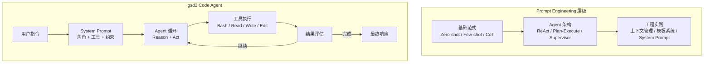

## 1. Prompt Engineering 基础

### 1.1 Zero-shot Learning：直接指令驱动

Zero-shot 是最基础的 Prompt 形式，模型仅凭预训练知识直接响应指令，无需任何示例。在 Code Agent 场景中，Zero-shot 适合明确、简单的任务。

```python
# Zero-shot Prompt 示例
ZERO_SHOT_TEMPLATE = """
你是一个代码审查助手。请检查以下 Python 代码的安全问题：

```python
{source_code}
```

直接输出发现的安全问题列表。
"""

def create_zero_shot_prompt(source_code: str) -> str:
    """构建 Zero-shot Prompt"""
    return ZERO_SHOT_TEMPLATE.format(source_code=source_code)

# 使用示例
prompt = create_zero_shot_prompt(
    "user_input = input()\n"
    "eval(user_input)"
)
```

Zero-shot 的优点是简洁高效，缺点是对于复杂任务缺乏引导，输出格式不稳定。当 gsd2 需要执行 `Read` 工具读取文件时，Zero-shot 模式可能产生格式不一致的响应。

### 1.2 Few-shot Learning：示例引导范式

Few-shot 通过在 Prompt 中插入少量示例，帮助模型理解任务模式和输出格式。这是工程实践中使用最广泛的范式。

```python
FEW_SHOT_TEMPLATE = """
你是一个代码搜索助手。用户描述想找的代码模式，你需要输出对应的文件路径和行号。

示例 1：
Q: 查找所有使用 json.loads 的地方
A:
```json
[
  {"file": "src/parser.py", "lines": [23, 45, 67]},
  {"file": "tests/test_parser.py", "lines": [12]}
]
```

示例 2：
Q: 找出定义 async def 的函数
A:
```json
[
  {"file": "src/api.py", "lines": [10, 28, 56]},
  {"file": "src/utils.py", "lines": [5]}
]
```

现在回答：
Q: {user_query}
A：
"""

def create_few_shot_prompt(user_query: str, examples: list[dict] = None) -> str:
    """构建 Few-shot Prompt，支持自定义示例"""
    if examples:
        # 动态注入示例
        example_section = "\n".join([
            f"示例 {i+1}：\nQ: {ex['q']}\nA:\n```json\n{ex['a']}\n```"
            for i, ex in enumerate(examples)
        ])
        return FEW_SHOT_TEMPLATE.format(
            user_query=user_query,
            examples=example_section
        )
    return FEW_SHOT_TEMPLATE.format(user_query=user_query)
```

Few-shot 的核心技巧：
- **示例数量**：通常 3-5 个示例效果最佳，过多会增加上下文消耗
- **示例多样性**：覆盖正向和负向 cases，避免模型学到偏见
- **格式一致性**：示例的输入输出格式必须与实际期望完全一致

### 1.3 Chain-of-Thought：思维链推理

Chain-of-Thought (CoT) 通过引导模型「先思考再回答」，显著提升复杂推理任务的准确性。CoT 有两种主要形式：

```python
# 显式 CoT：要求模型展示推理过程
COT_EXPLICIT_TEMPLATE = """
你是一个代码重构助手。对于以下重构任务，请分步骤思考：

任务：{task}
代码：
```python
{code}
```

请按以下格式输出：
1. 分析当前代码的问题（列出具体行号）
2. 设计重构方案
3. 验证计划（如何确保重构后功能不变）

然后再输出最终的修改建议。
"""

# 隐式 CoT：使用触发词 "Let's think step by step"
COT_IMPLICIT_TEMPLATE = """
任务：{task}
代码：{code}

Let's think step by step.
"""

# Self-consistency CoT：多路径推理投票
COT_SELF_CONSISTENCY_TEMPLATE = """
任务：{task}

请用 3 种不同的方法解决这个问题，然后分析：
1. 方法 A 的结果和推理过程
2. 方法 B 的结果和推理过程  
3. 方法 C 的结果和推理过程

最终答案：（取多数一致的结果）
"""
```

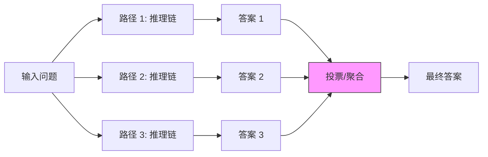

**CoT 在 gsd2 中的应用场景**：
- 代码理解：分析文件结构、依赖关系
- Bug 定位：通过多步推理缩小问题范围
- 重构决策：权衡不同方案的利弊

### 1.4 三种基础范式对比

| 特性 | Zero-shot | Few-shot | Chain-of-Thought |
|------|-----------|----------|------------------|
| 示例数量 | 0 | 1-10 | 0-3 |
| 推理深度 | 直接答案 | 模式匹配 | 显式推理 |
| 适用场景 | 简单明确任务 | 格式敏感任务 | 复杂推理任务 |
| Token 消耗 | 低 | 中 | 中高 |
| 输出稳定性 | 较低 | 高 | 中 |
| 工程复杂度 | 低 | 中 | 中 |

gsd2 在实际运行中采用混合策略：简单工具调用使用 Zero-shot，文件搜索等需要格式一致性的任务使用 Few-shot，复杂问题分析使用 CoT。

## 2. ReAct 模式（Reason + Act 循环）

### 2.1 ReAct 核心原理

ReAct（Reasoning + Acting）是由清华大学和 Google DeepMind 在 2023 年提出的 Agent 架构范式。其核心理念是：LLM 应该交替进行「推理」和「行动」，通过显式的思考过程引导工具调用，形成闭环反馈。

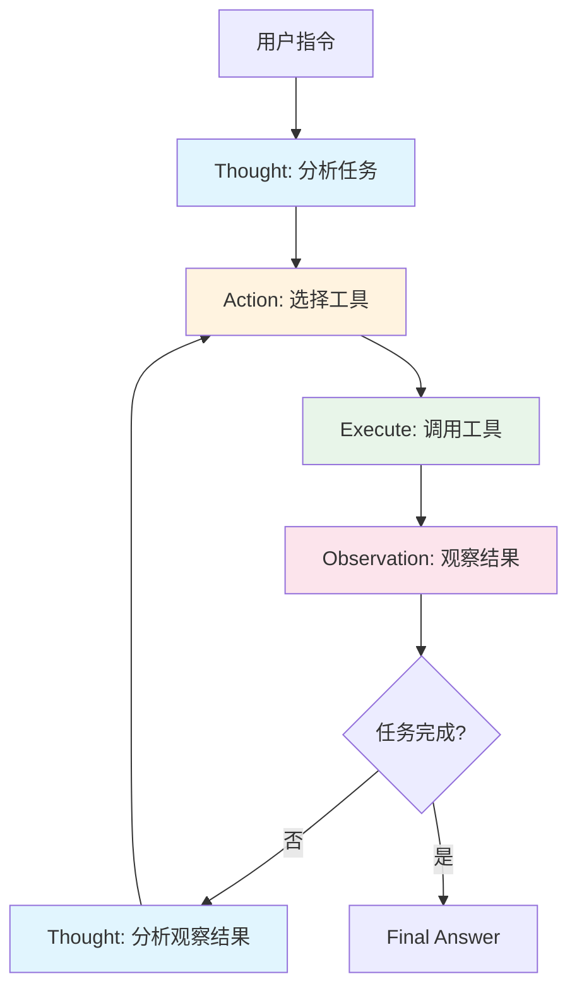

### 2.2 ReAct Prompt 设计

```python
from enum import Enum
from dataclasses import dataclass
from typing import Optional

class ActionType(Enum):
    """gsd2 支持的工具类型"""
    READ = "read"
    WRITE = "write" 
    EDIT = "edit"
    BASH = "bash"
    GLOB = "glob"
    GREP = "grep"
    WEB_SEARCH = "web_search"
    LITERAL_SEARCH = "literal_search"

@dataclass
class ReActStep:
    """ReAct 单步执行记录"""
    thought: str          # 推理过程
    action: ActionType    # 执行的动作
    action_input: str     # 动作参数
    observation: str      # 观察结果
    
@dataclass  
class ReActResult:
    """ReAct 执行结果"""
    steps: list[ReActStep]
    final_answer: str
    is_success: bool

REACT_SYSTEM_PROMPT = """你是一个专业的代码助手，擅长通过工具完成复杂的代码任务。

你必须严格按照以下格式输出每一步：

Thought: 你需要分析当前情况，决定下一步做什么<br/>
Action: [read, write, edit, bash, glob, grep, web_search, literal_search] 之一<br/>
Action Input: 工具的输入参数<br/>
Observation: 执行结果

注意：
- Thought 必须包含「为什么」做这个决定
- 只有在确定任务完成后才输出 Final Answer
- 每个 Action 后都要等待 Observation 再继续
- 如果某个 Action 失败，分析原因并尝试替代方案
"""

def format_react_prompt(history: list[ReActStep], current_task: str) -> str:
    """构建 ReAct 格式的 Prompt"""
    prompt_parts = [REACT_SYSTEM_PROMPT, "\n\nTask: ", current_task]
    
    for step in history:
        prompt_parts.extend([
            f"\n\nThought: {step.thought}",
            f"\nAction: {step.action.value}",
            f"\nAction Input: {step.action_input}",
            f"\nObservation: {step.observation}"
        ])
    
    prompt_parts.append("\n\nYour next step:")
    return "".join(prompt_parts)
```

### 2.3 ReAct 执行循环实现

```python
import json
import re
from typing import Generator

class ReActExecutor:
    """ReAct 模式的执行器"""
    
    def __init__(self, llm_client, tools: dict):
        self.llm = llm_client
        self.tools = tools
        self.max_iterations = 50
        self.max_tokens_per_step = 2048
    
    def parse_llm_response(self, response: str) -> tuple[str, str, str]:
        """解析 LLM 返回的 ReAct 格式响应"""
        thought_match = re.search(r'Thought:\s*(.+?)(?=\nAction:|$)', response, re.DOTALL)
        action_match = re.search(r'Action:\s*(\w+)', response)
        action_input_match = re.search(r'Action Input:\s*(.+?)(?=\n(?:Observation|Final)|$)', response, re.DOTALL)
        
        thought = thought_match.group(1).strip() if thought_match else ""
        action = action_match.group(1) if action_match else ""
        action_input = action_input_match.group(1).strip() if action_input_match else ""
        
        return thought, action, action_input
    
    def execute_action(self, action: str, action_input: str) -> str:
        """执行具体的工具调用"""
        if action not in self.tools:
            return f"Error: Unknown action '{action}'. Available: {list(self.tools.keys())}"
        
        try:
            tool = self.tools[action]
            # 解析 JSON 格式的 action_input
            if action_input.startswith("{"):
                args = json.loads(action_input)
            else:
                args = {"input": action_input}
            
            result = tool(**args)
            return str(result)[:5000]  # 截断过长的输出
        except Exception as e:
            return f"Error executing {action}: {str(e)}"
    
    def run(self, task: str, history: list[ReActStep] = None) -> ReActResult:
        """运行 ReAct 循环"""
        history = history or []
        
        for iteration in range(self.max_iterations):
            # 1. 生成 Prompt
            prompt = format_react_prompt(history, task)
            
            # 2. 调用 LLM
            response = self.llm.generate(
                prompt, 
                max_tokens=self.max_tokens_per_step,
                stop_sequences=["\n\n", "Final Answer:"]
            )
            
            # 3. 解析响应
            thought, action, action_input = self.parse_llm_response(response)
            
            # 4. 检查是否完成
            if "final answer" in response.lower():
                final_match = re.search(r'Final Answer:\s*(.+?)$', response, re.DOTALL)
                return ReActResult(
                    steps=history,
                    final_answer=final_match.group(1) if final_match else response,
                    is_success=True
                )
            
            # 5. 执行 Action
            observation = self.execute_action(action, action_input)
            
            # 6. 记录历史
            history.append(ReActStep(
                thought=thought,
                action=ActionType(action),
                action_input=action_input,
                observation=observation
            ))
        
        return ReActResult(
            steps=history,
            final_answer="达到最大迭代次数仍未完成",
            is_success=False
        )
```

### 2.4 ReAct 的优缺点分析

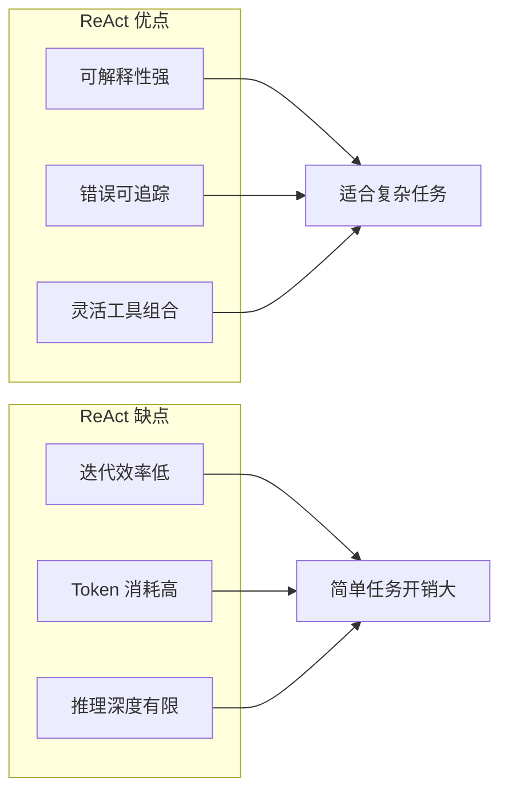

**ReAct 适用场景**：
- 需要多步推理的复杂任务
- 工具调用结果需要被后续推理使用的场景
- 调试和追踪执行过程重要的场景

**ReAct 不适用场景**：
- 单步可完成简单任务（开销不划算）
- 需要深度规划的长程任务（考虑 Plan-Execute 模式）

## 3. Plan-Execute 模式

### 3.1 为什么要 Plan-Execute？

ReAct 模式在每一步都同时进行推理和执行，这在简单场景下没问题，但面对复杂任务时存在问题：
- **缺乏全局视野**：每步只关注当前子目标，可能迷路
- **重复推理开销**：相似的推理在每步重复
- **长程任务退化**：50 步之后推理质量下降

Plan-Execute 模式通过「先规划再执行」的解耦解决了这些问题。

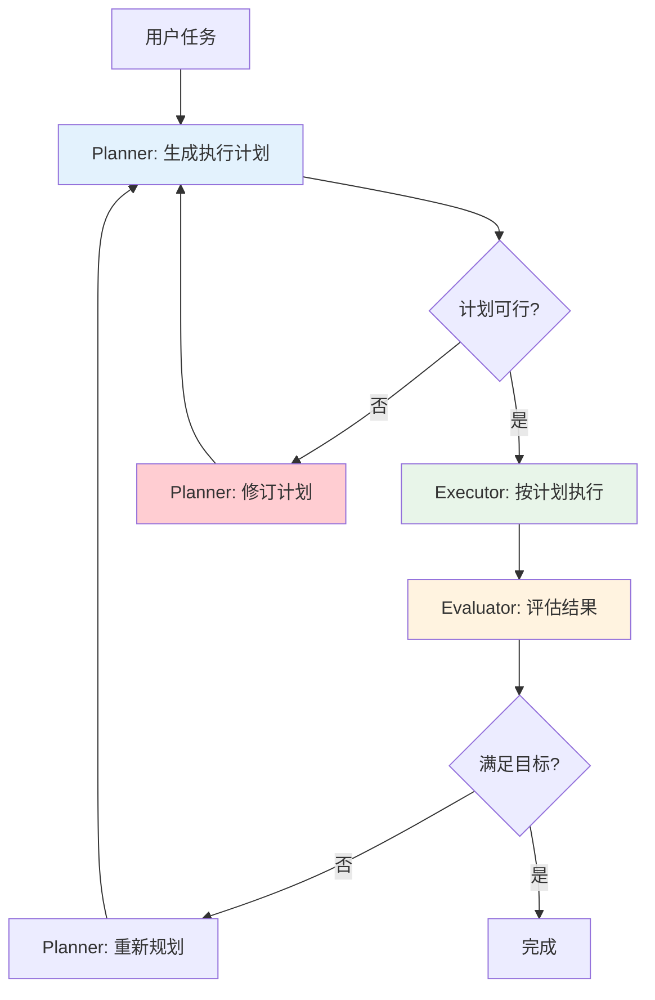

### 3.2 Plan-Execute 核心组件

```python
from abc import ABC, abstractmethod
from typing import Any
from dataclasses import dataclass, field

@dataclass
class PlanStep:
    """计划中的单个步骤"""
    step_id: int
    description: str
    tool: str
    args: dict
    depends_on: list[int] = field(default_factory=list)  # 依赖的前置步骤
    status: str = "pending"  # pending / running / completed / failed
    result: Any = None

@dataclass
class ExecutionPlan:
    """完整执行计划"""
    goal: str
    steps: list[PlanStep]
    estimated_steps: int
    requires_review: bool = False

@dataclass
class ExecutionResult:
    """执行结果"""
    success: bool
    completed_steps: list[PlanStep]
    failed_step: PlanStep | None
    output: Any
    feedback: str

class Planner:
    """Planner 组件：负责任务分解和计划生成"""
    
    SYSTEM_PROMPT = """你是一个任务规划专家。收到用户任务后，你需要：
    
    1. 分析任务目标，理解最终要达成什么
    2. 分解为最小可执行步骤
    3. 确定步骤间的依赖关系
    4. 评估计划可行性
    
    输出格式为 JSON：
    {
      "goal": "任务目标描述",
      "steps": [
        {
          "step_id": 1,
          "description": "步骤描述",
          "tool": "工具名",
          "args": {"param": "值"},
          "depends_on": []
        }
      ],
      "estimated_steps": 5,
      "requires_review": true/false
    }
    """
    
    def __init__(self, llm):
        self.llm = llm
    
    def create_plan(self, task: str) -> ExecutionPlan:
        """生成执行计划"""
        prompt = f"{self.SYSTEM_PROMPT}\n\nTask: {task}"
        response = self.llm.generate_json(prompt)
        return ExecutionPlan(
            goal=response["goal"],
            steps=[PlanStep(**s) for s in response["steps"]],
            estimated_steps=response["estimated_steps"],
            requires_review=response.get("requires_review", False)
        )
    
    def revise_plan(self, plan: ExecutionPlan, feedback: str) -> ExecutionPlan:
        """根据反馈修订计划"""
        prompt = f"""当前计划：
{json.dumps([{"id": s.step_id, "desc": s.description} for s in plan.steps], indent=2)}

反馈：{feedback}

请修订计划，保持相同的 JSON 格式输出。"""
        response = self.llm.generate_json(prompt)
        return ExecutionPlan(
            goal=response["goal"],
            steps=[PlanStep(**s) for s in response["steps"]],
            estimated_steps=response["estimated_steps"],
            requires_review=True
        )


class Executor:
    """Executor 组件：负责执行计划中的步骤"""
    
    def __init__(self, tools: dict):
        self.tools = tools
    
    def execute_step(self, step: PlanStep, context: dict) -> Any:
        """执行单个步骤"""
        if step.tool not in self.tools:
            raise ValueError(f"Unknown tool: {step.tool}")
        
        # 填充依赖步骤的结果到参数
        args = step.args.copy()
        for dep_id in step.depends_on:
            args[f"__prev_{dep_id}"] = context.get(dep_id)
        
        tool = self.tools[step.tool]
        return tool(**args)
    
    def execute_plan(self, plan: ExecutionPlan) -> ExecutionResult:
        """顺序执行计划（支持依赖图优化）"""
        context = {}
        completed = []
        
        # 按依赖顺序执行
        for step in plan.steps:
            step.status = "running"
            try:
                result = self.execute_step(step, context)
                step.result = result
                step.status = "completed"
                context[step.step_id] = result
                completed.append(step)
            except Exception as e:
                step.status = "failed"
                return ExecutionResult(
                    success=False,
                    completed_steps=completed,
                    failed_step=step,
                    output=context,
                    feedback=f"Step {step.step_id} failed: {str(e)}"
                )
        
        return ExecutionResult(
            success=True,
            completed_steps=completed,
            failed_step=None,
            output=context,
            feedback="Plan completed successfully"
        )


class Evaluator:
    """Evaluator 组件：评估执行结果是否满足目标"""
    
    SYSTEM_PROMPT = """你是一个结果评估专家。评估计划执行结果是否满足原始目标。

考虑：
1. 所有关键步骤是否完成？
2. 执行结果是否符合预期？
3. 是否有遗漏的边界情况？

直接输出评估结论和建议（如果需要重试）。
"""
    
    def __init__(self, llm):
        self.llm = llm
    
    def evaluate(self, plan: ExecutionPlan, result: ExecutionResult, original_task: str) -> tuple[bool, str]:
        """评估执行结果"""
        if not result.success:
            return False, f"Execution failed at step {result.failed_step.step_id}"
        
        # 收集关键结果
        key_results = {
            f"step_{s.step_id}": s.result 
            for s in result.completed_steps
        }
        
        prompt = f"""原始任务：{original_task}

执行计划目标：{plan.goal}

执行结果：{json.dumps(key_results, indent=2, default=str)}

{self.SYSTEM_PROMPT}

评估结论："""
        
        response = self.llm.generate(prompt)
        
        if "不满足" in response or "失败" in response or "需要重试" in response:
            return False, response
        return True, response
```

### 3.3 Plan-Execute 与 ReAct 的对比

| 维度 | ReAct | Plan-Execute |
|------|-------|--------------|
| 推理时机 | 每步推理 + 执行 | 先规划，再执行 |
| 适用复杂度 | 低-中 | 中-高 |
| Token 效率 | 较低（重复推理） | 较高（一次规划） |
| 全局视角 | 弱 | 强 |
| 错误恢复 | 依赖后续步骤 | 计划级别修订 |
| 实现复杂度 | 中 | 高 |
| 调试难度 | 低（步骤清晰） | 中（计划可能复杂） |

### 3.4 gsd2 中的 Plan-Execute 应用

gsd2 在处理复杂重构任务时采用 Plan-Execute 模式：

```python
class GSD2PlanExecute:
    """gsd2 的 Plan-Execute 实现"""
    
    # 典型重构任务的 Plan-Execute 流程
    REFACTORING_PLAN_PROMPT = """任务：重构 {file_path} 中的 {target_function}
    
    目标：将复杂函数拆分为多个可测试的小函数，保持对外接口不变。
    
    请规划：
    1. 分析函数依赖和调用关系
    2. 确定拆分边界
    3. 设计新函数接口
    4. 制定迁移步骤
    """
    
    def __init__(self, gsd2_instance):
        self.gsd2 = gsd2_instance
        self.planner = Planner(gsd2_instance.llm)
        self.executor = Executor(gsd2_instance.tools)
        self.evaluator = Evaluator(gsd2_instance.llm)
    
    async def refactor(self, file_path: str, function_name: str):
        """执行重构计划"""
        task = self.REFACTORING_PLAN_PROMPT.format(
            file_path=file_path,
            target_function=function_name
        )
        
        # 1. Planner 生成计划
        plan = self.planner.create_plan(task)
        
        # 2. 交互式确认（如果是高风险操作）
        if plan.requires_review:
            await self.gsd2.user_confirmation(plan)
        
        # 3. Executor 执行计划
        result = self.executor.execute_plan(plan)
        
        # 4. Evaluator 评估结果
        success, feedback = self.evaluator.evaluate(plan, result, task)
        
        if not success:
            # 修订计划重试
            plan = self.planner.revise_plan(plan, feedback)
            result = self.executor.execute_plan(plan)
        
        return result
```

## 4. Supervisor / Hierarchical 模式

### 4.1 分层架构的必要性

当 Code Agent 需要处理多维度、跨领域任务时，单一 Agent 的能力会出现瓶颈：
- **能力边界**：一个 Agent 的 Prompt 无法涵盖所有技能
- **并发需求**：多个子任务可能需要并行执行
- **专业化**：不同领域需要不同的工具和知识

Supervisor/Hierarchical 模式通过「主 Agent + 子 Agent」的分层架构解决这些问题。

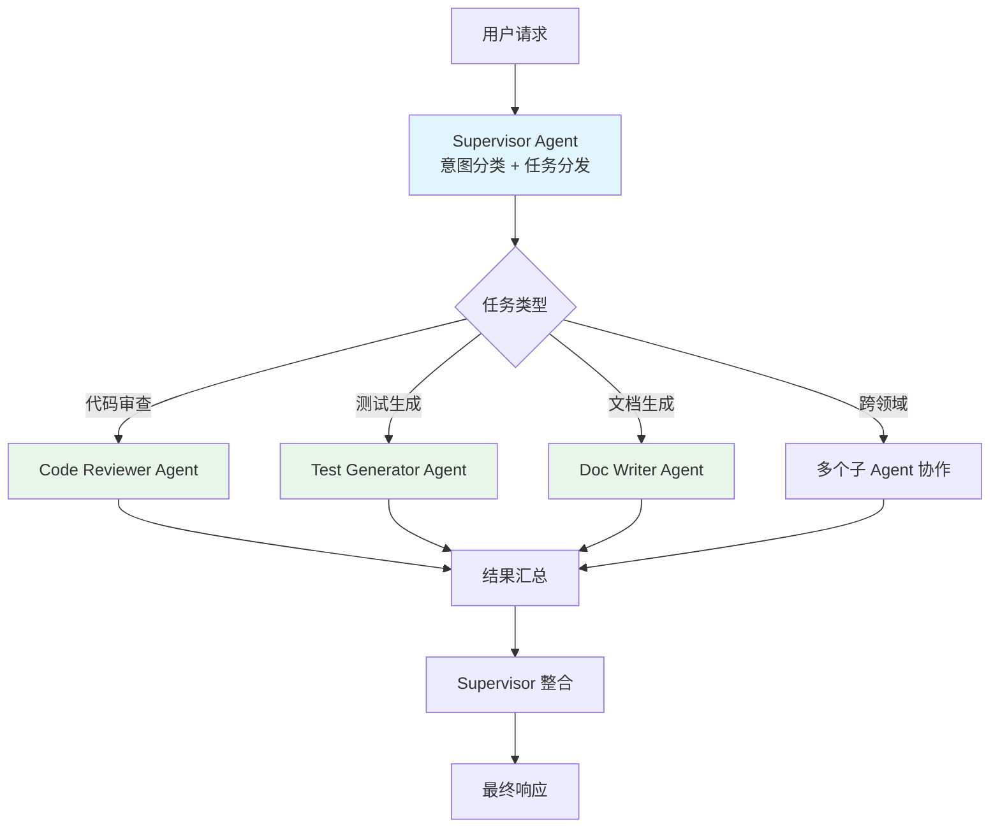

### 4.2 Supervisor 实现

```python
from typing import Literal
from dataclasses import dataclass
from enum import Enum

class TaskType(Enum):
    """任务类型枚举"""
    CODE_READ = "code_read"
    CODE_WRITE = "code_write"
    CODE_EDIT = "code_edit"
    CODE_REVIEW = "code_review"
    TEST_GENERATE = "test_generate"
    REFACTOR = "refactor"
    DEBUG = "debug"
    SEARCH = "search"
    UNKNOWN = "unknown"

@dataclass
class SubAgent:
    """子 Agent 定义"""
    name: str
    task_types: list[TaskType]
    system_prompt: str
    tools: list[str]
    max_concurrent: int = 1

class SupervisorAgent:
    """Supervisor 主 Agent"""
    
    SYSTEM_PROMPT = """你是一个任务调度专家。收到用户请求后，你需要：

    1. 理解用户意图
    2. 判断任务类型（单任务/多任务）
    3. 为每个子任务选择合适的执行 Agent
    4. 监控执行结果并在必要时调整
    
    可用的子 Agent：
    - code_reviewer: 代码审查，发现 bug 和安全问题
    - test_generator: 生成单元测试和集成测试
    - doc_writer: 生成代码文档和 API 文档
    - refactor_expert: 代码重构和优化
    - debugger: 定位和修复 bug
    
    输出格式：
    {
      "task_type": "类型",
      "sub_tasks": [
        {"agent": "agent_name", "description": "任务描述", "priority": 1}
      ],
      "coordination": "sequential/parallel",
      "needs_user_input": true/false
    }
    """
    
    def __init__(self, llm, sub_agents: list[SubAgent]):
        self.llm = llm
        self.sub_agents = {agent.name: agent for agent in sub_agents}
    
    def classify_task(self, user_input: str) -> dict:
        """分类用户任务"""
        prompt = f"{self.SYSTEM_PROMPT}\n\nUser Input: {user_input}"
        return self.llm.generate_json(prompt)
    
    def dispatch_task(self, sub_task: dict, context: dict) -> dict:
        """分发任务给子 Agent"""
        agent_name = sub_task["agent"]
        if agent_name not in self.sub_agents:
            return {"success": False, "error": f"Unknown agent: {agent_name}"}
        
        agent = self.sub_agents[agent_name]
        sub_prompt = f"""{agent.system_prompt}

任务背景：{context.get('original_task', '')}

当前任务：{sub_task['description']}

执行结果："""
        
        result = self.llm.generate(sub_prompt)
        return {"success": True, "agent": agent_name, "result": result}
    
    def coordinate(self, classification: dict, context: dict) -> dict:
        """协调多个子 Agent 的执行"""
        sub_tasks = classification.get("sub_tasks", [])
        coordination = classification.get("coordination", "sequential")
        
        results = []
        if coordination == "parallel":
            # 并行执行所有子任务
            import concurrent.futures
            with concurrent.futures.ThreadPoolExecutor() as executor:
                futures = [
                    executor.submit(self.dispatch_task, task, context)
                    for task in sub_tasks
                ]
                results = [f.result() for f in futures]
        else:
            # 顺序执行
            for task in sub_tasks:
                result = self.dispatch_task(task, context)
                results.append(result)
                
                # 如果某个任务失败，评估是否继续
                if not result["success"]:
                    break
        
        # Supervisor 整合结果
        return self.integrate_results(results, context)
    
    def integrate_results(self, results: list[dict], context: dict) -> dict:
        """整合子 Agent 结果"""
        integration_prompt = f"""你是一个结果整合专家。以下是多个子 Agent 的执行结果：

{json.dumps(results, indent=2, ensure_ascii=False)}

原始用户请求：{context.get('original_task', '')}

请整合这些结果，输出一致的最终响应。如果有冲突，请解决冲突并说明原因。
"""
        
        final_response = self.llm.generate(integration_prompt)
        return {
            "success": True,
            "results": results,
            "final_response": final_response
        }
```

### 4.3 子 Agent 实现

```python
class CodeReviewerAgent:
    """代码审查子 Agent"""
    
    SYSTEM_PROMPT = """你是一个资深的代码审查专家。专注于发现：
    1. Bug 和逻辑错误
    2. 安全漏洞（注入、认证绕过等）
    3. 性能问题
    4. 代码风格和可维护性问题
    
    对于每个发现的问题，请输出：
    - 文件和行号
    - 问题类型
    - 严重程度（高/中/低）
    - 具体描述
    - 修复建议
    """
    
    def __init__(self, llm, tools: dict):
        self.llm = llm
        self.tools = tools
    
    def review(self, code_context: str) -> str:
        prompt = f"""{self.SYSTEM_PROMPT}

待审查代码上下文：
{code_context}

审查结果："""
        return self.llm.generate(prompt)


class TestGeneratorAgent:
    """测试生成子 Agent"""
    
    SYSTEM_PROMPT = """你是一个测试工程专家。根据代码生成全面的测试用例：

    1. 单元测试：每个函数的边界条件和正常路径
    2. 集成测试：函数间的交互
    3. 错误处理测试：异常情况
    
    要求：
    - 使用 pytest 框架
    - 包含必要的 mock
    - 测试命名清晰描述测试场景
    """
    
    def __init__(self, llm, tools: dict):
        self.llm = llm
        self.tools = tools
    
    def generate_tests(self, code_context: str, test_framework: str = "pytest") -> str:
        prompt = f"""{self.SYSTEM_PROMPT}

目标代码：
{code_context}

测试框架：{test_framework}

生成测试代码：
"""
        return self.llm.generate(prompt)
```

### 4.4 层级模式对比总结

| 维度 | 单 Agent (ReAct) | Supervisor 模式 |
|------|-----------------|-----------------|
| 扩展性 | 低 | 高 |
| 专业化程度 | 泛化 | 深度专业化 |
| 任务并发 | 差 | 好 |
| 系统复杂度 | 低 | 高 |
| 调试难度 | 低 | 中 |
| 适用场景 | 简单/单一任务 | 复杂/多维度任务 |

gsd2 在 v2.0 架构中采用 Supervisor 模式，支持同时调用多个专业子 Agent 处理复杂的代码任务。

## 5. Tree of Thoughts 与搜索策略

### 5.1 ToT 核心思想

Tree of Thoughts (ToT) 是 2023 年由 Yale 和 Google Brain 提出的推理框架。与 CoT 的单链推理不同，ToT 将推理建模为树搜索问题，允许：
- 多条候选推理路径并行探索
- 有条件的分支和回溯
- 基于评估的路径剪枝

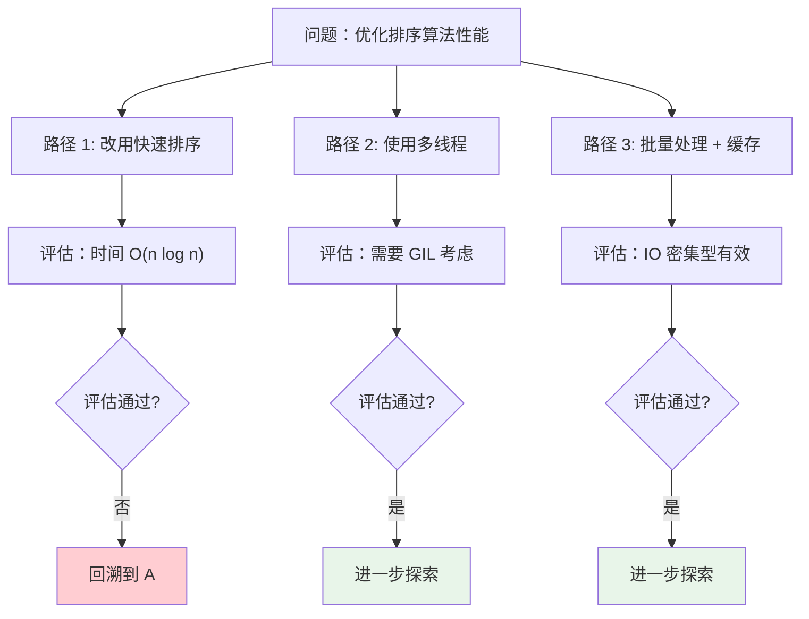

### 5.2 ToT 实现

```python
from dataclasses import dataclass, field
from typing import Callable, Generic, TypeVar
from enum import Enum
import random

T = TypeVar('T')

class NodeStatus(Enum):
    ACTIVE = "active"
    COMPLETED = "completed"
    PRUNED = "pruned"

@dataclass
class ThoughtNode:
    """ToT 中的思维节点"""
    content: str
    parent: 'ThoughtNode | None'
    children: list['ThoughtNode'] = field(default_factory=list)
    value: float = 0.0
    status: NodeStatus = NodeStatus.ACTIVE
    depth: int = 0

class TreeOfThoughts:
    """Tree of Thoughts 实现"""
    
    def __init__(
        self, 
        llm,
        generate_prompt: str,
        evaluate_prompt: str,
        max_depth: int = 5,
        max_branches: int = 3,
        prune_threshold: float = 0.5
    ):
        self.llm = llm
        self.generate_prompt = generate_prompt
        self.evaluate_prompt = evaluate_prompt
        self.max_depth = max_depth
        self.max_branches = max_branches
        self.prune_threshold = prune_threshold
    
    def generate_children(self, node: ThoughtNode) -> list[ThoughtNode]:
        """为节点生成子节点（候选推理步骤）"""
        prompt = f"""{self.generate_prompt}

当前推理状态：
{node.content}

请生成 {self.max_branches} 个不同的下一步推理方向，每个方向用一句话描述。
"""
        
        response = self.llm.generate(prompt)
        # 解析多个候选
        candidates = [line.strip() for line in response.split('\n') if line.strip()]
        
        children = []
        for i, cand in enumerate(candidates[:self.max_branches]):
            children.append(ThoughtNode(
                content=cand,
                parent=node,
                depth=node.depth + 1
            ))
        
        return children
    
    def evaluate_node(self, node: ThoughtNode) -> float:
        """评估节点的价值（0-1）"""
        prompt = f"""{self.evaluate_prompt}

推理路径：
{self.get_path_string(node)}

请评估这个推理方向的质量（0-1）：
- 1.0: 非常有前景，很可能解决问题
- 0.5: 中等，有一定合理性
- 0.0: 不可行或偏离目标

直接输出数值："""
        
        response = self.llm.generate(prompt).strip()
        try:
            return float(response)
        except ValueError:
            return 0.5
    
    def get_path_string(self, node: ThoughtNode) -> str:
        """获取从根到当前节点的路径"""
        path = []
        current = node
        while current:
            path.append(current.content)
            current = current.parent
        return " -> ".join(reversed(path))
    
    def search(self, problem: str, strategy: str = "breadth") -> ThoughtNode:
        """
        执行 ToT 搜索
        
        策略：
        - breadth: 广度优先，探索所有分支
        - depth: 深度优先，一条路径走到底
        - best: 最佳优先，总是选择最高价值的分支
        """
        # 创建根节点
        root = ThoughtNode(content=problem, parent=None, depth=0)
        queue = [root]
        
        while queue:
            if strategy == "breadth":
                current = queue.pop(0)  # FIFO
            elif strategy == "depth":
                current = queue.pop()   # LIFO
            elif strategy == "best":
                # 按价值排序，选择最高的
                queue.sort(key=lambda n: n.value, reverse=True)
                current = queue.pop(0)
            
            # 检查是否到达终止条件
            if current.depth >= self.max_depth:
                current.status = NodeStatus.COMPLETED
                continue
            
            # 生成子节点
            children = self.generate_children(current)
            current.children = children
            
            for child in children:
                value = self.evaluate_node(child)
                child.value = value
                
                # 剪枝决策
                if value < self.prune_threshold:
                    child.status = NodeStatus.PRUNED
                else:
                    queue.append(child)
        
        # 返回最佳叶节点
        return max(
            [n for n in self._get_all_nodes(root) if n.status == NodeStatus.ACTIVE],
            key=lambda n: n.value,
            default=root
        )
    
    def _get_all_nodes(self, root: ThoughtNode) -> list[ThoughtNode]:
        """获取所有节点"""
        nodes = [root]
        for child in root.children:
            nodes.extend(self._get_all_nodes(child))
        return nodes
```

### 5.3 ToT 与其他模式的对比

| 维度 | Chain-of-Thought | ReAct | Tree of Thoughts |
|------|-----------------|-------|------------------|
| 推理结构 | 线性链 | 线性链 + 行动 | 树状搜索 |
| 路径选择 | 固定 | 固定 | 多路径探索 |
| 回溯能力 | 无 | 有限 | 支持 |
| Token 消耗 | 低 | 中 | 高 |
| 最优性保证 | 无 | 无 | 近似最优 |
| 实现复杂度 | 低 | 中 | 高 |

### 5.4 gsd2 中的应用场景

```python
# gsd2 使用 ToT 的典型场景
TOT_SCENARIOS = {
    "algorithm_optimization": {
        "generate_prompt": """给定一个算法问题，探索多种可能的优化方向：""",
        "evaluate_prompt": """评估这个优化方向的效果和可行性：""",
        "use_case": "性能优化方案选择"
    },
    "architecture_design": {
        "generate_prompt": """给定一个系统设计问题，探索多种架构方案：""",
        "evaluate_prompt": """评估这个架构方案的优缺点：""",
        "use_case": "系统架构选型"
    },
    "bug_diagnosis": {
        "generate_prompt": """给定一个 bug 现象，推测可能的原因：""",
        "evaluate_prompt": """评估这个原因解释的可能性：""",
        "use_case": "复杂 bug 根因分析"
    }
}
```

## 6. Claude Code 的 Prompt 设计分析

### 6.1 Claude Code System Prompt 架构

Claude Code 的 System Prompt 是业界设计最精良的案例之一。其核心结构分为以下几个模块：

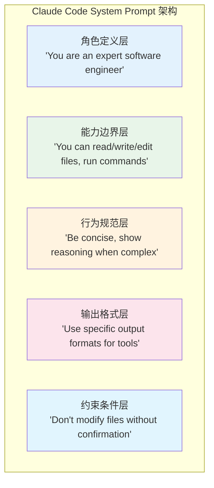

### 6.2 关键设计哲学

```typescript
// Claude Code Prompt 核心要素分析

interface ClaudeCodePromptConfig {
  // 1. 明确的角色定位
  role: {
    identity: "expert software engineer",
    expertise: [
      "app architecture",
      "code quality", 
      "writing clean code",
      "testing",
      "debugging"
    ],
    tone: "helpful and professional"
  },
  
  // 2. 清晰的能力边界
  capabilities: {
    canDo: [
      "read/write/edit files",
      "execute shell commands", 
      "search code",
      "run tests",
      "git operations"
    ],
    cannotDo: [
      "modify files outside project",
      "access external APIs without implementation",
      "guarantee specific performance"
    ]
  },
  
  // 3. 精确的工具描述
  tools: {
    description: "explicit JSON schema for each tool",
    emphasis: [
      "always confirm before destructive actions",
      "show command output before modifications",
      "handle errors gracefully"
    ]
  },
  
  // 4. 行为约束
  constraints: {
    safety: [
      "confirm before running destructive commands",
      "explain changes before making them",
      "preserve working code"
    ],
    efficiency: [
      "do it right the first time",
      "minimize round trips",
      "batch related operations"
    ],
    communication: [
      "be concise",
      "show reasoning for complex decisions",
      "ask for clarification when ambiguous"
    ]
  }
}
```

### 6.3 Claude Code 的 Tool Use 格式

Claude Code 采用严格的 JSON 格式定义工具调用，这种设计值得借鉴：

```json
{
  "tool": "bash",
  "input": {
    "command": "ls -la",
    "description": "List directory contents to verify files"
  }
}
```

```json
{
  "tool": "read", 
  "input": {
    "file_path": "src/main.py",
    "offset": 1,
    "limit": 100
  }
}
```

```json
{
  "tool": "write",
  "input": {
    "file_path": "src/utils.py",
    "content": "import os\n\ndef get_env(key: str) -> str:\n    return os.environ.get(key, '')"
  }
}
```

### 6.4 gsd2 对 Claude Code Prompt 的借鉴

```python
# gsd2 的 System Prompt 设计（借鉴 Claude Code）

GSD2_SYSTEM_PROMPT = """你是一个专业的 AI 代码助手，专注于帮助工程师完成软件开发任务。

## 角色定位
- 你是一个经验丰富的软件工程师，精通多种编程语言和框架
- 你注重代码质量、可维护性和最佳实践
- 你的沟通风格是专业、简洁、有条理

## 能力范围
你能够：
- 读取、编写、编辑代码文件
- 执行 Shell 命令
- 搜索文件和代码内容
- 运行测试和构建
- 进行 Git 操作

你不能：
- 在项目外部修改文件
- 执行可能造成数据丢失的操作（除非明确告知）
- 保证特定的执行性能

## 工具使用规范

### Read 工具
用于读取文件内容。参数：
- file_path: 文件路径
- offset: 开始行号（可选，默认 1）
- limit: 读取行数（可选）

### Write 工具
用于创建新文件或覆盖整个文件。参数：
- file_path: 文件路径
- content: 文件内容

### Edit 工具
用于对文件进行局部修改。参数：
- file_path: 文件路径
- old_string: 需要替换的原始内容（必须精确匹配）
- new_string: 替换后的新内容

### Bash 工具
用于执行 Shell 命令。参数：
- command: 要执行的命令
- timeout: 超时时间（秒，默认 30）

### Glob 工具
用于搜索文件。参数：
- pattern: 文件匹配模式（如 **/*.py）

### Grep 工具
用于搜索文件内容。参数：
- pattern: 正则表达式模式
- path: 搜索路径

## 行为准则

### 安全优先
- 执行删除、覆盖等不可逆操作前必须确认
- 危险命令（如 rm -rf）需要特别小心
- 修改前先读取文件确认内容

### 效率优先
- 批量相关的操作减少交互次数
- 先规划再执行，避免反复修改
- 善用 Glob/Grep 定位而非逐个文件查看

### 沟通清晰
- 简单任务直接给出结果
- 复杂任务展示推理过程
- 不确定时主动询问

## 输出格式
对于工具调用，统一使用以下 JSON 格式：
{
  "tool": "工具名",
  "input": {
    // 工具参数
  }
}

对于最终回复，使用清晰的 Markdown 格式。
"""
```

## 7. System Prompt 工程化

### 7.1 角色定义的艺术

角色定义是 System Prompt 的「灵魂」，决定 Agent 的行为基调。好的角色定义应该：

```python
# 角色定义模板

ROLE_TEMPLATE = """
## 角色定义

### 身份
{identity}

### 专业领域
{domain_expertise}

### 工作风格
{work_style}

### 约束条件
{constraints}
"""

# 实际示例
EXAMPLE_ROLE = {
    "identity": "你是一个专注于 {language} 的后端工程师",
    "domain_expertise": [
        "系统设计：擅长设计高并发、高可用的系统架构",
        "代码质量：精通设计模式，追求简洁优雅的代码",
        "性能优化：熟悉常见性能瓶颈和优化策略",
        "测试实践：重视测试，追求高覆盖率"
    ],
    "work_style": [
        "先理解需求，再制定方案，最后实现",
        "代码即文档，注重可读性",
        "小步提交，持续集成"
    ],
    "constraints": [
        "不写冗余代码",
        "不过度工程化",
        "尊重现有代码风格"
    ]
}
```

### 7.2 工具描述的最佳实践

```python
# 工具描述的完整模板

TOOL_DESCRIPTION_TEMPLATE = """
### {tool_name} 工具

**用途**: {purpose}

**参数**:
{parameters}

**使用场景**: {when_to_use}

**注意事项**: 
{cautions}

**示例**:
```json
{example}
```
"""

# 完整示例
READ_TOOL_DESCRIPTION = """
### Read 工具

**用途**: 读取文件内容，支持大文件分片读取

**参数**:
- file_path (string, required): 文件的绝对路径
- offset (integer, optional): 开始行号，从 1 开始计数，默认 1
- limit (integer, optional): 最多读取的行数，默认 100

**使用场景**: 
- 查看文件内容
- 确认修改前的原始代码
- 分析代码结构

**注意事项**:
- offset 和 limit 用于处理大文件，避免一次性加载
- 文件不存在会返回错误

**示例**:
```json
{
  "tool": "read",
  "input": {
    "file_path": "/home/user/project/main.py",
    "offset": 1,
    "limit": 50
  }
}
```
"""

# 参数的 JSON Schema 定义
TOOL_PARAMETER_SCHEMA = {
    "type": "object",
    "properties": {
        "file_path": {
            "type": "string",
            "description": "文件的绝对路径",
            "pattern": "^/.*"
        },
        "offset": {
            "type": "integer", 
            "description": "开始行号（1-indexed）",
            "minimum": 1,
            "default": 1
        },
        "limit": {
            "type": "integer",
            "description": "最多读取行数",
            "minimum": 1,
            "maximum": 1000,
            "default": 100
        }
    },
    "required": ["file_path"]
}
```

### 7.3 约束条件的层次设计

```python
from enum import Enum

class ConstraintLevel(Enum):
    """约束级别"""
    HARD = "hard"    # 绝对不能违反
    SOFT = "soft"    # 尽量遵守，特殊情况下可调整
    GUIDE = "guide"  # 指导原则，可灵活解释

@dataclass
class Constraint:
    """约束条件"""
    level: ConstraintLevel
    description: str
    reason: str
    example: str | None = None

# 分层约束示例
CONSTRAINT_HIERARCHY = {
    "安全类": [
        Constraint(
            level=ConstraintLevel.HARD,
            description="删除操作前必须确认",
            reason="防止数据丢失",
            example="执行 rm 前先 ls 确认文件存在"
        ),
        Constraint(
            level=ConstraintLevel.HARD,
            description="不执行来源不明的命令",
            reason="防止安全威胁",
            example="拒绝执行用户粘贴的未经解释的 rm -rf 命令"
        )
    ],
    "质量类": [
        Constraint(
            level=ConstraintLevel.SOFT,
            description="修改前先备份",
            reason="便于回滚",
            example="重要文件修改前使用 git commit"
        ),
        Constraint(
            level=ConstraintLevel.GUIDE,
            description="优先使用标准库",
            reason="减少依赖",
            example="能用 stdlib 就不引入新包"
        )
    ],
    "效率类": [
        Constraint(
            level=ConstraintLevel.SOFT,
            description="批量操作减少交互",
            reason="提升效率",
            example="一次读取多个相关文件而非逐个读取"
        )
    ]
}

def format_constraints(constraints: dict) -> str:
    """格式化约束条件到 Prompt"""
    lines = ["## 约束条件\n"]
    for category, items in constraints.items():
        lines.append(f"### {category}")
        for c in items:
            level_tag = {
                ConstraintLevel.HARD: "[必须]",
                ConstraintLevel.SOFT: "[建议]", 
                ConstraintLevel.GUIDE: "[参考]"
            }[c.level]
            lines.append(f"- {level_tag} {c.description}")
            lines.append(f"  - 原因: {c.reason}")
            if c.example:
                lines.append(f"  - 示例: {c.example}")
        lines.append("")
    return "\n".join(lines)
```

### 7.4 Prompt 版本管理

```python
import hashlib
from dataclasses import dataclass
from datetime import datetime

@dataclass
class PromptVersion:
    """Prompt 版本记录"""
    version: str
    content: str
    created_at: datetime
    changelog: str
    performance_metrics: dict | None = None

class PromptVersionManager:
    """Prompt 版本管理器"""
    
    def __init__(self, storage_path: str):
        self.storage_path = storage_path
        self.versions: list[PromptVersion] = []
    
    def save_version(self, content: str, changelog: str) -> str:
        """保存新版本"""
        version_hash = hashlib.md5(content.encode()).hexdigest()[:8]
        version = PromptVersion(
            version=f"v{datetime.now().strftime('%Y%m%d')}-{version_hash}",
            content=content,
            created_at=datetime.now(),
            changelog=changelog
        )
        self.versions.append(version)
        return version.version
    
    def get_version(self, version: str) -> PromptVersion | None:
        """获取指定版本"""
        for v in self.versions:
            if v.version == version:
                return v
        return None
    
    def compare_versions(self, v1: str, v2: str) -> str:
        """对比两个版本的差异"""
        p1 = self.get_version(v1)
        p2 = self.get_version(v2)
        if not p1 or not p2:
            return "Version not found"
        
        # 简单的 diff 逻辑
        lines1 = p1.content.split("\n")
        lines2 = p2.content.split("\n")
        
        diff_lines = []
        for i, (l1, l2) in enumerate(zip(lines1, lines2)):
            if l1 != l2:
                diff_lines.append(f"- Line {i+1}: {l1}")
                diff_lines.append(f"+ Line {i+1}: {l2}")
        
        return "\n".join(diff_lines)
```

## 8. 上下文窗口管理

### 8.1 上下文窗口的挑战

LLM 的上下文窗口虽然不断增大（从 4K 到 200K 到 1M），但实际应用中的上下文管理依然是核心挑战：

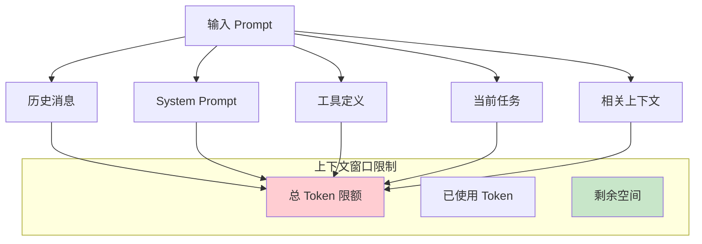

### 8.2 截断策略

```python
from dataclasses import dataclass
from typing import Literal

class TruncationStrategy(Enum):
    """截断策略枚举"""
    FIRST = "first"        # 保留开头
    LAST = "last"          # 保留结尾
    MIDDLE = "middle"      # 保留开头和结尾
    SUMMARY = "summary"     # 用摘要替代
    IMPORTANCE = "importance"  # 按重要性保留

@dataclass
class Message:
    """消息结构"""
    role: str  # system/user/assistant
    content: str
    timestamp: float
    importance: float = 1.0  # 0-1 重要性评分

class ContextWindowManager:
    """上下文窗口管理器"""
    
    def __init__(
        self,
        max_tokens: int = 100000,
        system_prompt_tokens: int = 2000,
        tool_definition_tokens: int = 3000,
        reserved_tokens: int = 5000
    ):
        self.max_tokens = max_tokens
        self.system_prompt_tokens = system_prompt_tokens
        self.tool_definition_tokens = tool_definition_tokens
        self.reserved_tokens = reserved_tokens
        # 可用于历史消息的空间
        self.available_tokens = max_tokens - system_prompt_tokens - tool_definition_tokens - reserved_tokens
    
    def count_tokens(self, text: str) -> int:
        """估算 token 数量（简化版，实际应使用 tokenizer）"""
        # 中文约 1.5 字符/token，英文约 4 字符/token
        chinese_chars = sum(1 for c in text if '\u4e00' <= c <= '\u9fff')
        other_chars = len(text) - chinese_chars
        return int(chinese_chars * 0.67 + other_chars * 0.25)
    
    def truncate_messages(
        self,
        messages: list[Message],
        strategy: TruncationStrategy = TruncationStrategy.MIDDLE
    ) -> list[Message]:
        """截断消息历史"""
        
        # 计算消息的 token 消耗
        message_tokens = []
        total = 0
        for msg in messages:
            tokens = self.count_tokens(msg.content)
            message_tokens.append((msg, tokens))
            total += tokens
        
        # 如果已经满足限制，直接返回
        if total <= self.available_tokens:
            return messages
        
        # 按策略截断
        if strategy == TruncationStrategy.FIRST:
            return self._truncate_first(message_tokens)
        elif strategy == TruncationStrategy.LAST:
            return self._truncate_last(message_tokens)
        elif strategy == TruncationStrategy.MIDDLE:
            return self._truncate_middle(message_tokens)
        elif strategy == TruncationStrategy.IMPORTANCE:
            return self._truncate_by_importance(message_tokens)
        
        return messages
    
    def _truncate_first(self, message_tokens: list) -> list[Message]:
        """保留开头消息"""
        result = []
        total = 0
        for msg, tokens in message_tokens:
            if total + tokens > self.available_tokens:
                break
            result.append(msg)
            total += tokens
        return result
    
    def _truncate_last(self, message_tokens: list) -> list[Message]:
        """保留结尾消息"""
        result = []
        total = 0
        for msg, tokens in reversed(message_tokens):
            if total + tokens > self.available_tokens:
                break
            result.insert(0, msg)
            total += tokens
        return result
    
    def _truncate_middle(self, message_tokens: list) -> list[Message]:
        """保留开头和结尾"""
        # 预留一半空间给开头，一半给结尾
        half_tokens = self.available_tokens // 2
        
        # 收集开头消息
        first_part = []
        total_first = 0
        for msg, tokens in message_tokens:
            if total_first + tokens > half_tokens:
                break
            first_part.append(msg)
            total_first += tokens
        
        # 收集结尾消息
        last_part = []
        total_last = 0
        for msg, tokens in reversed(message_tokens):
            if total_last + tokens > half_tokens:
                break
            last_part.insert(0, msg)
            total_last += tokens
        
        # 如果首尾有重叠，优先保留结尾
        if len(first_part) + len(last_part) > len(message_tokens):
            overlap = len(message_tokens) - len(first_part) - len(last_part)
            first_part = first_part[:-overlap] if overlap > 0 else first_part
        
        return first_part + last_part
    
    def _truncate_by_importance(self, message_tokens: list) -> list[Message]:
        """按重要性保留"""
        # 按重要性排序
        sorted_messages = sorted(message_tokens, key=lambda x: x[0].importance, reverse=True)
        
        result = []
        total = 0
        for msg, tokens in sorted_messages:
            if total + tokens > self.available_tokens:
                continue  # 跳过而非停止，尝试保留更多高重要性的
            result.append(msg)
            total += tokens
        
        # 按原始顺序排列
        result.sort(key=lambda x: messages.index(x))
        return result
```

### 8.3 关键信息保留策略

```python
from dataclasses import dataclass
import re

@dataclass
class PreservedInfo:
    """需要保留的关键信息"""
    info_type: str      # 类型：constraint, context, state 等
    content: str        # 具体内容
    tokens: int         # token 估算
    immutable: bool     # 是否不可截断

class KeyInfoPreserver:
    """关键信息保留器"""
    
    # 关键信息模式
    KEY_PATTERNS = {
        "file_path": r'/[a-zA-Z0-9_/.-]+\.[a-zA-Z]+',  # 文件路径
        "variable": r'\b[a-zA-Z_][a-zA-Z0-9_]*\b',      # 变量名
        "function": r'def\s+([a-zA-Z_][a-zA-Z0-9_]*)',  # 函数定义
        "class": r'class\s+([a-zA-Z_][a-zA-Z0-9_]*)',   # 类定义
        "error": r'[Ee]rror[:\s]+([^\n]+)',             # 错误信息
    }
    
    def __init__(self):
        self.preserved_info: list[PreservedInfo] = []
    
    def extract_key_info(self, messages: list[Message]) -> list[PreservedInfo]:
        """从消息中提取关键信息"""
        key_info = []
        
        for msg in messages:
            # 提取文件路径
            paths = re.findall(self.KEY_PATTERNS["file_path"], msg.content)
            for p in paths:
                key_info.append(PreservedInfo(
                    info_type="file_path",
                    content=p,
                    tokens=self._estimate_tokens(p),
                    immutable=True
                ))
            
            # 提取错误信息
            errors = re.findall(self.KEY_PATTERNS["error"], msg.content)
            for e in errors:
                key_info.append(PreservedInfo(
                    info_type="error",
                    content=e,
                    tokens=self._estimate_tokens(e),
                    immutable=True
                ))
        
        return key_info
    
    def build_preserved_context(self, key_info: list[PreservedInfo]) -> str:
        """构建保留的上下文摘要"""
        if not key_info:
            return ""
        
        # 按类型分组
        by_type = {}
        for info in key_info:
            if info.info_type not in by_type:
                by_type[info.info_type] = []
            by_type[info.info_type].append(info.content)
        
        lines = ["## 关键上下文信息（不可截断）\n"]
        for info_type, items in by_type.items():
            lines.append(f"### {info_type}: {', '.join(set(items))}")
        
        return "\n".join(lines)
    
    def _estimate_tokens(self, text: str) -> int:
        return len(text) // 4
```

### 8.4 历史压缩技术

```python
class HistoryCompressor:
    """对话历史压缩器"""
    
    def __init__(self, llm):
        self.llm = llm
    
    def compress(self, messages: list[Message], target_tokens: int) -> list[Message]:
        """
        将对话历史压缩到目标 token 数量
        使用 LLM 生成摘要
        """
        if not messages:
            return []
        
        # 计算当前 token
        current_tokens = sum(self._estimate_tokens(m.content) for m in messages)
        
        if current_tokens <= target_tokens:
            return messages
        
        # 分块压缩
        chunk_size = 10  # 每 10 条消息压缩一次
        compressed = []
        
        for i in range(0, len(messages), chunk_size):
            chunk = messages[i:i+chunk_size]
            
            if i + chunk_size < len(messages):
                # 中间块，压缩成摘要
                summary = self._summarize_chunk(chunk)
                compressed.append(Message(
                    role="system",
                    content=f"[对话摘要 {i//chunk_size + 1}]: {summary}",
                    timestamp=chunk[0].timestamp,
                    importance=0.8
                ))
            else:
                # 最后几块，保留原始内容（但可能截断）
                compressed.extend(chunk)
        
        return compressed
    
    def _summarize_chunk(self, chunk: list[Message]) -> str:
        """生成块摘要"""
        content = "\n".join([
            f"{m.role}: {m.content[:200]}..." if len(m.content) > 200 else f"{m.role}: {m.content}"
            for m in chunk
        ])
        
        prompt = f"""请总结以下对话的要点，保留关键信息和决策：

{content}

摘要要求：
- 保留关键文件路径、函数名、变量名
- 保留重要的决策和结论
- 保留错误和解决方案
- 用简洁的语言概括

摘要："""
        
        return self.llm.generate(prompt).strip()
```

### 8.5 上下文管理策略对比

| 策略 | 优点 | 缺点 | 适用场景 |
|------|------|------|----------|
| 保留开头 | 保留背景信息 | 丢失最新状态 | 需要背景信息的任务 |
| 保留结尾 | 保留最新状态 | 丢失历史背景 | 状态敏感的任务 |
| 保留首尾 | 平衡两者 | 中间信息丢失 | 通用场景 |
| 按重要性 | 最大价值保留 | 计算开销大 | 复杂对话 |
| 摘要压缩 | 最大信息密度 | 可能丢失细节 | 长对话 |

gsd2 采用混合策略：最近 N 条消息保留原始内容，更早的用摘要压缩，确保 System Prompt 和工具定义始终完整。

## 9. Prompt 模板系统设计

### 9.1 模板系统架构

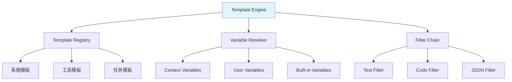

### 9.2 模板引擎实现

```python
import re
from typing import Any, Callable
from dataclasses import dataclass
from enum import Enum

class TemplateType(Enum):
    SYSTEM = "system"
    TOOL = "tool"
    TASK = "task"
    RESPONSE = "response"

@dataclass
class Template:
    """模板定义"""
    name: str
    type: TemplateType
    content: str
    variables: list[str]
    description: str = ""
    version: str = "1.0"

class TemplateEngine:
    """Prompt 模板引擎"""
    
    def __init__(self):
        self.templates: dict[str, Template] = {}
        self.variable_resolvers: dict[str, Callable] = {}
        self.filters: dict[str, Callable] = {}
        
        # 注册内置变量
        self._register_builtin_variables()
        # 注册内置过滤器
        self._register_builtin_filters()
    
    def register_template(self, template: Template):
        """注册模板"""
        self.templates[template.name] = template
    
    def register_variable(self, name: str, resolver: Callable):
        """注册变量解析器"""
        self.variable_resolvers[name] = resolver
    
    def register_filter(self, name: str, filter_func: Callable):
        """注册过滤器"""
        self.filters[name] = filter_func
    
    def render(self, template_name: str, context: dict = None) -> str:
        """渲染模板"""
        context = context or {}
        template = self.templates.get(template_name)
        
        if not template:
            raise ValueError(f"Template not found: {template_name}")
        
        content = template.content
        
        # 解析变量 {{ variable_name }}
        content = self._resolve_variables(content, context)
        
        # 应用过滤器 {{ variable | filter }}
        content = self._apply_filters(content)
        
        return content
    
    def _resolve_variables(self, content: str, context: dict) -> str:
        """解析变量引用"""
        # 匹配 {{ var }} 或 {{ var|filter }}
        pattern = r'\{\{\s*(\w+)(?:\|(\w+))?\s*\}\}'
        
        def replace(match):
            var_name = match.group(1)
            filter_name = match.group(2)
            
            # 优先从 context 获取
            if var_name in context:
                value = context[var_name]
            elif var_name in self.variable_resolvers:
                value = self.variable_resolvers[var_name](context)
            else:
                value = f"{{{{{var_name}}}}}"  # 保留未解析的变量
            
            # 应用过滤器
            if filter_name and filter_name in self.filters:
                value = self.filters[filter_name](value)
            
            return str(value)
        
        return re.sub(pattern, replace, content)
    
    def _apply_filters(self, content: str) -> str:
        """应用过滤器到整个内容"""
        # 可以在这里添加全局过滤器
        return content
    
    def _register_builtin_variables(self):
        """注册内置变量"""
        import datetime
        
        self.register_variable("today", lambda ctx: datetime.date.today().isoformat())
        self.register_variable("now", lambda ctx: datetime.datetime.now().isoformat())
        self.register_variable("uuid", lambda ctx: str(uuid.uuid4())[:8])
    
    def _register_builtin_filters(self):
        """注册内置过滤器"""
        self.register_filter("upper", lambda x: x.upper())
        self.register_filter("lower", lambda x: x.lower())
        self.register_filter("trim", lambda x: x.strip())
        self.register_filter("json", lambda x: json.dumps(x, ensure_ascii=False) if isinstance(x, (dict, list)) else x)
        self.register_filter("indent", lambda x: "\n".join("  " + line for line in x.split("\n")))
```

### 9.3 模板注册示例

```python
def register_gsd2_templates(engine: TemplateEngine):
    """注册 gsd2 的标准模板"""
    
    # System Prompt 模板
    engine.register_template(Template(
        name="gsd2_system",
        type=TemplateType.SYSTEM,
        content="""你是一个专业的 AI 代码助手，名为 gsd2。

## 身份
- 你专注于帮助工程师完成软件开发任务
- 你擅长阅读、编写、修改代码
- 你注重代码质量和最佳实践

## 能力
- 读取、编写、编辑文件
- 执行 Shell 命令
- 搜索文件和代码
- 运行测试和构建

## 行为准则
{{ behavior_constraints }}

## 当前项目上下文
{{ project_context }}
""",
        variables=["behavior_constraints", "project_context"],
        description="gsd2 主系统 Prompt"
    ))
    
    # 工具调用模板
    engine.register_template(Template(
        name="tool_call",
        type=TemplateType.TOOL,
        content="""## {{ tool_name }} 工具

**用途**: {{ tool_purpose }}

**参数**:
{{ tool_parameters }}

**使用示例**:
```json
{{ tool_example }}
```
""",
        variables=["tool_name", "tool_purpose", "tool_parameters", "tool_example"],
        description="工具定义模板"
    ))
    
    # 任务执行模板
    engine.register_template(Template(
        name="task_execution",
        type=TemplateType.TASK,
        content="""## 任务: {{ task_name }}

### 任务描述
{{ task_description }}

### 约束条件
{{ task_constraints }}

### 预期输出
{{ expected_output }}

### 开始执行
{{ execution_start }}
""",
        variables=["task_name", "task_description", "task_constraints", "expected_output", "execution_start"],
        description="任务执行模板"
    ))
    
    # 代码审查模板
    engine.register_template(Template(
        name="code_review",
        type=TemplateType.TASK,
        content="""## 代码审查任务

### 待审查代码
文件: {{ file_path }}
```{{ language }}
{{ code_content }}
```

### 审查要点
1. **正确性**: 逻辑错误、边界条件处理
2. **安全性**: 注入漏洞、认证授权问题
3. **性能**: 时间/空间复杂度、资源泄漏
4. **可维护性**: 代码风格、文档、测试覆盖

### 输出格式
```json
{
  "issues": [
    {
      "line": 行号,
      "severity": "high/medium/low",
      "type": "correctness/security/performance/maintainability",
      "description": "问题描述",
      "suggestion": "修复建议"
    }
  ],
  "summary": "总结"
}
```
""",
        variables=["file_path", "language", "code_content"],
        description="代码审查任务模板"
    ))
```

### 9.4 模板组合与继承

```python
class TemplateInheritance:
    """模板继承机制"""
    
    @staticmethod
    def create_variant(base_name: str, override: dict) -> Template:
        """基于已有模板创建变体"""
        # 简化实现，实际应该从注册表获取
        base_content = f"基于 {base_name} 的变体模板"
        return Template(
            name=f"{base_name}_variant_{override.get('suffix', '1')}",
            type=TemplateType.TASK,
            content=base_content,
            variables=override.get("variables", []),
            description=f"从 {base_name} 派生"
        )

# 模板组合示例
def compose_code_generation_prompt(
    engine: TemplateEngine,
    language: str,
    task_type: str,
    constraints: list[str]
) -> str:
    """组合代码生成 Prompt"""
    
    # 获取基础模板
    base = engine.render("code_generation_base", {
        "language": language,
        "task_type": task_type
    })
    
    # 添加约束
    constraint_section = "\n".join([f"- {c}" for c in constraints])
    
    # 获取相关示例
    examples = engine.render("code_examples", {
        "language": language,
        "task_type": task_type
    })
    
    return f"""{base}

## 额外约束
{constraint_section}

## 参考示例
{examples}
"""
```

### 9.5 模板系统对比

| 特性 | 简单字符串替换 | 正则替换 | 完整模板引擎 |
|------|---------------|----------|--------------|
| 实现复杂度 | 低 | 中 | 高 |
| 变量支持 | 基础 | 中等 | 完整 |
| 过滤器 | 无 | 有限 | 丰富 |
| 继承机制 | 无 | 无 | 支持 |
| 调试友好度 | 高 | 中 | 中 |
| 性能 | 最高 | 高 | 中 |
| 适用规模 | 小型项目 | 中型项目 | 大型项目 |

gsd2 采用完整模板引擎架构，支持模板版本管理、变量缓存和动态加载，便于团队协作和 Prompt 的迭代优化。

## 10. 总结与展望

### 10.1 技术体系回顾

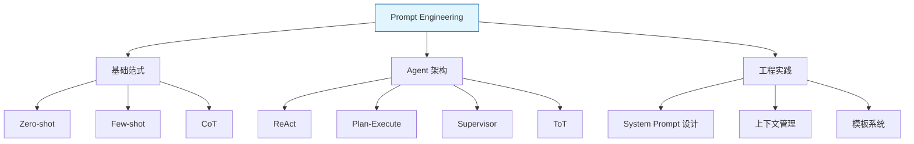

### 10.2 选型决策矩阵

| 场景 | 推荐模式 | 关键理由 |
|------|----------|----------|
| 简单工具调用 | Zero-shot | 开销最低 |
| 格式敏感任务 | Few-shot | 示例引导 |
| 复杂推理 | CoT / ToT | 显式推理链 |
| 多步骤任务 | ReAct | 推理-执行闭环 |
| 长程复杂任务 | Plan-Execute | 全局规划 |
| 多领域任务 | Supervisor | 专业分工 |
| 探索性任务 | ToT | 多路径搜索 |

### 10.3 gsd2 架构演进路线

gsd2 从 Claude Code 插件演进而来，在 Prompt Engineering 方面持续迭代：

- **v1.x**: 基于 ReAct 的单一 Agent 架构
- **v2.0**: 引入 Plan-Execute 支持复杂任务
- **v2.1**: Supervisor 模式支持多子 Agent 协作
- **v2.2**: ToT 集成增强探索能力

### 10.4 未来方向

1. **自适应 Prompt**: 根据任务复杂度动态选择 Prompt 策略
2. **多模态融合**: 代码 + 图表 + 文档的联合理解
3. **长期记忆**: 跨会话的知识积累和复用
4. **安全强化**: Prompt 注入攻击的防护机制

---

*本文是 Code Agent 技术系列的第三章，后续将深入探讨工具调用、记忆系统和多 Agent 协作等主题。*
