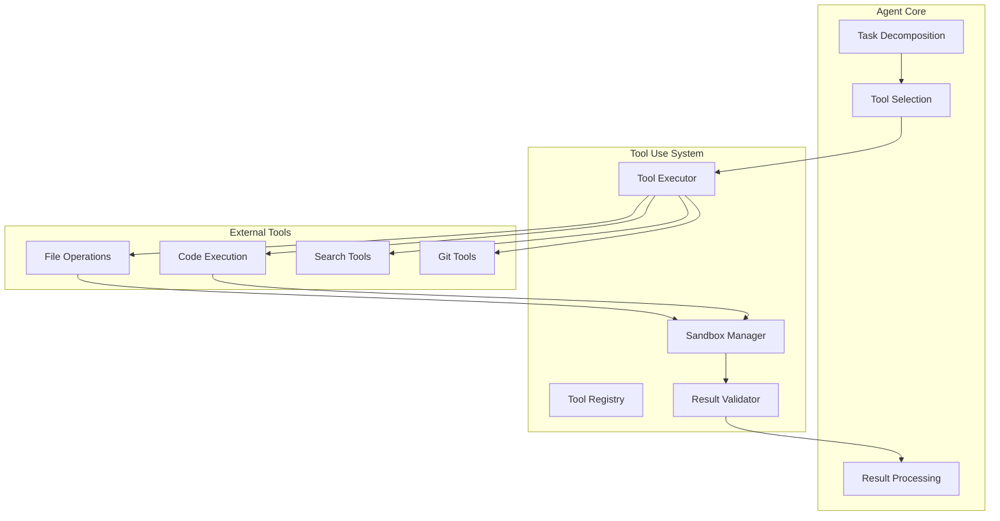
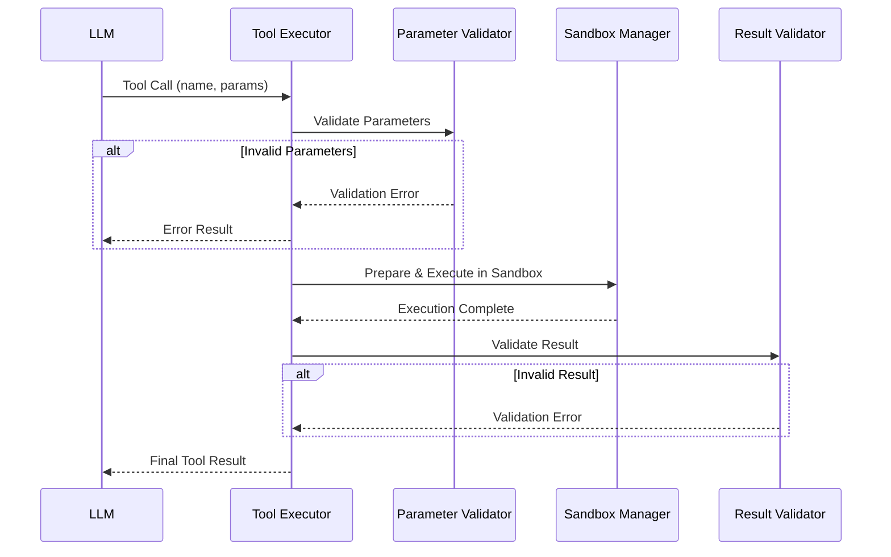
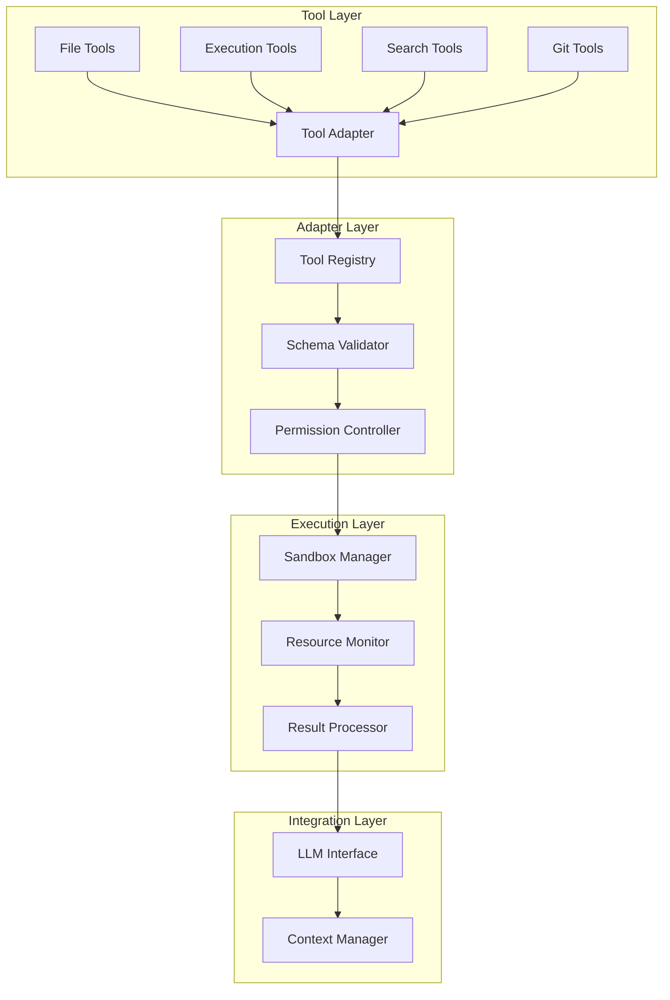

# Code Agent Ch4: Tool Use 系统设计

## 1. Tool Use 概述

### 1.1 什么是 Tool Use

Tool Use（工具使用）是 Code Agent 与外部世界交互的核心能力。在 LLM 驱动的智能体系统中，LLM 本身仅具备推理和文本生成能力，无法直接操作文件系统或执行命令。Tool Use 机制通过定义标准化的工具接口，让 LLM 能够调用预先注册的外部功能模块。

从架构角度看，Tool Use 本质上是一种 **函数调用抽象层**，将外部能力（文件读写、命令执行、API 请求等）封装为统一格式的工具。

### 1.2 为什么 Tool Use 至关重要

**能力扩展**：LLM 训练数据有截止日期，通过搜索工具、API 调用工具，Agent 可实时获取外部数据。代码执行工具使 Agent 能够运行代码验证想法。

**可靠性提升**：Tool Use 提供参数校验和结果验证机制，确保操作安全性。沙箱环境提供额外安全屏障。

**复杂任务分解**：Tool Use 支持将复杂任务分解为多个工具调用序列。例如修复 bug 可能需要：读取源代码 → Grep 定位问题 → 编辑文件 → 运行测试 → 验证修复。

**确定性执行**：Tool Use 的执行结果是确定性的，Agent 可基于实际执行结果而非模型幻觉来做决策。

### 1.3 架构位置



## 2. Tool Schema 定义

### 2.1 JSON Schema 基础结构

```typescript
interface ToolSchema {
  name: string // 工具唯一标识符
  description: string // 供 LLM 理解何时使用
  parameters: {
    // JSON Schema 格式参数定义
    type: "object"
    properties: Record<string, ParameterSchema>
    required: string[]
  }
  returns: {
    // 返回值定义
    type: "object"
    properties: Record<string, ReturnSchema>
  }
  examples?: ToolExample[] // 使用示例
}

interface ParameterSchema {
  type: string
  description: string
  default?: any
  enum?: any[]
  minimum?: number
  maxLength?: number
  pattern?: string
}
```

### 2.2 参数校验机制

```python
class ParameterValidator:
    def validate(self, params: dict, schema: dict) -> ValidationResult:
        errors = []

        # 检查必需参数
        for required in schema.get("required", []):
            if required not in params:
                errors.append(f"Missing required: {required}")

        # 校验类型和约束
        for name, value in params.items():
            if name in schema["properties"]:
                errors.extend(self._validate_property(name, value, schema["properties"][name]))

        return ValidationResult(is_valid=len(errors) == 0, errors=errors)

    def _validate_property(self, name: str, value: any, schema: dict) -> list:
        errors = []

        # 类型检查
        expected = schema.get("type")
        if not self._check_type(value, expected):
            errors.append(f"{name}: expected {expected}")

        # 枚举检查
        if "enum" in schema and value not in schema["enum"]:
            errors.append(f"{name}: must be one of {schema['enum']}")

        # 数值范围
        if expected == "number":
            if "minimum" in schema and value < schema["minimum"]:
                errors.append(f"{name}: must be >= {schema['minimum']}")

        # 字符串长度和模式
        if expected == "string":
            if "maxLength" in schema and len(value) > schema["maxLength"]:
                errors.append(f"{name}: exceeds maxLength")
            if "pattern" in schema and not re.match(schema["pattern"], value):
                errors.append(f"{name}: does not match pattern")

        return errors

    def _check_type(self, value: any, expected: str) -> bool:
        type_map = {
            "string": lambda v: isinstance(v, str),
            "number": lambda v: isinstance(v, (int, float)),
            "integer": lambda v: isinstance(v, int),
            "boolean": lambda v: isinstance(v, bool),
            "array": lambda v: isinstance(v, list),
            "object": lambda v: isinstance(v, dict),
        }
        return type_map.get(expected, lambda v: True)(value)
```

### 2.3 返回格式设计

```typescript
interface ToolResult {
  success: boolean // 执行是否成功
  error?: {
    // 错误信息（失败时）
    code: string // 错误码
    message: string // 错误描述
    details?: any
  }
  data?: any // 成功时返回数据
  metadata?: {
    // 元数据
    execution_time_ms: number
    truncated?: boolean
    sandboxed?: boolean
  }
}
```

### 2.4 版本管理

```python
@dataclass
class ToolVersion:
    version: str
    schema: ToolSchema
    deprecated: bool = False

class VersionedToolRegistry:
    def __init__(self):
        self._tools: Dict[str, Dict[str, ToolVersion]] = {}

    def register(self, name: str, schema: ToolSchema, version: str = "1.0.0"):
        self._tools.setdefault(name, {})[version] = ToolVersion(version, schema)

    def get(self, name: str, version: str = None) -> Optional[ToolSchema]:
        if name not in self._tools:
            return None
        versions = self._tools[name]
        if version is None:
            # 返回最新非废弃版本
            valid = [v for v in versions.values() if not v.deprecated]
            return max(valid, key=lambda x: x.version).schema if valid else None
        return versions.get(version)

    def deprecate(self, name: str, version: str):
        if name in self._tools and version in self._tools[name]:
            self._tools[name][version].deprecated = True
```

## 3. Tool 分类体系

| 类别     | 典型工具                | 主要功能                 |
| -------- | ----------------------- | ------------------------ |
| 文件操作 | Read, Write, Edit, Glob | 文件读写、编辑、模式匹配 |
| 代码执行 | Bash, REPL              | shell 命令、代码运行     |
| 搜索     | Grep, WebSearch         | 文本搜索、网络搜索       |
| Git      | GitLog, GitDiff         | Git 版本控制操作         |
| 构建     | Build, Compile          | 项目构建打包             |
| 测试     | Test, Coverage          | 单元测试、覆盖率         |

### 3.1 文件操作类工具

```python
class ReadTool:
    name = "Read"
    description = "Read contents from a file."

    parameters = {
        "type": "object",
        "properties": {
            "path": {"type": "string", "description": "File path"},
            "offset": {"type": "integer", "description": "Start line (1-indexed)", "default": 1},
            "limit": {"type": "integer", "description": "Max lines", "minimum": 1, "maximum": 10000, "default": 1000},
        },
        "required": ["path"]
    }

    def execute(self, path: str, offset: int = 1, limit: int = 1000) -> ToolResult:
        try:
            with open(path, 'r', encoding='utf-8') as f:
                lines = f.readlines()

            start = offset - 1
            end = min(start + limit, len(lines))
            content = ''.join(lines[start:end])

            return ToolResult(
                success=True,
                data={
                    "path": path,
                    "content": content,
                    "lines": len(lines[start:end]),
                    "total_lines": len(lines),
                    "has_more": end < len(lines)
                }
            )
        except FileNotFoundError:
            return ToolResult(success=False, error={"code": "FILE_NOT_FOUND", "message": f"File not found: {path}"})
        except PermissionError:
            return ToolResult(success=False, error={"code": "PERMISSION_DENIED", "message": f"Permission denied: {path}"})
```

```python
class WriteTool:
    name = "Write"
    description = "Write content to a file. Use for new files or complete overwrite."

    parameters = {
        "type": "object",
        "properties": {
            "path": {"type": "string", "description": "File path"},
            "content": {"type": "string", "description": "Content to write"},
            "create_directories": {"type": "boolean", "description": "Create parent dirs", "default": False}
        },
        "required": ["path", "content"]
    }

    def execute(self, path: str, content: str, create_directories: bool = False) -> ToolResult:
        try:
            full_path = Path(path)
            if create_directories:
                full_path.parent.mkdir(parents=True, exist_ok=True)

            full_path.write_text(content, encoding='utf-8')

            return ToolResult(
                success=True,
                data={"path": str(full_path), "bytes_written": len(content.encode('utf-8'))}
            )
        except Exception as e:
            return ToolResult(success=False, error={"code": "WRITE_ERROR", "message": str(e)})
```

### 3.2 代码执行类工具

```python
class BashTool:
    name = "Bash"
    description = "Execute a bash command in an isolated environment with resource limits."

    parameters = {
        "type": "object",
        "properties": {
            "command": {"type": "string", "description": "Bash command to execute"},
            "timeout": {"type": "integer", "description": "Max execution time (seconds)", "minimum": 1, "maximum": 300, "default": 30},
            "working_directory": {"type": "string", "description": "Execution directory", "default": "."}
        },
        "required": ["command"]
    }

    def execute(self, command: str, timeout: int = 30, working_directory: str = ".") -> ToolResult:
        import subprocess
        import threading

        result = {"stdout": "", "stderr": "", "exit_code": None, "timed_out": False}

        def run():
            try:
                proc = subprocess.Popen(
                    command, shell=True,
                    stdout=subprocess.PIPE, stderr=subprocess.PIPE,
                    cwd=working_directory, text=True
                )
                stdout, stderr = proc.communicate(timeout=timeout)
                result["stdout"], result["stderr"] = stdout, stderr
                result["exit_code"] = proc.returncode
            except subprocess.TimeoutExpired:
                proc.kill()
                result["timed_out"] = True
                result["stderr"] = f"Command timed out after {timeout}s"

        thread = threading.Thread(target=run)
        thread.start()
        thread.join(timeout=timeout + 5)

        return ToolResult(
            success=not result["timed_out"] and result["exit_code"] == 0,
            data={
                "stdout": result["stdout"],
                "stderr": result["stderr"],
                "exit_code": result["exit_code"]
            },
            metadata={"truncated": len(result["stdout"]) > 100000}
        )
```

### 3.3 搜索类工具

```python
class GrepTool:
    name = "Grep"
    description = "Search for text patterns in files using regex."

    parameters = {
        "type": "object",
        "properties": {
            "pattern": {"type": "string", "description": "Regex pattern"},
            "path": {"type": "string", "description": "Directory to search", "default": "."},
            "file_pattern": {"type": "string", "description": "File glob pattern", "default": "*"},
            "case_sensitive": {"type": "boolean", "default": True},
            "context_lines": {"type": "integer", "description": "Context lines", "minimum": 0, "maximum": 10, "default": 0},
            "max_results": {"type": "integer", "minimum": 1, "maximum": 1000, "default": 100}
        },
        "required": ["pattern"]
    }

    def execute(self, pattern: str, path: str = ".", file_pattern: str = "*",
                case_sensitive: bool = True, context_lines: int = 0, max_results: int = 100) -> ToolResult:
        import re
        from pathlib import Path

        try:
            regex = re.compile(pattern, 0 if case_sensitive else re.IGNORECASE)
        except re.error as e:
            return ToolResult(success=False, error={"code": "INVALID_REGEX", "message": str(e)})

        matches = []
        search_path = Path(path)

        for file_path in search_path.rglob(file_pattern):
            if not file_path.is_file() or any(p.startswith('.') for p in file_path.parts):
                continue

            try:
                lines = file_path.read_text(encoding='utf-8', errors='ignore').splitlines()

                for line_num, line in enumerate(lines, 1):
                    if regex.search(line):
                        match = {"path": str(file_path), "line": line_num, "content": line.rstrip()}
                        if context_lines > 0:
                            start = max(0, line_num - context_lines - 1)
                            end = min(len(lines), line_num + context_lines)
                            match["context"] = [(i+1, lines[i].rstrip()) for i in range(start, end)]
                        matches.append(match)
                        if len(matches) >= max_results:
                            break
            except (PermissionError, OSError):
                continue

            if len(matches) >= max_results:
                break

        return ToolResult(
            success=True,
            data={"matches": matches, "total_matches": len(matches), "truncated": len(matches) == max_results}
        )
```

### 3.4 Git 类工具

```python
class GitTools:
    class LogTool:
        name = "GitLog"
        description = "View git commit history."

        parameters = {
            "type": "object",
            "properties": {
                "path": {"type": "string", "description": "Repo path", "default": "."},
                "max_count": {"type": "integer", "minimum": 1, "maximum": 100, "default": 20},
                "format": {"type": "string", "description": "Format string", "default": "%h %s"}
            }
        }

        def execute(self, path: str = ".", max_count: int = 20, format: str = "%h %s") -> ToolResult:
            import subprocess
            try:
                result = subprocess.run(
                    ["git", "-C", path, "log", f"-{max_count}", f"--format={format}"],
                    capture_output=True, text=True, timeout=10
                )
                commits = [c for c in result.stdout.strip().split('\n') if c]
                return ToolResult(success=True, data={"commits": commits, "count": len(commits)})
            except subprocess.TimeoutExpired:
                return ToolResult(success=False, error={"code": "TIMEOUT", "message": "Git log timed out"})

    class DiffTool:
        name = "GitDiff"
        description = "Show changes between commits or working tree."

        parameters = {
            "type": "object",
            "properties": {
                "path": {"type": "string", "description": "Repo path", "default": "."},
                "target": {"type": "string", "description": "Commit reference", "default": "HEAD"},
                "file": {"type": "string", "description": "Specific file"}
            }
        }

        def execute(self, path: str = ".", target: str = "HEAD", file: str = None) -> ToolResult:
            import subprocess
            cmd = ["git", "-C", path, "diff", target]
            if file:
                cmd.extend(["--", file])
            try:
                result = subprocess.run(cmd, capture_output=True, text=True, timeout=30)
                return ToolResult(success=True, data={"diff": result.stdout, "has_changes": bool(result.stdout.strip())})
            except subprocess.TimeoutExpired:
                return ToolResult(success=False, error={"code": "TIMEOUT", "message": "Git diff timed out"})
```

## 4. Tool 执行流程

### 4.1 完整执行流程



### 4.2 执行器实现

```python
class ToolExecutor:
    def __init__(self, registry: ToolRegistry, sandbox_manager: SandboxManager):
        self.registry = registry
        self.sandbox = sandbox_manager
        self.validator = ParameterValidator()

    async def execute(self, tool_call: ToolCall) -> ToolResult:
        start_time = time.time()

        # 1. 获取工具 schema
        schema = self.registry.get(tool_call.name)
        if schema is None:
            return ToolResult(success=False, error={"code": "TOOL_NOT_FOUND", "message": f"Tool '{tool_call.name}' not found"})

        # 2. 参数校验
        validation = self.validator.validate(tool_call.arguments, schema.parameters)
        if not validation.is_valid:
            return ToolResult(success=False, error={"code": "INVALID_PARAMETERS", "message": "Validation failed", "details": validation.errors})

        # 3. 预处理参数
        processed_args = self._preprocess(tool_call.arguments, schema.parameters)

        # 4. 执行
        try:
            result = await self._execute_tool(schema, processed_args)
            result.metadata = result.metadata or {}
            result.metadata["execution_time_ms"] = int((time.time() - start_time) * 1000)
            return result
        except Exception as e:
            return ToolResult(success=False, error={"code": "EXECUTION_ERROR", "message": str(e)})

    def _preprocess(self, args: dict, schema: dict) -> dict:
        processed = {}
        for name, param_schema in schema.get("properties", {}).items():
            if name in args:
                processed[name] = self._convert(args[name], param_schema.get("type"))
            elif "default" in param_schema:
                processed[name] = param_schema["default"]
        return processed

    def _convert(self, value: any, target_type: str) -> any:
        conversions = {"integer": int, "number": float, "boolean": bool}
        return conversions.get(target_type, lambda x: x)(value)
```

### 4.3 沙箱管理

```python
class SandboxManager:
    def __init__(self, config: SandboxConfig):
        self.config = config
        self._sandboxes: Dict[str, Sandbox] = {}

    async def prepare(self, tool_name: str) -> str:
        sandbox_id = str(uuid.uuid4())
        sandbox = Sandbox(
            id=sandbox_id,
            working_directory=self._create_working_dir(sandbox_id),
            limits=self._get_limits(tool_name)
        )
        await sandbox.initialize()
        self._sandboxes[sandbox_id] = sandbox
        return sandbox_id

    async def execute(self, sandbox_id: str, func: callable, args: tuple, kwargs: dict) -> Any:
        sandbox = self._sandboxes[sandbox_id]
        if not sandbox.check_limits():
            raise ResourceLimitExceeded(f"Limits exceeded for {sandbox_id}")
        return await sandbox.run(func, args, kwargs)

    async def cleanup(self, sandbox_id: str):
        if sandbox_id in self._sandboxes:
            await self._sandboxes[sandbox_id].destroy()
            del self._sandboxes[sandbox_id]

class Sandbox:
    def __init__(self, id: str, working_directory: Path, limits: ResourceLimits):
        self.id = id
        self.working_directory = working_directory
        self.limits = limits

    async def initialize(self):
        self.working_directory.mkdir(parents=True, exist_ok=True)
        self._apply_resource_limits()

    def _apply_resource_limits(self):
        import resource
        max_memory = self.limits.max_memory_mb * 1024 * 1024
        resource.setrlimit(resource.RLIMIT_AS, (max_memory, max_memory))
        resource.setrlimit(resource.RLIMIT_CPU, (self.limits.max_execution_time_sec, self.limits.max_execution_time_sec))
        resource.setrlimit(resource.RLIMIT_NPROC, (10, 10))

    async def run(self, func: callable, args: tuple, kwargs: dict) -> Any:
        loop = asyncio.get_event_loop()
        def _run():
            os.chdir(self.working_directory)
            return func(*args, **kwargs)

        future = loop.run_in_executor(None, _run)
        try:
            result = await asyncio.wait_for(future, timeout=self.limits.max_execution_time_sec)
            return result
        except asyncio.TimeoutError:
            raise TimeoutError(f"Execution timed out after {self.limits.max_execution_time_sec}s")
```

## 5. Tool 结果处理

### 5.1 成功结果处理

```python
class ResultProcessor:
    def process_success(self, result: ToolResult, max_size: int = 100000) -> ToolResult:
        if result.data is None:
            return result

        serialized = json.dumps(result.data, default=str)
        if len(serialized) > max_size:
            return self._truncate(result, max_size)
        return result

    def _truncate(self, result: ToolResult, max_size: int) -> ToolResult:
        if isinstance(result.data, dict):
            truncated = {}
            size = 0
            for k, v in result.data.items():
                v_str = str(v)
                if size + len(v_str) > max_size:
                    truncated[k] = v_str[:max_size - size] + "...[truncated]"
                    break
                truncated[k] = v
                size += len(v_str)
            result.data = truncated
        result.metadata = result.metadata or {}
        result.metadata["truncated"] = True
        return result
```

### 5.2 失败结果处理

```python
class ErrorHandler:
    ERROR_CATEGORIES = {
        "FILE_NOT_FOUND": {"recoverable": True, "retry": True, "action": "Check file path"},
        "PERMISSION_DENIED": {"recoverable": False, "retry": False, "action": "Request permissions"},
        "TIMEOUT": {"recoverable": True, "retry": True, "action": "Increase timeout"},
        "INVALID_PARAMETERS": {"recoverable": False, "retry": True, "action": "Fix parameters"},
    }

    def handle_error(self, error: dict) -> ToolResult:
        code = error.get("code", "UNKNOWN_ERROR")
        category = self.ERROR_CATEGORIES.get(code, {"recoverable": False, "retry": False})

        return ToolResult(
            success=False,
            error={
                "code": code,
                "message": error.get("message", "Unknown error"),
                "category": category
            }
        )

    def should_retry(self, error: ToolResult) -> bool:
        return error.error.get("category", {}).get("retry", False)
```

### 5.3 超时和截断处理

```python
class TimeoutHandler:
    def __init__(self, default_timeout: int = 30):
        self.default_timeout = default_timeout

    async def execute_with_timeout(self, coro, timeout: int = None) -> ToolResult:
        timeout = timeout or self.default_timeout
        try:
            result = await asyncio.wait_for(coro, timeout=timeout)
            return result
        except asyncio.TimeoutError:
            return ToolResult(
                success=False,
                error={"code": "TIMEOUT", "message": f"Operation timed out after {timeout}s"},
                metadata={"timed_out": True, "timeout_seconds": timeout}
            )

class TruncationHandler:
    def truncate_output(self, result: ToolResult, strategy: str = "lines") -> ToolResult:
        if result.success and result.data:
            if strategy == "lines":
                result.data = self._truncate_by_lines(result.data)
            elif strategy == "bytes":
                result.data = self._truncate_by_bytes(result.data)
            result.metadata = result.metadata or {}
            result.metadata["truncated"] = True
        return result

    def _truncate_by_lines(self, data: Any, max_lines: int = 1000) -> Any:
        if isinstance(data, dict):
            return {k: self._truncate_by_lines(v, max_lines) for k, v in data.items()}
        elif isinstance(data, list):
            if len(data) > max_lines:
                return data[:max_lines] + [f"... [{len(data) - max_lines} more items]"]
        elif isinstance(data, str):
            lines = data.split('\n')
            if len(lines) > max_lines:
                return '\n'.join(lines[:max_lines]) + f"\n... [{len(lines) - max_lines} more lines]"
        return data
```

## 6. 多 Tool 协同

### 6.1 协同模式对比

| 模式     | 适用场景         | 优点                 | 缺点               |
| -------- | ---------------- | -------------------- | ------------------ |
| 串行执行 | 有依赖关系的任务 | 简单可靠，可共享状态 | 速度受限于最慢步骤 |
| 并行执行 | 相互独立的任务   | 充分利用资源，速度快 | 不适合有依赖的场景 |
| 条件触发 | 根据结果决策     | 灵活应变             | 流程复杂           |

### 6.2 串行执行

```python
class SequentialExecutor:
    async def execute_chain(self, tool_calls: List[ToolCall], context: dict = None) -> List[ToolResult]:
        results = []
        execution_context = context or {}

        for i, tool_call in enumerate(tool_calls):
            # 添加前一个结果到上下文
            if results:
                execution_context["last_result"] = results[-1]

            # 解析参数引用
            resolved_args = self._resolve_references(tool_call.arguments, execution_context)

            # 执行
            result = await self.tool_executor.execute(ToolCall(name=tool_call.name, arguments=resolved_args))
            results.append(result)

            # 失败时停止
            if not result.success:
                for remaining in tool_calls[i+1:]:
                    results.append(ToolResult(success=False, error={"code": "CHAIN_ABORTED", "message": "Previous tool failed"}))
                break

        return results

    def _resolve_references(self, args: dict, context: dict) -> dict:
        resolved = {}
        for key, value in args.items():
            if isinstance(value, str) and value.startswith("$"):
                resolved[key] = self._resolve_path(value[1:].split('.'), context)
            elif isinstance(value, dict):
                resolved[key] = self._resolve_references(value, context)
            else:
                resolved[key] = value
        return resolved

    def _resolve_path(self, path: List[str], context: dict) -> Any:
        current = context
        for segment in path:
            if isinstance(current, dict) and segment in current:
                current = current[segment]
            elif hasattr(current, segment):
                current = getattr(current, segment)
            else:
                return None
        return current
```

### 6.3 并行执行

```python
class ParallelExecutor:
    async def execute_parallel(self, tool_calls: List[ToolCall], max_concurrency: int = 5) -> List[ToolResult]:
        semaphore = asyncio.Semaphore(max_concurrency)

        async def execute_one(call: ToolCall, index: int):
            async with semaphore:
                return (index, await self.tool_executor.execute(call))

        tasks = [execute_one(call, i) for i, call in enumerate(tool_calls)]
        completed = await asyncio.gather(*tasks, return_exceptions=True)

        results = [None] * len(tool_calls)
        for item in completed:
            if isinstance(item, Exception):
                pass
            else:
                index, result = item
                results[index] = result
        return results
```

### 6.4 条件触发

```python
class ConditionalExecutor:
    async def execute_conditional(self, workflow: Dict) -> ToolResult:
        current_step = 0

        while current_step < len(workflow["steps"]):
            step = workflow["steps"][current_step]
            result = await self.executor.execute(ToolCall(name=step["tool"], arguments=step.get("args", {})))

            condition = step.get("condition", {})
            if condition:
                if condition.get("if") == "success" and not result.success:
                    target = condition.get("else", current_step + 1)
                else:
                    target = condition.get("then", current_step + 1)
            else:
                target = current_step + 1

            if isinstance(target, str) and target in workflow.get("branches", {}):
                branch_result = await self.execute_branch(workflow["branches"][target], {"last_result": result})
                if branch_result:
                    return branch_result
                target = current_step + 1

            current_step = target if isinstance(target, int) else current_step + 1

        return result
```

## 7. Tool 描述工程

### 7.1 描述编写原则

**清晰性**：准确传达功能和用途，使用简洁精确的语言。

**完整性**：涵盖主要用途、参数说明、返回格式和常见场景。

**层次性**：包含概述到细节多个层次。

```python
class ToolDescriptionGenerator:
    def generate(self, schema: ToolSchema) -> str:
        parts = []
        parts.append(f"## {schema.name}\n\n{schema.description}")
        parts.append(self._generate_parameters_doc(schema))
        if schema.examples:
            parts.append(self._generate_examples(schema))
        return "\n\n".join(parts)

    def _generate_parameters_doc(self, schema: ToolSchema) -> str:
        lines = ["## Parameters\n"]
        for name, param in schema.parameters.get("properties", {}).items():
            required = name in schema.parameters.get("required", [])
            type_str = param.get("type", "any")
            desc = param.get("description", "")
            req_str = "(required)" if required else "(optional)"
            lines.append(f"- `{name}`: {type_str} {req_str} - {desc}")
        return "\n".join(lines)
```

### 7.2 示例工程

```python
class ExampleEngineering:
    def generate_examples(self, schema: ToolSchema, num_examples: int = 3) -> List[dict]:
        examples = []
        required = {k: v for k, v in schema.parameters.get("properties", {}).items()
                   if k in schema.parameters.get("required", [])}

        # 基本用法
        args = {name: self._generate_sample(param) for name, param in required.items()}
        examples.append({
            "description": f"Call {schema.name} to achieve basic goal",
            "tool_call": {"name": schema.name, "arguments": args}
        })

        # 带可选参数
        if schema.parameters.get("properties"):
            optional_example = dict(args)
            for name, param in schema.parameters["properties"].items():
                if "default" in param:
                    optional_example[name] = param["default"]
            examples.append({
                "description": f"Call {schema.name} with optional parameters",
                "tool_call": {"name": schema.name, "arguments": optional_example}
            })

        return examples[:num_examples]

    def _generate_sample(self, param_schema: dict) -> Any:
        samples = {"string": "example", "integer": 1, "number": 1.0, "boolean": True, "array": []}
        if "enum" in param_schema:
            return param_schema["enum"][0]
        return samples.get(param_schema.get("type"))
```

### 7.3 质量评估

```python
class DescriptionQualityChecker:
    def evaluate(self, schema: ToolSchema) -> dict:
        scores = {
            "clarity": self._check_clarity(schema.description),
            "completeness": self._check_completeness(schema),
            "examples": len(schema.examples) if schema.examples else 0
        }
        overall = sum(scores.values()) / len(scores)
        return {"overall": overall, "dimensions": scores, "grade": "A" if overall > 0.8 else "B" if overall > 0.6 else "C"}

    def _check_clarity(self, description: str) -> float:
        if not description:
            return 0.0
        has_action = any(w in description.lower() for w in ["read", "write", "get", "list", "search", "execute", "run"])
        return 1.0 if has_action else 0.5
```

## 8. 动态 Tool 注册

### 8.1 运行时注册

```python
class DynamicToolRegistry:
    def __init__(self):
        self._tools: Dict[str, ToolSchema] = {}
        self._versions: Dict[str, List[str]] = {}
        self._lock = asyncio.Lock()
        self._change_callbacks: List[Callable] = []

    async def register(self, schema: ToolSchema, version: str = None, replace: bool = False) -> RegistrationResult:
        async with self._lock:
            if schema.name in self._tools and not replace:
                return RegistrationResult(success=False, error=f"Tool exists. Use replace=True.")

            if version is None:
                version = self._generate_version(schema.name)

            if not self._validate_schema(schema):
                return RegistrationResult(success=False, error="Invalid schema")

            self._tools[schema.name] = schema
            self._versions.setdefault(schema.name, []).append(version)

            await self._notify_change({"type": "register", "tool": schema.name, "version": version})
            return RegistrationResult(success=True, tool_name=schema.name, version=version)

    async def unregister(self, tool_name: str, version: str = None) -> UnregistrationResult:
        async with self._lock:
            if tool_name not in self._tools:
                return UnregistrationResult(success=False, error="Tool not found")

            if version is None:
                del self._tools[tool_name]
                del self._versions[tool_name]
            else:
                if version in self._versions.get(tool_name, []):
                    self._versions[tool_name].remove(version)
                if not self._versions.get(tool_name):
                    del self._tools[tool_name]
                    del self._versions[tool_name]

            await self._notify_change({"type": "unregister", "tool": tool_name})
            return UnregistrationResult(success=True)

    def _generate_version(self, tool_name: str) -> str:
        versions = self._versions.get(tool_name, [])
        if not versions:
            return "1.0.0"
        parts = max(versions).split('.')
        return f"{parts[0]}.{parts[1]}.{int(parts[2]) + 1}"
```

### 8.2 版本管理和废弃

```python
class ToolVersionManager:
    def __init__(self, registry: DynamicToolRegistry):
        self.registry = registry
        self._deprecation_schedule: Dict[str, DeprecationInfo] = {}

    async def deprecate(self, tool_name: str, version: str, sunset_date: datetime, migration_guide: str = None):
        self._deprecation_schedule[f"{tool_name}:{version}"] = DeprecationInfo(
            tool_name, version, datetime.now(), sunset_date, migration_guide
        )

    def is_deprecated(self, tool_name: str, version: str) -> bool:
        info = self._deprecation_schedule.get(f"{tool_name}:{version}")
        return datetime.now() >= info.deprecated_at if info else False

    def get_migration_guide(self, tool_name: str, version: str) -> Optional[str]:
        info = self._deprecation_schedule.get(f"{tool_name}:{version}")
        return info.migration_guide if info else None
```

## 9. 常见 Tool 实现

### 9.1 Glob 工具

```python
class GlobTool:
    name = "Glob"
    description = "Find files by matching patterns. Supports ** for recursive, * for wildcards."

    parameters = {
        "type": "object",
        "properties": {
            "pattern": {"type": "string", "description": "Glob pattern (e.g., **/*.py)"},
            "base_path": {"type": "string", "description": "Base directory", "default": "."},
            "include_hidden": {"type": "boolean", "default": False},
            "max_results": {"type": "integer", "minimum": 1, "maximum": 10000, "default": 1000}
        },
        "required": ["pattern"]
    }

    def execute(self, pattern: str, base_path: str = ".", include_hidden: bool = False, max_results: int = 1000) -> ToolResult:
        from pathlib import Path
        try:
            base = Path(base_path).resolve()
            if not base.exists():
                return ToolResult(success=False, error={"code": "PATH_NOT_FOUND", "message": f"Path not found: {base_path}"})

            results = list(base.glob(pattern)) if "**" not in pattern else list(base.rglob(pattern.replace("**/", "*")))

            if not include_hidden:
                results = [r for r in results if not any(p.startswith('.') for p in r.parts)]

            truncated = len(results) > max_results
            results = results[:max_results]

            return ToolResult(success=True, data={
                "matches": [str(r) for r in results],
                "count": len(results),
                "truncated": truncated
            })
        except Exception as e:
            return ToolResult(success=False, error={"code": "GLOB_ERROR", "message": str(e)})
```

### 9.2 Edit 工具

```python
class EditTool:
    name = "Edit"
    description = "Make a partial edit to an existing file."

    parameters = {
        "type": "object",
        "properties": {
            "path": {"type": "string", "description": "File path"},
            "old_string": {"type": "string", "description": "Exact string to replace"},
            "new_string": {"type": "string", "description": "Replacement string"},
            "replace_all": {"type": "boolean", "default": False}
        },
        "required": ["path", "old_string", "new_string"]
    }

    def execute(self, path: str, old_string: str, new_string: str, replace_all: bool = False) -> ToolResult:
        from pathlib import Path
        try:
            full_path = Path(path)
            if not full_path.exists():
                return ToolResult(success=False, error={"code": "FILE_NOT_FOUND", "message": f"File not found: {path}"})

            content = full_path.read_text(encoding='utf-8')
            if old_string not in content:
                return ToolResult(success=False, error={"code": "STRING_NOT_FOUND", "message": "old_string not found in file"})

            count = content.count(old_string)
            new_content = content.replace(old_string, new_string, 1 if not replace_all else -1)
            full_path.write_text(new_content, encoding='utf-8')

            return ToolResult(success=True, data={"path": str(full_path), "replacements": count if replace_all else 1})
        except Exception as e:
            return ToolResult(success=False, error={"code": "EDIT_ERROR", "message": str(e)})
```

### 9.3 安全增强的 Bash 工具

```python
class EnhancedBashTool:
    DANGEROUS_COMMANDS = {"rm -rf /", "mkfs", ":(){:|:&};:", "> /etc/passwd"}
    BLOCKED_PATHS = {"/etc/passwd", "/etc/shadow"}

    def validate_command(self, command: str) -> bool:
        for dangerous in self.DANGEROUS_COMMANDS:
            if dangerous in command:
                return False
        for blocked in self.BLOCKED_PATHS:
            if blocked in command:
                return False
        return True

    async def execute(self, command: str, timeout: int = 30, working_directory: str = ".") -> ToolResult:
        if not self.validate_command(command):
            return ToolResult(success=False, error={"code": "COMMAND_REJECTED", "message": "Command contains dangerous patterns"})

        import asyncio
        import resource

        def set_limits():
            max_mem = 512 * 1024 * 1024
            resource.setrlimit(resource.RLIMIT_AS, (max_mem, max_mem))
            resource.setrlimit(resource.RLIMIT_FSIZE, (100 * 1024 * 1024, 100 * 1024 * 1024))
            resource.setrlimit(resource.RLIMIT_NPROC, (50, 50))

        try:
            process = await asyncio.create_subprocess_shell(
                command, stdout=asyncio.subprocess.PIPE, stderr=asyncio.subprocess.PIPE,
                cwd=working_directory, preexec_fn=set_limits
            )
            stdout, stderr = await asyncio.wait_for(process.communicate(), timeout=timeout)

            return ToolResult(
                success=process.returncode == 0,
                data={"stdout": stdout.decode('utf-8', errors='replace'),
                      "stderr": stderr.decode('utf-8', errors='replace'),
                      "exit_code": process.returncode}
            )
        except asyncio.TimeoutExpired:
            process.kill()
            return ToolResult(success=False, error={"code": "TIMEOUT", "message": f"Command timed out after {timeout}s"})
        except Exception as e:
            return ToolResult(success=False, error={"code": "EXECUTION_ERROR", "message": str(e)})
```

## 10. gsd2 的 Tool 系统设计

### 10.1 系统架构



### 10.2 gsd2 工具注册表

```python
class gsd2Tool:
    def __init__(self, name: str, description: str, category: str, schema: dict, handler: Callable):
        self.name = name
        self.description = description
        self.category = category
        self.schema = schema
        self.handler = handler
        self.enabled = True
        self.version = "1.0.0"

class gsd2ToolRegistry:
    def __init__(self):
        self._tools: Dict[str, gsd2Tool] = {}
        self._categories: Dict[str, List[str]] = {}
        self._lock = asyncio.Lock()

    async def register(self, tool: gsd2Tool, allow_override: bool = False) -> bool:
        async with self._lock:
            if tool.name in self._tools and not allow_override:
                raise ValueError(f"Tool '{tool.name}' already registered")

            self._tools[tool.name] = tool
            self._categories.setdefault(tool.category, []).append(tool.name)
            return True

    async def unregister(self, tool_name: str) -> bool:
        async with self._lock:
            if tool_name not in self._tools:
                return False
            tool = self._tools[tool_name]
            if tool.category in self._categories:
                self._categories[tool.category].remove(tool_name)
            del self._tools[tool_name]
            return True

    async def execute(self, tool_name: str, arguments: dict) -> dict:
        if tool_name not in self._tools:
            return {"success": False, "error": {"code": "TOOL_NOT_FOUND", "message": f"Tool '{tool_name}' not found"}}

        tool = self._tools[tool_name]
        if not tool.enabled:
            return {"success": False, "error": {"code": "TOOL_DISABLED", "message": f"Tool '{tool_name}' is disabled"}}

        try:
            validated_args = self._validate_arguments(arguments, tool.schema)
            if asyncio.iscoroutinefunction(tool.handler):
                result = await tool.handler(**validated_args)
            else:
                result = tool.handler(**validated_args)
            return result
        except Exception as e:
            return {"success": False, "error": {"code": "EXECUTION_ERROR", "message": str(e)}}

    def _validate_arguments(self, args: dict, schema: dict) -> dict:
        validated = {}
        for key, value in args.items():
            if key in schema.get("properties", {}):
                validated[key] = value
        for required in schema.get("required", []):
            if required not in validated:
                raise ValueError(f"Missing required parameter: {required}")
        return validated

    def list_tools(self, category: str = None) -> List[dict]:
        tools = self._tools
        if category:
            tool_names = self._categories.get(category, [])
            tools = {name: self._tools[name] for name in tool_names if name in self._tools}
        return [{"name": t.name, "category": t.category, "enabled": t.enabled} for t in tools.values() if t.enabled]
```

### 10.3 gsd2 沙箱管理器

```python
class gsd2Sandbox:
    def __init__(self, config: dict = None):
        self.id = str(uuid.uuid4())
        self.config = config or {}
        self.working_dir: Optional[Path] = None
        self._initialized = False
        self._metrics = {}

    async def initialize(self, working_dir: Path = None) -> bool:
        self.working_dir = working_dir or Path(f"/tmp/gsd2-sandbox-{self.id}")
        self.working_dir.mkdir(parents=True, exist_ok=True)
        self._apply_resource_limits()
        self._initialized = True
        return True

    def _apply_resource_limits(self):
        import resource
        max_memory = self.config.get("max_memory_mb", 512) * 1024 * 1024
        max_time = self.config.get("max_execution_time_sec", 60)
        resource.setrlimit(resource.RLIMIT_AS, (max_memory, max_memory))
        resource.setrlimit(resource.RLIMIT_CPU, (max_time, max_time))
        resource.setrlimit(resource.RLIMIT_NPROC, (50, 50))

    async def execute(self, command: str, timeout: int = None) -> dict:
        if not self._initialized:
            return {"success": False, "error": "Sandbox not initialized"}

        timeout = timeout or self.config.get("max_execution_time_sec", 60)

        try:
            process = await asyncio.create_subprocess_shell(
                command,
                stdout=asyncio.subprocess.PIPE,
                stderr=asyncio.subprocess.PIPE,
                cwd=str(self.working_dir),
                env={**os.environ, "GSD2_SANDBOX_ID": self.id}
            )

            try:
                stdout, stderr = await asyncio.wait_for(process.communicate(), timeout=timeout)
                self._metrics["exit_code"] = process.returncode
                return {
                    "success": process.returncode == 0,
                    "stdout": stdout.decode('utf-8', errors='replace'),
                    "stderr": stderr.decode('utf-8', errors='replace'),
                    "exit_code": process.returncode
                }
            except asyncio.TimeoutExpired:
                process.kill()
                await process.wait()
                self._metrics["timed_out"] = True
                return {"success": False, "error": {"code": "TIMEOUT", "message": f"Command timed out after {timeout}s"}, "timed_out": True}
        except Exception as e:
            return {"success": False, "error": {"code": "EXECUTION_ERROR", "message": str(e)}}

class gsd2SandboxManager:
    def __init__(self, config: dict = None):
        self.config = config or {}
        self._sandboxes: Dict[str, gsd2Sandbox] = {}
        self._pool: asyncio.Queue = asyncio.Queue()

    async def acquire(self) -> gsd2Sandbox:
        try:
            sandbox = self._pool.get_nowait()
            return sandbox
        except asyncio.QueueEmpty:
            sandbox = gsd2Sandbox(self.config)
            await sandbox.initialize()
            self._sandboxes[sandbox.id] = sandbox
            return sandbox

    async def release(self, sandbox: gsd2Sandbox):
        if sandbox._metrics.get("timed_out"):
            await sandbox.cleanup()
            if sandbox.id in self._sandboxes:
                del self._sandboxes[sandbox.id]
        elif self._pool.qsize() < 10:
            await self._pool.put(sandbox)
        else:
            await sandbox.cleanup()

    async def cleanup_all(self):
        for sandbox in self._sandboxes.values():
            await sandbox.cleanup()
        self._sandboxes.clear()
        while not self._pool.empty():
            try:
                self._pool.get_nowait()
            except asyncio.QueueEmpty:
                break
```

### 10.4 gsd2 执行器

```python
class gsd2Executor:
    def __init__(self, config: dict = None):
        self.config = config or {}
        self.registry = gsd2ToolRegistry()
        self.sandbox_manager = gsd2SandboxManager(self.config.get("sandbox"))
        self._stats = {"total": 0, "success": 0, "failure": 0, "timeout": 0}

    async def execute_tool(self, tool_name: str, arguments: dict) -> dict:
        self._stats["total"] += 1
        result = await self.registry.execute(tool_name, arguments)

        if result.get("success"):
            self._stats["success"] += 1
        elif result.get("timed_out"):
            self._stats["timeout"] += 1
        else:
            self._stats["failure"] += 1

        return result

    async def execute_chain(self, tool_calls: List[dict], context: dict = None) -> List[dict]:
        results = []
        chain_context = context or {}

        for i, call in enumerate(tool_calls):
            resolved_args = self._resolve_references(call.get("arguments", {}), chain_context)
            result = await self.execute_tool(call["name"], resolved_args)
            results.append(result)

            chain_context[f"result_{i}"] = result
            chain_context["last_result"] = result

            if not result.get("success"):
                error_strategy = call.get("error_strategy", "stop")
                if error_strategy == "stop":
                    for _ in tool_calls[i+1:]:
                        results.append({"success": False, "error": {"code": "CHAIN_ABORTED", "message": f"Tool {call['name']} failed"}})
                    break

        return results

    async def execute_parallel(self, tool_calls: List[dict], max_concurrency: int = 5) -> List[dict]:
        semaphore = asyncio.Semaphore(max_concurrency)

        async def execute_one(call: dict, index: int):
            async with semaphore:
                return (index, await self.execute_tool(call["name"], call.get("arguments", {})))

        tasks = [execute_one(call, i) for i, call in enumerate(tool_calls)]
        completed = await asyncio.gather(*tasks, return_exceptions=True)

        results = [None] * len(tool_calls)
        for item in completed:
            if isinstance(item, Exception):
                pass
            else:
                index, result = item
                results[index] = result
        return results

    def _resolve_references(self, args: dict, context: dict) -> dict:
        resolved = {}
        for key, value in args.items():
            if isinstance(value, str) and value.startswith("$"):
                resolved[key] = self._resolve_path(value[1:].split('.'), context)
            elif isinstance(value, dict):
                resolved[key] = self._resolve_references(value, context)
            else:
                resolved[key] = value
        return resolved

    def _resolve_path(self, path: List[str], context: dict) -> Any:
        current = context
        for segment in path:
            if isinstance(current, dict) and segment in current:
                current = current[segment]
            elif hasattr(current, segment):
                current = getattr(current, segment)
            else:
                return None
        return current
```

### 10.5 gsd2 文件工具实现

```python
class gsd2FileTools:
    def __init__(self, registry: gsd2ToolRegistry):
        self.registry = registry
        self._register_tools()

    def _register_tools(self):
        # Read tool
        self.registry.register(gsd2Tool(
            name="read",
            description="Read contents from a file. Returns content with line numbers.",
            category="file",
            schema={
                "type": "object",
                "properties": {
                    "path": {"type": "string", "description": "File path"},
                    "offset": {"type": "integer", "description": "Start line", "default": 1},
                    "limit": {"type": "integer", "description": "Max lines", "default": 500}
                },
                "required": ["path"]
            },
            handler=self._read_handler
        ))

        # Write tool
        self.registry.register(gsd2Tool(
            name="write",
            description="Write content to a file. Creates parent directories if needed.",
            category="file",
            schema={
                "type": "object",
                "properties": {
                    "path": {"type": "string", "description": "File path"},
                    "content": {"type": "string", "description": "Content to write"}
                },
                "required": ["path", "content"]
            },
            handler=self._write_handler
        ))

        # Edit tool
        self.registry.register(gsd2Tool(
            name="edit",
            description="Make a partial edit to an existing file.",
            category="file",
            schema={
                "type": "object",
                "properties": {
                    "path": {"type": "string", "description": "File path"},
                    "old_string": {"type": "string", "description": "String to replace"},
                    "new_string": {"type": "string", "description": "Replacement"}
                },
                "required": ["path", "old_string", "new_string"]
            },
            handler=self._edit_handler
        ))

    async def _read_handler(self, path: str, offset: int = 1, limit: int = 500) -> dict:
        from pathlib import Path
        try:
            file_path = Path(path)
            if not file_path.exists():
                return {"success": False, "error": {"code": "FILE_NOT_FOUND", "message": f"File not found: {path}"}}

            content = file_path.read_text(encoding='utf-8')
            lines = content.splitlines()
            start = max(0, offset - 1)
            end = min(start + limit, len(lines))

            return {
                "success": True,
                "data": {
                    "path": str(file_path.absolute()),
                    "content": '\n'.join(lines[start:end]),
                    "lines": len(lines[start:end]),
                    "total_lines": len(lines),
                    "has_more": end < len(lines)
                }
            }
        except PermissionError:
            return {"success": False, "error": {"code": "PERMISSION_DENIED", "message": f"Permission denied: {path}"}}
        except Exception as e:
            return {"success": False, "error": {"code": "READ_ERROR", "message": str(e)}}

    async def _write_handler(self, path: str, content: str) -> dict:
        from pathlib import Path
        try:
            file_path = Path(path)
            file_path.parent.mkdir(parents=True, exist_ok=True)
            file_path.write_text(content, encoding='utf-8')
            return {"success": True, "data": {"path": str(file_path.absolute()), "bytes_written": len(content.encode('utf-8'))}}
        except Exception as e:
            return {"success": False, "error": {"code": "WRITE_ERROR", "message": str(e)}}

    async def _edit_handler(self, path: str, old_string: str, new_string: str) -> dict:
        from pathlib import Path
        try:
            file_path = Path(path)
            if not file_path.exists():
                return {"success": False, "error": {"code": "FILE_NOT_FOUND", "message": f"File not found: {path}"}}

            content = file_path.read_text(encoding='utf-8')
            if old_string not in content:
                return {"success": False, "error": {"code": "STRING_NOT_FOUND", "message": "old_string not found"}}

            new_content = content.replace(old_string, new_string, 1)
            file_path.write_text(new_content, encoding='utf-8')
            return {"success": True, "data": {"path": str(file_path.absolute()), "replacements": 1}}
        except Exception as e:
            return {"success": False, "error": {"code": "EDIT_ERROR", "message": str(e)}}
```

## 总结

本文深入探讨了 Code Agent 中 Tool Use 系统的核心设计：

**1. Tool Schema 定义**：通过 JSON Schema 标准定义工具参数和返回值格式，配合严格的参数校验确保安全性。

**2. Tool 分类体系**：将工具分为文件操作、代码执行、搜索、Git、构建、测试等多个类别。

**3. Tool 执行流程**：完整的执行流程包括调用解析、参数校验、沙箱隔离、执行和结果验证。

**4. 结果处理**：针对成功、失败、超时、截断等不同情况设计完善的处理机制。

**5. 多 Tool 协同**：支持串行执行、并行执行和条件触发三种协同模式。

**6. Tool 描述工程**：通过高质量描述和示例工程帮助 LLM 准确理解工具。

**7. 动态注册**：支持运行时的工具注册、卸载和版本管理。

**8. gsd2 实现**：展示了 gsd2 项目中工具注册表、沙箱管理器和具体工具实现的完整参考。

Tool Use 系统是 Code Agent 的核心基础设施，其设计质量直接影响 Agent 的能力和可靠性。
