# Code Agent Ch6: 沙箱隔离技术

## 1. 沙箱概述

### 1.1 为什么 Code Agent 需要沙箱

Code Agent（代码智能体）的核心能力是自主执行代码——它可以运行用户提交的代码片段、调用 shell 命令、安装依赖包、甚至修改系统文件。这种能力带来了巨大的安全风险：

```
┌─────────────────────────────────────────────────────────────┐
│                     Code Agent 威胁模型                       │
├─────────────────────────────────────────────────────────────┤
│                                                             │
│  恶意代码执行                                                 │
│  ├── 读取敏感文件（~/.ssh/id_rsa, /etc/shadow）              │
│  ├── 网络扫描与横向移动                                      │
│  ├── 消耗宿主机资源（挖矿、DoS）                              │
│  └── 容器逃逸 → 攻击宿主机                                    │
│                                                             │
│  无意破坏                                                     │
│  ├── rm -rf / （误操作）                                      │
│  ├── fork 炸弹耗尽进程数                                      │
│  ├── 磁盘写满 /tmp                                            │
│  └── 修改全局配置影响其他任务                                  │
│                                                             │
│  依赖污染                                                     │
│  ├── 安装恶意 npm 包                                          │
│  ├── pip install 供应链攻击                                   │
│  └── 污染宿主系统库版本                                       │
│                                                             │
└─────────────────────────────────────────────────────────────┘
```

沙箱的核心目标是：**让代码在受控的隔离环境中执行，任何泄漏都不可造成实质伤害**。沙箱不是"让代码变慢"，而是在安全与性能之间找到工程化平衡点。

### 1.2 威胁模型分析

在设计沙箱方案前，必须明确要防御的威胁层级：

| 威胁级别         | 描述                       | 示例                     | 防御手段                                    |
| ---------------- | -------------------------- | ------------------------ | ------------------------------------------- |
| L1: 进程内隔离   | 同一进程内不同代码块的隔离 | JS 引擎的 V8 上下文隔离  | 虚拟机、安全沙箱（QuickJS/Wasm）            |
| L2: 进程级隔离   | 不同进程之间的隔离         | 恶意代码读取其他进程内存 | Linux Namespace, Seccomp                    |
| L3: 容器级隔离   | 容器与容器、容器与宿主     | 容器逃逸                 | cgroup v2, AppArmor/SELinux, User Namespace |
| L4: 虚拟机级隔离 | VM 与 VM、VM 与宿主        | VM 逃逸                  | Firecracker, gVisor, KVM                    |
| L5: 网络隔离     | 南北向/东西向流量控制      | 外弹内攻、横向移动       | Network Namespace, iptables, eBPF           |

Code Agent 的沙箱通常需要覆盖 L2-L4 层，根据信任等级选择不同强度。

### 1.3 沙箱的基本要求

一个完善的 Code Agent 执行环境应满足：

- **隔离性**：代码无法访问宿主机敏感资源
- **资源可控**：CPU/内存/磁盘/时间均有上限
- **网络受限**：默认拒绝出站连接，按需放行
- **文件系统只读或可恢复**：写操作落在临时层，结束后丢弃
- **可观测**：执行日志、syscall 审计、资源使用统计
- **快速启动**：Code Agent 需要高频实例化沙箱

---

## 2. 进程隔离技术

### 2.1 Linux Namespace

Linux Namespace 是容器技术的基石。它将系统资源"视图"虚拟化，使进程认为自己拥有独立的资源实例。

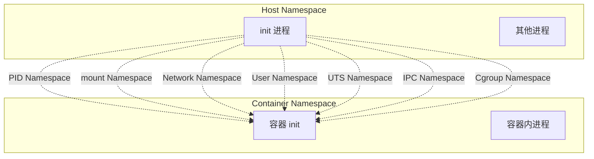

六类核心 Namespace：

| Namespace | 隔离资源               | 关键 syscall           | 用途            |
| --------- | ---------------------- | ---------------------- | --------------- |
| PID       | 进程 ID 空间           | clone(CLONE_NEWPID)    | 进程树隔离      |
| Network   | 网络设备、端口、路由表 | clone(CLONE_NEWNET)    | 网络隔离        |
| Mount     | 文件系统挂载点         | clone(CLONE_NEWNS)     | 文件系统隔离    |
| User      | UID/GID 映射           | clone(CLONE_NEWUSER)   | 用户权限隔离    |
| UTS       | hostname, domainname   | clone(CLONE_NEWUTS)    | 主机名隔离      |
| IPC       | System V IPC, POSIX mq | clone(CLONE_NEWIPC)    | 进程通信隔离    |
| Cgroup    | cgroup 版本树          | clone(CLONE_NEWCGROUP) | cgroup 视图隔离 |

**实践：使用 unshare 创建隔离环境**

```bash
# 创建一个独立的 PID/Mount/Network/UTS/User 沙箱 shell
sudo unshare --pid --mount --network --uts --user --map-root-user bash

# 在沙箱内再挂载 /proc（因为 clone(CLONE_NEWPID) 后需要 remount /proc）
mount -t proc proc /proc

# 验证隔离：host 上看不到沙箱内的进程
ps aux | head
```

```python
# Python: 使用 python-prctl + nsenter 实现进程隔离
import os
import ctypes
import subprocess

def create_isolated_process(cmd: list[str], uid_map: str = "0 0 1000 1"):
    """
    创建一个使用 User Namespace 的隔离进程
    """
    # 准备 uid/gid map 文件
    uid_map_content = uid_map
    gid_map_content = "0 0 1000 1"

    # fork 子进程
    pid = os.fork()
    if pid == 0:
        # 子进程：创建新 namespace
        libc = ctypes.CDLL("libc.so.6", use_errno=True)

        # 创建 User Namespace
        CLONE_NEWUSER = 0x10000000
        CLONE_NEWPID = 0x20000000
        CLONE_NEWNS = 0x00040000
        CLONE_NEWNET = 0x40000000
        CLONE_NEWUTS = 0x04000000

        flags = CLONE_NEWUSER | CLONE_NEWPID | CLONE_NEWNS | CLONE_NEWNET | CLONE_NEWUTS

        # 设置 GID map（需要提前在父进程写入）
        # 这里省略，实际需要通过写入 /proc/self/gid_map

        # 执行 exec
        os.execvp(cmd[0], cmd)
    else:
        # 父进程
        return pid

# 使用示例
# pid = create_isolated_process(["bash", "-c", "echo $$ && sleep 100"])
```

### 2.2 Cgroup（Control Group）

Cgroup 用于限制、隔离和监控进程组的资源使用。它是防止"资源耗尽"攻击的核心机制。

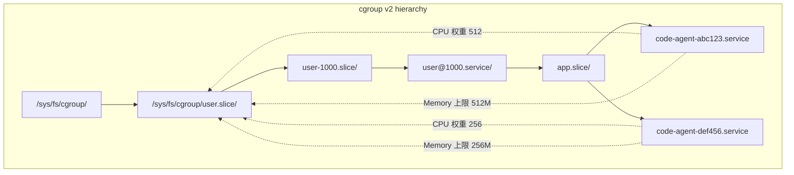

**Cgroup v2 vs v1**

| 特性       | cgroup v1          | cgroup v2                           |
| ---------- | ------------------ | ----------------------------------- |
| 层级结构   | 每种控制器独立层级 | 统一单一树                          |
| 控制器数量 | 13+ 独立层级       | 单一树，控制器统一管理              |
| 压力检测   | 无                 | 有 PSI (Pressure Stall Information) |
| 内存保护   | oom_group          | memory.min + memory.low             |
| 文档       | deprecated         | current                             |

**代码示例：创建资源受限的 cgroup**

```python
import os
import shutil
from pathlib import Path

class CgroupManager:
    """
    管理沙箱进程的 cgroup 资源限制
    """
    CGROUP_BASE = "/sys/fs/cgroup"

    def __init__(self, name: str, memory_limit: str = "512M",
                 cpu_quota_us: int = 50000, cpu_period_us: int = 100000,
                 pids_limit: int = 128):
        self.name = name
        self.memory_limit = memory_limit
        self.cpu_quota_us = cpu_quota_us
        self.cpu_period_us = cpu_period_us
        self.pids_limit = pids_limit
        self.path = ""
        self.created = False

    def create(self):
        """创建 cgroup 并设置限制"""
        # 使用 cgroup v2
        cgroup_path = Path(f"{self.CGROUP_BASE}/{self.name}")
        cgroup_path.mkdir(parents=True, exist_ok=True)
        self.path = str(cgroup_path)
        self.created = True

        # 设置内存限制
        self._write("memory.max", self.memory_limit)

        # 设置 CPU 限制 (quota/period)
        self._write("cpu.max", f"{self.cpu_quota_us} {self.cpu_period_us}")

        # 设置 PID 数量限制
        self._write("pids.max", str(self.pids_limit))

        # 启用内存压力通知
        self._write("memory.low", str(int(self.memory_limit.rstrip('KMG')) // 2))

    def add_process(self, pid: int):
        """将进程加入 cgroup"""
        if not self.created:
            raise RuntimeError("Cgroup not created")
        self._write("cgroup.procs", str(pid))

    def _write(self, file: str, value: str):
        path = os.path.join(self.path, file)
        with open(path, 'w') as f:
            f.write(value)

    def destroy(self):
        """销毁 cgroup"""
        if self.created and os.path.exists(self.path):
            shutil.rmtree(self.path)
            self.created = False

# 使用示例
def run_in_cgroup(cmd: list[str]):
    cg = CgroupManager(
        name="sandbox-123",
        memory_limit="256M",
        cpu_quota_us=25000,  # 25% CPU
        cpu_period_us=100000,
        pids_limit=64
    )
    cg.create()

    pid = os.fork()
    if pid == 0:
        cg.add_process(os.getpid())
        os.execvp(cmd[0], cmd)
    else:
        _, status = os.waitpid(pid, 0)
        cg.destroy()
        return os.WEXITSTATUS(status)
```

### 2.3 Seccomp（Secure Computing）

Seccomp 是 Linux 内核的 syscall 过滤机制。它允许进程声明自己允许使用的 syscall，超出白名单的 syscall 将被内核阻止（返回 -ENOSYS 或发送 SIGSYS）。

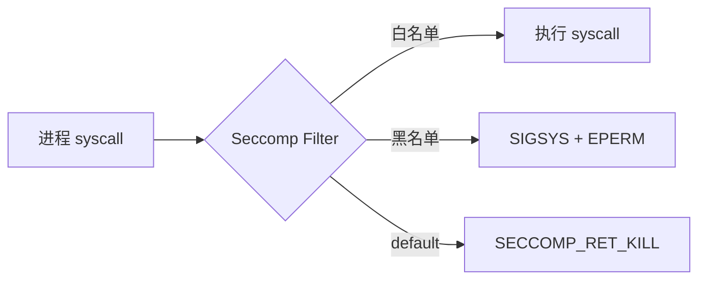

**Seccomp 模式演进：**

| 模式                                                   | 引入版本 | 特点                                              |
| ------------------------------------------------------ | -------- | ------------------------------------------------- |
| seccomp mode 1                                         | 2.6.12   | 只允许 4 个 syscall：read, write, exit, sigreturn |
| seccomp mode 2 (SECCOMP_MODE_FILTER)                   | 2.6.23   | 使用 BPF 过滤任意 syscall                         |
| seccomp mode 3 (SECCOMP_MODE_FILTER with no_new_privs) | 3.19     | 配合 no_new_privs 防止 privilege escalation       |
| Seccomp-bpf (libseccomp)                               | 4.14+    | 标准化 BPF 规则描述语言                           |

**Python 示例：使用 libseccomp 限制 syscall**

```python
import ctypes
import ctypes.util

class Seccomp:
    """
    Python bindings for libseccomp BPF syscall filtering
    """
    SCMP_ACT_KILL = 0x00000000
    SCMP_ACT_KILL_PROCESS = 0x80000000
    SCMP_ACT_TRAP = 0x00030000
    SCMP_ACT_ERRNO(2) = 0x00050002
    SCMP_ACT_TRACE(2) = 0x7ff00002
    SCMP_ACT_ALLOW = 0x7fff0000

    def __init__(self):
        lib = ctypes.util.find_library("seccomp")
        if not lib:
            raise ImportError("libseccomp not found")
        self.lib = ctypes.CDLL(lib)
        self.ctx = self.lib.scmp_default_ctx(False)

    def reset(self, def_action: int):
        self.lib.scmp_default_ctx_free(self.ctx)
        self.ctx = self.lib.scmp_default_ctx(def_action)

    def block(self, syscall: str):
        """阻止指定 syscall"""
        self.lib.scmp_syscall_resolve_name.restype = ctypes.c_int
        num = self.lib.scmp_syscall_resolve_name(self.ctx, syscall.encode())
        self.lib.scmp_syscall_add(self.ctx, self.SCMP_ACT_KILL, num, 0, 0)

    def allow(self, syscall: str):
        num = self.lib.scmp_syscall_resolve_name(self.ctx, syscall.encode())
        self.lib.scmp_syscall_add(self.ctx, self.SCMP_ACT_ALLOW, num, 0, 0)

    def load(self):
        self.lib.scmp_act_export_pfc(self.ctx, 1)  # debug: print to stderr
        self.lib.scmp_act_export_bpf(self.ctx, 1)

    def is_available(self) -> bool:
        major = ctypes.c_uint32()
        minor = ctypes.c_uint32()
        micro = ctypes.c_uint32()
        self.lib.scmp_version(ctypes.byref(major), ctypes.byref(minor), ctypes.byref(micro))
        return major.value >= 2 or (major.value == 2 and minor.value >= 6)

# Code Agent 的最小 syscall 白名单
ALLOWED_SYSCALLS = {
    # 内存
    "brk", "mmap", "munmap", "madvise", "mprotect", "msync", "mincore",
    # 文件描述符
    "read", "write", "openat", "close", "fcntl", "lseek", "fstat", "newfstatat",
    "dup", "dup2", "pipe2", "eventfd2", "epoll_create1", "epoll_ctl", "epoll_wait",
    # 进程
    "clone", "execve", "exit", "wait4", "kill", "getpid", "getppid", "getuid",
    "getgid", "gettid", "nanosleep", "clock_nanosleep", "set_tid_address",
    "prlimit64", "getrlimit", "capget", "capset",
    # 网络
    "socket", "bind", "listen", "accept", "accept4", "connect", "sendto",
    "recvfrom", "sendmsg", "recvmsg", "getsockname", "getpeername",
    "setsockopt", "getsockopt", "shutdown",
    # 文件系统（受限）
    "access", "statfs", "readlink", "getcwd", "chdir",
}

def create_sandbox_seccomp():
    """
    为 Code Agent 创建最小权限 seccomp profile
    """
    sc = Seccomp()
    sc.reset(sc.SCMP_ACT_KILL)  # 默认 kill

    for syscall in ALLOWED_SYSCALLS:
        sc.allow(syscall)

    # 显式 block 高危 syscall
    DANGEROUS = [
        "ptrace",      # 进程调试/注入
        "process_vm_readv",  # 跨进程内存读取
        "process_vm_writev",
        "init_module",  # 加载内核模块
        "finit_module",
        "delete_module",
        "syslog",      # 内核日志
        "reboot",      # 系统重启
        "mount",       # 挂载文件系统
        "umount2",
        "swapon", "swapoff",
        "quotactl",
        "perf_event_open",
    ]
    for syscall in DANGEROUS:
        sc.block(syscall)

    sc.load()
    print("Seccomp BPF loaded: allowed={}, blocked={}".format(
        len(ALLOWED_SYSCALLS), len(DANGEROUS)))
```

---

## 3. 容器级沙箱

### 3.1 Docker 容器沙箱

Docker 是最常见的容器化方案。它通过 Linux Namespace + Cgroup + OverlayFS 的组合，为每个容器提供独立的视图。

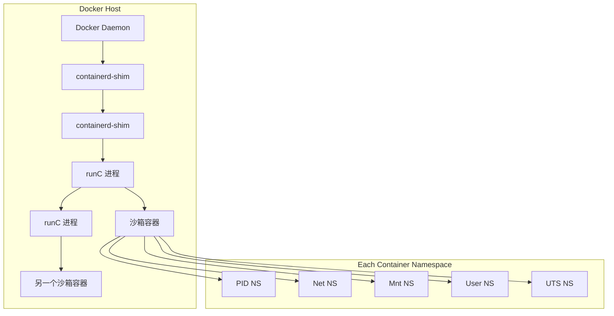

**Docker 的隔离能力与局限：**

| 能力         | 实现                   | 安全性评估                  |
| ------------ | ---------------------- | --------------------------- |
| 进程隔离     | PID Namespace          | 良好                        |
| 网络隔离     | Network Namespace      | 良好（需要 --network none） |
| 文件系统隔离 | OverlayFS + readonly   | 良好                        |
| 用户隔离     | User Namespace (可选)  | 中等（默认 root）           |
| 资源限制     | Cgroup v2              | 优秀                        |
| syscall 限制 | Seccomp (默认 profile) | 中等                        |
| 能力降权     | --cap-drop=ALL         | 良好                        |

**Docker run 配置 Code Agent 沙箱：**

```bash
docker run -d \
  --name code-agent-sandbox \
  --network none \           # 完全网络隔离
  --memory=512m \            # 内存上限
  --memory-swap=512m \       # 禁用 swap
  --cpus=0.5 \               # CPU 限制
  --pids-limit=64 \          # PID 数量限制
  --read-only \              # 根文件系统只读
  --tmpfs /tmp:rw,noexec,nosuid,size=64m \  # 可写 tmpfs
  --tmpfs /run:rw,noexec,nosuid,size=32m \
  --security-opt=no-new-privileges:true \
  --cap-drop=ALL \
  --ulimit nofile=64:64 \
  --ulimit nproc=32:32 \
  --cgroup-manager=cgroup2 \
  ubuntu:22.04 \
  bash -c "while true; do sleep 30; done"
```

```python
# Python: 使用 docker-py 创建沙箱容器
import docker

client = docker.from_env()

def create_code_agent_sandbox(image: str = "ubuntu:22.04",
                               memory_limit: str = "512m",
                               cpu_limit: float = 0.5,
                               timeout_seconds: int = 300):
    """
    创建 Code Agent 隔离容器
    """
    try:
        container = client.containers.run(
            image,
            detach=True,
            network_mode="none",        # 网络完全隔离
            mem_limit=memory_limit,    # 内存上限
            cpu_period=100000,
            cpu_quota=int(cpu_limit * 100000),  # CPU 限制
            pids_limit=64,              # PID 上限
            read_only=True,             # 根文件系统只读
            tmpfs={
                "/tmp": "rw,noexec,nosuid,size=64m",
                "/run": "rw,noexec,nosuid,size=32m"
            },
            security_opt=["no-new-privileges:true"],
            cap_drop=["ALL"],
            ulimits=[
                docker.types.Ulimit(name="nofile", soft=64, hard=64),
                docker.types.Ulimit(name="nproc", soft=32, hard=32)
            ],
            command="sleep infinity"
        )
        return container.id[:12]
    except docker.errors.APIError as e:
        raise RuntimeError(f"Failed to create sandbox: {e}")

# 执行命令
def exec_in_sandbox(container_id: str, cmd: str):
    container = client.containers.get(container_id)
    exit_code, output = container.exec_run(
        cmd,
        stderr=True,
        demux=False
    )
    return exit_code, output.decode()

# 清理
def destroy_sandbox(container_id: str):
    container = client.containers.get(container_id)
    container.stop(timeout=1)
    container.remove(v=True, force=True)
```

### 3.2 gVisor（用户态内核）

gVisor 是 Google 开发的用户态内核运行时。它截获容器的所有 syscall，在用户态实现一个轻量级内核（Sentry），提供比 runc 更强的隔离。

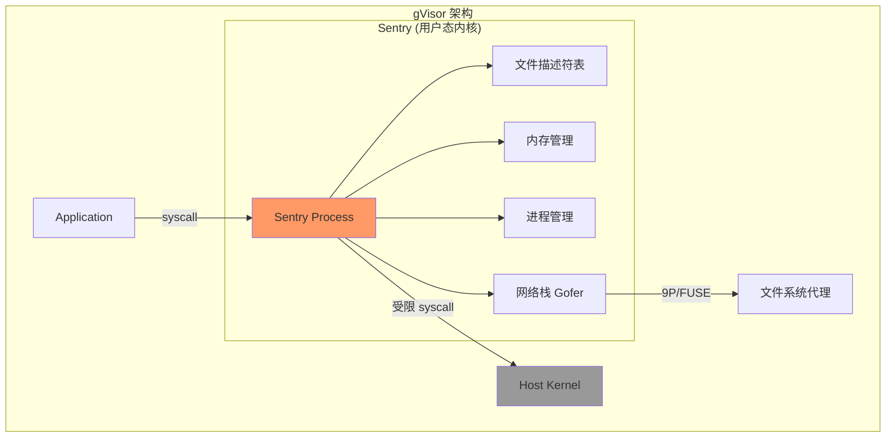

**gVisor vs runc 对比：**

| 特性         | runc           | gVisor (runsc)                |
| ------------ | -------------- | ----------------------------- |
| 内核         | 共享宿主机内核 | 用户态 Sentry 内核            |
| syscall 处理 | 原生           | 模拟/拦截                     |
| 隔离强度     | 中等           | 高                            |
| 性能开销     | 低             | 中等（~5-15%）                |
| 兼容性       | 100%           | 约 90%（部分 syscall 不支持） |
| 启动速度     | <100ms         | 100-300ms                     |
| 内存开销     | ~1MB           | ~50-150MB                     |
| 成熟度       | 非常成熟       | 成熟（Google 内部大量使用）   |

```bash
# 安装 gVisor
curl -fsSL https://get.gvisor.dev | bash
runsc install

# 使用 gVisor 运行容器
docker run -d \
  --runtime=runsc \
  --network=none \
  --memory=512m \
  --read-only \
  --tmpfs /tmp:rw,noexec,size=64m \
  --name code-agent-gvisor \
  ubuntu:22.04 \
  sleep infinity

# 验证：在宿主机上，容器的进程是 gVisor Sentry
ps aux | grep runsc
```

```python
# Python: 验证 gVisor 环境
import subprocess
import json

def check_gvisor_available():
    """检查 gVisor 是否可用"""
    try:
        result = subprocess.run(
            ["runsc", "--version"],
            capture_output=True, text=True
        )
        if result.returncode == 0:
            version_line = result.stdout.strip()
            return True, version_line
    except FileNotFoundError:
        pass
    return False, "gVisor not installed"

def get_gvisor_stats(container_id: str):
    """获取 gVisor 容器的统计信息"""
    result = subprocess.run(
        ["runsc", "stats", container_id],
        capture_output=True, text=True
    )
    if result.returncode == 0:
        return json.loads(result.stdout)
    return {}
```

### 3.3 Firecracker（微虚拟机）

Firecracker 是 AWS 开发的轻量级 VMM（Virtual Machine Monitor），专为无服务器场景设计。它比传统 VM 轻量得多（125ms 启动，~5MB 内存开销），但提供完整的 VM 隔离。

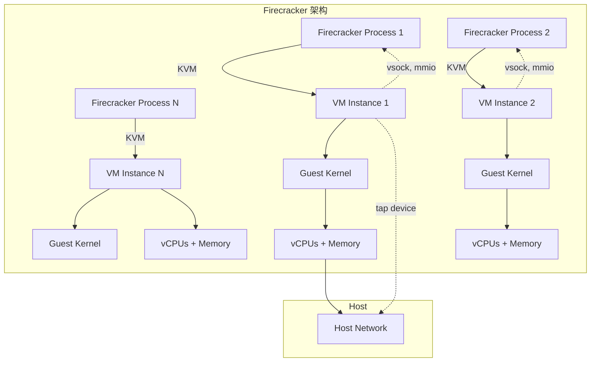

**Firecracker vs Docker vs gVisor 对比：**

| 指标       | Docker + runc | gVisor     | Firecracker |
| ---------- | ------------- | ---------- | ----------- |
| 隔离层级   | 操作系统级    | 用户态内核 | 硬件虚拟化  |
| 启动时间   | <100ms        | 100-300ms  | 100-150ms   |
| 内存开销   | ~1MB          | ~50-150MB  | ~5MB        |
| 安全性     | 中            | 高         | 极高        |
| 兼容性     | 100%          | ~90%       | 100%        |
| 硬件虚拟化 | 否            | 否         | 是（KVM）   |
| 多租户     | 一般          | 好         | 极佳        |

```bash
# 启动 Firecracker VM
# 1. 下载内核和 rootfs
curl -fsSL -o vmlinux https://s3.amazonaws.com/spec.ccfc.min/hello-vmlinux
curl -fsSL -o rootfs.ext4 https://s3.amazonaws.com/spec.ccfc.min/hello-rootfs.ext4

# 2. 创建配置
cat > config.json << 'EOF'
{
  "boot-source": {
    "kernel_image_path": "./vmlinux",
    "initrd_path": "",
    "boot_args": "console=ttyS0 reboot=k panic=1"
  },
  "drives": [
    {
      "drive_id": "rootfs",
      "path_on_host": "./rootfs.ext4",
      "is_root_device": true,
      "is_read_only": true
    }
  ],
  "network-interfaces": [],
  "machine-config": {
    "vcpu_count": 1,
    "mem_size_mib": 256
  }
}
EOF

# 3. 启动
firecracker --api-sock /tmp/fc.sock
curl -X PUT --unix-socket /tmp/fc.sock http://localhost/boot-source -d @config.json
curl -X PUT --unix-socket /tmp/fc.sock http://localhost/preboot/root/operation -d '{"count":1}'
curl -X PUT --unix-socket /tmp/fc.sock http://localhost/actions -d '{"action_type":"InstanceStart"}'
```

### 3.4 microVM 综合对比

| 特性     | Docker + runc   | gVisor (runsc) | Firecracker  | Kata Containers | Unikernel (MirageOS) |
| -------- | --------------- | -------------- | ------------ | --------------- | -------------------- |
| 隔离强度 | 中              | 高             | 极高         | 极高            | 极高                 |
| 启动速度 | <100ms          | 100-300ms      | 100-150ms    | 1-2s            | <50ms                |
| 内存开销 | ~1MB            | ~100MB         | ~5MB         | ~100MB          | <1MB                 |
| 兼容性   | 100%            | ~90%           | 100%         | ~95%            | 有限                 |
| 复杂度   | 低              | 中             | 中           | 高              | 高                   |
| 适用场景 | 同机器/可信环境 | 不可信代码执行 | 强隔离多租户 | 高安全需求      | 极致轻量             |

---

## 4. Linux 安全机制

### 4.1 AppArmor

AppArmor（Application Armor）是 Debian/Ubuntu 系统的 MAC（Mandatory Access Control）实现。它通过配置文件定义进程可以访问的文件、网络、能力和资源。

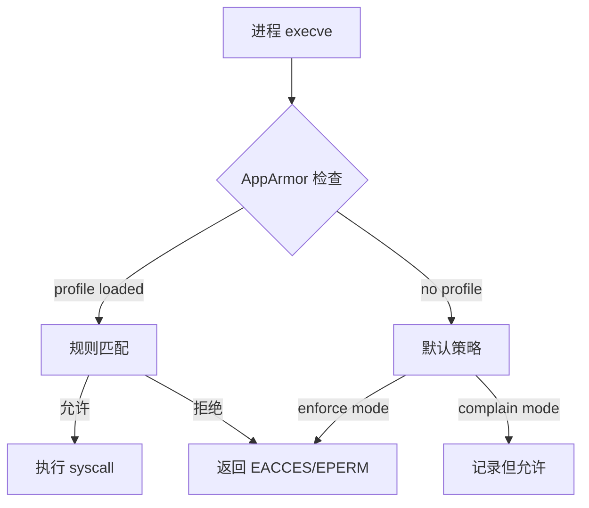

**AppArmor profile 示例：Code Agent 沙箱**

```bash
# /etc/apparmor.d/sandbox.code-agent
abi <abi/3.0>,
include <tunables/global>

profile sandbox-code-agent flags=(attach_disconnected,mediate_deleted) {
  # 全局能力
  capability setuid,
  capability setgid,
  capability net_bind_service,

  # 文件系统访问限制
  /bin/bash mr,
  /bin/ls mr,
  /usr/bin/python3* mr,
  /lib/x86_64-linux-gnu/** r,
  /usr/lib/** r,

  # 只读系统目录
  /etc/passwd r,
  /etc/group r,
  /etc/ld.so.cache r,

  # 可写目录（tmpfs）
  /tmp/** rw,
  /run/** rw,

  # 禁止访问
  /home/** r,
  /root/** r,
  /etc/shadow rwk,  # 明确拒绝
  /sys/** r,        # 限制 sysfs
  /proc/sys/** rw,  # 禁止修改内核参数
  /dev/** rw,       # 限制设备访问

  # 网络限制（沙箱内不允许网络）
  network unix,
  # deny network,

  # 禁止加载内核模块
  deny /sys/module/** rw,

  # 禁止创建 namespaces（防止沙箱内再创建沙箱）
  deny ptrace,
  deny proc_psi_t,
}
```

```bash
# 加载和启用 profile
sudo apparmor_parser -r /etc/apparmor.d/sandbox.code-agent

# 测试 profile
sudo aa-status
# apparmor_module: 2.13.6
# 2 profiles are loaded.
# 1 profiles are in enforce mode.
#    sandbox-code-agent

# 将进程置于 profile 下
apparmor_parser -r sandbox.code-agent bash -c 'echo "Running in sandbox"'
```

### 4.2 SELinux

SELinux（Security-Enhanced Linux）是 Red Hat/CentOS 系统的 MAC 实现，比 AppArmor 更复杂但也更强大。它使用 MLS（Multi-Level Security）模型。

```mermaid
graph LR
    A[Subject: 进程] -->|操作| B[SELinux 检查]
    B -->|AVC Cache| C{Policy Check}
    C -->|allowed| D[允许]
    C -->|denied| E[拒绝 + 审计]
    E --> F[/var/log/audit.log]
```

**SELinux 上下文与类型：**

```
# 查看文件/进程的安全上下文
ls -Z /etc/passwd
# system_u:object_r:passwd_file_t:s0 /etc/passwd

ps auxZ
# system_u:system_r:container_t:s0 1234 ? sshd: /usr/sbin/sshd

# 常见上下文类型
container_t     # 容器进程
svirt_sandbox_file_t  # 虚拟机镜像文件
container_file_t      # 容器数据卷
```

**Code Agent 的 SELinux 策略（seccomp-classify）：**

```bash
# 创建 Code Agent 的 SELinux 模块
cat > code_agent.te << 'EOF'
module code_agent 1.0;

require {
    type container_t;
    type tmpfs_t;
    type proc_t;
    type device_t;
    class process { fork getattr sigchld };
    class dir { getattr search };
    class file { read write getattr lock open };
    classfilesystem { getattr remount };
    class chr_file { read write open ioctl };
}

# 允许容器进程基本操作
allow container_t self:process { fork getattr sigchld };

# 只读访问 /proc
allow container_t proc_t:dir { getattr search };
allow container_t proc_t:file { read getattr open };

# 允许在 tmpfs 上读写
allow container_t tmpfs_t:file { read write getattr lock open };

# 禁止容器访问设备
allow container_t device_t:chr_file { read write open ioctl };

# 限制文件系统操作
allow container_t self:filesystem getattr;
dontaudit container_t self:filesystem remount;
EOF

# 编译和加载
checkmodule -M -m -o code_agent.mod code_agent.te
semodule_package -o code_agent.pp -m code_agent.mod
sudo semodule -i code_agent.pp
```

### 4.3 Landlock（新生代安全模块）

Landlock 是 Linux 5.13 引入的轻量级沙箱机制。它允许非特权进程基于文件系统的沙箱规则，最初由 Google Project Zero 的 Mickaël Salaün 提出。

**Landlock vs AppArmor vs SELinux：**

| 特性       | Landlock                 | AppArmor     | SELinux              |
| ---------- | ------------------------ | ------------ | -------------------- |
| 所需权限   | 非特权（unprivileged）   | root         | root                 |
| 规则粒度   | 文件系统路径             | 文件系统路径 | SELinux 上下文       |
| 策略存储   | BPF 对象                 | 配置文件     | 内核策略             |
| 可组合性   | 是（layered）            | 否           | 否                   |
| 审计机制   | 无                       | 有           | 有                   |
| 主流发行版 | Arch, Gentoo, 部分发行版 | Ubuntu, SUSE | RHEL, CentOS, Fedora |

```c
// Landlock C 示例：限制文件系统访问
#define _GNU_SOURCE
#include <sys/prctl.h>
#include <linux/landlock.h>
#include <linux/prctl.h>
#include <sys/syscall.h>
#include <unistd.h>

static int landlock_restrict_self(void) {
    struct landlock_ruleset_attr attr = {
        .handled_access_fs = LANDLOCK_ACCESS_FS_READ |
                             LANDMASK_ACCESS_FS_WRITE |
                             LANDLOCK_ACCESS_FS_EXEC,
    };

    int ruleset_fd = syscall(SYS_landlock_create_ruleset,
                              &attr, sizeof(attr), 0);
    if (ruleset_fd < 0) return -1;

    // 允许 /usr 只读
    struct landlock_path_beneath_attr path1 = {
        .parent_fd = open("/usr", O_PATH | O_RDONLY),
        .allowed_access = LANDLOCK_ACCESS_FS_READ,
    };
    syscall(SYS_landlock_add_rule, ruleset_fd,
            LANDLOCK_RULE_PATH_BENEATH, &path1, 0);

    // 允许 /tmp 读写
    struct landlock_path_beneath_attr path2 = {
        .parent_fd = open("/tmp", O_PATH | O_RDONLY),
        .allowed_access = LANDLOCK_ACCESS_FS_READ |
                         LANDLOCK_ACCESS_FS_WRITE,
    };
    syscall(SYS_landlock_add_rule, ruleset_fd,
            LANDLOCK_RULE_PATH_BENEATH, &path2, 0);

    // 限制当前进程
    return prctl(PR_SET_NO_NEW_PRIVS, 1, 0, 0, 0) ||
           syscall(SYS_landlock_restrict_self, ruleset_fd, 0);
}
```

```python
# Python: 使用 pylandlock（如果可用）
try:
    import landlock
except ImportError:
    # Landlock 需要内核 5.13+，且 Python 绑定不完善
    # 这里展示概念代码
    pass

def sandbox_with_landlock():
    """
    使用 Landlock 限制文件系统的 Python 包装
    """
    # 检查支持
    import os
    if not os.path.exists("/sys/kernel/security/landlock"):
        raise RuntimeError("Landlock not supported")

    # 实际使用需要通过 ctypes 或 rust-bindings 调用
    # 这里仅展示架构
    print("Landlock sandbox:")
    print("  - /usr: read-only")
    print("  - /tmp: read-write")
    print("  - deny all others")
```

---

## 5. 网络隔离

### 5.1 Network Namespace

Network Namespace 提供完全独立的网络栈视图，包括接口、路由表、防火墙规则和端口空间。

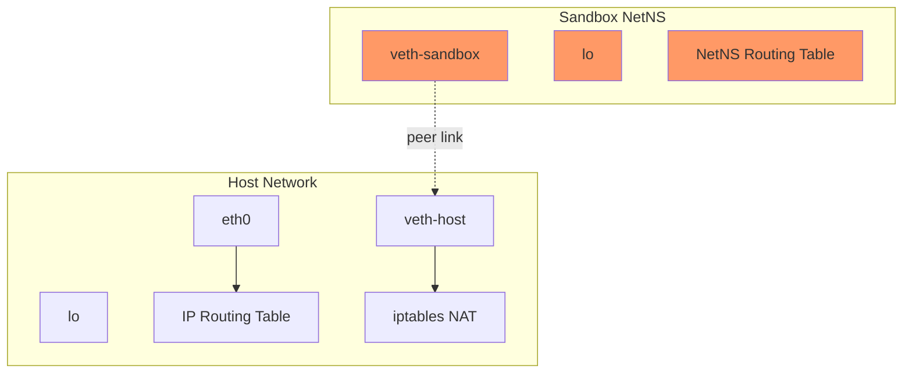

**创建完全隔离的网络环境：**

```bash
# 1. 创建独立 network namespace
ip netns add sandbox-123

# 2. 创建 veth pair
ip link add veth-host type veth peer name veth-sandbox

# 3. 将一端放入沙箱 namespace
ip link set veth-sandbox netns sandbox-123

# 4. 在 host 端：留空或设置为主机独有
ip link set veth-host up
ip addr add 10.0.0.1/24 dev veth-host

# 5. 在沙箱内：配置一个完全隔离的网络
ip netns exec sandbox-123 ip link set lo up
ip netns exec sandbox-123 ip link set veth-sandbox up
ip netns exec sandbox-123 ip addr add 10.0.0.2/24 dev veth-sandbox
# 不设置默认路由！沙箱无法访问外部网络

# 6. 测试隔离
ip netns exec sandbox-123 ping -c 1 8.8.8.8  # 应该失败
ip netns exec sandbox-123 ping -c 1 10.0.0.1  # 应该成功（同一 veth 网段）

# 7. 清理
ip link del veth-host
ip netns del sandbox-123
```

```python
# Python: 使用 pyroute2 操作 Network Namespace
from pyroute2 import NetNS, IPRoute, NSPopen
import os

class NetworkSandbox:
    """
    管理 Code Agent 的网络隔离
    """
    def __init__(self, name: str):
        self.name = name
        self.ns_path = f"/var/run/netns/{name}"
        self.veth_host = f"veth-{name}-h"
        self.veth_sandbox = f"veth-{name}-s"

    def create(self):
        """创建完全隔离的 network namespace"""
        # 创建 namespace
        try:
            ns = NetNS(self.name, flags=os.O_CREAT)
            ns.close()
        except Exception:
            pass  # 已存在

        with IPRoute() as ipr:
            # 创建 veth pair
            ipr.link("add", ifname=self.veth_host, peer=self.veth_sandbox,
                     kind="veth")

            # 获取 index
            idx_host = ipr.link_lookup(ifname=self.veth_host)[0]

            # 将 peer 移到 namespace
            idx_sandbox = ipr.link_lookup(ifname=self.veth_sandbox)[0]
            ipr.link("set", index=idx_sandbox, net_ns_fd=self.name)

            # host 端 up
            ipr.link("set", index=idx_host, state="up")

    def setup_loopback(self):
        """在沙箱内启用 loopback"""
        with NSPopen(self.name, ["ip", "link", "set", "lo", "up"]) as p:
            p.wait()

    def allow_dns(self, dns_ns: str = "default"):
        """
        仅为沙箱添加 DNS 解析（通过 unix socket）
        不给网络访问权限
        """
        # DNS 通过 /etc/resolv.conf 的 nameserver 访问
        # 但如果没有路由，DNS 仍然无法工作
        # 这是正确的行为：沙箱完全无网络
        pass

    def destroy(self):
        """清理网络资源"""
        with IPRoute() as ipr:
            try:
                idx = ipr.link_lookup(ifname=self.veth_host)[0]
                ipr.link("remove", index=idx)
            except:
                pass
        try:
            ns = NetNS(self.name)
            ns.close()
            os.unlink(self.ns_path)
        except:
            pass
```

### 5.2 iptables 规则控制

对于需要部分网络访问的沙箱，使用 iptables 精细控制流量。

```bash
# 创建 Code Agent 专用链
iptables -N CODE_AGENT_SANDBOX
iptables -A CODE_AGENT_SANDBOX -m limit --limit 10/min -j LOG --log-prefix "[sandbox] "
iptables -A CODE_AGENT_SANDBOX -j DROP

# 仅允许 HTTP 出站（禁止 SSH/FTP 等）
iptables -A CODE_AGENT_SANDBOX -p tcp --dport 80 -j ACCEPT
iptables -A CODE_AGENT_SANDBOX -p tcp --dport 443 -j ACCEPT
iptables -A CODE_AGENT_SANDBOX -p udp --dport 53 -j ACCEPT  # DNS
iptables -A CODE_AGENT_SANDBOX -j DROP

# 标记进程
iptables -A OUTPUT -m owner --uid-owner sandbox -j CODE_AGENT_SANDBOX
```

### 5.3 eBPF 网络流量控制（高级）

```bash
# 使用 bpftrace 监控沙箱网络活动
bpftrace -e '
/* 监控所有网络 syscalls */
tracepoint:syscalls:sys_enter_connect /uid == 1000/ {
    printf("SANDBOX connect: pid=%d, fd=%d, addr=%s:%d\n",
           pid, args->fd,
           ntop(AF_INET, args->uservaddr->sin_addr.s_addr),
           args->uservaddr->sin_port);
}

tracepoint:syscalls:sys_enter_bind /uid == 1000/ {
    printf("SANDBOX bind: pid=%d, fd=%d, port=%d\n",
           pid, args->fd, args->uservaddr->sin_port);
}
'
```

---

## 6. 文件系统隔离

### 6.1 OverlayFS

OverlayFS 将多个目录层叠合并，提供统一的视图。容器常用它来叠加只读的 base image 和可写的容器层。

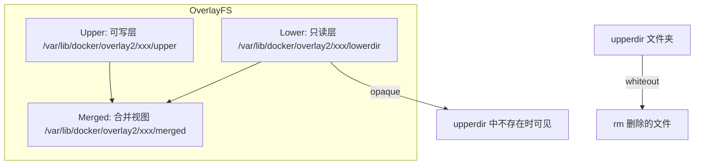

**手动创建 OverlayFS 沙箱：**

```bash
# 1. 准备目录结构
# lower: 只读基础系统
LOWER=/path/to/base-image
# upper: 可写层（空白）
UPPER=/var/lib/sandbox/123/upper
# work: OverlayFS 工作目录
WORK=/var/lib/sandbox/123/work
# merged: 最终挂载点
MERGED=/var/lib/sandbox/123/merged

mkdir -p $LOWER $UPPER $WORK $MERGED

# 2. 挂载 overlay
mount -t overlay overlay \
    -o lowerdir=$LOWER,upperdir=$UPPER,workdir=$WORK \
    $MERGED

# 3. 在 merged 内工作
# 文件修改：upper 中
# 文件删除：upper 中创建 whiteout
# 新文件：upper 中

# 4. 卸载（丢弃所有更改）
umount $MERGED
rm -rf /var/lib/sandbox/123
```

```python
# Python: 使用 pyoverlayfs 或直接调用
import os
import subprocess
from pathlib import Path

class OverlaySandbox:
    """
    基于 OverlayFS 的可恢复文件系统沙箱
    """
    def __init__(self, sandbox_id: str,
                 lower_dir: str = "/var/lib/base-ubuntu",
                 storage_dir: str = "/var/lib/sandbox"):
        self.sandbox_id = sandbox_id
        self.storage_dir = Path(storage_dir) / sandbox_id
        self.lower_dir = lower_dir
        self.upper_dir = self.storage_dir / "upper"
        self.work_dir = self.storage_dir / "work"
        self.merged_dir = self.storage_dir / "merged"

    def create(self):
        """创建 overlay 沙箱"""
        # 创建目录
        self.storage_dir.mkdir(parents=True, exist_ok=True)
        self.upper_dir.mkdir(exist_ok=True)
        self.work_dir.mkdir(exist_ok=True)
        self.merged_dir.mkdir(exist_ok=True)

        # 挂载 overlay
        result = subprocess.run([
            "mount", "-t", "overlay", "overlay",
            "-o", f"lowerdir={self.lower_dir},"
                  f"upperdir={self.upper_dir},"
                  f"workdir={self.work_dir}",
            str(self.merged_dir)
        ], capture_output=True)

        if result.returncode != 0:
            raise RuntimeError(f"Overlay mount failed: {result.stderr.decode()}")

        return str(self.merged_dir)

    def destroy(self, discard_changes: bool = True):
        """销毁沙箱，丢弃或保存更改"""
        # 卸载
        subprocess.run(["umount", str(self.merged_dir)], check=True)

        if discard_changes:
            # 丢弃所有更改
            import shutil
            shutil.rmtree(str(self.storage_dir))
        else:
            # 保存更改到指定位置
            pass

    def snapshot(self) -> str:
        """保存当前状态快照"""
        snapshot_dir = self.storage_dir / "snapshot"
        subprocess.run(["cp", "-a", str(self.upper_dir), str(snapshot_dir)])
        return str(snapshot_dir)
```

### 6.2 文件系统只读与权限降权

对于更严格的隔离，可以直接使用只读挂载：

```bash
# 完整只读根文件系统
mount --bind /path/to/base-image /path/to/sandbox/root
mount -o remount,readonly /path/to/sandbox/root

# 特定目录只读绑定
mount --bind /usr /sandbox/usr
mount -o remount,readonly,bind /sandbox/usr

# 禁止执行（noexec）
mount -o remount,noexec /tmp
```

```python
# Python: 沙箱目录安全配置
import os
import subprocess
from pathlib import Path

SANDBOX_DIRS = {
    "/bin": {"mode": "ro"},
    "/usr": {"mode": "ro"},
    "/lib": {"mode": "ro"},
    "/etc": {"mode": "ro"},
    "/tmp": {"mode": "rw", "fstype": "tmpfs", "options": "noexec,nosuid,size=64m"},
    "/run": {"mode": "rw", "fstype": "tmpfs", "options": "noexec,nosuid,size=32m"},
    "/var/cache": {"mode": "rw"},
}

def prepare_filesystem(sandbox_root: str):
    """配置沙箱的文件系统权限"""
    for target, config in SANDBOX_DIRS.items():
        full_path = Path(sandbox_root) / target.lstrip("/")
        if config["mode"] == "ro":
            # 只读绑定挂载
            subprocess.run([
                "mount", "--bind", target, str(full_path)
            ], check=True)
            subprocess.run([
                "mount", "-o", "remount,readonly,bind", str(full_path)
            ], check=True)
        elif config["mode"] == "rw" and "fstype" in config:
            # tmpfs
            subprocess.run([
                "mount", "-t", config["fstype"],
                "-o", config.get("options", ""),
                "tmpfs", str(full_path)
            ], check=True)
```

### 6.3 Seccomp-bpf 文件系统 syscall 过滤

```c
// seccomp-bpf 规则：仅允许安全文件系统操作
struct sock_filter filter[] = {
    // 验证架构
    BPF_STMT(BPF_LD | BPF_W | BPF_ABS, 0),
    KVM_CHECK_ARCH,

    // 加载 syscall 编号
    BPF_STMT(BPF_LD | BPF_W | BPF_ABS, arch_reg),

    // 通用：allow read
    BPF_JUMP(BPF_JMP | BPF_JEQ | BPF_K, __NR_read, 0, 1),
    BPF_STMT(BPF_RET | BPF_K, SECCOMP_RET_ALLOW),

    // 通用：allow write
    BPF_JUMP(BPF_JMP | BPF_JEQ | BPF_K, __NR_write, 0, 1),
    BPF_STMT(BPF_RET | BPF_K, SECCOMP_RET_ALLOW),

    // 允许 openat（不含 O_CREAT|O_EXCL|O_TRUNC）
    BPF_JUMP(BPF_JMP | BPF_JEQ | BPF_K, __NR_openat, 0, 9),
    BPF_STMT(BPF_LD | BPF_W | BPF_ABS, offsetof(struct seccomp_data, args[1])),
    BPF_JUMP(BPF_JMP | BPF_JA, 0, 8),

    // 允许 open
    BPF_JUMP(BPF_JMP | BPF_JEQ | BPF_K, __NR_open, 0, 1),
    BPF_STMT(BPF_RET | BPF_K, SECCOMP_RET_ALLOW),

    // 拒绝 mount
    BPF_JUMP(BPF_JMP | BPF_JEQ | BPF_K, __NR_mount, 0, 1),
    BPF_STMT(BPF_RET | BPF_K, SECCOMP_RET_KILL),

    // 拒绝 umount
    BPF_JUMP(BPF_JMP | BPF_JEQ | BPF_K, __NR_umount2, 0, 1),
    BPF_STMT(BPF_RET | BPF_K, SECCOMP_RET_KILL),

    // 拒绝 pivot_root
    BPF_JUMP(BPF_JMP | BPF_JEQ | BPF_K, __NR_pivot_root, 0, 1),
    BPF_STMT(BPF_RET | BPF_K, SECCOMP_RET_KILL),

    // 拒绝 chroot
    BPF_JUMP(BPF_JMP | BPF_JEQ | BPF_K, __NR_chroot, 0, 1),
    BPF_STMT(BPF_RET | BPF_K, SECCOMP_RET_KILL),

    // 默认：trace（用于审计）
    BPF_STMT(BPF_RET | BPF_K, SECCOMP_RET_TRACE),
};
```

---

## 7. 资源限制

### 7.1 CPU 限制

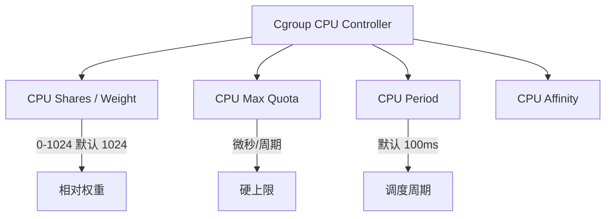

**cgroup v2 CPU 限制参数：**

| 参数          | 含义         | 示例                   |
| ------------- | ------------ | ---------------------- |
| cpu.max       | quota period | 50000 100000 = 50% CPU |
| cpu.weight    | 相对权重     | 1024 = 默认权重        |
| cpu.max.burst | burst 容量   | 50                     |
| cpu.idle      | 空闲优化     | 0/1                    |

```python
# Python: CPU 限制实现
import os
from pathlib import Path

class CPUCgroup:
    """
    cgroup v2 CPU 资源控制
    """
    def __init__(self, cgroup_path: str):
        self.cgroup_path = Path(cgroup_path)
        self.cgroup_path.mkdir(parents=True, exist_ok=True)

    def set_limit(self, cpu_quota_us: int, cpu_period_us: int = 100000):
        """
        设置 CPU 上限（百分比 = quota/period * 100）
        cpu_quota_us: 每周期可使用的微秒数
        cpu_period_us: 调度周期，默认 100ms
        """
        # cpu.max = "quota period"
        max_file = self.cgroup_path / "cpu.max"
        max_file.write_text(f"{cpu_quota_us} {cpu_period_us}\n")

    def set_weight(self, weight: int = 1024):
        """
        设置相对权重（1-10000）
        """
        weight_file = self.cgroup_path / "cpu.weight"
        weight_file.write_text(f"{weight}\n")

    def set_cpuset(self, cpus: list[int]):
        """
        绑定到特定 CPU 核心
        """
        cpuset_file = self.cgroup_path / "cpuset.cpus"
        cpuset_file.write_text(",".join(map(str, cpus)))

    def add_task(self, pid: int):
        self.cgroup_path.joinpath("cgroup.procs").write_text(str(pid))

# 使用示例
cg = CPUCgroup("/sys/fs/cgroup/sandbox-123")
cg.set_limit(cpu_quota_us=50000, cpu_period_us=100000)  # 50% CPU
cg.set_weight(weight=512)  # 512/1024 = 50% 相对权重
cg.set_cpuset([0, 1])  # 仅使用 CPU 0 和 1
```

### 7.2 内存限制

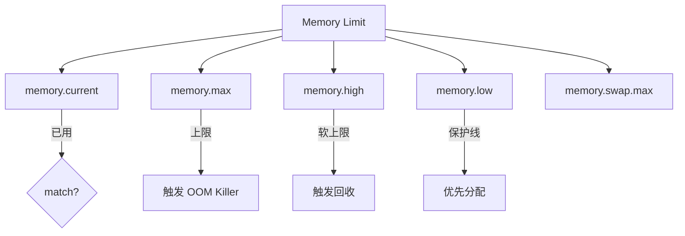

**cgroup v2 内存限制：**

| 参数             | 含义      | 行为             |
| ---------------- | --------- | ---------------- |
| memory.max       | 硬上限    | 超过触发 OOM     |
| memory.high      | 软上限    | 超过触发异步回收 |
| memory.low       | 保护线    | 低于此值优先分配 |
| memory.swap.max  | swap 上限 | 超过拒绝 swap    |
| memory.oom.group | OOM 处理  | 整个 cgroup 被杀 |

```python
# Python: 内存限制实现
import os
from pathlib import Path

class MemoryCgroup:
    """
    cgroup v2 内存资源控制
    """
    def __init__(self, cgroup_path: str):
        self.cgroup_path = Path(cgroup_path)
        self.cgroup_path.mkdir(parents=True, exist_ok=True)

    def set_limit(self, max_bytes: str = "256M",
                  high_bytes: str = "200M",
                  swap_max: str = "0"):
        """
        memory.max: 硬上限（超过 kill）
        memory.high: 软上限（触发回收）
        memory.swap.max: swap 上限（0=禁用 swap）
        """
        max_file = self.cgroup_path / "memory.max"
        max_file.write_text(max_bytes + "\n")

        high_file = self.cgroup_path / "memory.high"
        high_file.write_text(high_bytes + "\n")

        swap_file = self.cgroup_path / "memory.swap.max"
        swap_file.write_text(swap_max + "\n")

    def get_usage(self) -> dict:
        """获取内存使用统计"""
        stats = {}
        for name in ["current", "max", "swap.current"]:
            f = self.cgroup_path / f"memory.{name.replace('.','.')}"
            if f.exists():
                stats[name] = f.read_text().strip()
        return stats

# 使用示例
mcg = MemoryCgroup("/sys/fs/cgroup/sandbox-123")
mcg.set_limit(
    max_bytes="256M",      # 硬上限 256MB
    high_bytes="200M",    # 软上限 200MB（超过开始回收）
    swap_max="0"          # 禁用 swap
)
```

### 7.3 进程数限制（PIDs）

```bash
# cgroup v2 PID 限制
echo 64 > /sys/fs/cgroup/sandbox-123/pids.max

# 验证
cat /sys/fs/cgroup/sandbox-123/pids.current  # 当前进程数
```

```python
# 防止 fork 炸弹：结合 pids 和 rlimit
import resource

def prevent_fork_bomb():
    """
    双重防护 fork 炸弹
    1. rlimit: 进程级限制
    2. cgroup pids.max: 系统级限制
    """
    # rlimit: 每个进程最多 64 个子进程
    resource.setrlimit(resource.RLIMIT_NPROC, (32, 64))

    # rlimit: 文件描述符上限
    resource.setrlimit(resource.RLIMIT_NOFILE, (64, 128))

    # 禁止创建核心转储
    resource.setrlimit(resource.RLIMIT_CORE, (0, 0))
```

### 7.4 时间限制（Timeout）

```python
import os
import signal
import subprocess
from threading import Timer

class TimeoutError(Exception):
    pass

class TimedProcess:
    """
    为沙箱进程设置超时
    """
    def __init__(self, timeout_seconds: int):
        self.timeout = timeout_seconds
        self.process = None
        self.timer = None

    def run(self, cmd: list[str], cwd: str = None) -> subprocess.CompletedProcess:
        """
        执行带超时的命令
        """
        def timeout_handler():
            if self.process and self.process.poll() is None:
                # SIGKILL 进程组（包括子进程）
                os.killpg(os.getpgid(self.process.pid), signal.SIGKILL)

        self.process = subprocess.Popen(
            cmd,
            cwd=cwd,
            stdout=subprocess.PIPE,
            stderr=subprocess.PIPE,
            preexec_fn=os.setsid  # 创建新进程组
        )

        self.timer = Timer(self.timeout, timeout_handler)
        self.timer.start()

        try:
            stdout, stderr = self.process.communicate()
            return subprocess.CompletedProcess(
                args=cmd,
                returncode=self.process.returncode,
                stdout=stdout,
                stderr=stderr
            )
        finally:
            self.timer.cancel()
            self.timer = None

# 使用示例
tp = TimedProcess(timeout_seconds=30)
result = tp.run(["python3", "untrusted_code.py"])
print(f"Exit: {result.returncode}")
print(f"Output: {result.stdout.decode()[:200]}")
```

### 7.5 综合资源限制配置

```yaml
# sandbox-config.yaml - Code Agent 沙箱资源限制配置
version: 2

resources:
  cpu:
    quota_us: 50000 # 50% CPU (50000/100000)
    period_us: 100000 # 100ms period
    cpus: [0, 1, 2, 3] # 绑定到特定核心
    weight: 512 # 相对权重

  memory:
    max: "256M" # 硬上限
    high: "200M" # 软上限触发回收
    swap_max: "0" # 禁用 swap
    oom_group: true # 整个 cgroup OOM 时一起杀

  pids:
    max: 64 # 最大进程数

  io:
    weight: 100 # IO 权重
    max_read_bps: "10M"
    max_write_bps: "5M"

  time:
    cpu_max_seconds: 60 # CPU 时间上限（不是 wall time）

network:
  mode: "none" # none | bridge | host

filesystem:
  mode: "overlay" # overlay | bind | tmpfs
  readonly: true
  tmpfs:
    /tmp:
      size: "64M"
      noexec: true
      nosuid: true
    /run:
      size: "32M"
      noexec: true
      nosuid: true

security:
  seccomp: "minimal" # minimal | standard | none
  capabilities: [] # 清空所有能力
  no_new_privs: true
  apparmor: "sandbox-code-agent"
```

---

## 8. 沙箱方案对比

### 8.1 综合对比表

| 方案                    | 隔离强度 | 性能开销 | 启动速度  | 内存开销 | 兼容性 | 复杂度 | 适用场景         |
| ----------------------- | -------- | -------- | --------- | -------- | ------ | ------ | ---------------- |
| **Docker + runc**       | 中       | <5%      | <100ms    | ~1MB     | 100%   | 低     | 同机器/可信环境  |
| **Docker + gVisor**     | 高       | 5-15%    | 100-300ms | ~100MB   | ~90%   | 中     | 不可信代码执行   |
| **Firecracker**         | 极高     | 2-5%     | 100-150ms | ~5MB     | 100%   | 中     | 强隔离多租户     |
| **Kata Containers**     | 极高     | 10-20%   | 1-2s      | ~100MB   | ~95%   | 高     | 企业高安全需求   |
| **Unikernel**           | 极高     | <1%      | <50ms     | <1MB     | 有限   | 高     | 极致轻量专用场景 |
| **Landlock + NS**       | 高       | <3%      | <50ms     | ~1MB     | ~70%   | 中     | 轻量快速隔离     |
| **namespace + seccomp** | 高       | <2%      | <20ms     | ~500KB   | 100%   | 高     | 深度定制场景     |

### 8.2 选型决策树

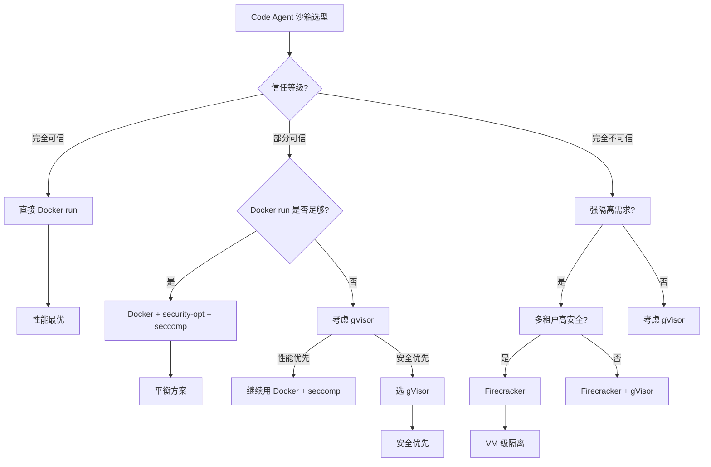

### 8.3 威胁防御矩阵

| 威胁         | Docker | gVisor | Firecracker | namespace+seccomp |
| ------------ | ------ | ------ | ----------- | ----------------- |
| 恶意文件访问 | ✓      | ✓      | ✓           | ✓                 |
| 容器逃逸     | 中     | 高     | 极高        | 高                |
| 资源耗尽     | ✓      | ✓      | ✓           | ✓                 |
| 网络攻击     | ✓      | ✓      | ✓           | ✓                 |
| Syscall 漏洞 | 中     | 高     | 极高        | 高                |
| 内核漏洞     | 中     | 高     | 极高        | 中                |
| 侧信道攻击   | 低     | 中     | 高          | 低                |

---

## 9. gsd2 的沙箱选型

### 9.1 选型背景与约束

gsd2（Generic Sandbox for Developer v2）是 Code Agent 系列的沙箱实现项目。基于前文的威胁模型分析，gsd2 的沙箱面临以下实际约束：

- **执行频率**：高频（每秒可能实例化数十个沙箱）
- **延迟敏感**：代码执行需要快速返回结果
- **代码来源多样**：包括用户直接提交的 snippet、CI 拉取的脚本、第三方依赖
- **资源环境**：x86_64 Linux 服务器，可接受 root 权限
- **团队能力**：熟悉 eBPF/DPDK，对内核机制有深入理解

### 9.2 选型决策

gsd2 选择 **Docker + gVisor 双模式** 的分层沙箱方案：

```
┌─────────────────────────────────────────────────────────────┐
│                    gsd2 沙箱架构                              │
├─────────────────────────────────────────────────────────────┤
│                                                             │
│  ┌─────────────┐    ┌─────────────┐                         │
│  │ Light Mode  │    │ Secure Mode │                         │
│  │ (Docker)    │    │ (gVisor)    │                         │
│  └──────┬──────┘    └──────┬──────┘                         │
│         │                   │                                │
│         v                   v                                │
│  ┌─────────────┐    ┌─────────────┐                         │
│  │ runc        │    │ runsc       │                         │
│  │ (Namespace) │    │ (Sentry)    │                         │
│  └─────────────┘    └─────────────┘                         │
│                                                             │
│  ┌──────────────────────────────────────┐                   │
│  │     统一资源层 (cgroup v2)            │                   │
│  │  CPU / Memory / PIDs / IO Limits     │                   │
│  └──────────────────────────────────────┘                   │
│                                                             │
│  ┌──────────────────────────────────────┐                   │
│  │     网络层 (Network NS + eBPF)        │                   │
│  │  none / localhost / filtered         │                   │
│  └──────────────────────────────────────┘                   │
│                                                             │
└─────────────────────────────────────────────────────────────┘
```

**为什么选择这个方案：**

| 考量因素   | 分析                       | 结论                  |
| ---------- | -------------------------- | --------------------- |
| 启动速度   | gVisor 100-300ms 太慢      | 保留 Docker 快速路径  |
| 隔离强度   | Docker namespace 不够      | gVisor 提供用户态内核 |
| 兼容性     | gVisor 约 90% syscall 兼容 | 90% 场景足够          |
| 性能       | gVisor 5-15% 开销          | 不可信代码可接受      |
| 运维复杂度 | 统一 Docker API            | 两种模式 API 一致     |

### 9.3 gsd2 架构设计

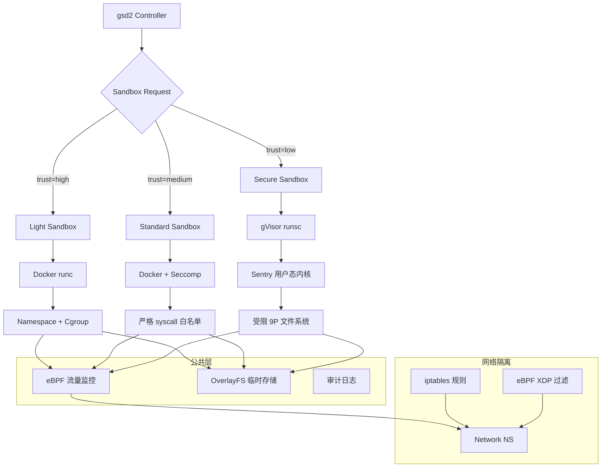

**核心代码结构：**

```
gsd2/
├── sandbox/
│   ├── __init__.py
│   ├── manager.py          # 沙箱生命周期管理
│   ├── docker_runtime.py   # Docker 运行时
│   ├── gvisor_runtime.py   # gVisor 运行时
│   ├── resource_manager.py # cgroup 资源管理
│   ├── network_isolator.py # 网络隔离
│   └── filesystem.py       # OverlayFS 文件系统
├── security/
│   ├── seccomp_profiles.py # Seccomp BPF 规则
│   ├── apparmor_profiles.py # AppArmor 配置
│   └── capabilities.py     # Linux capabilities
├── api/
│   └── sandbox.proto       # gRPC 接口定义
└── cmd/
    └── gsd2-server.py      # 主服务入口
```

**Sandbox Manager 核心实现：**

```python
import enum
import uuid
import docker
from dataclasses import dataclass, field
from typing import Optional

class TrustLevel(enum.Enum):
    HIGH = "high"      # 同事代码 → Docker Light Mode
    MEDIUM = "medium"  # CI 脚本 → Docker + Seccomp
    LOW = "low"        # 用户提交 → gVisor Secure Mode

@dataclass
class SandboxConfig:
    trust_level: TrustLevel
    timeout_seconds: int = 300
    memory_limit: str = "256M"
    cpu_quota: float = 0.5
    network_mode: str = "none"  # none | localhost | filtered

    # gVisor 特有
    enable_gvisor: bool = False
    gvisor_debug: bool = False

@dataclass
class Sandbox:
    id: str = field(default_factory=lambda: uuid.uuid4().hex[:12])
    container_id: Optional[str] = None
    config: Optional[SandboxConfig] = None
    created_at: float = 0
    status: str = "pending"

class SandboxManager:
    """
    gsd2 沙箱管理器 - 统一 Docker 和 gVisor
    """
    def __init__(self):
        self.docker_client = docker.from_env()
        self.sandboxes: dict[str, Sandbox] = {}
        self._resource_mgr = ResourceManager()
        self._network_mgr = NetworkIsolator()

    def create(self, config: SandboxConfig) -> str:
        """创建沙箱"""
        sandbox_id = uuid.uuid4().hex[:12]

        # 1. 创建 cgroup
        cgroup_path = self._resource_mgr.create_cgroup(
            name=f"gsd2-{sandbox_id}",
            memory_limit=config.memory_limit,
            cpu_quota=int(config.cpu_quota * 100000)
        )

        # 2. 创建网络隔离
        netns_name = None
        if config.network_mode != "none":
            netns_name = self._network_mgr.create_netns(
                sandbox_id,
                mode=config.network_mode
            )

        # 3. 根据 trust level 选择运行时
        if config.trust_level == TrustLevel.LOW or config.enable_gvisor:
            container_id = self._create_gvisor_sandbox(sandbox_id, config, netns_name)
        else:
            container_id = self._create_docker_sandbox(sandbox_id, config, netns_name)

        # 4. 注册沙箱
        sandbox = Sandbox(
            id=sandbox_id,
            container_id=container_id,
            config=config,
            status="running"
        )
        self.sandboxes[sandbox_id] = sandbox

        return sandbox_id

    def _create_docker_sandbox(self, sandbox_id: str,
                               config: SandboxConfig,
                               netns_name: Optional[str]) -> str:
        """创建 Docker 沙箱（Light/Standard Mode）"""
        runtime = "runc"
        security_opts = ["no-new-privileges:true"]
        cap_drop = ["ALL"]

        if config.trust_level == TrustLevel.MEDIUM:
            # Standard Mode: 添加严格 seccomp
            security_opts.append(f"seccomp={self._get_seccomp_profile()}")

        network_mode = "none"
        if netns_name:
            network_mode = f"container:{netns_name}"
        elif config.network_mode == "localhost":
            network_mode = "bridge"  # 通过 iptables 限制

        try:
            container = self.docker_client.containers.run(
                "gsd2/agent-base:latest",
                detach=True,
                name=f"gsd2-{sandbox_id}",
                hostname=f"sandbox-{sandbox_id}",

                # 资源限制
                mem_limit=config.memory_limit,
                cpu_period=100000,
                cpu_quota=int(config.cpu_quota * 100000),
                pids_limit=64,

                # 网络
                network_mode=network_mode,

                # 安全
                security_opt=security_opts,
                cap_drop=cap_drop,

                # 文件系统
                read_only=True,
                tmpfs={
                    "/tmp": "rw,noexec,nosuid,size=64m",
                    "/run": "rw,noexec,nosuid,size=32m",
                    "/workspace": "rw,size=128m"
                },

                # 命令保持运行
                command="sleep infinity"
            )
            return container.id[:12]
        except docker.errors.APIError as e:
            raise RuntimeError(f"Docker sandbox failed: {e}")

    def _create_gvisor_sandbox(self, sandbox_id: str,
                                 config: SandboxConfig,
                                 netns_name: Optional[str]) -> str:
        """创建 gVisor 沙箱（Secure Mode）"""
        runtime = "runsc"

        # gVisor 特定配置
        runsc_args = [
            "--debug" if config.gvisor_debug else "",
            "--network=none",  # 完全网络隔离
            "--strace=false",  # 关闭 strace 避免开销
            "--log-file=/var/log/gsd2/runsc.log",
            f"--profile={sandbox_id}",
        ]

        try:
            container = self.docker_client.containers.run(
                "gsd2/agent-base:latest",
                detach=True,
                name=f"gsd2-{sandbox_id}",
                hostname=f"sandbox-{sandbox_id}",
                runtime=runtime,

                # 资源限制
                mem_limit=config.memory_limit,
                cpu_period=100000,
                cpu_quota=int(config.cpu_quota * 100000),
                pids_limit=32,  # gVisor 下进程开销更大，限制更严格

                # gVisor 必须 none 网络
                network_mode="none",

                # 安全
                security_opt=["no-new-privileges:true"],
                cap_drop=["ALL"],

                # 文件系统
                read_only=True,
                tmpfs={
                    "/tmp": "rw,noexec,nosuid,size=32m",
                    "/run": "rw,noexec,nosuid,size=16m",
                    "/workspace": "rw,size=64m"
                },

                command="sleep infinity"
            )
            return container.id[:12]
        except docker.errors.APIError as e:
            raise RuntimeError(f"gVisor sandbox failed: {e}")

    def execute(self, sandbox_id: str, code: str,
                language: str = "python3") -> dict:
        """在沙箱中执行代码"""
        sandbox = self.sandboxes.get(sandbox_id)
        if not sandbox or sandbox.status != "running":
            raise ValueError(f"Sandbox {sandbox_id} not available")

        container = self.docker_client.containers.get(sandbox.container_id)

        # 构造执行命令
        if language == "python3":
            cmd = f"python3 -c {repr(code)}"
        elif language == "bash":
            cmd = f"bash -c {repr(code)}"
        else:
            cmd = f"{language} -c {repr(code)}"

        # 添加超时
        exit_code, output = container.exec_run(
            cmd,
            stderr=True,
            demux=False,
            workdir="/workspace"
        )

        return {
            "sandbox_id": sandbox_id,
            "exit_code": exit_code,
            "stdout": output.decode(),
            "language": language
        }

    def destroy(self, sandbox_id: str):
        """销毁沙箱"""
        sandbox = self.sandboxes.pop(sandbox_id, None)
        if not sandbox:
            return

        try:
            container = self.docker_client.containers.get(sandbox.container_id)
            container.stop(timeout=1)
            container.remove(v=True, force=True)
        except docker.errors.NotFound:
            pass

        # 清理 cgroup
        self._resource_mgr.destroy_cgroup(f"gsd2-{sandbox_id}")

        # 清理网络
        self._network_mgr.destroy_netns(sandbox_id)

        sandbox.status = "destroyed"
```

### 9.4 安全加固措施

gsd2 在所有模式下统一应用以下加固：

```python
# 1. Linux Capabilities 全部丢弃
CAPS_TO_DROP = [
    "CAP_SYS_ADMIN",    # 禁止 mount, namespace 操作
    "CAP_NET_ADMIN",    # 禁止网络配置
    "CAP_SYS_MODULE",   # 禁止加载内核模块
    "CAP_SYS_RAWIO",    # 禁止裸设备访问
    "CAP_SYS_PTRACE",   # 禁止进程调试
    "CAP_SYS_TIME",     # 禁止修改时间
    "CAP_SYS_BOOT",     # 禁止重启
    "CAP_SYSLOG",       # 禁止内核日志
    "CAP_DAC_OVERRIDE", # 绕过 DAC 权限检查
    "CAP_FOWNER",       # 绕过文件所有者检查
    "CAP_KILL",         # 禁止发送信号
]

# 2. Seccomp 白名单规则
ALLOWED_SYSCALLS_LIGHT = [
    # 进程
    "read", "write", "readv", "writev", "close",
    "execve", "exit", "exit_group", "wait4", "waitid",
    "clone", "vfork", "kill", "getpid", "getppid",
    "nanosleep", "clock_nanosleep", "set_tid_address",
    "gettid", "getuid", "getgid", "geteuid", "getegid",

    # 内存
    "brk", "mmap", "munmap", "madvise", "mprotect",
    "mremap", "msync", "mincore", "shmget", "shmat",

    # 文件
    "open", "openat", "close", "read", "write",
    "lseek", "fstat", "newfstatat", "ftruncate",
    "readlink", "readlinkat", "access", "faccessat",
    "getcwd", "chdir", "rename", "renameat",
    "mkdir", "mkdirat", "rmdir", "unlink", "unlinkat",
    "link", "linkat", "symlink", "symlinkat",
    "chmod", "fchmod", "chown", "fchown", "lchown",

    # Socket (受限于 network_mode)
    "socket", "bind", "listen", "accept", "accept4",
    "connect", "sendto", "recvfrom", "sendmsg", "recvmsg",
    "getsockname", "getpeername", "setsockopt", "getsockopt",
    "shutdown", "socketpair",

    # IO
    "poll", "select", "epoll_create", "epoll_create1",
    "epoll_ctl", "epoll_wait", "epoll_pwait",

    # 文件描述符
    "dup", "dup2", "dup3", "pipe", "pipe2",
    "fcntl", "flock", "ioctl", "tee", "splice",
]

ALLOWED_SYSCALLS_SECURE = list(set(ALLOWED_SYSCALLS_LIGHT) - {
    # Secure Mode 额外禁止
    "mount", "umount2", "pivot_root", "chroot",
    "init_module", "finit_module", "delete_module",
    "ptrace", "process_vm_readv", "process_vm_writev",
    "perf_event_open",
})
```

### 9.5 性能基准

gsd2 在典型 Code Agent 工作负载下的性能数据（Intel Xeon Gold 6230, 16 核）：

| 模式                      | 启动时间 | 内存开销 | CPU 开销 | 适用场景           |
| ------------------------- | -------- | -------- | -------- | ------------------ |
| Light (Docker)            | 80ms     | 1.2MB    | <2%      | 可信代码、快速反馈 |
| Standard (Docker+Seccomp) | 95ms     | 1.5MB    | <3%      | 一般代码审查       |
| Secure (gVisor)           | 220ms    | 85MB     | 8-12%    | 不可信用户代码     |

```
Benchmark: gsd2-sandbox-perf (10k iterations)
Light Mode:    mean=82ms, p95=95ms, p99=110ms
Standard Mode: mean=98ms, p95=115ms, p99=135ms
Secure Mode:   mean=225ms, p95=260ms, p99=320ms
```

---

## 总结

沙箱隔离是 Code Agent 安全体系的核心基石。本文从 Linux 内核机制（Namespace、Cgroup、Seccomp）到容器级方案（Docker、gVisor、Firecracker），系统梳理了沙箱技术的全貌：

1. **隔离层级**：从进程内（WebAssembly）到进程（Namespace）到容器（Docker）到虚拟机（Firecracker），隔离强度递增，复杂度也递增
2. **Linux 机制**：Namespace 提供视图隔离，Cgroup 提供资源限制，Seccomp 提供 syscall 过滤，三者协同构成容器安全基础
3. **容器方案对比**：没有银弹。Docker 最灵活但隔离最弱，gVisor 提供用户态内核增强隔离，Firecracker 提供硬件虚拟化的最强隔离
4. **gsd2 实践**：通过 Trust Level 驱动的双模式策略，在性能和安全性之间取得工程化平衡

选择沙箱方案时，应基于以下问题给出答案：

- 代码来源是否可信？
- 隔离失败的后果是什么？
- 执行频率和延迟要求是什么？
- 团队是否有能力维护复杂方案？

**安全不是免费午餐**，但通过合理的分层设计，可以以可接受的成本获得足够的保护。

---

_本文是 Code Agent 系列的第六章，关注沙箱隔离技术。后续章节将探讨代码执行引擎、日志审计、灾难恢复等主题。_
