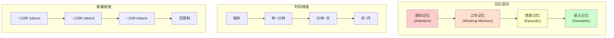
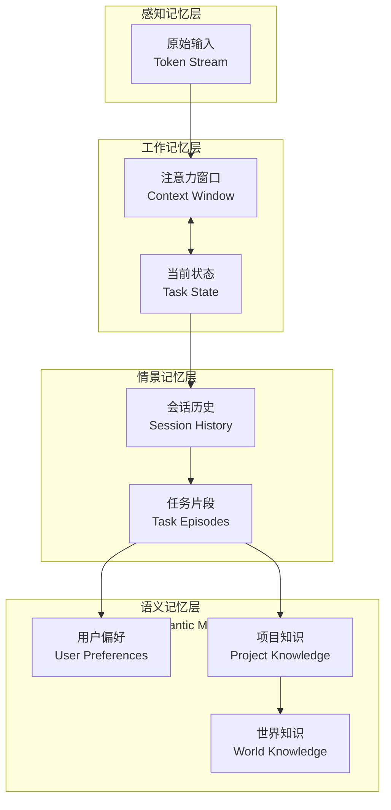
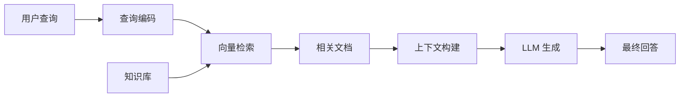
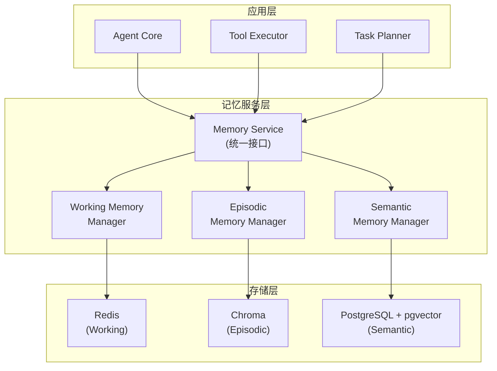

# Code Agent Ch7: 记忆系统设计

## 1. 记忆系统概述

### 1.1 为什么 Agent 需要记忆

大语言模型本身是无状态的——每一次 API 调用都是独立的，模型不会自动记住之前的对话内容。Code Agent 作为在代码仓库环境中持续工作的智能体，必须具备记忆能力来完成复杂的长期任务。

一个典型的场景是：当 Agent 正在修复一个多文件的 Bug 时，它需要记住之前已经分析过的文件和做出的判断；当用户中途改变了需求，Agent 需要从记忆中检索先前的上下文来理解当前任务的连续性。没有记忆系统，Agent 就像一个每次都被抹除记忆的失忆者，无法完成任何需要跨多轮交互的工作。

记忆系统解决三个核心问题：**上下文连续性**（保持多轮对话的任务状态）、**知识积累**（从历史交互中学习用户偏好和项目知识）、**信息复用**（避免重复处理相同的信息）。

### 1.2 记忆分类

根据信息保持时间和技术实现的不同，我们可以将 Agent 记忆划分为以下几类：

| 记忆类型 | 保持时间 | 容量 | 访问速度 | 典型实现 |
|---------|---------|------|---------|---------|
| 感知记忆 | 毫秒级 | 极小 | 极快 | 模型注意力机制 |
| 工作记忆 | 当前会话 | 有限（上下文窗口） | 快 | 对话历史、上下文缓存 |
| 情景记忆 | 会话后较长时间 | 中等 | 中等 | 消息存储、向量数据库 |
| 语义记忆 | 长期 | 大 | 较慢 | 结构化知识库、Embedding 索引 |

这种分类借鉴了认知心理学中记忆的层级模型，但针对 LLM Agent 的特点做了适配。理解每种记忆类型的特性是设计高效记忆系统的基础。



## 2. 短期记忆

### 2.1 对话上下文

短期记忆的核心是对话上下文的维护。在 Code Agent 场景中，上下文不仅包含用户消息和 Agent 回复，还包括当前任务的中间状态、工具调用结果、文件系统变更等。

典型的对话上下文结构如下：

```typescript
interface ConversationContext {
  sessionId: string;
  messages: Message[];
  taskState: TaskState;
  toolResults: ToolResult[];
  fileChanges: FileChange[];
  timestamp: Date;
}

interface Message {
  role: 'user' | 'assistant' | 'system';
  content: string;
  metadata: {
    tokens?: number;
    attachments?: Attachment[];
  };
}

interface TaskState {
  currentGoal: string;
  completedSteps: Step[];
  pendingSteps: Step[];
  blockedBy?: string[];
}
```

### 2.2 Working Memory 实现

Working Memory 是 Agent 在推理过程中临时存储和操作信息的场所。在 LLM 中，这部分功能通过有限的上下文窗口来实现。gsd2 项目中，工作记忆的管理采用了分层策略：

```python
class WorkingMemory:
    """工作记忆管理器"""
    
    def __init__(self, max_tokens: int = 128000):
        self.max_tokens = max_tokens
        self._context: list[Message] = []
        self._importance_scores: dict[str, float] = {}
    
    def add(self, message: Message) -> None:
        """添加新消息到工作记忆"""
        self._context.append(message)
        self._importance_scores[message.id] = self._calculate_importance(message)
        self._ensure_capacity()
    
    def _calculate_importance(self, message: Message) -> float:
        """
        计算消息重要性分数
        考虑因素：
        - 消息类型（系统消息 > 助手消息 > 用户消息）
        - 内容长度
        - 是否包含代码片段
        - 是否包含错误信息
        """
        base_score = {
            'system': 1.0,
            'assistant': 0.7,
            'user': 0.5
        }.get(message.role, 0.5)
        
        # 代码相关消息加分
        if '```' in message.content:
            base_score += 0.2
        
        # 错误相关信息大幅加分
        if any(keyword in message.content.lower() 
               for keyword in ['error', 'exception', 'failed', 'traceback']):
            base_score += 0.3
        
        return min(base_score, 1.0)
    
    def _ensure_capacity(self) -> None:
        """确保上下文不超过最大容量，必要时压缩"""
        while self._estimated_tokens() > self.max_tokens:
            self._compress()
    
    def _estimated_tokens(self) -> int:
        """估算当前上下文 token 数（简化估算：中文约 0.5 token/字符）"""
        return sum(len(m.content) // 2 for m in self._context)
    
    def _compress(self) -> None:
        """压缩上下文：保留高重要性消息，摘要或删除低重要性消息"""
        # 按重要性排序
        sorted_messages = sorted(
            self._context,
            key=lambda m: self._importance_scores.get(m.id, 0),
            reverse=True
        )
        
        # 保留 top 70% 的消息
        keep_count = int(len(sorted_messages) * 0.7)
        kept_messages = sorted_messages[:keep_count]
        
        # 对被删除的消息进行摘要
        removed_messages = sorted_messages[keep_count:]
        if removed_messages:
            summary = self._summarize_messages(removed_messages)
            kept_messages.append(Message(
                role='system',
                content=f'[前 {len(removed_messages)} 条消息摘要]: {summary}'
            ))
        
        # 重新构建上下文（保持时间顺序）
        self._context = sorted(kept_messages, key=lambda m: m.timestamp)
```

### 2.3 注意力窗口管理

注意力窗口是 LLM 处理信息的物理限制。以 GPT-4 为例，上下文窗口从 8K 到 128K 不等；Claude 模型可达 200K tokens。管理注意力窗口的关键策略包括：

**滑动窗口策略**：始终保持最近 N 条消息，丢弃旧消息。简单但可能丢失重要历史信息。

**重要性加权策略**：根据消息内容赋予不同权重，优先保留高权重内容。上文的 `_calculate_importance` 即为此策略的实现。

**语义压缩策略**：使用另一个 LLM 将一段对话压缩为简洁的摘要，保留核心信息的同时大幅减少 token 消耗。

```python
class SlidingWindowAttention:
    """滑动窗口注意力管理器"""
    
    def __init__(self, window_size: int = 20, summary_threshold: int = 5):
        self.window_size = window_size
        self.summary_threshold = summary_threshold
        self.messages: list[Message] = []
        self.summaries: list[Summary] = []
    
    def add(self, message: Message) -> None:
        self.messages.append(message)
        
        if len(self.messages) > self.window_size:
            # 将最老的消息转移到摘要区域
            old_messages = self.messages[:-self.window_size]
            self.messages = self.messages[-self.window_size:]
            
            # 生成摘要
            summary = self._create_summary(old_messages)
            self.summaries.append(summary)
    
    def get_context(self) -> str:
        """获取完整的上下文表示"""
        parts = []
        
        # 添加历史摘要
        for s in self.summaries:
            parts.append(f"[历史摘要 - {s.time_range}]: {s.content}")
        
        # 添加当前窗口消息
        for m in self.messages:
            parts.append(f"{m.role}: {m.content}")
        
        return "\n\n".join(parts)
```

## 3. 长期记忆

### 3.1 Persistent Memory 设计

长期记忆解决的是跨会话的信息持久化问题。与短期记忆不同，长期记忆需要考虑存储效率、检索速度和更新机制。

```python
class PersistentMemory:
    """
    持久化记忆存储
    支持多种存储后端：内存、文件、数据库
    """
    
    def __init__(
        self,
        storage_backend: StorageBackend,
        embedding_model: EmbeddingModel,
        max_memory_size: int = 10000
    ):
        self.storage = storage_backend
        self.embedding_model = embedding_model
        self.max_memory_size = max_memory_size
    
    async def store(
        self,
        content: str,
        memory_type: MemoryType,
        metadata: dict
    ) -> str:
        """存储记忆到长期记忆"""
        memory_id = generate_id()
        
        # 生成 embedding
        vector = await self.embedding_model.encode(content)
        
        memory_entry = MemoryEntry(
            id=memory_id,
            content=content,
            memory_type=memory_type,
            vector=vector,
            metadata=metadata,
            created_at=datetime.now(),
            access_count=0,
            last_accessed=None
        )
        
        await self.storage.save(memory_entry)
        return memory_id
    
    async def retrieve(
        self,
        query: str,
        memory_type: MemoryType | None = None,
        top_k: int = 5
    ) -> list[MemoryEntry]:
        """基于语义相似度检索记忆"""
        query_vector = await self.embedding_model.encode(query)
        
        # 构造查询条件
        conditions = []
        if memory_type:
            conditions.append(f"memory_type = '{memory_type.value}'")
        
        results = await self.storage.search(
            vector=query_vector,
            top_k=top_k,
            conditions=conditions
        )
        
        # 更新访问统计
        for result in results:
            result.access_count += 1
            result.last_accessed = datetime.now()
            await self.storage.update(result)
        
        return results
```

### 3.2 用户偏好记忆

用户偏好是 Agent 提供个性化服务的基础。偏好信息包括编码风格、常用工具、沟通习惯等。偏好记忆需要区分显式偏好（用户直接告知）和隐式偏好（从行为中推断）。

```python
class UserPreferenceMemory:
    """用户偏好记忆管理器"""
    
    def __init__(self, user_id: str, storage: PersistentMemory):
        self.user_id = user_id
        self.storage = storage
        self._preference_cache: dict[str, any] = {}
        self._load_preferences()
    
    async def record_action(
        self,
        action: str,
        context: dict,
        result: str
    ) -> None:
        """
        记录用户行为，用于学习隐式偏好
        例如：用户总是拒绝某个类型的建议，说明可能存在相关偏好
        """
        memory = MemoryEntry(
            content=f"User action: {action}, Context: {context}, Result: {result}",
            memory_type=MemoryType.USER_PREFERENCE,
            metadata={
                'user_id': self.user_id,
                'action_type': action,
                'explicit': False
            }
        )
        await self.storage.store(memory)
    
    async def set_preference(
        self,
        key: str,
        value: any,
        source: str = 'explicit'
    ) -> None:
        """设置显式偏好"""
        self._preference_cache[key] = value
        memory = MemoryEntry(
            content=f"User preference: {key} = {value}",
            memory_type=MemoryType.USER_PREFERENCE,
            metadata={
                'user_id': self.user_id,
                'preference_key': key,
                'source': source,
                'explicit': source == 'explicit'
            }
        )
        await self.storage.store(memory)
    
    def get_preference(self, key: str, default: any = None) -> any:
        """获取偏好值（优先从缓存读取）"""
        return self._preference_cache.get(key, default)
    
    async def infer_preferences(self) -> dict[str, any]:
        """
        从历史行为中推断隐式偏好
        使用简单的规则或 ML 模型
        """
        recent_actions = await self.storage.retrieve(
            query=f"user {self.user_id} actions",
            memory_type=MemoryType.USER_PREFERENCE,
            top_k=50
        )
        
        # 统计频繁出现的模式
        patterns = self._analyze_patterns(recent_actions)
        return patterns
```

### 3.3 项目知识记忆

项目知识是 Code Agent 特有的记忆类型，包含代码结构、技术栈、架构决策等。这些信息对于 Agent 正确理解和修改代码至关重要。

```python
class ProjectKnowledgeMemory:
    """项目知识记忆管理器"""
    
    PROJECT_MEMORY_TYPES = [
        'architecture',
        'code_structure', 
        'dependencies',
        'conventions',
        'tech_stack',
        'recent_changes'
    ]
    
    def __init__(self, project_path: str, storage: PersistentMemory):
        self.project_path = Path(project_path)
        self.storage = storage
        self.project_id = self._compute_project_id()
    
    async def index_project(self) -> None:
        """为项目建立索引，提取关键知识"""
        await self._index_file_structure()
        await self._index_dependencies()
        await self._index_code_conventions()
        await self._index_architecture()
    
    async def _index_file_structure(self) -> None:
        """索引项目文件结构"""
        structure = self._walk_project_tree()
        
        memory = MemoryEntry(
            content=json.dumps(structure, indent=2),
            memory_type=MemoryType.PROJECT_KNOWLEDGE,
            metadata={
                'project_id': self.project_id,
                'knowledge_type': 'file_structure',
                'root': str(self.project_path)
            }
        )
        await self.storage.store(memory)
    
    async def query(
        self,
        query: str,
        knowledge_types: list[str] | None = None
    ) -> list[MemoryEntry]:
        """查询项目相关知识"""
        memories = await self.storage.retrieve(
            query=query,
            memory_type=MemoryType.PROJECT_KNOWLEDGE,
            top_k=10
        )
        
        if knowledge_types:
            memories = [
                m for m in memories 
                if m.metadata.get('knowledge_type') in knowledge_types
            ]
        
        return memories
```

## 4. 向量数据库

### 4.1 Vector DB 核心概念

向量数据库是存储和检索高维向量（通常是 Embedding）的专用系统。在 Agent 记忆系统中，向量数据库提供了语义搜索能力——通过比较向量相似度找到语义相关的内容。

向量数据库的核心操作是最近邻搜索（ANN，Approximate Nearest Neighbor）。由于精确搜索在高维空间中的时间复杂度是 O(n)，我们使用 ANN 算法以精度换取速度。

### 4.2 主流向量数据库对比

| 数据库 | 优势 | 劣势 | 适用场景 | 开源 |
|-------|------|------|---------|-----|
| FAISS | Facebook 出品，GPU 加速，索引类型丰富 | 需要自己管理，不支持云原生 | 大规模离线批处理 | 是 |
| Chroma | 轻量级，易用性强 | 生产环境经验较少 | 原型开发、小规模 | 是 |
| Qdrant | 云原生，支持混合搜索，Rust 实现 | 生态较新 | 生产级混合搜索 | 是 |
| pgvector | 基于 PostgreSQL，集成度高 | 性能相对专用向量库较弱 | 已有 PG 栈的团队 | 是 |
| Milvus | 分布式支持好，成熟度高 | 资源占用大 | 超大规模向量 | 是 |
| Pinecone | 全托管，云原生 | 成本高，黑盒 | 不想运维的场景 | 否 |
| Weaviate | 混合搜索，原生 GraphQL | 文档相对不足 | 需要混合检索 | 是 |

对于 Code Agent 场景，我们推荐：原型阶段使用 Chroma，生产环境根据规模选择 Qdrant（中小规模）或 Milvus（大规模）。

### 4.3 Embedding 与 ANN 索引

```python
class EmbeddingIndex:
    """向量索引管理器"""
    
    def __init__(
        self,
        dimension: int = 1536,
        index_type: str = 'HNSW',
        metric: str = 'cosine'
    ):
        self.dimension = dimension
        self.index_type = index_type
        self.metric = metric
        self.index: Any | None = None
        self.id_map: dict[str, np.ndarray] = {}
    
    def build(self, vectors: dict[str, np.ndarray]) -> None:
        """构建索引"""
        if self.index_type == 'HNSW':
            self._build_hnsw(vectors)
        elif self.index_type == 'IVF':
            self._build_ivf(vectors)
        else:
            raise ValueError(f"Unknown index type: {self.index_type}")
    
    def _build_hnsw(self, vectors: dict[str, np.ndarray]) -> None:
        """构建 HNSW 索引"""
        import faiss
        
        # 归一化向量（用于余弦相似度）
        matrix = np.array(list(vectors.values())).astype('float32')
        norms = np.linalg.norm(matrix, axis=1, keepdims=True)
        matrix = matrix / (norms + 1e-8)
        
        # 创建 HNSW 索引
        self.index = faiss.IndexHNSWFlat(self.dimension, 32)
        self.index.hnsw.efConstruction = 200
        self.index.add(matrix)
        
        self.id_map = {i: vid for i, vid in enumerate(vectors.keys())}
    
    def _build_ivf(self, vectors: dict[str, np.ndarray]) -> None:
        """构建 IVF 倒排索引"""
        import faiss
        
        matrix = np.array(list(vectors.values())).astype('float32')
        
        # 先量化
        quantizer = faiss.IndexFlatIP(self.dimension)
        self.index = faiss.IndexIVFFlat(
            quantizer, 
            self.dimension, 
            nlist=100
        )
        self.index.train(matrix)
        self.index.add(matrix)
        
        self.id_map = {i: vid for i, vid in enumerate(vectors.keys())}
    
    def search(
        self,
        query_vector: np.ndarray,
        top_k: int = 5
    ) -> list[tuple[str, float]]:
        """搜索最近邻"""
        # 归一化查询向量
        query_vector = query_vector / (np.linalg.norm(query_vector) + 1e-8)
        query_vector = query_vector.reshape(1, -1).astype('float32')
        
        if self.metric == 'cosine':
            self.index.reset()
            distances, indices = self.index.search(query_vector, top_k)
        else:
            distances, indices = self.index.search(query_vector, top_k)
        
        results = []
        for dist, idx in zip(distances[0], indices[0]):
            if idx >= 0 and idx < len(self.id_map):
                vid = self.id_map[idx]
                # 转换余弦距离为相似度
                similarity = (dist + 1) / 2
                results.append((vid, float(similarity)))
        
        return results
```

### 4.4 Chroma 集成示例

```python
import chromadb
from chromadb.config import Settings

class ChromaMemoryStore:
    """基于 Chroma 的记忆存储"""
    
    def __init__(
        self,
        persist_directory: str = './chroma_db',
        collection_name: str = 'agent_memory'
    ):
        self.client = chromadb.Client(Settings(
            anonymized_telemetry=False,
            allow_reset=True
        ))
        
        # 持久化客户端
        self.persist_client = chromadb.PersistentClient(
            path=persist_directory
        )
        
        self.collection = self.persist_client.get_or_create_collection(
            name=collection_name,
            metadata={'hnsw:space': 'cosine'}
        )
    
    def add_memory(
        self,
        id: str,
        content: str,
        metadata: dict | None = None
    ) -> None:
        """添加记忆"""
        self.collection.add(
            documents=[content],
            ids=[id],
            metadatas=[metadata or {}]
        )
    
    def search(
        self,
        query: str,
        n_results: int = 5,
        where: dict | None = None
    ) -> list[dict]:
        """语义搜索"""
        results = self.collection.query(
            query_texts=[query],
            n_results=n_results,
            where=where
        )
        
        memories = []
        for i, doc_id in enumerate(results['ids'][0]):
            memories.append({
                'id': doc_id,
                'content': results['documents'][0][i],
                'metadata': results['metadatas'][0][i],
                'distance': results['distances'][0][i]
            })
        
        return memories
    
    def delete(self, id: str) -> None:
        """删除记忆"""
        self.collection.delete(ids=[id])
    
    def reset(self) -> None:
        """重置集合"""
        self.persist_client.delete_collection(self.collection.name)
        self.collection = self.persist_client.get_or_create_collection(
            name=self.collection.name
        )
```

## 5. 语义搜索

### 5.1 Embedding 模型选择

Embedding 模型将文本转换为稠密向量，是语义搜索的基础。选择合适的 Embedding 模型需要考虑以下因素：

| 模型 | 维度 | 上下文长度 | 优势 | 适用场景 |
|-----|------|----------|------|---------|
| text-embedding-ada-002 | 1536 | 8192 | OpenAI 官方，稳定 | 通用场景 |
| text-embedding-3-small | 1536/256 | 8192 | 性价比高 | 成本敏感场景 |
| text-embedding-3-large | 3072 | 8192 | 精度高 | 高精度需求 |
| voyage-code-2 | 1024 | 16000 | 代码优化 | Code Agent |
| cohere embed-english-v3 | 1024 | 512 | 多语言支持 | 多语言场景 |
| BGE-large-zh | 1024 | 512 | 中文优化 | 中文场景 |

对于 Code Agent，特别是处理代码仓库的场景，**voyage-code-2** 是专门为代码优化过的模型，在代码检索任务上表现优异。如果项目以中文为主，可以考虑 **BGE-large-zh**。

```python
class EmbeddingModel:
    """Embedding 模型统一接口"""
    
    def __init__(
        self,
        provider: str = 'openai',
        model: str = 'text-embedding-3-small',
        api_key: str | None = None
    ):
        self.provider = provider
        self.model = model
        self.client = self._init_client(api_key)
    
    def _init_client(self, api_key: str | None) -> Any:
        if self.provider == 'openai':
            from openai import OpenAI
            return OpenAI(api_key=api_key)
        elif self.provider == 'cohere':
            import cohere
            return cohere.Client(api_key=api_key)
        else:
            raise ValueError(f"Unknown provider: {self.provider}")
    
    async def encode(self, texts: str | list[str]) -> np.ndarray:
        """将文本编码为向量"""
        if isinstance(texts, str):
            texts = [texts]
        
        if self.provider == 'openai':
            response = self.client.embeddings.create(
                model=self.model,
                input=texts
            )
            vectors = [item.embedding for item in response.data]
        elif self.provider == 'cohere':
            response = self.client.embed(
                texts=texts,
                model=self.model,
                input_type='search_document'
            )
            vectors = response.embeddings
        else:
            raise ValueError(f"Unknown provider: {self.provider}")
        
        if len(vectors) == 1:
            return np.array(vectors[0])
        return np.array(vectors)
    
    async def encode_code(self, code: str) -> np.ndarray:
        """专门用于代码的编码（使用代码优化模型）"""
        if 'voyage' in self.model:
            response = self.client.embeddings.create(
                model=self.model,
                input=[code],
                input_type='code'
            )
            return np.array(response.data[0].embedding)
        
        # 回退到普通编码
        return await self.encode(code)
```

### 5.2 相似度计算

向量相似度是语义搜索的核心指标。常用的相似度计算方法有：

**余弦相似度 (Cosine Similarity)**：衡量两个向量夹角的余弦值，范围 [-1, 1]，越接近 1 表示越相似。

```
cosine_similarity(A, B) = (A · B) / (||A|| × ||B||)
```

**点积 (Dot Product)**：直接计算向量内积。对于归一化向量，等价于余弦相似度。

**欧氏距离 (Euclidean Distance)**：衡量向量空间的直线距离。距离越小越相似。

```python
def cosine_similarity(a: np.ndarray, b: np.ndarray) -> float:
    """计算余弦相似度"""
    return np.dot(a, b) / (np.linalg.norm(a) * np.linalg.norm(b) + 1e-8)

def dot_product_similarity(a: np.ndarray, b: np.ndarray) -> float:
    """计算点积相似度"""
    return float(np.dot(a, b))

def euclidean_distance(a: np.ndarray, b: np.ndarray) -> float:
    """计算欧氏距离"""
    return float(np.linalg.norm(a - b))

def normalized_dot_product(a: np.ndarray, b: np.ndarray) -> float:
    """
    归一化点积（适用于向量已归一化的情况）
    返回值范围 [0, 1]，可直接作为相似度
    """
    return (dot_product_similarity(a, b) + 1) / 2
```

### 5.3 Reranking 策略

初始检索结果往往需要 Reranking（重排）来提升质量。常见的 Reranking 策略包括：

**Cross-Encoder Reranking**：使用专门的 Cross-Encoder 模型重新评估查询和文档的相关性，精度高但计算量大。

**MMR (Maximum Marginal Relevance)**：在相关性和多样性之间取得平衡，避免返回过于相似的结果。

**BM25 + Vector 混合**：结合关键词搜索和向量搜索的结果。

```python
class Reranker:
    """搜索结果重排器"""
    
    def __init__(self, model: str = 'cross-encoder/ms-marco-MiniLML-6-v2'):
        from sentence_transformers import CrossEncoder
        self.model = CrossEncoder(model)
    
    def rerank(
        self,
        query: str,
        documents: list[str],
        top_k: int = 5
    ) -> list[dict]:
        """使用 Cross-Encoder 重排"""
        # 构建查询-文档对
        pairs = [(query, doc) for doc in documents]
        
        # 批量预测相关性分数
        scores = self.model.predict(pairs)
        
        # 按分数排序
        scored_docs = sorted(
            zip(documents, scores),
            key=lambda x: x[1],
            reverse=True
        )
        
        return [
            {'document': doc, 'score': float(score)}
            for doc, score in scored_docs[:top_k]
        ]

class MMRReranker:
    """MMR 重排器 - 平衡相关性与多样性"""
    
    def __init__(self, embedding_model: EmbeddingModel, lambda_param: float = 0.5):
        self.embedding_model = embedding_model
        self.lambda_param = lambda_param  # 相关性权重，1-lambda 为多样性权重
    
    async def rerank(
        self,
        query: str,
        documents: list[str],
        top_k: int = 5
    ) -> list[str]:
        """MMR 重排"""
        if len(documents) <= top_k:
            return documents
        
        query_vector = await self.embedding_model.encode(query)
        doc_vectors = await self.embedding_model.encode(documents)
        
        selected = []
        remaining = list(range(len(documents)))
        
        for _ in range(top_k):
            best_score = -float('inf')
            best_idx = None
            
            for idx in remaining:
                # 计算与查询的相关性
                relevance = cosine_similarity(query_vector, doc_vectors[idx])
                
                # 计算与已选文档的最大相似度（多样性惩罚）
                max_similarity = 0
                if selected:
                    selected_vectors = doc_vectors[selected]
                    similarities = [
                        cosine_similarity(doc_vectors[idx], sv) 
                        for sv in selected_vectors
                    ]
                    max_similarity = max(similarities)
                
                # MMR 分数
                mmr_score = (
                    self.lambda_param * relevance -
                    (1 - self.lambda_param) * max_similarity
                )
                
                if mmr_score > best_score:
                    best_score = mmr_score
                    best_idx = idx
            
            selected.append(best_idx)
            remaining.remove(best_idx)
        
        return [documents[i] for i in selected]
```

## 6. 记忆分层架构

### 6.1 四层记忆模型

借鉴认知心理学的记忆模型，我们为 Code Agent 设计了四层记忆架构：



### 6.2 各层职责与交互

| 层级 | 存储内容 | 容量限制 | 访问频率 | 典型实现 |
|-----|---------|---------|---------|---------|
| 感知记忆 | 原始 token 流 | 无（流式处理） | 每 token | 模型输入层 |
| 工作记忆 | 当前上下文 | 上下文窗口 | 每轮交互 | 对话历史 |
| 情景记忆 | 历史交互 | 百万级记忆 | 按需检索 | Vector DB |
| 语义记忆 | 结构化知识 | 无限制 | 按需检索 | KB + Vector DB |

各层之间的数据流动遵循特定规则：**工作记忆**定期将重要信息**沉淀**到情景记忆；**情景记忆**中的相关信息被**激活**到工作记忆；**语义记忆**为推理提供背景知识。

```python
class MemoryHierarchy:
    """记忆层级管理器"""
    
    def __init__(
        self,
        working_memory: WorkingMemory,
        episodic_memory: ChromaMemoryStore,
        semantic_memory: PersistentMemory
    ):
        self.working = working_memory
        self.episodic = episodic_memory
        self.semantic = semantic_memory
        
        # 沉淀策略
        self.precipitation_threshold = 0.8  # 重要性分数阈值
        self.max_working_items = 50  # 工作记忆最大条数
    
    async def add_interaction(
        self,
        role: str,
        content: str,
        metadata: dict
    ) -> None:
        """添加交互到工作记忆，并根据策略决定是否沉淀"""
        message = Message(
            role=role,
            content=content,
            metadata=metadata
        )
        
        # 添加到工作记忆
        self.working.add(message)
        
        # 检查是否需要沉淀到情景记忆
        importance = self.working._importance_scores.get(message.id, 0)
        if importance >= self.precipitation_threshold:
            await self._precipitate_to_episodic(message)
    
    async def _precipitate_to_episodic(
        self,
        message: Message
    ) -> None:
        """将重要记忆沉淀到情景记忆层"""
        memory_id = f"episodic_{message.id}"
        self.episodic.add_memory(
            id=memory_id,
            content=message.content,
            metadata={
                **message.metadata,
                'original_id': message.id,
                'importance': self.working._importance_scores.get(message.id, 0),
                'precipitated_at': datetime.now().isoformat()
            }
        )
    
    async def retrieve(
        self,
        query: str,
        layers: list[str] | None = None
    ) -> dict[str, list]:
        """跨层检索记忆"""
        layers = layers or ['working', 'episodic', 'semantic']
        results = {}
        
        if 'working' in layers:
            # 工作记忆直接搜索
            results['working'] = [
                m for m in self.working._context
                if query.lower() in m.content.lower()
            ]
        
        if 'episodic' in layers:
            results['episodic'] = self.episodic.search(
                query=query,
                n_results=10
            )
        
        if 'semantic' in layers:
            results['semantic'] = await self.semantic.retrieve(
                query=query,
                top_k=10
            )
        
        return results
```

## 7. 上下文窗口管理

### 7.1 窗口管理策略对比

上下文窗口是 LLM 的硬性限制。管理策略的选择直接影响 Agent 的能力。

| 策略 | 描述 | 优势 | 劣势 | 适用场景 |
|-----|------|------|------|---------|
| 截断 | 直接丢弃超出部分 | 简单 | 可能丢失关键信息 | 短对话 |
| 滑动窗口 | 保持最近 N 条消息 | 实现简单 | 可能丢失历史上下文 | 长对话 |
| 摘要 | 将旧消息压缩为摘要 | 保留高层信息 | 丢失细节 | 中长对话 |
| 层级记忆 | 多层记忆结构 | 信息分层管理 | 实现复杂 | 复杂任务 |
| 混合 | 组合多种策略 | 灵活 | 实现复杂 | 生产环境 |

### 7.2 重要性评分实现

```python
class ImportanceScorer:
    """内容重要性评分器"""
    
    def __init__(self, llm_client: Any = None):
        self.llm_client = llm_client
        
        # 关键词权重
        self.importance_keywords = {
            'error': 0.3,
            'exception': 0.3,
            'failed': 0.2,
            'warning': 0.15,
            'critical': 0.4,
            'bug': 0.25,
            'fix': 0.2,
            'important': 0.2,
            'must': 0.15,
            'required': 0.15
        }
        
        # 正面关键词（降低重要性）
        self.deimportance_keywords = {
            'thanks': -0.1,
            'ok': -0.05,
            'sure': -0.05,
            'yes': -0.05
        }
    
    def score(self, content: str, context: dict | None = None) -> float:
        """
        计算内容的重要性分数
        返回值范围 [0, 1]
        """
        score = 0.5  # 基础分数
        content_lower = content.lower()
        
        # 关键词加分
        for keyword, weight in self.importance_keywords.items():
            if keyword in content_lower:
                score += weight
        
        # 负面关键词减分
        for keyword, weight in self.deimportance_keywords.items():
            if keyword in content_lower:
                score += weight
        
        # 代码片段加分
        code_blocks = content.count('```')
        score += min(code_blocks * 0.1, 0.3)
        
        # 长度惩罚（过长内容适当降低分数）
        if len(content) > 10000:
            score *= 0.9
        elif len(content) > 50000:
            score *= 0.8
        
        # 上下文加成
        if context:
            if context.get('is_error_message'):
                score += 0.2
            if context.get('contains_decision'):
                score += 0.15
        
        return max(0.0, min(1.0, score))
    
    async def score_with_llm(
        self,
        content: str,
        task_context: str
    ) -> float:
        """
        使用 LLM 进行重要性评估（更准确但成本高）
        """
        if not self.llm_client:
            return self.score(content)
        
        prompt = f"""评估以下消息对于完成当前任务的重要程度。
        
任务上下文：{task_context}

消息内容：{content}

请返回一个 0-1 之间的小数表示重要程度，0 表示完全不重要，1 表示非常重要。

只返回一个数字，不要其他内容。"""
        
        response = await self.llm_client.complete(prompt)
        try:
            return float(response.strip())
        except:
            return 0.5
```

### 7.3 智能摘要实现

```python
class ContextSummarizer:
    """上下文摘要器"""
    
    def __init__(self, llm_client: Any):
        self.llm_client = llm_client
    
    async def summarize_messages(
        self,
        messages: list[Message],
        task_context: str,
        target_tokens: int = 2000
    ) -> str:
        """
        将多条消息压缩为指定长度的摘要
        """
        if not messages:
            return ""
        
        # 构造摘要请求
        messages_text = "\n---\n".join([
            f"[{m.role}] {m.content}"
            for m in messages
        ])
        
        prompt = f"""你是一个对话摘要助手。请将以下对话历史压缩为简洁的摘要，
保留所有对理解当前任务重要的信息。

当前任务：{task_context}

对话历史：
{messages_text}

请按以下格式生成摘要：
1. 任务进展：[简述已完成的工作和当前状态]
2. 关键决策：[记录做出的重要决定及原因]
3. 重要发现：[记录发现的关键信息，如错误、限制等]
4. 待处理事项：[记录还需要完成的工作]

摘要："""
        
        response = await self.llm_client.complete(prompt)
        return response.strip()
    
    async def progressive_summarize(
        self,
        messages: list[Message],
        task_context: str,
        max_iterations: int = 3
    ) -> list[Message]:
        """
        渐进式摘要：多次迭代压缩，每次保留最重要信息
        """
        current_messages = messages
        summaries = []
        
        for _ in range(max_iterations):
            estimated_tokens = sum(len(m.content) // 2 for m in current_messages)
            
            if estimated_tokens <= 4000:
                break
            
            # 计算需要压缩到的目标长度
            target = estimated_tokens // 2
            
            # 找出最不重要的消息进行压缩
            scored = [
                (m, self._quick_score(m))
                for m in current_messages
            ]
            scored.sort(key=lambda x: x[1])  # 按分数升序
            
            # 取分数最低的 30% 进行压缩
            compress_count = max(1, len(scored) // 3)
            to_compress = scored[:compress_count]
            to_keep = scored[compress_count:]
            
            # 压缩低分消息
            summary = await self.summarize_messages(
                [m for m, _ in to_compress],
                task_context,
                target_tokens=target // 2
            )
            
            summaries.insert(0, Message(
                role='system',
                content=f'[早期对话摘要]: {summary}'
            ))
            
            current_messages = [m for m, _ in to_keep] + summaries
        
        return current_messages + summaries
    
    def _quick_score(self, message: Message) -> float:
        """快速重要性评分（不使用 LLM）"""
        scorer = ImportanceScorer()
        return scorer.score(message.content, message.metadata)
```

## 8. 检索增强生成 RAG

### 8.1 RAG 基础架构

检索增强生成（Retrieval-Augmented Generation）将信息检索与文本生成结合，通过外部知识库增强 LLM 的回答质量。在 Code Agent 中，RAG 用于提供项目上下文、技术文档等参考信息。



### 8.2 标准 RAG 实现

```python
class SimpleRAG:
    """简单 RAG 实现"""
    
    def __init__(
        self,
        vector_store: ChromaMemoryStore,
        embedding_model: EmbeddingModel,
        llm_client: Any
    ):
        self.vector_store = vector_store
        self.embedding_model = embedding_model
        self.llm_client = llm_client
    
    async def query(
        self,
        question: str,
        top_k: int = 5,
        system_prompt: str | None = None
    ) -> str:
        """处理查询"""
        # 1. 检索相关文档
        results = self.vector_store.search(question, n_results=top_k)
        
        if not results:
            return await self.llm_client.complete(question)
        
        # 2. 构建上下文
        context = "\n\n".join([
            f"[文档 {i+1}]: {r['content']}"
            for i, r in enumerate(results)
        ])
        
        # 3. 构造 prompt
        if system_prompt is None:
            system_prompt = """你是一个 helpful 的 AI 助手。
请基于提供的上下文信息回答用户的问题。
如果上下文中没有相关信息，请如实说明，不要编造。"""
        
        prompt = f"""上下文信息：
{context}

用户问题：{question}

请根据上下文信息回答问题。"""
        
        # 4. 生成回答
        response = await self.llm_client.complete(
            prompt,
            system=system_prompt
        )
        
        return response
```

### 8.3 Agentic RAG

Agentic RAG 是 RAG 的进阶形式，通过 Agent 的决策能力动态决定是否检索、检索什么、如何利用检索结果。

```python
class AgenticRAG:
    """Agentic RAG - 带有决策能力的 RAG"""
    
    def __init__(
        self,
        memory_system: 'AgentMemorySystem',
        llm_client: Any
    ):
        self.memory = memory_system
        self.llm = llm_client
        
        # 工具定义
        self.tools = {
            'search_memory': self._search_memory,
            'search_project': self._search_project,
            'search_web': self._search_web,
            'generate': self._generate
        }
    
    async def query(self, query: str) -> str:
        """处理复杂查询"""
        # Agent 规划阶段：决定是否需要检索
        plan = await self._plan_retrieval(query)
        
        retrieved_contexts = []
        
        # 根据计划执行检索
        for step in plan:
            tool_name = step['tool']
            params = step['params']
            
            if tool_name == 'search_memory':
                results = await self.tools['search_memory'](**params)
                retrieved_contexts.extend(results)
            
            elif tool_name == 'search_project':
                results = await self.tools['search_project'](**params)
                retrieved_contexts.extend(results)
            
            elif tool_name == 'search_web':
                results = await self.tools['search_web'](**params)
                retrieved_contexts.extend(results)
        
        # 生成阶段
        return await self._generate_with_context(query, retrieved_contexts)
    
    async def _plan_retrieval(self, query: str) -> list[dict]:
        """规划检索策略"""
        system_prompt = """你是一个信息检索规划助手。
对于用户的问题，决定需要检索哪些信息以及使用什么工具。

可用工具：
- search_memory: 搜索 Agent 记忆系统
- search_project: 搜索项目代码和文档
- search_web: 搜索网络信息

请分析问题并给出检索计划。"""
        
        prompt = f"""用户问题：{query}

请决定：
1. 是否需要检索（有些问题可以直接回答）
2. 需要使用哪些工具
3. 检索的关键词是什么

以 JSON 格式返回：
{{"need_retrieval": true/false, "steps": [{{"tool": "工具名", "params": {{"参数"}}}}]}}"""
        
        response = await self.llm.complete(prompt, system=system_prompt)
        
        try:
            plan = json.loads(response)
            return plan.get('steps', [])
        except:
            return [{'tool': 'search_memory', 'params': {'query': query}}]
    
    async def _search_memory(self, query: str) -> list[str]:
        """搜索 Agent 记忆"""
        results = await self.memory.retrieve(query, top_k=5)
        return [r['content'] for r in results]
    
    async def _search_project(self, query: str) -> list[str]:
        """搜索项目知识"""
        results = await self.memory.project_knowledge.query(query)
        return [r.content for r in results]
    
    async def _search_web(self, query: str) -> list[str]:
        """搜索网络（占位实现）"""
        # 实际实现可调用 Google、Bing API
        return []
    
    async def _generate_with_context(
        self,
        query: str,
        contexts: list[str]
    ) -> str:
        """基于检索结果生成回答"""
        if not contexts:
            return await self.llm.complete(query)
        
        context_text = "\n\n".join([
            f"[参考 {i+1}]: {ctx}"
            for i, ctx in enumerate(contexts)
        ])
        
        prompt = f"""基于以下参考资料回答问题：

参考资料：
{context_text}

问题：{query}

请结合参考资料给出回答。如果资料不足，请明确说明。"""
        
        return await self.llm.complete(prompt)
```

### 8.4 RAG 评估指标

| 指标 | 描述 | 计算方式 |
|-----|------|---------|
| Precision@K | 前 K 个结果中相关文档的比例 | Relevant(K) / K |
| Recall@K | 检索到的相关文档占全部相关文档的比例 | Retrieved & Relevant / Relevant |
| MRR | 平均倒数排名 | mean(1/rank_i) |
| NDCG | 归一化折损累计增益 | DCG / IDCG |
| 回答准确率 | 回答中正确信息的比例 | 人工评估 |

## 9. gsd2 的记忆系统设计

### 9.1 存储架构

gsd2 是本系列文章的案例项目，一个面向代码仓库的智能 Agent。gsd2 的记忆系统采用三层存储架构：



**工作记忆 (Working Memory)**：使用 Redis 存储当前会话的上下文。Redis 的高性能和 TTL 机制适合管理短期数据。

**情景记忆 (Episodic Memory)**：使用 Chroma 存储对话历史和任务片段的向量索引。Chroma 的轻量级设计适合快速原型开发。

**语义记忆 (Semantic Memory)**：使用 PostgreSQL + pgvector 存储结构化知识和项目元数据。pgvector 与主数据库的集成简化了架构。

```python
# gsd2 记忆服务配置
memory_config = {
    'working': {
        'backend': 'redis',
        'ttl': 3600,  # 1小时过期
        'max_items': 1000
    },
    'episodic': {
        'backend': 'chroma',
        'persist_path': './data/chroma',
        'collection': 'gsd2_episodes',
        'embedding_model': 'voyage-code-2'
    },
    'semantic': {
        'backend': 'pgvector',
        'table': 'semantic_memories',
        'dimension': 1024,
        'embedding_model': 'voyage-code-2'
    }
}

class GSD2MemorySystem:
    """gsd2 记忆系统主类"""
    
    def __init__(self, config: dict):
        self.config = config
        self.working = RedisWorkingMemory(config['working'])
        self.episodic = ChromaEpisodicMemory(config['episodic'])
        self.semantic = PGVectorSemanticMemory(config['semantic'])
    
    async def remember(
        self,
        content: str,
        memory_type: MemoryType,
        metadata: dict
    ) -> str:
        """存储记忆到合适的层级"""
        if memory_type == MemoryType.WORKING:
            return await self.working.add(content, metadata)
        elif memory_type == MemoryType.EPISODIC:
            return await self.episodic.add(content, metadata)
        elif memory_type == MemoryType.SEMANTIC:
            return await self.semantic.add(content, metadata)
    
    async def recall(
        self,
        query: str,
        memory_types: list[MemoryType] | None = None,
        top_k: int = 5
    ) -> list[MemoryResult]:
        """跨层检索记忆"""
        memory_types = memory_types or [
            MemoryType.WORKING,
            MemoryType.EPISODIC,
            MemoryType.SEMANTIC
        ]
        
        results = []
        
        if MemoryType.WORKING in memory_types:
            working_results = await self.working.search(query, top_k)
            results.extend(working_results)
        
        if MemoryType.EPISODIC in memory_types:
            episodic_results = await self.episodic.search(query, top_k)
            results.extend(episodic_results)
        
        if MemoryType.SEMANTIC in memory_types:
            semantic_results = await self.semantic.search(query, top_k)
            results.extend(semantic_results)
        
        # 按相关性排序
        results.sort(key=lambda x: x.score, reverse=True)
        
        return results[:top_k]
```

### 9.2 检索策略

gsd2 采用混合检索策略，结合关键词匹配、向量相似度和规则过滤：

```python
class GSD2RetrievalStrategy:
    """gsd2 检索策略"""
    
    def __init__(
        self,
        vector_store: ChromaMemoryStore,
        bm25_index: Any,  # 使用 rank_bm25 或类似库
        reranker: Reranker
    ):
        self.vector_store = vector_store
        self.bm25 = bm25_index
        self.reranker = reranker
    
    async def retrieve(
        self,
        query: str,
        filters: dict | None = None,
        top_k: int = 10,
        use_rerank: bool = True
    ) -> list[dict]:
        """
        混合检索流程：
        1. BM25 关键词检索（快速但语义能力弱）
        2. 向量语义检索（语义强但可能遗漏关键词）
        3. Reciprocal Rank Fusion 合并结果
        4. 可选的 Reranking 提升精度
        """
        # 1. BM25 检索
        bm25_results = self._bm25_search(query, top_k * 2)
        
        # 2. 向量检索
        vector_results = self.vector_store.search(
            query=query,
            n_results=top_k * 2,
            where=filters
        )
        
        # 3. Reciprocal Rank Fusion 合并
        fused_results = self._reciprocal_rank_fusion(
            bm25_results,
            vector_results,
            k=60  # RRF 参数
        )
        
        # 4. Reranking
        if use_rerank and len(fused_results) > 0:
            reranked = await self.reranker.rerank(
                query=query,
                documents=[r['content'] for r in fused_results],
                top_k=top_k
            )
            
            # 重建结果
            reranked_dict = {r['document']: r for r in reranked}
            fused_results = [
                {**fr, 'score': reranked_dict.get(fr['content'], {}).get('score', fr['score'])}
                for fr in fused_results
                if fr['content'] in reranked_dict
            ]
            fused_results.sort(key=lambda x: x['score'], reverse=True)
        
        return fused_results[:top_k]
    
    def _bm25_search(self, query: str, top_k: int) -> list[dict]:
        """BM25 关键词搜索"""
        scores = self.bm25.get_scores(query.split())
        top_indices = np.argsort(scores)[::-1][:top_k]
        
        results = []
        for idx in top_indices:
            if scores[idx] > 0:
                results.append({
                    'id': self.bm25.doc_ids[idx],
                    'content': self.bm25.documents[idx],
                    'score': float(scores[idx]),
                    'source': 'bm25'
                })
        
        return results
    
    def _reciprocal_rank_fusion(
        self,
        results_list: list[list[dict]],
        k: int = 60
    ) -> list[dict]:
        """
        Reciprocal Rank Fusion (RRF) 合并多个结果列表
        
        RRF_score(d) = Σ 1 / (k + rank_i(d))
        """
        from collections import defaultdict
        
        doc_scores = defaultdict(float)
        doc_data = {}
        
        for results in results_list:
            for rank, doc in enumerate(results):
                doc_id = doc['id']
                # RRF 公式
                doc_scores[doc_id] += 1 / (k + rank + 1)
                doc_data[doc_id] = doc
        
        # 排序
        sorted_ids = sorted(
            doc_scores.keys(),
            key=lambda x: doc_scores[x],
            reverse=True
        )
        
        return [
            {**doc_data[doc_id], 'rrf_score': doc_scores[doc_id]}
            for doc_id in sorted_ids
        ]
```

### 9.3 记忆生命周期

gsd2 中每条记忆都有完整的生命周期管理：

```mermaid
graph LR
    A["创建"] --> B["活跃"]
    B --> C["访问"]
    C --> B
    C --> D{"访问频率"}
    D -->|低| E["冷却"]
    D -->|高| F["强化"]
    E --> G["沉睡"]
    G -->|再次访问| B
    G --> H{"静默期"]
    H -->|超阈值| I["归档"]
    H -->|重新访问| B
    F --> B
    I --> J["删除"]
```

```python
class GSD2MemoryLifecycle:
    """gsd2 记忆生命周期管理器"""
    
    def __init__(self, config: dict):
        self.access_count = defaultdict(int)
        self.last_access = defaultdict(lambda: datetime.min)
        self.created_at = {}
        self.memory_ttl = config.get('memory_ttl', 30 * 24 * 3600)  # 30天
        self.cool_down_period = config.get('cool_down_period', 7 * 24 * 3600)  # 7天
        self.archive_threshold = config.get('archive_threshold', 3)  # 3次访问后沉睡
        
        # 状态
        self.STATE_ACTIVE = 'active'
        self.STATE_COOLING = 'cooling'
        self.STATE_DORMANT = 'dormant'
        self.STATE_ARCHIVED = 'archived'
    
    def on_access(self, memory_id: str) -> None:
        """记忆被访问时的处理"""
        self.access_count[memory_id] += 1
        self.last_access[memory_id] = datetime.now()
        
        # 访问后重新激活
        state = self.get_state(memory_id)
        if state in [self.STATE_COOLING, self.STATE_DORMANT]:
            self._activate(memory_id)
    
    def get_state(self, memory_id: str) -> str:
        """获取记忆当前状态"""
        if memory_id in self._archived:
            return self.STATE_ARCHIVED
        
        if memory_id not in self.created_at:
            return self.STATE_ACTIVE
        
        # 检查静默期
        time_since_access = datetime.now() - self.last_access[memory_id]
        time_since_create = datetime.now() - self.created_at[memory_id]
        
        # 超过 TTL，直接归档
        if time_since_create.total_seconds() > self.memory_ttl:
            return self.STATE_ARCHIVED
        
        # 超过冷却期，进入沉睡
        if time_since_access.total_seconds() > self.cool_down_period:
            return self.STATE_DORMANT
        
        # 有过访问但频率降低，进入冷却
        if self.access_count[memory_id] < self.archive_threshold:
            return self.STATE_COOLING
        
        return self.STATE_ACTIVE
    
    def _activate(self, memory_id: str) -> None:
        """激活记忆"""
        # 重置访问计数，但保留部分历史
        self.access_count[memory_id] = max(1, self.access_count[memory_id] // 2)
    
    def should_archive(self, memory_id: str) -> bool:
        """判断记忆是否应该归档"""
        state = self.get_state(memory_id)
        return state == self.STATE_ARCHIVED
    
    def get_memory_importance(
        self,
        memory_id: str,
        base_importance: float
    ) -> float:
        """
        计算记忆的综合重要性
        考虑因素：访问频率、新鲜度、类型权重
        """
        if memory_id not in self.created_at:
            return base_importance
        
        # 访问频率因子
        access_freq = self.access_count[memory_id]
        freq_factor = min(1.0, access_freq / 10)
        
        # 新鲜度因子
        days_since_access = (
            datetime.now() - self.last_access[memory_id]
        ).total_seconds() / 86400
        freshness_factor = max(0.5, 1.0 - days_since_access / 30)
        
        # 综合分数
        importance = base_importance * (
            0.5 + 0.3 * freq_factor + 0.2 * freshness_factor
        )
        
        return min(1.0, importance)
    
    async def cleanup(
        self,
        storage: PersistentMemory
    ) -> int:
        """清理过期记忆，返回清理数量"""
        archived_count = 0
        
        all_memories = await storage.get_all()
        for memory in all_memories:
            if self.should_archive(memory.id):
                await storage.archive(memory.id)
                archived_count += 1
        
        return archived_count
```

### 9.4 gsd2 记忆系统完整代码

以下是 gsd2 记忆系统的核心实现，展示了完整的系统集成：

```python
# gsd2/memory/__init__.py
"""
gsd2 Memory System
基于分层架构的智能记忆系统
"""

from .working_memory import GSD2WorkingMemory
from .episodic_memory import GSD2EpisodicMemory
from .semantic_memory import GSD2SemanticMemory
from .lifecycle import GSD2MemoryLifecycle
from .retrieval import GSD2RetrievalStrategy

class AgentMemorySystem:
    """
    gsd2 统一记忆系统接口
    整合三层记忆，提供统一的存取 API
    """
    
    def __init__(self, config: dict):
        self.config = config
        
        # 初始化各层记忆
        self.working = GSD2WorkingMemory(config.get('working', {}))
        self.episodic = GSD2EpisodicMemory(config.get('episodic', {}))
        self.semantic = GSD2SemanticMemory(config.get('semantic', {}))
        
        # 生命周期管理
        self.lifecycle = GSD2MemoryLifecycle(config.get('lifecycle', {}))
        
        # 检索策略
        self.retrieval = GSD2RetrievalStrategy(
            vector_store=self.episodic.vector_store,
            bm25_index=self.episodic.bm25,
            reranker=self.episodic.reranker
        )
    
    async def store(
        self,
        content: str,
        memory_type: MemoryType,
        metadata: dict | None = None,
        auto_importance: bool = True
    ) -> str:
        """
        存储记忆到合适的记忆层
        
        Args:
            content: 记忆内容
            memory_type: 记忆类型
            metadata: 元数据
            auto_importance: 是否自动计算重要性
        """
        metadata = metadata or {}
        
        if auto_importance:
            # 使用 LLM 评估重要性（如果可用）
            importance = await self._calculate_importance(content)
            metadata['importance'] = importance
        
        # 根据类型选择存储层
        if memory_type == MemoryType.WORKING:
            return await self.working.add(content, metadata)
        elif memory_type == MemoryType.EPISODIC:
            return await self.episodic.add(content, metadata)
        elif memory_type == MemoryType.SEMANTIC:
            return await self.semantic.add(content, metadata)
        else:
            # 默认存储到情景记忆
            return await self.episodic.add(content, metadata)
    
    async def retrieve(
        self,
        query: str,
        memory_types: list[MemoryType] | None = None,
        top_k: int = 10,
        use_rerank: bool = True
    ) -> list[MemoryResult]:
        """
        跨层检索记忆
        """
        memory_types = memory_types or [
            MemoryType.WORKING,
            MemoryType.EPISODIC,
            MemoryType.SEMANTIC
        ]
        
        results = []
        
        # 并行检索各层
        if MemoryType.WORKING in memory_types:
            working_results = await self.working.search(query, top_k)
            for r in working_results:
                r.source = 'working'
            results.extend(working_results)
        
        if MemoryType.EPISODIC in memory_types or MemoryType.SEMANTIC in memory_types:
            # 使用统一检索策略
            retrieval_results = await self.retrieval.retrieve(
                query=query,
                top_k=top_k,
                use_rerank=use_rerank
            )
            for r in retrieval_results:
                r.source = 'episodic/semantic'
            results.extend(retrieval_results)
        
        # 合并并排序
        results.sort(key=lambda x: x.score * x.importance, reverse=True)
        
        # 更新访问记录
        for result in results:
            self.lifecycle.on_access(result.id)
        
        return results[:top_k]
    
    async def cleanup(self) -> dict:
        """
        清理过期记忆
        """
        stats = {
            'archived': 0,
            'errors': []
        }
        
        # 清理各层
        try:
            stats['archived'] += await self.lifecycle.cleanup(self.episodic)
            stats['archived'] += await self.lifecycle.cleanup(self.semantic)
        except Exception as e:
            stats['errors'].append(str(e))
        
        return stats
    
    async def _calculate_importance(self, content: str) -> float:
        """计算内容重要性（简化实现）"""
        scorer = ImportanceScorer()
        return scorer.score(content)
```

## 10. 总结

本文深入探讨了 Code Agent 记忆系统的设计与实现。从短期记忆的上下文窗口管理，到长期记忆的向量存储与检索，再到完整的分层架构和 RAG 技术，记忆系统是 Agent 保持连贯性和智能性的核心基础设施。

**关键设计要点**：

1. **分层存储**：不同类型的记忆需要不同的存储策略。工作记忆用 Redis 保证速度，情景记忆用 Chroma 提供灵活的向量检索，语义记忆用 pgvector 实现结构化知识管理。

2. **智能检索**：混合检索策略结合 BM25 关键词匹配和向量语义搜索，通过 Reranking 进一步提升结果质量。

3. **生命周期管理**：记忆不是静态存储的，需要根据访问频率和时效性动态调整状态，避免存储膨胀同时确保重要记忆不被遗忘。

4. **上下文窗口优化**：通过重要性评分和智能摘要，在有限的上下文窗口中保留最关键的信息。

gsd2 项目的记忆系统实现展示了如何在生产环境中整合这些技术，为 Code Agent 提供持续、可靠的知识支持。随着 Agent 技术的不断发展，记忆系统将成为决定 Agent 能力上限的关键因素之一。

---

*本文是 Code Agent 系列文章的第七章，其他章节涵盖 Agent 架构、工具系统、任务规划等主题。*
