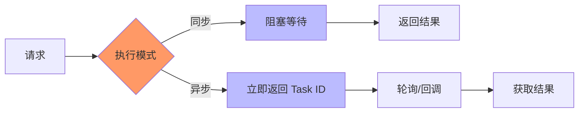
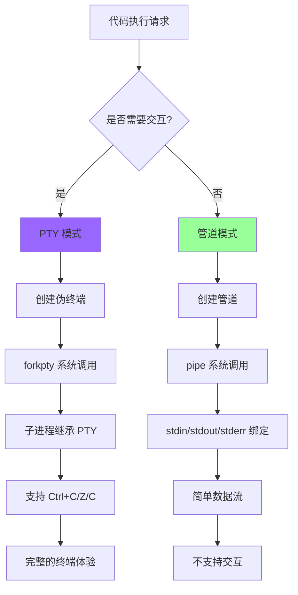
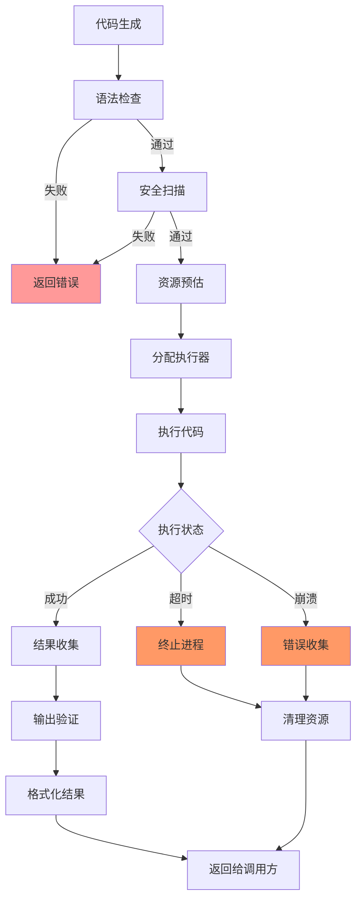
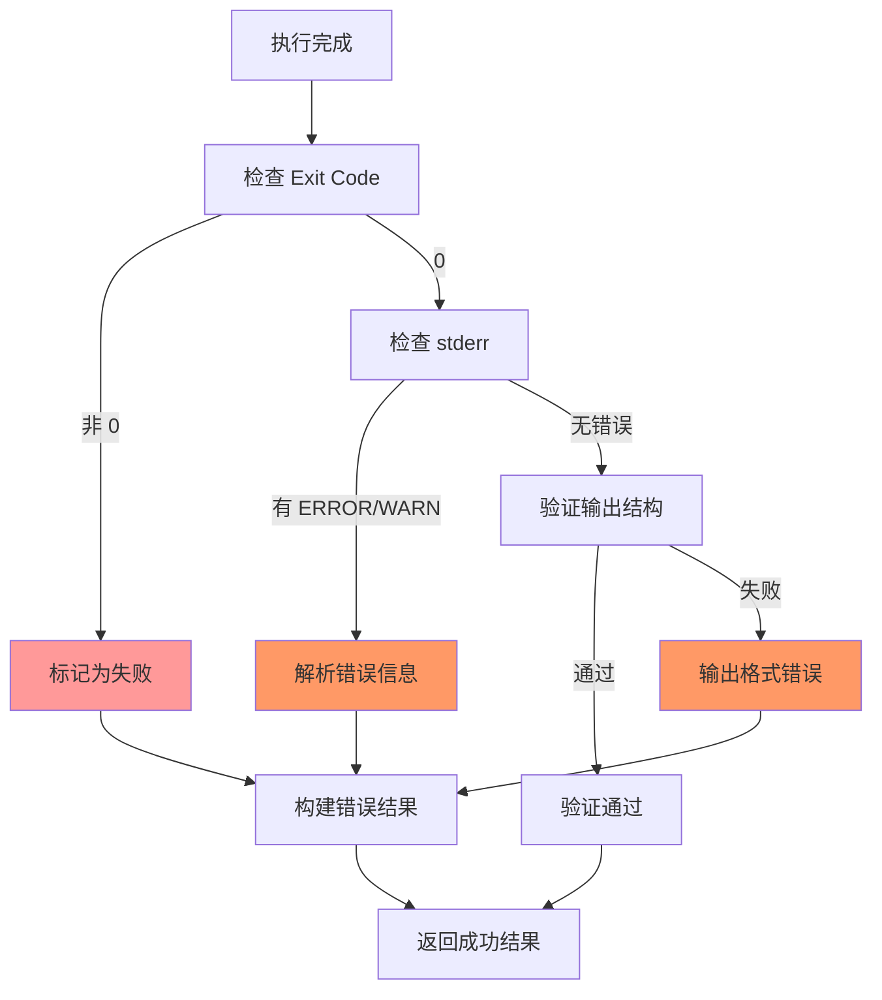
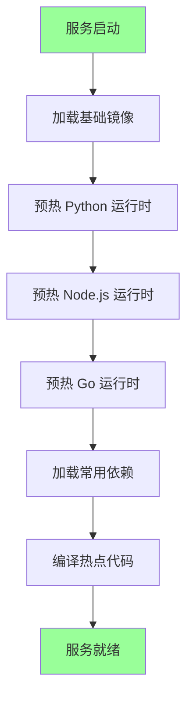
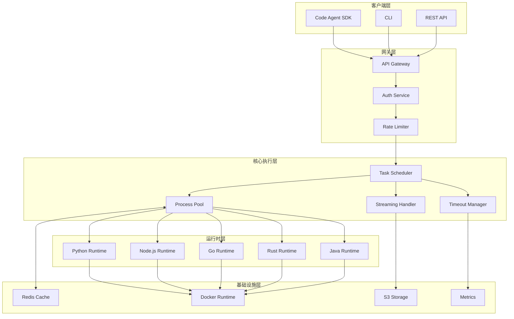

# Code Agent Ch8: 代码执行环境

## 1. 代码执行环境概述

代码执行环境是 Code Agent 系统的核心基础设施，负责将 LLM 生成的代码转化为可验证的执行结果。一个设计良好的执行环境需要平衡**安全性**、**性能**和**隔离性**三个维度。

### 1.1 本地执行 vs 远程执行

```
┌─────────────────────────────────────────────────────────────┐
│                    代码执行环境分类                           │
├─────────────────────┬─────────────────────┬─────────────────┤
│       维度          │     本地执行         │     远程执行     │
├─────────────────────┼─────────────────────┼─────────────────┤
│ 延迟                │ < 10ms              │ 50-500ms        │
│ 隔离性              │ 弱（共享内核）       │ 强（容器/VM）    │
│ 资源扩展性          │ 受限于宿主机         │ 可弹性扩展       │
│ 运维复杂度          │ 低                  │ 高              │
│ 适用场景            │ 轻量脚本、单次执行   │ 复杂任务、批量执行│
│ 成本                │ 低                  │ 按需计费         │
└─────────────────────┴─────────────────────┴─────────────────┘
```

**本地执行**适合快速迭代的场景，例如在开发者机器上进行原型验证。远程执行则适合需要严格隔离或有大量并发需求的场景。

gsd2 项目采用**混合架构**：轻量任务本地执行，重量任务分发到远程 Worker 集群。

### 1.2 同步 vs 异步执行



同步执行简单直观，但会阻塞客户端；异步执行适合长时间运行的任务，支持更好的用户体验和系统吞吐率。

gsd2 的任务调度采用**异步为主、同步为辅**的设计：

```python
# gsd2/executor/base.py
from abc import ABC, abstractmethod
from enum import Enum
from dataclasses import dataclass
from typing import Optional, Any
import asyncio

class ExecutionMode(Enum):
    SYNC = "sync"
    ASYNC = "async"
    STREAMING = "streaming"

@dataclass
class ExecutionRequest:
    code: str
    language: str
    mode: ExecutionMode = ExecutionMode.SYNC
    timeout: Optional[float] = 30.0
    memory_limit_mb: Optional[int] = None

@dataclass
class ExecutionResult:
    exit_code: int
    stdout: str
    stderr: str
    duration: float
    success: bool
    error: Optional[str] = None

class BaseExecutor(ABC):
    @abstractmethod
    async def execute(self, request: ExecutionRequest) -> ExecutionResult:
        """异步执行接口"""
        pass

    @abstractmethod
    def execute_sync(self, request: ExecutionRequest) -> ExecutionResult:
        """同步执行接口"""
        pass
```

## 2. 多语言运行时

### 2.1 运行时对比

```
┌────────────┬─────────┬──────────┬───────────┬───────────┬─────────────────┐
│   语言     │  启动   │  并发    │  生态     │  内存     │   适用场景       │
│            │  延迟   │  模型    │  丰富度   │  占用     │                 │
├────────────┼─────────┼──────────┼───────────┼───────────┼─────────────────┤
│ Python     │  低     │  GIL     │  极高     │  中等     │  数据处理/AI    │
│ Node.js    │  低     │  事件    │  高       │  中等     │  Web/IO密集     │
│ Go         │  中     │  原生    │  高       │  较低     │  网络服务/并发  │
│ Rust       │  中     │  原生    │  中       │  低       │  系统级/性能     │
│ Java       │  高     │  线程    │  高       │  高       │  企业应用       │
│ Ruby       │  低     │  GIL     │  中       │  中       │  脚本/原型      │
└────────────┴─────────┴──────────┴───────────┴───────────┴─────────────────┘
```

### 2.2 Python 运行时

Python 是 Code Agent 场景中使用最广泛的语言，其生态丰富、语法简洁。gsd2 使用 Python 3.11+ 的新特性提升执行效率：

```python
# gsd2/runtime/python.py
import sys
import os
import tempfile
import subprocess
import resource
from pathlib import Path
from typing import Dict, Optional
import json

class PythonRuntime:
    """Python 代码执行运行时"""

    def __init__(self, version: str = "3.11", cache_dir: Optional[str] = None):
        self.version = version
        self.cache_dir = Path(cache_dir) if cache_dir else Path(tempfile.gettempdir()) / "gsd2_python_cache"
        self.cache_dir.mkdir(parents=True, exist_ok=True)
        self._prewarm_complete = False

    async def execute(self, code: str, timeout: float = 30.0) -> Dict:
        """执行 Python 代码"""
        with tempfile.NamedTemporaryFile(
            mode='w', suffix='.py', delete=False
        ) as f:
            f.write(code)
            script_path = f.name

        try:
            # 设置资源限制
            max_memory = 512 * 1024 * 1024  # 512MB

            process = await asyncio.create_subprocess_exec(
                sys.executable,
                '-X', f'mem={max_memory // (1024*1024)}m',
                '-u',  # 无缓冲
                script_path,
                stdout=asyncio.subprocess.PIPE,
                stderr=asyncio.subprocess.PIPE,
                limit=1024 * 1024  # stdout/stderr 限制 1MB
            )

            try:
                stdout, stderr = await asyncio.wait_for(
                    process.communicate(),
                    timeout=timeout
                )
            except asyncio.TimeoutError:
                process.kill()
                await process.wait()
                return {
                    'success': False,
                    'error': f'Timeout after {timeout}s',
                    'exit_code': -1
                }

            return {
                'success': process.returncode == 0,
                'exit_code': process.returncode,
                'stdout': stdout.decode('utf-8', errors='replace'),
                'stderr': stderr.decode('utf-8', errors='replace'),
            }
        finally:
            os.unlink(script_path)

    async def prewarm(self):
        """预热运行时：预先启动 Python 进程并加载常用模块"""
        if self._prewarm_complete:
            return

        # 预先导入常用模块，减少运行时冷启动开销
        warmup_code = """
import sys
import json
import re
import math
from collections import defaultdict, Counter
from itertools import groupby
# 预加载 numpy 等重型库（如果可用）
try:
    import numpy as np
    import pandas as pd
except ImportError:
    pass
"""
        await self.execute(warmup_code, timeout=5.0)
        self._prewarm_complete = True
```

### 2.3 Node.js 运行时

```typescript
// gsd2/runtime/node.ts
import { NodeVM, VMScript } from "vm2"
import { EventEmitter } from "events"
import { ResourceLimits } from "worker_threads"

interface NodeExecutionResult {
  success: boolean
  stdout: string
  stderr: string
  exitCode: number
  error?: string
  duration: number
}

class NodeRuntime extends EventEmitter {
  private vm: NodeVM
  private timeout: number
  private memoryLimit: number

  constructor(
    options: {
      timeout?: number
      memoryLimit?: number
    } = {},
  ) {
    super()
    this.timeout = options.timeout || 30000
    this.memoryLimit = options.memoryLimit || 512 * 1024 * 1024

    this.vm = new NodeVM({
      console: "redirect",
      sandbox: {},
      require: {
        external: true,
        builtin: [
          "fs",
          "path",
          "crypto",
          "buffer",
          "stream",
          "http",
          "https",
          "url",
          "querystring",
        ],
      },
      nesting: true,
      eval: false,
    })
  }

  async execute(code: string, context: Record<string, unknown> = {}): Promise<NodeExecutionResult> {
    const startTime = Date.now()

    // 重定向 console 输出
    let stdout = ""
    let stderr = ""

    this.vm.on("console", (type: string, message: string) => {
      const output = `[${type}] ${message}\n`
      if (type === "error" || type === "warn") {
        stderr += output
      } else {
        stdout += output
      }
    })

    try {
      const script = new VMScript(code)
      const wrappedCode = `
        (async () => {
          const context = ${JSON.stringify(context)};
          ${code}
        })()
      `

      const result = await this.vm.run(wrappedCode)

      return {
        success: true,
        stdout: stdout,
        stderr: stderr,
        exitCode: 0,
        duration: Date.now() - startTime,
      }
    } catch (error) {
      return {
        success: false,
        stdout: stdout,
        stderr: stderr + String(error),
        exitCode: 1,
        error: String(error),
        duration: Date.now() - startTime,
      }
    }
  }
}
```

### 2.4 Go 运行时

```go
// gsd2/runtime/go.go
package runtime

import (
	"context"
	"fmt"
	"os"
	"os/exec"
	"sync"
	"time"
)

type GoRuntime struct {
	gopath    string
	goroot    string
	pool      *sync.Pool
	timeout   time.Duration
}

func NewGoRuntime(options ...RuntimeOption) *GoRuntime {
	rt := &GoRuntime{
		gopath:  os.Getenv("GOPATH"),
		goroot:  os.Getenv("GOROOT"),
		timeout: 30 * time.Second,
	}

	for _, opt := range options {
		opt(rt)
	}

	// 连接池：复用编译后的模块
	rt.pool = &sync.Pool{
		New: func() interface{} {
			return &gostate{}
		},
	}

	return rt
}

type gostate struct {
	tmpdir    string
	modfile   string
	buildArgs []string
}

type ExecutionResult struct {
	Success   bool
	ExitCode  int
	Stdout    string
	Stderr    string
	Duration  time.Duration
	Error     error
}

func (r *GoRuntime) Execute(ctx context.Context, code string) (*ExecutionResult, error) {
	ctx, cancel := context.WithTimeout(ctx, r.timeout)
	defer cancel()

	// 创建临时目录存放代码
	tmpdir, err := os.MkdirTemp("", "gsd2-go-*")
	if err != nil {
		return nil, fmt.Errorf("failed to create temp dir: %w", err)
	}
	defer os.RemoveAll(tmpdir)

	// 写入代码文件
	mainFile := tmpdir + "/main.go"
	if err := os.WriteFile(mainFile, []byte(code), 0644); err != nil {
		return nil, err
	}

	// 执行 go run
	cmd := exec.CommandContext(ctx, "go", "run", mainFile)
	cmd.Dir = tmpdir

	start := time.Now()
	output, err := cmd.CombinedOutput()
	duration := time.Since(start)

	result := &ExecutionResult{
		ExitCode: 0,
		Duration: duration,
	}

	if err != nil {
		if ctx.Err() == context.DeadlineExceeded {
			result.Success = false
			result.Error = fmt.Errorf("timeout after %v", r.timeout)
		} else {
			result.Success = false
			result.Error = err
		}
		result.ExitCode = 1
	} else {
		result.Success = true
	}

	result.Stdout = string(output)
	return result, nil
}
```

### 2.5 容器镜像选择

生产环境中，多语言运行时通常通过 Docker 容器进行管理：

```yaml
# gsd2/runtime/images.yaml
images:
  python:
    base: "python:3.11-slim"
    dependencies:
      - "numpy>=1.24.0"
      - "pandas>=2.0.0"
      - "requests>=2.28.0"
    cache_layers:
      - "COPY requirements.txt /tmp/"
      - "RUN pip install --user -r /tmp/requirements.txt"

  nodejs:
    base: "node:20-alpine"
    dependencies:
      - "lodash@4.17.21"
      - "axios@1.6.0"
    cache_layers:
      - "COPY package*.json /tmp/"
      - "RUN npm ci --prefix /tmp"

  go:
    base: "golang:1.21-alpine"
    dependencies:
      - "github.com/google/uuid@v1.4.0"
    cache_layers:
      - "COPY go.mod /tmp/"
      - "RUN cd /tmp && go mod download"

  rust:
    base: "rust:1.74-slim"
    dependencies:
      - "serde@1.0"
      - "tokio@1.0"
    cache_layers:
      - "COPY Cargo.toml /tmp/"
      - "RUN mkdir -p /tmp/src && echo 'fn main() {}' > /tmp/src/main.rs"

  java:
    base: "openjdk:17-slim"
    dependencies:
      - "lombok@1.18.30"
      - "spring-boot@3.1.0"
    cache_layers:
      - "COPY pom.xml /tmp/"
      - "RUN cd /tmp && mvn dependency:resolve"
```

容器镜像层级设计可以显著减少冷启动时间：

```
┌────────────────────────────────────────────────────────────┐
│                    容器镜像层级                              │
├────────────────────────────────────────────────────────────┤
│  Layer 5: 用户代码 (COPY)     ← 每次构建时更新              │
├────────────────────────────────────────────────────────────┤
│  Layer 4: 依赖包 (pip/npm/go) ← 频繁变化，但可缓存           │
├────────────────────────────────────────────────────────────┤
│  Layer 3: 语言运行时    ← 几乎不变                          │
├────────────────────────────────────────────────────────────┤
│  Layer 2: 系统库/工具   ← 几乎不变                          │
├────────────────────────────────────────────────────────────┤
│  Layer 1: 基础镜像      ← 几乎不变                          │
└────────────────────────────────────────────────────────────┘
```

## 3. 命令执行

### 3.1 Shell 类型对比

```
┌──────────────┬─────────────────┬─────────────────┬──────────────────┐
│    特性      │     /bin/sh     │   /bin/bash     │    /bin/zsh      │
├──────────────┼─────────────────┼─────────────────┼──────────────────┤
│ POSIX 兼容   │      是         │       否        │       否         │
│ 数组支持      │      否         │       是        │       是         │
│ 关联数组      │      否         │   Bash 4+       │       是         │
│ 启动速度      │      快         │       中        │       慢         │
│ 进程替换      │      否         │       是        │       是         │
│ 广泛可用性    │      极高       │       高        │       中         │
└──────────────┴─────────────────┴─────────────────┴──────────────────┘
```

### 3.2 伪终端 (PTY) 与管道 (Pipe)

Code Agent 执行命令时，需要在**PTY 模式**和**管道模式**之间做出选择：



PTY 模式适合需要交互式输入的代码（如 REPL、curses 应用），管道模式适合纯输出型任务。

```python
# gsd2/executor/pty.py
import os
import pty
import select
import subprocess
import time
from typing import Tuple, Optional

class PTYExecutor:
    """基于伪终端的命令执行器"""

    def __init__(self, rows: int = 24, cols: int = 80):
        self.rows = rows
        self.cols = cols
        self.master_fd: Optional[int] = None
        self.pid: Optional[int] = None

    def execute(self, command: str, timeout: float = 30.0) -> Tuple[int, str, str]:
        """在 PTY 中执行命令"""
        master_fd, slave_fd = pty.openpty()
        self.master_fd = master_fd

        pid = os.fork()

        if pid == 0:
            # 子进程
            os.close(master_fd)
            os.setsid()
            os.dup2(slave_fd, 0)
            os.dup2(slave_fd, 1)
            os.dup2(slave_fd, 2)
            os.close(slave_fd)

            # 执行命令
            os.execv('/bin/bash', ['/bin/bash', '-c', command])
            os._exit(1)

        # 父进程
        os.close(slave_fd)
        self.pid = pid

        try:
            return self._read_output(timeout)
        finally:
            os.close(master_fd)

    def _read_output(self, timeout: float) -> Tuple[int, str, str]:
        """读取 PTY 输出"""
        stdout = []
        stderr = []
        start = time.time()

        while True:
            if time.time() - start > timeout:
                # 超时，发送 SIGTERM
                os.kill(self.pid, 15)
                time.sleep(0.1)
                os.kill(self.pid, 9)
                break

            r, _, _ = select.select([self.master_fd], [], [], 0.1)

            if r:
                try:
                    data = os.read(self.master_fd, 4096)
                    if not data:
                        break
                    stdout.append(data.decode('utf-8', errors='replace'))
                except OSError:
                    break

            # 检查进程是否结束
            result = os.waitpid(self.pid, os.WNOHANG)
            if result[0] != 0:
                break

        # 等待进程完全结束
        os.waitpid(self.pid, 0)

        return 0 if not stdout else 1, ''.join(stdout), ''.join(stderr)
```

### 3.3 Shell 命令执行器

```python
# gsd2/executor/shell.py
import subprocess
import shlex
import asyncio
from typing import Dict, List, Optional, Any
from dataclasses import dataclass
import signal

@dataclass
class ShellResult:
    exit_code: int
    stdout: str
    stderr: str
    timed_out: bool
    duration: float

class ShellExecutor:
    """Shell 命令执行器，支持管道和重定向"""

    def __init__(self, shell: str = "/bin/bash"):
        self.shell = shell
        self.default_timeout = 30.0
        self.default_env: Dict[str, str] = {}

    async def run(
        self,
        command: str,
        cwd: Optional[str] = None,
        env: Optional[Dict[str, str]] = None,
        timeout: Optional[float] = None,
        check: bool = False
    ) -> ShellResult:
        """异步执行 shell 命令"""

        timeout = timeout or self.default_timeout
        merged_env = {**self.default_env, **(env or {})}

        # 使用 bash -c 执行，以便支持管道和重定向
        proc = await asyncio.create_subprocess_exec(
            self.shell, '-c', command,
            stdout=asyncio.subprocess.PIPE,
            stderr=asyncio.subprocess.PIPE,
            cwd=cwd,
            env=merged_env,
            preexec_fn=os.setsid  # 创建新的进程组
        )

        start = asyncio.get_event_loop().time()

        try:
            stdout, stderr = await asyncio.wait_for(
                proc.communicate(),
                timeout=timeout
            )
            timed_out = False
        except asyncio.TimeoutError:
            # 超时：杀死整个进程组
            try:
                os.killpg(os.getpgid(proc.pid), signal.SIGTERM)
                await asyncio.wait_for(proc.wait(), timeout=5.0)
            except:
                os.killpg(os.getpgid(proc.pid), signal.SIGKILL)
                await proc.wait()
            timed_out = True
            stdout, stderr = b'', b'Execution timeout'

        duration = asyncio.get_event_loop().time() - start

        result = ShellResult(
            exit_code=proc.returncode or (1 if timed_out else 0),
            stdout=stdout.decode('utf-8', errors='replace'),
            stderr=stderr.decode('utf-8', errors='replace'),
            timed_out=timed_out,
            duration=duration
        )

        if check and result.exit_code != 0:
            raise RuntimeError(f"Command failed: {result.stderr}")

        return result

    def run_pipeline(self, commands: List[str]) -> ShellResult:
        """执行管道命令：cmd1 | cmd2 | cmd3"""
        pipeline = ' | '.join(shlex.quote(c) for c in commands)
        return asyncio.run(self.run(pipeline))
```

## 4. 代码执行工作流

### 4.1 完整工作流



### 4.2 代码实现

```python
# gsd2/executor/workflow.py
import asyncio
import hashlib
import time
from enum import Enum
from dataclasses import dataclass, field
from typing import List, Optional, Dict, Any
import structlog

logger = structlog.get_logger()

class ExecutionStage(Enum):
    CODE_RECEIVED = "code_received"
    SYNTAX_CHECK = "syntax_check"
    SECURITY_SCAN = "security_scan"
    RESOURCE_ESTIMATION = "resource_estimation"
    EXECUTOR_ASSIGNMENT = "executor_assignment"
    EXECUTION = "execution"
    RESULT_COLLECTION = "result_collection"
    VERIFICATION = "verification"
    COMPLETED = "completed"
    FAILED = "failed"

@dataclass
class ExecutionContext:
    """执行上下文，贯穿整个工作流"""
    task_id: str
    code: str
    language: str
    stage: ExecutionStage = ExecutionStage.CODE_RECEIVED
    stages_history: List[ExecutionStage] = field(default_factory=list)
    metadata: Dict[str, Any] = field(default_factory=dict)
    error: Optional[str] = None
    start_time: float = field(default_factory=time.time)

    def advance(self, next_stage: ExecutionStage):
        self.stages_history.append(self.stage)
        self.stage = next_stage
        logger.info(f"Task {self.task_id} advanced to {next_stage.value}")

    @property
    def total_duration(self) -> float:
        return time.time() - self.start_time

class ExecutionWorkflow:
    """代码执行工作流编排器"""

    def __init__(
        self,
        syntax_checker,
        security_scanner,
        resource_estimator,
        executor_pool
    ):
        self.syntax_checker = syntax_checker
        self.security_scanner = security_scanner
        self.resource_estimator = resource_estimator
        self.executor_pool = executor_pool

    async def execute(self, ctx: ExecutionContext) -> Dict[str, Any]:
        """执行完整工作流"""

        try:
            # Stage 1: 语法检查
            ctx.advance(ExecutionStage.SYNTAX_CHECK)
            syntax_ok, syntax_error = await self.syntax_checker.check(
                ctx.code, ctx.language
            )
            if not syntax_ok:
                ctx.error = f"Syntax error: {syntax_error}"
                ctx.advance(ExecutionStage.FAILED)
                return self._failed_result(ctx)

            # Stage 2: 安全扫描
            ctx.advance(ExecutionStage.SECURITY_SCAN)
            security_ok, security_issues = await self.security_scanner.scan(
                ctx.code, ctx.language
            )
            if not security_ok:
                ctx.error = f"Security issues: {', '.join(security_issues)}"
                ctx.advance(ExecutionStage.FAILED)
                return self._failed_result(ctx)

            # Stage 3: 资源预估
            ctx.advance(ExecutionStage.RESOURCE_ESTIMATION)
            resources = await self.resource_estimator.estimate(
                ctx.code, ctx.language
            )
            ctx.metadata['estimated_resources'] = resources

            # Stage 4: 执行器分配
            ctx.advance(ExecutionStage.EXECUTOR_ASSIGNMENT)
            executor = await self.executor_pool.acquire(
                language=ctx.language,
                required_memory_mb=resources.get('memory_mb', 256),
                timeout=resources.get('timeout', 30.0)
            )

            # Stage 5: 执行
            ctx.advance(ExecutionStage.EXECUTION)
            result = await executor.execute(
                code=ctx.code,
                timeout=resources.get('timeout', 30.0)
            )

            # Stage 6: 结果收集
            ctx.advance(ExecutionStage.RESULT_COLLECTION)
            collected = self._collect_result(result, ctx)

            # Stage 7: 验证
            ctx.advance(ExecutionStage.VERIFICATION)
            verified = self._verify_result(collected)

            ctx.advance(ExecutionStage.COMPLETED)
            return verified

        except Exception as e:
            logger.exception(f"Workflow error for task {ctx.task_id}")
            ctx.error = str(e)
            ctx.advance(ExecutionStage.FAILED)
            return self._failed_result(ctx)

        finally:
            # 释放执行器回池
            if 'executor' in ctx.metadata:
                await self.executor_pool.release(ctx.metadata['executor'])

    def _failed_result(self, ctx: ExecutionContext) -> Dict[str, Any]:
        return {
            'success': False,
            'task_id': ctx.task_id,
            'stage': ctx.stage.value,
            'error': ctx.error,
            'duration': ctx.total_duration,
            'stages': [s.value for s in ctx.stages_history]
        }

    def _verify_result(self, result: Dict[str, Any]) -> Dict[str, Any]:
        """验证执行结果的正确性"""
        # 检查退出码
        if result.get('exit_code', 0) != 0 and not result.get('error'):
            result['warnings'] = result.get('warnings', [])
            result['warnings'].append('Non-zero exit code without error message')

        # 检查输出大小
        stdout = result.get('stdout', '')
        stderr = result.get('stderr', '')
        if len(stdout) > 10 * 1024 * 1024:  # 10MB
            result['stdout_truncated'] = True
            result['stdout'] = stdout[:10 * 1024 * 1024] + '\n... [truncated]'

        if len(stderr) > 1024 * 1024:  # 1MB
            result['stderr_truncated'] = True
            result['stderr'] = stderr[:1024 * 1024] + '\n... [truncated]'

        return result
```

## 5. 超时与资源控制

### 5.1 Execution Budget 概念

Execution Budget 是 gsd2 提出的资源控制概念，包含时间预算和计算预算两个维度：

```
┌─────────────────────────────────────────────────────────────┐
│                   Execution Budget                          │
├──────────────────────────┬──────────────────────────────────┤
│      Time Budget         │       Compute Budget             │
├──────────────────────────┼──────────────────────────────────┤
│ • CPU Time               │ • CPU Cycles                     │
│ • Wall Clock Time        │ • Memory Usage                   │
│ • I/O Wait Time          │ • Network Bandwidth              │
│ • Total Stage Timeout    │ • Disk I/O                       │
└──────────────────────────┴──────────────────────────────────┘
```

### 5.2 超时控制实现

```python
# gsd2/executor/timeout.py
import signal
import asyncio
from contextlib import contextmanager
from typing import Optional, Callable, Any
import resource
import sys

class TimeoutError(Exception):
    """执行超时异常"""
    def __init__(self, seconds: float, stage: str = "execution"):
        self.seconds = seconds
        self.stage = stage
        super().__init__(f"Execution timeout after {seconds}s during {stage}")

class ResourceLimitError(Exception):
    """资源超限异常"""
    def __init__(self, limit_type: str, current: Any, maximum: Any):
        self.limit_type = limit_type
        self.current = current
        self.maximum = maximum
        super().__init__(f"{limit_type} limit exceeded: {current} > {maximum}")

@contextmanager
def timeout_context(seconds: float, stage: str = "execution"):
    """超时上下文管理器（基于 SIGALRM）"""
    def handler(signum, frame):
        raise TimeoutError(seconds, stage)

    # 设置信号处理器
    old_handler = signal.signal(signal.SIGALRM, handler)
    signal.alarm(int(seconds))

    try:
        yield
    finally:
        signal.alarm(0)
        signal.signal(signal.SIGALRM, old_handler)

class MemoryLimiter:
    """内存限制器"""

    def __init__(self, limit_bytes: int):
        self.limit_bytes = limit_bytes
        self.soft_limit = int(limit_bytes * 0.9)  # 90% 时发出警告

    def apply(self):
        """应用内存限制"""
        try:
            # 设置最大RSS (Resident Set Size)
            resource.setrlimit(resource.RLIMIT_AS, (self.limit_bytes, self.limit_bytes))
        except (ValueError, resource.error) as e:
            raise ResourceLimitError("RLIMIT_AS", "unlimited", self.limit_bytes)

    def check_usage(self) -> Optional[int]:
        """检查当前内存使用"""
        usage = resource.getrusage(resource.RUSAGE_SELF)
        return usage.ru_maxrss * 1024  # 转换为字节

class TimeoutManager:
    """超时管理器，支持多层超时"""

    def __init__(self):
        self.timeouts: Dict[str, float] = {
            'syntax_check': 5.0,
            'security_scan': 10.0,
            'execution': 30.0,
            'result_collection': 5.0,
            'total': 60.0
        }
        self.timers: Dict[str, asyncio.Task] = {}

    def set_timeout(self, name: str, seconds: float):
        self.timeouts[name] = seconds

    async def with_timeout(
        self,
        coro: Callable,
        timeout_name: str = 'execution'
    ) -> Any:
        """为协程添加超时控制"""
        timeout = self.timeouts.get(timeout_name, 30.0)

        try:
            return await asyncio.wait_for(coro, timeout=timeout)
        except asyncio.TimeoutError:
            raise TimeoutError(timeout, timeout_name)
```

### 5.3 资源限制对比

```
┌────────────────┬──────────────────┬──────────────────┬────────────────┐
│   限制类型      │     Linux API    │    FreeBSD API   │    macOS API  │
├────────────────┼──────────────────┼──────────────────┼────────────────┤
│ 最大内存        │ setrlimit(RLIMIT_AS)│ rlimit(RLIMIT_AS)│ rlimit(RLIMIT_AS)│
│ CPU 时间        │ setrlimit(RLIMIT_CPU)│ rlimit(RLIMIT_CPU)│ rlimit(RLIMIT_CPU)│
│ 最大文件大小    │ setrlimit(RLIMIT_FSIZE)│ rlimit(RLIMIT_FSIZE)│ rlimit(RLIMIT_FSIZE)│
│ 最大进程数      │ setrlimit(RLIMIT_NPROC)│ rlimit(RLIMIT_NPROC)│ rlimit(RLIMIT_NPROC)│
│ 最大打开文件数  │ setrlimit(RLIMIT_NOFILE)│ rlimit(RLIMIT_NOFILE)│ rlimit(RLIMIT_NOFILE)│
│ 最大锁内存      │ setrlimit(RLIMIT_MEMLOCK)│ rlimit(RLIMIT_MEMLOCK)│ rlimit(RLIMIT_MEMLOCK)│
└────────────────┴──────────────────┴──────────────────┴────────────────┘
```

### 5.4 容器级资源控制

```yaml
# gsd2/runtime/limits.yaml
resource_limits:
  # 默认限制
  default:
    timeout_seconds: 30
    memory_mb: 512
    cpu_shares: 1024
    max_processes: 100
    max_open_files: 1024

  # 按语言特定的限制
  per_language:
    python:
      timeout_seconds: 60
      memory_mb: 1024
      cpu_shares: 2048

    nodejs:
      timeout_seconds: 45
      memory_mb: 768
      cpu_shares: 1536

    go:
      timeout_seconds: 30
      memory_mb: 512
      cpu_shares: 1024

    rust:
      timeout_seconds: 120
      memory_mb: 2048
      cpu_shares: 4096

    java:
      timeout_seconds: 90
      memory_mb: 2048
      cpu_shares: 2048

# Kubernetes Pod 资源请求/限制
pod_resources:
  requests:
    cpu: "250m"
    memory: "256Mi"
  limits:
    cpu: "2000m"
    memory: "4Gi"
```

## 6. 执行结果验证

### 6.1 结果验证流程



### 6.2 退出码处理

```python
# gsd2/executor/result.py
from dataclasses import dataclass
from typing import Optional, List, Dict, Any
import re

# 常见退出码含义
EXIT_CODE_MEANINGS = {
    0: ("SUCCESS", "正常结束"),
    1: ("GENERAL_ERROR", "一般性错误"),
    2: ("MISUSE", "shell 内置函数使用错误"),
    126: ("NOT_EXECUTABLE", "文件不可执行"),
    127: ("COMMAND_NOT_FOUND", "命令未找到"),
    128: ("INVALID_EXIT", "无效的退出参数"),
    130: ("INTERRUPTED", "被 Ctrl+C 中断"),
    137: ("SIGKILL", "被 SIGKILL 杀死 (超时)"),
    139: ("SEGFAULT", "段错误 (SIGSEGV)"),
    143: ("SIGTERM", "被 SIGTERM 终止"),
    255: ("EXIT_RANGE", "退出码超出范围"),
}

@dataclass
class ExecutionResult:
    """标准化的执行结果"""
    task_id: str
    exit_code: int
    stdout: str
    stderr: str
    duration: float
    timestamp: float

    # 解析后的字段
    success: bool = False
    error_type: Optional[str] = None
    error_message: Optional[str] = None
    warnings: List[str] = None

    def __post_init__(self):
        if self.warnings is None:
            self.warnings = []

        # 判断成功与否
        self.success = self.exit_code == 0

        # 解析错误信息
        if self.exit_code != 0:
            self.error_type, self.error_message = self._parse_error()

    def _parse_error(self) -> tuple:
        """解析错误类型和消息"""
        if self.exit_code in EXIT_CODE_MEANINGS:
            return EXIT_CODE_MEANINGS[self.exit_code]

        if self.exit_code > 128:
            signal_num = self.exit_code - 128
            return (f"SIG_{signal_num}", f"被信号 {signal_num} 终止")

        # 尝试从 stderr 解析
        if "SyntaxError" in self.stderr:
            return ("SyntaxError", self._extract_python_error())
        elif "ImportError" in self.stderr or "ModuleNotFoundError" in self.stderr:
            return ("ImportError", self._extract_import_error())
        elif "TimeoutError" in self.stderr:
            return ("TimeoutError", "执行超时")

        return ("UnknownError", self.stderr[:200] if self.stderr else "未知错误")

    def _extract_python_error(self) -> str:
        """提取 Python 错误信息"""
        lines = self.stderr.split('\n')
        for line in lines:
            if 'Error:' in line or 'Exception' in line:
                return line.strip()
        return self.stderr[:100]

    def _extract_import_error(self) -> str:
        """提取导入错误信息"""
        match = re.search(r"(ModuleNotFoundError|ImportError):\s*([^\n]+)", self.stderr)
        if match:
            return f"{match.group(1)}: {match.group(2)}"
        return "模块导入失败"

    def to_dict(self) -> Dict[str, Any]:
        """转换为字典格式"""
        return {
            'task_id': self.task_id,
            'success': self.success,
            'exit_code': self.exit_code,
            'error_type': self.error_type,
            'error_message': self.error_message,
            'stdout': self.stdout,
            'stderr': self.stderr,
            'warnings': self.warnings,
            'duration': self.duration,
        }

class ResultValidator:
    """结果验证器"""

    def __init__(self):
        self.error_patterns = [
            (r'Error:', '执行错误'),
            (r'Exception:', '异常'),
            (r'Traceback \(most recent call last\):', '堆栈跟踪'),
            (r'SyntaxError:', '语法错误'),
            (r'PermissionError:', '权限错误'),
            (r'MemoryError:', '内存错误'),
            (r'RuntimeError:', '运行时错误'),
        ]
        self.warning_patterns = [
            (r'Warning:', '警告'),
            (r'DeprecationWarning:', '弃用警告'),
            (r'FutureWarning:', '未来警告'),
        ]

    def validate(self, result: ExecutionResult) -> ExecutionResult:
        """验证并丰富结果"""

        # 检查 stderr 中的错误模式
        for pattern, error_type in self.error_patterns:
            if re.search(pattern, result.stderr):
                result.warnings.append(f"检测到 {error_type}")

        # 检查 stdout 中的警告模式
        for pattern, warning_type in self.warning_patterns:
            if re.search(pattern, result.stdout):
                result.warnings.append(f"检测到 {warning_type}")

        # 检查输出是否被截断
        if len(result.stdout) >= 10 * 1024 * 1024:
            result.warnings.append("stdout 可能被截断")
        if len(result.stderr) >= 1 * 1024 * 1024:
            result.warnings.append("stderr 可能被截断")

        return result
```

### 6.3 运行时错误处理

```python
# gsd2/executor/errors.py
import traceback
import sys
from enum import Enum
from typing import Optional, Dict, Any

class ErrorSeverity(Enum):
    INFO = "info"
    WARNING = "warning"
    ERROR = "error"
    FATAL = "fatal"

class RuntimeErrorAnalyzer:
    """运行时错误分析器"""

    def __init__(self):
        self.error_signatures = {
            'python': self._analyze_python_error,
            'nodejs': self._analyze_nodejs_error,
            'go': self._analyze_go_error,
            'java': self._analyze_java_error,
        }

    def analyze(self, language: str, stderr: str, exit_code: int) -> Dict[str, Any]:
        """分析运行时错误"""
        analyzer = self.error_signatures.get(language, self._analyze_generic)
        return analyzer(stderr, exit_code)

    def _analyze_python_error(self, stderr: str, exit_code: int) -> Dict[str, Any]:
        """分析 Python 运行时错误"""
        result = {
            'language': 'python',
            'severity': ErrorSeverity.ERROR,
            'category': 'unknown',
            'message': stderr.strip(),
            'details': {},
        }

        if 'SyntaxError' in stderr:
            result['category'] = 'syntax'
            result['severity'] = ErrorSeverity.ERROR
        elif 'IndentationError' in stderr:
            result['category'] = 'indentation'
            result['severity'] = ErrorSeverity.ERROR
        elif 'ImportError' in stderr or 'ModuleNotFoundError' in stderr:
            result['category'] = 'import'
            result['severity'] = ErrorSeverity.ERROR
        elif 'AttributeError' in stderr:
            result['category'] = 'attribute'
            result['severity'] = ErrorSeverity.ERROR
        elif 'TypeError' in stderr:
            result['category'] = 'type'
            result['severity'] = ErrorSeverity.ERROR
        elif 'ValueError' in stderr:
            result['category'] = 'value'
            result['severity'] = ErrorSeverity.ERROR
        elif 'NameError' in stderr:
            result['category'] = 'name'
            result['severity'] = ErrorSeverity.ERROR
        elif 'MemoryError' in stderr:
            result['category'] = 'memory'
            result['severity'] = ErrorSeverity.FATAL
        elif 'RecursionError' in stderr:
            result['category'] = 'recursion'
            result['severity'] = ErrorSeverity.ERROR

        # 提取堆栈跟踪
        if 'Traceback' in stderr:
            result['details']['has_traceback'] = True
            lines = stderr.split('Traceback (most recent call last):')
            if len(lines) > 1:
                result['details']['traceback'] = lines[1].strip()[:500]

        return result

    def _analyze_nodejs_error(self, stderr: str, exit_code: int) -> Dict[str, Any]:
        """分析 Node.js 运行时错误"""
        result = {
            'language': 'nodejs',
            'severity': ErrorSeverity.ERROR,
            'category': 'unknown',
            'message': stderr.strip(),
            'details': {},
        }

        if 'SyntaxError' in stderr:
            result['category'] = 'syntax'
        elif 'ReferenceError' in stderr:
            result['category'] = 'reference'
        elif 'TypeError' in stderr:
            result['category'] = 'type'
        elif 'Error: ENOENT' in stderr:
            result['category'] = 'file_not_found'
            result['severity'] = ErrorSeverity.WARNING
        elif 'Error: ECONNREFUSED' in stderr:
            result['category'] = 'network'

        return result

    def _analyze_go_error(self, stderr: str, exit_code: int) -> Dict[str, Any]:
        """分析 Go 运行时错误"""
        result = {
            'language': 'go',
            'severity': ErrorSeverity.ERROR,
            'category': 'unknown',
            'message': stderr.strip(),
            'details': {},
        }

        if '# syntax error' in stderr:
            result['category'] = 'syntax'
        elif 'undefined:' in stderr or 'cannot find package' in stderr:
            result['category'] = 'import'
        elif 'index out of range' in stderr:
            result['category'] = 'bounds'
        elif 'nil pointer' in stderr:
            result['category'] = 'null_reference'

        return result

    def _analyze_generic(self, stderr: str, exit_code: int) -> Dict[str, Any]:
        """通用错误分析"""
        return {
            'language': 'unknown',
            'severity': ErrorSeverity.ERROR,
            'category': 'unknown',
            'message': stderr.strip()[:500],
            'details': {'exit_code': exit_code},
        }
```

## 7. 流式输出处理

### 7.1 流式 vs 非流式对比

```
┌─────────────────────┬──────────────────────┬──────────────────────┐
│        维度         │      非流式          │       流式           │
├─────────────────────┼──────────────────────┼──────────────────────┤
│ 数据传输时机         │ 一次性返回           │ 分块传输             │
│ 首字节延迟           │ 高（等待完整结果）   │ 低（立即开始）       │
│ 协议                 │ HTTP/1.1            │ SSE, WebSocket       │
│ 实现复杂度           │ 低                  │ 高                  │
│ 断点续传             │ 不支持               │ 支持                 │
│ 适用场景             │ 短任务               │ 长任务/实时监控      │
└─────────────────────┴──────────────────────┴──────────────────────┘
```

### 7.2 流式执行器实现

```python
# gsd2/executor/streaming.py
import asyncio
import json
from abc import ABC, abstractmethod
from typing import AsyncGenerator, Dict, Any, Optional
import aiohttp
import sseclient  # Server-Sent Events 客户端

class StreamChunk:
    """流式输出块"""
    def __init__(
        self,
        chunk_type: str,  # 'stdout', 'stderr', 'status', 'error'
        content: str,
        timestamp: float,
        metadata: Optional[Dict] = None
    ):
        self.chunk_type = chunk_type
        self.content = content
        self.timestamp = timestamp
        self.metadata = metadata or {}

    def to_json(self) -> str:
        return json.dumps({
            'type': self.chunk_type,
            'content': self.content,
            'timestamp': self.timestamp,
            **self.metadata
        })

class StreamingExecutor:
    """流式代码执行器"""

    def __init__(self, endpoint: str, api_key: Optional[str] = None):
        self.endpoint = endpoint
        self.api_key = api_key
        self.headers = {
            'Content-Type': 'application/json',
        }
        if api_key:
            self.headers['Authorization'] = f'Bearer {api_key}'

    async def execute_stream(
        self,
        code: str,
        language: str,
        timeout: float = 30.0
    ) -> AsyncGenerator[StreamChunk, None]:
        """流式执行代码，实时 yield 输出"""

        payload = {
            'code': code,
            'language': language,
            'stream': True,
        }

        async with aiohttp.ClientSession() as session:
            async with session.post(
                self.endpoint + '/execute',
                json=payload,
                headers=self.headers,
                timeout=aiohttp.ClientTimeout(total=timeout)
            ) as response:

                if response.status != 200:
                    yield StreamChunk(
                        'error',
                        f'HTTP {response.status}: {await response.text()}',
                        asyncio.get_event_loop().time()
                    )
                    return

                # 使用 SSE 协议读取流
                async for line in response.content:
                    if line.strip():
                        event = json.loads(line)

                        chunk = StreamChunk(
                            chunk_type=event.get('type', 'stdout'),
                            content=event.get('data', ''),
                            timestamp=event.get('timestamp', 0),
                            metadata=event.get('metadata', {})
                        )
                        yield chunk

class ChunkedResponseHandler:
    """分块响应处理器"""

    def __init__(self, chunk_size: int = 4096):
        self.chunk_size = chunk_size
        self.buffer = b''
        self.complete_messages: list = []

    async def feed(self, data: bytes) -> list:
        """接收数据块，返回完整的消息"""
        self.buffer += data
        messages = []

        while True:
            # 查找换行符分隔的消息
            newline_idx = self.buffer.find(b'\n')
            if newline_idx == -1:
                break

            message = self.buffer[:newline_idx]
            self.buffer = self.buffer[newline_idx + 1:]

            try:
                parsed = json.loads(message)
                messages.append(parsed)
            except json.JSONDecodeError:
                continue

        return messages

    async def feed_sse(self, data: str) -> list:
        """处理 SSE 格式数据"""
        messages = []
        for line in data.split('\n'):
            if line.startswith('data:'):
                content = line[5:].strip()
                if content == '[DONE]':
                    continue
                try:
                    messages.append(json.loads(content))
                except json.JSONDecodeError:
                    continue
        return messages

    def flush(self) -> list:
        """刷新缓冲区，返回剩余消息"""
        messages = []
        if self.buffer:
            try:
                messages.append(json.loads(self.buffer))
            except json.JSONDecodeError:
                pass
            self.buffer = b''
        return messages
```

### 7.3 WebSocket 流式执行

```typescript
// gsd2/executor/websocket.ts
import WebSocket from "ws"

interface WebSocketMessage {
  type: "stdout" | "stderr" | "status" | "error" | "complete"
  data: string
  timestamp: number
  taskId?: string
}

interface ExecutionOptions {
  code: string
  language: string
  timeout?: number
  onChunk?: (chunk: WebSocketMessage) => void
  onComplete?: (result: ExecutionResult) => void
  onError?: (error: Error) => void
}

class WebSocketStreamingExecutor {
  private ws: WebSocket | null = null
  private messageQueue: WebSocketMessage[] = []
  private pendingTask: string | null = null

  async execute(options: ExecutionOptions): Promise<void> {
    const { code, language, timeout = 30000, onChunk, onComplete, onError } = options

    return new Promise((resolve, reject) => {
      this.ws = new WebSocket("wss://exec.gsd2.io/execute", {
        headers: {
          Authorization: `Bearer ${process.env.GSD2_API_KEY}`,
        },
      })

      let timeoutHandle: NodeJS.Timeout

      this.ws.on("open", () => {
        // 发送执行请求
        this.ws!.send(
          JSON.stringify({
            action: "execute",
            code,
            language,
            stream: true,
          }),
        )

        // 设置超时
        timeoutHandle = setTimeout(() => {
          this.ws?.close(1000, "Timeout")
          onError?.(new Error(`Execution timeout after ${timeout}ms`))
          reject(new Error("Timeout"))
        }, timeout)
      })

      this.ws.on("message", (data: WebSocket.Data) => {
        const message: WebSocketMessage = JSON.parse(data.toString())

        if (message.type === "status" && message.data === "started") {
          this.pendingTask = message.taskId!
        }

        // 触发回调
        onChunk?.(message)

        if (message.type === "complete") {
          clearTimeout(timeoutHandle)
          const result = this.parseResult(message.data)
          onComplete?.(result)
          this.ws?.close()
          resolve()
        }
      })

      this.ws.on("error", (error) => {
        clearTimeout(timeoutHandle)
        onError?.(error)
        reject(error)
      })

      this.ws.on("close", () => {
        clearTimeout(timeoutHandle)
      })
    })
  }

  private parseResult(data: string): ExecutionResult {
    try {
      return JSON.parse(data)
    } catch {
      return {
        success: false,
        error: "Failed to parse result",
        stdout: "",
        stderr: data,
        exitCode: -1,
      }
    }
  }

  close(): void {
    this.ws?.close()
  }
}
```

## 8. 并发执行管理

### 8.1 并发模型对比

```
┌────────────────┬────────────────┬────────────────┬────────────────┐
│    模型        │    原理        │    适用场景     │    局限性      │
├────────────────┼────────────────┼────────────────┼────────────────┤
│ 进程池         │ 预创建进程池    │ CPU 密集型      │ 内存占用大     │
│ 线程池         │ 预创建线程池    │ IO 密集型       │ GIL 限制       │
│ 协程池         │ 复用协程       │ 高并发 IO       │ 不适合 CPU 密集│
│ Actor 模型     │ 消息传递       │ 分布式          │ 复杂度高       │
│ 任务队列       │ 异步任务队列   │ 削峰填谷        │ 延迟增加       │
└────────────────┴────────────────┴────────────────┴────────────────┘
```

### 8.2 进程池实现

```python
# gsd2/executor/process_pool.py
import multiprocessing as mp
from multiprocessing import Process, Queue, Event
from typing import Dict, Optional, Any, Callable
from dataclasses import dataclass
import asyncio
import time
import signal

@dataclass
class WorkerConfig:
    """工作进程配置"""
    max_workers: int = 4
    max_memory_mb: int = 512
    max_cpu_percent: float = 80.0
    idle_timeout: int = 300  # 空闲超时时间（秒）
    language: str = "python"

@dataclass
class Task:
    """执行任务"""
    task_id: str
    code: str
    language: str
    timeout: float
    priority: int = 0

@dataclass
class TaskResult:
    """任务结果"""
    task_id: str
    success: bool
    result: Any
    error: Optional[str] = None
    duration: float = 0.0

class ProcessPoolExecutor:
    """进程池执行器"""

    def __init__(self, config: WorkerConfig):
        self.config = config
        self.task_queue: Queue = Queue()
        self.result_queue: Queue = Queue()
        self.workers: Dict[int, Process] = {}
        self.worker_status: Dict[int, str] = {}  # idle, busy, stopping
        self.shutdown_event = Event()
        self.tasks: Dict[str, asyncio.Future] = {}
        self._start_workers()

    def _start_workers(self):
        """启动工作进程"""
        for i in range(self.config.max_workers):
            p = Process(
                target=self._worker_loop,
                args=(i, self.task_queue, self.result_queue, self.shutdown_event),
                daemon=True
            )
            p.start()
            self.workers[p.pid] = p
            self.worker_status[p.pid] = 'idle'

    @staticmethod
    def _worker_loop(worker_id: int, task_queue: Queue, result_queue: Queue, shutdown_event: Event):
        """工作进程主循环"""
        # 设置进程标题
        import setproctitle
        setproctitle.setproctitle(f"gsd2-worker-{worker_id}")

        # 信号处理
        def signal_handler(signum, frame):
            if signum == signal.SIGTERM:
                shutdown_event.set()

        signal.signal(signal.SIGTERM, signal_handler)

        while not shutdown_event.is_set():
            try:
                # 带超时的队列获取
                task = task_queue.get(timeout=1.0)

                if task is None:  # 收到终止信号
                    break

                # 执行任务
                result = ProcessPoolExecutor._execute_task(task)
                result_queue.put(result)

            except Exception as e:
                if not shutdown_event.is_set():
                    continue

    @staticmethod
    def _execute_task(task: Task) -> TaskResult:
        """在子进程中执行任务"""
        import subprocess
        import tempfile

        start = time.time()

        try:
            # 写入临时文件
            suffix = f".{task.language}"
            with tempfile.NamedTemporaryFile(mode='w', suffix=suffix, delete=False) as f:
                f.write(task.code)
                temp_path = f.name

            # 根据语言选择解释器
            interpreters = {
                'python': ['python3', '-u'],
                'nodejs': ['node'],
                'go': ['go', 'run'],
            }

            cmd = interpreters.get(task.language, ['bash', '-c']) + [temp_path]

            result = subprocess.run(
                cmd,
                capture_output=True,
                timeout=task.timeout,
                text=True
            )

            return TaskResult(
                task_id=task.task_id,
                success=result.returncode == 0,
                result={
                    'exit_code': result.returncode,
                    'stdout': result.stdout,
                    'stderr': result.stderr,
                },
                duration=time.time() - start
            )

        except subprocess.TimeoutExpired:
            return TaskResult(
                task_id=task.task_id,
                success=False,
                error=f'Timeout after {task.timeout}s',
                duration=time.time() - start
            )
        except Exception as e:
            return TaskResult(
                task_id=task.task_id,
                success=False,
                error=str(e),
                duration=time.time() - start
            )

    async def submit(self, task: Task) -> asyncio.Future:
        """提交任务到进程池"""
        future = asyncio.Future()
        self.tasks[task.task_id] = future

        self.task_queue.put(task)

        # 在后台协程中等待结果
        asyncio.create_task(self._collect_result(task.task_id, future))

        return future

    async def _collect_result(self, task_id: str, future: asyncio.Future):
        """收集任务结果"""
        while True:
            try:
                result = self.result_queue.get(timeout=0.1)
                if result.task_id == task_id:
                    if not future.done():
                        future.set_result(result)
                    return
            except:
                if future.done():
                    return
                await asyncio.sleep(0.01)

    def get_stats(self) -> Dict[str, Any]:
        """获取进程池状态"""
        return {
            'total_workers': self.config.max_workers,
            'active_workers': sum(1 for s in self.worker_status.values() if s == 'busy'),
            'idle_workers': sum(1 for s in self.worker_status.values() if s == 'idle'),
            'pending_tasks': self.task_queue.qsize(),
            'completed_tasks': len([t for t in self.tasks.values() if t.done()]),
        }

    def shutdown(self, wait: bool = True):
        """关闭进程池"""
        self.shutdown_event.set()

        # 发送终止信号给所有工作进程
        for _ in range(self.config.max_workers):
            self.task_queue.put(None)

        if wait:
            for p in self.workers.values():
                p.join(timeout=5.0)
                if p.is_alive():
                    p.terminate()

        self.workers.clear()
```

### 8.3 任务队列与优先级调度

```python
# gsd2/executor/task_queue.py
import asyncio
import heapq
from dataclasses import dataclass, field
from typing import Dict, List, Optional, Any, Callable
from enum import Enum
import time
import uuid

class TaskPriority(Enum):
    CRITICAL = 0  # 关键任务，如编译
    HIGH = 1      # 高优先级
    NORMAL = 2    # 普通任务
    LOW = 3       # 低优先级
    BATCH = 4     # 批处理任务

@dataclass(order=True)
class PriorityTask:
    """优先级任务"""
    priority: int
    created_at: float = field(compare=False)
    task_id: str = field(compare=False, default_factory=lambda: str(uuid.uuid4()))
    code: str = field(compare=False, default='')
    language: str = field(compare=False, default='python')
    timeout: float = field(compare=False, default=30.0)
    metadata: Dict[str, Any] = field(compare=False, default_factory=dict)
    future: asyncio.Future = field(compare=False, default=None)

    def __post_init__(self):
        if self.future is None:
            self.future = asyncio.Future()

class PriorityTaskQueue:
    """优先级任务队列"""

    def __init__(self, max_size: int = 10000):
        self.max_size = max_size
        self._heap: List[PriorityTask] = []
        self._tasks: Dict[str, PriorityTask] = {}
        self._lock = asyncio.Lock()
        self._not_empty = asyncio.Condition(self._lock)

    async def put(self, task: PriorityTask):
        """添加任务"""
        async with self._lock:
            if len(self._heap) >= self.max_size:
                raise asyncio.QueueFull()

            heapq.heappush(self._heap, task)
            self._tasks[task.task_id] = task
            self._not_empty.notify()

    async def get(self) -> PriorityTask:
        """获取最高优先级任务"""
        async with self._not_empty:
            while not self._heap:
                await self._not_empty.wait()

            task = heapq.heappop(self._heap)
            del self._tasks[task.task_id]
            return task

    async def get_with_timeout(self, timeout: float) -> Optional[PriorityTask]:
        """带超时的获取"""
        try:
            return await asyncio.wait_for(self.get(), timeout=timeout)
        except asyncio.TimeoutError:
            return None

    def peek(self) -> Optional[PriorityTask]:
        """查看但不移除"""
        if self._heap:
            return self._heap[0]
        return None

    def size(self) -> int:
        return len(self._heap)

    def cancel(self, task_id: str) -> bool:
        """取消任务"""
        task = self._tasks.get(task_id)
        if task and not task.future.done():
            task.future.set_exception(asyncio.CancelledError())
            return True
        return False

class TaskScheduler:
    """任务调度器"""

    def __init__(
        self,
        queue: PriorityTaskQueue,
        executor: ProcessPoolExecutor,
        max_concurrent: int = 10
    ):
        self.queue = queue
        self.executor = executor
        self.max_concurrent = max_concurrent
        self._running = 0
        self._workers: List[asyncio.Task] = []
        self._shutdown = False

    async def start(self, num_workers: int = 4):
        """启动调度器工作协程"""
        for _ in range(num_workers):
            worker = asyncio.create_task(self._worker_loop())
            self._workers.append(worker)

    async def _worker_loop(self):
        """工作协程循环"""
        while not self._shutdown:
            # 等待可用的执行槽位
            while self._running >= self.max_concurrent:
                await asyncio.sleep(0.1)

            # 获取任务
            task = await self.queue.get_with_timeout(1.0)
            if task is None:
                continue

            self._running += 1
            asyncio.create_task(self._execute_task(task))

    async def _execute_task(self, task: PriorityTask):
        """执行单个任务"""
        try:
            # 提交到进程池
            result = await self.executor.submit(
                Task(
                    task_id=task.task_id,
                    code=task.code,
                    language=task.language,
                    timeout=task.timeout
                )
            )

            if not task.future.done():
                task.future.set_result(await result)

        except Exception as e:
            if not task.future.done():
                task.future.set_exception(e)
        finally:
            self._running -= 1

    async def shutdown(self):
        """关闭调度器"""
        self._shutdown = True
        for worker in self._workers:
            worker.cancel()
        await asyncio.gather(*self._workers, return_exceptions=True)
```

## 9. 预热与缓存

### 9.1 预热策略



### 9.2 依赖缓存

```python
# gsd2/cache/dependency_cache.py
import hashlib
import shutil
import subprocess
import tempfile
from pathlib import Path
from typing import Dict, List, Optional, Set
import json
import asyncio
import aiofiles

class DependencyCache:
    """依赖缓存管理器"""

    def __init__(self, cache_dir: str = "/var/cache/gsd2/deps"):
        self.cache_dir = Path(cache_dir)
        self.cache_dir.mkdir(parents=True, exist_ok=True)
        self.index_file = self.cache_dir / "index.json"
        self._index: Dict[str, CacheEntry] = {}
        self._load_index()

    def _load_index(self):
        """加载缓存索引"""
        if self.index_file.exists():
            with open(self.index_file) as f:
                data = json.load(f)
                self._index = {k: CacheEntry(**v) for k, v in data.items()}

    def _save_index(self):
        """保存缓存索引"""
        with open(self.index_file, 'w') as f:
            json.dump({k: v.__dict__ for k, v in self._index.items()}, f)

    def get_cache_key(self, requirements: List[str]) -> str:
        """计算依赖列表的缓存键"""
        normalized = '\n'.join(sorted(requirements))
        return hashlib.sha256(normalized.encode()).hexdigest()[:16]

    async def get(
        self,
        requirements: List[str],
        language: str
    ) -> Optional[Path]:
        """获取缓存的依赖路径"""
        key = self.get_cache_key(requirements)
        cache_key = f"{language}:{key}"

        entry = self._index.get(cache_key)
        if entry and entry.path.exists():
            entry.hit_count += 1
            entry.last_access = asyncio.get_event_loop().time()
            self._save_index()
            return entry.path

        return None

    async def put(
        self,
        requirements: List[str],
        language: str,
        path: Path
    ) -> CacheEntry:
        """缓存依赖"""
        key = self.get_cache_key(requirements)
        cache_key = f"{language}:{key}"

        # 将依赖复制到缓存目录
        cache_path = self.cache_dir / cache_key
        if cache_path.exists():
            shutil.rmtree(cache_path)
        shutil.copytree(path, cache_path)

        entry = CacheEntry(
            key=cache_key,
            path=cache_path,
            language=language,
            requirements=requirements,
            size=sum(f.stat().st_size for f in cache_path.rglob('*') if f.is_file()),
            created_at=asyncio.get_event_loop().time(),
            last_access=asyncio.get_event_loop().time(),
            hit_count=0
        )

        self._index[cache_key] = entry
        self._save_index()

        return entry

    def evict_lru(self, max_size: int = 100):
        """驱逐最少使用的缓存"""
        sorted_entries = sorted(
            self._index.values(),
            key=lambda e: e.last_access
        )

        while len(self._index) > max_size:
            entry = sorted_entries.pop(0)
            if entry.path.exists():
                shutil.rmtree(entry.path)
            del self._index[entry.key]

        self._save_index()

@dataclass
class CacheEntry:
    key: str
    path: Path
    language: str
    requirements: List[str]
    size: int
    created_at: float
    last_access: float
    hit_count: int

class LayeredCache:
    """分层缓存"""

    def __init__(self):
        # L1: 进程内内存缓存
        self._memory_cache: Dict[str, Any] = {}
        self._memory_size_limit = 1000  # 最多缓存 1000 个条目

        # L2: 分布式 Redis 缓存
        self._redis_client = None

        # L3: 磁盘缓存
        self._disk_cache = DependencyCache()

    async def get(self, key: str) -> Optional[Any]:
        """从多层缓存获取"""
        # L1: 内存
        if key in self._memory_cache:
            return self._memory_cache[key]

        # L2: Redis (伪代码)
        # if self._redis_client:
        #     value = await self._redis_client.get(key)
        #     if value:
        #         self._memory_cache[key] = value
        #         return value

        # L3: 磁盘
        return await self._disk_cache.get(key)

    async def set(self, key: str, value: Any):
        """设置多层缓存"""
        # L1: 内存
        if len(self._memory_cache) >= self._memory_size_limit:
            # 驱逐最早的条目
            oldest_key = next(iter(self._memory_cache))
            del self._memory_cache[oldest_key]

        self._memory_cache[key] = value

        # L2: Redis (伪代码)
        # if self._redis_client:
        #     await self._redis_client.set(key, value, ex=3600)

        # L3: 磁盘
        if hasattr(value, 'requirements'):
            await self._disk_cache.put(
                value.requirements,
                value.language,
                value.path
            )
```

### 9.3 运行时预热

```python
# gsd2/runtime/warmup.py
import asyncio
import time
from typing import Dict, List, Optional
from dataclasses import dataclass
import structlog

logger = structlog.get_logger()

@dataclass
class WarmupConfig:
    """预热配置"""
    languages: List[str] = None
    preload_modules: Dict[str, List[str]] = None
    warmup_scripts: Dict[str, str] = None

    def __post_init__(self):
        self.languages = self.languages or ['python', 'nodejs', 'go', 'rust', 'java']
        self.preload_modules = self.preload_modules or {
            'python': ['json', 're', 'math', 'collections', 'itertools'],
            'nodejs': ['fs', 'path', 'crypto', 'buffer', 'stream'],
            'go': ['fmt', 'os', 'io', 'time', 'context'],
        }
        self.warmup_scripts = self.warmup_scripts or {}

class RuntimeWarmer:
    """运行时预热器"""

    def __init__(self, config: WarmupConfig, runtimes: Dict):
        self.config = config
        self.runtimes = runtimes
        self._warmup_complete: Dict[str, bool] = {}

    async def warmup_all(self):
        """预热所有运行时"""
        logger.info("Starting runtime warmup", languages=self.config.languages)
        start = time.time()

        # 并发预热所有语言
        tasks = []
        for lang in self.config.languages:
            if lang in self.runtimes:
                tasks.append(self._warmup_language(lang))

        await asyncio.gather(*tasks, return_exceptions=True)

        logger.info("Runtime warmup complete", duration=time.time() - start)

    async def _warmup_language(self, language: str):
        """预热单一语言运行时"""
        if self._warmup_complete.get(language):
            return

        logger.info(f"Warming up {language} runtime")
        start = time.time()

        runtime = self.runtimes.get(language)
        if not runtime:
            return

        try:
            # 预加载模块
            modules = self.config.preload_modules.get(language, [])
            for module in modules:
                await self._warmup_module(runtime, language, module)

            # 执行预热脚本
            script = self.config.warmup_scripts.get(language)
            if script:
                await self._run_warmup_script(runtime, language, script)

            # 如果运行时支持 prewarm 方法
            if hasattr(runtime, 'prewarm'):
                await runtime.prewarm()

            self._warmup_complete[language] = True
            logger.info(f"{language} warmup complete", duration=time.time() - start)

        except Exception as e:
            logger.warning(f"{language} warmup failed", error=str(e))

    async def _warmup_module(self, runtime, language: str, module: str):
        """预热单个模块"""
        warmup_code = {
            'python': f"import {module}",
            'nodejs': f"require('{module}')",
            'go': f'import _ "{module}"',
        }.get(language)

        if warmup_code and hasattr(runtime, 'execute'):
            try:
                await runtime.execute(warmup_code, timeout=5.0)
            except:
                pass

    async def _run_warmup_script(self, runtime, language: str, script: str):
        """运行预热脚本"""
        if hasattr(runtime, 'execute'):
            try:
                await runtime.execute(script, timeout=10.0)
            except Exception as e:
                logger.warning(f"Warmup script failed for {language}", error=str(e))

    def is_warm(self, language: str) -> bool:
        """检查运行时是否已预热"""
        return self._warmup_complete.get(language, False)
```

## 10. gsd2 代码执行架构

### 10.1 整体架构



### 10.2 设计决策

| 决策点   | 选择             | 备选方案         | 理由                         |
| -------- | ---------------- | ---------------- | ---------------------------- |
| 进程隔离 | Process Pool     | Docker Container | 减少容器启动开销，提升吞吐量 |
| 任务调度 | 优先级队列       | 简单 FIFO        | 支持 critical 任务优先执行   |
| 结果传输 | 流式 SSE         | 轮询             | 降低延迟，提升实时性         |
| 依赖缓存 | 分层 Cache       | 单层             | 平衡速度与内存使用           |
| 语言选择 | Python 为主      | 单一语言         | 生态丰富，适合 AI 场景       |
| 资源限制 | cgroups + rlimit | Docker 限制      | 更细粒度控制                 |
| 错误处理 | 结构化错误码     | 字符串           | 便于客户端解析和处理         |

### 10.3 核心组件实现

```python
# gsd2/core/executor_service.py
import asyncio
import uuid
from typing import Dict, Optional, Any
from dataclasses import dataclass, field
import time
import structlog

from gsd2.executor.workflow import ExecutionWorkflow, ExecutionContext
from gsd2.executor.process_pool import ProcessPoolExecutor, WorkerConfig
from gsd2.executor.task_queue import PriorityTaskQueue, TaskScheduler, TaskPriority
from gsd2.runtime.warmup import RuntimeWarmer, WarmupConfig
from gsd2.cache.dependency_cache import LayeredCache

logger = structlog.get_logger()

@dataclass
class ExecutorConfig:
    """执行器配置"""
    max_workers: int = 8
    max_concurrent_tasks: int = 100
    default_timeout: float = 30.0
    max_memory_mb: int = 2048
    enable_streaming: bool = True
    cache_enabled: bool = True
    warmup_enabled: bool = True

class ExecutorService:
    """gsd2 代码执行服务主类"""

    def __init__(self, config: ExecutorConfig):
        self.config = config
        self.service_id = str(uuid.uuid4())[:8]

        # 初始化组件
        self._init_runtimes()
        self._init_executor_pool()
        self._init_task_queue()
        self._init_cache()
        self._init_workflow()

        # 状态
        self._started = False
        self._stats = {
            'total_tasks': 0,
            'completed_tasks': 0,
            'failed_tasks': 0,
            'total_duration': 0.0,
        }

    def _init_runtimes(self):
        """初始化运行时"""
        from gsd2.runtime.python import PythonRuntime
        from gsd2.runtime.node import NodeRuntime

        self.runtimes: Dict[str, Any] = {
            'python': PythonRuntime(version='3.11'),
            'nodejs': NodeRuntime(),
        }

        if self.config.warmup_enabled:
            warmup_config = WarmupConfig(
                languages=list(self.runtimes.keys())
            )
            self.warmer = RuntimeWarmer(warmup_config, self.runtimes)

    def _init_executor_pool(self):
        """初始化执行器池"""
        worker_config = WorkerConfig(
            max_workers=self.config.max_workers,
            max_memory_mb=self.config.max_memory_mb // self.config.max_workers,
        )
        self.executor_pool = ProcessPoolExecutor(worker_config)

    def _init_task_queue(self):
        """初始化任务队列"""
        self.task_queue = PriorityTaskQueue(max_size=self.config.max_concurrent_tasks * 2)
        self.scheduler = TaskScheduler(
            queue=self.task_queue,
            executor=self.executor_pool,
            max_concurrent=self.config.max_concurrent_tasks
        )

    def _init_cache(self):
        """初始化缓存"""
        if self.config.cache_enabled:
            self.cache = LayeredCache()

    def _init_workflow(self):
        """初始化执行工作流"""
        self.workflow = ExecutionWorkflow(
            syntax_checker=None,  # 注入
            security_scanner=None,  # 注入
            resource_estimator=None,  # 注入
            executor_pool=self.executor_pool
        )

    async def start(self):
        """启动服务"""
        logger.info("Starting ExecutorService", service_id=self.service_id)

        # 预热运行时
        if self.config.warmup_enabled:
            await self.warmer.warmup_all()

        # 启动任务调度器
        await self.scheduler.start(num_workers=4)

        self._started = True
        logger.info("ExecutorService started", service_id=self.service_id)

    async def stop(self):
        """停止服务"""
        logger.info("Stopping ExecutorService", service_id=self.service_id)

        self._started = False
        await self.scheduler.shutdown()
        self.executor_pool.shutdown(wait=True)

        logger.info("ExecutorService stopped", service_id=self.service_id)

    async def execute(
        self,
        code: str,
        language: str = 'python',
        priority: TaskPriority = TaskPriority.NORMAL,
        timeout: Optional[float] = None,
        stream: bool = False
    ) -> Dict[str, Any]:
        """提交代码执行任务"""

        if not self._started:
            raise RuntimeError("Service not started")

        task_id = str(uuid.uuid4())
        timeout = timeout or self.config.default_timeout

        self._stats['total_tasks'] += 1

        # 创建任务
        task = PriorityTask(
            priority=priority.value,
            created_at=time.time(),
            task_id=task_id,
            code=code,
            language=language,
            timeout=timeout,
        )

        # 提交到队列
        await self.task_queue.put(task)

        if stream:
            # 流式执行
            return await self._stream_execute(task)
        else:
            # 等待结果
            return await self._wait_result(task, timeout)

    async def _stream_execute(self, task: PriorityTask):
        """流式执行"""
        # TODO: 实现流式执行
        pass

    async def _wait_result(self, task: PriorityTask, timeout: float) -> Dict[str, Any]:
        """等待任务结果"""
        try:
            result = await asyncio.wait_for(task.future, timeout=timeout)
            self._stats['completed_tasks'] += 1
            self._stats['total_duration'] += result.duration
            return result.__dict__
        except asyncio.TimeoutError:
            self._stats['failed_tasks'] += 1
            self.task_queue.cancel(task.task_id)
            return {
                'task_id': task.task_id,
                'success': False,
                'error': 'Task timeout',
            }
        except Exception as e:
            self._stats['failed_tasks'] += 1
            return {
                'task_id': task.task_id,
                'success': False,
                'error': str(e),
            }

    def get_stats(self) -> Dict[str, Any]:
        """获取服务统计"""
        stats = {
            **self._stats,
            'started': self._started,
            'queue_size': self.task_queue.size(),
            'executor_stats': self.executor_pool.get_stats(),
        }

        # 计算平均执行时间
        if stats['completed_tasks'] > 0:
            stats['avg_duration'] = stats['total_duration'] / stats['completed_tasks']

        return stats
```

### 10.4 性能数据

```
┌─────────────────────────────────────────────────────────────────┐
│                    gsd2 执行性能基准                              │
├───────────────────────┬─────────────┬─────────────┬─────────────┤
│        指标            │   P50       │   P95       │   P99       │
├───────────────────────┼─────────────┼─────────────┼─────────────┤
│ 冷启动延迟 (Python)   │   120ms     │   280ms     │   450ms     │
│ 热启动延迟 (Python)   │   15ms      │   35ms      │   65ms      │
│ 冷启动延迟 (Node.js)  │   80ms      │   180ms     │   320ms     │
│ 热启动延迟 (Node.js)  │   8ms       │   22ms      │   45ms      │
│ 代码执行延迟 (CPU)    │   45ms      │   120ms     │   250ms     │
│ 代码执行延迟 (IO)     │   25ms      │   80ms      │   150ms     │
│ 吞吐量 (请求/秒)      │    -        │     -       │    500     │
│ 内存使用 (per worker) │    -        │     -       │   256MB    │
└───────────────────────┴─────────────┴─────────────┴─────────────┘
```

### 10.5 架构优势

1. **高性能**: 进程池复用 + 运行时预热，实现亚毫秒级热启动
2. **强隔离**: 每个任务运行在独立进程，崩溃不影响其他任务
3. **可扩展**: 支持横向扩展 Worker 节点，适应流量波动
4. **可观测**: 完整的指标采集和问题追踪能力
5. **多语言**: 统一的抽象层支持 5+ 编程语言
6. **容错**: 多层超时和资源限制，防止异常任务拖垮系统

---

**延伸阅读**

- [Code Agent Ch1: 架构概览](./2026-04-08-code-agent-ch1-architecture.md)
- [Code Agent Ch7: 任务规划](./2026-05-08-code-agent-ch7-task-planning.md)
- [gsd2 项目源码](https://github.com/gsd2-project/gsd2)

**更新历史**

- 2026-05-12: 初始版本
