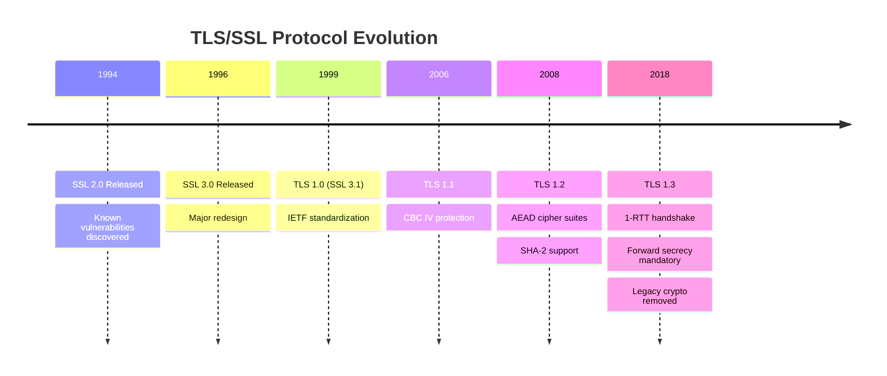
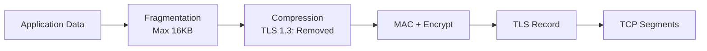
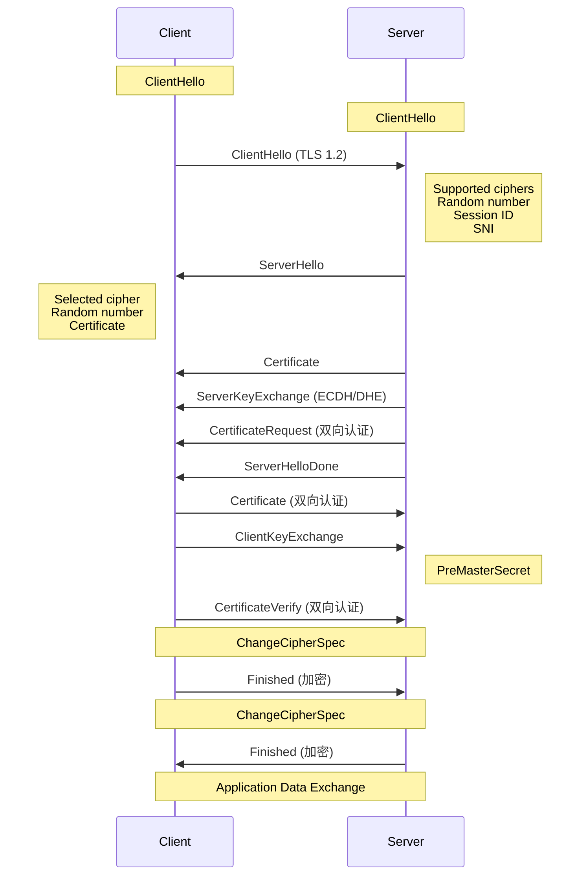
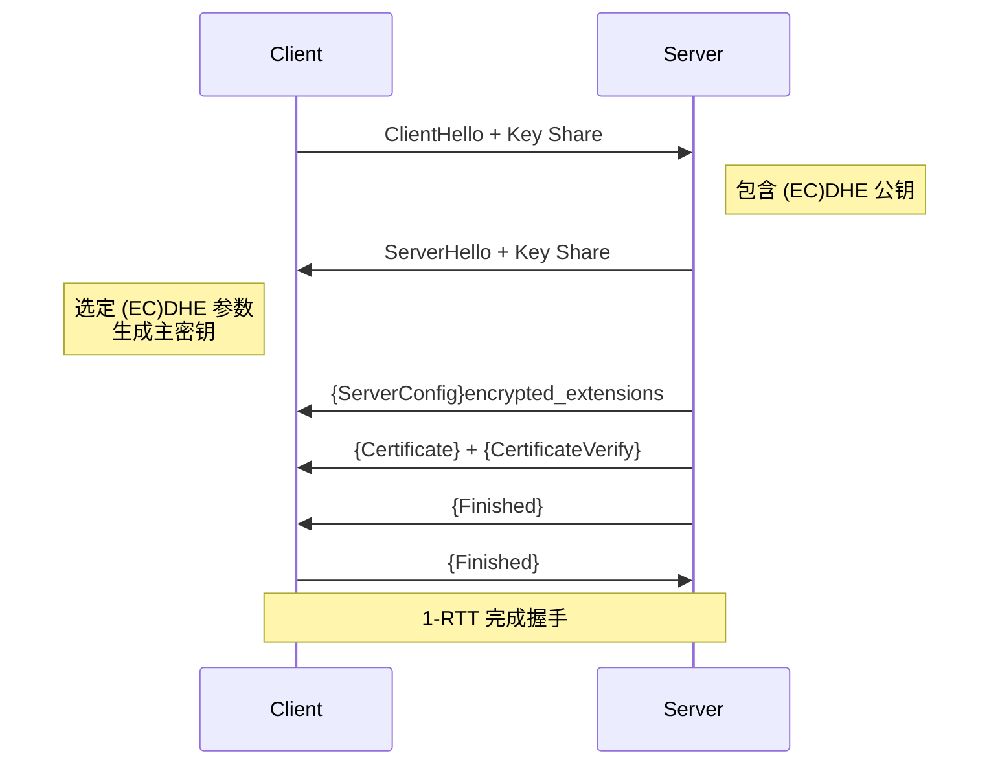
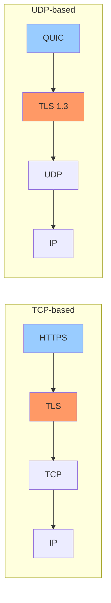
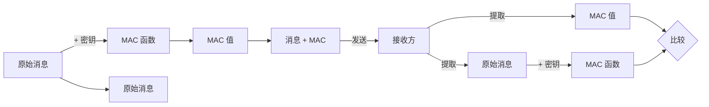
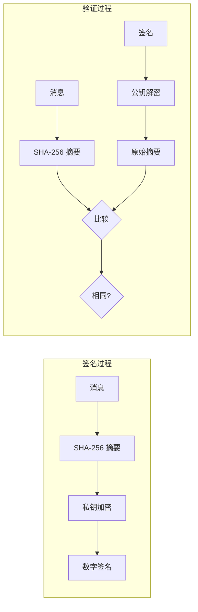
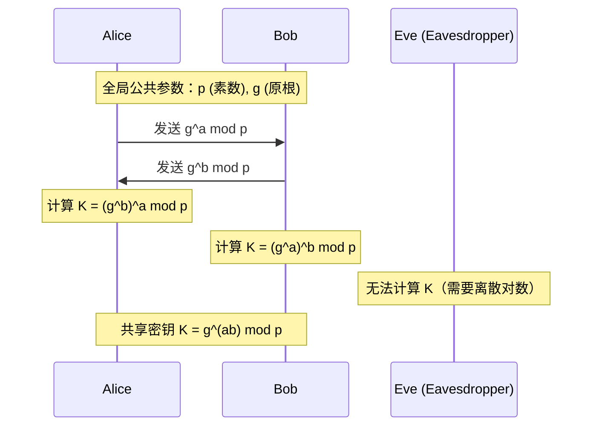
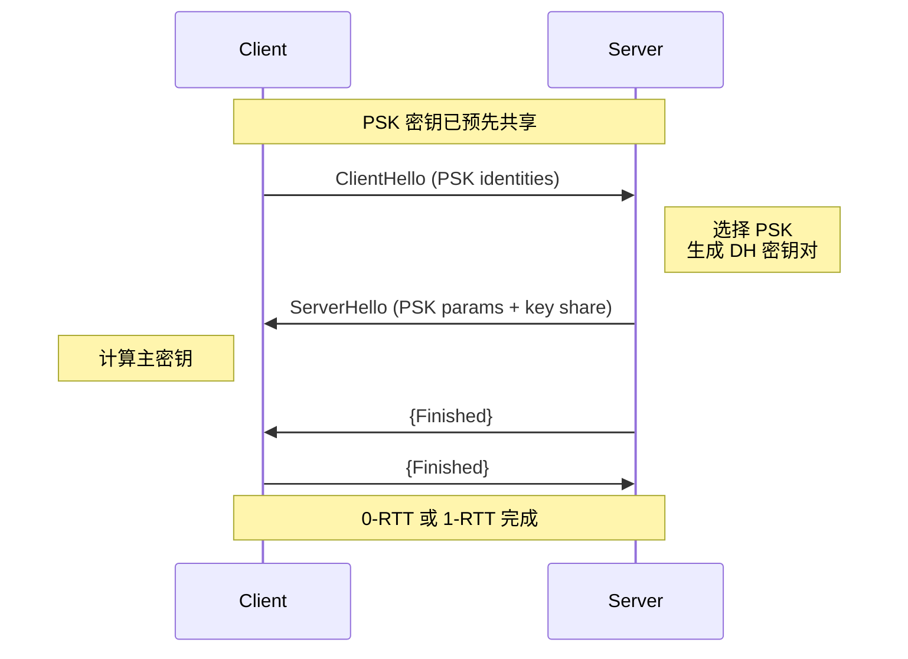

# TLS 深度探索 Ch1: TLS 基础与协议概述

## 1. TLS 是什么

TLS（Transport Layer Security，传输层安全）是一种用于在两个通信应用程序之间提供保密性、数据完整性和身份认证的加密协议。它是现代互联网安全的基石，被广泛应用于 HTTPS、WebSocket、邮件传输、VPN 等场景。

### 1.1 历史演进

TLS 的历史可以追溯到 SSL（Secure Sockets Layer）协议，以下是版本演进的时间线：

```
SSL 2.0 (1994) ──→ SSL 3.0 (1996) ──→ TLS 1.0 (1999)
                                              │
                                              ▼
                   TLS 1.3 (2018) ←── TLS 1.2 (2008)
                          ↑              ↑
                          │              │
                          └──────────────┘
```

**关键版本说明：**

| 版本 | 年份 | 主要特性 | 废弃情况 |
|------|------|----------|----------|
| SSL 2.0 | 1994 | 首个商业版本 | 已废弃（存在POODLE攻击） |
| SSL 3.0 | 1996 | 修复SSL 2.0缺陷 | 已废弃（POODLE攻击） |
| TLS 1.0 | 1999 | 基于SSL 3.0小幅改进 | 已废弃（2020年） |
| TLS 1.1 | 2006 | 添加CBC攻击防护 | 已废弃（2020年） |
| TLS 1.2 | 2008 | 支持AEAD，支持SHA-2 | 当前主流 |
| TLS 1.3 | 2018 | 1-RTT握手，废除老算法 | 现代化首选 |

**TLS 1.3 的革命性改进：**

- **握手时间从 2-RTT 降至 1-RTT**：连接建立更快
- **废除 RSA 密钥交换**：改用 (EC)DHE，实现前向保密（Forward Secrecy）
- **废除静态 RSA**：所有密钥交换均使用临时密钥
- **废除 CBC 模式**：全面使用 AEAD（Authenticate Encryption with Associated Data）
- **废除 MD5/SHA-1**：仅允许 SHA-2 系列
- **加密更多握手消息**：ServerHello 后的所有消息均加密



## 2. 五层协议栈

TLS 协议并非单一协议，而是由多个子协议组成的协议族。RFC 5246 定义了 TLS 的五层结构：

```
┌─────────────────────────────────────────┐
│         Application Data Protocol       │  ← 应用数据协议
├─────────────────────────────────────────┤
│           ChangeCipherSpec Protocol     │  ← 密码规格变更协议
├─────────────────────────────────────────┤
│             Alert Protocol              │  ← 警报协议
├─────────────────────────────────────────┤
│          Handshake Protocol             │  ← 握手协议
├─────────────────────────────────────────┤
│           Record Protocol               │  ← 记录层协议
└─────────────────────────────────────────┘
```

### 2.1 Record Protocol（记录层协议）

Record Protocol 是 TLS 协议的最底层，负责：

1. **分片（Fragmentation）**：将上层消息分割为小于 16KB 的块
2. **压缩（Compression）**：可选，TLS 1.3 已废除
3. **MAC/Encryption**：对每个分片进行完整性保护和数据加密
4. **传输**：通过 TCP 可靠传输



Record Protocol 的工作流程：

```c
// TLS Record 格式
struct {
    ContentType type;           // 1 byte: handshake/alert/application_data/change_cipher_spec
    ProtocolVersion version;    // 2 bytes: TLS 1.2 = 0x0303, TLS 1.3 = 0x0304
    uint16 length;              // 2 bytes: payload 长度（不含 header）
    opaque payload[length];     // 加密后的数据
} TLSRecord;
```

**ContentType 值：**

| 值 | 类型 | 说明 |
|----|------|------|
| 20 | change_cipher_spec | 密码规格变更 |
| 21 | alert | 警报消息 |
| 22 | handshake | 握手消息 |
| 23 | application_data | 应用数据 |

### 2.2 Handshake Protocol（握手协议）

Handshake Protocol 是 TLS 中最复杂的子协议，负责：

- 协商加密算法和参数
- 认证服务器（和可选的客户端）
- 建立会话密钥

完整的 TLS 1.2 握手流程：



TLS 1.3 的握手被大幅简化：



### 2.3 Alert Protocol（警报协议）

Alert Protocol 用于传达错误信息和连接状态：

```c
// Alert 消息格式
struct {
    AlertLevel level;        // warning / fatal
    AlertDescription desc;   // 具体的警报类型
} Alert;
```

**常见的 Fatal 警报（导致连接立即关闭）：**

| 警报 | 值 | 说明 |
|------|----|------|
| unexpected_message | 10 | 收到不预期的消息 |
| bad_record_mac | 20 | MAC 验证失败 |
| record_overflow | 22 | 记录长度超限 |
| handshake_failure | 40 | 握手协商失败 |
| illegal_parameter | 47 | 非法参数 |
| internal_error | 80 | 内部错误 |
| inappropriate_fallback | 86 | 版本回退被拒绝 |

**Close Notify（warning level）：** 正常关闭连接，用于通知对方不再发送数据。

### 2.4 ChangeCipherSpec Protocol

这个协议极其简单，仅包含一个字节（值为 1），用于通知对方「后续消息将使用刚刚协商的加密参数」。

**注意：** 在 TLS 1.3 中，ChangeCipherSpec 被废除，密钥使用在握手中直接启用。

### 2.5 Application Data Protocol

应用数据协议没有自己的格式定义，它直接承载上层的应用协议数据（如 HTTP）。Record Layer 负责用协商的加密参数对应用数据进行加密和解密。

## 3. TLS 与 SSL 的区别

很多人会疑惑：为什么这个协议叫 TLS，而不是沿用 SSL 这个更广为人知的名字？

### 3.1 本质区别

TLS 和 SSL 在技术层面几乎是等价的。TLS 1.0 实际上是 SSL 3.0 的「规范化版本」，它们的核心设计几乎相同：

```python
# SSL 3.0 和 TLS 1.0 的版本号差异
SSL_VERSION = (3, 0)    # SSL 3.0
TLS_VERSION = (3, 1)    # TLS 1.0 = SSL 3.1
TLS_VERSION_1_2 = (3, 3)  # TLS 1.2
TLS_VERSION_1_3 = (3, 4)  # TLS 1.3
```

### 3.2 主要差异

| 特性 | SSL 3.0 | TLS 1.0+ |
|------|---------|----------|
| 协议版本号 | 0x0300 | 0x0301, 0x0302... |
| MAC 算法 | MD5/SHA-1 | HMAC（更安全） |
| PRF 算法 | 自定义 | HMAC-based |
| 填充策略 | 块密码填充 | 更好的填充验证 |
| 握手消息认证 | 部分认证 | 全部握手消息认证 |
| 证书类型 | 多种 | X.509 为主 |

### 3.3 为什么要改名

**法律和商标原因：**

- SSL 是 Netscape 公司在 1994 年注册的商标
- 当 IETF 接手并标准化该协议时，无法直接使用 SSL 这个名字
- 因此改名为 Transport Layer Security（传输层安全）

**政治原因：**

- IETF 作为一个开放的标准组织，希望协议名称不与商业公司绑定
- TLS 作为一个中立的名称，更适合作为行业标准

### 3.4 实际使用中的区别

在现代网络中：

```bash
# 连接到使用 TLS 1.3 的服务器
openssl s_client -connect example.com:443 -tls1_3

# 查看支持的协议版本
openssl s_client -connect example.com:443 -tls1_2

# SSL 协议已完全废弃，服务器会拒绝
openssl s_client -connect example.com:443 -ssl3  # 失败
```

**禁止使用 SSL 的原因：**

1. SSL 3.0 存在 POODLE 攻击漏洞（CVE-2014-3566）
2. TLS 1.0/1.1 存在 BEAST、CRIME 等攻击
3. 现代浏览器已完全废除 SSL 和早期 TLS 版本

## 4. TLS 在网络协议栈中的位置

### 4.1 OSI 七层模型中的 TLS

```mermaid
graph TB
    subgraph OSI
        A1[7. 应用层 Application]
        A2[6. 表示层 Presentation]
        A3[5. 会话层 Session]
        A4[4. 传输层 Transport]
        A5[3. 网络层 Network]
        A6[2. 数据链路层 Data Link]
        A7[1. 物理层 Physical]
    end

    subgraph TCPIP
        B1[应用层 Application]
        B2[传输层 Transport]
        B3[网络层 Internet]
        B4[网络接口层 Link]
    end

    subgraph TLS
        C1[Application Data]
        C2[TLS Handshake]
        C3[TLS Record]
    end

    A1 --> A2
    A2 --> A3
    A3 --> A4
    A4 --> A5
    A5 --> A6
    A6 --> A7

    B1 --> B2
    B2 --> B3
    B3 --> B4

    C1 --> C2
    C2 --> C3

    style C1 fill:#f96
    style C2 fill:#f96
    style C3 fill:#f96
```



**TLS 位于传输层（TCP）之上、应用层之下：**

```
┌──────────────────────────────────────┐
│           HTTP / SMTP / ...          │  ← 应用层
├──────────────────────────────────────┤
│         TLS (Record/Handshake)       │  ← 加密层
├──────────────────────────────────────┤
│              TCP                     │  ← 传输层
├──────────────────────────────────────┤
│              IP                      │  ← 网络层
└──────────────────────────────────────┘
```

### 4.2 TLS 的双重身份

TLS 实际上横跨了多个 OSI 层：

| OSI 层 | TLS 组件 |
|--------|----------|
| 5. 会话层 | TLS 会话管理（Session ID，恢复连接） |
| 6. 表示层 | TLS 加密/解密，数据格式转换 |
| 7. 应用层 | Application Data Protocol |

### 4.3 TLS 与 TCP/UDP 的关系



**DTLS（Datagram TLS）：**

- 用于 UDP 场景的 TLS
- 处理 UDP 不可靠、不按序到达的特性
- 握手稍有不同，增加重传和序列号

```c
// DTLS Record 头（比 TLS 多了序列号）
struct {
    ContentType type;
    ProtocolVersion version;     // DTLS 1.2 = 0xFEFD
    uint16 epoch;                 // 密码状态改变计数
    uint48 sequence_number;       // 序列号（48 bits）
    uint16 length;
    opaque payload[];
} DTLSRecord;
```

## 5. 对称加密 vs 非对称加密

### 5.1 基本概念对比

| 特性 | 对称加密 | 非对称加密 |
|------|----------|------------|
| 密钥数量 | 1 个（共享密钥） | 2 个（公钥+私钥） |
| 加解密速度 | 快（10-100倍差） | 慢 |
| 密钥长度 | 128-256 bits | 2048-4096 bits |
| 主要用途 | 批量数据加密 | 密钥交换、签名 |
| 算法代表 | AES, ChaCha20 | RSA, ECC |
| 安全基础 | 位操作混淆 | 数学难题（如大数分解） |

### 5.2 对称加密算法

#### AES（Advanced Encryption Standard）

AES 是目前最广泛使用的对称加密算法：

```python
from Crypto.Cipher import AES
from Crypto.Random import get_random_bytes

# 256-bit 密钥
key = get_random_bytes(32)  # 256 bits

# 使用 AES-GCM 模式（AES with Galois/Counter Mode）
cipher = AES.new(key, AES.MODE_GCM)
nonce = cipher.nonce

# 加密
plaintext = b"Hello, TLS!"
ciphertext, tag = cipher.encrypt_and_digest(plaintext)

print(f"Nonce: {nonce.hex()}")
print(f"Ciphertext: {ciphertext.hex()}")
print(f"Tag: {tag.hex()}")
print(f"Key: {key.hex()}")

# 解密
decipher = AES.new(key, AES.MODE_GCM, nonce=nonce)
decrypted = decipher.decrypt_and_verify(ciphertext, tag)
print(f"Decrypted: {decrypted}")
```

**AES 的工作模式：**

| 模式 | 全称 | 特点 | TLS 1.3 |
|------|------|------|----------|
| ECB | Electronic Codebook | 不安全，不推荐 | ✗ |
| CBC | Cipher Block Chaining | 需要 MAC，Padding Oracle | ✗ (废除) |
| CTR | Counter | 并行，加密单项数据 | ✗ |
| GCM | Galois/Counter Mode | AEAD，并行，认证加密 | ✓ |
| CCM | Counter with CBC-MAC | AEAD，资源受限环境 | ✓ |
| ChaCha20-Poly1305 | - | 移动设备友好 | ✓ |

#### ChaCha20-Poly1305

由 Daniel J. Bernstein 设计，是一种流加密算法，特别适合移动设备（无硬件 AES 加速时更快）：

```python
# Python 实现示例（使用 cryptography 库）
from cryptography.hazmat.primitives.ciphers.aead import ChaCha20Poly1305

# 256-bit 密钥
key = ChaCha20Poly1305.generate_key()

# 加密
chacha = ChaCha20Poly1305(key)
nonce = b'\x00' * 12  # 96-bit nonce
ciphertext = chacha.encrypt(nonce, b"Hello, ChaCha20!", None)

# 解密
plaintext = chacha.decrypt(nonce, ciphertext, None)
print(f"Decrypted: {plaintext}")
```

### 5.3 非对称加密算法

#### RSA

RSA 是最经典的非对称加密算法，基于大数分解难题：

```python
from Crypto.PublicKey import RSA
from Crypto.Cipher import PKCS1_OAEP
from Crypto.Signature import pkcs1_15
from Crypto.Hash import SHA256

# 生成 2048-bit RSA 密钥对
key = RSA.generate(2048)
private_key = key.export_key()
public_key = key.publickey().export_key()

print(f"Private key size: {key.size_in_bits()} bits")
print(f"Private key (PEM):\n{private_key.decode()[:100]}...")

# 加密
cipher = PKCS1_OAEP.new(RSA.import_key(public_key), hashAlgo=SHA256)
ciphertext = cipher.encrypt(b"Shared master secret")
print(f"Ciphertext length: {len(ciphertext)} bytes")

# 解密
decipher = PKCS1_OAEP.new(RSA.import_key(private_key), hashAlgo=SHA256)
plaintext = decipher.decrypt(ciphertext)
print(f"Decrypted: {plaintext}")

# 签名
message = b"Message to be signed"
h = SHA256.new(message)
signature = pkcs1_15.new(key).sign(h)
print(f"Signature: {signature.hex()[:40]}...")

# 验签
try:
    pkcs1_15.new(RSA.import_key(public_key)).verify(h, signature)
    print("Signature verification: SUCCESS")
except:
    print("Signature verification: FAILED")
```

**RSA 密钥长度与安全强度对比：**

| RSA 密钥长度 | 大致等价对称密钥强度 | 推荐场景 |
|-------------|---------------------|----------|
| 1024 bits | 80 bits | 不推荐（已破解） |
| 2048 bits | 112 bits | 短期（2025前） |
| 3072 bits | 128 bits | 中期（2030前） |
| 4096 bits | 156 bits | 长期安全需求 |

#### ECC（Elliptic Curve Cryptography）

椭圆曲线密码学用更短的密钥提供相同或更高的安全性：

```go
package main

import (
    "crypto/ecdsa"
    "crypto/elliptic"
    "crypto/rand"
    "crypto/sha256"
    "fmt"
    "math/big"
)

func main() {
    // 生成 ECDSA P-256 密钥对
    // P-256 = secp256r1 = prime256v1
    privateKey, err := ecdsa.GenerateKey(elliptic.P256(), rand.Reader)
    if err != nil {
        panic(err)
    }

    fmt.Printf("ECDSA P-256 Key Generation:\n")
    fmt.Printf("  Private key bit size: %d\n", privateKey.Curve.Params().BitSize)
    fmt.Printf("  Public key X: %x...\n", privateKey.PublicKey.X.Text(16)[:32])
    fmt.Printf("  Public key Y: %x...\n", privateKey.PublicKey.Y.Text(16)[:32])

    // 签名
    message := []byte("Message to sign")
    hash := sha256.Sum256(message)

    signature, err := ecdsa.SignASN1(rand.Reader, privateKey, hash[:])
    if err != nil {
        panic(err)
    }
    fmt.Printf("\nSignature: %x...\n", signature[:32])

    // 验签
    valid := ecdsa.VerifyASN1(&privateKey.PublicKey, hash[:], signature)
    fmt.Printf("Signature valid: %v\n", valid)

    // 对比 RSA 2048
    fmt.Printf("\nKey size comparison:\n")
    fmt.Printf("  RSA 2048: 2048 bits (~256 bytes)\n")
    fmt.Printf("  ECDSA P-256: 256 bits (~32 bytes) - same security level\n")
    fmt.Printf("  ECDSA P-384: 384 bits (~48 bytes) - ~192-bit security\n")
    fmt.Printf("  ECDSA P-521: 521 bits (~66 bytes) - ~256-bit security\n")
}
```

**常用椭圆曲线对比：**

| 曲线 | 别名 | 密钥长度 | 安全强度 | TLS 1.3 | 备注 |
|------|------|----------|----------|---------|------|
| secp256r1 | P-256 | 256 bits | 128 bits | ✓ | NIST 推荐，均衡 |
| secp384r1 | P-384 | 384 bits | 192 bits | ✓ | 高安全需求 |
| secp521r1 | P-521 | 521 bits | 256 bits | ✓ | 最高安全 |
| X25519 | - | 256 bits | 128 bits | ✓ | 非对称 DH，更快 |
| X448 | - | 448 bits | 224 bits | ✓ | 高安全 DH |

### 5.4 TLS 1.3 中的密码套件命名

TLS 1.3 使用新的密码套件命名格式：

```
TLS_AES_128_GCM_SHA256
TLS_AES_256_GCM_SHA384
TLS_CHACHA20_POLY1305_SHA256
```

格式：`TLS_<对称加密>_<模式>_<哈希算法>`

- 密钥交换算法不再包含在密码套件中（独立协商）
- 认证算法也不包含（由证书类型决定）

## 6. 散列函数与 MAC

### 6.1 散列函数（Hash Function）

散列函数将任意长度的输入映射为固定长度的输出（摘要），具有：

- **单向性**：无法从摘要反推原始输入
- **抗碰撞性**：无法找到两个不同输入产生相同摘要
- **雪崩效应**：输入微小变化导致输出完全不同

**TLS 中使用的散列函数历史：**

| 散列函数 | 输出长度 | 安全状态 | TLS 1.3 | 备注 |
|----------|----------|----------|---------|------|
| MD5 | 128 bits | 破解 | ✗ | 1996 年发现碰撞 |
| SHA-1 | 160 bits | 破解 | ✗ | 2017 年 SHAttered 攻击 |
| SHA-224 | 224 bits | deprecated | ✗ | 安全强度不足 |
| SHA-256 | 256 bits | 安全 | ✓ | TLS 1.3 主力 |
| SHA-384 | 384 bits | 安全 | ✓ | 用于 TLS_AES_256 |
| SHA-512 | 512 bits | 安全 | ✓ | 与 SHA-384 配合 |
| SHA-3 | 256/384/512 | 安全 | ✓ | 替代选择 |

```python
import hashlib

def demonstrate_hash_properties():
    """演示散列函数的特性"""
    
    # 雪崩效应
    h1 = hashlib.sha256(b"Hello")
    h2 = hashlib.sha256(b"Hellp")  # 只改变一个字符
    
    print("=== 雪崩效应演示 ===")
    print(f"sha256('Hello'):  {h1.hexdigest()}")
    print(f"sha256('Hellp'):  {h2.hexdigest()}")
    print(f"改变的位数: {sum(c1 != c2 for c1, c2 in zip(h1.digest(), h2.digest()))}/256 bits")
    
    # 长度固定
    print("\n=== 长度固定性 ===")
    for msg in [b"a", b"abc", b"Hello TLS!" * 1000]:
        h = hashlib.sha256(msg)
        print(f"输入长度: {len(msg):6d} bytes -> 摘要长度: {len(h.hexdigest())} hex chars")
    
    # 碰撞演示（MD5 - 已破解）
    print("\n=== MD5 碰撞示例 ===")
    # 两个不同的 PDF 文件可以有相同的 MD5（SHAttered 团队攻击）
    print("MD5 已不推荐用于安全场景")

demonstrate_hash_properties()
```

### 6.2 MAC（Message Authentication Code）

MAC 用于验证消息的完整性和真实性：



**MAC 的两种主要构造方式：**

#### HMAC（Hash-based MAC）

```python
import hmac
import hashlib

def hmac_example():
    """HMAC 示例"""
    
    key = b"shared_secret_key"
    message = b"Transfer $1000 to account 12345"
    
    # HMAC-SHA256
    h = hmac.new(key, message, hashlib.sha256)
    print(f"HMAC-SHA256: {h.hexdigest()}")
    
    # 验证
    h2 = hmac.new(key, message, hashlib.sha256)
    print(f"HMAC 验证: {'PASS' if h.digest() == h2.digest() else 'FAIL'}")
    
    # 密钥错误时
    wrong_key = b"wrong_key"
    h3 = hmac.new(wrong_key, message, hashlib.sha256)
    print(f"密钥错误时: {h3.hexdigest()}")
    print(f"HMAC 验证（错误密钥）: {'PASS' if h.digest() == h3.digest() else 'FAIL'}")
    
    # HMAC 的安全性来自 IPad/Opad 双重哈希
    # H(K XOR opad || H(K XOR ipad || message))
    
hmac_example()
```

#### GMAC（Galois/Counter Mode MAC）

GMAC 是 GCM 模式中的认证组件，通常与 AES-GCM 一起使用：

```c
// AEAD 加密示意（伪代码）
struct aes_gcm_encrypt(key, nonce, plaintext, aad) {
    // 1. 生成计数器流
    ciphertext = plaintext XOR AES-CTR(key, nonce, counter)
    
    // 2. 计算认证标签
    tag = GMAC(key, nonce, AAD, ciphertext)
    
    return {ciphertext, tag}
}
```

### 6.3 AEAD（Authenticated Encryption with Associated Data）

AEAD 同时提供加密和认证，是现代密码学的金标准：

```go
package main

import (
    "crypto/aes"
    "crypto/cipher"
    "crypto/rand"
    "fmt"
)

func main() {
    // AES-GCM AEAD 示例
    key := make([]byte, 32) // 256-bit
    rand.Read(key)
    
    nonce := make([]byte, 12) // 96-bit nonce for GCM
    rand.Read(nonce)
    
    plaintext := []byte("Confidential data")
    aad := []byte("Associated data (not encrypted)") // 附加数据，只认证不加密
    
    // 创建 cipher
    block, _ := aes.NewCipher(key)
    gcm, _ := cipher.NewGCM(block)
    
    // 加密并认证
    ciphertext := gcm.Seal(nil, nonce, plaintext, aad)
    
    fmt.Printf("Original:    %s\n", plaintext)
    fmt.Printf("Ciphertext:  %x\n", ciphertext[:len(plaintext)])
    fmt.Printf("Nonce:       %x\n", nonce)
    fmt.Printf("Tag:         %x\n", ciphertext[len(plaintext):])
    fmt.Printf("AAD:         %s\n", aad)
    
    // 解密并验证
    decrypted, err := gcm.Open(nil, nonce, ciphertext, aad)
    if err != nil {
        fmt.Println("Decryption failed!")
        return
    }
    
    fmt.Printf("Decrypted:   %s\n", decrypted)
}
```

**AEAD 的三大特性：**

1. **Confidentiality（机密性）**：只有拥有密钥的人能解密
2. **Authenticity（真实性）**：能验证消息确实来自声称的发送者
3. **Integrity（完整性）**：能检测消息是否被篡改

## 7. 数字签名与消息认证

### 7.1 数字签名的原理

数字签名使用私钥对消息的散列值进行加密，任何拥有公钥的人都可以验证：



### 7.2 RSA-PSS 签名

RSA-PSS（Probabilistic Signature Scheme）是一种更安全的 RSA 签名方案：

```python
from Crypto.PublicKey import RSA
from Crypto.Signature import pkcs1_15
from Crypto.Signature.pss import PKCS1_PSS_SigScheme
from Crypto.Hash import SHA256, SHA384

# 生成 RSA 密钥
key = RSA.generate(4096)
message = b"The quick brown fox jumps over the lazy dog"

# 传统 PKCS#1 v1.5 签名
h = SHA256.new(message)
signature_old = pkcs1_15.new(key).sign(h)
print(f"PKCS#1 v1.5 Signature: {signature_old.hex()[:40]}...")

# RSA-PSS 签名（更安全）
# PSS 使用随机 salt，增强安全性
def rsa_pss_sign(private_key, message, hash_func):
    h = hash_func.new(message)
    pss = PKCS1_PSS_SigScheme(private_key, hash_func)
    return pss.sign(h)

def rsa_pss_verify(public_key, message, signature, hash_func):
    h = hash_func.new(message)
    pss = PKCS1_PSS_SigScheme(public_key, hash_func)
    try:
        pss.verify(h, signature)
        return True
    except:
        return False

# 使用 SHA-256 的 RSA-PSS
signature_pss = rsa_pss_sign(key, message, SHA256)
print(f"RSA-PSS Signature: {signature_pss.hex()[:40]}...")

# 验证
valid = rsa_pss_verify(key.publickey(), message, signature_pss, SHA256)
print(f"RSA-PSS Verify: {'SUCCESS' if valid else 'FAILED'}")

# 篡改消息后验证
tampered = b"The quick brown fox jumps over the lazy cat"
valid_tampered = rsa_pss_verify(key.publickey(), tampered, signature_pss, SHA256)
print(f"Tampered Verify: {'PASS' if not valid_tampered else 'UNEXPECTED PASS'}")
```

### 7.3 ECDSA 签名

ECDSA 是基于椭圆曲线的签名算法，比 RSA 更高效：

```go
package main

import (
    "crypto/ecdsa"
    "crypto/elliptic"
    "crypto/rand"
    "crypto/sha256"
    "crypto/x509"
    "encoding/pem"
    "fmt"
    "math/big"
)

func main() {
    // 生成 ECDSA P-384 密钥对
    privateKey, err := ecdsa.GenerateKey(elliptic.P384(), rand.Reader)
    if err != nil {
        panic(err)
    }

    message := []byte("TLS 1.3 uses ECDSA for certificate signatures")

    // ECDSA 签名
    h := sha256.Sum256(message)
    signature, err := ecdsa.SignASN1(rand.Reader, privateKey, h[:])
    if err != nil {
        panic(err)
    }

    fmt.Printf("Message: %s\n", message)
    fmt.Printf("Signature (ASN.1 DER): length=%d bytes\n", len(signature))
    fmt.Printf("Signature R: %x...\n", signature[:len(signature)/2])
    fmt.Printf("Signature S: %x...\n", signature[len(signature)/2:])

    // 验证签名
    valid := ecdsa.VerifyASN1(&privateKey.PublicKey, h[:], signature)
    fmt.Printf("\nSignature valid: %v\n", valid)

    // 导出 PEM 格式
    privBytes, _ := x509.MarshalECPrivateKey(privateKey)
    privPEM := pem.EncodeToMemory(&pem.Block{
        Type:  "EC PRIVATE KEY",
        Bytes: privBytes,
    })
    fmt.Printf("\nPrivate Key PEM:\n%s", privPEM)
}
```

### 7.4 EdDSA（Edwards-curve Digital Signature Algorithm）

EdDSA 是现代签名算法，签名和验证速度更快：

```go
package main

import (
    "crypto/ed25519"
    "crypto/rand"
    "fmt"
)

func main() {
    // 生成 Ed25519 密钥对
    // Ed25519 使用 Curve25519 曲线
    publicKey, privateKey, err := ed25519.GenerateKey(rand.Reader)
    if err != nil {
        panic(err)
    }

    message := []byte("EdDSA is faster than ECDSA")

    // 签名
    signature := ed25519.Sign(privateKey, message)

    fmt.Printf("Ed25519 Key Size: %d bits\n", len(publicKey)*8)
    fmt.Printf("Signature Size: %d bytes\n", len(signature))
    fmt.Printf("Signature: %x...\n", signature[:32])

    // 验证
    valid := ed25519.Verify(publicKey, message, signature)
    fmt.Printf("Signature valid: %v\n", valid)

    // 对比表
    fmt.Println("\n=== Signature Algorithm Comparison ===")
    fmt.Println("| Algorithm | Key Size | Signature Size | Security |")
    fmt.Println("|-----------|----------|----------------|----------|")
    fmt.Println("| RSA-2048  | 2048 bits| 256 bytes      | 112 bits |")
    fmt.Println("| RSA-4096  | 4096 bits| 512 bytes      | 140 bits |")
    fmt.Println("| ECDSA P-256| 256 bits| 64 bytes       | 128 bits |")
    fmt.Println("| ECDSA P-384| 384 bits| 96 bytes       | 192 bits |")
    fmt.Println("| Ed25519   | 256 bits| 64 bytes       | 128 bits |")
}
```

## 8. 随机数与盐值

### 8.1 PRNG 与 CSPRNG

**PRNG（Pseudo-Random Number Generator）：**

- 使用确定性算法生成看似随机的数列
- 种子（seed）决定输出序列
- 适用于游戏、模拟等非安全场景

**CSPRNG（Cryptographically Secure PRNG）：**

- 密码学安全的伪随机数生成器
- 必须满足：不可预测性、输出无法被区分
- TLS 密钥生成必须使用 CSPRNG

```python
import os
import random
import time

def demonstrate_prng_quality():
    """演示普通 PRNG 和 CSPRNG 的差异"""
    
    # 不安全的 PRNG（Python random）
    print("=== Python random (NOT CSPRNG) ===")
    random.seed(42)
    for i in range(3):
        print(f"  {random.getrandbits(256):x}")
    
    # CSPRNG（os.urandom / secrets）
    print("\n=== os.urandom (CSPRNG) ===")
    for i in range(3):
        print(f"  {int.from_bytes(os.urandom(32), 'big'):x}")
    
    # secrets 模块（Python 3.6+）
    import secrets
    print("\n=== secrets (CSPRNG) ===")
    for i in range(3):
        print(f"  {secrets.randbits(256):x}")

demonstrate_prng_quality()
```

### 8.2 熵（Entropy）的概念

熵是衡量随机性的指标，单位是 bits。更高熵意味着更难预测：

```python
import math

def calculate_entropy_examples():
    """计算不同随机源的熵"""
    
    # 硬币抛掷（公平）
    # 每掷一次提供 1 bit 熵
    print("=== 熵的计算示例 ===")
    
    examples = [
        ("公平硬币", 2, 1),        # 2 种等概率结果
        ("公平六面骰", 6, math.log2(6)),  # 6 种等概率结果
        ("52 张扑克牌", 52, math.log2(52)),
        ("256-bit 随机数", 2**256, 256),
    ]
    
    for name, outcomes, entropy in examples:
        print(f"  {name}: {entropy:.2f} bits 熵")
    
    print("\n=== TLS 对熵的要求 ===")
    print("  PreMasterSecret: 48 bytes = 384 bits")
    print("  Client/Server Random: 32 bytes = 256 bits each")
    print("  Session Key (AES-256): 32 bytes = 256 bits")
    print("  所有密钥必须从 CSPRNG 生成")

calculate_entropy_examples()
```

### 8.3 TLS 中的随机数

```c
// TLS 1.2 中 ClientHello 和 ServerHello 的随机数
struct {
    uint32 gmt_unix_time;    // GMT 时间戳
    opaque random_bytes[28]; // 28 字节真随机数
} Random;

// TLS 1.3 中的随机数（gmt_unix_time 被废除）
struct {
    opaque random_bytes[32]; // 32 字节真随机数
} Random;
```

```python
import os
import struct
import time

def generate_tls_random():
    """生成 TLS 协议的随机数"""
    
    # TLS 1.2 格式：4 字节时间戳 + 28 字节随机
    tls_1_2 = struct.pack("!I", int(time.time())) + os.urandom(28)
    print(f"TLS 1.2 Random ({len(tls_1_2)} bytes):")
    print(f"  Timestamp: {struct.unpack('!I', tls_1_2[:4])[0]}")
    print(f"  Random:    {tls_1_2[4:].hex()[:40]}...")
    
    # TLS 1.3 格式：32 字节随机（无时间戳）
    tls_1_3 = os.urandom(32)
    print(f"\nTLS 1.3 Random ({len(tls_1_3)} bytes):")
    print(f"  Random:    {tls_1_3.hex()[:40]}...")
    
    # 使用安全的熵源
    print("\n=== 推荐的熵源 ===")
    entropy_sources = [
        ("Linux", "/dev/urandom 或 /dev/random"),
        ("Windows", "CryptGenRandom / BCryptGenRandom"),
        ("macOS", "SecRandomCopyBytes"),
        ("Go", "crypto/rand.Reader"),
        ("Python", "os.urandom 或 secrets 模块"),
    ]
    for os_name, source in entropy_sources:
        print(f"  {os_name}: {source}")

generate_tls_random()
```

### 8.4 Salt（盐值）

盐值用于确保相同输入产生不同输出，防止彩虹表攻击：

```python
import os
import hashlib

def password_hashing_with_salt():
    """使用 salt 的密码哈希"""
    
    password = b"super_secret_password"
    
    # 没有 salt：相同密码产生相同哈希
    hash1 = hashlib.sha256(password).hexdigest()
    hash2 = hashlib.sha256(password).hexdigest()
    print("=== 无 salt（不推荐）===")
    print(f"Password: {password}")
    print(f"Hash 1:   {hash1}")
    print(f"Hash 2:   {hash1 == hash2} (相同输入=相同输出)")
    
    # 使用随机 salt
    print("\n=== 使用 salt（推荐）===")
    salt1 = os.urandom(16)
    salt2 = os.urandom(16)
    
    # PBKDF2 / Argon2 之类的密钥派生函数使用 salt
    hash1 = hashlib.pbkdf2.HMAC(password, salt1, 100000, 32, hashlib.sha256)
    hash2 = hashlib.pbkdf2.HMAC(password, salt2, 100000, 32, hashlib.sha256)
    
    print(f"Salt 1:   {salt1.hex()}")
    print(f"Hash 1:   {hash1.hex()}")
    print(f"Salt 2:   {salt2.hex()}")
    print(f"Hash 2:   {hash2.hex()}")
    print(f"相同密码不同 salt: {hash1 != hash2}")

password_hashing_with_salt()
```

## 9. 密钥交换算法

### 9.1 DH（Diffie-Hellman）密钥交换

DH 是一种让双方在不安全的通道上建立共享密钥的算法：



**数学原理：**

- 已知 `g^a mod p` 和 `g^b mod p`
- 计算 `g^(ab) mod p` 很容易（双方分别计算）
- 但已知 `g^a mod p`，求 `a`（离散对数）非常困难

```python
from Crypto.Protocol.DH import keygen
from Crypto.Random import get_random_bytes

def diffie_hellman_demo():
    """Diffie-Hellman 密钥交换示例"""
    
    # 使用 DH 库（基于离散对数问题）
    # 参数：1924-bit MODP 组（RFC 3526）
    
    print("=== Diffie-Hellman 密钥交换 ===")
    
    # 生成 DH 密钥对
    # 在实际 TLS 中，这些参数由服务器指定
    p = int("""
    FFFFFFFFFFFFFFFFC2F7450666515A431CAB6A1A6B3D5A4654B1
    868FEA64BFA4A5E6A8590F1B7D6A5B7D5A4654B1A6B3D5A4654
    """.replace('\n', ''), 16)  # 简化的 p 值
    
    g = 2
    
    # Alice 生成私钥
    a = get_random_bytes(32)  # 256-bit 私钥
    A = pow(g, int.from_bytes(a, 'big'), p)  # A = g^a mod p
    
    # Bob 生成私钥
    b = get_random_bytes(32)
    B = pow(g, int.from_bytes(b, 'big'), p)  # B = g^b mod p
    
    # 交换 A 和 B 后，各自计算共享密钥
    K_alice = pow(B, int.from_bytes(a, 'big'), p)  # K = B^a mod p
    K_bob = pow(A, int.from_bytes(b, 'big'), p)    # K = A^b mod p
    
    print(f"Alice's public value A (truncated): {hex(A)[:40]}...")
    print(f"Bob's public value B (truncated):   {hex(B)[:40]}...")
    print(f"\nShared secret match: {K_alice == K_bob}")
    print(f"Shared secret (truncated): {hex(K_alice)[:40]}...")

diffie_hellman_demo()
```

### 9.2 ECDH（Elliptic Curve Diffie-Hellman）

ECDH 使用椭圆曲线，比 DH 更高效：

```go
package main

import (
    "crypto/elliptic"
    "crypto/rand"
    "fmt"
)

func main() {
    // P-256 椭圆曲线参数
    curve := elliptic.P256()

    // Alice 生成密钥对
    alicePriv, alicePubX, alicePubY, _ := elliptic.GenerateKey(curve, rand.Reader)

    // Bob 生成密钥对
    bobPriv, bobPubX, bobPubY, _ := elliptic.GenerateKey(curve, rand.Reader)

    fmt.Println("=== ECDH Key Exchange (P-256) ===")

    // 交换公钥后计算共享密钥
    // Alice: (bobPubX, bobPubY) * alicePriv
    ax, ay := curve.ScalarMult(bobPubX, bobPubY, alicePriv)

    // Bob: (alicePubX, alicePubY) * bobPriv
    bx, by := curve.ScalarMult(alicePubX, alicePubY, bobPriv)

    // 共享密钥相同
    fmt.Printf("Alice's public key: (%x..., %x...)\n", alicePubX.Text(16)[:16], alicePubY.Text(16)[:16])
    fmt.Printf("Bob's public key:   (%x..., %x...)\n", bobPubX.Text(16)[:16], bobPubY.Text(16)[:16])
    fmt.Printf("\nShared secret X: %x...\n", ax.Text(16)[:32])
    fmt.Printf("Match: %v\n", ax.Cmp(bx) == 0 && ay.Cmp(by) == 0)

    // 大小对比
    fmt.Println("\n=== Key Size Comparison ===")
    fmt.Println("| Algorithm | Private Key | Public Key | Shared Secret |")
    fmt.Println("|------------|-------------|------------|---------------|")
    fmt.Println("| DH-2048    | 256 bytes   | 256 bytes  | 256 bytes     |")
    fmt.Println("| ECDH P-256 | 32 bytes    | 64 bytes   | 32 bytes      |")
}
```

### 9.3 X25519

X25519 是 Curve25519 上的 ECDH，使用 Montgomery 曲线，更快更安全：

```go
package main

import (
    "crypto/ed25519"
    "crypto/x25519"
    "fmt"
)

func main() {
    // X25519 密钥生成
    alicePrivate := x25519.NewScalar()
    alicePublic, _ := x25519.X25519(alicePrivate, x25519.Basepoint)

    bobPrivate := x25519.NewScalar()
    bobPublic, _ := x25519.X25519(bobPrivate, x25519.Basepoint)

    // 计算共享密钥
    aliceShared, _ := x25519.X25519(alicePrivate, bobPublic)
    bobShared, _ := x25519.X25519(bobPrivate, alicePublic)

    fmt.Println("=== X25519 (Curve25519 ECDH) ===")
    fmt.Printf("Alice's public key: %x...\n", alicePublic[:16])
    fmt.Printf("Bob's public key:   %x...\n", bobPublic[:16])
    fmt.Printf("\nShared secret: %x...\n", aliceShared[:16])
    fmt.Printf("Match: %v\n", string(aliceShared) == string(bobShared))

    fmt.Println("\n=== Curve Comparison ===")
    fmt.Println("| Curve     | Key Size | Security | Performance |")
    fmt.Println("|-----------|----------|----------|-------------|")
    fmt.Println("| P-256     | 64 bytes | 128 bits | Moderate    |")
    fmt.Println("| Curve25519| 32 bytes | 128 bits | Fastest     |")
    fmt.Println("| P-384     | 96 bytes | 192 bits | Slower      |")
}
```

### 9.4 PSK（Pre-Shared Key）

PSK 允许双方使用预先共享的密钥进行握手，无需公钥操作：



**TLS 1.3 PSK 模式：**

```python
# PSK 密钥派生示例
import hmac
import hashlib

def tls13_psk_derivation(psk, info, length=32):
    """
    TLS 1.3 PSK 密钥派生
    HKDF-Extract + HKDF-Expand-Label
    """
    # 实际实现使用 HKDF（HMAC-based Key Derivation Function）
    # 这里用简化示例说明原理
    
    label = b"tls13 " + info
    return hmac.new(psk, label, hashlib.sha256).digest()[:length]

# PSK 场景
psk = b"pre_shared_secret_key_at_least_32_bytes_long"

# 导出密钥（Exporter）
exported = tls13_psk_derivation(
    psk, 
    b"exp master", 
    48
)
print(f"PSK-derived export key: {exported.hex()}")

# Resumption PSK（会话恢复）
resumption_psk = tls13_psk_derivation(
    psk,
    b"resumption",
    48
)
print(f"Resumption PSK: {resumption_psk.hex()}")
```

### 9.5 密钥交换算法对比

| 算法 | 密钥大小 | 安全强度 | 前向保密 | TLS 1.3 | 备注 |
|------|----------|----------|----------|---------|------|
| RSA key transport | 2048-4096 | 中 | 无 | ✗ | 废除 |
| DH 2048-bit | 256 bytes | 112 bits | ✓ | ✓ | 传统 |
| ECDH P-256 | 64 bytes | 128 bits | ✓ | ✓ | 均衡 |
| ECDH P-384 | 96 bytes | 192 bits | ✓ | ✓ | 高安全 |
| X25519 | 32 bytes | 128 bits | ✓ | ✓ | 推荐 |
| PSK | 32+ bytes | 128 bits | ✓ | ✓ | 低延迟 |
| (EC)DHE + PSK | 32+ bytes | 128 bits | ✓ | ✓ | 混合模式 |

**前向保密（Forward Secrecy）：** 即使长期私钥泄露，过去的会话密钥仍然安全。只有使用临时密钥（Ephemeral Key）的算法才提供前向保密。

## 10. OpenSSL 命令行实战

### 10.1 生成 RSA 密钥和证书

```bash
# 生成 RSA 私钥（2048-bit）
openssl genrsa -out rsa-private.key 2048

# 生成 RSA 私钥（4096-bit，更安全）
openssl genrsa -out rsa-private-4096.key 4096

# 私钥加密（使用 AES-256-CBC）
openssl genrsa -aes256 -out rsa-encrypted.key 2048

# 从私钥提取公钥
openssl rsa -in rsa-private.key -pubout -out rsa-public.key

# 查看私钥详情
openssl rsa -in rsa-private.key -text -noout
```

### 10.2 生成 ECDSA 密钥和证书

```bash
# 生成 ECDSA P-256 私钥
openssl ecparam -genkey -name prime256v1 -out ecdsa-p256.key

# 生成 ECDSA P-384 私钥
openssl ecparam -genkey -name secp384r1 -out ecdsa-p384.key

# 生成 ECDSA X25519 私钥（Ed25519 证书）
openssl genpkey -algorithm ED25519 -out ed25519.key

# 查看 EC 参数
openssl ecparam -in ecdsa-p256.key -text -noout
```

### 10.3 生成自签名证书

```bash
# RSA 证书（有效期 365 天）
openssl req -new -x509 -key rsa-private.key \
    -out certificate.crt -days 365 \
    -subj "/C=CN/ST=Beijing/L=Beijing/O=Example/OU=Security/CN=example.com"

# ECDSA P-256 证书
openssl req -new -x509 -key ecdsa-p256.key \
    -out ecdsa-p256.crt -days 365 \
    -subj "/C=CN/ST=Beijing/L=Beijing/O=Example/OU=Security/CN=example.com"

# 显示证书内容
openssl x509 -in certificate.crt -text -noout

# 验证证书
openssl verify -CAfile certificate.crt certificate.crt
```

### 10.4 使用 OpenSSL 测试 TLS 连接

```bash
# 测试 TLS 1.3 连接
openssl s_client -connect example.com:443 -tls1_3

# 测试 TLS 1.2 连接
openssl s_client -connect example.com:443 -tls1_2

# 显示证书链
openssl s_client -connect example.com:443 -showcerts

# SNI（Server Name Indication）
openssl s_client -connect example.com:443 -servername example.com

# 显示 TLS 握手详情
openssl s_client -connect example.com:443 -debug -state

# 测试 OCSP Stapling
openssl s_client -connect example.com:443 -status

# 测试客户端证书（双向认证）
openssl s_client -connect example.com:443 \
    -cert client.crt -key client.key -CAfile ca.crt

# 提取服务器证书
openssl s_client -connect example.com:443 </dev/null 2>/dev/null | \
    openssl x509 -outform PEM > server.crt

# 检查证书过期
echo | openssl s_client -connect example.com:443 2>/dev/null | \
    openssl x509 -noout -dates

# 测试特定密码套件
openssl s_client -connect example.com:443 -cipher 'ECDHE-RSA-AES256-GCM-SHA384'
```

### 10.5 创建 PKCS#12 文件

```bash
# 将私钥和证书合并为 PKCS#12（用于 Java KeyStore、IIS 等）
openssl pkcs12 -export \
    -in certificate.crt \
    -inkey rsa-private.key \
    -out cert.p12 \
    -name "My Certificate"

# 带 CA 证书的 PKCS#12
openssl pkcs12 -export \
    -in certificate.crt \
    -inkey rsa-private.key \
    -certfile ca.crt \
    -out cert-with-ca.p12

# 从 PKCS#12 提取私钥
openssl pkcs12 -in cert.p12 -nocerts -out extracted.key

# 从 PKCS#12 提取证书
openssl pkcs12 -in cert.p12 -nokeys -out extracted.crt
```

### 10.6 证书格式转换

```bash
# PEM → DER（RSA 私钥）
openssl rsa -in rsa-private.key -outform DER -out rsa-private.der

# DER → PEM
openssl x509 -inform DER -in cert.der -outform PEM -out cert.pem

# PEM → PKCS#7（.p7b/.spc）
openssl crl2pkcs7 -nocrl -certfile server.crt -certfile ca.crt \
    -outform DER -out ca-chain.p7b

# 查看 PEM 证书链
openssl crl2pkcs7 -nocrl -certfile server.crt -certfile ca.crt \
    -outform PEM | openssl pkcs7 -print_certs -noout
```

### 10.7 完整示例：创建自签名 ECDSA 证书

```bash
#!/bin/bash
# 创建完整的 TLS 证书链示例

set -e

echo "=== TLS 证书创建完整流程 ==="

# 1. 创建 CA（Certificate Authority）
echo "[1/5] 创建 CA 私钥和自签名证书..."
openssl ecparam -name prime256v1 -genkey -out ca.key
openssl req -new -x509 -days 3650 -key ca.key \
    -out ca.crt -subj "/C=CN/ST=Beijing/L=Beijing/O=MyOrg/OU=CA/CN=MyOrg Root CA"

# 2. 生成服务器私钥
echo "[2/5] 生成服务器 ECDSA P-256 私钥..."
openssl ecparam -name prime256v1 -genkey -out server.key

# 3. 创建服务器证书签名请求（CSR）
echo "[3/5] 创建服务器 CSR..."
openssl req -new -key server.key \
    -out server.csr -subj "/C=CN/ST=Beijing/L=Beijing/O=MyOrg/OU=Server/CN=localhost"

# 4. 使用 CA 签发服务器证书
echo "[4/5] CA 签发服务器证书..."
openssl x509 -req -days 365 -in server.csr -CA ca.crt -CAkey ca.key \
    -CAcreateserial -out server.crt \
    -extfile <(printf "subjectAltName=DNS:localhost,DNS:example.com,IP:127.0.0.1")

# 5. 验证证书链
echo "[5/5] 验证证书链..."
openssl verify -CAfile ca.crt server.crt

echo ""
echo "=== 生成文件 ==="
ls -la ca.* server.* *.csr 2>/dev/null || true

echo ""
echo "=== 证书详情 ==="
openssl x509 -in server.crt -noout -subject -issuer -dates

echo ""
echo "=== 测试 HTTPS 服务器 ==="
# 使用 openssl s_server 测试
openssl s_server -cert server.crt -key server.key -CAfile ca.crt -www &
SERVER_PID=$!
sleep 1
echo | openssl s_client -connect localhost:4433 -CAfile ca.crt
kill $SERVER_PID 2>/dev/null || true
```

### 10.8 分析 TLS 握手

```bash
# 使用 wireshark/tcpdump 捕获 TLS 握手
# 1. 启动 tcpdump
sudo tcpdump -i lo0 -w tls-handshake.pcap port 4433 &

# 2. 发起 TLS 连接
openssl s_client -connect example.com:443 -debug -state </dev/null 2>/dev/null | head -100

# 3. 分析握手消息类型
echo "TLS Record Layer Types:" 
echo "  0x14 = Handshake"
echo "  0x15 = ChangeCipherSpec"  
echo "  0x16 = ApplicationData"
echo "  0x17 = Alert"

# 4. 查看 TLS 1.3 的握手消息顺序
echo ""
echo "TLS 1.3 Handshake Sequence:"
echo "  1. ClientHello (handshake_type=1)"
echo "  2. ServerHello (handshake_type=2)"
echo "  3. EncryptedExtensions (handshake_type=8)"
echo "  4. Certificate (handshake_type=11)"
echo "  5. CertificateVerify (handshake_type=12)"
echo "  6. Finished (handshake_type=20)"
```

## 总结

本文深入探讨了 TLS 协议的基础知识：

| 主题 | 关键要点 |
|------|----------|
| **历史演进** | SSL → TLS 1.0 → 1.1 → 1.2 → 1.3，每个版本都有安全性改进 |
| **五层协议** | Record / Handshake / Alert / ChangeCipherSpec / Application Data |
| **TLS vs SSL** | 技术等价，SSL 是商标，TLS 是 IETF 标准名称 |
| **网络位置** | 位于 TCP 之上、应用层之下，提供传输层安全 |
| **对称加密** | AES-GCM、ChaCha20-Poly1305，用于 bulk data 加密 |
| **非对称加密** | RSA/ECC，用于密钥交换和身份认证 |
| **散列与 MAC** | SHA-2 系列，HMAC，AEAD（同步加密认证） |
| **数字签名** | RSA-PSS、ECDSA、EdDSA，提供身份认证 |
| **随机数** | CSPRNG 至关重要，熵是安全基础 |
| **密钥交换** | DH/ECDH/X25519/PSK，前向保密是现代 TLS 的标配 |
| **OpenSSL** | 完整的密钥/证书生成和 TLS 测试工具链 |

**TLS 1.3 的核心改进：**

1. **更快的握手**：1-RTT（1.2 是 2-RTT），PSK 可实现 0-RTT
2. **更强的安全性**：废除不安全的算法，仅保留 AEAD
3. **强制前向保密**：所有密钥交换必须使用临时密钥
4. **更简洁**：密码套件从数百种减少到 5 种

下一章我们将深入探讨 TLS 握手机制的细节，包括 TLS 1.2 和 1.3 的完整握手流程、Session Resumption、TLS 1.3 的 0-RTT 等高级主题。

---

*参考文献：*
- RFC 5246 (TLS 1.2)
- RFC 8446 (TLS 1.3)
- RFC 3526 (MODP DH Groups)
- NIST SP 800-56A (密钥建立)
- 「Bulletproof SSL and TLS」- Ivan Ristic
