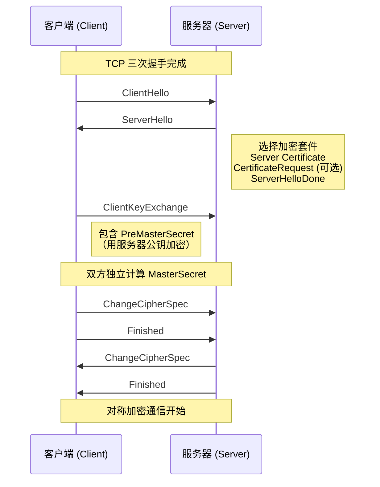
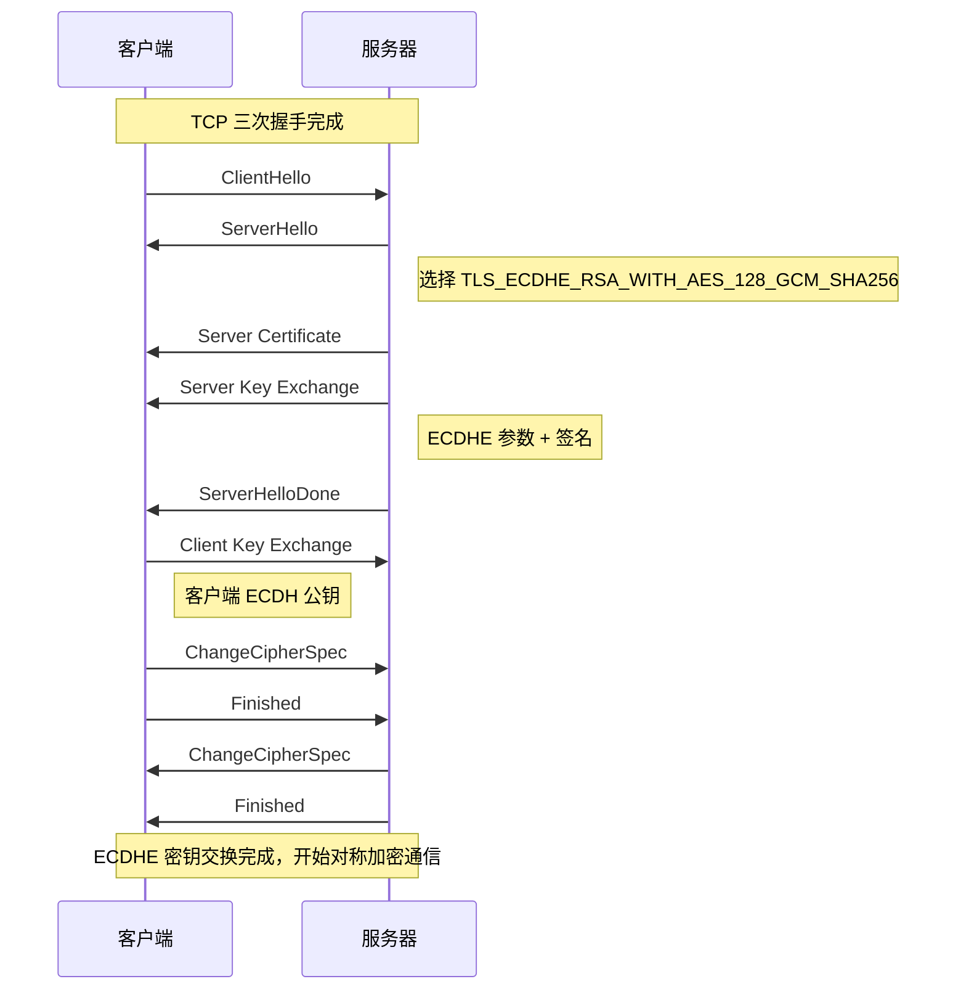
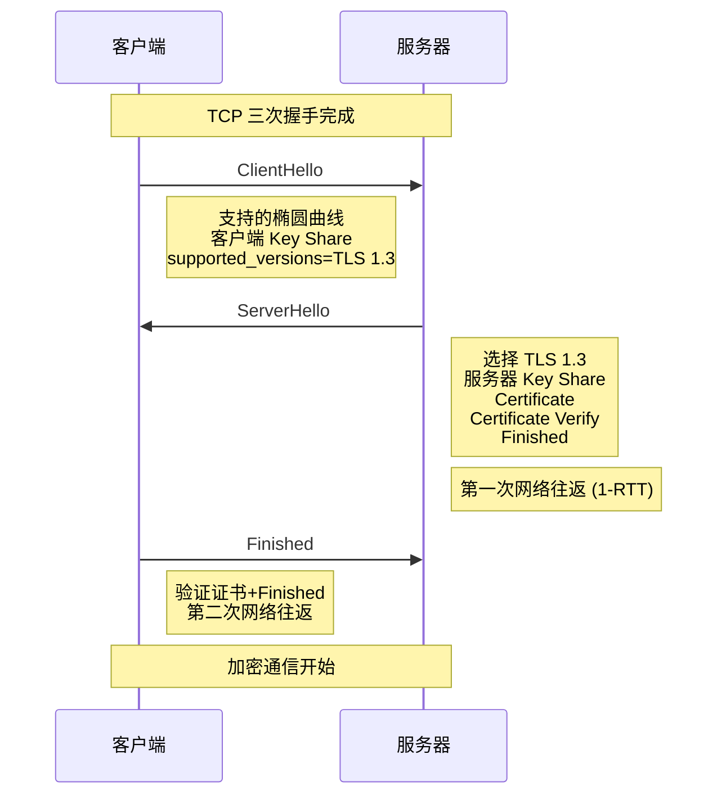
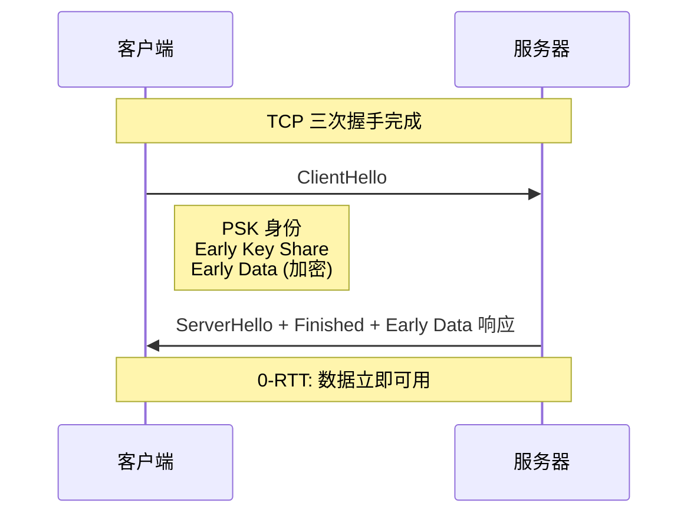
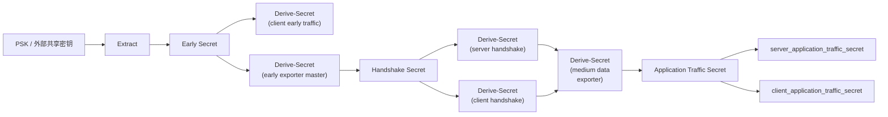
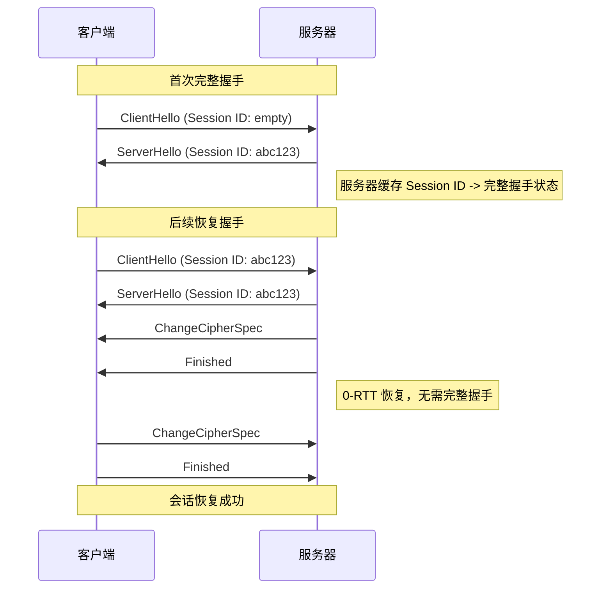
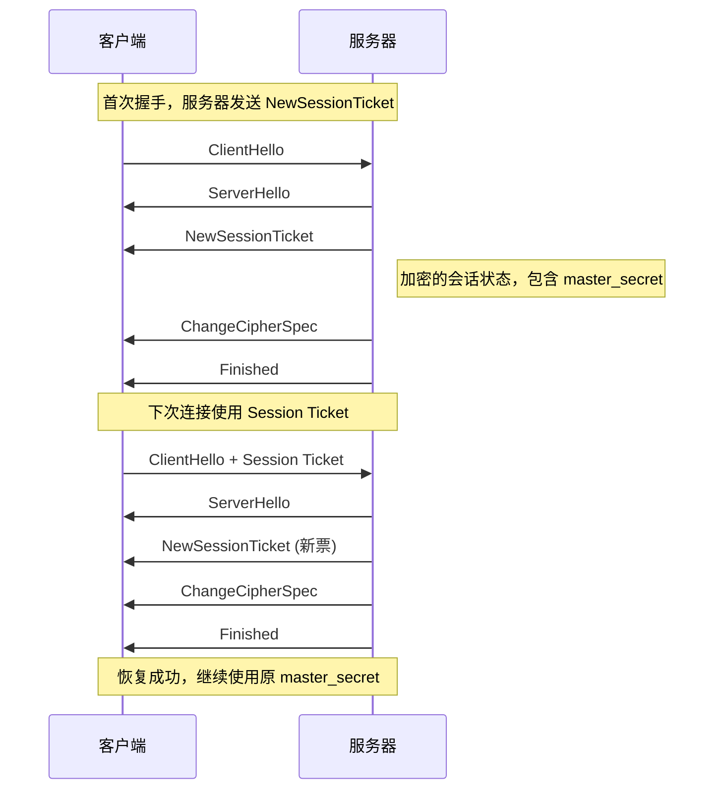
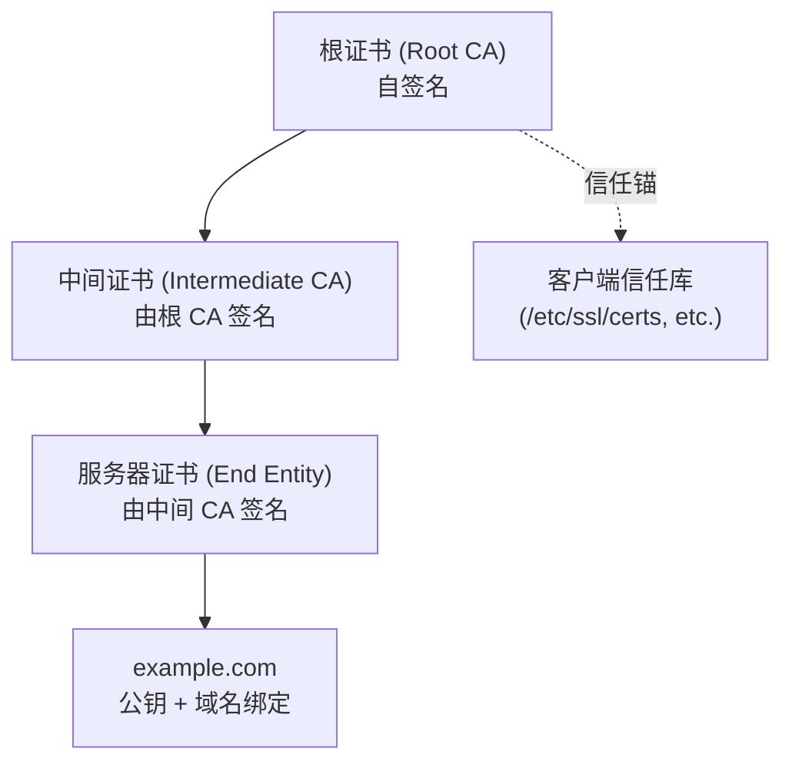
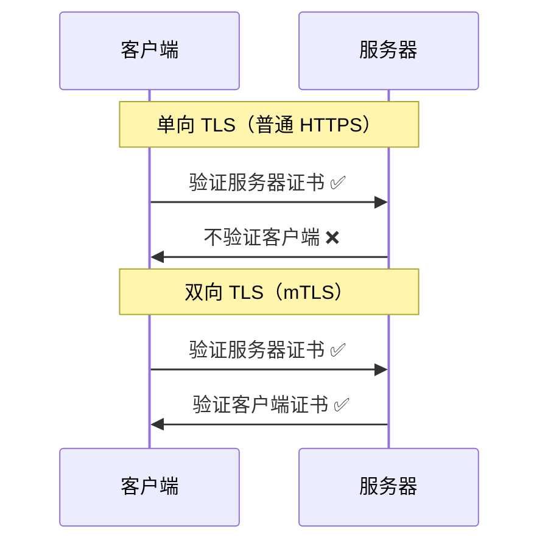

# TLS 深度探索 Ch2: TLS 1.2/1.3 握手流程详解

## 1. TLS 握手概述

### 1.1 为什么需要握手

TCP 是一个面向连接的可靠传输协议，但它不提供任何安全性保障。在 TCP 之上明文传输的数据可以被中间人窃听、篡改。TLS（Transport Layer Security）协议正是为了解决这一问题而设计。

TLS 握手是 TLS 连接建立的核心过程，它完成以下关键任务：

| 任务           | 说明                                           |
| -------------- | ---------------------------------------------- |
| **身份认证**   | 客户端验证服务器证书，确认对方是声称的那个实体 |
| **密钥协商**   | 双方协商产生会话密钥，用于对称加密通信         |
| **算法协商**   | 双方同意使用的加密算法、哈希算法、签名算法等   |
| **完整性保护** | 建立 MAC（Message Authentication Code）密钥    |

```
┌─────────────────────────────────────────────────────────────────────┐
│                        OSI 模型与 TLS 位置                           │
├─────────┬───────────────────┬───────────────────────────────────────┤
│  应用层  │   HTTP, SMTP      │                                        │
├─────────┼───────────────────┼───────────────────────────────────────┤
│  表示层  │   TLS             │  ← TLS 在这一层，提供加密/认证/完整性    │
├─────────┼───────────────────┼───────────────────────────────────────┤
│  会话层  │   TLS Session     │  ← 管理会话状态、握手机制                │
├─────────┼───────────────────┼───────────────────────────────────────┤
│  传输层  │   TCP             │  ← TLS 依赖 TCP 的可靠传输               │
├─────────┼───────────────────┼───────────────────────────────────────┤
│  网络层  │   IP              │                                        │
└─────────┴───────────────────┴───────────────────────────────────────┘
```

### 1.2 握手的核心目标

TLS 握手的本质是一个**密钥交换协议**（Key Exchange Protocol）。在密码学中，密钥交换的核心困难是**前向安全性**（Forward Secrecy）问题：

```
经典问题：Alice 和 Bob 通过不安全的信道通信，如何安全地协商出一个共享密钥？

威胁模型：
  如果攻击者 Eve 记录了所有流量，之后通过某种手段获取了 Alice 的私钥，
  Eve 能否解密历史通信？

  - 如果使用 "静态 RSA 密钥交换"：可以（因为 PreMasterSecret 被 RSA 公钥加密）
  - 如果使用 "DHE/ECDHE 密钥交换"：不可以（即使私钥泄露，历史流量仍安全）
```

TLS 握手的设计围绕以下核心目标：

1. **前向安全性**：使用临时密钥（Ephemeral Key）配合 Diffie-Hellman 交换
2. **身份不可伪造**：使用数字签名绑定身份和密钥材料
3. **抗重放攻击**：使用非cesNonce和序列号
4. **协商灵活性**：支持多种加密算法和密钥交换方案的协商

---

## 2. TLS 1.2 完整握手流程

TLS 1.2 定义在 RFC 5246 中，是目前仍在广泛使用的 TLS 版本。其握手过程根据密钥交换方式的不同，分为**RSA 握手**和**ECDHE 握手**两种模式。

### 2.1 RSA 密钥交换模式

RSA 握手是最简单的一种，其特点是密钥材料由客户端生成，用服务器的 RSA 证书公钥加密后发送。



#### 详细消息流

**1. ClientHello**

客户端发送支持的 TLS 版本、客户端随机数（Client Random）、Session ID（用于恢复）、客户端支持的加密套件列表、压缩方法、扩展列表。

```wireshark
TLS Handshake Protocol: Client Hello
    Version: TLS 1.2
    Random: 8c14...a3f7 (32 bytes)
    Session ID: (empty)
    Cipher Suites (length: 40)
        0xc02f  TLS_ECDHE_RSA_WITH_AES_128_GCM_SHA256
        0xc00c  TLS_ECDHE_RSA_WITH_AES_128_CBC_SHA
        0x0033  TLS_DHE_RSA_WITH_AES_128_CBC_SHA
        0x002f  TLS_RSA_WITH_AES_128_CBC_SHA
        ...
    Extensions:
        server_name: example.com
        elliptic_curves: secp256r1, secp384r1
        ec_point_formats: uncompressed, ansiX962_compressed_prime
```

**2. ServerHello**

服务器从客户端列表中选择一个加密套件，生成服务器随机数（Server Random）。

```c
// 服务器端处理 ClientHello 的简化逻辑
int handle_client_hello(SSL *ssl, ClientHello *ch) {
    // 从客户端支持的加密套件列表中选择第一个服务器也支持的
    for (int i = 0; i < ch->cipher_suites_count; i++) {
        if (is_cipher_supported(ch->cipher_suites[i])) {
            ssl->s3->tmp.new_cipher = ch->cipher_suites[i];
            break;
        }
    }

    // 生成 Server Random
    RAND_bytes(ssl->s3->server_random, 32);

    // 构造 ServerHello
    ServerHello *sh = construct_server_hello(
        TLS_1_2,
        ssl->s3->server_random,
        ch->session_id,  // 可能恢复会话
        ssl->s3->tmp.new_cipher
    );

    send_message(ssl, TLS_HANDSHAKE, sh);
}
```

**3. Server Certificate**

服务器发送自己的证书链（通常是服务器证书 + 中间 CA 证书）。

```
Certificate chain:
    0 certificate: server.example.com
       Signature Algorithm: RSA with SHA256
       Public Key Algorithm: RSA (2048 bits)
    1 certificate: Let's Encrypt Authority X3
       Signature Algorithm: RSA with SHA256
       Public Key Algorithm: RSA (4096 bits)
```

**4. ServerHelloDone**

服务器发送此消息表示 ServerHello 阶段完成。

**5. ClientKeyExchange**

客户端生成 PreMasterSecret（48 字节随机数），用服务器证书的公钥加密后发送。

```python
import RSA
from Crypto.Random import get_random_bytes

def client_key_exchange(cert_server, client_random, server_random):
    # 生成 48 字节的 PreMasterSecret
    premaster_secret = get_random_bytes(48)
    premaster_secret[0:2] = b'\x03\x03'  # TLS 1.2 版本号

    # 用服务器 RSA 公钥加密
    server_pubkey = RSA.import_key(cert_server.public_key)
    encrypted_pms = server_pubkey.encrypt(premaster_secret, None)[0]

    return encrypted_pms
```

**6. MasterSecret 计算**

双方独立从 PreMasterSecret 推导 MasterSecret：

```python
import hmac
import hashlib

def prf(master_secret, label, seed):
    """TLS 1.2 的 PRF (Pseudo-Random Function)"""
    return hmac.new(master_secret, label + seed, hashlib.sha256).digest()

def derive_master_secret(premaster_secret, client_random, server_random):
    seed = client_random + server_random
    label = b'master secret'

    # master_secret = PRF(premaster_secret, "master secret", client_random + server_random)
    master_secret = prf(premaster_secret, label, seed)

    # 进一步派生会话密钥
    key_block = prf(master_secret, b'key expansion',
                    server_random + client_random)

    # 分割出各密钥材料
    client_write_mac_key = key_block[0:32]
    server_write_mac_key = key_block[32:64]
    client_write_key = key_block[64:80]
    server_write_key = key_block[80:96]
    client_write_iv = key_block[96:104]
    server_write_iv = key_block[104:112]

    return {
        'master_secret': master_secret,
        'client_write_mac_key': client_write_mac_key,
        'server_write_mac_key': server_write_mac_key,
        'client_write_key': client_write_key,
        'server_write_key': server_write_key,
        'client_write_iv': client_write_iv,
        'server_write_iv': server_write_iv,
    }
```

### 2.2 ECDHE 密钥交换模式

ECDHE（Elliptic Curve Diffie-Hellman Ephemeral）是目前推荐使用的密钥交换方式，它提供前向安全性。



**Server Key Exchange 消息**

在 ECDHE 模式下，服务器需要发送 ECDHE 临时公钥参数：

```wireshark
TLS Handshake Protocol: Server Key Exchange
    EC Diffie-Hellman Server Params:
        Curve Type: named_curve (secp256r1)
        Named Curve: secp256r1
        Server Public Value: 04d6c7f0...3a8b (65 bytes)
    Signature Algorithm: rsa_pkcs1_sha256
    Signature: 3fa5...8c2d (256 bytes)
```

这条消息用服务器的 RSA 私钥签名，客户端验证签名以确认服务器拥有对应证书私钥。

**ECDHE 密钥推导**

```python
from ecdsa import NIST256p
from Crypto.Hash import SHA256
from Crypto.Signature import pkcs1_v1_5
from Crypto.PublicKey import ECC

def ecdhe_key_derive(client_private, server_public):
    """ECDH 密钥协商"""
    # 客户端生成 (client_private, client_public)
    # 服务器生成 (server_private, server_public)
    # 双方执行 ECDH:

    shared_secret = client_private * server_public
    # shared_secret.x 是双方共享的椭圆曲线点 x 坐标

    return shared_secret.x.to_bytes(32, 'big')

def derive_master_secret_ecdhe(shared_secret, client_random, server_random):
    """使用 ECDHE 时 MasterSecret 的推导"""
    # seed 由客户端/服务器随机数组成
    seed = client_random + server_random

    # 使用 PRF 推导 master secret
    # master_secret = PRF(shared_secret, "master secret", seed)

    # 使用 HKDF（TLS 1.3 使用 HKDF，TLS 1.2 ECDHE 仍用 PRF）
    return hkdf_extract(shared_secret, seed)  # 简化表示
```

### 2.3 两种模式的对比

| 特性                  | RSA 密钥交换                | ECDHE 密钥交换              |
| --------------------- | --------------------------- | --------------------------- |
| **前向安全性**        | ❌ 无（私钥泄露可解密历史） | ✅ 有（使用临时密钥）       |
| **证书用途**          | 仅做身份认证                | 仅做身份认证                |
| **密钥材料来源**      | 客户端生成 PreMasterSecret  | 双方执行 ECDH               |
| **ServerKeyExchange** | 不需要                      | 需要（带签名）              |
| **计算复杂度**        | 较低（一次 RSA 解密）       | 较高（ECDH + RSA 签名验证） |
| **推荐程度**          | ❌ 已废弃（TLS 1.3 移除）   | ✅ 推荐                     |

---

## 3. TLS 1.3 握手流程

TLS 1.3 定义在 RFC 8446 中，相比 TLS 1.2 进行了重大改革：减少了握手延迟（1-RTT 甚至 0-RTT）、移除了不安全的加密算法、强制使用前向安全的密钥交换。

### 3.1 1-RTT 握手（标准模式）

TLS 1.3 将密钥交换和服务器认证合并到同一个消息中：



关键改进：

- 客户端在 ClientHello 中直接发送 Key Share（客户端 ECDH 公钥）
- 服务器在 ServerHello 中直接发送 Key Share（服务器 ECDH 公钥）
- 双方立即计算共享密钥，无需等待额外消息

```wireshark
TLS 1.3 Handshake Protocol: Client Hello
    Version: TLS 1.3
    Random: 8c14...a3f7
    Cipher Suites:
        TLS_AES_128_GCM_SHA256
        TLS_AES_256_GCM_SHA384
        TLS_CHACHA20_POLY1305_SHA256
        TLS_AES_128_CCM_SHA256
    Extensions:
        supported_versions: TLS 1.3
        key_share: 04d6c7f0...3a8b (客户端 ECDH 公钥)
        supported_groups: secp256r1, secp384r1, x25519

TLS 1.3 Handshake Protocol: Server Hello
    Version: TLS 1.3
    Random: a7f3...9c2b
    Cipher Suite: TLS_AES_128_GCM_SHA256
    Extensions:
        key_share: 04e8b7d1...5f3a (服务器 ECDH 公钥)
        supported_versions: TLS 1.3
```

### 3.2 0-RTT 握手（Early Data）

TLS 1.3 允许客户端在第一次握手中就发送加密的应用数据（0-RTT），但这带来重放攻击风险。



**0-RTT 的工作原理**

```python
# 客户端：使用 PSK（Pre-Shared Key）加密 Early Data
def build_0rtt_client_hello(psk, psk_identity, client_early_secret):
    # 从 PSK 派生 early traffic keys
    early_key = hkdf_expand_label(
        client_early_secret,
        b'early traffic key',
        b'',  # context
        16  # AES-128-GCM key length
    )

    # 使用 early_key 加密应用数据
    early_data = encrypt_early_data(application_data, early_key)

    return ClientHello(
        psk_identity=psk_identity,
        early_data=early_data
    )
```

**0-RTT 的安全限制**

```
⚠️  0-RTT 数据重放攻击风险

攻击场景：
1. 客户端获取 PSK 后，发送订单 "Buy 1000 shares of X" (加密)
2. 攻击者窃听并重放此消息
3. 服务器收到重复的订单请求

根本原因：PSK 没有抗重放机制，不像 TCP 序列号或 TLS 记录号

缓解措施：
- 服务器实现幂等性检查
- 使用301重定向让 GET 请求可缓存
- 对 GET 请求禁用 0-RTT（RFC 9001）
```

### 3.3 PSK 与 Early Data

TLS 1.3 中的 PSK（Pre-Shared Key）有两种来源：

1. **PSK 通过会话恢复获得**：之前握手中建立的共享密钥
2. **外置 PSK（External PSK）**：通过带外方式预先配置的密钥

```wireshark
TLS 1.3 Handshake Protocol: Client Hello
    Extensions:
        pre_shared_key:
            identities: [psk_identity_1, psk_identity_2]
            binders: [binder_1, binder_2]  # 验证 PSK 拥有者
```

```c
// TLS 1.3 Early Secret 推导
void derive_early_secrets(ExternalPSK *psk) {
    // early_secret = Derive-Secret(PSK, "early data", "")
    early_secret = TLS13 DeriveSecret(psk, "early data", empty_hash);

    // 派生 early traffic keys
    early_write_key = HKDF_Expand_Label(
        early_secret, "early data key", "", key_length
    );
}
```

### 3.4 TLS 1.3 密钥推导体系

TLS 1.3 使用 HKDF（HMAC-based Key Derivation Function）构建了一套完整的密钥推导架构：



```python
import hashlib
import hmac

def hkdf_extract(salt, ikm):
    """HKDF-Extract: 从 PSK 和 ECDH 共享密钥提取伪随机密钥"""
    if salt is None:
        salt = b'\x00' * 32
    return hmac.new(salt, ikm, hashlib.sha256).digest()

def hkdf_expand_label(prk, label, context, length):
    """HKDF-Expand-Label: 派生特定用途的密钥"""
    # struct {
    #     uint16 length = length;
    #     opaque label<7..255> = "tls13 " + label;
    #     opaque context<0..255> = context;
    # } HKLDFLabel;

    hkdf_label = bytes([length]) + b'tls13 ' + label + bytes([len(context)]) + context
    return hmac.new(prk, hkdf_label, hashlib.sha256).digest()[:length]

def tls13_derive_secret(secret, label, transcript_hash):
    """TLS 1.3 Derive-Secret"""
    return hkdf_expand_label(secret, label, transcript_hash, 32)
```

---

## 4. TLS 1.2 vs TLS 1.3 对比

### 4.1 延迟对比

```
TLS 1.2 ECDHE 握手 (2-RTT + TCP):

    Client          Server
       │               │
       │──TCP SYN──────>│
       │<─────SYN ACK──│
       │──TCP ACK─────>│
       │               │  ← TCP 握手完成 (1 RTT)
       │──ClientHello─>│
       │<─ServerHello──│
       │<─Certificate──│
       │<─ServerKeyEx─>│
       │<─HelloDone────│  ← 服务器处理完成 (1 RTT)
       │──ClientKeyEx─>│
       │──ChangeCipherSpec──>│
       │──Finished────>│
       │<─ChangeCipherSpec──│
       │<─Finished────│
       │               │  ← 握手完成 (2 RTT 握手 + 1 TCP)
       │<─加密通信───────>│

TLS 1.3 1-RTT 握手:

    Client          Server
       │               │
       │──TCP SYN──────>│
       │<─────SYN ACK──│
       │──TCP ACK─────>│
       │               │  ← TCP 握手完成 (1 RTT)
       │──ClientHello─>│  ← 包含 Key Share
       │<─ServerHello──│  ← 包含 Key Share
       │<─Certificate──│
       │<─Finished────│  ← 服务器处理完成 (1 RTT)
       │──Finished────>│
       │               │  ← 握手完成 (1 RTT 握手 + 1 TCP)
       │<─加密通信───────>│
```

### 4.2 核心差异一览

| 特性                | TLS 1.2           | TLS 1.3             | 改进说明                           |
| ------------------- | ----------------- | ------------------- | ---------------------------------- |
| **最小握手 RTT**    | 2-RTT             | 1-RTT               | 减少网络延迟                       |
| **0-RTT 支持**      | ❌ 不支持         | ✅ 支持             | 允许 early data                    |
| **密钥交换算法**    | RSA, DHE, ECDHE   | 仅 ECDHE            | 强制前向安全                       |
| **证书加密算法**    | RSA, DSA          | 仅 ECDSA (PQC 预留) | 提升安全性                         |
| **对称加密算法**    | 3DES, AES-CBC     | AES-GCM, ChaCha20   | 移除 CBC 模式（防范 BEAST 等攻击） |
| **Hash 算法**       | MD5, SHA1, SHA256 | SHA256, SHA384      | 移除不安全的算法                   |
| **压缩**            | ✅ 支持           | ❌ 移除             | 防范 CRIME 等攻击                  |
| **Session ID 恢复** | ✅ 支持           | ❌ 被 PSK 替代      | 更简洁的恢复机制                   |
| **Renegotiation**   | ✅ 支持           | ❌ 移除             | 防范REN-ATTACK                     |
| **Fallba**          | ✅ 支持           | ❌ 移除             | 防止协议降级攻击                   |

### 4.3 安全特性对比

```
TLS 1.3 移除的不安全特性：

┌─────────────────────────────────────────────────────────────┐
│                    已被移除的 TLS 1.2 特性                     │
├──────────────────┬──────────────────────────────────────────┤
│ RSA 密钥交换      │  无法提供前向安全，已废弃                   │
│ 3DES 加密        │  64-bit 块大小，易受 birthday attack      │
│ AES-CBC          │  易受 Padding Oracle 攻击                  │
│ RC4              │  存在偏差攻击，已废弃                       │
│ MD5              │  碰撞攻击                                  │
│ SHA1             │  碰撞攻击                                 │
│ TLS 压缩         │  CRIME 攻击                               │
│ TLS 1.2 Renego   │  Renego 攻击                              │
│ Export 加密套件   │  强度不足，易被破解                       │
│ SSL 2.0/3.0      │  POODLE 等攻击                            │
└──────────────────┴──────────────────────────────────────────┘
```

---

## 5. Session Resumption

Session Resumption（会话恢复）允许客户端复用之前建立的会话，避免完整的握手机制，从而减少延迟和计算开销。

### 5.1 Session ID 方式（TLS 1.2）

Session ID 方式在 TLS 1.2 中广泛使用：



```c
// OpenSSL 会话缓存结构
struct ssl_session_st {
    int ssl_version;              // TLS 版本
    unsigned char master_key[48]; // Master Secret
    SSL_CIPHER *cipher;           // 加密套件
    struct sess_cert_st *sess_cert; // 证书链

    // Session ID 用于恢复
    unsigned char session_id[32];
    int session_id_length;

    // 过期时间
    time_t timeout;
    time_t time;
};
```

### 5.2 Session Ticket 方式（TLS 1.2 / 1.3 PSK）

Session Ticket 方式将会话状态加密后交给客户端保管：



```python
import hmac
import hashlib
from Crypto.Cipher import AES
from Crypto.Util.number import bytes_to_long

def create_session_ticket(master_secret, session_state, ticket_age_add=0):
    """创建 Session Ticket（服务器端）"""
    # 构造会话状态
    state = session_state + struct.pack('>I', ticket_age_add)

    # 使用 master_secret 作为密钥
    key = hmac.new(b'session ticket ticket', master_secret, hashlib.sha256).digest()[:32]

    # AES-256-GCM 加密
    cipher = AES.new(key, AES.MODE_GCM)
    ciphertext, tag = cipher.encrypt_and_digest(state)

    return ciphertext + tag

def decrypt_session_ticket(master_secret, ticket):
    """解密 Session Ticket"""
    key = hmac.new(b'session ticket ticket', master_secret, hashlib.sha256).digest()[:32]

    # 分离 ciphertext 和 tag
    ciphertext = ticket[:-16]
    tag = ticket[-16:]

    cipher = AES.new(key, AES.MODE_GCM)
    state = cipher.decrypt_and_verify(ciphertext, tag)

    return parse_session_state(state)
```

### 5.3 TLS 1.3 PSK 恢复

TLS 1.3 统一使用 PSK 机制进行会话恢复：

```wireshark
TLS 1.3 Client Hello with PSK
    Extension: pre_shared_key
        identities (length: 58)
        identities[0]:
            obfuscated_ticket_age: 300
            identity: 8a3d...7f2c (Session Ticket)
        binders (length: 48)
        binders[0]: 6b9d...2e8f (HKDF tag)
```

```python
def tls13_session_recovery(psk, transcript_hash):
    """TLS 1.3 会话恢复密钥推导"""
    # binder_key = Derive-Secret(PSK, "resumption binder", "")
    binder_key = tls13_derive_secret(psk, "resumption binder", b'')

    # 验证 binder
    expected_binder = hkdf_expand_label(binder_key, "tbinder", b'', 32)

    # derived_secret = Derive-Secret(PSK, "resumed psk", "")
    derived_secret = tls13_derive_secret(psk, "resumed psk", transcript_hash)

    # application_traffic_secret = Derive-Secret(derived_secret, "traffic upd", "")
    application_traffic_secret = tls13_derive_secret(
        derived_secret, "traffic upd", transcript_hash
    )

    return application_traffic_secret
```

### 5.4 三种恢复方式对比

| 特性             | Session ID            | Session Ticket        | TLS 1.3 PSK         |
| ---------------- | --------------------- | --------------------- | ------------------- |
| **状态存储位置** | 服务器                | 客户端（加密）        | 客户端              |
| **无状态服务器** | ❌ 否                 | ✅ 是                 | ✅ 是               |
| **首次握手开销** | 正常                  | 正常                  | 正常                |
| **恢复握手 RTT** | 1-RTT                 | 1-RTT                 | 1-RTT（可选 0-RTT） |
| **密钥材料**     | master_secret         | master_secret（加密） | PSK                 |
| **重连前向安全** | ❌ 复用 master_secret | ❌ 复用 master_secret | ⚠️ 可选维持         |
| **Ticket 轮换**  | 无                    | 有（新 Ticket）       | 有                  |

---

## 6. 证书认证流程

### 6.1 PKI 证书链

TLS 证书基于 X.509 PKI（Public Key Infrastructure），形成一条从根证书到终端实体证书的信任链：



**证书验证步骤**

```python
from cryptography import x509
from cryptography.hazmat.backends import default_backend
from cryptography.hazmat.primitives import hashes
import datetime

def verify_certificate_chain(cert_chain, trusted_certs):
    """
    验证证书链的完整性和有效性

    cert_chain: [服务器证书, 中间证书1, 中间证书2, ...]
    trusted_certs: 信任的根证书列表
    """
    # 1. 构建证书链
    store = x509.verification.Store(trusted_certs)

    # 2. 验证证书签名
    for i in range(len(cert_chain) - 1):
        issuer_cert = cert_chain[i + 1]
        subject_cert = cert_chain[i]

        # 使用颁发者公钥验证签名
        try:
            subject_cert.issuer_public_key().verify(
                subject_cert.signature,
                subject_cert.tbs_certificate_bytes,
                hashes.SHA256()
            )
        except InvalidSignature:
            raise CertificateVerificationError(
                f"签名验证失败: {subject_cert.subject}"
            )

    # 3. 验证证书有效性（时间、域名等）
    current_time = datetime.datetime.now()

    for cert in cert_chain:
        if cert.not_valid_before <= current_time <= cert.not_valid_after:
            pass  # 有效期验证通过
        else:
            raise CertificateExpiredError(
                f"证书已过期或尚未生效: {cert.subject}"
            )

        # 4. 验证域名
        if cert.subject.get_attribute_for_oid(x509.oid.NameOID.COMMON_NAME):
            common_name = cert.subject.get_attributes_for_oid(
                x509.oid.NameOID.COMMON_NAME
            )[0].value
            # 检查域名匹配

    return True
```

### 6.2 自签名证书

自签名证书是指由实体自己签名（而非由 CA 签名）的证书，常用于开发测试、内网环境。

```bash
# 使用 OpenSSL 创建自签名证书
openssl req -x509 \
    -newkey ec \
    -pkeyopt ec_paramgen_curve:secp384r1 \
    -keyout server.key \
    -out server.crt \
    -days 365 \
    -nodes \
    -subj "/C=CN/ST=Beijing/L=Beijing/O=Example/CN=example.com"
```

```wireshark
X.509 Certificate Info
    Certificate:
        Data:
            Version: 3 (0x2)
            Serial Number: 7a3d...4e2f (16 bytes)
            Signature Algorithm: ecdsa_with_SHA384
            Issuer: CN=example.com, O=Example, L=Beijing, ST=Beijing, C=CN
            Validity:
                Not Before: 2024-01-01 00:00:00
                Not After: 2024-12-31 23:59:59
            Subject: CN=example.com, O=Example, L=Beijing, ST=Beijing, C=CN
            Subject Public Key Info:
                Public Key Algorithm: id-ecPublicKey
                EC Public Key: secp384r1 (384 bit)
```

### 6.3 根证书注入场景

在企业内网环境中，可能需要导入自定义根证书以实现 HTTPS 流量监控（MITM）：

```bash
# 导入根证书到系统信任库（Linux）
sudo cp myca.crt /usr/local/share/ca-certificates/
sudo update-ca-certificates

# 导入到 Java  keystore
sudo keytool -importcert -trustcacerts \
    -alias myca \
    -file myca.crt \
    -keystore $JAVA_HOME/lib/security/cacerts \
    -storepass changeit

# 导入到 Firefox（使用 NSS）
certutil -A -n myca -t "C,c,c" -d ~/.mozilla/firefox/*.default
```

```python
# Python 中验证证书链
import ssl
import certifi

context = ssl.create_default_context()
context.load_verify_locations(certifi.where())

# 使用自定义 CA
context.load_verify_locations('/path/to/custom-ca.crt')

# 验证连接
with context.wrap_socket(socket.socket(), server_hostname='example.com') as sock:
    cert = sock.getpeercert()
    print(cert['subject'])
```

---

## 7. Certificate Request（双向 TLS / mTLS）

### 7.1 双向认证概述

默认情况下，TLS 只验证服务器身份（单向 TLS）。在某些高安全场景下，需要双向验证：服务器也验证客户端证书。



### 7.2 mTLS 握手流程

```mireshark
ServerHello
    ...
Certificate
CertificateRequest  ← 服务器请求客户端证书
    Certificate Types: RSA Sign, ECDSA Sign
    Supported Signature Algorithms: rsa_pkcs7_sha256, ecdsa_sha256, ...
    Distinguished Names:
        (root-ca-1.example.com)
        (intermediate-ca.example.com)
ServerKeyExchange
ServerHelloDone

ClientKeyExchange
    Certificate
    CertificateVerify
    ← 客户端用私钥签名整个握手历史
```

### 7.3 CertificateVerify 消息

客户端使用自己的私钥对整个握手消息的哈希值进行签名，服务器用客户端证书公钥验证：

```python
import hmac
import hashlib

def create_certificate_verify(private_key, handshake_messages_hash):
    """
    创建 CertificateVerify 消息

    签名内容 = Hash(handshake_messages)
              (使用 TLS 1.2 的 PRF 或 TLS 1.3 的 Transcript Hash)
    """
    signature_input = b'TLS 1.2, CertificateVerify' + handshake_messages_hash

    # 使用客户端私钥签名
    signature = private_key.sign(
        signature_input,
        padding.PKCS1v15(),
        hashes.SHA256()
    )

    return signature

def verify_certificate_verify(cert_public_key, signature, handshake_messages_hash):
    """验证 CertificateVerify"""
    signature_input = b'TLS 1.2, CertificateVerify' + handshake_messages_hash

    try:
        cert_public_key.verify(
            signature,
            signature_input,
            padding.PKCS1v15(),
            hashes.SHA256()
        )
        return True
    except InvalidSignature:
        return False
```

### 7.4 mTLS 典型应用场景

| 场景             | 说明                              |
| ---------------- | --------------------------------- |
| **企业内部系统** | 员工使用客户端证书访问敏感系统    |
| **API 认证**     | 微服务之间使用 mTLS 做双向认证    |
| **VPN**          | OpenVPN、WireGuard 等使用证书认证 |
| **IoT 设备**     | 设备证书管理大规模设备身份        |

```bash
# OpenSSL 创建双向认证测试环境

# 1. 创建 CA
openssl genrsa -out ca.key 4096
openssl req -x509 -new -nodes -key ca.key -sha256 -out ca.crt \
    -subj "/C=CN/O=Test CA/CN=Test CA"

# 2. 创建服务器证书
openssl genrsa -out server.key 2048
openssl req -new -key server.key -out server.csr \
    -subj "/C=CN/O=Server/CN=localhost"
openssl x509 -req -in server.csr -CA ca.crt -CAkey ca.key \
    -CAcreateserial -out server.crt -days 365 -sha256

# 3. 创建客户端证书
openssl genrsa -out client.key 2048
openssl req -new -key client.key -out client.csr \
    -subj "/C=CN/O=Client/CN=Test Client"
openssl x509 -req -in client.csr -CA ca.crt -CAkey ca.key \
    -CAcreateserial -out client.crt -days 365 -sha256

# 4. 验证 mTLS 连接
openssl s_server \
    -cert server.crt -key server.key \
    -CAfile ca.crt \
    -verify 2 \
    -accept 8443

openssl s_client \
    -cert client.crt -key client.key \
    -CAfile ca.crt \
    -connect localhost:8443
```

---

## 8. 握手中的加密套件协商

### 8.1 加密套件结构

TLS 加密套件命名格式：`TLS_密钥交换_认证算法_WITH_加密算法_MAC算法`

例如 `TLS_ECDHE_RSA_WITH_AES_128_GCM_SHA256`：

- **密钥交换**：ECDHE（前向安全密钥交换）
- **认证算法**：RSA（服务器证书使用 RSA 签名）
- **加密算法**：AES-128-GCM（对称加密，Galois/Counter Mode）
- **MAC 算法**：SHA256（用于 TLS 记录层完整性保护）

### 8.2 TLS 1.2 常用加密套件

| 加密套件                                | 密钥交换 | 加密        | MAC         | 安全评级  |
| --------------------------------------- | -------- | ----------- | ----------- | --------- |
| TLS_RSA_WITH_AES_128_CBC_SHA            | RSA      | AES-128-CBC | HMAC-SHA1   | ⚠️ 已废弃 |
| TLS_RSA_WITH_AES_256_CBC_SHA            | RSA      | AES-256-CBC | HMAC-SHA1   | ⚠️ 已废弃 |
| TLS_DHE_RSA_WITH_AES_128_CBC_SHA        | DHE      | AES-128-CBC | HMAC-SHA1   | ⚠️ 已废弃 |
| TLS_ECDHE_RSA_WITH_AES_128_CBC_SHA      | ECDHE    | AES-128-CBC | HMAC-SHA1   | ⚠️ 不推荐 |
| TLS_ECDHE_RSA_WITH_AES_128_GCM_SHA256   | ECDHE    | AES-128-GCM | GMAC-SHA256 | ✅ 安全   |
| TLS_ECDHE_RSA_WITH_AES_256_GCM_SHA384   | ECDHE    | AES-256-GCM | GMAC-SHA384 | ✅ 安全   |
| TLS_ECDHE_ECDSA_WITH_AES_128_GCM_SHA256 | ECDHE    | AES-128-GCM | GMAC-SHA256 | ✅ 安全   |

### 8.3 TLS 1.3 加密套件

TLS 1.3 大幅简化了加密套件，格式变为：`TLS_加密算法_强度_GCM模式_HMAC算法`

| 加密套件                     | 加密              | 强度    | AEAD | 可用性       |
| ---------------------------- | ----------------- | ------- | ---- | ------------ |
| TLS_AES_128_GCM_SHA256       | AES-128-GCM       | 128-bit | ✅   | 通用         |
| TLS_AES_256_GCM_SHA384       | AES-256-GCM       | 256-bit | ✅   | 高安全       |
| TLS_CHACHA20_POLY1305_SHA256 | ChaCha20-Poly1305 | 256-bit | ✅   | 移动设备优先 |
| TLS_AES_128_CCM_SHA256       | AES-128-CCM       | 128-bit | ✅   | IoT 受限环境 |
| TLS_AES_128_CCM_8_SHA256     | AES-128-CCM-8     | 128-bit | ✅   | 特殊场景     |

### 8.4 OpenSSL 加密套件协商配置

```bash
# 查看 OpenSSL 支持的加密套件
openssl ciphers -v 'ALL:@SECLEVEL=0'

# 推荐配置（优先前向安全）
# 使用 ECDHE + AES-GCM，按强度排序
openssl ciphers -v 'EECDH+CHACHA20:EDH+CHACHA20:EECDH+AESGCM:EDH+AESGCM:+AES256:+AES128:+3DES:!aNULL:!MD5:!EXP:!LOW:!RC4:!SEED:!IDEA:!MEDIUM'

# TLS 1.3 专用套件
openssl ciphers -v -tls1_3 'TLS_AES_256_GCM_SHA384:TLS_CHACHA20_POLY1305_SHA256:TLS_AES_128_GCM_SHA256'
```

```nginx
# Nginx TLS 配置示例
server {
    listen 443 ssl http2;
    server_name example.com;

    ssl_certificate /path/to/cert.pem;
    ssl_certificate_key /path/to/key.pem;
    ssl_trusted_certificate /path/to/ca-chain.pem;

    # TLS 版本
    ssl_protocols TLSv1.2 TLSv1.3;

    # 加密套件配置
    ssl_ciphers 'ECDHE-ECDSA-AES128-GCM-SHA256:ECDHE-ECDSA-AES256-GCM-SHA384:ECDHE-ECDSA-CHACHA20-POLY1305:ECDHE-RSA-AES128-GCM-SHA256:ECDHE-RSA-AES256-GCM-SHA384';

    ssl_prefer_server_ciphers on;

    # Session 配置
    ssl_session_cache shared:SSL:10m;
    ssl_session_tickets on;
    ssl_session_timeout 1d;
}
```

```go
// Go TLS 配置示例
package main

import (
    "crypto/tls"
    "net/http"
)

func main() {
    srv := &http.Server{
        TLSConfig: &tls.Config{
            // 允许的 TLS 版本
            MinVersion: tls.VersionTLS12,
            MaxVersion: tls.VersionTLS13,

            // 优先顺序
            PreferServerCipherSuites: true,

            // 加密套件（TLS 1.3 不支持配置，Go 自动选择最佳套件）
            // TLS 1.2 套件
            CipherSuites: []uint16{
                tls.TLS_ECDHE_RSA_WITH_AES_128_GCM_SHA256,
                tls.TLS_ECDHE_RSA_WITH_AES_256_GCM_SHA384,
                tls.TLS_ECDHE_ECDSA_WITH_AES_128_GCM_SHA256,
                tls.TLS_ECDHE_ECDSA_WITH_AES_256_GCM_SHA384,
                tls.TLS_ECDHE_RSA_WITH_CHACHA20_POLY1305,
                tls.TLS_ECDHE_ECDSA_WITH_CHACHA20_POLY1305,
            },

            // 曲线偏好
            CurvePreferences: []tls.CurveID{
                tls.X25519,     // x25519
                tls.CurveP256,  // secp256r1
                tls.CurveP384,  // secp384r1
            },

            // Session Resumption
            SessionTicketsDisabled: false,
            SessionTicketKey: [32]byte{/* 随机密钥 */},
        },
    }
}
```

---

## 9. Wireshark 抓包分析

### 9.1 TLS 1.2 抓包分析

使用 Wireshark 捕获 TLS 1.2 ECDHE 握手：

```wireshark
Frame 1: TCP SYN
    10.0.0.1.52341 > 93.184.216.34.443: Flags [S]

Frame 2: TCP SYN-ACK
    93.184.216.34.443 > 10.0.0.1.52341: Flags [S.], seq 0

Frame 3: TCP ACK
    10.0.0.1.52341 > 93.184.216.34.443: Flags [A]

Frame 4: TLS 1.2 Client Hello
    Transport Layer Security
    TLS Record Layer: Handshake Protocol: Client Hello
        Content Type: Handshake (22)
        Version: TLS 1.2 (0x0303)
        Length: 512
        Handshake Protocol: Client Hello
            Version: TLS 1.2 (0x0303)
            Random: 8c14c0c9...a3f7e8d2
            Session ID: (empty)
            Cipher Suites Length: 40
            Cipher Suites (10 suites)
                0xc02f TLS_ECDHE_RSA_WITH_AES_128_GCM_SHA256
                0xc02c TLS_ECDHE_ECDSA_WITH_AES_128_GCM_SHA256
                0x009e TLS_DHE_RSA_WITH_AES_128_GCM_SHA256
                ...
            Compression Methods: 1 method
                0x00 (no compression)
            Extensions Length: 247
            Extension: server_name
                Type: server_name (0x0000)
                Length: 16
                Server Name Indication: example.com
            Extension: elliptic_curves
                Type: elliptic_curves (0x000a)
                Length: 10
                Curves: secp256r1, secp384r1, secp521r1, ...
            Extension: ec_point_formats
                Type: ec_point_formats (0x000b)
                Length: 2
                EC point formats: uncompressed

Frame 5: TLS 1.2 Server Hello
    TLS Record Layer: Handshake Protocol: Server Hello
        Content Type: Handshake (22)
        Version: TLS 1.2 (0x0303)
        Handshake Protocol: Server Hello
            Version: TLS 1.2 (0x0303)
            Random: a7f3c891...9c2b4e8d
            Session ID: 5d34a7c3...
            Cipher Suite: TLS_ECDHE_RSA_WITH_AES_128_GCM_SHA256 (0xc02f)
            Compression Method: no compression (0x00)

Frame 6: TLS 1.2 Certificate
    TLS Record Layer: Handshake Protocol: Certificate
        Certificates Length: 3426
        Certificate Chain: 3 certificates
            Certificate[0]: example.com (RSA 2048)
            Certificate[1]: Let's Encrypt Authority X3
            Certificate[2]: DST Root CA X3

Frame 7: TLS 1.2 Server Key Exchange (ECDHE)
    TLS Record Layer: Handshake Protocol: Server Key Exchange
        Handshake Type: Server Key Exchange (12)
        EC Diffie-Hellman Server Params
            Curve Type: named_curve (0x0002)
            Named Curve: secp256r1 (0x0017)
            Server Public Value: 04d6c7f0...3a8b
        Signature Algorithm: rsa_pkcs1_sha256 (0x0401)
        Signature: 3fa5b8c2...8c2d

Frame 8: TLS 1.2 Server Hello Done
    TLS Record Layer: Handshake Protocol: Server Hello Done
        Handshake Type: Server Hello Done (14)

Frame 9: TLS 1.2 Client Key Exchange
    TLS Record Layer: Handshake Protocol: Client Key Exchange
        Handshake Type: Client Key Exchange (16)
        Client ECDH Public Value: 04e8b7d1...5f3a

Frame 10: TLS 1.2 Change Cipher Spec
    TLS Record Layer: Change Cipher Spec Protocol
        Content Type: Change Cipher Spec (20)

Frame 11: TLS 1.2 Finished (加密)
    TLS Record Layer: Handshake Protocol: Finished
        Encrypted Handshake Message: 3a7f2c1d...

Frame 12-13: Server Change Cipher Spec + Finished
    ...
```

### 9.2 TLS 1.3 抓包分析

TLS 1.3 握手的关键特征是加密从 ServerHello 后开始：

```wireshark
Frame 4: TLS 1.3 Client Hello
    TLS Record Layer: Handshake Protocol: Client Hello
        Content Type: Handshake (22)
        Version: TLS 1.3 (0x0303)
        Handshake Protocol: Client Hello
            Version: TLS 1.3 (0x0303)
            Random: 8c14c0c9...a3f7e8d2
            Cipher Suites: TLS_AES_128_GCM_SHA256, TLS_CHACHA20_POLY1305_SHA256
            Extension: supported_versions (TLS 1.3)
            Extension: key_share (16 bytes)
                Key Share Entry:
                    Group: x25519 (0x001d)
                    Key Exchange: 04a7f3c8...2e8d (32 bytes)
            Extension: supported_groups
                Groups: x25519, secp256r1, secp384r1

Frame 5: TLS 1.3 Server Hello
    TLS Record Layer: Handshake Protocol: Server Hello
        Content Type: Handshake (22)
        Version: TLS 1.3 (0x0303)
        Handshake Protocol: Server Hello
            Version: TLS 1.3 (0x0303)
            Random: b7c8a9d1...3e2f1c7a
            Cipher Suite: TLS_AES_128_GCM_SHA256
            Extension: key_share
                Key Share Entry:
                    Group: x25519
                    Key Exchange: 04d8e7f1...1c9a (32 bytes)
            Extension: supported_versions (TLS 1.3)

Frame 6-9: TLS 1.3 加密消息
    TLS Record Layer: Application Data Protocol: TLS 1.3
        Encrypted Application Data: a7f3c8d2...
    TLS Record Layer: Handshake Protocol: Finished
        Content Type: Handshake (22)
        Version: TLS 1.3 (0x0303)
        Encrypted Handshake Message: 3a7f2c1d...
```

### 9.3 0-RTT 抓包特征

```wireshark
Frame 4: TLS 1.3 Client Hello with Early Data
    TLS Record Layer: Handshake Protocol: Early Data (23)
        Content Type: Early Data (23)
        Version: TLS 1.3
        Length: 67
        Early Data: 3fa5b8c2...  ← 加密的 application data

    TLS Record Layer: Handshake Protocol: Client Hello
        Handshake Type: Client Hello (1)
        Extension: pre_shared_key
            Identities: [identity: 8a3d...7f2c]
            Identity Hints: 300 (ms)

Frame 5: TLS 1.3 Server Hello + Early Data Reply
    TLS Record Layer: Handshake Protocol: Server Hello
    TLS Record Layer: Application Data Protocol: TLS 1.3
        Encrypted Application Data: b7c8d1e2...
```

### 9.4 Wireshark TLS 过滤技巧

```bash
# 基本过滤
tls                                  # 显示所有 TLS 记录
tls.handshake.type == 1             # 只显示 Client Hello
tls.handshake.type == 2             # 只显示 Server Hello

# TLS 版本过滤
tls.version == "0x0303"             # TLS 1.2
tls.version == "0x0304"             # TLS 1.3

# 加密套件过滤
tls.handshake.ciphersuite == 0xc02f # ECDHE-RSA-AES128-GCM

# 域名过滤
tls.handshake.extensions_server_name == "example.com"

# 握手消息过滤
tls.handshake.type == 11 && tls.handshake.cert_type == 1  # 证书消息
tls.handshake.type == 12                        # Server Key Exchange
tls.handshake.type == 13                        # Server Hello Done
tls.handshake.type == 14                        # Certificate Request
tls.handshake.type == 15                        # Server Hello Done
tls.handshake.type == 16                        # Certificate Verify

# 完整握手跟踪
tls.stream eq 0                                  # 握手流 0
```

```python
# 使用 scapy 解析 TLS 握手
from scapy.all import *
from scapy.layers.tls.all import *

def parse_tls_handshake(packets):
    """解析 TLS 握手"""
    for pkt in packets:
        if pkt.haslayer(TLS):
            tls_layer = pkt[TLS]

            if tls_layer.haslayer(TLSClientHello):
                print(f"Client Hello: {tls_layer[TLSClientHello].version}")
                print(f"Cipher Suites: {tls_layer[TLSClientHello].cipher_suites}")

            elif tls_layer.haslayer(TLSServerHello):
                print(f"Server Hello: {tls_layer[TLSServerHello].cipher}")

            elif tls_layer.haslayer(TLSCertificate):
                certs = tls_layer[TLSCertificate].certificates
                for cert in certs:
                    print(f"Certificate: {cert.id}")
```

---

## 10. OpenSSL s_client/s_server 模拟握手

### 10.1 基本 TLS 连接

```bash
# 使用 OpenSSL 连接 HTTPS 网站
openssl s_client -connect example.com:443 -tls1_2

# 显示完整握手过程
openssl s_client -connect example.com:443 -tls1_2 -state -debug

# 显示证书信息
openssl s_client -connect example.com:443 -showcerts

# 断开后的重连测试
echo "GET / HTTP/1.1\r\nHost: example.com\r\n\r\n" | \
    openssl s_client -connect example.com:443 -tls1_2
```

### 10.2 TLS 1.3 连接测试

```bash
# TLS 1.3 连接（默认版本）
openssl s_client -connect example.com:443 -tls1_3

# 强制 TLS 1.3 并显示密钥
openssl s_client -connect example.com:443 -tls1_3 \
    -keylogfile /tmp/ssl_keys.log

# 查看密钥日志
cat /tmp/ssl_keys.log
# CLIENT_HANDSHAKE_TRAFFIC_SECRET ...
# SERVER_HANDSHAKE_TRAFFIC_SECRET ...
# CLIENT_TRAFFIC_SECRET_0 ...
# SERVER_TRAFFIC_SECRET_0 ...
```

### 10.3 自签名证书测试

```bash
# 1. 创建测试 CA 和证书
mkdir -p /tmp/tls-test && cd /tmp/tls-test

# 生成 CA 私钥
openssl genrsa -out ca.key 4096

# 自签名 CA 证书
openssl req -x509 -new -nodes -key ca.key -sha256 \
    -out ca.crt -days 3650 \
    -subj "/C=CN/O=Test CA/CN=Test Root CA"

# 2. 创建服务器证书
openssl genrsa -out server.key 2048

openssl req -new -key server.key -out server.csr \
    -subj "/C=CN/ST=Beijing/L=Beijing/O=Test/CN=localhost"

# 使用 CA 签发服务器证书
openssl x509 -req -in server.csr \
    -CA ca.crt -CAkey ca.key \
    -CAcreateserial \
    -out server.crt -days 365 -sha256

# 3. 启动 TLS 服务器
openssl s_server \
    -cert server.crt \
    -key server.key \
    -CAfile ca.crt \
    -verify 1 \
    -accept 8443 \
    -www

# 4. 客户端连接测试
openssl s_client \
    -connect localhost:8443 \
    -CAfile ca.crt \
    -cert client.crt \
    -key client.key

# 5. 验证证书链
openssl verify -CAfile ca.crt -partial_chain server.crt
```

### 10.4 测试不同密钥交换模式

```bash
# 测试 RSA 密钥交换（需要 TLS 1.2）
openssl s_server -cert server.crt -key server.key -accept 8443
openssl s_client -connect localhost:8443 -tls1_2 \
    -cipher 'RSA'

# 测试 ECDHE 密钥交换
openssl s_server -cert server.crt -key server.key \
    -accept 8443 -named_curve secp384r1
openssl s_client -connect localhost:8443 -tls1_2 \
    -cipher 'ECDHE'

# 测试 0-RTT
openssl s_server -cert server.crt -key server.key \
    -accept 8443 -early_data
openssl s_client -connect localhost:8443 -tls1_3 \
    -early_data /tmp/test.data
```

### 10.5 完整脚本：TLS 握手模拟

```bash
#!/bin/bash
# TLS 握手模拟测试脚本

set -e

CERT_DIR="/tmp/tls-handshake-test"
mkdir -p "$CERT_DIR"
cd "$CERT_DIR"

echo "=== Step 1: 创建测试证书 ==="

# CA 证书
openssl genrsa -out ca.key 2048
openssl req -x509 -new -nodes -key ca.key -sha256 \
    -subj "/C=CN/O=Test/CN=Test CA" \
    -out ca.crt

# 服务器证书
openssl genrsa -out server.key 2048
openssl req -new -key server.key \
    -subj "/C=CN/O=Test/CN=localhost" \
    -out server.csr
openssl x509 -req -in server.csr \
    -CA ca.crt -CAkey ca.key \
    -CAcreateserial -out server.crt

echo "=== Step 2: 启动 TLS 服务器 ==="
openssl s_server \
    -cert server.crt \
    -key server.key \
    -CAfile ca.crt \
    -accept 8443 \
    -tls1_2 \
    -state \
    -quiet &

SERVER_PID=$!
sleep 1

echo "=== Step 3: 客户端连接测试 ==="
openssl s_client \
    -connect localhost:8443 \
    -CAfile ca.crt \
    -tls1_2 \
    -state

kill $SERVER_PID 2>/dev/null || true

echo "=== 测试完成 ==="
```

```python
#!/usr/bin/env python3
"""
TLS 握手模拟客户端 - 使用 Python ssl 模块
"""
import ssl
import socket
import pprint

def tls_handshake_demo(hostname, port=443):
    """演示 TLS 握手过程"""

    # 创建 SSL context
    context = ssl.create_default_context()

    # TLS 1.2 握手
    context2 = ssl.SSLContext(ssl.PROTOCOL_TLS_CLIENT)
    context2.minimum_version = ssl.TLSVersion.TLSv1_2
    context2.maximum_version = ssl.TLSVersion.TLSv1_2
    context2.verify_mode = ssl.CERT_REQUIRED
    context2.check_hostname = True
    context2.load_default_certs()

    with socket.create_connection((hostname, port), timeout=10) as sock:
        with context2.wrap_socket(sock, server_hostname=hostname) as ssock:
            # 打印连接信息
            print(f"=== TLS 连接信息 ===")
            print(f"协议版本: {ssock.version()}")
            print(f"加密套件: {ssock.cipher()}")
            print(f"证书链:")
            for cert in ssock.get_verified_chain():
                print(f"  - {cert.subject.rfc4514_string()}")

            # 发送 HTTP 请求
            ssock.sendall(b"GET / HTTP/1.1\r\n"
                         b"Host: " + hostname.encode() + b"\r\n"
                         b"Connection: close\r\n"
                         b"\r\n")

            # 接收响应
            response = b""
            while True:
                data = ssock.recv(4096)
                if not data:
                    break
                response += data

            print(f"\n=== HTTP 响应 ===")
            print(response.decode('utf-8', errors='replace')[:500])

if __name__ == "__main__":
    import sys
    hostname = sys.argv[1] if len(sys.argv) > 1 else "example.com"
    tls_handshake_demo(hostname)
```

---

## 总结

本文详细解析了 TLS 1.2 和 TLS 1.3 的握手流程，涵盖：

| 章节                   | 核心要点                                 |
| ---------------------- | ---------------------------------------- |
| **TLS 握手概述**       | 握手核心目标是协商密钥、提供前向安全性   |
| **TLS 1.2 握手**       | RSA 模式（已废弃）和 ECDHE 模式（推荐）  |
| **TLS 1.3 握手**       | 1-RTT 标准模式 + 0-RTT Early Data        |
| **版本对比**           | TLS 1.3 减少延迟、增强安全、简化算法     |
| **Session Resumption** | Session ID、Session Ticket、PSK 三种方式 |
| **证书认证**           | PKI 链式验证、自签名、根证书注入         |
| **mTLS**               | Certificate Request + Certificate Verify |
| **加密套件协商**       | 密钥交换、认证、加密、MAC 的组合         |
| **Wireshark 抓包**     | TLS 1.2/1.3 握手消息解析                 |
| **OpenSSL 实战**       | s_client/s_server 命令行模拟             |

TLS 协议仍在持续演进，TLS 1.3 已成为主流，未来随着量子计算发展，后量子密码学（Post-Quantum Cryptography）将进一步融入 TLS，为网络安全提供更持久的保障。

---

**参考资料**

- RFC 5246: TLS 1.2
- RFC 8446: TLS 1.3
- RFC 7627: TLS Keying Materials
- RFC 5077: Session Resumption without Server-Side State
- RFC 6961: TLS Multiple Certificate Status Request
- NIST SP 800-56A: Recommendation for Pair-Wise Key Establishment Schemes
- OpenSSL Documentation: `openssl(1)`, `SSL_CTX_new(3)`
