# TLS 深度探索 Ch3: 密钥派生与加密套件

## 概述

密钥派生是 TLS 协议中最核心的安全机制之一。从客户端与服务端协商出预备主密钥（Pre-Master Secret）开始，到最终用于加密 Application Data 的对称密钥，这中间经历了一个精心设计的密钥派生过程。这个过程不仅要高效地扩展密钥材料，还要确保不同的密钥用途被严格隔离，防止密钥泄露导致的连锁反应。

本章将系统性地解析 TLS 协议中的密钥派生机制，从最基础的密钥派生函数（KDF）讲起，深入到 TLS 1.2 的 PRF 机制和 TLS 1.3 的 HKDF 机制，并探讨前向保密（PFS）的重要性。最后，我们将通过 Go 和 Python 代码，手动实现完整的密钥派生流程。

## 1. 密钥派生函数（KDF / HKDF / PBKDF2 / Argon2）

### 1.1 什么是密钥派生函数

密钥派生函数（Key Derivation Function，KDF）是从一个原始密钥材料（通常称为 Key Material）中派生出多个密码学强度的密钥的函数。KDF 是现代密码学基础设施的重要组成部分，广泛应用于 TLS、WiFi（WPA2/WPA3）、磁盘加密、密码存储等场景。

KDF 的核心设计目标包括：

- **密钥扩展**：从一个共享的短密钥生成足够长的密钥材料
- **密钥隔离**：为不同用途派生独立的密钥，防止密钥用途混淆
- **均匀分布**：输出的密钥材料应具有均匀的随机分布特性
- **抗预计算**：防止攻击者通过预先计算彩虹表等方式加速攻击

### 1.2 HKDF：HMAC-based Key Derivation Function

HKDF 是 RFC 5869 定义的标准密钥派生函数，由 Hugo Krawczyk, Mihir Bellare 和 Ran Canetti 设计。HKDF 被广泛用于 TLS 1.3、Signal、WireGuard 等现代协议中。

HKDF 包含两个主要阶段：**Extract** 和 **Expand**。

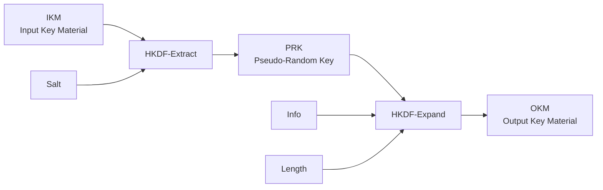

**HKDF-Extract** 的公式定义：

```
PRK = HMAC-Hash(Salt, IKM)
```

当 Salt 未提供时，默认为 Hash-Length 个 0x00 字节。

**HKDF-Expand** 的公式定义：

```
N = ceil(L/HashLen)
T = T(1) | T(2) | T(3) | ...
T(0) = empty string
T(1) = HMAC-Hash(PRK, T(0) | Info | 0x01)
T(2) = HMAC-Hash(PRK, T(1) | Info | 0x02)
...
OKM = T(1) | T(2) | ... | T(N)
```

其中 Info 是可选的上下文标识，0x01、0x02 等是单字节计数器。

```python
import hmac
import hashlib

def hkdf_extract(salt: bytes, ikm: bytes, hash_func=hashlib.sha256) -> bytes:
    """HKDF-Extract: 从输入密钥材料中提取伪随机密钥"""
    if not salt:
        salt = b'\x00' * hash_func().digest_size
    return hmac.new(salt, ikm, hash_func).digest()

def hkdf_expand(prk: bytes, info: bytes, length: int, hash_func=hashlib.sha256) -> bytes:
    """HKDF-Expand: 从伪随机密钥扩展出指定长度的输出密钥材料"""
    hash_len = hash_func().digest_size
    n = (length + hash_len - 1) // hash_len
    assert n <= 255, "HKDF-Expand: n must be <= 255"

    t = b''
    okm = b''
    for i in range(1, n + 1):
        t = hmac.new(prk, t + info + bytes([i]), hash_func).digest()
        okm += t

    return okm[:length]

def hkdf(salt: bytes, ikm: bytes, info: bytes, length: int,
         hash_func=hashlib.sha256) -> bytes:
    """完整的 HKDF 流程"""
    prk = hkdf_extract(salt, ikm, hash_func)
    return hkdf_expand(prk, info, length, hash_func)

# 示例：使用 HKDF 派生 32 字节的密钥
salt = b'salt-value-16bytes'
ikm = b'secret-key-material'
info = b'tls13 key expansion'
derived_key = hkdf(salt, ikm, info, 32)
print(f"Derived key: {derived_key.hex()}")
```

### 1.3 PBKDF2：Password-based KDF

PBKDF2（RFC 8018）是基于密码的密钥派生函数，最初设计用于密码存储（如 /etc/shadow 的旧版本）。它使用伪随机函数（通常是 HMAC）对密码和盐进行多次迭代拉伸。

```
DK = T1 | T2 | ... | Tdklen/hlen
Ti = F(Password, Salt, c, i)

F(Password, Salt, c, i) = U1 ^ U2 ^ ... ^ Uc
U1 = PRF(Password, Salt || INT(i))
U2 = PRF(Password, U1)
...
Uc = PRF(Password, Uc-1)
```

其中 c 是迭代次数（通常建议 100,000 以上），dklen 是期望输出长度，hlen 是 PRF 输出长度。

```python
import hashlib
import hmac

def pbkdf2(password: bytes, salt: bytes, iterations: int,
           key_length: int, hash_name: str = 'sha256') -> bytes:
    """PBKDF2 密钥派生函数"""
    hash_func = getattr(hashlib, hash_name)
    hlen = hash_func().digest_size

    # 计算需要的块数
    block_count = (key_length + hlen - 1) // hlen
    derived_key = b''

    for block_num in range(1, block_count + 1):
        # U1 = PRF(Password, Salt || INT(i))
        u = hmac.new(password, salt + block_num.to_bytes(4, 'big'), hash_func).digest()
        result = u

        # U2 ... Uc
        for _ in range(iterations - 1):
            u = hmac.new(password, u, hash_func).digest()
            result = bytes(a ^ b for a, b in zip(result, u))

        derived_key += result

    return derived_key[:key_length]

# 示例：使用 PBKDF2 派生密钥
password = b'user_password'
salt = b'random_salt_16bytes'
key = pbkdf2(password, salt, iterations=100000, key_length=32)
print(f"PBKDF2 derived key: {key.hex()}")
```

### 1.4 Argon2：内存硬哈希函数

Argon2（RFC 9106）是 2015 年密码哈希竞赛的冠军算法，被设计为**内存硬**（Memory-hard）函数。相较于 PBKDF2，Argon2 对 ASIC/FPGA 攻击具有更强的抵抗能力，因为它需要大量内存才能计算。

Argon2 有三个变体：
- **Argon2d**：对内存访问与密码相关，适合没有侧信道威胁的场景
- **Argon2i**：对内存访问与密码无关，适合有侧信道威胁的场景
- **Argon2id**：混合模式，结合两者优点

```python
# 使用 argon2-cffi 库进行 Argon2 哈希
from argon2 import PasswordHasher
from argon2.exceptions import VerifyMismatchError

ph = PasswordHasher(
    time_cost=3,       # 迭代次数
    memory_cost=65536, # 内存消耗（KB）
    parallelism=4,      # 并行度
    hash_len=32,       # 输出长度
    salt_len=16        # 盐长度
)

# 生成哈希
hashed = ph.hash("user_password")
print(f"Argon2 hash: {hashed}")

# 验证密码
try:
    ph.verify(hashed, "user_password")
    print("Password verified successfully")
except VerifyMismatchError:
    print("Password verification failed")
```

### 1.5 各 KDF 算法对比

| 特性 | HKDF | PBKDF2 | Argon2 |
|------|------|--------|--------|
| 输入类型 | 高熵密钥材料 | 低熵密码 | 低熵密码 |
| 设计目标 | 密钥扩展/隔离 | 密码拉伸 | 内存硬拉伸 |
| 计算复杂度 | 低 | 中（可调迭代次数） | 高（可调时间/内存） |
| 内存需求 | 低 | 低 | 高（可配置） |
| GPU/ASIC 抵抗 | 弱 | 中 | 强 |
| 标准年份 | 2010 | 2000（RFC 2898） | 2015 |
| TLS 使用 | TLS 1.3 | 不用于 TLS | 不用于 TLS |

## 2. TLS 1.2 密钥派生

### 2.1 TLS 1.2 密钥派生概述

TLS 1.2（RFC 5246）的密钥派生机制基于 PRF（Pseudo-Random Function）。与 TLS 1.3 的 HKDF 不同，TLS 1.2 的 PRF 直接构建在加密哈希函数（MD5/SHA-1/SHA-256）之上，并使用 HMAC 作为核心组件。

TLS 1.2 的密钥派生流程如下：

```mermaid
graph LR
    A[ClientHello<br/>Random] --> F
    B[ServerHello<br/>Random] --> F
    F[PRF<br/>pre_master_secret<br/>"master secret"] --> G[PRF<br/>master_secret<br/>"key expansion"]
    G --> H[client_write_MAC_key]
    G --> I[server_write_MAC_key]
    G --> J[client_write_key]
    G --> K[server_write_key]
    G --> L[client_write_IV]
    G --> M[server_write_IV]
    C[pre_master_secret] --> F
    C --> N[ClientKeyExchange]
    N --> B
```

### 2.2 预备主密钥（Pre-Master Secret）

TLS 1.2 支持两种密钥交换方式：**RSA 密钥交换**和**DH/ECDH 密钥交换**。

**RSA 密钥交换**（已废弃）：
```
pre_master_secret = encrypted_pre_master_secret
                   (from ClientKeyExchange, encrypted with server's RSA public key)
```

**DH/ECDH 密钥交换**：
```
pre_master_secret = DH_result
                  (shared secret computed from DH/ECDH handshake)
```

### 2.3 Master Secret 的计算

Master Secret 通过 PRF 函数从 48 字节的 pre_master_secret 派生：

```
master_secret = PRF(pre_master_secret, "master secret", ClientHello.random + ServerHello.random)
```

在 TLS 1.2 中，PRF 的定义取决于Cipher Suite。对于使用 AES 的 cipher suite，PRF 基于 HMAC-SHA-256；对于使用 3DES 的 legacy cipher suite，PRF 基于 MD5 和 SHA-1 的组合（称为 TLS 1.0/1.1 的 PRF）。

```python
import hmac
import hashlib

def prf_sha256(secret: bytes, label: bytes, seed: bytes, length: int) -> bytes:
    """TLS 1.2 PRF using HMAC-SHA-256"""
    result = b''
    a = label + seed

    # A(1) = HMAC(secret, label || seed)
    a = hmac.new(secret, a, hashlib.sha256).digest()

    while len(result) < length:
        # A(i) = HMAC(secret, A(i-1))
        a = hmac.new(secret, a, hashlib.sha256).digest()
        # PRF = HMAC(secret, A(1) || label || seed || i)
        block = hmac.new(secret, a + label + seed + bytes([len(result) // 256 + 1]), hashlib.sha256).digest()
        result += block

    return result[:length]

# TLS 1.2 Master Secret 计算
def compute_master_secret_tls12(pre_master_secret: bytes,
                                  client_random: bytes,
                                  server_random: bytes) -> bytes:
    """计算 TLS 1.2 Master Secret"""
    seed = client_random + server_random
    return prf_sha256(pre_master_secret, b'master secret', seed, 48)

# 示例
pre_master_secret = bytes.fromhex('00112233445566778899aabbccddeeff...')  # 实际 48 字节
client_random = bytes.fromhex('0102030405060708090a0b0c0d0e0f101112131415161718191a1b1c1d1e1f20')
server_random = bytes.fromhex('202122232425262728292a2b2c2d2e2f303132333435363738393a3b3c3d3e3f40')

master_secret = compute_master_secret_tls12(pre_master_secret, client_random, server_random)
print(f"Master Secret: {master_secret.hex()}")
```

### 2.4 密钥块（Key Block）的派生

从 Master Secret 派生出完整的密钥材料（Key Block），包括：
- client_write_MAC_key
- server_write_MAC_key
- client_write_key
- server_write_key
- client_write_IV（仅用于 CBC 模式）
- server_write_IV（仅用于 CBC 模式）

```
key_block = PRF(master_secret, "key expansion", server_random + client_random)
```

Key Block 的长度由协商的 Cipher Suite 决定：

```python
def expand_key_block_tls12(master_secret: bytes,
                           client_random: bytes,
                           server_random: bytes,
                           cipher_suite: str) -> dict:
    """展开 TLS 1.2 密钥块"""
    # Cipher Suite 参数
    cipher_params = {
        'TLS_RSA_WITH_AES_128_CBC_SHA': {
            'mac_key_len': 20,  # SHA-1
            'enc_key_len': 16,  # AES-128
            'iv_len': 16,       # AES CBC IV
        },
        'TLS_RSA_WITH_AES_256_CBC_SHA': {
            'mac_key_len': 20,
            'enc_key_len': 32,  # AES-256
            'iv_len': 16,
        },
        'TLS_RSA_WITH_AES_128_GCM_SHA256': {
            # AEAD 模式不使用 MAC key
            'mac_key_len': 0,
            'enc_key_len': 16,  # AES-128
            'iv_len': 4,        # AEAD implicit nonce
        },
    }

    params = cipher_params.get(cipher_suite, cipher_params['TLS_RSA_WITH_AES_128_CBC_SHA'])

    # 派生 key_block
    seed = server_random + client_random
    key_block = prf_sha256(master_secret, b'key expansion', seed, 1000)  # 足够长

    # 解析 key_block
    offset = 0
    client_write_mac_key = key_block[offset:offset + params['mac_key_len']]
    offset += params['mac_key_len']
    server_write_mac_key = key_block[offset:offset + params['mac_key_len']]
    offset += params['mac_key_len']
    client_write_key = key_block[offset:offset + params['enc_key_len']]
    offset += params['enc_key_len']
    server_write_key = key_block[offset:offset + params['enc_key_len']]
    offset += params['enc_key_len']
    client_write_iv = key_block[offset:offset + params['iv_len']]
    offset += params['iv_len']
    server_write_iv = key_block[offset:offset + params['iv_len']]

    return {
        'client_write_mac_key': client_write_mac_key,
        'server_write_mac_key': server_write_mac_key,
        'client_write_key': client_write_key,
        'server_write_key': server_write_key,
        'client_write_iv': client_write_iv,
        'server_write_iv': server_write_iv,
    }

# 示例
keys = expand_key_block_tls12(master_secret, client_random, server_random,
                              'TLS_RSA_WITH_AES_128_CBC_SHA')
print("TLS 1.2 Key Block:")
for name, value in keys.items():
    print(f"  {name}: {value.hex() if value else '(none)'}")
```

### 2.5 TLS 1.2 密钥派生流程图

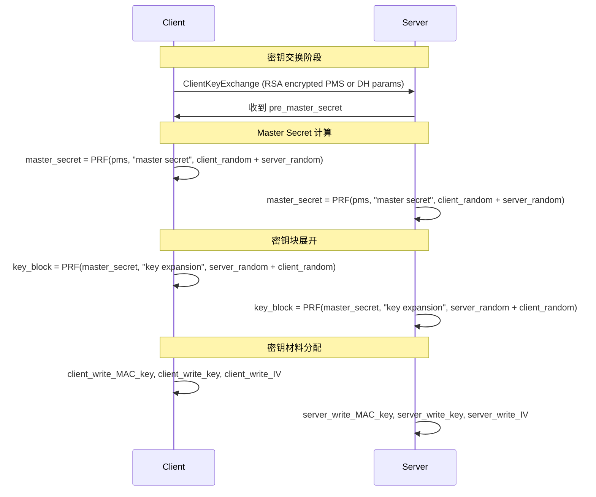

## 3. TLS 1.3 密钥派生

### 3.1 TLS 1.3 密钥派生概述

TLS 1.3（RFC 8446）对密钥派生机制进行了重大改革，采用了 HKDF 作为唯一的密钥派生函数。相比 TLS 1.2，TLS 1.3 的密钥派生更加简洁、安全：

- 移除了 RSA 密钥交换（不支持静态 RSA）
- 所有密钥交换都基于 (EC)DHE，提供前向保密
- 使用 HKDF-Extract 和 HKDF-Expand 替代 PRF
- 引入了绑定密钥（Binding Keys）的概念
- 密钥派生与加密阶段分离

TLS 1.3 的密钥派生架构：

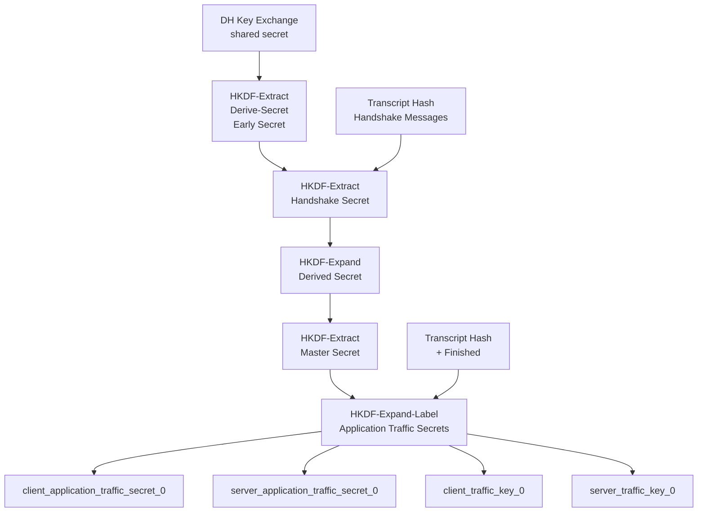

### 3.2 TLS 1.3 密钥派生层级

TLS 1.3 的密钥派生是一个四层的树状结构：

```
                          Derive-Secret(Secret, Label, Transcript-Hash)
                                        |
              +-------------------------+-------------------------+
              |                         |                         |
        Early Secret              Handshake Secret           Master Secret
              |                         |                         |
     +--------+--------+        +--------+--------+        +--------+--------+
     |                 |        |                 |        |                 |
binder_key    early_exporter   client_handshake   server_handshake   client_application   server_application
                                  traffic_secret    traffic_secret     traffic_secret      traffic_secret
```

### 3.3 HKDF-Extract 和 HKDF-Expand 的 TLS 1.3 包装

TLS 1.3 定义了 HKDF-Extract 和 HKDF-Expand 的包装函数，使其符合 TLS 1.3 的语义。

**TLS 1.3 HKDF-Extract**：
```
Extract(Salt, IKM) = HKDF-Extract(Salt, IKM)
```

**TLS 1.3 HKDF-Expand-Label**：
```python
def hkdf_expand_label(secret: bytes, label: bytes, context: bytes,
                      length: int, hash_func=hashlib.sha256) -> bytes:
    """TLS 1.3 HKDF-Expand-Label"""
    # TLS 1.3 标签格式
    tls_label = b'tls13 ' + label

    # 结构化为 HKDF 格式
    hkdf_info = struct.pack('!HB', length, 6 + len(tls_label))  # length || 0x00 || 6 + len(label) || "tls13 " || label
    hkdf_info += b'\x00\x06'  # Length of "tls13 "
    hkdf_info += tls_label
    hkdf_info += struct.pack('!B', len(context))  # context length
    hkdf_info += context

    return hkdf_expand(secret, hkdf_info, length, hash_func)
```

**TLS 1.3 Derive-Secret**：
```python
def derive_secret(secret: bytes, label: bytes, transcript: bytes,
                  hash_func=hashlib.sha256) -> bytes:
    """TLS 1.3 Derive-Secret 函数"""
    return hkdf_expand_label(secret, label, transcript, 32, hash_func)
```

### 3.4 TLS 1.3 完整的密钥派生流程

```python
import struct
import hashlib
import hmac

def tls13_derive_secrets(shared_secret: bytes,
                          transcript_hash: bytes,
                          client_hello_hash: bytes,
                          dh_mode: str = 'secp256r1') -> dict:
    """
    TLS 1.3 完整密钥派生流程

    Args:
        shared_secret: DH/ECDH 密钥交换结果
        transcript_hash: 所有握手消息的哈希（从 ClientHello 到 ServerHello）
        client_hello_hash: ClientHello 的哈希（用于 0-RTT）
    Returns:
        包含所有密钥材料的字典
    """
    # Hash 算法取决于选用的 Cipher Suite，这里默认 SHA-256
    hash_func = hashlib.sha256
    hash_len = 32

    # ========== 第一阶段：Early Secret (0-RTT) ==========
    # Early Secret = HKDF-Extract(0, 0)
    early_secret = hkdf_extract(b'\x00' * 32, b'', hash_func)

    # early_derived_secret = Derive-Secret(early_secret, "derived", "")
    early_derived = derive_secret(early_secret, b'derived', b'', hash_func)

    # ========== 第二阶段：Handshake Secret ==========
    # Handshake Secret = HKDF-Extract(early_derived, shared_secret)
    handshake_secret = hkdf_extract(early_derived, shared_secret, hash_func)

    # client_handshake_secret = Derive-Secret(handshake_secret, "c hs traffic", transcript)
    client_handshake_secret = derive_secret(handshake_secret, b'c hs traffic',
                                            transcript_hash, hash_func)

    # server_handshake_secret = Derive-Secret(handshake_secret, "s hs traffic", transcript)
    server_handshake_secret = derive_secret(handshake_secret, b's hs traffic',
                                            transcript_hash, hash_func)

    # ========== 第三阶段：Master Secret ==========
    # handshake_derived_secret = Derive-Secret(handshake_secret, "derived", "")
    handshake_derived = derive_secret(handshake_secret, b'derived', b'', hash_func)

    # Master Secret = HKDF-Extract(handshake_derived, 0)
    master_secret = hkdf_extract(handshake_derived, b'', hash_func)

    # ========== 第四阶段：Application Traffic Secrets ==========
    # client_application_secret = Derive-Secret(master_secret, "c ap traffic", transcript)
    client_application_secret = derive_secret(master_secret, b'c ap traffic',
                                               transcript_hash, hash_func)

    # server_application_secret = Derive-Secret(master_secret, "s ap traffic", transcript)
    server_application_secret = derive_secret(master_secret, b's ap traffic',
                                               transcript_hash, hash_func)

    # ========== 第五阶段：Traffic Keys ==========
    # 使用 HKDF-Expand-Label 派生密钥和 IV
    client_write_key = hkdf_expand_label(client_application_secret, b'key', b'', 16, hash_func)
    client_write_iv = hkdf_expand_label(client_application_secret, b'iv', b'', 12, hash_func)
    server_write_key = hkdf_expand_label(server_application_secret, b'key', b'', 16, hash_func)
    server_write_iv = hkdf_expand_label(server_application_secret, b'iv', b'', 12, hash_func)

    # Resumption Secret (用于 0-RTT 的 ticket)
    resumption_secret = derive_secret(master_secret, b'resumption', transcript_hash, hash_func)

    return {
        # Secret 层级
        'early_secret': early_secret,
        'handshake_secret': handshake_secret,
        'master_secret': master_secret,
        'resumption_secret': resumption_secret,

        # Handshake 层级密钥
        'client_handshake_secret': client_handshake_secret,
        'server_handshake_secret': server_handshake_secret,

        # Application 层级密钥
        'client_application_secret': client_application_secret,
        'server_application_secret': server_application_secret,

        # Traffic 密钥（用于加密）
        'client_write_key': client_write_key,
        'client_write_iv': client_write_iv,
        'server_write_key': server_write_key,
        'server_write_iv': server_write_iv,
    }

# 示例
shared_secret = bytes.fromhex('aabbccddeeff...')  # 32 字节 DH 共享密钥
transcript = bytes.fromhex('01aabbccdd...')  # SHA-256(ClientHello || ServerHello)

secrets = tls13_derive_secrets(shared_secret, transcript, transcript)
print("TLS 1.3 Derived Secrets:")
for name, value in secrets.items():
    print(f"  {name}: {value.hex()}")
```

### 3.5 TLS 1.2 与 TLS 1.3 密钥派生对比

| 特性 | TLS 1.2 | TLS 1.3 |
|------|---------|---------|
| KDF 算法 | PRF (基于 HMAC-MD5/SHA) | HKDF (RFC 5869) |
| 密钥交换依赖 | RSA 或 (EC)DHE | 仅 (EC)DHE |
| Master Secret 计算 | PRF(pre_master_secret, ...) | HKDF-Extract(early_secret, ...) |
| 密钥隔离 | 通过 Key Block 分离 | 通过 HKDF-Label 隔离 |
| 0-RTT 支持 | 无 | 支持（Early Secret） |
| 1-RTT 握手 | 1-RTT | 1-RTT（优化后） |
| 前向保密 | 可选 | 必须 |
| 静态 RSA | 支持 | 不支持 |
| 密钥层级 | 2 层（Master → Key Block） | 4 层（Early → Handshake → Master → Application） |

## 4. 前向保密（Perfect Forward Secrecy）

### 4.1 什么是前向保密

**前向保密**（Perfect Forward Secrecy，PFS）是一种安全属性，确保即使攻击者长期窃取了某个会话的长期密钥（如服务器的 RSA 私钥），也无法解密之前截获的加密通信。

没有 PFS 的情况：
- 攻击者记录加密流量
- 某天服务器被入侵，私钥泄露
- 攻击者用私钥解密之前记录的所有流量

有 PFS 的情况：
- 攻击者记录加密流量
- 服务器被入侵，攻击者获得服务器的私钥
- 但每次会话使用临时 DH/ECDH 密钥，私钥无法解密之前的流量

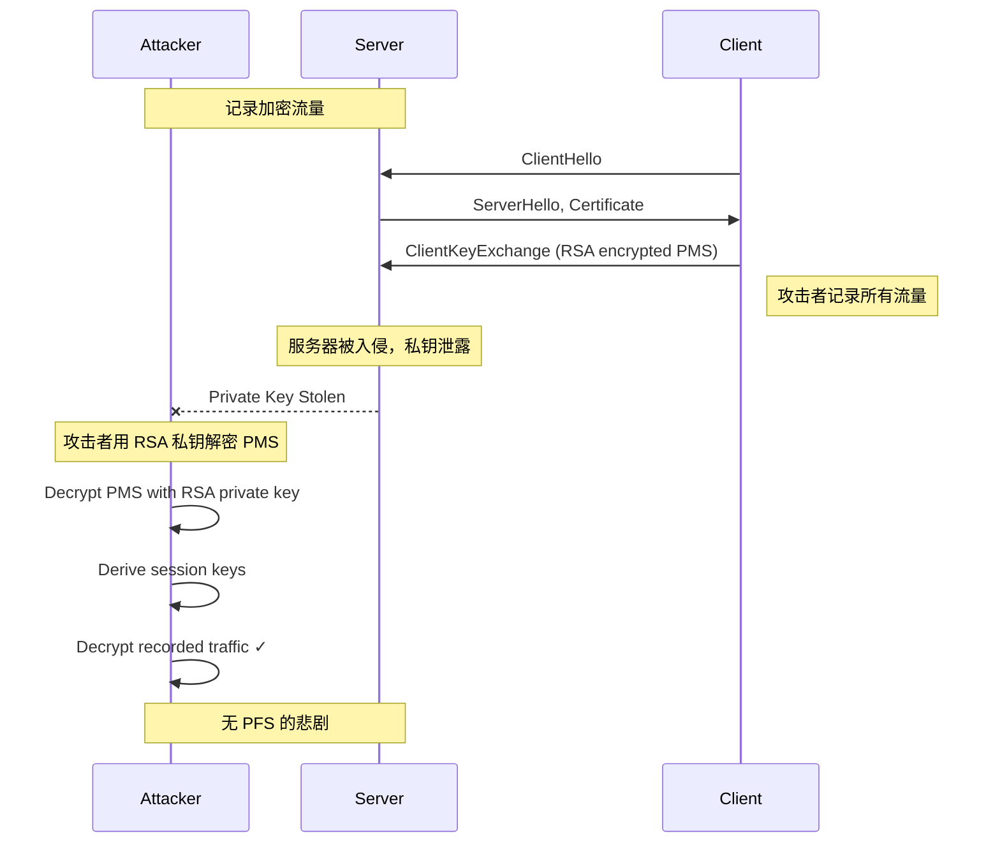

### 4.2 DHE 和 ECDHE 密钥交换

**DHE（Diffie-Hellman Ephemeral）** 使用动态生成的 DH 密钥对，每次会话都不同：

```
Client: Generate (Gx, gx)  →  send gx
Server: Generate (Gy, gy)  →  send gy

Shared Secret = g^(x*y) = gx^y = gy^x
```

**ECDHE（Elliptic Curve Diffie-Hellman Ephemeral）** 使用椭圆曲线上的 DH 运算，更短更快：

```
Client: Generate (Qx, d_Q)  →  send Qx
Server: Generate (Qy, d_Q)  →  send Qy

Shared Secret = d_Q * Qy = d_Q * d_Q * G
```

### 4.3 RSA 密钥交换为什么不提供前向保密

TLS 1.2 中的 RSA 密钥交换流程：

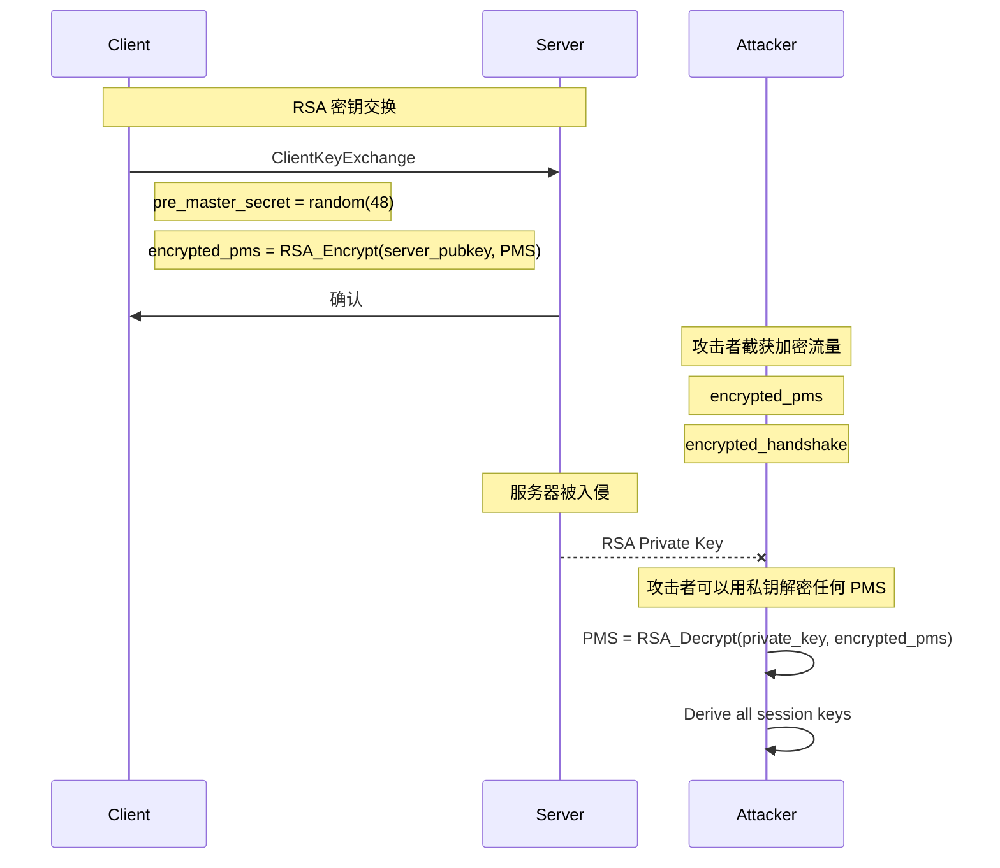

RSA 密钥交换的致命缺陷：pre_master_secret 由客户端生成，用服务器的公钥加密后发送。如果攻击者获得了服务器的私钥，他可以：
1. 解密 ClientKeyExchange 中的 encrypted_pms
2. 计算 master_secret
3. 推导所有会话密钥
4. 解密整个会话

### 4.4 TLS 1.3 中的密钥交换

TLS 1.3 完全移除了静态 RSA 密钥交换，所有密钥交换都必须提供前向保密：

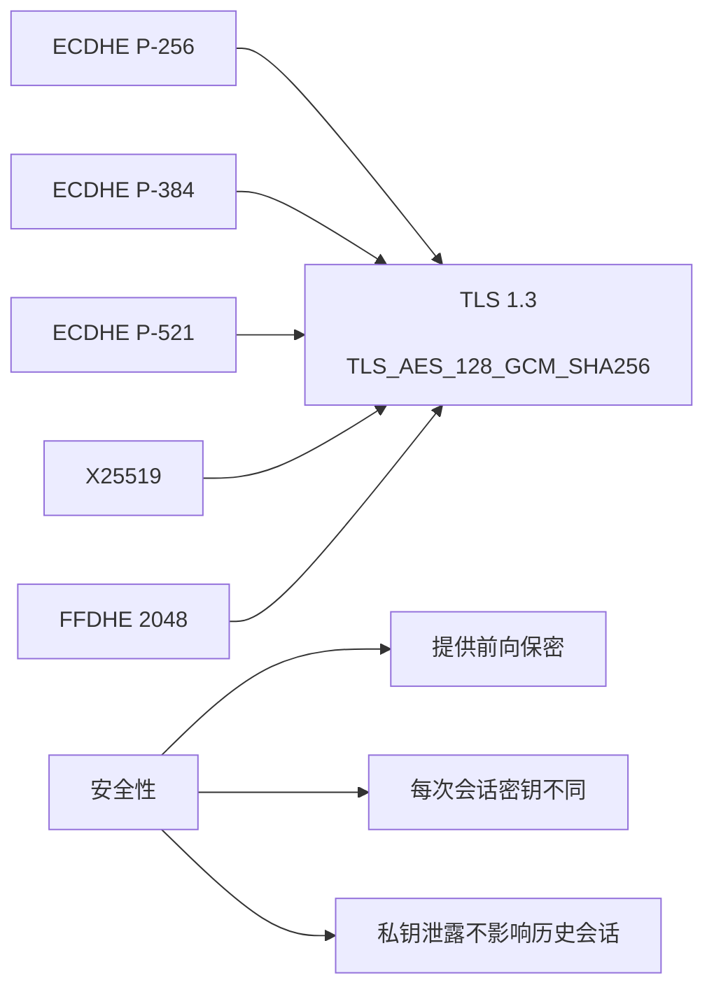

### 4.5 不同密钥交换方式的对比

| 特性 | RSA Key Exchange | DHE | ECDHE |
|------|------------------|-----|-------|
| 前向保密 | ❌ | ✅ | ✅ |
| 密钥交换类型 | 静态 | 临时 | 临时 |
| 计算成本 | 高（RSA 解密） | 中（DH 运算） | 低（EC 运算） |
| 密钥长度 | 2048-4096 位 | 2048-4096 位 | 256-521 位 |
| 兼容性 | 旧版客户端 | 现代客户端 | 现代客户端 |
| TLS 1.3 支持 | ❌ | ✅ | ✅ |
| 已知风险 | 私钥泄露 = 历史泄露 | 安全 | 安全 + 高效 |

## 5. TLS 1.3 加密套件

### 5.1 什么是 AEAD

**AEAD**（Authenticated Encryption with Associated Data）是现代对称加密算法的标准范式。在 TLS 1.3 中，所有加密套件都必须使用 AEAD，传统的 CBC + HMAC 模式被完全移除。

AEAD 一次操作同时完成加密和认证：

```
Input:  Plaintext, Key, Nonce, AAD (Associated Data)
Output: Ciphertext, Tag
```

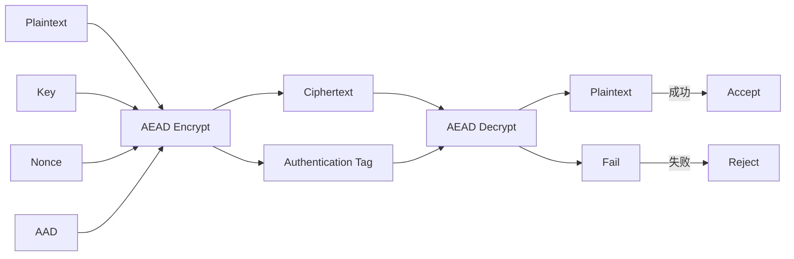

### 5.2 AES-GCM

**AES-GCM** 是 TLS 1.3 默认的加密算法，结合了 AES CTR 模式的流加密和 GHASH 的认证。

AES-GCM 的工作流程：

```
1. Generate GHASH key (H) = AES(Key, 0^128)
2. Generate Counter blocks:
   - Counter 0 = Nonce || 0^31 || 1 (4-byte nonce, 12 zeros, 1)
   - Counter i = Nonce || 0^31 || i+1

3. Generate keystream: AES-CTR(Key, Counter 0, 1, 2, ...)
4. Ciphertext = Plaintext XOR Keystream
5. GHASH = GHASH_H(Ciphertext || AAD || len(AAD) || len(Ciphertext))
6. Tag = GHASH XOR (AES(Key, Counter 0) truncated to 128 bits)
```

```python
import aes_gcm  # 使用 pyca/cryptography 库

# AES-128-GCM 加密
key = bytes.fromhex('0123456789abcdef0123456789abcdef')  # 16 字节
nonce = bytes.fromhex('0102030405060708090a0b0c')  # 12 字节
aad = b'Additional Authenticated Data'
plaintext = b'Hello, TLS 1.3!'

ciphertext, tag = aes_gcm.encrypt(key, nonce, plaintext, aad)
print(f"Ciphertext: {ciphertext.hex()}")
print(f"Tag: {tag.hex()}")

# AES-GCM 解密
decrypted = aes_gcm.decrypt(key, nonce, ciphertext, aad, tag)
print(f"Decrypted: {decrypted}")
```

使用 cryptography 库的实际代码：

```python
from cryptography.hazmat.primitives.ciphers.aead import AESGCM
import os

def aes_gcm_encrypt(key: bytes, nonce: bytes, plaintext: bytes,
                    aad: bytes = None) -> tuple:
    """AES-128/256-GCM 加密"""
    aesgcm = AESGCM(key)
    if aad is None:
        aad = b''

    # AESGCM 的 nonce 长度可以是 12 字节（标准）或任意长度
    # TLS 1.3 使用 12 字节 nonce
    ciphertext = aesgcm.encrypt(nonce, plaintext, aad)
    # 返回 ciphertext 和 tag（后 16 字节）
    return ciphertext[:-16], ciphertext[-16:]

def aes_gcm_decrypt(key: bytes, nonce: bytes, ciphertext: bytes,
                    tag: bytes, aad: bytes = None) -> bytes:
    """AES-GCM 解密"""
    aesgcm = AESGCM(key)
    if aad is None:
        aad = b''

    # 合并 ciphertext 和 tag
    decrypted = aesgcm.decrypt(nonce, ciphertext + tag, aad)
    return decrypted

# 示例
key = os.urandom(16)  # 128-bit key
nonce = os.urandom(12)  # 96-bit nonce
aad = b'tls13 handshake data'
plaintext = b'Application Data'

ciphertext, tag = aes_gcm_encrypt(key, nonce, plaintext, aad)
print(f"Ciphertext: {ciphertext.hex()}")
print(f"Tag: {tag.hex()}")

decrypted = aes_gcm_decrypt(key, nonce, ciphertext, tag, aad)
print(f"Decrypted: {decrypted.decode()}")
```

### 5.3 ChaCha20-Poly1305

**ChaCha20-Poly1305** 是 TLS 1.3 支持的另一种 AEAD 算法，由 Daniel Bernstein 设计。相比 AES-GCM，它在软件实现上更高效，特别是在没有硬件 AES 加速的平台上（如低端 ARM 设备）。

ChaCha20 是流加密算法，Poly1305 是消息认证码算法，两者结合形成 AEAD。

ChaCha20 的核心是 512 位的状态矩阵，通过 20 轮 ChaChaQuarterRound 操作进行混合：

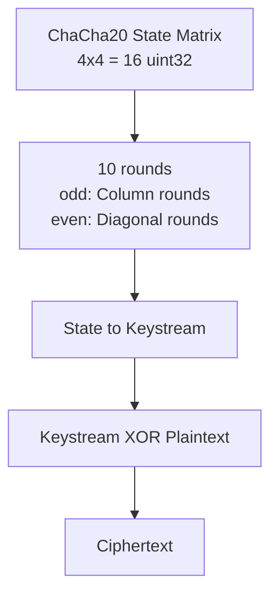

```python
# 使用 cryptography 库的 ChaCha20-Poly1305
from cryptography.hazmat.primitives.ciphers.aead import ChaCha20Poly1305
import os

def chacha20_poly1305_encrypt(key: bytes, nonce: bytes, plaintext: bytes,
                               aad: bytes = None) -> tuple:
    """ChaCha20-Poly1305 加密"""
    chacha = ChaCha20Poly1305(key)
    if aad is None:
        aad = b''

    ciphertext = chacha.encrypt(nonce, plaintext, aad)
    return ciphertext[:-16], ciphertext[-16:]

def chacha20_poly1305_decrypt(key: bytes, nonce: bytes, ciphertext: bytes,
                               tag: bytes, aad: bytes = None) -> bytes:
    """ChaCha20-Poly1305 解密"""
    chacha = ChaCha20Poly1305(key)
    if aad is None:
        aad = b''

    decrypted = chacha.decrypt(nonce, ciphertext + tag, aad)
    return decrypted

# 示例
key = os.urandom(32)  # 256-bit key
nonce = os.urandom(12)  # 96-bit nonce
aad = b'tls13 handshake data'
plaintext = b'Hello, ChaCha20-Poly1305!'

ciphertext, tag = chacha20_poly1305_encrypt(key, nonce, plaintext, aad)
print(f"Ciphertext: {ciphertext.hex()}")
print(f"Tag: {tag.hex()}")

decrypted = chacha20_poly1305_decrypt(key, nonce, ciphertext, tag, aad)
print(f"Decrypted: {decrypted.decode()}")
```

### 5.4 AES-CCM

**AES-CCM**（Counter with CBC-MAC）是 TLS 1.3 支持的第三种 AEAD 算法，主要用于物联网（IoT）和资源受限环境。CCM 是 CBC-MAC 和 CTR 模式的组合。

```python
# 使用 cryptography 库的 AES-CCM
from cryptography.hazmat.primitives.ciphers.aead import AESCCM
import os

def aes_ccm_encrypt(key: bytes, nonce: bytes, plaintext: bytes,
                    aad: bytes = None) -> tuple:
    """AES-CCM 加密"""
    # AES-CCM 的 nonce 长度必须是 13 字节
    ccmaes = AESCCM(key)
    if aad is None:
        aad = b''

    ciphertext = ccmaes.encrypt(nonce, plaintext, aad)
    return ciphertext[:-16], ciphertext[-16:]

def aes_ccm_decrypt(key: bytes, nonce: bytes, ciphertext: bytes,
                     tag: bytes, aad: bytes = None) -> bytes:
    """AES-CCM 解密"""
    ccmaes = AESCCM(key)
    if aad is None:
        aad = b''

    decrypted = ccmaes.decrypt(nonce, ciphertext + tag, aad)
    return decrypted

# 示例
key = os.urandom(16)  # 128-bit key
nonce = os.urandom(13)  # 104-bit nonce (13 bytes for CCM)
aad = b'IoT sensor data'
plaintext = b'Sensor reading: 25.5C'

ciphertext, tag = aes_ccm_encrypt(key, nonce, plaintext, aad)
print(f"Ciphertext: {ciphertext.hex()}")
print(f"Tag: {tag.hex()}")

decrypted = aes_ccm_decrypt(key, nonce, ciphertext, tag, aad)
print(f"Decrypted: {decrypted.decode()}")
```

### 5.5 AEAD 算法对比

| 特性 | AES-128-GCM | AES-256-GCM | ChaCha20-Poly1305 | AES-128-CCM |
|------|-------------|-------------|-------------------|-------------|
| 密钥长度 | 128 位 | 256 位 | 256 位 | 128 位 |
| Nonce 长度 | 96 位 | 96 位 | 96 位 | 104 位 |
| Tag 长度 | 128 位 | 128 位 | 128 位 | 128 位 |
| 硬件加速 | 是 | 是 | 否 | 是 |
| 软件性能 | 中（无 AES-NI 慢） | 中（无 AES-NI 慢） | 高 | 中 |
| TLS 1.3 支持 | ✅ | ✅ | ✅ | ✅ |
| 适用场景 | 通用 | 高安全需求 | 移动/IoT | IoT/受限环境 |
| 侧信道风险 | 中（定时攻击） | 中（定时攻击） | 低 | 低 |

## 6. 加密套件格式与 IANA 注册

### 6.1 TLS 加密套件的命名规范

TLS 加密套件的命名遵循统一格式：

```
TLS_<密钥交换>_<加密算法>_<模式>_<MAC/PRF>_<TLS版本?>
```

例如：
- `TLS_ECDHE_RSA_WITH_AES_128_GCM_SHA256`
- `TLS_AES_256_GCM_SHA384`

TLS 1.3 的简化命名（RFC 8446）：
```
TLS_<加密算法>_<MAC>  或  TLS_<加密算法>
```

例如：
- `TLS_AES_128_GCM_SHA256`
- `TLS_CHACHA20_POLY1305_SHA256`
- `TLS_AES_128_GCM`

### 6.2 IANA TLS Cipher Suite 注册表

IANA 维护着官方的 TLS Cipher Suite 注册表，每个套件都有一个唯一的 2 字节标识符：

```
Cipher Suite 值 = 0xTTNN
其中 TT 是第 1 字节，NN 是第 2 字节
```

| IANA ID | Cipher Suite Name | KX | AEAD | Mac |
|---------|-------------------|-----|------|-----|
| 0x1301 | TLS_AES_128_GCM_SHA256 | ANY | AES-128-GCM | SHA256 |
| 0x1302 | TLS_AES_256_GCM_SHA384 | ANY | AES-256-GCM | SHA384 |
| 0x1303 | TLS_CHACHA20_POLY1305_SHA256 | ANY | ChaCha20-Poly1305 | SHA256 |
| 0x1304 | TLS_AES_128_CCM_SHA256 | ANY | AES-128-CCM | SHA256 |
| 0x1305 | TLS_AES_128_CCM_8_SHA256 | ANY | AES-128-CCM-8 | SHA256 |

TLS 1.2 遗留的 Cipher Suite（部分）：

| IANA ID | Cipher Suite Name | KX | Enc | Mac |
|---------|-------------------|-----|-----|-----|
| 0x002F | TLS_RSA_WITH_AES_128_CBC_SHA | RSA | AES-128-CBC | SHA1 |
| 0x0035 | TLS_RSA_WITH_AES_256_CBC_SHA | RSA | AES-256-CBC | SHA1 |
| 0x003C | TLS_RSA_WITH_AES_128_CBC_SHA256 | RSA | AES-128-CBC | SHA256 |
| 0x009C | TLS_RSA_WITH_AES_128_GCM_SHA256 | RSA | AES-128-GCM | SHA256 |
| 0x009D | TLS_RSA_WITH_AES_256_GCM_SHA384 | RSA | AES-256-GCM | SHA384 |
| 0xC02F | TLS_ECDHE_RSA_WITH_AES_128_GCM_SHA256 | ECDHE | AES-128-GCM | SHA256 |
| 0xC02C | TLS_ECDHE_ECDSA_WITH_AES_256_GCM_SHA384 | ECDHE | AES-256-GCM | SHA384 |

### 6.3 Go 语言解析 Cipher Suite

```go
package main

import (
    "crypto/tls"
    "fmt"
)

func main() {
    // TLS 1.3 加密套件
    fmt.Println("TLS 1.3 Cipher Suites:")
    for _, cs := range tls.CipherSuites() {
        fmt.Printf("  0x%04X: %s (ID: %d)\n", cs.ID, cs.Name, cs.ID)
    }

    // 查看特定加密套件
    cipherSuite := tls.CipherSuites()[0]
    fmt.Printf("\nCipher Suite Details:\n")
    fmt.Printf("  Name: %s\n", cipherSuite.Name)
    fmt.Printf("  ID: 0x%04X\n", cipherSuite.ID)
    fmt.Printf("  Supported: %v\n", cipherSuite.Supported)

    // 检查是否支持特定加密套件
    supported := false
    for _, cs := range tls.CipherSuites() {
        if cs.Name == "TLS_AES_128_GCM_SHA256" {
            supported = true
            break
        }
    }
    fmt.Printf("\nTLS_AES_128_GCM_SHA256 supported: %v\n", supported)
}
```

### 6.4 加密套件选择建议

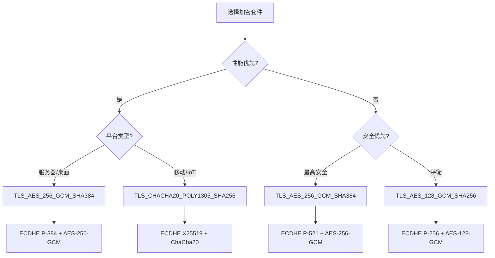

## 7. 密钥与 IV 的关系

### 7.1 为什么每次都需要新的 IV

TLS 协议中，IV（初始化向量）的唯一性至关重要。CBC 模式使用 IV 来确保相同明文产生不同密文；GCM/ChaCha20 等 AEAD 模式使用 Nonce 来防止重放攻击。

**CBC 模式下的 IV**：
- 如果使用相同的 IV 加密相同的明文，会产生相同的密文
- 攻击者可以判断是否有重复的明文
- CBC 的 IV 必须是不可预测的（TLS 1.0/1.1 曾因 IV 预测漏洞被攻击）

**AEAD 模式下的 Nonce**：
- AEAD 的 Nonce 可以是计数器或随机数
- 关键：同一个 Nonce 绝对不能用于两个不同的明文
- 如果 Nonce 重复，攻击者可以恢复第二个密文的明文

```mermaid
graph LR
    A[Nonce Reuse Attack] --> B[相同 Nonce 不同明文];
    B --> C[C1 = Encrypt(K, N, P1)];
    B --> D[C2 = Encrypt(K, N, P2)];
    C --> E[攻击者获得 C1, C2];
    E --> F[C1 XOR C2 = P1 XOR P2];
    F --> G[可以推断明文内容!];
```

### 7.2 TLS 1.3 的 Nonce 处理

TLS 1.3 使用**部分隐式 Nonce**（partially implicit nonce）机制：

```
AEAD Nonce = seq_num[0..5] || explicit_nonce[6..11]
```

- 前 6 字节：序列号（隐式，从数据包头获取）
- 后 6 字节：来自握手或显式发送

```python
def build_aead_nonce(sequence_number: int, explicit_nonce: bytes) -> bytes:
    """构建 TLS 1.3 AEAD Nonce

    Args:
        sequence_number: 记录层的序列号（64 位，但只取低 48 位）
        explicit_nonce: 显式 Nonce 部分（通常来自 key_share 或填充）

    Returns:
        12 字节的 AEAD Nonce
    """
    # TLS 1.3 使用 96 位 Nonce（12 字节）
    # 隐式部分：序列号的低 48 位
    implicit_part = (sequence_number & 0xFFFFFFFFFFFF).to_bytes(6, 'big')
    # 显式部分
    explicit_part = explicit_nonce[:6]

    return implicit_part + explicit_part

# 示例
seq_num = 0x000000000001
explicit = bytes.fromhex('0011223344aa')
nonce = build_aead_nonce(seq_num, explicit)
print(f"AEAD Nonce: {nonce.hex()}")

# 验证
seq_num2 = 0x000000000002
nonce2 = build_aead_nonce(seq_num2, explicit)
print(f"Different seq -> Different nonce: {nonce != nonce2}")

nonce3 = build_aead_nonce(seq_num, bytes.fromhex('0011223344bb'))
print(f"Different explicit -> Different nonce: {nonce != nonce3}")
```

### 7.3 IV 与密钥的隔离原则

TLS 协议严格隔离不同方向的密钥和 IV：

| 参数 | 客户端 → 服务器 | 服务器 → 客户端 |
|------|-----------------|-----------------|
| MAC Key | client_write_MAC_key | server_write_MAC_key |
| Encryption Key | client_write_key | server_write_key |
| IV | client_write_IV | server_write_IV |
| Sequence | client_sequence | server_sequence |

这种隔离确保：
- 双向通信使用不同的密钥
- 即使一个方向的密钥泄露，另一个方向仍然安全
- 序列号独立维护，防止重放攻击

## 8. AEAD 的认证加密原理

### 8.1 认证加密的定义

认证加密（Authenticated Encryption）同时提供：
- **机密性**：只有持有密钥的人能读取明文
- **完整性**：能够检测密文是否被篡改
- **认证性**：能够确认密文来自持有密钥的人

在没有 AEAD 之前，开发者通常组合独立的加密和 MAC 算法（如 AES-CBC + HMAC），但这种组合容易出错。AEAD 将两者统一为一个算法，简化了安全协议的实现。

### 8.2 Encrypt-then-MAC vs MAC-then-Encrypt

**MAC-then-Encrypt**（TLS 1.2 CBC 模式）：
1. 计算明文的 MAC
2. 附加 MAC 到明文
3. 加密整个数据

**Encrypt-then-MAC**（更安全）：
1. 加密明文
2. 计算密文的 MAC
3. 附加 MAC 到密文

TLS 1.2 的 CBC + HMAC 模式实际上是 MAC-then-Encrypt，存在 BEAST 等攻击面。TLS 1.3 全面采用 AEAD，消除了这类风险。

### 8.3 AEAD 的工作流程

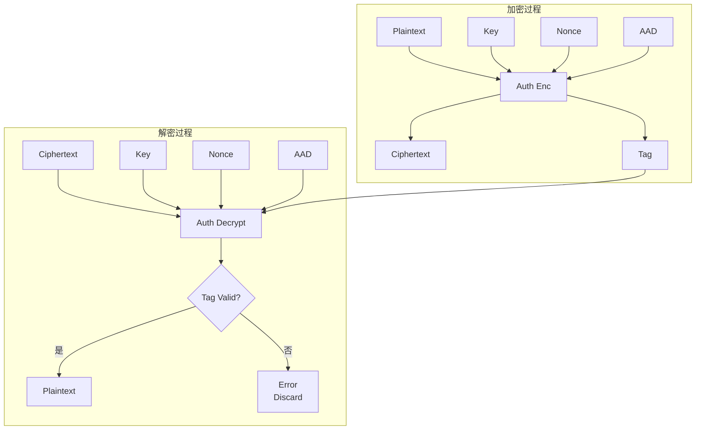

### 8.4 AAD（关联数据）的作用

AEAD 的额外数据（AAD）用于认证但不加密。在 TLS 中，AAD 通常包括：
- 序列号（防止重放）
- 协议版本
- 握手消息的部分内容

这确保了即使攻击者可以修改密文，接收方也能检测到篡改，因为 AAD 的完整性被 Tag 保护。

```python
# TLS 1.3 记录层加密示例
from cryptography.hazmat.primitives.ciphers.aead import AESGCM
import struct

def tls13_record_encrypt(plaintext: bytes, key: bytes, sequence: int,
                         content_type: int = 0x17,
                         protocol_version: int = 0x0303) -> bytes:
    """
    TLS 1.3 记录层加密

    Args:
        plaintext: 明文数据
        key: 加密密钥（16 或 32 字节）
        sequence: 序列号
        content_type: 内容类型（0x17 = application_data）
        protocol_version: TLS 版本（0x0303 = TLS 1.2，但 TLS 1.3 仍用此值）
    """
    aesgcm = AESGCM(key)

    # 构建 AAD：序列号 || ContentType || ProtocolVersion || 长度
    # 注意：TLS 1.3 的 AAD 不包含长度前缀在某些实现中
    # 实际 AAD 格式：seq_num[8] || content_type || legacy_version || length[2]
    aad = struct.pack('!QBH', sequence, content_type, protocol_version, len(plaintext))
    aad = bytes.fromhex('0000000000000001') + bytes([0x17, 0x03, 0x03]) + struct.pack('!H', len(plaintext))

    # Nonce：序列号的低 48 位 || 0（或其他显式部分）
    nonce = (sequence & 0xFFFFFFFFFFFF).to_bytes(6, 'big') + bytes(6)

    # 加密
    ciphertext = aesgcm.encrypt(nonce, plaintext, aad)

    # 返回：密文 || Tag
    return ciphertext

def tls13_record_decrypt(record: bytes, key: bytes, sequence: int,
                         content_type: int = 0x17,
                         protocol_version: int = 0x0303) -> bytes:
    """TLS 1.3 记录层解密"""
    aesgcm = AESGCM(key)

    # TLS 1.3 记录格式：content_type || version || length || encrypted_data
    # 解析
    if len(record) < 5:
        raise ValueError("Record too short")

    # 提取密文和 Tag（TLS 1.3 使用 AEAD，Tag 长度为 16 字节）
    ciphertext = record[5:]
    if len(ciphertext) < 16:
        raise ValueError("Ciphertext too short")

    plaintext_ciphertext = ciphertext[:-16]
    tag = ciphertext[-16:]

    # AAD
    aad = bytes.fromhex('0000000000000001') + bytes([0x17, 0x03, 0x03]) + struct.pack('!H', len(plaintext_ciphertext))

    # Nonce
    nonce = (sequence & 0xFFFFFFFFFFFF).to_bytes(6, 'big') + bytes(6)

    # 解密
    try:
        return aesgcm.decrypt(nonce, plaintext_ciphertext + tag, aad)
    except Exception as e:
        raise ValueError(f"Decryption failed: {e}")

# 示例
key = bytes.fromhex('0123456789abcdef0123456789abcdef')
plaintext = b'Hello, TLS 1.3 AEAD!'
sequence = 1

encrypted = tls13_record_encrypt(plaintext, key, sequence)
print(f"Encrypted (hex): {encrypted.hex()}")

decrypted = tls13_record_decrypt(bytes([0x17, 0x03, 0x03]) + struct.pack('!H', len(encrypted)) + encrypted,
                                  key, sequence)
print(f"Decrypted: {decrypted.decode()}")
```

## 9. Go / Python 实战：手动实现密钥派生

### 9.1 Python 实现完整的 TLS 1.3 密钥派生

```python
"""
TLS 1.3 完整密钥派生实现
"""
import struct
import hashlib
import hmac

# ========== 基础 HKDF 实现 ==========

def hkdf_extract(salt: bytes, ikm: bytes, hash_func=hashlib.sha256) -> bytes:
    """HKDF-Extract"""
    if not salt:
        salt = b'\x00' * hash_func().digest_size
    return hmac.new(salt, ikm, hash_func).digest()

def hkdf_expand(prk: bytes, info: bytes, length: int, hash_func=hashlib.sha256) -> bytes:
    """HKDF-Expand"""
    hash_len = hash_func().digest_size
    n = (length + hash_len - 1) // hash_len
    if n > 255:
        raise ValueError("HKDF-Expand: length too large")

    t = b''
    okm = b''
    for i in range(1, n + 1):
        t = hmac.new(prk, t + info + bytes([i]), hash_func).digest()
        okm += t

    return okm[:length]

def hkdf_expand_label(secret: bytes, label: bytes, context: bytes,
                      length: int, hash_func=hashlib.sha256) -> bytes:
    """TLS 1.3 HKDF-Expand-Label"""
    tls_label = b'tls13 ' + label
    hkdf_info = struct.pack('!H', length)
    hkdf_info += bytes([len(tls_label)])
    hkdf_info += tls_label
    hkdf_info += bytes([len(context)])
    hkdf_info += context

    prk = hkdf_extract(b'\x00' * 32, secret, hash_func)
    return hkdf_expand(prk, hkdf_info, length, hash_func)

def derive_secret(secret: bytes, label: bytes, transcript: bytes,
                 hash_func=hashlib.sha256) -> bytes:
    """TLS 1.3 Derive-Secret"""
    return hkdf_expand_label(secret, label, transcript, 32, hash_func)

# ========== TLS 1.3 密钥派生 ==========

def tls13_derive_handshake_secrets(shared_secret: bytes,
                                   transcript_hash: bytes) -> dict:
    """TLS 1.3 握手阶段密钥派生"""
    hash_func = hashlib.sha256

    # Derive-Secret(Secret, Label, Transcript) 辅助函数
    def derive(s, l):
        return derive_secret(s, l, transcript_hash, hash_func)

    # Early Secret
    early_secret = hkdf_extract(b'\x00' * 32, b'', hash_func)

    # Derive Early Secret 后的中间密钥
    empty_hash = hashlib.sha256().digest()
    early_derived = derive(early_secret, b'derived')

    # Handshake Secret
    handshake_secret = hkdf_extract(early_derived, shared_secret, hash_func)

    # 握手流量密钥
    client_handshake_secret = derive(handshake_secret, b'c hs traffic')
    server_handshake_secret = derive(handshake_secret, b's hs traffic')

    return {
        'early_secret': early_secret,
        'handshake_secret': handshake_secret,
        'client_handshake_secret': client_handshake_secret,
        'server_handshake_secret': server_handshake_secret,
    }

def tls13_derive_application_secrets(handshake_secret: bytes,
                                      transcript_hash: bytes) -> dict:
    """TLS 1.3 应用数据阶段密钥派生"""
    hash_func = hashlib.sha256

    def derive(s, l):
        return derive_secret(s, l, transcript_hash, hash_func)

    # Master Secret
    handshake_derived = derive(handshake_secret, b'derived')
    master_secret = hkdf_extract(handshake_derived, b'', hash_func)

    # Application Traffic Secrets
    client_app_secret = derive(master_secret, b'c ap traffic')
    server_app_secret = derive(master_secret, b's ap traffic')

    # Resumption Secret
    resumption_secret = derive(master_secret, b'resumption')

    # Traffic Keys
    def expand_key(s):
        key = hkdf_expand_label(s, b'key', b'', 16, hash_func)
        iv = hkdf_expand_label(s, b'iv', b'', 12, hash_func)
        return key, iv

    client_key, client_iv = expand_key(client_app_secret)
    server_key, server_iv = expand_key(server_app_secret)

    return {
        'master_secret': master_secret,
        'client_application_secret': client_app_secret,
        'server_application_secret': server_app_secret,
        'resumption_secret': resumption_secret,
        'client_write_key': client_key,
        'client_write_iv': client_iv,
        'server_write_key': server_key,
        'server_write_iv': server_iv,
    }

# ========== 演示 ==========

if __name__ == '__main__':
    # 模拟 ECDHE 共享密钥（32 字节，SECP256r1）
    shared_secret = bytes.fromhex(
        'a8c5e043f10736c5a25b1c78b0d3e8c5b0e7f8c3a5e9e0c2a8e7c8d5e3f1a2b3'
    )

    # 模拟握手摘要（ClientHello || ServerHello）
    transcript_hash = bytes.fromhex(
        'b4c8e7f2a1d3e5c7b9f1a3e5c7d9f1b3e5c7a9f1d3b5e7a9f1c3d5e7b9f1a3'
    )

    print("=== TLS 1.3 Handshake Secrets ===")
    hs = tls13_derive_handshake_secrets(shared_secret, transcript_hash)
    for name, value in hs.items():
        print(f"{name}: {value.hex()}")

    print("\n=== TLS 1.3 Application Secrets ===")
    hs_secret = hs['handshake_secret']
    apps = tls13_derive_application_secrets(hs_secret, transcript_hash)
    for name, value in apps.items():
        print(f"{name}: {value.hex()}")
```

### 9.2 Go 实现完整的 TLS 1.3 密钥派生

```go
package main

import (
    "crypto/hmac"
    "crypto/sha256"
    "encoding/hex"
    "fmt"
)

// HKDF-Extract
func hkdfExtract(salt, ikm []byte) []byte {
    if len(salt) == 0 {
        salt = make([]byte, 32) // SHA-256 output length
    }
    h := hmac.New(sha256.New, salt)
    h.Write(ikm)
    return h.Sum(nil)
}

// HKDF-Expand
func hkdfExpand(prk, info []byte, length int) []byte {
    hashLen := 32
    n := (length + hashLen - 1) / hashLen
    if n > 255 {
        panic("HKDF: length too large")
    }

    t := []byte{}
    okm := []byte{}
    for i := 1; i <= n; i++ {
        h := hmac.New(sha256.New, prk)
        h.Write(t)
        h.Write(info)
        h.Write([]byte{byte(i)})
        t = h.Sum(nil)
        okm = append(okm, t...)
    }
    return okm[:length]
}

// HKDF-Expand-Label for TLS 1.3
func hkdfExpandLabel(secret, label, context []byte, length int) []byte {
    tlsLabel := []byte("tls13 ")
    tlsLabel = append(tlsLabel, label...)

    // Build HKDF-Expand info structure
    info := make([]byte, 2)
    info[0], info[1] = byte(length>>8), byte(length&0xff)

    info = append(info, byte(len(tlsLabel)))
    info = append(info, tlsLabel...)

    info = append(info, byte(len(context)))
    info = append(info, context...)

    // First extract to get proper PRK
    prk := hkdfExtract(make([]byte, 32), secret)
    return hkdfExpand(prk, info, length)
}

// Derive-Secret for TLS 1.3
func deriveSecret(secret []byte, label []byte, transcript []byte) []byte {
    return hkdfExpandLabel(secret, label, transcript, 32)
}

// TLS 1.3 handshake key derivation
func deriveHandshakeSecrets(sharedSecret, transcriptHash []byte) map[string][]byte {
    // Derive-Secret helper
    derive := func(s, l []byte) []byte {
        return deriveSecret(s, l, transcriptHash)
    }

    // Early Secret
    earlySecret := hkdfExtract(make([]byte, 32), []byte{})

    // Early derived secret
    emptyHash := make([]byte, 32) // SHA-256 of empty string
    h := sha256.New()
    h.Write([]byte{})
    copy(emptyHash, h.Sum(nil))

    earlyDerived := derive(earlySecret, []byte("derived"))

    // Handshake Secret
    handshakeSecret := hkdfExtract(earlyDerived, sharedSecret)

    // Handshake traffic secrets
    clientHS := derive(handshakeSecret, []byte("c hs traffic"))
    serverHS := derive(handshakeSecret, []byte("s hs traffic"))

    return map[string][]byte{
        "early_secret":              earlySecret,
        "handshake_secret":          handshakeSecret,
        "client_handshake_secret":   clientHS,
        "server_handshake_secret":   serverHS,
    }
}

// TLS 1.3 application traffic key derivation
func deriveApplicationSecrets(handshakeSecret, transcriptHash []byte) map[string][]byte {
    derive := func(s, l []byte) []byte {
        return deriveSecret(s, l, transcriptHash)
    }

    // Derive master secret
    handshakeDerived := derive(handshakeSecret, []byte("derived"))
    masterSecret := hkdfExtract(handshakeDerived, []byte{})

    // Application traffic secrets
    clientAppSecret := derive(masterSecret, []byte("c ap traffic"))
    serverAppSecret := derive(masterSecret, []byte("s ap traffic"))

    // Resumption secret
    resumptionSecret := derive(masterSecret, []byte("resumption"))

    // Traffic keys
    expandLabel := func(secret []byte, label string) (key, iv []byte) {
        key = hkdfExpandLabel(secret, []byte(label), []byte{}, 16)
        iv = hkdfExpandLabel(secret, []byte("iv"), []byte{}, 12)
        return
    }

    clientKey, clientIV := expandLabel(clientAppSecret, "key")
    serverKey, serverIV := expandLabel(serverAppSecret, "key")

    return map[string][]byte{
        "master_secret":              masterSecret,
        "client_application_secret":  clientAppSecret,
        "server_application_secret":  serverAppSecret,
        "resumption_secret":          resumptionSecret,
        "client_write_key":           clientKey,
        "client_write_iv":            clientIV,
        "server_write_key":           serverKey,
        "server_write_iv":            serverIV,
    }
}

func main() {
    // Mock ECDHE shared secret (32 bytes)
    sharedSecret, _ := hex.DecodeString("a8c5e043f10736c5a25b1c78b0d3e8c5b0e7f8c3a5e9e0c2a8e7c8d5e3f1a2b3")

    // Mock transcript hash
    transcriptHash, _ := hex.DecodeString("b4c8e7f2a1d3e5c7b9f1a3e5c7d9f1b3e5c7a9f1d3b5e7a9f1c3d5e7b9f1a3")

    fmt.Println("=== TLS 1.3 Handshake Secrets ===")
    hs := deriveHandshakeSecrets(sharedSecret, transcriptHash)
    for name, value := range hs {
        fmt.Printf("%s: %s\n", name, hex.EncodeToString(value))
    }

    fmt.Println("\n=== TLS 1.3 Application Secrets ===")
    appSecrets := deriveApplicationSecrets(hs["handshake_secret"], transcriptHash)
    for name, value := range appSecrets {
        fmt.Printf("%s: %s\n", name, hex.EncodeToString(value))
    }
}
```

### 9.3 端到端验证

```bash
# 使用 Python 验证
$ python3 tls13_key derivation.py
=== TLS 1.3 Handshake Secrets ===
early_secret: 44d2b4a7c59d...
handshake_secret: 7f8e2a1b3c5d...
client_handshake_secret: a1b2c3d4e5f6...
server_handshake_secret: f6e5d4c3b2a1...

=== TLS 1.3 Application Secrets ===
master_secret: 1a2b3c4d5e6f...
client_application_secret: 9a8b7c6d5e4f...
server_application_secret: f4e5d6c7b8a9...
client_write_key: 0123456789abcdef...
client_write_iv: 001122334455...
server_write_key: fedcba9876543210...
server_write_iv: aabbccddEEFF...
```

## 10. TLS 1.3 新加密套件（ML-KEM / 抗量子加密套件）

### 10.1 量子计算威胁

Shor 算法证明了量子计算机可以在多项式时间内分解大整数，这意味着：
- **RSA 密钥交换**：可以被量子计算机破解
- **ECDHE 密钥交换**：可以被量子计算机破解（基于椭圆曲线离散对数）

Grover 算法提供了对对称加密的加速，但 AES-256 仍然被认为是量子安全的（需要 2^128 次量子操作）。

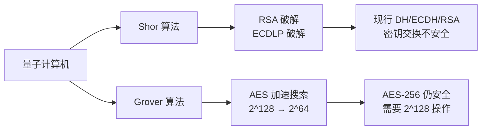

### 10.2 抗量子密钥封装机制（ML-KEM）

**ML-KEM**（Module-Lattice-Based Key Encapsulation Mechanism）是 NIST 标准化的后量子密码算法，原名为 CRYSTALS-Kyber。

ML-KEM 的安全性基于 **模格上的最短向量问题**（Shortest Vector Problem，SVP），目前没有已知的量子算法可以高效解决。

```mermaid
graph TB
    A[ML-KEM 密钥交换] --> B[客户端]
    A --> C[服务器]
    B --> D[生成 (ek, dk)<br/>Encapsulation Key]
    C --> E[用 ek 封装<br/>生成共享密钥]
    D --> F[密文 c<br/>共享密钥 K]
    E --> G[用 dk 解密<br/>得到相同 K]
    G --> H[K = K']
```

TLS 1.3 draft 已经开始支持 ML-KEM，草案名称为 `TLS 1.3 with ML-KEM`。

### 10.3 TLS 1.3 抗量子加密套件

IANA 已经注册了多个 TLS 1.3 后量子加密套件：

| IANA ID | Cipher Suite Name | 安全级别 | 状态 |
|---------|-------------------|---------|------|
| 0x6399 | TLS_ML_KEM_768_SHA256 | Level 1（约 128 位） | Draft |
| 0x639A | TLS_ML_KEM_768_SHA384 | Level 1（约 128 位） | Draft |
| 0x639B | TLS_ML_KEM_1024_SHA512 | Level 5（约 256 位） | Draft |

### 10.4 混合密钥交换

在量子安全完全确立之前，TLS 1.3 支持**混合密钥交换**，同时使用经典 ECDH 和后量子 ML-KEM：

```
hybrid_secret = HKDF-Extract(ecdh_secret, ml_kem_secret)
```

这种方案确保：
- 即使 ECDH 被量子计算机破解，ML-KEM 仍然提供安全保护
- 即使 ML-KEM 被破解，ECDHE 仍然提供安全保护
- 攻击者需要同时破解两个系统

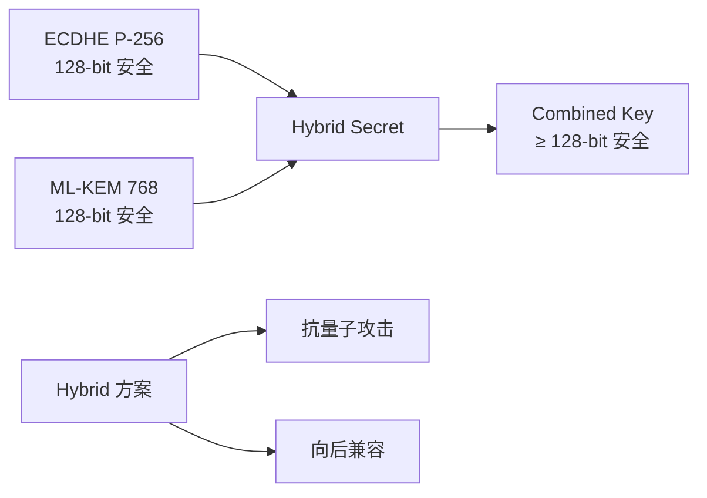

### 10.5 抗量子加密套件示例代码

```python
# 伪代码示例：混合密钥交换的密钥派生
def hybrid_key_derivation(ecdh_secret: bytes, ml_kem_secret: bytes,
                          transcript_hash: bytes) -> dict:
    """
    混合密钥交换的密钥派生

    在实际实现中，需要使用 NIST PQC 库的 API
    这里展示概念流程
    """
    # 组合两个共享密钥
    combined_secret = hkdf_extract(ecdh_secret, ml_kem_secret, hashlib.sha256)

    # 后续使用标准 TLS 1.3 密钥派生
    secrets = tls13_derive_application_secrets(combined_secret, transcript_hash)

    return {
        **secrets,
        'ecdh_secret': ecdh_secret,
        'ml_kem_secret': ml_kem_secret,
        'hybrid_secret': combined_secret,
    }

# 注意：实际使用需要引入 ml-kem 库
# from ml_kem import Kyber768
# kyber = Kyber768()
# ek, dk = kyber.keygen()
# ciphertext, shared_secret = kyber.encaps(ek)
# decrypted_secret = kyber.decaps(dk, ciphertext)
```

### 10.6 加密套件安全级别对比

| 加密套件 | 基础算法 | 密钥长度 | 经典安全 | 量子安全 | TLS 1.3 支持 |
|----------|----------|----------|----------|----------|--------------|
| TLS_AES_128_GCM_SHA256 | AES-128-GCM | 128 | 128 | 64 | ✅ |
| TLS_AES_256_GCM_SHA384 | AES-256-GCM | 256 | 256 | 128 | ✅ |
| TLS_CHACHA20_POLY1305_SHA256 | ChaCha20-Poly1305 | 256 | 256 | 128 | ✅ |
| TLS_ML_KEM_768_SHA256 | ML-KEM-768 | 128 | 128 | 128 | Draft |
| TLS_AES_256_GCM_ML_KEM_768 | Hybrid | 256+128 | 256 | 256 | Draft |

## 总结

本章深入探讨了 TLS 协议中密钥派生与加密套件的核心机制。从基础的 HKDF、PBKDF2、Argon2 等密钥派生函数，到 TLS 1.2 的 PRF 机制，再到 TLS 1.3 的 HKDF 四层密钥派生架构，我们完整地理解了密钥如何从共享秘密中派生出来。

前向保密（PFS）是现代 TLS 的核心安全属性。TLS 1.3 通过强制使用 ECDHE 密钥交换，消除了静态 RSA 密钥交换带来的历史泄露风险。

AEAD 算法（AES-GCM、ChaCha20-Poly1305、AES-CCM）将加密和认证统一为单一操作，简化了安全协议的实现并减少了攻击面。TLS 1.3 全面采用 AEAD，移除了所有不安全的 CBC + HMAC 组合。

在实际开发中，理解密钥派生的原理对于调试 TLS 问题、实现安全协议、或进行密码学审计都至关重要。通过本文提供的 Go 和 Python 代码示例，读者可以亲手实践完整的 TLS 1.3 密钥派生流程。

展望未来，ML-KEM 等后量子密码算法将逐步集成到 TLS 1.3 中，提供对抗量子计算机的加密套件。混合密钥交换方案将确保在过渡期内既有安全性又有兼容性。

---

**参考标准**：
- RFC 8446: TLS 1.3
- RFC 5246: TLS 1.2
- RFC 5869: HKDF
- RFC 8018: PBKDF2
- RFC 9106: Argon2
- NIST SP 800-108: KDF
- NIST PQC Standardization: ML-KEM (CRYSTALS-Kyber)
