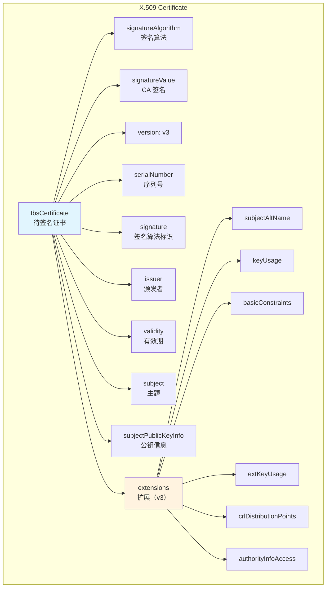
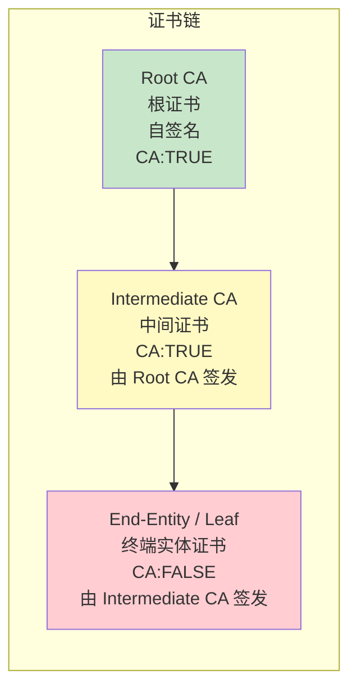
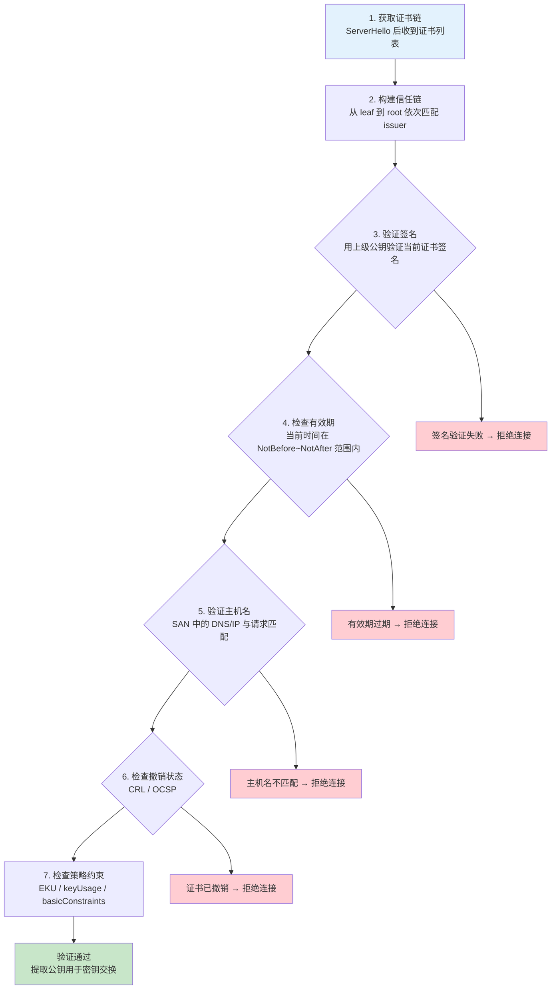
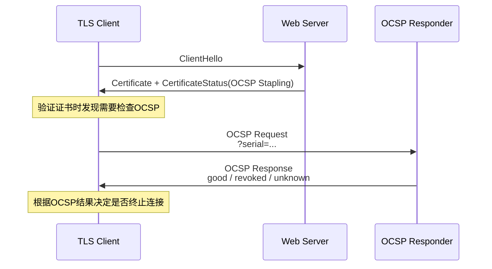
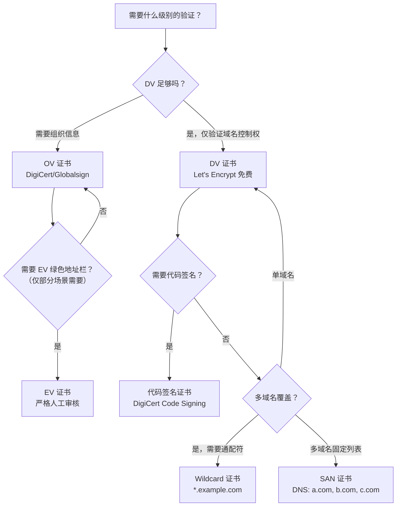
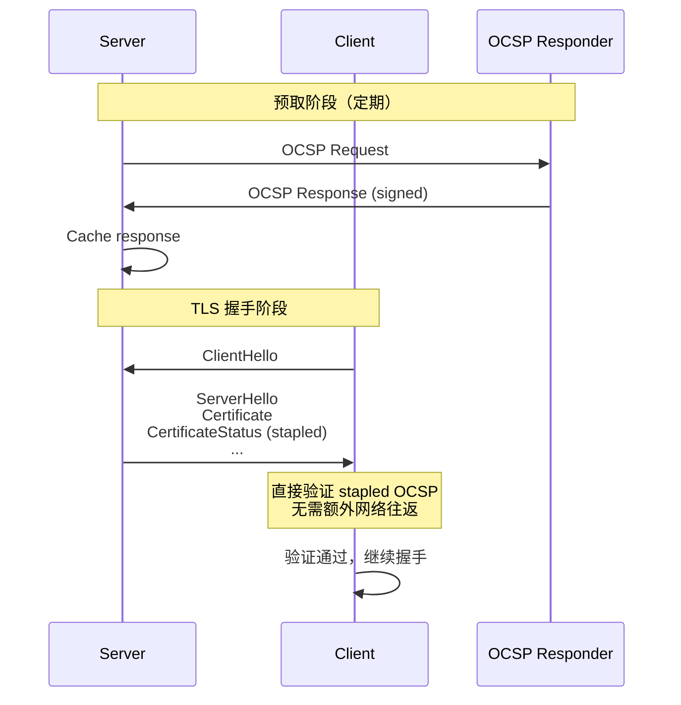
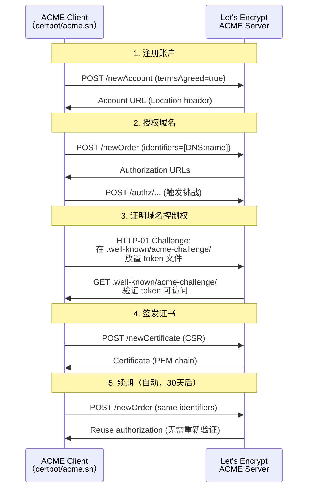

# TLS 深度探索 Ch4: 证书与 PKI 体系

```
作者：huanglin
日期：2026-05-13
预备知识：TCP/IP 协议栈、对称/非对称加密基础、TLS 1.2/1.3 握手流程
```

## 1. 数字证书结构

### 1.1 X.509 v3 证书概述

数字证书是公钥基础设施（PKI）的核心构件，其核心标准是 ITU-T 定义的 **X.509**。X.509 证书将一个公钥与一个身份（个人、组织、设备）绑定在一起，由可信的证书颁发机构（CA）签名，确保其不可伪造。

当前广泛使用的 X.509 版本是 **v3**，引入了扩展字段机制，使得证书能够承载更丰富的元数据——包括主题备用名称（SAN）、密钥用途、证书策略、CRL 分发点等。

从逻辑上讲，一张 X.509 证书可以划分为以下部分：

```
X.509 Certificate
├── tbsCertificate          # 待签名证书内容（核心数据）
│   ├── version             # 版本号（v1/v2/v3）
│   ├── serialNumber        # 序列号（CA 分配的唯一整数）
│   ├── signature           # 签名算法标识（与外层算法一致）
│   ├── issuer              # 颁发者信息
│   ├── validity            # 有效期（Not Before / Not After）
│   ├── subject             # 主题信息（证书持有者）
│   ├── subjectPublicKeyInfo # 公钥信息（算法 + 公钥值）
│   └── extensions          # 扩展（v3 新增）
├── signatureAlgorithm      # 签名算法（如 RSA-SHA256）
└── signatureValue          # 签名值（CA 对 tbsCertificate 的签名）
```

### 1.2 ASN.1 与 DER 编码

X.509 证书的内容采用 **ASN.1（Abstract Syntax Notation One）** 进行描述，使用 **DER（Distinguished Encoding Rules）** 进行二进制编码。

ASN.1 是一种与平台无关的数据描述语言，定义了诸如 `INTEGER`, `BIT STRING`, `OCTET STRING`, `OBJECT IDENTIFIER`, `SEQUENCE`, `SET` 等数据类型。以下是 X.509 证书中几个关键字段的 ASN.1 定义：

```c
/* X.509 证书核心结构（简化版） */
Certificate ::= SEQUENCE {
    tbsCertificate       TBSCertificate,
    signatureAlgorithm  AlgorithmIdentifier,
    signatureValue      BIT STRING
}

TBSCertificate ::= SEQUENCE {
    version         [0]  EXPLICIT Version DEFAULT v1,
    serialNumber         CertificateSerialNumber,
    signature           AlgorithmIdentifier,
    issuer              Name,
    validity            Validity,
    subject             Name,
    subjectPublicKeyInfo SubjectPublicKeyInfo,
    issuerUniqueID  [1]  IMPLICIT UniqueIdentifier OPTIONAL,
    subjectUniqueID [2]  IMPLICIT UniqueIdentifier OPTIONAL,
    extensions      [3]  EXPLICIT Extensions OPTIONAL
}

Validity ::= SEQUENCE {
    notBefore      Time,
    notAfter       Time
}

AlgorithmIdentifier ::= SEQUENCE {
    algorithm       OBJECT IDENTIFIER,
    parameters      ANY OPTIONAL
}
```

**OID（Object Identifier）** 是 ASN.1 中用于唯一标识各种算法和扩展的对象标识符。以下是常见 OID：

| OID 数值                | 含义                    | 备注            |
| ----------------------- | ----------------------- | --------------- |
| `1.2.840.113549.1.1.11` | sha256WithRSAEncryption | RSA-SHA256 签名 |
| `1.2.840.113549.1.1.12` | sha384WithRSAEncryption | RSA-SHA384 签名 |
| `1.2.840.10045.4.3.2`   | ecdsaWithSHA256         | ECDSA-SHA256    |
| `2.5.4.3`               | commonName              | CN 字段         |
| `2.5.4.6`               | countryName             | C（国家）       |
| `2.5.4.10`              | organizationName        | O（组织）       |
| `2.5.29.17`             | subjectAltName          | SAN 扩展        |
| `2.5.29.19`             | basicConstraints        | 基本约束        |

### 1.3 DER 与 PEM 格式

**DER** 是 X.509 证书的二进制编码格式，文件扩展名通常为 `.der` 或 `.cer`。DER 文件是自描述的，但人类无法直接阅读。

**PEM（Privacy-Enhanced Mail）** 是 DER 的 Base64 编码形式，以 `-----BEGIN CERTIFICATE-----` 和 `-----END CERTIFICATE-----` 包裹，便于在文本环境（配置文件、Environment 变量、代码）中传输。

```bash
# 查看 PEM 格式证书
$ openssl x509 -in /etc/ssl/certs/ssl-cert-snakeoil.pem -text -noout
Certificate:
    Data:
        Version: 3 (0x2)
        Serial Number:
            03:9f:5b:...
        Signature Algorithm: sha256WithRSAEncryption
        Issuer: CN = ssl-cert-snakeoil
        Validity
            Not Before: Aug 13 09:26:44 2019 GMT
            Not After : Aug 11 09:26:44 2029 GMT
        Subject: CN = ssl-cert-snakeoil
        Subject Public Key Info:
            Public Key Algorithm: rsaEncryption
                RSA Public-Key: (2048 bit)
```

```bash
# PEM 与 DER 互转
$ openssl x509 -in cert.pem -out cert.der -outform DER
$ openssl x509 -in cert.der -inform DER -out cert.pem -outform PEM
```

```python
# 使用 Python 解析证书（使用 cryptography 库）
from cryptography import x509
from cryptography.hazmat.primitives import hashes
from cryptography.hazmat.backends import default_backend

with open("cert.pem", "rb") as f:
    cert = x509.load_pem_x509_certificate(f.read(), default_backend())

print(f"Subject: {cert.subject}")
print(f"Issuer: {cert.issuer}")
print(f"Serial: {cert.serial_number}")
print(f"Not Before: {cert.not_valid_before_utc}")
print(f"Not After: {cert.not_valid_after_utc}")

# 遍历所有扩展
for ext in cert.extensions:
    print(f"  [{ext.oid.dotted_string}] {ext.oid._name}: {ext.value}")
```

### 1.4 证书数据结构图



## 2. 证书字段详解

### 2.1 Subject（主题）字段

`Subject` 字段标识证书持有者的身份，采用 **RDN（RelativDistinguishedName，相对可分辨名称）** 的层级结构。常见 RDN 类型：

| 属性                     | OID      | 示例             |
| ------------------------ | -------- | ---------------- |
| CN (Common Name)         | 2.5.4.3  | `*.example.com`  |
| C (Country)              | 2.5.4.6  | `CN`, `US`       |
| ST (State)               | 2.5.4.8  | `Beijing`        |
| L (Locality)             | 2.5.4.7  | `Beijing`        |
| O (Organization)         | 2.5.4.10 | `Example Inc.`   |
| OU (Organizational Unit) | 2.5.4.11 | `Security Dept.` |

一个完整的 Subject DN 示例：

```
CN=*.example.com,O=Example Inc.,L=Beijing,ST=Beijing,C=CN
```

在 TLS 握手中，客户端使用 `subject` 字段的 `CN` 与请求的 hostname 进行匹配（历史兼容做法），现代标准已转向 **SAN（Subject Alternate Name）** 验证。

### 2.2 Issuer（颁发者）字段

`Issuer` 字段标识签发此证书的 CA 身份，其格式与 `Subject` 完全相同。验证证书时，需要确保 `Issuer` 字段与上级证书的 `Subject` 字段严格匹配（字节级比较）。

### 2.3 Serial Number（序列号）

序列号是由 CA 分配的一个**正整数**，在同一 CA 签发的所有证书中必须唯一。序列号用于标识和撤销检查——CRL 和 OCSP 均以序列号为依据定位具体证书。

```bash
$ openssl x509 -in cert.pem -noout -serial -serial_str
serial=0DF1D52D3B2C2F5C
```

序列号通常为 8-20 字节的随机数。现代 CA（如 Let's Encrypt）使用 8 字节随机序列号，避免序列号预测攻击。

### 2.4 Validity（有效期）

证书的有效期由 `notBefore` 和 `notAfter` 两个时间点界定。TLS 握手时，客户端**必须**验证当前时间落在有效期内，否则拒绝连接。

有效期设计原则：

- **不能过长**：私钥泄露风险随时间增加
- **不能过短**：频繁续期带来运维压力
- 行业惯例：90 天（Let's Encrypt）到 3 年（老旧做法）不等
- 建议：90-397 天（CA/Browser Forum 基线要求）

```bash
# 验证证书有效期
$ openssl x509 -in cert.pem -noout -dates
notBefore=Mar 15 00:00:00 2024 GMT
notAfter=Jun 13 23:59:59 2024 GMT

# 检查剩余有效期
$ openssl x509 -in cert.pem -noout -enddate
notAfter=Jun 13 23:59:59 2024 GMT
```

### 2.5 Subject Alternative Name（SAN）

SAN 是 X.509 v3 扩展（OID `2.5.29.17`），解决了 `CN` 字段只能包含单个域名的问题。SAN 支持多种名称类型：

| 类型       | 标签                        | 示例                           |
| ---------- | --------------------------- | ------------------------------ |
| DNS Name   | `dNSName`                   | `example.com`, `*.example.com` |
| IP Address | `iPAddress`                 | `192.168.1.1`, `2001:db8::1`   |
| Email      | `rfc822Name`                | `admin@example.com`            |
| URI        | `uniformResourceIdentifier` | `https://example.com/`         |

**RFC 6125** 明确规定：TLS 客户端应该**只使用 SAN 进行主机名验证**，忽略 `CN`。

```bash
# 查看证书 SAN
$ openssl x509 -in cert.pem -noout -ext subjectAltName
X509v3 Subject Alternative Name:
    DNS:*.example.com, DNS:example.com, IP Address:10.0.0.1
```

```go
// Go 语言验证主机名与 SAN 匹配
package main

import (
    "crypto/tls"
    "net"
    "fmt"
)

func verifyHostname(cert *tls.Certificate, hostname string) error {
    leaf := cert.Leaf
    if leaf == nil {
        return fmt.Errorf("failed to parse certificate")
    }

    // 尝试匹配 DNS 名称
    for _, dns := range leaf.DNSNames {
        if matchWildcard(dns, hostname) || dns == hostname {
            return nil
        }
    }

    // 尝试匹配 IP 地址
    for _, ip := range leaf.IPAddresses {
        if ip.String() == hostname || ip.Equal(net.ParseIP(hostname)) {
            return nil
        }
    }

    return fmt.Errorf("no SAN match for %s", hostname)
}

func matchWildcard(pattern, hostname string) bool {
    if len(pattern) < 3 || pattern[:2] != "*." {
        return false
    }
    suffix := pattern[1:] // ".example.com"
    return len(hostname) > len(suffix) && hostname[len(hostname)-len(suffix):] == suffix
}
```

### 2.6 其他重要扩展

**keyUsage（密钥用途）**

```bash
$ openssl x509 -in cert.pem -noout -ext keyUsage
X509v3 Key Usage:
    Digital Signature, Key Encipherment
```

- `digitalSignature`：签名（用于 TLS 密钥交换）
- `keyEncipherment`：加密（用于 RSA 密钥交换）
- `keyCertSign`：证书签名（仅 CA 证书设置）
- `cRLSign`：CRL 签名（仅 CA 证书设置）

**extKeyUsage（扩展密钥用途）**

```bash
$ openssl x509 -in cert.pem -noout -ext extendedKeyUsage
X509v3 Extended Key Usage:
    TLS Web Server Authentication, TLS Web Client Authentication
```

- `serverAuth`：TLS 服务器认证（1.3.6.1.5.5.7.3.1）
- `clientAuth`：TLS 客户端认证（1.3.6.1.5.5.7.3.2）
- `codeSigning`：代码签名（1.3.6.1.5.5.7.3.3）
- `timeStamping`：时间戳（1.3.6.1.5.5.7.3.4）

**basicConstraints（基本约束）**

```bash
$ openssl x509 -in cert.pem -noout -ext basicConstraints
X509v3 Basic Constraints:
    CA:FALSE   # 或 CA:TRUE 表示 CA 证书
```

- `CA:FALSE`：终端实体证书（leaf certificate）
- `CA:TRUE`：CA 证书，可继续签发下级证书

## 3. 证书链与信任锚

### 3.1 证书链的概念

在实际 TLS 部署中，服务器通常不会直接返回根证书（Root CA），而是通过**证书链**提供从终端实体证书到根证书的完整信任路径。



典型的证书链包含 2-3 个证书：

```
-----BEGIN CERTIFICATE-----
[Leaf Certificate]          # 终端实体证书（服务器证书）
-----END CERTIFICATE-----
-----BEGIN CERTIFICATE-----
[Intermediate Certificate] # 中间 CA 证书
-----END CERTIFICATE-----
-----BEGIN CERTIFICATE-----
[Root Certificate]          # 根证书（可选，通常由客户端系统预置）
-----END CERTIFICATE-----
```

### 3.2 信任锚（Trust Anchor）

**信任锚（Trust Anchor）** 是客户端本地预先配置的可信根证书。操作系统（Windows/macOS/Linux）和浏览器维护着自己的根证书存储。

主流根证书颁发机构：

- **DigiCert**（收购了 VeriSign/GTE CyberTrust）
- **IdenTrust**（DigiCert Global Root G2）
- **GoDaddy / GlobalSign**
- **Amazon Root CA**（AWS 服务）
- **Let's Encrypt**（ISRG Root X1，已进入大多数根存储）

```bash
# 查看系统根证书存储
$ ls /etc/ssl/certs/ | head -20
ca-certificates.crt      # Debian/Ubuntu 聚合文件
$ openssl storeutl -noout -text -engine /dev/null /etc/ssl/certs/ca-certificates.crt 2>/dev/null | grep "Object" | head -10

# macOS 钥匙串访问查看根证书
$ security find-certificate -a -p /Library/Keychains/System.keychain | openssl x509 -noout -subject

# Windows certlm.msc（本地计算机证书存储）
```

### 3.3 证书链的构建与发送

服务器在 TLS 握手阶段发送证书链时，按照从 leaf 到 root 的顺序发送（通常不包括 root，客户端已有）。顺序错误是常见的配置错误。

```bash
# 查看证书链
$ openssl s_client -connect example.com:443 -showcerts </dev/null 2>/dev/null \
    | openssl x509 -noout -subject -issuer -serial

# 检查证书链完整性
$ openssl verify -CAfile /etc/ssl/certs/ca-certificates.crt cert.pem

# 完整验证链并检查每一级
$ openssl verify -verbose -show_chain -CAfile bundle.pem cert.pem
```

```python
# Python 验证证书链
from cryptography import x509
from cryptography.hazmat.primitives import hashes
from cryptography.hazmat.backends import default_backend
import tempfile
import os

def verify_certificate_chain(cert_pem: bytes, chain_pem: list[bytes],
                              ca_certs_pem: list[bytes]) -> dict:
    """
    验证证书链：
    1. 验证每个证书的签名
    2. 检查有效期
    3. 验证链的完整性（issuer 匹配）
    """
    results = {
        "valid": True,
        "chain": [],
        "errors": []
    }

    # 加载所有证书
    cert = x509.load_pem_x509_certificate(cert_pem, default_backend())
    intermediates = [x509.load_pem_x509_certificate(p, default_backend())
                     for p in chain_pem]
    ca_certs = [x509.load_pem_x509_certificate(p, default_backend())
                for p in ca_certs_pem]

    all_certs = intermediates + ca_certs
    cert_dict = {c.subject: c for c in all_certs}

    # 查找签发者
    current_cert = cert
    depth = 0
    max_depth = 10

    while depth < max_depth:
        issuer = None
        for c in all_certs:
            if c.subject == current_cert.issuer:
                issuer = c
                break

        if issuer is None:
            if depth == 0:
                # 自签名根证书
                pass
            else:
                results["valid"] = False
                results["errors"].append(
                    f"Cannot find issuer for {current_cert.subject}")
            break

        # 验证签名
        try:
            issuer.public_key().verify(
                current_cert.signature,
                current_cert.tbs_certificate_bytes,
                current_cert.signature_algorithm_parameters
            )
            results["chain"].append({
                "subject": str(current_cert.subject),
                "issuer": str(current_cert.issuer),
                "signature_valid": True
            })
        except Exception as e:
            results["valid"] = False
            results["errors"].append(f"Signature invalid: {e}")

        if issuer.subject == issuer.issuer:
            # 到达根证书
            results["chain"].append({
                "subject": str(issuer.subject),
                "issuer": str(issuer.issuer),
                "is_root": True
            })
            break

        current_cert = issuer
        depth += 1

    return results
```

### 3.4 证书链深度对比

| 证书类型        | CA 标记  | 能否签名其他证书 | 典型用途                |
| --------------- | -------- | ---------------- | ----------------------- |
| Root CA         | CA:TRUE  | 是（自签名）     | 预置在系统/浏览器信任库 |
| Intermediate CA | CA:TRUE  | 是               | 实际签发终端证书        |
| Cross-Sign CA   | CA:TRUE  | 是               | 跨不同根证书的交叉签名  |
| End-Entity      | CA:FALSE | 否               | 服务器/客户端身份标识   |

## 4. 证书验证流程

### 4.1 完整验证流程概览

TLS 客户端对证书的验证是一个多步骤过程，任意一步失败都会导致连接终止。



### 4.2 链构建（Chain Building）

链构建的目标是从服务器提供的证书列表中，找到一条连续的信任路径，到达本地信任锚。

算法步骤：

1. 以 leaf 证书为起点
2. 在证书列表或本地存储中查找 `subject == 当前证书.issuer` 的证书
3. 重复直到找到自签名根证书，或确定链不完整

```python
def build_certificate_path(cert: x509.Certificate,
                            trust_store: list[x509.Certificate],
                            intermediates: list[x509.Certificate]) -> list[x509.Certificate]:
    """构建从 leaf 到 root 的证书路径"""
    all_certs = intermediates + trust_store
    cert_dict = {c.subject: c for c in all_certs}

    path = [cert]
    current = cert
    visited = set()

    while current.issuer != current.subject:  # 直到自签名根
        if current.subject in visited:
            raise ValueError("Cycle detected in certificate chain")
        visited.add(current.subject)

        issuer = cert_dict.get(current.issuer)
        if issuer is None:
            raise ValueError(f"Cannot find issuer for {current.issuer}")

        path.append(issuer)
        current = issuer

        if current.subject == current.issuer:
            # 自签名根
            if issuer not in trust_store:
                raise ValueError("Root certificate not in trust store")
            break

    return path
```

### 4.3 签名验证（Signature Verification）

签名验证确保证书内容未被篡改，且确实由声称的颁发者签发：

```
signature = CA_private_key.sign(
    algorithm=SHA256,
    message=tbsCertificate_bytes
)

valid = CA_public_key.verify(
    signature=signature,
    message=tbsCertificate_bytes,
    algorithm=SHA256
)
```

关键检查点：

- 签名算法一致性：`tbsCertificate.signature` 与 `signatureAlgorithm` 必须匹配
- 公钥算法兼容性：如 RSA 公钥不能验证 ECDSA 签名
- 签名参数正确性：ECDSA 签名需要曲线的参数

### 4.4 有效期检查

```python
from datetime import datetime, timezone

def check_validity(cert: x509.Certificate,
                   now: datetime = None) -> tuple[bool, str]:
    """检查证书有效期"""
    if now is None:
        now = datetime.now(timezone.utc)

    if now < cert.not_valid_before_utc:
        return False, f"Certificate not yet valid. Valid from {cert.not_valid_before_utc}"

    if now > cert.not_valid_after_utc:
        return False, f"Certificate expired at {cert.not_valid_after_utc}"

    return True, "Certificate is valid"
```

### 4.5 CRL（Certificate Revocation List）

CRL 是 RFC 5280 定义的吊销列表，由 CA 定期发布。CRL 包含已被撤销的证书序列号和撤销时间。

```
CRL ::= SEQUENCE {
    tbsCertList        TBSCertList,
    signatureAlgorithm AlgorithmIdentifier,
    signatureValue     BIT STRING
}

TBSCertList ::= SEQUENCE {
    version             Version OPTIONAL,
    signature           AlgorithmIdentifier,
    issuer              Name,
    thisUpdate          Time,
    nextUpdate          Time OPTIONAL,
    revokedCertificates SEQUENCE OF RevokedCertificate OPTIONAL,
    extensions          Extensions OPTIONAL
}
```

```bash
# 查看 CRL 分发点
$ openssl x509 -in cert.pem -noout -ext crlDistributionPoints
X509v3 CRL Distribution Points:
    Full Name:
        URI:http://crl.example.com/ca.crl

# 下载并查看 CRL
$ wget -O ca.crl http://crl.example.com/ca.crl
$ openssl crl -in ca.crl -inform DER -noout -text | head -30
```

CRL 的主要缺点：

- **实时性差**：CRL 更新周期可能是小时级甚至天级
- **体积膨胀**：热门 CA 的 CRL 可能达到数百 MB
- **分发效率低**：每次验证都需要下载完整列表

### 4.6 OCSP（Online Certificate Status Protocol）

OCSP（RFC 6960）提供了实时查询单张证书状态的机制，比 CRL 更高效：



```bash
# 查看 OCSP 响应者地址
$ openssl x509 -in cert.pem -noout -ext authorityInfoAccess
X509v3 Authority Information Access:
    OCSP - URI:http://ocsp.example.com

# 手动查询 OCSP 状态
$ openssl ocsp -CAfile chain.pem \
    -issuer intermediate.pem \
    -cert cert.pem \
    -url http://ocsp.example.com \
    -resp_text

OCSP Response Data:
    OCSP Response Status: successful (0x0)
    CertStatus: good
    ThisUpdate: 2024-05-10 08:00:00 UTC
    NextUpdate: 2024-05-17 08:00:00 UTC
```

OCSP 存在隐私问题（CA 可以看到谁在验证哪些证书）和性能问题（增加一次网络往返）。**OCSP Stapling** 解决了这些问题——服务器预先从 CA 获取 OCSP 响应，在 TLS 握手中附带给客户端。

### 4.7 完整验证示例

```go
// Go 标准库对证书验证的完整实现
package main

import (
    "crypto/tls"
    "crypto/x509"
    "fmt"
    "net"
    "io/ioutil"
)

func verifyTLSConnection(hostname string, caCertPath string) error {
    // 加载 CA 证书
    caCertPEM, err := ioutil.ReadFile(caCertPath)
    if err != nil {
        return fmt.Errorf("failed to read CA cert: %w", err)
    }

    caCertPool := x509.NewCertPool()
    if !caCertPool.AppendCertsFromPEM(caCertPEM) {
        return fmt.Errorf("failed to parse CA certificate")
    }

    // 建立 TLS 连接
    conn, err := tls.Dial("tcp", net.JoinHostPort(hostname, "443"),
        &tls.Config{
            RootCAs:    caCertPool,
            MinVersion: tls.VersionTLS12,
            // ServerName 由 dial 自动设置
        })
    if err != nil {
        return fmt.Errorf("TLS dial failed: %w", err)
    }
    defer conn.Close()

    // 验证证书链
    state := conn.ConnectionState()
    if len(state.VerifiedChains) == 0 {
        return fmt.Errorf("no verified chain - verification failed")
    }

    chain := state.VerifiedChains[0]
    fmt.Printf("Verified chain (%d certs):\n", len(chain))
    for i, cert := range chain {
        fmt.Printf("  [%d] %s\n", i, cert.Subject)
    }

    return nil
}
```

## 5. 自签名证书与自建 CA

### 5.1 自签名证书

自签名证书是自己给自己签发的证书，不依赖任何外部 CA。适用于：

- 本地开发环境（HTTPS localhost）
- 内网服务（无外部 CA 访问需求）
- 测试/演示环境

```bash
# 生成 RSA 自签名证书（3年有效期）
$ openssl req -x509 -newkey rsa:4096 \
    -keyout key.pem \
    -out cert.pem \
    -days 1095 \
    -nodes \
    -subj "/CN=localhost/O=Development/C=CN" \
    -addext "subjectAltName=DNS:localhost,IP:127.0.0.1"

# 生成 ECDSA P-256 自签名证书（更小、更安全）
$ openssl ecparam -genkey -name prime256v1 -noout -out ec_key.pem
$ openssl req -new -x509 -key ec_key.pem -out ec_cert.pem \
    -days 365 \
    -subj "/CN=localhost" \
    -addext "subjectAltName=DNS:localhost"

# 验证自签名证书
$ openssl verify -CAfile cert.pem cert.pem
cert.pem: OK
```

```bash
# 使用 mkcert（推荐：自动处理 SAN + 本地 CA）
$ sudo apt install libnss3-tools    # 依赖
$ go install github.com/FiloSottile/mkcert@latest
$ mkcert -install                    # 安装本地 CA 到系统信任存储
$ mkcert localhost 127.0.0.1 ::1     # 生成证书
Created a new certificate valid for the following names
 - "localhost"
 - "127.0.0.1"
 - "::1"

$ ls -la
localhost+2-key.pem   # 私钥
localhost+2.pem       # 证书（含完整链）
```

```python
# Python 生成自签名证书
from cryptography import x509
from cryptography.x509.oid import NameOID, SubjectAlternativeName
from cryptography.hazmat.primitives import hashes, serialization
from cryptography.hazmat.primitives.asymmetric import rsa
from cryptography.hazmat.backends import default_backend
import datetime

def generate_self_signed_cert(
    cn: str,
    san_dns: list[str] = None,
    key_size: int = 2048,
    validity_days: int = 365
) -> tuple[x509.Certificate, rsa.RSAPrivateKey]:
    """生成自签名 RSA 证书"""

    # 生成私钥
    private_key = rsa.generate_private_key(
        public_exponent=65537,
        key_size=key_size,
        backend=default_backend()
    )

    # 构建 Subject
    subject = issuer = x509.Name([
        x509.NameAttribute(NameOID.COMMON_NAME, cn),
    ])

    # 构建证书
    cert = (
        x509.CertificateBuilder()
        .subject_name(subject)
        .issuer_name(issuer)  # 自签名：issuer == subject
        .public_key(private_key.public_key())
        .serial_number(x509.random_serial_number())
        .not_valid_before(datetime.datetime.now(datetime.timezone.utc))
        .not_valid_after(
            datetime.datetime.now(datetime.timezone.utc) +
            datetime.timedelta(days=validity_days)
        )
        .add_extension(
            SubjectAlternativeName([
                x509.DNSName(san) for san in (san_dns or [cn])
            ]),
            critical=False,
        )
        .sign(private_key, hashes.SHA256(), default_backend())
    )

    return cert, private_key

# 使用示例
cert, key = generate_self_signed_cert(
    cn="localhost",
    san_dns=["localhost", "*.dev.local"],
    key_size=2048,
    validity_days=365
)

# 导出为 PEM
cert_pem = cert.public_bytes(serialization.Encoding.PEM)
key_pem = serialization.load_pem_private_key(
    cert_pem, password=None, backend=default_backend()
)
```

### 5.2 自建 CA 与 openssl ca

对于需要模拟真实 PKI 场景（签发内部证书、测试证书链验证），可以使用 `openssl ca` 搭建私有 CA。

```bash
# ========== 步骤 1: 创建 CA 目录结构 ==========
$ mkdir -p demoCA/{certs,crl,newcerts,private}
$ chmod 700 demoCA/private
$ touch demoCA/index.txt
$ echo "01" > demoCA/serial
$ echo "01" > demoCA/crlnumber

# ========== 步骤 2: 生成 CA 私钥和自签名证书 ==========
$ openssl ecparam -genkey -name prime256v1 | openssl ec -out demoCA/private/ca_key.pem
$ openssl req -new -x509 -key demoCA/private/ca_key.pem \
    -out demoCA/certs/ca_cert.pem \
    -days 3650 \
    -subj "/CN=MyRootCA/O=TestOrg/C=CN" \
    -addext "basicConstraints=critical,CA:TRUE" \
    -addext "keyUsage=critical,keyCertSign,cRLSign"

# ========== 步骤 3: 创建 CA 配置文件 ==========
$ cat > ca.conf << 'EOF'
[ca]
default_ca = CA_default

[CA_default]
database     = ./demoCA/index.txt
new_certs_dir = ./demoCA/newcerts
serial      = ./demoCA/serial
crlnumber   = ./demoCA/crlnumber
crl         = ./demoCA/crl/ca.crl
private_key = ./demoCA/private/ca_key.pem
certificate = ./demoCA/certs/ca_cert.pem
default_md  = sha256
policy      = policy_anything
copy_extensions = copy

[policy_anything]
countryName            = optional
stateOrProvinceName    = optional
localityName           = optional
organizationName       = optional
organizationalUnitName = optional
commonName            = supplied
emailAddress          = optional

[req]
distinguished_name = req_distinguished_name
x509_extensions = v3_ca

[req_distinguished_name]

[v3_ca]
basicConstraints = critical, CA:TRUE
keyUsage = critical, keyCertSign, cRLSign

[v3_intermediate_ca]
basicConstraints = critical, CA:TRUE, pathlen:0
keyUsage = critical, keyCertSign, cRLSign
EOF

# ========== 步骤 4: 使用 CA 签发终端实体证书 ==========
$ openssl genpkey -algorithm RSA -out server_key.pem
$ openssl req -new -key server_key.pem \
    -out server.csr \
    -subj "/CN=server.example.com/O=TestOrg" \
    -addext "subjectAltName=DNS:server.example.com,DNS:*.example.com"

# 签发证书（使用 v3_intermediate_ca 扩展）
$ openssl ca -config ca.conf \
    -in server.csr \
    -out server_cert.pem \
    -extensions v3_intermediate_ca \
    -days 365

Using configuration from ca.conf
Check that the request matches the signature
Signature ok
Certificate Details:
    Serial Number: 01
    Validity
        Not Before: May 13 00:00:00 2026 GMT
        Not After: May 13 00:00:00 2027 GMT
    Subject:
        commonName=server.example.com
        organizationName=TestOrg
    X509v3 extensions:
        basicConstraints: CA:FALSE   <-- 注意：终端实体应该是 FALSE
Sign the certificate? [y/n]: y

# ========== 步骤 5: 验证签发的证书 ==========
$ openssl verify -CAfile demoCA/certs/ca_cert.pem server_cert.pem
server_cert.pem: OK
```

### 5.3 CFSSL：云原生 CA 工具

CFSSL 是 CloudFlare 开发的 CA 工具包，支持 API 驱动的证书签发，适合构建自动化 PKI。

```bash
# 安装 CFSSL
$ go install github.com/cloudflare/cfssl/cmd/...@latest

# 初始化 CA
$ cfssl print-defaults config > ca-config.json
$ cfssl print-defaults csr > ca-csr.json

# 生成 CA 证书
$ cfssl gencert -initca ca-csr.json | cfssljson -bare ca
$ ls ca*.pem
ca.csr  ca-key.pem  ca.pem

# 签发证书（通过 API）
$ cfssl serve -ca=ca.pem -ca-key=ca-key.pem
```

```json
// ca-config.json
{
  "signing": {
    "default": {
      "expiry": "8760h",
      "usages": ["digital signature", "key encipherment", "server auth"]
    },
    "profiles": {
      "intermediate": {
        "expiry": "87600h",
        "ca_constraint": { "is_ca": true, "max_path_len": 0 }
      },
      "end-entity": {
        "expiry": "720h",
        "usages": ["digital signature", "key encipherment", "server auth"]
      }
    }
  }
}
```

### 5.4 自建 CA 工具对比

| 工具              | 复杂度 | API 支持 | 适用场景                     |
| ----------------- | ------ | -------- | ---------------------------- |
| `openssl ca`      | 中     | 无       | 手动签发、小规模内部 CA      |
| CFSSL             | 中     | 是       | 自动化 PKI、Kubernetes Istio |
| step (Smallstep)  | 低     | 是       | 云原生环境、自动化           |
| Vault PKI         | 高     | 是       | 企业级 PKI、密钥管理         |
| mkcert            | 极低   | 无       | 本地开发仅限                 |
| CFSSL + cfssljson | 中     | 是       | 需要脚本化 CA 管理的场景     |

## 6. 证书类型详解

### 6.1 证书验证级别对比

| 类型   | 全称                    | 验证内容                      | 签发速度 | 浏览器标识                     |
| ------ | ----------------------- | ----------------------------- | -------- | ------------------------------ |
| **DV** | Domain Validation       | 域名控制权                    | 分钟级   | 绿色锁（无单位名）             |
| **OV** | Organization Validation | 域名 + 申请者组织信息         | 1-3 天   | 锁 + 组织名                    |
| **EV** | Extended Validation     | 严格人工审核 + 组织法律存在性 | 3-7 天   | 绿色地址栏（部分浏览器已移除） |

```bash
# DV 证书示例（Let's Encrypt）
$ openssl x509 -in dv_cert.pem -noout -text \
    | grep -E "Subject:|Issuer:|OCSP|CA:" | head -10
    Subject: CN = example.com
    Issuer: C = US, O = Let's Encrypt, CN = R3

# EV 证书示例（带 OID 策略）
$ openssl x509 -in ev_cert.pem -noout -text \
    | grep -E "1.3.6.1.1" | head -5
    X509v3 Certificate Policies:
        Policy: 2.23.140.1.1   # EV 基准策略 OID
```

### 6.2 代码签名证书

代码签名证书用于签名可执行文件、驱动程序、脚本等，确保软件来源可信且未被篡改。

```bash
# 生成代码签名证书请求
$ openssl req -newkey rsa:4096 -keyout code_signing_key.pem \
    -out code_signing.csr \
    -subj "/CN=Example Software/O=Example Inc." \
    -addext "keyUsage=critical,digitalSignature" \
    -addext "extKeyUsage=codeSigning"

# 查看代码签名证书扩展
$ openssl x509 -in code_sign_cert.pem -noout -ext extKeyUsage
X509v3 Extended Key Usage:
    Code Signing (1.3.6.1.5.5.7.3.3)
```

代码签名证书还需要 **Microsoft Authenticode** 或 **Apple Developer ID** 的附加签名流程：

```bash
# Windows Authenticode 签名（使用 osslsigncode）
$ osslsigncode sign \
    -certs code_sign_cert.pem \
    -key code_signing_key.pem \
    -in unsigned.exe \
    -out signed.exe

# 验证签名
$ osslsigncode verify signed.exe
Current PE signature is valid
Verified container: signed.exe
```

### 6.3 Wildcard（通配符）证书

通配符证书使用 `*.example.com` 格式，可以覆盖同一级别所有子域名。

```
*.example.com 匹配：
  ✓ api.example.com
  ✓ webapp.example.com
  ✓ cdn.example.com
  ✗ example.com        （根域名不匹配）
  ✗ sub.api.example.com（多级子域名不匹配）
```

| 特性     | 单域名证书     | Wildcard 证书                   |
| -------- | -------------- | ------------------------------- |
| 覆盖范围 | 1 个域名       | 同一级别全部子域名              |
| 私钥管理 | 简单           | 风险集中（一个私钥=所有子域名） |
| 安全性   | 高（最小权限） | 中（私钥泄露影响面大）          |
| 成本     | 低-中          | 高                              |

**安全建议**：如果子域名数量可预期（<10），优先使用多个单域名证书而非通配符证书，以限制私钥泄露的影响范围。

### 6.4 证书类型决策树



## 7. SAN 与多域名证书

### 7.1 SAN 的类型与编码

SAN 扩展（`subjectAltName`，OID `2.5.29.17`）是 X.509 v3 中最重要的扩展之一，解决了 `CN` 的多个限制：

1. `CN` 只能包含 ASCII 字符，SAN 支持国际化域名（IDN/Punycode）
2. `CN` 只能有一个值，SAN 支持多个条目
3. `CN` 无法包含 IP 地址，SAN 支持 IP 地址格式

**IDN（Internationalized Domain Name）处理**：

```
example公司.com（中文域名）
  → 转换为 Punycode: xn--fiqs03s.example.com
  → SAN 中存储: DNS:xn--fiqs03s.example.com
```

### 7.2 多域名证书实战

```bash
# 生成多域名 SAN 证书
$ cat > san.cnf << 'EOF'
[req]
distinguished_name = req_distinguished_name
req_extensions = v3_req
prompt = no

[req_distinguished_name]
CN = Example Inc.

[v3_req]
subjectAltName = @alt_names

[alt_names]
DNS.1 = example.com
DNS.2 = www.example.com
DNS.3 = api.example.com
DNS.4 = *.app.example.com
IP.1 = 10.0.0.1
IP.2 = 192.168.1.100
EOF

$ openssl req -newkey rsa:4096 -keyout san_key.pem \
    -out san_csr.pem -config san.cnf

# 签发时复制 SAN 扩展（需在 openssl.cnf 中配置 copy_extensions）
$ openssl ca -in san_csr.pem -out san_cert.pem -extensions v3_req

# 验证
$ openssl x509 -in san_cert.pem -noout -ext subjectAltName
X509v3 Subject Alternative Name:
    DNS:example.com, DNS:www.example.com, DNS:api.example.com
    DNS:*.app.example.com, IP Address:10.0.0.1, IP Address:192.168.1.100
```

### 7.3 SAN 与 IP 地址

RFC 2818 规定 HTTPS 可以通过 IP 地址访问，但浏览器对 IP SAN 有严格限制：

```bash
# 有效的 IP SAN（RFC 3779 格式）
# IPv4: 4 字节大端序编码
# IPv6: 16 字节大端序编码

# 示例：10.0.0.1 的 DER 编码
$ python3 -c "
import ipaddress
ip = ipaddress.ip_address('10.0.0.1')
print('hex:', ip.packed.hex())
"
hex: 0a000001
```

**浏览器限制**：

- Chrome/Firefox 仅接受**公共 IP**（RFC 1918 私有 IP 在公网证书中不受信任）
- 建议：内网服务使用私有 CA 而非公网信任的 CA

### 7.4 常见 SAN 配置错误

| 错误                         | 后果                                     | 修复方法                 |
| ---------------------------- | ---------------------------------------- | ------------------------ |
| SAN 中缺少主域名（仅 CN 有） | 现代浏览器不读取 CN                      | 在 SAN 中同时包含主域名  |
| 通配符级别不匹配             | `*.example.com` 不覆盖 `sub.example.com` | 使用 `*.sub.example.com` |
| Punycode 编码错误            | IDN 域名验证失败                         | 正确使用 `xn--` 前缀     |
| IP 地址格式错误              | IP SAN 验证失败                          | 使用 RFC 3779 正确编码   |

## 8. 证书透明度（Certificate Transparency）

### 8.1 为什么需要 CT

证书透明度的核心问题是：**如果 CA 被攻击或误签，恶意证书将分发给全球所有浏览器，如何检测？**

传统 PKI 无法回答这个问题——客户端只知道证书"有效"（签名正确、链完整、没过期），但无法知道这张证书是否是该域名唯一被签发的合法证书。

**2011 年 DigiNotar 事件**证明了这个问题的严重性：攻击者入侵 DigiNotar CA 后，签发了数百张伪造证书（包括 Google、Yahoo、Tor），监控显示这些证书被用于伊朗用户的中间人攻击，历时数月才被发现。

### 8.2 CT 架构

Certificate Transparency（RFC 6962）通过引入**公开日志服务器**来解决这个问题：

```mermaid
flowchart LR
    subgraph "CA 侧"
        CA["CA<br/>签发证书"]
    end

    subgraph "CT 生态系统"
        subgraph "Log Server（公开日志）"
            L1["Google Argon<br/>Rock Squid<br/>Cloudflare<br/>DigiCert"]
            L2["..."
        ]
    end

    subgraph "监控与审计"
        M["CT Monitor<br/>监控异常证书"]
        A["CT Auditor<br/>验证日志一致性"]
    end

    CA -->|"1. 签发前：提交 PreCertificate| SCT|"| L1
    L1 -->|"2. 返回 SCT<br/>（Signed Certificate Timestamp）"| CA
    CA -->|"3. 在证书中嵌入 SCT<br/>（X.509 扩展或 TLS 扩展）"| S["Web Server"]
    S -->|"4. TLS 握手"| C["Client"]
    C -->|"5. 验证 SCT| 连接"]

    L1 -->|"6. 定期签名"| M
    L1 -->|"7. Merkle 一致性证明"| A

    style L1 fill:#e8f5e9
    style M fill:#fff3e0
    style A fill:#fff3e0
```

### 8.3 SCT（Signed Certificate Timestamp）

SCT 是日志服务器对 PreCertificate 的签名承诺，包含：

- **日志名称**：签发 SCT 的服务器身份
- **签名时间**：日志接收到请求的时间
- **Merkle 树索引**：证书在日志中的位置
- **签名**：日志服务器的签名

SCT 的嵌入方式（优先级从高到低）：

| 方式           | 说明                                       | RFC       |
| -------------- | ------------------------------------------ | --------- |
| **X.509 扩展** | `poison` + `sct-list` 扩展嵌入证书本身     | RFC 6962B |
| **TLS 扩展**   | 在 TLS 握手中通过 `extension_type=18` 传输 | RFC 6962  |
| **OCSP 响应**  | 通过 OCSP stapling 提供                    | RFC 6962  |

```bash
# 查看证书中的 SCT
$ openssl x509 -in cert.pem -noout -ext ct_precert_sct
    CT Precertificate SCT:
        Signed Certificate Timestamp:
            Version   : v1
            Log ID    : E2E2E2E2E2E2E2E2E2E2E2E2E2E2E2E2E2E2E2E2
            Timestamp : Mar 15 2024 12:00:00.000000000 UTC
            Extensions: none
            Signature : h4j4j4j4...

# 使用 crt.sh 查询证书透明度日志
$ curl -s "https://crt.sh/?q=example.com&output=json" \
    | jq '.[].name, .[].not_before, .[].issuer_ca_id' | head -30
```

### 8.4 Merkle 树与可验证性

CT 日志使用 **Merkle Hash Tree** 确保日志不可篡改。每个叶子节点是一张证书的哈希，父节点是两个子节点哈希的拼接：

```
Merkle Tree (示例 4 叶子节点):
           Root
          /    \
        H12     H34
       /  \    /   \
     H1   H2  H3   H4
     |    |   |    |
    cert1 cert2 cert3 cert4
```

**一致性证明**：任何人都可以验证新根哈希是否由原根哈希和新叶子节点计算得出，即使没有完整的树结构。

### 8.5 Google Argon 与主流 CT 日志

| 日志服务器 | 运营商     | 证书数量 | 备注         |
| ---------- | ---------- | -------- | ------------ |
| Argon      | Google     | ~50 亿   | 最大最活跃   |
| Rock Squid | DigiCert   | ~30 亿   | 企业友好     |
| Fortinet   | Cloudflare | ~10 亿   | 与 WAF 集成  |
| Izenpe     | Izenpe     | ~5 亿    | 欧洲 CA 主导 |

**浏览器要求**：Chrome 要求所有 EV 证书必须嵌入至少 2 个 CT 日志的 SCT，EV 证书没有 CT 则不受信任。

### 8.6 CT 监控工具

```bash
# 使用 certstream 实时监控 CT 日志（Python）
$ pip install certstream

$ python3 -c "
import certstream

def on_message(message, context):
    if message['data']:
        leaf = message['data']['leaf_cert']
        print(f\"{leaf['not_before']} - {leaf['subject']['common_name']}\")

client = certstream.CertStreamClient(on_message)
client.start()
"

# crt.sh 离线查询
$ psql -h crt.sh -p 5432 -U guest certwatch \
    -c \"SELECT name, not_before, issuer_name
         FROM certificate_view
         WHERE name ~ '.*example\\.com'
         ORDER BY not_before DESC LIMIT 10;\"
```

## 9. 证书吊销

### 9.1 吊销机制对比

证书吊销是 PKI 中最复杂也最容易出问题的环节之一。当私钥泄露或不再需要时，CA 需要能够声明某张证书"立即失效"。

| 机制                 | 协议       | 实时性      | 隐私                | 性能影响         |
| -------------------- | ---------- | ----------- | ------------------- | ---------------- |
| **CRL**              | 文件分发   | 几小时-几天 | 好                  | 大（全量下载）   |
| **OCSP**             | HTTP 查询  | 分钟级      | 差（CA 知道你查谁） | 中（额外 RTT）   |
| **OCSP Stapling**    | TLS 内嵌   | 分钟级      | 好                  | 无（握手内完成） |
| **OCSP Must-Staple** | 证书扩展   | 分钟级      | 好                  | 无               |
| **CRLite**           | 布隆过滤器 | 好          | 好                  | 极小             |
| **CRLite + Mozilla** | 布隆过滤器 | 天级        | 好                  | 极小             |

### 9.2 CRL 详解

CRL 由 CA 定期（通常每小时或每天）生成，包含该 CA 撤销的所有证书序列号：

```bash
# 查看 CRL 内容
$ openssl crl -in ca.crl -inform DER -noout -text | head -40
Certificate Revocation List (CRL):
    Version 2 (0x1)
    Signature Algorithm: sha256WithRSAEncryption
    Issuer: /CN=MyRootCA/O=TestOrg
    Last Update: May 13 00:00:00 2026 GMT
    Next Update: May 14 00:00:00 2026 GMT

    Revoked Certificates:
    Serial Number: 01
        Revocation Date: May 10 00:00:00 2026 GMT
    Serial Number: 02
        Revocation Date: May 12 00:00:00 2026 GMT
```

**Delta CRL**：仅包含上次 CRL 发布后新增的撤销记录，配合 Full CRL 使用，减少传输量：

```bash
$ openssl crl -in delta.crl -noout -text | head -20
    # Delta CRL 包含 onlyChangesSince=true 的增量
```

### 9.3 OCSP 协议详解

OCSP 请求和响应都是 DER 编码的二进制协议：

```bash
# 构造 OCSP 请求
$ openssl ocsp -CAfile chain.pem \
    -issuer intermediate.pem \
    -cert cert.pem \
    -reqout req.der

# 发送 OCSP 请求（使用 curl）
$ curl -s -o resp.der -w "%{http_code}" \
    --data-binary @req.der \
    -H "Content-Type: application/ocsp-request" \
    http://ocsp.example.com/

# 解析响应
$ openssl ocsp -respin resp.der -text
```

OCSP 响应状态：

- **good**：证书未撤销，且 CA 确认状态
- **revoked**：证书已被撤销（`revocationTime` 表示撤销时间，`revocationReason` 表示原因）
- **unknown**：CA 不认识这张证书（可能在其他 CA 签发）

### 9.4 OCSP Stapling

OCSP Stapling 将服务器端预缓存的 OCSP 响应通过 TLS 扩展发送给客户端，避免客户端直接联系 CA：



```nginx
# Nginx 配置 OCSP Stapling
server {
    listen 443 ssl;
    ssl_certificate     /path/to/cert.pem;      # 包含中间证书
    ssl_certificate_key /path/to/key.pem;

    ssl_stapling on;
    ssl_stapling_verify on;
    ssl_trusted_certificate /path/to/chain.pem;  # 完整链（不含 leaf）
    resolver 8.8.8.8 8.8.4.4 valid=300s;
}

# 验证 stapling 是否工作
$ echo | openssl s_client -connect example.com:443 -status 2>&1 | grep -A 10 "OCSP Response"
    OCSP Response Status: successful (0x0)
    OCSP Response:
        Cert Status: good
```

### 9.5 OCSP Must-Staple

`OCSP Must-Staple`（RFC 6066）是 X.509 v3 扩展（OID `1.3.6.1.5.5.7.1.24`），要求客户端**必须**获取 OCSP 响应才能完成握手。

```bash
# 签发带 Must-Staple 的证书
$ openssl req -new -key server_key.pem \
    -addext "tlsfeature=status_request"   # 0x05 = OCSP Must-Staple

# 查看
$ openssl x509 -in cert.pem -noout -ext tlsfeature
X509v3 TLS Feature:
    TLS Feature: status_request (OCSP Must-Staple)
```

如果服务器未 stapling OCSP 响应，客户端必须：

1. 尝试 OCSP 查询
2. 如果查询失败（网络问题），**连接失败**（fail-closed）

### 9.6 CRLite：现代吊销检查

CRLite（RFC 9582）将整个 PKI 的撤销状态编码为**布隆过滤器（Bloom Filter）**，客户端一次性下载后本地判断：

```
CRLite 流程：
1. CA 将撤销信息发送给 CRLite 聚合器
2. 聚合器构建布隆过滤器（per-CA 分层）
3. 浏览器定期下载增量更新的过滤器（通常每天）
4. 验证时本地查询过滤器：O(1) 时间复杂度
5. 假阳性率 < 0.01%（可接受：误判会额外查询 OCSP）
```

```bash
# Mozilla 的 CRLite 过滤器下载
$ curl -s "https://crls.mozilla.org/MozillaLRP Current/$(date +%Y%m%d)L01.crlite" \
    -o mozilla.crlite

# 解析 CRLite 过滤器（Python 伪代码）
from bloom_filter import BloomFilter

def check_revoked_in_crlite(serial: bytes, crlite_file: str) -> bool:
    bf = BloomFilter.fromfile(open(crlite_file, 'rb'))
    return serial in bf  # 可能在撤销列表
```

## 10. Let's Encrypt 与 ACME 协议

### 10.1 ACME 协议概述

**ACME（Automatic Certificate Management Environment，RFC 8555）** 是 Let's Encrypt 提出的自动化证书管理协议，核心目标是实现"证书申请→验证→签发→续期→撤销"的全自动闭环，无需人工干预。



### 10.2 ACME 挑战类型

| 挑战类型        | 原理                                                        | 适用场景                 | 限制                     |
| --------------- | ----------------------------------------------------------- | ------------------------ | ------------------------ |
| **HTTP-01**     | 在 `http://域名/.well-known/acme-challenge/` 下放置验证文件 | Web 服务器可访问 80 端口 | 需要 80 端口、无法泛域名 |
| **DNS-01**      | 在 DNS TXT 记录中添加 `_acme-challenge.域名` 的验证信息     | 无法开放端口、内网       | 需要 DNS API 权限        |
| **TLS-ALPN-01** | 通过 TLS ALPN 协议验证                                      | 仅限部分 ACME 客户端支持 | 需要 443 端口            |

**HTTP-01 挑战**示例：

```bash
# 挑战 token 生成
$ ACME_TOKEN="abc123xyz"
$ ACME_KEY_AUTH="abc123xyz.$(openssl rand 16 | basenc --base64url | tr -d '=')"
$ echo "$ACME_KEY_AUTH" > .well-known/acme-challenge/$ACME_TOKEN

# Let's Encrypt 验证请求
$ curl http://example.com/.well-known/acme-challenge/$ACME_TOKEN
abc123xyz.EO9XiRnS...
```

**DNS-01 挑战**示例：

```bash
# 生成 TXT 记录值
$ ACME_KEY_AUTH="abc123xyz.$(openssl rand 16 | basenc --base64url | tr -d '=')"
$ ACME_DNS_VALUE="$(echo -n "$ACME_KEY_AUTH" | openssl sha256 -binary | basenc --base64url | tr -d '=')"

# Cloudflare API 自动添加 TXT 记录
$ curl -s -X POST "https://api.cloudflare.com/client/v4/zones/${ZONE_ID}/dns_records" \
    -H "Authorization: Bearer ${CF_TOKEN}" \
    -H "Content-Type: application/json" \
    -d "{\"type\":\"TXT\",\"name\":\"_acme-challenge\",\"content\":\"${ACME_DNS_VALUE}\",\"ttl\":60}"
```

### 10.3 实战：使用 certbot 申请证书

```bash
# 安装 certbot（Debian/Ubuntu）
$ sudo apt install certbot python3-certbot-nginx

# 交互式申请（HTTPS + 自动续期）
$ sudo certbot --nginx -d example.com -d www.example.com

# 非交互式申请（用于脚本化）
$ sudo certbot certonly --nginx \
    --domains example.com,*.example.com \
    --email admin@example.com \
    --agree-tos \
    --non-interactive \
    --key-type ecdsa \
    --elliptic-curve prime256v1

# 查看已申请证书
$ sudo certbot certificates
Found the following certs:
  Certificate Name: example.com
    Serial Number: 04:...
    Key Type: ECDSA
    Domains: example.com *.example.com
    Expiry Date: 2026-08-11 12:00:00+00:00 (VALID)
    Certificate Path: /etc/letsencrypt/live/example.com/fullchain.pem
    Private Key Path: /etc/letsencrypt/live/example.com/privkey.pem

# 手动续期
$ sudo certbot renew --dry-run

# 自动续期（certbot 自动安装 cron/systemd timer）
$ sudo systemctl list-timers | grep certbot
NEXT                        LEFT     LAST                        PASSED    UNIT          ACTIVATES
Tue 2026-05-27 00:00:00 UTC  13 days left n/a                       n/a  certbot.timer  certbot.service
```

### 10.4 实战：使用 acme.sh 申请泛域名证书

```bash
# 安装 acme.sh（无需 root）
$ curl https://get.acme.sh | sh -s email=admin@example.com

# 使用 Cloudflare API 签发泛域名证书
$ export CF_Token="your-cloudflare-api-token"
$ ~/.acme.sh/acme.sh --issue \
    --dns dns_cf \
    --domain '*.example.com' \
    --domain 'example.com' \
    --keylength ec-256

# 安装证书到指定路径
$ ~/.acme.sh/acme.sh --install-cert \
    --domain '*.example.com' \
    --key-file /etc/ssl/private/example.com.key \
    --fullchain-file /etc/ssl/certs/example.com.chain.pem \
    --reloadcmd "nginx -s reload"
```

```bash
# acme.sh 自动生成的续期 cron 条目
$ crontab -l | grep acme
0 0 * * * "/home/user/.acme.sh"/acme.sh --cron --home "/home/user/.acme.sh" > /dev/null
```

### 10.5 Go 实现 ACME 客户端

```go
package main

import (
    "context"
    "crypto/ecdsa"
    "crypto/tls"
    "crypto/x509"
    "fmt"
    "os"
    "strings"

    "github.com/go-acme/lego/v4/ca"
    "github.com/go-acme/lego/v4/certificate"
    "github.com/go-acme/lego/v4/challenge/http01"
    "github.com/go-acme/lego/v4/lego"
    "github.com/go-acme/lego/v4/providers/dns/cloudflare"
    "github.com/go-acme/lego/v4/registration"
)

type ACMEClient struct {
    client *lego.Lego
    user   *ACMEUser
}

type ACMEUser struct {
    Email        string
    Registration *registration.Resource
    Key          *ecdsa.PrivateKey
}

func (u *ACMEUser) GetEmail() string              { return u.Email }
func (u *ACMEUser) GetRegistration() *registration.Resource { return u.Registration }
func (u *ACMEUser) GetPrivateKey() *ecdsa.PrivateKey { return u.Key }

func NewACMEClient(email string) (*ACMEClient, error) {
    // 生成 ECDSA P-256 密钥对
    key, err := os.ReadFile("acme_account_key.pem")
    if err != nil {
        // 生成新账户密钥
        key, err = generateAccountKey()
        if err != nil {
            return nil, fmt.Errorf("failed to generate account key: %w", err)
        }
    }

    privKey, err := tls.X509KeyPair(key, key)
    if err != nil {
        return nil, fmt.Errorf("failed to parse key: %w", err)
    }

    user := &ACMEUser{
        Email: email,
        Key:   privKey.PrivateKey.(*ecdsa.PrivateKey),
    }

    cfg := lego.NewConfig(user)
    cfg.Certificate.KeyType = certificate.KeyTypeEC256
    cfg.CAServer = ca.LetsEncryptProductionURL

    client, err := lego.NewClient(cfg)
    if err != nil {
        return nil, fmt.Errorf("failed to create lego client: %w", err)
    }

    // 注册账户（如果尚未注册）
    reg, err := client.Registration.Register(registration.RegisterOptions{
        TermsOfServiceAgreed: true,
    })
    if err != nil && !strings.Contains(err.Error(), "already registered") {
        return nil, fmt.Errorf("registration failed: %w", err)
    }
    if reg != nil {
        user.Registration = reg
    }

    return &ACMEClient{client: client, user: user}, nil
}

func (c *ACMEClient) RequestCertificate(domains []string) (*certificate.Certificate, error) {
    // 使用 Cloudflare DNS 验证（适用于泛域名）
    cfToken := os.Getenv("CF_API_TOKEN")
    if cfToken != "" {
        provider, err := cloudflare.NewDNSProvider()
        if err != nil {
            return nil, fmt.Errorf("failed to init cloudflare: %w", err)
        }
        c.client.Challenge.SetDNSProvider(provider)
    } else {
        // 使用 HTTP-01 验证
        err := c.client.Challenge.SetHTTP01Provider(
            http01.NewProviderServer("", "80"),
        )
        if err != nil {
            return nil, fmt.Errorf("failed to set http provider: %w", err)
        }
    }

    request := certificate.NewRequest(domains, nil)
    certRes, err := c.client.Certificate.Request(request)
    if err != nil {
        return nil, fmt.Errorf("certificate request failed: %w", err)
    }

    return certRes, nil
}

// 验证续期
func (c *ACMEClient) RenewCertificate(certPath string) error {
    cert, err := os.ReadFile(certPath)
    if err != nil {
        return fmt.Errorf("failed to read cert: %w", err)
    }

    x509Cert, err := x509.ParseCertificate(cert)
    if err != nil {
        return fmt.Errorf("failed to parse cert: %w", err)
    }

    domains := append(x509Cert.DNSNames, x509Cert.Subject.CommonName)

    _, err = c.RequestCertificate(domains)
    return err
}

func generateAccountKey() ([]byte, error) {
    // 实现：生成 PEM 编码的 ECDSA 密钥
    return nil, nil // 简化
}
```

### 10.6 ACME 与证书透明度集成

Let's Encrypt 签发每张证书前，都会将 PreCertificate 提交到多个 CT 日志，确保所有签发的证书都可被公开审计：

```
Let's Encrypt 签发流程：
1. ACME 验证通过 → 生成 CSR
2. 生成 PreCertificate（含 poison 扩展）
3. 提交 PreCertificate 到 CT Log（Google Argon, DigiCert, Sectigo）
4. CT Log 返回 SCT
5. 生成正式 Certificate（嵌入 SCT）
6. 返回 Certificate 给 ACME Client
```

```bash
# Let's Encrypt 证书中嵌入的 CT 日志
$ openssl x509 -in /etc/letsencrypt/live/example.com/cert.pem \
    -noout -ext signedCertificateTimestampList

SCT List:
    Version: v1
    Log ID: E2E2E2... (Google Argon)
    Timestamp: 1715500800000
    Extensions:
    Signature: ...

    Log ID: A1A1A1... (DigiCert)
    ...
```

### 10.7 常见问题与最佳实践

| 问题                       | 原因                       | 解决方案                     |
| -------------------------- | -------------------------- | ---------------------------- |
| 续期失败：HTTP-01 验证 404 | `.well-known` 路径不可访问 | 检查 nginx alias 配置        |
| 续期失败：DNS 传播延迟     | TXT 记录未同步             | 使用 `dns_sleep` 等待传播    |
| 证书链不完整               | 只安装了 leaf cert         | 安装 `fullchain.pem`         |
| ECDSA 证书某些系统不支持   | 旧系统                     | 使用 `--key-type rsa4096`    |
| OCSP Must-Staple 缺失      | 默认不启用                 | certbot 使用 `--must-staple` |

**Let's Encrypt 限制**（Rate Limits）：

- **每账户每周 50 张新证书**
- **每个域名每 7 天 5 张证书**
- **验证失败限制**：每小时 5 次失败后封禁

**生产环境最佳实践**：

```nginx
# /etc/nginx/snippets/letsencrypt.conf
ssl_certificate /etc/letsencrypt/live/example.com/fullchain.pem;
ssl_certificate_key /etc/letsencrypt/live/example.com/privkey.pem;

# 启用 OCSP Stapling（Let's Encrypt 证书）
ssl_stapling on;
ssl_stapling_verify on;
resolver 1.1.1.1 8.8.8.8 valid=300s;
resolver_timeout 5s;

# 安全配置
ssl_protocols TLSv1.2 TLSv1.3;
ssl_ciphers TLS_AES_256_GCM_SHA384:TLS_CHACHA20_POLY1305_SHA256:TLS_AES_128_GCM_SHA256;
ssl_prefer_server_ciphers off;
ssl_session_timeout 1d;
ssl_session_cache shared:SSL:10m;
```

## 附录：快速参考

### 常用 openssl 命令速查

```bash
# 证书操作
openssl x509 -in cert.pem -text -noout              # 查看证书详情
openssl x509 -in cert.pem -noout -dates              # 有效期
openssl x509 -in cert.pem -noout -fingerprint -sha256 # SHA256 指纹
openssl x509 -in cert.pem -noout -serial             # 序列号
openssl x509 -in cert.der -inform DER -outform PEM   # DER→PEM 转换

# CSR 操作
openssl req -new -key key.pem -out req.csr            # 生成 CSR
openssl req -in req.csr -noout -text                 # 查看 CSR

# 私钥操作
openssl genrsa -out key.pem 4096                     # RSA 私钥
openssl ecparam -genkey -name prime256v1             # ECDSA 私钥
openssl rsa -in key.pem -check                        # 验证私钥
openssl rsa -in key.pem -pubout                       # 提取公钥

# 验证
openssl verify -CAfile ca.pem cert.pem                # 验证证书
openssl s_client -connect example.com:443 -showcerts # 查看证书链

# 吊销
openssl ca -revoke cert.pem                           # 撤销证书
openssl ca -gencrl -out crl.pem                       # 生成 CRL
```

### 证书字段与 OID 速查表

| 字段/扩展                 | OID                     | openssl 显示名        |
| ------------------------- | ----------------------- | --------------------- |
| Basic Constraints         | 2.5.29.19               | basicConstraints      |
| Key Usage                 | 2.5.29.15               | keyUsage              |
| Extended Key Usage        | 2.5.29.37               | extendedKeyUsage      |
| Subject Alt Name          | 2.5.29.17               | subjectAltName        |
| CRL Distribution Points   | 2.5.29.31               | crlDistributionPoints |
| Authority Info Access     | 1.3.6.1.5.5.7.1.1       | authorityInfoAccess   |
| TLS Feature (Must-Staple) | 1.3.6.1.5.5.7.1.24      | tlsfeature            |
| Certificate Policies      | 2.5.29.32               | certificatePolicies   |
| CT Precertificate SCT     | 1.3.6.1.4.1.11129.2.4.2 | SCT List              |

### 进一步阅读

- RFC 5280 — Internet X.509 PKI Certificate and CRL Profile
- RFC 6962 — Certificate Transparency
- RFC 8555 — Automatic Certificate Management Environment (ACME)
- RFC 6125 — Representation and Verification of Domain-Based Application Service Identity
- RFC 9489 — OCSP Nonce Extension
- CA/Browser Forum Baseline Requirements
- [Mozilla CT Policy](https://wiki.mozilla.org/Security/Certificate_Transparency)
- [Let's Encrypt Documentation](https://letsencrypt.org/docs/)

---

_本文是"TLS 深度探索"系列第 4 章。前置章节：《TLS 握手协议详解》。《PKI 体系实战》与《mTLS 与客户端证书》已在规划中。_
