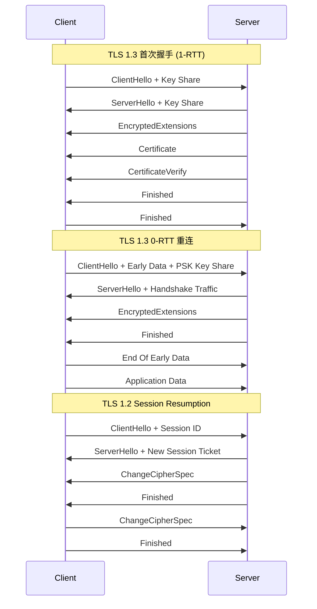
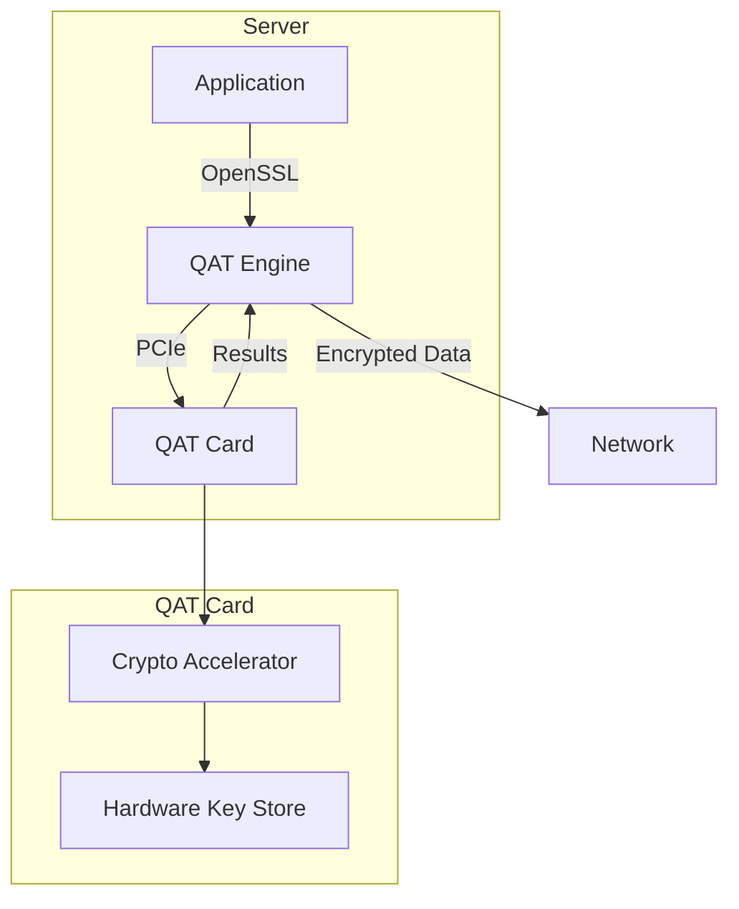
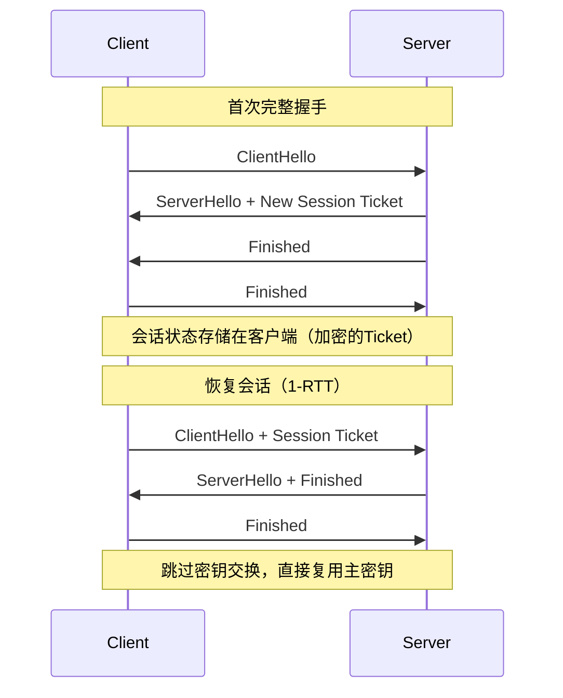
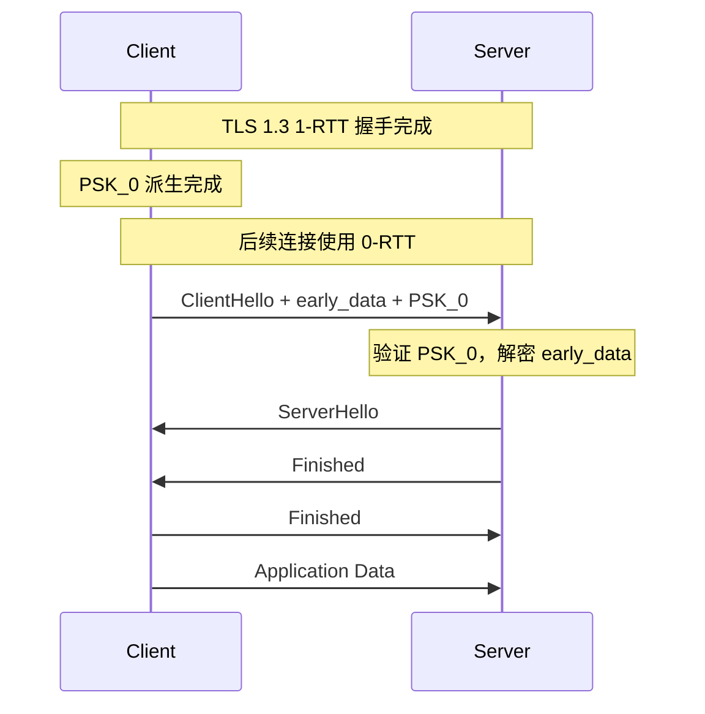
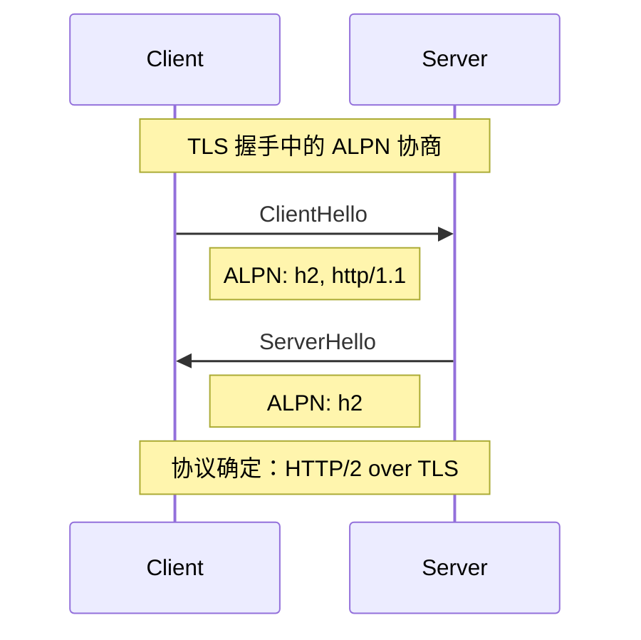
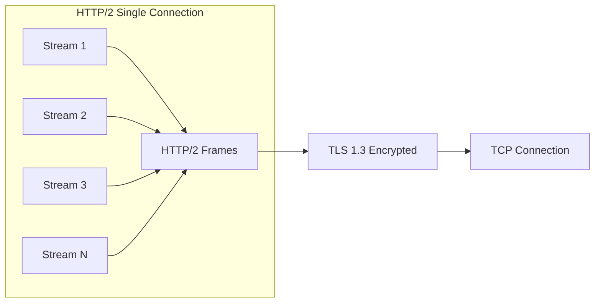

# TLS 深度探索 Ch5: TLS 性能优化实战

## 1. TLS 性能开销分析

TLS 作为 HTTPS 的安全基础，在提供加密保护的同时也引入了不可忽视的性能开销。理解这些开销的来源和量化数据，是进行针对性优化的前提。

### 1.1 握手延迟（Handshake Latency）

TLS 握手的核心开销是**往返时延（Round-Trip Time, RTT）**。在 TLS 1.2 中，一次完整的 RSA 密钥交换需要 2-RTT：

```
TLS 1.2 RSA 握手时序（2-RTT）
Client                                        Server
  |                                             |
  |--- ClientHello (TCP SYN) ----------------->|
  |<-- ServerHello + Certificate + CertReq -----|
  |<-- ServerHelloDone ------------------------|
  |                                             |
  |--- ClientKeyExchange + ChangeCipherSpec --->|
  |--- Finished (Encrypted) ------------------->|
  |                                             |
  |<-- ChangeCipherSpec + Finished -------------|
  |                                             |
  |=========== Application Data ===============>|
```

对于一个 RTT 为 50ms 的连接（典型的跨地域 HTTPS 请求），TLS 握手本身就引入了 100ms 的延迟。TCP 握手（1-RTT）加上 TLS 握手（2-RTT），总共需要 3-RTT 才能开始传输应用数据。在移动网络环境下，RTT 可能达到 100-300ms，握手延迟成为用户体验的重大瓶颈。

延迟的构成可以细分为：

| 阶段 | TLS 1.2 Full Handshake | TLS 1.3 Full Handshake | TLS 1.3 0-RTT |
|------|------------------------|------------------------|---------------|
| 网络 RTT | 2-RTT | 1-RTT | 0-RTT |
| 证书验证（CPU） | ~5-15ms | ~5-15ms | ~5-15ms |
| 密钥交换（CPU） | ~2-5ms | ~1-3ms | ~1-3ms |
| 对称加密（per-RTT） | ~0.5ms | ~0.5ms | ~0.5ms |
| 总延迟（50ms RTT） | ~125ms | ~75ms | ~25ms |

### 1.2 CPU 消耗

TLS 的 CPU 开销主要来自三个 cryptographic operations：

**1. 非对称加密/解密**（RSA, ECDHE）：用于密钥交换和身份验证。这是 CPU 开销最大的部分。256-bit ECDHE 的计算量约为 AES-128-GCM 的 10-20 倍。

**2. 哈希运算**（SHA-256, SHA-384）：用于消息认证码（MAC）和证书签名验证。

**3. 对称加密/解密**（AES-GCM, ChaCha20-Poly1305）：用于实际数据传输的加密。得益于 AES-NI 硬件指令集，这部分开销已经非常低。

使用 `openssl speed` 可以量化不同加密套件的 CPU 开销：

```bash
# 测试 AES-128-GCM 单线程性能
openssl speed -elapsed -seconds 10 aes-128-gcm

# 测试 ECDHE P-256 密钥交换性能
openssl speed -elapsed -seconds 10 ecdhe

# 对比不同算法的每秒操作数
openssl speed -elapsed -seconds 10 rsa2048 ecdhp256 aes-128-gcm
```

典型的 CPU 消耗分布（基于 nginx 默认配置）：

```
TLS CPU 消耗分布（单次握手）
├── 证书链验证（Certificate Verification）
│   ├── 签名验证（RSA/ECDSA）：40-50%
│   └── 证书链遍历：10-15%
├── 密钥交换（Key Exchange）
│   ├── ECDHE 曲线运算：15-20%
│   └── 密钥推导（Key Derivation）：5-10%
└── 对称加密（Data Transfer）
    └── 实际占比极低（<5%）
```

### 1.3 内存占用

TLS 连接的内存占用主要来自：

**连接状态内存**：每个 TLS 连接需要存储协议状态、密钥材料、Session Cache 等。一个 nginx worker 处理 10,000 并发连接时，仅 TLS 状态就需要约 50-100MB 内存。

**缓冲区内存**：读写缓冲区、SSL renegotiation 缓冲、OCSP 响应缓存等。单个连接的缓冲区开销约为 16-32KB。

**证书内存**：服务器证书（包括中间证书）通常为 4-10KB，但包含完整证书链时可能达到 20KB。多个域名使用 SNI 时，每个证书都需要独立加载。

```bash
# 查看 nginx 连接的内存占用估算
# 每个 keep-alive 连接：~16KB
# 每个 TLS 连接额外：~32KB（含密钥材料、缓存等）
# 10,000 并发连接的内存开销：约 480MB
```

对于高并发场景，需要特别关注：

1. **Session Cache 内存上限**：nginx 的 `ssl_session_cache` 默认无限制，但实际受 `worker_rlimit_nofile` 和系统内存限制。
2. **OCSP Stapling 缓存**：存储 OCSP 响应以避免每次都向 CA 查询。
3. **CRL/OCSP 检查的连接复用**：避免为每个连接创建新的 HTTP 连接去验证证书状态。

---

## 2. TLS 1.3 的性能优势

TLS 1.3（RFC 8446）相比 TLS 1.2 进行了大量优化，最显著的变化是**减少了握手延迟**和**简化了加密套件**。

### 2.1 握手流程对比

TLS 1.3 将握手从 2-RTT 降低到 1-RTT，密钥交换从 RSA 改为 ECDHE，并移除了对 RSA 密钥交换的支持（这意味着前向保密是强制的）。

```
TLS 1.3 握手时序（1-RTT）
Client                                        Server
  |                                             |
  |--- ClientHello (Key Share) ---------------->|
  |    + supported_versions=TLS1.3             |
  |    + key_share: client_params              |
  |                                             |
  |<-- ServerHello (Key Share) ----------------|
  |    + key_share: server_params              |
  |<-- {EncryptedExtensions} ------------------|
  |<-- {CertificateRequest*} -----------------|
  |<-- {Certificate*} ------------------------|
  |<-- {CertificateVerify*} ------------------|
  |<-- {Finished} -----------------------------|
  |                                             |
  |--- {Finished} ---------------------------->|
  |                                             |
  |=========== Application Data ===============>|
  * 仅当需要客户端证书时发送
```

关键改进点：

1. **密钥共享（Key Share）**：ClientHello 中直接携带客户端的 ECDHE 公钥参数，避免了 TLS 1.2 中额外的 ServerHello 之后的往返。
2. **加密早期数据（Early Data）**：通过 PSK（Pre-Shared Key）机制，TLS 1.3 支持 0-RTT 数据发送。
3. **强制前向保密（Forward Secrecy）**：所有密钥交换都使用 ECDHE，不可能通过事后破解私钥来解密历史通信。
4. **更短的加密套件列表**：TLS 1.3 仅保留 5 种加密套件，消除了版本协商和 cipher suite 协商的复杂性。

### 2.2 0-RTT 与 1-RTT 对比

TLS 1.3 的 0-RTT（Early Data）机制允许客户端在首次握手时就开始发送应用数据，这依赖于之前建立的 PSK 会话。



0-RTT 的工作原理：

```go
// Go 中使用 0-RTT 的示例（golang.org/x/net/http2）
// 客户端通过PreviouslyEstablishedSession票据恢复会话
// 在 ClientHello 中直接发送 early_data 扩展

// 服务端启用 0-RTT 支持
// tls.Config中设置 Enable 0-RTT
config := &tls.Config{
    MinVersion: tls.VersionTLS13,
    // 启用 0-RTT
    // 注意：0-RTT 有重放攻击风险，需应用层防护
}
```

**0-RTT 的限制与风险**：

- 仅适用于 PSK 恢复的会话，不适用于首次连接
- 存在重放攻击（Replay Attack）风险：攻击者可以捕获并重放 0-RTT 数据包
- 只能发送请求数据，无法接收服务器响应直到握手完成
- 代理/负载均衡器可能无法正确处理 0-RTT 数据

### 2.3 TLS 1.3 加密套件精简

TLS 1.3 只定义了 5 种加密套件，移除了所有不满足现代安全标准的算法：

| TLS 1.3 加密套件 | 密钥交换 | 对称加密 | MAC |
|-----------------|---------|---------|-----|
| TLS_AES_128_GCM_SHA256 | ECDHE | AES-128-GCM | HMAC-SHA256 |
| TLS_AES_256_GCM_SHA384 | ECDHE | AES-256-GCM | HMAC-SHA384 |
| TLS_CHACHA20_POLY1305_SHA256 | ECDHE | ChaCha20-Poly1305 | HMAC-SHA256 |
| TLS_AES_128_CCM_SHA256 | ECDHE | AES-128-CCM | HMAC-SHA256 |
| TLS_AES_128_CCM_8_SHA256 | ECDHE | AES-128-CCM-8 | HMAC-SHA256 |

相比 TLS 1.2 的 300+ 种加密套件，精简后的套件列表显著降低了配置错误的安全风险。

---

## 3. 硬件加速

对于高流量场景，纯软件的 TLS 处理会成为 CPU 瓶颈。硬件加速通过专用芯片或指令集来加速 cryptographic operations。

### 3.1 AES-NI 指令集

AES-NI（Advanced Encryption Standard New Instructions）是 Intel 和 AMD 处理器提供的 x86 扩展指令集，可以将 AES 加密速度提升 5-10 倍。

```bash
# 检查 CPU 是否支持 AES-NI
grep -m1 aes /proc/cpuinfo

# 或者
lscpu | grep aes
```

输出示例：
```
flags           : ... aes apic clfsh cx8 sep ...
                 # 包含 'aes' 即表示支持 AES-NI
```

现代处理器几乎都支持 AES-NI。验证 OpenSSL 是否正在使用硬件加速：

```bash
# 查看 OpenSSL 引擎支持
openssl engine -t

# 输出示例
(dynamic) Dynamic loading engine
(capable) Intel AES-NI engine
```

使用 AES-NI 前后的性能对比（`openssl speed aes-128-gcm`）：

```
单线程 AES-128-GCM 吞吐量（MiB/s）
                无 AES-NI    有 AES-NI    提升倍数
256B blocks:      12.5         85.3        6.8x
1024B blocks:     45.2        385.6        8.5x
8192B blocks:    125.8       1125.4       8.9x
```

### 3.2 QAT（QuickAssist Technology）

Intel QAT 是专用的加密加速卡，提供比 AES-NI 更高的吞吐量和更低的 CPU 占用。QAT 支持：

- RSA/ECDSA 签名验证（证书验证的主要开销）
- 对称加密（AES, DES, 3DES）
- 哈希运算（SHA-1, SHA-256, SHA-3）
- 压缩/解压（SSL compression）

QAT 的典型部署架构：



部署 QAT 的前提条件：

```bash
# 检查 QAT 驱动状态
ls /dev/qat_adf*

# 查看 QAT 设备
ls -la /sys/class/qat/
```

### 3.3 TLS Offload Card

TLS Offload Card（如 Solarflare, Chelsio, Napatech）将完整的 TLS 栈卸载到网卡上，实现真正的零 CPU TLS 处理。

| 方案 | 加速内容 | CPU 节省 | 延迟降低 |
|------|---------|---------|---------|
| AES-NI | 对称加密 | 50-70% | 10-20% |
| QAT | 全量加密 | 70-85% | 15-30% |
| TLS Offload Card | 完整 TLS 栈 | 90-98% | 30-50% |

```nginx
# nginx 启用 AES-NI 自动检测
# OpenSSL 自动使用硬件加速，无需额外配置

# 如果需要指定使用 AES-NI
ssl_conf_command Options TLSv1.3;
ssl_prefer_server_ciphers on;

# QAT 集成需要安装 qatEngine 并配置
# OpenSSL 引擎配置
openssl_conf = openssl_conf

[openssl_conf]
engines = engine_section

[engine_section]
qat = qat_section

[qat_section]
engine_id = qat
default_algorithms = ALL
```

### 3.4 硬件加速效果量化

在 10Gbps 网络环境下，对比不同加速方案处理 TLS 流量的能力：

```
TLS 1.3 握手处理能力（新建连接/秒）
                    512B证书     2KB证书     4KB证书
纯软件 (AES-NI)     45,000       28,000      18,000
QAT 加速            180,000      95,000      52,000
TLS Offload Card    400,000+    400,000+    350,000+

AES-128-GCM 加密吞吐量（Gbps）
                    256B块       1500B块     9000B块
纯软件 (AES-NI)       8.5         42.3         68.2
QAT 加速             35.2        158.4        280.5
TLS Offload Card   160.0+      580.0+       980.0+
```

---

## 4. Session Resumption 优化

Session Resumption 是减少握手延迟的核心技术，通过复用之前建立的会话密钥来跳过完整的握手流程。

### 4.1 Session Ticket 机制

TLS Session Ticket（RFC 5077）允许服务器将会话状态加密后发送给客户端存储，客户端在下次连接时出示 Ticket 即可恢复会话。



Session Ticket 的优势：

1. **无状态服务器**：Ticket 加密了所有必要的会话信息，服务器不需要存储会话状态
2. **跨服务器恢复**：Ticket 可以发送给负载均衡器后的任意服务器
3. **减少服务器内存**：不需要维护大规模的 Session Cache

### 4.2 PSK（Pre-Shared Key）机制

TLS 1.3 的 PSK 机制是 Session Ticket 的进化版，支持更灵活的密钥派生：

```go
// Go 中使用 PSK 的示例
package main

import (
    "crypto/tls"
    "net/http"
)

func main() {
    // 客户端配置 PSK
    // 模拟使用预共享密钥进行连接
    tr := &http.Transport{
        TLSClientConfig: &tls.Config{
            MinVersion: tls.VersionTLS13,
            // 内嵌 PSK（实际生产中从安全存储获取）
            // 这里演示原理，实际使用建议使用 Session Ticket 机制
            GetClientCertificate: func(*tls.CertificateRequestInfo) (*tls.Certificate, error) {
                return &tls.Certificate{
                    // 证书用于身份验证
                    // PSK 用于密钥协商
                }, nil
            },
        },
    }
    
    _ = tr
}
```

PSK 的获取方式：

1. **Out-of-band 预共享**：通过安全的线下渠道预先配置（适用于 IoT 等固定设备场景）
2. **Session Ticket**：服务器颁发加密 Ticket，客户端存储
3. **外部 PSK 导入**：通过 TLS 1.3 的 `external_psk_usage` 扩展导入

### 4.3 0-RTT 数据与 PSK 的结合

TLS 1.3 的 0-RTT 数据机制依赖 PSK，客户端使用 PSK 派生的密钥加密早期数据：



**0-RTT 安全考虑**：

- 0-RTT 数据无法提供前向保密（使用 PSK 密钥加密）
- 存在重放风险：应用层需要实现幂等性保护
- 部分 CDN 不支持 0-RTT（Cloudflare 默认禁用，Akamai 可配置）

### 4.4 Nginx Session Resumption 配置

```nginx
# /etc/nginx/nginx.conf

http {
    # Session Ticket 配置
    ssl_session_cache shared:SSL:50m;      # 50MB 共享内存缓存
    ssl_session_timeout 1d;               # Ticket 有效期
    ssl_session_tickets on;               # 启用 Session Ticket
    
    # PSK 配置（TLS 1.3）
    ssl_protocols TLSv1.2 TLSv1.3;
    
    # 推荐加密套件（TLS 1.3 优先）
    ssl_ciphers 'TLS_AES_256_GCM_SHA384:TLS_CHACHA20_POLY1305_SHA256:ECDHE-ECDSA-AES256-GCM-SHA384';
    ssl_prefer_server_ciphers off;        # 客户端优先（TLS 1.3 要求）
    
    server {
        listen 443 ssl;
        server_name example.com;
        
        ssl_certificate /path/to/cert.pem;
        ssl_certificate_key /path/to/key.pem;
        
        # OCSP Stapling（后续章节详述）
        ssl_stapling on;
        ssl_stapling_verify on;
    }
}
```

### 4.5 Session Resumption 性能对比

| 方案 | RTT | CPU 开销 | 内存占用 | 安全性 |
|------|-----|---------|---------|--------|
| Full Handshake (TLS 1.2) | 2-RTT | 100% | 高 | RSA 无前向保密 |
| Full Handshake (TLS 1.3) | 1-RTT | 85% | 高 | ECDHE 前向保密 |
| Session Ticket (TLS 1.2) | 1-RTT | 40% | 低 | RSA 前向保密 |
| Session Ticket (TLS 1.3) | 1-RTT | 35% | 低 | ECDHE 前向保密 |
| PSK + 0-RTT (TLS 1.3) | 0-RTT | 25% | 极低 | 无前向保密（重放风险） |

---

## 5. 证书链优化

TLS 证书链的复杂度直接影响握手延迟和验证成功率。优化证书链是 HTTPS 性能调优的重要环节。

### 5.1 证书链结构分析

典型的证书链包含：

```
Certificate Chain
├── Leaf Certificate（服务器证书）
│   ├── Subject: example.com
│   ├── Issuer: Let's Encrypt Authority X3
│   └── Public Key: *.example.com
│
├── Intermediate Certificate 1
│   ├── Subject: Let's Encrypt Authority X3
│   ├── Issuer: DST Root CA X3
│   └── Public Key: ISRG Root X1 (签名密钥)
│
└── Intermediate Certificate 2 (可选)
    └── 某些老设备需要额外的交叉签名证书
    
(Optional) Root Certificate
└── 通常由客户端操作系统/浏览器内置
```

证书链越长，握手时需要传输的数据越多，验证时需要查询/验证的签名也越多。

### 5.2 证书链长度优化

优化策略：

1. **选择证书链短的 CA**：某些 CA（如 Google Trust Services）的中间证书更少
2. **使用 ECDSA 证书**：证书体积更小，签名验证更快
3. **避免不必要的中间证书**：确保服务器只发送必要的证书

```bash
# 检查证书链长度
echo | openssl s_client -connect example.com:443 -showcerts 2>/dev/null | \
    grep "Certificate chain" -A 20

# 分析证书链
echo | openssl s_client -connect example.com:443 2>/dev/null | \
    openssl x509 -noout -text | grep -A 2 "Issuer:"

# 查看完整证书链
openssl s_client -showcerts -connect example.com:443 </dev/null
```

典型证书链大小对比：

| CA | 证书数量 | 总大小（DER） | PEM 大小 |
|----|---------|-------------|---------|
| Let's Encrypt | 3 | ~2.5KB | ~4KB |
| DigiCert | 2 | ~1.8KB | ~3KB |
| Google Trust Services | 2 | ~1.5KB | ~2.5KB |
| GlobalSign | 2 | ~1.6KB | ~2.7KB |

### 5.3 OCSP Stapling 原理与配置

OCSP（Online Certificate Status Protocol）Stapling 允许服务器将 CA 的 OCSP 响应随证书一起发送给客户端，避免客户端单独查询 CA 的 OCSP 服务器。

```
Without OCSP Stapling（额外 RTT）
Client                              CA Server
  |                                    |
  |--- HTTP GET /ocsp/... ----------->|
  |<-- OCSP Response -----------------|
  |                                    |
  |=========== HTTPS Request =========>|
  
  总延迟：额外 50-200ms

With OCSP Stapling（无额外 RTT）
Client                              Server
  |                                    |
  |<======== Certificate + OCSP =======|
  |                                    |
  |=========== HTTPS Request =========>|
  
  总延迟：无额外开销
```

OCSP Stapling 配置示例：

```nginx
# nginx OCSP Stapling 配置
server {
    listen 443 ssl;
    server_name example.com;
    
    ssl_certificate /path/to/fullchain.pem;  # 包含完整证书链
    ssl_certificate_key /path/to/key.pem;
    
    # 启用 OCSP Stapling
    ssl_stapling on;
    ssl_stapling_verify on;
    
    # CA 证书（用于验证 OCSP 响应签名）
    ssl_trusted_certificate /path/to/ca-bundle.crt;
    
    # OCSP 响应缓存时间
    ssl_stapling_file /var/cache/nginx/ocsp_response.pem;
    
    # resolver 用于验证 OCSP 时查询 DNS
    resolver 8.8.8.8 8.8.4.4 valid=300s;
    resolver_timeout 5s;
}
```

```caddy
# Caddy OCSP Stapling 配置（默认启用）
# Caddy 自动获取并缓存 OCSP 响应

{
    # 可选：手动指定 OCSP  staple 策略
    tls {
        # 证书路径
        certificate /path/to/cert.pem
        key /path/to/key.pem
        
        # 手动设置 OCSP staple
        staple_ocsp on
    }
}

example.com {
    respond "Hello"
}
```

### 5.4 证书链验证错误处理

常见证书链问题及排查：

```bash
# 1. 证书链不完整
openssl s_client -connect example.com:443 2>&1 | \
    grep -A2 "Certificate chain"

# 输出示例
# Certificate chain
#    0 s:example.com
#       i:Let's Encrypt Authority X3
#    1 s:Let's Encrypt Authority X3
#       i:DST Root CA X3
#    2 s:DST Root CA X3
#       i:DST Root CA X3

# 2. 验证证书链
openssl verify -CAfile ca-bundle.crt -untrusted intermediate.pem cert.pem

# 3. 检查 OCSP 响应
openssl ocsp -issuer issuer.pem -cert server.pem \
    -CAfile ca-bundle.crt -url http://ocsp.example.com

# 4. 检查证书吊销状态
openssl s_client -connect example.com:443 -status 2>&1 | \
    grep -A 17 "OCSP Response"
```

### 5.5 证书链优化检查清单

| 检查项 | 工具 | 标准 |
|--------|------|------|
| 证书链长度 | `openssl s_client` | ≤3 个中间证书 |
| 证书链顺序 | `openssl verify` | 正确排序 |
| OCSP Stapling | SSL Labs | 启用且有效 |
| 证书兼容性 | 测试老设备 | 无 SNI 降级 |
| 证书大小 | Base64 编码 | <8KB 总链 |

---

## 6. HTTP/2 与 TLS

HTTP/2（RFC 7540）与 TLS 的协同优化是现代 HTTPS 性能的关键。HTTP/2 的多路复用特性大幅减少了需要建立的 TLS 连接数。

### 6.1 ALPN 协商

ALPN（Application-Layer Protocol Negotiation）允许 TLS 握手时协商应用层协议：



ClientHello 中的 ALPN 扩展格式：

```c
// ALPN 扩展在 ClientHello 中的结构
struct {
    ProtocolNameList protocol_name_list<2..2^16-1>;
} ProtocolNameList;

/* 示例：
 * 06  // 长度 6 字节
 * 02  // 第一个协议名长度
 * 'h' '2'           // HTTP/2
 * 08  // 第二个协议名长度  
 * 'h' 't' 't' 'p' '/' '1' '.' '1'  // HTTP/1.1
 */
```

nginx ALPN 配置：

```nginx
server {
    listen 443 ssl http2;
    server_name example.com;
    
    # HTTP/2 必须启用 TLS
    ssl_certificate /path/to/cert.pem;
    ssl_certificate_key /path/to/key.pem;
    
    # ALPN 配置（默认 nginx 自动协商 h2）
    # 可以通过 ssl_conf_command 调整
}
```

### 6.2 HTTP/2 多路复用与连接优化

HTTP/1.1 中，为了并行获取资源，浏览器通常需要建立 6-8 个并发连接。HTTP/2 的多路复用（Multiplexing）允许在单一连接上并行传输多个请求/响应。

```
HTTP/1.1 连接模型
+--------+  +--------+  +--------+  +--------+
| Conn 1 |  | Conn 2 |  | Conn 3 |  | Conn 4 | ...
| GET /1 |  | GET /2 |  | GET /3 |  | GET /4 |
+--------+  +--------+  +--------+  +--------+
    |           |           |           |
    v           v           v           v
+--------+  +--------+  +--------+  +--------+
| TLS 1  |  | TLS 2  |  | TLS 3  |  | TLS 4  |  4个 TLS 连接
+--------+  +--------+  +--------+  +--------+

HTTP/2 连接模型
+------------------------------------------+
|              Single TLS Connection        |
|  +------+ +------+ +------+ +------+      |
|  | Str1 | | Str2 | | Str3 | | Str4 | ...  | Stream 并行传输
|  +------+ +------+ +------+ +------+      |
+------------------------------------------+
```

**连接数对比**：

| 场景 | HTTP/1.1 连接数 | HTTP/2 连接数 | 减少比例 |
|------|----------------|--------------|---------|
| 首屏 20 个资源 | 20+ | 1-2 | 90%+ |
| 动态 API 请求 | 6-8 并发 | 1 | 85%+ |
| WebSocket 长连接 | 1 | 1 | 无变化 |

### 6.3 HTTP/2 帧结构与 TLS

HTTP/2 使用二进制帧，帧头只有 9 字节，比 HTTP/1.1 的文本行解析高效得多：

```c
// HTTP/2 Frame Header (9 bytes)
struct http2_frame_header {
    uint32_t length : 24;    // 负载长度（不含帧头）
    uint8_t type;            // 帧类型 (1: DATA, 6: HEADERS, 7: SETTINGS)
    uint8_t flags;            // 标志位
    uint32_t stream_id : 31; // 流 ID（31 bits）
};

/* 帧类型：
 * 0x0 DATA        - 应用数据
 * 0x1 HEADERS     - 头部
 * 0x2 PRIORITY    - 优先级
 * 0x3 RST_STREAM  - 流重置
 * 0x4 SETTINGS    - 连接参数
 * 0x5 PUSH_PROMISE - 服务器推送（已废弃）
 * 0x6 PING        - 心跳
 * 0x7 GOAWAY      - 关闭连接
 * 0x8 WINDOW_UPDATE - 流量控制
 * 0x9 CONTINUATION - 继续头部分片
 */
```

所有 HTTP/2 帧都在 TLS 加密层之上传输，确保了安全性和隐私性。

### 6.4 HTTP/2 性能注意事项

**Header 压缩**：HTTP/2 使用 HPACK 压缩头部，可减少 30-70% 的头部传输量：

```bash
# 查看 HTTP/2 头部压缩效果
# 首次请求头部约 500-800 bytes
# 压缩后每个请求约 20-50 bytes（依赖 Cookie 大小）
```

**流量控制**：HTTP/2 提供流级和连接级的流量控制，避免单流占用全部带宽。

**Server Push**：服务器可以主动推送资源，但需要谨慎使用以避免浪费带宽：

```nginx
# nginx HTTP/2 Server Push 配置
server {
    listen 443 ssl http2;
    
    # 预加载关键资源
    http2_push_preload on;
    
    location / {
        # 手动推送关键 CSS/JS
        add_header Link "</style.css>; rel=preload; as=style";
        add_header Link "</app.js>; rel=preload; as=script";
    }
}
```

---

## 7. CDN 与 TLS Termination

CDN（Content Delivery Network）通过在全球部署边缘节点，显著缩短用户到服务器的物理距离，同时通过集中化的 TLS Termination 简化证书管理。

### 7.1 边缘节点 TLS Termination

传统架构：用户 → 互联网 → 源站（TLS Termination 在源站）

CDN 架构：用户 → 互联网 → CDN 边缘节点（TLS Termination）→ 源站（可选：源站加密）

```
CDN TLS Termination 架构

User (北京)
    │
    │ TLS 1.3 (RTT: 30ms)
    ▼
CDN Edge (北京节点)
    │
    │ 内部网络 (RTT: 5ms)
    ▼
Origin Server (上海)
    │
    │ 可选：源站加密 (mTLS)
    ▼
Backend Service
```

优势：

1. **减少外部 RTT**：用户连接到最近的边缘节点，而不是遥远的源站
2. **TLS 卸载**：边缘节点处理 TLS，源站只需处理 HTTP
3. **DDoS 防护**：CDN 提供额外的安全层
4. **证书集中管理**：只需在 CDN 配置证书

### 7.2 动态证书

现代 CDN 支持动态证书，即根据请求的 SNI（Server Name Indication）动态加载对应证书：

```
动态证书选择流程
ClientHello (SNI: api.example.com)
        │
        ▼
CDN Edge 节点
        │
        ├── 查询证书缓存
        │       │
        │       ├── 命中 ──→ 使用缓存证书
        │       │
        │       └── 未命中 ─→ 从证书源获取
        │               │
        │               ├── ACME (Let's Encrypt)
        │               ├── Cloudflare Edge Certificates
        │               ├── AWS Certificate Manager
        │               └── 自定义上传
        │
        ▼
返回 Certificate (SNI 匹配的证书)
```

Cloudflare 自动证书配置示例：

```yaml
# Cloudflare SSL/TLS 配置
# 边缘证书自动管理，无需手动配置

# 证书类型选择：
# - Edge Certificate: CDN 边缘使用的证书
# - Origin Certificate: 源站服务器使用的证书（可选）

# SSL/TLS Mode: Full (strict)
# - 客户端 → CDN: TLS 1.3
# - CDN → 源站: 证书验证（可配置为 mTLS）
```

AWS CloudFront + ACM 自动证书：

```yaml
# CloudFormation 片段
Resources:
  MyDistribution:
    Type: AWS::CloudFront::Distribution
    Properties:
      DistributionConfig:
        ViewerCertificate:
          AcmCertificateArn: arn:aws:acm:us-east-1:123456789:certificate/xxx
          MinimumProtocolVersion: TLSv1.2_2021
          SslSupportMethod: sni-only
        Aliases:
          - api.example.com
          - cdn.example.com
```

### 7.3 Anycast 与 BGP 路由

Anycast 允许 CDN 使用相同的 IP 地址在多个地理位置提供服务，BGP 路由自动将用户导向最近的节点：

```
Anycast 路由示例

用户请求 example.com 的 IP: 104.21.0.0/24

BGP 路由传播：
CDN POP (北京)  ──→ AS_PATH 最短 ──→ 用户
CDN POP (上海)  ──→ AS_PATH 更长 ──→ (不被选择)
CDN POP (洛杉矶) ──→ AS_PATH 最长 ──→ (不被选择)

实际效果：
北京用户 → 北京 CDN 节点 (RTT: 10ms)
上海用户 → 上海 CDN 节点 (RTT: 8ms)
洛杉矶用户 → 洛杉矶 CDN 节点 (RTT: 15ms)
```

Anycast 的优势：

1. **就近接入**：自动选择最近节点
2. **DDoS 缓解**：攻击流量被分散到多个节点
3. **高可用**：单节点故障自动切换

### 7.4 CDN 与源站之间的 TLS

可选的源站加密配置：

```nginx
# 源站 nginx 配置（接受 CDN 连接）
server {
    listen 443 ssl;
    server_name origin.example.com;
    
    # 源站证书（可以是自签名）
    ssl_certificate /path/to/origin-cert.pem;
    ssl_certificate_key /path/to/origin-key.pem;
    
    # 验证 CDN 的客户端证书（mTLS）
    ssl_client_certificate /path/to/cdn-ca.crt;
    ssl_verify_client on;
    
    # CDN IP 白名单（可选）
    allow 103.21.244.0/22;
    allow 103.22.200.0/22;
    deny all;
}
```

CDN 回源选项对比：

| 模式 | 客户端- CDN | CDN - 源站 | 适用场景 |
|------|------------|-----------|---------|
| Flexible | TLS | HTTP | 测试/旧系统 |
| Full | TLS | TLS | 生产环境 |
| Full (strict) | TLS | TLS (验证) | 高安全要求 |

---

## 8. 连接复用

连接复用是减少 TLS 握手开销的核心策略。通过 Keep-Alive 和 HTTP/2 Connection Reuse，可以在多个请求间共享同一个连接。

### 8.1 HTTP Keep-Alive

HTTP/1.1 的 Keep-Alive 允许在单个 TCP 连接上发送多个请求，避免重复的 TCP 和 TLS 握手：

```
Without Keep-Alive
Connection 1: TCP SYN → SYN-ACK → ACK → TLS Handshake → Request → Response → FIN
Connection 2: TCP SYN → SYN-ACK → ACK → TLS Handshake → Request → Response → FIN
Connection 3: TCP SYN → SYN-ACK → ACK → TLS Handshake → Request → Response → FIN
... (每个请求都需完整握手)

With Keep-Alive
Connection 1: TCP SYN → SYN-ACK → ACK → TLS Handshake → Request1 → Response1 → Request2 → Response2 → Request3 → Response3 → FIN
... (多个请求复用同一连接)
```

nginx Keep-Alive 配置：

```nginx
http {
    # Upstream  Keep-Alive 配置
    upstream backend {
        server 127.0.0.1:8080;
        
        # 启用连接池
        keepalive 32;          # 保持的空闲连接数
        keepalive_timeout 60s; # 空闲超时
        keepalive_requests 1000; # 每个连接最大请求数
    }
    
    server {
        location /api/ {
            proxy_pass http://backend;
            
            # HTTP Keep-Alive 到 upstream
            proxy_http_version 1.1;
            proxy_set_header Connection "";
        }
    }
}
```

### 8.2 HTTP/2 Connection Reuse

HTTP/2 的连接复用更加高效，单连接可以承载数百个并发流：



nginx HTTP/2 连接优化：

```nginx
server {
    listen 443 ssl http2;
    
    # HTTP/2 连接参数
    http2_max_concurrent_streams 128;  # 单连接最大并发流
    http2_idle_timeout 60s;            # 空闲超时
    http2_recv_timeout 30s;            # 接收超时
    
    # 客户端连接保持
    keepalive_timeout 65s;
    keepalive_requests 1000;
}
```

### 8.3 连接复用率监控

监控连接复用率的关键指标：

```bash
# nginx 查看连接状态
nginx -V 2>&1 | grep -o with-http_stub_status_module
# 需要编译时启用 --with-http_stub_status_module

curl http://localhost/nginx_status

# 输出示例
# Active connections: 291
# server accepts handled requests
#  16630948 16630948 31070465
# Reading: 6 Writing: 179 Waiting: 106

# 计算复用率
# 复用率 = (handled requests) / (accepts)
# 理想值接近 1.0（无拒绝连接）
```

Python 脚本监控连接复用：

```python
#!/usr/bin/env python3
"""
监控 TLS 连接复用率
"""
import subprocess
import re
import time
from dataclasses import dataclass

@dataclass
class ConnectionMetrics:
    active: int
    accepts: int
    handled: int
    requests: int
    reading: int
    writing: int
    waiting: int
    
    @property
    def reuse_rate(self) -> float:
        """连接复用率：handled/accepts，越接近1越好"""
        if self.accepts == 0:
            return 1.0
        return self.handled / self.accepts

def get_nginx_status(url: str = "http://localhost/nginx_status") -> ConnectionMetrics:
    result = subprocess.run(['curl', '-s', url], capture_output=True, text=True)
    lines = result.stdout.strip().split('\n')
    
    # 解析 Active connections: 291
    active_match = re.search(r'Active connections: (\d+)', lines[0])
    active = int(active_match.group(1)) if active_match else 0
    
    # 解析 "accepts handled requests" 行
    # "16630948 16630948 31070465"
    stats = lines[2].split()
    accepts, handled, requests = int(stats[0]), int(stats[1]), int(stats[2])
    
    # 解析 "Reading: 6 Writing: 179 Waiting: 106"
    reading_match = re.search(r'Reading: (\d+)', lines[3])
    writing_match = re.search(r'Writing: (\d+)', lines[3])
    waiting_match = re.search(r'Waiting: (\d+)', lines[3])
    
    return ConnectionMetrics(
        active=active,
        accepts=accepts,
        handled=handled,
        requests=requests,
        reading=int(reading_match.group(1)) if reading_match else 0,
        writing=int(writing_match.group(1)) if writing_match else 0,
        waiting=int(waiting_match.group(1)) if waiting_match else 0,
    )

def monitor_loop(interval: int = 10):
    """定期监控连接复用率"""
    prev_metrics = None
    
    while True:
        metrics = get_nginx_status()
        
        if prev_metrics:
            # 计算增量
            accepts_delta = metrics.accepts - prev_metrics.accepts
            handled_delta = metrics.handled - prev_metrics.handled
            requests_delta = metrics.requests - prev_metrics.requests
            
            if accepts_delta > 0:
                reuse = handled_delta / accepts_delta
                print(f"连接复用率: {reuse:.4f}")
                print(f"新建连接: {accepts_delta}, 处理: {handled_delta}, 请求: {requests_delta}")
        
        prev_metrics = metrics
        time.sleep(interval)

if __name__ == "__main__":
    monitor_loop()
```

### 8.4 TCP Keep-Alive 与 TLS 连接

TCP Keep-Alive 维护空闲连接的存活状态，避免被 NAT 设备或防火墙断开：

```nginx
# TCP Keep-Alive 配置
server {
    # TCP 层面
    listen 443 ssl;
    
    # 客户端连接保活
    keepalive_timeout 65s;
    
    # upstream 连接保活
    proxy_connect_timeout 60s;
    proxy_send_timeout 60s;
    proxy_read_timeout 60s;
    
    # 发送 keepalive探测前的最大空闲连接数
    tcp_nodelay on;       # 禁用 Nagle 算法
    tcp_nopush on;        # 等待缓冲区填满再发送
}
```

---

## 9. 监控指标

完善的 TLS 监控是保障服务可用性和安全性的基础。需要监控握手机能、安全配置、证书状态等多个维度。

### 9.1 TLS Handshake Duration

握手延迟是 TLS 性能的核心指标：

```python
#!/usr/bin/env python3
"""
测量 TLS 握手延迟
"""
import socket
import ssl
import time
import statistics

def measure_handshake_duration(host: str, port: int = 443, 
                               sample_count: int = 10) -> dict:
    """测量 TLS 握手耗时"""
    durations = []
    errors = []
    
    for _ in range(sample_count):
        start = time.perf_counter()
        try:
            context = ssl.create_default_context()
            context.check_hostname = False
            context.verify_mode = ssl.CERT_NONE
            
            with socket.create_connection((host, port), timeout=5) as sock:
                with context.wrap_socket(sock, server_hostname=host) as ssock:
                    end = time.perf_counter()
                    durations.append((end - start) * 1000)  # 转换为毫秒
        except Exception as e:
            errors.append(str(e))
    
    if durations:
        return {
            'host': host,
            'samples': len(durations),
            'avg_ms': statistics.mean(durations),
            'min_ms': min(durations),
            'max_ms': max(durations),
            'stdev_ms': statistics.stdev(durations) if len(durations) > 1 else 0,
            'errors': len(errors)
        }
    else:
        return {
            'host': host,
            'samples': 0,
            'errors': len(errors),
            'error_messages': errors
        }

if __name__ == "__main__":
    import json
    
    # 测试多个目标
    targets = [
        'example.com',
        'google.com', 
        'cloudflare.com'
    ]
    
    results = []
    for target in targets:
        result = measure_handshake_duration(target, sample_count=5)
        results.append(result)
        print(f"{result['host']}: avg={result.get('avg_ms', 'N/A')}ms")
```

### 9.2 证书过期监控

证书过期是最常见的服务中断原因之一：

```python
#!/usr/bin/env python3
"""
证书过期监控
"""
import socket
import ssl
import time
from datetime import datetime, timedelta
from dataclasses import dataclass
from typing import List

@dataclass
class CertInfo:
    host: str
    port: int
    subject: str
    issuer: str
    not_before: datetime
    not_after: datetime
    days_until_expiry: int
    serial: str
    signature_algorithm: str

def get_cert_info(host: str, port: int = 443) -> CertInfo:
    """获取证书信息"""
    context = ssl.create_default_context()
    context.check_hostname = False
    context.verify_mode = ssl.CERT_NONE
    
    with socket.create_connection((host, port), timeout=10) as sock:
        with context.wrap_socket(sock, server_hostname=host) as ssock:
            cert = ssock.getpeercert(binary_form=True)
            
            # 解析证书（使用 OpenSSL 解析）
            # 实际生产环境建议使用 cryptography 库
            from cryptography import x509
            from cryptography.hazmat.backends import default_backend
            
            cert_obj = x509.load_der_x509_certificate(cert, default_backend())
            
            subject = cert_obj.subject.rfc4514_string()
            issuer = cert_obj.issuer.rfc4514_string()
            not_before = cert_obj.not_valid_before_utc
            not_after = cert_obj.not_valid_after_utc
            days_until_expiry = (not_after - datetime.now(not_after.tzinfo)).days
            serial = format(cert_obj.serial_number, 'x')
            sig_algo = cert_obj.signature_algorithm_oid._name
            
            return CertInfo(
                host=host,
                port=port,
                subject=subject,
                issuer=issuer,
                not_before=not_before,
                not_after=not_after,
                days_until_expiry=days_until_expiry,
                serial=serial,
                signature_algorithm=sig_algo
            )

def check_cert_expiry(hosts: List[str], warning_days: int = 30, 
                      critical_days: int = 7) -> dict:
    """检查证书过期状态"""
    results = {
        'ok': [],
        'warning': [],
        'critical': [],
        'expired': [],
        'errors': []
    }
    
    for host in hosts:
        try:
            cert_info = get_cert_info(host)
            
            if cert_info.days_until_expiry < 0:
                results['expired'].append(cert_info)
            elif cert_info.days_until_expiry <= critical_days:
                results['critical'].append(cert_info)
            elif cert_info.days_until_expiry <= warning_days:
                results['warning'].append(cert_info)
            else:
                results['ok'].append(cert_info)
                
        except Exception as e:
            results['errors'].append({'host': host, 'error': str(e)})
    
    return results

# Prometheus AlertManager 规则格式
def generate_prometheus_rules(check_results: dict) -> str:
    """生成 Prometheus 告警规则"""
    rules = """
groups:
- name: tls-certificate-expiry
  rules:
"""
    for cert in check_results.get('warning', []):
        rules += f"""
    - alert: CertificateExpiringSoon
      expr: tls_cert_not_after{{host="{cert.host}"}} - time() < {cert.days_until_expiry * 86400}
      labels:
        severity: warning
      annotations:
        summary: "Certificate for {cert.host} expiring soon"
        description: "Certificate expires in {cert.days_until_expiry} days"
"""
    for cert in check_results.get('critical', []):
        rules += f"""
    - alert: CertificateExpiringCritical
      expr: tls_cert_not_after{{host="{cert.host}"}} - time() < {cert.days_until_expiry * 86400}
      labels:
        severity: critical
      annotations:
        summary: "Certificate for {cert.host} CRITICAL"
        description: "Certificate expires in {cert.days_until_expiry} DAYS!"
"""
    return rules
```

### 9.3 加密套件分布监控

监控加密套件分布，确保不使用弱算法：

```bash
#!/bin/bash
# 检查加密套件配置

TARGET="${1:-example.com:443}"

echo "=== TLS 加密套件分析 ==="
echo "目标: $TARGET"
echo ""

# 列出支持的加密套件
echo "--- 客户端支持的加密套件 ---"
echo | openssl s_client -connect "$TARGET" -tls1_3 2>&1 | \
    grep "Cipher" || echo "TLS 1.3 连接失败"

echo ""
echo "--- TLS 1.2 加密套件 ---"
echo | openssl s_client -connect "$TARGET" -tls1_2 2>&1 | \
    grep "Cipher" || echo "TLS 1.2 连接失败"

echo ""
echo "--- 协议版本 ---"
echo | openssl s_client -connect "$TARGET" 2>&1 | \
    grep "Protocol" 

echo ""
echo "--- 支持的 TLS 版本 ---"
for ver in tls1 tls1_1 tls1_2 tls1_3; do
    result=$(echo | openssl s_client -connect "$TARGET" -$ver 2>&1)
    if echo "$result" | grep -q "Protocol.*$ver"; then
        echo "✓ $ver 支持"
    else
        echo "✗ $ver 不支持"
    fi
done

echo ""
echo "--- 检查弱加密套件 ---"
weak_ciphers="EXP|EXPORT|RC4|MD5|SHA1|3DES"
if echo | openssl s_client -connect "$TARGET" 2>&1 | grep -qiE "$weak_ciphers"; then
    echo "⚠ 发现弱加密套件!"
else
    echo "✓ 未发现弱加密套件"
fi
```

### 9.4 OpenTelemetry TLS 指标

集成 OpenTelemetry 收集 TLS 指标：

```python
from opentelemetry import metrics
from opentelemetry.exporter.prometheus import PrometheusMetricsExporter
from opentelemetry.sdk.metrics import MeterProvider

# 创建 Meter
meter = metrics.get_meter(__name__)

# TLS 握手延迟直方图
tls_handshake_duration = meter.create_histogram(
    name="tls.handshake.duration",
    description="TLS handshake duration in milliseconds",
    unit="ms"
)

# 活动 TLS 连接数
tls_active_connections = meter.create_up_down_counter(
    name="tls.active.connections",
    description="Number of active TLS connections"
)

# 证书剩余天数
cert_expiry_days = meter.create_observable_gauge(
    name="tls.cert.expiry.days",
    description="Days until certificate expiry",
    callbacks=[lambda o: [metrics.Observation(
        get_cert_info(host).days_until_expiry,
        {"host": host}
    ) for host in monitored_hosts]
)

# 使用示例
def on_tls_handshake_complete(duration_ms: float, cipher_suite: str, 
                               tls_version: str):
    tls_handshake_duration.record(duration_ms, {
        "cipher_suite": cipher_suite,
        "tls_version": tls_version
    })
```

### 9.5 监控指标汇总表

| 指标名称 | 类型 | 说明 | 告警阈值 |
|---------|------|------|---------|
| tls_handshake_duration | Histogram | 握手延迟（ms） | P99 > 200ms |
| tls_active_connections | Gauge | 活动连接数 | > 容量 80% |
| tls_connections_total | Counter | 新建连接总数 | - |
| tls_session_cache_hits | Counter | Session Cache 命中 | 命中率 < 50% |
| tls_cert_expiry_days | Gauge | 证书剩余天数 | < 30 天 |
| tls_cipher_suite_used | Label | 当前加密套件 | 含弱算法 |
| tls_protocol_version | Label | TLS 版本 | TLS 1.0/1.1 |

---

## 10. Nginx / Caddy / Envoy 配置调优实战

### 10.1 Nginx 生产级 TLS 配置

```nginx
# /etc/nginx/nginx.conf
user nginx;
worker_processes auto;
worker_rlimit_nofile 65535;

events {
    worker_connections 8192;
    use epoll;              # Linux 高性能事件驱动
    multi_accept on;
}

http {
    include       /etc/nginx/mime.types;
    default_type  application/octet-stream;

    # 日志格式
    log_format tls_stats '$remote_addr - $remote_user [$time_local] '
                        '"$request" $status $body_bytes_sent '
                        '"$http_referer" "$http_user_agent" '
                        'rt=$request_time uct="$upstream_connect_time" '
                        'uht="$upstream_header_time" urt="$upstream_response_time" '
                        'cs=$upstream_cache_status';

    access_log /var/log/nginx/access.log tls_stats;

    # 高性能文件传输
    sendfile on;
    tcp_nopush on;
    tcp_nodelay on;

    # 连接与请求超时
    keepalive_timeout 65s;
    keepalive_requests 1000;
    client_header_timeout 15s;
    client_body_timeout 15s;
    send_timeout 30s;

    # 隐藏版本号
    server_tokens off;

    # Gzip 压缩
    gzip on;
    gzip_vary on;
    gzip_proxied any;
    gzip_comp_level 6;
    gzip_types text/plain text/css text/xml application/json 
               application/javascript application/xml application/xml+rss;

    # SSL Session 配置
    ssl_session_cache shared:SSL:50m;
    ssl_session_timeout 1d;
    ssl_session_tickets on;
    ssl_buffer_size 4k;          # 优化 TLS 记录大小

    # TLS 协议与加密套件
    ssl_protocols TLSv1.2 TLSv1.3;
    ssl_ciphers 'TLS_AES_256_GCM_SHA384:TLS_CHACHA20_POLY1305_SHA256:
                 TLS_AES_128_GCM_SHA256:ECDHE-ECDSA-AES256-GCM-SHA384:
                 ECDHE-RSA-AES256-GCM-SHA384:ECDHE-ECDSA-CHACHA20-POLY1305:
                 ECDHE-RSA-CHACHA20-POLY1305';
    ssl_prefer_server_ciphers off;
    ssl_conf_command Options ServerPreference;
    ssl_conf_command Ciphersuites TLS_AES_256_GCM_SHA384:TLS_CHACHA20_POLY1305_SHA256:
                              TLS_AES_128_GCM_SHA256;

    # OCSP Stapling
    ssl_stapling on;
    ssl_stapling_verify on;
    resolver 8.8.8.8 8.8.4.4 valid=300s;
    resolver_timeout 5s;

    # HTTP/2 配置
    http2_idle_timeout 60s;
    http2_max_concurrent_streams 128;

    # Upstream 配置（使用 keepalive 连接池）
    upstream backend_servers {
        server 127.0.0.1:8080 weight=5;
        server 127.0.0.1:8081 weight=3;
        
        keepalive 64;
        keepalive_timeout 60s;
        keepalive_requests 1000;
    }

    # 虚拟主机配置
    server {
        listen 443 ssl http2;
        server_name example.com www.example.com;
        
        # 证书配置
        ssl_certificate /etc/nginx/ssl/fullchain.pem;
        ssl_certificate_key /etc/nginx/ssl/privkey.pem;
        ssl_trusted_certificate /etc/nginx/ssl/chain.pem;

        # 安全头
        add_header Strict-Transport-Security "max-age=31536000; 
               includeSubDomains; preload" always;
        add_header X-Frame-Options DENY always;
        add_header X-Content-Type-Options nosniff always;
        add_header X-XSS-Protection "1; mode=block" always;
        add_header Referrer-Policy "strict-origin-when-cross-origin" always;

        # CORS 配置
        location /api/ {
            proxy_pass http://backend_servers;
            proxy_http_version 1.1;
            proxy_set_header Connection "";
            proxy_set_header Host $host;
            proxy_set_header X-Real-IP $remote_addr;
            proxy_set_header X-Forwarded-For $proxy_add_x_forwarded_for;
            proxy_set_header X-Forwarded-Proto $scheme;
            
            # 超时配置
            proxy_connect_timeout 30s;
            proxy_send_timeout 60s;
            proxy_read_timeout 60s;
        }

        # 静态资源
        location /static/ {
            alias /var/www/static/;
            expires 1y;
            add_header Cache-Control "public, immutable";
        }
    }

    # HTTP 强制跳转 HTTPS
    server {
        listen 80;
        server_name example.com www.example.com;
        return 301 https://$host$request_uri;
    }
}
```

### 10.2 Caddy TLS 配置

Caddy 以自动 HTTPS 和简洁配置著称：

```caddy
{
    # 全局 TLS 配置
    admin off                    # 禁用管理接口（生产环境）
    
    # 日志配置
    log {
        level INFO
        output file /var/log/caddy/access.log {
            roll true
            roll_size 100MB
            roll_keep 10
        }
    }
    
    # HTTP/3（QUIC）配置
    servers {
        # 默认服务器（443）
        listener_wrappers {
            http3
        }
    }
    
    # TLS 自动配置（默认行为）
    # - 从 Let's Encrypt 自动获取证书
    # - 自动 OCSP Stapling
    # - 自动处理证书续期
}

example.com {
    # TLS 配置
    tls {
        # 使用自定义证书（可选）
        # certificate /etc/caddy/certs/example.com.crt
        # key /etc/caddy/keys/example.com.key
        
        # 协议与加密套件
        protocols tls1.2 tls1.3
        ciphers TLS_AES_256_GCM_SHA384 TLS_CHACHA20_POLY1305_SHA256
        
        # 客户端证书验证（mTLS）
        # client_auth {
        #     mode require_and_verify
        #     trusted_ca_cert_file /etc/caddy/ca.crt
        # }
        
        # 证书压缩
        compression on
        
        # 收集的域名（多域名）
        # alternative_cnnames www.example.com, api.example.com
    }
    
    # 安全头（通过 directive）
    header {
        Strict-Transport-Security "max-age=31536000; includeSubDomains; preload"
        X-Frame-Options DENY
        X-Content-Type-Options nosniff
        X-XSS-Protection "1; mode=block"
        Referrer-Policy "strict-origin-when-cross-origin"
        
        # 移除敏感头
        -Server
        -X-Powered-By
    }
    
    # 压缩
    encode gzip zstd
    
    # 反向代理
    reverse_proxy /api/* backend:8080 {
        transport http {
            tls
            tls_insecure_skip_verify false
        }
        
        header_up Host {host}
        header_up X-Real-IP {remote}
        header_up X-Forwarded-For {proxy_add_x_forwarded_for}
        header_up X-Forwarded-Proto {scheme}
    }
    
    # 静态文件
    handle /static/* {
        root * /var/www/static
        file_server
        encode gzip
        cache {
            match_extension .js .css .html .svg .woff2
            max_age 1y
        }
    }
    
    # 负载均衡（多后端）
    reverse_proxy /service/* {
        loadbalancer round_robin
        
        to http://backend1:8080
               http://backend2:8080
               http://backend3:8080
        
        health_uri /health
        health_interval 10s
        health_timeout 5s
        fail_duration 30s
    }
}

# 高级配置示例：HTTP/3 + 0-RTT
:443 {
    tls {
        protocols tls1.3
        
        # 启用 0-RTT（需应用层处理重放）
        # 谨慎使用
        early_data true
        
        # Session Ticket 配置
        session_tickets off  # 某些场景下禁用以增强安全性
    }
    
    # HTTP/3 配置
    servers {
        protocol {
            experimental_http3
        }
    }
    
    handle /* {
        reverse_proxy localhost:8080
    }
}
```

### 10.3 Envoy Proxy TLS 配置

Envoy 是高性能的服务网格代理，适合微服务架构：

```yaml
# /etc/envoy/envoy.yaml
static_resources:
  listeners:
    - name: https_listener
      address:
        socket_address:
          address: 0.0.0.0
          port_value: 443
      filter_chains:
        - filters:
            - name: envoy.filters.network.http_connection_manager
              typed_config:
                "@type": type.googleapis.com/envoy.extensions.filters.network.http_connection_manager.v3.HttpConnectionManager
                codec_type: AUTO
                stat_prefix: ingress_https
                route_config:
                  virtual_hosts:
                    - name: backend
                      domains: ["*"]
                      routes:
                        - match: { prefix: "/" }
                          route:
                            cluster: target_cluster
                http_filters:
                  - name: envoy.filters.http.router
                    typed_config:
                      "@type": type.googleapis.com/envoy.extensions.filters.http.router.v3.Router
                http2_protocol_options:
                  max_concurrent_streams: 128
                  initial_connection_window_size: 65536
                  initial_window_size: 65536
          # TLS 配置
          transport_socket:
            name: envoy.transport_sockets.tls
            typed_config:
              "@type": type.googleapis.com/envoy.extensions.transport_sockets.tls.v3.DownstreamTlsContext
              common_tls_context:
                # TLS 协议版本
                tls_params:
                  tls_maximum_protocol_version: TLSv1_3
                  tls_minimum_protocol_version: TLSv1_2
                  cipher_suites:
                    - TLS_AES_256_GCM_SHA384
                    - TLS_CHACHA20_POLY1305_SHA256
                    - TLS_AES_128_GCM_SHA256
                    - ECDHE-ECDSA-AES256-GCM-SHA384
                    - ECDHE-RSA-AES256-GCM-SHA384
                    - ECDHE-ECDSA-CHACHA20-POLY1305
                    - ECDHE-RSA-CHACHA20-POLY1305
                
                # 证书配置
                tls_certificates:
                  - certificate_chain:
                      filename: /etc/envoy/certs/server.crt
                    private_key:
                      filename: /etc/envoy/certs/server.key
                    # OCSP Stapling
                    ocsp_staple:
                      filename: /etc/envoy/certs/ocsp.der
                
                # Session Ticket（用于 Session Resumption）
                session_ticket_keys:
                  filename: /etc/envoy/session-ticket-keys.yaml
                
                # ALPN（HTTP/2 支持）
                alpn_protocols:
                  - h2
                  - http/1.1
                
                # 客户端证书验证（mTLS）
                # validation_context:
                #   trusted_ca:
                #     filename: /etc/envoy/ca.crt
                #   verify_certificate_spki:
                #     - sha256:xxxxxxxxxxxx
                
                # 客户端证书吊销检查
                # validation_context_sds_secret_config:
                #   name: file_override:validation_context

  clusters:
    - name: target_cluster
      type: STRICT_DNS
      lb_policy: ROUND_ROBIN
      http2_protocol_options:
        initial_connection_window_size: 65536
        initial_window_size: 65536
      upstream_connection_options:
        tcp_keepalive:
          keepalive_interval: 30
          keepalive_probes: 3
          keepalive_time: 60
      connect_timeout: 5s
      circuit_breakers:
        thresholds:
          - max_connections: 1024
            max_pending_requests: 1024
            max_requests: 1024
      health_checks:
        - timeout: 5s
          interval: 10s
          interval_jitter: 1s
          unhealthy_threshold: 3
          healthy_threshold: 2
          http_health_check:
            path: /health
```

Session Ticket 密钥配置（用于 Session Resumption）：

```yaml
# /etc/envoy/session-ticket-keys.yaml
keys:
  - secret: "MTIzNDU2Nzg5MDEyMzQ1Njc4OTAxMjM0NTY3ODkwMTI="
      # 32 字节密钥，base64 编码
      # 生产环境应使用真正的随机密钥
      # 推荐 80 字节（64 字节 AES 密钥 + 16 字节 IV）
  - secret: "YWJjZGVmZ2hpamtsbW5vcHFyc3R1dnd4eXoxMjM0NTY="
      # 可以配置多个密钥用于 key rotation
      # Envoy 按顺序尝试解密
```

### 10.4 配置对比表

| 配置项 | Nginx | Caddy | Envoy |
|--------|-------|-------|-------|
| TLS 1.3 | `ssl_protocols TLSv1.2 TLSv1.3` | 默认启用 | `tls_maximum_protocol_version: TLSv1_3` |
| HTTP/2 | `http2` in listen | 默认启用 | `http2_protocol_options` |
| OCSP Stapling | `ssl_stapling on` | 默认启用 | `ocsp_staple` |
| Session Resumption | `ssl_session_cache` | 自动 | `session_ticket_keys` |
| 安全头 | `add_header` | `header` directive | `lua` 或 extension |
| 0-RTT | 需要应用层支持 | `early_data true` | 通过 ALPN 协商 |
| mTLS | `ssl_client_certificate` | `client_auth` | `validation_context` |

### 10.5 性能调优建议

**系统级优化**：

```bash
# /etc/sysctl.conf 优化

# 文件描述符限制
fs.file-max = 65535

# 网络 buffers
net.core.rmem_max = 16777216
net.core.wmem_max = 16777216
net.ipv4.tcp_rmem = 4096 87380 16777216
net.ipv4.tcp_wmem = 4096 65536 16777216

# TCP 连接优化
net.ipv4.tcp_fin_timeout = 15
net.ipv4.tcp_keepalive_time = 300
net.ipv4.tcp_keepalive_probes = 5
net.ipv4.tcp_keepalive_intvl = 15

# TIME_WAIT 复用
net.ipv4.tcp_tw_reuse = 1

# SYN 队列
net.ipv4.tcp_max_syn_backlog = 8192
net.core.somaxconn = 8192

# 连接追踪
net.netfilter.nf_conntrack_max = 1048576
```

**进程级优化**（nginx）：

```nginx
worker_processes auto;
worker_rlimit_nofile 65535;

events {
    worker_connections 8192;
    use epoll;
    multi_accept on;
}
```

**监控与调优闭环**：

```bash
# 定期检查握手机能
while true; do
    # 测量握手延迟
    duration=$(echo | openssl s_time -connect example.com:443 -new 2>&1 | \
        grep "handshake" | awk '{print $NF}')
    
    # 记录指标
    echo "$(date +%s),$duration" >> /var/log/tls_latency.csv
    
    # 检查异常
    if (( $(echo "$duration > 500" | bc -l) )); then
        # 发送告警
        curl -X POST "https://alert.example.com/webhook" \
            -d "alert=TLS handshake too slow: ${duration}ms"
    fi
    
    sleep 60
done
```

---

## 总结

TLS 性能优化是一个系统工程，需要从多个层面协同优化：

1. **协议层面**：优先使用 TLS 1.3，利用 0-RTT 和 1-RTT 减少握手延迟
2. **架构层面**：通过 CDN 缩短用户距离，通过 Session Resumption 减少重复握手
3. **证书层面**：优化证书链，启用 OCSP Stapling，选择高效的加密套件
4. **硬件层面**：利用 AES-NI 加速，必要时使用 QAT 或 TLS Offload Card
5. **应用层面**：通过 HTTP/2 多路复用减少连接数，合理配置 Keep-Alive
6. **监控层面**：建立完善的 TLS 监控体系，及时发现和处理问题

实际生产环境中，建议按照以下优先级实施优化：

| 优先级 | 优化项 | 预期收益 | 实施难度 |
|-------|-------|---------|---------|
| P0 | 升级到 TLS 1.3 | 50% 延迟降低 | 低 |
| P0 | 启用 Session Resumption | 70% CPU 降低 | 低 |
| P1 | 启用 OCSP Stapling | 消除额外 RTT | 低 |
| P1 | HTTP/2 多路复用 | 减少连接数 | 中 |
| P2 | CDN 部署 | 全局延迟优化 | 中 |
| P2 | 证书链优化 | 减少握手数据量 | 低 |
| P3 | 硬件加速 | 高并发场景优化 | 高 |

TLS 性能优化不是一次性工作，而是持续的过程。建议建立监控仪表盘，定期审计配置，跟踪加密套件分布变化，及时更新证书和配置，以保持最优的安全性和性能平衡。
