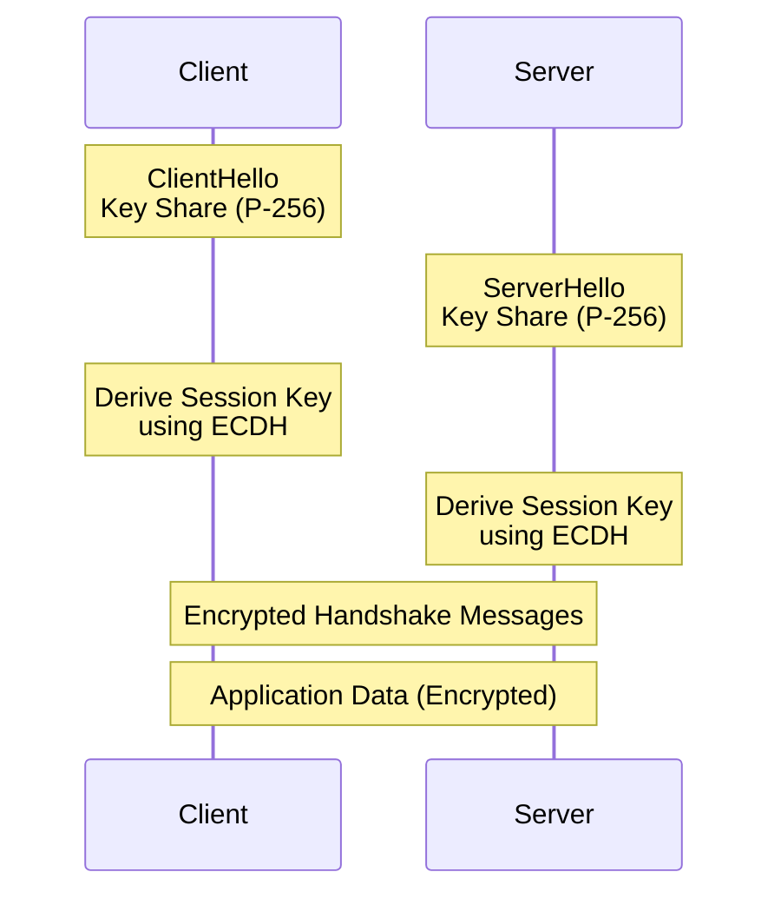
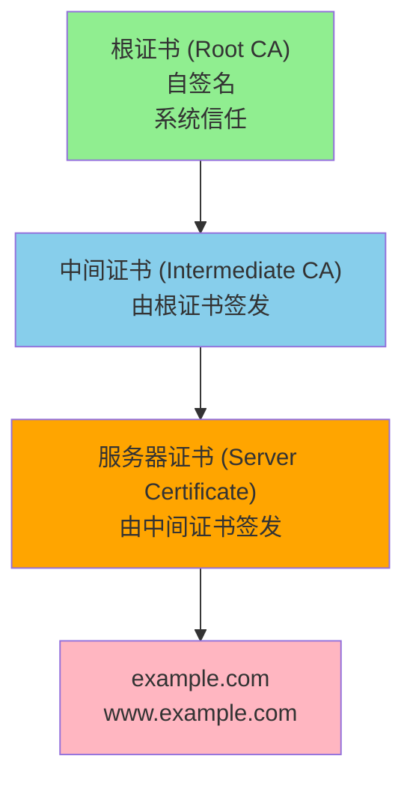
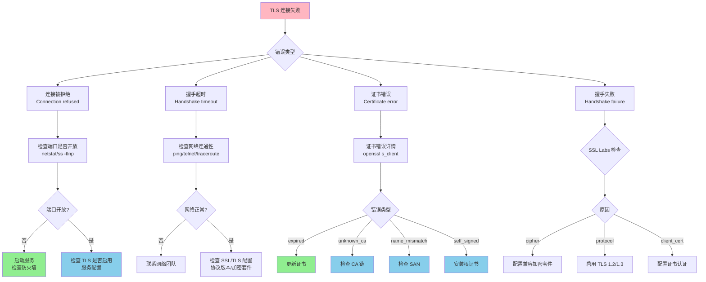

# TLS 深度探索 Ch6: TLS 实战调试与抓包分析

在 TLS 协议的实际应用中，调试和问题排查是每个工程师都必须掌握的技能。无论是排查连接失败原因、分析握手失败、还是验证安全配置，都需要借助一系列工具和方法。本文将系统性地介绍 TLS 调试的完整工具链和实战技巧。

## 1. TLS 调试工具全家桶

TLS 调试离不开一系列强大的命令行工具，这些工具构成了问题排查的基础设施。

### 1.1 OpenSSL s_client 与 s_server

OpenSSL 是 TLS 调试中最核心的工具集，其中 `s_client` 和 `s_server` 是最常用的两个命令。

**s_client 用法示例：**

```bash
# 基本 HTTPS 连接测试
openssl s_client -connect example.com:443

# 指定 TLS 版本
openssl s_client -tls1_3 -connect example.com:443

# 显示完整握手信息
openssl s_client -connect example.com:443 -debug -state

# 检查证书链
openssl s_client -connect example.com:443 -showcerts

# 测试 SNI（Server Name Indication）
openssl s_client -connect example.com:443 -servername example.com

# 检查 OCSP Stapling
openssl s_client -connect example.com:443 -status -tlsextdebug

# 测试客户端证书认证
openssl s_client -connect example.com:443 -cert client.crt -key client.key

# 指定 CA 证书
openssl s_client -connect example.com:443 -CAfile ca.crt
```

**s_server 用法示例：**

```bash
# 启动一个测试 TLS 服务器
openssl s_server -accept 8443 -cert server.crt -key server.key -www

# 启动仅支持 TLS 1.3 的服务器
openssl s_server -accept 8443 -cert server.crt -key server.key -tls1_3

# 记录所有连接数据到文件
openssl s_server -accept 8443 -cert server.crt -key server.key -keylogfile server.keys

# 指定加密套件
openssl s_server -accept 8443 -cipher 'TLS_AES_256_GCM_SHA384'
```

**实际调试场景演示：**

```bash
# 完整握手分析
$ openssl s_client -connect www.google.com:443 -tls1_3 -state -debug 2>&1 | head -100
# 输出显示 ClientHello、ServerHello、Certificate、Key Exchange 等阶段

# 检查证书过期时间
$ echo | openssl s_client -connect example.com:443 2>/dev/null | openssl x509 -noout -dates
notBefore=Jan 15 00:00:00 2024 GMT
notAfter=Jan 14 23:59:59 2025 GMT

# 检查证书 Subject Alternative Name (SAN)
$ echo | openssl s_client -connect example.com:443 2>/dev/null | openssl x509 -noout -text | grep -A1 "Subject Alternative Name"
            DNS:example.com, DNS:www.example.com
```

### 1.2 SSL Labs 在线检测

[SSL Labs](https://www.ssllabs.com/ssltest/) 是最全面的在线 TLS 检测工具，提供详细的握手分析和安全评级。

```bash
# 使用 API 进行自动化检测（需要申请 API key）
curl -H "Content-Type: application/json" \
     -H "Accept: application/json" \
     -X POST \
     -d '{"hostname":"example.com","publish":false,"startNew":true}' \
     "https://api.ssllabs.com/api/v3/analyze"
```

SSL Labs 评级标准：

| 评级 | 含义 | TLS 1.3 支持 | 强加密套件 | 前向保密 |
|------|------|--------------|-----------|----------|
| A+   | 卓越 | 必须 | 必须 | 必须 |
| A    | 优秀 | 优先 | 必须 | 必须 |
| B    | 良好 | - | 必须 | 推荐 |
| C    | 合格 | - | 推荐 | - |
| D/E/F| 不合格 | 弱加密或更糟 | - | - |

### 1.3 testssl.sh 命令行工具

testssl.sh 是一个开源的 TLS 检测工具，支持离线批量检测。

```bash
# 安装
git clone --depth 1 https://github.com/drwetter/testssl.sh.git
cd testssl.sh

# 全面检测
./testssl.sh --protocols --ciphers --headers --vulnerabilities example.com

# 仅检测协议版本
./testssl.sh -p example.com

# 仅检测加密套件
./testssl.sh -c example.com

# 检测已知漏洞
./testssl.sh -U example.com

# JSON 格式输出（便于程序处理）
./testssl.sh --jsonfile report.json example.com

# 批量检测
cat hosts.txt | ./testssl.sh --each

# 显示每个加密套件的详细信息
./testssl.sh -E example.com

# 检测证书过期和 SAN
./testssl.sh -S example.com
```

### 1.4 工具对比

| 工具 | 类型 | 适用场景 | 优点 | 缺点 |
|------|------|----------|------|------|
| OpenSSL s_client | 命令行 | 实时调试、快速检查 | 功能全面、随时可用 | 输出较乱 |
| SSL Labs | 在线 | 全面评估、生成报告 | 分析最全面 | 需要公网访问 |
| testssl.sh | 命令行 | 批量检测、CI 集成 | 开源、离线可用 | 速度较慢 |

## 2. Wireshark TLS 抓包技巧

Wireshark 是网络协议分析的利器，掌握 TLS 抓包技巧对于调试 TLS 问题至关重要。

### 2.1 基础抓包设置

```bash
# 抓取 HTTPS 流量（指定端口）
sudo wireshark -i eth0 -f "port 443" -w tls_capture.pcap

# 抓取特定主机的流量
sudo wireshark -i eth0 -f "host example.com and port 443" -w tls_capture.pcap

# 常用过滤表达式
# 过滤 TLS 握手
tls.handshake.type

# 过滤 Certificate 消息
tls.handshake.type == 11

# 过滤特定的 TLS 版本
tls.handshake.version == 0x0304  # TLS 1.3
tls.handshake.version == 0x0303  # TLS 1.2

# 过滤加密套件
tls.handshake.ciphersuite == 0x1301  # TLS_AES_128_GCM_SHA256
```

### 2.2 SSLKEYLOGFILE 解密

当浏览器或应用程序配置了 SSLKEYLOGFILE 环境变量时，Wireshark 可以直接解密 TLS 流量。

**浏览器配置：**

```bash
# Chrome/Chromium
export SSLKEYLOGFILE=/tmp/ssl_keys.log

# Firefox
# 在 about:config 中设置 security.osclientcerts.autoload 为 true
# 并设置 security.nss.use_chromium_keytar 为 false
export SSLKEYLOGFILE=/tmp/ssl_keys.log

# 使用配置文件指定 keylog
wireshark -o "ssl.keylog_file:/tmp/ssl_keys.log" -r tls_capture.pcap
```

**应用程序 keylog 格式：**

```
# 格式：CLIENT_RANDOM <space> <space> <hex secret>
CLIENT_RANDOM 1A2B3C4D5E6F... 1234567890ABCDEF...
```

**在 Wireshark 中配置：**

1. Edit → Preferences → Protocols → TLS
2. 设置 "(Pre)-Master-Secret log filename" 为 `/tmp/ssl_keys.log`
3. 重新打开抓包文件

### 2.3 ECDHE 密钥交换解密

对于 ECDHE 密钥交换，即使没有 SSLKEYLOGFILE，也可以通过获取 Server's Key Share 来解密。

```bash
# 从 ServerHello 中提取 key share
# 在 Wireshark 中：
# 1. 找到 ServerHello 消息
# 2. 展开 "TLS Exporter" 或 "Key Share"
# 3. 记录 curve 和 pubkey

# 使用 OpenSSL 计算会话密钥
# 需要 Client Random、Server Key Share、Client Key Share
```

**TLS 1.3 ECDHE 握手流程：**



### 2.4 Wireshark TLS 过滤语法

```bash
# 基本过滤
tls                                # 所有 TLS 流量
tls.record.version                 # TLS 版本
tls.handshake.type                 # 握手消息类型
tls.handshake.ciphersuite          # 加密套件

# 握手阶段过滤
tls.handshake.type == 1            # ClientHello
tls.handshake.type == 2            # ServerHello
tls.handshake.type == 11           # Certificate
tls.handshake.type == 12           # ServerKeyExchange
tls.handshake.type == 13           # CertificateRequest
tls.handshake.type == 14           # ServerHelloDone
tls.handshake.type == 15           # CertificateVerify
tls.handshake.type == 16           # ClientKeyExchange
tls.handshake.type == 20           # Finished

# 加密套件过滤
tls.handshake.ciphersuite == 0xc02f  # TLS_ECDHE_RSA_WITH_AES_128_GCM_SHA256
tls.handshake.ciphersuite == 0x1301  # TLS_AES_128_GCM_SHA256 (TLS 1.3)

# 错误过滤
tls.alert_message_level            # 警告级别
tls.alert_message_description       # 警告描述

# 导出特定流量
# File → Export Objects → HTTP → 保存objects
```

### 2.5 实际抓包分析示例

```bash
# 抓包命令
sudo tcpdump -i eth0 -w tls_analysis.pcap 'tcp port 443'

# 在 Wireshark 中分析 TLS 1.3 握手
# 1. 追踪 TCP 流的 TLS payload
# 2. 分析 Handshake Protocol 下的各个消息
# 3. 检查 Encrypted Extensions、Certificate、CertificateVerify
# 4. 验证签名算法和证书链
```

**Wireshark TLS 1.3 握手包分析：**

```
Frame 12: TLS 1.3 Handshake
    Handshake Protocol: Client Hello
        Version: TLS 1.2 (0x0303)
        Cipher Suites: 5 items
            TLS_AES_128_GCM_SHA256 (0x1301)
            TLS_AES_256_GCM_SHA384 (0x1302)
            TLS_CHACHA20_POLY1305_SHA256 (0x1303)
        Extensions:
            supported_versions (0x002b): TLS 1.3
            signature_algorithms (0x000d)
            supported_groups (0x000a)

Frame 24: TLS 1.3 Handshake
    Handshake Protocol: Server Hello
        Version: TLS 1.2 (0x0303)  [Will use TLS 1.3]
        Cipher Suite: TLS_AES_128_GCM_SHA256 (0x1301)
        Extensions:
            supported_versions (0x002b): TLS 1.3

Frame 28: TLS 1.3 Handshake
    Handshake Protocol: Encrypted Extensions
    Handshake Protocol: Certificate
    Handshake Protocol: Certificate Verify
    Handshake Protocol: Finished
```

## 3. 浏览器开发者工具

浏览器提供了丰富的 TLS 诊断工具，是日常调试的重要帮手。

### 3.1 Chrome Security 面板

Chrome DevTools 的 Security 面板提供了直观的 TLS 信息展示。

**访问方式：**

1. 打开 DevTools（F12 或 Ctrl+Shift+I）
2. 切换到 Security 面板

**显示内容：**

```
Main origin: https://example.com
    Certificate: Valid
    Connection: TLS 1.3, AES_256_GCM
    Key Exchange: ECDHE_RSA
    Signature Algorithm: RSA-PKCS1-v1_5 with SHA-256
    Certificate Transparency: Signed Certificate Timestamp present
```

**Certificate Viewer：**

点击 "View certificate" 可以查看：

```
Subject: CN=example.com
Issuer: C=US, O=Let's Encrypt, CN=R3
Valid: 2024-01-15 to 2025-01-14
Serial Number: 04:03:...
Public Key: RSA 2048 bits
Subject Alternative Names: DNS:example.com, DNS:www.example.com
```

### 3.2 Firefox Security 面板

Firefox 的 Security 面板提供类似功能，并额外显示连接安全要求。

```
Connection security: TLS 1.3 + AES_256_GCM + ECDHE_RSA
Cipher Suite: TLS_AES_256_GCM_SHA384
Certificate: DigiCert Global Root CA
    Fingerprint (SHA-256): A1:B2:C3:...
    Subject Alternative Names: *.example.com
```

### 3.3 导出证书进行详细分析

```bash
# 从浏览器导出证书
# Chrome: Security 面板 → View certificate → Details → Export

# 使用 OpenSSL 分析导出的证书
openssl x509 -in certificate.cer -text -noout
openssl x509 -in certificate.cer -fingerprint -sha256
openssl verify -CAfile root.crt -untrusted intermediate.crt server.crt

# 检查证书链
openssl s_client -connect example.com:443 -showcerts 2>/dev/null | \
    openssl x509 -noout -subject -issuer -dates
```

### 3.4 浏览器控制台 TLS 信息

在 Console 中可以使用 Security 相关的 API：

```javascript
// 获取连接信息
security.getUserMessage()

// 检查证书状态（需要页面加载完成后）
performance.getEntriesByType('resource').forEach(r => {
    if (r.secureConnectionStart) {
        console.log(r.name, {
            protocol: r.nextHopProtocol,
            transferSize: r.transferSize
        });
    }
});

// 查看详细的 timing 信息
performance.getEntriesByType('navigation')[0].toJSON()
```

## 4. 常见 TLS 错误详解

理解 TLS 错误码是快速定位问题的关键。

### 4.1 错误码对照表

| Alert Level | Alert Description | 含义 | 常见原因 |
|-------------|-------------------|------|----------|
| fatal | close_notify | 连接正常关闭 | - |
| fatal | unexpected_message | 收到意外消息 | 协议版本不匹配 |
| fatal | bad_record_mac | MAC 校验失败 | 密钥错误或篡改 |
| fatal | decryption_failed | 解密失败 | 密钥错误 |
| fatal | record_overflow | 记录溢出 | 收到异常大记录 |
| fatal | certificate_unknown | 证书验证失败 | 证书链问题 |
| fatal | handshake_failure | 握手失败 | 加密套件不匹配 |
| fatal | no_cert | 证书缺失 | 客户端认证配置错误 |
| fatal | unsupported_cert | 不支持的证书类型 | 证书格式错误 |
| fatal | certificate_revoked | 证书已吊销 | 证书被吊销 |
| fatal | certificate_expired | 证书已过期 | 证书过期 |
| fatal | certificate_unknown | 证书未知 | CA 不受信任 |
| fatal | illegal_parameter | 非法参数 | 参数格式错误 |
| fatal | unknown_ca | 未知 CA | 根证书不受信任 |
| fatal | access_denied | 访问被拒绝 | 证书 SAN 不匹配 |
| fatal | decode_error | 解码错误 | 消息格式损坏 |
| fatal | decrypt_error | 加密错误 | 签名验证失败 |
| fatal | export_restriction | 导出限制 | 加密套件出口限制 |
| fatal | protocol_version | 协议版本不支持 | TLS 版本不匹配 |
| fatal | insufficient_security | 安全级别不足 | 加密强度不够 |
| fatal | no_cipher_match | 没有匹配的加密套件 | 服务器不支持任何客户端加密套件 |
| fatal | unspecified_error | 未指定错误 | 未知错误 |
| fatal | internal_error | 内部错误 | 实现错误 |

### 4.2 certificate_unknown 详解

**错误原因：**

```
certificate_unknown (alert code 46)
```

这是最常见的 TLS 错误之一，通常由以下原因引起：

1. **根证书不受信任**
2. **中间证书缺失**
3. **证书链顺序错误**
4. **证书被吊销**
5. **证书过期**

**排查步骤：**

```bash
# 1. 检查证书链完整性
openssl s_client -connect example.com:443 -showcerts

# 2. 验证证书链
openssl verify -CAfile ca-bundle.crt -untrusted intermediate.crt server.crt

# 3. 检查证书吊销状态
openssl ocsp -issuer issuer.crt -cert server.crt -url http://ocsp.example.com

# 4. 检查证书过期时间
openssl x509 -in server.crt -noout -dates
```

### 4.3 handshake_failure 详解

**错误原因：**

```
handshake_failure (alert code 40)
```

握手失败通常发生在以下场景：

**场景 1：加密套件不匹配**

```bash
# 客户端不支持服务器的任何加密套件
# 服务器配置：仅允许 AES-256-GCM
# 客户端仅支持 3DES

# 排查
openssl s_client -connect example.com:443 -cipher 'ALL:COMPLEMENTOFALL'
```

**场景 2：协议版本不兼容**

```bash
# 服务器要求 TLS 1.3，客户端仅支持 TLS 1.0
openssl s_client -connect example.com:443 -tls1
# 返回 handshake_failure
```

**场景 3：证书密钥不匹配**

```bash
# 证书公钥与私钥不匹配
# 服务器配置使用 RSA 证书，但密码套件要求 ECDSA

# 排查：检查证书类型和加密套件
openssl s_client -connect example.com:443 2>&1 | grep "Certificate chain"
```

### 4.4 no_cipher_match 详解

**错误原因：**

```
no_cipher_match (alert code 47)
```

这表示客户端和服务器之间没有任何共同的加密套件。

**常见场景：**

1. 服务器仅允许 FS（Forward Secrecy）加密套件，但客户端不支持 ECDHE
2. 服务器禁用了一些旧加密套件，但客户端仅支持这些
3. 服务器要求 ECDSA 证书，但配置了 RSA 证书

**排查：**

```bash
# 查看服务器支持的加密套件
openssl s_client -connect example.com:443 -cipher 'ALL:eNULL' 2>&1 | head -20

# 使用 testssl.sh 全面检测
./testssl.sh -E example.com

# 检查服务器配置
# Nginx:
ssl_protocols TLSv1.2 TLSv1.3;
ssl_ciphers 'TLS_AES_256_GCM_SHA384:TLS_CHACHA20_POLY1305_SHA256';

# Apache:
SSLProtocol all -SSLv3 -TLSv1 -TLSv1.1
SSLCipherSuite TLS_AES_256_GCM_SHA384:TLS_CHACHA20_POLY1305_SHA256
```

### 4.5 unknown_ca 详解

**错误原因：**

```
unknown_ca (alert code 48)
```

服务器发送的证书链的根 CA 不被客户端信任。

**场景：**

1. 企业使用内部 CA，客户端未安装根证书
2. 证书链中的根证书过期
3. 交叉签名证书问题

**排查：**

```bash
# 查看服务器发送的完整证书链
openssl s_client -connect example.com:443 -showcerts 2>/dev/null

# 提取并保存证书链
openssl s_client -connect example.com:443 2>/dev/null | \
    sed -n '/-----BEGIN CERTIFICATE-----/,/-----END CERTIFICATE-----/p' > chain.pem

# 分析证书链
openssl crl2pkcs7 -nocrl -certfile chain.pem | openssl pkcs7 -print_certs -noout

# 手动构建证书链并验证
cat server.crt intermediate.crt > chain.pem
openssl verify -CAfile root.crt chain.pem
```

### 4.6 bad_record_mac 详解

**错误原因：**

```
bad_record_mac (alert code 20)
```

MAC 校验失败，通常意味着：

1. **密钥不匹配**：客户端和服务器使用的密钥不一致
2. **重放攻击**：使用了过期的密钥材料
3. **实现 Bug**：TLS 库的实现问题

**排查：**

```bash
# 清除缓存的会话信息，重新握手
openssl s_client -connect example.com:443 -no_cache

# 检查系统时间是否正确
date
# 时间错误可能导致密钥材料计算异常

# 清除 SSL 会话缓存
# Nginx:
#   proxy_cache_bypass $https;
#   ssl_session_cache off;
```

## 5. Go TLS 编程实战

Go 的 `crypto/tls` 包提供了完整的 TLS 实现。

### 5.1 基础 HTTPS 客户端

```go
package main

import (
    "crypto/tls"
    "crypto/x509"
    "fmt"
    "io/ioutil"
    "net/http"
)

func basicHTTPSClient() {
    // 基础 HTTPS 请求
    resp, err := http.Get("https://example.com")
    if err != nil {
        panic(err)
    }
    defer resp.Body.Close()
    
    body, _ := ioutil.ReadAll(resp.Body)
    fmt.Println(string(body))
}

func customTLSClient() {
    // 自定义 TLS 配置
    cert, err := tls.LoadX509KeyPair("client.crt", "client.key")
    if err != nil {
        panic(err)
    }
    
    // 加载 CA 证书
    caCert, err := ioutil.ReadFile("ca.crt")
    if err != nil {
        panic(err)
    }
    caCertPool := x509.NewCertPool()
    caCertPool.AppendCertsFromPEM(caCert)
    
    // 配置 TLS
    tlsConfig := &tls.Config{
        Certificates:       []tls.Certificate{cert},
        RootCAs:            caCertPool,
        InsecureSkipVerify: false, // 强烈建议保持 false
        MinVersion:         tls.VersionTLS12,
        MaxVersion:         tls.VersionTLS13,
    }
    
    client := &http.Client{
        Transport: &http.Transport{
            TLSClientConfig: tlsConfig,
        },
    }
    
    resp, err := client.Get("https://example.com")
    if err != nil {
        panic(err)
    }
    defer resp.Body.Close()
    
    fmt.Printf("Protocol: %s\n", resp.TLS.Version)
    fmt.Printf("Cipher Suite: %x\n", resp.TLS.CipherSuite)
}
```

### 5.2 自定义证书验证

```go
package main

import (
    "crypto/tls"
    "crypto/x509"
    "fmt"
    "net/http"
)

func customVerifyClient() {
    // 加载 CA 池
    caCert, err := x509.SystemCertPool()
    if err != nil {
        panic(err)
    }
    
    tlsConfig := &tls.Config{
        RootCAs: caCert,
        // 自定义验证回调（Go 1.15+ 已废弃，仅在特定场景使用）
        // VerifyPeerCertificate 被调用来进行额外的验证
    }
    
    // 验证函数
    customVerify := func(rawCerts [][]byte, verifiedChains [][]*x509.Certificate) error {
        for _, rawCert := range rawCerts {
            cert, err := x509.ParseCertificate(rawCert)
            if err != nil {
                return err
            }
            
            // 自定义验证逻辑
            if cert.Subject.CommonName != "example.com" {
                return fmt.Errorf("invalid common name: %s", cert.Subject.CommonName)
            }
            
            // 检查证书是否在特定用途上正确
            for _, usage := range cert.ExtKeyUsage {
                if usage == x509.ExtKeyUsageServerAuth {
                    return nil
                }
            }
        }
        return nil
    }
    
    // 使用 VerifyConnection 进行连接级别的验证
    tlsConfig.VerifyConnection = customVerify
}
```

### 5.3 TLS 服务器

```go
package main

import (
    "crypto/tls"
    "crypto/x509"
    "fmt"
    "io/ioutil"
    "net/http"
)

func tlsServer() {
    // 加载服务器证书
    serverCert, err := tls.LoadX509KeyPair("server.crt", "server.key")
    if err != nil {
        panic(err)
    }
    
    // 加载 CA 证书（用于客户端认证）
    caCert, err := ioutil.ReadFile("ca.crt")
    if err != nil {
        panic(err)
    }
    caCertPool := x509.NewCertPool()
    caCertPool.AppendCertsFromPEM(caCert)
    
    tlsConfig := &tls.Config{
        Certificates: []tls.Certificate{serverCert},
        ClientCAs:    caCertPool,
        ClientAuth:   tls.RequireAndVerifyClientCert,
        MinVersion:   tls.VersionTLS12,
        MaxVersion:   tls.VersionTLS13,
        // 仅允许 FS 加密套件
        CurvePreferences: []tls.CurveID{
            tls.CurveP256,
            tls.X25519,
        },
        CipherSuites: []uint16{
            tls.TLS_ECDHE_RSA_WITH_AES_256_GCM_SHA384,
            tls.TLS_ECDHE_RSA_WITH_CHACHA20_POLY1305,
            tls.TLS_AES_256_GCM_SHA384,
        },
    }
    
    server := &http.Server{
        Addr:      ":8443",
        TLSConfig: tlsConfig,
        Handler:   http.HandlerFunc(handler),
    }
    
    fmt.Println("Server starting on :8443")
    err = server.ListenAndServeTLS("", "")
    if err != nil {
        panic(err)
    }
}

func handler(w http.ResponseWriter, r *http.Request) {
    fmt.Fprintf(w, "Hello, TLS!")
}
```

### 5.4 获取连接 TLS 信息

```go
package main

import (
    "fmt"
    "net/http"
)

func getTLSInfo() {
    resp, err := http.Get("https://example.com")
    if err != nil {
        panic(err)
    }
    defer resp.Body.Close()
    
    // 获取 TLS 连接信息
    tlsState := resp.TLS
    
    if tlsState == nil {
        fmt.Println("Not a TLS connection")
        return
    }
    
    fmt.Printf("TLS Version: %d\n", tlsState.Version)
    fmt.Printf("Handshake Complete: %v\n", tlsState.HandshakeComplete)
    fmt.Printf("Cipher Suite: %x\n", tlsState.CipherSuite)
    fmt.Printf("Server Name: %s\n", tlsState.ServerName)
    fmt.Printf("Negotiated Protocol: %s\n", tlsState.NegotiatedProtocol)
    
    // 遍历证书链
    for i, cert := range tlsState.PeerCertificates {
        fmt.Printf("\nCertificate %d:\n", i)
        fmt.Printf("  Subject: %s\n", cert.Subject)
        fmt.Printf("  Issuer: %s\n", cert.Issuer)
        fmt.Printf("  Expires: %v\n", cert.NotAfter)
        fmt.Printf("  DNS Names: %v\n", cert.DNSNames)
    }
}
```

### 5.5 TLS 配置最佳实践

```go
package main

import (
    "crypto/tls"
    "time"
)

func bestPracticeTLSConfig() *tls.Config {
    return &tls.Config{
        // 最低 TLS 版本
        MinVersion: tls.VersionTLS12,
        
        // 推荐 TLS 1.3（如果可用）
        MaxVersion: tls.VersionTLS13,
        
        // 安全曲线偏好（TLS 1.2）
        CurvePreferences: []tls.CurveID{
            tls.X25519,    // 优先 X25519
            tls.CurveP256,
        },
        
        // 安全加密套件
        CipherSuites: []uint16{
            // TLS 1.3 加密套件
            tls.TLS_AES_256_GCM_SHA384,
            tls.TLS_CHACHA20_POLY1305_SHA256,
            tls.TLS_AES_128_GCM_SHA256,
            // TLS 1.2 加密套件（保留以兼容）
            tls.TLS_ECDHE_RSA_WITH_AES_256_GCM_SHA384,
            tls.TLS_ECDHE_RSA_WITH_CHACHA20_POLY1305,
            tls.TLS_ECDHE_RSA_WITH_AES_128_GCM_SHA256,
        },
        
        // 会话缓存配置
        SessionTicketsDisabled: false,
        // 推荐使用票证密钥轮换
        // SetSessionTicketKeys 或使用 tls.Config#SetSessionTicketKey
        
        // 前向保密
        // 通过使用 DHE/ECDHE 加密套件自动实现
        
        // OCSP Stapling（服务器端自动配置）
        // 如果需要客户端请求 OCSP：
        // OCSPRequestTimeout: 5 * time.Second,
        // OCSPCacheSize: 500,
    }
}

// 用于定期轮换票证密钥的示例
func rotateSessionTickets(config *tls.Config) {
    ticker := time.NewTicker(24 * time.Hour)
    go func() {
        for range ticker.C {
            // 生成新的会话票证密钥
            newKey := make([]byte, 48)
            // 填充随机数据
            // ...
            config.SetSessionTicketKeys([][]byte{newKey})
        }
    }()
}
```

## 6. Python TLS 编程实战

Python 的 `ssl` 模块和 `requests` 库提供了丰富的 TLS 编程接口。

### 6.1 基础 ssl 模块使用

```python
import ssl
import socket

def basic_tls_connection():
    """最基本的 TLS 连接"""
    context = ssl.create_default_context()
    
    with socket.create_connection(('example.com', 443)) as sock:
        with context.wrap_socket(sock, server_hostname='example.com') as ssock:
            print(ssock.version())
            print(ssock.cipher())
            cert = ssock.getpeercert()
            print(cert)
```

### 6.2 自定义 SSL 上下文

```python
import ssl
import socket
from urllib.request import urlopen
from datetime import datetime

def custom_ssl_context():
    """自定义 SSL 上下文"""
    # 创建上下文
    context = ssl.SSLContext(ssl.PROTOCOL_TLS_CLIENT)
    
    # 加载可信 CA 证书
    context.load_verify_locations('/etc/ssl/certs/ca-certificates.crt')
    
    # 或者使用系统默认的 CA
    # context.load_default_certs()
    
    # 设置验证模式
    context.check_hostname = True
    context.verify_mode = ssl.CERT_REQUIRED
    
    # 设置最低 TLS 版本
    context.minimum_version = ssl.TLSVersion.TLSv1_2
    
    # 设置加密套件
    context.set_ciphers('ECDHE+AESGCM:ECDHE+CHACHA20:DHE+AESGCM:DHE+CHACHA20')
    
    # 使用自定义上下文
    with socket.create_connection(('example.com', 443)) as sock:
        with context.wrap_socket(sock, server_hostname='example.com') as ssock:
            # 获取 TLS 详情
            cert = ssock.getpeercert(binary_form=True)
            cipher = ssock.cipher()
            version = ssock.version()
            
            print(f"Version: {version}")
            print(f"Cipher: {cipher}")
            print(f"Certificate subject: {ssock.getpeercert()['subject']}")
```

### 6.3 证书验证详解

```python
import ssl
import socket
import cryptography.x509
import cryptography.hazmat.backends

def verify_certificate_chain():
    """详细验证证书链"""
    context = ssl.SSLContext(ssl.PROTOCOL_TLS_CLIENT)
    context.check_hostname = True
    context.verify_mode = ssl.CERT_REQUIRED
    context.load_default_certs()
    
    with socket.create_connection(('example.com', 443)) as sock:
        with context.wrap_socket(sock, server_hostname='example.com') as ssock:
            # 获取证书链
            cert_dict = ssock.getpeercert()
            
            # 获取完整的 PEM 格式证书链
            pem_certs = ssock.getpeercert(chain=True)
            
            for i, cert in enumerate(pem_certs):
                print(f"\n=== Certificate {i} ===")
                print(f"Subject: {cert['subject']}")
                print(f"Issuer: {cert['issuer']}")
                
                # 解析日期
                not_before = cert['notBefore']
                not_after = cert['notAfter']
                print(f"Valid from: {not_before}")
                print(f"Valid until: {not_after}")

def custom_hostname_verification():
    """自定义主机名验证"""
    import hashlib
    import base64
    
    def verify_callback(conn, cert, errno, errdepth, retcode):
        if errno != 0:
            return False
        
        # 自定义验证逻辑
        san = cert.get('subjectAltName', ())[0]
        expected_host = 'example.com'
        
        if san[1] != expected_host:
            print(f"Hostname mismatch: {san[1]} != {expected_host}")
            return False
        
        return True
    
    context = ssl.SSLContext(ssl.PROTOCOL_TLS_CLIENT)
    context.check_hostname = False  # 禁用默认检查
    context.verify_mode = ssl.CERT_REQUIRED
    context.load_default_certs()
    # 注意：Python 3.7+ 不再支持 verify_callback
    # 应该使用 ssock.match_hostname() 手动调用
```

### 6.4 requests 库的 TLS 配置

```python
import requests
from requests.structures import CaseInsensitiveDict

def requests_with_tls():
    """requests 库的 TLS 配置"""
    
    # 基础请求（使用系统 CA）
    resp = requests.get('https://example.com')
    print(resp.status_code)
    print(resp.url)
    
    # 查看响应 TLS 信息
    print(f"TLS Version: {resp.raw._original_response.closed}")
    print(f"Cipher: {resp.raw._original_response.connection.getpeercert()}")
    
def requests_with_custom_ca():
    """使用自定义 CA 证书"""
    session = requests.Session()
    
    # 加载自定义 CA
    session.verify = '/path/to/ca-bundle.crt'
    
    # 或者禁用验证（仅用于测试）
    # session.verify = False  # 警告：安全性降低
    
    resp = session.get('https://example.com')
    print(resp.status_code)

def requests_with_client_cert():
    """使用客户端证书"""
    session = requests.Session()
    
    # 配置客户端证书
    session.cert = ('/path/to/client.crt', '/path/to/client.key')
    
    # 或者只指定证书文件（无密码）
    # session.cert = '/path/to/client.crt'
    
    resp = session.get('https://example.com')
    print(resp.status_code)

def requests_with_insecure_warning():
    """禁用 SSL 警告"""
    import urllib3
    urllib3.disable_warnings(category=urllib3.exceptions.InsecureRequestWarning)
    
    session = requests.Session()
    session.verify = False
    
    resp = session.get('https://example.com', verify=False)
    print(resp.status_code)

def adapter_with_custom_tls():
    """使用 HTTPAdapter 自定义 TLS"""
    from requests.adapters import HTTPAdapter
    from urllib3.util.ssl_ import DEFAULT_CIPHERS
    
    class TLSAdapter(HTTPAdapter):
        def __init__(self, min_tls_version=None, **kwargs):
            super().__init__(**kwargs)
            self.min_tls_version = min_tls_version
        
        def init_poolmanager(self, *args, **kwargs):
            ctx = ssl.create_default_context()
            
            if self.min_tls_version:
                ctx.minimum_version = self.min_tls_version
            
            # 设置安全的加密套件
            ctx.set_ciphers(DEFAULT_CIPHERS.replace(':EXP', ''))
            
            kwargs['ssl_context'] = ctx
            return super().init_poolmanager(*args, **kwargs)
    
    session = requests.Session()
    session.mount('https://', TLSAdapter(ssl.TLSVersion.TLSv1_2))
    
    resp = session.get('https://example.com')
    print(resp.status_code)
```

### 6.5 使用 OpenSSL 进行高级操作

```python
from OpenSSL import SSL
import socket

def openssl_advanced_connection():
    """使用 pyOpenSSL 进行高级 TLS 操作"""
    # 创建上下文
    ctx = SSL.Context(SSL.TLSv1_2_METHOD)
    
    # 设置选项
    ctx.set_options(SSL.OP_NO_SSLv2 | SSL.OP_NO_SSLv3 | SSL.OP_NO_TLSv1)
    
    # 设置加密套件
    ctx.set_cipher_list('ECDHE+AESGCM:ECDHE+CHACHA20')
    
    # 加载 CA 证书
    ctx.load_verify_locations('/etc/ssl/certs/ca-certificates.crt')
    ctx.set_verify_depth(5)
    
    # 设置连接
    conn = SSL.Connection(ctx, socket.socket())
    conn.connect(('example.com', 443))
    conn.setblocking(True)
    
    # SNI
    conn.set_tlsext_host_name('example.com')
    
    # 执行握手
    conn.do_handshake()
    
    # 获取证书信息
    cert = conn.get_peer_certificate()
    print(f"Subject: {cert.get_subject()}")
    print(f"Issuer: {cert.get_issuer()}")
    print(f"Cipher: {conn.get_cipher()}")
    
    # 获取完整的证书链
    chain = conn.get_peer_cert_chain()
    for i, c in enumerate(chain):
        print(f"\nCertificate {i}:")
        print(f"  Subject: {c.get_subject()}")
        print(f"  Serial: {c.get_serial_number()}")
    
    # 发送请求
    conn.send(b'GET / HTTP/1.1\r\nHost: example.com\r\n\r\n')
    response = conn.recv(4096)
    print(response.decode())
    
    conn.shutdown()
    conn.close()
```

### 6.6 TLS 调试技巧

```python
import ssl
import socket
import certifi

def debug_tls_connection():
    """TLS 连接调试"""
    context = ssl.create_default_context()
    context.check_hostname = True
    context.verify_mode = ssl.CERT_REQUIRED
    
    # 使用 certifi 的 CA 包（更可靠）
    context.load_verify_locations(certifi.where())
    
    with socket.create_connection(('example.com', 443)) as sock:
        with context.wrap_socket(sock, server_hostname='example.com') as ssock:
            # 打印所有可用的 TLS 信息
            print("=== TLS Connection Info ===")
            print(f"Version: {ssock.version()}")
            print(f"Cipher: {ssock.cipher()}")
            print(f"Compression: {ssock.compression()}")
            
            # 打印证书信息
            cert = ssock.getpeercert()
            print(f"\n=== Certificate ===")
            for key, value in cert.items():
                print(f"{key}: {value}")

def check_certificate_expiry():
    """检查证书过期时间"""
    import datetime
    
    context = ssl.create_default_context()
    context.check_hostname = True
    context.verify_mode = ssl.CERT_REQUIRED
    
    with socket.create_connection(('example.com', 443)) as sock:
        with context.wrap_socket(sock, server_hostname='example.com') as ssock:
            cert = ssock.getpeercert()
            
            # 解析 notAfter 日期
            not_after = cert['notAfter']
            expiry_date = datetime.datetime.strptime(not_after, '%b %d %H:%M:%S %Y %Z')
            
            # 计算剩余天数
            remaining = expiry_date - datetime.datetime.utcnow()
            print(f"Certificate expires: {expiry_date}")
            print(f"Days remaining: {remaining.days}")
            
            if remaining.days < 30:
                print("WARNING: Certificate expires soon!")

def scan_available_ciphers():
    """扫描服务器支持的加密套件"""
    import subprocess
    
    result = subprocess.run([
        'openssl', 's_client', '-connect', 'example.com:443',
        '-cipher', 'ALL', '-v'
    ], capture_output=True, text=True)
    
    print(result.stdout)
    print(result.stderr)
```

## 7. cURL TLS 调试

cURL 是命令行中最重要的 HTTP 客户端，其 TLS 相关选项对于调试至关重要。

### 7.1 详细输出选项

```bash
# -v: 基本 verbose 输出
curl -v https://example.com

# -vv: 更详细的 verbose 输出
curl -vv https://example.com

# --verbose: 等同于 -v
curl --verbose https://example.com

# --trace: 记录所有发送/接收的数据
curl --trace trace.log https://example.com

# --trace-ascii: ASCII 格式的 trace（便于阅读）
curl --trace-ascii trace.log https://example.com

# --trace-time: 在 trace 中添加时间戳
curl --trace-time --trace trace.log https://example.com

# --write-out: 自定义输出格式
curl -w "\nHTTP Code: %{http_code}\nTLS Version: %{ssl_version}\nCipher: %{ssl_cipher}\n" \
     https://example.com

# 常用格式说明符
# %{http_code}        - HTTP 状态码
# %{ssl_version}      - TLS 版本
# %{ssl_cipher}       - 加密套件
# %{ssl_verify_result} - 证书验证结果
# %{num_connects}     - 连接数
# %{time_connect}     - TCP 连接时间
# %{time_appconnect}  - TLS 握手时间
# %{size_download}    - 下载大小
# %{speed_download}   - 下载速度
```

### 7.2 证书相关选项

```bash
# 指定客户端证书
curl --cert client.crt --key client.key https://example.com

# 指定 PEM 格式的客户端证书
curl --cert-type PEM --cert client.pem https://example.com

# 指定 PKCS12 格式的证书
curl --cert-type P12 --cert client.p12 https://example.com

# 指定 CA 证书
curl --cacert ca.crt https://example.com

# 指定 CA 证书目录
curl --capath /etc/ssl/certs https://example.com

# 禁用证书验证（测试用）
curl -k https://example.com

# 或者
curl --insecure https://example.com

# 验证主机名
curl --resolve example.com:443:127.0.0.1 https://example.com
```

### 7.3 TLS 版本控制

```bash
# 使用特定 TLS 版本
curl --tlsv1.0 https://example.com
curl --tlsv1.1 https://example.com
curl --tlsv1.2 https://example.com
curl --tlsv1.3 https://example.com

# 指定 TLS 版本范围
curl --tls-max 1.3 https://example.com

# 指定 TLS 1.3
curl --tlsv1.3 https://example.com

# 查看 curl 支持的 TLS 后端
curl --version
# curl 7.88.1 (OpenSSL/3.0.x) ...
```

### 7.4 加密套件控制

```bash
# 指定加密套件（使用冒号分隔）
curl --ciphers 'ECDHE-RSA-AES256-GCM-SHA384:ECDHE-RSA-CHACHA20-POLY1305' \
     https://example.com

# 列出所有可用加密套件
curl --version | grep -i ciphers

# 查看服务器支持的加密套件
openssl s_client -connect example.com:443 -cipher 'ALL:eNULL' 2>/dev/null | \
    grep "Cipher is"

# 不允许 PSK 加密套件
curl --ciphers 'DEFAULT:!PSK' https://example.com
```

### 7.5 实际调试示例

```bash
# 完整 TLS 调试：检查 Google 的 TLS 配置
$ curl -v --trace-ascii - https://www.google.com 2>&1 | head -50
== Info:   Trying 142.250.185.78:443...
== Info: Connected to www.google.com (142.250.185.78) port 443
== Info: ALPN: protocol h2 negotiated
== Info: TLSv1.3 (0x0304), cipher TLS_AES_256_GCM_SHA384 (256/256 bits)
== Info:    Protocol: TLSv1.3
== Info:    Cipher:   TLS_AES_256_GCM_SHA384
== Info:    Key size: 256 bits
...
== Info: SSL connection using TLS_AES_256_GCM_SHA384 / TLSv1.3 / unknown

# 检查证书链
$ curl -v --trace-ascii - 2>&1 | grep -E "(Server certificate|Certificate|issuer)"
Server certificate:
  SSL certificate verify ok.

# 提取并保存服务器证书
$ curl -w "%{ssl_cert}" --output /dev/null -s | \
    openssl x509 -text -noout

# 测试证书过期
$ curl -w "%{ssl_verify_result}\n" https://example.com
0

# 测试 OCSP stapling
$ curl -v --stderr - 2>&1 | grep -i ocsp
* OCSP Response Status: successful (0x0)

# 完整 TLS 握手时间分析
$ curl -w "\nDNS: %{time_namelookup}s\nConnect: %{time_connect}s\nTLS: %{time_appconnect}s\nTotal: %{time_total}s\n" \
     -o /dev/null -s https://example.com
DNS: 0.005s
Connect: 0.012s
TLS: 0.035s
Total: 0.052s
```

### 7.6 cURL 与代理

```bash
# 通过 HTTPS 代理
curl -x https://proxy.example.com:8080 https://example.com

# 通过 SOCKS5 代理
curl -x socks5://proxy.example.com:1080 https://example.com

# HTTPS 代理使用客户端证书
curl -x https://proxy.example.com:8080 \
     --cert client.crt --key client.key \
     https://example.com

# 显示详细的代理协商过程
curl -v -x https://proxy.example.com:8080 https://example.com
```

## 8. 安全配置检查

正确的 TLS 配置是安全通信的基础，本节介绍如何检查和配置安全的 TLS 设置。

### 8.1 TLS 版本配置

**版本支持情况：**

| 版本 | 状态 | 建议 |
|------|------|------|
| SSL 2.0 | 废弃 | 禁用 |
| SSL 3.0 | 废弃 | 禁用 |
| TLS 1.0 | 废弃 | 禁用 |
| TLS 1.1 | 废弃 | 禁用 |
| TLS 1.2 | 推荐 | 保留（兼容性） |
| TLS 1.3 | 推荐 | 启用（最佳） |

**Nginx 配置：**

```nginx
# /etc/nginx/nginx.conf 或 sites-enabled/example.com

server {
    listen 443 ssl http2;
    
    ssl_certificate /etc/ssl/certs/server.crt;
    ssl_certificate_key /etc/ssl/private/server.key;
    
    # TLS 版本配置 - 推荐配置
    ssl_protocols TLSv1.2 TLSv1.3;
    
    # 禁用 TLS 1.0/1.1（旧配置）
    # ssl_protocols TLSv1.2 TLSv1.3;
    
    # 不推荐的配置（允许 TLS 1.0/1.1）
    # ssl_protocols TLSv1 TLSv1.1 TLSv1.2 TLSv1.3;
}
```

**Apache 配置：**

```apache
# /etc/apache2/sites-enabled/example.com.conf

<VirtualHost *:443>
    SSLEngine on
    SSLCertificateFile /etc/ssl/certs/server.crt
    SSLCertificateKeyFile /etc/ssl/private/server.key
    
    # TLS 版本配置
    SSLProtocol -all +TLSv1.2 +TLSv1.3
    
    # 旧配置（不推荐）
    # SSLProtocol all -SSLv3 -TLSv1 -TLSv1.1
</VirtualHost>
```

**检查当前配置：**

```bash
# 使用 testssl.sh 检查
./testssl.sh -p example.com

# 使用 OpenSSL 检查服务器支持的 TLS 版本
for v in ssl3 tls1 tls1_1 tls1_2 tls1_3; do
    echo -n "$v: "
    echo | openssl s_client -$v -connect example.com:443 2>&1 | \
        grep -E "(Protocol|Cipher|handshake)" | head -1
done
```

### 8.2 安全加密套件配置

**推荐的安全加密套件：**

```
TLS 1.3:
- TLS_AES_256_GCM_SHA384
- TLS_CHACHA20_POLY1305_SHA256
- TLS_AES_128_GCM_SHA256

TLS 1.2 (需要前向保密):
- ECDHE-RSA-AES256-GCM-SHA384
- ECDHE-RSA-CHACHA20-POLY1305
- ECDHE-RSA-AES128-GCM-SHA256
```

**不安全的加密套件（应禁用）：**

```
- NULL cipher (eNULL, NULL)
- EXPORT ciphers (EXP, eNULL)
- RC4 (RC4_*, exp-rc4-*)
- 3DES (DES-CBC3-*)
- MD5 (MD5)
- SHA1 (SHA, SHA1, *-SHA)
- static RSA key exchange (aRSA)
```

**Nginx 加密套件配置：**

```nginx
# 最佳安全配置
ssl_ciphers 'TLS_AES_256_GCM_SHA384:TLS_CHACHA20_POLY1305_SHA256:
             ECDHE-ECDSA-AES256-GCM-SHA384:ECDHE-RSA-AES256-GCM-SHA384:
             ECDHE-ECDSA-CHACHA20-POLY1305:ECDHE-RSA-CHACHA20-POLY1305:
             ECDHE-ECDSA-AES128-GCM-SHA256:ECDHE-RSA-AES128-GCM-SHA256';

# 使用 OpenSSL 优选字符串
ssl_ciphers 'ECDHE-ECDSA-AES256-GCM-SHA384:ECDHE-RSA-AES256-GCM-SHA384:
             ECDHE-ECDSA-CHACHA20-POLY1305:ECDHE-RSA-CHACHA20-POLY1305:
             DHE-RSA-AES256-GCM-SHA384';
             
# 启用 TLS 1.3 加密套件
ssl_conf_command Ciphersuites TLS_AES_256_GCM_SHA384:TLS_CHACHA20_POLY1305_SHA256;

# 优先使用服务器 cipher 顺序
ssl_prefer_server_ciphers on;
```

**检查加密套件：**

```bash
# 查看服务器支持的加密套件
openssl s_client -connect example.com:443 -cipher 'ALL:eNULL' 2>/dev/null | \
    grep -E "Cipher.*0x" | head -20

# 使用 testssl.sh 详细分析
./testssl.sh -E example.com

# 检查是否禁用不安全的 cipher
openssl s_client -connect example.com:443 -cipher 'NULL:eNULL:EXPORT:RC4:3DES' 2>&1 | \
    grep -E "(CONNECTED|no ciphers)"
```

### 8.3 前向保密 (Forward Secrecy)

前向保密确保即使长期密钥泄露，也不会导致过去的会话被解密。

```bash
# 检查是否支持 FS
openssl s_client -connect example.com:443 2>/dev/null | grep "Server public key"

# 检查 DHE/ECDHE 密钥交换
openssl s_client -connect example.com:443 -cipher 'DHE' 2>&1 | grep "Cipher"
openssl s_client -connect example.com:443 -cipher 'ECDHE' 2>&1 | grep "Cipher"

# 检查 DH/ECDH 参数大小
openssl s_client -connect example.com:443 2>/dev/null | \
    grep -E "(Server Temp Key|Diffie-Hellman|elliptic curve)"

# Nginx 配置确保 FS
ssl_protocols TLSv1.2 TLSv1.3;
ssl_prefer_server_ciphers on;

# 对于 TLS 1.2，配置足够的 DH 参数
ssl_dhparam /etc/ssl/dhparams.pem;  # 至少 2048 位

# 生成 DH 参数
openssl dhparam -out /etc/ssl/dhparams.pem 2048
```

### 8.4 HSTS 配置

HSTS (HTTP Strict Transport Security) 强制浏览器使用 HTTPS：

```nginx
# 添加 HSTS 头
add_header Strict-Transport-Security "max-age=31536000; includeSubDomains; preload" always;

# 详细配置
add_header Strict-Transport-Security 
    "max-age=63072000"               # 2 年
    "includeSubDomains"              # 包含子域名
    "preload"                        # 申请预加载列表
    always;
```

```apache
# Apache 配置
Header always set Strict-Transport-Security "max-age=63072000; includeSubDomains; preload"
```

**验证 HSTS 配置：**

```bash
# 使用 curl 检查
curl -I https://example.com 2>/dev/null | grep -i strict

# 使用 testssl.sh 检查
./testssl.sh -h https://example.com | grep -i hsts
```

### 8.5 安全配置检查清单

```bash
#!/bin/bash
# TLS 安全配置检查脚本

TARGET="$1"
if [ -z "$TARGET" ]; then
    echo "Usage: $0 <hostname>"
    exit 1
fi

echo "=== TLS Security Configuration Check ==="
echo "Target: $TARGET"
echo ""

# 1. 检查 TLS 版本
echo "1. TLS Version Support:"
for v in ssl3 tls1 tls1_1 tls1_2 tls1_3; do
    result=$(echo | openssl s_client -$v -connect $TARGET:443 2>&1 | \
        grep -E "Protocol|Cipher" | head -1)
    if [ -n "$result" ]; then
        echo "   $v: $result"
    else
        echo "   $v: FAILED"
    fi
done
echo ""

# 2. 检查证书信息
echo "2. Certificate Information:"
echo | openssl s_client -connect $TARGET:443 2>/dev/null | \
    openssl x509 -noout -subject -issuer -dates -serial
echo ""

# 3. 检查加密套件
echo "3. Supported Cipher Suites:"
echo | openssl s_client -connect $TARGET:443 2>/dev/null | \
    openssl s_client -cipher 'ALL:eNULL' 2>/dev/null | \
    grep "Cipher" | head -5
echo ""

# 4. 检查 FS 支持
echo "4. Forward Secrecy:"
echo | openssl s_client -connect $TARGET:443 2>/dev/null | \
    grep -E "(Server Temp Key|Diffie-Hellman|elliptic curve)"
echo ""

# 5. 检查 OCSP Stapling
echo "5. OCSP Stapling:"
echo | openssl s_client -connect $TARGET:443 -status 2>/dev/null | \
    grep -A1 "OCSP Response"
echo ""

# 6. 使用 testssl.sh 全面检查（如可用）
if command -v ./testssl.sh &> /dev/null; then
    echo "6. Running testssl.sh..."
    ./testssl.sh --protocols --ciphers --headers $TARGET
else
    echo "6. testssl.sh not found, skipping..."
fi
```

## 9. 证书链问题排查

证书链问题是最常见的 TLS 错误之一，本节详细介绍各种场景的排查方法。

### 9.1 证书链结构

标准的证书链结构：



### 9.2 中间证书缺失

**问题描述：**

服务器没有配置中间证书，导致客户端无法验证证书链。

**诊断方法：**

```bash
# 使用 OpenSSL 检查
openssl s_client -connect example.com:443 -showcerts

# 输出中只有服务器证书，没有中间证书
# 即：Certificate chain 只有一项

# 使用 SSL Labs 检查
# 会显示 "Chain issues: Missing certificate"

# 使用 testssl.sh 检查
./testssl.sh -S example.com
```

**解决方案：**

1. **服务器端修复：** 配置服务器发送完整的证书链

```bash
# Nginx: 合并证书文件
cat server.crt intermediate.crt > /etc/ssl/certs/server_chain.crt

# Nginx 配置
ssl_certificate /etc/ssl/certs/server_chain.crt;
ssl_certificate_key /etc/ssl/private/server.key;

# Apache: 配置证书链文件
SSLCertificateChainFile /etc/apache2/ssl.crt/server-chain.crt
```

2. **客户端修复：** 手动安装中间证书到信任存储

```bash
# 下载中间证书
wget https://letsencrypt.org/certs/lets-encrypt-x3-cross-signed.pem

# 添加到系统信任存储
sudo cp lets-encrypt-x3-cross-signed.pem /usr/local/share/ca-certificates/
sudo update-ca-certificates
```

### 9.3 证书链顺序错误

**问题描述：**

服务器发送的证书顺序不正确，应该按照 服务器证书 → 中间证书 → 根证书 的顺序发送。

**诊断：**

```bash
# 查看证书链顺序
openssl s_client -connect example.com:443 -showcerts 2>/dev/null | \
    openssl x509 -noout -subject -issuer -serial

# 检查顺序：每个证书的 issuer 应该等于下一个证书的 subject
# 如果顺序错误，会看到 issuer 和 subject 不匹配
```

**正确顺序示例：**

```
Certificate 0:
    subject=example.com
    issuer=Let's Encrypt Authority X3
    
Certificate 1:
    subject=Let's Encrypt Authority X3
    issuer=DST Root CA X3
    (这是根证书，应该被信任存储自动验证)
```

**修复服务器配置：**

```bash
# Nginx: 按正确顺序合并证书
# 服务器证书在前，中间证书在后
cat server.crt intermediate.crt > server_chain.pem

# Apache: 使用 SSLCertificateChainFile
# 或者直接在证书文件中按顺序添加
cat server.crt intermediate.crt >> server.crt
```

### 9.4 根证书过期

**问题描述：**

某些老旧的根证书已过期，但服务器仍在使用由其签发的中间证书。

**诊断：**

```bash
# 检查证书链中根证书的过期时间
openssl s_client -connect example.com:443 -showcerts 2>/dev/null | \
    openssl x509 -noout -dates -enddate

# 使用 SSL Labs 检查
# 会显示 "Certificate #2 (Root) expired on ..."

# 单独检查根证书
openssl x509 -in root.crt -noout -dates
```

**常见过期根证书：**

| 根证书 | 过期日期 | 替代方案 |
|--------|----------|----------|
| Baltimore CyberTrust Root | 2025-05-12 | 已有替代 |
| DigiCert Global Root G2 | 2037-01-15 | 无需替换 |
| WoSign Root CA | 2016-10-21 | 已过期 |

**解决方案：**

1. 重新签发服务器证书（使用新的根证书）
2. 或者使用 Let's Encrypt 等免费 CA

### 9.5 证书链验证流程

```bash
# 完整验证证书链
openssl s_client -connect example.com:443 -showcerts 2>/dev/null > chain.pem

# 分解证书链
csplit -f cert- -b %02d.pem chain.pem \
    '/-----BEGIN CERTIFICATE-----/' '{*}' 2>/dev/null

# 分别查看每个证书
for cert in cert-*.pem; do
    echo "=== $cert ==="
    openssl x509 -in "$cert" -noout -subject -issuer -dates
done

# 手动验证
# 1. 验证服务器证书由中间证书签发
openssl verify -partial_chain -CAfile intermediate.crt server.crt

# 2. 验证中间证书由根证书签发
openssl verify -partial_chain -CAfile root.crt intermediate.crt

# 3. 完整链验证
openssl verify -CAfile root.crt -untrusted intermediate.crt server.crt
```

### 9.6 常见证书链问题汇总

| 问题 | 症状 | 解决方案 |
|------|------|----------|
| 中间证书缺失 | SSL Labs 显示 "Missing certificate" | 服务器配置完整的证书链 |
| 证书顺序错误 | 验证失败，issuer 不匹配 | 按正确顺序配置证书链 |
| 根证书不受信任 | unknown_ca 错误 | 安装根证书或使用受信任 CA |
| 根证书过期 | certificate_expired | 重新签发证书 |
| 证书被吊销 | certificate_revoked | 使用新证书 |
| SAN 不匹配 | certificate_unknown | 添加正确的 SAN |
| 自签名证书 | unknown_ca | 安装自签名证书到信任存储 |
| 交叉签名证书 | 部分客户端验证失败 | 使用完整证书链 |

## 10. 生产环境 TLS 故障排查流程

本节介绍从症状到根因的系统化故障排查流程。

### 10.1 诊断决策树



### 10.2 快速诊断命令集

```bash
#!/bin/bash
# TLS 故障快速诊断脚本

HOST="$1"
PORT="${2:-443}"

echo "=== TLS Quick Diagnostic ==="
echo "Target: $HOST:$PORT"
echo ""

# 1. 基本连接测试
echo "1. Basic Connection:"
timeout 5 bash -c "echo > /dev/tcp/$HOST/$PORT" 2>&1 && \
    echo "   Port $PORT is OPEN" || echo "   Port $PORT is CLOSED or BLOCKED"

# 2. TLS 握手测试
echo ""
echo "2. TLS Handshake Test:"
echo | openssl s_client -connect $HOST:$PORT -servername $HOST 2>&1 | \
    head -20

# 3. 证书链检查
echo ""
echo "3. Certificate Chain:"
echo | openssl s_client -connect $HOST:$PORT -showcerts 2>/dev/null | \
    grep "subject=" | wc -l
echo "   certificates in chain"

# 4. TLS 版本支持
echo ""
echo "4. TLS Version Support:"
for v in tls1 tls1_1 tls1_2 tls1_3; do
    result=$(echo | openssl s_client -$v -connect $HOST:$PORT 2>&1 | \
        grep -E "Protocol|handshake" | head -1)
    echo "   $v: ${result:-NOT SUPPORTED}"
done

# 5. 证书过期检查
echo ""
echo "5. Certificate Expiry:"
expiry=$(echo | openssl s_client -connect $HOST:$PORT 2>/dev/null | \
    openssl x509 -noout -enddate 2>/dev/null | cut -d= -f2)
echo "   Expires: $expiry"

# 6. 加密套件检查
echo ""
echo "6. Cipher Suites (first 5):"
echo | openssl s_client -connect $HOST:$PORT -cipher 'ALL:eNULL' 2>/dev/null | \
    grep "Cipher" | head -5

# 7. HSTS 检查
echo ""
echo "7. HSTS Header:"
hsts=$(curl -sI https://$HOST:$PORT 2>/dev/null | grep -i strict | head -1)
echo "   ${hsts:-NOT CONFIGURED}"
```

### 10.3 分步骤排查流程

**步骤 1：确认症状**

```bash
# 客户端看到的错误
curl -v https://example.com 2>&1
# 记录完整的错误信息

# 检查系统日志
journalctl -xe | grep -i ssl
tail -f /var/log/nginx/error.log
```

**步骤 2：服务器端检查**

```bash
# 检查服务是否监听
ss -tlnp | grep 443
netstat -tlnp | grep 443

# 检查服务配置
nginx -T 2>&1 | grep -A10 "server {" | head -20
apache2ctl -S 2>/dev/null || httpd -S 2>/dev/null

# 检查 TLS 配置
openssl s_client -connect localhost:443 -servername localhost 2>&1
```

**步骤 3：证书链验证**

```bash
# 提取证书链
openssl s_client -connect example.com:443 -showcerts 2>/dev/null > chain.pem

# 验证证书链
openssl verify -CAfile /etc/ssl/certs/ca-bundle.crt -untrusted intermediate.crt server.crt

# 检查证书吊销
openssl ocsp -issuer issuer.crt -cert server.crt -url http://ocsp.example.com -no_nonce
```

**步骤 4：网络层检查**

```bash
# TCP 连接性
telnet example.com 443
nc -zv example.com 443

# 路由追踪
traceroute -T -p 443 example.com

# 防火墙规则
iptables -L -n | grep 443
ufw status

# MTU 检查
ping -M do -s 1400 example.com
```

**步骤 5：时间同步检查**

```bash
# 检查系统时间
date
timedatectl

# NTP 同步状态
ntpq -p
chronyc sources

# 证书时间验证依赖正确的时间
```

**步骤 6：深度抓包分析**

```bash
# 在服务器端抓包
sudo tcpdump -i eth0 port 443 -w /tmp/tls_debug.pcap

# 在客户端抓包（如果可以）
sudo tcpdump -i any port 443 -w /tmp/tls_client.pcap

# 分析握手过程
wireshark -r /tmp/tls_debug.pcap -Y "tls.handshake" -T fields \
    -e frame.number \
    -e tls.handshake.type \
    -e tls.handshake.version \
    -e tls.handshake.ciphersuite
```

### 10.4 常见场景处理

**场景 1：突然出现的 TLS 错误**

```
症状：之前正常，突然所有客户端报错
可能原因：证书过期 / CA 根证书被吊销 / 服务器配置变更
```

排查：

```bash
# 1. 检查证书过期时间
openssl s_client -connect example.com:443 2>/dev/null | \
    openssl x509 -noout -dates

# 2. 检查 OCSP 响应
openssl s_client -connect example.com:443 -status 2>/dev/null

# 3. 检查 Let's Encrypt 等 CA 的状态
# https://letsencrypt.org/caa/

# 4. 查看服务器最近的配置变更
git log --oneline -10 /etc/nginx/
```

**场景 2：部分客户端连接失败**

```
症状：Windows 正常，macOS 失败 / Chrome 正常，curl 失败
可能原因：TLS 版本不支持 / 加密套件不兼容 / SNI 问题
```

排查：

```bash
# 1. 测试不同 TLS 版本
curl --tlsv1.2 https://example.com
curl --tlsv1.3 https://example.com

# 2. 检查客户端支持的加密套件
curl --cipher 'ALL:!COMPLEMENTOFDEFAULT' https://example.com

# 3. 测试 SNI
openssl s_client -connect example.com:443 \
    -servername client-sni.example.com 2>&1

# 4. 检查浏览器控制台的 TLS 错误
```

**场景 3：新服务部署后证书错误**

```
症状：新部署的服务 HTTPS 不工作
可能原因：证书未配置 / 配置顺序错误 / 权限问题
```

排查：

```bash
# 1. 检查证书文件是否存在
ls -la /etc/ssl/certs/server.crt
ls -la /etc/ssl/private/server.key

# 2. 检查文件权限
# Nginx 用户 www-data 需要能读取证书
chmod 644 /etc/ssl/certs/server.crt
chmod 640 /etc/ssl/private/server.key
chgrp www-data /etc/ssl/private/server.key

# 3. 验证证书和私钥匹配
openssl x509 -in server.crt -noout -modulus | md5sum
openssl rsa -in server.key -noout -modulus | md5sum
# 两个 MD5 应该相同

# 4. 测试配置语法
nginx -t
apachectl configtest

# 5. 重启服务并检查日志
systemctl restart nginx
journalctl -u nginx -f
```

### 10.5 监控与预防

```bash
#!/bin/bash
# TLS 证书过期监控脚本

# 配置
CHECK_HOSTS=(
    "example.com:443"
    "api.example.com:443"
    "mail.example.com:443"
)

# 告警阈值（天数）
WARNING_DAYS=30
CRITICAL_DAYS=7

for host in "${CHECK_HOSTS[@]}"; do
    IFS=':' read -r hostname port <<< "$host"
    
    # 获取证书过期日期
    expiry=$(echo | openssl s_client -connect "$host" 2>/dev/null | \
        openssl x509 -noout -enddate 2>/dev/null | cut -d= -f2)
    
    # 计算剩余天数
    expiry_epoch=$(date -d "$expiry" +%s 2>/dev/null)
    now_epoch=$(date +%s)
    days_left=$(( (expiry_epoch - now_epoch) / 86400 ))
    
    echo "$hostname:$port - $days_left days left"
    
    # 告警
    if [ $days_left -le $CRITICAL_DAYS ]; then
        echo "CRITICAL: Certificate for $hostname expires in $days_left days"
        # 发送告警（集成到监控系统）
    elif [ $days_left -le $WARNING_DAYS ]; then
        echo "WARNING: Certificate for $hostname expires in $days_left days"
    fi
done
```

```bash
# 设置 cron 任务，每天检查
# 0 0 * * * /opt/scripts/check-cert-expiry.sh >> /var/log/cert-expiry.log 2>&1
```

### 10.6 故障排查检查清单

- [ ] **网络连通性**：端口 443 是否开放，防火墙是否允许
- [ ] **服务状态**：TLS 服务是否运行，配置是否正确
- [ ] **证书有效性**：证书是否过期，日期是否正确
- [ ] **证书链完整**：是否包含所有中间证书，顺序是否正确
- [ ] **域名匹配**：证书 SAN 是否包含请求的域名
- [ ] **根证书可信**：签发 CA 是否在客户端信任列表中
- [ ] **协议版本**：客户端和服务器是否支持共同版本
- [ ] **加密套件**：是否有共同的加密套件
- [ ] **前向保密**：是否配置了 FS
- [ ] **时间同步**：服务器时间是否准确

## 总结

本文系统介绍了 TLS 实战调试的完整工具链和方法：

1. **OpenSSL** 提供了最底层的 TLS 操作能力，是调试的基石
2. **Wireshark** 配合 SSLKEYLOGFILE 可以解密和分析完整的 TLS 流量
3. **浏览器开发者工具** 提供了直观的 TLS 信息展示
4. **理解错误码** 是快速定位问题的关键
5. **Go 和 Python** 的 TLS 编程需要特别注意证书验证和安全配置
6. **cURL** 是快速检查 TLS 状态的最佳命令行工具
7. **安全配置** 需要在兼容性和安全性之间取得平衡
8. **证书链问题** 是最常见的 TLS 错误，需要系统化的排查方法
9. **故障排查** 应该遵循从症状到根因的系统化流程

掌握这些技能，工程师可以快速定位和解决生产环境中的 TLS 相关问题，确保安全通信的可靠性。

---

*本文是"TLS 深度探索"系列的第六篇，关注实战调试技巧。
[第一章：TLS 基础与协议详解](../2026-04-08-tls-deep-dive-ch1-basics.md) | 
[第三章：TLS 1.3 深度解析](../2026-04-22-tls-deep-dive-ch3-tls13.md) | 
[第五章：TLS 性能优化](../2026-05-06-tls-deep-dive-ch5-performance.md)*
