# VLAN 深度探索 Ch1: VLAN 基础与原理

## 1. VLAN 是什么

### 1.1 为什么需要 VLAN

在传统以太网中，所有主机连接到同一台物理交换机时，处于同一个**广播域**。这意味着任意一台主机发送的广播帧（例如 ARP 请求、DHCP Discover）会被交换机泛洪到所有端口，所有主机都能收到。如图所示：

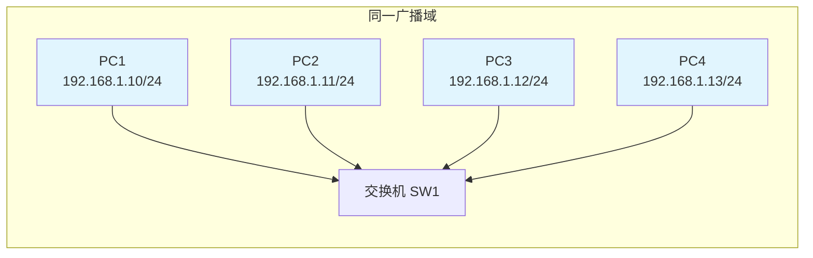

**广播域膨胀带来的问题：**

| 问题类型   | 具体表现                                 | 影响           |
| ---------- | ---------------------------------------- | -------------- |
| 带宽浪费   | 广播帧泛洪到所有端口，消耗链路带宽       | 网络性能下降   |
| 安全性降低 | 任何主机都能收到广播，可抓取敏感协议数据 | 数据泄露风险   |
| 故障扩散   | 广播风暴可导致全网瘫痪                   | 可用性下降     |
| 管理困难   | 所有设备混在一起，无法按业务隔离         | 运维复杂度增加 |

在企业网络中，通常需要将不同部门（研发、财务、行政）、不同业务系统（生产、办公、监控）的流量隔离开。传统做法是购置独立的物理交换机，但这会带来成本激增和扩展困难的问题。

**VLAN（Virtual Local Area Network，虚拟局域网）** 的出现就是为了解决上述问题。它允许在同一个物理交换机上创建多个逻辑上完全隔离的网络，每个 VLAN 拥有独立的广播域。

### 1.2 VLAN 的本质定义

VLAN 是由 IEEE 802.1Q 标准定义的一种二层逻辑分组机制，它的核心特性包括：

- **逻辑隔离**：同一台交换机上的不同 VLAN 之间在二层相互隔离，广播帧不会跨 VLAN 传播
- **灵活配置**：通过软件配置即可将端口分配到不同 VLAN，无需改变物理拓扑
- **跨越交换机**：通过 Trunk 链路，VLAN 可以跨越多台交换机扩展
- **唯一标识**：每个 VLAN 用 12 位的 VLAN ID（1-4094）进行标识

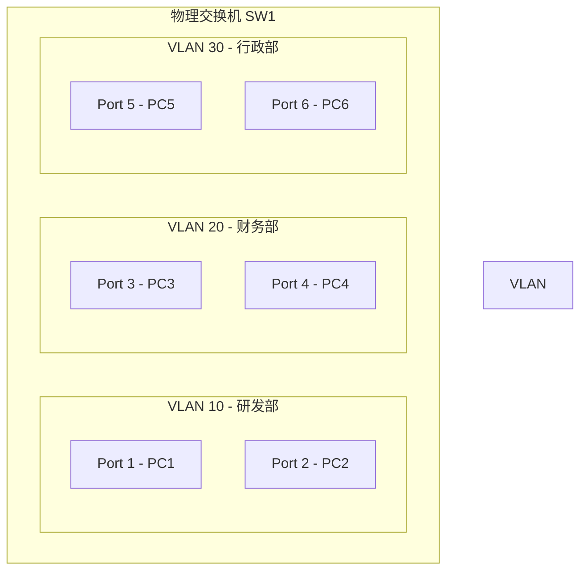

## 2. VLAN 历史

### 2.1 早期 Cisco 专用协议时代

在 1990 年代初期， Cisco 开发了专有的 VLAN 解决方案，主要包括：

**ISL（Inter-Switch Link）**

- Cisco 于 1992 年推出的专有协议
- 在原始以太网帧外层封装 26 字节 ISL 头 + 4 字节 CRC 尾
- 支持 Cisco 设备间的 VLAN 中继
- 最大帧长从 1518 增加到 1548 字节
- **已被淘汰**，因为：
  - 只能用于 Cisco 设备
  - 封装开销大
  - 不支持标准 802.1Q 的嵌套 VLAN（QinQ）

**VLAN Trunk Protocol（VTP）**

- Cisco 专有的 VLAN 动态分发协议
- 允许交换机之间自动同步 VLAN 信息
- 工作模式：Server / Client / Transparent
- 存在风险：VTP 域配置错误可导致全网 VLAN 被意外删除

### 2.2 IEEE 802.1Q 标准

1998 年，IEEE 正式发布 802.1Q 标准，成为 VLAN 技术的通用实现：

| 特性        | ISL                         | 802.1Q             |
| ----------- | --------------------------- | ------------------ |
| 标准化      | Cisco 专有                  | IEEE 标准          |
| 封装方式    | 外层封装（26B 头 + 4B CRC） | 内部插入标签（4B） |
| VLAN 数量   | 1024                        | 4094（12位 ID）    |
| Native VLAN | 不支持                      | 支持               |
| QinQ        | 不支持                      | 支持               |
| 厂商支持    | 仅 Cisco                    | 所有厂商           |

**802.1Q 的核心设计：**

802.1Q 在原始以太网帧的源 MAC 地址和类型字段之间插入一个 4 字节的 VLAN Tag：

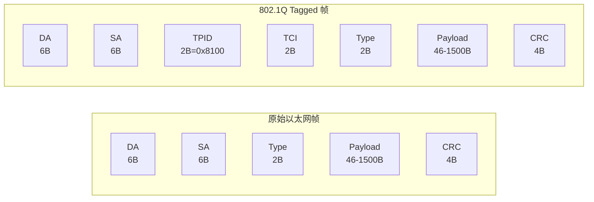

**TPID（Tag Protocol Identifier）**：固定为 `0x8100`，标识这是一个 802.1Q tagged 帧

**TCI（Tag Control Information）** 包含三个子字段：

```
  15  12  11   8 7    0
 +------+------+------+
 |  PCP | DEI |  VID |
 +------+------+------+
```

- **PCP（Priority Code Point）**：3 位，802.1p QoS 优先级（0-7）
- **DEI（Drop Eligibility Indicator）**：1 位，帧是否可丢弃的标记
- **VID（VLAN ID）**：12 位，范围 1-4094，0 表示没有 VLAN（用于 PCP only）

### 2.3 802.1Q 标准演进

| 年份 | 标准        | 关键特性                    |
| ---- | ----------- | --------------------------- |
| 1998 | 802.1Q-1998 | 初始标准，支持单层 VLAN Tag |
| 2003 | 802.1Q-2003 | 修订版，整合之前增补        |
| 2005 | 802.1Q-2005 | 支持 Q-in-Q（双层 VLAN）    |
| 2011 | 802.1Q-2011 | 当前版本，整合所有修订      |
| 2018 | 802.1Q-2018 | 新增 GRE 隧道 VLAN 扩展     |

## 3. VLAN 与广播域

### 3.1 核心原则：一 VLAN = 一广播域 = 一子网

这是理解 VLAN 最重要的原则。每一个 VLAN 在逻辑上对应一个独立的广播域，而通常也会对应一个 IP 子网。理解这一点对于网络设计至关重要。

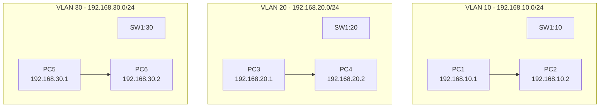

### 3.2 VLAN 间的通信

由于不同 VLAN 在二层完全隔离，它们之间的通信必须通过三层路由实现。这意味着每个 VLAN 都需要有一个网关地址，通常是交换机上的 VLAN 接口（SVI）或路由器接口。

**VLAN 间路由的三种方式：**

| 方式              | 实现原理                                      | 特点                     |
| ----------------- | --------------------------------------------- | ------------------------ |
| 路由器-on-a-stick | 单臂路由，一个物理接口通过子接口关联多个 VLAN | 节省接口，适合中小型网络 |
| 三层交换机 SVI    | 交换机内置路由功能，创建 VLAN 接口作为网关    | 性能高，适合中型网络     |
| 独立三层接口      | 每个 VLAN 连接独立的路由器接口                | 简单直接，消耗接口多     |

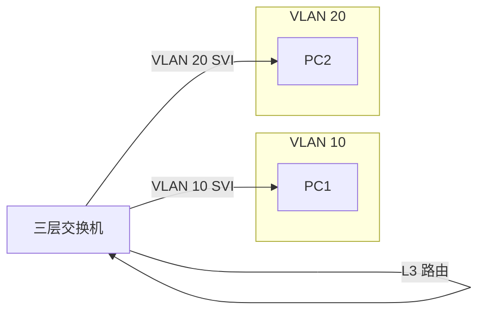

### 3.3 广播域对比

| 隔离层级              | 设备类型         | 广播域范围                     |
| --------------------- | ---------------- | ------------------------------ |
| 二层交换机（无 VLAN） | L2 Switch        | 整个交换机的所有端口           |
| 二层交换机（多 VLAN） | L2 Switch + VLAN | 单个 VLAN 内的所有端口         |
| 三层交换机            | L3 Switch        | 单个 VLAN 内（路由打破广播域） |
| 路由器                | Router           | 每个接口是一个独立的广播域     |
| 防火墙                | Firewall         | 每个安全区域是独立的广播域     |

## 4. 二层转发基础

### 4.0 以太帧结构与 VLAN Tag 深入解析

在深入理解 VLAN 之前，有必要先理解以太网帧的完整结构，特别是 802.1Q VLAN Tag 在帧中的位置及其对转发的影响。

**标准以太网帧结构（无 VLAN Tag）：**

```
+----------+----------+-----------+-------------+-------------+----------+
| Preamble | Dest MAC | Src MAC   | EtherType   | Payload     | CRC      |
| (7B)     | (6B)     | (6B)      | (2B)        | (46-1500B)  | (4B)     |
+----------+----------+-----------+-------------+-------------+----------+
                                ^
                                |
                          这里的 2B 是 Type 字段
                          当值 > 0x0600 时表示类型
                          值 < 0x0600 时表示长度（IEEE 802.3）
```

**802.1Q VLAN Tagged 帧结构：**

```
+----------+----------+-----------+-----------+-----------+-------------+-------------+----------+
| Preamble | Dest MAC | Src MAC   | TPID      | TCI       | EtherType   | Payload     | CRC      |
| (7B)     | (6B)     | (6B)      | (2B)      | (2B)      | (2B)        | (46-1500B)  | (4B)     |
+----------+----------+-----------+-----------+-----------+-------------+-------------+----------+
                                ^           ^
                                |           |
                    0x8100 -----+           |
                                          12 位 VID + 3 位 PCP + 1 位 DEI
```

**关键字段详解：**

| 字段      | 字节数 | 值                                | 说明                                          |
| --------- | ------ | --------------------------------- | --------------------------------------------- |
| TPID      | 2      | `0x8100`                          | Tag Protocol Identifier，标识 802.1Q VLAN Tag |
| TCI       | 2      | 0x0000-0xFFFF                     | Tag Control Information，包含 VID、PCP、DEI   |
| EtherType | 2      | `0x0800` (IPv4) / `0x86DD` (IPv6) | 后续载荷的协议类型                            |

**TCI 字段细分（2 字节 = 16 位）：**

```
  15   12 11      8 7       0
 +------+----------+----------+
 | PCP  | DEI/CFI  |   VID   |
 +------+----------+----------+
   3 位    1 位       12 位
```

- **PCP（Priority Code Point）**：3 位，IEEE 802.1p QoS 优先级，值 0-7
  - 0 = Best Effort（默认）
  - 1 = Background
  - 2 = Standard
  - 3 = Excellent Effort
  - 4 = Controlled Load
  - 5 = Video
  - 6 = Voice
  - 7 = Network Control
- **DEI（Drop Eligibility Indicator）**：1 位（原名 CFI，Canonical Format Indicator）
  - 0 = 以太网格式（正常）
  - 1 = 令牌环格式（可丢弃标记）
- **VID（VLAN Identifier）**：12 位，范围 1-4094
  - 0 表示没有 VLAN（仅用于 PCP 优先级标记）
  - 4095（0xFFF）是保留值
  - 1 是默认 VLAN（VLAN 1）

**最大传输单元（MTU）变化：**

由于 VLAN Tag 的插入，802.1Q 帧的 payload 减少了 4 字节。对于标准 1500 字节的 MTU：

| 帧类型           | 最大 Payload | 实际数据 Payload（含 IP 头）  |
| ---------------- | ------------ | ----------------------------- |
| 标准以太网帧     | 1500B        | 1500B                         |
| 802.1Q Tagged 帧 | 1500B        | 1496B（少了 4 字节 VLAN Tag） |

**实际抓包示例（tcpdump 输出）：**

```bash
# 正常帧（无 VLAN Tag）
14:23:45.123456 00:11:22:33:44:55 > 66:77:88:99:aa:bb, ethertype IPv4 (0x0800), length 98:
   192.168.1.10.443 > 192.168.1.20.54321: Flags [P.], seq 1:49, ack 1, win 502, length 48

# Tagged 帧（VLAN 10）
14:23:45.234567 00:11:22:33:44:55 > 66:77:88:99:aa:bb, ethertype 802.1Q (0x8100), length 102:
   vlan 10, p 0, ethertype IPv4 (0x0800), length 98:
   192.168.1.10.443 > 192.168.1.20.54321: Flags [P.], seq 1:49, ack 1, win 502, length 48
```

注意：Tagged 帧的 tcpdump 输出会多出 4 字节（VLAN Tag 长度），但以太网类型会显示为 `0x8100` 而非直接的 `0x0800`。

### 4.1 MAC 地址学习与 CAM 表

理解 VLAN 的工作原理，首先需要理解交换机的 MAC 地址学习机制。

**CAM 表（Content Addressable Memory Table）** 是交换机用于存储 MAC 地址与端口映射关系的高速内存表。当交换机收到一个帧时，它会提取源 MAC 地址并与收到该帧的端口关联，记录到 CAM 表中。

**MAC 地址学习流程：**

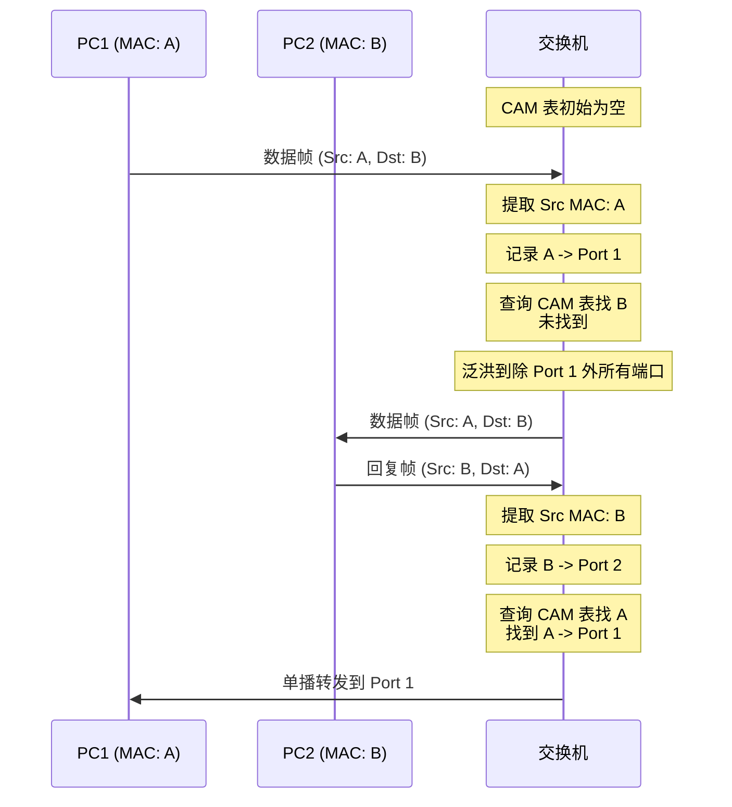

**CAM 表结构示例（Cisco IOS）：**

```bash
SW1# show mac address-table dynamic
          Mac Address Table
-------------------------------------------

Vlan    Mac Address       Type        Ports
----    -----------       --------    -----
   1    0001.1234.5678    DYNAMIC     Gi0/1
  10    00a1.b234.c567    DYNAMIC     Gi0/2
  20    00b2.c345.d678    DYNAMIC     Gi0/3
  10    00c3.d456.e789    DYNAMIC     Gi0/4
```

**CAM 表查找过程：**

当交换机收到目标 MAC 地址为 D 的帧时：

1. 在 CAM 表中查找 D
2. **命中**：从对应端口转发（单播）
3. **未命中**：泛洪到所有同一 VLAN 的其他端口（广播）
4. **未知单播**：部分交换机支持泛洪抑制，将帧丢弃而非泛洪

### 4.2 广播帧的处理

广播帧的特征是目标 MAC 地址为 `FF:FF:FF:FF:FF:FF`。当交换机收到广播帧时：

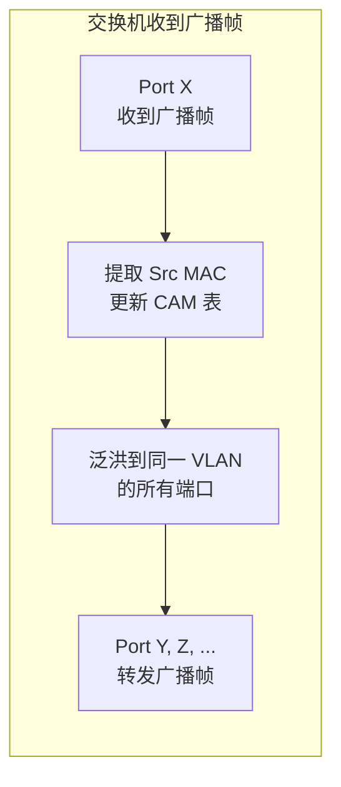

**广播帧不会跨 VLAN 转发**：这是 VLAN 隔离的核心保证。即使某 VLAN 内的广播帧到达交换机 trunk 口，交换机也会根据 VLAN ID 决定是否允许该帧通过（由 trunk 链路两端的 VLAN 修剪设置决定）。

### 4.3 VLAN 感知与帧转发

在 802.1Q 环境中，每个帧都携带 VLAN 标识。交换机的 VLAN 感知转发流程：

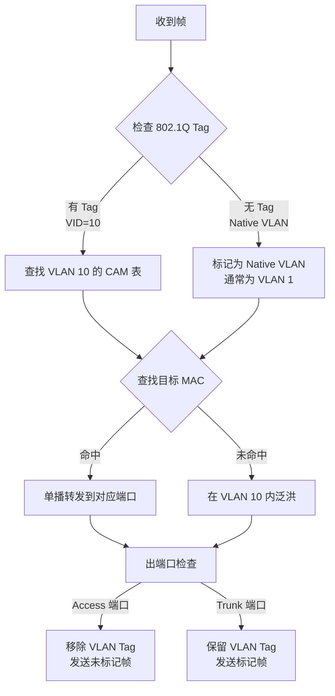

## 5. VLAN 的工作原理

### 5.1 交换机端口隔离

VLAN 的核心机制是通过将交换机的不同端口分配到不同的 VLAN，实现二层流量的逻辑隔离。同一 VLAN 内的端口之间可以通信；不同 VLAN 的端口之间在二层完全隔离。

**端口与 VLAN 的映射关系：**

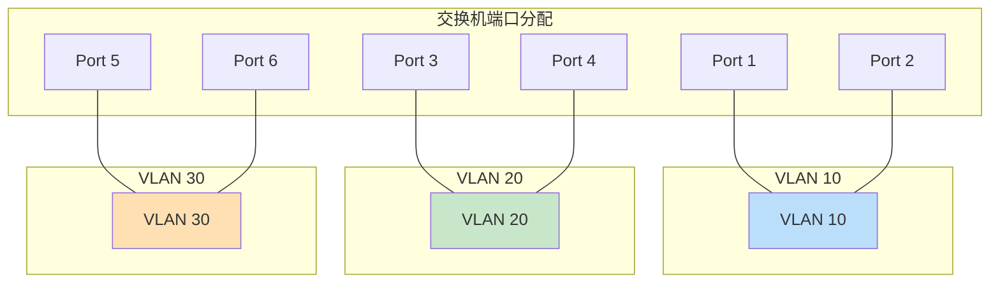

### 5.2 VLAN ID 的作用

VLAN ID（VID）是 12 位的值（0-4095，可用 1-4094），用于在网络中唯一标识一个 VLAN。

**VLAN ID 分配建议：**

| 范围      | 用途      | 说明                                    |
| --------- | --------- | --------------------------------------- |
| 1         | 默认 VLAN | 交换机出厂默认，所有端口初始属于 VLAN 1 |
| 2-1001    | 普通 VLAN | 正常业务 VLAN，可自由使用               |
| 1002-1005 | 保留 VLAN | 用于 FDDI、Token Ring 等，已很少使用    |
| 1006-4094 | 扩展 VLAN | 部分老旧设备可能不支持                  |
| 0         | PCP only  | 仅用于优先级标记，不表示 VLAN           |

**VLAN 1 的特殊性：**

- 默认 Native VLAN（未标记帧的默认归属）
- 默认管理 VLAN（交换机管理接口默认属于 VLAN 1）
- Cisco VTP 默认在 VLAN 1 传播
- **安全建议**：将管理流量和用户流量使用不同 VLAN

### 5.3 VLAN 成员资格确定

交换机如何判断一个帧属于哪个 VLAN？根据端口类型：

| 端口类型 | 收到未标记帧       | 收到标记帧         | 发送帧         |
| -------- | ------------------ | ------------------ | -------------- |
| Access   | 分配给端口的 VLAN  | 丢弃或忽略         | 发送未标记帧   |
| Trunk    | 分配给 Native VLAN | 使用帧中的 VLAN ID | 通常发送标记帧 |

## 6. 接入端口与中继端口

### 6.1 接入端口（Access Port）

Access 端口是最简单的端口类型，专门用于连接终端设备（PC、服务器、打印机等）。

**Access 端口特性：**

- 只能属于一个 VLAN（由管理员静态配置）
- 接收未标记帧时，将其归入该端口所属的 VLAN
- 接收标记帧时，通常直接丢弃（不支持 VLAN 标记的终端不会发送标记帧）
- 发送帧时，总是发送未标记帧（剥离 VLAN Tag）

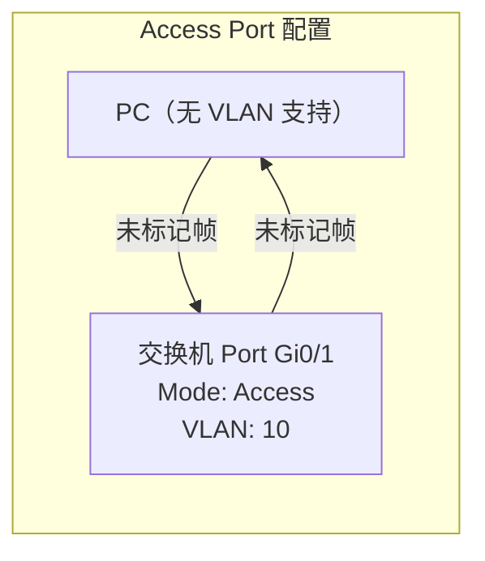

### 6.2 中继端口（Trunk Port）

Trunk 端口用于连接交换机之间或交换机与路由器之间，能够承载多个 VLAN 的流量。

**Trunk 端口特性：**

- 可以承载多个 VLAN 的流量
- 接收未标记帧时，归属到 Native VLAN
- 接收标记帧时，读取 VLAN ID 以确定所属 VLAN
- 发送帧时，通常添加 VLAN Tag（Native VLAN 帧可选择不标记）

**802.1Q Trunk 的帧格式变化：**

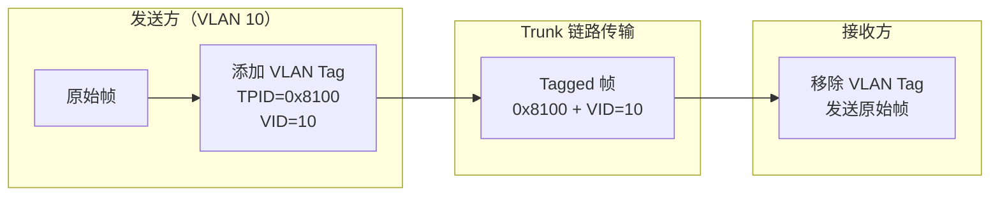

### 6.3 端口模式对比

| 特性             | Access 端口    | Trunk 端口                       |
| ---------------- | -------------- | -------------------------------- |
| 连接的设备类型   | 终端设备       | 交换机/路由器                    |
| 承载的 VLAN 数量 | 1 个           | 多个或所有                       |
| 帧标记           | 无（untagged） | 有（tagged），Native VLAN 可选无 |
| 配置复杂度       | 低             | 中                               |
| 典型用途         | 接入层连接用户 | 汇聚层/核心层互联                |
| DTP 协商         | 无（静态配置） | 可协商（auto/desirable/trunk）   |

### 6.4 DTP（Dynamic Trunking Protocol）

Cisco 专有的协议，用于自动协商端口是否为 Trunk 模式。

**DTP 模式：**

| 模式                              | 行为                                   |
| --------------------------------- | -------------------------------------- |
| switchport mode trunk             | 强制成为 Trunk，不协商                 |
| switchport mode access            | 强制成为 Access，禁用 DTP              |
| switchport mode dynamic desirable | 主动发起协商，愿意成为 Trunk           |
| switchport mode dynamic auto      | 被动等待协商，仅在对方发起时成为 Trunk |

**DTP 协商结果矩阵：**

|           | Access    | Desirable | Auto   | Trunk |
| --------- | --------- | --------- | ------ | ----- |
| Access    | Access    | Desirable | Access | Trunk |
| Desirable | Desirable | Desirable | Trunk  | Trunk |
| Auto      | Access    | Trunk     | Auto   | Trunk |
| Trunk     | Trunk     | Trunk     | Trunk  | Trunk |

**安全建议**：在接入层端口使用 `switchport mode access` 并禁用 DTP（`switchport nonegotiate`），防止意外形成 Trunk。

## 7. 本征 VLAN（Native VLAN）

### 7.1 概念解释

Native VLAN 是 802.1Q Trunk 链路上的一个特殊概念。当 Trunk 端口收到一个未标记（untagged）的帧时，会将其归入 Native VLAN；当需要发送帧到 Trunk 链路时，Native VLAN 的帧可以选择不添加 VLAN Tag 发送。

**为什么需要 Native VLAN？**

某些老旧设备或不支持 802.1Q 的设备在连接交换机时，会发送未标记的帧。如果 Trunk 端口不配置 Native VLAN，这些帧就会被丢弃，导致无法通信。

### 7.2 工作原理

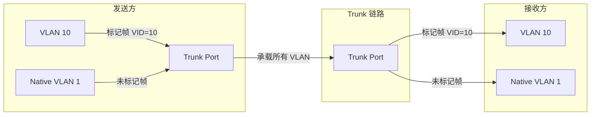

### 7.3 配置与注意事项

**Cisco IOS 配置 Native VLAN：**

```网络配置
! 设置 Native VLAN（默认是 VLAN 1）
switchport trunk native vlan 99

! 验证配置
show interfaces GigabitEthernet0/1 trunk
```

**关键注意事项：**

| 风险               | 描述                                                      | 解决方案                                     |
| ------------------ | --------------------------------------------------------- | -------------------------------------------- |
| VLAN 1 透明传输    | 攻击者可能利用未标记的 VLAN 1 流量进行攻击                | 将 Native VLAN 改为非 1 的 VLAN              |
| 双向标记攻击       | 攻击者发送双 Tag 帧，利用 Native VLAN 穿透 VLAN 隔离      | 启用 VLAN 过滤，在 trunk 端剥离不需要的 VLAN |
| Native VLAN 不一致 | 两端交换机 Native VLAN 配置不同会导致 STP/CDP 信息丢失    | 确保链路两端 Native VLAN 一致                |
| CDP 泄露           | Cisco 设备默认通过 Native VLAN 发送 CDP，可能泄露拓扑信息 | 在不需要的端口禁用 CDP 或修改 Native VLAN    |

### 7.4 Native VLAN 安全配置最佳实践

```网络配置
! 1. 改变默认 Native VLAN（不要使用 VLAN 1）
switchport trunk native vlan 999

! 2. 启用 Native VLAN 标记（native vlan tag）
! 强制 Native VLAN 帧也必须带 Tag，不接受未标记帧
switchport trunk native vlan tag

! 3. 在不需要的端口上禁用 CDP/LLDP/SPAN
no cdp enable
no lldp transmit
```

**native vlan tag 命令的效果：**

当启用此命令后，Trunk 端口将：

- 要求收到的帧必须带有有效的 802.1Q Tag
- 拒绝未标记的帧
- 发送的所有帧都会带有 Tag（包括 Native VLAN）

这可以防止多种 VLAN 跳转攻击，但也可能导致与非标准设备的兼容性问题。

## 8. VLAN 生命周期

### 8.1 VLAN 的创建

在 Cisco IOS 交换机上创建 VLAN 有两种方式：

**方式一：VLAN 数据库模式（已淘汰）**

```网络配置
vlan database
vlan 10 name Engineering
vlan 20 name Finance
exit
```

**方式二：全局配置模式（推荐）**

```网络配置
! 创建单个 VLAN
vlan 10
 name Engineering
 exit

! 创建多个 VLAN（批量配置）
vlan 20
 name Finance
vlan 30
 name HR
vlan 40
 name IT
 exit
```

**VLAN 数据库的内部存储：**

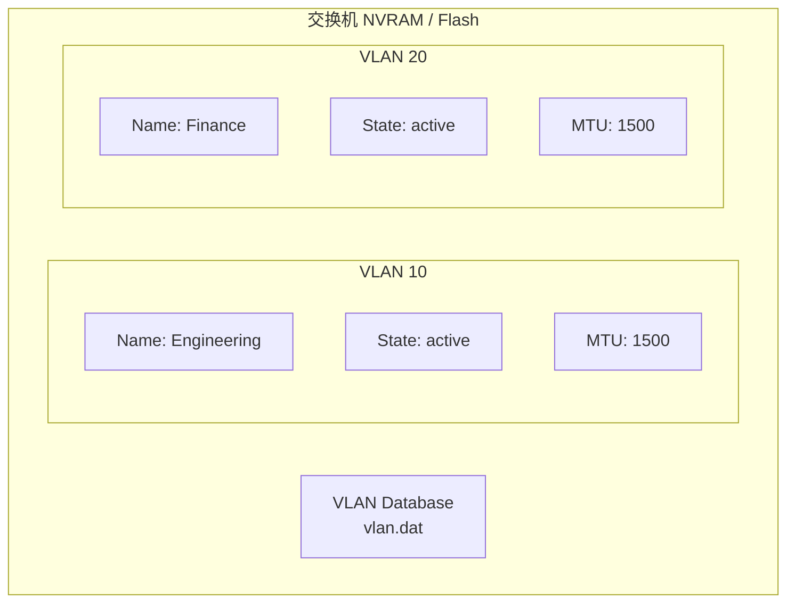

### 8.2 分配端口到 VLAN

**将端口分配给 Access VLAN：**

```网络配置
interface GigabitEthernet0/1
 ! 设置端口模式
 switchport mode access
 ! 分配 VLAN
 switchport access vlan 10
 ! 可选：启用端口安全时绑定 VLAN
 switchport port-security
```

**批量将多个端口分配到同一 VLAN：**

```网络配置
! 方法 1：使用 interface range
interface range GigabitEthernet0/1 - 12
 switchport mode access
 switchport access vlan 10
 spanning-tree portfast

! 方法 2：使用宏（macro）
macro apply EGRESS_VLAN_10
```

### 8.3 删除 VLAN

**删除 VLAN 的正确方式：**

```网络配置
! 检查是否有端口使用该 VLAN
show vlan brief

! 确认无端口使用后再删除
no vlan 20

! 如果端口仍然属于要删除的 VLAN，
! 必须先将端口移出或删除
interface GigabitEthernet0/3
 no switchport access vlan
! 或者
default interface GigabitEthernet0/3
```

**危险警告**：删除一个 VLAN 后，该 VLAN 内的所有端口将失去二层连通性，直到重新分配到其他 VLAN。原来通过 CAM 表学习到的 MAC 地址条目也会被清除。

### 8.4 VLAN 状态

每个 VLAN 有两种状态：

| 状态    | 含义          | 影响                     |
| ------- | ------------- | ------------------------ |
| active  | VLAN 正常工作 | 端口可正常转发流量       |
| suspend | VLAN 被挂起   | 端口暂停转发，但配置保留 |

```网络配置
! 挂起 VLAN
vlan 30
 suspend

! 激活 VLAN
vlan 30
 no suspend
```

**挂起 vs 删除**：挂起 VLAN 可以保留配置用于以后恢复，删除则完全清除。

## 9. 交换机配置实战

### 9.1 Cisco IOS 基础配置

**实验拓扑：**

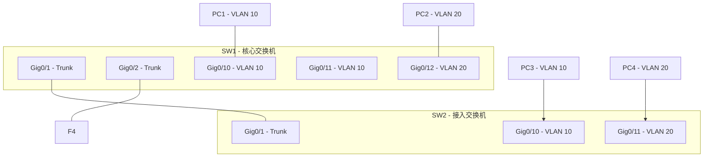

### 9.2 完整配置示例

**SW1 - 核心交换机配置：**

```网络配置
hostname SW1
!
! 启用 VLAN 干路协议
vtp mode transparent
!
! 创建 VLAN
vlan 10
 name Engineering
!
vlan 20
 name Finance
!
vlan 99
 name Native
!
! 配置管理接口
interface Vlan10
 ip address 192.168.10.253 255.255.255.0
 no shutdown
!
interface Vlan20
 ip address 192.168.20.253 255.255.255.0
 no shutdown
!
! 配置 Trunk 端口
interface GigabitEthernet0/1
 description to_SW2
 switchport trunk encapsulation dot1q
 switchport mode trunk
 switchport trunk allowed vlan 10,20
 switchport trunk native vlan 99
!
interface GigabitEthernet0/2
 description to_SW3
 switchport trunk encapsulation dot1q
 switchport mode trunk
 switchport trunk allowed vlan 10,20
 switchport trunk native vlan 99
!
! 配置 Access 端口
interface GigabitEthernet0/10
 description PC1_Engineering
 switchport mode access
 switchport access vlan 10
 spanning-tree portfast
!
interface GigabitEthernet0/11
 description PC2_Engineering
 switchport mode access
 switchport access vlan 10
 spanning-tree portfast
!
interface GigabitEthernet0/12
 description PC3_Finance
 switchport mode access
 switchport access vlan 20
 spanning-tree portfast
```

**SW2 - 接入交换机配置：**

```网络配置
hostname SW2
!
! VTP transparent 模式（不同域或防止意外修改）
vtp mode transparent
!
! 创建 VLAN（必须与 SW1 一致）
vlan 10
 name Engineering
!
vlan 20
 name Finance
!
vlan 99
 name Native
!
! 配置 Trunk 端口
interface GigabitEthernet0/1
 description to_SW1
 switchport trunk encapsulation dot1q
 switchport mode trunk
 switchport trunk allowed vlan 10,20
 switchport trunk native vlan 99
!
! 配置 Access 端口
interface GigabitEthernet0/10
 description PC3_Engineering
 switchport mode access
 switchport access vlan 10
 spanning-tree portfast
!
interface GigabitEthernet0/11
 description PC4_Finance
 switchport mode access
 switchport access vlan 20
 spanning-tree portfast
```

### 9.3 验证命令

**查看 VLAN 信息：**

```bash
SW1# show vlan brief

VLAN Name                             Status    Ports
---- -------------------------------- --------- -------------------------------
1    default                          active    Gi0/24
10   Engineering                      active    Gi0/10, Gi0/11
20   Finance                          active    Gi0/12
99   Native                           active
1002 fddi-default                     active
1003 token-ring-default               active
1004 fddinet-default                  active
1005 trnet-default                    active
```

**查看 Trunk 状态：**

```bash
SW1# show interfaces trunk

Port        Mode         Encapsulation  Status        Native vlan
Gi0/1       on           802.1q         trunking      99
Gi0/2       on           802.1q         trunking      99

Port        Vlans allowed on trunk
Gi0/1       10,20
Gi0/2       10,20

Port        Vlans allowed and active in pruning domain
Gi0/1       10,20
Gi0/2       10,20

Port        Vlans in spanning tree forwarding state and not pruned
Gi0/1       10,20
Gi0/2       10,20
```

**查看 CAM 表（MAC 地址表）：**

```bash
SW1# show mac address-table

          Mac Address Table
-------------------------------------------

Vlan    Mac Address       Type        Ports
----    -----------       --------    -----
  10    0050.1234.0001    DYNAMIC     Gi0/10
  10    0050.1234.0003    DYNAMIC     Gi0/11
  10    0050.5678.0003    DYNAMIC     Gi0/1
  20    0050.1234.0002    DYNAMIC     Gi0/12
  20    0050.5678.0004    DYNAMIC     Gi0/1

Total Mac Addresses for this criterion: 5
```

**查看端口详情：**

```bash
SW1# show interfaces GigabitEthernet0/10 switchport

Name: Gi0/10
Switchport: Enabled
Administrative Mode: static access
Operational Mode: static access
Administrative Trunking Encapsulation: dot1q
Operational Trunking Encapsulation: native
Negotiation of Trunking: Off
Access Mode VLAN: 10 (Engineering)
Trunking Native Mode VLAN: 99 (Native)
Voice VLAN: none
Administrative private-vlan host-association: none
Administrative private-vlan mapping: none
```

### 9.4 使用 Python 自动化配置

使用 `netmiko` 库对多台交换机批量配置 VLAN：

```python
#!/usr/bin/env python3
"""
使用 Netmiko 批量配置 VLAN
需要安装: pip install netmiko
"""

from netmiko import ConnectHandler
from typing import List, Dict

# 交换机连接信息
switches = [
    {
        "device_type": "cisco_ios",
        "host": "192.168.10.11",
        "username": "admin",
        "password": "cisco123",
        "secret": "enable_pass",
    },
    {
        "device_type": "cisco_ios",
        "host": "192.168.10.12",
        "username": "admin",
        "password": "cisco123",
        "secret": "enable_pass",
    },
]

# VLAN 配置模板
vlan_config = """
vlan {vlan_id}
 name {vlan_name}
!
"""

def configure_vlan(ssh_conn, vlan_id: int, vlan_name: str):
    """在交换机上创建 VLAN"""
    config = vlan_config.format(vlan_id=vlan_id, vlan_name=vlan_name)
    ssh_conn.send_config_set(config.split('\n'))
    print(f"  Created VLAN {vlan_id}: {vlan_name}")

def configure_access_port(ssh_conn, interface: str, vlan_id: int):
    """配置 Access 端口"""
    commands = [
        f"interface {interface}",
        "switchport mode access",
        f"switchport access vlan {vlan_id}",
        "spanning-tree portfast",
        "no shutdown",
    ]
    ssh_conn.send_config_set(commands)
    print(f"  Configured {interface} to VLAN {vlan_id}")

def main():
    # 定义要创建的 VLAN
    vlans = [
        {"id": 10, "name": "Engineering"},
        {"id": 20, "name": "Finance"},
        {"id": 30, "name": "HR"},
        {"id": 40, "name": "IT"},
    ]

    for sw in switches:
        print(f"\nConnecting to {sw['host']}...")
        try:
            conn = ConnectHandler(**sw)
            conn.enable()

            # 批量创建 VLAN
            print(f"  Creating VLANs on {sw['host']}...")
            for vlan in vlans:
                configure_vlan(conn, vlan["id"], vlan["name"])

            # 保存配置
            conn.save_config()
            print(f"  Configuration saved on {sw['host']}")

            conn.disconnect()

        except Exception as e:
            print(f"  ERROR connecting to {sw['host']}: {e}")

if __name__ == "__main__":
    main()
```

### 9.5 使用 Linux + VLAN 子接口测试

在 Linux 环境中创建 VLAN 子接口进行测试：

```bash
# 查看当前网络接口
ip link show
# 2: eth0: <BROADCAST,MULTICAST,UP> mtu 1500 qdisc fq_codel state UP

# 创建 VLAN 10 子接口
ip link add link eth0 name eth0.10 type vlan id 10

# 创建 VLAN 20 子接口
ip link add link eth0 name eth0.20 type vlan id 20

# 激活接口
ip link set eth0 up
ip link set eth0.10 up
ip link set eth0.20 up

# 配置 IP 地址
ip addr add 192.168.10.100/24 dev eth0.10
ip addr add 192.168.20.100/24 dev eth0.20

# 验证配置
ip addr show eth0.10
ip addr show eth0.20

# 查看 VLAN 信息
cat /proc/net/vlan/config
# VLAN Dev name    | VLAN ID
# eth0.10          | 10

# 抓包查看 VLAN Tag
tcpdump -i eth0 -nn -v | grep -i vlan
# 10:45:32.123456 802.1Q, vlan 10, p 0,
#   ethertype 0x0800, ...

# 删除 VLAN 子接口
ip link delete eth0.10
ip link delete eth0.20
```

## 10. VLAN 故障排查

### 10.1 故障排查思路

VLAN 故障排查通常遵循以下路径：

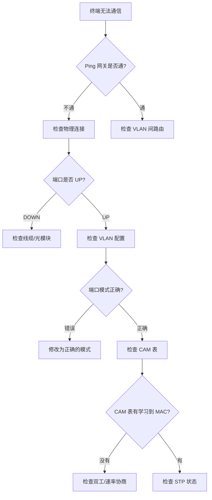

### 10.2 CAM 表问题

**症状**：同一 VLAN 内的终端之间无法通信，但能收到 ARP 广播。

**排查命令：**

```bash
# 查看 CAM 表
show mac address-table

# 查看特定 MAC 地址的位置
show mac address-table address 0050.1234.5678

# 查看特定 VLAN 的 CAM 表
show mac address-table vlan 10

# 清空 CAM 表重新学习
clear mac address-table dynamic

# 再次查看 CAM 表学习情况
show mac address-table
```

**CAM 表未更新的可能原因：**

| 原因            | 诊断方法                             | 解决方案               |
| --------------- | ------------------------------------ | ---------------------- |
| 端口关闭        | `show interfaces status`             | 启用端口 `no shutdown` |
| 双工不匹配      | `show interfaces GigabitEthernet0/x` | 强制双工/速率          |
| 线缆故障        | 更换线缆测试                         | 更换线缆               |
| 交换机 CPU 过载 | `show processes cpu`                 | 优化流量或升级设备     |

### 10.3 端口模式问题

**症状**：终端直连交换机可以通信，但通过另一台交换机级联后无法通信。

**排查命令：**

```bash
# 查看端口模式配置
show interfaces GigabitEthernet0/1 switchport

# 查看所有端口模式汇总
show interfaces status

# 检查 Trunk 状态
show interfaces trunk

# 检查 DTP 协商状态
show dtp interface GigabitEthernet0/1
```

**典型配置错误：**

| 错误类型               | 错误配置                 | 正确配置                               |
| ---------------------- | ------------------------ | -------------------------------------- |
| 交换机间用 Access 模式 | `switchport mode access` | `switchport mode trunk`                |
| Trunk 未指定封装       | （默认 auto dot1q）      | `switchport trunk encapsulation dot1q` |
| Trunk 未放行 VLAN      | 默认只有 1,1002-1005     | `switchport trunk allowed vlan 10,20`  |
| Access 端口忘配 VLAN   | 端口默认在 VLAN 1        | `switchport access vlan 10`            |

**Trunk 端口常见问题：**

```bash
# 问题：Trunk 端口显示 not-trunking
# 可能原因：两端端口模式不匹配

# 解决：确保至少一端是 trunk 模式
interface GigabitEthernet0/1
 switchport mode trunk
 switchport trunk encapsulation dot1q
```

### 10.4 Native VLAN 不一致问题

**症状**：通过 Trunk 链路发送的 CDP/VTP/STP 消息对端收不到，或出现奇怪的网络问题。

**排查命令：**

```bash
# 查看 Native VLAN 配置
show interfaces GigabitEthernet0/1 trunk

# 查看 CDP 邻居
show cdp neighbors detail

# 常见输出：CDP 邻居信息缺失或显示错误 VLAN
```

**Native VLAN 不一致的影响：**

| 不一致场景                       | 表现                  | 影响           |
| -------------------------------- | --------------------- | -------------- |
| SW1 Native=1, SW2 Native=99      | CDP/VTP 消息丢失      | 交换机管理困难 |
| Native VLAN 流量被其他 VLAN 接收 | VLAN 跳跃风险         | 安全威胁       |
| 一端 tag，另一端 untag           | 流量被标记为不同 VLAN | 通信失败       |

**修复方案：**

```bash
# 在两端都配置相同的 Native VLAN
interface GigabitEthernet0/1
 switchport trunk native vlan 99
```

**安全加固：**

```bash
# 启用 Native VLAN tagging（推荐）
interface GigabitEthernet0/1
 switchport trunk native vlan tag

# 验证
show running-config interface GigabitEthernet0/1
```

### 10.5 VLAN 间路由问题

**症状**：不同 VLAN 的终端之间无法通信。

**排查步骤：**

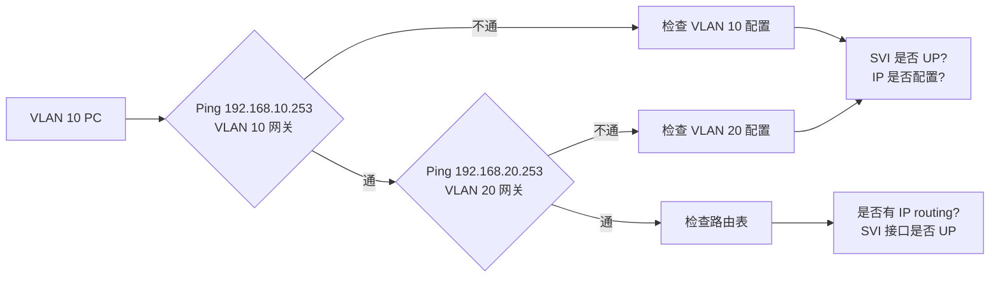

**排查命令：**

```bash
# 查看 SVI 接口状态
show ip interface brief Vlan10

# 查看 VLAN 状态
show vlan brief

# 查看是否启用路由
show ip routing

# 启用三层路由（如需要）
ip routing

# 查看路由表
show ip route
```

**典型问题与解决：**

| 问题          | 诊断                                         | 解决                          |
| ------------- | -------------------------------------------- | ----------------------------- |
| SVI 接口 DOWN | `show interface Vlan10` 显示 "protocol down" | VLAN 内至少有一个 active 端口 |
| 没有路由      | `show ip route` 无 VLAN 间路由               | 启用 `ip routing`             |
| ACL 阻止      | `show access-lists`                          | 检查/调整 ACL                 |

### 10.6 综合故障排查流程

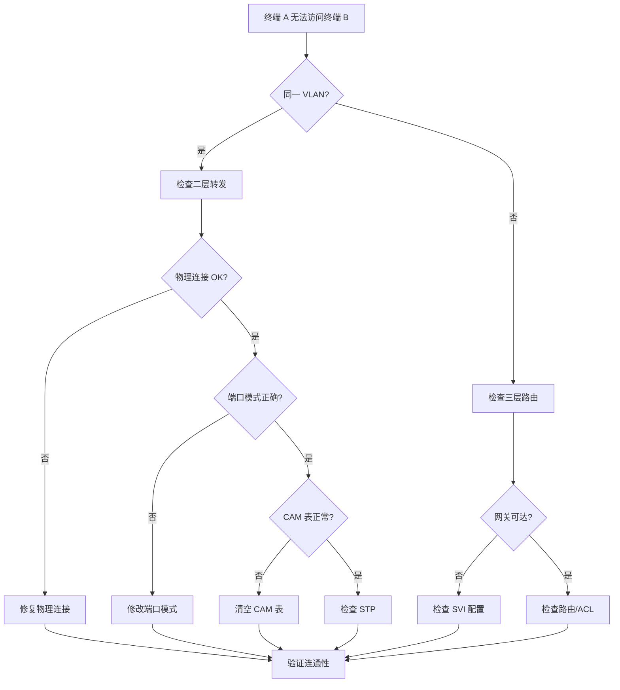

### 10.7 常用故障排查命令速查表

| 场景              | 命令                                    |
| ----------------- | --------------------------------------- |
| 查看所有 VLAN     | `show vlan brief`                       |
| 查看端口所属 VLAN | `show interfaces switchport`            |
| 查看 CAM 表       | `show mac address-table`                |
| 查看 Trunk 状态   | `show interfaces trunk`                 |
| 查看 SVI 状态     | `show ip interface brief Vlan X`        |
| 查看 VLAN 的 STP  | `show spanning-tree vlan X`             |
| 清空 CAM 表       | `clear mac address-table dynamic`       |
| 测试端口协商      | `show interfaces GigabitEthernet0/X`    |
| 查看 DTP          | `show dtp interface GigabitEthernet0/X` |
| 查看 CDP 邻居     | `show cdp neighbors detail`             |
| 查看 Native VLAN  | `show interfaces trunk`                 |

### 10.8 VLAN 安全问题与加固

VLAN 技术虽然提供了逻辑隔离，但存在多种绕过和攻击方式，了解这些安全问题有助于加固网络。

**VLAN 跳跃攻击（VLAN Hopping）**

VLAN 跳跃攻击有两种主要方式：

| 攻击方式        | 原理                                                | 防御措施                                                |
| --------------- | --------------------------------------------------- | ------------------------------------------------------- |
| Switch Spoofing | 攻击者模拟交换机，协商 Trunk 端口，访问所有 VLAN    | 禁用 DTP，使用 `switchport nonegotiate`                 |
| Double Tagging  | 攻击者发送双层 VLAN Tag 的帧，利用 Native VLAN 穿透 | 将 Native VLAN 改为非 1 的 VLAN，启用 `native vlan tag` |

**Double Tagging 攻击详解：**

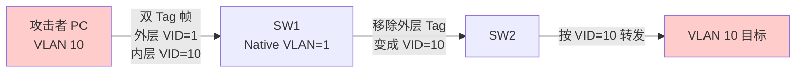

攻击者发送带有两层 VLAN Tag 的帧：

1. 外层 Tag 的 VID = Native VLAN（通常是 1）
2. 内层 Tag 的 VID = 目标 VLAN（想要访问的 VLAN）
3. 当帧到达交换机 Trunk 口时，外层 Tag 被剥离
4. 剩余的内层 Tag 使得帧被转发到目标 VLAN

**CAM 表溢出攻击**

攻击者向交换机发送大量伪造的源 MAC 地址，填满 CAM 表，导致交换机无法学习合法 MAC，不得不泛洪流量。

```bash
# 查看 CAM 表容量
show mac address-table count

# 查看 CAM 表 aging 时间
show mac address-table aging-time

# 调整 aging 时间（默认 300 秒）
mac address-table aging-time 150
```

**防御措施：**

```网络配置
! 1. 启用端口安全
interface GigabitEthernet0/1
 switchport port-security
 switchport port-security maximum 5
 switchport port-security violation restrict
!
! 2. 静态配置可信 MAC 地址
switchport port-security mac-address 0050.1234.5678
!
! 3. 启用 sticky MAC（自动学习）
switchport port-security mac-address sticky
```

**Private VLAN（PVLAN）与 VLAN 隔离**

对于需要更细粒度隔离的场景，Cisco 提供了 Private VLAN（PVLAN）技术：

| PVLAN 类型                 | 作用                | 通信规则                         |
| -------------------------- | ------------------- | -------------------------------- |
| Primary VLAN               | 包含 Secondary VLAN | -                                |
| Secondary VLAN (Community) | 社区 VLAN           | 同社区内端口可互通信             |
| Secondary VLAN (Isolated)  | 孤立 VLAN           | 端口之间完全隔离，只能与网关通信 |

```网络配置
! 创建 Primary 和 Secondary VLAN
vlan 100
 private-vlan primary
 private-vlan association 101,102
!
vlan 101
 private-vlan isolated
!
vlan 102
 private-vlan community
!
! 将端口关联到 PVLAN
interface GigabitEthernet0/1
 switchport mode private-vlan host
 switchport private-vlan host-association 100 101
```

**ARP 欺骗与 VLAN**

虽然 VLAN 提供了二层隔离，但 ARP 欺骗（中间人攻击）仍然可以在同一 VLAN 内发生。防御方法：

```bash
# 启用 DAI（Dynamic ARP Inspection）
ip arp inspection vlan 10
ip arp inspection validate src-mac dst-mac ip

# 配置静态 ARP 表（针对关键设备）
arp 192.168.10.1 0050.1234.5678 arpa
```

## 11. 高级主题：QinQ（双重 VLAN 标签）

### 11.1 什么是 QinQ

IEEE 802.1Q-in-Q（QinQ）是对 802.1Q 的扩展，允许在已有 VLAN Tag 的帧外层再添加一层 VLAN Tag。主要用于：

- 服务提供商（SP）VLAN 扩展
- 多租户环境下的 VLAN 隔离
- 运营商骨干网 VLAN 复用

**QinQ 帧结构：**

```
+-----------------+-----------------+-----------+-----------+-----------+-------------+-------------+
| 原始以太网头   | 外层 VLAN Tag   | 内层 VLAN Tag | EtherType | Payload   | CRC         |
| DA(6) SA(6)     | TPID(0x8100)    | TPID(0x8100)  |           |           |             |
|                 | TCI(VID Provider)| TCI(VID Customer)| (2B)    |           |             |
+-----------------+-----------------+-----------+-----------+-----------+-------------+-------------+
        12B                  4B               4B           2B      46-1500B       4B
```

### 11.2 QinQ 配置示例

```网络配置
! 服务提供商交换机配置
interface GigabitEthernet0/1
 description Customer_A_Connection
 switchport mode dot1q-tunnel
 switchport access vlan 1000
 l2protocol-tunnel cdp
 l2protocol-tunnel stp
 l2protocol-tunnel vtp
!
! 启用 QinQ 隧道
vlan 1000
 name PROVIDER_VLAN
```

**Customer VLAN（CTAG）与 Service Provider VLAN（STAG）：**

| 标签类型 | 术语                 | 位置 | VID 范围 | 典型用途   |
| -------- | -------------------- | ---- | -------- | ---------- |
| CTAG     | Customer VLAN Tag    | 内层 | 1-4094   | 客户自定义 |
| STAG     | Service Provider Tag | 外层 | 1-4094   | 运营商分配 |

### 11.3 VLAN 映射（VLAN Translation）

在服务提供商边界，可能需要对 VLAN ID 进行映射：

```网络配置
! 将客户 VID 100 映射到 SP VID 200
interface GigabitEthernet0/1
 switchport vlan mapping 100 200
```

## 12. VLAN 与网络设计的最佳实践

### 12.1 企业网络 VLAN 规划建议

一个典型的企业网络 VLAN 规划：

| VLAN ID | 用途         | 网段            | 说明                          |
| ------- | ------------ | --------------- | ----------------------------- |
| 1       | 默认/管理    | -               | 建议不使用，改为专用管理 VLAN |
| 10      | 服务器区     | 192.168.10.0/24 | DMZ/内网服务器                |
| 20      | 研发部       | 192.168.20.0/24 | 研发人员接入                  |
| 30      | 市场部       | 192.168.30.0/24 | 市场营销人员                  |
| 40      | 财务部       | 192.168.40.0/24 | 财务人员（敏感数据）          |
| 50      | 语音（VoIP） | 192.168.50.0/24 | IP 电话                       |
| 99      | 管理 VLAN    | 192.168.99.0/24 | 交换机管理                    |
| 999     | Native VLAN  | -               | 用于 Trunk 链路               |

**IP 子网与 VLAN 对应原则：**

```
一个 VLAN = 一个 IP 子网 = 一个广播域 = 一个安全边界
```

### 12.2 层次化网络中的 VLAN 部署

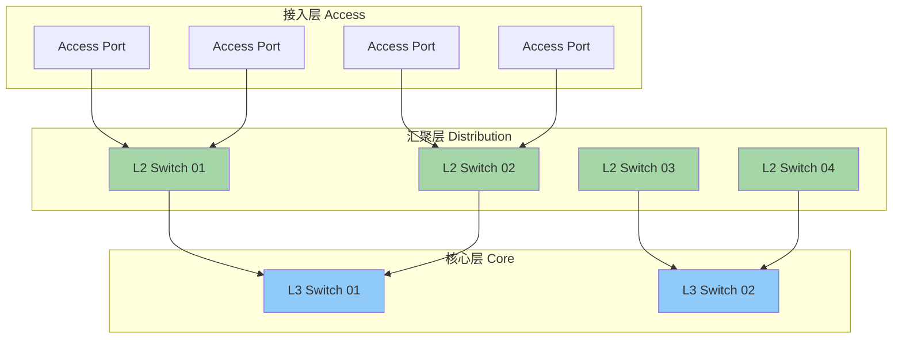

**各层 VLAN 设计要点：**

| 层次   | VLAN 范围                        | 说明                      |
| ------ | -------------------------------- | ------------------------- |
| 接入层 | 尽量在一个交换机内完成 VLAN 划分 | 减少 Trunk 带宽占用       |
| 汇聚层 | 透传多个接入层的 VLAN 到核心     | 聚合多个接入交换机的 VLAN |
| 核心层 | 执行 VLAN 间路由                 | 三层交换，确保线速转发    |

### 12.3 VLAN 设计的黄金法则

1. **始终使用 802.1Q**：ISL 已淘汰，所有新部署必须使用 802.1Q
2. **避免使用 VLAN 1**：将其改为专用管理 VLAN 或其他用途
3. **明确配置端口模式**：不要依赖默认设置
4. **禁用 DTP 协商**：在接入层使用 `switchport nonegotiate`
5. **变更 Native VLAN**：不要使用默认的 VLAN 1
6. **使用 VLAN 修剪**：在 Trunk 链路上只放行必要的 VLAN
7. **实施 VLAN 层次化命名**：便于管理和识别
8. **保留 VLAN 池**：为未来扩展预留 VLAN ID

### 12.4 常见 VLAN 设计错误

| 错误                  | 后果                 | 正确做法                 |
| --------------------- | -------------------- | ------------------------ |
| 所有端口默认 VLAN 1   | 安全风险，广播域过大 | 明确划分 VLAN            |
| Trunk 不限定 VLAN     | 不必要的流量占用带宽 | 使用 `allowed vlan` 列表 |
| 随意使用扩展范围 VLAN | 与保留 VLAN 冲突     | 规划好 VLAN 范围         |
| Native VLAN 不一致    | CDP/VTP/STP 故障     | 链路两端配置一致         |
| 不同子网混用同一 VLAN | 违反网络设计原则     | 一 VLAN 一子网           |

## 总结

本章深入探讨了 VLAN 技术的基础与原理，涵盖以下核心内容：

**关键知识点：**

1. **VLAN 的本质**：在物理交换机上创建的逻辑网络，实现二层广播域的隔离
2. **802.1Q 标准**：4 字节 VLAN Tag 插入以太网帧，VID 范围 1-4094
3. **端口类型**：Access 端口连接终端，Trunk 端口连接交换机
4. **Native VLAN**：Trunk 链路上处理未标记帧的特殊 VLAN，默认是 VLAN 1
5. **CAM 表**：交换机学习源 MAC 地址的核心数据结构，决定二层转发路径
6. **一 VLAN = 一广播域 = 一子网**：VLAN 设计的核心原则
7. **以太网帧结构**：VLAN Tag 在帧中的位置及对 MTU 的影响
8. **QinQ 双重标签**：服务提供商环境下的 VLAN 扩展技术
9. **VLAN 安全**：VLAN 跳跃攻击、CAM 表溢出、PVLAN 隔离等安全议题

**实践要点：**

- 始终使用 `switchport mode access` 和 `switchport mode trunk` 明确配置端口类型
- 将 Native VLAN 从默认的 VLAN 1 改为其他 VLAN，或启用 `native vlan tag`
- 接入层端口使用 `switchport nonegotiate` 禁用 DTP
- 定期检查 CAM 表和 Trunk 状态，及时发现异常
- 实施 VLAN 分层命名和规划，便于运维管理
- 启用端口安全、DAI 等二层安全特性

**新增高级主题：**

- 第 10.8 节：VLAN 安全问题与加固（VLAN Hopping、CAM 溢出、PVLAN）
- 第 11 章：QinQ 双重 VLAN 标签技术
- 第 12 章：企业网络 VLAN 设计最佳实践与常见错误

**下一章预告**：

VLAN 深度探索 Ch2 将深入探讨：

- VLAN Trunking Protocol（VTP）的原理与注意事项
- PVSTP（Per-VLAN Spanning Tree）与 VLAN 的交互
- VTPv3 与配置同步机制
- 高级 VLAN 技术：VLAN 修剪（Pruning）、VTP 修剪
- 多交换机环境下的 VLAN 部署最佳实践
- MSTP（Multiple Spanning Tree Protocol）与 VLAN 的关系
- 虚拟机环境下的 VLAN 部署（VMware vSphere Distributed Switch）

---

_本文档基于 IEEE 802.1Q-2018 标准及 Cisco IOS 15.x 版本编写。实验配置适用于支持 802.1Q 的标准交换机设备。_
