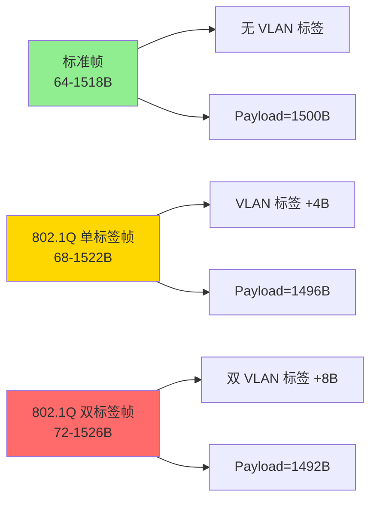
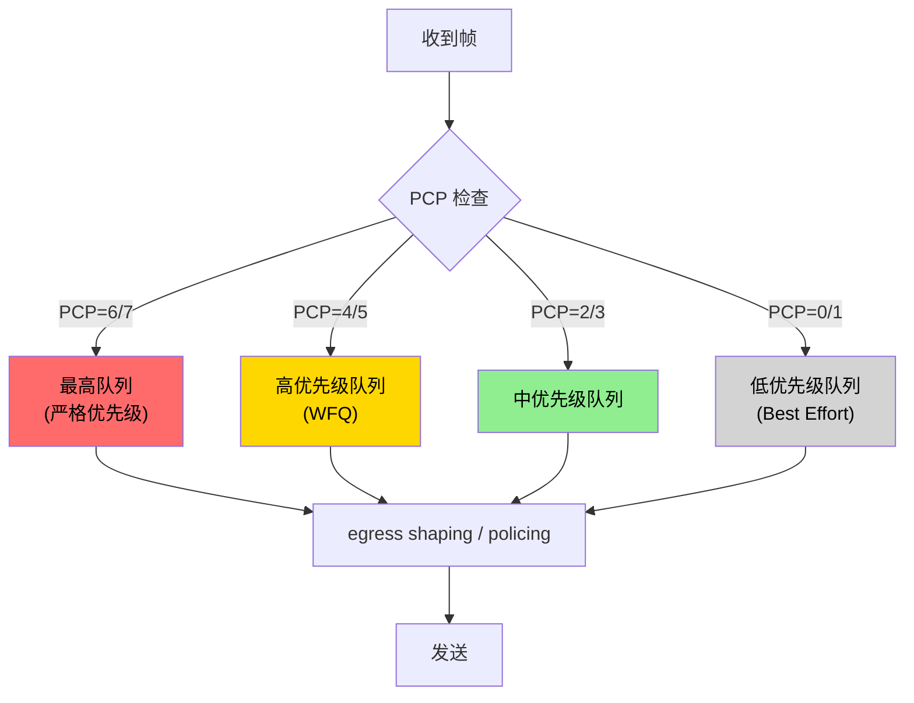
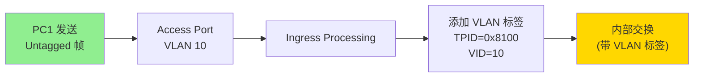
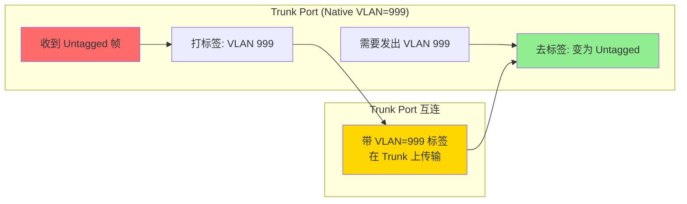
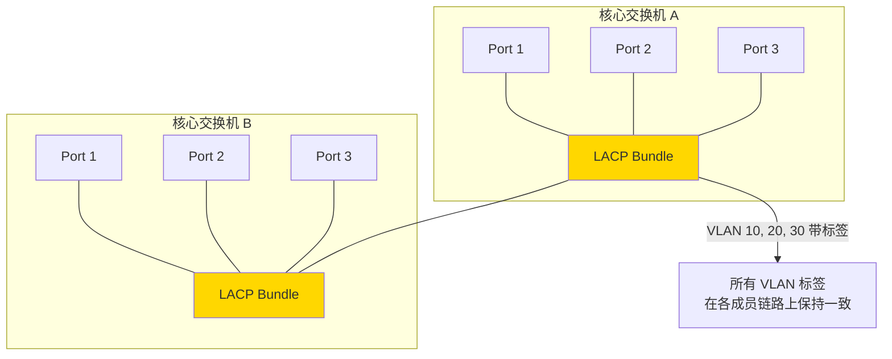
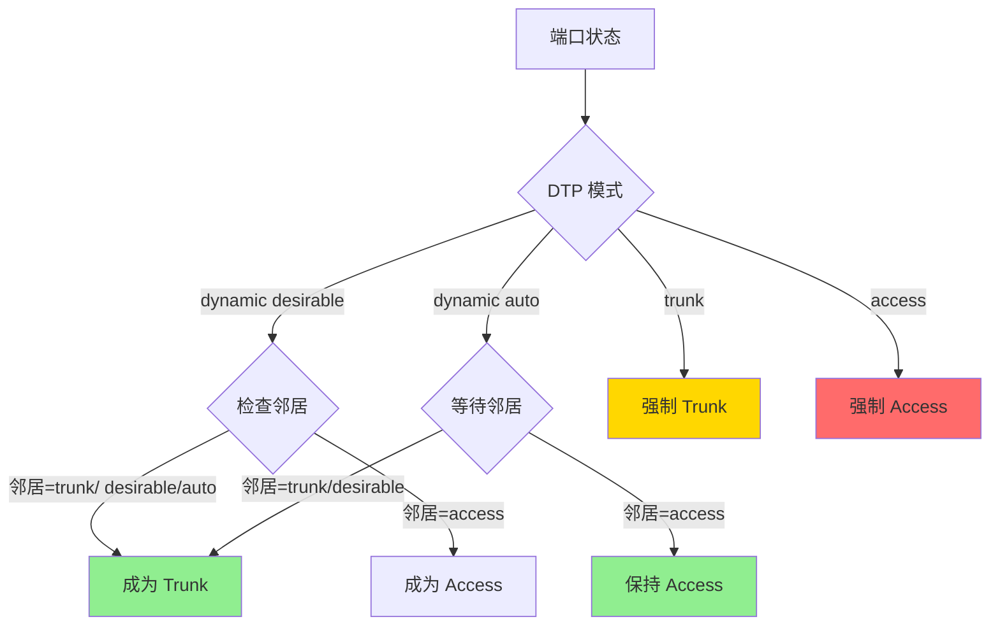

# VLAN 深度探索 Ch2: 802.1Q VLAN 标签详解

> 系列文章导航：[Ch1: VLAN 基础概念与架构](/vlan-deep-dive-ch1) | Ch2: 802.1Q 标签详解 | [Ch3: VLAN 间路由](/vlan-deep-dive-ch3)

## 1. 802.1Q 标准概述

### 1.1 IEEE 802.1Q 的诞生

IEEE 802.1Q 是由 IEEE 802.1 工作组制定的虚拟局域网（VLAN）标准，全称 **Virtual Bridged Local Area Networks**，首次发布于 1998 年。该标准定义了如何在以太网帧中插入 VLAN 标签，使单个物理网络能够逻辑划分为多个相互隔离的广播域。

在 802.1Q 出现之前，Cisco 推出了私有的 **ISL（Inter-Switch Link）** 协议来实现交换机间的 VLAN 信息传递。ISL 在原始帧外部包裹新的帧头和帧尾，包含 VLAN 信息。然而 ISL 存在几个显著问题：

- **Cisco 私有协议**：其他厂商设备无法兼容
- **封装方式不合理**：ISL 在帧外围封装，而 802.1Q 在帧内部插入标签，后者更优雅
- **不支持 IEEE 标准**：无法与多厂商环境集成

### 1.2 802.1Q vs ISL 对比

| 特性 | IEEE 802.1Q | Cisco ISL |
|------|------------|-----------|
| 标准类型 | IEEE 国际标准 | Cisco 私有协议 |
| 标签位置 | 帧内部插入（Internal Tagging） | 帧外部封装（External Tagging） |
| VLAN ID 范围 | 0-4095（12-bit） | 0-4095（12-bit） |
| 支持 STP | 是（通过 GVRP） | 是 |
| 多厂商支持 | 是 | 否 |
| 帧标记开销 | 4 字节 | 30 字节（26 字节头 + 4 字节 CRC） |
| 本征 VLAN（Native VLAN） | 支持 | 不支持 |
| 标准化年份 | 1998 | 1990 年代初 |

802.1Q 以其简洁的 4 字节标签开销和开放的标准生态，逐渐成为行业共识。现代网络设备几乎全部支持 802.1Q，Cisco 也在其设备上默认使用 802.1Q 而非 ISL。

### 1.3 802.1Q 标准发展历程

```
1998 — IEEE 802.1Q 首次发布（支持 4094 VLAN）
2001 — 802.1Q-2001 修订版
2005 — 802.1Q-2005 合并修订
2011 — 802.1Qbg（EVB/VEPA）边缘虚拟桥接
2014 — 802.1Q-2014 合并所有修订
2018 — 802.1Q-2018 最新修订版
2022 — 802.1Qdd（性能增强）
```

---

## 2. VLAN 标签结构详解

### 2.1 802.1Q 标签格式

802.1Q VLAN 标签是一个 **4 字节（32-bit）** 的字段，插入到以太网帧的源 MAC 地址和类型/长度字段之间。其结构如下：

```
 0                   1                   2                   3
 0 1 2 3 4 5 6 7 8 9 0 1 2 3 4 5 6 7 8 9 0 1 2 3 4 5 6 7 8 9 0 1
+-+-+-+-+-+-+-+-+-+-+-+-+-+-+-+-+-+-+-+-+-+-+-+-+-+-+-+-+-+-+-+-+
|      TPID (16-bit)           |        TCI (16-bit)            |
+-+-+-+-+-+-+-+-+-+-+-+-+-+-+-+-+-+-+-+-+-+-+-+-+-+-+-+-+-+-+-+-+
         2 Bytes                       2 Bytes
         Tag Protocol Identifier       Tag Control Information
```

### 2.2 各字段详解

#### 2.2.1 TPID（Tag Protocol Identifier）

- **位置**：标签的前 2 字节（bits 0-15）
- **固定值**：`0x8100`（十六进制）
- **含义**：标识这是一个带 802.1Q 标签的帧。当交换机/网卡看到以太网帧的 Type/Length 字段为 `0x8100` 时，即知该帧已打 VLAN 标签
- **重要**：TPID 值可以被网络设备重新标记（Re-mark），某些攻击场景利用修改 TPID 绕过 VLAN 隔离

```c
// Linux 内核中 TPID 的定义
#define ETH_P_8021Q 0x8100  // 802.1Q VLAN tag

// 在 eBPF 中检查 VLAN 标签
static inline int is_vlan_tagged(struct ethhdr *eth) {
    return eth->h_proto == __constant_htons(ETH_P_8021Q);
}
```

#### 2.2.2 TCI（Tag Control Information）

TCI 包含三个子字段，共 2 字节：

```
 0                   1                   2                   3
 0 1 2 3 4 5 6 7 8 9 0 1 2 3 4 5 6 7 8 9 0 1 2 3 4 5 6 7 8 9 0 1
+-+-+-+-+-+-+-+-+-+-+-+-+-+-+-+-+-+-+-+-+-+-+-+-+-+-+-+-+-+-+-+-+
| PCP (3-bit) | DEI/CFI (1-bit) |        VID (12-bit)          |
+-+-+-+-+-+-+-+-+-+-+-+-+-+-+-+-+-+-+-+-+-+-+-+-+-+-+-+-+-+-+-+-+
```

##### 2.2.2.1 PCP（Priority Code Point）

- **长度**：3 位（bits 0-2）
- **作用**：IEEE 802.1p 优先级标记，用于 QoS
- **取值范围**：0-7，共 8 个优先级
- **详情见本文第 5 节**

##### 2.2.2.2 DEI/CFI（Drop Eligibility Indicator / Canonical Format Indicator）

- **长度**：1 位（bit 3）
- **历史名称**：CFI（Canonical Format Indicator），后因 802.1Q-2011 修订改名
- **作用**：标记帧是否可以在一 Token Ring 和以太网之间传输
  - `0`：以太网（Canonical）
  - `1`：非以太网/Token Ring（Non-Canonical）
- **现代网络**：几乎总是设为 0，因为 Token Ring 已基本退出历史舞台

##### 2.2.2.3 VID（VLAN Identifier）

- **长度**：12 位（bits 4-15）
- **取值范围**：0-4095（2^12 = 4096 个值）
- **特殊 VID**：
  - `0x000`（0）：仅用于优先级标记，不代表实际 VLAN
  - `0xFFF`（4095）：保留
  - `0x001`-`0xFFE`：可用 VLAN ID
- **实际可用**：4094 个 VLAN（VLAN 1-4094）

### 2.3 标签结构可视化


---

## 3. 以太网帧格式对比

### 3.1 标准以太网帧（无 VLAN 标签）

标准以太网帧结构如下，MTU 通常为 1500 字节：

```
+--------+--------+--------+--------+------+------------+--------+
| Dest   | Src    | Ether  | Payload                      | FCS   |
| MAC    | MAC    | Type   | (46-1500B)                   | (4B)  |
| (6B)   | (6B)   | (2B)   |                              |       |
+--------+--------+--------+--------+------+------------+--------+
                                         ←—— 64-1518 字节 ——→
```

**字段说明**：
- **Dest MAC**：目标 MAC 地址，6 字节
- **Src MAC**：源 MAC 地址，6 字节
- **Ether Type**：以太网类型，0x0800=IPv4，0x0806=ARP，0x86DD=IPv6，2 字节
- **Payload**：上层数据，46-1500 字节
- **FCS**：帧校验序列，4 字节

### 3.2 802.1Q 单标签帧格式

当帧携带单个 VLAN 标签时，在源 MAC 和 EtherType 之间插入 4 字节 VLAN 标签：

```
+--------+--------+------+----+--------+------+------------+--------+
| Dest   | Src    | TPID |TCI | Ether  | Payload                 | FCS   |
| MAC    | MAC    |8100  |    | Type   | (46-1500B)              | (4B)  |
| (6B)   | (6B)   |(2B)  |(2B)| (2B)   |                          |       |
+--------+--------+------+----+--------+------+------------+--------+
                                   ↑ 插入 VLAN 标签的位置
```

**关键变化**：
- 帧长度从 1518 增加到 1522 字节（+4 字节标签）
- EtherType 字段被"推后"了 4 字节
- 接收端通过 TPID=0x8100 识别这是一个带 VLAN 标签的帧

### 3.3 802.1Q 双标签帧格式（Q-in-Q / Double Tagging）

Q-in-Q（也称 802.1Q-in-802.1Q）允许在已有标签的基础上再打一层标签：

```
+--------+--------+------+----+------+----+--------+------+------------+--------+
| Dest   | Src    | TPID|TCI | TPID|TCI | Ether  | Payload                 | FCS   |
| MAC    | MAC    |8100 |VLAN|8100 |VLAN| Type   | (46-1500B)              | (4B)  |
| (6B)   | (6B)   |(2B) |(2B)| (2B)|(2B)| (2B)   |                          |       |
+--------+--------+------+----+------+----+--------+------+------------+--------+
                       ↑ 外层标签（Service VLAN / SP-VLAN）    ↑ 内层标签（Customer VLAN / CE-VLAN）
```

**双标签帧结构说明**：
- **外层标签**（靠近 Dest MAC）：SP-VLAN（Service Provider VLAN），由服务提供商添加
- **内层标签**（靠近 EtherType）：CE-VLAN（Customer Edge VLAN），由客户网络添加
- **TPID 复用**：外层和内层 TPID 都是 `0x8100`
- **总标签开销**：8 字节（两个 4 字节标签）

### 3.4 三种帧格式对比表

| 特性 | 标准帧（Untagged） | 单标签帧（802.1Q） | 双标签帧（Q-in-Q） |
|------|-------------------|-------------------|-------------------|
| 总长度 | 64-1518 字节 | 68-1522 字节 | 72-1526 字节 |
| VLAN 标签数 | 0 | 1 | 2 |
| 标签开销 | 0 字节 | 4 字节 | 8 字节 |
| MTU 支持 | 1500 | 1500（实际可用 1496） | 1500（实际可用 1492） |
| VID 识别 | 无 | 1 个 VID | 2 个 VID（外层+内层） |
| 应用场景 | 接入端口 | 标准 Trunk/接入 | 服务商 VLAN 嵌套 |
| TPID 位置 | N/A | 紧跟 Src MAC | 紧跟 Src MAC（外层） |

### 3.5 帧格式解析代码示例

```c
#include <stdio.h>
#include <stdint.h>
#include <string.h>

#define ETH_P_8021Q 0x8100
#define ETH_P_IPV4  0x0800
#define ETH_P_IPV6  0x86DD

// 以太网帧头（无 VLAN 标签）
struct ethhdr {
    uint8_t  h_dest[6];      // 目标 MAC
    uint8_t  h_source[6];    // 源 MAC
    uint16_t h_proto;        // 上层协议类型
} __attribute__((packed));

// 802.1Q VLAN 标签
struct vlan_hdr {
    uint16_t tpid;           // 0x8100
    uint16_t tci;            // PCP(3) + DEI(1) + VID(12)
} __attribute__((packed));

// 带 VLAN 标签的以太网帧头
struct vlan_ethhdr {
    uint8_t  h_dest[6];
    uint8_t  h_source[6];
    uint16_t tpid;           // 0x8100
    uint16_t tci;            // PCP + DEI + VID
    uint16_t h_proto;        // 上层协议类型
} __attribute__((packed));

// 解析以太网帧（可能带 VLAN 标签）
void parse_ethernet_frame(const uint8_t *frame, int len) {
    struct ethhdr *eth = (struct ethhdr *)frame;
    uint16_t proto = ntohs(eth->h_proto);
    
    printf("Dest MAC: %02x:%02x:%02x:%02x:%02x:%02x\n",
           eth->h_dest[0], eth->h_dest[1], eth->h_dest[2],
           eth->h_dest[3], eth->h_dest[4], eth->h_dest[5]);
    printf("Src MAC:  %02x:%02x:%02x:%02x:%02x:%02x\n",
           eth->h_source[0], eth->h_source[1], eth->h_source[2],
           eth->h_source[3], eth->h_source[4], eth->h_source[5]);
    
    if (proto == ETH_P_8021Q) {
        // 帧带 VLAN 标签
        struct vlan_hdr *vlan = (struct vlan_hdr *)(frame + sizeof(struct ethhdr));
        uint16_t tci = ntohs(vlan->tci);
        uint16_t vid = tci & 0x0FFF;
        uint8_t  pcp  = (tci >> 13) & 0x7;
        uint8_t  dei  = (tci >> 12) & 0x1;
        
        printf("VLAN Tag Found:\n");
        printf("  TPID:  0x%04x (802.1Q VLAN)\n", ntohs(vlan->tpid));
        printf("  VID:   %u\n", vid);
        printf("  PCP:   %u\n", pcp);
        printf("  DEI:   %u\n", dei);
        
        // 获取实际的上层协议
        uint16_t *next_proto = (uint16_t *)((uint8_t *)vlan + sizeof(struct vlan_hdr));
        proto = ntohs(*next_proto);
        printf("Inner Proto: 0x%04x\n", proto);
    } else {
        printf("No VLAN Tag, Protocol: 0x%04x\n", proto);
    }
}
```

---

## 4. 帧大小问题与 MTU

### 4.1 标准以太网的 MTU 限制

传统以太网规定最大帧长为 **1518 字节**，由以下部分组成：

```
计算：6 + 6 + 2 + 1500 + 4 = 1518 字节
     DestMAC + SrcMAC + Type + Payload(1500) + FCS
```

其中 **Payload 最大 1500 字节** 即为 **MTU（Maximum Transmission Unit）**。

### 4.2 802.1Q 对 MTU 的影响

当在以太网帧中插入 802.1Q VLAN 标签（4 字节）后：

```
最大帧长 = 1518 + 4 = 1522 字节
```

这导致**有效载荷被压缩**：
- 实际 Payload 可用空间 = 1500 - 4 = **1496 字节**
- 某些旧设备仅支持标准 1518 帧长，接收 1522 帧会被丢弃

### 4.3 MTU 场景对比



### 4.4 Jumbo Frame（巨型帧）与 VLAN

现代数据中心常使用 **Jumbo Frame**（巨型帧），标准 MTU 为 **9000 字节**。VLAN 标签对 Jumbo Frame 的影响如下：

| 帧类型 | 最大 MTU | VLAN 开销 | 实际 Payload |
|--------|---------|-----------|-------------|
| 标准帧 | 1518 字节 | 0 | 1500 |
| 标准 Jumbo | 9018 字节 | 0 | 9000 |
| 802.1Q 单标签 Jumbo | 9022 字节 | 4 | 9000（仍保持） |
| 802.1Q 双标签 Jumbo | 9026 字节 | 8 | 9000（仍保持） |

**重要结论**：由于 Jumbo Frame 本身就远大于标准 MTU，VLAN 标签的 4-8 字节开销不会造成有效载荷减少。9000 字节的 Payload 空间减去 4-8 字节标签后仍有大量余量。

### 4.5 网络设备 MTU 配置

```bash
# Linux 查看/设置接口 MTU
ip link show eth0
ip link set eth0 mtu 9000

# Cisco IOS 交换机设置端口 MTU
switchport trunk allowed vlan 10,20,30
switchport trunk native vlan 999
switchport mode trunk
mtu 9000

# HP / Aruba 交换机
vlan 10
   name "Engineering"
   tagged ethernet 1/1/1
   jumbo
```

### 4.6 MTU 路径发现问题（MSS Clamping）

当不同 MTU 的网络设备串联时，可能出现分片（Fragmentation）或丢包问题。常见解决方案：

```python
#!/usr/bin/env python3
"""
MTU 路径发现与 MSS Clamping 示例
"""
import socket
import struct

def calculate_path_mtu(src_ip, dst_ip, dst_port=80):
    """
    使用 ICMP 或 UDP 探测 Path MTU
    """
    # 实际生产环境中可使用 scapy 库发送探测包
    # 这里仅展示概念
    max_mtu = 1500
    suggested_mtu = max_mtu - 40  # 减去 IP 头
    
    # 如果路径中存在 1500 MTU 限制的设备
    # 802.1Q 标签会使实际可用空间变为 1496
    vlan_overhead = 4
    effective_payload = max_mtu - vlan_overhead - 40  # IPv4 头
    
    return effective_payload

def mss_clamping(mtu, has_vlan=False):
    """
    计算 TCP MSS（Maximum Segment Size）
    MSS = MTU - IP头(20) - TCP头(20)
    """
    ip_header = 20
    tcp_header = 20
    overhead = ip_header + tcp_header
    
    if has_vlan:
        overhead += 4  # 802.1Q 标签
    
    mss = mtu - overhead
    return mss

# 示例计算
print("标准帧 MSS:", mss_clamping(1500, has_vlan=False))  # 1460
print("802.1Q 帧 MSS:", mss_clamping(1500, has_vlan=True)) # 1456
print("Jumbo 帧 MSS:", mss_clamping(9000, has_vlan=True))  # 8976
```

---

## 5. PCP 与优先级（802.1p QoS）

### 5.1 802.1p 优先级机制

IEEE 802.1p 是 802.1Q 标准的一部分，定义了 **3 位的 PCP（Priority Code Point）** 字段，用于标记帧的 QoS 优先级。802.1p 使得以太网能够提供类似于 IP DiffServ 的服务质量标记能力。

### 5.2 PCP 值与优先级对照

| PCP 值 | 优先级 | 缩写 | 典型应用 | 802.1Q-2014 命名 |
|--------|--------|------|---------|-----------------|
| 0 | 最低 | BK | 后台流量 | BE (Best Effort) |
| 1 | 低 | BK | 后台流量 | BK (Background) |
| 2 | 中低 | EE | 优秀努力 | EE (Excellent Effort) |
| 3 | 中 | CA | 关键应用 | CA (Critical Applications) |
| 4 | 中高 | VI | 视频 < 100ms 延迟 | VI (Video) |
| 5 | 高 | VO | 语音 < 10ms 延迟 | VO (Voice) |
| 6 | 最高 | IC | 网络控制 | IC (Internetwork Control) |
| 7 | 最高 | CS7 | 帧中继网络控制 | NC (Network Control) |

### 5.3 PCP 在 TCI 中的位置

```
 15   14   13    12      11  10   9   8   7   6   5   4   3   2   1   0
+----+----+----+---------------------------------------------------------+
| PCP (3 bits) | DEI |              VID (12 bits)                       |
+----+----+----+---------------------------------------------------------+

PCP: Bits 0-2 (在 TCI 中是最高 3 位，因为 TCI 在内存中是 big-endian 显示)
DEI: Bit 3
VID: Bits 4-15
```

### 5.4 PCP 字段解析代码

```c
#include <stdio.h>
#include <stdint.h>

// 从 TCI 中提取各字段
struct vlan_tci {
    uint16_t vid : 12;   // VLAN ID (bits 0-11 在 TCI 中实际是 bits 4-15)
    uint16_t dei : 1;    // DEI (bit 3)
    uint16_t pcp : 3;    // PCP (bits 0-2)
};

// 更好的方式：直接操作 16 位整数
void parse_tci(uint16_t tci) {
    uint16_t pcp = (tci >> 13) & 0x7;  // 取 bits 15-13
    uint16_t dei = (tci >> 12) & 0x1; // 取 bit 12
    uint16_t vid = tci & 0x0FFF;       // 取 bits 11-0
    
    const char *priority_name[] = {
        "BE (Best Effort)", "BK (Background)", "EE (Excellent Effort)",
        "CA (Critical Apps)", "VI (Video)", "VO (Voice)",
        "IC (Internetwork Control)", "NC (Network Control)"
    };
    
    printf("TCI: 0x%04x\n", tci);
    printf("  PCP: %u (%s)\n", pcp, priority_name[pcp]);
    printf("  DEI: %u\n", dei);
    printf("  VID: %u\n", vid);
}

// 构造带优先级的 TCI
uint16_t build_tci(uint8_t pcp, uint8_t dei, uint16_t vid) {
    return ((pcp & 0x7) << 13) | ((dei & 0x1) << 12) | (vid & 0x0FFF);
}
```

### 5.5 QoS 优先级在交换机中的处理



### 5.6 Linux 中的 VLAN PCP 设置

```bash
# 使用 iproute2 设置 VLAN 标签的 PCP 值
ip link add link eth0 name eth0.10 type vlan id 10 proto 802.1Q

# 设置 egress map（出方向映射规则）
# 格式：TCI:mask:value
# 将 DSCP 值映射到 VLAN PCP
ip link set eth0.10 type vlan \
    egress-qos-map "from-dscp:0 to-0"

# 手动设置 PCP 值（需要较新的 iproute2）
# 查看当前配置
ip -d link show eth0.10

# 在 /etc/network/interfaces (Debian/Ubuntu) 中配置
auto eth0.10
iface eth0.10 inet static
    address 192.168.10.1
    netmask 255.255.255.0
    vlan-raw-device eth0
    # 设置 PCP=5 (语音优先级)
    post-up ip link set eth0.10 type vlan egress-tagged 5
```

### 5.7 PCP 与 DSCP 映射表

在实际网络部署中，需要将 IP 层的 DiffServ DSCP 值映射到 802.1p PCP：

| DSCP 值 | DSCP 名称 | IP 优先级 | 建议 PCP |
|---------|----------|----------|---------|
| 0 | BE / CS0 | 0 | 0 |
| 46 | EF | 5 | 5 |
| 34 | AF41 | 4 | 4 |
| 26 | AF31 | 3 | 3 |
| 18 | AF21 | 2 | 2 |
| 10 | AF11 | 1 | 1 |
| 8 | CS1 | 1 | 1 |
| 48 | CS6 | 6 | 6 |
| 56 | CS7 | 7 | 7 |

---

## 6. 标签操作

### 6.1 打标签（Tagging）

打标签是指在帧通过 Trunk 端口时，交换机给帧添加 VLAN 信息的过程。

#### 6.1.1 入口打标签（Ingress Tagging）

当帧从 Access 端口进入交换机时，交换机根据端口所属 VLAN 给帧打上标签：

```
场景：PC1 连接到 Switch Port Gi0/1（属于 VLAN 10）

PC1 发送标准帧（无 VLAN 标签）
    ↓
Switch Port Gi0/1 接收（Access 模式）
    ↓
Ingress 检查：端口属于 VLAN 10
    ↓
给帧添加 VLAN 标签（TPID=0x8100, VID=10）
    ↓
帧在交换机内部以 802.1Q 格式转发
```



#### 6.1.2 eBPF 中的 VLAN 标签添加

```c
// eBPF 程序：在 Ingress 添加 VLAN 标签
#include <linux/bpf.h>
#include <linux/if_ether.h>
#include <linux/if_vlan.h>
#include <linux/ip.h>

SEC("xdp")
int xdp_vlan_tag(struct xdp_md *ctx)
{
    void *data     = (void *)(long)ctx->data;
    void *data_end  = (void *)(long)ctx->data_end;
    struct ethhdr *eth = data;
    
    if ((void *)(eth + 1) > data_end)
        return XDP_PASS;
    
    // 检查是否已有 VLAN 标签
    if (eth->h_proto == __constant_htons(ETH_P_8021Q) ||
        eth->h_proto == __constant_htons(ETH_P_8021AD)) {
        // 已有标签，透传
        return XDP_PASS;
    }
    
    // 仅对特定 VLAN ID 打标签
    uint16_t target_vid = 100;
    
    // 移动以太网头，为 VLAN 标签腾出空间
    // 注意：实际需要 push VLAN 头，这里仅演示概念
    // 真实实现需要使用 bpf_vlan_push() helper
    
    return XDP_PASS;
}
```

### 6.2 去标签（Untagging）

去标签是指帧从 Trunk 端口发出时，交换机移除 VLAN 标签的过程。

#### 6.2.1 出口去标签（Egress Untagging）

当带 VLAN 标签的帧需要从 Access 端口发出时，交换机移除 VLAN 标签：

```
场景：帧（VLAN 10）需要从 Switch Port Gi0/2（Access 模式）发出

交换机内部转发（VLAN 10 标签）
    ↓
Egress 检查：端口是 Access 模式
    ↓
移除 VLAN 标签（保留原始以太网帧）
    ↓
PC2 接收标准帧（无 VLAN 标签）
```


### 6.3 交换机的标签行为矩阵

| 端口模式 | 收到 Untagged 帧 | 收到 Tagged 帧 | 发出 Untagged 帧 | 发出 Tagged 帧 |
|---------|-----------------|---------------|-----------------|---------------|
| **Access** | 打标签（PVID） | 通常丢弃（可配置 allow） | 去标签 | 去标签后发出 |
| **Trunk** | 打标签（Native VLAN） | 查 VLAN 表转发 | 去标签（仅 Native VLAN） | 带标签发出 |
| **Hybrid** | 打标签（可配置） | 查 VLAN 表转发 | 可配置去标签/带标签 | 可配置去标签/带标签 |

### 6.4 Cisco 交换机标签操作配置

```network配置
! Cisco IOS 交换机配置

! 创建 VLAN
vlan 10
 name Engineering
vlan 20
 name Sales

! 配置 Access 端口
interface GigabitEthernet0/1
 description "Access Port for PC1"
 switchport mode access
 switchport access vlan 10
 spanning-tree portfast

! 配置 Trunk 端口
interface GigabitEthernet0/24
 description "Uplink to Core Switch"
 switchport mode trunk
 switchport trunk allowed vlan 10,20,30
 switchport trunk native vlan 999
 switchport trunk encapsulation dot1q

! 配置 Hybrid 端口（HP/Aruba 风格）
interface GigabitEthernet0/10
 switchport mode hybrid
 switchport hybrid allowed vlan 10,20 tagged
 switchport hybrid allowed vlan 30 untagged
 switchport hybrid native vlan 30
```

### 6.5 Linux VLAN 标签操作

```bash
# 创建 VLAN 接口
ip link add link eth0 name eth0.10 type vlan id 10 proto 802.1Q

# 创建 Q-in-Q（双标签）接口
ip link add link eth0 name eth0.100 type vlan id 100 proto 802.1AD

# 查看 VLAN 接口详情
ip -d link show eth0.10

# 抓包验证 VLAN 标签
tcpdump -i eth0.10 -nn -v

# 使用 vconfig 操作 VLAN（较老的工具）
vconfig add eth0 10
vconfig set_flag eth0.10 1 1  # 启用 reorder_header

# 验证标签：发送自定义 VLAN 标签的帧
# 使用 scapy
python3 -c "
from scapy.all import *
send(Ether(dst='ff:ff:ff:ff:ff:ff')/Dot1Q(vlan=10, prio=5)/IP())
"
```

---

## 7. 本征 VLAN（Native VLAN）与 Q-in-Q

### 7.1 本征 VLAN 概念

**本征 VLAN（Native VLAN）** 是 Trunk 端口上的一个特殊 VLAN，用于处理**未打标签（Untagged）的帧**。

当 Trunk 端口收到一个没有 VLAN 标签的帧时，交换机会将其视为来自本征 VLAN 并打上本征 VLAN 的标签；反之，当帧从 Trunk 端口发出到本征 VLAN 时，交换机会移除 VLAN 标签。

### 7.2 本征 VLAN 工作原理



### 7.3 本征 VLAN 安全问题

本征 VLAN 是网络安全的薄弱环节，攻击者可以利用 **VLAN Hopping** 技术：

#### 7.3.1 Switch Spoofing 攻击

攻击者模拟交换机，协商为 Trunk 端口：

```
攻击者设备 -----> 模拟 DTP Dynamic Desirable -----> 交换机
                                                   交换机误以为攻击者是另一台交换机
                                                   建立 Trunk 链路
攻击者 ---- 可以访问所有 VLAN ---->
```

防御措施：

```network配置
! 禁用 DTP（Dynamic Trunking Protocol）
interface GigabitEthernet0/1
 switchport mode access
! 或
 switchport nonegotiate

! 显式指定 Trunk 而非协商
switchport mode trunk
switchport nonegotiate

! 更改本征 VLAN（不用默认 VLAN 1）
switchport trunk native vlan 999
```

#### 7.3.2 802.1Q Double-Encapsulation 攻击

攻击者发送双层 802.1Q 标签的帧，利用两层标签的 VID 不同绕过访问控制：

```
原始攻击帧：
[ 外层 VID=999（攻击者的 VLAN）][ 内层 VID=10（目标 VLAN）][ 数据 ]

交换机 A（Trunk）:
  看到外层 VID=999 -> 转发到 trunk
  （去除外层标签？不，因为目标是 trunk）
  
交换机 B（连接目标服务器）:
  看到内层 VID=10 -> 转发到 VLAN 10 中的端口
  目标服务器收到帧，看起来像是来自 VLAN 10
  
攻击者成功访问了不属于自己 VLAN 的资源！
```

### 7.4 Q-in-Q 基础（802.1AD）

**Q-in-Q** 是 802.1Q 的扩展，也称为 **802.1AD** 或 Provider Bridging。它在现有 802.1Q 标签外再增加一层服务提供商标签。

#### 7.4.1 Q-in-Q 帧格式

```
标准 802.1Q 帧（CE-VLAN）：
[ Dest MAC ][ Src MAC ][ TPID=0x8100 ][ TCI:VID=10 ][ EtherType ][ Data ][ FCS ]

Q-in-Q 帧（CE-VLAN + SP-VLAN）：
[ Dest MAC ][ Src MAC ][ TPID=0x8100 ][ SP-VLAN TCI ][ TPID=0x8100 ][ CE-VLAN TCI ][ EtherType ][ Data ][ FCS ]
     6B           6B           2B              2B              2B              2B              2B           ...        4B
```

#### 7.4.2 Q-in-Q TPID 值

| TPID 值 | 标准 | 说明 |
|---------|------|------|
| `0x8100` | 802.1Q | 标准 VLAN 标签（客户侧 CE-VLAN） |
| `0x88A8` | 802.1AD | 服务提供商标签（SP-VLAN） |
| `0x9100` | 某些厂商私有 | 旧版 Q-in-Q 实现 |

#### 7.4.3 Q-in-Q 配置示例

```network配置
! Cisco 交换机 Q-in-Q 配置
interface GigabitEthernet0/1
 description "Customer Edge Port"
 switchport mode dot1q-tunnel
! 或
 switchport mode trunk
 switchport trunk allowed vlan 10-20
 switchport trunk native vlan 999

! 启用 Q-in-Q（Service VLAN Tagging）
vlan dot1q tag native
```

```bash
# Linux Q-in-Q 配置
# 安装 iproute2 支持 802.1AD
modprobe 8021q

# 创建外层 VLAN（SP-VLAN）
ip link add link eth0 name eth0.100 type vlan id 100 proto 802.1AD

# 创建内层 VLAN（CE-VLAN）- 通过子接口实现
ip link add link eth0.100 name eth0.100.10 type vlan id 10 proto 802.1Q

# 验证配置
ip -d link show

# 抓包验证双标签
tcpdump -i eth0 -nn -v 'vlan and vlan'
```

### 7.5 本征 VLAN 与 Q-in-Q 对比

| 特性 | Native VLAN | Q-in-Q（802.1AD） |
|------|------------|------------------|
| 标签数量 | 0 或 1 | 2（CE + SP） |
| 标签位置 | 无额外标签 | 外层 SP + 内层 CE |
| 使用场景 | Trunk 端口回退 | 服务提供商隧道 |
| 安全性 | 中等（需配置 Native VLAN） | 高（客户隔离） |
| 典型应用 | 交换机间链路 | MPLS/VPN 接入 |

---

## 8. 链路聚合与 VLAN

### 8.1 LACP（Link Aggregation Control Protocol）

LACP（IEEE 802.3ad）是链路聚合的标准协议，允许将多个物理链路捆绑为单个逻辑链路，同时提供负载均衡和故障切换。

### 8.2 LACP + VLAN 的配合

当 LACP 链路承载 VLAN 流量时，所有聚合的成员链路都必须正确处理 VLAN 标签：



### 8.3 LACP 负载均衡算法

LACP 使用基于哈希的负载均衡算法，常见配置：

```network配置
! Cisco LACP + VLAN 负载均衡配置

! 配置 LACP EtherChannel
interface range GigabitEthernet0/1 - 2
 channel-group 1 mode active
 channel-protocol lacp

! 配置负载均衡算法（基于源/目标 MAC + VLAN）
port-channel load-balance src-mac
port-channel load-balance dst-mac
port-channel load-balance src-dst-mac
port-channel load-balance src-ip
port-channel load-balance dst-ip
port-channel load-balance src-dst-ip

! 查看负载均衡配置
show etherchannel load-balance
```

```bash
# Linux 链路聚合 + VLAN 配置
# 创建 bond 接口
ip link add name bond0 type bond mode 802.3ad

# 将物理接口加入 bond
ip link set eth0 master bond0
ip link set eth1 master bond0

# 在 bond 上创建 VLAN
ip link add link bond0 name bond0.10 type vlan id 10 proto 802.1Q

# 配置 bond 负载均衡（XOR 策略）
ip link set bond0 type bond ad_select=bandwidth

# 查看 bond 状态
cat /proc/net/bonding/bond0
```

### 8.4 LACP 负载均衡与 VLAN 标签关系

| 负载均衡算法 | 哈希输入 | 对 VLAN 的影响 |
|------------|---------|---------------|
| src-mac | 源 MAC | 不同源 MAC 的帧分布到不同成员 |
| dst-mac | 目标 MAC | 同 VLAN 内相同目标的帧走同一链路 |
| src-dst-mac | 源+目标 MAC | 流量分布均匀 |
| src-ip | 源 IP | 不同源 IP 分布到不同成员 |
| dst-ip | 目标 IP | 同 VLAN 内相同目标 IP 走同一链路 |
| src-dst-ip | 源+目标 IP | 最均匀的分布 |

**重要**：负载均衡算法应包含 VLAN 信息，否则同一 VLAN 的流量可能都走单一成员链路：

```network配置
! Cisco：配置考虑 VLAN 的负载均衡
port-channel load-balance src-dst-mac-vlan
! 或
port-channel load-balance src-dst-ip-vlan
```

### 8.5 LACP 配置示例

```network配置
! 交换机 A 配置
vlan 10,20,30

interface GigabitEthernet0/1
 description "LACP Member 1"
 channel-group 1 mode active
 channel-protocol lacp

interface GigabitEthernet0/2
 description "LACP Member 2"
 channel-group 1 mode active
 channel-protocol lacp

interface Port-channel1
 description "LACP EtherChannel"
 switchport trunk allowed vlan 10,20,30
 switchport mode trunk
 spanning-tree guard root

! 交换机 B 配置（对应端）
interface GigabitEthernet0/1
 channel-group 1 mode active
 channel-protocol lacp

interface GigabitEthernet0/2
 channel-group 1 mode active
 channel-protocol lacp

interface Port-channel1
 switchport trunk allowed vlan 10,20,30
 switchport mode trunk
```

---

## 9. DTP（Dynamic Trunking Protocol）

### 9.1 DTP 概述

**DTP（Dynamic Trunking Protocol）** 是 Cisco 私有协议，用于在两台Cisco交换机之间自动协商是否形成 Trunk 链路。DTP 是 Cisco ISL 和 802.1Q 时代的产物，现在仍在许多 Cisco 设备上默认启用。

### 9.2 DTP 模式

| DTP 模式 | 行为 | 协商结果 |
|---------|------|---------|
| **switchport mode trunk** | 强制为 Trunk，不协商 | 始终为 Trunk |
| **switchport mode access** | 强制为 Access，不协商 | 始终为 Access |
| **switchport mode dynamic auto** | 被动等待对端请求 | 仅当对端请求时成为 Trunk |
| **switchport mode dynamic desirable** | 主动请求成为 Trunk | 对端为 auto/desirable/trunk 时成为 Trunk |

### 9.3 DTP 协商状态机



### 9.4 DTP 帧格式

DTP 帧是一个 Cisco 私有协议帧，以太网类型为 `0x0104`（Cisco 私有）：

```
DTP 帧结构：
[ Dest MAC = 01:00:0C:CC:CC:CC ][ Src MAC ][ DTP Type = 0x0104 ][ DTP Payload ][ FCS ]
                                   6B                        2B              可变           4B
```

DTP 载荷包含：
- **域（Domain）**：VLAN 域名
- **状态（Status）**：Trunk 状态
- **类型（Type）**：协商类型（desirable, auto 等）

### 9.5 DTP 安全问题

DTP 的自动协商机制存在严重安全隐患：

#### 9.5.1 DTP 攻击向量

**攻击场景 1：模拟交换机建立 Trunk**

```
攻击者发送 DTP 包（dynamic desirable）
    ↓
目标交换机误以为攻击者是另一台交换机
    ↓
协商建立 Trunk
    ↓
攻击者可以收发所有 VLAN 的流量
```

**攻击场景 2：VLAN Hopping**

```
攻击者发送 DTP 包请求 Trunk
    ↓
获得 Trunk 访问权限
    ↓
发送双标签帧访问其他 VLAN
```

#### 9.5.2 DTP 安全配置

```network配置
! 最佳安全实践：禁用所有 DTP 协商

! 方法 1：强制 Trunk（推荐）
interface GigabitEthernet0/1
 switchport mode trunk
 switchport nonegotiate

! 方法 2：强制 Access（最安全）
interface GigabitEthernet0/1
 switchport mode access
 switchport nonegotiate

! 方法 3：关闭 DTP（全局）
no lldp run  ! 也关闭 CDP 以减少信息泄露

! 验证端口状态
show interface GigabitEthernet0/1 switchport
show interface GigabitEthernet0/1 trunk
```

### 9.6 DTP 与其他协商协议对比

| 协议 | 厂商 | 类型 | 用途 |
|------|------|------|------|
| DTP | Cisco 私有 | Trunk 协商 | 自动协商 Trunk 链路 |
| LACP | IEEE 802.3ad | 链路聚合协商 | 自动协商 EtherChannel |
| LLDP | IEEE 802.1AB | 邻居发现 | 发现直连设备信息 |
| CDP | Cisco 私有 | 邻居发现 | Cisco 设备间交换信息 |

---

## 10. Wireshark 抓包分析实战

### 10.1 识别 802.1Q 帧

在 Wireshark 中，802.1Q 帧有独特的标识特征：

1. **Ethernet II 帧中 Type 字段显示为 `0x8100`**
2. **Wireshark 显示 `802.1Q Virtual LAN` 信息**
3. **显示 VLAN ID、 PCP 和 EtherType**

### 10.2 Wireshark 捕获 802.1Q 帧

```bash
# 捕获特定 VLAN 的帧
tcpdump -i eth0 -nn 'vlan 10'

# 捕获多个 VLAN
tcpdump -i eth0 -nn 'vlan 10 or vlan 20'

# 捕获特定 PCP 优先级的帧
tcpdump -i eth0 -nn 'vlan and ip[14:1] & 0xe0 = 0xa0'
# PCP=5 的帧，其 VLAN TCI 的高 3 位为 101

# 保存到文件供 Wireshark 分析
tcpdump -i eth0 -nn -w /tmp/vlan_capture.pcap 'vlan'

# 在 Wireshark 中打开后，使用过滤器
# 显示特定 VLAN
vlan.id == 10
vlan.id >= 10 && vlan.id <= 20

# 显示特定 PCP
vlan.pcp == 5

# 显示双标签（Q-in-Q）
vlan.pcp == 0 && frame.len > 1518
```

### 10.3 802.1Q 帧 Wireshark 显示解析

当 Wireshark 捕获到 802.1Q 帧时，显示格式如下：

```
Frame 1: 68 bytes on wire (544 bits), 68 bytes captured (544 bits)
Ethernet II, Src: aa:bb:cc:dd:ee:ff, Dst: 11:22:33:44:55:66
802.1Q Virtual LAN, PRI: 5, DEI: 0, ID: 10
    000. .... .... .... = Priority: 5 (Network Control)
    ...0 .... .... .... = DEI: 0
    .... 0000 0000 1010 = ID: 10
Destination: aa:bb:cc:dd:ee:ff
Source: 11:22:33:44:55:66
Type: IPv4 (0x0800)
```

### 10.4 Q-in-Q 双标签帧分析

对于 Q-in-Q 帧，Wireshark 显示：

```
Frame 2: 72 bytes on wire (576 bits), 72 bytes captured (576 bits)
Ethernet II, Src: aa:bb:cc:dd:ee:ff, Dst: 11:22:33:44:55:66
802.1Q Virtual LAN, PRI: 0, DEI: 0, ID: 100   <-- 外层 SP-VLAN
    000. .... .... .... = Priority: 0 (Best Effort)
    ...0 .... .... .... = DEI: 0
    .... 0000 0110 0100 = ID: 100
802.1Q Virtual LAN, PRI: 5, DEI: 0, ID: 10    <-- 内层 CE-VLAN
    000. .... .... .... = Priority: 5 (Network Control)
    ...0 .... .... .... = DEI: 0
    .... 0000 0000 1010 = ID: 10
Type: IPv4 (0x0800)
```

### 10.5 Wireshark 过滤器语法

| 过滤器 | 说明 |
|-------|------|
| `vlan.id == 10` | 显示 VLAN ID = 10 的帧 |
| `vlan.pcp > 3` | 显示 PCP > 3 的帧 |
| `vlan && ip.src == 192.168.1.0/24` | VLAN 10 中特定源 IP |
| `not vlan` | 仅显示无 VLAN 标签的帧 |
| `frame.len > 1522` | 可能的双标签帧 |

### 10.6 捕获 802.1Q 帧的 Python 脚本

```python
#!/usr/bin/env python3
"""
使用 scapy 发送和捕获 802.1Q 帧进行实验
"""
from scapy.all import *
from scapy.layers.l2 import Dot1Q, Ether

def create_vlan_frame(vid, pcp=0, dst_mac="ff:ff:ff:ff:ff:ff", 
                       src_mac="00:11:22:33:44:55", payload=None):
    """
    创建 802.1Q 帧
    """
    if payload is None:
        payload = IP(dst="192.168.1.1")/ICMP()
    
    frame = Ether(dst=dst_mac, src=src_mac)
    frame = frame / Dot1Q(vlan=vid, prio=pcp)
    frame = frame / payload
    
    return frame

def send_vlan_frame(vid, pcp=0):
    """
    发送单个 VLAN 帧
    """
    frame = create_vlan_frame(vid, pcp)
    print(f"发送帧: VLAN ID={vid}, PCP={pcp}")
    print(f"  帧内容: {frame.summary()}")
    sendp(frame, iface="eth0")

def create_qinq_frame(sp_vid, ce_vid, src_mac="00:11:22:33:44:55"):
    """
    创建 Q-in-Q 双标签帧
    """
    frame = Ether(src=src_mac, dst="ff:ff:ff:ff:ff:ff")
    frame = frame / Dot1Q(vlan=sp_vid)  # 外层 SP-VLAN
    frame = frame / Dot1Q(vlan=ce_vid)   # 内层 CE-VLAN
    frame = frame / IP(dst="10.0.0.1") / TCP(dport=80)
    
    return frame

# 发送不同优先级的帧进行测试
if __name__ == "__main__":
    # 发送 VLAN 10, PCP=0 的帧
    send_vlan_frame(vid=10, pcp=0)
    
    # 发送 VLAN 10, PCP=5（语音优先级）
    send_vlan_frame(vid=10, pcp=5)
    
    # 发送 Q-in-Q 双标签帧
    qinq = create_qinq_frame(sp_vid=100, ce_vid=20)
    print(f"Q-in-Q 帧: SP-VLAN=100, CE-VLAN=20")
    sendp(qinq, iface="eth0")
```

### 10.7 实际抓包示例与分析

```bash
# 在 Linux 上使用 tcpdump 捕获 VLAN 帧
# 捕获 VLAN 10 的 ICMP 帧
tcpdump -i eth0 -nn -v 'vlan 10 and icmp' -c 10

# 输出示例：
# 11:22:33.444455 IP 192.168.10.100 > 192.168.10.1: ICMP echo request, 
#    id 0x1234, seq 1, length 64
#     802.1Q Virtual LAN, PRI: 0, ID: 10
#         000. .... .... .... = Priority: 0 (Best Effort)
#         ...0 .... .... .... = DEI: 0
#         .... 0000 0000 1010 = ID: 10
```

### 10.8 分析 VLAN 标签结构的 Python 脚本

```python
#!/usr/bin/env python3
"""
解析 pcap 文件中的 VLAN 标签信息
"""
from scapy.all import rdpcap, Dot1Q

def analyze_vlan_frames(pcap_file):
    """
    分析 pcap 文件中的所有 VLAN 帧
    """
    packets = rdpcap(pcap_file)
    
    vlan_stats = {
        'total': 0,
        'vlan_ids': set(),
        'pcp_distribution': {i: 0 for i in range(8)},
        'qinq_count': 0,
    }
    
    for pkt in packets:
        if Dot1Q in pkt:
            vlan_stats['total'] += 1
            
            # 提取 VLAN 标签
            vlans = [pkt[Dot1Q]]
            
            # 检查是否有 Q-in-Q（多层标签）
            if Dot1Q in pkt[Dot1Q].payload:
                inner_vlan = pkt[Dot1Q].payload
                vlans.append(inner_vlan)
                vlan_stats['qinq_count'] += 1
            
            for vlan in vlans:
                vid = vlan.vlan
                pcp = vlan.prio
                
                vlan_stats['vlan_ids'].add(vid)
                vlan_stats['pcp_distribution'][pcp] += 1
                
                print(f"VLAN ID: {vid:4d} | PCP: {pcp} | "
                      f"{'SP-VLAN' if vlans.index(vlan) == 0 else 'CE-VLAN'}")
    
    print("\n=== 统计摘要 ===")
    print(f"总 VLAN 帧数: {vlan_stats['total']}")
    print(f"Q-in-Q 帧数:  {vlan_stats['qinq_count']}")
    print(f"唯一 VLAN 数: {len(vlan_stats['vlan_ids'])}")
    print(f"VLAN IDs:    {sorted(vlan_stats['vlan_ids'])}")
    print("\nPCP 分布:")
    for pcp, count in vlan_stats['pcp_distribution'].items():
        if count > 0:
            print(f"  PCP {pcp}: {count} 帧")

if __name__ == "__main__":
    analyze_vlan_frames("/tmp/vlan_capture.pcap")
```

---

## 附录：802.1Q 速查表

### 关键数值速查

| 参数 | 值 |
|------|-----|
| 标签总长度 | 4 字节（32 位） |
| TPID 值 | `0x8100` |
| VID 长度 | 12 位 |
| VID 范围 | 0-4095 |
| 可用 VLAN 数 | 4094（VLAN 1-4094） |
| PCP 长度 | 3 位 |
| PCP 范围 | 0-7 |
| DEI/CFI 长度 | 1 位 |
| 帧最大长度（单标签） | 1522 字节 |
| 帧最大长度（双标签） | 1526 字节 |

### VLAN 特殊 VID

| VID | 含义 |
|-----|------|
| 0 | 仅用于优先级标记，不表示实际 VLAN |
| 1 | 默认 VLAN（通常不可删除） |
| 2-1001 | 正常 VLAN 范围（可配置） |
| 1002-1005 | 保留（FDDI、TR 等） |
| 1006-4094 | 扩展 VLAN 范围 |
| 4095 | 保留 |

### 常见 EtherType 值

| EtherType | 协议 |
|-----------|------|
| `0x0800` | IPv4 |
| `0x0806` | ARP |
| `0x86DD` | IPv6 |
| `0x8100` | 802.1Q VLAN 标签 |
| `0x88A8` | 802.1AD（Q-in-Q Provider Tag） |
| `0x9100` | 旧版 Q-in-Q |
| `0x9200` | QinQ |

---

## 总结

本文深入剖析了 IEEE 802.1Q VLAN 标签标准的各个层面：

1. **标签结构**：4 字节 TPID+TCI，12 位 VID，3 位 PCP
2. **帧格式演进**：从标准 1518 字节到 1522 单标签、1526 双标签
3. **优先级机制**：8 级 802.1p QoS 优先级，PCP 字段实现
4. **标签操作**：打标签、去标签、交换机的入口/出口处理
5. **本征 VLAN**：Trunk 端口的回退机制及安全风险
6. **Q-in-Q**：802.1AD 双标签隧道
7. **链路聚合**：LACP 与 VLAN 的配合
8. **DTP 协议**：Cisco 私有协商协议及安全加固
9. **实战分析**：Wireshark 抓包验证与 Python 脚本

802.1Q 作为现代网络的基础协议，掌握其细节对于网络工程师、安全工程师和系统管理员都至关重要。理解标签的每一个位元，才能在复杂的多租户、云原生网络环境中游刃有余。

---

*系列文章导航：[Ch1: VLAN 基础概念与架构](/vlan-deep-dive-ch1) | Ch2: 802.1Q 标签详解 | [Ch3: VLAN 间路由](/vlan-deep-dive-ch3)*
