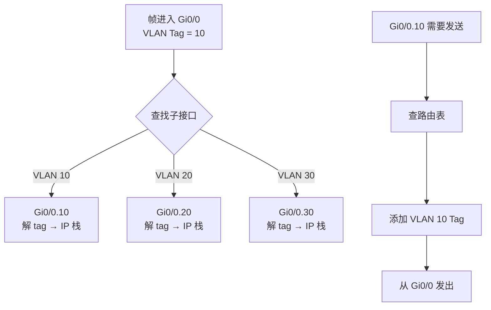
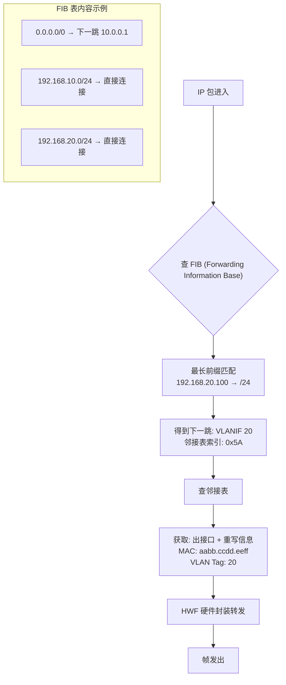
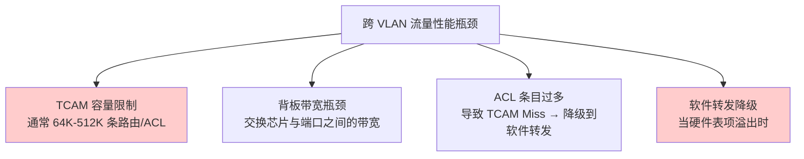

# VLAN 深度探索 Ch3: VLAN 间路由

VLAN（Virtual Local Area Network）通过逻辑分段将物理网络划分为多个广播域，有效控制了广播风暴的扩散。然而，VLAN 划分的代价是：不同 VLAN 之间的主机无法直接通信，因为二层隔离阻断了一切跨 VLAN 的流量。VLAN 间路由（Inter-VLAN Routing）正是解决这一矛盾的关键技术——它在保持 VLAN 广播隔离的同时，为不同广播域之间的单播流量提供转发路径。

本文是 VLAN 深度探索系列的第三章（Ch1 讲述 VLAN 基础与 802.1Q 封装，Ch2 讲解 VLAN 间 trunk 与 VTP/STP 关系），聚焦于 VLAN 间路由的技术原理、硬件架构、配置实战与故障排查。

---

## 1. 为什么 VLAN 间需要路由

### 1.1 VLAN 的隔离模型

VLAN 的本质是在二层头部插入 VLAN Tag，通过 VLAN ID 区分不同虚拟局域网。同一 VLAN 内的帧可以自由泛洪交换，而不同 VLAN 的帧在二层完全隔离——交换机不会将 VLAN 10 的帧泛洪到 VLAN 20 的端口。

```
┌─────────────────────────────────────────────────────────┐
│                    物理交换机                            │
│  ┌─────────┐                           ┌─────────┐       │
│  │ VLAN 10 │◄──── 二层泛洪 ────────────►│ VLAN 20 │       │
│  │  PC-A   │                           │  PC-B   │       │
│  └─────────┘                           └─────────┘       │
│       │                                     │           │
│       │ 同一 VLAN 内通信                     │           │
│       ▼                                     ▼           │
│  ┌─────────────────────────────────────────────┐         │
│  │         二层转发（基于 MAC 地址表）           │         │
│  └─────────────────────────────────────────────┘         │
│                                                         │
│  ┌─────────────────────────────────────────────┐         │
│  │  VLAN 10 帧 ──✗──► VLAN 20（无法到达）       │         │
│  └─────────────────────────────────────────────┘         │
└─────────────────────────────────────────────────────────┘
```

### 1.2 隔离带来的通信困境

考虑一个经典的企业网络场景：

```
┌────────────────────────────────────────────────────────────┐
│  192.168.10.0/24 (VLAN 10)     192.168.20.0/24 (VLAN 20)  │
│  ┌──────────┐                   ┌──────────┐               │
│  │  HR 网段 │                   │  Finance │               │
│  │  PC-A    │                   │  Server  │               │
│  │ .10.100  │                   │ .20.200  │               │
│  └────┬─────┘                   └────┬─────┘               │
└───────┼──────────────────────────────┼────────────────────┘
        │                              │
        │         二层隔离 ✗           │
        ▼                              ▼
   无法直接到达                    无法直接到达
```

- **PC-A**（VLAN 10, IP: `192.168.10.100`）与 **Server-B**（VLAN 20, IP: `192.168.20.200`）处于不同 VLAN。
- PC-A 的 ARP 请求帧无法穿透 VLAN 边界——Server-B 根本收不到这个 ARP。
- 结果：即使网络中存在三层路由能力，如果没有正确配置 VLAN 间路由，跨 VLAN 通信就是不可能的。

### 1.3 路由是跨 VLAN 通信的唯一出路

在 TCP/IP 模型中，跨广播域通信必须经过三层路由。VLAN 间路由的实质是：**让路由器或三层设备成为不同 VLAN 的网关**，在二层隔离之上构建三层可达路径：

```
VLAN 10 主机 ──► [网关: 192.168.10.1] ──路由决策──► [网关: 192.168.20.1] ──► VLAN 20 主机
      │                    ▲                          │                    ▲
      └────────────────────┘                          └────────────────────┘
           路由器的两个子接口/接口                           路由器的两个子接口/接口
           分别属于 VLAN 10 和 VLAN 20
```

**三层设备的核心作用：**

1. 终结 VLAN 的二层广播域（路由器接口不参与 STP，不转发广播帧）
2. 为每个 VLAN 维护独立的 L3 转发信息（L3 FIB / 路由表）
3. 在不同 VLAN 子网间进行路由查找和转发

---

## 2. Router on a Stick（单臂路由）

### 2.1 什么是 Router on a Stick

Router on a Stick（也称"单臂路由"）是最经典的 VLAN 间路由实现方式。其核心思想是：**使用一台路由器的一个物理接口，通过子接口（Subinterface）承载多个 VLAN 的三层网关功能**，所有跨 VLAN 流量都经过这条物理链路。

名称中的 "Stick" 源自这种拓扑的形象描述——路由器的多个子接口像一根棍子上的多个分支，全部挂载在同一个物理接口上。

### 2.2 拓扑结构

```
                    ┌──────────────────────────────────────┐
                    │              Router                  │
                    │   ┌─────────────────────────────┐   │
                    │   │  Gi0/0.10  (VLAN 10 GW)      │   │
                    │   │  192.168.10.1/24             │   │
                    │   └──────────┬──────────────────┘   │
                    │              │                       │
                    │   ┌──────────┴──────────────────┐   │
                    │   │  Gi0/0.20  (VLAN 20 GW)      │   │
                    │   │  192.168.20.1/24             │   │
                    │   └──────────┬──────────────────┘   │
                    │              │                       │
                    │   ┌──────────┴──────────────────┐   │
                    │   │  Gi0/0.30  (VLAN 30 GW)      │   │
                    │   │  192.168.30.1/24             │   │
                    │   └──────────┬──────────────────┘   │
                    └──────────────┼──────────────────────┘
                                   │ Trunk (802.1Q)
                                   │◄── 所有 VLAN 流量共用一条物理链路
                    ┌──────────────┼──────────────────────┐
                    │              │                       │
                    │    ┌─────────┴────────┐              │
                    │    │    Switch         │              │
                    │    │  VLAN 10 | Gi1   │              │
                    │    │  VLAN 20 | Gi2   │              │
                    │    │  VLAN 30 | Gi3   │              │
                    │    └─────────────────┘              │
                    │  Access: PC-A(V10) PC-B(V20) PC-C(V30)
                    └──────────────────────────────────────┘
```

### 2.3 802.1Q 子接口封装原理

子接口是逻辑接口，每个子接口配置一个 802.1Q VLAN ID。当路由器子接口收到带 VLAN Tag 的帧时：

1. **解封装过程（Ingress）**：物理接口收到 802.1Q 帧 → 根据 VLAN ID 查找对应子接口 → 剥离 VLAN Tag，还原为标准以太网帧 → 送至子接口的 IP 栈处理
2. **封装过程（Egress）**：子接口需要发送帧到某 VLAN → 查路由表决定出接口 → 将帧交给物理接口 → 物理接口根据子接口对应的 VLAN ID 添加 802.1Q Tag → 从同一物理接口发出



### 2.4 Router on a Stick 的关键限制

**带宽瓶颈**：所有 VLAN 间流量共用一条物理链路。假设 VLAN 10 的 PC 和 VLAN 20 的 Server 之间的流量达到 800Mbps，而该链路的物理带宽为 1Gbps，这部分流量会占据 80% 的链路带宽。虽然未超过链路容量，但如果同时有 VLAN 10→VLAN 30、VLAN 20→VLAN 30 等多股流量汇聚，就可能发生拥塞。

**延迟增加**：每个跨 VLAN 流量都需要经过：交换机→路由器→交换机的两跳（往返四段链路），而两次经过交换机增加了处理延迟（尤其是在交换机还需要进行 VLAN Tag 转换的情况下）。

**单点故障**：一台路由器承担所有 VLAN 间路由，如果该路由器故障，所有 VLAN 间通信同时中断。

---

## 3. 交换机虚拟接口（SVI）

### 3.1 SVI 的概念

SVI（Switch Virtual Interface）是三层交换机上的 VLAN 虚拟接口。在二层交换机上，VLAN 只是一个二层概念；而在三层交换机上，可以为每个 VLAN 创建 SVI，并为 SVI 分配 IP 地址——这个 IP 地址就成为该 VLAN 的三层网关。

```
┌─────────────────────────────────────────────────────────────┐
│                    三层交换机                                 │
│  ┌─────────────────────────────────────────────────────┐    │
│  │  SVI VLAN 10          SVI VLAN 20          SVI VLAN 30│   │
│  │  192.168.10.1/24      192.168.20.1/24      192.168.30.1/24│ │
│  └─────────────────────────────────────────────────────┘    │
│        │                  │                  │             │
│  ──────┴──────────────────┴──────────────────┴─────────     │
│                         二层交换芯片                          │
│        ◄──────────── VLAN 内部交换 ───────────►             │
└─────────────────────────────────────────────────────────────┘
```

### 3.2 SVI 与 Router on a Stick 的本质区别

| 特性     | Router on a Stick    | 三层交换机 SVI       |
| -------- | -------------------- | -------------------- |
| 部署形态 | 路由器+交换机分离    | 单一三层交换设备     |
| 流量路径 | 交换机→路由器→交换机 | 交换机芯片内部完成   |
| 转发延迟 | 高（两次跨设备）     | 低（芯片级转发）     |
| 带宽占用 | 所有流量走 trunk     | 内部背板带宽         |
| 扩展性   | 受路由器接口数限制   | 受交换机 VLAN 数限制 |
| 成本     | 需额外采购路由器     | 集成在三层交换机内   |

### 3.3 华为 / 华三 SVI 配置

#### 华为设备（VLANIF 接口）

```网络配置
# 创建 VLAN
[Huawei] vlan batch 10 20 30

# 将接口加入 VLAN
[ Huawei]interface GigabitEthernet 0/0/1
[Huawei-GigabitEthernet0/0/1] port link-type access
[Huawei-GigabitEthernet0/0/1] port default vlan 10
[Huawei-GigabitEthernet0/0/1] quit

[ Huawei]interface GigabitEthernet 0/0/2
[Huawei-GigabitEthernet0/0/2] port link-type access
[Huawei-GigabitEthernet0/0/2] port default vlan 20
[Huawei-GigabitEthernet0/0/2] quit

# 创建 VLANIF（三层 SVI）
[ Huawei]interface Vlanif 10
[Huawei-Vlanif10] ip address 192.168.10.1 255.255.255.0
[Huawei-Vlanif10] quit

[ Huawei]interface Vlanif 20
[Huawei-Vlanif20] ip address 192.168.20.1 255.255.255.0
[Huawei-Vlanif20] quit

# 验证 VLANIF 状态
[ Huawei]display ip interface brief | include Vlanif
Vlanif10            192.168.10.1/24     up              up
Vlanif20            192.168.20.1/24     up              up
```

#### 华三设备（H3C VLAN 接口）

```网络配置
# 创建 VLAN
[H3C] vlan 10
[H3C-vlan10] quit
[H3C] vlan 20
[H3C-vlan20] quit

# 将接口加入 VLAN
[H3C] interface GigabitEthernet 1/0/1
[H3C-GigabitEthernet1/0/1] port link-type access
[H3C-GigabitEthernet1/0/1] port access vlan 10
[H3C-GigabitEthernet1/0/1] quit

# 创建 VLAN 接口（三层）
[H3C] interface Vlan-interface 10
[H3C-Vlan-interface10] ip address 192.168.10.1 24
[H3C-Vlan-interface10] quit

[H3C] interface Vlan-interface 20
[H3C-Vlan-interface20] ip address 192.168.20.1 24
[H3C-Vlan-interface20] quit

# 验证
[H3C]display ip interface brief | include Vlan
Vlan10              192.168.10.1/24     up              up
Vlan20              192.168.20.1/24     up              up
```

### 3.4 SVI 的 up/down 状态解析

SVI 状态是 VLAN 间路由能否正常工作的关键。很多工程师遇到过"配置了 VLANIF 但 SVI 是 down 的"问题——根源在于**SVI 的状态依赖于该 VLAN 是否至少有一个物理端口处于 up 状态**。

```bash
# Cisco: 检查 SVI 状态
show interfaces status vlan 10

# 华为: 检查 VLANIF 状态
display interface Vlanif 10

# 华三: 检查 VLAN 接口状态
display interface Vlan-interface 10
```

**SVI down 的常见原因：**

| 原因                          | 说明                                                                         |
| ----------------------------- | ---------------------------------------------------------------------------- |
| VLAN 内无 active 端口         | 所有该 VLAN 的 access/trunk 端口均 down，或端口虽然 up 但连接的对端设备 down |
| VLAN 未创建                   | 三层交换机上未创建对应的 VLAN                                                |
| VLAN 被 shutdown              | 华为/华三可对 VLANIF 执行 shutdown                                           |
| VLAN 加入了 Err-Disabled 状态 | 端口由于 BPDU Guard 等原因进入错误禁用状态                                   |

---

## 4. 三层交换机架构

### 4.1 二层与三层交换机的架构差异

传统二层交换机只有一个转发平面——所有帧基于 MAC 地址表在 ASIC 芯片内完成转发。

三层交换机则在二层交换芯片之上叠加了一个路由引擎（Routing Engine）和一个三层转发平面：

```
┌──────────────────────────────────────────────────────────────────┐
│                        三层交换机整体架构                          │
│                                                                  │
│  ┌────────────────────────────────────────────────────────────┐  │
│  │                      控制平面 (Control Plane)               │  │
│  │   ┌──────────────┐  ┌──────────────┐  ┌──────────────────┐  │  │
│  │   │  CPU (MIPS/  │  │    OSPF/     │  │    RIP / BGP     │  │  │
│  │   │  ARM / x86)  │  │   IS-IS     │  │   路由协议       │  │  │
│  │   └──────┬───────┘  └──────────────┘  └──────────────────┘  │  │
│  │          │ 路由表 / RIB 更新                                  │  │
│  │          ▼                                                    │  │
│  │   ┌──────────────────────────────────────────────────────┐  │  │
│  │   │               路由信息库 (RIB)                        │  │  │
│  │   │     192.168.10.0/24  ──► 下一跳/VLANIF20             │  │  │
│  │   │     192.168.20.0/24  ──► 下一跳/VLANIF10             │  │  │
│  │   └──────────────────────────────────────────────────────┘  │  │
│  └────────────────────────────────────────────────────────────┘  │
│                              │                                   │
│                              ▼                                   │
│  ┌────────────────────────────────────────────────────────────┐  │
│  │                      转发平面 (Forwarding Plane)            │  │
│  │                                                          │  │
│  │   ┌─────────────────────┐    ┌────────────────────────┐  │  │
│  │   │    ASIC 芯片        │    │    TCAM (Ternary CAM)  │  │  │
│  │   │   二层 MAC 地址表    │    │   ACL / 路由查找 / L3  │  │  │
│  │   │   VLAN / STP 逻辑   │    │   FIB 转发信息库       │  │  │
│  │   └─────────────────────┘    └────────────────────────┘  │  │
│  │                                                            │  │
│  │   ┌────────────────────────────────────────────────────┐  │  │
│  │   │            硬件转发引擎 (HWF / CEF Engine)          │  │  │
│  │   │  首包: CPU → 路由查找 → 生成缓存 → HWF 转发        │  │  │
│  │   │  后续包: HWF 直接查硬件表转发 (零 CPU 中断)          │  │  │
│  │   └────────────────────────────────────────────────────┘  │  │
│  └────────────────────────────────────────────────────────────┘  │
└──────────────────────────────────────────────────────────────────┘
```

### 4.2 ASIC 与 TCAM 的分工

#### ASIC（二层转发）

ASIC（Application Specific Integrated Circuit）是专用转发芯片，专注于高速二层帧处理：

- **MAC 地址表查找**：基于目的 MAC 地址，查找出接口
- **VLAN 处理**：VLAN Tag 添加/剥离，VLAN 成员判断
- **STP 状态机**：生成树协议的计算与端口状态维护
- **QoS 标记**：DSCP/CoS 字段修改

ASIC 的特点是**线速转发**（Wire-speed），即在不损失任何帧的情况下以物理链路速率处理所有帧。但 ASIC 本身只能处理已编程好的固定逻辑，无法灵活适应新协议。

#### TCAM（三层查找）

TCAM（Ternary Content Addressable Memory，三态内容寻址内存）是三层交换机实现硬件路由查找的核心组件。

与普通 RAM 的精确匹配不同，TCAM 支持**掩码匹配**——这是实现最长前缀匹配（Longest Prefix Match, LPM）路由查找的关键。

```c
// TCAM 工作原理示意（概念代码）
// 32-bit IPv4 地址查找，掩码宽度可变

struct tcam_entry {
    uint32_t ip_address;      // IP 地址
    uint32_t mask;            // 掩码（1 = 关心位，0 = 不关心位）
    uint8_t  valid;           // 条目有效性
    uint8_t  result;          // 下一跳 ID / 出接口
};

// 查找过程：TCAM 同时比较所有条目
// 例如: 查找 192.168.20.100
// 192.168.20.0/24 的掩码: 255.255.255.0 = 0xFFFFFF00
// 192.168.0.0/16 的掩码: 255.255.0.0   = 0xFFFF0000
// 所有条目并行比较，第一个匹配条目返回结果
```

**TCAM 的关键优势：**

| 特性     | 说明                                             |
| -------- | ------------------------------------------------ |
| 并行查找 | 一次时钟周期完成所有条目并行匹配                 |
| 掩码支持 | 原生支持变长掩码，无需软件遍历路由表             |
| ACL 存储 | 可同时存储 ACL/QoS 规则，实现硬件级包过滤        |
| 容量限制 | TCAM 条目数量有限（通常 64K-512K），是扩展性瓶颈 |

### 4.3 路由缓存机制

三层交换机引入了路由缓存（Route Cache）来加速数据包转发。在 CEF（后面详述）架构中，路由缓存由 FIB 和邻接表（Adjacency Table）构成：

```
┌─────────────────┐       ┌─────────────────┐
│      FIB        │       │   邻接表         │
│ (Forwarding     │       │ (Adjacency      │
│  Information    │       │  Table)         │
│  Base)          │       │                 │
├─────────────────┤       ├─────────────────┤
│ 192.168.10.0/24 │       │ MAC: aabb.ccdd  │
│  ──► VLANIF 10  │       │ Port: Gi0/1     │
│                 │       │ Encap: 802.1Q   │
│ 192.168.20.0/24 │       │ VLAN: 20        │
│  ──► VLANIF 20  │       └─────────────────┘
└─────────────────┘
        │
        ▼
  硬件转发引擎 (HWF)
```

---

## 5. 硬件转发流程（MLS / CEF / HWF）

### 5.1 Cisco MLS（多层交换）架构演进

Cisco 的多层交换经历了三代技术演进：

| 阶段   | 技术名称                       | 转发方式                        | CPU 依赖      |
| ------ | ------------------------------ | ------------------------------- | ------------- |
| 第一代 | 过程交换 (Process Switching)   | 每个包都经过 CPU 软件处理       | 100% CPU      |
| 第二代 | 快速转发 (Fast Switching)      | 首包 CPU 查路由表，后续包查缓存 | 首包 CPU      |
| 第三代 | CEF (Cisco Express Forwarding) | 分布式硬件转发（FIB + 邻接表）  | 极低 CPU 占用 |

### 5.2 CEF 转发机制详解

CEF（Cisco Express Forwarding）是目前三层交换机最主流的硬件转发架构。其核心思想是：**将路由查找和帧封装解耦为两个独立的表，通过分布式转发实现线速性能**。



#### FIB 的构建过程

```
路由表 (RIB)                     FIB (硬件表)
─────────────────────           ──────────────────────────
0.0.0.0/0  ─────────────────►   [0.0.0.0/0 → gi0/1]
192.168.10.0/24 ─────────────►  [192.168.10.0/24 → local]
192.168.20.0/24 ─────────────►  [192.168.20.0/24 → gi0/2]

路由协议（OSPF/IS-IS/BGP）         TCAM 芯片（硬件查找）
更新 RIB ──────────────────────►  FIB 同步
```

### 5.3 邻接表（Adjacency Table）

邻接表存储每个直连网络的二层封装信息。当 FIB 查到下一跳后，需要邻接表提供完整的二层封装参数：

```c
// 邻接表条目结构（概念定义）
struct adjacency_entry {
    uint16_t  vlan_id;           // 出接口所属 VLAN
    mac_addr  next_hop_mac;      // 下一跳 MAC 地址
    mac_addr  src_mac;          // 源 MAC（交换机自身接口 MAC）
    uint16_t  ethertype;         // 0x0800 = IPv4, 0x86DD = IPv6
    uint8_t   l3_len;            // IP 头部长度
    void      *tx_ring_ptr;      // 发送队列指针
};
```

### 5.4 HWF（Hardware Forwarding Engine）

HWF 是实际执行硬件封装的引擎。数据包从 ASIC 进入后，经过以下处理流程：

```
┌────────────────────────────────────────────────────────────────────┐
│                      数据包硬件转发流程                              │
│                                                                    │
│  1. ASIC 接收帧，解析 L3 头部                                       │
│            │                                                       │
│            ▼                                                       │
│  2. IP 头校验 (Header Checksum)                                     │
│            │                                                       │
│            ▼                                                       │
│  3. 目的 IP 送入 TCAM 并行查找 FIB                                  │
│     (一个时钟周期完成最长前缀匹配)                                    │
│            │                                                       │
│            ▼                                                       │
│  4. 根据 FIB 结果查邻接表 → 获取 L2 重写信息                          │
│            │                                                       │
│            ▼                                                       │
│  5. ASIC 执行 L2 封装 (MAC 替换 + VLAN Tag 添加)                     │
│            │                                                       │
│            ▼                                                       │
│  6. 帧从目标端口发出                                                 │
│                                                                    │
│  全程无需 CPU 介入，延迟仅受 ASIC 流水线深度影响（通常 < 10μs）          │
└────────────────────────────────────────────────────────────────────┘
```

### 5.5 VLAN 间路由的 ASIC 内部路径

当 VLAN 10 的主机通过三层交换机的 SVI 路由到 VLAN 20 时，帧在 ASIC 内部经历以下路径：

```
VLAN 10 帧进入
     │
     ▼
┌─────────────┐
│  ASIC Port  │  解 802.1Q Tag → VLAN 10
└──────┬──────┘
       │ VLAN 10
       ▼
┌─────────────┐
│ MAC 地址表   │  查目的 MAC = SVI VLAN 10 的 MAC
│   查找       │  → 命中 SVI（本地三层接口）
└──────┬──────┘
       │ 命中 SVI
       ▼
┌─────────────┐
│   TCAM      │  目的 IP 非本机 IP，执行路由查找
│  路由查找    │  192.168.20.x → 匹配 192.168.20.0/24
└──────┬──────┘
       │ 下一跳 = VLANIF 20
       ▼
┌─────────────┐
│  邻接表      │  VLANIF 20 MAC + Server MAC
│   查找       │  VLAN Tag = 20
└──────┬──────┘
       │ L2 重写信息
       ▼
┌─────────────┐
│  ASIC Port  │  添加 VLAN 20 Tag，替换 MAC 头
│   发送      │  帧从 VLAN 20 的端口发出
└─────────────┘
```

---

## 6. VLAN 间路由配置实战

### 6.1 Cisco IOS 配置

#### Router on a Stick 配置

```网络配置
! 路由器配置
!
interface GigabitEthernet0/0
 description Trunk to Switch
 no ip address          ! 物理接口不配 IP（IP 在子接口）
 duplex auto
 speed auto
!
! 子接口 - VLAN 10
interface GigabitEthernet0/0.10
 description VLAN 10 Gateway
 encapsulation dot1Q 10    ! 绑定 VLAN 10
 ip address 192.168.10.1 255.255.255.0
 ip helper-address 192.168.100.10  ! DHCP 中继
!
! 子接口 - VLAN 20
interface GigabitEthernet0/0.20
 description VLAN 20 Gateway
 encapsulation dot1Q 20    ! 绑定 VLAN 20
 ip address 192.168.20.1 255.255.255.0
!
! 子接口 - VLAN 30
interface GigabitEthernet0/0.30
 description VLAN 30 Gateway
 encapsulation dot1Q 30
 ip address 192.168.30.1 255.255.255.0
!
! 启用 CEF
ip cef
!
! 验证命令
show ip cef
show interfaces trunk
show vlans
```

#### 三层交换机 SVI 配置

```网络配置
! 三层交换机配置
!
ip routing              ! 必须开启三层路由功能
!
! VLAN 创建
vlan 10
 name HR_NETWORK
!
vlan 20
 name FINANCE_NETWORK
!
! 配置 SVI（三层接口）
interface Vlan10
 ip address 192.168.10.1 255.255.255.0
 no shutdown
!
interface Vlan20
 ip address 192.168.20.1 255.255.255.0
 no shutdown
!
! 分配端口
interface GigabitEthernet0/1
 description PC-A (VLAN 10)
 switchport mode access
 switchport access vlan 10
 spanning-tree portfast
!
interface GigabitEthernet0/2
 description Server-B (VLAN 20)
 switchport mode access
 switchport access vlan 20
 spanning-tree portfast
!
! 可选：启用 CEF
ip cef
!
! 验证命令
show ip interface brief
show interfaces status
show cdp neighbors
show ip cef
```

### 6.2 华为设备配置

```网络配置
<Huawei> system-view
[Huawei] sysname L3-Switch
[Huawei] vlan batch 10 20 30

! 配置 VLAN 10 的 Access 端口
[Huawei] interface GigabitEthernet 0/0/1
[Huawei-GigabitEthernet0/0/1] port link-type access
[Huawei-GigabitEthernet0/0/1] port default vlan 10
[Huawei-GigabitEthernet0/0/1] quit

! 配置 VLAN 20 的 Access 端口
[Huawei] interface GigabitEthernet 0/0/2
[Huawei-GigabitEthernet0/0/2] port link-type access
[Huawei-GigabitEthernet0/0/2] port default vlan 20
[Huawei-GigabitEthernet0/0/2] quit

! 配置 VLANIF（三层 SVI）
[Huawei] interface Vlanif 10
[Huawei-Vlanif10] ip address 192.168.10.1 24
[Huawei-Vlanif10] quit

[Huawei] interface Vlanif 20
[Huawei-Vlanif20] ip address 192.168.20.1 24
[Huawei-Vlanif20] quit

! 启用 VLAN 间路由（华为默认已开启，无需额外命令）
[Huawei] display ip routing-table

! Trunk 端口配置（如果接上层设备）
[Huawei] interface GigabitEthernet 0/0/24
[Huawei-GigabitEthernet0/0/24] port link-type trunk
[Huawei-GigabitEthernet0/0/24] port trunk allow-pass vlan 10 20 30
[Huawei-GigabitEthernet0/0/24] quit

! 验证
[Huawei] display vlan
[Huawei] display ip interface brief
[Huawei] display interface Vlanif 10
[Huawei] ping 192.168.20.200
```

### 6.3 Juniper EX 配置

Juniper 使用 `irb`（Integrated Routing and Bridging）接口作为 VLAN 三层网关，这与 Cisco/华为的 SVI 概念类似。

```网络配置
# 提交编辑模式
edit
set system host-name L3-EX
set vlans HR vlan-id 10
set vlans HR l3-interface irb.10
set vlans Finance vlan-id 20
set vlans Finance l3-interface irb.20

# 配置 IRB 接口（三层网关）
set interfaces irb unit 10 family inet address 192.168.10.1/24
set interfaces irb unit 20 family inet address 192.168.20.1/24

# 将端口加入 VLAN
set interfaces ge-0/0/1 unit 0 family ethernet-switching vlan members HR
set interfaces ge-0/0/2 unit 0 family ethernet-switching vlan members Finance

# 启用 RPF 检查（可选）
set interfaces irb unit 10 family inet rpf-check

# 提交
commit check
commit

# 验证命令
run show interfaces terse | match irb
run show vlans
run show route
run ping 192.168.20.200
```

---

## 7. 性能对比：软件转发 vs 硬件转发

### 7.1 性能指标对比

| 指标         | 软件转发 (Process/Fast Switching) | 硬件转发 (CEF/ASIC)  |
| ------------ | --------------------------------- | -------------------- |
| 转发延迟     | 100-500 μs/包                     | < 10 μs/包           |
| 吞吐量       | 数百 Kpps - 数 Mpps               | 线速 (Wire-speed)    |
| CPU 占用     | 极高 (每个包都中断 CPU)           | 极低 (< 5%)          |
| 扩展性       | 受 CPU 性能限制                   | 受 TCAM 容量限制     |
| ACL/QoS 深度 | 受软件性能影响                    | 硬件并行查找         |
| 路由抖动收敛 | 快                                | 需 FIB 重新编程 TCAM |

### 7.2 线速转发条件

"线速转发"（Wire-speed / Line-rate）意味着交换机的转发能力等于所有端口带宽之和，不丢包。三层交换机实现线速 VLAN 间路由需要满足：

```
线速转发带宽 = min(ASIC 转发容量, TCAM 查找速率, 背板带宽, 端口带宽)

例如：48 端口 GE + 4 端口 10GE 的三层交换机
理论线速 = 48×1Gbps + 4×10Gbps = 88Gbps

ASIC 容量需 ≥ 88Gbps
TCAM 查找需 ≥ 88Gbps（实际 TCAM 查找速率 >> ASIC 带宽）
背板带宽需 ≥ 88Gbps
```

### 7.3 性能瓶颈分析



---

## 8. 首包优化与流程（CEF / 快速转发 / 降级路径）

### 8.1 首包处理的完整流程

三层交换机的数据包处理分为"首包路径"和"后续包路径"两个阶段：

```
┌─────────────────────────────────────────────────────────────┐
│                       首包处理流程                            │
│                                                             │
│  帧进入 ASIC                                                  │
│       │                                                      │
│       ▼                                                      │
│  ASIC 解析 IP 头 ──► 目的 IP 查 TCAM-FIB                      │
│                          │                                   │
│             ┌─────────────┴─────────────┐                    │
│             │ 命中（通常情况）            │ 未命中             │
│             ▼                          ▼                    │
│      HWF 硬件直接转发            CPU 中断处理                  │
│      (极低延迟)                   (Process Switching)        │
│                                        │                     │
│                                        ▼                     │
│                                  查 RIB（路由表）              │
│                                        │                     │
│                                        ▼                     │
│                                  添加到 FIB 缓存              │
│                                        │                     │
│                                        ▼                     │
│                              后续包 → HWF 硬件转发             │
└─────────────────────────────────────────────────────────────┘
```

### 8.2 CEF 的分布式转发架构

现代大型三层交换机（如 Cisco Catalyst 6500/6800、华为 S57/S67 系列）采用分布式 CEF 架构，在每个线卡上独立实现硬件转发：

```
┌─────────────────────────────────────────────────────────────┐
│                    分布式 CEF 架构                            │
│                                                             │
│  ┌─────────────┐   ┌─────────────┐   ┌─────────────┐        │
│  │  Line Card 1 │   │  Line Card 2 │   │  Line Card 3 │        │
│  │  ┌─────────┐ │   │  ┌─────────┐ │   │  ┌─────────┐ │        │
│  │  │ ASIC    │ │   │  │ ASIC    │ │   │  │ ASIC    │ │        │
│  │  │ TCAM    │ │   │  │ TCAM    │ │   │  │ TCAM    │ │        │
│  │  │ Local   │ │   │  │ Local   │ │   │  │ Local   │ │        │
│  │  │ FIB     │ │   │  │ FIB     │ │   │  │ FIB     │ │        │
│  │  └─────────┘ │   │  └─────────┘ │   │  └─────────┘ │        │
│  └──────┬───────┘   └──────┬───────┘   └──────┬───────┘        │
│         │                  │                  │                │
│         └──────────────────┼──────────────────┘                │
│                            │                                   │
│                   ┌────────┴────────┐                         │
│                   │   Centralized    │                         │
│                   │   Route Processor │                         │
│                   │   (Supervisor)    │                         │
│                   │   RIB / 路由协议  │                         │
│                   └────────┬────────┘                         │
│                            │                                   │
│              路由表更新 ───►│◄── FIB 同步                       │
│                   ┌────────┴────────┐                         │
│                   │   Central FIB   │                         │
│                   │   (TCAM)         │                         │
│                   └─────────────────┘                         │
└─────────────────────────────────────────────────────────────┘
```

### 8.3 降级路径（Fallback）

当硬件转发路径出现问题时，三层交换机会自动降级到软件转发：

| 降级触发条件       | 降级影响                                     |
| ------------------ | -------------------------------------------- |
| TCAM 满            | ACL/路由查找失败 → 软件查 RIB → 转发性能下降 |
| FIB 条目不存在     | 首次路由 → CPU 处理 → 之后加入 FIB           |
| ACL 条目深度过深   | TCAM 查找超时 → 降级到软件过滤               |
| ASIC 错误/端口错误 | 该端口流量切换到软件转发                     |

```bash
# Cisco: 检查 CEF 状态和降级计数
show cef not-cef-switched
show platform activity tcam

# 华为: 检查转发模式
display cpu-defend statistics

# Juniper: 检查转发引擎
show chassis forwarding
```

---

## 9. VLAN 间路由的广播域问题

### 9.1 路由器作为广播边界

路由器（或三层交换机的 SVI）在 VLAN 间路由中的关键作用之一是**终结广播域**。路由器不转发广播帧——ARP 请求、Browser 广播、DHCP 广播等都会被路由器在 VLAN 接口处终结，不会穿透到其他 VLAN。

```
┌────────────────────────────────────────────────────────────┐
│                    广播域边界示意                             │
│                                                            │
│   VLAN 10 广播域              VLAN 20 广播域                 │
│  ┌─────────────┐             ┌─────────────┐               │
│  │ ARP 请求     │             │ ARP 请求     │               │
│  │ 192.168.10.x │             │ 192.168.20.x │               │
│  │ ✗ 不会穿过   │──── Router ──►│ ✗ 不会穿过  │               │
│  │ 路由器边界   │     SVI      │  路由器边界  │               │
│  └─────────────┘             └─────────────┘               │
│                                                            │
│   路由器每个接口属于独立的广播域                               │
└────────────────────────────────────────────────────────────┘
```

### 9.2 广播隔离与单播路由的平衡

VLAN 间路由实现了**广播隔离 + 单播可达**的平衡：

| 流量类型        | VLAN 10 主机视角       | 路由器处理          | VLAN 20 主机视角 |
| --------------- | ---------------------- | ------------------- | ---------------- |
| 广播 (ARP/DHCP) | 可发送/收到            | **终结**，不转发    | 收不到           |
| 组播            | 可发送/收到            | 按组播路由转发      | 可选择性收到     |
| 单播 (本 VLAN)  | 直接通过交换机二层交换 | 不经过 SVI          | 收不到           |
| 单播 (跨 VLAN)  | 发往网关 → 路由转发    | **转发**到目标 VLAN | 直接收到         |

### 9.3 跨 VLAN 通信中的 ARP 与 MAC 行为

跨 VLAN 路由时，源主机的 ARP 表和交换机的 MAC 表会记录不同的信息：

```
场景: PC-A (VLAN 10, IP: .10.100) ──► Server-B (VLAN 20, IP: .20.200)

PC-A 的 ARP 表:
  192.168.10.1    →  MAC of VLANIF 10 (网关 MAC)
  (192.168.20.200 不在 ARP 表中——PC-A 不需要知道 Server-B 的 MAC)

PC-A 发出的帧:
  Src MAC: PC-A MAC
  Dst MAC: 网关 VLANIF 10 MAC    ← 这是关键：指向网关
  Src IP:  .10.100
  Dst IP:  .20.200

三层交换机 SVI (VLANIF 10) 收到帧后:
  查路由表 → 192.168.20.0/24 直接连接在 VLANIF 20
  重写 L2 头:
    Src MAC: VLANIF 20 MAC      ← 替换为 VLAN20 接口的 MAC
    Dst MAC: Server-B MAC        ← 需要 ARP 解析才能得到

交换机 MAC 表更新:
  VLAN 10: PC-A MAC → Port 1
  VLAN 20: Server-B MAC → Port 2
```

---

## 10. 故障排查

### 10.1 故障排查总流程

```
┌──────────────────────────────────────────────────────────────┐
│                  VLAN 间路由故障排查流程                        │
│                                                              │
│  1. 连通性问题 ──► 2. SVI/接口状态 ──► 3. 路由表检查            │
│                                                              │
│         │                    │                   │          │
│         ▼                    ▼                   ▼          │
│   ping 网关           show ip int brief       show ip route  │
│   ping 目标           SVI is UP?              路由条目存在？   │
│                                                              │
│  4. ACL 检查 ──► 5. 二层连通性 ──► 6. 硬件转发状态              │
│                                                              │
│         │                    │                   │          │
│         ▼                    ▼                   ▼          │
│   show access-lists    show mac address-table  show cef     │
│   ACL 命中了吗？        MAC 学习正常？          CEF 正常？     │
└──────────────────────────────────────────────────────────────┘
```

### 10.2 常见故障场景与解决方案

#### 故障场景 1: SVI 状态为 Down

**症状**：`ping` 网关 IP 超时，SVI 接口 `show interfaces` 显示 `Vlanif10 is down`。

**排查步骤**：

```bash
# Cisco
show interfaces status vlan 10
show spanning-tree interface GigabitEthernet0/1

# 华为
display interface Vlanif 10
display vlan 10

# 华三
display interface Vlan-interface 10
display vlan 10
```

**常见原因**：

| 原因                  | Cisco 解决方案                                  | 华为/华三 解决方案            |
| --------------------- | ----------------------------------------------- | ----------------------------- |
| VLAN 内无 active 端口 | 确保至少有一个 access 口 up + connected 设备 up | 确保端口 up 且无 err-disabled |
| VLAN 未创建           | `vlan 10`                                       | `vlan batch 10`               |
| VLAN 被 shutdown      | `no shutdown vlan 10`                           | `undo vlan 10` 删除重建       |
| STP 阻塞端口          | 正常现象，等待 30-50s；或配置 PortFast          | 正常                          |

#### 故障场景 2: 路由表正常但 ping 不通

**症状**：`show ip route` 有目标网段路由，但跨 VLAN 通信失败。

**排查步骤**：

```bash
# 1. 检查 ACL 是否命中
show access-lists
show ip access-lists

# Cisco: 检查是否有 ACL 应用到 SVI
show ip interface Vlan10

# 华为: 检查 traffic-filter
display traffic-filter applied

# 2. 检查 ARP 表（是否有 MAC 学习问题）
show arp
display mac-address

# 3. 检查是否有 Proxy ARP 问题
show ip interface Vlan10 | include Proxy
```

#### 故障场景 3: Router on a Stick 子接口不工作

**症状**：路由器上 `show vlans` 显示子接口正常，但流量不过去。

**排查步骤**：

```bash
# Cisco: 检查 trunk 链路状态
show interfaces GigabitEthernet0/0 trunk
show interfaces GigabitEthernet0/0 switchport

# 检查 802.1Q 封装是否匹配
# 路由器侧: encapsulation dot1Q 10
# 交换机侧: switchport trunk allowed vlan 10

# 华为: 检查 trunk 配置
display port vlan GigabitEthernet 0/0/1

# 常见问题：native VLAN 不匹配
# 交换机 trunk 默认为 VLAN 1，路由器如果没配置 native VLAN
# 就会有通信问题
```

#### 故障场景 4: 特定流量不通（ACL 问题）

**症状**：`ping` 成功但 `telnet`/`http` 失败，或某些端口不通。

```bash
# Cisco: 检查扩展 ACL
show access-lists
show ip access-lists | begin <acl_name>

# 检查应用方向（in/out）
show ip interface Vlan10 | include access-list

# 华为: 检查 traffic-filter
display traffic-filter interface Vlanif 10

# 华三: 检查 packet-filter
display packet-filter interface Vlan-interface 10
```

#### 故障场景 5: 硬件转发降级（性能问题）

**症状**：刚配置时通信正常，一段时间后变慢；或特定时间段拥塞。

```bash
# Cisco: 检查 CEF 降级
show cef not-cef-switched
show platform ip cef

# 查看 TCAM 利用率
show tcam utilization

# 华为: 检查转发模式
display cpu-defend statistics
display forward-plane statistics

# Juniper: 检查转发引擎
show chassis forwarding
show fabric plane
```

### 10.3 华为/华三常用排障命令速查

```bash
# 华为 - VLANIF 状态与路由
display ip interface brief Vlanif
display ip routing-table
display mac-address
display arp
display vlan

# 华为 - ACL 与安全
display acl all
display traffic-filter
display cpu-defend statistics

# 华为 - 转发路径追踪
tracert 192.168.20.200

# 华三 - 综合检查
display interface Vlan-interface 10
display vlan 10
display mac-address
display ip routing-table
display qos policy interface

# 华三 - 转发平面
display cpu-usage
display memory
display arp
```

---

## 总结

VLAN 间路由是园区网最重要的基础技术之一。从本文的分析可以看出，技术选型本质上是在**灵活性、成本、性能、运维复杂度**之间的权衡：

- **Router on a Stick** 适合小型网络或作为临时方案，配置简单但性能有限。
- **三层交换机 SVI** 是现代园区网的事实标准，硬件转发提供线速性能，控制平面与转发平面分离。
- **分布式 CEF/HWF 架构** 使得大型三层交换机能支撑数十万条路由的硬件查找，同时将 CPU 从繁重的包处理中解放出来。

理解 VLAN 间路由的底层原理——TCAM 的最长前缀匹配、FIB 与邻接表的协作、硬件转发流水线的降级路径——不仅有助于网络工程师做出更精准的排障决策，也为理解更复杂的 SD-WAN、VXLAN EVPN 路由等技术奠定了基础。Ch4 我们将探讨 VLAN 与 VXLAN Overlay 网络的融合——当 VLAN 遇上 SDN。

---

_本文属于《VLAN 深度探索》系列_

- Ch1: [VLAN 基础与 802.1Q 封装原理]()
- Ch2: [VLAN Trunk 与 STP/VTP 关系]()
- Ch3: VLAN 间路由（即本文）
- Ch4: [VLAN 与 VXLAN Overlay 网络融合]()（待续）
