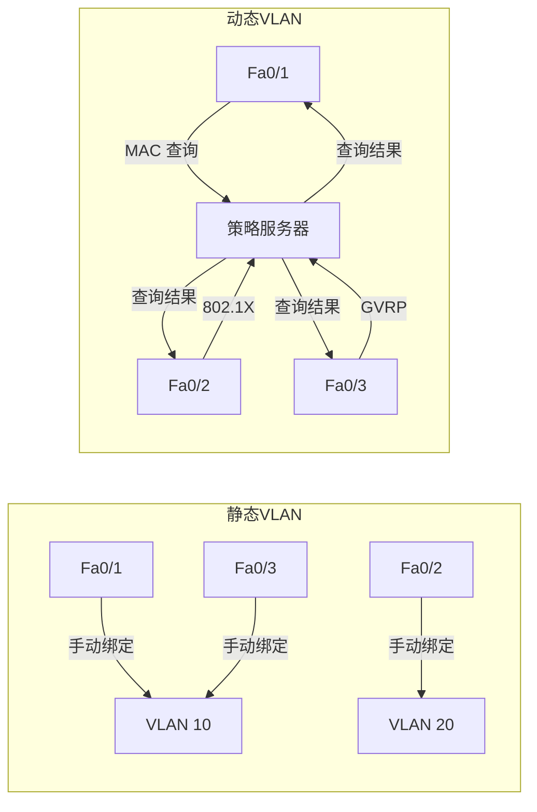
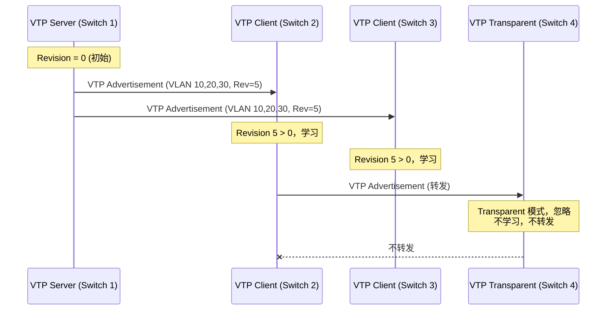
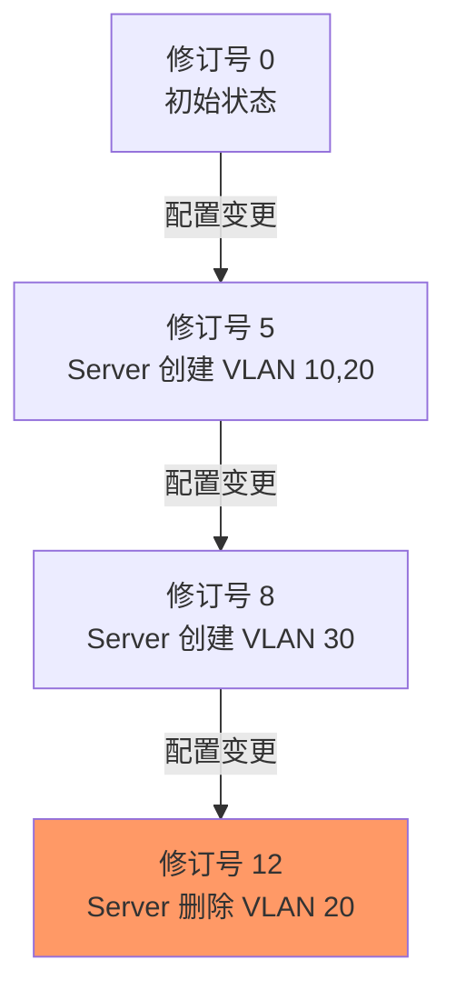
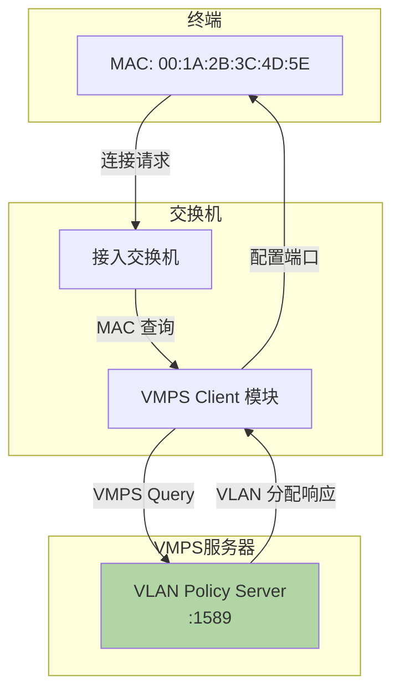
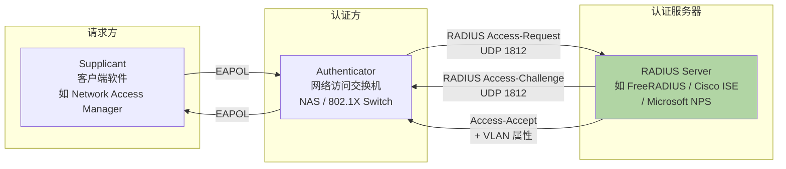
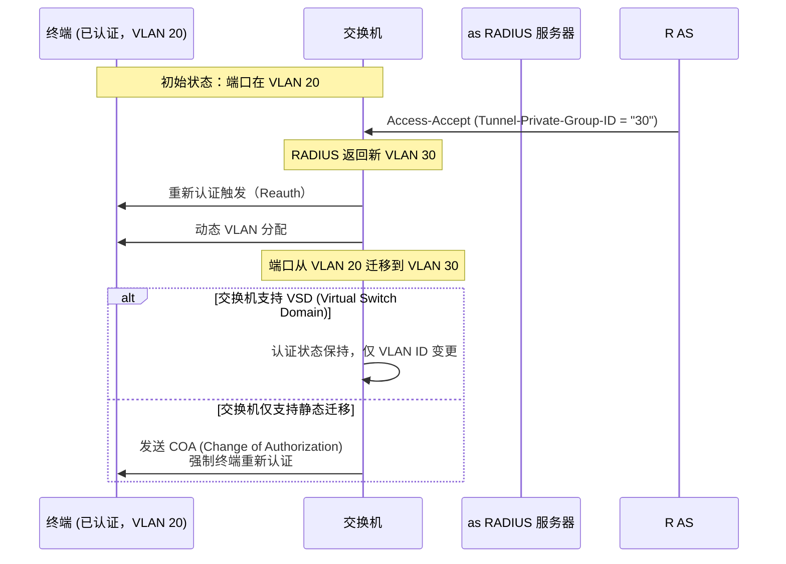
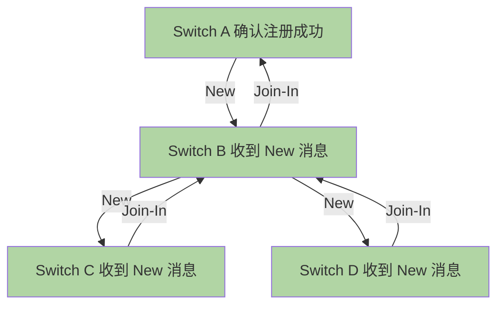
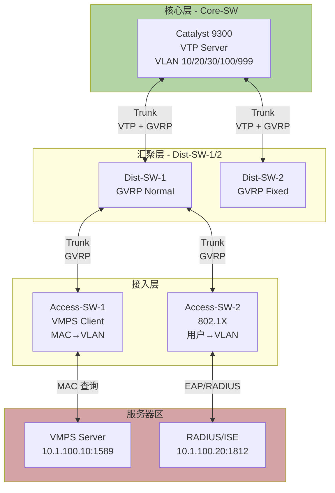
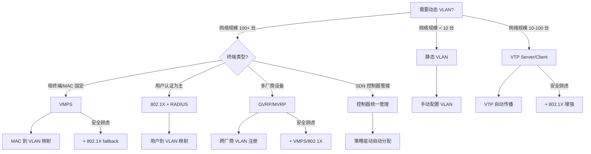
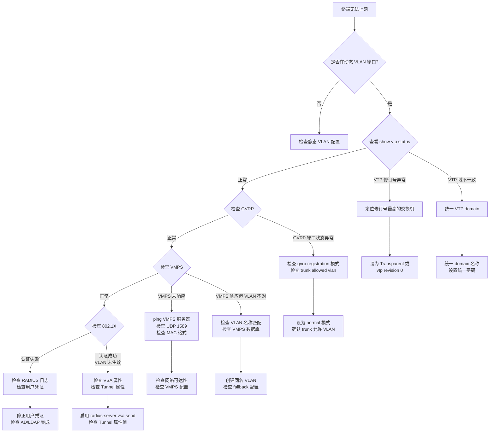

# VLAN 深度探索 Ch4: 动态 VLAN 与协议详解

> 系列文章索引：[Ch1: VLAN 基础与端口模式](/vlan-deep-dive-ch1-basics) | [Ch2: Trunk 协议与 VLAN 标记机制](/vlan-deep-dive-ch2-trunk) | [Ch3: VLAN 间路由与三层交换](/vlan-deep-dive-ch3-routing) | Ch4: 动态 VLAN 与协议详解

## 1. 静态 VLAN vs 动态 VLAN

### 1.1 核心概念对比

在企业网络规模较小时，管理员通常采用**静态 VLAN**——即手动将交换机的每个端口划入特定 VLAN。这种方式直观可控，但随着网络规模扩张，维护成本呈线性增长：一个拥有 500 台接入交换机的园区网，任何 VLAN 策略变更都意味着逐台登录修改。

**动态 VLAN** 将端口与 VLAN 的映射关系外部化，由**策略服务器**根据接入终端的属性（MAC 地址、用户名、协议类型等）自动决定该端口应属于哪个 VLAN。终端移动位置后，网络自动重新识别，无需人工干预。



### 1.2 三种动态 VLAN 识别机制

| 机制 | 识别依据 | 典型应用场景 | 标准化程度 | 优点 | 缺点 |
|------|---------|-------------|-----------|------|------|
| **MAC-based VLAN** | 终端 MAC 地址 | 哑终端/物联网设备 | 部分标准化（VMPS） | 设备移动后自动跟随 | MAC 地址数据库维护复杂 |
| **Protocol-based VLAN** | 二层协议类型（IP/IPX/AppleTalk） | 多协议共存环境 | 私有 | 多协议环境天然隔离 | 协议支持有限，现代网络已少用 |
| **Policy-based VLAN（802.1X）** | 用户认证 + RADIUS 属性 | 企业园区网准入 | IEEE 标准 | 精细化访问控制，用户驱动 | 需要部署 RADIUS基础设施 |

### 1.3 静态 VLAN 的局限性

```网络配置
! Cisco 静态 VLAN 配置（接入层交换机）
interface FastEthernet0/1
 switchport mode access
 switchport access vlan 10          ! 手动绑定，终端位置变更时需重新配置
 spanning-tree portfast

interface FastEthernet0/2
 switchport mode access
 switchport access vlan 20          ! 每台交换机、每个端口逐一配置
 spanning-tree portfast
```

当网络规模达到数十台交换机时，上述模式的弊端显而易见：

- **扩展性差**：新增 VLAN 需要逐台交换机配置
- **移动性差**：用户换座位后 VLAN 不跟随
- **一致性差**：人工配置容易出现版本差异
- **故障率高**：人为错误导致网络隔离失败

### 1.4 动态 VLAN 的完整架构图

```mermaid
flowchart TD
    subgraph 接入层
        SW1[接入交换机]
        SW2[接入交换机]
    end
    
    subgraph 控制平面
        VTP_S[VTP Server<br/>VLAN 信息传播]
        GVRP[GVRP/MVRP<br/>VLAN 注册传播]
        VMPS_S[VMPS Server<br/>MAC→VLAN 映射]
        RADIUS[RADIUS Server<br/>用户→VLAN 映射]
    end
    
    subgraph 终端
        EP1[哑终端<br/>00:1A:2B:3C:4D:5E]
        EP2[员工笔记本<br/>user@corp.com]
        EP3[IoT 传感器]
    end
    
    EP1 -->|MAC 地址| SW1
    EP2 -->|802.1X EAPOL| SW2
    EP3 -->|MAC 地址| SW2
    
    SW1 -->|MAC 查询| VMPS_S
    SW2 -->|MAC 查询| VMPS_S
    SW2 -->|RADIUS Access-Request| RADIUS
    SW1 -->|VTP 同步| VTP_S
    SW1 -->|GVRP 注册| GVRP
    SW2 -->|GVRP 注册| GVRP
    
    VMPS_S -->|VLAN ID| SW1
    VMPS_S -->|VLAN ID| SW2
    RADIUS -->|Access-Accept<br/>+ Tunnel 属性| SW2
```

---

## 2. VTP：VLAN Trunking Protocol

### 2.1 协议概述

VTP（VLAN Trunking Protocol）是 Cisco 的私有协议，用于在同一个 VTP 域（domain）内的交换机之间**自动分发和同步 VLAN 信息**。管理员只需在一台 VTP Server 上创建 VLAN，其他交换机自动学习，无需逐台配置。

VTP 的设计哲学是**简化大型网络的 VLAN 管理**。在没有 VTP 的环境中，一个新 VLAN 的部署需要管理员登录每一台交换机并手动创建；在有 VTP 的环境中，管理员只需在 Server 上创建一次，域内所有 Client 自动同步。



### 2.2 VTP 消息类型

VTP 有三种核心消息类型，理解它们是排查 VTP 问题的关键：

| 消息类型 | 触发条件 | 传播行为 |
|---------|---------|---------|
| **Summary Advertisement** | Server/Client 每 5 分钟周期性发送，或触发式发送 | 携带 VTP 域名、修订号、配置哈希 |
| **Subset Advertisement** | Server 上 VLAN 配置变更时 | 携带完整的 VLAN 详细信息（名称、VLAN ID、SAID、MTU 等）|
| ** Advertisement Request** | Client 收到 Summary 后发现修订号高于本地 | 请求 Server 发送完整的 Subset |

```
VTP 完整同步流程：

[交换机启动或新加入]
  → 发送 Advertisement Request
  → Server 回复 Summary + Subset Advertisement
  → Client 更新本地 VLAN 数据库
  
[VLAN 配置变更]
  → Server 发送 Subset Advertisement（包含变更详情）
  → 域内所有 Client 更新本地副本
```

### 2.3 VTP 模式详解

VTP 支持三种工作模式，理解它们的差异是正确部署的前提：

| 模式 | 能创建 VLAN | 能修改 VLAN | 能删除 VLAN | 发送 VTP 广告 | 学习 VTP 广告 | 典型用途 |
|------|-----------|------------|------------|--------------|--------------|---------|
| **Server** | ✅ | ✅ | ✅ | ✅ | ✅ | 核心/汇聚层，VLAN 管理入口 |
| **Client** | ❌ | ❌ | ❌ | ✅（转发）| ✅ | 接入层，纯 VLAN 信息消费者 |
| **Transparent** | ✅（本地有效）| ✅（本地有效）| ✅（本地有效）| ❌ | ❌（不学习）| 隔离域、扩展 VLAN 支持 |

```网络配置
! VTP 配置示例

! --- Switch 1 (Server) ---
vtp mode server              ! 默认模式
vtp domain CampusNetwork     ! 必须在同一域内才能互信
vtp password cisco123        ! 推荐设置密码防止误加交换机

! --- Switch 2 (Client) ---
vtp mode client
vtp domain CampusNetwork
vtp password cisco123

! --- Switch 3 (Transparent，仅本地 VLAN 管理）---
vtp mode transparent
vtp domain CampusNetwork     ! Transparent 模式仍需域名为其他交换机转发广告
```

**Server 模式**是默认模式，也是最常用的模式。**Transparent 模式**常用于：
- 需要本地管理 VLAN 但不希望影响整个域的场景
- VTP 版本 1/2 不支持扩展 VLAN（1006-4094），需用 Transparent 透传
- 测试环境中隔离特定交换机
- 安全要求极高的域边界交换机（防止意外覆盖）

### 2.4 VTP 域的安全考量

VTP 域的边界应当与网络管理边界一致。加入一个已存在 VTP 域的新交换机，如果其 revision 号高于域内现有交换机，会**静默覆盖整个域的 VLAN 数据库**——这是一个极其危险的安全隐患。

```网络配置
! 查看 VTP 状态
show vtp status

! 示例输出：
! VTP Version                     : 2
! Configuration Revision           : 24      <-- 关键字段，越高越新
! Maximum VLANs supported locally  : 255
! VTP domain name                  : CampusNetwork
! VTP pruning mode                : Disabled
! VTP V2 Mode                      : Enabled
! VTP Traps Generation            : Disabled
! Device ID                       : 0012.3456.7890

! 查看 VTP 密码（如果配置了）
show vtp password

! 查看 VLAN 详细信息
show vlan brief
show vlan
```

### 2.5 VTP Pruning（VLAN 修剪）

VTP Pruning 是 VTP 的一项优化功能，可以减少不必要的广播泛洪。当某 VLAN 在某交换机上没有任何活动端口时，VTP Pruning 会阻止该 VLAN 的流量通过该交换机。

```网络配置
! 在 Server 上启用 VTP Pruning
vtp pruning

! 验证 pruning 状态
show vtp status | include pruning
```

```
未启用 Pruning：
Switch-A (VLAN 10 有成员) → Switch-B (VLAN 10 无成员) → Switch-C (VLAN 10 有成员)
广播包从 A 到 C 会经过 B，即使 B 上没有 VLAN 10 成员

启用 Pruning 后：
Switch-A (VLAN 10 有成员) → Switch-B (VLAN 10 无成员) → 修剪掉，不转发广播
Switch-A (VLAN 10 有成员) → Switch-C (VLAN 10 有成员)  ← 直接路径
```

---

## 3. VTP 修订号机制

### 3.1 修订号（Revision Number）原理

VTP 依靠**修订号**判断 VLAN 信息的新旧。每当 Server 对 VLAN 数据库做任何修改（创建/删除/重命名 VLAN），修订号就会递增。Client 收到广告后，如果发现对方修订号更高，就用广告中的 VLAN 数据库**完全替换**本地数据库。



**修订号递增规则**：
- 创建 VLAN：修订号 +1
- 修改 VLAN（包括重命名、修改 MTU 等）：修订号 +1
- 删除 VLAN：修订号 +1
- 即使配置未变，重新启动 Server 不会重置修订号

### 3.2 修订号导致的安全事故场景

**最危险的场景**：一台重置后的小交换机被接入网络。

```
事故链：
1. 交换厂测试架上有一台 Switch-X，revision=50（曾做过大量 VLAN 测试）
2. Switch-X 重置后（revision 恢复为 0），被错误地接入生产网络
3. Switch-X 加入 VTP 域后，发现域内其他交换机 revision=15
4. Switch-X 以更高的 revision 广告 VLAN 数据库（空数据库）
5. 整个 CampusNetwork 域内所有 Server/Client 的 VLAN 10/20/30 全部消失
6. 数百个端口瞬间失去网络连接

恢复步骤：
1. 立即断开问题交换机的 trunk 连接
2. 在 VTP Server 上执行 vtp revision 0（VTPv3）或重建所有 VLAN
3. 确认所有交换机修订号一致
4. 逐步恢复 trunk 连接
```

这种事故在生产环境中并不罕见，解决方案：

```网络配置
! 方案 1：启用 VTP 修订号重置（VTP 版本 3）
! VTP 版本 3 支持修订号重置和修订号告警
vtp version 3

! 方案 2：在所有交换机上设置 VTP 密码（防止未授权交换机加入）
vtp password <secret>

! 方案 3：将不可控的接入交换机设置为 Transparent 模式
vtp mode transparent
```

### 3.3 VTP 版本对比

| 特性 | VTPv1 | VTPv2 | VTPv3 |
|------|-------|-------|-------|
| 扩展 VLAN（1006-4094）| ❌ | ❌ | ✅ |
| 支持令牌环 | ✅ | ✅ | ✅ |
| 修订号一致性检查 | 简单 | 简单 | 增强（支持重置）|
| 认证方式 | 密码（明文传输）| 密码（MD5）| 密码（MD5）+ 隐藏 |
| 服务器角色转换 | 无限制 | 无限制 | 支持显式降级 |
| 支持 MSTP 兼容 | ❌ | ✅ | ✅ |
| 配置文件要求 | VLAN 数据库 | VLAN 数据库 | 主服务器数据库 |

```网络配置
! VTPv3 配置（Catalyst 9000 系列）
vtp version 3
vtp mode server

! 设置为主服务器（Primary Server，用于执行修订号变更）
vtp primary

! 修订号管理：重置为 0（当需要安全地重新开始时）
vtp revision 0

! 查看 VTPv3 增强功能
show vtp status
! VTP3 Primary Server ID : 0012.3456.7890
! Boot in Secondary Mode : No
```

### 3.4 VTP 与扩展 VLAN

VTPv1 和 VTPv2 有 255 个 VLAN 本地限制，且只能管理 VLAN 1-1005。VLAN 1006-4094（扩展 VLAN）无法通过 VTPv1/v2 管理，只能在 Transparent 模式下本地创建。

```网络配置
! 查看支持的 VLAN 范围
show vlan local

! VTPv1/v2 尝试创建扩展 VLAN
vlan 1006
! 错误：Extended VLANs not allowed in VTP Server mode

! 解决方案：切换到 VTPv3
vtp version 3
vlan 1006  ! 现在可以了
```

---

## 4. GVRP：GARP VLAN Registration Protocol

### 4.1 协议定位

GVRP（GARP VLAN Registration Protocol）是 IEEE 标准协议（802.1D 的一部分），与 Cisco 私有的 VTP 不同，GVRP 是**多厂商通用**的 VLAN 注册协议。它基于 GARP（Generic Attribute Registration Protocol）框架，提供动态的 VLAN 注册/注销功能。

GVRP 的设计目标是**替代手动 VLAN 配置**，让交换机通过协议消息自动学习对端有哪些活跃 VLAN。与 VTP 的 Server-Client 单向传播不同，GVRP 是**双向的注册/注销**机制。

### 4.2 GVRP vs VTP 核心差异

| 维度 | VTP | GVRP |
|------|-----|------|
| 标准化 | Cisco 私有 | IEEE 802.1D |
| 方向 | Server→Client 单向传播 | 双向注册/注销 |
| 交换机角色 | Server/Client/Transparent | 注册器（Registrar）有三种模式 |
| VLAN 传播范围 | 整个 VTP 域 | 整个桥接网络（STP 域）|
| 设备发现 | 需手动配置 domain | 自动发现 |
| 配置同步 | Server 端集中配置 | 分布式的 Join/Leave 机制 |
| 删除传播 | Server 删除 → 自动传播删除 | 需要显式 Leave 消息 |

### 4.3 GVRP 工作机制

GVRP 通过三种消息类型完成 VLAN 注册：

- **Join 消息**：端口申请加入特定 VLAN
- **Leave 消息**：端口申请退出特定 VLAN  
- **LeaveAll 消息**：周期性清理，触发端口重新注册

```mermaid
flowchart LR
    subgraph Switch_A
        PA1[Port 1] -->|Join(VLAN 10)| G1[GVRP]
        PA2[Port 2] -->|Leave(VLAN 20)| G1
    end
    
    subgraph Switch_B  
        PB1[Port 1] --> G2[GVRP]
        PB2[Port 2] --> G2
    end
    
    G1 <-->|Trunk 链路<br/>GVRP 广告| G2
    
    style G1 fill:#b1d5a4
    style G2 fill:#b1d5a4
```

GVRP 在 Trunk 链路上运行，自动将本地注册的 VLAN 信息传播到对端交换机。当一端交换机收到对端发来的 Join 消息后，会在本地的对应端口上注册该 VLAN，同时将 Join 消息继续传播到其他 Trunk 端口。

### 4.4 GVRP 端口状态机

GVRP 的每个端口都有一个状态机，理解它有助于排查注册问题：

```
端口状态：
  - In: 该端口已注册到指定 VLAN（可以收发该 VLAN 的流量）
  - Empty: 该端口没有注册任何 VLAN
  - Registered (Not In): 该端口在对端注册了 VLAN，但本地没有端口属于该 VLAN

申请人状态：
  - Very Anxious: 端口需要注册 VLAN，等待 Join 响应
  - Quiet: 端口已完成注册，维持状态
  - Leaving: 端口正在注销 VLAN
```

---

## 5. GVRP 注册模式（Normal / Fixed / Forbidden）

### 5.1 三种注册模式详解

GVRP 的每端口注册模式决定了该端口对 VLAN 注册请求的行为：

| 模式 | 行为描述 | 适用场景 | 风险等级 |
|------|---------|---------|---------|
| **Normal** | 动态注册/注销，接收对端 Join/Leave | 标准的动态端口 | 中 |
| **Fixed** | 仅传播本地创建的 VLAN，不接受远程注册 | 上联口、静态 VLAN 端口 | 低 |
| **Forbidden** | 不注册任何 VLAN（除 VLAN 1）| 安全隔离、拒绝动态注册 | 最低 |

```网络配置
! Cisco 交换机 GVRP 配置
vtp mode transparent              ! GVRP 要求 VTP 设为 transparent

! 全局启用 GVRP
girp enable

! 接口级别的 GVRP 配置
interface GigabitEthernet0/1
 switchport mode trunk
 gvrp enable                       ! 该 Trunk 端口启用 GVRP
 gvrp registration normal          ! Normal 模式（默认）

interface GigabitEthernet0/2
 switchport mode trunk
 gvrp enable
 gvrp registration fixed          ! Fixed 模式——只传播本地 VLAN，不接受远程注册

interface GigabitEthernet0/3
 switchport mode trunk
 gvrp enable
 gvrp registration forbidden      ! Forbidden 模式——拒绝动态注册
```

### 5.2 实际部署建议

```
接入层交换机 A <----Trunk（GVRP Normal）----> 汇聚层交换机 B

场景：接入层某终端发送 GARP广播（VLAN 10），请求注册
- 如果汇聚层对应端口是 Normal：该请求被接受，VLAN 10 在汇聚层注册
- 如果汇聚层对应端口是 Fixed：该请求被拒绝，VLAN 10 不会传播到汇聚层
- 如果汇聚层对应端口是 Forbidden：完全拒绝，VLAN 10 不会在该端口出现
```

**推荐实践**：
- 上联端口（朝向汇聚层）：使用 **Fixed** 模式，避免接入设备污染汇聚层 VLAN 表
- 终端接入端口：使用 **Normal** 模式，支持动态 VLAN 上线
- 特殊安全端口：使用 **Forbidden** 模式，强制仅使用本地配置的 VLAN
- DSW（分布层交换机）之间：使用 **Normal** 模式，确保 VLAN 完整传播

### 5.3 GVRP 定时器

GVRP 的行为受多个定时器控制，理解它们有助于微调协议行为：

| 定时器 | 默认值 | 作用 |
|--------|--------|------|
| Join Timer | 200ms | 发送 Join 消息的间隔 |
| Hold Timer | 10ms | 抑制多次 Join 消息的阈值 |
| Leave Timer | 600ms | 收到 Leave 消息后等待重新 Join 的时间 |
| LeaveAll Timer | 10000ms | 周期性触发 LeaveAll，清理所有注册 |

```网络配置
! 调整 GVRP 定时器（一般不需要修改）
! 在全局或接口下配置
girp timer join 300
girp timer leave 800
girp timer leaveall 12000
girp timer hold 20

! 查看定时器
show girp timers
```

---

## 6. VMPS：VLAN Management Policy Server

### 6.1 架构概述

VMPS 是 Cisco 提供的基于 **MAC 地址到 VLAN** 映射的动态 VLAN 解决方案。与 802.1X（基于用户认证）不同，VMPS 仅依据终端的 MAC 地址做 VLAN 分配，不需要用户登录凭证。

VMPS 的典型应用场景是**哑终端网络**（如 IP 电话、打印机、物联网传感器），这些设备没有 802.1X 客户端，无法进行用户认证，但可以通过 MAC 地址白名单实现 VLAN 隔离。



### 6.2 VMPS 数据库格式

VMPS 服务器端维护一个文本格式的数据库，定义 MAC 地址到 VLAN 的映射规则：

```网络配置
! vmps config file (vmpsd.conf)
! 格式：VMPS domain <domain-name>
!       VMPS mode {open | secure}
!       VMPS fallback <vlan-name>
!       MAC_ADDRESS VLAN_NAME

VMPS domain CampusNetwork

! 安全模式：未找到 MAC 时拒绝接入（secure 模式）
VMPS mode secure

! Fallback VLAN：未知 MAC 的默认归属（需谨慎使用）
VMPS fallback Guest_VLAN

! --- MAC -> VLAN 映射条目 ---
! 研发部设备
00:1A:2B:3C:4D:5E Engineering_VLAN
00:1A:2B:3C:4D:6F Engineering_VLAN

! 财务部设备
00:AA:BB:CC:DD:EE Finance_VLAN

! 营销部设备
00:11:22:33:44:55 Marketing_VLAN

! IoT 设备
00:55:66:77:88:99 IoT_Devices
00:55:66:77:88:AA IoT_Devices

! --- 端口组策略（基于交换机端口的策略）---
VMPS port-group AccessSwitches
  00:1A:2B:3C:4D:5E Engineering_VLAN
  00:AA:BB:CC:DD:EE Finance_VLAN
```

### 6.3 VMPS 安全模式对比

| 模式 | 未知 MAC 处理 | 优点 | 缺点 |
|------|-------------|------|------|
| **open** | 划入 fallback VLAN | 允许白名单外的设备有基本网络 | 未授权设备可能被放入 Guest VLAN |
| **secure** | 端口进入 err-disabled 状态 | 最高安全性，未授权设备完全隔离 | 设备更换 MAC 后需要管理员介入 |

**安全建议**：生产环境应使用 **secure 模式**，而非 fallback VLAN。Fallback VLAN 会导致未授权设备被放入 Guest VLAN，如果 Guest VLAN 策略不当，可能造成安全漏洞。

### 6.4 VMPS 配置（交换机端）

```网络配置
! 接入交换机配置
vtp mode transparent              ! VMPS 需要 VTP transparent 模式

! 指定 VMPS 服务器地址（最多 3 台）
vmps server 10.1.100.10 primary   ! 主服务器
vmps server 10.1.100.11           ! 备用服务器

! 启用动态 VLAN（需要 802.1Q trunk）
interface FastEthernet0/1
 switchport mode dynamic auto      ! 或 switchport mode access + vmps enable
 switchport mode access
 vmps enable                       ! 该端口启用 VMPS 动态 VLAN

! 查看 VMPS 状态
show vmps
show vmps server
show vmps statistics

! 手动重新验证 VMPS 映射（定时任务或故障排查时使用）
vmps reconfirm
```

### 6.5 VMPS 工作流程详解

```
VMPS 查询完整流程：

1. 终端接入，交换机检测到 MAC 地址（通过 ARP / 数据帧）
2. 交换机向 VMPS 服务器发送 VLAN Query 消息（UDP 1589）
   - 包含：查询类型（VMPS Query）、源交换机名、源端口、目标 MAC

3. VMPS 服务器查找本地数据库
   - 找到匹配项 → 返回 VMPS Answer (VLAN ID)
   - 未找到匹配项 → 根据模式返回 fallback VLAN 或拒绝

4. 交换机收到响应
   - 成功 → 将端口划入指定 VLAN
   - 失败 → 根据配置处理（fallback VLAN 或 err-disable）

5. 定期重新验证（默认每 60 秒，可配置）
   vmps reconfirm interval <minutes>
```

---

## 7. 802.1X 与 VLAN 分配

### 7.1 协议框架

802.1X 是 **IEEE 802.1X** 标准定义的**端口-based 网络访问控制（Port-based NAC）**协议。它使用 **EAP（Extensible Authentication Protocol）** 作为认证框架，最常见的承载方式是 **EAPOL（EAP over LAN）**，运行在二层网络上。

802.1X 的核心组件是**三实体架构**：



### 7.2 802.1X 认证流程详解

```
1. 端口初始化 → 设为 unauthorized（未授权状态），仅允许 EAPOL 流量通过
2. 终端接入，发送 EAPOL-Start
3. 交换机发送 EAP-Request/Identity（询问用户名）
4. 终端回复 EAP-Response/Identity（用户名）
5. 交换机封装为 RADIUS Access-Request 转发给 RADIUS 服务器
6. RADIUS 服务器Challenge（MD5-Challenge 或 EAP-MSCHAPv2）
7. 交换机透传 Challenge 给终端
8. 终端响应 Challenge（包含加密的凭证）
9. 交换机转发给 RADIUS 服务器验证
10. RADIUS 服务器验证成功，发送 Access-Accept + 
    Tunnel-Private-Group-ID (VLAN ID) + Tunnel-Type (VLAN)
11. 交换机根据 VLAN ID 将端口划入对应 VLAN，设为 authorized
```

### 7.3 EAP 类型与选择

802.1X 支持多种 EAP 认证类型，选择时需考虑安全性和兼容性：

| EAP 类型 | 安全性 | 客户端兼容性 | 备注 |
|---------|--------|------------|------|
| **EAP-MD5** | 低（MD5 哈希）| 广泛 | 已不推荐，存在离线破解风险 |
| **EAP-MSCHAPv2** | 中 | Windows 内置 | 需要证书或 PEAP 保护 |
| **PEAP-MSCHAPv2** | 高 | 广泛 | 建议的生产方案 |
| **EAP-TLS** | 最高 | 需要证书 | 双向证书认证，部署复杂 |
| **EAP-TTLS** | 高 | 良好 | 服务端证书认证，客户端可选 |
| **FAST** | 高 | Cisco 设备 | Cisco 专有，支持 PAC |

### 7.4 RADIUS 属性与 VLAN 分配

RADIUS 服务器通过标准属性向交换机下发 VLAN 信息。关键在于正确设置 Tunnel 属性：

```bash
# FreeRADIUS users 文件中的 VLAN 分配配置
# 格式：用户名 Cleartext-Password := "密码", Reply-Message := "OK"
#       Tunnel-Type = VLAN,
#       Tunnel-Medium-Type = IEEE-802,
#       Tunnel-Private-Group-ID = "VLAN编号"

# ============================================
# 研发部用户 -> VLAN 10
# ============================================
engineering_user Cleartext-Password := "EngPass123"
    Reply-Message = "Authentication Successful",
    Tunnel-Type = 13,
    Tunnel-Medium-Type = 6,
    Tunnel-Private-Group-ID = "10"

# ============================================
# 财务部用户 -> VLAN 20
# ============================================
finance_user Cleartext-Password := "FinPass456"
    Reply-Message = "Finance Access",
    Tunnel-Type = 13,
    Tunnel-Medium-Type = 6,
    Tunnel-Private-Group-ID = "20"

# ============================================
# 营销部用户 -> VLAN 30
# ============================================
marketing_user Cleartext-Password := "MktPass789"
    Reply-Message = "Marketing Access",
    Tunnel-Type = 13,
    Tunnel-Medium-Type = 6,
    Tunnel-Private-Group-ID = "30"

# ============================================
# 组匹配方式（基于 AD/LDAP 组）
# ============================================
DEFAULT   Huntgroup-Name == "engineering", Auth-Type := Accept
    Reply-Message = "Engineering Group Access",
    Tunnel-Type = 13,
    Tunnel-Medium-Type = 6,
    Tunnel-Private-Group-ID = "10"

DEFAULT   Huntgroup-Name == "finance", Auth-Type := Accept
    Reply-Message = "Finance Group Access",
    Tunnel-Type = 13,
    Tunnel-Medium-Type = 6,
    Tunnel-Private-Group-ID = "20"
```

关键属性说明：
- **Tunnel-Type = 13**（代表 VLAN，IANA 分配的值）
- **Tunnel-Medium-Type = 6**（代表 IEEE 802，即以太网）
- **Tunnel-Private-Group-ID** = VLAN ID（字符串格式，可以是数字或 VLAN 名称）

### 7.5 Guest VLAN 与 Restricted VLAN

802.1X 的一大优势是可以根据认证结果将终端分配到不同策略的 VLAN：

| VLAN 类型 | 触发条件 | 典型用途 | 网络访问权限 |
|----------|---------|---------|-------------|
| **Guest VLAN** | 终端不支持 802.1X（未安装客户端）| 自助门户、补丁服务器 | 仅限内网有限资源 |
| **Restricted VLAN** | 认证失败（密码错误等）| 受限访问，提示安装客户端 | 极度受限 |
| **Critical VLAN** | RADIUS 服务器不可达 | 紧急访问通道 | 降级但可用 |
| **Default VLAN** | Fallback 策略 | 临时接入 | 由策略决定 |

```网络配置
! Cisco 交换机 802.1X + Guest VLAN 配置
aaa new-model
aaa authentication dot1x default group radius

dot1x system-auth-control

interface FastEthernet0/1
 switchport mode access
 dot1x port-control auto           ! 启用 802.1X
 dot1x guest-vlan supplicant       ! 未安装 802.1X 客户端的终端进入 Guest VLAN
 dot1x guest-vlan 100              ! Guest VLAN ID = 100

interface FastEthernet0/2
 switchport mode access
 dot1x port-control auto
 dot1x guest-vlan 100
 dot1x auth-fail vlan 999         ! 认证失败进入 Quarantine VLAN

! 验证 802.1X 状态
show dot1x all
show dot1x interface Fa0/1
show dot1x session-cap interface Fa0/1
```

### 7.6 802.1X 认证的 VLAN 迁移机制

当已认证终端的 VLAN 分配发生变化（如用户从 Engineering 部门调动到 Finance），交换机需要处理**动态 VLAN 迁移**。这个过程比想象中复杂，因为：

1. 端口已经处于 authorized 状态
2. 用户在 RADIUS 服务器上的 VLAN 属性可能发生变化
3. 需要在不中断连接的情况下迁移 VLAN



Cisco 的 **ISE（Identity Services Engine）** 支持发送 **CoA（Change of Authorization）** 消息，触发交换机动态修改已认证会话的 VLAN 属性，无需断开连接。

```
CoA 流程（VLAN 变更）：
1. 管理员在 ISE 上修改用户 VLAN 属性
2. ISE 检测到变化，发送 CoA Request 到交换机
3. 交换机收到 CoA 后，向已认证终端发送重新认证请求
4. 终端响应，交换机再次向 RADIUS 验证
5. RADIUS 返回新的 VLAN 属性
6. 交换机动态调整端口 VLAN，完成迁移
```

### 7.7 802.1X 与 MAB（MAC Authentication Bypass）

对于不支持 802.1X 的哑终端（如打印机、传统设备），可以使用 **MAB（MAC Authentication Bypass）** 作为 fallback：

```网络配置
! MAB 配置
interface FastEthernet0/3
 switchport mode access
 dot1x port-control auto
 dot1x pae authenticator
 mab                        ! 启用 MAB（802.1X 失败后使用 MAC 认证）

! MAB 的工作流程：
! 1. 交换机发送 EAP-Request/Identity
! 2. 终端无响应（N 次重试后）
! 3. 交换机尝试 MAB：用终端 MAC 作为用户名密码查询 RADIUS
! 4. RADIUS 用 MAC 地址匹配策略，返回 VLAN
```

---

## 8. MVRP：Multiple VLAN Registration Protocol

### 8.1 MVRP 定位

MVRP（Multiple VLAN Registration Protocol）是 GVRP 的**继任者**，同样是 IEEE 标准，但做了显著改进。它是 **802.1Q-2011**（即 802.1Qca）中正式标准化的协议，用于在桥接网络中动态注册 VLAN。

MVRP 解决了 GVRP 在大规模部署中的一些性能问题，提供了更高效的机制。 Juniper、Cisco（高端系列）、HP/Aruba 等主流厂商已开始支持 MVRP。

核心改进：
- 更高效的消息编码（减少了协议 overhead）
- 支持 **MMRP（Multiple Multicast Registration Protocol）** 事件驱动的扩展
- 更好的收敛性能
- 兼容 GVRP（GVRP 设备可与 MVRP 设备交互）

### 8.2 MVRP 与 GVRP 对比

| 特性 | GVRP | MVRP |
|------|------|------|
| 标准 | IEEE 802.1D | IEEE 802.1Q-2011 |
| 消息类型 | Join/Leave/LeaveAll | New/Join-In/Join Empty/Leave/LeaveAll |
| 协议效率 | 较低 | 较高（事件驱动增强）|
| 定时器 | 固定（Join 定时器、Hold 定时器等）| 更灵活的定时机制 |
| 厂商支持 | 广泛（Cisco、Juniper 等）| 较新（高端设备支持）|
| 与 GVRP 兼容性 | N/A | 部分兼容（GVRP 设备视为 MVRP Applicant）|

### 8.3 MVRP 消息类型详解

MVRP 定义了 6 种 PDU 类型，每种类型对应不同的注册行为：

| 消息类型 | 触发条件 | 含义 |
|---------|---------|------|
| **New** | 本地 VLAN 被创建 | 通知邻居本交换机创建了新 VLAN |
| **Join-In** | 确认收到邻居的注册请求 | 表示愿意接收该 VLAN 的流量 |
| **Join Empty** | 邻居请求注册一个本地还不存在的 VLAN | 请求本交换机创建该 VLAN |
| **Leave** | 动态注销 VLAN 注册 | 通知邻居不再需要该 VLAN |
| **LeaveAll** | 周期性清理 | 重置所有注册关系 |
| **Empty** | 声明本地没有活跃的 VLAN 注册 | 响应邻居的 Join Empty |



### 8.4 MVRP 配置示例

```网络配置
! Juniper EX 系列 MVRP 配置
set protocols mvrp
set protocols mvrp interface ge-0/0/1.0
set protocols mvrp interface ge-0/0/1.0 registration normal
set protocols mvrp interface ge-0/0/2.0
set protocols mvrp interface ge-0/0/2.0 registration fixed

! 查看 MVRP 状态
show protocols mvrp
show mvrp interface
show mvrp interface ge-0/0/1.0 detail

! Cisco 设备 GVRP（等同效果，Cisco 尚未大规模支持原生 MVRP）
vtp mode transparent
girp enable
interface range Te1/0/1 - 2
 switchport mode trunk
 gvrp enable
 gvrp registration normal
```

### 8.5 MVRP 未来的演进

随着 **SDN（软件定义网络）** 和 **VXLAN（Virtual Extensible LAN）** 的兴起，传统二层 VLAN 注册协议的用武之地逐渐减少。但在纯二层数据中心和传统园区网中，MVRP 仍然是实现 VLAN 自动发现的重要工具。

```
MVRP 适用场景：
✓ 纯二层园区网
✓ 多厂商交换机环境
✓ 需要动态 VLAN 传播但不想用 VTP
✓ 传统数据中心（不支持 VXLAN 的老设备）

MVRP 不适用场景：
✗ SD-Access / DNA Center 管理的网络（控制器统一管理）
✗ VXLAN 环境（使用 L2VNI 自动发现）
✗ 需要精细化 VLAN 策略的场景
```

---

## 9. 动态 VLAN 配置实战

### 9.1 实验拓扑



### 9.2 实战 1：VTP 完整配置（Core-SW）

```网络配置
! =============================================
! Core-SW (VTP Server) - 园区网核心交换机
! 型号：Cisco Catalyst 9300
! =============================================
!
hostname Core-SW
!
! VTP 配置
vtp mode server
vtp domain CampusNetwork
vtp password Str0ngVTPpass!
vtp version 3

! 启用 VTP Pruning（减少不必要的广播泛洪）
vtp pruning

! 创建 VLAN
!
vlan 10
 name Engineering
!
vlan 20
 name Finance
!
vlan 30
 name Marketing
!
vlan 100
 name Guest_VLAN
!
vlan 999
 name Quarantine

! =============================================
! 验证命令
! =============================================
!
! 查看 VTP 状态
show vtp status
! 预期输出：
! VTP Version capable             : 1 to 3
! VTP version running            : 3
! VTP Domain Name                 : CampusNetwork
! VTP Pruning Mode                : Enabled
! VTP Traps Generation            : Disabled
! Device ID                       : 0012.3456.7890
! Configuration last modified by 10.1.1.1 at 15:30:00
!
! 查看 VLAN 概要
show vlan brief
!
! 查看 VTP 密码
show vtp password
!
! 查看 VTP 统计
show vtp counters
```

### 9.3 实战 2：GVRP 配置（Dist-SW-1）

```网络配置
! =============================================
! Dist-SW-1 - 汇聚层交换机
! 型号：Cisco Catalyst 9300
! =============================================
!
hostname Dist-SW-1
!
! VTP 必须为 transparent（GVRP 与 VTP Server 模式互斥）
vtp mode transparent

! 全局启用 GVRP
girp enable

! =============================================
! 上联端口（朝向核心）- Normal 模式
! =============================================
interface GigabitEthernet1/0/1
 description To_Core_SW
 switchport mode trunk
 switchport trunk allowed vlan all
 switchport trunk native vlan 999
 gvrp enable
 gvrp registration normal

! =============================================
! 下联接入交换机端口 - Fixed 模式
! =============================================
interface GigabitEthernet1/0/2
 description To_Access_SW_1
 switchport mode trunk
 switchport trunk allowed vlan all
 gvrp enable
 gvrp registration fixed           ! Fixed：只接受本地已存在的 VLAN 注册

interface GigabitEthernet1/0/3
 description To_Access_SW_2
 switchport mode trunk
 switchport trunk allowed vlan all
 gvrp enable
 gvrp registration fixed

! =============================================
! 验证命令
! =============================================
!
! 查看 GVRP 全局状态
show girp enable
!
! 查看 GVRP 接口统计
show gurp statistics
!
! 查看特定接口 GVRP 状态
show gvrp interface Gi1/0/1
show gvrp interface Gi1/0/1 detail
!
! 预期输出（Gi1/0/1）：
! Port GVRP Enabled  Registration  Last-join  Last-leave
! ---- ------------  ------------  --------  ----------
! Gi1/0/1  Yes        Normal       00:01:23  00:00:00
!
! GVRP 统计信息
show gurp statistics
!
! GVRP 错误统计
show gvrp error
```

### 9.4 实战 3：VMPS 完整配置

**步骤 1：准备 VMPS 数据库文件**

```bash
# 在 Linux 服务器上安装 vmpsd
# apt-get install vmpsd 或从源码编译

# vmpsd.conf 内容（/etc/vmps/vmpsd.conf）
# =========================================
# VMPS 域配置
# =========================================
VMPS domain CampusNetwork

# 安全模式：secure - 未授权 MAC 进入 err-disabled
# open - 未授权 MAC 进入 fallback VLAN
VMPS mode secure

# 未知 MAC 的默认 VLAN（open 模式下生效）
VMPS fallback Quarantine

# =========================================
# MAC -> VLAN 映射
# =========================================

# --- 研发部设备（工程 VLAN）---
# Cisco IP Phone + PC
00:1A:2B:3C:4D:01 Engineering
00:1A:2B:3C:4D:02 Engineering
# 测试设备
00:1A:2B:3C:4D:03 Engineering

# --- 财务部设备（财务 VLAN）---
# 财务专用打印机
00:AA:BB:CC:DD:01 Finance
# 财务 PC
00:AA:BB:CC:DD:02 Finance

# --- 营销部设备（营销 VLAN）---
00:11:22:33:44:01 Marketing
00:11:22:33:44:02 Marketing
00:11:22:33:44:03 Marketing

# --- IoT 设备（隔离 VLAN）---
# 摄像头
00:55:66:77:88:99 IoT_Devices
# 门禁系统
00:55:66:77:88:AA IoT_Devices
# 温控系统
00:55:66:77:88:BB IoT_Devices

# =========================================
# 端口组策略（可选）
# =========================================
VMPS port-group AccessSwitches
  00:1A:2B:3C:4D:01 Engineering
  00:AA:BB:CC:DD:01 Finance
```

**步骤 2：VMPS 服务器启动脚本**

```bash
#!/bin/bash
# vmpsd startup script
# 监听 UDP 1589

# 前台运行（调试）
vmpsd -c /etc/vmps/vmpsd.conf -d -f

# 后台运行（生产）
# nohup vmpsd -c /etc/vmps/vmpsd.conf > /var/log/vmpsd.log 2>&1 &
```

**步骤 3：接入交换机配置（Access-SW-1）**

```网络配置
hostname Access-SW-1
!
vtp mode transparent              ! 必须为 transparent

! =========================================
! VMPS 服务器配置
! =========================================
vmps server 10.1.100.10 primary   ! 主 VMPS 服务器
vmps server 10.1.100.11          ! 备用 VMPS 服务器

! =========================================
! 启用 VMPS 的端口配置
! =========================================
interface FastEthernet0/1
 description Office_Phone
 switchport mode access
 switchport access vlan 10        ! 默认 VLAN（VMPS 查询前）
 spanning-tree portfast
 vmps enable                      ! 该端口启用 VMPS

interface FastEthernet0/2
 description PC_Employee
 switchport mode access
 switchport access vlan 10
 spanning-tree portfast
 vmps enable

interface FastEthernet0/3
 description IoT_Sensor
 switchport mode access
 switchport access vlan 999      ! 隔离区默认
 spanning-tree portfast
 vmps enable

interface FastEthernet0/4
 description Printer
 switchport mode access
 switchport access vlan 10
 spanning-tree portfast
 vmps enable

! =========================================
! 上联端口（需要 trunk 以传递多个 VLAN）
! =========================================
interface GigabitEthernet0/1
 description To_Dist_SW_1
 switchport mode trunk
 switchport trunk allowed vlan all

! =========================================
! VMPS 验证命令
! =========================================
!
! 查看 VMPS 总体状态
show vmps
! 预期输出：
! VMPS Domain Name      : CampusNetwork
! VMPS Server Status    : Primary 10.1.100.10 (Active)
!                       : Secondary 10.1.100.11 (Standby)
!
! 查看 VMPS 服务器详情
show vmps server
!
! 查看接口 VMPS 状态
show vmps interface Fa0/1
! 预期输出：
! Interface  VLAN assigned  MAC Address       State
! ---------   ------------   -----------------  -----
! Fa0/1      Engineering    00:1A:2B:3C:4D:01  Active
!
! 查看 VMPS 统计
show vmps statistics
!
! 手动重新验证 VMPS 映射（故障排查时使用）
vmps reconfirm
```

### 9.5 实战 4：802.1X + RADIUS + VLAN 分配

**步骤 1：交换机基本 802.1X 配置**

```网络配置
hostname Access-SW-2
!
! =========================================
! AAA 配置
! =========================================
aaa new-model
aaa authentication dot1x default group radius
aaa authorization network default group radius

! 全局启用 802.1X
dot1x system-auth-control

! =========================================
! RADIUS 服务器配置
! =========================================
radius-server host 10.1.100.20 auth-port 1812 key Str0ngRADIUSkey!
radius-server vsa send                       ! 启用厂商特定属性（VLAN 分配需要）

! =========================================
! 802.1X 端口配置
! =========================================
interface FastEthernet0/1
 description Employee_Laptop
 switchport mode access
 dot1x port-control auto                      ! auto: 根据认证结果决定 authorized/unauthorized
 dot1x pae authenticator                     ! 设置为 authenticator（请求方）
 dot1x timeout tx-period 10                  ! 认证请求重传间隔（秒）
 dot1x max-reauth-req 3                      ! 最大重试次数
 dot1x guest-vlan supplicant                 ! 未安装 802.1X 客户端的设备进入 Guest VLAN
 dot1x guest-vlan 100                        ! Guest VLAN = 100
 dot1x auth-fail vlan 999                    ! 认证失败进入 Quarantine

interface FastEthernet0/2
 description Employee_PC
 switchport mode access
 dot1x port-control auto
 dot1x pae authenticator
 dot1x timeout tx-period 10
 dot1x max-reauth-req 3
 dot1x guest-vlan 100
 dot1x auth-fail vlan 999

interface FastEthernet0/3
 description IP_Phone
 switchport mode access
 switchport voice vlan 10                    ! IP Phone 使用 voice VLAN 10
 dot1x port-control auto
 dot1x pae authenticator
 dot1x timeout tx-period 10
 dot1x max-reauth-req 3
 dot1x guest-vlan 100

! =========================================
! 上联端口
! =========================================
interface GigabitEthernet0/1
 description To_Dist_SW_1
 switchport mode trunk
 switchport trunk allowed vlan all

! =========================================
! 802.1X 验证命令
! =========================================
!
! 查看全局 802.1X 状态
show dot1x all
!
! 查看接口 802.1X 状态
show dot1x interface Fa0/1
!
! 查看会话统计
show dot1x session-cap interface Fa0/1
!
! 查看 RADIUS 统计
show aaa server radius
!
! 手动测试 RADIUS 认证
test aaa radius auth testuser testpass 10.1.100.20 1812
```

**步骤 2：FreeRADIUS 服务器配置（关键部分）**

```bash
# /etc/radiator/users - 用户到 VLAN 的映射
# =============================================
# 研发部用户
# =============================================
engineering_user Cleartext-Password := "EngPass123"
    Reply-Message = "Engineering Access Granted",
    Tunnel-Type = 13,
    Tunnel-Medium-Type = 6,
    Tunnel-Private-Group-ID = "10"

# =============================================
# 财务部用户
# =============================================
finance_user Cleartext-Password := "FinPass456"
    Reply-Message = "Finance Access Granted",
    Tunnel-Type = 13,
    Tunnel-Medium-Type = 6,
    Tunnel-Private-Group-ID = "20"

# =============================================
# 营销部用户
# =============================================
marketing_user Cleartext-Password := "MktPass789"
    Reply-Message = "Marketing Access Granted",
    Tunnel-Type = 13,
    Tunnel-Medium-Type = 6,
    Tunnel-Private-Group-ID = "30"

# =============================================
# 未认证用户 -> Guest VLAN
# =============================================
DEFAULT Auth-Type := Reject
    Reply-Message = "Authentication Failed - Guest Access",
    Tunnel-Type = 13,
    Tunnel-Medium-Type = 6,
    Tunnel-Private-Group-ID = "100"

# =============================================
# 基于组的 VLAN 分配（需要 LDAP/AD 集成）
# =============================================
# DEFAULT  Huntgroup-Name == "engineering", Auth-Type := Accept
#     Tunnel-Type = 13,
#     Tunnel-Medium-Type = 6,
#     Tunnel-Private-Group-ID = "10"
```

**步骤 3：Cisco ISE 配置要点（生产环境推荐）**

```bash
# ISE 中配置 802.1X + VLAN 分配的关键步骤：
# 
# 1. 网络设备添加（交换机）
#    Administration > Network Resources > Network Devices
#    - 添加交换机 IP、共享密钥
#    - 启用 RADIUS CoA
#
# 2. 认证策略
#    Policy > Authentication
#    - 规则：If User-Name = <AD User> Then AD Query
#    - 失败时：Continue to Guest VLAN
#
# 3. 授权策略
#    Policy > Authorization
#    - 规则：If Group = Engineering Then VLAN=10
#    - 规则：If Group = Finance Then VLAN=20
#    - 规则：If Authentication Failed Then VLAN=100
#
# 4. 动态 VLAN 分配
#    - 使用 RADIUS 属性：Tunnel-Type=13, Tunnel-Medium-Type=6
#    - 或使用 Cisco AV-pair：mdm_vlan=<vlan_id>
```

### 9.6 动态 VLAN 方案的选型决策树



---

## 10. 动态 VLAN 故障排查

### 10.1 VTP 修订号问题

**症状**：网络中部分交换机丢失 VLAN 配置，或新加入的交换机导致整个网络的 VLAN 被清空。

**排查流程**：

```bash
# 1. 检查所有交换机的 VTP 状态和修订号
show vtp status

# 预期：所有 Server/Client 应有相同的配置修订号
# 如果修订号差异过大，说明存在"版本冲突"

# 2. 查找修订号最高的交换机（问题源头）
# 方法：依次登录每台交换机，对比 Revision 字段

# 3. 如果确认某台交换机是问题源
#    方案 A：重置其修订号为 0
vtp version 3
vtp revision 0

#    方案 B：将其改为 Transparent 模式
vtp mode transparent

# 4. 在所有 Server 上执行 VLAN 重建（确保修订号递增）
vlan 10
 name Engineering
vlan 20
 name Finance
vlan 30
 name Marketing
vlan 100
 name Guest_VLAN
vlan 999
 name Quarantine
! ... 其他 VLAN

# 5. 验证恢复
show vtp status
show vlan brief
```

**预防措施**：

```网络配置
! 1. 始终设置 VTP 密码（防止未授权交换机加入）
vtp password <secret>

! 2. 不可信交换机必须设置为 Transparent
! 3. VTPv3 提供更安全的修订号管理
vtp version 3

! 4. 定期监控
show vtp status | include Configuration Revision

! 5. 在新交换机接入前检查其修订号
!    接入前先 show vtp status，避免高修订号交换机直接接入
```

### 10.2 GVRP 注册失败

**症状**：终端已发送 GARP/NDP 请求，但 VLAN 未在远端交换机上注册。

**排查流程**：

```bash
# 1. 确认 GVRP 是否全局启用
show girp enable
# 若未启用：
girp enable

# 2. 检查端口级 GVRP 状态
show gvrp interface Gi0/1
show gvrp interface Gi0/1 detail

# 预期输出应包含：
# GVRP Enabled: Yes
# GVRP Registration: Normal/Fixed/Forbidden
# Port VLAN ID: <current vlan>
# Applicant State: Very anxious / New / Quiet

# 3. 检查 GVRP 统计信息
show gurp statistics
# Look for: Failed Registrations, Invalid Protocol ID

# 4. 检查 Trunk 链路
show interfaces Gi0/1 switchport
# 确认 mode 为 trunk，trunk 允许该 VLAN
# 确认没有 VLAN pruning 阻止该 VLAN

# 5. 启用 GVRP 调试
debug gvrp
```

**常见故障原因及解决方案**：

| 故障 | 原因 | 解决 |
|-----|------|------|
| VLAN 传播不到对端 | Trunk 端口未允许该 VLAN | `switchport trunk allowed vlan add <vid>` |
| GVRP 注册被拒绝 | 端口是 Fixed/Forbidden 模式 | `gvrp registration normal` |
| Join 消息未发出 | 端口未启用 GVRP | `gvrp enable` |
| 交换机不支持 GVRP | 老旧设备缺少 GVRP 支持 | 升级固件或改用静态配置 |
| VLAN 被修剪掉 | VTP Pruning 启用且无本地成员 | `vtp pruning` 关闭或添加本地端口 |
| 双工/速率不匹配 | 端口协商失败 | 检查双工设置 |

### 10.3 VMPS 查询无响应

**症状**：终端接入后，交换机未查询 VMPS，端口直接使用默认 VLAN。

```bash
# 1. 检查 VMPS 是否在端口启用
show vmps interface Fa0/1

# 2. 检查 VMPS 服务器可达性
ping 10.1.100.10
telnet 10.1.100.10 1589

# 3. 检查 VMPS 配置
show vmps
show vmps server
show vmps statistics

# 4. 手动触发 VMPS 查询测试
vmps reconfirm          # 重新认证所有 VMPS 端口

# 5. 检查 VMPS 日志（服务器端）
tail -f /var/log/vmpsd.log
```

```网络配置
# 常见 VMPS 配置错误
# =============================================
# 错误 1：VTP 模式不是 transparent
# =============================================
vtp mode transparent     # 必须

# =============================================
# 错误 2：端口不是 trunk（VMPS 需要 trunk）
# =============================================
interface Fa0/1
 switchport mode trunk   # 需要 802.1Q trunk

# =============================================
# 错误 3：VMPS 服务器 IP 配置错误
# =============================================
vmps server 10.1.100.10 primary  # 确认 IP 正确

# =============================================
# 错误 4：VMPS 数据库中 MAC 地址格式错误
# =============================================
# 正确格式：00:1A:2B:3C:4D:5E（大写，分号分隔）
# 错误格式：00:1a:2b:3c:4d:5e（小写）
# 错误格式：001A.2B3C.4D5E（点分格式）

# =============================================
# 错误 5：VLAN 名称不匹配
# =============================================
# VMPS 返回 "Engineering_VLAN"
# 但交换机本地 VLAN 数据库中没有这个名称
# 解决方案：在交换机本地创建同名 VLAN
vlan 10
 name Engineering_VLAN
```

### 10.4 802.1X 认证失败与 VLAN 分配问题

**症状**：用户输入正确凭证后，端口仍然是 Guest VLAN，未被分配到对应业务 VLAN。

```bash
# 1. 确认交换机端 802.1X 配置
show dot1x all
show dot1x interface Fa0/1

# 2. 确认 RADIUS 服务器通信
test aaa radius auth USERNAME PASSWORD 10.1.100.20 1812

# 3. 在 RADIUS 服务器端查看详细日志
tail -f /var/log/radius/radius.log

# 4. 检查交换机是否收到 VLAN 属性
debug dot1x interface Fa0/1
debug radius

# 5. 查看端口当前状态
show dot1x interface Fa0/1 detail
# 预期输出包含：
# Authenticator State Machine:
#   State: AUTHENTICATED
#   VLAN Assigned: 10
#   Guest VLAN: 100
```

```bash
# RADIUS 服务器端常见问题：
# =============================================
# 1. Tunnel-Type/Tunnel-Medium-Type 数值错误
# =============================================
# 正确值：
# Tunnel-Type = 13 (VLAN)
# Tunnel-Medium-Type = 6 (IEEE-802)
# 错误值会导致交换机忽略 VLAN 属性

# =============================================
# 2. Tunnel-Private-Group-ID 格式错误
# =============================================
# 应为字符串："10" 而非整数：10
# Cisco 设备：也可以使用 VLAN 名称

# =============================================
# 3. Access-Accept 中缺少必要属性
# =============================================
# 确认 Cisco AV-pair 或标准 RADIUS 属性已包含
# Cisco AV-pair 格式：mdm_vlan=<vlan_id>

# =============================================
# 4. 交换机未启用 VSA 支持
# =============================================
radius-server vsa send   # 必须在交换机上配置
```

### 10.5 综合故障排查流程图



### 10.6 常用排查命令速查

```bash
# =============================================
# VTP 排查
# =============================================
show vtp status                      # VTP 状态和修订号
show vtp password                    # VTP 密码
show vtp counters                   # VTP 统计
show vlan brief                     # VLAN 列表

# =============================================
# GVRP 排查
# =============================================
show girp enable                     # GVRP 全局启用状态
show gvrp interface <if>            # 接口 GVRP 状态
show gvrp interface <if> detail     # 详细状态
show gurp statistics                 # GVRP 统计
show gvrp error                     # GVRP 错误

# =============================================
# VMPS 排查
# =============================================
show vmps                            # VMPS 总体状态
show vmps server                     # VMPS 服务器
show vmps interface <if>           # 接口 VMPS 状态
show vmps statistics                 # VMPS 统计
vmps reconfirm                      # 重新验证

# =============================================
# 802.1X 排查
# =============================================
show dot1x all                       # 全部 802.1X 状态
show dot1x interface <if>           # 接口 802.1X 状态
show dot1x interface <if> detail    # 详细状态
show dot1x session-cap              # 会话能力
show aaa server radius              # RADIUS 统计
test aaa radius                     # RADIUS 测试

# =============================================
# 网络层排查
# =============================================
ping <ip>                            # 连通性测试
telnet <ip> <port>                  # 端口测试
traceroute <ip>                     # 路径追踪
show cdp neighbors                  # CDP 邻居（检查 trunk 对端）
show lldp neighbors                 # LLDP 邻居
```

---

## 附录：技术对比速查表

### 动态 VLAN 协议对比

| 协议 | 类型 | 标准化 | 厂商 | VLAN 传播方式 | 典型场景 |
|------|------|--------|------|--------------|---------|
| VTP | Server/Client | Cisco 私有 | Cisco | Server → Client 单向 | 单一厂商园区网 |
| GVRP | Registrar | IEEE 802.1D | 多厂商 | 双向 Join/Leave | 多厂商混合网络 |
| MVRP | Registrar | IEEE 802.1Q-2011 | 主流厂商 | 双向 New/Join | 现代多厂商网络 |
| VMPS | Query/Response | Cisco 私有 | Cisco | MAC → VLAN 映射 | 哑终端网络 |
| 802.1X | EAP/RADIUS | IEEE 802.1X | 多厂商 | 用户认证 → VLAN | 企业准入控制 |

### 端口模式与动态 VLAN 兼容性

| 端口模式 | VTP | GVRP | VMPS | 802.1X |
|---------|-----|------|------|--------|
| Access | ❌ | ❌ | ✅ | ✅ |
| Trunk | ✅ | ✅ | ✅ | ✅ |
| Dynamic Auto | ❌ | ❌ | ❌ | ✅ |
| Dynamic Desirable | ❌ | ❌ | ❌ | ✅ |

### VLAN 分配属性速查

| 属性 | 值 | 含义 |
|------|---|------|
| Tunnel-Type | 13 | VLAN（IANA 标准）|
| Tunnel-Medium-Type | 6 | IEEE 802 |
| Tunnel-Private-Group-ID | "10" | VLAN ID（字符串）|
| Cisco AV-pair | mdm_vlan=10 | Cisco 专用格式 |

---

## 总结

动态 VLAN 技术将网络管理从"端口级别的手工操作"提升到"策略驱动的自动化"层次。本章覆盖的技术体系可以这样概括：

```
控制平面：
  VTP（私有，快捷）←→ GVRP/MVRP（标准，开放）
                    ↓
  VMPS（MAC 驱动，哑终端）←→ 802.1X（用户驱动，企业准入）
                               ↓
                        RADIUS + VLAN 属性
```

**技术选型建议**：

| 场景 | 推荐方案 | 理由 |
|------|---------|------|
| 中小型单一厂商网络 | VTP + 802.1X | 兼顾配置效率和安全性 |
| 多厂商混合网络 | GVRP/MVRP | 标准协议，跨厂商兼容 |
| 哑终端密集型（IoT/工厂自动化）| VMPS | MAC-to-VLAN 的最佳实践 |
| 高安全要求的企业网 | 802.1X + RADIUS + CoA | 用户级的动态策略，精细化控制 |
| SD-Access / DNA Center 环境 | 控制器统一管理 | SDA Fabric 替代传统 VTP/GVRP |

**最佳实践**：

1. **始终为 VTP 设置密码**：防止未授权交换机加入域并覆盖 VLAN 数据库
2. **不可信交换机设为 Transparent**：新接入交换机、未完全配置的测试交换机
3. **VTPv3 优先**：支持扩展 VLAN，提供更安全的修订号管理
4. **GVRP 上联口用 Fixed**：避免接入侧污染汇聚层 VLAN 表
5. **生产环境 802.1X 用 PEAP-MSCHAPv2**：兼顾安全性和兼容性
6. **VMPS 用 Secure 模式**：防止未授权设备接入网络
7. **RADIUS 服务器冗余**：主备双机，确保认证可用性

下一章我们将深入探讨 **VLAN 安全**：包括 VLAN Hopping 攻击的原理与防御、Double-Tagging 攻击、DTP 滥用、以及企业级 VLAN 安全策略的制定。

---

*参考文献：[IEEE 802.1Q-2018](https://ieeexplore.ieee.org/document/8406793) | [Cisco VTP Documentation](https://www.cisco.com/c/en/us/td/docs/switches/lan/catalyst9000/software/release/17-12/configuration_guide/vlan/b_17_ly_vlan_Cg.html) | [RFC 3580 - IEEE 802.1X RADIUS Usage Guidelines](https://tools.ietf.org/html/rfc3580) | [RFC 4675 - RADIUS Attributes for VLAN and QoS](https://tools.ietf.org/html/rfc4675) | [GVRP IEEE 802.1D](https://standards.ieee.org/standard/802_1D-2004.html)*
