# VLAN 深度探索 Ch5: VLAN 扩展技术（QinQ / VXLAN / EVPN）

> 系列导航：[Ch1: VLAN 协议详解](https://example.com/ch1) | [Ch2: VLAN 间路由](https://example.com/ch2) | [Ch3: VLAN 安全性](https://example.com/ch3) | [Ch4: VLAN 高级主题](https://example.com/ch4) | Ch5: VLAN 扩展技术

---

## 1. VLAN 扩展挑战：为什么需要扩展 VLAN？

### 1.1 4096 VLAN 上限的困境

IEEE 802.1Q 标准定义 VLAN ID 为 12-bit 字段，取值范围 0-4095（其中 0 和 4095 为保留），实际可用仅 **4094 个 VLAN**。这一限制在二十年前的园区网设计中足够充裕，但在现代数据中心和云环境中遭遇了根本性挑战。

```
VLAN ID 字段（12-bit）
┌─────────────────────────────┐
│ 0-4095 (共 4096 个值)        │
│ 保留: 0 (Priority Tag)      │
│ 保留: 4095 (禁止使用)        │
│ 可用: 1-4094 (共 4094 个)    │
└─────────────────────────────┘
```

**4096 上限引发的典型问题：**

| 场景           | 需求规模                              | 困境                            |
| -------------- | ------------------------------------- | ------------------------------- |
| 云计算平台     | 单集群数千租户，每个租户多个子网      | 租户 VLAN 数量轻易突破 4096     |
| 数据中心多租户 | 每租户需要独立隔离域                  | 4094 个 VLAN 无法支撑数万租户   |
| 跨地域大二层   | 多个城市/站点需要统一 VLAN 语义       | 各站点 VLAN ID 空间重叠无法复用 |
| 容器/Pod 网络  | Kubernetes 集群中每 Pod 分配一个 VLAN | 万级 Pod 规模远超 4096          |

### 1.2 数据中心多租户的规模需求

现代云数据中心（Cloud DC）需要为每个租户提供**完全隔离的网络空间**，传统 VLAN 的 4094 上限在以下场景中彻底失效：

```python
# 典型公有云 / 私有云租户规模
tenant_count = 10000       # 需要支撑的租户数量
subnets_per_tenant = 10    # 每个租户的子网数
vlans_needed = tenant_count * subnets_per_tenant  # = 100,000 VLANs

print(f"需要 VLAN 数量: {vlans_needed}")
print(f"传统 VLAN 上限: 4094")
print(f"缺口倍数: {vlans_needed / 4094:.1f}x")
# 需要 VLAN 数量: 100,000
# 传统 VLAN 上限: 4094
# 缺口倍数: 24.4x
```

### 1.3 跨地域大二层需求

企业级应用对**跨数据中心大二层扩展**（L2 Extension）的需求持续存在：数据库集群需要同一 IP 网段跨站点、虚拟机动态迁移（vMotion/Live Migration）需要 L2 连续性、分布式应用不想感知网络拓扑变化。

但传统 L2 扩展面临三大挑战：

- **VLAN 空间不足**：跨站点复用同一 VLAN ID 导致冲突
- **STP 广播域膨胀**：多站点合成一个巨大 L2 域，BUM 流量（Broadcast/Unknown-Unicast/Multicast）随站点数指数增长
- **故障域扩散**：一个站点的环路或广播风暴影响所有站点

---

## 2. QinQ：802.1ad 双标签扩展方案

### 2.1 QinQ 协议原理

**QinQ**（802.1ad，也称 VLAN Stacking 或 Double Tagging）是 802.1Q 的扩展，通过在原始 802.1Q 帧外层再添加一层 VLAN Tag，实现 **VLAN 空间的两层叠加**，将可用 VLAN 数量从 4094 扩展到 4094 × 4094 ≈ **1677 万**。

```
标准 802.1Q 帧结构（单标签）
┌──────────┬──────────┬───────────┬────────────────┬──────────┐
│ DMAC(6B) │ SMAC(6B) │ Type(2B)  │ VLAN Tag(4B)   │ Payload  │
│          │          │ 0x8100    │ TPID+TCI       │          │
└──────────┴──────────┴───────────┴────────────────┴──────────┘

QinQ 帧结构（双标签）
┌──────────┬──────────┬───────────┬────────────────┬───────────┬────────────────┬──────────┐
│ DMAC(6B) │ SMAC(6B) │ Type(2B)  │ 外层 VLAN Tag  │ Type(2B)  │ 内层 VLAN Tag  │ Payload  │
│          │          │ 0x8100    │ (SP-VLAN)      │ 0x8100    │ (CE-VLAN)      │          │
└──────────┴──────────┴───────────┴────────────────┴───────────┴────────────────┴──────────┘
                        ↑                              ↑
                    服务提供商                      客户边缘
                    (SP-VLAN)                      (CE-VLAN)
                    也称 S-VLAN                     也称 C-VLAN
```

**双标签的解封装逻辑：**

当 QinQ 帧在运营商网络（Service Provider Network）中传输时：

1. **运营商边缘（PE）设备** 收到带单标签的客户帧后，**在外侧再打上一层 SP-VLAN 标签**
2. 在运营商核心网络传输时，**只有外层标签（SP-VLAN）可见**，内层标签（CE-VLAN）被当作 payload 的一部分
3. 到达对端 PE 时，**外层标签被剥离**，恢复为客户侧的原始单标签帧

### 2.2 服务标签（S-VLAN）与客户标签（C-VLAN）的语义

QinQ 模型中定义了两个独立的 VLAN 空间：

| 标签类型 | 名称                       | 作用范围       | VLAN ID 空间             |
| -------- | -------------------------- | -------------- | ------------------------ |
| C-VLAN   | Customer VLAN（客户 VLAN） | 客户网络内部   | 0-4095（客户自行管理）   |
| S-VLAN   | Service VLAN（服务 VLAN）  | 运营商网络内部 | 0-4095（运营商统一分配） |

**关键设计原则：**

- C-VLAN 对运营商网络**透明**，运营商不必理解客户内部 VLAN 规划
- S-VLAN 在运营商核心网络中唯一标识一个**服务实例**（Service Instance）
- 一个 S-VLAN 可以承载多个 C-VLAN（实现"一对多"映射）

### 2.3 QinQ 的 VLAN 扩展能力

通过双层 VLAN 堆叠，可用 VLAN 空间从 12-bit 扩展到 24-bit：

```
理论扩展计算：
  外层 VLAN: 12-bit (4094 可用)
  内层 VLAN: 12-bit (4094 可用)
  总组合数: 4094 × 4094 ≈ 16,772,036（约 1677 万）

实际可用（排除保留值后）：
  (4094 - 2) × (4094 - 2) ≈ 16,750,000+
```

### 2.4 QinQ 的典型应用场景

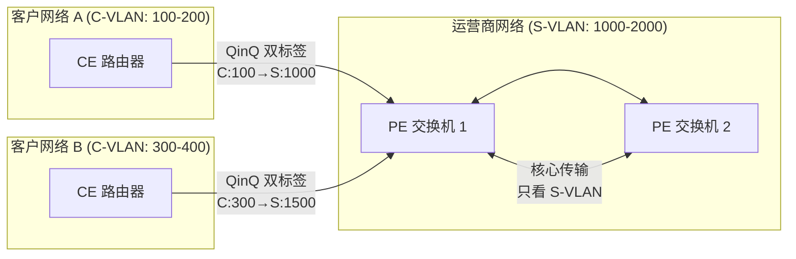

| 场景               | 说明                                                           |
| ------------------ | -------------------------------------------------------------- |
| **运营商 L2 VPN**  | 不同客户使用相同 C-VLAN ID，运营商通过不同 S-VLAN 隔离         |
| **多租户数据中心** | 每个租户映射到独立 S-VLAN，租户内部可自由使用 4094 个 C-VLAN   |
| **站点互联**       | 企业跨站点扩展 L2，站点间使用 QinQ 隧道，突破 VLAN ID 冲突限制 |

---

## 3. QinQ 配置实战

### 3.1 网络拓扑

以下配置基于以下场景：

- 客户 A 的站点 1 和站点 2 需要跨运营商网络建立 L2 连接
- 客户 A 内部使用 VLAN 100（站点 1）和 VLAN 200（站点 2）
- 运营商为客户 A 分配 S-VLAN 1000

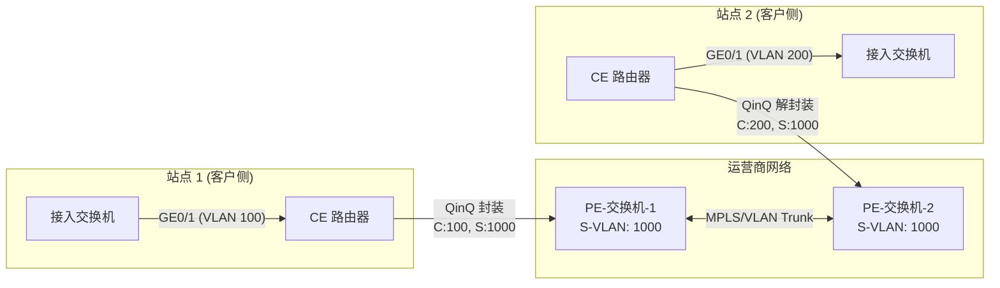

### 3.2 CPE 设备配置（客户边缘，Huawei 交换机）

```网络配置
# CPE-1 (站点1) - Huawei S5700
#
# 场景：将客户侧 VLAN 100 封装为 QinQ，添加外层 S-VLAN 1000
#

vlan batch 100 1000

# 配置 QinQ：所有带 VLAN 100 tag 的帧，在出方向打上外层 VLAN 1000
interface GigabitEthernet0/0/1
 port link-type trunk
 # 允许客户 VLAN 通过
 port trunk allow-pass vlan 100
 # 启用 QinQ 隧道（将所有帧封装为双标签）
 qinq enable
 # 配置外层 VLAN 映射：内层 VLAN 100 → 外层 VLAN 1000
 qinq vlan-translation enable
 port vlan-stacking vlan 100 stack-vlan 1000
#
# 上行连接运营商 PE 设备
interface GigabitEthernet0/0/24
 port link-type trunk
 port trunk allow-pass vlan 1000
```

### 3.3 运营商 PE 交换机配置

```网络配置
# PE-1 (运营商边缘交换机) - Cisco Nexus
#
# 场景：接收客户 QinQ 帧，验证 S-VLAN，将流量转发到对端 PE
#

# 创建服务 VLAN (S-VLAN)
vlan 1000
  name Customer_A_Site1

# 配置 Service Instance (QinQ 匹配规则)
interface Ethernet1/1
 description "连接 CPE-1"
 switchport mode trunk
 switchport trunk allowed vlan 1000

 # 配置 QinQ 帧匹配规则
 # 匹配任意 C-VLAN + S-VLAN 1000 的帧
 switchport vlan mapping 1000

# 配置 QinQ 隧道端点
vlan configuration 1000
 member interface Ethernet1/1
 # 将 S-VLAN 1000 设置为 Provider Bridge Network (802.1ad)
 service instance 1
  encapsulation dot1q 1000
  rewrite vlan tag 1000 symmetric
```

### 3.4 VLAN 映射配置（VLAN Translation / VLAN Mapping）

在某些场景下需要在 PE 设备上做 VLAN ID 映射（如客户 A 的 VLAN 100 映射到客户 B 的 VLAN 300）：

```网络配置
# PE-1: VLAN Mapping 配置
# 将入方向 C-VLAN 100 映射为 C-VLAN 300（对端站点使用）
#
interface GigabitEthernet0/0/1
 port link-type trunk
 port trunk allow-pass vlan 1000

 # VLAN 映射：外层 S-VLAN 1000 不变，内层 C-VLAN 100→300
 qinq vlan-translation enable
 port vlan-mapping vlan 100 map-vlan 300
```

### 3.5 QinQ 配置验证

```bash
# Huawei 交换机：查看 QinQ 端口配置
display qinq interface GigabitEthernet0/0/1

# Cisco 交换机：验证 VLAN Mapping
show vlan mapping

# 查看双标签帧统计
display mac-address qinq

# 抓包验证（Linux）
tcpdump -i eth0 -nn -v 'ether[12:2] = 0x8100'
# 观察外层 TPID=0x8100，后跟 S-VLAN
# 内层再次出现 TPID=0x8100，后跟 C-VLAN
```

### 3.6 QinQ 的局限性

虽然 QinQ 将 VLAN 空间扩展到了 1677 万，但在现代数据中心场景下仍有明显不足：

| 维度           | QinQ                     | 现代需求                         |
| -------------- | ------------------------ | -------------------------------- |
| **扩展性**     | 1677 万（双层 12-bit）   | 需要支持数千万租户/容器          |
| **控制面**     | 无集中控制面，靠手工配置 | 需要自动化下发、秒级部署         |
| **跨三层**     | 只能在 L2 网络中扩展     | 需要跨越 IP 路由网络（Underlay） |
| **多租户隔离** | 依赖 VLAN ID 隔离        | 需要端到端加密、微分段           |
| **可编程性**   | CLI 驱动                 | 需要 API 驱动的声明式配置        |

---

## 4. VXLAN：Overlay 网络虚拟化

### 4.1 VXLAN 诞生背景

VXLAN（Virtual Extensible LAN）由 Cisco、VMware、RedHat 等厂商联合提出，在 2014 年成为 RFC 7348。**VXLAN 是一种 Overlay 网络封装协议**，将二层以太网帧封装在 UDP 报文中，通过 IP 网络（Underlay）实现跨三层的 L2 扩展。

**VXLAN 解决的三大问题：**

1. **VLAN 扩展性**：通过 24-bit VNI（VXLAN Network Identifier）支持 **1600 万**个虚拟网络
2. **跨三层 L2 扩展**：封装在 UDP 中，可以在任意 IP 网络上透传，突破 L2 广播域限制
3. **多租户隔离**：每个租户拥有独立 VNI 空间，通过 VTEP（VXLAN Tunnel Endpoints）实现逻辑隔离

### 4.2 VXLAN 协议格式

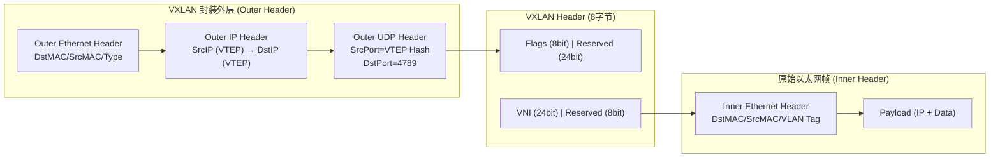

**VXLAN 封装各层详解：**

| 字段                  | 长度    | 说明                                                                        |
| --------------------- | ------- | --------------------------------------------------------------------------- |
| Inner Ethernet Header | 可变    | 原始 L2 帧，保留原始 VLAN tag（或剥离）                                     |
| VXLAN Header          | 8 字节  | VNI (24-bit) + Flags + Reserved                                             |
| Outer UDP             | 8 字节  | SrcPort = 哈希(Inner L2 Header)，DstPort = **4789**（标准）或 8472（Linux） |
| Outer IP              | 20 字节 | 源/目的为 VTEP 的 IP 地址                                                   |
| Outer Ethernet        | 14 字节 | Underlay 网络的 Ethernet 头                                                 |

### 4.3 VNI（VXLAN Network Identifier）

VNI 是 24-bit 字段，支持 **16,777,216（约 1677 万）** 个独立 VXLAN 网络：

```
VNI 字段结构（24-bit）
┌────────────────────────────────────────────────────┐
│ 0x000001 ~ 0xFFFFFE (共 16,777,214 个可用值)        │
│ 保留: 0x000000 (未定义)                             │
│ 保留: 0xFFFFFF (广播群组)                           │
└────────────────────────────────────────────────────┘
```

**VNI 与 VLAN 的映射关系：**

| 属性     | VLAN           | VXLAN                       |
| -------- | -------------- | --------------------------- |
| ID 长度  | 12-bit         | 24-bit                      |
| 可用数量 | 4094           | 16,777,214                  |
| 作用域   | 单个广播域     | 全局（跨 Underlay IP 网络） |
| 封装方式 | 802.1Q tag     | UDP + VXLAN Header          |
| 控制面   | 无（洪泛学习） | 可选（EVPN / 手动）         |

---

## 5. VXLAN 封装与转发机制

### 5.1 VTEP（VXLAN Tunnel Endpoints）

VTEP 是 VXLAN 隧道的端点设备，负责：

- **封装**：将本地 L2 帧封装为 VXLAN 报文，发送到对端 VTEP
- **解封装**：接收 VXLAN 报文，还原为原始 L2 帧
- **学习**：维护 MAC → VTEP IP 的映射表（类似 L2 MAC 地址表）

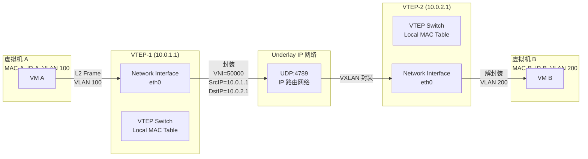

### 5.2 VXLAN 封装/解封装流程

**封装过程（发送端 VTEP）：**

```c
// VXLAN 封装伪代码
struct vxlan_hdr {
    uint8_t  flags[4];     // 8 bits: I(1) = 1 (valid VNI), 3 bits reserved
    uint8_t  reserved[3];
    uint8_t  vni[3];       // 24-bit VNI (network byte order)
    uint8_t  reserved;
};

int vxlan_encap(struct sk_buff *skb, struct vxlan_config *cfg) {
    // 1. 获取原始 L2 帧的源 MAC 和目的 MAC
    struct ethhdr *inner_eth = eth_hdr(skb);

    // 2. 查找目的 MAC 所属的 VTEP IP (通过 MAC 学习表)
    struct neighbour *neigh = neigh_lookup(cfg->vni, inner_eth->h_dest);
    struct vxlan_sock *vs = cfg->v4_sock;

    // 3. 构建 VXLAN 头
    struct vxlan_hdr vxlan = {
        .flags = { 0x08, 0x00, 0x00, 0x00 }, // I flag = 1
        .vni   = { (cfg->vni >> 16) & 0xFF,
                    (cfg->vni >> 8)  & 0xFF,
                    cfg->vni & 0xFF },
    };

    // 4. 构建外层 UDP 头（SrcPort 基于 Inner ETH src/dst 哈希）
    struct udphdr *uh = udp_hdr(skb);
    uh->source = hash_5tuple(inner_eth, skb->protocol);
    uh->dest   = 4789;  // 标准 VXLAN 端口
    uh->len    = len(skb) + sizeof(vxlan_hdr) + sizeof(udphdr);

    // 5. 构建外层 IP 头（源/目的为 VTEP IP）
    struct iphdr *iph = ip_hdr(skb);
    iph->saddr = cfg->src_ip;   // 本地 VTEP IP
    iph->daddr = neigh->vtep_ip; // 远端 VTEP IP

    // 6. 添加外层 Ethernet 头
    // ...
    return dev_queue_xmit(skb);
}
```

### 5.3 分布式路由（Distributed Anycast Gateway）

VXLAN 网络中实现 L3 路由有三种主要模式：

**模式 1：集中式 L3 网关（不推荐，生产环境少见）**

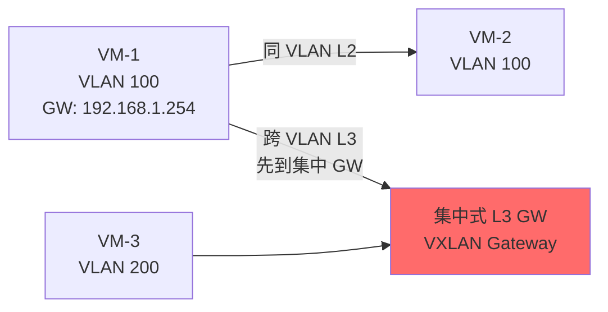

缺点：所有跨网段流量必须经过网关，形成单点瓶颈和绕行（Traffic Trombone）。

**模式 2：分布式 Anycast Gateway（推荐）**

每台 VTEP 交换机/ESXi 宿主机同时作为 L3 网关，本地终结跨网段流量：

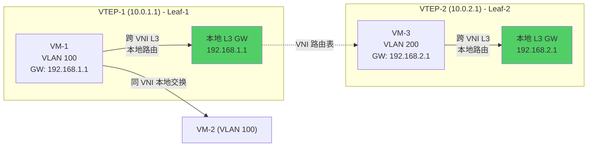

配置分布式网关（Arista EOS）：

```网络配置
# Arista EOS - 配置 VXLAN 分布式 Anycast Gateway
!
interface Vxlan1
   vxlan source-interface 100
   vxlan virtual-router encapsulation mac-address 00:00:00:00:00:01
   vxlan controller-network
   vxlan udp-port 4789
   vxlan vlan 100 vni 10100
   vxlan vlan 200 vni 10200
   vxlan vrf vxlan-vrf-1 vni 10001
!
# 分布式网关配置（所有 Leaf 交换机使用相同 Gateway IP）
interface Vlan100
   ip address 192.168.1.1/24
   ip virtual-router address 192.168.1.254
   ip virtual-router mac-address 00:00:00:00:00:01
!
interface Vlan200
   ip address 192.168.2.1/24
   ip virtual-router address 192.168.2.254
   ip virtual-router mac-address 00:00:00:00:00:01
```

### 5.4 BUM 流量处理（Broadcast / Unknown-Unicast / Multicast）

VXLAN 中 BUM 流量通过 **头端复制（Head-End Replication）** 或 **组播分发**处理：

**方式 1：头端复制（Unicast Replication）**

当 VTEP 需要发送 BUM 流量时，复制报文逐一发送给所有已知 VTEP：

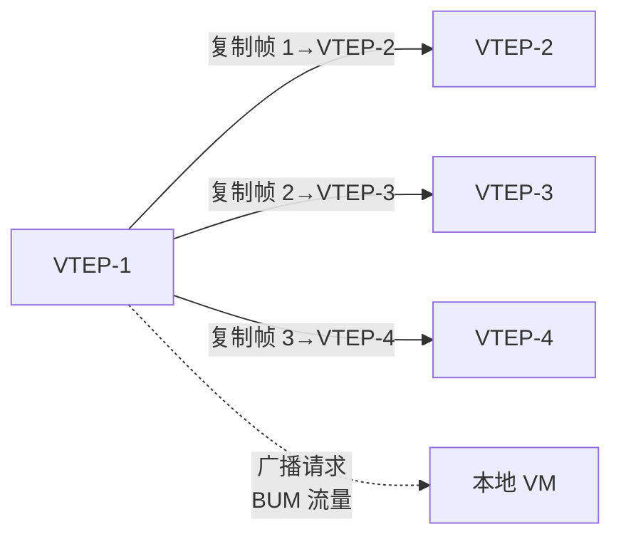

**方式 2：组播分发（使用 Underlay Multicast）**

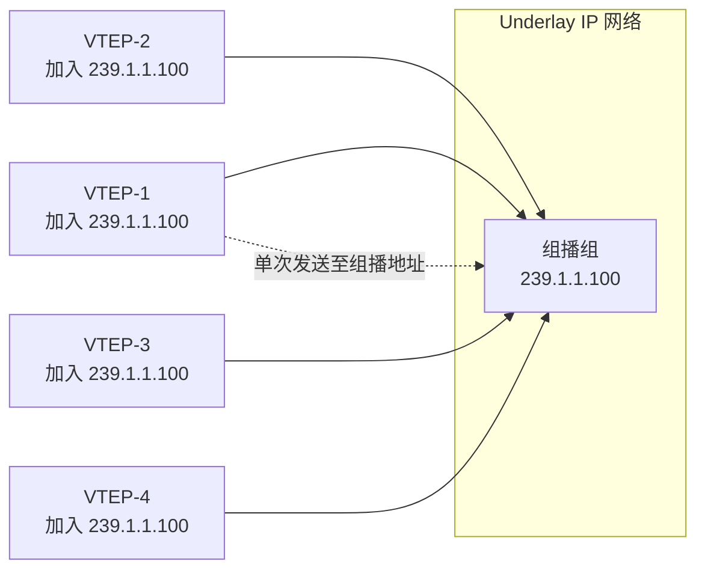

| BUM 类型               | 处理方式               | 效率                 |
| ---------------------- | ---------------------- | -------------------- |
| 广播（ARP/HSRP/VRRP）  | 头端复制或组播         | 中等（复制 N 份）    |
| 未知单播（MAC 未学习） | 头端复制               | 较差（可能大量泛洪） |
| 组播（IP Multicast）   | 直接通过 Underlay 组播 | 高效（原生处理）     |

### 5.5 Linux 内核 VXLAN 实现

Linux 内核从 3.7 版本开始支持 VXLAN，以下是实战配置：

```bash
# 创建 VXLAN 接口（Linux）
# VTEP IP = 10.0.1.1，对端 VTEP = 10.0.2.1，VNI = 50000

# 方式 1：使用 ip-link 命令创建点到点 VXLAN
ip link add vxlan50000 type vxlan \
    id 50000 \
    dstport 4789 \
    local 10.0.1.1 \
    remote 10.0.2.1 \
    dev eth0

# 方式 2：使用组播（多播）模式
ip link add vxlan50000 type vxlan \
    id 50000 \
    dstport 4789 \
    group 239.1.1.100 \
    dev eth0

# 激活接口
ip link set vxlan50000 up

# 添加桥接（将 VXLAN 接口加入 Linux Bridge，实现 L2 互通）
brctl addbr br0
brctl addif br0 eth1.100   # 物理接口（连接本地 VLAN 100）
brctl addif br0 vxlan50000  # VXLAN 接口
ip link set br0 up

# 查看 VXLAN 接口信息
ip -d link show vxlan50000
# vxlan50000: <BROADCAST,MULTICAST,UP,LOWER_UP> mtu 1500
#     vxlan id 50000 remote 10.0.2.1 srcport 0 0 dstport 4789 dev eth0

# 查看 FDB（Forwarding Database）表
bridge fdb show
# 00:00:00:00:00:01 dev vxlan50000 dst 10.0.2.1 via eth0

# 使用 iproute2 查看详细统计
ip -s link show vxlan50000
```

**使用 NetworkManager 管理 VXLAN（RHEL/CentOS）：**

```bash
# nmcli 创建 VXLAN 连接
nmcli con add type vxlan ifname vxlan50000 \
    con-name vxlan50000 \
    vxlan.id 50000 \
    vxlan.local 10.0.1.1 \
    vxlan.remote 10.0.2.1 \
    vxlan.dstport 4789 \
    master br0 \
    slave-type bridge \
    autoconnect yes

# 激活连接
nmcli con up vxlan50000
```

### 5.6 Open vSwitch (OVS) VXLAN 配置

```bash
# 使用 OVS 创建 VXLAN 隧道
ovs-vsctl add-br br0
ovs-vsctl add-port br0 eth0
ovs-vsctl add-port br0 vxlan0 -- \
    set interface vxlan0 type=vxlan \
    options:remote_ip=10.0.2.1 \
    options:key=50000 \
    options:dst_port=4789

# OVS OVSDB 记录
ovs-vsctl get Interface vxlan0 options
# {dst_port=4789, key=50000, remote_ip=10.0.2.1}

# 查看 OVS 流表
ovs-ofctl dump-flows br0

# 添加流表规则（允许 VLAN 100 的流量进入 VXLAN）
ovs-ofctl add-flow br0 \
    "in_port=eth0,dl_vlan=100,actions=load:50000->NXM_NX_TUN_ID[],output:vxlan0"
```

---

## 6. EVPN 作为 VXLAN 控制面

### 6.1 为什么需要 EVPN 控制面

纯数据面的 VXLAN 依赖 **数据驱动学习（Data Plane Learning）**：当 VTEP 收到一个 VXLAN 帧时，学习 Inner Ethernet Header 中的 MAC 地址和远端 VTEP IP 的映射关系。这带来三个问题：

1. **泛洪抑制不足**：未知 MAC 泛洪到所有 VTEP（BUM 风暴）
2. **收敛慢**：MAC 地址学习依赖流量触发，故障后收敛时间长
3. **安全风险**：无法做精确的 MAC 准入控制，MAC 伪造攻击难以防范

**EVPN（Ethernet VPN）** 作为 MPLS L2VPN 的演进，使用 MP-BGP（Multiprotocol BGP）作为控制面来传递 MAC/IP 路由，解决了上述问题。

### 6.2 MP-BGP EVPN 路由类型

EVPN 定义了 5 种路由（Route Types），用于承载不同的控制面信息：

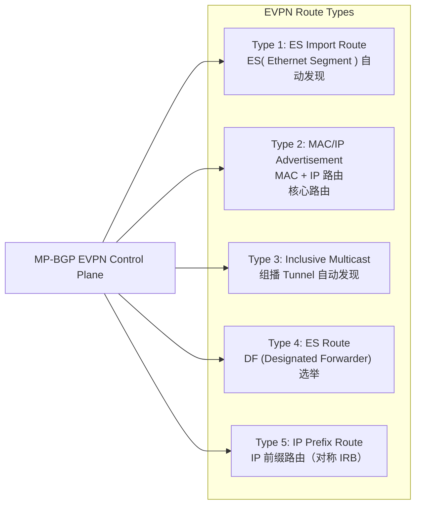

**Type 2 MAC/IP Advertisement（最重要的路由类型）：**

```
EVPN Type 2 路由格式：
+---------------------------+
|  RD (Route Distinguisher)  |  8 字节 - 路由区分符
|  Ethernet Segment ID       |  10 字节 - ES 标识
|  MAC Address Length        |  1 字节
|  MAC Address              |  6 字节 - 主机 MAC
|  IP Address Length        |  1 字节
|  IP Address (optional)    |  可变 - 主机 IP
|  MPLS Label                |  3 字节 - VNI
+---------------------------+
```

### 6.3 EVPN + VXLAN 架构

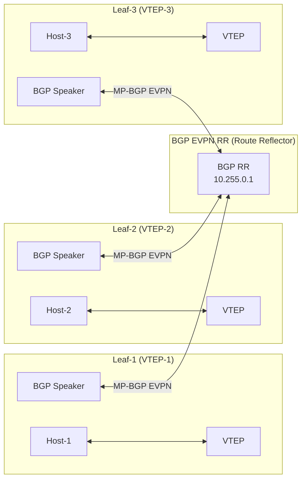

### 6.4 ARP/ND 抑制（ARP Suppression）

EVPN 最重要的优化之一是 **ARP/ND 抑制**：在 VTEP 层面上拦截/代理 ARP 请求，避免广播泛洪到所有 VTEP。

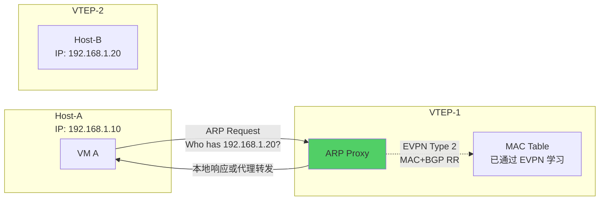

**工作原理：**

1. 当 Host-A 发起 ARP 请求（询问 192.168.1.20 的 MAC）时，VTEP-1 拦截此 ARP
2. VTEP-1 检查本地缓存和 EVPN 学习到的 MAC 表
3. 如果目标 IP（192.168.1.20）在 EVPN 表中已有记录，VTEP-1 直接代理回复（使用对端 VTEP 的 MAC）
4. 如果不在缓存中，则通过 EVPN Type 3 Inclusive Multicast 转发

### 6.5 EVPN 配置实战（Arista EOS）

```网络配置
# Arista EOS - EVPN + VXLAN 配置
#
# Leaf-1 配置
!
hostname Leaf-1
!
# 启用 EVPN
evpn
   rd 10.0.1.1:1
   route-target import evpn 1:50000
   route-target export evpn 1:50000
!
# 配置 VTEP
interface Vxlan1
   vxlan source-interface Loopback0
   vxlan udp-port 4789
   vxlan vlan 100 vni 10100
   vxlan vlan 200 vni 10200
   vxlan vrfs vxlan-vrf-1 vni 10001
   vxlan arp-suppression
!
# 配置 BGP EVPN 对等体
router bgp 65001
   router-id 10.0.1.1
   neighbor 10.255.0.1 remote-as 65000
   neighbor 10.255.0.1 description "EVPN Route Reflector"
   neighbor 10.255.0.1 update-source Loopback0
   !
   address-family evpn
      neighbor 10.255.0.1 activate
   !
   address-family ipv4
      neighbor 10.255.0.1 activate
!
# VLAN 和 SVI 配置
interface VLAN100
   ip address 192.168.1.1/24
   ip virtual-router address 192.168.1.254
!
interface Ethernet1
   switchport mode trunk
   switchport trunk allowed vlan 100,200
```

```bash
# 验证 EVPN 状态
show evpn
show evpn mac
show evpn arp-cache
show bgp evpn

# 查看 VTEP 邻居
show vxlan tunnel
# VTEP        VNI      Peer VTEP       Local IP      State
# 10.0.2.1    10100    10.0.2.1        10.0.1.1      up
```

---

## 7. VLAN 与 VXLAN 深度对比

### 7.1 核心架构差异

| 对比维度       | 传统 VLAN (802.1Q)   | QinQ (802.1ad)          | VXLAN (RFC 7348)                  |
| -------------- | -------------------- | ----------------------- | --------------------------------- |
| **扩展性**     | 4,094 个 VLAN        | 1,677 万组合            | 1,677 万 VNI                      |
| **网络层次**   | 单一 L2 广播域       | 客户+运营商双层 L2      | Overlay/Underlay 解耦             |
| **封装方式**   | 802.1Q Tag（4 字节） | 双 802.1Q Tag（8 字节） | UDP + VXLAN Header                |
| **传输介质**   | 二层以太网           | 二层以太网              | IP 网络（三层可路由）             |
| **控制面**     | 无（洪泛学习）       | 无                      | 可选（EVPN / 数据面学习）         |
| **跨域能力**   | 受限于物理交换机     | 受限于物理 L2 网络      | 跨任意 IP 网络                    |
| **硬件需求**   | 普通 L2 交换机       | 支持 QinQ 的交换机      | 支持 VXLAN 的交换机/网卡          |
| **MTU**        | 1518（标准）         | 1522（双标签）          | 1550+（需要 Underlay MTU ≥ 1550） |
| **多租户隔离** | VLAN ID 隔离         | VLAN ID 叠加隔离        | VNI + Underlay 网络隔离           |

### 7.2 数据平面转发对比

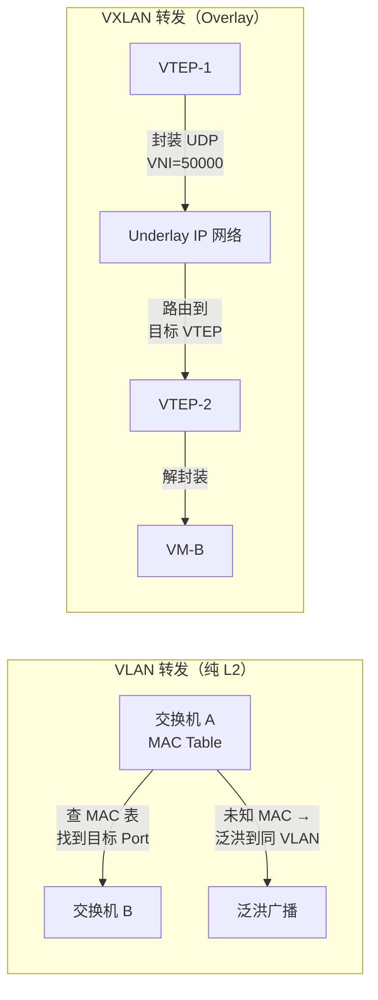

### 7.3 性能与开销对比

| 指标            | VLAN         | VXLAN                                       |
| --------------- | ------------ | ------------------------------------------- |
| **头部开销**    | 4 字节       | 50 字节（14 ETH + 20 IP + 8 UDP + 8 VXLAN） |
| **MTU 要求**    | 1500（标准） | 1550+（Underlay）                           |
| **包转发性能**  | 接近线速     | 受 UDP 封装/解封装影响                      |
| **CPU 开销**    | 极低         | 中等（取决于 NIC offload）                  |
| **NIC Offload** | 无特殊要求   | VXLAN TSO/GSO offload 可大幅降低 CPU        |
| **延迟增加**    | 0            | 2-5 μs（取决于硬件）                        |

### 7.4 适用场景矩阵

| 场景                     | 推荐方案       | 理由                                 |
| ------------------------ | -------------- | ------------------------------------ |
| 小型园区网（< 100 设备） | 纯 VLAN        | 简单够用，无需额外复杂度             |
| 多租户 ISP 城域网        | QinQ           | 运营商网络透传，客户 VLAN 透明       |
| 跨地域 L2 互联           | QinQ 或 VXLAN  | QinQ 适合纯 L2，VXLAN 适合跨 IP 网络 |
| 云数据中心（数千租户）   | VXLAN + EVPN   | 扩展性 + 自动化控制面                |
| Kubernetes 容器网络      | VXLAN / Geneve | Overlay 封装满足 Pod 网络需求        |
| 混合云连接               | VXLAN / Geneve | 跨云服务商的标准化封装               |

---

## 8. NSX / OVS / Linux VXLAN 实战配置

### 8.1 VMware NSX-V / NSX-T VXLAN 配置

NSX 是 VMware 的网络虚拟化平台，原生支持 VXLAN 作为 Overlay 传输协议。

```python
# NSX-V / NSX-T REST API 配置 VXLAN
# 基础环境：准备 VDS (vSphere Distributed Switch) 和 Cluster

import requests
import json

# NSX-T Manager API
NSX_MANAGER = "https://nsx-manager.example.com"
USERNAME = "admin"
PASSWORD = "password"

def nsx_api(method, endpoint, data=None):
    url = f"{NSX_MANAGER}{endpoint}"
    headers = {"Content-Type": "application/json"}
    resp = requests.request(
        method, url,
        auth=(USERNAME, PASSWORD),
        headers=headers,
        data=json.dumps(data) if data else None,
        verify=False
    )
    return resp.json()

# 1. 创建 Transport Zone（传输区域）
transport_zone = {
    "display_name": "overlay-tz-50000",
    "description": "VXLAN Transport Zone for VNI 50000",
    "tz_type": "OVERLAY",
    "host_switch_name": "nsxSwitch",
    "transport_zone_profile_ids": [
        {"profile_id": "nsx.default.nvds", "profile_type": "TransportZoneProfile"}
    ]
}
result = nsx_api("POST", "/api/v1/transport-zones", transport_zone)
tz_id = result["id"]
print(f"Transport Zone created: {tz_id}")

# 2. 创建 Uplink Profile（上行链路配置文件）
uplink_profile = {
    "display_name": "default-uplink-profile",
    "mtu": 1600,
    "lag_properties": {
        "name": "LA-1",
        "number_of_uplinks": 2,
        "mode": "ACTIVE"
    },
    "teaming": {
        "active_list": [{"uplink_name": "uplink-1"}],
        "standby_list": [{"uplink_name": "uplink-2"}],
        "policy": "FAILOVER_ORDER"
    }
}
up_id = nsx_api("POST", "/api/v1/uplink-profiles", uplink_profile)["id"]

# 3. 为 ESXi 主机配置 VXLAN（VTEP）
# NSX 会自动在每台 ESXi 主机上创建 vmknic 和配置 VXLAN VTEP
vds_config = {
    "display_name": "nsx-vds",
    "host_switch_name": "nsxSwitch",
    "host_switch_mode": "STANDARD",
    "transport_zone_endpoints": [
        {"transport_zone_id": tz_id}
    ]
}
print("VDS configured for VXLAN overlay")
```

**NSX GUI 配置步骤（简化流程）：**

1. **准备集群**：在 vSphere Client 中，为集群启用 "NSX" 插件
2. **创建传输节点配置文件**：配置 MTU 1600（VXLAN 需要）、TEP IP 池
3. **创建传输区域**：选择 OVERLAY 类型
4. **为主机配置 VXLAN**：NSX Controller 自动为主机分配 TEP IP，创建 vmknic
5. **创建逻辑交换机**：关联到传输区域，自动分配 VNI

```bash
# ESXi 主机上验证 VXLAN 状态
esxcli network vswitch dvs vmware vxlan list
# 列出所有 VXLAN 配置和 VTEP 状态
esxcli network ip interface list
# 查看 vmknic（VXLAN Tunnel End Point）

# 查看 VTEP 相邻关系
net-vdl2 -l
```

### 8.2 Open vSwitch (OVS) + VXLAN 完整配置

以下是一个完整的 OVS + VXLAN + OpenFlow 规则配置示例：

```bash
#!/bin/bash
# OVS VXLAN 隧道自动化配置脚本

# 初始化 OVS
ovs-vsctl --no-wait init

# 创建 Bridge
ovs-vsctl add-br br0

# 添加物理端口
ovs-vsctl add-port br0 eth0        # 连接外部网络
ovs-vsctl add-port br0 eth1        # 连接本地 VM

# 配置 VXLAN 隧道
# VTEP-1: 10.0.1.1
# VTEP-2: 10.0.2.1
# VTEP-3: 10.0.3.1
# VNI: 50000

ovs-vsctl add-port br0 vxlan1 -- \
    set interface vxlan1 type=vxlan \
    options:remote_ip=10.0.2.1 \
    options:key=50000 \
    options:dst_port=4789 \
    options:local_ip=10.0.1.1 \
    options:packet_type=type=ethernet

ovs-vsctl add-port br0 vxlan2 -- \
    set interface vxlan2 type=vxlan \
    options:remote_ip=10.0.3.1 \
    options:key=50000 \
    options:dst_port=4789 \
    options:local_ip=10.0.1.1 \
    options:packet_type=ethernet

# 配置 OpenFlow 流表
# VLAN 100 (本地) <-> VNI 50000 (Overlay) 映射

# 1. 本地 VLAN 100 -> VNI 50000 (添加 VLAN tag + VNI)
ovs-ofctl add-flow br0 \
    "table=0, in_port=eth1, dl_vlan=100, actions=\
    load:50000->NXM_NX_TUN_ID[],\
    push_vlan:0x8100,move:NXM_NX_VLAN_TAG[]->NXM_NX_VLAN_ID[],\
    output:vxlan1"

# 2. VNI 50000 -> 本地 VLAN 100 (移除 VLAN tag + VNI)
ovs-ofctl add-flow br0 \
    "table=0, in_port=vxlan1, tunnel=50000, dl_vlan=100, actions=\
    pop_vlan,output:eth1"

# 3. BUM 流量处理：洪泛到所有 VTEP
ovs-ofctl add-flow br0 \
    "table=0, in_port=eth1, dl_vlan=100, actions=\
    load:50000->NXM_NX_TUN_ID[],\
    push_vlan:0x8100,move:NXM_NX_VLAN_TAG[]->NXM_NX_VLAN_ID[],\
    output:vxlan1,output:vxlan2"

# 查看 OVS 配置
echo "=== OVS Bridge ==="
ovs-vsctl show

echo "=== Port 配置 ==="
ovs-vsctl list port

echo "=== VXLAN 接口选项 ==="
ovs-vsctl list interface vxlan1

echo "=== OpenFlow 流表 ==="
ovs-ofctl dump-flows br0
```

### 8.3 Linux Bridge + VXLAN + VLAN 集成实战

一个完整的 Linux 虚拟化主机上，运行 KVM 虚拟机并接入 VXLAN Overlay 网络的配置：

```bash
#!/bin/bash
# Linux Bridge + VXLAN + VLAN 综合配置
# 场景：宿主机有 eth0 (物理网卡)，创建多个 VLAN 和 VXLAN

set -e

# ========== 基础网络配置 ==========
# 物理网卡开启混杂模式和 VLAN trunk
ip link set eth0 up
ip link set eth0 promisc on

# ========== 创建 VLAN 接口 ==========
# VLAN 100: 业务网络
ip link add link eth0 name eth0.100 type vlan id 100
ip link set eth0.100 up

# VLAN 200: 存储网络
ip link add link eth0 name eth0.200 type vlan id 200
ip link set eth0.200 up

# ========== 创建 Linux Bridge ==========
# 业务网桥（连接 VLAN 100 + VXLAN 50000）
ip link add name br100 type bridge
ip link set dev br100 type bridge stp_state 0  # 关闭 STP
ip link set dev br100 type bridge ageing_time 30000
ip link set br100 up

# 存储网桥
ip link add name br200 type bridge
ip link set br200 up

# ========== 创建 VXLAN 接口 ==========
# VTEP 配置
VTEP_LOCAL="10.0.1.1"
VTEP_PEER1="10.0.2.1"
VTEP_PEER2="10.0.3.1"
VNI=50000
VXLAN_PORT=4789
MCAST_GROUP="239.1.1.100"

# 方式 A：点到点 VXLAN（已知 peer IP）
ip link add vxlan50000 type vxlan \
    id ${VNI} \
    dstport ${VXLAN_PORT} \
    local ${VTEP_LOCAL} \
    remote ${VTEP_PEER1} \
    dev eth0 \
    dstport ${VXLAN_PORT}

# 方式 B：组播 VXLAN（多播方式，自动发现 peer）
# ip link add vxlan50000 type vxlan \
#     id ${VNI} \
#     dstport ${VXLAN_PORT} \
#     group ${MCAST_GROUP} \
#     dev eth0

# 激活 VXLAN 接口
ip link set vxlan50000 up

# ========== 网桥加入端口 ==========
# VLAN 100 物理口加入 br100
ip link set eth0.100 master br100

# VXLAN 接口加入 br100（实现 L2 互通）
ip link set vxlan50000 master br100

# 检查 FDB（MAC 学习表）
bridge fdb show

# ========== 配置 VM 连接 ==========
# 假设使用 libvirt，VM 的 vif 使用 tap 设备直接连到网桥

# 为 VM 创建 tap 接口并加入 br100
ip tuntap add dev vm1-vif0 mode tap
ip link set vm1-vif0 master br100
ip link set vm1-vif0 up

# 为 VM 配置 VLAN 子接口
# VM 发送的帧带 VLAN 100 tag，直接进入 br100
# br100 负责 VLAN -> VNI 映射

# ========== 查看状态 ==========
echo "=== Bridge FDB ==="
bridge fdb show

echo "=== VXLAN Neighbours ==="
bridge fdb show dev vxlan50000

echo "=== 网桥详情 ==="
bridge link show

echo "=== IP 配置 ==="
ip addr show type bridge
ip -d link show vxlan50000

# ========== 添加静态 MAC -> VTEP 映射（可选）==========
# 静态配置，避免泛洪学习
bridge fdb add 00:11:22:33:44:55 dev vxlan50000 dst 10.0.2.1
bridge fdb add 00:aa:bb:cc:dd:ee dev vxlan50000 dst 10.0.3.1

# ========== sysctl 调优 ==========
# 关闭 RP filter（VXLAN 封装需要）
sysctl -w net.ipv4.conf.all.rp_filter=0
sysctl -w net.ipv4.conf.default.rp_filter=0

# 增加 UDP buffer（提升 VXLAN 吞吐）
sysctl -w net.core.rmem_max=134217728
sysctl -w net.core.wmem_max=134217728
```

### 8.4 Python 脚本：自动创建 KVM + VXLAN 网络

```python
#!/usr/bin/env python3
"""
KVM VM + VXLAN 网络自动化脚本
功能：在 KVM 宿主机上创建 VM，并将其连接到 VXLAN Overlay 网络
"""

import subprocess
import sys
import os

def run_cmd(cmd, check=True):
    """执行 shell 命令"""
    print(f"[CMD] {cmd}")
    result = subprocess.run(cmd, shell=True, capture_output=True, text=True)
    if result.stdout:
        print(result.stdout)
    if result.returncode != 0 and check:
        print(f"[ERROR] {result.stderr}", file=sys.stderr)
        sys.exit(1)
    return result

def create_bridge(bridge_name, vlan_id, vxlan_id, local_vtep, peer_vtep):
    """创建网桥 + VLAN + VXLAN"""
    print(f"\n=== 创建网桥 {bridge_name} ===")

    # 创建网桥
    run_cmd(f"ip link add name {bridge_name} type bridge stp_state 0")
    run_cmd(f"ip link set {bridge_name} up")

    # 创建 VLAN 接口并加入网桥
    vlan_if = f"eth0.{vlan_id}"
    run_cmd(f"ip link add link eth0 name {vlan_if} type vlan id {vlan_id}")
    run_cmd(f"ip link set {vlan_if} up")
    run_cmd(f"ip link set {vlan_if} master {bridge_name}")

    # 创建 VXLAN 接口并加入网桥
    vxlan_if = f"vxlan{vxlan_id}"
    run_cmd(
        f"ip link add {vxlan_if} type vxlan "
        f"id {vxlan_id} "
        f"remote {peer_vtep} "
        f"local {local_vtep} "
        f"dstport 4789 dev eth0"
    )
    run_cmd(f"ip link set {vxlan_if} up")
    run_cmd(f"ip link set {vxlan_if} master {bridge_name}")

    print(f"网桥 {bridge_name} 创建完成")
    print(f"  - VLAN: {vlan_id}")
    print(f"  - VXLAN ID: {vxlan_id}")
    print(f"  - Local VTEP: {local_vtep}")
    print(f"  - Remote VTEP: {peer_vtep}")

def create_vm(vm_name, bridge_name, mac, ip, netmask):
    """使用 virt-install 创建 KVM VM"""
    print(f"\n=== 创建虚拟机 {vm_name} ===")

    os.makedirs("/var/lib/libvirt/images", exist_ok=True)

    cmd = (
        f"virt-install "
        f"--name {vm_name} "
        f"--vcpus 2 --memory 4096 "
        f"--disk /var/lib/libvirt/images/{vm_name}.qcow2,size=20 "
        f"--network bridge:{bridge_name},mac={mac} "
        f"--os-variant debian12 "
        f"--install kernel=/boot/vmlinuz,initrd=/boot/initrd.img "
        f"--extra-args='console=ttyS0,115200' "
        f"--noautoconsole"
    )
    run_cmd(cmd)

    print(f"VM {vm_name} 创建完成")
    print(f"  - MAC: {mac}")
    print(f"  - IP: {ip}/{netmask}")

if __name__ == "__main__":
    # 宿主机配置
    LOCAL_VTEP = "10.0.1.1"
    PEER_VTEP = "10.0.2.1"

    # 创建业务网桥（VLAN 100 <-> VNI 50000）
    create_bridge("br100", vlan_id=100, vxlan_id=50000,
                  local_vtep=LOCAL_VTEP, peer_vtep=PEER_VTEP)

    # 创建存储网桥（VLAN 200 <-> VNI 50001）
    create_bridge("br200", vlan_id=200, vxlan_id=50001,
                  local_vtep=LOCAL_VTEP, peer_vtep=PEER_VTEP)

    # 创建两台 VM
    create_vm("vm-web-01", "br100", "52:54:00:00:01:01", "192.168.100.10", "24")
    create_vm("vm-web-02", "br100", "52:54:00:00:01:02", "192.168.100.11", "24")
    create_vm("vm-db-01", "br200", "52:54:00:00:02:01", "192.168.200.10", "24")

    print("\n=== 配置完成 ===")
    run_cmd("virsh list --all")
    run_cmd("ip link show type bridge")
    run_cmd("bridge fdb show")
```

---

## 9. Geneve：通用网络虚拟化封装

### 9.1 Geneve 协议背景

**Geneve（Generic Network Virtualization Encapsulation）** 由 IETF 定义（RFC 8926），被视为 VXLAN 的继任者。相比 VXLAN，Geneve 提供了**更灵活的可扩展性**，允许厂商自定义 TLV（Type-Length-Value）选项字段。

**Geneve 的设计目标：**

1. **支持任意数量的元数据字段**：不仅限于 VNI（24-bit），可携带 TLV 扩展
2. **标准化封装**：统一各厂商的 Overlay 封装格式
3. **与 OpenFlow / OVN 生态深度集成**：作为 OVN、OpenShift 虚拟化的默认封装

### 9.2 Geneve vs VXLAN 协议对比

```
VXLAN Header（8 字节）
┌────────┬──────────┬────────────────┐
│ Flags  │ Reserved │ VNI (3B)       │
│ 8bit   │ 24bit    │ 24bit          │
└────────┴──────────┴────────────────┘
          └─ 仅支持 VNI 字段

Geneve Header（可变长度）
┌────────┬──────────┬────────┬────────┬─────────────────┐
│ Ver    │ Length   │  O/C   │  C    │ Protocol Type    │
│ 2bit   │ 6bit     │ 1bit   │ 1bit   │ 16bit            │
├────────┴──────────┴────────┴────────┴─────────────────┤
│                  Variable Length Options              │
│           (TLV 格式，可携带任意元数据)                  │
│                                                           │
│  ┌──────────┬────────┬────────┬─────────────────┐       │
│  │ Option    │  Len   │ Flags │    Data         │       │
│  │ Class     │        │       │                 │       │
│  │ 16bit     │ 8bit   │ 8bit  │ Variable        │       │
│  └──────────┴────────┴────────┴─────────────────┘       │
└───────────────────────────────────────────────────┘
```

| 字段                 | VXLAN                       | Geneve                              |
| -------------------- | --------------------------- | ----------------------------------- |
| **协议版本**         | RFC 7348 (2014)             | RFC 8926 (2021)                     |
| **固定头部大小**     | 8 字节                      | 8 字节（最小）                      |
| **扩展能力**         | 无（VNI 固定 24-bit）       | 通过 Options TLV 扩展               |
| **Protocol Type**    | 无                          | 16-bit EtherType                    |
| **Options 数量**     | 0                           | 0-N（可变）                         |
| **元数据传递**       | 不支持                      | 支持（如 OVS 携带 tunnel metadata） |
| **NIC Offload 支持** | TSO/GSO                     | TSO/GSO（部分厂商）                 |
| **默认 UDP 端口**    | 4789                        | 6081                                |
| **应用生态**         | VMware, Cisco, Linux kernel | OVN, OpenShift, OpenStack           |

### 9.3 Geneve 封装格式详解

```
┌───────────────┬───────────────┬────────────────────────┐
│ Outer ETH     │ 14 bytes      │ Underlay Ethernet Header │
├───────────────┼───────────────┼────────────────────────┤
│ Outer IP      │ 20 bytes      │ 源=本地VTEP, 目的=远端VTEP │
├───────────────┼───────────────┼────────────────────────┤
│ Outer UDP     │ 8 bytes       │ SrcPort=哈希, DstPort=6081│
├───────────────┼───────────────┼────────────────────────┤
│ Geneve Header │ 8+N bytes     │ Ver + Options            │
├───────────────┼───────────────┼────────────────────────┤
│ Inner Ethernet│ 14+ bytes     │ 原始 VM/容器 L2 帧        │
├───────────────┼───────────────┼────────────────────────┤
│ Payload       │ 可变          │ Inner IP + Data          │
└───────────────┴───────────────┴────────────────────────┘
```

### 9.4 OVS Geneve 配置示例

```bash
# OVS 创建 Geneve 隧道
ovs-vsctl add-br br0
ovs-vsctl add-port br0 eth0

# 创建 Geneve 接口（对比 VXLAN 配置，仅 type 不同）
ovs-vsctl add-port br0 geneve0 -- \
    set interface geneve0 type=geneve \
    options:remote_ip=10.0.2.1 \
    options:key=50000 \
    options:dst_port=6081 \
    options:geneve_opt="0000c39d0102030405060708090a"  # 可选 Options TLV

# 使用 OpenFlow 携带 Geneve metadata（OVS 特有）
ovs-ofctl add-flow br0 \
    "in_port=eth1,actions=\
    set_field:50000->tun_id,\
    set_field:0x0806->tun_gbp_flags,\
    output:geneve0"

# 验证 Geneve 端口
ovs-vsctl list interface geneve0
```

### 9.5 Geneve Option TLV 扩展示例

Geneve 的核心价值在于 Options 字段允许携带任意元数据：

```c
// Geneve Option TLV 结构
struct geneve_opt {
    __be16 opt_class;   // 厂商自定义 class (0x0102 = VMware, 0xffff = IETF)
    uint8_t type;       // Option 类型
    uint8_t len;        // 选项长度（必须是 4 的倍数，单位 4 字节）
    uint8_t data[0];    // 选项数据
};

// 示例：VMware Geneve options (GENEVE TLV options for NSX)
struct nsx_geneve_opt {
    struct geneve_opt base;
    uint32_t data[1];    // 示例：1个 4 字节数据
};
```

---

## 10. 选型指南：场景化技术决策

### 10.1 技术选型决策树

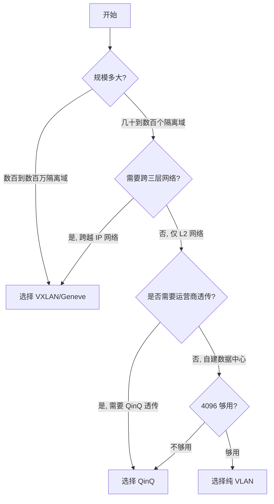

### 10.2 数据中心场景选型

| 场景                                  | 推荐方案                         | 理由                           |
| ------------------------------------- | -------------------------------- | ------------------------------ |
| **中小型数据中心（< 1000 台虚拟机）** | VLAN + VRF                       | 简单够用，配合 ACL 实现隔离    |
| **中大型多租户数据中心**              | VXLAN + EVPN                     | 支持大规模多租户，自动化控制面 |
| **超大规模云平台（> 10 万租户）**     | VXLAN/Geneve + EVPN + 分布式网关 | 线性扩展，租户隔离             |
| **容器的 Overlay 网络**               | Geneve（Kubernetes CNI）或 VXLAN | Pod 需要独立网络命名空间       |
| **混合云互联**                        | VXLAN over WAN / SD-WAN          | 跨云服务商标准化封装           |
| **裸金属服务器（BM）多租户**          | VLAN + VXLAN 双层                | 裸金属用 VLAN，虚拟机用 VXLAN  |

### 10.3 运营商网络选型

| 场景                             | 推荐方案       | 理由                       |
| -------------------------------- | -------------- | -------------------------- |
| **城域以太网 L2VPN**             | QinQ (802.1ad) | 运营商透传，客户 VLAN 透明 |
| **企业站点互联（E-LINE/E-LAN）** | QinQ + MPLS    | 成熟稳定，运营商主导       |
| **数据中心互联（DCI）**          | VXLAN + EVPN   | 跨数据中心 L2/L3 扩展      |
| **5G UPF/N6 接口**               | VLAN + GTP-U   | 运营商移动网络特定协议     |

### 10.4 性能与延迟对比

| 封装类型        | 封装开销（字节） | 典型延迟增加 | CPU 开销 | 吞吐损失           |
| --------------- | ---------------- | ------------ | -------- | ------------------ |
| VLAN (802.1Q)   | 4                | 0 μs         | 极低     | < 1%               |
| QinQ (802.1ad)  | 8                | 0-1 μs       | 极低     | < 1%               |
| VXLAN           | 50               | 2-5 μs       | 中等     | 2-5%（无 offload） |
| VXLAN + TSO/GSO | 50               | < 1 μs       | 极低     | < 1%               |
| Geneve          | 50+N             | 2-5 μs       | 中等     | 2-5%               |
| GENEVE + GRO    | 50+N             | < 1 μs       | 极低     | < 1%               |

### 10.5 硬件与软件支持矩阵

| 厂商/平台        | VLAN | QinQ | VXLAN | Geneve | EVPN                 |
| ---------------- | ---- | ---- | ----- | ------ | -------------------- |
| Cisco Nexus 9000 | ✅   | ✅   | ✅    | ✅     | ✅                   |
| Arista EOS       | ✅   | ✅   | ✅    | ✅     | ✅                   |
| VMware NSX-T     | ✅   | ✅   | ✅    | ✅     | ✅                   |
| Linux kernel     | ✅   | ✅   | ✅    | ✅     | ✅（通过 bird/bgpd） |
| OVS              | ✅   | ✅   | ✅    | ✅     | ❌（需要 OVNK）      |
| OVN              | ✅   | ✅   | ✅    | ✅     | ✅                   |
| HPE Aruba CX     | ✅   | ✅   | ✅    | ✅     | ✅                   |
| Juniper EX/QFX   | ✅   | ✅   | ✅    | ✅     | ✅                   |

### 10.6 迁移策略

**从 VLAN 迁移到 VXLAN 的推荐路径：**

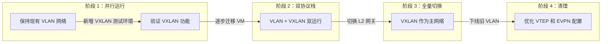

**关键迁移步骤：**

1. **评估现有网络**：梳理 VLAN 规划、MTU、路由策略
2. **升级 Underlay**：确保 IP 网络 MTU ≥ 1550（推荐 9000）
3. **部署 VTEP**：在 Leaf 交换机上启用 VXLAN，配置 VNI 映射
4. **配置控制面**：部署 EVPN RR（Route Reflector），建立 BGP EVPN 对等体
5. **验证流量**：使用 `tcpdump` 和 `示波器` 验证封装/解封装正确
6. **灰度切换**：将部分 VLAN 流量切换到 VXLAN，逐步扩大比例

### 10.7 总结：技术选型决策表

| 决策维度         | VLAN       | QinQ     | VXLAN         | Geneve       |
| ---------------- | ---------- | -------- | ------------- | ------------ |
| **扩展性优先级** | ⭐         | ⭐⭐     | ⭐⭐⭐⭐⭐    | ⭐⭐⭐⭐⭐   |
| **跨 IP 网络**   | ❌         | ❌       | ✅            | ✅           |
| **控制面自动化** | ❌         | ❌       | ⭐⭐⭐ (EVPN) | ⭐⭐⭐ (OVN) |
| **多租户隔离**   | ⭐⭐       | ⭐⭐⭐   | ⭐⭐⭐⭐⭐    | ⭐⭐⭐⭐⭐   |
| **运维复杂度**   | ⭐⭐⭐⭐⭐ | ⭐⭐⭐⭐ | ⭐⭐          | ⭐⭐         |
| **性能开销**     | ⭐⭐⭐⭐⭐ | ⭐⭐⭐⭐ | ⭐⭐⭐        | ⭐⭐⭐       |
| **生态成熟度**   | ⭐⭐⭐⭐⭐ | ⭐⭐⭐   | ⭐⭐⭐⭐      | ⭐⭐⭐       |

---

## 附录：常见问题速查

### Q1: VXLAN 的 UDP 端口应该用哪个？

| 端口     | 说明                       | 使用场景        |
| -------- | -------------------------- | --------------- |
| **4789** | IANA 分配的 VXLAN 官方端口 | 标准生产环境    |
| **8472** | Linux 早期默认端口         | 旧版 Linux 系统 |
| **6081** | Geneve 官方端口            | Geneve 封装     |

### Q2: VXLAN 需要多大的 MTU？

Underlay 网络的 MTU 需要至少 **1550 字节**（标准 MTU 1500 + VXLAN 开销 50 字节）。推荐配置 **9000 字节**（ Jumbo Frame ）以获得最佳性能。

### Q3: VNI 和 VLAN ID 如何映射？

通常采用 1:1 映射或 N:1 映射：

- **1:1 映射**：VLAN 100 → VNI 10100（常用 10xxx 前缀避免混淆）
- **N:1 映射**：多个 VLAN 共享同一 VNI（用于同一租户的多个子网共享 L2 域）

### Q4: EVPN Type 5 路由是什么？

Type 5（IP Prefix Route）是 EVPN 的高级特性，支持**对称 IRB（Integrated Routing and Bridging）**场景下的 IP 前缀路由，解决了 Type 2 无法承载大规模 IP 前缀的问题。

### Q5: Geneve 的 options TLV 可以用于哪些场景？

- **微分段安全策略**：携带安全组元数据
- **QoS 策略传播**：携带 DSCP/PCP 优先级
- **租户 ID 传递**：携带多租户标识
- **网络分析**：携带流量镜像/采样元数据

---

## 参考资料

1. IEEE 802.1Q - IEEE Standard for Local and Metropolitan Area Networks - Bridges and Bridged Networks
2. IEEE 802.1ad - IEEE Standard for Local and Metropolitan Area Networks - Provider Bridges
3. RFC 7348 - VXLAN: A Framework for Overlaying Virtualized Layer 2 Networks over Layer 3 Networks
4. RFC 8926 - Geneve: Generic Network Virtualization Encapsulation
5. RFC 7432 - BGP MPLS-Based Ethernet VPN（EVPN）
6. Cisco Nexus 9000 Series VXLAN Configuration Guide
7. Arista EOS VXLAN and EVPN Configuration Guide
8. VMware NSX-T Data Center Architecture Guide

---

> **系列预告**：Ch6 将深入探讨 **VLAN 与 eBPF/DPDK 的融合**，如何在高性能数据平面实现 VLAN 标签处理与网络功能虚拟化。敬请期待。
