# VLAN 深度探索 Ch6: VLAN 安全与最佳实践

## 概述

VLAN（Virtual Local Area Network）作为网络分段的核心技术，在提升网络效率的同时也引入了诸多安全隐患。本章将系统性地分析针对 VLAN 的各类攻击手法及其防御策略，并提供企业级 VLAN 安全设计的最佳实践。

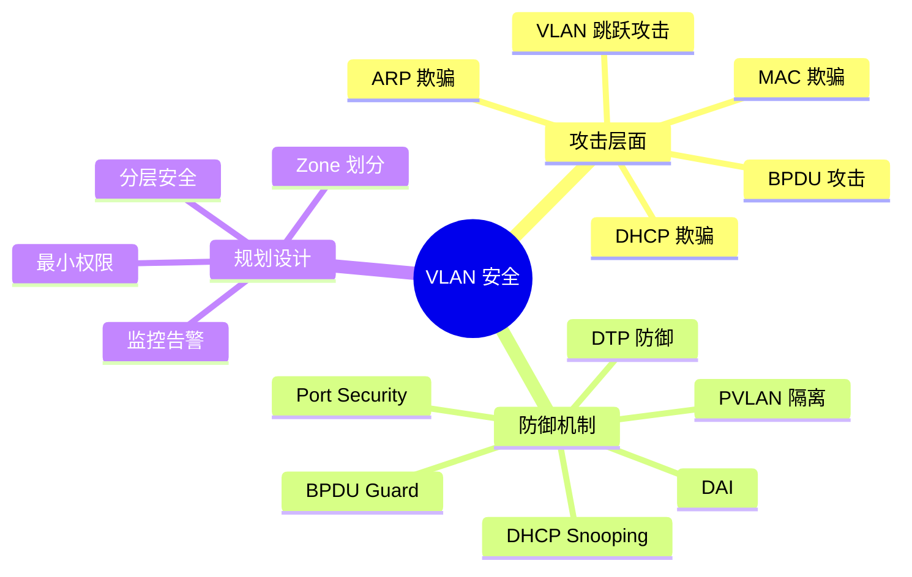

---

## 1. VLAN 跳跃攻击（VLAN Hopping）

VLAN 跳跃攻击是攻击者试图跨越 VLAN 边界访问受限资源的一种攻击方式，主要有两种形式：Switch Spoofing（交换机欺骗）和 Double Tagging（双标签攻击）。

### 1.1 Switch Spoofing（交换机欺骗）

Switch Spoofing 攻击利用交换机默认启用的 DTP（Dynamic Trunking Protocol）协议。攻击者将自己的设备模拟为另一台交换机，通过发送 DTP协商报文尝试与目标交换机建立 Trunk 链路。

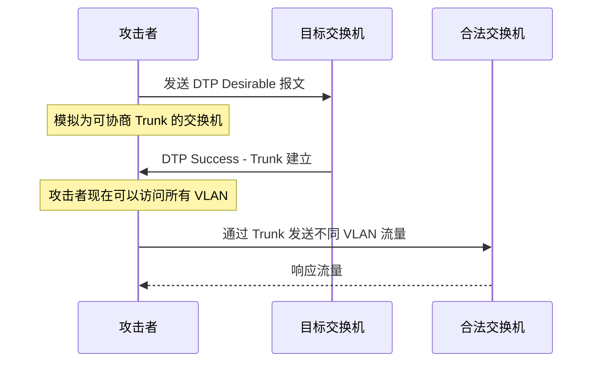

**攻击原理：**

当攻击者发送 DTP `Desired` 报文时，如果目标交换机端口处于 DTP 自动模式（默认配置），双方会协商成为 Trunk 端口。攻击者随后可以向所有 VLAN 发送流量，实现跨 VLAN 跳跃。

### 1.2 Double Tagging（双标签攻击）

Double Tagging 攻击利用 IEEE 802.1Q 的嵌套标签机制和 Native VLAN 不标记的特性。

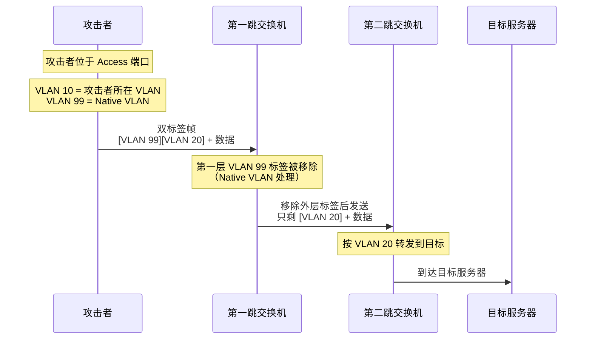

**攻击条件：**

1. 攻击者连接到配置为 Trunk 且 Native VLAN 一致的端口
2. 攻击者能够发送带有双层 VLAN 标签的伪造帧
3. 第一跳交换机的 Native VLAN 与目标 VLAN 不同

### 1.3 攻击对比

| 攻击类型        | 原理                   | 前提条件           | 影响范围        |
| --------------- | ---------------------- | ------------------ | --------------- |
| Switch Spoofing | 伪装成交换机建立 Trunk | DTP 自动协商启用   | 所有 VLAN       |
| Double Tagging  | 利用双标签穿越 Trunk   | Native VLAN 未标记 | 单向到目标 VLAN |

---

## 2. VLAN Hopping 防御策略

### 2.1 关闭 DTP（Dynamic Trunking Protocol）

DTP 是 Cisco 专有协议，默认在大多数交换机端口上启用。显式关闭 DTP 可防止自动 Trunk 协商。

```网络配置
! Cisco IOS 交换机配置
! 方法一：显式关闭 DTP
interface GigabitEthernet0/1
 switchport mode access
 switchport nonegotiate

! 方法二：强制 trunk 模式（如果需要 trunk）
interface GigabitEthernet0/1
 switchport mode trunk
 switchport nonegotiate
```

```bash
# 验证端口 DTP 状态
show dtp interface GigabitEthernet0/1

# 查看哪些端口启用了 DTP 协商
show dtp interface
```

**配置说明：**

- `switchport mode access`：强制端口为 Access 模式，不参与 DTP 协商
- `switchport nonegotiate`：禁用 DTP 报文发送，端口不参与协商过程

### 2.2 强制 Trunk 模式

对于确实需要 Trunk 的端口，应显式配置为 Trunk 模式而非自动协商。

```网络配置
! 全局配置
vtp mode transparent
vtp mode off

! 端口级别强制 Trunk
interface range GigabitEthernet0/1 - 24
 switchport mode trunk
 switchport trunk allowed vlan 10,20,30,99
 switchport trunk native vlan 999
```

### 2.3 Native VLAN 标记（Tagging）

将 Native VLAN 也打上标签是防止 Double Tagging 攻击的最有效方法。

```网络配置
! Cisco IOS - 对 Native VLAN 进行标记
interface GigabitEthernet0/1
 switchport mode trunk
 switchport trunk native vlan 999 tag
```

```bash
# HP ProCurve 配置
vlan 999
   tagged 1-24
   no untagged 1-24
```

```bash
# Juniper EX 系列配置
set interfaces ge-0/0/1 unit 0 family ethernet-switching
    vlan members 999
set protocols mvrp interface ge-0/0/1

# 或者使用 VLAN-tagging
set interfaces ge-0/0/1 vlan-tagging
set interfaces ge-0/0/1 unit 0 vlan-id-list [10 20 30 999]
```

### 2.4 完整的 DTP 防御配置

```网络配置
! ============================================
! 企业交换机安全基线 - DTP 防御配置
! ============================================

! 1. 关闭所有非 Trunk 端口的 DTP
interface range Gi0/1 - 24
 switchport mode access
 switchport nonegotiate
 spanning-tree portfast

! 2. 仅在需要时启用 Trunk 并强制配置
interface GigabitEthernet0/48
 switchport mode trunk
 switchport trunk allowed vlan 10,20,30,99
 switchport trunk native vlan 999 tag
 switchport nonegotiate

! 3. 禁用到未使用端口
interface range Gi0/25 - 47
 switchport mode access
 switchport nonegotiate
 shutdown

! 4. 验证配置
show interfaces switchport | include Negotiation
show interfaces trunk
```

---

## 3. PVLAN（Private VLAN）

PVLAN 是一种高级 VLAN 隔离技术，允许在同一个 VLAN 内实现端口之间的隔离，同时保持IP子网的一致性。

### 3.1 PVLAN 架构组件

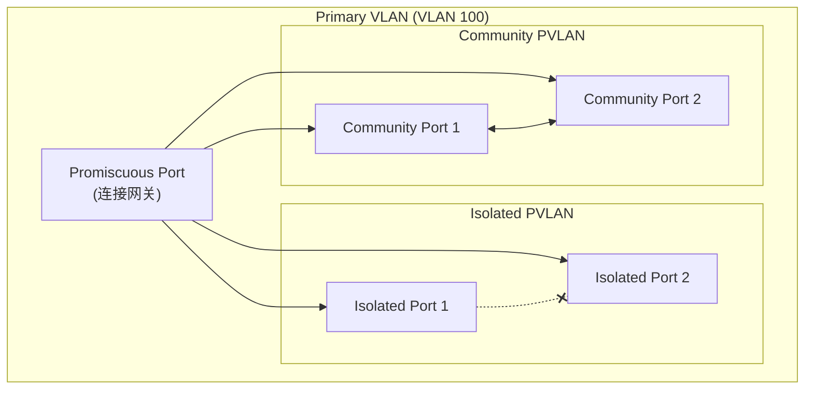

**PVLAN 三种端口类型：**

| 端口类型                | 缩写 | 与其他端口通信 | 与网关通信 | 典型用途           |
| ----------------------- | ---- | -------------- | ---------- | ------------------ |
| Isolated（隔离端口）    | -    | 否             | 是         | 访客网络、隔离用户 |
| Community（社区端口）   | -    | 同社区内可以   | 是         | 部门内部通信       |
| Promiscuous（混杂端口） | -    | 与所有端口     | -          | 路由器、服务器     |

### 3.2 PVLAN 配置示例（Cisco IOS）

```网络配置
! ============================================
! PVLAN 配置示例
! ============================================

! 1. 创建 Primary 和 Secondary VLAN
vlan 100
 name PVLAN-100-Primary
 private-vlan primary
 private-vlan association 101,102

vlan 101
 name PVLAN-101-Isolated
 private-vlan isolated

vlan 102
 name PVLAN-102-Community
 private-vlan community

! 2. 在 SVI 上应用 PVLAN
vlan 100
 private-vlan mapping 101,102

interface Vlan100
 ip address 10.1.100.1 255.255.255.0
 private-vlan mapping 101,102

! 3. 配置端口为 Isolated
interface GigabitEthernet0/1
 switchport mode private-vlan host
 switchport private-vlan host-association 100 101
 spanning-tree portfast

! 4. 配置端口为 Community
interface GigabitEthernet0/2
 switchport mode private-vlan host
 switchport private-vlan host-association 100 102
 spanning-tree portfast

! 5. 配置 Promiscuous 端口（连接网关/路由器）
interface GigabitEthernet0/24
 switchport mode private-vlan promiscuous
 switchport private-vlan mapping 100 101,102
```

### 3.3 PVLAN 实际应用场景

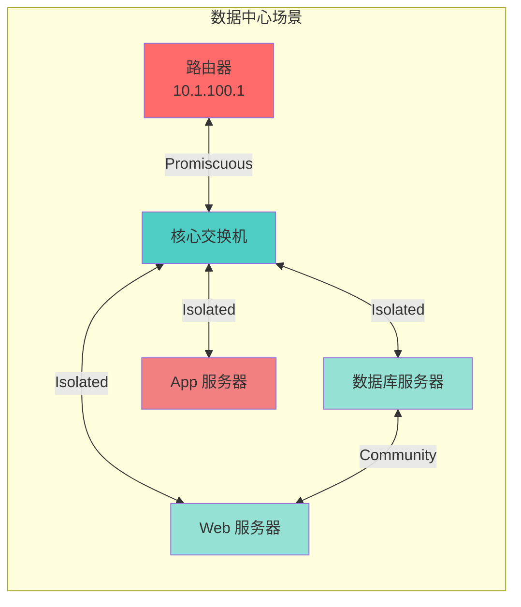

**典型应用场景：**

1. **多租户数据中心**：每个租户的服务器之间隔离，但都可以访问共享网关
2. **酒店/校园网络**：用户之间隔离，但都可以访问互联网网关
3. **金融服务**：隔离不同安全级别的系统，同时允许统一监控

### 3.4 PVLAN 配置验证

```bash
# 验证 PVLAN 配置
show vlan private-vlan

# 输出示例：
# Primary  Secondary  Type              Ports
# ------- --------- ----------------- ----------------------------------------------
# 100      101       isolated          Gi0/1, Gi0/3
# 100      102       community         Gi0/2, Gi0/4
# 100      -         promiscuous       Gi0/24

show interfaces private-vlan mapping
# Interface              Secondary    Type             Primary
# ---------------------- -----------  --------------- -----------
# Vl100                  101          isolated        100
# Vl100                  102          community       100
```

---

## 4. DHCP 欺骗与防御

### 4.1 DHCP 欺骗攻击原理

DHCP 欺骗攻击（DHCP Spoofing）利用 DHCP 协议的信任关系，攻击者部署恶意 DHCP 服务器来分发伪造的 DHCP 响应。

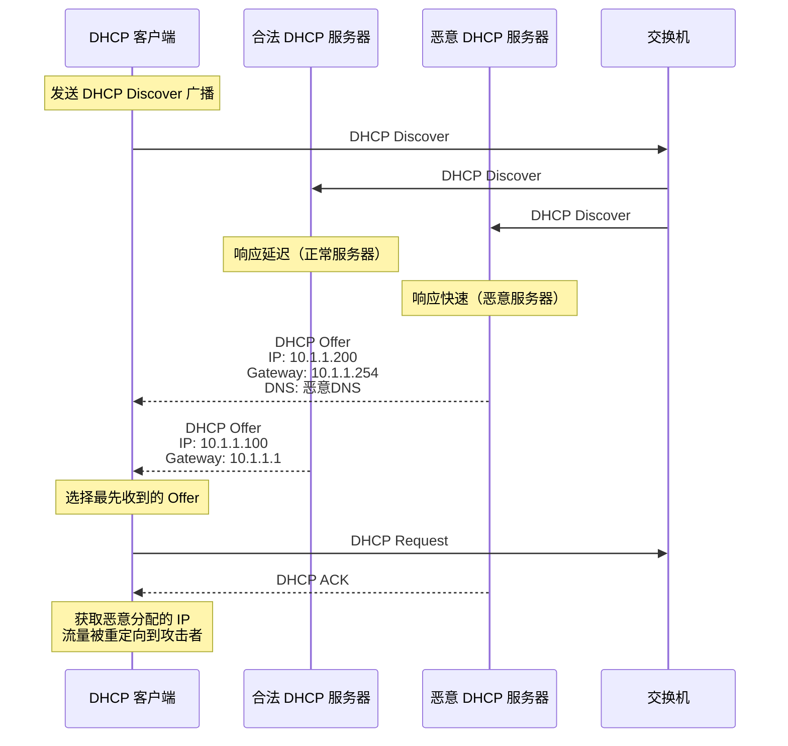

**攻击后果：**

- 流量重定向到攻击者控制的网关
- DNS 劫持导致钓鱼攻击
- 中间人攻击（MITM）
- 拒绝服务（DoS）——分配无效 IP

### 4.2 DHCP Snooping 防御机制

DHCP Snooping 是交换机上的二层安全特性，通过建立 DHCP 绑定表来区分可信和不可信的 DHCP 端口。

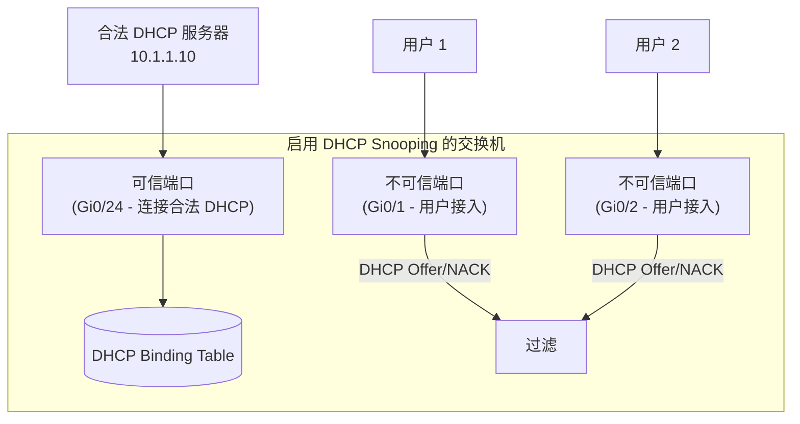

### 4.3 DHCP Snooping 配置

```网络配置
! ============================================
! DHCP Snooping 配置
! ============================================

! 1. 全局启用 DHCP Snooping
ip dhcp snooping

! 2. 在特定 VLAN 上启用
ip dhcp snooping vlan 10,20,30

! 3. 配置可信端口（连接合法 DHCP 服务器）
interface GigabitEthernet0/24
 ip dhcp snooping trust

! 4. 配置限速（防止 DHCP 耗尽攻击）
interface GigabitEthernet0/1
 ip dhcp snooping limit rate 10

! 5. 启用 Option 82 插入（可选，用于追踪）
ip dhcp snooping information option
ip dhcp snooping information option allow-untrusted

! 6. 验证配置
show ip dhcp snooping
show ip dhcp snooping binding
```

```bash
# 查看 DHCP Snooping 状态
show ip dhcp snooping

# 输出示例：
# Switch DHCP snooping is enabled
# DHCP snooping is configured on VLANs 10,20,30
# DHCP snooping insertion is enabled
# Option 82 is not inserted
# Circuit ID format: None
# Remote ID format: MAC
# DHCP snooping trust ports:
#   Gi0/24 - Trusted
# DHCP snooping rate limit: 10 pps on untrusted ports
# DHCP snooping verification: MAC address verification disabled
```

### 4.4 Option 82（Relay Agent Information）

Option 82 是 DHCP 中继代理信息选项，用于在 DHCP 请求穿越多个网络时提供位置信息。

```网络配置
! Option 82 包含两个子选项：
! - Circuit ID: 标识请求来自哪个端口/VLAN
! - Remote ID: 标识 DHCP Snooping 设备的标识

! 配置示例
interface GigabitEthernet0/1
 ip dhcp snooping information option
 ip dhcp snooping information option format remote-id hostname

! 查看 Option 82 格式
show ip dhcp snooping | include Option
```

```bash
# 在 DHCP 服务器上查看 Option 82 信息
# Linux ISC DHCP 服务器配置
# /etc/dhcp/dhcpd.conf

option space VSANSERV;
option VSANSERV.circuit-id code 1 = text;
option VSANSERV.remote-id code 2 = text;

class "snooping" {
    match if option agent.circuit-id != "";
    pool {
        range 10.1.100.100 10.1.100.200;
        deny members of "untrusted";
    }
}
```

### 4.5 DHCP 防御参数对比

| 参数              | 推荐值                 | 说明             |
| ----------------- | ---------------------- | ---------------- |
| Snooping 全局启用 | Yes                    | 交换机级别启用   |
| 速率限制          | 10-100 pps             | 防止耗尽攻击     |
| MAC 验证          | Enabled                | 验证 CHADDR 字段 |
| Option 82         | Enabled                | 提供位置追踪能力 |
| 可信端口          | 仅 DHCP 服务器所在端口 | 最小权限原则     |

---

## 5. ARP 欺骗与防御

### 5.1 ARP 欺骗攻击原理

ARP 欺骗（ARP Spoofing）利用 ARP 协议无信任验证的特性，攻击者发送伪造的 ARP 响应来毒化受害者的 ARP 缓存。

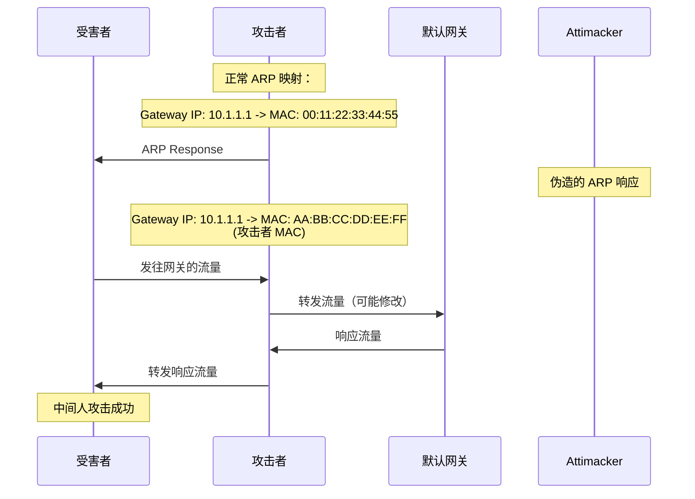

**攻击类型：**

1. **单向 ARP 欺骗**：只欺骗受害者，导致其流量流向攻击者
2. **双向 ARP 欺骗**：同时欺骗受害者和网关，形成完整 MITM
3. **DoS 攻击**：发送伪造 ARP 将 IP 映射到不存在 MAC

### 5.2 Dynamic ARP Inspection（DAI）

DAI 是交换机上的二层安全特性，通过检查 ARP 响应报文是否与 DHCP Snooping 表匹配来防止 ARP 欺骗。

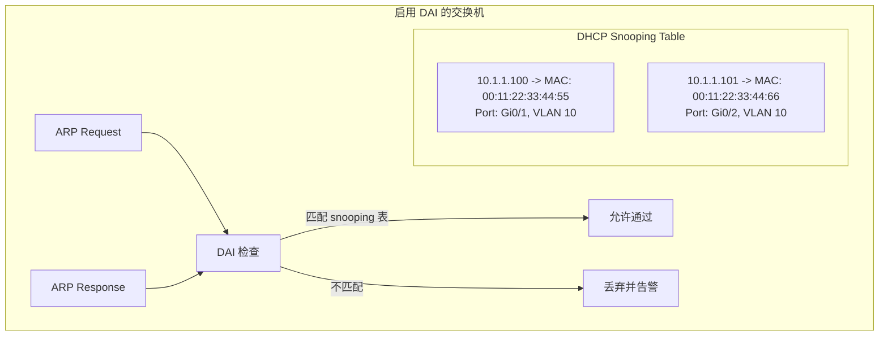

### 5.3 DAI 配置

```网络配置
! ============================================
! Dynamic ARP Inspection 配置
! ============================================

! 1. 全局启用 DAI（需要先启用 DHCP Snooping）
ip arp inspection vlan 10,20,30

! 2. 配置可信端口（连接交换机间链路、DHCP 服务器）
interface GigabitEthernet0/24
 ip arp inspection trust

! 3. 配置端口验证模式
interface GigabitEthernet0/1
! 模式：
! - dhcpsnooping:（默认）验证与 DHCP Snooping 表匹配
! - noop: 无验证
! - static: 使用静态配置的 ARP ACL
 ip arp inspection validate src-mac dst-mac ip

! 4. 配置 ARP ACL（用于静态映射）
ip arp inspection vlan 10
ip arp inspection filter arp-acl-static vlan 10

arp access-list arp-acl-static
 permit ip host 10.1.1.100 mac host 0011.2233.4455
 permit ip host 10.1.1.101 mac host 0011.2233.4466

! 5. 限速配置（防止 ARP 泛洪）
interface GigabitEthernet0/1
 ip arp inspection limit rate 15

! 6. 验证配置
show ip arp inspection
show ip arp inspection interfaces
show ip arp inspection statistics
```

```bash
# 查看 DAI 统计信息
show ip arp inspection statistics vlan 10

# 输出示例：
# Vlan 10:
# --------
# Forwarded:        12345
# Dropped:          12
# ACL Matched:      0
# DHCP Matched:     12333
# Invalid:          12
#   - IP Invalid:   0
#   - MAC Invalid:  8
#   - Both Invalid: 4
```

### 5.4 IP Source Guard（IPSG）

IPSG 与 DAI 协同工作，基于 DHCP Snooping 表或静态绑定防止 IP spoofing 攻击。

```网络配置
! ============================================
! IP Source Guard 配置
! ============================================

! 1. 全局启用 IPSG
ip source binding vlan 10 10.1.1.100 interface Gi0/1 0011.2233.4455

! 2. 在端口上启用 IPSG
interface GigabitEthernet0/1
 ip verify source vlan dhcp-snooping

! 3. 启用 MAC 地址验证
interface GigabitEthernet0/1
 ip verify source vlan dhcp-snooping mac-check

! 4. 验证配置
show ip source binding
show ip verify source
```

```bash
# 查看 IPSG 绑定表
show ip source binding

# 输出示例：
# Type    VLAN  IP Address      MAC Address    Interface
# ------+----+---------------+----------------+----------
# DHCP    10    10.1.1.100      0011.2233.4455  Gi0/1
# DHCP    10    10.1.1.101      0011.2233.4466  Gi0/2
# Static  20    10.1.2.100      aabb.ccdd.eeff  Gi0/10
```

### 5.5 DAI 与 IPSG 对比

| 特性       | DAI                             | IPSG                        |
| ---------- | ------------------------------- | --------------------------- |
| 检查对象   | ARP 响应                        | IP 数据包                   |
| 验证依据   | DHCP Snooping 表 / 静态 ARP ACL | DHCP Snooping 表 / 静态绑定 |
| 工作层次   | 三层 ARP                        | 二层 IP 头                  |
| 防御攻击   | ARP 欺骗                        | IP 欺骗                     |
| 配置复杂度 | 中等                            | 低                          |

---

## 6. MAC 欺骗与防御

### 6.1 MAC 欺骗攻击原理

MAC 欺骗攻击通过伪造网络设备的 MAC 地址来绕过基于 MAC 的访问控制或进行其他恶意活动。

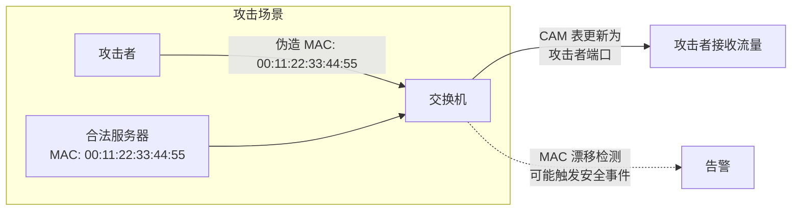

**攻击类型：**

1. **MAC 泛洪**：发送大量不同 MAC 地址填满 CAM 表
2. **MAC 伪造**：冒充合法设备的 MAC 地址
3. **MAC 漂移**：同一 MAC 在不同端口频繁移动

### 6.2 Port Security（端口安全）

Port Security 限制端口上允许学习的 MAC 地址数量和具体地址。

```网络配置
! ============================================
! Port Security 配置
! ============================================

! 1. 启用端口安全
interface GigabitEthernet0/1
 switchport mode access
 switchport port-security

! 2. 配置最大 MAC 地址数（默认 1）
 switchport port-security maximum 5

! 3. 配置安全违规行为
! - protect: 丢弃未知 MAC 的流量，不告警
! - restrict: 丢弃流量，发送 SNMP 告警（默认）
! - shutdown: 端口进入 err-disabled 状态
 switchport port-security violation restrict

! 4. 配置老化时间（可选）
 switchport port-security aging time 120
 switchport port-security aging type inactivity

! 5. 配置静态安全 MAC 地址
 switchport port-security mac-address 0011.2233.4455
 switchport port-security mac-address sticky

! 6. 验证配置
show port-security interface GigabitEthernet0/1
show port-security address
```

### 6.3 Sticky MAC（粘性 MAC）

Sticky MAC 地址从动态学习转为持久化配置，适用于固定设备的接入场景。

```网络配置
! ============================================
! Sticky MAC 配置
! ============================================

interface GigabitEthernet0/1
 switchport mode access
 switchport port-security
 switchport port-security maximum 3
 switchport port-security violation restrict
 switchport port-security mac-address sticky

! 将当前动态学习的 MAC 转为 sticky
! 配置后，当前学习的 MAC 会被保存在 running-config
```

```bash
# 将 sticky MAC 地址保存到 startup-config
copy running-config startup-config

# 查看 sticky MAC
show port-security address interface Gi0/1

# 输出示例：
# Secure Mac Address Table
# ----------------------------------------------------------------------------
# VLAN  MAC Address    Type        Interface           Remaining Age(mins)
# ----  -----------    ----------  ------------------  --------------------
# 10    0011.2233.4455  SecureSticky Gi0/1              -
# 10    0011.2233.4466  SecureSticky Gi0/1              -
# 10    0011.2233.4477  SecureSticky Gi0/1              -
```

### 6.4 MAC 限速与 CAM Table 防护

```网络配置
! ============================================
! MAC 泛洪防护配置
! ============================================

! 1. 限制 MAC 地址学习速率
interface GigabitEthernet0/1
 switchport port-security limit rate 10

! 2. 禁用 MAC 地址学习（最严格）
interface GigabitEthernet0/1
 switchport mode access
 switchport port-security
 no switchport port-security mac-address-learning

! 3. 配置静态 CAM 条目
mac address-table static 0011.2233.4455 vlan 10 interface Gi0/1

! 4. 启用 MAC 地址漂移检测
mac address-table notification enable
mac address-table notification mac-move

! 5. 配置 MAC 漂移检测阈值
mac address-table aging-time 300
```

```bash
# 查看 CAM 表使用情况
show mac address-table count

# 输出示例：
# MAC Entries for all VLANs:
# Total MAC Addresses: 1024
# System MAC Addresses: 128
# Configured Unicast: 256
# Dynamic Unicast: 640
# Static entries: 0

# 查看 MAC 漂移历史
show mac address-table notification mac-move
```

### 6.5 Port Security 与 MAC 相关的功能对比

| 功能       | Port Security     | 动态 CAM | 静态 MAC |
| ---------- | ----------------- | -------- | -------- |
| 配置复杂度 | 中等              | 无       | 高       |
| 持久化     | 可配置            | 否       | 是       |
| 自动化     | Sticky 可自动学习 | 自动学习 | 手动配置 |
| 适用场景   | 接入层            | 汇聚层   | 关键设备 |
| 违规检测   | 支持              | 有限     | 支持     |

---

## 7. VLAN ACL 与 PACL/RACL

### 7.1 ACL 类型概述

在 VLAN 环境中，有三种主要的 ACL 类型用于流量过滤：

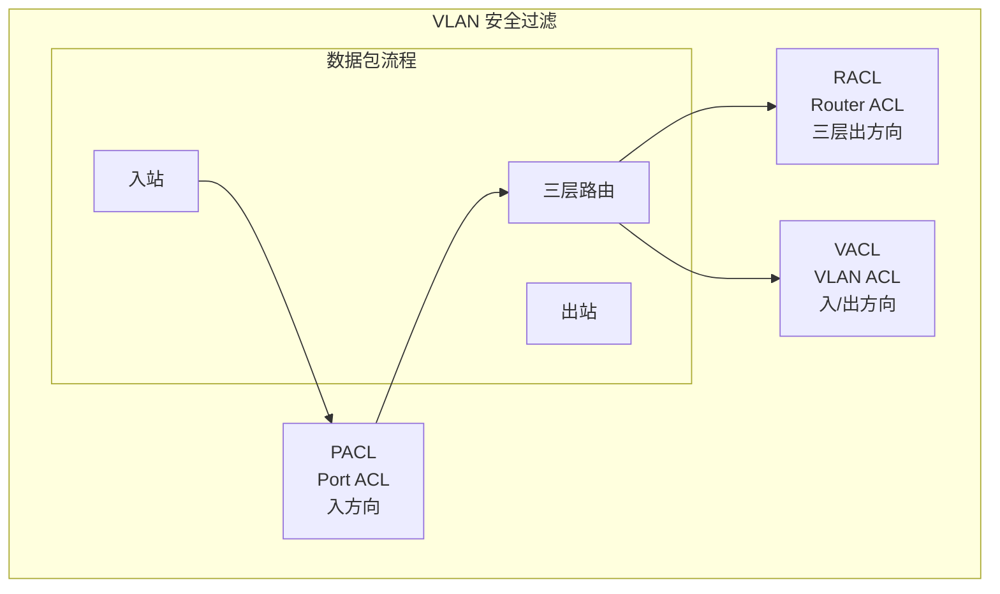

| ACL 类型 | 作用位置   | 过滤方向       | 生效时机 |
| -------- | ---------- | -------------- | -------- |
| PACL     | 交换机端口 | 入站           | 二层入口 |
| RACL     | VLAN SVI   | 出站（路由后） | 三层出口 |
| VACL     | VLAN 内部  | 入/出站        | 二层处理 |

### 7.2 PACL（Port ACL）配置

PACL 在端口级别应用，对所有进入该端口的流量进行过滤。

```网络配置
! ============================================
! PACL 配置示例
! ============================================

! 1. 创建扩展 ACL
ip access-list extended DENY-TELNET-ACL
 deny tcp any any eq 23
 deny tcp any any eq 135
 deny tcp any any eq 139
 deny tcp any any eq 445
 permit ip any any

! 2. 在端口应用 ACL
interface GigabitEthernet0/1
 switchport mode access
 ip access-group DENY-TELNET-ACL in

! 3. 验证
show ip interface GigabitEthernet0/1 | include access list
```

### 7.3 RACL（Router ACL）配置

RACL 在三层 VLAN SVI 接口上应用，控制路由后的流量。

```网络配置
! ============================================
! RACL 配置示例
! ============================================

! 1. 创建 ACL 限制 VLAN 间访问
ip access-list extended VLAN10-TO-VLAN20
 permit tcp 10.1.10.0 0.0.0.255 10.1.20.0 0.0.0.255 eq 443
 permit tcp 10.1.10.0 0.0.0.255 10.1.20.0 0.0.0.255 eq 80
 permit icmp 10.1.10.0 0.0.0.255 10.1.20.0 0.0.0.255
 deny ip 10.1.10.0 0.0.0.255 10.1.20.0 0.0.0.255
 permit ip any any

! 2. 在 SVI 接口应用
interface Vlan10
 ip address 10.1.10.1 255.255.255.0
 ip access-group VLAN10-TO-VLAN20 out

! 3. 对于入站 RACL（在其他 VLAN 的 SVI 上）
interface Vlan20
 ip address 10.1.20.1 255.255.255.0
 ip access-group VLAN10-TO-VLAN20 in
```

### 7.4 VACL（VLAN ACL）配置

VACL 可以过滤 VLAN 内部的流量，包括广播和组播流量。

```网络配置
! ============================================
! VACL 配置示例
! ============================================

! 1. 创建 ACL
ip access-list extended SERVER-ACCESS
 permit tcp any host 10.1.10.100 eq 443
 permit tcp any host 10.1.10.100 eq 80
 permit icmp any host 10.1.10.100
 deny ip any any

! 2. 创建 VLAN Access Map
vlan access-map VACL-EXAMPLE 10
 match ip address SERVER-ACCESS
 action drop

vlan access-map VACL-EXAMPLE 20
 action forward

! 3. 在 VLAN 上应用
vlan filter VACL-EXAMPLE vlan-list 10

! 4. 验证
show vlan access-map
show vlan filter
```

### 7.5 ACL 处理顺序与优先级

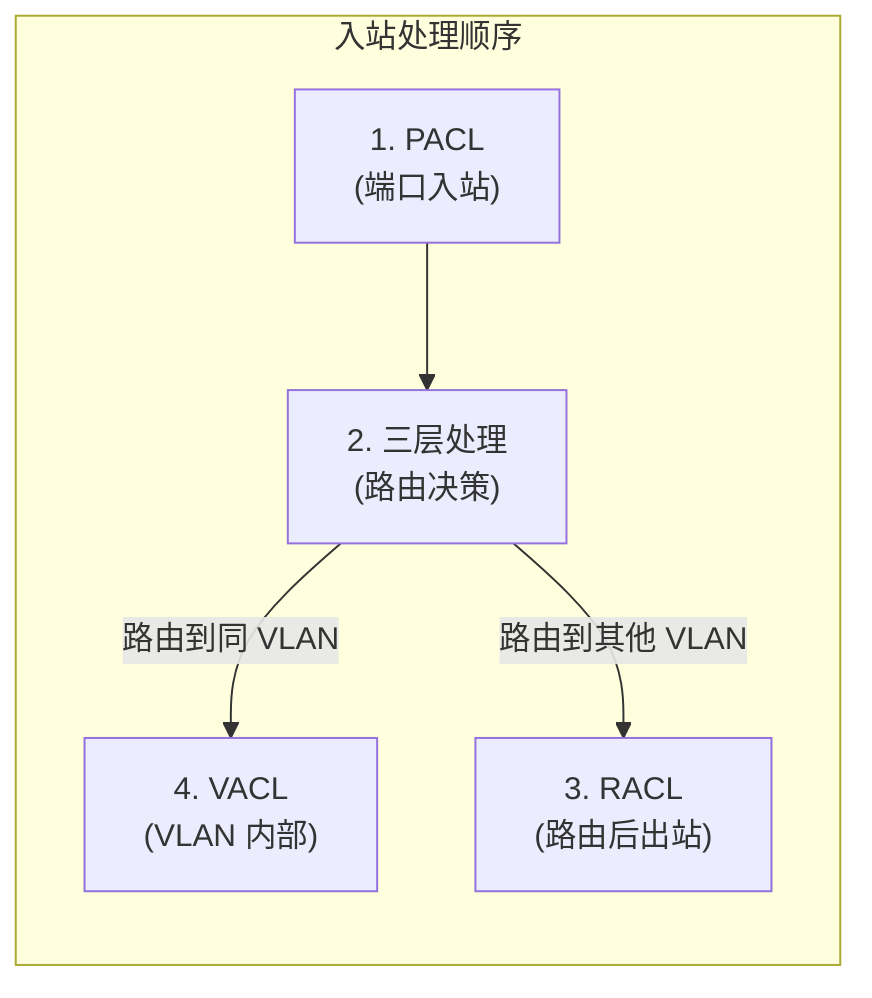

**关键点：**

- PACL 先于路由处理
- 路由后的流量先经过 RACL 再发送
- VACL 作用于 VLAN 内部流量（不上路由的流量）

### 7.6 PACL 与 RACL 对比

| 特性     | PACL           | RACL                 |
| -------- | -------------- | -------------------- |
| 应用位置 | 物理端口       | VLAN SVI             |
| 过滤时机 | 入站（路由前） | 出站（路由后）       |
| 过滤范围 | 端口所有流量   | 路由流量             |
| 广播流量 | 过滤           | 不过滤（广播不路由） |
| CPU 负载 | 低             | 中                   |

---

## 8. BPDU 攻击与防御

### 8.1 BPDU 攻击类型

STP（Spanning Tree Protocol）相关的攻击主要有三种：

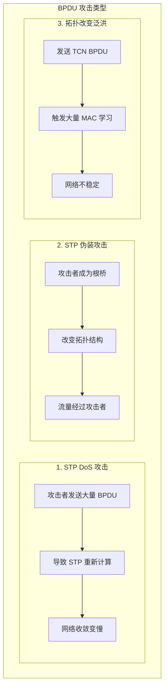

### 8.2 PortFast 与 BPDU Guard

PortFast 用于接入层端口，使其直接进入转发状态，适用于连接终端设备的端口。

```网络配置
! ============================================
! PortFast 配置
! ============================================

! 1. 全局启用 PortFast（所有 Access 端口）
spanning-tree portfast default

! 2. 端口级别启用
interface GigabitEthernet0/1
 spanning-tree portfast

! 3. 配置 BPDU Guard（BPDU Guard 与 PortFast 配合使用）
interface GigabitEthernet0/1
 spanning-tree bpduguard enable

! 4. BPDU Guard 行为配置
! - default: 收到 BPDU 后端口进入 err-disabled
! - disable: 收到 BPDU 后禁用 PortFast
! - enable: 启用 BPDU Guard（默认）
spanning-tree bpduguard {enable | disable | on}

! 5. 全局启用 BPDU Guard
spanning-tree portfast bpduguard default
```

```bash
# 查看 PortFast 端口
show spanning-tree interface GigabitEthernet0/1 portfast

# 查看 BPDU Guard 状态
show spanning-tree detail | include bpduguard
```

### 8.3 Root Guard

Root Guard 防止非指定端口成为根端口，阻止外部交换机成为根桥。

```网络配置
! ============================================
! Root Guard 配置
! ============================================

! 在连接非信任交换机的端口启用
interface GigabitEthernet0/24
 spanning-tree guard root

! 验证
show spanning-tree interface GigabitEthernet0/24 guard
```

```bash
# 输出示例：
# Interface    Instance  Port-State    Uptime    Loop-guard
# ---------    --------  ----------    ------    ----------
# Gi0/24       1         forwarding    10d10h    enabled

# 查看被 Root Guard 阻塞的端口
show spanning-tree blockedports
```

### 8.4 Loop Guard

Loop Guard 检测单向链路故障，防止生成树环路。

```网络配置
! ============================================
! Loop Guard 配置
! ============================================

! 全局启用
spanning-tree loopguard default

! 端口级别启用
interface GigabitEthernet0/1
 spanning-tree guard loop

! 验证
show spanning-tree interface GigabitEthernet0/1 guard
```

### 8.5 BPDU 防护参数配置总结

| 特性       | 作用                     | 适用端口                 | 配置建议                 |
| ---------- | ------------------------ | ------------------------ | ------------------------ |
| PortFast   | 跳过 STP 监听/学习       | 接入层 Access 端口       | 接入层默认启用           |
| BPDU Guard | 收到 BPDU 时 err-disable | 连接终端的 PortFast 端口 | 接入层默认启用           |
| Root Guard | 阻止成为根桥             | 上联端口                 | 连接非信任交换机的上联口 |
| Loop Guard | 检测单向链路             | 所有端口                 | 汇聚层/核心层端口        |

```网络配置
! ============================================
! 完整的接入层交换机 BPDU 防护配置
! ============================================

! 接入层安全基线配置
spanning-tree mode rapid-pvst
spanning-tree portfast default
spanning-tree portfast bpduguard default

! 对于连接其他交换机的端口，明确禁用 PortFast
interface GigabitEthernet0/24
 spanning-tree portfast disable
 spanning-tree guard root

! 验证配置
show spanning-tree summary
show spanning-tree interface Gi0/1-23 portfast
show spanning-tree interface Gi0/24 guard
```

---

## 9. 企业 VLAN 安全设计

### 9.1 分层安全架构

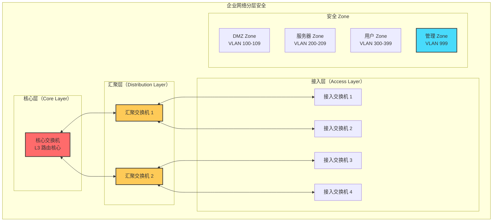

### 9.2 Zone 划分策略

| Zone        | VLAN 范围 | 安全性级别 | 访问控制策略               |
| ----------- | --------- | ---------- | -------------------------- |
| Management  | 999       | 最高       | 仅允许管理流量，SSH/HTTPS  |
| Server Farm | 200-209   | 高         | 严格访问控制，ACL 细化     |
| DMZ         | 100-109   | 中高       | 允许外部访问，限制入站     |
| User        | 300-399   | 中         | 基于角色的访问控制         |
| Guest       | 400-409   | 低         | 互联网访问，禁止访问内网   |
| IoT         | 500-599   | 低         | 网络隔离，禁止访问办公网络 |

### 9.3 最小权限配置示例

```网络配置
! ============================================
! 企业交换机安全基线配置
! ============================================

! 1. 禁用未使用端口
interface range Gi0/25 - 48
 shutdown

! 2. 强制 Access 模式 + 禁用 DTP
interface range Gi0/1 - 24
 switchport mode access
 switchport nonegotiate
 spanning-tree portfast

! 3. 启用 Port Security
interface range Gi0/1 - 24
 switchport port-security maximum 3
 switchport port-security violation restrict
 switchport port-security aging time 60

! 4. 启用 DHCP Snooping + DAI + IPSG
ip dhcp snooping
ip dhcp snooping vlan 10,20,30,40,100-109,200-209,300-399,400-409,500-599
ip arp inspection vlan 10,20,30,40,100-109,200-209,300-399,400-409,500-599
ip source tracking

! 5. 可信端口配置
interface GigabitEthernet0/24
 ip dhcp snooping trust
 ip arp inspection trust

! 6. BPDU 防护
spanning-tree portfast bpduguard default
spanning-tree guard root

! 7. 配置 Native VLAN
switchport trunk native vlan 999 tag

! 8. 限制 VLAN 范围
switchport trunk allowed vlan 10,20,30,40,100-109,200-209,300-399,400-409,500-599,999
```

### 9.4 多租户 VLAN 隔离设计

```mermaid
graph LR
    subgraph "租户 A"
        VA1["VLAN 101<br/>10.1.101.0/24"]
        VA2["VLAN 102<br/>10.1.102.0/24"]
        VA3["VLAN 103<br/>10.1.103.0/24"]
    end

    subgraph "租户 B"
        VB1["VLAN 201<br/>10.2.201.0/24"]
        VB2["VLAN 202<br/>10.2.202.0/24"]
        VB3["VLAN 203<br/>10.2.203.0/24"]
    end

    subgraph "共享服务"
        Shared["VLAN 999<br/>共享 DNS/DHCP"]
    end

    VA1 <-->|通过 VRF 隔离| Shared
    VB1 <-->|通过 VRF 隔离| Shared
    VA1 -x VB1
    VA2 -x VB2
```

### 9.5 企业 VLAN 安全检查表

| 检查项                                      | 优先级   | 状态 |
| ------------------------------------------- | -------- | ---- |
| 禁用未使用端口                              | 必须     | ☐    |
| 所有 Access 端口配置 switchport mode access | 必须     | ☐    |
| 所有 Access 端口配置 switchport nonegotiate | 必须     | ☐    |
| Native VLAN 标记或使用独立 VLAN             | 必须     | ☐    |
| 启用 DHCP Snooping                          | 必须     | ☐    |
| DHCP 服务器端口配置为 trust                 | 必须     | ☐    |
| 启用 DAI                                    | 必须     | ☐    |
| 启用 Port Security（接入层）                | 强烈推荐 | ☐    |
| 启用 BPDU Guard（接入层）                   | 强烈推荐 | ☐    |
| 配置 Root Guard（上联端口）                 | 强烈推荐 | ☐    |
| 启用 IPSG（接入层）                         | 推荐     | ☐    |
| 配置 VTY 访问限制                           | 必须     | ☐    |
| 禁用 CDP/LLDP（边缘端口）                   | 推荐     | ☐    |
| 配置日志服务器                              | 推荐     | ☐    |

---

## 10. VLAN 安全检查清单与监控

### 10.1 日志与告警配置

```网络配置
! ============================================
! 安全日志配置
! ============================================

! 1. 配置日志服务器
logging host 10.1.999.10
logging source-interface Vlan999
logging trap informational
logging facility local6

! 2. 启用安全相关日志
logging history debugging
logging source-interface Vlan999

! 3. 配置 ACL 日志
ip access-list extended SEC-ACL-LOG
 permit tcp any any eq 23 log
 permit tcp any any eq 22 log
 permit ip any any log

! 4. 启用 STP 变化日志
spanning-tree logging
```

### 10.2 NetFlow 与 sFlow 监控

NetFlow 和 sFlow 是网络流量监控的主要协议，用于安全分析和性能监控。

```bash
# Cisco IOS NetFlow 配置
! 1. 全局启用 NetFlow
ip flow-export destination 10.1.999.11 2055
ip flow-export version 9

! 2. 在 SVI 上启用
interface Vlan10
 ip flow ingress
 ip flow egress

! 3. 验证 NetFlow
show ip flow interface
show ip flow export
```

```bash
# sFlow 配置示例（HP ProCurve）
sflow destination 10.1.999.11 2056
sflow sampling 1024
sflow polling 30

# 在端口上启用
interface 1-24
 sflow
```

```bash
# Juniper EX 系列 sFlow 配置
set protocols sflow collector 10.1.999.11 port 2056
set protocols sflow sampling-rate 1024
set protocols sflow polling-interval 30
set protocols sflow interface ge-0/0/0.0 sample-rate 1024
```

### 10.3 SNMP 安全监控

```网络配置
! ============================================
! SNMP 安全配置
! ============================================

! 1. 禁用 SNMPv1/v2c（不安全）
no snmp-server

! 2. 仅启用 SNMPv3
snmp-server group SECGROUP v3 authpriv read SECVIEW notify SECNOTIFY
snmp-server user admin SECGROUP v3 auth sha AUTH-KEY priv aes 256 PRIV-KEY

! 3. 允许特定管理网络访问
snmp-server community public ro 10.1.999.0/24
snmp-server community private rw 10.1.999.0/24

! 4. 配置 SNMP Trap
snmp-server enable traps
snmp-server host 10.1.999.10 version 3 auth admin
```

### 10.4 安全事件监控矩阵

| 事件类型           | 监控协议         | 告警级别 | 响应时间 |
| ------------------ | ---------------- | -------- | -------- |
| DHCP Snooping 丢弃 | Syslog/SNMP Trap | 高       | 立即     |
| DAI 验证失败       | Syslog/SNMP Trap | 高       | 立即     |
| Port Security 违规 | Syslog/SNMP Trap | 中       | 5 分钟   |
| BPDU Guard 触发    | Syslog/SNMP Trap | 高       | 立即     |
| Root Guard 阻止    | Syslog/SNMP Trap | 中       | 10 分钟  |
| CAM 表接近上限     | SNMP 轮询        | 低       | 30 分钟  |
| 异常流量模式       | NetFlow/sFlow    | 中       | 15 分钟  |

### 10.5 自动化安全监控脚本

```python
#!/usr/bin/env python3
"""
VLAN 安全监控脚本示例
依赖: pysnmp, requests
"""

import requests
from pysnmp.hlapi import *

# 配置
SNMP_TARGET = '10.1.999.1'
SNMP_COMMUNITY = 'private'
SYSLOG_SERVER = 'http://10.1.999.10:8080/api/logs'

def check_dhcp_snooping_violations():
    """检查 DHCP Snooping 违规"""
    oid = '1.3.6.1.4.1.9.9.380.1.1.2.0'  # CISCO-DHCP-SNOOPING-MIB

    iterator = getCmd(
        SnmpEngine(),
        CommunityData(SNMP_COMMUNITY),
        UdpTransportTarget((SNMP_TARGET, 161)),
        ContextData(),
        ObjectType(ObjectIdentity(oid))
    )

    errorIndication, errorStatus, errorIndex, varBinds = next(iterator)

    if errorIndication:
        print(f"SNMP Error: {errorIndication}")
        return

    for varBind in varBinds:
        violations = int(varBind[1])
        if violations > 0:
            send_alert(f"DHCP Snooping Violations: {violations}", "HIGH")

def check_port_security_violations():
    """检查 Port Security 违规"""
    oid = '1.3.6.1.4.1.9.9.315.1.1.2.0'  # CISCO-PORT-SECURITY-MIB

    iterator = getCmd(
        SnmpEngine(),
        CommunityData(SNMP_COMMUNITY),
        UdpTransportTarget((SNMP_TARGET, 161)),
        ContextData(),
        ObjectType(ObjectIdentity(oid))
    )

    errorIndication, errorStatus, errorIndex, varBinds = next(iterator)

    if not errorIndication:
        for varBind in varBinds:
            violations = int(varBind[1])
            if violations > 10:  # 阈值
                send_alert(f"Port Security Violations: {violations}", "MEDIUM")

def send_alert(message, severity):
    """发送告警"""
    payload = {
        'source': 'vlan-security-monitor',
        'severity': severity,
        'message': message
    }
    # requests.post(SYSLOG_SERVER, json=payload)
    print(f"[{severity}] {message}")

if __name__ == '__main__':
    check_dhcp_snooping_violations()
    check_port_security_violations()
```

### 10.6 安全检查脚本

```bash
#!/bin/bash
# VLAN 安全检查脚本
# 用于快速检查交换机安全配置状态

SWITCH_IP="10.1.999.1"
SNMP_COMMUNITY="public"

echo "=== VLAN 安全检查报告 ==="
echo "时间: $(date)"
echo "设备: $SWITCH_IP"
echo ""

# 1. 检查 DTP 协商状态
echo "[1] DTP 协商检查"
snmpwalk -v2c -c $SNMP_COMMUNITY $SWITCH_IP 1.3.6.1.4.1.9.9.46.1.1.1 | grep -i negotiate

# 2. 检查 DHCP Snooping 状态
echo ""
echo "[2] DHCP Snooping 状态"
snmpwalk -v2c -c $SNMP_COMMUNITY $SWITCH_IP 1.3.6.1.4.1.9.9.380.1.1.1 | head -5

# 3. 检查 Port Security
echo ""
echo "[3] Port Security 统计"
snmpwalk -v2c -c $SNMP_COMMUNITY $SWITCH_IP 1.3.6.1.4.1.9.9.315.1.1.1 | head -10

# 4. 检查 BPDU Guard
echo ""
echo "[4] BPDU Guard 状态"
snmpwalk -v2c -c $SNMP_COMMUNITY $SWITCH_IP 1.3.6.1.4.1.9.9.46.1.2.1 | grep -i bpduguard

# 5. 检查 Native VLAN 配置
echo ""
echo "[5] Native VLAN 配置"
snmpwalk -v2c -c $SNMP_COMMUNITY $SWITCH_IP 1.3.6.1.4.1.9.9.46.1.3.1.1.5 | grep -i native

echo ""
echo "=== 检查完成 ==="
```

---

## 总结

VLAN 安全是企业网络安全的重要组成部分。本章涵盖了从攻击原理到防御实践的完整知识体系：

| 攻击类型     | 核心防御技术               | 配置复杂度 |
| ------------ | -------------------------- | ---------- |
| VLAN Hopping | DTP 禁用、Native VLAN 标记 | 低         |
| DHCP 欺骗    | DHCP Snooping + Option 82  | 中         |
| ARP 欺骗     | DAI + IPSG                 | 中         |
| MAC 欺骗     | Port Security + Sticky MAC | 低         |
| BPDU 攻击    | BPDU Guard + Root Guard    | 低         |
| 流量泛洪     | ACL + 流量监控             | 中         |

**最佳实践要点：**

1. **纵深防御**：多层安全机制叠加，任何单一防御措施失效时仍有其他保护层
2. **最小权限**：默认拒绝，仅在必要时开放
3. **持续监控**：实时监控与定期审计结合
4. **自动化**：使用脚本和工具自动化安全检查和响应
5. **文档化**：记录所有安全配置和策略变更

通过系统性地实施本章介绍的安全措施，可以显著提升 VLAN 架构的安全性，有效防御常见的网络攻击。

---

## 参考资源

- Cisco IOS Security Configuration Guide
- IEEE 802.1Q - Virtual LANs
- NIST SP 800-125 - Guide to Security for Full Virtualization Technologies
- CIS Cisco IOS Benchmark v2.0

---

_本文档为《VLAN 深度探索》系列第六章，更多内容请关注本系列其他章节。_
