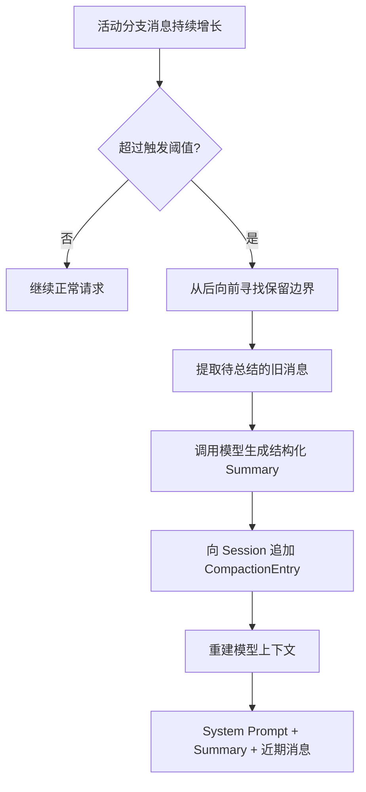

# Pi Agent 深度探索（四）：Session、分支、恢复与 Compaction

> [!info] 源码基线
> 本文校验于 2026-06-12，基于 `earendil-works/pi` 的 `main` 分支提交
> `1da903983ad72c60995507e813a00bb2bd6faf09`，主要涉及
> `pi-coding-agent` 的 Session 与 Compaction 实现。

## 先区分三个概念

讨论 Agent “记忆”时，最容易把三种东西混在一起：

| 概念         | 它是什么                           | 是否等于另外两者 |
| ------------ | ---------------------------------- | ---------------- |
| Session 文件 | 持久化的 JSONL 事件与树结构        | 否               |
| 当前活动分支 | Session 树中从根到当前 leaf 的路径 | 否               |
| 模型上下文   | 本次请求真正发送给 LLM 的消息集合  | 否               |

一个 Session 文件可以包含多个分支；当前只选择其中一条活动路径。活动路径仍可能很长，因此
Pi 会把旧内容压缩成 Summary，再把 Summary 与近期消息发送给模型。

## Session 如何保存

Pi 默认自动保存到：

```text
~/.pi/agent/sessions/
```

Session 按工作目录组织，每个 Session 是一个 JSONL 文件。JSONL 的每一行是一条独立记录，
常见内容包括：

- 用户、Assistant 和 Tool Result 消息；
- 模型和 thinking level 变化；
- 标签；
- Compaction 记录；
- Branch Summary；
- Extension 自定义记录。

它不是简单的线性聊天记录。每条树节点记录 `id` 与 `parentId`，当前 leaf 决定活动分支。

来源：

- [Sessions](https://github.com/earendil-works/pi/blob/1da903983ad72c60995507e813a00bb2bd6faf09/packages/coding-agent/docs/sessions.md)
- [Session Format](https://github.com/earendil-works/pi/blob/1da903983ad72c60995507e813a00bb2bd6faf09/packages/coding-agent/docs/session-format.md)

## 创建、恢复与临时会话

### 默认创建

```bash
pi
```

Pi 启动后会创建或使用 Session，并随着交互自动追加记录。

### 继续最近 Session

```bash
pi -c
```

### 浏览历史 Session

```bash
pi -r
```

或在交互模式中：

```text
/resume
```

### 打开指定 Session

```bash
pi --session <path-or-id>
```

### 不保存

```bash
pi --no-session
```

这适合一次性或敏感任务，但“不保存 Session”不表示模型请求、Shell 历史、Provider 日志或
工具产生的文件也不会留下记录。

### 命名

```bash
pi --name "Refactor auth module"
```

交互中可执行：

```text
/name Refactor auth module
```

有意义的名称比依赖第一条 Prompt 更容易在 `/resume` 中找到。

## Session 树而不是单一时间线

假设初始路径是：

```text
用户：重构认证模块
└─ Assistant：提出方案 A
   └─ 用户：实施方案 A
      └─ Assistant：修改并测试
```

后来你返回“提出方案 A”之前，改为尝试方案 B：

```text
用户：重构认证模块
└─ Assistant：提出方案 A
   ├─ 用户：实施方案 A
   │  └─ Assistant：修改并测试
   └─ 用户：改用方案 B
      └─ Assistant：开始另一条路径  <- active leaf
```

旧路径不会因为切换分支而从 Session 文件中消失。活动分支变化只决定后续上下文从哪条路径构建。

## `/tree`、`/fork` 与 `/clone`

| 操作     | 是否创建新文件 | 起点                    | 适合用途                 |
| -------- | -------------- | ----------------------- | ------------------------ |
| `/tree`  | 否             | 当前 Session 中任意节点 | 在同一任务中探索替代路径 |
| `/fork`  | 是             | 选定的历史用户消息      | 从旧问题创建独立 Session |
| `/clone` | 是             | 当前活动分支            | 复制当前状态后独立继续   |

### `/tree`

选择用户消息时，Pi 会把 leaf 移到该消息的父节点，并把原消息放回 Editor，允许修改后重新提交。
选择 Assistant、Tool、Compaction 等非用户节点时，leaf 移到该节点，Editor 保持为空。

### `/fork`

从一个历史用户消息创建新的 Session 文件。原 Session 保持不变。

### `/clone`

把当前活动分支复制到新的 Session 文件。它不复制原 Session 中未位于活动分支上的其他路径。

## Branch Summary

当 `/tree` 从一条分支切换到另一条分支时，Pi 可以总结即将离开的路径，把重要信息附加到
目标位置。

例如：

```text
        B -> C -> D  旧路径
       /
A ----
       \
        E -> F       目标路径
```

从 `D` 切到 `F` 时，Pi 找到共同祖先 `A`，总结 `B/C/D`，并把 Branch Summary 作为记录
保存在新位置附近。这样新路径可以获得“旧路径做过什么”的压缩信息，而不用重放整条旧分支。

Branch Summary 是可选的，而且 Summary 本身可能遗漏细节。关键决定仍应写进项目文件、
测试或提交，而不是只依赖模型生成的摘要。

## 为什么需要 Compaction

LLM 的 Context Window 有上限。随着对话、源码和工具输出增加，活动分支最终无法完整放进
下一次模型请求。

Pi 的 Compaction 不会重写或删除旧 Session 记录，而是追加一条 Summary 记录，并在后续
请求中使用：

```text
System Prompt
+ Compaction Summary
+ 近期保留消息
```

原始历史仍在 Session 文件中，但不再全部发送给模型。

## 自动触发条件

当前实现使用：

```text
contextTokens > contextWindow - reserveTokens
```

当前默认：

```text
reserveTokens = 16384
keepRecentTokens = 20000
```

`reserveTokens` 为下一次模型输出和工具循环保留空间；`keepRecentTokens` 用于决定压缩时保留
多少近期内容。它们可以在设置中调整，但不应简单地设得越小越好。

来源：[Compaction 文档](https://github.com/earendil-works/pi/blob/1da903983ad72c60995507e813a00bb2bd6faf09/packages/coding-agent/docs/compaction.md)。

## 一次 Compaction 的数据流



`CompactionEntry` 会保存：

- Summary；
- `firstKeptEntryId`；
- 压缩前 Token 数；
- 可选的实现细节，例如累计读过和修改过的文件。

## 手动 Compaction

交互模式：

```text
/compact
```

也可以给 Summary 增加关注点：

```text
/compact 保留失败测试、已修改文件和下一步排障计划
```

适合手动触发的时机：

- 长任务已经完成一个明确阶段；
- 工具输出非常多，但有效结论已经稳定；
- 准备从调查转向实现；
- 上下文还没溢出，但已经出现明显噪声。

不适合在尚未提取关键证据时过早压缩，因为摘要可能丢失原始错误文本、精确参数或调用顺序。

## Split Turn

通常 Compaction 在完整 Turn 边界切分。一个 Turn 从用户消息开始，包含后续 Assistant
响应和工具调用，直到下一条用户消息。

如果单个 Turn 自身已经超过 `keepRecentTokens`，切分点可能落在该 Turn 内部。Pi 会分别处理：

- 更早的历史；
- 超长 Turn 的前半部分；
- 保留的后半部分。

这样可以避免因为一个巨大工具结果或长循环而无法压缩，但生成的 Summary 仍然是有损表示。

## Compaction 不是什么

### 不是删除历史

原始记录仍保存在 Session JSONL 中。

### 不是长期知识库

Summary 服务于当前任务连续性，不替代项目文档、ADR、测试和提交记录。

### 不是精确重放

模型生成的 Summary 可能省略细节。需要精确证据时，应回到原始 Session、工具输出或代码。

### 不是无限上下文

反复压缩会让更早信息经历多轮摘要。越早的细节越可能被概括或丢失。

## 实用工作流

```text
开始任务
  -> 用 /name 设置可搜索名称
  -> 关键阶段形成 Git 提交或项目文档
  -> 探索替代方案时使用 /tree
  -> 需要独立生命周期时使用 /fork 或 /clone
  -> 阶段结束时用带关注点的 /compact
  -> 用 /session 检查当前文件、Token 和 Cost
```

把关键状态写进仓库，比完全依赖 Agent 会话更可靠。

## 本章小结

Session 是持久化树，活动分支是当前选择的路径，模型上下文是从该路径重新构建的请求输入。
Compaction 通过 Summary 替代旧消息进入模型上下文，但不删除 Session 原始记录。
理解这三层后，才能正确判断“恢复了会话”是否等于“模型仍看到了全部历史”。

下一章：[[2026-06-12-pi-agent-deep-dive-ch05-monorepo-architecture|Monorepo 全景与四个核心包]]
